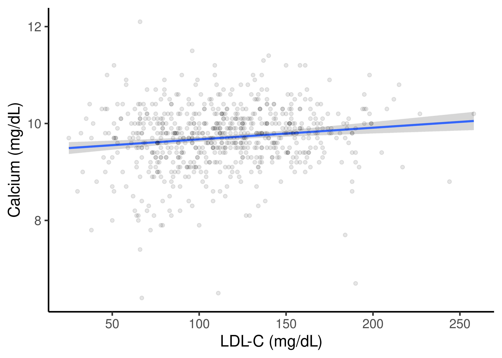
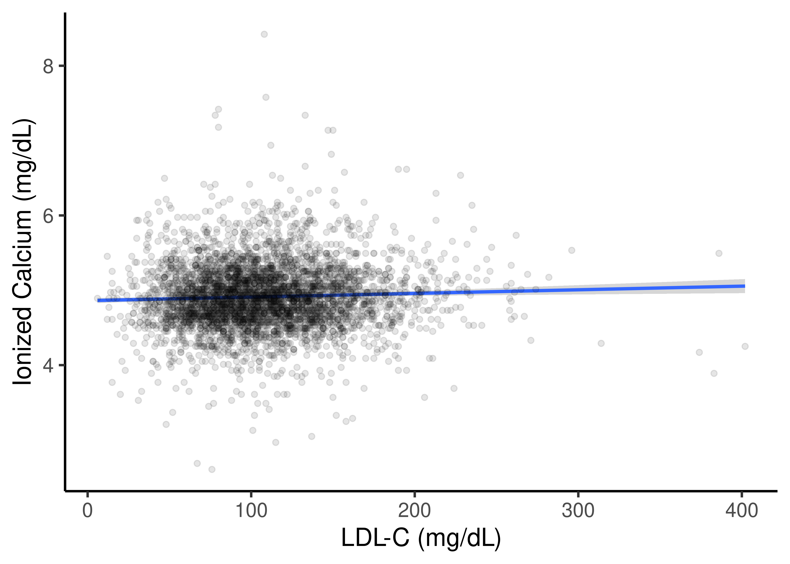
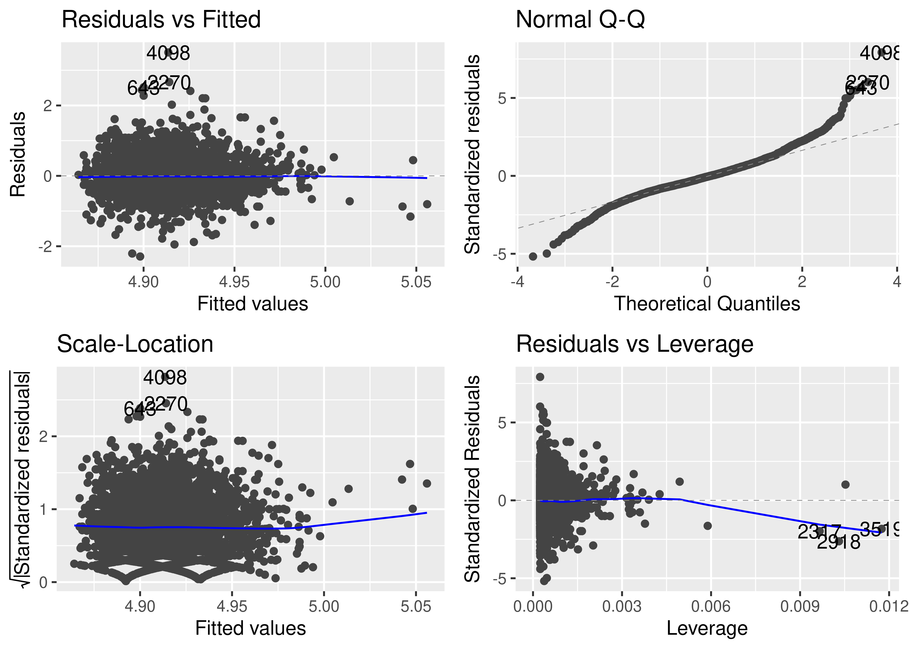
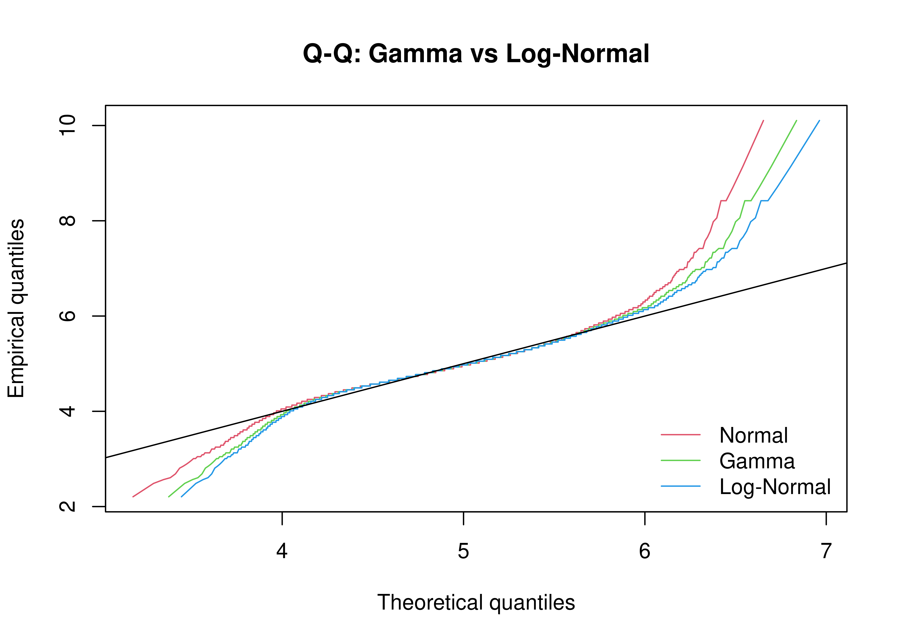
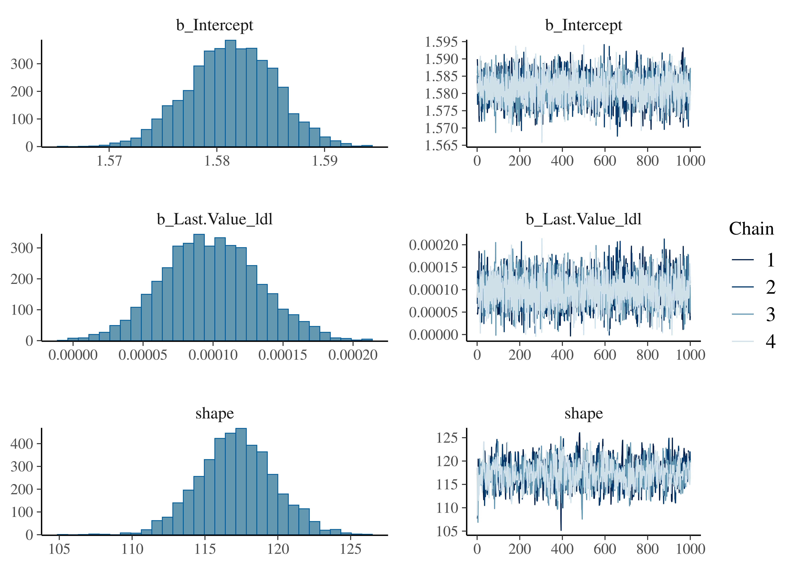
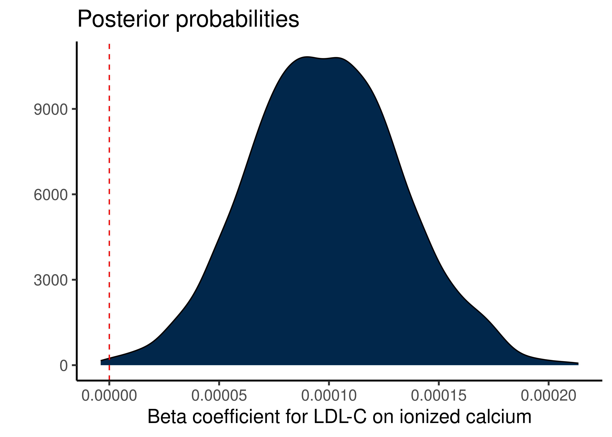
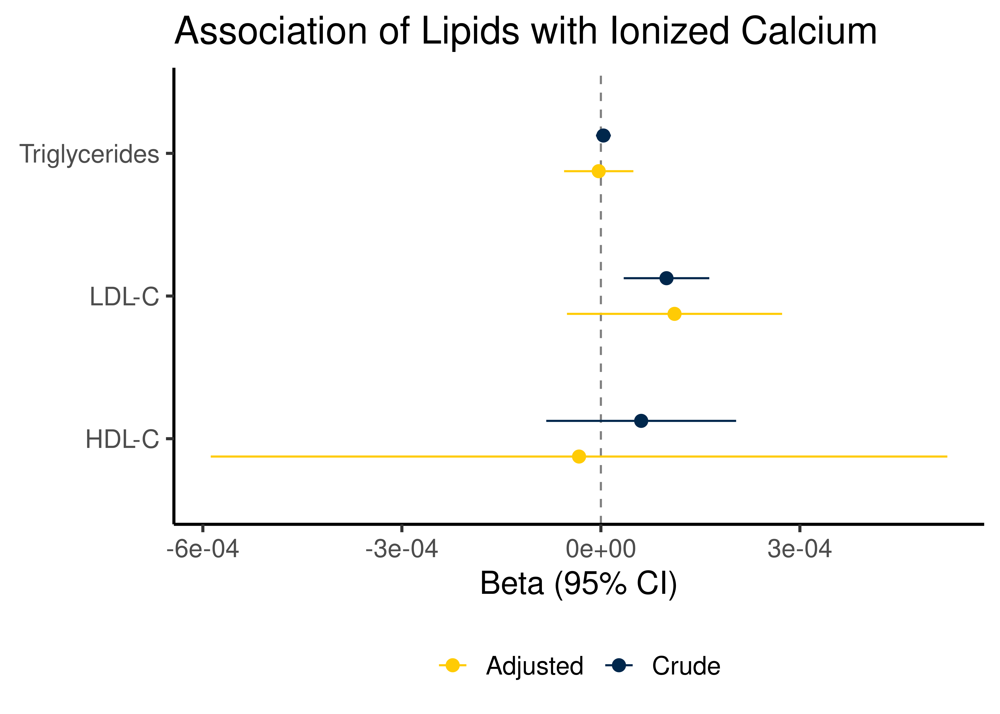

::: {.cell}

```{.r .cell-code}
# hide this code chunk
#| echo: false
#| message: false

# defines the se function
se <- function(x) {
  sd(x, na.rm = TRUE) / sqrt(length(x))
}

#load these packages, nearly always needed
library(tidyverse)
library(knitr)
library(broom)

# sets maize and blue color scheme
color_scheme <- c("#00274c", "#ffcb05")
```
:::


## Purpose

Assess correlations between serum calcium and cholesterol/LDL/HDL/TG in MGI participants

## Raw Data

Describe your raw data files, including what the columns mean (and what units they are in).


::: {.cell}

```{.r .cell-code}
library(readr) #loads the readr package
labs.filename <- "combined_data/LabResultsCleaned.csv" #input file(s)

#this loads whatever the file is into a dataframe called exp.data if it exists

lab.data <- read_csv(labs.filename)
```
:::


These data can be found in /nfs/turbo/precision-health/DataDirect/HUM00268448 - The Interrelationships Between Blood/Cholesterol and Outcomes/2026-03-23 in a file named no file found.  This input file was most recently updated on unknown.  This script was most recently updated on Thu Mar 26 11:30:25 2026.

There are 50091 participants in this dataset with lab values.

## Analysis


::: {.cell}

```{.r .cell-code}
serum.calcium.data <- lab.data |>
  filter(test_name=="Serum Calcium")

ionized.calcium.data <- lab.data |>
  filter(test_name == "Ionized Calcium")

cholesterol.data <- lab.data |>
  filter(test_name == "Total Cholesterol")

ldl.data <- lab.data |>
  filter(test_name == "LDL-C") 

hdl.data <- lab.data |>
  filter(test_name == "HDL-C") 

tg.data <- lab.data |>
  filter(test_name == "Triglycerides") 
```
:::


There are 

- 4009 participants in this dataset with serum calcium values.
- 20089 participants in this dataset with ionized calcium values.
- 12885 participants in this dataset with cholesterol values.
- 23406 participants in this dataset with LDL-C values.
- 23406 participants in this dataset with HDL-C values.
- 23406 participants in this dataset with triglyceride values.

Calculated the most recent value for each participant


::: {.cell}

```{.r .cell-code}
ldl.final.data <-
  ldl.data |>
  arrange(DeID_COLLECTION_DATE) |>
  group_by(DeID_PatientID) |>
  summarize(Last.Value = last(as.numeric(value)),
            Age = last(AgeInYears))

cholesterol.final.data <-
  cholesterol.data |>
  arrange(DeID_COLLECTION_DATE) |>
  group_by(DeID_PatientID) |>
  summarize(Last.Value = last(as.numeric(value)),
            Age = last(AgeInYears))

hdl.final.data <-
  hdl.data |>
  arrange(DeID_COLLECTION_DATE) |>
  group_by(DeID_PatientID) |>
  summarize(Last.Value = last(as.numeric(value)),
            Age = last(AgeInYears))

tg.final.data <-
  tg.data |>
  arrange(DeID_COLLECTION_DATE) |>
  group_by(DeID_PatientID) |>
  summarize(Last.Value = last(as.numeric(value)),
            Age = last(AgeInYears))

serum.calcium.final.data <-
  serum.calcium.data |>
  arrange(DeID_COLLECTION_DATE) |>
  group_by(DeID_PatientID) |>
  summarize(Last.Value = last(value),
            Age = last(AgeInYears))

ionized.calcium.final.data <-
  ionized.calcium.data |>
  arrange(DeID_COLLECTION_DATE) |>
  group_by(DeID_PatientID) |>
  summarize(Last.Value = last(value),
            Age = last(AgeInYears))
```
:::

::: {.cell}

```{.r .cell-code}
ca.ldl.final.data <-
  inner_join(serum.calcium.final.data,ldl.final.data,  by="DeID_PatientID", suffix=c("_ca","_ldl"))

library(ggplot2)

ggplot(ca.ldl.final.data,
       aes(y=Last.Value_ca,
           x=Last.Value_ldl)) +
  geom_smooth(method="lm") +
  geom_point(alpha=0.1) +
  theme_classic(base_size=16) +
  labs(y="Calcium (mg/dL)",
       x="LDL-C (mg/dL)")
```

::: {.cell-output-display}
{width=2100}
:::

```{.r .cell-code}
lm(Last.Value_ca~Last.Value_ldl, data=ca.ldl.final.data) |>
  tidy() |>
  kable()
```

::: {.cell-output-display}


|term           |  estimate| std.error|  statistic|   p.value|
|:--------------|---------:|---------:|----------:|---------:|
|(Intercept)    | 9.4333481| 0.0771642| 122.250328| 0.0000000|
|Last.Value_ldl | 0.0023991| 0.0006421|   3.736218| 0.0002024|


:::

```{.r .cell-code}
#for ionized calcium
ionized.ca.ldl.final.data <-
  inner_join(ionized.calcium.final.data,ldl.final.data,  by="DeID_PatientID", suffix=c("_ca","_ldl"))


ggplot(ionized.ca.ldl.final.data,
       aes(y=Last.Value_ca,
           x=Last.Value_ldl)) +
  geom_smooth(method="lm") +
  geom_point(alpha=0.1) +
  theme_classic(base_size=16) +
  labs(y="Ionized Calcium (mg/dL)",
       x="LDL-C (mg/dL)")
```

::: {.cell-output-display}
{width=2100}
:::

```{.r .cell-code}
ionized.lm.crude <- lm(Last.Value_ca~Last.Value_ldl, data=ionized.ca.ldl.final.data) 

ionized.lm.crude |>  
  tidy() |>
  kable()
```

::: {.cell-output-display}


|term           |  estimate| std.error|  statistic|  p.value|
|:--------------|---------:|---------:|----------:|--------:|
|(Intercept)    | 4.8613094| 0.0187840| 258.799967| 0.000000|
|Last.Value_ldl | 0.0004842| 0.0001617|   2.994724| 0.002763|


:::

```{.r .cell-code}
library(lindia)
library(ggfortify)
autoplot(ionized.lm.crude)
```

::: {.cell-output-display}
{width=2100}
:::
:::


#### Selecting an Appropriate Distribution for Ionized Calcium

Due to the poor model fit with a gaussian distribution, checked several other options for modelling calcium


::: {.cell}

```{.r .cell-code}
library(fitdistrplus)
library(gamlss) #for generalized gamma
library(gamlss.dist)

# Fit individual distributions
fit_norm  <- fitdist(ionized.calcium.final.data$Last.Value, "norm")
fit_gamma  <- fitdist(ionized.calcium.final.data$Last.Value, "gamma")
fit_lnorm  <- fitdist(ionized.calcium.final.data$Last.Value, "lnorm")
fit_weibull <- fitdist(ionized.calcium.final.data$Last.Value, "weibull")

gofstat(list(fit_norm, fit_gamma, fit_lnorm, fit_weibull),
        fitnames = c("Normal", "Gamma", "Log-Normal", "Weibull"))
```

::: {.cell-output .cell-output-stdout}

```
Goodness-of-fit statistics
                                  Normal       Gamma  Log-Normal     Weibull
Kolmogorov-Smirnov statistic  0.06674399  0.05705823  0.05743478   0.1600181
Cramer-von Mises statistic   22.37439155 17.20597809 16.14380777 156.1878255
Anderson-Darling statistic           Inf         Inf         Inf         Inf

Goodness-of-fit criteria
                                 Normal    Gamma Log-Normal  Weibull
Akaike's Information Criterion 22962.36 22618.46   22618.94 30795.91
Bayesian Information Criterion 22978.17 22634.28   22634.76 30811.72
```


:::

```{.r .cell-code}
qqcomp(list(fit_norm, fit_gamma, fit_lnorm), 
       legendtext = c("Normal", "Gamma", "Log-Normal"),
       main = "Q-Q: Gamma vs Log-Normal")
```

::: {.cell-output-display}
{width=2100}
:::
:::


### Crude Association

Based on these data I should use a Gamma distribution for further modelling.  The Gamma Beta distribution was a better fit, but did not converge with my data


::: {.cell}

```{.r .cell-code}
ionized.glm.crude <- glm(Last.Value_ca ~ Last.Value_ldl, data=ionized.ca.ldl.final.data, 
                            family=Gamma(link="log"))  

ionized.glm.crude |>  
  tidy(conf.int = T) |>
  kable(caption="GLM for LDL-C on Ionized Calcium (Gamma Distribution)")
```

::: {.cell-output-display}


Table: GLM for LDL-C on Ionized Calcium (Gamma Distribution)

|term           |  estimate| std.error|  statistic|   p.value|  conf.low| conf.high|
|:--------------|---------:|---------:|----------:|---------:|---------:|---------:|
|(Intercept)    | 1.5813173| 0.0038225| 413.690560| 0.0000000| 1.5738090| 1.5888278|
|Last.Value_ldl | 0.0000989| 0.0000329|   3.005959| 0.0026631| 0.0000343| 0.0001636|


:::
:::


##### Bayesian Analysis for Crude Association


::: {.cell}

```{.r .cell-code}
library(brms)
library(broom.mixed)

ionized.priors <- c(
  prior(normal(0, 0.01),   class = b, coef=Last.Value_ldl),          # predictor coefficients
  prior(normal(1, 0.5), class = Intercept),  # log-scale intercept
  prior(exponential(1), class = shape)       # shape must be positive
)


ionized.brm.crude <- brm(Last.Value_ca ~ Last.Value_ldl, 
           data = ionized.ca.ldl.final.data, 
           family = Gamma(link="log"),
           prior = ionized.priors)
```

::: {.cell-output .cell-output-stdout}

```

SAMPLING FOR MODEL 'anon_model' NOW (CHAIN 1).
Chain 1: 
Chain 1: Gradient evaluation took 0.001414 seconds
Chain 1: 1000 transitions using 10 leapfrog steps per transition would take 14.14 seconds.
Chain 1: Adjust your expectations accordingly!
Chain 1: 
Chain 1: 
Chain 1: Iteration:    1 / 2000 [  0%]  (Warmup)
Chain 1: Iteration:  200 / 2000 [ 10%]  (Warmup)
Chain 1: Iteration:  400 / 2000 [ 20%]  (Warmup)
Chain 1: Iteration:  600 / 2000 [ 30%]  (Warmup)
Chain 1: Iteration:  800 / 2000 [ 40%]  (Warmup)
Chain 1: Iteration: 1000 / 2000 [ 50%]  (Warmup)
Chain 1: Iteration: 1001 / 2000 [ 50%]  (Sampling)
Chain 1: Iteration: 1200 / 2000 [ 60%]  (Sampling)
Chain 1: Iteration: 1400 / 2000 [ 70%]  (Sampling)
Chain 1: Iteration: 1600 / 2000 [ 80%]  (Sampling)
Chain 1: Iteration: 1800 / 2000 [ 90%]  (Sampling)
Chain 1: Iteration: 2000 / 2000 [100%]  (Sampling)
Chain 1: 
Chain 1:  Elapsed Time: 61.215 seconds (Warm-up)
Chain 1:                12.486 seconds (Sampling)
Chain 1:                73.701 seconds (Total)
Chain 1: 

SAMPLING FOR MODEL 'anon_model' NOW (CHAIN 2).
Chain 2: 
Chain 2: Gradient evaluation took 0.000621 seconds
Chain 2: 1000 transitions using 10 leapfrog steps per transition would take 6.21 seconds.
Chain 2: Adjust your expectations accordingly!
Chain 2: 
Chain 2: 
Chain 2: Iteration:    1 / 2000 [  0%]  (Warmup)
Chain 2: Iteration:  200 / 2000 [ 10%]  (Warmup)
Chain 2: Iteration:  400 / 2000 [ 20%]  (Warmup)
Chain 2: Iteration:  600 / 2000 [ 30%]  (Warmup)
Chain 2: Iteration:  800 / 2000 [ 40%]  (Warmup)
Chain 2: Iteration: 1000 / 2000 [ 50%]  (Warmup)
Chain 2: Iteration: 1001 / 2000 [ 50%]  (Sampling)
Chain 2: Iteration: 1200 / 2000 [ 60%]  (Sampling)
Chain 2: Iteration: 1400 / 2000 [ 70%]  (Sampling)
Chain 2: Iteration: 1600 / 2000 [ 80%]  (Sampling)
Chain 2: Iteration: 1800 / 2000 [ 90%]  (Sampling)
Chain 2: Iteration: 2000 / 2000 [100%]  (Sampling)
Chain 2: 
Chain 2:  Elapsed Time: 19.143 seconds (Warm-up)
Chain 2:                66.129 seconds (Sampling)
Chain 2:                85.272 seconds (Total)
Chain 2: 

SAMPLING FOR MODEL 'anon_model' NOW (CHAIN 3).
Chain 3: 
Chain 3: Gradient evaluation took 0.000628 seconds
Chain 3: 1000 transitions using 10 leapfrog steps per transition would take 6.28 seconds.
Chain 3: Adjust your expectations accordingly!
Chain 3: 
Chain 3: 
Chain 3: Iteration:    1 / 2000 [  0%]  (Warmup)
Chain 3: Iteration:  200 / 2000 [ 10%]  (Warmup)
Chain 3: Iteration:  400 / 2000 [ 20%]  (Warmup)
Chain 3: Iteration:  600 / 2000 [ 30%]  (Warmup)
Chain 3: Iteration:  800 / 2000 [ 40%]  (Warmup)
Chain 3: Iteration: 1000 / 2000 [ 50%]  (Warmup)
Chain 3: Iteration: 1001 / 2000 [ 50%]  (Sampling)
Chain 3: Iteration: 1200 / 2000 [ 60%]  (Sampling)
Chain 3: Iteration: 1400 / 2000 [ 70%]  (Sampling)
Chain 3: Iteration: 1600 / 2000 [ 80%]  (Sampling)
Chain 3: Iteration: 1800 / 2000 [ 90%]  (Sampling)
Chain 3: Iteration: 2000 / 2000 [100%]  (Sampling)
Chain 3: 
Chain 3:  Elapsed Time: 12.104 seconds (Warm-up)
Chain 3:                20.438 seconds (Sampling)
Chain 3:                32.542 seconds (Total)
Chain 3: 

SAMPLING FOR MODEL 'anon_model' NOW (CHAIN 4).
Chain 4: 
Chain 4: Gradient evaluation took 0.000628 seconds
Chain 4: 1000 transitions using 10 leapfrog steps per transition would take 6.28 seconds.
Chain 4: Adjust your expectations accordingly!
Chain 4: 
Chain 4: 
Chain 4: Iteration:    1 / 2000 [  0%]  (Warmup)
Chain 4: Iteration:  200 / 2000 [ 10%]  (Warmup)
Chain 4: Iteration:  400 / 2000 [ 20%]  (Warmup)
Chain 4: Iteration:  600 / 2000 [ 30%]  (Warmup)
Chain 4: Iteration:  800 / 2000 [ 40%]  (Warmup)
Chain 4: Iteration: 1000 / 2000 [ 50%]  (Warmup)
Chain 4: Iteration: 1001 / 2000 [ 50%]  (Sampling)
Chain 4: Iteration: 1200 / 2000 [ 60%]  (Sampling)
Chain 4: Iteration: 1400 / 2000 [ 70%]  (Sampling)
Chain 4: Iteration: 1600 / 2000 [ 80%]  (Sampling)
Chain 4: Iteration: 1800 / 2000 [ 90%]  (Sampling)
Chain 4: Iteration: 2000 / 2000 [100%]  (Sampling)
Chain 4: 
Chain 4:  Elapsed Time: 61.769 seconds (Warm-up)
Chain 4:                13.277 seconds (Sampling)
Chain 4:                75.046 seconds (Total)
Chain 4: 
```


:::

```{.r .cell-code}
prior_summary(ionized.brm.crude) %>% kable(caption="Prior summary for ionized calcium - LDL-C bayesian fit")
```

::: {.cell-output-display}


Table: Prior summary for ionized calcium - LDL-C bayesian fit

|prior           |class     |coef           |group |resp |dpar |nlpar |lb |ub |source  |
|:---------------|:---------|:--------------|:-----|:----|:----|:-----|:--|:--|:-------|
|                |b         |               |      |     |     |      |   |   |default |
|normal(0, 0.01) |b         |Last.Value_ldl |      |     |     |      |   |   |user    |
|normal(1, 0.5)  |Intercept |               |      |     |     |      |   |   |user    |
|exponential(1)  |shape     |               |      |     |     |      |0  |   |user    |


:::

```{.r .cell-code}
tidy(ionized.brm.crude) %>% kable(caption="Summary of model fit for ionized calcium - LDL-C bayesian fit")
```

::: {.cell-output-display}


Table: Summary of model fit for ionized calcium - LDL-C bayesian fit

|effect |component |group |term           |  estimate| std.error|  conf.low| conf.high|
|:------|:---------|:-----|:--------------|---------:|---------:|---------:|---------:|
|fixed  |cond      |NA    |(Intercept)    | 1.5813720| 0.0040199| 1.5734243| 1.5890286|
|fixed  |cond      |NA    |Last.Value_ldl | 0.0000986| 0.0000345| 0.0000319| 0.0001684|


:::

```{.r .cell-code}
plot(ionized.brm.crude)
```

::: {.cell-output-display}
{width=2100}
:::

```{.r .cell-code}
hypothesis(ionized.brm.crude, "Last.Value_ldl>0") # testing for whether there is a beta coefficient greater than zero
```

::: {.cell-output .cell-output-stdout}

```
Hypothesis Tests for class b:
            Hypothesis Estimate Est.Error CI.Lower CI.Upper Evid.Ratio
1 (Last.Value_ldl) > 0        0         0        0        0     665.67
  Post.Prob Star
1         1    *
---
'CI': 90%-CI for one-sided and 95%-CI for two-sided hypotheses.
'*': For one-sided hypotheses, the posterior probability exceeds 95%;
for two-sided hypotheses, the value tested against lies outside the 95%-CI.
Posterior probabilities of point hypotheses assume equal prior probabilities.
```


:::

```{.r .cell-code}
as_draws_df(ionized.brm.crude) %>%
  ggplot(aes(x=b_Last.Value_ldl)) +
  geom_density(fill=color_scheme[1]) +
  geom_vline(xintercept=0,color="red",lty=2) +
  labs(y="",
       x="Beta coefficient for LDL-C on ionized calcium",
       title="Posterior probabilities") +
  theme_classic(base_size=16)
```

::: {.cell-output-display}
{width=2100}
:::
:::


### Interpretation Notes

- The Q-Q plot still shows heavy tails, particularly the upper tail with observations 192, 943, 980 appearing as extreme outliers. This suggests the Gamma may still not be fully capturing the tail behavior, though it's likely better than the Gaussian was
- Observations 192 and 1343 are consistently flagged across all four panels — these are your most influential points and worth pulling out to inspect clinically. Are they plausible values or potential data quality issues?

### Multivariable Analyses


::: {.cell}

```{.r .cell-code}
demographic.file <- 'combined_data/DemographicInfo.csv'
ancestry.file <- 'combined_data/MGI_Ancestry.csv'

demographic.data <- read_csv(demographic.file) 
ancestry.data <- read_csv(ancestry.file)|>
  mutate(MajorityAncestry = relevel(as.factor(MajorityAncestry),ref="EUR"))
  
age.breaks <- c(0, 18, 45, 55, 65, 75, Inf)
age.labels <- c("<18", "18-44", "45-54", "55-64", "65-74", "75+")

ionized.ca.ldl.final.data.annot <-
  ionized.ca.ldl.final.data |>
  left_join(demographic.data, by="DeID_PatientID") |>
  left_join(ancestry.data, by="DeID_PatientID") |>
  mutate(Age.Group = cut(Age_ldl, breaks = age.breaks, labels = age.labels, right = FALSE))

#stepwise modeling
m1 <- glm(Last.Value_ca ~ Last.Value_ldl, data=ionized.ca.ldl.final.data.annot, family=Gamma(link="log"))
m5 <- glm(Last.Value_ca ~ Last.Value_ldl+GenderCode+Age_ca+MajorityAncestry, data=ionized.ca.ldl.final.data.annot, family=Gamma(link="log"))

m5 |>
  anova() |>
  tidy () |>
  kable(caption="ANOVA for GLM adjusting for age, gender and ancestry")
```

::: {.cell-output-display}


Table: ANOVA for GLM adjusting for age, gender and ancestry

|term             | df|  deviance| df.residual| residual.deviance| statistic|   p.value|
|:----------------|--:|---------:|-----------:|-----------------:|---------:|---------:|
|NULL             | NA|        NA|         860|          7.177969|        NA|        NA|
|Last.Value_ldl   |  1| 0.0540324|         859|          7.123936|  6.492045| 0.0110104|
|GenderCode       |  1| 0.0559769|         858|          7.067959|  6.725679| 0.0096665|
|Age_ca           |  1| 0.0150642|         857|          7.052895|  1.809979| 0.1788687|
|MajorityAncestry |  5| 0.0475500|         852|          7.005345|  1.142635| 0.3360824|


:::

```{.r .cell-code}
m5 |>
  tidy(conf.int=T) |>
  kable(caption="Multivariable GLM adjusting for age, gender and ancestry")
```

::: {.cell-output-display}


Table: Multivariable GLM adjusting for age, gender and ancestry

|term                |   estimate| std.error|  statistic|   p.value|   conf.low|  conf.high|
|:-------------------|----------:|---------:|----------:|---------:|----------:|----------:|
|(Intercept)         |  1.6087197| 0.0176230| 91.2852267| 0.0000000|  1.5742080|  1.6432792|
|Last.Value_ldl      |  0.0001307| 0.0000804|  1.6258229| 0.1043571| -0.0000263|  0.0002880|
|GenderCodeM         | -0.0184319| 0.0063992| -2.8803224| 0.0040723| -0.0309757| -0.0058883|
|Age_ca              | -0.0003046| 0.0002227| -1.3677527| 0.1717501| -0.0007419|  0.0001325|
|MajorityAncestryAFR | -0.0180084| 0.0117234| -1.5361092| 0.1248828| -0.0409311|  0.0050568|
|MajorityAncestryAMR |  0.0532422| 0.0375576|  1.4176132| 0.1566693| -0.0195552|  0.1277869|
|MajorityAncestryCSA |  0.0205878| 0.0290602|  0.7084543| 0.4788569| -0.0358542|  0.0780815|
|MajorityAncestryEAS | -0.0083624| 0.0194543| -0.4298487| 0.6674144| -0.0462565|  0.0299756|
|MajorityAncestryWAS |  0.0208042| 0.0291182|  0.7144743| 0.4751296| -0.0357679|  0.0784233|


:::

```{.r .cell-code}
library(effectsize)
omega_squared(m5, partial = TRUE, ci = 0.95, alternative = "two.sided") 
```

::: {.cell-output .cell-output-stdout}

```
# Effect Size for ANOVA (Type I)

Parameter        | Omega2 (partial) |       95% CI
--------------------------------------------------
Last.Value_ldl   |         6.42e-03 | [0.00, 0.02]
GenderCode       |         6.59e-03 | [0.00, 0.02]
Age_ca           |         8.87e-04 | [0.00, 0.01]
MajorityAncestry |         8.49e-04 | [0.00, 0.00]
```


:::

```{.r .cell-code}
library(performance)
r2(m5)  # returns several R² variants - Nagelkerke is most commonly reported
```

::: {.cell-output .cell-output-stdout}

```
# R2 for Generalized Linear Regression
  Nagelkerke's R2: 0.024
```


:::
:::


## Summary of All Lipid Associations with Ionized Calcium


::: {.cell}

```{.r .cell-code}
combined.data <- ionized.calcium.final.data |>
  left_join(ldl.final.data,         by = "DeID_PatientID", suffix = c("_ca", "_ldl")) |>
  left_join(cholesterol.final.data,  by = "DeID_PatientID", suffix = c("", "_chol")) |>
  left_join(hdl.final.data,          by = "DeID_PatientID", suffix = c("", "_hdl")) |>
  left_join(tg.final.data,           by = "DeID_PatientID", suffix = c("", "_tg"))|>
  left_join(demographic.data, by="DeID_PatientID") |>
  left_join(ancestry.data, by="DeID_PatientID") |>
  mutate(Age.Group = cut(Age_ldl, breaks = age.breaks, labels = age.labels, right = FALSE))


library(broom)

# define predictors and adjustment covariates
predictors <- c("Last.Value_ldl", "Last.Value_hdl", "Last.Value_tg") #not enough data for Last.Value_chol
covariates <- "GenderCode + MajorityAncestry + Age.Group"

# function to run both models and extract results
run_models <- function(predictor, data) {
  
  crude.formula    <- as.formula(paste("Last.Value_ca ~", predictor))
  adjusted.formula <- as.formula(paste("Last.Value_ca ~", predictor, "+", covariates))
  
  crude.model    <- glm(crude.formula,    data = data, family = Gamma(link = "log"))
  adjusted.model <- glm(adjusted.formula, data = data, family = Gamma(link = "log"))
  
  crude.est    <- tidy(crude.model)    |> filter(term == predictor)
  adjusted.est <- tidy(adjusted.model) |> filter(term == predictor)
  
  tibble(
    Predictor       = predictor,
    Crude.Beta      = crude.est$estimate,
    Crude.SE        = crude.est$std.error,
    Crude.P         = crude.est$p.value,
    Adjusted.Beta   = adjusted.est$estimate,
    Adjusted.SE     = adjusted.est$std.error,
    Adjusted.P      = adjusted.est$p.value
  )
}

results <- map_dfr(predictors, run_models, data = combined.data)
kable(results, caption="Summary of glm's for each lipid as a predictor of ionized calcium")
```

::: {.cell-output-display}


Table: Summary of glm's for each lipid as a predictor of ionized calcium

|Predictor      | Crude.Beta| Crude.SE|   Crude.P| Adjusted.Beta| Adjusted.SE| Adjusted.P|
|:--------------|----------:|--------:|---------:|-------------:|-----------:|----------:|
|Last.Value_ldl |   9.89e-05| 3.29e-05| 0.0026631|      1.11e-04|   0.0000827|  0.1799811|
|Last.Value_hdl |   6.08e-05| 7.30e-05| 0.4054102|     -3.29e-05|   0.0002833|  0.9077095|
|Last.Value_tg  |   3.80e-06| 5.70e-06| 0.5034662|     -3.20e-06|   0.0000267|  0.9032939|


:::

```{.r .cell-code}
 library(ggplot2)

results |>
  mutate(
    Crude.CI.low    = Crude.Beta    - 1.96 * Crude.SE,
    Crude.CI.high   = Crude.Beta    + 1.96 * Crude.SE,
    Adjusted.CI.low  = Adjusted.Beta - 1.96 * Adjusted.SE,
    Adjusted.CI.high = Adjusted.Beta + 1.96 * Adjusted.SE,
    Predictor = recode(Predictor,
      "Last.Value_ldl"  = "LDL-C",
      "Last.Value_chol" = "Total Cholesterol",
      "Last.Value_hdl"  = "HDL-C",
      "Last.Value_tg"   = "Triglycerides")
  ) |>
  pivot_longer(
    cols = c(Crude.Beta, Adjusted.Beta),
    names_to = "Model",
    values_to = "Beta"
  ) |>
  mutate(
    CI.low  = if_else(Model == "Crude.Beta", Crude.CI.low,  Adjusted.CI.low),
    CI.high = if_else(Model == "Crude.Beta", Crude.CI.high, Adjusted.CI.high),
    Model   = recode(Model, "Crude.Beta" = "Crude", "Adjusted.Beta" = "Adjusted")
  ) |>
  ggplot(aes(x = Beta, y = Predictor, color = Model)) +
  geom_vline(xintercept = 0, linetype = "dashed", color = "grey50") +
  geom_pointrange(aes(xmin = CI.low, xmax = CI.high),
                  position = position_dodge(width = 0.5)) +
  scale_color_manual(values = c("Crude" = color_scheme[1], "Adjusted" = color_scheme[2])) +
  labs(
    x = "Beta (95% CI)",
    y = NULL,
    title = "Association of Lipids with Ionized Calcium",
    color = NULL
  ) +
  theme_classic(base_size=16) +
  theme(legend.position = "bottom") 
```

::: {.cell-output-display}
{width=2100}
:::
:::


## Session Information


::: {.cell}

```{.r .cell-code}
sessionInfo()
```

::: {.cell-output .cell-output-stdout}

```
R version 4.4.3 (2025-02-28)
Platform: x86_64-pc-linux-gnu
Running under: Red Hat Enterprise Linux 8.10 (Ootpa)

Matrix products: default
BLAS:   /sw/pkgs/arc/stacks/gcc/13.2.0/R/4.4.3/lib64/R/lib/libRblas.so 
LAPACK: /sw/pkgs/arc/stacks/gcc/13.2.0/R/4.4.3/lib64/R/lib/libRlapack.so;  LAPACK version 3.12.0

locale:
 [1] LC_CTYPE=en_US.UTF-8       LC_NUMERIC=C              
 [3] LC_TIME=en_US.UTF-8        LC_COLLATE=en_US.UTF-8    
 [5] LC_MONETARY=en_US.UTF-8    LC_MESSAGES=en_US.UTF-8   
 [7] LC_PAPER=en_US.UTF-8       LC_NAME=C                 
 [9] LC_ADDRESS=C               LC_TELEPHONE=C            
[11] LC_MEASUREMENT=en_US.UTF-8 LC_IDENTIFICATION=C       

time zone: America/Detroit
tzcode source: system (glibc)

attached base packages:
[1] parallel  splines   stats     graphics  grDevices utils     datasets 
[8] methods   base     

other attached packages:
 [1] performance_0.16.0  effectsize_1.0.1    broom.mixed_0.2.9.6
 [4] brms_2.22.0         Rcpp_1.0.14         gamlss_5.5-0       
 [7] nlme_3.1-167        gamlss.dist_6.1-1   gamlss.data_6.0-7  
[10] fitdistrplus_1.2-6  survival_3.7-0      MASS_7.3-64        
[13] ggfortify_0.4.19    lindia_0.10         broom_1.0.12       
[16] knitr_1.48          lubridate_1.9.3     forcats_1.0.0      
[19] stringr_1.5.1       dplyr_1.2.0         purrr_1.0.2        
[22] readr_2.1.5         tidyr_1.3.1         tibble_3.2.1       
[25] ggplot2_3.5.1       tidyverse_2.0.0    

loaded via a namespace (and not attached):
 [1] gridExtra_2.3        inline_0.3.21        rlang_1.1.7         
 [4] magrittr_2.0.3       furrr_0.3.1          matrixStats_1.5.0   
 [7] compiler_4.4.3       mgcv_1.9-1           loo_2.8.0           
[10] callr_3.7.6          vctrs_0.7.1          reshape2_1.4.4      
[13] pkgconfig_2.0.3      crayon_1.5.3         fastmap_1.2.0       
[16] backports_1.5.0      labeling_0.4.3       utf8_1.2.4          
[19] rmarkdown_2.27       tzdb_0.4.0           ps_1.7.7            
[22] bit_4.0.5            xfun_0.45            jsonlite_1.8.8      
[25] R6_2.5.1             stringi_1.8.4        StanHeaders_2.32.10 
[28] parallelly_1.45.1    estimability_1.5.1   rstan_2.32.7        
[31] parameters_0.28.3    bayesplot_1.13.0     Matrix_1.7-2        
[34] timechange_0.3.0     tidyselect_1.2.1     rstudioapi_0.16.0   
[37] abind_1.4-8          yaml_2.3.9           codetools_0.2-20    
[40] curl_5.2.1           processx_3.8.4       listenv_0.9.1       
[43] pkgbuild_1.4.7       lattice_0.22-6       plyr_1.8.9          
[46] bayestestR_0.17.0    withr_3.0.0          bridgesampling_1.1-2
[49] posterior_1.6.1      coda_0.19-4.1        evaluate_0.24.0     
[52] future_1.67.0        RcppParallel_5.1.10  pillar_1.9.0        
[55] tensorA_0.36.2.1     checkmate_2.3.2      stats4_4.4.3        
[58] insight_1.4.6        distributional_0.5.0 generics_0.1.3      
[61] vroom_1.6.5          hms_1.1.3            rstantools_2.4.0    
[64] munsell_0.5.1        scales_1.3.0         globals_0.18.0      
[67] xtable_1.8-4         glue_1.8.0           emmeans_1.11.2-8    
[70] tools_4.4.3          mvtnorm_1.3-1        grid_4.4.3          
[73] QuickJSR_1.8.0       datawizard_1.3.0     colorspace_2.1-0    
[76] cli_3.6.3            fansi_1.0.6          Brobdingnag_1.2-9   
[79] V8_6.0.0             gtable_0.3.6         digest_0.6.36       
[82] htmlwidgets_1.6.4    farver_2.1.2         htmltools_0.5.8.1   
[85] lifecycle_1.0.5      bit64_4.0.5         
```


:::
:::
