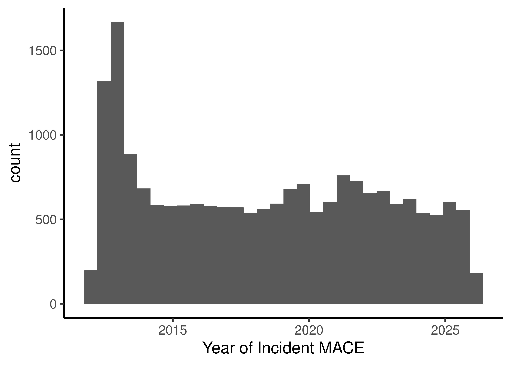
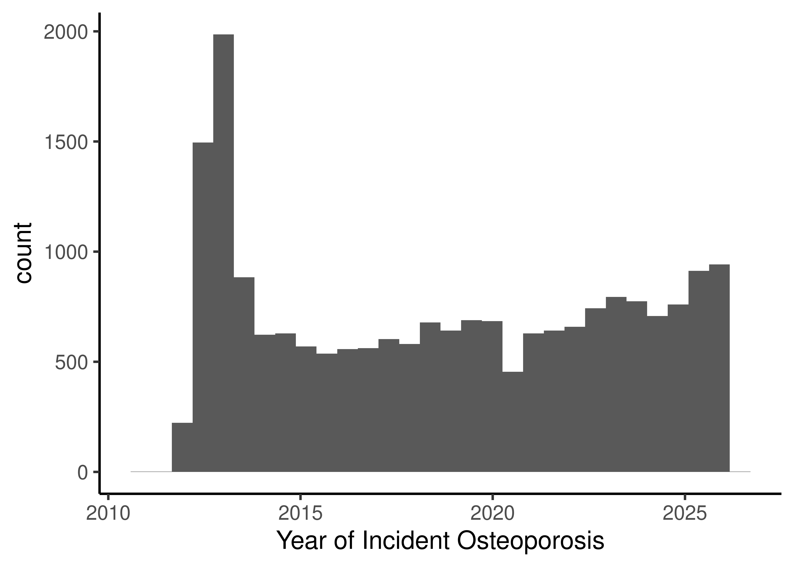

::: {.cell}

```{.r .cell-code}
# hide this code chunk
#| echo: false
#| message: false

# defines the se function
se <- function(x) {
  sd(x, na.rm = TRUE) / sqrt(length(x))
}

#load these packages, nearly always needed
library(tidyverse)
library(knitr)
library(broom)

# sets maize and blue color scheme
color_scheme <- c("#00274c", "#ffcb05")
```
:::


## Purpose

Clean the data for various diagnoses, for use in other scripts

## Raw Data


::: {.cell}

```{.r .cell-code}
library(readr) #loads the readr package
diagnosis.filename <- "combined_data/DiagnosesComprehensiveAll.csv" #input file(s)
diagnosis.data <- read_csv(diagnosis.filename) |>
  mutate(DeID_ProblemObservationDate = mdy_hm(DeID_ProblemObservationDate))
```
:::


These data can be found in /nfs/turbo/precision-health/DataDirect/HUM00268448 - The Interrelationships Between Blood/Cholesterol and Outcomes/2026-03-23 in a file named no file found.  This input file was most recently updated on unknown.  This script was most recently updated on Fri Mar 27 11:53:19 2026.

There are 70116 participants in this dataset with any diagnoses values.

## Data Cleaning

Will first clean the crude diagnosis data and then add in the elixhauser and charson data.

### MACE Data


::: {.cell}

```{.r .cell-code}
icd_pattern_mace <- paste0(
  "^410",          # ICD-9 MI
  "|^433\\.[0-9]1",# ICD-9 Occlusion of precerebral arteries (5th digit = 1)
  "|^434",         # ICD-9 Occlusion of cerebral arteries
  "|^436",         # ICD-9 Acute but ill-defined CVA
  "|^430",         # ICD-9 Subarachnoid haemorrhage
  "|^431",         # ICD-9 Intracerebral haemorrhage
  "|^I21",         # ICD-10 Acute MI
  "|^I22",         # ICD-10 Subsequent MI
  "|^I63",         # ICD-10 Cerebral infarction
  "|^I60",         # ICD-10 Subarachnoid haemorrhage
  "|^I61",         # ICD-10 Intracerebral haemorrhage
  "|^I46"          # ICD-10 Cardiac arrest
)

diagnosis.data.mace <- diagnosis.data %>%
  filter(grepl(icd_pattern_mace, TermCodeMapped, ignore.case = FALSE)) 

mace.diagnoses <-
  diagnosis.data.mace |>
  group_by(DeID_PatientID) |>
  arrange(DeID_ProblemObservationDate) |>
  summarize(MACE.onset = first(DeID_ProblemObservationDate)) |>
  mutate(MACE = TRUE)

library(ggplot2)
ggplot(mace.diagnoses,
       aes(x=MACE.onset)) +
  geom_histogram() +
  theme_classic(base_size=16) +
  labs(x="Year of Incident MACE")
```

::: {.cell-output-display}
{width=2100}
:::
:::


After cleaning are 21661 participants in this dataset with MACE.


### Osteoporosis Data


::: {.cell}

```{.r .cell-code}
icd_pattern_osteoporosis <- paste0(
  "^M80",       # ICD-10 Osteoporosis with pathological fracture
  "|^M81",      # ICD-10 Osteoporosis without pathological fracture
  "|^733\\.0"   # ICD-9 733.0x (covers 733.00–733.09)
)

diagnosis.data.osteoporosis <- diagnosis.data %>%
  filter(grepl(icd_pattern_osteoporosis, TermCodeMapped, ignore.case = FALSE)) 

osteoporosis.diagnoses <-
  diagnosis.data.osteoporosis|>
  group_by(DeID_PatientID) |>
  arrange(DeID_ProblemObservationDate) |>
  summarize(Osteoporosis.onset = first(DeID_ProblemObservationDate)) |>
  mutate(Osteoporosis = TRUE)

library(ggplot2)
ggplot(osteoporosis.diagnoses,
       aes(x=Osteoporosis.onset)) +
  geom_histogram() +
  theme_classic(base_size=16) +
  labs(x="Year of Incident Osteoporosis")
```

::: {.cell-output-display}
{width=2100}
:::
:::


After cleaning are 22332 participants in this dataset with Osteoporosis

### Comorbidity Data


::: {.cell}

```{.r .cell-code}
library(tidyverse)
library(lubridate)

elixhauser.data <- read_csv(
  "combined_data/ComorbiditiesElixhauserComprehensive.csv",
  show_col_types = FALSE
) %>%
  mutate(
    DeID_PatientID   = as.character(DeID_PatientID),
    DeID_EncounterID = as.character(DeID_EncounterID)
  )

charlson.data <- read_csv(
  "combined_data/ComorbiditiesCharlsonComprehensive.csv",
  show_col_types = FALSE
) %>%
  mutate(
    DeID_PatientID   = as.character(DeID_PatientID),
    DeID_EncounterID = as.character(DeID_EncounterID)
  )

encounter.data <- read_csv(
  "combined_data/EncounterAll.csv",
  show_col_types = FALSE
) %>%
  mutate(
    DeID_PatientID   = as.character(DeID_PatientID),
    DeID_EncounterID = as.character(DeID_EncounterID),
    encounter_date   = mdy_hm(DeID_AdmitDate)
  ) %>%
  filter(!is.na(encounter_date)) %>%
  select(DeID_PatientID, DeID_EncounterID, encounter_date)

cat("Elixhauser rows:", nrow(elixhauser.data), "\n")
```

::: {.cell-output .cell-output-stdout}

```
Elixhauser rows: 93916080 
```


:::

```{.r .cell-code}
cat("Charlson rows:",   nrow(charlson.data),   "\n")
```

::: {.cell-output .cell-output-stdout}

```
Charlson rows: 93916080 
```


:::

```{.r .cell-code}
cat("Unique patients (Elixhauser):",
    n_distinct(elixhauser.data$DeID_PatientID), "\n")
```

::: {.cell-output .cell-output-stdout}

```
Unique patients (Elixhauser): 201073 
```


:::

```{.r .cell-code}
cat("Unique patients (Charlson):",
    n_distinct(charlson.data$DeID_PatientID), "\n")
```

::: {.cell-output .cell-output-stdout}

```
Unique patients (Charlson): 201073 
```


:::
:::

::: {.cell}

```{.r .cell-code}
# --- Elixhauser: collapse paired conditions, join encounter dates ---
elix_dated <- elixhauser.data %>%
  mutate(
    diabetes      = pmax(DiabetesComplicated, DiabetesUncomplicated,
                         na.rm = TRUE),
    hypertension  = pmax(HypertensionComplicated, HypertensionUncomplicated,
                         na.rm = TRUE),
    alcohol_abuse = AlcoholAbuse,
    arrhythmia    = CardiacArrhythmias,
    chf           = CongestiveHeartFailure,
    obesity       = Obesity,
    pulm_circ     = PulmonaryCirculationDisorders,
    renal_failure = RenalFailure,
    elix_score    = TotalScore
  ) %>%
  select(DeID_PatientID, DeID_EncounterID,
         diabetes, hypertension, alcohol_abuse, arrhythmia,
         chf, obesity, pulm_circ, renal_failure, elix_score) %>%
  inner_join(
    encounter.data %>% select(DeID_EncounterID, encounter_date),
    by = "DeID_EncounterID"
  ) %>%
  arrange(DeID_PatientID, encounter_date)

# --- Charlson: collapse paired diabetes, join encounter dates ---
charlson_dated <- charlson.data %>%
  mutate(
    charlson_diabetes = pmax(DiabetesWithChronicComplication,
                             DiabetesWithoutChronicComplication,
                             na.rm = TRUE),
    charlson_chf      = CongestiveHeartFailure,
    charlson_mi       = MyocardialInfarction,
    charlson_pvd      = PeripheralVascularDisease,
    charlson_renal    = RenalDisease,
    charlson_score    = TotalScore,
    charlson_score_age = TotalScoreAdjustedForAge
  ) %>%
  select(DeID_PatientID, DeID_EncounterID,
         charlson_diabetes, charlson_chf, charlson_mi,
         charlson_pvd, charlson_renal,
         charlson_score, charlson_score_age) %>%
  inner_join(
    encounter.data %>% select(DeID_EncounterID, encounter_date),
    by = "DeID_EncounterID"
  ) %>%
  arrange(DeID_PatientID, encounter_date)

cat("Elixhauser rows after date join:", nrow(elix_dated), "\n")
```

::: {.cell-output .cell-output-stdout}

```
Elixhauser rows after date join: 90426470 
```


:::

```{.r .cell-code}
cat("Charlson rows after date join:",   nrow(charlson_dated), "\n")
```

::: {.cell-output .cell-output-stdout}

```
Charlson rows after date join: 90426470 
```


:::
:::

::: {.cell}

```{.r .cell-code}
# Confirm that 0 after 1 means "not coded this visit" not "resolved"
# Expected: high reversal rate confirming 0s should be ignored

check_reversals <- function(df, col) {
  df %>%
    group_by(DeID_PatientID) %>%
    arrange(encounter_date) %>%
    summarise(
      ever_positive = any(.data[[col]] == 1, na.rm = TRUE),
      reversals     = {
        x    <- .data[[col]]
        ever <- cummax(replace_na(x, 0L))
        sum(x == 0 & ever == 1, na.rm = TRUE)
      },
      .groups = "drop"
    ) %>%
    summarise(
      condition             = col,
      n_ever_positive       = sum(ever_positive),
      n_with_reversals      = sum(reversals > 0 & ever_positive),
      pct_reversal          = round(100 * n_with_reversals / n_ever_positive, 1)
    )
}

reversal_summary <- bind_rows(
  check_reversals(elix_dated, "diabetes"),
  check_reversals(elix_dated, "hypertension"),
  check_reversals(elix_dated, "chf"),
  check_reversals(elix_dated, "renal_failure")
)

reversal_summary %>% kable(caption = "Reversal diagnostic — confirms 0 = not coded, not resolved")
```

::: {.cell-output-display}


Table: Reversal diagnostic — confirms 0 = not coded, not resolved

|condition     | n_ever_positive| n_with_reversals| pct_reversal|
|:-------------|---------------:|----------------:|------------:|
|diabetes      |           40035|               15|            0|
|hypertension  |           88767|               31|            0|
|chf           |           20839|               10|            0|
|renal_failure |           26600|                9|            0|


:::
:::

::: {.cell}

```{.r .cell-code}
# For chronic conditions: onset = first encounter where flag == 1
# 0s after a 1 are ignored — condition treated as permanent from onset

first_onset <- function(df, col) {
  df %>%
    filter(.data[[col]] == 1) %>%
    group_by(DeID_PatientID) %>%
    slice_min(encounter_date, n = 1, with_ties = FALSE) %>%
    ungroup() %>%
    select(DeID_PatientID, onset_date = encounter_date) %>%
    rename("{col}_onset" := onset_date)
}

# --- Elixhauser onsets ---
elix_onsets <- c("diabetes", "hypertension", "alcohol_abuse",
                 "arrhythmia", "chf", "obesity",
                 "pulm_circ", "renal_failure") %>%
  map(~ first_onset(elix_dated, .x)) %>%
  reduce(full_join, by = "DeID_PatientID")

# --- Charlson onsets ---
charlson_onsets <- c("charlson_diabetes", "charlson_chf",
                     "charlson_mi", "charlson_pvd", "charlson_renal") %>%
  map(~ first_onset(charlson_dated, .x)) %>%
  reduce(full_join, by = "DeID_PatientID")

# --- Charlson composite scores ---
# Baseline: score at first ever encounter for that patient
# Maximum: highest score ever recorded (most complete coding episode)
charlson_scores <- charlson_dated %>%
  group_by(DeID_PatientID) %>%
  summarise(
    charlson_score_baseline     = first(charlson_score),
    charlson_score_max          = max(charlson_score,     na.rm = TRUE),
    charlson_score_age_baseline = first(charlson_score_age),
    charlson_score_age_max      = max(charlson_score_age, na.rm = TRUE),
    .groups = "drop"
  )

# --- Elixhauser composite scores ---
elix_scores <- elix_dated %>%
  group_by(DeID_PatientID) %>%
  summarise(
    elix_score_baseline = first(elix_score),
    elix_score_max      = max(elix_score, na.rm = TRUE),
    .groups = "drop"
  )
```
:::

::: {.cell}

```{.r .cell-code}
# One row per patient, all onset dates and scores in wide format
all_patients <- bind_rows(
  elixhauser.data %>% distinct(DeID_PatientID),
  charlson.data   %>% distinct(DeID_PatientID)
) %>% distinct(DeID_PatientID)

comorbidity_onset <- all_patients %>%
  left_join(elix_onsets,     by = "DeID_PatientID") %>%
  left_join(charlson_onsets, by = "DeID_PatientID") %>%
  left_join(charlson_scores, by = "DeID_PatientID") %>%
  left_join(elix_scores,     by = "DeID_PatientID")

# --- Onset summary ---
comorbidity_onset %>%
  select(ends_with("_onset")) %>%
  summarise(across(everything(),
                   list(N   = ~ sum(!is.na(.x)),
                        Pct = ~ round(100 * mean(!is.na(.x)), 1)))) %>%
  pivot_longer(everything(),
               names_to  = c("Condition", ".value"),
               names_sep = "_(?=N$|Pct$)") %>%
  arrange(desc(N)) %>%
  kable(caption = "Comorbidity prevalence — patients with at least one coded encounter")
```

::: {.cell-output-display}


Table: Comorbidity prevalence — patients with at least one coded encounter

|Condition               |     N|  Pct|
|:-----------------------|-----:|----:|
|hypertension_onset      | 88767| 44.1|
|obesity_onset           | 83396| 41.5|
|arrhythmia_onset        | 74556| 37.1|
|diabetes_onset          | 40035| 19.9|
|charlson_diabetes_onset | 40035| 19.9|
|charlson_pvd_onset      | 28387| 14.1|
|charlson_renal_onset    | 26663| 13.3|
|renal_failure_onset     | 26600| 13.2|
|chf_onset               | 20839| 10.4|
|charlson_chf_onset      | 20839| 10.4|
|alcohol_abuse_onset     | 12607|  6.3|
|pulm_circ_onset         | 12492|  6.2|
|charlson_mi_onset       | 12349|  6.1|


:::

```{.r .cell-code}
# --- Score summaries ---
comorbidity_onset %>%
  select(starts_with("charlson_score"), starts_with("elix_score")) %>%
  summary() %>%
  print()
```

::: {.cell-output .cell-output-stdout}

```
 charlson_score_baseline charlson_score_max charlson_score_age_baseline
 Min.   : 0.0000         Min.   : 0.000     Min.   : 0.0000            
 1st Qu.: 0.0000         1st Qu.: 0.000     1st Qu.: 0.0000            
 Median : 0.0000         Median : 1.000     Median : 0.0000            
 Mean   : 0.0762         Mean   : 2.824     Mean   : 0.5257            
 3rd Qu.: 0.0000         3rd Qu.: 4.000     3rd Qu.: 1.0000            
 Max.   :12.0000         Max.   :26.000     Max.   :15.0000            
 charlson_score_age_max elix_score_baseline elix_score_max  
 Min.   : 0.000         Min.   : 0.0000     Min.   : 0.000  
 1st Qu.: 1.000         1st Qu.: 0.0000     1st Qu.: 2.000  
 Median : 2.000         Median : 0.0000     Median : 4.000  
 Mean   : 4.174         Mean   : 0.1366     Mean   : 4.923  
 3rd Qu.: 7.000         3rd Qu.: 0.0000     3rd Qu.: 7.000  
 Max.   :29.000         Max.   :14.0000     Max.   :27.000  
```


:::
:::


## Writing Out Cleaned Files


::: {.cell}

```{.r .cell-code}
combined.diagnoses <-
  full_join(osteoporosis.diagnoses,mace.diagnoses, by='DeID_PatientID')

cleaned.diagnoses.file <- 'combined_data/DiagnosesCleaned.csv'
write_csv(combined.diagnoses, file=cleaned.diagnoses.file)

comorbidity.outfile <- "combined_data/ComorbiditiesOnset.csv"
write_csv(comorbidity_onset, comorbidity.outfile)
```
:::


Wrote this out to combined_data/DiagnosesCleaned.csv and combined_data/ComorbiditiesOnset.csv.

## Session Information


::: {.cell}

```{.r .cell-code}
sessionInfo()
```

::: {.cell-output .cell-output-stdout}

```
R version 4.4.3 (2025-02-28)
Platform: x86_64-pc-linux-gnu
Running under: Red Hat Enterprise Linux 8.10 (Ootpa)

Matrix products: default
BLAS:   /sw/pkgs/arc/stacks/gcc/13.2.0/R/4.4.3/lib64/R/lib/libRblas.so 
LAPACK: /sw/pkgs/arc/stacks/gcc/13.2.0/R/4.4.3/lib64/R/lib/libRlapack.so;  LAPACK version 3.12.0

locale:
 [1] LC_CTYPE=en_US.UTF-8       LC_NUMERIC=C              
 [3] LC_TIME=en_US.UTF-8        LC_COLLATE=en_US.UTF-8    
 [5] LC_MONETARY=en_US.UTF-8    LC_MESSAGES=en_US.UTF-8   
 [7] LC_PAPER=en_US.UTF-8       LC_NAME=C                 
 [9] LC_ADDRESS=C               LC_TELEPHONE=C            
[11] LC_MEASUREMENT=en_US.UTF-8 LC_IDENTIFICATION=C       

time zone: America/Detroit
tzcode source: system (glibc)

attached base packages:
[1] stats     graphics  grDevices utils     datasets  methods   base     

other attached packages:
 [1] broom_1.0.12    knitr_1.48      lubridate_1.9.3 forcats_1.0.0  
 [5] stringr_1.5.1   dplyr_1.2.0     purrr_1.0.2     readr_2.1.5    
 [9] tidyr_1.3.1     tibble_3.2.1    ggplot2_3.5.1   tidyverse_2.0.0

loaded via a namespace (and not attached):
 [1] utf8_1.2.4        generics_0.1.3    stringi_1.8.4     hms_1.1.3        
 [5] digest_0.6.36     magrittr_2.0.3    evaluate_0.24.0   grid_4.4.3       
 [9] timechange_0.3.0  fastmap_1.2.0     jsonlite_1.8.8    backports_1.5.0  
[13] fansi_1.0.6       scales_1.3.0      cli_3.6.3         rlang_1.1.7      
[17] crayon_1.5.3      bit64_4.0.5       munsell_0.5.1     withr_3.0.0      
[21] yaml_2.3.9        tools_4.4.3       parallel_4.4.3    tzdb_0.4.0       
[25] colorspace_2.1-0  vctrs_0.7.1       R6_2.5.1          lifecycle_1.0.5  
[29] htmlwidgets_1.6.4 bit_4.0.5         vroom_1.6.5       pkgconfig_2.0.3  
[33] pillar_1.9.0      gtable_0.3.6      glue_1.8.0        xfun_0.45        
[37] tidyselect_1.2.1  rstudioapi_0.16.0 farver_2.1.2      htmltools_0.5.8.1
[41] rmarkdown_2.27    labeling_0.4.3    compiler_4.4.3   
```


:::
:::
