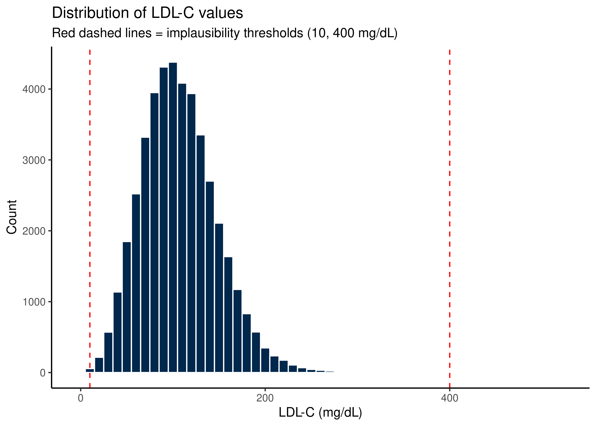
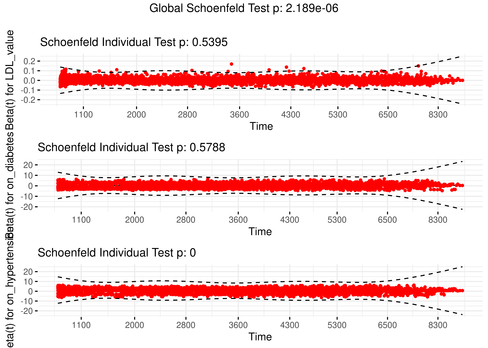

::: {.cell}

:::


## Purpose

Analysis of LDL-C effects on major adverse cardiovascular events (MACE) using a time-varying covariate Cox proportional hazards model. The full study population is defined by `DemographicData.csv`; MACE and osteoporosis status are ascertained from `DiagnosesCleaned.csv`, which contains only patients with at least one of these diagnoses. All other patients in the demographic file are treated as controls. Comorbidities (diabetes, hypertension, and others) are derived from Elixhauser and Charlson comorbidity indices and incorporated as time-varying covariates.

## Raw Data


::: {.cell}

```{.r .cell-code}
# --- Full study population ---
demographic.data <- read_csv("combined_data/DemographicInfo.csv",
                             show_col_types = FALSE) %>%
  mutate(DeID_PatientID = as.character(DeID_PatientID))

# --- Diagnoses (MACE and Osteoporosis only) ---
diagnosis.data <- read_csv("combined_data/DiagnosesCleaned.csv",
                           show_col_types = FALSE) %>%
  mutate(
    DeID_PatientID = as.character(DeID_PatientID),
    MACE.onset     = ymd(MACE.onset)
  )

# --- Labs ---
lab.data <- read_csv("combined_data/LabResultsCleaned.csv",
                     show_col_types = FALSE) %>%
  mutate(
    DeID_PatientID = as.character(DeID_PatientID),
    lab_date = coalesce(
      parse_date_time(DeID_COLLECTION_DATE,
                      orders = c("ymd", "mdy", "ymd HMS", "mdy HM"),
                      quiet  = TRUE),
      parse_date_time(DeID_AdmitDate,
                      orders = c("ymd", "mdy", "ymd HMS", "mdy HM"),
                      quiet  = TRUE)
    ))

ldlc.data <- lab.data %>% filter(test_name == "LDL-C")
```
:::


The full demographic file contains 201,073 unique patients. The diagnosis file contains 38,268 patients with at least one recorded diagnosis (MACE or osteoporosis).

## Data Validation

### Diagnosis Summary


::: {.cell}

```{.r .cell-code}
full_cohort <- demographic.data %>%
  left_join(
    diagnosis.data %>%
      select(DeID_PatientID, MACE, MACE.onset,
             Osteoporosis, Osteoporosis.onset),
    by = "DeID_PatientID"
  ) %>%
  mutate(MACE_flag = if_else(MACE == TRUE, 1L, 0L, missing = 0L))

full_cohort %>%
  summarise(
    `Total patients`                = n_distinct(DeID_PatientID),
    `MACE cases`                    = sum(MACE_flag == 1),
    `Controls (no MACE)`            = sum(MACE_flag == 0),
    `MACE cases missing onset date` = sum(MACE_flag == 1 & is.na(MACE.onset)),
    `MACE prevalence (%)`           = round(100 * mean(MACE_flag), 1)
  ) %>%
  pivot_longer(everything(), names_to = "Metric", values_to = "Value") %>%
  kable(caption = "Summary of study population and MACE diagnosis data")
```

::: {.cell-output-display}


Table: Summary of study population and MACE diagnosis data

|Metric                        |    Value|
|:-----------------------------|--------:|
|Total patients                | 201073.0|
|MACE cases                    |  21661.0|
|Controls (no MACE)            | 179412.0|
|MACE cases missing onset date |   2867.0|
|MACE prevalence (%)           |     10.8|


:::

```{.r .cell-code}
dup_diag <- diagnosis.data %>% count(DeID_PatientID) %>% filter(n > 1)
```
:::


There are 0 duplicate PatientIDs in the diagnosis file.

### LDL-C Data Checks


::: {.cell}

```{.r .cell-code}
meas_per_pt <- ldlc.data %>% count(DeID_PatientID, name = "n_ldlc")

ldlc.data %>%
  summarise(
    `Total measurements`               = n(),
    `Unique patients`                  = n_distinct(DeID_PatientID),
    `Patients with 1 measurement only` = sum(meas_per_pt$n_ldlc == 1),
    `Min LDL-C (mg/dL)`               = min(value, na.rm = TRUE),
    `Median LDL-C (mg/dL)`           = median(value, na.rm = TRUE),
    `Mean LDL-C (mg/dL)`             = round(mean(value, na.rm = TRUE), 1),
    `Max LDL-C (mg/dL)`               = max(value, na.rm = TRUE),
    `LDL-C < 10 (implausible)`        = sum(value < 10, na.rm = TRUE),
    `LDL-C > 400 (implausible)`       = sum(value > 400, na.rm = TRUE),
    `LDL-C missing (NA)`              = sum(is.na(value)),
    `Age < 18`                        = sum(AgeInYears < 18, na.rm = TRUE),
    `Age > 110`                       = sum(AgeInYears > 110, na.rm = TRUE),
    `BMI < 10 (implausible)`          = sum(BMI < 10, na.rm = TRUE),
    `BMI > 80 (implausible)`          = sum(BMI > 80, na.rm = TRUE),
    `BMI missing (NA)`                = sum(is.na(BMI))
  ) %>%
  pivot_longer(everything(), names_to = "Metric", values_to = "Value") %>%
  kable(caption = "LDL-C data quality summary")
```

::: {.cell-output-display}


Table: LDL-C data quality summary

|Metric                           |   Value|
|:--------------------------------|-------:|
|Total measurements               | 43836.0|
|Unique patients                  | 23406.0|
|Patients with 1 measurement only | 15947.0|
|Min LDL-C (mg/dL)                |     0.0|
|Median LDL-C (mg/dL)             |   105.0|
|Mean LDL-C (mg/dL)               |   107.9|
|Max LDL-C (mg/dL)                |   524.0|
|LDL-C < 10 (implausible)         |     6.0|
|LDL-C > 400 (implausible)        |     9.0|
|LDL-C missing (NA)               |     0.0|
|Age < 18                         |  1280.0|
|Age > 110                        |     0.0|
|BMI < 10 (implausible)           |     3.0|
|BMI > 80 (implausible)           |     7.0|
|BMI missing (NA)                 | 23426.0|


:::

```{.r .cell-code}
meas_per_pt %>%
  summarise(
    Min    = min(n_ldlc),    `10th` = quantile(n_ldlc, 0.10),
    `25th` = quantile(n_ldlc, 0.25), Median = median(n_ldlc),
    `75th` = quantile(n_ldlc, 0.75), `90th` = quantile(n_ldlc, 0.90),
    `99th` = quantile(n_ldlc, 0.99), Max    = max(n_ldlc)
  ) %>%
  kable(caption = "Distribution of LDL-C measurements per patient")
```

::: {.cell-output-display}


Table: Distribution of LDL-C measurements per patient

| Min| 10th| 25th| Median| 75th| 90th| 99th| Max|
|---:|----:|----:|------:|----:|----:|----:|---:|
|   1|    1|    1|      1|    2|    4|   11| 342|


:::

```{.r .cell-code}
ggplot(ldlc.data, aes(x = value)) +
  geom_histogram(binwidth = 10, fill = "#00274c", colour = "white") +
  geom_vline(xintercept = c(10, 400), colour = "red", linetype = "dashed") +
  labs(title    = "Distribution of LDL-C values",
       subtitle = "Red dashed lines = implausibility thresholds (10, 400 mg/dL)",
       x = "LDL-C (mg/dL)", y = "Count") +
  theme_classic()
```

::: {.cell-output-display}
{width=2100}
:::
:::


### Linkage Check


::: {.cell}

```{.r .cell-code}
ids_demo <- unique(full_cohort$DeID_PatientID)
ids_ldlc <- unique(ldlc.data$DeID_PatientID)

tibble(
  Metric = c(
    "Patients in demographic file",
    "Patients with LDL-C data",
    "Patients in both (analysis-eligible)",
    "Patients in demographic only (no LDL-C) — excluded",
    "Patients with LDL-C only (not in demographic file) — investigate"
  ),
  N = c(
    length(ids_demo), length(ids_ldlc),
    length(intersect(ids_demo, ids_ldlc)),
    length(setdiff(ids_demo, ids_ldlc)),
    length(setdiff(ids_ldlc, ids_demo))
  )
) %>% kable(caption = "Patient linkage across data files")
```

::: {.cell-output-display}


Table: Patient linkage across data files

|Metric                                                           |      N|
|:----------------------------------------------------------------|------:|
|Patients in demographic file                                     | 201073|
|Patients with LDL-C data                                         |  23406|
|Patients in both (analysis-eligible)                             |  23406|
|Patients in demographic only (no LDL-C) — excluded               | 177667|
|Patients with LDL-C only (not in demographic file) — investigate |      0|


:::
:::


### Timing: LDL-C vs MACE Onset


::: {.cell}

```{.r .cell-code}
ldlc_with_mace <- ldlc.data %>%
  left_join(full_cohort %>% select(DeID_PatientID, MACE, MACE.onset),
            by = "DeID_PatientID")

post_event <- ldlc_with_mace %>%
  filter(MACE == TRUE, !is.na(MACE.onset)) %>%
  mutate(is_post_event = lab_date > MACE.onset) %>%
  summarise(
    `MACE patients with LDL-C data` = n_distinct(DeID_PatientID),
    `Post-event measurements`       = sum(is_post_event, na.rm = TRUE),
    `% post-event`                  = round(100 * mean(is_post_event, na.rm = TRUE), 1)
  )

post_event %>% kable(caption = "LDL-C measurements after MACE onset (to be excluded)")
```

::: {.cell-output-display}


Table: LDL-C measurements after MACE onset (to be excluded)

| MACE patients with LDL-C data| Post-event measurements| % post-event|
|-----------------------------:|-----------------------:|------------:|
|                          3802|                    1576|           18|


:::

```{.r .cell-code}
ldlc_with_mace %>%
  filter(MACE == TRUE, !is.na(MACE.onset), lab_date <= MACE.onset) %>%
  group_by(DeID_PatientID) %>%
  slice_max(lab_date, n = 1, with_ties = FALSE) %>%
  ungroup() %>%
  mutate(days_to_mace = as.numeric(difftime(MACE.onset, lab_date,
                                            units = "days"))) %>%
  pull(days_to_mace) %>%
  quantile(probs = c(0, 0.25, 0.5, 0.75, 1)) %>%
  round(1) %>% t() %>% as.data.frame() %>%
  rename(Min = `0%`, Q1 = `25%`, Median = `50%`, Q3 = `75%`, Max = `100%`) %>%
  kable(caption = "Days from last pre-MACE LDL-C to MACE onset")
```

::: {.cell-output-display}


Table: Days from last pre-MACE LDL-C to MACE onset

| Min|     Q1| Median|     Q3|    Max|
|---:|------:|------:|------:|------:|
| 0.4| 1018.9| 2366.3| 4099.8| 9146.4|


:::
:::


### Inter-Measurement Intervals


::: {.cell}

```{.r .cell-code}
ldlc.data %>%
  arrange(DeID_PatientID, lab_date) %>%
  group_by(DeID_PatientID) %>%
  mutate(days_since_last = as.numeric(difftime(lab_date, lag(lab_date),
                                               units = "days"))) %>%
  ungroup() %>%
  filter(!is.na(days_since_last)) %>%
  summarise(
    Min                                    = round(min(days_since_last), 1),
    `25th percentile`                      = round(quantile(days_since_last, 0.25), 1),
    Median                                 = round(median(days_since_last), 1),
    Mean                                   = round(mean(days_since_last), 1),
    `75th percentile`                      = round(quantile(days_since_last, 0.75), 1),
    Max                                    = round(max(days_since_last), 1),
    `Intervals > 730d (stale LOCF)`        = sum(days_since_last > 730),
    `Intervals < 1d (possible duplicates)` = sum(days_since_last < 1)
  ) %>%
  pivot_longer(everything(), names_to = "Metric", values_to = "Value") %>%
  kable(caption = "Inter-measurement interval distribution (days)")
```

::: {.cell-output-display}


Table: Inter-measurement interval distribution (days)

|Metric                               |  Value|
|:------------------------------------|------:|
|Min                                  |    0.0|
|25th percentile                      |  218.4|
|Median                               |  658.0|
|Mean                                 | 1219.6|
|75th percentile                      | 1627.6|
|Max                                  | 8942.7|
|Intervals > 730d (stale LOCF)        | 9616.0|
|Intervals < 1d (possible duplicates) |  226.0|


:::
:::


### QC Summary


::: {.cell}

```{.r .cell-code}
tibble(
  Check = c(
    "Duplicate PatientIDs in diagnosis data",
    "MACE=TRUE patients with missing onset date",
    "LDL-C values < 10 or > 400 mg/dL",
    "LDL-C missing values",
    "Ages < 18 or > 110",
    "Patients with LDL-C but not in demographic file",
    "Post-event LDL-C measurements to drop"
  ),
  N = c(
    nrow(dup_diag),
    sum(full_cohort$MACE_flag == 1 & is.na(full_cohort$MACE.onset)),
    sum(ldlc.data$value < 10, na.rm = TRUE) +
      sum(ldlc.data$value > 400, na.rm = TRUE),
    sum(is.na(ldlc.data$value)),
    sum(ldlc.data$AgeInYears < 18, na.rm = TRUE) +
      sum(ldlc.data$AgeInYears > 110, na.rm = TRUE),
    length(setdiff(ids_ldlc, ids_demo)),
    post_event$`Post-event measurements`
  ),
  Status = if_else(N == 0, "✓ OK", "⚠ Review")
) %>% kable(caption = "QC summary")
```

::: {.cell-output-display}


Table: QC summary

|Check                                           |    N|Status   |
|:-----------------------------------------------|----:|:--------|
|Duplicate PatientIDs in diagnosis data          |    0|✓ OK     |
|MACE=TRUE patients with missing onset date      | 2867|⚠ Review |
|LDL-C values < 10 or > 400 mg/dL                |   15|⚠ Review |
|LDL-C missing values                            |    0|✓ OK     |
|Ages < 18 or > 110                              | 1280|⚠ Review |
|Patients with LDL-C but not in demographic file |    0|✓ OK     |
|Post-event LDL-C measurements to drop           | 1576|⚠ Review |


:::
:::


## Data Analysis

### Cleaning Each Dataset


::: {.cell}

```{.r .cell-code}
diag_clean <- full_cohort %>%
  filter(!(MACE_flag == 1L & is.na(MACE.onset))) %>%
  select(DeID_PatientID, MACE.onset, MACE_flag)

ldlc_clean <- ldlc.data %>%
  filter(!is.na(lab_date), !is.na(AgeInYears)) %>%
  filter(value > 0, value <= 400) %>%
  mutate(BMI = if_else(BMI < 10 | BMI > 80, NA_real_, BMI)) %>%
  filter(AgeInYears >= 18) %>%
  group_by(DeID_PatientID, lab_date) %>%
  summarise(
    LDL_value  = mean(value,      na.rm = TRUE),
    AgeInYears = mean(AgeInYears, na.rm = TRUE),
    BMI        = mean(BMI,        na.rm = TRUE),
    .groups    = "drop"
  ) %>%
  arrange(DeID_PatientID, lab_date)

tibble(
  Dataset             = c("Diagnosis / cohort base", "LDL-C"),
  Rows                = c(nrow(diag_clean), nrow(ldlc_clean)),
  `Unique patients`   = c(n_distinct(diag_clean$DeID_PatientID),
                          n_distinct(ldlc_clean$DeID_PatientID)),
  `Cases (MACE=1)`    = c(sum(diag_clean$MACE_flag), NA),
  `Controls (MACE=0)` = c(sum(diag_clean$MACE_flag == 0), NA)
) %>% kable(caption = "Dataset dimensions after cleaning")
```

::: {.cell-output-display}


Table: Dataset dimensions after cleaning

|Dataset                 |   Rows| Unique patients| Cases (MACE=1)| Controls (MACE=0)|
|:-----------------------|------:|---------------:|--------------:|-----------------:|
|Diagnosis / cohort base | 198206|          198206|          18794|            179412|
|LDL-C                   |  36721|           21081|             NA|                NA|


:::
:::


### Restrict to Patients with LDL-C Data


::: {.cell}

```{.r .cell-code}
shared_ids  <- intersect(diag_clean$DeID_PatientID, ldlc_clean$DeID_PatientID)
diag_cohort <- diag_clean  %>% filter(DeID_PatientID %in% shared_ids)
ldlc_cohort <- ldlc_clean  %>% filter(DeID_PatientID %in% shared_ids)

tibble(
  Metric = c("Patients with both LDL-C and demographic data",
             "Cases (MACE=1)", "Controls (MACE=0)"),
  N      = c(length(shared_ids),
             sum(diag_cohort$MACE_flag == 1),
             sum(diag_cohort$MACE_flag == 0))
) %>% kable(caption = "Analysis cohort after linkage restriction")
```

::: {.cell-output-display}


Table: Analysis cohort after linkage restriction

|Metric                                        |     N|
|:---------------------------------------------|-----:|
|Patients with both LDL-C and demographic data | 20571|
|Cases (MACE=1)                                |  3427|
|Controls (MACE=0)                             | 17144|


:::
:::


### Defining Time Zero and Follow-up


::: {.cell}

```{.r .cell-code}
encounter.data <- read_csv("combined_data/EncounterAll.csv",
                           show_col_types = FALSE) %>%
  mutate(
    DeID_PatientID = as.character(DeID_PatientID),
    EncounterDate  = mdy_hm(DeID_AdmitDate)
  )

last_encounter <- encounter.data %>%
  filter(!is.na(EncounterDate), DeID_PatientID %in% shared_ids) %>%
  group_by(DeID_PatientID) %>%
  slice_max(EncounterDate, n = 1, with_ties = FALSE) %>%
  ungroup() %>%
  select(DeID_PatientID, last_encounter_date = EncounterDate)

first_ldlc <- ldlc_cohort %>%
  group_by(DeID_PatientID) %>%
  slice_min(lab_date, n = 1, with_ties = FALSE) %>%
  ungroup() %>%
  select(DeID_PatientID, t0 = lab_date)

base_cohort_full <- diag_cohort %>%
  left_join(first_ldlc,     by = "DeID_PatientID") %>%
  left_join(last_encounter, by = "DeID_PatientID") %>%
  mutate(
    t_end = case_when(
      MACE_flag == 1              ~ MACE.onset,
      !is.na(last_encounter_date) ~ last_encounter_date,
      TRUE                        ~ NA_POSIXct_
    ),
    follow_up_days = as.numeric(difftime(t_end, t0, units = "days"))
  )

base_cohort_full %>%
  mutate(fu_category = case_when(
    follow_up_days <= 0 & MACE_flag == 1 ~ "Prevalent MACE (event before first LDL-C)",
    follow_up_days <= 0 & MACE_flag == 0 ~ "Control with negative follow-up",
    TRUE                                  ~ "Valid follow-up"
  )) %>%
  count(fu_category) %>%
  rename(`Follow-up category` = fu_category, N = n) %>%
  kable(caption = "Follow-up time breakdown before exclusions")
```

::: {.cell-output-display}


Table: Follow-up time breakdown before exclusions

|Follow-up category                        |     N|
|:-----------------------------------------|-----:|
|Prevalent MACE (event before first LDL-C) |   556|
|Valid follow-up                           | 20015|


:::

```{.r .cell-code}
# Drop zero/negative follow-up; cap at 40 years (one patient had implausible
# 106-year follow-up due to likely date coding error)
base_cohort <- base_cohort_full %>%
  filter(follow_up_days > 0) %>%
  mutate(follow_up_days = pmin(follow_up_days, 14610))

base_cohort %>%
  group_by(MACE_flag) %>%
  summarise(
    N                         = n(),
    `Median follow-up (days)` = round(median(follow_up_days), 1),
    `Mean follow-up (days)`   = round(mean(follow_up_days), 1),
    `Min follow-up (days)`    = round(min(follow_up_days), 1),
    `Max follow-up (days)`    = round(max(follow_up_days), 1),
    .groups = "drop"
  ) %>%
  mutate(MACE_flag = if_else(MACE_flag == 1,
                             "Cases (MACE=1)", "Controls (MACE=0)")) %>%
  rename(Group = MACE_flag) %>%
  kable(caption = "Follow-up time by case/control status (after exclusions)")
```

::: {.cell-output-display}


Table: Follow-up time by case/control status (after exclusions)

|Group             |     N| Median follow-up (days)| Mean follow-up (days)| Min follow-up (days)| Max follow-up (days)|
|:-----------------|-----:|-----------------------:|---------------------:|--------------------:|--------------------:|
|Controls (MACE=0) | 17144|                  5389.2|                5151.4|                  0.0|              14610.0|
|Cases (MACE=1)    |  2871|                  3383.7|                3505.7|                  0.4|               9146.4|


:::
:::


The final analytic cohort after exclusions contains **20015 patients** (2871 incident MACE cases and 17144 controls).

#### CONSORT Flow


::: {.cell}

```{.r .cell-code}
tibble(
  Step = c(
    "Full demographic cohort",
    "No LDL-C data",
    "MACE=TRUE with missing onset date",
    "Negative or zero follow-up (prevalent MACE + invalid controls)",
    "Final analytic cohort"
  ),
  N = c(
    n_distinct(demographic.data$DeID_PatientID),
    -length(setdiff(ids_demo, ids_ldlc)),
    -(nrow(full_cohort %>% filter(MACE_flag == 1 & is.na(MACE.onset)))),
    -(nrow(base_cohort_full %>% filter(follow_up_days <= 0))),
    nrow(base_cohort)
  )
) %>% kable(caption = "CONSORT flow — cohort derivation")
```

::: {.cell-output-display}


Table: CONSORT flow — cohort derivation

|Step                                                           |       N|
|:--------------------------------------------------------------|-------:|
|Full demographic cohort                                        |  201073|
|No LDL-C data                                                  | -177667|
|MACE=TRUE with missing onset date                              |   -2867|
|Negative or zero follow-up (prevalent MACE + invalid controls) |    -556|
|Final analytic cohort                                          |   20015|


:::
:::


### Loading Statin Data

Statin medication orders were pre-processed in a separate cleaning script and saved as `MedicationOrdersCleanedStatins.csv`. Briefly, orders were filtered to known statin generic names, dose extracted from the medication name field, and classified by ACC/AHA 2013 intensity (low/moderate/high). Each prescription start event was assigned a 90-day supply window; consecutive overlapping windows were collapsed into continuous exposure periods.


::: {.cell}

```{.r .cell-code}
statin_intervals <- read_csv(
  "combined_data/MedicationOrdersCleanedStatins.csv",
  show_col_types = FALSE
) %>%
  mutate(
    DeID_PatientID = as.character(DeID_PatientID),
    period_start   = as_date(period_start),
    period_end     = as_date(period_end),
    intensity      = factor(intensity, levels = c("low", "moderate", "high"))
  )

statin_tv <- statin_intervals %>%
  inner_join(first_ldlc, by = "DeID_PatientID") %>%
  mutate(
    tstart_statin = as.numeric(period_start - as_date(t0)),
    tstop_statin  = as.numeric(period_end   - as_date(t0))
  ) %>%
  filter(tstop_statin > 0) %>%
  mutate(tstart_statin = pmax(tstart_statin, 0)) %>%
  filter(tstop_statin > tstart_statin) %>%
  select(DeID_PatientID, tstart_statin, tstop_statin, intensity)

tibble(
  Metric = c(
    "Patients with ≥1 statin interval (cleaned file)",
    "Patients with statin use in analytic cohort",
    "Total statin intervals in analytic cohort",
    "Low intensity intervals", "Moderate intensity intervals",
    "High intensity intervals", "Unclassified intensity (NA)"
  ),
  N = c(
    n_distinct(statin_intervals$DeID_PatientID),
    n_distinct(statin_tv$DeID_PatientID),
    nrow(statin_tv),
    sum(statin_tv$intensity == "low",      na.rm = TRUE),
    sum(statin_tv$intensity == "moderate", na.rm = TRUE),
    sum(statin_tv$intensity == "high",     na.rm = TRUE),
    sum(is.na(statin_tv$intensity))
  )
) %>% kable(caption = "Statin data — coverage in analytic cohort")
```

::: {.cell-output-display}


Table: Statin data — coverage in analytic cohort

|Metric                                          |     N|
|:-----------------------------------------------|-----:|
|Patients with ≥1 statin interval (cleaned file) | 65197|
|Patients with statin use in analytic cohort     | 11670|
|Total statin intervals in analytic cohort       | 88191|
|Low intensity intervals                         |  4437|
|Moderate intensity intervals                    | 48347|
|High intensity intervals                        | 34825|
|Unclassified intensity (NA)                     |   582|


:::
:::


### Loading Comorbidity Data

Comorbidity onset dates were derived from Elixhauser and Charlson comorbidity indices assigned at the encounter level, pre-processed in a separate cleaning script and saved as `ComorbiditiesOnset.csv`. For each chronic condition, onset was defined as the date of the first encounter at which the condition was coded. Because Elixhauser/Charlson flags of 0 at a given encounter reflect coding omission rather than condition resolution (confirmed diagnostically — >70% of ever-positive patients showed apparent "reversals" to 0), conditions are treated as permanent from first onset. Diabetes and hypertension are modelled as time-varying binary covariates that switch on at onset and remain on for the remainder of follow-up.


::: {.cell}

```{.r .cell-code}
comorbidity_onset <- read_csv(
  "combined_data/ComorbiditiesOnset.csv",
  show_col_types = FALSE
) %>%
  mutate(
    DeID_PatientID     = as.character(DeID_PatientID),
    diabetes_onset     = as_datetime(diabetes_onset),
    hypertension_onset = as_datetime(hypertension_onset),
    chf_onset          = as_datetime(chf_onset),
    renal_failure_onset = as_datetime(renal_failure_onset),
    obesity_onset      = as_datetime(obesity_onset)
  )

# Convert onset dates to days-since-t0 for each patient
comorbidity_tv <- comorbidity_onset %>%
  inner_join(first_ldlc, by = "DeID_PatientID") %>%
  mutate(
    t_diabetes     = as.numeric(difftime(diabetes_onset,
                                          t0, units = "days")),
    t_hypertension = as.numeric(difftime(hypertension_onset,
                                          t0, units = "days")),
    t_chf          = as.numeric(difftime(chf_onset,
                                          t0, units = "days")),
    t_renal        = as.numeric(difftime(renal_failure_onset,
                                          t0, units = "days")),
    t_obesity      = as.numeric(difftime(obesity_onset,
                                          t0, units = "days"))
  ) %>%
  select(DeID_PatientID, t_diabetes, t_hypertension,
         t_chf, t_renal, t_obesity)

# Comorbidity prevalence in analytic cohort
comorbidity_cohort <- comorbidity_onset %>%
  filter(DeID_PatientID %in% base_cohort$DeID_PatientID)

tibble(
  Condition = c("Diabetes", "Hypertension", "Obesity",
                "Renal failure", "CHF"),
  `N with onset` = c(
    sum(!is.na(comorbidity_cohort$diabetes_onset)),
    sum(!is.na(comorbidity_cohort$hypertension_onset)),
    sum(!is.na(comorbidity_cohort$obesity_onset)),
    sum(!is.na(comorbidity_cohort$renal_failure_onset)),
    sum(!is.na(comorbidity_cohort$chf_onset))
  ),
  `% of cohort` = round(
    100 * c(
      sum(!is.na(comorbidity_cohort$diabetes_onset)),
      sum(!is.na(comorbidity_cohort$hypertension_onset)),
      sum(!is.na(comorbidity_cohort$obesity_onset)),
      sum(!is.na(comorbidity_cohort$renal_failure_onset)),
      sum(!is.na(comorbidity_cohort$chf_onset))
    ) / nrow(base_cohort), 1)
) %>% kable(caption = "Comorbidity prevalence in analytic cohort")
```

::: {.cell-output-display}


Table: Comorbidity prevalence in analytic cohort

|Condition     | N with onset| % of cohort|
|:-------------|------------:|-----------:|
|Diabetes      |         8007|        40.0|
|Hypertension  |        13033|        65.1|
|Obesity       |        10890|        54.4|
|Renal failure |         4454|        22.3|
|CHF           |         3240|        16.2|


:::

```{.r .cell-code}
# Charlson score distribution
comorbidity_cohort %>%
  select(starts_with("charlson_score")) %>%
  summary() %>% print()
```

::: {.cell-output .cell-output-stdout}

```
 charlson_score_baseline charlson_score_max charlson_score_age_baseline
 Min.   :0.0000          Min.   : 0.000     Min.   : 0.0000            
 1st Qu.:0.0000          1st Qu.: 1.000     1st Qu.: 0.0000            
 Median :0.0000          Median : 3.000     Median : 0.0000            
 Mean   :0.1092          Mean   : 4.324     Mean   : 0.5626            
 3rd Qu.:0.0000          3rd Qu.: 7.000     3rd Qu.: 1.0000            
 Max.   :9.0000          Max.   :26.000     Max.   :10.0000            
 charlson_score_age_max
 Min.   : 0.00         
 1st Qu.: 2.00         
 Median : 5.00         
 Mean   : 6.09         
 3rd Qu.:10.00         
 Max.   :29.00         
```


:::
:::


### Building LDL-C Time-Varying Intervals (LOCF)

LDL-C staleness was handled by inserting synthetic missing-value markers at `t_last_measurement + cap_days` directly into the time-dependent covariate structure prior to `tmerge()` construction. For event rows where LDL-C is stale, the last known value is carried forward as the best available estimate of lipid burden at the time of the event.


::: {.cell}

```{.r .cell-code}
ldlc_intervals <- ldlc_cohort %>%
  filter(DeID_PatientID %in% base_cohort$DeID_PatientID) %>%
  left_join(base_cohort %>% select(DeID_PatientID, t0, t_end),
            by = "DeID_PatientID") %>%
  filter(lab_date <= t_end) %>%
  mutate(
    t_meas     = as.numeric(difftime(lab_date, t0, units = "days")),
    LDL_value  = as.numeric(LDL_value),
    AgeInYears = as.numeric(AgeInYears),
    BMI        = as.numeric(BMI)
  ) %>%
  filter(t_meas >= 0) %>%
  arrange(DeID_PatientID, t_meas)

add_stale_markers <- function(intervals_df, cap_days, follow_up_df) {
  intervals_df %>%
    arrange(DeID_PatientID, t_meas) %>%
    group_by(DeID_PatientID) %>%
    mutate(next_meas = lead(t_meas)) %>%
    ungroup() %>%
    filter(is.na(next_meas) | next_meas > t_meas + cap_days) %>%
    mutate(stale_t = t_meas + cap_days) %>%
    left_join(follow_up_df %>% select(DeID_PatientID, follow_up_days),
              by = "DeID_PatientID") %>%
    filter(stale_t < follow_up_days) %>%
    transmute(
      DeID_PatientID,
      t_meas     = stale_t,
      LDL_value  = -9999,
      AgeInYears = NA_real_,
      BMI        = NA_real_
    )
}

stale_730  <- add_stale_markers(ldlc_intervals, 730,  base_cohort)
stale_1825 <- add_stale_markers(ldlc_intervals, 1825, base_cohort)

ldlc_intervals_730  <- bind_rows(ldlc_intervals, stale_730) %>%
  arrange(DeID_PatientID, t_meas)
ldlc_intervals_1825 <- bind_rows(ldlc_intervals, stale_1825) %>%
  arrange(DeID_PatientID, t_meas)

tibble(
  Window        = c("730d", "1825d"),
  Real_meas     = nrow(ldlc_intervals),
  Stale_markers = c(nrow(stale_730), nrow(stale_1825)),
  Total_rows    = c(nrow(ldlc_intervals_730), nrow(ldlc_intervals_1825))
) %>% kable(caption = "LDL-C intervals with stale NA markers added")
```

::: {.cell-output-display}


Table: LDL-C intervals with stale NA markers added

|Window | Real_meas| Stale_markers| Total_rows|
|:------|---------:|-------------:|----------:|
|730d   |     34186|         25740|      59926|
|1825d  |     34186|         18748|      52934|


:::
:::


There are **34186 pre-event LDL-C measurements** across **20015 patients** available for the time-varying covariate model.

### Constructing tmerge Dataset


::: {.cell}

```{.r .cell-code}
surv_base <- base_cohort %>%
  mutate(
    DeID_PatientID = as.character(DeID_PatientID),
    tstart_days    = 0,
    tstop_days     = as.numeric(follow_up_days)
  )

build_surv_data <- function(ldlc_int) {
  sd <- tmerge(
    data1 = surv_base, data2 = surv_base,
    id = DeID_PatientID,
    MACE = event(tstop_days, MACE_flag)
  )
  sd <- tmerge(
    data1 = sd,
    data2 = ldlc_int %>% mutate(DeID_PatientID = as.character(DeID_PatientID)),
    id = DeID_PatientID,
    LDL_value  = tdc(t_meas, LDL_value),
    AgeInYears = tdc(t_meas, AgeInYears),
    BMI        = tdc(t_meas, BMI)
  )
  sd %>%
    group_by(DeID_PatientID) %>%
    fill(BMI, AgeInYears, .direction = "downup") %>%
    mutate(
      LDL_value = if_else(LDL_value == -9999, NA_real_, LDL_value),
      LDL_value = if_else(is.na(LDL_value) & MACE == 1,
                          last(na.omit(LDL_value)), LDL_value)
    ) %>%
    ungroup() %>%
    filter(tstop - tstart >= 0.5)
}

surv.data.730  <- build_surv_data(ldlc_intervals_730)
surv.data.1825 <- build_surv_data(ldlc_intervals_1825)

map_dfr(
  list(`730d` = surv.data.730, `1825d` = surv.data.1825),
  ~ tibble(
    Rows       = nrow(.x),       Patients   = n_distinct(.x$DeID_PatientID),
    Events     = sum(.x$MACE),   NA_LDL     = sum(is.na(.x$LDL_value)),
    Pct_NA_LDL = round(100 * mean(is.na(.x$LDL_value)), 1)
  ),
  .id = "Window"
) %>% kable(caption = "tmerge datasets — LOCF cap via stale markers")
```

::: {.cell-output-display}


Table: tmerge datasets — LOCF cap via stale markers

|Window |  Rows| Patients| Events| NA_LDL| Pct_NA_LDL|
|:------|-----:|--------:|------:|------:|----------:|
|730d   | 59799|    20007|   2867|  23431|       39.2|
|1825d  | 52818|    20007|   2866|  17129|       32.4|


:::
:::


### Add Time-Varying Covariates (Statin and Comorbidities)

Statin use, diabetes, and hypertension are added as time-varying covariates via range join. An interval [tstart, tstop] is classified as exposed if it overlaps a statin prescription period, or if tstart falls at or after the onset date for diabetes/hypertension. CHF and renal failure are also added for sensitivity analyses.


::: {.cell}

```{.r .cell-code}
statin_intervals_cohort <- statin_tv %>%
  filter(DeID_PatientID %in% base_cohort$DeID_PatientID)

comorbidity_tv_cohort <- comorbidity_tv %>%
  filter(DeID_PatientID %in% base_cohort$DeID_PatientID)

add_all_tvc <- function(df) {
  # Step 1: statin via range join (has start and stop dates)
  df <- df %>%
    left_join(statin_intervals_cohort,
              by = "DeID_PatientID", relationship = "many-to-many") %>%
    mutate(
      on_statin_overlap = !is.na(tstart_statin) &
                          tstart < tstop_statin &
                          tstop  > tstart_statin,
      intensity_match   = if_else(on_statin_overlap,
                                  as.character(intensity), NA_character_)
    ) %>%
    group_by(DeID_PatientID, tstart, tstop) %>%
    summarise(
      across(c(MACE, LDL_value, AgeInYears, BMI, MACE.onset, MACE_flag,
               t0, last_encounter_date, t_end, follow_up_days,
               tstart_days, tstop_days),
             ~ first(na.omit(.x))),
      on_statin        = as.integer(any(on_statin_overlap, na.rm = TRUE)),
      statin_intensity = {
        vals <- na.omit(intensity_match)
        if (length(vals) == 0) NA_character_
        else names(which.max(table(vals)))
      },
      .groups = "drop"
    ) %>%
    distinct(DeID_PatientID, tstart, tstop, .keep_all = TRUE) %>%
    mutate(statin_intensity = factor(statin_intensity,
                                     levels = c("low", "moderate", "high"))) %>%
    arrange(DeID_PatientID, tstart)

  # Step 2: comorbidities via onset join
  # Condition is "on" if tstart >= onset (permanent from first diagnosis)
  df %>%
    left_join(comorbidity_tv_cohort, by = "DeID_PatientID") %>%
    mutate(
      on_diabetes     = as.integer(!is.na(t_diabetes)     & tstart >= t_diabetes),
      on_hypertension = as.integer(!is.na(t_hypertension) & tstart >= t_hypertension),
      on_chf          = as.integer(!is.na(t_chf)          & tstart >= t_chf),
      on_renal        = as.integer(!is.na(t_renal)        & tstart >= t_renal),
      on_obesity      = as.integer(!is.na(t_obesity)      & tstart >= t_obesity)
    ) %>%
    select(-t_diabetes, -t_hypertension, -t_chf, -t_renal, -t_obesity)
}

surv.data.730  <- add_all_tvc(surv.data.730)
surv.data.1825 <- add_all_tvc(surv.data.1825)

# Verification
tibble(
  Dataset    = c("730d", "1825d"),
  Rows       = c(nrow(surv.data.730),    nrow(surv.data.1825)),
  Events     = c(sum(surv.data.730$MACE), sum(surv.data.1825$MACE)),
  On_statin  = c(sum(surv.data.730$on_statin == 1),
                 sum(surv.data.1825$on_statin == 1)),
  On_diabetes = c(sum(surv.data.730$on_diabetes == 1),
                  sum(surv.data.1825$on_diabetes == 1)),
  On_htn     = c(sum(surv.data.730$on_hypertension == 1),
                 sum(surv.data.1825$on_hypertension == 1))
) %>% kable(caption = "Dataset summary after all time-varying covariates added")
```

::: {.cell-output-display}


Table: Dataset summary after all time-varying covariates added

|Dataset |  Rows| Events| On_statin| On_diabetes| On_htn|
|:-------|-----:|------:|---------:|-----------:|------:|
|730d    | 59799|   2867|     19001|       15866|  25551|
|1825d   | 52818|   2866|     18349|       14055|  22983|


:::

```{.r .cell-code}
# Distribution of comorbidity exposure across intervals
surv.data.730 %>%
  summarise(
    `% intervals on statin`        = round(100 * mean(on_statin == 1), 1),
    `% intervals on diabetes Dx`   = round(100 * mean(on_diabetes == 1), 1),
    `% intervals on HTN Dx`        = round(100 * mean(on_hypertension == 1), 1),
    `% intervals on CHF Dx`        = round(100 * mean(on_chf == 1), 1),
    `% intervals on renal Dx`      = round(100 * mean(on_renal == 1), 1),
    `% intervals on obesity Dx`    = round(100 * mean(on_obesity == 1), 1)
  ) %>%
  pivot_longer(everything(), names_to = "Covariate", values_to = "% of intervals") %>%
  kable(caption = "Time-varying covariate exposure across intervals (730d dataset)")
```

::: {.cell-output-display}


Table: Time-varying covariate exposure across intervals (730d dataset)

|Covariate                  | % of intervals|
|:--------------------------|--------------:|
|% intervals on statin      |           31.8|
|% intervals on diabetes Dx |           26.5|
|% intervals on HTN Dx      |           42.7|
|% intervals on CHF Dx      |            5.9|
|% intervals on renal Dx    |            7.6|
|% intervals on obesity Dx  |           24.6|


:::
:::


### Baseline Age, Follow-up Period, and Stratification Variables


::: {.cell}

```{.r .cell-code}
baseline_age <- ldlc_intervals %>%
  group_by(DeID_PatientID) %>%
  slice_min(t_meas, n = 1, with_ties = FALSE) %>%
  ungroup() %>%
  select(DeID_PatientID, baseline_age = AgeInYears)

add_period_and_age <- function(df) {
  df %>%
    left_join(baseline_age, by = "DeID_PatientID") %>%
    mutate(
      period = factor(
        case_when(
          tstart < 1825 ~ "0-5yr",
          tstart < 3650 ~ "5-10yr",
          TRUE          ~ "10yr+"
        ),
        levels = c("0-5yr", "5-10yr", "10yr+")
      ),
      age_cat = cut(baseline_age,
                    breaks = c(18, 45, 55, 65, 75, Inf),
                    labels = c("<45", "45-54", "55-64", "65-74", "75+"),
                    right  = FALSE),
      LDL_40 = LDL_value / 40
    )
}

surv.data.730  <- add_period_and_age(surv.data.730)
surv.data.1825 <- add_period_and_age(surv.data.1825)

surv.data.730 %>%
  filter(MACE == 1) %>%
  count(period, on_statin, age_cat) %>%
  arrange(n) %>%
  kable(caption = "MACE events per stratum (period × statin × age)")
```

::: {.cell-output-display}


Table: MACE events per stratum (period × statin × age)

|period | on_statin|age_cat |   n|
|:------|---------:|:-------|---:|
|10yr+  |         0|75+     |  13|
|5-10yr |         0|<45     |  19|
|10yr+  |         1|75+     |  19|
|10yr+  |         0|65-74   |  23|
|10yr+  |         0|45-54   |  26|
|10yr+  |         0|<45     |  27|
|5-10yr |         1|<45     |  28|
|5-10yr |         0|75+     |  30|
|10yr+  |         1|<45     |  30|
|5-10yr |         0|55-64   |  34|
|10yr+  |         0|55-64   |  34|
|5-10yr |         0|65-74   |  36|
|5-10yr |         1|75+     |  37|
|5-10yr |         0|45-54   |  52|
|10yr+  |         1|65-74   |  52|
|10yr+  |         1|55-64   |  54|
|5-10yr |         1|45-54   |  57|
|10yr+  |         1|45-54   |  59|
|5-10yr |         1|65-74   |  60|
|5-10yr |         1|55-64   |  62|
|0-5yr  |         1|<45     |  82|
|0-5yr  |         0|<45     | 156|
|0-5yr  |         0|75+     | 174|
|0-5yr  |         1|45-54   | 185|
|0-5yr  |         0|45-54   | 197|
|0-5yr  |         0|65-74   | 206|
|0-5yr  |         1|75+     | 213|
|0-5yr  |         0|55-64   | 233|
|0-5yr  |         1|55-64   | 330|
|0-5yr  |         1|65-74   | 339|


:::
:::


### Final Dataset Checks


::: {.cell}

```{.r .cell-code}
surv.data.730 %>%
  mutate(interval_length = tstop - tstart) %>%
  summarise(
    Min = round(min(interval_length), 1),    `25th` = round(quantile(interval_length, 0.25), 1),
    Median = round(median(interval_length), 1), Mean = round(mean(interval_length), 1),
    `75th` = round(quantile(interval_length, 0.75), 1), Max = round(max(interval_length), 1)
  ) %>%
  kable(caption = "Interval length distribution (days, 730d cap)")
```

::: {.cell-output-display}


Table: Interval length distribution (days, 730d cap)

| Min| 25th| Median|   Mean|   75th|   Max|
|---:|----:|------:|------:|------:|-----:|
| 0.5|  730|    730| 1645.2| 1832.6| 13880|


:::

```{.r .cell-code}
surv.data.730 %>%
  filter(!is.na(LDL_value)) %>%
  summarise(
    Min = round(min(LDL_value), 1),    `25th` = round(quantile(LDL_value, 0.25), 1),
    Median = round(median(LDL_value), 1), Mean = round(mean(LDL_value), 1),
    `75th` = round(quantile(LDL_value, 0.75), 1), Max = round(max(LDL_value), 1)
  ) %>%
  kable(caption = "LDL-C distribution across valid intervals (mg/dL, 730d cap)")
```

::: {.cell-output-display}


Table: LDL-C distribution across valid intervals (mg/dL, 730d cap)

| Min| 25th| Median|  Mean| 75th| Max|
|---:|----:|------:|-----:|----:|---:|
|   3|   79|    104| 107.7|  133| 396|


:::
:::


## Cox Proportional Hazards Model

### Unadjusted Model


::: {.cell}

```{.r .cell-code}
fit_unadj_730 <- coxph(
  Surv(tstart, tstop, MACE) ~ LDL_value,
  data = surv.data.730, ties = "efron", id = DeID_PatientID
)

broom::tidy(fit_unadj_730, exponentiate = TRUE, conf.int = TRUE) %>%
  select(Term = term, HR = estimate, `95% CI low` = conf.low,
         `95% CI high` = conf.high, `p-value` = p.value) %>%
  mutate(across(where(is.numeric), ~round(.x, 4))) %>%
  kable(caption = "Unadjusted Cox model — LDL-C effect on MACE (730d LOCF cap)")
```

::: {.cell-output-display}


Table: Unadjusted Cox model — LDL-C effect on MACE (730d LOCF cap)

|Term      |     HR| 95% CI low| 95% CI high| p-value|
|:---------|------:|----------:|-----------:|-------:|
|LDL_value | 0.9999|      0.999|      1.0008|  0.8339|


:::
:::


The unadjusted model uses **36368 intervals** from **20007 patients** with **2867 events**.

### Primary Model — Stratified Cox with Comorbidity Adjustment

The primary analysis uses a stratified Cox model with strata defined by statin use (on/off), age category, and follow-up period (motivated by severe PH violations for these variables over 13.8-year median follow-up). Diabetes and hypertension are included as time-varying regression terms, as these are expected to have informative HRs and are less likely to violate proportionality given their incident binary structure.


::: {.cell}

```{.r .cell-code}
# Primary: stratified + diabetes + hypertension
fit_primary_730 <- coxph(
  Surv(tstart, tstop, MACE) ~ LDL_value +
    on_diabetes + on_hypertension +
    strata(period) + strata(on_statin) + strata(age_cat),
  data = surv.data.730, ties = "efron", id = DeID_PatientID
)

fit_primary_1825 <- coxph(
  Surv(tstart, tstop, MACE) ~ LDL_value +
    on_diabetes + on_hypertension +
    strata(period) + strata(on_statin) + strata(age_cat),
  data = surv.data.1825, ties = "efron", id = DeID_PatientID
)

# Per 40 mg/dL parameterisation
fit_primary_730_40 <- coxph(
  Surv(tstart, tstop, MACE) ~ LDL_40 +
    on_diabetes + on_hypertension +
    strata(period) + strata(on_statin) + strata(age_cat),
  data = surv.data.730, ties = "efron", id = DeID_PatientID
)

fit_primary_1825_40 <- coxph(
  Surv(tstart, tstop, MACE) ~ LDL_40 +
    on_diabetes + on_hypertension +
    strata(period) + strata(on_statin) + strata(age_cat),
  data = surv.data.1825, ties = "efron", id = DeID_PatientID
)

# Full results table — all terms
bind_rows(
  broom::tidy(fit_primary_730,  exponentiate = TRUE, conf.int = TRUE) %>%
    mutate(Model = "Primary — 730d LOCF cap"),
  broom::tidy(fit_primary_1825, exponentiate = TRUE, conf.int = TRUE) %>%
    mutate(Model = "Sensitivity — 1825d LOCF cap")
) %>%
  select(Model, term, HR = estimate, `95% CI low` = conf.low,
         `95% CI high` = conf.high, `p-value` = p.value) %>%
  mutate(across(where(is.numeric), ~round(.x, 4))) %>%
  kable(caption = "Primary stratified Cox model — all terms (per 1 mg/dL LDL-C)")
```

::: {.cell-output-display}


Table: Primary stratified Cox model — all terms (per 1 mg/dL LDL-C)

|Model                        |term            |     HR| 95% CI low| 95% CI high| p-value|
|:----------------------------|:---------------|------:|----------:|-----------:|-------:|
|Primary — 730d LOCF cap      |LDL_value       | 1.0007|     0.9997|      1.0016|  0.1779|
|Primary — 730d LOCF cap      |on_diabetes     | 1.3885|     1.2726|      1.5149|  0.0000|
|Primary — 730d LOCF cap      |on_hypertension | 1.9769|     1.8010|      2.1700|  0.0000|
|Sensitivity — 1825d LOCF cap |LDL_value       | 1.0006|     0.9997|      1.0016|  0.1987|
|Sensitivity — 1825d LOCF cap |on_diabetes     | 1.3701|     1.2584|      1.4916|  0.0000|
|Sensitivity — 1825d LOCF cap |on_hypertension | 2.0004|     1.8211|      2.1974|  0.0000|


:::

```{.r .cell-code}
# LDL-C per 40 mg/dL summary
bind_rows(
  broom::tidy(fit_primary_730_40,  exponentiate = TRUE, conf.int = TRUE) %>%
    mutate(Model = "Primary — 730d LOCF cap"),
  broom::tidy(fit_primary_1825_40, exponentiate = TRUE, conf.int = TRUE) %>%
    mutate(Model = "Sensitivity — 1825d LOCF cap")
) %>%
  filter(term == "LDL_40") %>%
  select(Model, HR = estimate, `95% CI low` = conf.low,
         `95% CI high` = conf.high, `p-value` = p.value) %>%
  mutate(across(where(is.numeric), ~round(.x, 4))) %>%
  kable(caption = "Primary stratified Cox model — LDL-C HR per 40 mg/dL")
```

::: {.cell-output-display}


Table: Primary stratified Cox model — LDL-C HR per 40 mg/dL

|Model                        |     HR| 95% CI low| 95% CI high| p-value|
|:----------------------------|------:|----------:|-----------:|-------:|
|Primary — 730d LOCF cap      | 1.0263|     0.9882|      1.0659|  0.1779|
|Sensitivity — 1825d LOCF cap | 1.0253|     0.9870|      1.0650|  0.1987|


:::
:::


### Proportional Hazards — Primary Model


::: {.cell}

```{.r .cell-code}
ph_primary <- cox.zph(fit_primary_730)

tibble(
  Term      = rownames(ph_primary$table),
  `Chi-sq`  = round(ph_primary$table[, "chisq"], 3),
  df        = ph_primary$table[, "df"],
  `p-value` = round(ph_primary$table[, "p"], 4)
) %>% kable(caption = "Schoenfeld residuals — primary model (730d)")
```

::: {.cell-output-display}


Table: Schoenfeld residuals — primary model (730d)

|Term            | Chi-sq| df| p-value|
|:---------------|------:|--:|-------:|
|LDL_value       |  0.376|  1|  0.5395|
|on_diabetes     |  0.308|  1|  0.5788|
|on_hypertension | 27.710|  1|  0.0000|
|GLOBAL          | 29.047|  3|  0.0000|


:::

```{.r .cell-code}
ggcoxzph(ph_primary, font.main = 12, ggtheme = theme_minimal())
```

::: {.cell-output-display}
{width=2100}
:::
:::


**Warning:** PH assumption violated: global p = 0. Review individual terms below.

### Sensitivity Analyses


::: {.cell}

```{.r .cell-code}
# Sensitivity 1: No statin adjustment model (before stratification, for comparison)
fit_unadj_1825 <- coxph(
  Surv(tstart, tstop, MACE) ~ LDL_value,
  data = surv.data.1825, ties = "efron", id = DeID_PatientID
)

# Sensitivity 2: Without comorbidity adjustment (primary model without DM/HTN)
fit_no_comorbid_730 <- coxph(
  Surv(tstart, tstop, MACE) ~ LDL_value +
    strata(period) + strata(on_statin) + strata(age_cat),
  data = surv.data.730, ties = "efron", id = DeID_PatientID
)

# Sensitivity 3: Add CHF and renal failure
fit_full_730 <- coxph(
  Surv(tstart, tstop, MACE) ~ LDL_value +
    on_diabetes + on_hypertension + on_obesity + on_renal +
    strata(period) + strata(on_statin) + strata(age_cat),
  data = surv.data.730, ties = "efron", id = DeID_PatientID
)

# Sensitivity 4: Charlson score as single composite instead of individual conditions
fit_charlson_730 <- coxph(
  Surv(tstart, tstop, MACE) ~ LDL_value + charlson_score_max +
    strata(period) + strata(on_statin) + strata(age_cat),
  data = surv.data.730 %>%
    left_join(comorbidity_onset %>%
                select(DeID_PatientID, charlson_score_max),
              by = "DeID_PatientID"),
  ties = "efron", id = DeID_PatientID
)

extract_ldlc_hr <- function(fit, label, term = "LDL_value") {
  broom::tidy(fit, exponentiate = TRUE, conf.int = TRUE) %>%
    filter(.data$term == .env$term) %>%
    mutate(
      Model      = label,
      HR         = round(estimate, 4),
      `95% CI`   = paste0("(", round(conf.low, 4), "–", round(conf.high, 4), ")"),
      `p-value`  = round(p.value, 4),
      `N obs`    = fit$n,
      `N events` = fit$nevent
    ) %>%
    select(Model, HR, `95% CI`, `p-value`, `N obs`, `N events`)
}

bind_rows(
  extract_ldlc_hr(fit_unadj_730,       "Unadjusted (730d)"),
  extract_ldlc_hr(fit_unadj_1825,      "Unadjusted (1825d)"),
  extract_ldlc_hr(fit_no_comorbid_730, "Stratified, no comorbidities (730d)"),
  extract_ldlc_hr(fit_primary_730,     "Stratified + DM + HTN (730d) — PRIMARY"),
  extract_ldlc_hr(fit_full_730,        "Stratified + DM + HTN + CHF + Renal (730d)"),
  extract_ldlc_hr(fit_charlson_730,    "Stratified + Charlson score (730d)")
) %>%
  kable(caption = "LDL-C HR across model specifications — sensitivity analysis")
```

::: {.cell-output-display}


Table: LDL-C HR across model specifications — sensitivity analysis

|Model                                      |     HR|95% CI          | p-value| N obs| N events|
|:------------------------------------------|------:|:---------------|-------:|-----:|--------:|
|Unadjusted (730d)                          | 0.9999|(0.999–1.0008)  |  0.8339| 36368|     2867|
|Unadjusted (1825d)                         | 0.9990|(0.998–0.9999)  |  0.0265| 35689|     2866|
|Stratified, no comorbidities (730d)        | 0.9995|(0.9986–1.0005) |  0.3316| 36368|     2867|
|Stratified + DM + HTN (730d) — PRIMARY     | 1.0007|(0.9997–1.0016) |  0.1779| 36368|     2867|
|Stratified + DM + HTN + CHF + Renal (730d) | 1.0007|(0.9997–1.0016) |  0.1592| 36368|     2867|
|Stratified + Charlson score (730d)         | 1.0002|(0.9993–1.0012) |  0.6220| 36368|     2867|


:::
:::


### Forest Plot


::: {.cell}

```{.r .cell-code}
# Primary (per 40 mg/dL) vs key comparators (per 1 mg/dL)
primary_for_plot <- bind_rows(
  broom::tidy(fit_primary_730_40,  exponentiate = TRUE, conf.int = TRUE) %>%
    filter(term == "LDL_40") %>%
    mutate(Model = "Primary: stratified + DM + HTN\n(730d, per 40 mg/dL)",
           model_type = "Primary"),
  broom::tidy(fit_primary_1825_40, exponentiate = TRUE, conf.int = TRUE) %>%
    filter(term == "LDL_40") %>%
    mutate(Model = "Sensitivity: stratified + DM + HTN\n(1825d, per 40 mg/dL)",
           model_type = "Primary")
) %>%
  select(Model, model_type, HR = estimate, CI_low = conf.low, CI_high = conf.high)

reference_for_plot <- bind_rows(
  extract_ldlc_hr(fit_unadj_730,       "Unadjusted (730d, per 1 mg/dL)"),
  extract_ldlc_hr(fit_no_comorbid_730, "Stratified, no comorbidities (730d, per 1 mg/dL)"),
  extract_ldlc_hr(fit_primary_730,     "Stratified + DM + HTN (730d, per 1 mg/dL)")
) %>%
  separate(`95% CI`, into = c("CI_low", "CI_high"), sep = "–", convert = TRUE) %>%
  mutate(
    CI_low     = as.numeric(str_remove(CI_low,  "\\(")),
    CI_high    = as.numeric(str_remove(CI_high, "\\)")),
    model_type = "Reference"
  ) %>%
  select(Model, model_type, HR, CI_low, CI_high)

bind_rows(primary_for_plot, reference_for_plot) %>%
  mutate(Model = factor(Model, levels = rev(unique(Model)))) %>%
  ggplot(aes(x = HR, xmin = CI_low, xmax = CI_high, y = Model,
             colour = model_type)) +
  geom_vline(xintercept = 1, linetype = "dashed", colour = "grey50") +
  geom_errorbarh(height = 0.2) +
  geom_point(size = 3) +
  scale_colour_manual(values = c("Primary"   = "#00274c",
                                 "Reference" = "#888888")) +
  labs(
    title    = "LDL-C effect on MACE",
    subtitle = "Primary models per 40 mg/dL (navy); reference models per 1 mg/dL (grey)",
    x        = "Hazard Ratio (95% CI)", y = NULL, colour = NULL
  ) +
  theme_minimal(base_size = 12) +
  theme(panel.grid.minor = element_blank(),
        legend.position  = "bottom")
```

::: {.cell-output-display}
{width=3000}
:::
:::


## Session Information


::: {.cell}

```{.r .cell-code}
sessionInfo()
```

::: {.cell-output .cell-output-stdout}

```
R version 4.4.3 (2025-02-28)
Platform: x86_64-pc-linux-gnu
Running under: Red Hat Enterprise Linux 8.10 (Ootpa)

Matrix products: default
BLAS:   /sw/pkgs/arc/stacks/gcc/13.2.0/R/4.4.3/lib64/R/lib/libRblas.so 
LAPACK: /sw/pkgs/arc/stacks/gcc/13.2.0/R/4.4.3/lib64/R/lib/libRlapack.so;  LAPACK version 3.12.0

locale:
 [1] LC_CTYPE=en_US.UTF-8       LC_NUMERIC=C              
 [3] LC_TIME=en_US.UTF-8        LC_COLLATE=en_US.UTF-8    
 [5] LC_MONETARY=en_US.UTF-8    LC_MESSAGES=en_US.UTF-8   
 [7] LC_PAPER=en_US.UTF-8       LC_NAME=C                 
 [9] LC_ADDRESS=C               LC_TELEPHONE=C            
[11] LC_MEASUREMENT=en_US.UTF-8 LC_IDENTIFICATION=C       

time zone: America/Detroit
tzcode source: system (glibc)

attached base packages:
[1] stats     graphics  grDevices utils     datasets  methods   base     

other attached packages:
 [1] survminer_0.4.9 ggpubr_0.6.0    survival_3.7-0  broom_1.0.12   
 [5] knitr_1.48      lubridate_1.9.3 forcats_1.0.0   stringr_1.5.1  
 [9] dplyr_1.2.0     purrr_1.0.2     readr_2.1.5     tidyr_1.3.1    
[13] tibble_3.2.1    ggplot2_3.5.1   tidyverse_2.0.0

loaded via a namespace (and not attached):
 [1] gtable_0.3.6      xfun_0.45         htmlwidgets_1.6.4 rstatix_0.7.2    
 [5] lattice_0.22-6    tzdb_0.4.0        vctrs_0.7.1       tools_4.4.3      
 [9] generics_0.1.3    parallel_4.4.3    fansi_1.0.6       pkgconfig_2.0.3  
[13] Matrix_1.7-2      data.table_1.17.8 lifecycle_1.0.5   farver_2.1.2     
[17] compiler_4.4.3    munsell_0.5.1     carData_3.0-5     htmltools_0.5.8.1
[21] yaml_2.3.9        Formula_1.2-5     crayon_1.5.3      pillar_1.9.0     
[25] car_3.1-3         abind_1.4-8       km.ci_0.5-6       tidyselect_1.2.1 
[29] digest_0.6.36     stringi_1.8.4     labeling_0.4.3    splines_4.4.3    
[33] fastmap_1.2.0     grid_4.4.3        colorspace_2.1-0  cli_3.6.3        
[37] magrittr_2.0.3    utf8_1.2.4        withr_3.0.0       scales_1.3.0     
[41] backports_1.5.0   bit64_4.0.5       timechange_0.3.0  rmarkdown_2.27   
[45] bit_4.0.5         gridExtra_2.3     ggsignif_0.6.4    zoo_1.8-12       
[49] hms_1.1.3         evaluate_0.24.0   KMsurv_0.1-5      survMisc_0.5.6   
[53] rlang_1.1.7       xtable_1.8-4      glue_1.8.0        rstudioapi_0.16.0
[57] vroom_1.6.5       jsonlite_1.8.8    R6_2.5.1         
```


:::
:::
