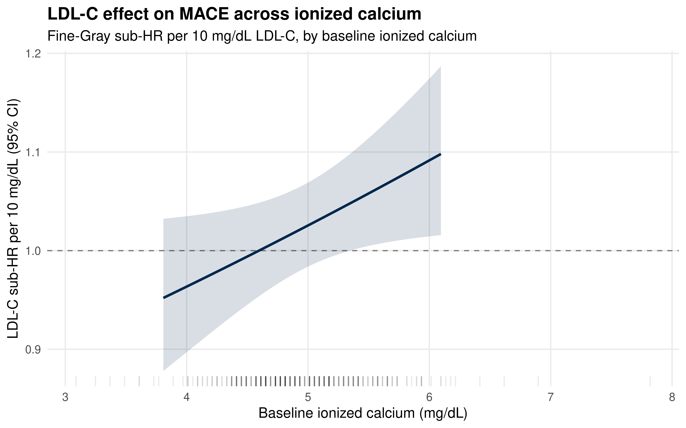
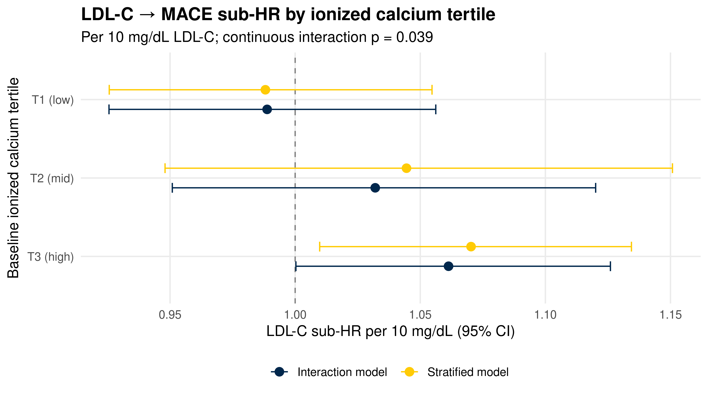

::: {.cell}

```{.r .cell-code}
library(tidyverse)
library(lubridate)
library(survival)
library(survminer)
library(cmprsk)
library(broom)
library(knitr)

# ── CONFIGURATION ──────────────────────────────────────────────────────────
# There is a single combined_data folder (the 2026-03-23 pull). The data-pull
# notes describing a separate "Calcium and Cholesterol" (MGI) extraction appear
# to be a documentation artefact — there is no distinct calcium-rich cohort to
# point at. Serum calcium is therefore sparse here (~4,000 patients with any
# value), which makes calcium coverage the binding constraint on this analysis.
# See the "Calcium Feasibility Diagnostic" section below before trusting any
# interaction estimate.
DATA_DIR      <- "combined_data"
SEX_COL       <- "GenderCode"
RACE_COL      <- "RaceCode"
ETHNICITY_COL <- "EthnicityCode"
LDL_SCALE     <- 10             # LDL-C HR expressed per this many mg/dL
CAL_WINDOW    <- 730            # baseline-calcium search window (days around t0)
                                # 365 → N=219/97ev/EPV 8.1 (underpowered for 12-coef model);
                                # 730 → N=367/154ev/EPV 12.8 ✓. See feasibility table.
                                # Widening trades baseline-timing precision for power.

# ── CALCIUM MODIFIER CHOICE ─────────────────────────────────────────────────
# Two calcium measures exist in LabResultsCleaned.csv, both in mg/dL:
#   "Ionized Calcium" — ~20,089 patients here; bioactive fraction; NO albumin
#                       correction needed; tends to be ordered in more acute/
#                       inpatient settings. Far better coverage → primary.
#   "Serum Calcium"   — ~4,009 patients here; conventional total calcium; would
#                       benefit from albumin correction (not available); sparse
#                       → run as a sensitivity by setting CALCIUM_TEST below.
CALCIUM_TEST  <- "Ionized Calcium"   # or "Serum Calcium"

# Physiologic guardrails (mg/dL) and reporting scale differ by measure.
if (CALCIUM_TEST == "Ionized Calcium") {
  CAL_LOW <- 2; CAL_HIGH <- 8;  CAL_SCALE <- 0.5  # ionized normal ~4.5–5.3
} else {
  CAL_LOW <- 4; CAL_HIGH <- 20; CAL_SCALE <- 1    # total normal ~8.5–10.5
}

theme_set(theme_minimal(base_size = 12))

# Michigan colors for plots
color_mace   <- "#00274c"
color_accent <- "#ffcb05"
color_death  <- "#CC6677"
color_censor <- "#888888"
```
:::


## Purpose

This script tests the central scientific question of the project: **does serum
calcium modify the relationship between time-averaged LDL-C and incident MACE?**

It re-uses the v3 unified competing-risks framework
(`ldlc_mace_competing_risks.qmd`) — Fine-Gray subdistribution hazard, death as
the competing event, time-averaged LDL-C (trapezoid AUC ÷ follow-up years) per
10 mg/dL, adjusted for age, sex, race/ethnicity, ever statin,
diabetes, and hypertension — and adds **serum calcium** as a candidate effect
modifier.

The main effects of LDL-C on MACE were null in the v3 analysis (Sub-HR ≈ 1.00).
A null *main* effect can nonetheless mask real effects that are concentrated in a
particular metabolic context. Serum calcium indexes that context (vascular
calcification, parathyroid/vitamin-D axis), motivating a formal interaction test.

**Modifier definition.** Calcium (`test_name == "Ionized Calcium"`, already
unit-harmonised to mg/dL in `labs_cleaning.qmd`) characterised at **baseline**
(the measurement nearest to time zero, within ±730 days). Calcium is
tightly homeostatically regulated, so a baseline value is a reasonable summary
and avoids requiring ≥2 calcium measurements. A **time-averaged** calcium
(trapezoid, parallel to the LDL-C exposure) is used as a sensitivity analysis.

> **Choice of calcium measure (`CALCIUM_TEST`).** Two measures exist in this
> dataset. **Ionized calcium** (~20,089 patients) is the default: it is the
> physiologically active fraction, needs no albumin correction, and — critically
> — has ~5× the coverage of **serum/total calcium** (~4,009 patients), which is
> too sparse to support a powered interaction here. The trade-off is that ionized
> calcium is ordered more often in acute/inpatient contexts, so it indexes a
> somewhat different physiologic state than routine outpatient total calcium.
> Re-run with `CALCIUM_TEST <- "Serum Calcium"` as a sensitivity; total calcium
> would additionally benefit from albumin correction (albumin is in the raw pull
> but not yet cleaned into `test_name` — add an `Albumin` branch to
> `labs_cleaning.qmd`, then corrected = total + 0.8 × (4.0 − albumin)).

**Interaction strategy (three complementary views).**

1. **Continuous × continuous** — product of time-averaged LDL-C (per 10
   mg/dL) and mean-centred baseline calcium (per 0.5 mg/dL). This is
   the primary formal test (Wald on the product coefficient; LRT in the Cox
   sensitivity).
2. **LDL-C × calcium-tertile** — product of LDL-C with calcium-tertile dummies;
   the LDL-C sub-HR is then recovered *within each tertile* via linear
   combinations of coefficients.
3. **Fully stratified Fine-Gray** — the primary model refit separately within
   each calcium tertile. Most intuitive; not a formal interaction test but a
   transparent description of how the LDL-C effect varies.

---

## Data Input


::: {.cell}

```{.r .cell-code}
demographic.data <- read_csv(file.path(DATA_DIR, "DemographicInfo.csv"),
                             show_col_types = FALSE) %>%
  mutate(
    DeID_PatientID = as.character(DeID_PatientID),
    ehr_death_date = mdy_hm(DeID_DeceasedDate)
  )

# Michigan Death Index
mdi.data <- read_csv(file.path(DATA_DIR, "MichiganDeathIndex.csv"),
                     show_col_types = FALSE) %>%
  mutate(
    DeID_PatientID = as.character(DeID_PatientID),
    mdi_death_date = mdy_hm(DeID_MDIDeceasedDate)
  ) %>%
  select(DeID_PatientID, mdi_death_date)

# Diagnoses
diagnosis.data <- read_csv(file.path(DATA_DIR, "DiagnosesCleaned.csv"),
                           show_col_types = FALSE) %>%
  mutate(
    DeID_PatientID = as.character(DeID_PatientID),
    MACE.onset     = ymd(MACE.onset)
  )

# Labs (shared parse for LDL-C and serum calcium)
lab.data <- read_csv(file.path(DATA_DIR, "LabResultsCleaned.csv"),
                     show_col_types = FALSE) %>%
  mutate(
    DeID_PatientID = as.character(DeID_PatientID),
    lab_date = coalesce(
      parse_date_time(DeID_COLLECTION_DATE,
                      orders = c("ymd", "mdy", "ymd HMS", "mdy HM"),
                      quiet  = TRUE),
      parse_date_time(DeID_AdmitDate,
                      orders = c("ymd", "mdy", "ymd HMS", "mdy HM"),
                      quiet  = TRUE)
    )
  )

ldlc.data    <- lab.data %>% filter(test_name == "LDL-C")
calcium.data <- lab.data %>% filter(test_name == CALCIUM_TEST)

cat("Distinct test_name values in lab file:\n")
```

::: {.cell-output .cell-output-stdout}

```
Distinct test_name values in lab file:
```


:::

```{.r .cell-code}
print(sort(unique(lab.data$test_name)))
```

::: {.cell-output .cell-output-stdout}

```
[1] "HDL-C"             "Ionized Calcium"   "LDL-C"            
[4] "Serum Calcium"     "Total Cholesterol" "Triglycerides"    
```


:::

```{.r .cell-code}
cat("\nCalcium modifier =", CALCIUM_TEST, ":", scales::comma(nrow(calcium.data)),
    "measurements across",
    scales::comma(n_distinct(calcium.data$DeID_PatientID)), "patients\n")
```

::: {.cell-output .cell-output-stdout}

```

Calcium modifier = Ionized Calcium : 107,810 measurements across 20,089 patients
```


:::

```{.r .cell-code}
# Encounters
encounter.data <- read_csv(file.path(DATA_DIR, "EncounterAll.csv"),
                           show_col_types = FALSE) %>%
  mutate(
    DeID_PatientID = as.character(DeID_PatientID),
    EncounterDate  = mdy_hm(DeID_AdmitDate)
  )

# Statin intervals
statin_intervals <- read_csv(
  file.path(DATA_DIR, "MedicationOrdersCleanedStatins.csv"),
  show_col_types = FALSE
) %>%
  mutate(
    DeID_PatientID = as.character(DeID_PatientID),
    period_start   = as_date(period_start),
    period_end     = as_date(period_end),
    intensity      = factor(intensity, levels = c("low", "moderate", "high"))
  )

# Comorbidities
comorbidity_onset <- read_csv(file.path(DATA_DIR, "ComorbiditiesOnset.csv"),
                              show_col_types = FALSE) %>%
  mutate(
    DeID_PatientID      = as.character(DeID_PatientID),
    diabetes_onset      = as_datetime(diabetes_onset),
    hypertension_onset  = as_datetime(hypertension_onset)
  )
```
:::


---

## Cohort Construction

Identical to `ldlc_mace_competing_risks.qmd` — reproduced so this script is
self-contained.


::: {.cell}

```{.r .cell-code}
# --- Unified death date (earliest of EHR + MDI) ---
death_dates <- demographic.data %>%
  select(DeID_PatientID, ehr_death_date) %>%
  left_join(mdi.data, by = "DeID_PatientID") %>%
  mutate(death_date = pmin(ehr_death_date, mdi_death_date, na.rm = TRUE))

# --- Full cohort with sex + race/ethnicity ---
full_cohort <- demographic.data %>%
  select(DeID_PatientID, all_of(c(SEX_COL, RACE_COL, ETHNICITY_COL))) %>%
  left_join(death_dates %>% select(DeID_PatientID, death_date),
            by = "DeID_PatientID") %>%
  left_join(diagnosis.data %>% select(DeID_PatientID, MACE, MACE.onset),
            by = "DeID_PatientID") %>%
  mutate(
    MACE_flag = if_else(MACE == TRUE, 1L, 0L, missing = 0L),
    sex_raw   = as.character(.data[[SEX_COL]]),
    sex       = case_when(
      str_detect(sex_raw, regex("^f", ignore_case = TRUE)) ~ "Female",
      str_detect(sex_raw, regex("^m", ignore_case = TRUE)) ~ "Male",
      TRUE ~ NA_character_
    ),
    race_eth = case_when(
      .data[[ETHNICITY_COL]] == "HL"          ~ "Hispanic",
      .data[[RACE_COL]] == "C"                ~ "White",
      .data[[RACE_COL]] == "AA"               ~ "Black",
      .data[[RACE_COL]] == "A"                ~ "Asian",
      TRUE                                    ~ "Other/Unknown"
    ),
    race_eth = factor(race_eth,
                      levels = c("White", "Black", "Asian",
                                 "Hispanic", "Other/Unknown"))
  )

# --- Clean diagnoses (exclude MACE=TRUE with missing onset) ---
diag_clean <- full_cohort %>%
  filter(!(MACE_flag == 1L & is.na(MACE.onset))) %>%
  select(DeID_PatientID, sex, race_eth, MACE.onset, MACE_flag, death_date)

# --- Clean LDL-C ---
ldlc_clean <- ldlc.data %>%
  filter(!is.na(lab_date), !is.na(AgeInYears)) %>%
  filter(value > 0, value <= 400) %>%
  filter(AgeInYears >= 18) %>%
  group_by(DeID_PatientID, lab_date) %>%
  summarise(
    LDL_value  = mean(value,      na.rm = TRUE),
    AgeInYears = mean(AgeInYears, na.rm = TRUE),
    .groups    = "drop"
  ) %>%
  arrange(DeID_PatientID, lab_date)

# --- Shared IDs (cohort base = LDL-C ∩ diagnoses) ---
shared_ids  <- intersect(diag_clean$DeID_PatientID, ldlc_clean$DeID_PatientID)
diag_cohort <- diag_clean %>% filter(DeID_PatientID %in% shared_ids)
ldlc_cohort <- ldlc_clean %>% filter(DeID_PatientID %in% shared_ids)

# --- Last encounter (censoring) ---
last_encounter <- encounter.data %>%
  filter(!is.na(EncounterDate), DeID_PatientID %in% shared_ids) %>%
  group_by(DeID_PatientID) %>%
  slice_max(EncounterDate, n = 1, with_ties = FALSE) %>%
  ungroup() %>%
  select(DeID_PatientID, last_encounter_date = EncounterDate)

# --- First LDL-C = time zero ---
first_ldlc <- ldlc_cohort %>%
  group_by(DeID_PatientID) %>%
  slice_min(lab_date, n = 1, with_ties = FALSE) %>%
  ungroup() %>%
  select(DeID_PatientID,
         t0           = lab_date,
         LDL_baseline = LDL_value,
         Age_baseline = AgeInYears)

# --- Base cohort with competing risks status ---
base_cohort_full <- diag_cohort %>%
  left_join(first_ldlc,     by = "DeID_PatientID") %>%
  left_join(last_encounter, by = "DeID_PatientID") %>%
  mutate(
    t_end = case_when(
      MACE_flag == 1              ~ MACE.onset,
      !is.na(last_encounter_date) ~ last_encounter_date,
      TRUE                        ~ NA_POSIXct_
    ),
    follow_up_days  = as.numeric(difftime(t_end, t0, units = "days")),
    follow_up_years = follow_up_days / 365.25,
    fg_status = case_when(
      MACE_flag == 1                                   ~ 1L,  # MACE
      !is.na(death_date) & death_date <= t_end &
        MACE_flag == 0                                 ~ 2L,  # death w/o MACE
      TRUE                                             ~ 0L   # censored
    )
  )

base_cohort <- base_cohort_full %>% filter(follow_up_days > 0)

cat("Base cohort:", scales::comma(nrow(base_cohort)), "patients\n")
```

::: {.cell-output .cell-output-stdout}

```
Base cohort: 20,015 patients
```


:::
:::


---

## LDL-C Exposure (time-averaged, trapezoid)


::: {.cell}

```{.r .cell-code}
ldlc_with_time <- ldlc_cohort %>%
  filter(DeID_PatientID %in% base_cohort$DeID_PatientID) %>%
  left_join(base_cohort %>% select(DeID_PatientID, t0, t_end),
            by = "DeID_PatientID") %>%
  filter(lab_date >= t0, lab_date <= t_end) %>%
  mutate(t_years = as.numeric(difftime(lab_date, t0, units = "days")) / 365.25) %>%
  arrange(DeID_PatientID, t_years)

n_measurements <- ldlc_with_time %>%
  count(DeID_PatientID, name = "n_measurements")

auc_trapezoid <- ldlc_with_time %>%
  group_by(DeID_PatientID) %>%
  mutate(
    t_next   = lead(t_years),
    ldl_next = lead(LDL_value),
    t_end_yr = as.numeric(difftime(first(t_end), first(t0),
                                   units = "days")) / 365.25,
    interval_area = case_when(
      !is.na(t_next) ~ (LDL_value + ldl_next) / 2 * (t_next - t_years),
      TRUE           ~ LDL_value * (t_end_yr - t_years)
    )
  ) %>%
  summarise(
    cumLDL_trap = sum(interval_area, na.rm = TRUE),
    fu_years    = first(t_end_yr),
    .groups     = "drop"
  ) %>%
  mutate(meanLDL_trap = cumLDL_trap / fu_years)

base_cohort <- base_cohort %>%
  left_join(n_measurements, by = "DeID_PatientID") %>%
  left_join(auc_trapezoid %>% select(DeID_PatientID, meanLDL_trap),
            by = "DeID_PatientID") %>%
  mutate(
    LDL_baseline_s = LDL_baseline / LDL_SCALE,
    meanLDL_trap_s = meanLDL_trap / LDL_SCALE
  )
```
:::


---

## Calcium Modifier

Baseline calcium = the Ionized Calcium measurement nearest to t0 within
±730 days. Time-averaged calcium (trapezoid, over follow-up) is also
computed for the sensitivity analysis.


::: {.cell}

```{.r .cell-code}
# --- Clean serum calcium (drop implausible values) ---
calcium_clean <- calcium.data %>%
  filter(!is.na(lab_date), !is.na(value)) %>%
  filter(value >= CAL_LOW, value <= CAL_HIGH) %>%   # measure-specific guardrails (mg/dL)
  group_by(DeID_PatientID, lab_date) %>%
  summarise(Ca_value = mean(value, na.rm = TRUE), .groups = "drop") %>%
  semi_join(base_cohort, by = "DeID_PatientID") %>%
  left_join(base_cohort %>% select(DeID_PatientID, t0, t_end),
            by = "DeID_PatientID")

# --- Baseline calcium: nearest measurement to t0 within window ---
calcium_baseline <- calcium_clean %>%
  filter(lab_date >= t0 - days(CAL_WINDOW), lab_date <= t_end) %>%
  mutate(gap_days = abs(as.numeric(difftime(lab_date, t0, units = "days")))) %>%
  filter(gap_days <= CAL_WINDOW) %>%
  group_by(DeID_PatientID) %>%
  slice_min(gap_days, n = 1, with_ties = FALSE) %>%
  ungroup() %>%
  select(DeID_PatientID, Ca_baseline = Ca_value, Ca_gap_days = gap_days)

# --- Time-averaged calcium (trapezoid) over follow-up; sensitivity ---
calcium_avg <- calcium_clean %>%
  filter(lab_date >= t0, lab_date <= t_end) %>%
  mutate(t_years = as.numeric(difftime(lab_date, t0, units = "days")) / 365.25) %>%
  arrange(DeID_PatientID, t_years) %>%
  group_by(DeID_PatientID) %>%
  mutate(
    t_next  = lead(t_years),
    ca_next = lead(Ca_value),
    t_end_yr = as.numeric(difftime(first(t_end), first(t0),
                                   units = "days")) / 365.25,
    n_ca     = n(),
    interval_area = case_when(
      !is.na(t_next) ~ (Ca_value + ca_next) / 2 * (t_next - t_years),
      TRUE           ~ Ca_value * (t_end_yr - t_years)
    )
  ) %>%
  summarise(
    cumCa  = sum(interval_area, na.rm = TRUE),
    fu_yr  = first(t_end_yr),
    n_ca   = first(n_ca),
    .groups = "drop"
  ) %>%
  mutate(Ca_meanavg = cumCa / fu_yr) %>%
  select(DeID_PatientID, Ca_meanavg, n_ca)

base_cohort <- base_cohort %>%
  left_join(calcium_baseline, by = "DeID_PatientID") %>%
  left_join(calcium_avg,      by = "DeID_PatientID")

# --- Coverage ---
base_cohort %>%
  summarise(
    `Base cohort N`                  = n(),
    `With baseline calcium`          = sum(!is.na(Ca_baseline)),
    `With baseline calcium (%)`      = round(100 * mean(!is.na(Ca_baseline)), 1),
    `Median Ca gap to t0 (days)`     = round(median(Ca_gap_days, na.rm = TRUE), 0),
    `With ≥1 time-avg calcium`       = sum(!is.na(Ca_meanavg)),
    `Median baseline Ca (mg/dL)`     = round(median(Ca_baseline, na.rm = TRUE), 2)
  ) %>%
  pivot_longer(everything(), names_to = "Metric", values_to = "Value") %>%
  kable(caption = paste(CALCIUM_TEST, "coverage in the base cohort"))
```

::: {.cell-output-display}


Table: Ionized Calcium coverage in the base cohort

|Metric                     |    Value|
|:--------------------------|--------:|
|Base cohort N              | 20015.00|
|With baseline calcium      |   991.00|
|With baseline calcium (%)  |     5.00|
|Median Ca gap to t0 (days) |   279.00|
|With ≥1 time-avg calcium   |  2122.00|
|Median baseline Ca (mg/dL) |     4.89|


:::
:::


### Calcium Feasibility Diagnostic

Calcium co-measurement is the binding constraint. Before trusting any interaction
estimate, this table shows the **achievable analytic cohort** — patient N, MACE
events, and events-per-variable for the ~12-coefficient full model — crossing
the LDL-measurement requirement against the baseline-calcium window (how close
to t0 a calcium value must fall to count as "baseline"). Read it to choose a
defensible (window, LDL) combination, or to conclude the question is
underpowered in this dataset.


::: {.cell}

```{.r .cell-code}
# Nearest serum calcium to t0 (on/before t_end) for every base-cohort patient
ca_nearest <- calcium_clean %>%
  filter(lab_date <= t_end) %>%
  mutate(gap_days = abs(as.numeric(difftime(lab_date, t0, units = "days")))) %>%
  group_by(DeID_PatientID) %>%
  slice_min(gap_days, n = 1, with_ties = FALSE) %>%
  ungroup() %>%
  select(DeID_PatientID, gap_days)

ldl_sets <- list(
  "≥2 LDL"       = base_cohort %>% filter(n_measurements >= 2),
  "≥1 LDL (all)" = base_cohort %>% filter(n_measurements >= 1)
)
window_grid <- c(180, 365, 730, 1095, 1826, Inf)

feasibility <- map_dfr(names(ldl_sets), function(ldl_lab) {
  base_sub <- ldl_sets[[ldl_lab]] %>%
    left_join(ca_nearest, by = "DeID_PatientID")
  map_dfr(window_grid, function(w) {
    sub <- base_sub %>% filter(!is.na(gap_days), gap_days <= w)
    ev  <- sum(sub$fg_status == 1)
    tibble(
      `LDL requirement` = ldl_lab,
      `Ca window (days)` = if (is.infinite(w)) "any" else as.character(w),
      `N`                = nrow(sub),
      `MACE events`      = ev,
      `EPV (12-coef)`    = round(ev / 12, 1),
      `Adequate?`        = if (ev / 12 >= 10) "✓" else "⚠ low"
    )
  })
})

feasibility %>%
  kable(caption = "Achievable calcium-interaction cohort (N, MACE events, events-per-variable)")
```

::: {.cell-output-display}


Table: Achievable calcium-interaction cohort (N, MACE events, events-per-variable)

|LDL requirement |Ca window (days) |    N| MACE events| EPV (12-coef)|Adequate? |
|:---------------|:----------------|----:|-----------:|-------------:|:---------|
|≥2 LDL          |180              |  133|          61|           5.1|⚠ low     |
|≥2 LDL          |365              |  219|          97|           8.1|⚠ low     |
|≥2 LDL          |730              |  367|         154|          12.8|✓         |
|≥2 LDL          |1095             |  463|         201|          16.8|✓         |
|≥2 LDL          |1826             |  626|         277|          23.1|✓         |
|≥2 LDL          |any              | 1125|         410|          34.2|✓         |
|≥1 LDL (all)    |180              |  351|         144|          12.0|✓         |
|≥1 LDL (all)    |365              |  589|         237|          19.8|✓         |
|≥1 LDL (all)    |730              |  991|         378|          31.5|✓         |
|≥1 LDL (all)    |1095             | 1284|         498|          41.5|✓         |
|≥1 LDL (all)    |1826             | 1763|         683|          56.9|✓         |
|≥1 LDL (all)    |any              | 3057|         994|          82.8|✓         |


:::
:::


---

## Covariates


::: {.cell}

```{.r .cell-code}
# Ever/never statin (any prescription overlapping [t0, t_end])
ever_statin <- statin_intervals %>%
  inner_join(base_cohort %>% select(DeID_PatientID, t0, t_end),
             by = "DeID_PatientID") %>%
  filter(period_end >= as_date(t0), period_start <= as_date(t_end)) %>%
  distinct(DeID_PatientID) %>%
  mutate(ever_statin = 1L)

comorbidity_fixed <- comorbidity_onset %>%
  inner_join(base_cohort %>% select(DeID_PatientID, t0, t_end),
             by = "DeID_PatientID") %>%
  mutate(
    ever_diabetes     = as.integer(!is.na(diabetes_onset) &
                                     diabetes_onset <= t_end),
    ever_hypertension = as.integer(!is.na(hypertension_onset) &
                                     hypertension_onset <= t_end)
  ) %>%
  select(DeID_PatientID, ever_diabetes, ever_hypertension)

base_cohort <- base_cohort %>%
  left_join(ever_statin,       by = "DeID_PatientID") %>%
  left_join(comorbidity_fixed, by = "DeID_PatientID") %>%
  mutate(
    ever_statin       = replace_na(ever_statin, 0L),
    ever_diabetes     = replace_na(ever_diabetes, 0L),
    ever_hypertension = replace_na(ever_hypertension, 0L),
    sex               = factor(sex),
    race_eth          = factor(race_eth,
                               levels = c("White", "Black", "Asian",
                                          "Hispanic", "Other/Unknown"))
  )
```
:::


---

## Analytic Cohort & Calcium Tertiles

Primary analytic cohort: ≥2 LDL-C measurements **and** a baseline serum-calcium
value. Tertiles are defined within this cohort so they are balanced for the
stratified analysis.


::: {.cell}

```{.r .cell-code}
analytic <- base_cohort %>%
  filter(n_measurements >= 2,
         !is.na(meanLDL_trap_s), !is.na(Ca_baseline),
         !is.na(Age_baseline), !is.na(sex), !is.na(race_eth)) %>%
  mutate(
    # mean-centred calcium (continuous interaction, per CAL_SCALE mg/dL)
    Ca_center  = mean(Ca_baseline),
    Ca_c       = (Ca_baseline - Ca_center) / CAL_SCALE,
    # tertiles
    Ca_tertile = cut(Ca_baseline,
                     breaks = quantile(Ca_baseline, probs = c(0, 1/3, 2/3, 1),
                                       na.rm = TRUE),
                     include.lowest = TRUE,
                     labels = c("T1 (low)", "T2 (mid)", "T3 (high)")),
    cal_mid    = as.integer(Ca_tertile == "T2 (mid)"),
    cal_high   = as.integer(Ca_tertile == "T3 (high)"),
    # dummy-coded covariates for crr()
    sex_female = as.integer(sex == "Female"),
    race_black = as.integer(race_eth == "Black"),
    race_asian = as.integer(race_eth == "Asian"),
    race_hisp  = as.integer(race_eth == "Hispanic"),
    race_other = as.integer(race_eth == "Other/Unknown"),
    # interaction columns
    ldl_x_cac  = meanLDL_trap_s * Ca_c,
    ldl_x_mid  = meanLDL_trap_s * cal_mid,
    ldl_x_high = meanLDL_trap_s * cal_high
  )

n_mace_events <- sum(analytic$fg_status == 1)
cat("Analytic cohort N:", nrow(analytic),
    "| MACE events:", n_mace_events,
    "| competing deaths:", sum(analytic$fg_status == 2), "\n")
```

::: {.cell-output .cell-output-stdout}

```
Analytic cohort N: 367 | MACE events: 154 | competing deaths: 61 
```


:::

```{.r .cell-code}
# --- Events-per-variable guard ---------------------------------------------
# The full interaction model fits ~12 coefficients. With <10 events per
# coefficient, Fine-Gray estimates are unstable / prone to quasi-complete
# separation (sub-HRs of 0 or 1e+17, p-values that look "significant" but are
# artefactual). This guard makes underpowering loud rather than silent — it is
# the lesson from the earlier N=19 render.
n_coefs_full <- 12L
epv <- n_mace_events / n_coefs_full
if (epv < 10) {
  warning(sprintf(
    paste0("LOW POWER: %d MACE events for ~%d coefficients (%.1f events/var). ",
           "Interpret the fully adjusted interaction with great caution — ",
           "favour the parsimonious/continuous models and check coefficients ",
           "for separation (sub-HRs near 0 or astronomically large)."),
    n_mace_events, n_coefs_full, epv))
}
cat(sprintf("Events per variable (full model): %.1f %s\n", epv,
            if (epv < 10) "⚠ UNDERPOWERED" else "✓ adequate"))
```

::: {.cell-output .cell-output-stdout}

```
Events per variable (full model): 12.8 ✓ adequate
```


:::

```{.r .cell-code}
# Tertile cutpoints + per-tertile description
analytic %>%
  group_by(Ca_tertile) %>%
  summarise(
    N                = n(),
    `MACE events`    = sum(fg_status == 1),
    `Ca range`       = paste0(round(min(Ca_baseline), 2), "–",
                              round(max(Ca_baseline), 2)),
    `Median Ca`      = round(median(Ca_baseline), 2),
    `Median time-avg LDL-C` = round(median(meanLDL_trap, na.rm = TRUE), 1),
    `Female (%)`     = round(100 * mean(sex == "Female"), 1),
    `Ever statin (%)`= round(100 * mean(ever_statin), 1),
    `Diabetes (%)`   = round(100 * mean(ever_diabetes), 1),
    .groups = "drop"
  ) %>%
  kable(caption = "Baseline serum-calcium tertiles (analytic cohort)")
```

::: {.cell-output-display}


Table: Baseline serum-calcium tertiles (analytic cohort)

|Ca_tertile |   N| MACE events|Ca range  | Median Ca| Median time-avg LDL-C| Female (%)| Ever statin (%)| Diabetes (%)|
|:----------|---:|-----------:|:---------|---------:|---------------------:|----------:|---------------:|------------:|
|T1 (low)   | 136|          62|3.09–4.73 |      4.51|                  93.8|       48.5|            69.9|         72.8|
|T2 (mid)   | 116|          42|4.77–5.13 |      4.93|                  96.9|       44.8|            74.1|         69.0|
|T3 (high)  | 115|          50|5.17–7.82 |      5.41|                  98.5|       53.9|            73.9|         67.8|


:::
:::


---

## Helper Functions


::: {.cell}

```{.r .cell-code}
# Fit crr() passing vectors directly (NOT with(); see ANALYSIS_NOTES.md).
# Robustness for subgroup/stratified fits: drop columns that are zero-variance
# OR binary indicators with too few minority cases (these cause quasi-separation
# and a computationally singular information matrix). A retry loop then drops the
# sparsest remaining indicator if crr() still fails to converge.
minority_count <- function(x) {
  ux <- unique(na.omit(x))
  if (length(ux) <= 2) min(table(x)) else Inf   # Inf = treat as continuous
}

safe_crr <- function(ftime, fstatus, cov_mat, failcode = 1, min_minor = 5) {
  # 1. pre-screen: zero variance or sparse indicators
  vars   <- apply(cov_mat, 2, var, na.rm = TRUE)
  minors <- apply(cov_mat, 2, minority_count)
  bad    <- which(is.na(vars) | vars == 0 | minors < min_minor)
  if (length(bad) > 0) {
    cat("  Dropping zero-variance/sparse columns:",
        paste(colnames(cov_mat)[bad], collapse = ", "), "\n")
    cov_mat <- cov_mat[, -bad, drop = FALSE]
  }
  # 2. fit, retrying on singularity by dropping the sparsest indicator
  repeat {
    fit <- tryCatch(
      crr(ftime = ftime, fstatus = fstatus, cov1 = cov_mat,
          failcode = failcode, cencode = 0),
      error = function(e) e
    )
    if (!inherits(fit, "error")) return(fit)
    if (!grepl("singular", conditionMessage(fit), ignore.case = TRUE) ||
        ncol(cov_mat) <= 1) stop(fit)
    m <- apply(cov_mat, 2, minority_count)
    if (all(is.infinite(m))) stop(fit)   # only continuous left; give up
    drop_j <- which.min(m)
    cat("  Singular fit — dropping sparsest indicator:",
        colnames(cov_mat)[drop_j], "\n")
    cov_mat <- cov_mat[, -drop_j, drop = FALSE]
  }
}

# Tidy a crr fit's full coefficient table
format_fg <- function(fg_fit, caption) {
  s <- summary(fg_fit)
  tibble(
    Term          = rownames(s$coef),
    `Sub-HR`      = round(exp(s$coef[, "coef"]), 4),
    `95% CI low`  = round(exp(s$coef[, "coef"] - 1.96 * s$coef[, "se(coef)"]), 4),
    `95% CI high` = round(exp(s$coef[, "coef"] + 1.96 * s$coef[, "se(coef)"]), 4),
    `p-value`     = format.pval(s$coef[, "p-value"], digits = 3, eps = 0.001)
  ) %>% kable(caption = caption)
}

# Sub-HR for an arbitrary linear combination of crr coefficients.
# `weights` is a named numeric vector keyed by coefficient name.
fg_lincom <- function(fg_fit, weights, label) {
  b <- fg_fit$coef
  V <- fg_fit$var
  cvec <- setNames(rep(0, length(b)), names(b))
  cvec[names(weights)] <- weights
  est <- sum(cvec * b)
  se  <- sqrt(as.numeric(t(cvec) %*% V %*% cvec))
  tibble(
    Stratum       = label,
    `Sub-HR`      = round(exp(est), 4),
    `95% CI low`  = round(exp(est - 1.96 * se), 4),
    `95% CI high` = round(exp(est + 1.96 * se), 4),
    `p-value`     = format.pval(2 * pnorm(-abs(est / se)), digits = 3, eps = 0.001)
  )
}

# Shared covariate block (everything except the LDL/calcium terms)
adj_cols <- c("Age_baseline", "sex_female",
              "race_black", "race_asian", "race_hisp", "race_other",
              "ever_statin", "ever_diabetes", "ever_hypertension")
```
:::


---

## Model 0: LDL-C and Calcium Main Effects (no interaction)

For reference — the additive model before adding any interaction term.


::: {.cell}

```{.r .cell-code}
cov_main <- as.matrix(analytic %>%
  select(meanLDL_trap_s, Ca_c, all_of(adj_cols)))

fg_main <- safe_crr(analytic$follow_up_days, analytic$fg_status, cov_main)

format_fg(fg_main,
  paste0("Main-effects Fine-Gray: time-avg LDL-C (per ", LDL_SCALE,
         " mg/dL) + baseline calcium (per ", CAL_SCALE,
         " mg/dL), death competing"))
```

::: {.cell-output-display}


Table: Main-effects Fine-Gray: time-avg LDL-C (per 10 mg/dL) + baseline calcium (per 0.5 mg/dL), death competing

|Term              | Sub-HR| 95% CI low| 95% CI high|p-value |
|:-----------------|------:|----------:|-----------:|:-------|
|meanLDL_trap_s    | 1.0232|     0.9806|      1.0676|0.290   |
|Ca_c              | 1.0427|     0.8963|      1.2131|0.590   |
|Age_baseline      | 1.0117|     1.0008|      1.0227|0.035   |
|sex_female        | 0.7818|     0.5515|      1.1083|0.170   |
|race_black        | 0.7313|     0.4177|      1.2806|0.270   |
|race_asian        | 0.7189|     0.2793|      1.8504|0.490   |
|race_hisp         | 0.6240|     0.1887|      2.0629|0.440   |
|race_other        | 1.2537|     0.5575|      2.8192|0.580   |
|ever_statin       | 0.7496|     0.5201|      1.0805|0.120   |
|ever_diabetes     | 0.8326|     0.5750|      1.2055|0.330   |
|ever_hypertension | 1.1711|     0.6554|      2.0926|0.590   |


:::
:::


---

## Model 1: Continuous LDL-C × Calcium Interaction (PRIMARY TEST)

Product of time-averaged LDL-C and mean-centred baseline calcium. Because
calcium is centred, the `meanLDL_trap_s` coefficient is the LDL-C sub-HR **at
mean calcium**, and `ldl_x_cac` is the multiplicative change in that sub-HR per
0.5 mg/dL higher calcium.


::: {.cell}

```{.r .cell-code}
cov_int <- as.matrix(analytic %>%
  select(meanLDL_trap_s, Ca_c, ldl_x_cac, all_of(adj_cols)))

fg_int <- safe_crr(analytic$follow_up_days, analytic$fg_status, cov_int)

format_fg(fg_int,
  "Fine-Gray with continuous LDL-C × calcium interaction (death competing)")
```

::: {.cell-output-display}


Table: Fine-Gray with continuous LDL-C × calcium interaction (death competing)

|Term              | Sub-HR| 95% CI low| 95% CI high|p-value |
|:-----------------|------:|----------:|-----------:|:-------|
|meanLDL_trap_s    | 1.0214|     0.9798|      1.0649|0.320   |
|Ca_c              | 0.7399|     0.4971|      1.1013|0.140   |
|ldl_x_cac         | 1.0317|     1.0016|      1.0627|0.039   |
|Age_baseline      | 1.0117|     1.0007|      1.0228|0.038   |
|sex_female        | 0.7818|     0.5522|      1.1070|0.170   |
|race_black        | 0.7426|     0.4247|      1.2982|0.300   |
|race_asian        | 0.7283|     0.2890|      1.8355|0.500   |
|race_hisp         | 0.6615|     0.2073|      2.1102|0.480   |
|race_other        | 1.2985|     0.5779|      2.9174|0.530   |
|ever_statin       | 0.7496|     0.5177|      1.0855|0.130   |
|ever_diabetes     | 0.8344|     0.5762|      1.2082|0.340   |
|ever_hypertension | 1.2873|     0.6929|      2.3916|0.420   |


:::

```{.r .cell-code}
# Explicit interaction test
s_int    <- summary(fg_int)
int_p    <- s_int$coef["ldl_x_cac", "p-value"]
int_beta <- s_int$coef["ldl_x_cac", "coef"]
int_se   <- s_int$coef["ldl_x_cac", "se(coef)"]

tibble(
  Quantity = c(sprintf("Interaction sub-HR ratio (per %g mg/dL %s, per %g mg/dL LDL-C)",
                        CAL_SCALE, CALCIUM_TEST, LDL_SCALE),
               "95% CI",
               "Wald p-value"),
  Value = c(
    sprintf("%.4f", exp(int_beta)),
    sprintf("(%.4f–%.4f)", exp(int_beta - 1.96 * int_se),
            exp(int_beta + 1.96 * int_se)),
    format.pval(int_p, digits = 3, eps = 0.001)
  )
) %>% kable(caption = "PRIMARY interaction test (continuous × continuous)")
```

::: {.cell-output-display}


Table: PRIMARY interaction test (continuous × continuous)

|Quantity                                                                     |Value           |
|:----------------------------------------------------------------------------|:---------------|
|Interaction sub-HR ratio (per 0.5 mg/dL Ionized Calcium, per 10 mg/dL LDL-C) |1.0317          |
|95% CI                                                                       |(1.0016–1.0627) |
|Wald p-value                                                                 |0.039           |


:::
:::


### LDL-C sub-HR across the observed calcium range

Predicted LDL-C sub-HR (per 10 mg/dL) as a function of baseline
calcium, from Model 1. Ribbon is the 95% CI from the 2×2 covariance block of the
LDL-C main and interaction coefficients.


::: {.cell}

```{.r .cell-code}
b   <- fg_int$coef
V   <- fg_int$var
# crr()'s $var has no dimnames; $coef does — propagate them so we can index by name
cov_names <- names(b)
if (is.null(cov_names)) cov_names <- colnames(cov_int)
names(b)   <- cov_names
dimnames(V) <- list(cov_names, cov_names)
idx <- c("meanLDL_trap_s", "ldl_x_cac")

ca_grid <- tibble(
  Ca_baseline = seq(quantile(analytic$Ca_baseline, 0.02),
                    quantile(analytic$Ca_baseline, 0.98),
                    length.out = 100)
) %>%
  mutate(
    Ca_c   = (Ca_baseline - mean(analytic$Ca_baseline)) / CAL_SCALE,
    loghr  = b["meanLDL_trap_s"] + b["ldl_x_cac"] * Ca_c,
    se     = sqrt(V[idx[1], idx[1]] +
                  Ca_c^2 * V[idx[2], idx[2]] +
                  2 * Ca_c * V[idx[1], idx[2]]),
    SubHR  = exp(loghr),
    lo     = exp(loghr - 1.96 * se),
    hi     = exp(loghr + 1.96 * se)
  )

ggplot(ca_grid, aes(Ca_baseline, SubHR)) +
  geom_hline(yintercept = 1, linetype = "dashed", colour = "grey50") +
  geom_ribbon(aes(ymin = lo, ymax = hi), alpha = 0.15, fill = color_mace) +
  geom_line(colour = color_mace, linewidth = 1) +
  geom_rug(data = analytic, aes(x = Ca_baseline), inherit.aes = FALSE,
           alpha = 0.08, sides = "b") +
  labs(
    title    = paste0("LDL-C effect on MACE across ", tolower(CALCIUM_TEST)),
    subtitle = paste0("Fine-Gray sub-HR per ", LDL_SCALE,
                      " mg/dL LDL-C, by baseline ", tolower(CALCIUM_TEST)),
    x = paste0("Baseline ", tolower(CALCIUM_TEST), " (mg/dL)"),
    y = paste0("LDL-C sub-HR per ", LDL_SCALE, " mg/dL (95% CI)")
  ) +
  theme_minimal(base_size = 12) +
  theme(panel.grid.minor = element_blank(),
        plot.title = element_text(face = "bold"))
```

::: {.cell-output-display}
{#fig-interaction-curve width=2400}
:::
:::


---

## Model 2: LDL-C × Calcium-Tertile Interaction

Product of LDL-C with calcium-tertile dummies (reference = T1 low). The LDL-C
sub-HR within each tertile is recovered via linear combinations.


::: {.cell}

```{.r .cell-code}
cov_tert <- as.matrix(analytic %>%
  select(meanLDL_trap_s, cal_mid, cal_high, ldl_x_mid, ldl_x_high,
         all_of(adj_cols)))

fg_tert <- safe_crr(analytic$follow_up_days, analytic$fg_status, cov_tert)

format_fg(fg_tert,
  "Fine-Gray with LDL-C × calcium-tertile interaction (death competing)")
```

::: {.cell-output-display}


Table: Fine-Gray with LDL-C × calcium-tertile interaction (death competing)

|Term              | Sub-HR| 95% CI low| 95% CI high|p-value |
|:-----------------|------:|----------:|-----------:|:-------|
|meanLDL_trap_s    | 0.9888|     0.9256|      1.0562|0.740   |
|cal_mid           | 0.4655|     0.1502|      1.4425|0.190   |
|cal_high          | 0.4549|     0.1707|      1.2126|0.120   |
|ldl_x_mid         | 1.0438|     0.9400|      1.1590|0.420   |
|ldl_x_high        | 1.0733|     0.9844|      1.1703|0.110   |
|Age_baseline      | 1.0131|     1.0018|      1.0245|0.023   |
|sex_female        | 0.7779|     0.5470|      1.1063|0.160   |
|race_black        | 0.7073|     0.3987|      1.2548|0.240   |
|race_asian        | 0.7046|     0.2786|      1.7818|0.460   |
|race_hisp         | 0.6557|     0.2088|      2.0593|0.470   |
|race_other        | 1.2356|     0.5356|      2.8506|0.620   |
|ever_statin       | 0.7749|     0.5307|      1.1315|0.190   |
|ever_diabetes     | 0.8187|     0.5644|      1.1877|0.290   |
|ever_hypertension | 1.1524|     0.6297|      2.1092|0.650   |


:::

```{.r .cell-code}
# LDL-C sub-HR within each tertile via linear combinations
ldl_by_tertile <- bind_rows(
  fg_lincom(fg_tert, c(meanLDL_trap_s = 1),                   "T1 (low)"),
  fg_lincom(fg_tert, c(meanLDL_trap_s = 1, ldl_x_mid  = 1),   "T2 (mid)"),
  fg_lincom(fg_tert, c(meanLDL_trap_s = 1, ldl_x_high = 1),   "T3 (high)")
)

ldl_by_tertile %>%
  kable(caption = paste0(
    "LDL-C sub-HR per ", LDL_SCALE,
    " mg/dL within calcium tertiles (interaction model, linear combinations)"))
```

::: {.cell-output-display}


Table: LDL-C sub-HR per 10 mg/dL within calcium tertiles (interaction model, linear combinations)

|Stratum   | Sub-HR| 95% CI low| 95% CI high|p-value |
|:---------|------:|----------:|-----------:|:-------|
|T1 (low)  | 0.9888|     0.9256|      1.0562|0.737   |
|T2 (mid)  | 1.0320|     0.9509|      1.1201|0.45    |
|T3 (high) | 1.0613|     1.0003|      1.1260|0.0489  |


:::
:::


---

## Model 3: Fully Stratified Fine-Gray (within each calcium tertile)

The primary model refit separately within each tertile. Most transparent view of
effect modification.

Within a single tertile some covariates become sparse (e.g. minority
race/ethnicity groups, comorbidities), which can render the Fine-Gray
information matrix singular. The stratified models therefore use a **lean,
fixed** covariate set (age, sex, ever statin) so the adjustment is identical
across strata and nothing is dropped. The fully adjusted interaction tests above
(Models 1–2, Cox LRT) remain the formal analyses; this is a descriptive view.
Any stratum that still fails to converge is reported as `NA`.


::: {.cell}

```{.r .cell-code}
adj_cols_lean <- c("Age_baseline", "sex_female", "ever_statin")

fit_in_tertile <- function(df, label) {
  base_row <- tibble(Stratum = label, N = nrow(df),
                     `MACE events` = sum(df$fg_status == 1))
  cov <- as.matrix(df %>% select(meanLDL_trap_s, all_of(adj_cols_lean)))
  out <- tryCatch(
    fg_lincom(safe_crr(df$follow_up_days, df$fg_status, cov),
              c(meanLDL_trap_s = 1), label),
    error = function(e) {
      cat("  Stratum", label, "did not converge:",
          conditionMessage(e), "\n")
      tibble(Stratum = label, `Sub-HR` = NA_real_,
             `95% CI low` = NA_real_, `95% CI high` = NA_real_,
             `p-value` = NA_character_)
    }
  )
  base_row %>% left_join(out, by = "Stratum")
}

stratified_ldl <- analytic %>%
  group_split(Ca_tertile) %>%
  map2_dfr(levels(analytic$Ca_tertile), ~ fit_in_tertile(.x, .y))

stratified_ldl %>%
  kable(caption = paste0(
    "LDL-C sub-HR per ", LDL_SCALE,
    " mg/dL — fully stratified Fine-Gray within calcium tertiles"))
```

::: {.cell-output-display}


Table: LDL-C sub-HR per 10 mg/dL — fully stratified Fine-Gray within calcium tertiles

|Stratum   |   N| MACE events| Sub-HR| 95% CI low| 95% CI high|p-value |
|:---------|---:|-----------:|------:|----------:|-----------:|:-------|
|T1 (low)  | 136|          62| 0.9881|     0.9257|      1.0547|0.718   |
|T2 (mid)  | 116|          42| 1.0445|     0.9480|      1.1508|0.379   |
|T3 (high) | 115|          50| 1.0703|     1.0098|      1.1344|0.022   |


:::
:::


---

## Sensitivity A: Cox Interaction with Likelihood-Ratio Test

Fine-Gray gives a Wald test for the interaction; Cox additionally permits a clean
LRT (nested-model comparison), which is generally preferred for interaction
terms.


::: {.cell}

```{.r .cell-code}
cox_main <- coxph(
  Surv(follow_up_days, MACE_flag) ~ meanLDL_trap_s + Ca_c + Age_baseline +
    sex + race_eth + ever_statin + ever_diabetes + ever_hypertension,
  data = analytic, ties = "efron"
)

cox_int <- update(cox_main, . ~ . + meanLDL_trap_s:Ca_c)

# LRT
lrt <- anova(cox_main, cox_int)

broom::tidy(cox_int, exponentiate = TRUE, conf.int = TRUE) %>%
  filter(term %in% c("meanLDL_trap_s", "Ca_c", "meanLDL_trap_s:Ca_c")) %>%
  mutate(across(where(is.numeric), ~round(.x, 4))) %>%
  select(term, estimate, conf.low, conf.high, p.value) %>%
  kable(caption = "Cox interaction model — key terms (sensitivity)")
```

::: {.cell-output-display}


Table: Cox interaction model — key terms (sensitivity)

|term                | estimate| conf.low| conf.high| p.value|
|:-------------------|--------:|--------:|---------:|-------:|
|meanLDL_trap_s      |   1.0117|   0.9696|    1.0557|  0.5912|
|Ca_c                |   0.6781|   0.4424|    1.0392|  0.0745|
|meanLDL_trap_s:Ca_c |   1.0367|   1.0012|    1.0734|  0.0425|


:::

```{.r .cell-code}
tibble(
  Test = "LRT: main-effects vs interaction (Cox)",
  `Chi-sq` = round(lrt$Chisq[2], 3),
  df = lrt$Df[2],
  `p-value` = format.pval(lrt$`Pr(>|Chi|)`[2], digits = 3, eps = 0.001)
) %>% kable(caption = "Likelihood-ratio test for the LDL-C × calcium interaction")
```

::: {.cell-output-display}


Table: Likelihood-ratio test for the LDL-C × calcium interaction

|Test                                   | Chi-sq| df|p-value |
|:--------------------------------------|------:|--:|:-------|
|LRT: main-effects vs interaction (Cox) |  3.882|  1|0.0488  |


:::
:::


---

## Sensitivity B: Time-Averaged Calcium as the Modifier

Re-runs the continuous interaction using time-averaged calcium (trapezoid)
instead of baseline calcium, restricted to patients with a computable
time-averaged value.


::: {.cell}

```{.r .cell-code}
analytic_avg <- analytic %>%
  filter(!is.na(Ca_meanavg)) %>%
  mutate(
    Cavg_c    = (Ca_meanavg - mean(Ca_meanavg)) / CAL_SCALE,
    ldl_x_cavg = meanLDL_trap_s * Cavg_c
  )

cov_avg <- as.matrix(analytic_avg %>%
  select(meanLDL_trap_s, Cavg_c, ldl_x_cavg, all_of(adj_cols)))

fg_avg <- safe_crr(analytic_avg$follow_up_days, analytic_avg$fg_status, cov_avg)

format_fg(fg_avg,
  paste0("Fine-Gray interaction using TIME-AVERAGED calcium (N = ",
         nrow(analytic_avg), ")"))
```

::: {.cell-output-display}


Table: Fine-Gray interaction using TIME-AVERAGED calcium (N = 290)

|Term              | Sub-HR| 95% CI low| 95% CI high|p-value |
|:-----------------|------:|----------:|-----------:|:-------|
|meanLDL_trap_s    | 1.0135|     0.9648|      1.0648|0.590   |
|Cavg_c            | 0.9765|     0.7803|      1.2221|0.840   |
|ldl_x_cavg        | 0.9971|     0.9768|      1.0179|0.790   |
|Age_baseline      | 1.0108|     0.9982|      1.0235|0.093   |
|sex_female        | 0.9038|     0.6055|      1.3490|0.620   |
|race_black        | 0.7756|     0.4278|      1.4062|0.400   |
|race_asian        | 0.1542|     0.0198|      1.2006|0.074   |
|race_hisp         | 0.2927|     0.0405|      2.1168|0.220   |
|race_other        | 0.9128|     0.3443|      2.4200|0.850   |
|ever_statin       | 0.7051|     0.4629|      1.0741|0.100   |
|ever_diabetes     | 0.7969|     0.5263|      1.2065|0.280   |
|ever_hypertension | 1.1062|     0.5646|      2.1672|0.770   |


:::
:::


---

## Sensitivity C: Severity / Acuity Adjustment

**Why this matters.** Ionized calcium is preferentially ordered in acute/inpatient
settings, so a *baseline* ionized-calcium value may partly mark how ill a patient
was at the index time rather than stable calcium physiology. Illness severity
predicts both abnormal ionized calcium (critical-illness hypocalcemia, alkalosis,
transfusion/citrate effects) and subsequent MACE — a classic confounding triangle.
If the calcium × LDL-C interaction (`ldl_x_cac`) is really a *severity* × LDL-C
interaction in disguise, it should **attenuate** once we adjust for severity (and
for severity-modification of the LDL-C effect).

This dataset has **no encounter-type/inpatient flag**, so a literal acute-acuity
proxy is unavailable. We use the best available substitutes from
`ComorbiditiesOnset.csv`:

- **Charlson comorbidity score at baseline** (`charlson_score_baseline`) — a
  standard *chronic-severity* proxy (partial, not complete, control for acute acuity).
- **Renal disease** (any Charlson/Elixhauser renal diagnosis on/before follow-up
  end) — the key *mechanistic* calcium confounder: CKD–mineral-bone disorder
  directly disturbs calcium homeostasis and independently drives cardiovascular events.


::: {.cell}

```{.r .cell-code}
# --- Build severity covariates from the already-loaded comorbidity_onset ---
severity_vars <- comorbidity_onset %>%
  mutate(
    charlson_renal_onset = suppressWarnings(as_datetime(charlson_renal_onset)),
    renal_failure_onset  = suppressWarnings(as_datetime(renal_failure_onset)),
    renal_onset          = pmin(charlson_renal_onset, renal_failure_onset, na.rm = TRUE)
  ) %>%
  select(DeID_PatientID, charlson_score_baseline, renal_onset)

analytic_sev <- analytic %>%
  left_join(severity_vars, by = "DeID_PatientID") %>%
  mutate(
    charlson_base = replace_na(charlson_score_baseline, 0),  # no record → no coded burden
    charlson_c    = charlson_base - mean(charlson_base),
    ever_renal    = as.integer(!is.na(renal_onset) & renal_onset <= t_end),
    ldl_x_char    = meanLDL_trap_s * charlson_c
  )

cat("Charlson baseline score — summary:\n"); print(summary(analytic_sev$charlson_base))
```

::: {.cell-output .cell-output-stdout}

```
Charlson baseline score — summary:
```


:::

::: {.cell-output .cell-output-stdout}

```
   Min. 1st Qu.  Median    Mean 3rd Qu.    Max. 
 0.0000  0.0000  0.0000  0.3352  0.0000  6.0000 
```


:::

```{.r .cell-code}
cat("Ever renal disease:", sum(analytic_sev$ever_renal), "of", nrow(analytic_sev), "\n")
```

::: {.cell-output .cell-output-stdout}

```
Ever renal disease: 183 of 367 
```


:::

```{.r .cell-code}
# Pull a single named coefficient (sub-HR, CI, p) from a crr fit
extract_term <- function(fit, term, label) {
  s <- summary(fit)$coef
  b <- s[term, "coef"]; se <- s[term, "se(coef)"]
  tibble(
    Model         = label,
    `Sub-HR`      = round(exp(b), 4),
    `95% CI low`  = round(exp(b - 1.96 * se), 4),
    `95% CI high` = round(exp(b + 1.96 * se), 4),
    `p-value`     = format.pval(s[term, "p-value"], digits = 3, eps = 0.001)
  )
}

# Model C1: interaction + severity main effects (Charlson score, renal disease)
cov_c1 <- as.matrix(analytic_sev %>%
  select(meanLDL_trap_s, Ca_c, ldl_x_cac, all_of(adj_cols),
         charlson_c, ever_renal))
fg_c1 <- safe_crr(analytic_sev$follow_up_days, analytic_sev$fg_status, cov_c1)

# Model C2: also let severity modify the LDL-C effect (Charlson × LDL-C)
cov_c2 <- as.matrix(analytic_sev %>%
  select(meanLDL_trap_s, Ca_c, ldl_x_cac, all_of(adj_cols),
         charlson_c, ever_renal, ldl_x_char))
fg_c2 <- safe_crr(analytic_sev$follow_up_days, analytic_sev$fg_status, cov_c2)

format_fg(fg_c1, "Model C1 — calcium×LDL interaction + severity (Charlson, renal) main effects")
```

::: {.cell-output-display}


Table: Model C1 — calcium×LDL interaction + severity (Charlson, renal) main effects

|Term              | Sub-HR| 95% CI low| 95% CI high|p-value |
|:-----------------|------:|----------:|-----------:|:-------|
|meanLDL_trap_s    | 1.0175|     0.9740|      1.0629|0.440   |
|Ca_c              | 0.7357|     0.4882|      1.1087|0.140   |
|ldl_x_cac         | 1.0319|     1.0006|      1.0641|0.046   |
|Age_baseline      | 1.0126|     1.0015|      1.0237|0.025   |
|sex_female        | 0.8152|     0.5767|      1.1523|0.250   |
|race_black        | 0.6999|     0.3838|      1.2763|0.240   |
|race_asian        | 0.7603|     0.3104|      1.8622|0.550   |
|race_hisp         | 0.6095|     0.2127|      1.7463|0.360   |
|race_other        | 1.3218|     0.5927|      2.9478|0.500   |
|ever_statin       | 0.8187|     0.5586|      1.2000|0.310   |
|ever_diabetes     | 0.8321|     0.5732|      1.2079|0.330   |
|ever_hypertension | 1.3402|     0.7168|      2.5058|0.360   |
|charlson_c        | 1.2126|     1.0332|      1.4232|0.018   |
|ever_renal        | 0.7086|     0.5013|      1.0016|0.051   |


:::

```{.r .cell-code}
format_fg(fg_c2, "Model C2 — C1 plus a Charlson×LDL-C interaction term")
```

::: {.cell-output-display}


Table: Model C2 — C1 plus a Charlson×LDL-C interaction term

|Term              | Sub-HR| 95% CI low| 95% CI high|p-value |
|:-----------------|------:|----------:|-----------:|:-------|
|meanLDL_trap_s    | 1.0153|     0.9702|      1.0625|0.510   |
|Ca_c              | 0.7271|     0.4822|      1.0965|0.130   |
|ldl_x_cac         | 1.0330|     1.0014|      1.0655|0.040   |
|Age_baseline      | 1.0122|     1.0011|      1.0233|0.031   |
|sex_female        | 0.8219|     0.5816|      1.1615|0.270   |
|race_black        | 0.7442|     0.4152|      1.3337|0.320   |
|race_asian        | 0.7667|     0.3122|      1.8828|0.560   |
|race_hisp         | 0.5260|     0.1676|      1.6505|0.270   |
|race_other        | 1.3248|     0.5916|      2.9666|0.490   |
|ever_statin       | 0.8189|     0.5581|      1.2016|0.310   |
|ever_diabetes     | 0.8225|     0.5653|      1.1968|0.310   |
|ever_hypertension | 1.3355|     0.7136|      2.4993|0.370   |
|charlson_c        | 1.0507|     0.7110|      1.5527|0.800   |
|ever_renal        | 0.7110|     0.5029|      1.0052|0.054   |
|ldl_x_char        | 1.0150|     0.9833|      1.0478|0.360   |


:::
:::


### Did the calcium × LDL-C interaction survive severity adjustment?

The decisive comparison: the calcium × LDL-C term (`ldl_x_cac`) before vs after
adding severity. Material attenuation toward 1.0 / loss of significance would
indicate the calcium signal was largely a severity/acuity artifact; stability
would support a genuine calcium-specific interaction.


::: {.cell}

```{.r .cell-code}
bind_rows(
  extract_term(fg_int, "ldl_x_cac", "Primary (no severity adj.)"),
  extract_term(fg_c1,  "ldl_x_cac", "C1: + Charlson score + renal disease"),
  extract_term(fg_c2,  "ldl_x_cac", "C2: + Charlson×LDL-C interaction")
) %>%
  kable(caption = paste0(
    "Calcium × LDL-C interaction term (per ", CAL_SCALE, " mg/dL ", CALCIUM_TEST,
    " × ", LDL_SCALE, " mg/dL LDL-C) — before vs after severity adjustment"))
```

::: {.cell-output-display}


Table: Calcium × LDL-C interaction term (per 0.5 mg/dL Ionized Calcium × 10 mg/dL LDL-C) — before vs after severity adjustment

|Model                                | Sub-HR| 95% CI low| 95% CI high|p-value |
|:------------------------------------|------:|----------:|-----------:|:-------|
|Primary (no severity adj.)           | 1.0317|     1.0016|      1.0627|0.039   |
|C1: + Charlson score + renal disease | 1.0319|     1.0006|      1.0641|0.046   |
|C2: + Charlson×LDL-C interaction     | 1.0330|     1.0014|      1.0655|0.04    |


:::
:::


---

## Summary: Effect Modification


::: {.cell}

```{.r .cell-code}
interaction_p <- format.pval(int_p, digits = 3, eps = 0.001)

forest <- ldl_by_tertile %>%
  mutate(Source = "Interaction model") %>%
  bind_rows(stratified_ldl %>%
              select(Stratum, `Sub-HR`, `95% CI low`, `95% CI high`, `p-value`) %>%
              mutate(Source = "Stratified model")) %>%
  mutate(Stratum = factor(Stratum,
                          levels = rev(c("T1 (low)", "T2 (mid)", "T3 (high)"))))

ggplot(forest, aes(x = `Sub-HR`, y = Stratum,
                   xmin = `95% CI low`, xmax = `95% CI high`,
                   colour = Source)) +
  geom_vline(xintercept = 1, linetype = "dashed", colour = "grey50") +
  geom_errorbarh(height = 0.25, position = position_dodge(width = 0.5)) +
  geom_point(size = 3, position = position_dodge(width = 0.5)) +
  scale_colour_manual(values = c("Interaction model" = color_mace,
                                 "Stratified model"  = color_accent)) +
  labs(
    title    = paste0("LDL-C → MACE sub-HR by ", tolower(CALCIUM_TEST), " tertile"),
    subtitle = paste0("Per ", LDL_SCALE, " mg/dL LDL-C; continuous interaction p = ",
                      interaction_p),
    x = paste0("LDL-C sub-HR per ", LDL_SCALE, " mg/dL (95% CI)"),
    y = paste0("Baseline ", tolower(CALCIUM_TEST), " tertile"),
    colour = NULL
  ) +
  theme_minimal(base_size = 12) +
  theme(panel.grid.minor = element_blank(),
        legend.position = "bottom",
        plot.title = element_text(face = "bold"))
```

::: {.cell-output-display}
{#fig-summary width=2400}
:::
:::


**Reading the results.** The continuous interaction (Model 1) is the primary
test: a `ldl_x_cac` sub-HR ratio meaningfully above 1 with a small p-value would
indicate the LDL-C → MACE effect *strengthens* at higher calcium; below 1, it
weakens. Models 2 and 3 localise any such pattern to specific tertiles, and the
Cox LRT (Sensitivity A) provides a complementary significance test. Concordance
between the baseline-calcium (primary) and time-averaged-calcium (Sensitivity B)
results indicates robustness to how the modifier is summarised.

---

## Session Information


::: {.cell}

```{.r .cell-code}
sessionInfo()
```

::: {.cell-output .cell-output-stdout}

```
R version 4.4.3 (2025-02-28)
Platform: x86_64-pc-linux-gnu
Running under: Red Hat Enterprise Linux 8.10 (Ootpa)

Matrix products: default
BLAS:   /sw/pkgs/arc/stacks/gcc/13.2.0/R/4.4.3/lib64/R/lib/libRblas.so 
LAPACK: /sw/pkgs/arc/stacks/gcc/13.2.0/R/4.4.3/lib64/R/lib/libRlapack.so;  LAPACK version 3.12.0

locale:
 [1] LC_CTYPE=en_US.UTF-8       LC_NUMERIC=C              
 [3] LC_TIME=en_US.UTF-8        LC_COLLATE=en_US.UTF-8    
 [5] LC_MONETARY=en_US.UTF-8    LC_MESSAGES=en_US.UTF-8   
 [7] LC_PAPER=en_US.UTF-8       LC_NAME=C                 
 [9] LC_ADDRESS=C               LC_TELEPHONE=C            
[11] LC_MEASUREMENT=en_US.UTF-8 LC_IDENTIFICATION=C       

time zone: America/Detroit
tzcode source: system (glibc)

attached base packages:
[1] stats     graphics  grDevices utils     datasets  methods   base     

other attached packages:
 [1] knitr_1.48      broom_1.0.12    cmprsk_2.2-12   survminer_0.4.9
 [5] ggpubr_0.6.0    survival_3.7-0  lubridate_1.9.3 forcats_1.0.0  
 [9] stringr_1.5.1   dplyr_1.2.0     purrr_1.0.2     readr_2.1.5    
[13] tidyr_1.3.1     tibble_3.2.1    ggplot2_3.5.1   tidyverse_2.0.0

loaded via a namespace (and not attached):
 [1] gtable_0.3.6      xfun_0.45         htmlwidgets_1.6.4 rstatix_0.7.2    
 [5] lattice_0.22-6    tzdb_0.4.0        vctrs_0.7.1       tools_4.4.3      
 [9] generics_0.1.3    parallel_4.4.3    fansi_1.0.6       pkgconfig_2.0.3  
[13] Matrix_1.7-2      data.table_1.17.8 lifecycle_1.0.5   farver_2.1.2     
[17] compiler_4.4.3    munsell_0.5.1     carData_3.0-5     htmltools_0.5.8.1
[21] yaml_2.3.9        Formula_1.2-5     crayon_1.5.3      pillar_1.9.0     
[25] car_3.1-3         abind_1.4-8       km.ci_0.5-6       tidyselect_1.2.1 
[29] digest_0.6.36     stringi_1.8.4     labeling_0.4.3    splines_4.4.3    
[33] fastmap_1.2.0     grid_4.4.3        colorspace_2.1-0  cli_3.6.3        
[37] magrittr_2.0.3    utf8_1.2.4        withr_3.0.0       scales_1.3.0     
[41] backports_1.5.0   bit64_4.0.5       timechange_0.3.0  rmarkdown_2.27   
[45] bit_4.0.5         gridExtra_2.3     ggsignif_0.6.4    zoo_1.8-12       
[49] hms_1.1.3         evaluate_0.24.0   KMsurv_0.1-5      survMisc_0.5.6   
[53] rlang_1.1.7       xtable_1.8-4      glue_1.8.0        vroom_1.6.5      
[57] rstudioapi_0.16.0 jsonlite_1.8.8    R6_2.5.1         
```


:::
:::
