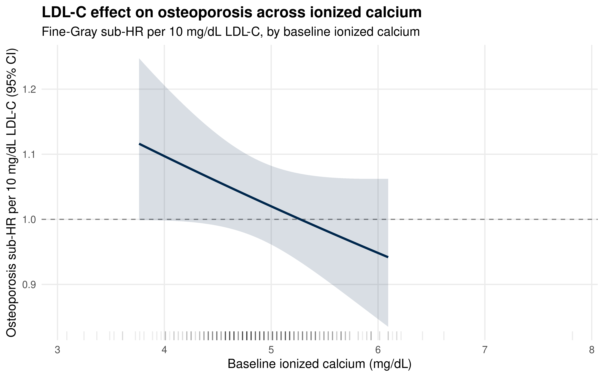
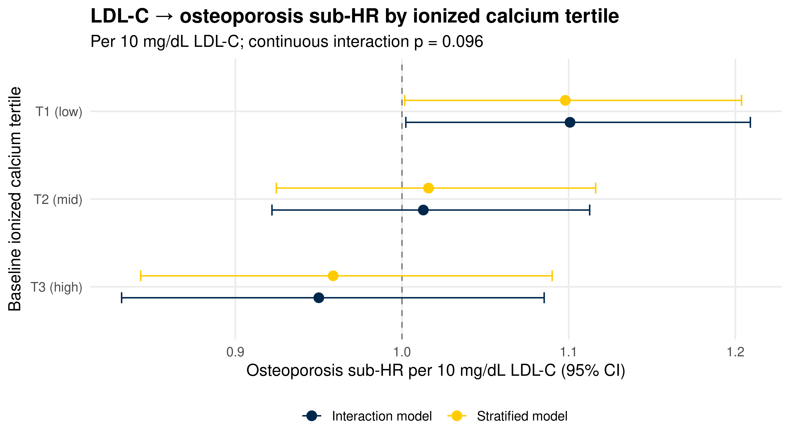

::: {.cell}

```{.r .cell-code}
library(tidyverse)
library(lubridate)
library(survival)
library(survminer)
library(cmprsk)
library(broom)
library(knitr)

# ── CONFIGURATION ──────────────────────────────────────────────────────────
# Single combined_data folder (the 2026-03-23 pull). Calcium coverage is the
# binding constraint — see the "Calcium Feasibility Diagnostic" section before
# trusting any interaction estimate. This is the osteoporosis-outcome companion
# to ldlc_calcium_interaction_mace.qmd; the only structural difference is a
# three-state competing-risks coding (osteoporosis = event of interest, with
# MACE and death as competing events).
DATA_DIR      <- "combined_data"
SEX_COL       <- "GenderCode"
RACE_COL      <- "RaceCode"
ETHNICITY_COL <- "EthnicityCode"
LDL_SCALE     <- 10             # LDL-C HR expressed per this many mg/dL
CAL_WINDOW    <- 730            # baseline-calcium search window (days around t0)
                                # mirrors the MACE script; widen/narrow per the
                                # feasibility table, trading timing precision for power.

# ── CALCIUM MODIFIER CHOICE ─────────────────────────────────────────────────
# Two calcium measures exist in LabResultsCleaned.csv, both in mg/dL:
#   "Ionized Calcium" — ~20,089 patients here; bioactive fraction; NO albumin
#                       correction needed; ordered more in acute/inpatient
#                       settings. Far better coverage → primary.
#   "Serum Calcium"   — ~4,009 patients here; conventional total calcium; would
#                       benefit from albumin correction (not available); sparse
#                       → run as a sensitivity by setting CALCIUM_TEST below.
CALCIUM_TEST  <- "Ionized Calcium"   # or "Serum Calcium"

# Physiologic guardrails (mg/dL) and reporting scale differ by measure.
if (CALCIUM_TEST == "Ionized Calcium") {
  CAL_LOW <- 2; CAL_HIGH <- 8;  CAL_SCALE <- 0.5  # ionized normal ~4.5–5.3
} else {
  CAL_LOW <- 4; CAL_HIGH <- 20; CAL_SCALE <- 1    # total normal ~8.5–10.5
}

theme_set(theme_minimal(base_size = 12))

# Michigan colors for plots
color_event  <- "#00274c"   # event of interest = osteoporosis
color_accent <- "#ffcb05"
color_death  <- "#CC6677"
color_censor <- "#888888"
```
:::


## Purpose

This script tests whether **calcium modifies the relationship between
time-averaged LDL-C and incident osteoporosis** — the bone-outcome companion to
the LDL-C → MACE interaction analysis, and arguably the more mechanistically
motivated of the two given the drug-target Mendelian-randomization work on BMD.

It re-uses the v3 unified competing-risks framework
(`ldlc_osteoporosis_competing_risks.qmd`) — Fine-Gray subdistribution hazard
with a **three-state** structure (osteoporosis = event of interest; **MACE and
death as competing events**), time-averaged LDL-C (trapezoid AUC ÷ follow-up
years) per 10 mg/dL, adjusted for age, sex, race/ethnicity, ever
statin, diabetes, and hypertension — and adds **calcium** as a candidate effect
modifier.

The LDL-C main effect on osteoporosis was null in the v3 analysis after full
adjustment (Sub-HR ≈ 0.985, p=0.21; the unadjusted positive association was
explained by statin and diabetes confounding). A null *main* effect can still
mask effects concentrated in a particular metabolic context. The
calcium/parathyroid/vitamin-D axis directly governs bone mineralization, and
oxidized-lipid pathways modulate osteoblast/osteoclast balance — so calcium is a
biologically natural candidate modifier of any LDL-C → bone effect.

**Modifier definition.** Calcium (`test_name == "Ionized Calcium"`, already
unit-harmonised to mg/dL in `labs_cleaning.qmd`) characterised at **baseline**
(measurement nearest to time zero, within ±730 days). Time-averaged
calcium (trapezoid) is a sensitivity analysis.

> **Choice of calcium measure (`CALCIUM_TEST`).** Ionized calcium (~20,089
> patients) is the default — bioactive fraction, no albumin correction, ~5× the
> coverage of serum/total calcium (~4,009). Trade-off: ionized calcium is ordered
> more in acute/inpatient contexts. Re-run with `CALCIUM_TEST <- "Serum Calcium"`
> as a sensitivity (would benefit from albumin correction; not yet available).

**Interaction strategy (three complementary views).**

1. **Continuous × continuous** — product of time-averaged LDL-C (per 10
   mg/dL) and mean-centred baseline calcium (per 0.5 mg/dL). Primary
   formal test (Wald on the product; LRT in the Cox sensitivity).
2. **LDL-C × calcium-tertile** — LDL-C sub-HR recovered *within each tertile* via
   linear combinations.
3. **Fully stratified Fine-Gray** — primary model refit within each calcium tertile.

---

## Data Input


::: {.cell}

```{.r .cell-code}
demographic.data <- read_csv(file.path(DATA_DIR, "DemographicInfo.csv"),
                             show_col_types = FALSE) %>%
  mutate(
    DeID_PatientID = as.character(DeID_PatientID),
    ehr_death_date = mdy_hm(DeID_DeceasedDate)
  )

# Michigan Death Index
mdi.data <- read_csv(file.path(DATA_DIR, "MichiganDeathIndex.csv"),
                     show_col_types = FALSE) %>%
  mutate(
    DeID_PatientID = as.character(DeID_PatientID),
    mdi_death_date = mdy_hm(DeID_MDIDeceasedDate)
  ) %>%
  select(DeID_PatientID, mdi_death_date)

# Diagnoses — need BOTH osteoporosis (event of interest) and MACE (competing)
diagnosis.data <- read_csv(file.path(DATA_DIR, "DiagnosesCleaned.csv"),
                           show_col_types = FALSE) %>%
  mutate(
    DeID_PatientID     = as.character(DeID_PatientID),
    Osteoporosis.onset = ymd(Osteoporosis.onset),
    MACE.onset         = ymd(MACE.onset)
  )

# Labs (shared parse for LDL-C and calcium)
lab.data <- read_csv(file.path(DATA_DIR, "LabResultsCleaned.csv"),
                     show_col_types = FALSE) %>%
  mutate(
    DeID_PatientID = as.character(DeID_PatientID),
    lab_date = coalesce(
      parse_date_time(DeID_COLLECTION_DATE,
                      orders = c("ymd", "mdy", "ymd HMS", "mdy HM"),
                      quiet  = TRUE),
      parse_date_time(DeID_AdmitDate,
                      orders = c("ymd", "mdy", "ymd HMS", "mdy HM"),
                      quiet  = TRUE)
    )
  )

ldlc.data    <- lab.data %>% filter(test_name == "LDL-C")
calcium.data <- lab.data %>% filter(test_name == CALCIUM_TEST)

cat("Distinct test_name values in lab file:\n")
```

::: {.cell-output .cell-output-stdout}

```
Distinct test_name values in lab file:
```


:::

```{.r .cell-code}
print(sort(unique(lab.data$test_name)))
```

::: {.cell-output .cell-output-stdout}

```
[1] "HDL-C"             "Ionized Calcium"   "LDL-C"            
[4] "Serum Calcium"     "Total Cholesterol" "Triglycerides"    
```


:::

```{.r .cell-code}
cat("\nCalcium modifier =", CALCIUM_TEST, ":", scales::comma(nrow(calcium.data)),
    "measurements across",
    scales::comma(n_distinct(calcium.data$DeID_PatientID)), "patients\n")
```

::: {.cell-output .cell-output-stdout}

```

Calcium modifier = Ionized Calcium : 107,810 measurements across 20,089 patients
```


:::

```{.r .cell-code}
# Encounters
encounter.data <- read_csv(file.path(DATA_DIR, "EncounterAll.csv"),
                           show_col_types = FALSE) %>%
  mutate(
    DeID_PatientID = as.character(DeID_PatientID),
    EncounterDate  = mdy_hm(DeID_AdmitDate)
  )

# Statin intervals
statin_intervals <- read_csv(
  file.path(DATA_DIR, "MedicationOrdersCleanedStatins.csv"),
  show_col_types = FALSE
) %>%
  mutate(
    DeID_PatientID = as.character(DeID_PatientID),
    period_start   = as_date(period_start),
    period_end     = as_date(period_end),
    intensity      = factor(intensity, levels = c("low", "moderate", "high"))
  )

# Comorbidities
comorbidity_onset <- read_csv(file.path(DATA_DIR, "ComorbiditiesOnset.csv"),
                              show_col_types = FALSE) %>%
  mutate(
    DeID_PatientID      = as.character(DeID_PatientID),
    diabetes_onset      = as_datetime(diabetes_onset),
    hypertension_onset  = as_datetime(hypertension_onset)
  )
```
:::


---

## Cohort Construction (three-state competing risks)

Matches `ldlc_osteoporosis_competing_risks.qmd`: osteoporosis is the event of
interest; MACE and death are competing events. Priority for first event:
osteoporosis > MACE > death > censored.


::: {.cell}

```{.r .cell-code}
# --- Unified death date (earliest of EHR + MDI) ---
death_dates <- demographic.data %>%
  select(DeID_PatientID, ehr_death_date) %>%
  left_join(mdi.data, by = "DeID_PatientID") %>%
  mutate(death_date = pmin(ehr_death_date, mdi_death_date, na.rm = TRUE))

# --- Full cohort with sex + race/ethnicity + both diagnoses ---
full_cohort <- demographic.data %>%
  select(DeID_PatientID, all_of(c(SEX_COL, RACE_COL, ETHNICITY_COL))) %>%
  left_join(death_dates %>% select(DeID_PatientID, death_date),
            by = "DeID_PatientID") %>%
  left_join(diagnosis.data %>%
              select(DeID_PatientID, Osteoporosis, Osteoporosis.onset,
                     MACE, MACE.onset),
            by = "DeID_PatientID") %>%
  mutate(
    osteo_flag = if_else(Osteoporosis == TRUE, 1L, 0L, missing = 0L),
    mace_flag  = if_else(MACE == TRUE, 1L, 0L, missing = 0L),
    sex_raw    = as.character(.data[[SEX_COL]]),
    sex        = case_when(
      str_detect(sex_raw, regex("^f", ignore_case = TRUE)) ~ "Female",
      str_detect(sex_raw, regex("^m", ignore_case = TRUE)) ~ "Male",
      TRUE ~ NA_character_
    ),
    race_eth = case_when(
      .data[[ETHNICITY_COL]] == "HL"          ~ "Hispanic",
      .data[[RACE_COL]] == "C"                ~ "White",
      .data[[RACE_COL]] == "AA"               ~ "Black",
      .data[[RACE_COL]] == "A"                ~ "Asian",
      TRUE                                    ~ "Other/Unknown"
    ),
    race_eth = factor(race_eth,
                      levels = c("White", "Black", "Asian",
                                 "Hispanic", "Other/Unknown"))
  )

# --- Clean diagnoses (exclude osteoporosis=TRUE with missing onset) ---
diag_clean <- full_cohort %>%
  filter(!(osteo_flag == 1L & is.na(Osteoporosis.onset))) %>%
  select(DeID_PatientID, sex, race_eth,
         Osteoporosis.onset, osteo_flag, MACE.onset, mace_flag, death_date)

# --- Clean LDL-C ---
ldlc_clean <- ldlc.data %>%
  filter(!is.na(lab_date), !is.na(AgeInYears)) %>%
  filter(value > 0, value <= 400) %>%
  filter(AgeInYears >= 18) %>%
  group_by(DeID_PatientID, lab_date) %>%
  summarise(
    LDL_value  = mean(value,      na.rm = TRUE),
    AgeInYears = mean(AgeInYears, na.rm = TRUE),
    .groups    = "drop"
  ) %>%
  arrange(DeID_PatientID, lab_date)

# --- Shared IDs (cohort base = LDL-C ∩ diagnoses) ---
shared_ids  <- intersect(diag_clean$DeID_PatientID, ldlc_clean$DeID_PatientID)
diag_cohort <- diag_clean %>% filter(DeID_PatientID %in% shared_ids)
ldlc_cohort <- ldlc_clean %>% filter(DeID_PatientID %in% shared_ids)

# --- Last encounter (censoring) ---
last_encounter <- encounter.data %>%
  filter(!is.na(EncounterDate), DeID_PatientID %in% shared_ids) %>%
  group_by(DeID_PatientID) %>%
  slice_max(EncounterDate, n = 1, with_ties = FALSE) %>%
  ungroup() %>%
  select(DeID_PatientID, last_encounter_date = EncounterDate)

# --- First LDL-C = time zero ---
first_ldlc <- ldlc_cohort %>%
  group_by(DeID_PatientID) %>%
  slice_min(lab_date, n = 1, with_ties = FALSE) %>%
  ungroup() %>%
  select(DeID_PatientID,
         t0           = lab_date,
         LDL_baseline = LDL_value,
         Age_baseline = AgeInYears)

# --- Base cohort with three-state competing risks status ---
base_cohort_full <- diag_cohort %>%
  left_join(first_ldlc,     by = "DeID_PatientID") %>%
  left_join(last_encounter, by = "DeID_PatientID") %>%
  mutate(
    t_end = case_when(
      osteo_flag == 1             ~ Osteoporosis.onset,
      !is.na(last_encounter_date) ~ last_encounter_date,
      TRUE                        ~ NA_POSIXct_
    ),
    follow_up_days  = as.numeric(difftime(t_end, t0, units = "days")),
    follow_up_years = follow_up_days / 365.25,
    # Three-state: osteoporosis (1) > MACE (2) > death (3) > censored (0)
    fg_status = case_when(
      osteo_flag == 1                                          ~ 1L,
      mace_flag == 1 & osteo_flag == 0                         ~ 2L,
      !is.na(death_date) & death_date <= t_end &
        osteo_flag == 0 & mace_flag == 0                       ~ 3L,
      TRUE                                                     ~ 0L
    )
  )

base_cohort <- base_cohort_full %>% filter(follow_up_days > 0)

cat("Base cohort:", scales::comma(nrow(base_cohort)), "patients\n")
```

::: {.cell-output .cell-output-stdout}

```
Base cohort: 20,150 patients
```


:::

```{.r .cell-code}
base_cohort %>%
  count(fg_status) %>%
  mutate(Status = recode(as.character(fg_status),
    "0" = "Censored", "1" = "Osteoporosis (event)",
    "2" = "MACE (competing)", "3" = "Death (competing)")) %>%
  select(Status, N = n) %>%
  kable(caption = "Three-state competing-risks status — base cohort")
```

::: {.cell-output-display}


Table: Three-state competing-risks status — base cohort

|Status               |     N|
|:--------------------|-----:|
|Censored             | 14091|
|Osteoporosis (event) |  2262|
|MACE (competing)     |  2862|
|Death (competing)    |   935|


:::
:::


---

## LDL-C Exposure (time-averaged, trapezoid)


::: {.cell}

```{.r .cell-code}
ldlc_with_time <- ldlc_cohort %>%
  filter(DeID_PatientID %in% base_cohort$DeID_PatientID) %>%
  left_join(base_cohort %>% select(DeID_PatientID, t0, t_end),
            by = "DeID_PatientID") %>%
  filter(lab_date >= t0, lab_date <= t_end) %>%
  mutate(t_years = as.numeric(difftime(lab_date, t0, units = "days")) / 365.25) %>%
  arrange(DeID_PatientID, t_years)

n_measurements <- ldlc_with_time %>%
  count(DeID_PatientID, name = "n_measurements")

auc_trapezoid <- ldlc_with_time %>%
  group_by(DeID_PatientID) %>%
  mutate(
    t_next   = lead(t_years),
    ldl_next = lead(LDL_value),
    t_end_yr = as.numeric(difftime(first(t_end), first(t0),
                                   units = "days")) / 365.25,
    interval_area = case_when(
      !is.na(t_next) ~ (LDL_value + ldl_next) / 2 * (t_next - t_years),
      TRUE           ~ LDL_value * (t_end_yr - t_years)
    )
  ) %>%
  summarise(
    cumLDL_trap = sum(interval_area, na.rm = TRUE),
    fu_years    = first(t_end_yr),
    .groups     = "drop"
  ) %>%
  mutate(meanLDL_trap = cumLDL_trap / fu_years)

base_cohort <- base_cohort %>%
  left_join(n_measurements, by = "DeID_PatientID") %>%
  left_join(auc_trapezoid %>% select(DeID_PatientID, meanLDL_trap),
            by = "DeID_PatientID") %>%
  mutate(
    LDL_baseline_s = LDL_baseline / LDL_SCALE,
    meanLDL_trap_s = meanLDL_trap / LDL_SCALE
  )
```
:::


---

## Calcium Modifier

Baseline calcium = the Ionized Calcium measurement nearest to t0 within
±730 days. Time-averaged calcium (trapezoid) is computed for the
sensitivity analysis.


::: {.cell}

```{.r .cell-code}
calcium_clean <- calcium.data %>%
  filter(!is.na(lab_date), !is.na(value)) %>%
  filter(value >= CAL_LOW, value <= CAL_HIGH) %>%   # measure-specific guardrails (mg/dL)
  group_by(DeID_PatientID, lab_date) %>%
  summarise(Ca_value = mean(value, na.rm = TRUE), .groups = "drop") %>%
  semi_join(base_cohort, by = "DeID_PatientID") %>%
  left_join(base_cohort %>% select(DeID_PatientID, t0, t_end),
            by = "DeID_PatientID")

# --- Baseline calcium: nearest measurement to t0 within window ---
calcium_baseline <- calcium_clean %>%
  filter(lab_date >= t0 - days(CAL_WINDOW), lab_date <= t_end) %>%
  mutate(gap_days = abs(as.numeric(difftime(lab_date, t0, units = "days")))) %>%
  filter(gap_days <= CAL_WINDOW) %>%
  group_by(DeID_PatientID) %>%
  slice_min(gap_days, n = 1, with_ties = FALSE) %>%
  ungroup() %>%
  select(DeID_PatientID, Ca_baseline = Ca_value, Ca_gap_days = gap_days)

# --- Time-averaged calcium (trapezoid) over follow-up; sensitivity ---
calcium_avg <- calcium_clean %>%
  filter(lab_date >= t0, lab_date <= t_end) %>%
  mutate(t_years = as.numeric(difftime(lab_date, t0, units = "days")) / 365.25) %>%
  arrange(DeID_PatientID, t_years) %>%
  group_by(DeID_PatientID) %>%
  mutate(
    t_next  = lead(t_years),
    ca_next = lead(Ca_value),
    t_end_yr = as.numeric(difftime(first(t_end), first(t0),
                                   units = "days")) / 365.25,
    n_ca     = n(),
    interval_area = case_when(
      !is.na(t_next) ~ (Ca_value + ca_next) / 2 * (t_next - t_years),
      TRUE           ~ Ca_value * (t_end_yr - t_years)
    )
  ) %>%
  summarise(
    cumCa  = sum(interval_area, na.rm = TRUE),
    fu_yr  = first(t_end_yr),
    n_ca   = first(n_ca),
    .groups = "drop"
  ) %>%
  mutate(Ca_meanavg = cumCa / fu_yr) %>%
  select(DeID_PatientID, Ca_meanavg, n_ca)

base_cohort <- base_cohort %>%
  left_join(calcium_baseline, by = "DeID_PatientID") %>%
  left_join(calcium_avg,      by = "DeID_PatientID")

# --- Coverage ---
base_cohort %>%
  summarise(
    `Base cohort N`                  = n(),
    `With baseline calcium`          = sum(!is.na(Ca_baseline)),
    `With baseline calcium (%)`      = round(100 * mean(!is.na(Ca_baseline)), 1),
    `Median Ca gap to t0 (days)`     = round(median(Ca_gap_days, na.rm = TRUE), 0),
    `With ≥1 time-avg calcium`       = sum(!is.na(Ca_meanavg)),
    `Median baseline Ca (mg/dL)`     = round(median(Ca_baseline, na.rm = TRUE), 2)
  ) %>%
  pivot_longer(everything(), names_to = "Metric", values_to = "Value") %>%
  kable(caption = paste(CALCIUM_TEST, "coverage in the base cohort"))
```

::: {.cell-output-display}


Table: Ionized Calcium coverage in the base cohort

|Metric                     |    Value|
|:--------------------------|--------:|
|Base cohort N              | 20150.00|
|With baseline calcium      |  1069.00|
|With baseline calcium (%)  |     5.30|
|Median Ca gap to t0 (days) |   276.00|
|With ≥1 time-avg calcium   |  2363.00|
|Median baseline Ca (mg/dL) |     4.89|


:::
:::


### Calcium Feasibility Diagnostic

Calcium co-measurement is the binding constraint. This table shows the achievable
analytic cohort — patient N, **osteoporosis events**, and events-per-variable for
the ~12-coefficient full model — crossing the LDL-measurement requirement against
the baseline-calcium window.


::: {.cell}

```{.r .cell-code}
ca_nearest <- calcium_clean %>%
  filter(lab_date <= t_end) %>%
  mutate(gap_days = abs(as.numeric(difftime(lab_date, t0, units = "days")))) %>%
  group_by(DeID_PatientID) %>%
  slice_min(gap_days, n = 1, with_ties = FALSE) %>%
  ungroup() %>%
  select(DeID_PatientID, gap_days)

ldl_sets <- list(
  "≥2 LDL"       = base_cohort %>% filter(n_measurements >= 2),
  "≥1 LDL (all)" = base_cohort %>% filter(n_measurements >= 1)
)
window_grid <- c(180, 365, 730, 1095, 1826, Inf)

feasibility <- map_dfr(names(ldl_sets), function(ldl_lab) {
  base_sub <- ldl_sets[[ldl_lab]] %>%
    left_join(ca_nearest, by = "DeID_PatientID")
  map_dfr(window_grid, function(w) {
    sub <- base_sub %>% filter(!is.na(gap_days), gap_days <= w)
    ev  <- sum(sub$fg_status == 1)
    tibble(
      `LDL requirement`     = ldl_lab,
      `Ca window (days)`    = if (is.infinite(w)) "any" else as.character(w),
      `N`                   = nrow(sub),
      `Osteoporosis events` = ev,
      `EPV (12-coef)`       = round(ev / 12, 1),
      `Adequate?`           = if (ev / 12 >= 10) "✓" else "⚠ low"
    )
  })
})

feasibility %>%
  kable(caption = "Achievable calcium-interaction cohort (N, osteoporosis events, events-per-variable)")
```

::: {.cell-output-display}


Table: Achievable calcium-interaction cohort (N, osteoporosis events, events-per-variable)

|LDL requirement |Ca window (days) |    N| Osteoporosis events| EPV (12-coef)|Adequate? |
|:---------------|:----------------|----:|-------------------:|-------------:|:---------|
|≥2 LDL          |180              |  138|                  27|           2.2|⚠ low     |
|≥2 LDL          |365              |  227|                  52|           4.3|⚠ low     |
|≥2 LDL          |730              |  394|                  86|           7.2|⚠ low     |
|≥2 LDL          |1095             |  502|                 114|           9.5|⚠ low     |
|≥2 LDL          |1826             |  671|                 148|          12.3|✓         |
|≥2 LDL          |any              | 1248|                 219|          18.2|✓         |
|≥1 LDL (all)    |180              |  382|                  94|           7.8|⚠ low     |
|≥1 LDL (all)    |365              |  639|                 163|          13.6|✓         |
|≥1 LDL (all)    |730              | 1069|                 260|          21.7|✓         |
|≥1 LDL (all)    |1095             | 1388|                 336|          28.0|✓         |
|≥1 LDL (all)    |1826             | 1892|                 432|          36.0|✓         |
|≥1 LDL (all)    |any              | 3314|                 642|          53.5|✓         |


:::
:::


---

## Covariates


::: {.cell}

```{.r .cell-code}
ever_statin <- statin_intervals %>%
  inner_join(base_cohort %>% select(DeID_PatientID, t0, t_end),
             by = "DeID_PatientID") %>%
  filter(period_end >= as_date(t0), period_start <= as_date(t_end)) %>%
  distinct(DeID_PatientID) %>%
  mutate(ever_statin = 1L)

comorbidity_fixed <- comorbidity_onset %>%
  inner_join(base_cohort %>% select(DeID_PatientID, t0, t_end),
             by = "DeID_PatientID") %>%
  mutate(
    ever_diabetes     = as.integer(!is.na(diabetes_onset) &
                                     diabetes_onset <= t_end),
    ever_hypertension = as.integer(!is.na(hypertension_onset) &
                                     hypertension_onset <= t_end)
  ) %>%
  select(DeID_PatientID, ever_diabetes, ever_hypertension)

base_cohort <- base_cohort %>%
  left_join(ever_statin,       by = "DeID_PatientID") %>%
  left_join(comorbidity_fixed, by = "DeID_PatientID") %>%
  mutate(
    ever_statin       = replace_na(ever_statin, 0L),
    ever_diabetes     = replace_na(ever_diabetes, 0L),
    ever_hypertension = replace_na(ever_hypertension, 0L),
    sex               = factor(sex),
    race_eth          = factor(race_eth,
                               levels = c("White", "Black", "Asian",
                                          "Hispanic", "Other/Unknown"))
  )
```
:::


---

## Analytic Cohort & Calcium Tertiles

Primary analytic cohort: ≥2 LDL-C measurements **and** a baseline calcium value.
Tertiles are defined within this cohort.


::: {.cell}

```{.r .cell-code}
analytic <- base_cohort %>%
  filter(n_measurements >= 2,
         !is.na(meanLDL_trap_s), !is.na(Ca_baseline),
         !is.na(Age_baseline), !is.na(sex), !is.na(race_eth)) %>%
  mutate(
    Ca_center  = mean(Ca_baseline),
    Ca_c       = (Ca_baseline - Ca_center) / CAL_SCALE,
    Ca_tertile = cut(Ca_baseline,
                     breaks = quantile(Ca_baseline, probs = c(0, 1/3, 2/3, 1),
                                       na.rm = TRUE),
                     include.lowest = TRUE,
                     labels = c("T1 (low)", "T2 (mid)", "T3 (high)")),
    cal_mid    = as.integer(Ca_tertile == "T2 (mid)"),
    cal_high   = as.integer(Ca_tertile == "T3 (high)"),
    sex_female = as.integer(sex == "Female"),
    race_black = as.integer(race_eth == "Black"),
    race_asian = as.integer(race_eth == "Asian"),
    race_hisp  = as.integer(race_eth == "Hispanic"),
    race_other = as.integer(race_eth == "Other/Unknown"),
    ldl_x_cac  = meanLDL_trap_s * Ca_c,
    ldl_x_mid  = meanLDL_trap_s * cal_mid,
    ldl_x_high = meanLDL_trap_s * cal_high
  )

n_osteo_events <- sum(analytic$fg_status == 1)
cat("Analytic cohort N:", nrow(analytic),
    "| Osteoporosis events:", n_osteo_events,
    "| MACE competing:", sum(analytic$fg_status == 2),
    "| death competing:", sum(analytic$fg_status == 3), "\n")
```

::: {.cell-output .cell-output-stdout}

```
Analytic cohort N: 394 | Osteoporosis events: 86 | MACE competing: 149 | death competing: 43 
```


:::

```{.r .cell-code}
# --- Events-per-variable guard (lesson from the earlier N=19 MACE render) ---
n_coefs_full <- 12L
epv <- n_osteo_events / n_coefs_full
if (epv < 10) {
  warning(sprintf(
    paste0("LOW POWER: %d osteoporosis events for ~%d coefficients (%.1f events/var). ",
           "Interpret the fully adjusted interaction with great caution — favour ",
           "the parsimonious/continuous models and check for separation."),
    n_osteo_events, n_coefs_full, epv))
}
cat(sprintf("Events per variable (full model): %.1f %s\n", epv,
            if (epv < 10) "⚠ UNDERPOWERED" else "✓ adequate"))
```

::: {.cell-output .cell-output-stdout}

```
Events per variable (full model): 7.2 ⚠ UNDERPOWERED
```


:::

```{.r .cell-code}
# Tertile description
analytic %>%
  group_by(Ca_tertile) %>%
  summarise(
    N                       = n(),
    `Osteoporosis events`   = sum(fg_status == 1),
    `Ca range`              = paste0(round(min(Ca_baseline), 2), "–",
                                     round(max(Ca_baseline), 2)),
    `Median Ca`             = round(median(Ca_baseline), 2),
    `Median time-avg LDL-C` = round(median(meanLDL_trap, na.rm = TRUE), 1),
    `Female (%)`            = round(100 * mean(sex == "Female"), 1),
    `Ever statin (%)`       = round(100 * mean(ever_statin), 1),
    `Diabetes (%)`          = round(100 * mean(ever_diabetes), 1),
    .groups = "drop"
  ) %>%
  kable(caption = paste(CALCIUM_TEST, "tertiles (analytic cohort)"))
```

::: {.cell-output-display}


Table: Ionized Calcium tertiles (analytic cohort)

|Ca_tertile |   N| Osteoporosis events|Ca range  | Median Ca| Median time-avg LDL-C| Female (%)| Ever statin (%)| Diabetes (%)|
|:----------|---:|-------------------:|:---------|---------:|---------------------:|----------:|---------------:|------------:|
|T1 (low)   | 146|                  26|3.09–4.73 |      4.51|                  93.8|       45.9|            75.3|         81.5|
|T2 (mid)   | 127|                  33|4.77–5.13 |      4.93|                 101.7|       40.9|            77.2|         69.3|
|T3 (high)  | 121|                  27|5.17–7.82 |      5.41|                  99.3|       52.9|            81.8|         75.2|


:::
:::


---

## Helper Functions


::: {.cell}

```{.r .cell-code}
minority_count <- function(x) {
  ux <- unique(na.omit(x))
  if (length(ux) <= 2) min(table(x)) else Inf
}

# crr() with vectors passed directly; drops zero-variance / sparse indicators and
# retries on singularity (see ANALYSIS_NOTES.md). failcode = 1 (osteoporosis);
# crr treats statuses 2 (MACE) and 3 (death) as competing, 0 as censored.
safe_crr <- function(ftime, fstatus, cov_mat, failcode = 1, min_minor = 5) {
  vars   <- apply(cov_mat, 2, var, na.rm = TRUE)
  minors <- apply(cov_mat, 2, minority_count)
  bad    <- which(is.na(vars) | vars == 0 | minors < min_minor)
  if (length(bad) > 0) {
    cat("  Dropping zero-variance/sparse columns:",
        paste(colnames(cov_mat)[bad], collapse = ", "), "\n")
    cov_mat <- cov_mat[, -bad, drop = FALSE]
  }
  repeat {
    fit <- tryCatch(
      crr(ftime = ftime, fstatus = fstatus, cov1 = cov_mat,
          failcode = failcode, cencode = 0),
      error = function(e) e
    )
    if (!inherits(fit, "error")) return(fit)
    if (!grepl("singular", conditionMessage(fit), ignore.case = TRUE) ||
        ncol(cov_mat) <= 1) stop(fit)
    m <- apply(cov_mat, 2, minority_count)
    if (all(is.infinite(m))) stop(fit)
    drop_j <- which.min(m)
    cat("  Singular fit — dropping sparsest indicator:",
        colnames(cov_mat)[drop_j], "\n")
    cov_mat <- cov_mat[, -drop_j, drop = FALSE]
  }
}

format_fg <- function(fg_fit, caption) {
  s <- summary(fg_fit)
  tibble(
    Term          = rownames(s$coef),
    `Sub-HR`      = round(exp(s$coef[, "coef"]), 4),
    `95% CI low`  = round(exp(s$coef[, "coef"] - 1.96 * s$coef[, "se(coef)"]), 4),
    `95% CI high` = round(exp(s$coef[, "coef"] + 1.96 * s$coef[, "se(coef)"]), 4),
    `p-value`     = format.pval(s$coef[, "p-value"], digits = 3, eps = 0.001)
  ) %>% kable(caption = caption)
}

fg_lincom <- function(fg_fit, weights, label) {
  b <- fg_fit$coef
  V <- fg_fit$var
  cvec <- setNames(rep(0, length(b)), names(b))
  cvec[names(weights)] <- weights
  est <- sum(cvec * b)
  se  <- sqrt(as.numeric(t(cvec) %*% V %*% cvec))
  tibble(
    Stratum       = label,
    `Sub-HR`      = round(exp(est), 4),
    `95% CI low`  = round(exp(est - 1.96 * se), 4),
    `95% CI high` = round(exp(est + 1.96 * se), 4),
    `p-value`     = format.pval(2 * pnorm(-abs(est / se)), digits = 3, eps = 0.001)
  )
}

adj_cols <- c("Age_baseline", "sex_female",
              "race_black", "race_asian", "race_hisp", "race_other",
              "ever_statin", "ever_diabetes", "ever_hypertension")
```
:::


---

## Model 0: LDL-C and Calcium Main Effects (no interaction)


::: {.cell}

```{.r .cell-code}
cov_main <- as.matrix(analytic %>%
  select(meanLDL_trap_s, Ca_c, all_of(adj_cols)))

fg_main <- safe_crr(analytic$follow_up_days, analytic$fg_status, cov_main)

format_fg(fg_main,
  paste0("Main-effects Fine-Gray: time-avg LDL-C (per ", LDL_SCALE,
         " mg/dL) + baseline calcium (per ", CAL_SCALE,
         " mg/dL); osteoporosis event, MACE + death competing"))
```

::: {.cell-output-display}


Table: Main-effects Fine-Gray: time-avg LDL-C (per 10 mg/dL) + baseline calcium (per 0.5 mg/dL); osteoporosis event, MACE + death competing

|Term              | Sub-HR| 95% CI low| 95% CI high|p-value |
|:-----------------|------:|----------:|-----------:|:-------|
|meanLDL_trap_s    | 1.0196|     0.9612|      1.0815|0.520   |
|Ca_c              | 0.9996|     0.8495|      1.1763|1.000   |
|Age_baseline      | 1.0168|     1.0016|      1.0321|0.030   |
|sex_female        | 4.3589|     2.5837|      7.3539|<0.001  |
|race_black        | 0.8763|     0.4312|      1.7810|0.720   |
|race_asian        | 0.5248|     0.1173|      2.3483|0.400   |
|race_hisp         | 0.9420|     0.2086|      4.2535|0.940   |
|race_other        | 1.1018|     0.3881|      3.1284|0.860   |
|ever_statin       | 0.5669|     0.3314|      0.9698|0.038   |
|ever_diabetes     | 0.6200|     0.3828|      1.0043|0.052   |
|ever_hypertension | 0.9948|     0.4171|      2.3728|0.990   |


:::
:::


---

## Model 1: Continuous LDL-C × Calcium Interaction (PRIMARY TEST)

Because calcium is mean-centred, the `meanLDL_trap_s` coefficient is the LDL-C
sub-HR **at mean calcium**, and `ldl_x_cac` is the multiplicative change in that
sub-HR per 0.5 mg/dL higher calcium.


::: {.cell}

```{.r .cell-code}
cov_int <- as.matrix(analytic %>%
  select(meanLDL_trap_s, Ca_c, ldl_x_cac, all_of(adj_cols)))

fg_int <- safe_crr(analytic$follow_up_days, analytic$fg_status, cov_int)

format_fg(fg_int,
  "Fine-Gray with continuous LDL-C × calcium interaction (osteoporosis; MACE + death competing)")
```

::: {.cell-output-display}


Table: Fine-Gray with continuous LDL-C × calcium interaction (osteoporosis; MACE + death competing)

|Term              | Sub-HR| 95% CI low| 95% CI high|p-value |
|:-----------------|------:|----------:|-----------:|:-------|
|meanLDL_trap_s    | 1.0254|     0.9673|      1.0871|0.400   |
|Ca_c              | 1.4994|     0.9113|      2.4672|0.110   |
|ldl_x_cac         | 0.9642|     0.9237|      1.0065|0.096   |
|Age_baseline      | 1.0166|     1.0014|      1.0320|0.032   |
|sex_female        | 4.4538|     2.6401|      7.5137|<0.001  |
|race_black        | 0.8827|     0.4330|      1.7995|0.730   |
|race_asian        | 0.4672|     0.0973|      2.2441|0.340   |
|race_hisp         | 0.9252|     0.2068|      4.1391|0.920   |
|race_other        | 1.0311|     0.3577|      2.9725|0.950   |
|ever_statin       | 0.5677|     0.3366|      0.9576|0.034   |
|ever_diabetes     | 0.5949|     0.3687|      0.9598|0.033   |
|ever_hypertension | 0.9304|     0.3998|      2.1650|0.870   |


:::

```{.r .cell-code}
s_int    <- summary(fg_int)
int_p    <- s_int$coef["ldl_x_cac", "p-value"]
int_beta <- s_int$coef["ldl_x_cac", "coef"]
int_se   <- s_int$coef["ldl_x_cac", "se(coef)"]

tibble(
  Quantity = c(sprintf("Interaction sub-HR ratio (per %g mg/dL %s, per %g mg/dL LDL-C)",
                        CAL_SCALE, CALCIUM_TEST, LDL_SCALE),
               "95% CI",
               "Wald p-value"),
  Value = c(
    sprintf("%.4f", exp(int_beta)),
    sprintf("(%.4f–%.4f)", exp(int_beta - 1.96 * int_se),
            exp(int_beta + 1.96 * int_se)),
    format.pval(int_p, digits = 3, eps = 0.001)
  )
) %>% kable(caption = "PRIMARY interaction test (continuous × continuous)")
```

::: {.cell-output-display}


Table: PRIMARY interaction test (continuous × continuous)

|Quantity                                                                     |Value           |
|:----------------------------------------------------------------------------|:---------------|
|Interaction sub-HR ratio (per 0.5 mg/dL Ionized Calcium, per 10 mg/dL LDL-C) |0.9642          |
|95% CI                                                                       |(0.9237–1.0065) |
|Wald p-value                                                                 |0.096           |


:::
:::


### LDL-C sub-HR across the observed calcium range


::: {.cell}

```{.r .cell-code}
b   <- fg_int$coef
V   <- fg_int$var
cov_names <- names(b)
if (is.null(cov_names)) cov_names <- colnames(cov_int)
names(b)   <- cov_names
dimnames(V) <- list(cov_names, cov_names)
idx <- c("meanLDL_trap_s", "ldl_x_cac")

ca_grid <- tibble(
  Ca_baseline = seq(quantile(analytic$Ca_baseline, 0.02),
                    quantile(analytic$Ca_baseline, 0.98),
                    length.out = 100)
) %>%
  mutate(
    Ca_c   = (Ca_baseline - mean(analytic$Ca_baseline)) / CAL_SCALE,
    loghr  = b["meanLDL_trap_s"] + b["ldl_x_cac"] * Ca_c,
    se     = sqrt(V[idx[1], idx[1]] +
                  Ca_c^2 * V[idx[2], idx[2]] +
                  2 * Ca_c * V[idx[1], idx[2]]),
    SubHR  = exp(loghr),
    lo     = exp(loghr - 1.96 * se),
    hi     = exp(loghr + 1.96 * se)
  )

ggplot(ca_grid, aes(Ca_baseline, SubHR)) +
  geom_hline(yintercept = 1, linetype = "dashed", colour = "grey50") +
  geom_ribbon(aes(ymin = lo, ymax = hi), alpha = 0.15, fill = color_event) +
  geom_line(colour = color_event, linewidth = 1) +
  geom_rug(data = analytic, aes(x = Ca_baseline), inherit.aes = FALSE,
           alpha = 0.08, sides = "b") +
  labs(
    title    = paste0("LDL-C effect on osteoporosis across ", tolower(CALCIUM_TEST)),
    subtitle = paste0("Fine-Gray sub-HR per ", LDL_SCALE,
                      " mg/dL LDL-C, by baseline ", tolower(CALCIUM_TEST)),
    x = paste0("Baseline ", tolower(CALCIUM_TEST), " (mg/dL)"),
    y = paste0("Osteoporosis sub-HR per ", LDL_SCALE, " mg/dL LDL-C (95% CI)")
  ) +
  theme_minimal(base_size = 12) +
  theme(panel.grid.minor = element_blank(),
        plot.title = element_text(face = "bold"))
```

::: {.cell-output-display}
{#fig-interaction-curve width=2400}
:::
:::


---

## Model 2: LDL-C × Calcium-Tertile Interaction


::: {.cell}

```{.r .cell-code}
cov_tert <- as.matrix(analytic %>%
  select(meanLDL_trap_s, cal_mid, cal_high, ldl_x_mid, ldl_x_high,
         all_of(adj_cols)))

fg_tert <- safe_crr(analytic$follow_up_days, analytic$fg_status, cov_tert)

format_fg(fg_tert,
  "Fine-Gray with LDL-C × calcium-tertile interaction (osteoporosis; MACE + death competing)")
```

::: {.cell-output-display}


Table: Fine-Gray with LDL-C × calcium-tertile interaction (osteoporosis; MACE + death competing)

|Term              | Sub-HR| 95% CI low| 95% CI high|p-value |
|:-----------------|------:|----------:|-----------:|:-------|
|meanLDL_trap_s    | 1.1008|     1.0023|      1.2090|0.045   |
|cal_mid           | 3.5321|     0.7927|     15.7379|0.098   |
|cal_high          | 4.8724|     0.8832|     26.8793|0.069   |
|ldl_x_mid         | 0.9200|     0.8047|      1.0519|0.220   |
|ldl_x_high        | 0.8631|     0.7327|      1.0166|0.078   |
|Age_baseline      | 1.0168|     1.0015|      1.0323|0.031   |
|sex_female        | 4.6337|     2.7479|      7.8139|<0.001  |
|race_black        | 0.9065|     0.4447|      1.8477|0.790   |
|race_asian        | 0.5562|     0.1222|      2.5313|0.450   |
|race_hisp         | 1.1129|     0.2416|      5.1252|0.890   |
|race_other        | 1.0272|     0.3575|      2.9510|0.960   |
|ever_statin       | 0.5632|     0.3371|      0.9408|0.028   |
|ever_diabetes     | 0.6167|     0.3852|      0.9872|0.044   |
|ever_hypertension | 1.0343|     0.4531|      2.3612|0.940   |


:::

```{.r .cell-code}
ldl_by_tertile <- bind_rows(
  fg_lincom(fg_tert, c(meanLDL_trap_s = 1),                   "T1 (low)"),
  fg_lincom(fg_tert, c(meanLDL_trap_s = 1, ldl_x_mid  = 1),   "T2 (mid)"),
  fg_lincom(fg_tert, c(meanLDL_trap_s = 1, ldl_x_high = 1),   "T3 (high)")
)

ldl_by_tertile %>%
  kable(caption = paste0(
    "LDL-C sub-HR per ", LDL_SCALE,
    " mg/dL within calcium tertiles (interaction model, linear combinations)"))
```

::: {.cell-output-display}


Table: LDL-C sub-HR per 10 mg/dL within calcium tertiles (interaction model, linear combinations)

|Stratum   | Sub-HR| 95% CI low| 95% CI high|p-value |
|:---------|------:|----------:|-----------:|:-------|
|T1 (low)  | 1.1008|     1.0023|      1.2090|0.0446  |
|T2 (mid)  | 1.0128|     0.9220|      1.1126|0.791   |
|T3 (high) | 0.9501|     0.8318|      1.0853|0.451   |


:::
:::


---

## Model 3: Fully Stratified Fine-Gray (within each calcium tertile)

Lean, fixed covariate set (age, sex, ever statin) so the adjustment is identical
across strata. Formal tests are Models 1–2 + the Cox LRT; this is descriptive.
Any stratum that fails to converge is reported as `NA`.


::: {.cell}

```{.r .cell-code}
adj_cols_lean <- c("Age_baseline", "sex_female", "ever_statin")

fit_in_tertile <- function(df, label) {
  base_row <- tibble(Stratum = label, N = nrow(df),
                     `Osteoporosis events` = sum(df$fg_status == 1))
  cov <- as.matrix(df %>% select(meanLDL_trap_s, all_of(adj_cols_lean)))
  out <- tryCatch(
    fg_lincom(safe_crr(df$follow_up_days, df$fg_status, cov),
              c(meanLDL_trap_s = 1), label),
    error = function(e) {
      cat("  Stratum", label, "did not converge:",
          conditionMessage(e), "\n")
      tibble(Stratum = label, `Sub-HR` = NA_real_,
             `95% CI low` = NA_real_, `95% CI high` = NA_real_,
             `p-value` = NA_character_)
    }
  )
  base_row %>% left_join(out, by = "Stratum")
}

stratified_ldl <- analytic %>%
  group_split(Ca_tertile) %>%
  map2_dfr(levels(analytic$Ca_tertile), ~ fit_in_tertile(.x, .y))

stratified_ldl %>%
  kable(caption = paste0(
    "LDL-C sub-HR per ", LDL_SCALE,
    " mg/dL — fully stratified Fine-Gray within calcium tertiles"))
```

::: {.cell-output-display}


Table: LDL-C sub-HR per 10 mg/dL — fully stratified Fine-Gray within calcium tertiles

|Stratum   |   N| Osteoporosis events| Sub-HR| 95% CI low| 95% CI high|p-value |
|:---------|---:|-------------------:|------:|----------:|-----------:|:-------|
|T1 (low)  | 146|                  26| 1.0980|     1.0016|      1.2037|0.0461  |
|T2 (mid)  | 127|                  33| 1.0159|     0.9246|      1.1162|0.743   |
|T3 (high) | 121|                  27| 0.9587|     0.8432|      1.0901|0.52    |


:::
:::


---

## Sensitivity A: Cox Interaction with Likelihood-Ratio Test

Cause-specific Cox (competing events treated as censored) with an LRT for the
interaction — a complementary significance test to the Fine-Gray Wald.


::: {.cell}

```{.r .cell-code}
cox_main <- coxph(
  Surv(follow_up_days, osteo_flag) ~ meanLDL_trap_s + Ca_c + Age_baseline +
    sex + race_eth + ever_statin + ever_diabetes + ever_hypertension,
  data = analytic, ties = "efron"
)

cox_int <- update(cox_main, . ~ . + meanLDL_trap_s:Ca_c)

lrt <- anova(cox_main, cox_int)

broom::tidy(cox_int, exponentiate = TRUE, conf.int = TRUE) %>%
  filter(term %in% c("meanLDL_trap_s", "Ca_c", "meanLDL_trap_s:Ca_c")) %>%
  mutate(across(where(is.numeric), ~round(.x, 4))) %>%
  select(term, estimate, conf.low, conf.high, p.value) %>%
  kable(caption = "Cause-specific Cox interaction model — key terms (sensitivity)")
```

::: {.cell-output-display}


Table: Cause-specific Cox interaction model — key terms (sensitivity)

|term                | estimate| conf.low| conf.high| p.value|
|:-------------------|--------:|--------:|---------:|-------:|
|meanLDL_trap_s      |   1.0173|   0.9601|    1.0778|  0.5616|
|Ca_c                |   1.3527|   0.7521|    2.4330|  0.3131|
|meanLDL_trap_s:Ca_c |   0.9729|   0.9241|    1.0242|  0.2951|


:::

```{.r .cell-code}
tibble(
  Test = "LRT: main-effects vs interaction (Cox)",
  `Chi-sq` = round(lrt$Chisq[2], 3),
  df = lrt$Df[2],
  `p-value` = format.pval(lrt$`Pr(>|Chi|)`[2], digits = 3, eps = 0.001)
) %>% kable(caption = "Likelihood-ratio test for the LDL-C × calcium interaction")
```

::: {.cell-output-display}


Table: Likelihood-ratio test for the LDL-C × calcium interaction

|Test                                   | Chi-sq| df|p-value |
|:--------------------------------------|------:|--:|:-------|
|LRT: main-effects vs interaction (Cox) |  1.166|  1|0.28    |


:::
:::


---

## Sensitivity B: Time-Averaged Calcium as the Modifier


::: {.cell}

```{.r .cell-code}
analytic_avg <- analytic %>%
  filter(!is.na(Ca_meanavg)) %>%
  mutate(
    Cavg_c     = (Ca_meanavg - mean(Ca_meanavg)) / CAL_SCALE,
    ldl_x_cavg = meanLDL_trap_s * Cavg_c
  )

cov_avg <- as.matrix(analytic_avg %>%
  select(meanLDL_trap_s, Cavg_c, ldl_x_cavg, all_of(adj_cols)))

fg_avg <- safe_crr(analytic_avg$follow_up_days, analytic_avg$fg_status, cov_avg)

format_fg(fg_avg,
  paste0("Fine-Gray interaction using TIME-AVERAGED calcium (N = ",
         nrow(analytic_avg), ")"))
```

::: {.cell-output-display}


Table: Fine-Gray interaction using TIME-AVERAGED calcium (N = 312)

|Term              | Sub-HR| 95% CI low| 95% CI high|p-value |
|:-----------------|------:|----------:|-----------:|:-------|
|meanLDL_trap_s    | 0.9990|     0.9337|      1.0688|0.980   |
|Cavg_c            | 0.8668|     0.6494|      1.1570|0.330   |
|ldl_x_cavg        | 1.0038|     0.9798|      1.0284|0.760   |
|Age_baseline      | 1.0234|     1.0034|      1.0438|0.022   |
|sex_female        | 3.6684|     2.0078|      6.7027|<0.001  |
|race_black        | 0.9661|     0.4489|      2.0792|0.930   |
|race_asian        | 0.3208|     0.0393|      2.6218|0.290   |
|race_hisp         | 0.6325|     0.0803|      4.9827|0.660   |
|race_other        | 1.5706|     0.5131|      4.8074|0.430   |
|ever_statin       | 0.5066|     0.2692|      0.9533|0.035   |
|ever_diabetes     | 0.5237|     0.2927|      0.9372|0.029   |
|ever_hypertension | 1.1438|     0.3905|      3.3506|0.810   |


:::
:::


---

## Sensitivity C: Severity / Comorbidity Adjustment

**Why this matters.** Ionized calcium is preferentially ordered in acute/inpatient
settings, so a *baseline* value may partly mark illness severity rather than
stable calcium physiology. For the bone outcome the most important *mechanistic*
confounder is **renal disease**: chronic kidney disease–mineral-bone disorder
(CKD–MBD) directly disturbs calcium/phosphate/PTH homeostasis *and* causes renal
osteodystrophy, so it could drive both the calcium value and the osteoporosis
diagnosis. If the calcium × LDL-C interaction is really a severity/renal effect in
disguise, it should **attenuate** after adjustment.

This dataset has **no encounter-type/inpatient flag**, so we use the best
available proxies from `ComorbiditiesOnset.csv`: the **Charlson comorbidity score
at baseline** (chronic-severity proxy) and **renal disease** (any Charlson/
Elixhauser renal diagnosis on/before follow-up end).


::: {.cell}

```{.r .cell-code}
severity_vars <- comorbidity_onset %>%
  mutate(
    charlson_renal_onset = suppressWarnings(as_datetime(charlson_renal_onset)),
    renal_failure_onset  = suppressWarnings(as_datetime(renal_failure_onset)),
    renal_onset          = pmin(charlson_renal_onset, renal_failure_onset, na.rm = TRUE)
  ) %>%
  select(DeID_PatientID, charlson_score_baseline, renal_onset)

analytic_sev <- analytic %>%
  left_join(severity_vars, by = "DeID_PatientID") %>%
  mutate(
    charlson_base = replace_na(charlson_score_baseline, 0),
    charlson_c    = charlson_base - mean(charlson_base),
    ever_renal    = as.integer(!is.na(renal_onset) & renal_onset <= t_end),
    ldl_x_char    = meanLDL_trap_s * charlson_c
  )

cat("Charlson baseline score — summary:\n"); print(summary(analytic_sev$charlson_base))
```

::: {.cell-output .cell-output-stdout}

```
Charlson baseline score — summary:
```


:::

::: {.cell-output .cell-output-stdout}

```
   Min. 1st Qu.  Median    Mean 3rd Qu.    Max. 
 0.0000  0.0000  0.0000  0.3553  0.0000  6.0000 
```


:::

```{.r .cell-code}
cat("Ever renal disease:", sum(analytic_sev$ever_renal), "of", nrow(analytic_sev), "\n")
```

::: {.cell-output .cell-output-stdout}

```
Ever renal disease: 221 of 394 
```


:::

```{.r .cell-code}
extract_term <- function(fit, term, label) {
  s <- summary(fit)$coef
  b <- s[term, "coef"]; se <- s[term, "se(coef)"]
  tibble(
    Model         = label,
    `Sub-HR`      = round(exp(b), 4),
    `95% CI low`  = round(exp(b - 1.96 * se), 4),
    `95% CI high` = round(exp(b + 1.96 * se), 4),
    `p-value`     = format.pval(s[term, "p-value"], digits = 3, eps = 0.001)
  )
}

cov_c1 <- as.matrix(analytic_sev %>%
  select(meanLDL_trap_s, Ca_c, ldl_x_cac, all_of(adj_cols),
         charlson_c, ever_renal))
fg_c1 <- safe_crr(analytic_sev$follow_up_days, analytic_sev$fg_status, cov_c1)

cov_c2 <- as.matrix(analytic_sev %>%
  select(meanLDL_trap_s, Ca_c, ldl_x_cac, all_of(adj_cols),
         charlson_c, ever_renal, ldl_x_char))
fg_c2 <- safe_crr(analytic_sev$follow_up_days, analytic_sev$fg_status, cov_c2)

format_fg(fg_c1, "Model C1 — calcium×LDL interaction + severity (Charlson, renal) main effects")
```

::: {.cell-output-display}


Table: Model C1 — calcium×LDL interaction + severity (Charlson, renal) main effects

|Term              | Sub-HR| 95% CI low| 95% CI high|p-value |
|:-----------------|------:|----------:|-----------:|:-------|
|meanLDL_trap_s    | 1.0235|     0.9650|      1.0857|0.440   |
|Ca_c              | 1.4949|     0.9049|      2.4695|0.120   |
|ldl_x_cac         | 0.9639|     0.9229|      1.0068|0.098   |
|Age_baseline      | 1.0161|     1.0006|      1.0317|0.041   |
|sex_female        | 4.4897|     2.6471|      7.6147|<0.001  |
|race_black        | 0.8869|     0.4315|      1.8231|0.740   |
|race_asian        | 0.4771|     0.1017|      2.2386|0.350   |
|race_hisp         | 0.9513|     0.2011|      4.5003|0.950   |
|race_other        | 1.0147|     0.3527|      2.9194|0.980   |
|ever_statin       | 0.5755|     0.3404|      0.9729|0.039   |
|ever_diabetes     | 0.6266|     0.3759|      1.0448|0.073   |
|ever_hypertension | 0.9887|     0.4215|      2.3193|0.980   |
|charlson_c        | 0.9563|     0.6949|      1.3163|0.780   |
|ever_renal        | 0.8311|     0.5157|      1.3395|0.450   |


:::

```{.r .cell-code}
format_fg(fg_c2, "Model C2 — C1 plus a Charlson×LDL-C interaction term")
```

::: {.cell-output-display}


Table: Model C2 — C1 plus a Charlson×LDL-C interaction term

|Term              | Sub-HR| 95% CI low| 95% CI high|p-value |
|:-----------------|------:|----------:|-----------:|:-------|
|meanLDL_trap_s    | 1.0230|     0.9653|      1.0841|0.440   |
|Ca_c              | 1.4975|     0.9072|      2.4718|0.110   |
|ldl_x_cac         | 0.9638|     0.9229|      1.0065|0.095   |
|Age_baseline      | 1.0161|     1.0008|      1.0317|0.039   |
|sex_female        | 4.4874|     2.6453|      7.6124|<0.001  |
|race_black        | 0.8864|     0.4311|      1.8224|0.740   |
|race_asian        | 0.4779|     0.1020|      2.2387|0.350   |
|race_hisp         | 0.9805|     0.1884|      5.1036|0.980   |
|race_other        | 1.0116|     0.3500|      2.9241|0.980   |
|ever_statin       | 0.5772|     0.3394|      0.9814|0.042   |
|ever_diabetes     | 0.6296|     0.3738|      1.0604|0.082   |
|ever_hypertension | 0.9851|     0.4173|      2.3255|0.970   |
|charlson_c        | 1.0048|     0.5435|      1.8574|0.990   |
|ever_renal        | 0.8272|     0.5084|      1.3460|0.440   |
|ldl_x_char        | 0.9951|     0.9455|      1.0473|0.850   |


:::
:::


### Did the calcium × LDL-C interaction survive severity adjustment?


::: {.cell}

```{.r .cell-code}
bind_rows(
  extract_term(fg_int, "ldl_x_cac", "Primary (no severity adj.)"),
  extract_term(fg_c1,  "ldl_x_cac", "C1: + Charlson score + renal disease"),
  extract_term(fg_c2,  "ldl_x_cac", "C2: + Charlson×LDL-C interaction")
) %>%
  kable(caption = paste0(
    "Calcium × LDL-C interaction term (per ", CAL_SCALE, " mg/dL ", CALCIUM_TEST,
    " × ", LDL_SCALE, " mg/dL LDL-C) — before vs after severity adjustment"))
```

::: {.cell-output-display}


Table: Calcium × LDL-C interaction term (per 0.5 mg/dL Ionized Calcium × 10 mg/dL LDL-C) — before vs after severity adjustment

|Model                                | Sub-HR| 95% CI low| 95% CI high|p-value |
|:------------------------------------|------:|----------:|-----------:|:-------|
|Primary (no severity adj.)           | 0.9642|     0.9237|      1.0065|0.096   |
|C1: + Charlson score + renal disease | 0.9639|     0.9229|      1.0068|0.098   |
|C2: + Charlson×LDL-C interaction     | 0.9638|     0.9229|      1.0065|0.095   |


:::
:::


---

## Summary: Effect Modification


::: {.cell}

```{.r .cell-code}
interaction_p <- format.pval(int_p, digits = 3, eps = 0.001)

forest <- ldl_by_tertile %>%
  mutate(Source = "Interaction model") %>%
  bind_rows(stratified_ldl %>%
              select(Stratum, `Sub-HR`, `95% CI low`, `95% CI high`, `p-value`) %>%
              mutate(Source = "Stratified model")) %>%
  mutate(Stratum = factor(Stratum,
                          levels = rev(c("T1 (low)", "T2 (mid)", "T3 (high)"))))

ggplot(forest, aes(x = `Sub-HR`, y = Stratum,
                   xmin = `95% CI low`, xmax = `95% CI high`,
                   colour = Source)) +
  geom_vline(xintercept = 1, linetype = "dashed", colour = "grey50") +
  geom_errorbarh(height = 0.25, position = position_dodge(width = 0.5)) +
  geom_point(size = 3, position = position_dodge(width = 0.5)) +
  scale_colour_manual(values = c("Interaction model" = color_event,
                                 "Stratified model"  = color_accent)) +
  labs(
    title    = paste0("LDL-C → osteoporosis sub-HR by ", tolower(CALCIUM_TEST), " tertile"),
    subtitle = paste0("Per ", LDL_SCALE, " mg/dL LDL-C; continuous interaction p = ",
                      interaction_p),
    x = paste0("Osteoporosis sub-HR per ", LDL_SCALE, " mg/dL LDL-C (95% CI)"),
    y = paste0("Baseline ", tolower(CALCIUM_TEST), " tertile"),
    colour = NULL
  ) +
  theme_minimal(base_size = 12) +
  theme(panel.grid.minor = element_blank(),
        legend.position = "bottom",
        plot.title = element_text(face = "bold"))
```

::: {.cell-output-display}
{#fig-summary width=2400}
:::
:::


**Reading the results.** Model 1 (continuous) is the primary test: an `ldl_x_cac`
sub-HR ratio above 1 indicates the LDL-C → osteoporosis effect strengthens at
higher calcium; below 1, it weakens. Models 2–3 localise any pattern to tertiles,
the Cox LRT (Sensitivity A) is a complementary test, Sensitivity B checks
robustness to baseline-vs-time-averaged calcium, and Sensitivity C checks whether
any signal survives comorbidity/renal adjustment. Compare against the MACE-outcome
companion (`ldlc_calcium_interaction_mace.qmd`): a calcium interaction specific to
one outcome, or in opposite directions across bone and vascular events, is itself
mechanistically informative.

---

## Session Information


::: {.cell}

```{.r .cell-code}
sessionInfo()
```

::: {.cell-output .cell-output-stdout}

```
R version 4.4.3 (2025-02-28)
Platform: x86_64-pc-linux-gnu
Running under: Red Hat Enterprise Linux 8.10 (Ootpa)

Matrix products: default
BLAS:   /sw/pkgs/arc/stacks/gcc/13.2.0/R/4.4.3/lib64/R/lib/libRblas.so 
LAPACK: /sw/pkgs/arc/stacks/gcc/13.2.0/R/4.4.3/lib64/R/lib/libRlapack.so;  LAPACK version 3.12.0

locale:
 [1] LC_CTYPE=en_US.UTF-8       LC_NUMERIC=C              
 [3] LC_TIME=en_US.UTF-8        LC_COLLATE=en_US.UTF-8    
 [5] LC_MONETARY=en_US.UTF-8    LC_MESSAGES=en_US.UTF-8   
 [7] LC_PAPER=en_US.UTF-8       LC_NAME=C                 
 [9] LC_ADDRESS=C               LC_TELEPHONE=C            
[11] LC_MEASUREMENT=en_US.UTF-8 LC_IDENTIFICATION=C       

time zone: America/Detroit
tzcode source: system (glibc)

attached base packages:
[1] stats     graphics  grDevices utils     datasets  methods   base     

other attached packages:
 [1] knitr_1.48      broom_1.0.12    cmprsk_2.2-12   survminer_0.4.9
 [5] ggpubr_0.6.0    survival_3.7-0  lubridate_1.9.3 forcats_1.0.0  
 [9] stringr_1.5.1   dplyr_1.2.0     purrr_1.0.2     readr_2.1.5    
[13] tidyr_1.3.1     tibble_3.2.1    ggplot2_3.5.1   tidyverse_2.0.0

loaded via a namespace (and not attached):
 [1] gtable_0.3.6      xfun_0.45         htmlwidgets_1.6.4 rstatix_0.7.2    
 [5] lattice_0.22-6    tzdb_0.4.0        vctrs_0.7.1       tools_4.4.3      
 [9] generics_0.1.3    parallel_4.4.3    fansi_1.0.6       pkgconfig_2.0.3  
[13] Matrix_1.7-2      data.table_1.17.8 lifecycle_1.0.5   farver_2.1.2     
[17] compiler_4.4.3    munsell_0.5.1     carData_3.0-5     htmltools_0.5.8.1
[21] yaml_2.3.9        Formula_1.2-5     crayon_1.5.3      pillar_1.9.0     
[25] car_3.1-3         abind_1.4-8       km.ci_0.5-6       tidyselect_1.2.1 
[29] digest_0.6.36     stringi_1.8.4     labeling_0.4.3    splines_4.4.3    
[33] fastmap_1.2.0     grid_4.4.3        colorspace_2.1-0  cli_3.6.3        
[37] magrittr_2.0.3    utf8_1.2.4        withr_3.0.0       scales_1.3.0     
[41] backports_1.5.0   bit64_4.0.5       timechange_0.3.0  rmarkdown_2.27   
[45] bit_4.0.5         gridExtra_2.3     ggsignif_0.6.4    zoo_1.8-12       
[49] hms_1.1.3         evaluate_0.24.0   KMsurv_0.1-5      survMisc_0.5.6   
[53] rlang_1.1.7       xtable_1.8-4      glue_1.8.0        vroom_1.6.5      
[57] rstudioapi_0.16.0 jsonlite_1.8.8    R6_2.5.1         
```


:::
:::
