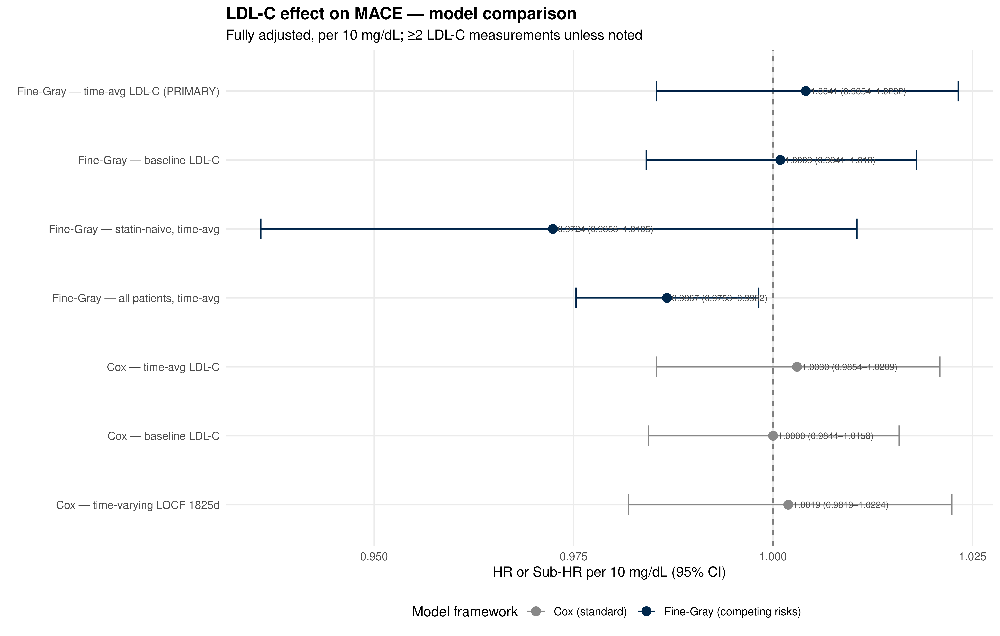

::: {.cell}

```{.r .cell-code}
library(tidyverse)
library(lubridate)
library(survival)
library(survminer)
library(cmprsk)
library(broom)
library(knitr)

# ── CONFIGURATION ──────────────────────────────────────────────────────────
SEX_COL       <- "GenderCode"
RACE_COL      <- "RaceCode"
ETHNICITY_COL <- "EthnicityCode"
LDL_SCALE     <- 10             # HR expressed per this many mg/dL

theme_set(theme_minimal(base_size = 12))

# Michigan colors for plots
color_mace   <- "#00274c"
color_death  <- "#CC6677"
color_censor <- "#888888"
```
:::


## Purpose

This script estimates the association between **time-averaged LDL-C burden** and
incident MACE using a **Fine-Gray competing risks model** with death as the
competing event.

**Primary exposure**: Time-averaged LDL-C (trapezoid AUC ÷ follow-up years),
per 10 mg/dL. This metric captures average lifetime LDL-C exposure
without the confounding by follow-up duration inherent in raw cumulative AUC
(mg/dL × years).

**Primary model**: Fine-Gray subdistribution hazard. Standard Cox models treat
death as non-informative censoring, which biases the estimate when LDL-C affects
both MACE and mortality risk. Fine-Gray accounts for this by modelling the
subdistribution hazard.

**Covariates**: Age at baseline, sex, race/ethnicity, ever/never statin use,
diabetes, hypertension — all as regression covariates (not stratification
variables), enabling direct HR comparison across model specifications.

**Sensitivity analyses**: Standard Cox, baseline LDL-C, time-varying LOCF
(with tmerge), all patients (including single-measurement), and statin-naive
subgroup.

---

## Data Input


::: {.cell}

```{.r .cell-code}
demographic.data <- read_csv("combined_data/DemographicInfo.csv",
                             show_col_types = FALSE) %>%
  mutate(
    DeID_PatientID = as.character(DeID_PatientID),
    ehr_death_date = mdy_hm(DeID_DeceasedDate)
  )

# Print column names for verification
cat("Demographic columns:\n")
```

::: {.cell-output .cell-output-stdout}

```
Demographic columns:
```


:::

```{.r .cell-code}
cat(paste(names(demographic.data), collapse = ", "), "\n")
```

::: {.cell-output .cell-output-stdout}

```
DeID_PatientID, GenderCode, DeID_DOB, DeID_DeceasedDate, RaceCode, EthnicityCode, DeathIndexUnderlyingCOD_ICD10, ehr_death_date 
```


:::

```{.r .cell-code}
# Michigan Death Index
mdi.data <- read_csv("combined_data/MichiganDeathIndex.csv",
                     show_col_types = FALSE) %>%
  mutate(
    DeID_PatientID = as.character(DeID_PatientID),
    mdi_death_date = mdy_hm(DeID_MDIDeceasedDate)
  ) %>%
  select(DeID_PatientID, mdi_death_date)

# Diagnoses
diagnosis.data <- read_csv("combined_data/DiagnosesCleaned.csv",
                           show_col_types = FALSE) %>%
  mutate(
    DeID_PatientID = as.character(DeID_PatientID),
    MACE.onset     = ymd(MACE.onset)
  )

# Labs
lab.data <- read_csv("combined_data/LabResultsCleaned.csv",
                     show_col_types = FALSE) %>%
  mutate(
    DeID_PatientID = as.character(DeID_PatientID),
    lab_date = coalesce(
      parse_date_time(DeID_COLLECTION_DATE,
                      orders = c("ymd", "mdy", "ymd HMS", "mdy HM"),
                      quiet  = TRUE),
      parse_date_time(DeID_AdmitDate,
                      orders = c("ymd", "mdy", "ymd HMS", "mdy HM"),
                      quiet  = TRUE)
    )
  )

ldlc.data <- lab.data %>% filter(test_name == "LDL-C")

# Encounters
encounter.data <- read_csv("combined_data/EncounterAll.csv",
                           show_col_types = FALSE) %>%
  mutate(
    DeID_PatientID = as.character(DeID_PatientID),
    EncounterDate  = mdy_hm(DeID_AdmitDate)
  )

# Statin intervals
statin_intervals <- read_csv(
  "combined_data/MedicationOrdersCleanedStatins.csv",
  show_col_types = FALSE
) %>%
  mutate(
    DeID_PatientID = as.character(DeID_PatientID),
    period_start   = as_date(period_start),
    period_end     = as_date(period_end),
    intensity      = factor(intensity, levels = c("low", "moderate", "high"))
  )

# Comorbidities
comorbidity_onset <- read_csv("combined_data/ComorbiditiesOnset.csv",
                              show_col_types = FALSE) %>%
  mutate(
    DeID_PatientID      = as.character(DeID_PatientID),
    diabetes_onset      = as_datetime(diabetes_onset),
    hypertension_onset  = as_datetime(hypertension_onset)
  )

cat("Demographic patients:", scales::comma(n_distinct(demographic.data$DeID_PatientID)), "\n")
```

::: {.cell-output .cell-output-stdout}

```
Demographic patients: 201,073 
```


:::

```{.r .cell-code}
cat("MDI death records:",    scales::comma(n_distinct(mdi.data$DeID_PatientID)), "\n")
```

::: {.cell-output .cell-output-stdout}

```
MDI death records: 17,318 
```


:::
:::


---

## Cohort Construction


::: {.cell}

```{.r .cell-code}
# --- Unified death date (earliest of EHR + MDI) ---
death_dates <- demographic.data %>%
  select(DeID_PatientID, ehr_death_date) %>%
  left_join(mdi.data, by = "DeID_PatientID") %>%
  mutate(death_date = pmin(ehr_death_date, mdi_death_date, na.rm = TRUE))

death_dates %>%
  summarise(
    `EHR death`       = sum(!is.na(ehr_death_date)),
    `MDI death`       = sum(!is.na(mdi_death_date)),
    `Any death`       = sum(!is.na(death_date)),
    `MDI-only deaths` = sum(!is.na(mdi_death_date) & is.na(ehr_death_date))
  ) %>%
  pivot_longer(everything(), names_to = "Source", values_to = "N") %>%
  kable(caption = "Death data coverage")
```

::: {.cell-output-display}


Table: Death data coverage

|Source          |     N|
|:---------------|-----:|
|EHR death       | 14845|
|MDI death       | 16677|
|Any death       | 17283|
|MDI-only deaths |  2438|


:::

```{.r .cell-code}
# --- Full cohort ---
full_cohort <- demographic.data %>%
  select(DeID_PatientID, all_of(c(SEX_COL, RACE_COL, ETHNICITY_COL))) %>%
  left_join(death_dates %>% select(DeID_PatientID, death_date),
            by = "DeID_PatientID") %>%
  left_join(
    diagnosis.data %>%
      select(DeID_PatientID, MACE, MACE.onset),
    by = "DeID_PatientID"
  ) %>%
  mutate(
    MACE_flag = if_else(MACE == TRUE, 1L, 0L, missing = 0L),
    sex_raw   = as.character(.data[[SEX_COL]]),
    sex       = case_when(
      str_detect(sex_raw, regex("^f", ignore_case = TRUE)) ~ "Female",
      str_detect(sex_raw, regex("^m", ignore_case = TRUE)) ~ "Male",
      TRUE ~ NA_character_
    )
  )

cat("GenderCode mapping:\n")
```

::: {.cell-output .cell-output-stdout}

```
GenderCode mapping:
```


:::

```{.r .cell-code}
print(table(full_cohort$sex_raw, full_cohort$sex, useNA = "ifany"))
```

::: {.cell-output .cell-output-stdout}

```
   
    Female   Male   <NA>
  F 109410      0      0
  M      0  91653      0
  U      0      0     10
```


:::

```{.r .cell-code}
# --- Clean race/ethnicity into manageable categories ---
# DataDirect codes: RaceCode = A/AA/AI/C/D/O/P/U
#                   EthnicityCode = HL/NonHL/D/U
# Hispanic/Latino ethnicity overrides race (standard NIH classification)
cat("Race categories:\n")
```

::: {.cell-output .cell-output-stdout}

```
Race categories:
```


:::

```{.r .cell-code}
print(sort(table(full_cohort[[RACE_COL]], useNA = "ifany"), decreasing = TRUE))
```

::: {.cell-output .cell-output-stdout}

```

     C     AA      A      O      U      D   <NA>     AI      P 
150655  19851  18004   7346   1564   1388   1368    748    149 
```


:::

```{.r .cell-code}
cat("\nEthnicity categories:\n")
```

::: {.cell-output .cell-output-stdout}

```

Ethnicity categories:
```


:::

```{.r .cell-code}
print(sort(table(full_cohort[[ETHNICITY_COL]], useNA = "ifany"), decreasing = TRUE))
```

::: {.cell-output .cell-output-stdout}

```

 NonHL     HL      U   <NA>      D 
180630   7948   5516   5130   1849 
```


:::

```{.r .cell-code}
full_cohort <- full_cohort %>%
  mutate(
    race_eth = case_when(
      # Hispanic/Latino ethnicity takes priority regardless of race
      .data[[ETHNICITY_COL]] == "HL"       ~ "Hispanic",
      # Map race codes
      .data[[RACE_COL]] == "C"             ~ "White",
      .data[[RACE_COL]] == "AA"            ~ "Black",
      .data[[RACE_COL]] == "A"             ~ "Asian",
      .data[[RACE_COL]] %in% c("AI", "P")  ~ "Other/Unknown",  # AI, Pacific Islander
      .data[[RACE_COL]] %in% c("D", "O", "U") ~ "Other/Unknown",
      TRUE ~ "Other/Unknown"  # NA or unrecognized
    ),
    race_eth = factor(race_eth,
                      levels = c("White", "Black", "Asian",
                                 "Hispanic", "Other/Unknown"))
  )

cat("\nCombined race/ethnicity:\n")
```

::: {.cell-output .cell-output-stdout}

```

Combined race/ethnicity:
```


:::

```{.r .cell-code}
print(table(full_cohort$race_eth, useNA = "ifany"))
```

::: {.cell-output .cell-output-stdout}

```

        White         Black         Asian      Hispanic Other/Unknown 
       147266         19564         17928          7948          8367 
```


:::

```{.r .cell-code}
# --- Clean diagnoses (exclude MACE=TRUE with missing onset) ---
diag_clean <- full_cohort %>%
  filter(!(MACE_flag == 1L & is.na(MACE.onset))) %>%
  select(DeID_PatientID, sex, race_eth, MACE.onset, MACE_flag, death_date)

# --- Clean LDL-C ---
ldlc_clean <- ldlc.data %>%
  filter(!is.na(lab_date), !is.na(AgeInYears)) %>%
  filter(value > 0, value <= 400) %>%
  mutate(BMI = if_else(BMI < 10 | BMI > 80, NA_real_, BMI)) %>%
  filter(AgeInYears >= 18) %>%
  group_by(DeID_PatientID, lab_date) %>%
  summarise(
    LDL_value  = mean(value,      na.rm = TRUE),
    AgeInYears = mean(AgeInYears, na.rm = TRUE),
    BMI        = mean(BMI,        na.rm = TRUE),
    .groups    = "drop"
  ) %>%
  arrange(DeID_PatientID, lab_date)

# --- Shared IDs ---
shared_ids  <- intersect(diag_clean$DeID_PatientID, ldlc_clean$DeID_PatientID)
diag_cohort <- diag_clean %>% filter(DeID_PatientID %in% shared_ids)
ldlc_cohort <- ldlc_clean %>% filter(DeID_PatientID %in% shared_ids)

# --- Last encounter (censoring) ---
last_encounter <- encounter.data %>%
  filter(!is.na(EncounterDate), DeID_PatientID %in% shared_ids) %>%
  group_by(DeID_PatientID) %>%
  slice_max(EncounterDate, n = 1, with_ties = FALSE) %>%
  ungroup() %>%
  select(DeID_PatientID, last_encounter_date = EncounterDate)

# --- First LDL-C = time zero ---
first_ldlc <- ldlc_cohort %>%
  group_by(DeID_PatientID) %>%
  slice_min(lab_date, n = 1, with_ties = FALSE) %>%
  ungroup() %>%
  select(DeID_PatientID,
         t0           = lab_date,
         LDL_baseline = LDL_value,
         Age_baseline = AgeInYears)

# --- Build base cohort with competing risks status ---
base_cohort_full <- diag_cohort %>%
  left_join(first_ldlc,     by = "DeID_PatientID") %>%
  left_join(last_encounter, by = "DeID_PatientID") %>%
  mutate(
    t_end = case_when(
      MACE_flag == 1              ~ MACE.onset,
      !is.na(last_encounter_date) ~ last_encounter_date,
      TRUE                        ~ NA_POSIXct_
    ),
    follow_up_days  = as.numeric(difftime(t_end, t0, units = "days")),
    follow_up_years = follow_up_days / 365.25,
    # Two-state competing risks: MACE (1), death without MACE (2), censored (0)
    fg_status = case_when(
      MACE_flag == 1                                   ~ 1L,
      !is.na(death_date) & death_date <= t_end &
        MACE_flag == 0                                 ~ 2L,
      TRUE                                             ~ 0L
    )
  )

base_cohort <- base_cohort_full %>%
  filter(follow_up_days > 0)

# --- CONSORT flow ---
tibble(
  Step = c(
    "Full demographic cohort",
    "No LDL-C data",
    "MACE=TRUE with missing onset date",
    "Negative or zero follow-up",
    "Final analytic cohort"
  ),
  N = c(
    n_distinct(demographic.data$DeID_PatientID),
    -length(setdiff(unique(full_cohort$DeID_PatientID), shared_ids)),
    -(nrow(full_cohort %>% filter(MACE_flag == 1L & is.na(MACE.onset)))),
    -(nrow(base_cohort_full %>% filter(follow_up_days <= 0))),
    nrow(base_cohort)
  )
) %>% kable(caption = "CONSORT flow — cohort derivation")
```

::: {.cell-output-display}


Table: CONSORT flow — cohort derivation

|Step                              |       N|
|:---------------------------------|-------:|
|Full demographic cohort           |  201073|
|No LDL-C data                     | -180502|
|MACE=TRUE with missing onset date |   -2867|
|Negative or zero follow-up        |    -556|
|Final analytic cohort             |   20015|


:::

```{.r .cell-code}
# --- Competing events summary ---
base_cohort %>%
  count(fg_status) %>%
  mutate(
    Status = case_when(
      fg_status == 0 ~ "Censored",
      fg_status == 1 ~ "MACE (event of interest)",
      fg_status == 2 ~ "Death without MACE (competing)"
    ),
    pct = round(100 * n / sum(n), 1)
  ) %>%
  select(Status, N = n, `%` = pct) %>%
  kable(caption = "Two-state competing risks status")
```

::: {.cell-output-display}


Table: Two-state competing risks status

|Status                         |     N|    %|
|:------------------------------|-----:|----:|
|Censored                       | 15831| 79.1|
|MACE (event of interest)       |  2871| 14.3|
|Death without MACE (competing) |  1313|  6.6|


:::
:::


---

## LDL-C Exposure Computation

Three exposure metrics are computed for each patient:

1. **Baseline LDL-C** — first measurement
2. **Time-averaged LDL-C (trapezoid)** — AUC by trapezoidal rule ÷ follow-up years
3. **Time-averaged LDL-C (step/LOCF)** — AUC by step function ÷ follow-up years

The trapezoid method is primary; the step/LOCF method is a sensitivity analysis.


::: {.cell}

```{.r .cell-code}
# LDL-C measurements with time relative to t0
ldlc_with_time <- ldlc_cohort %>%
  filter(DeID_PatientID %in% base_cohort$DeID_PatientID) %>%
  left_join(base_cohort %>% select(DeID_PatientID, t0, t_end),
            by = "DeID_PatientID") %>%
  filter(lab_date >= t0, lab_date <= t_end) %>%
  mutate(t_years = as.numeric(difftime(lab_date, t0, units = "days")) / 365.25) %>%
  arrange(DeID_PatientID, t_years)

# Count measurements per patient
n_measurements <- ldlc_with_time %>%
  count(DeID_PatientID, name = "n_measurements")

# --- Trapezoid AUC ---
auc_trapezoid <- ldlc_with_time %>%
  group_by(DeID_PatientID) %>%
  mutate(
    t_next   = lead(t_years),
    ldl_next = lead(LDL_value),
    t_end_yr = as.numeric(difftime(first(t_end), first(t0),
                                   units = "days")) / 365.25,
    interval_area = case_when(
      !is.na(t_next) ~ (LDL_value + ldl_next) / 2 * (t_next - t_years),
      TRUE           ~ LDL_value * (t_end_yr - t_years)  # LOCF last segment
    )
  ) %>%
  summarise(
    cumLDL_trap = sum(interval_area, na.rm = TRUE),
    fu_years    = first(t_end_yr),
    .groups     = "drop"
  ) %>%
  mutate(meanLDL_trap = cumLDL_trap / fu_years)

# --- Step / LOCF AUC ---
auc_step <- ldlc_with_time %>%
  group_by(DeID_PatientID) %>%
  mutate(
    t_next   = lead(t_years),
    t_end_yr = as.numeric(difftime(first(t_end), first(t0),
                                   units = "days")) / 365.25,
    duration = if_else(!is.na(t_next), t_next - t_years, t_end_yr - t_years)
  ) %>%
  summarise(
    cumLDL_step = sum(LDL_value * duration, na.rm = TRUE),
    fu_years    = first(t_end_yr),
    .groups     = "drop"
  ) %>%
  mutate(meanLDL_step = cumLDL_step / fu_years)

# --- Join exposures to base cohort ---
base_cohort <- base_cohort %>%
  left_join(n_measurements, by = "DeID_PatientID") %>%
  left_join(auc_trapezoid %>% select(DeID_PatientID, cumLDL_trap, meanLDL_trap),
            by = "DeID_PatientID") %>%
  left_join(auc_step %>% select(DeID_PatientID, cumLDL_step, meanLDL_step),
            by = "DeID_PatientID") %>%
  mutate(
    LDL_baseline_s  = LDL_baseline / LDL_SCALE,
    meanLDL_trap_s  = meanLDL_trap / LDL_SCALE,
    meanLDL_step_s  = meanLDL_step / LDL_SCALE,
    cumLDL_trap_s   = cumLDL_trap / (LDL_SCALE * 365.25)  # per 10 mg/dL-years
  )

# --- Primary cohort: ≥2 measurements ---
cohort_2plus <- base_cohort %>% filter(n_measurements >= 2)

# Exposure summary
cohort_2plus %>%
  summarise(
    `N patients`                     = n(),
    `MACE events (status=1)`         = sum(fg_status == 1),
    `Death competing (status=2)`     = sum(fg_status == 2),
    `Censored (status=0)`            = sum(fg_status == 0),
    `Median follow-up (years)`       = round(median(follow_up_years), 1),
    `Median baseline LDL-C (mg/dL)`  = round(median(LDL_baseline, na.rm = TRUE), 1),
    `Median time-avg LDL-C (mg/dL)`  = round(median(meanLDL_trap, na.rm = TRUE), 1),
    `Trap-step correlation`          = round(cor(meanLDL_trap, meanLDL_step,
                                                 use = "complete.obs"), 3)
  ) %>%
  pivot_longer(everything(), names_to = "Metric", values_to = "Value") %>%
  kable(caption = "Exposure summary (≥2 measurements cohort)")
```

::: {.cell-output-display}


Table: Exposure summary (≥2 measurements cohort)

|Metric                        |    Value|
|:-----------------------------|--------:|
|N patients                    | 5668.000|
|MACE events (status=1)        | 1032.000|
|Death competing (status=2)    |  404.000|
|Censored (status=0)           | 4232.000|
|Median follow-up (years)      |   17.900|
|Median baseline LDL-C (mg/dL) |  104.000|
|Median time-avg LDL-C (mg/dL) |  103.700|
|Trap-step correlation         |    0.975|


:::
:::


---

## Covariate Construction


::: {.cell}

```{.r .cell-code}
# --- Ever/never statin ---
# Any statin prescription overlapping the observation period [t0, t_end]
ever_statin <- statin_intervals %>%
  inner_join(base_cohort %>% select(DeID_PatientID, t0, t_end),
             by = "DeID_PatientID") %>%
  filter(period_end >= as_date(t0), period_start <= as_date(t_end)) %>%
  distinct(DeID_PatientID) %>%
  mutate(ever_statin = 1L)

# --- Diabetes and hypertension (ever diagnosed before event/censoring) ---
comorbidity_fixed <- comorbidity_onset %>%
  inner_join(base_cohort %>% select(DeID_PatientID, t0, t_end),
             by = "DeID_PatientID") %>%
  mutate(
    ever_diabetes     = as.integer(!is.na(diabetes_onset) &
                                     diabetes_onset <= t_end),
    ever_hypertension = as.integer(!is.na(hypertension_onset) &
                                     hypertension_onset <= t_end)
  ) %>%
  select(DeID_PatientID, ever_diabetes, ever_hypertension)

# --- Join all covariates ---
base_cohort <- base_cohort %>%
  left_join(ever_statin,      by = "DeID_PatientID") %>%
  left_join(comorbidity_fixed, by = "DeID_PatientID") %>%
  mutate(
    ever_statin       = replace_na(ever_statin, 0L),
    ever_diabetes     = replace_na(ever_diabetes, 0L),
    ever_hypertension = replace_na(ever_hypertension, 0L),
    sex               = factor(sex),
    race_eth          = factor(race_eth,
                               levels = c("White", "Black", "Asian",
                                          "Hispanic", "Other/Unknown"))
  )

# Update 2+ cohort
cohort_2plus <- base_cohort %>% filter(n_measurements >= 2)

# Covariate summary
cohort_2plus %>%
  summarise(
    N                    = n(),
    `MACE events`        = sum(fg_status == 1),
    `Ever statin (%)`    = round(100 * mean(ever_statin), 1),
    `Diabetes (%)`       = round(100 * mean(ever_diabetes), 1),
    `Hypertension (%)`   = round(100 * mean(ever_hypertension), 1),
    `Female (%)`         = round(100 * mean(sex == "Female", na.rm = TRUE), 1),
    `Median age`         = round(median(Age_baseline, na.rm = TRUE), 1)
  ) %>%
  pivot_longer(everything(), names_to = "Metric", values_to = "Value") %>%
  kable(caption = "Covariate summary (≥2 measurements cohort)")
```

::: {.cell-output-display}


Table: Covariate summary (≥2 measurements cohort)

|Metric           |  Value|
|:----------------|------:|
|N                | 5668.0|
|MACE events      | 1032.0|
|Ever statin (%)  |   70.7|
|Diabetes (%)     |   54.7|
|Hypertension (%) |   75.6|
|Female (%)       |   38.8|
|Median age       |   52.0|


:::

```{.r .cell-code}
# Race/ethnicity distribution
cohort_2plus %>%
  count(race_eth) %>%
  mutate(pct = round(100 * n / sum(n), 1)) %>%
  kable(caption = "Race/ethnicity distribution (≥2 measurements)")
```

::: {.cell-output-display}


Table: Race/ethnicity distribution (≥2 measurements)

|race_eth      |    n|  pct|
|:-------------|----:|----:|
|White         | 4393| 77.5|
|Black         |  407|  7.2|
|Asian         |  434|  7.7|
|Hispanic      |  224|  4.0|
|Other/Unknown |  210|  3.7|


:::
:::


---

## Descriptive: Table 1


::: {.cell}

```{.r .cell-code}
cohort_2plus %>%
  mutate(
    MACE_group = case_when(
      fg_status == 1 ~ "MACE",
      fg_status == 2 ~ "Death (no MACE)",
      TRUE           ~ "Censored"
    )
  ) %>%
  group_by(MACE_group) %>%
  summarise(
    N                              = n(),
    `Median age`                   = round(median(Age_baseline, na.rm = TRUE), 1),
    `Female (%)`                   = round(100 * mean(sex == "Female", na.rm = TRUE), 1),
    `Ever statin (%)`              = round(100 * mean(ever_statin), 1),
    `Diabetes (%)`                 = round(100 * mean(ever_diabetes), 1),
    `Hypertension (%)`             = round(100 * mean(ever_hypertension), 1),
    `Median baseline LDL-C`        = round(median(LDL_baseline, na.rm = TRUE), 1),
    `Median time-avg LDL-C`        = round(median(meanLDL_trap, na.rm = TRUE), 1),
    `Median follow-up (years)`     = round(median(follow_up_years), 1),
    `Median LDL-C measurements`    = median(n_measurements),
    .groups = "drop"
  ) %>%
  pivot_longer(-MACE_group, names_to = "Variable", values_to = "Value") %>%
  pivot_wider(names_from = MACE_group, values_from = Value) %>%
  kable(caption = "Table 1 — patient characteristics by outcome status")
```

::: {.cell-output-display}


Table: Table 1 — patient characteristics by outcome status

|Variable                  | Censored| Death (no MACE)|   MACE|
|:-------------------------|--------:|---------------:|------:|
|N                         |   4232.0|           404.0| 1032.0|
|Median age                |     50.0|            63.0|   59.0|
|Female (%)                |     37.9|            44.8|   39.7|
|Ever statin (%)           |     70.2|            65.3|   74.8|
|Diabetes (%)              |     51.1|            68.6|   64.3|
|Hypertension (%)          |     70.5|            92.6|   89.9|
|Median baseline LDL-C     |    106.0|            95.0|   99.0|
|Median time-avg LDL-C     |    105.9|            96.3|   98.1|
|Median follow-up (years)  |     19.2|            16.5|   11.4|
|Median LDL-C measurements |      2.0|             2.0|    3.0|


:::
:::


---

## Primary Analysis: Fine-Gray Competing Risks

Two-state competing risks: MACE (cause 1), death without MACE (cause 2).


::: {.cell}

```{.r .cell-code}
# Helper functions
format_fg <- function(fg_fit, term_labels) {
  s <- summary(fg_fit)
  tibble(
    Term          = term_labels,
    `Sub-HR`      = round(exp(s$coef[, "coef"]), 4),
    `95% CI low`  = round(exp(s$coef[, "coef"] -
                               1.96 * s$coef[, "se(coef)"]), 4),
    `95% CI high` = round(exp(s$coef[, "coef"] +
                               1.96 * s$coef[, "se(coef)"]), 4),
    `p-value`     = format.pval(s$coef[, "p-value"], digits = 3, eps = 0.001)
  )
}

extract_fg_row <- function(fg_fit, label, term_idx = 1) {
  s <- summary(fg_fit)
  tibble(
    Model     = label,
    HR        = round(exp(s$coef[term_idx, "coef"]), 4),
    CI_low    = round(exp(s$coef[term_idx, "coef"] -
                           1.96 * s$coef[term_idx, "se(coef)"]), 4),
    CI_high   = round(exp(s$coef[term_idx, "coef"] +
                           1.96 * s$coef[term_idx, "se(coef)"]), 4),
    `p-value` = format.pval(s$coef[term_idx, "p-value"],
                            digits = 3, eps = 0.001),
    `N obs`   = as.integer(fg_fit$n),
    `N events`= as.integer(sum(fg_fit$fstatus == fg_fit$failcode)),
    `95% CI`  = paste0("(", CI_low, "\u2013", CI_high, ")")
  ) %>%
    select(Model, HR, `95% CI`, `p-value`, `N obs`, `N events`)
}

extract_hr <- function(fit, label, term_name) {
  broom::tidy(fit, exponentiate = TRUE, conf.int = TRUE) %>%
    filter(term == term_name) %>%
    mutate(
      Model      = label,
      HR         = round(estimate, 4),
      CI_low     = round(conf.low, 4),
      CI_high    = round(conf.high, 4),
      `95% CI`   = paste0("(", CI_low, "\u2013", CI_high, ")"),
      `p-value`  = format.pval(p.value, digits = 3, eps = 0.001),
      `N obs`    = fit$n,
      `N events` = fit$nevent
    ) %>%
    select(Model, HR, CI_low, CI_high, `95% CI`, `p-value`, `N obs`, `N events`)
}

# --- Build design matrix for crr() ---
# crr() requires a numeric matrix, so dummy-code factors
cat(">>> SCRIPT VERSION: 2026-04-06-v4 <<<\n")
```

::: {.cell-output .cell-output-stdout}

```
>>> SCRIPT VERSION: 2026-04-06-v4 <<<
```


:::

```{.r .cell-code}
# Wrapper for crr() that drops zero-variance columns
safe_crr <- function(ftime, fstatus, cov_mat, labels, failcode = 1) {
  col_vars <- apply(cov_mat, 2, var, na.rm = TRUE)
  bad_cols <- which(col_vars == 0 | is.na(col_vars))
  if (length(bad_cols) > 0) {
    cat("  Dropping zero-variance columns:",
        paste(colnames(cov_mat)[bad_cols], collapse = ", "), "\n")
    cov_mat <- cov_mat[, -bad_cols, drop = FALSE]
    labels  <- labels[-bad_cols]
  }
  fit <- crr(ftime = ftime, fstatus = fstatus, cov1 = cov_mat,
             failcode = failcode, cencode = 0)
  list(fit = fit, labels = labels)
}

fg_data <- cohort_2plus %>%
  filter(!is.na(meanLDL_trap_s), !is.na(Age_baseline), !is.na(sex),
         !is.na(race_eth)) %>%
  mutate(
    sex_female   = as.integer(sex == "Female"),
    race_black   = as.integer(race_eth == "Black"),
    race_asian   = as.integer(race_eth == "Asian"),
    race_hisp    = as.integer(race_eth == "Hispanic"),
    race_other   = as.integer(race_eth == "Other/Unknown")
  )

cat("fg_data rows:", nrow(fg_data), "\n")
```

::: {.cell-output .cell-output-stdout}

```
fg_data rows: 5668 
```


:::

```{.r .cell-code}
cat("sex distribution:\n")
```

::: {.cell-output .cell-output-stdout}

```
sex distribution:
```


:::

```{.r .cell-code}
print(table(fg_data$sex, useNA = "ifany"))
```

::: {.cell-output .cell-output-stdout}

```

Female   Male 
  2197   3471 
```


:::

```{.r .cell-code}
cat("race_eth distribution:\n")
```

::: {.cell-output .cell-output-stdout}

```
race_eth distribution:
```


:::

```{.r .cell-code}
print(table(fg_data$race_eth, useNA = "ifany"))
```

::: {.cell-output .cell-output-stdout}

```

        White         Black         Asian      Hispanic Other/Unknown 
         4393           407           434           224           210 
```


:::

```{.r .cell-code}
cov_matrix_avg <- as.matrix(fg_data %>%
  select(meanLDL_trap_s, Age_baseline, sex_female,
         race_black, race_asian, race_hisp, race_other,
         ever_statin, ever_diabetes, ever_hypertension))

cov_labels <- c(
  paste0("Time-avg LDL-C (per ", LDL_SCALE, " mg/dL)"),
  "Age at baseline",
  "Female (vs Male)",
  "Black (vs White)", "Asian (vs White)",
  "Hispanic (vs White)", "Other/Unknown (vs White)",
  "Ever statin", "Diabetes", "Hypertension"
)

# --- Primary model: Fine-Gray, time-averaged LDL-C ---
primary_result <- safe_crr(fg_data$follow_up_days, fg_data$fg_status,
                           cov_matrix_avg, cov_labels, failcode = 1)
fg_primary <- primary_result$fit
cov_labels <- primary_result$labels

format_fg(fg_primary, cov_labels) %>%
  kable(caption = paste0(
    "PRIMARY — Fine-Gray competing risks: time-averaged LDL-C per ",
    LDL_SCALE, " mg/dL; death as competing event"))
```

::: {.cell-output-display}


Table: PRIMARY — Fine-Gray competing risks: time-averaged LDL-C per 10 mg/dL; death as competing event

|Term                          | Sub-HR| 95% CI low| 95% CI high|p-value |
|:-----------------------------|------:|----------:|-----------:|:-------|
|Time-avg LDL-C (per 10 mg/dL) | 1.0041|     0.9854|      1.0232|0.6700  |
|Age at baseline               | 1.0317|     1.0269|      1.0366|<0.001  |
|Female (vs Male)              | 0.8845|     0.7728|      1.0124|0.0750  |
|Black (vs White)              | 1.0637|     0.8532|      1.3261|0.5800  |
|Asian (vs White)              | 0.5185|     0.3745|      0.7180|<0.001  |
|Hispanic (vs White)           | 0.8063|     0.5399|      1.2044|0.2900  |
|Other/Unknown (vs White)      | 1.0361|     0.7413|      1.4480|0.8400  |
|Ever statin                   | 0.7461|     0.6371|      0.8737|<0.001  |
|Diabetes                      | 1.2199|     1.0604|      1.4034|0.0054  |
|Hypertension                  | 1.8875|     1.5116|      2.3567|<0.001  |


:::
:::


---

## Sensitivity 1: Standard Cox (No Competing Risks)


::: {.cell}

```{.r .cell-code}
fit_cox_avg <- coxph(
  Surv(follow_up_days, MACE_flag) ~ meanLDL_trap_s + Age_baseline +
    sex + race_eth + ever_statin + ever_diabetes + ever_hypertension,
  data = fg_data, ties = "efron"
)

broom::tidy(fit_cox_avg, exponentiate = TRUE, conf.int = TRUE) %>%
  mutate(across(where(is.numeric), ~round(.x, 4))) %>%
  select(term, estimate, conf.low, conf.high, p.value) %>%
  kable(caption = "Cox (no competing risks) — time-averaged LDL-C")
```

::: {.cell-output-display}


Table: Cox (no competing risks) — time-averaged LDL-C

|term                  | estimate| conf.low| conf.high| p.value|
|:---------------------|--------:|--------:|---------:|-------:|
|meanLDL_trap_s        |   1.0030|   0.9854|    1.0209|  0.7395|
|Age_baseline          |   1.0354|   1.0304|    1.0403|  0.0000|
|sexMale               |   1.1298|   0.9912|    1.2879|  0.0677|
|race_ethBlack         |   1.0553|   0.8412|    1.3238|  0.6420|
|race_ethAsian         |   0.4968|   0.3587|    0.6879|  0.0000|
|race_ethHispanic      |   0.7789|   0.5224|    1.1614|  0.2203|
|race_ethOther/Unknown |   1.0156|   0.7270|    1.4190|  0.9275|
|ever_statin           |   0.7017|   0.6048|    0.8141|  0.0000|
|ever_diabetes         |   1.2268|   1.0708|    1.4056|  0.0032|
|ever_hypertension     |   1.9280|   1.5514|    2.3960|  0.0000|


:::

```{.r .cell-code}
ph_cox_avg <- cox.zph(fit_cox_avg)
tibble(
  Term     = rownames(ph_cox_avg$table),
  `Chi-sq` = round(ph_cox_avg$table[, "chisq"], 3),
  df       = ph_cox_avg$table[, "df"],
  p        = round(ph_cox_avg$table[, "p"], 4)
) %>% kable(caption = "PH test — Cox time-averaged LDL-C")
```

::: {.cell-output-display}


Table: PH test — Cox time-averaged LDL-C

|Term              | Chi-sq| df|      p|
|:-----------------|------:|--:|------:|
|meanLDL_trap_s    |  5.377|  1| 0.0204|
|Age_baseline      |  2.494|  1| 0.1143|
|sex               |  2.858|  1| 0.0909|
|race_eth          |  5.652|  4| 0.2267|
|ever_statin       | 14.252|  1| 0.0002|
|ever_diabetes     |  4.420|  1| 0.0355|
|ever_hypertension |  0.296|  1| 0.5866|
|GLOBAL            | 33.561| 10| 0.0002|


:::
:::


---

## Sensitivity 2: Baseline LDL-C


::: {.cell}

```{.r .cell-code}
cov_matrix_base <- as.matrix(fg_data %>%
  select(LDL_baseline_s, Age_baseline, sex_female,
         race_black, race_asian, race_hisp, race_other,
         ever_statin, ever_diabetes, ever_hypertension))

cov_labels_base <- cov_labels
cov_labels_base[1] <- paste0("Baseline LDL-C (per ", LDL_SCALE, " mg/dL)")

base_result <- safe_crr(fg_data$follow_up_days, fg_data$fg_status,
                        cov_matrix_base, cov_labels_base, failcode = 1)
fg_baseline <- base_result$fit

format_fg(fg_baseline, base_result$labels) %>%
  kable(caption = "Fine-Gray — baseline LDL-C")
```

::: {.cell-output-display}


Table: Fine-Gray — baseline LDL-C

|Term                          | Sub-HR| 95% CI low| 95% CI high|p-value |
|:-----------------------------|------:|----------:|-----------:|:-------|
|Baseline LDL-C (per 10 mg/dL) | 1.0009|     0.9841|      1.0180|0.9200  |
|Age at baseline               | 1.0316|     1.0268|      1.0365|<0.001  |
|Female (vs Male)              | 0.8893|     0.7786|      1.0157|0.0840  |
|Black (vs White)              | 1.0616|     0.8517|      1.3234|0.5900  |
|Asian (vs White)              | 0.5176|     0.3738|      0.7168|<0.001  |
|Hispanic (vs White)           | 0.8069|     0.5400|      1.2055|0.2900  |
|Other/Unknown (vs White)      | 1.0366|     0.7417|      1.4489|0.8300  |
|Ever statin                   | 0.7465|     0.6374|      0.8742|<0.001  |
|Diabetes                      | 1.2158|     1.0572|      1.3983|0.0062  |
|Hypertension                  | 1.8851|     1.5098|      2.3538|<0.001  |


:::

```{.r .cell-code}
# Also as standard Cox
fit_cox_base <- coxph(
  Surv(follow_up_days, MACE_flag) ~ LDL_baseline_s + Age_baseline +
    sex + race_eth + ever_statin + ever_diabetes + ever_hypertension,
  data = fg_data, ties = "efron"
)

check_ph <- function(fit, label) {
  ph  <- cox.zph(fit)
  row <- ph$table[nrow(ph$table), ]  # GLOBAL row
  cat(sprintf("%s — global chi-sq=%.3f, p=%.4f %s\n",
              label, row["chisq"], row["p"],
              if_else(row["p"] < 0.05, "\u26a0 PH violated", "\u2713 PH holds")))
  invisible(ph)
}

check_ph(fit_cox_base, "Cox baseline LDL-C")
```

::: {.cell-output .cell-output-stdout}

```
Cox baseline LDL-C — global chi-sq=32.451, p=0.0003 ⚠ PH violated
```


:::
:::


---

## Sensitivity 3: Time-Varying LDL-C (tmerge + Cox)

This model uses a tmerge framework with time-varying LDL-C (LOCF, 1825d cap)
and time-varying statin status. This is more precise than the fixed-covariate
models but does not handle competing risks.


::: {.cell}

```{.r .cell-code}
# Build tmerge dataset for ≥2 measurement patients
ldlc_intervals_tv <- ldlc_cohort %>%
  filter(DeID_PatientID %in% cohort_2plus$DeID_PatientID) %>%
  left_join(cohort_2plus %>% select(DeID_PatientID, t0, t_end),
            by = "DeID_PatientID") %>%
  filter(lab_date <= t_end) %>%
  mutate(
    t_meas     = as.numeric(difftime(lab_date, t0, units = "days")),
    LDL_value  = as.numeric(LDL_value),
    AgeInYears = as.numeric(AgeInYears)
  ) %>%
  filter(t_meas >= 0) %>%
  arrange(DeID_PatientID, t_meas)

# Add stale sentinel markers at LOCF cap
add_stale_markers <- function(intervals_df, cap_days, follow_up_df) {
  intervals_df %>%
    arrange(DeID_PatientID, t_meas) %>%
    group_by(DeID_PatientID) %>%
    mutate(next_meas = lead(t_meas)) %>%
    ungroup() %>%
    filter(is.na(next_meas) | next_meas > t_meas + cap_days) %>%
    mutate(stale_t = t_meas + cap_days) %>%
    left_join(follow_up_df %>% select(DeID_PatientID, follow_up_days),
              by = "DeID_PatientID") %>%
    filter(stale_t < follow_up_days) %>%
    transmute(
      DeID_PatientID,
      t_meas     = stale_t,
      LDL_value  = -9999,
      AgeInYears = NA_real_
    )
}

stale_1825 <- add_stale_markers(ldlc_intervals_tv, 1825, cohort_2plus)
ldlc_intervals_1825 <- bind_rows(ldlc_intervals_tv, stale_1825) %>%
  arrange(DeID_PatientID, t_meas)

# Build tmerge
surv_base_tv <- cohort_2plus %>%
  mutate(tstart_days = 0, tstop_days = as.numeric(follow_up_days))

surv.data.tv <- tmerge(
  data1 = surv_base_tv, data2 = surv_base_tv,
  id = DeID_PatientID,
  MACE = event(tstop_days, MACE_flag)
)

surv.data.tv <- tmerge(
  data1 = surv.data.tv,
  data2 = ldlc_intervals_1825 %>%
    mutate(DeID_PatientID = as.character(DeID_PatientID)),
  id         = DeID_PatientID,
  LDL_value  = tdc(t_meas, LDL_value),
  AgeInYears = tdc(t_meas, AgeInYears)
)

surv.data.tv <- surv.data.tv %>%
  group_by(DeID_PatientID) %>%
  fill(AgeInYears, .direction = "downup") %>%
  mutate(
    LDL_value = if_else(LDL_value == -9999, NA_real_, LDL_value)
  ) %>%
  ungroup() %>%
  filter(tstop - tstart >= 0.5) %>%
  mutate(LDL_per_s = LDL_value / LDL_SCALE)

# Add time-varying statin (range join)
statin_tv <- statin_intervals %>%
  inner_join(first_ldlc %>% select(DeID_PatientID, t0),
             by = "DeID_PatientID") %>%
  mutate(
    tstart_statin = as.numeric(period_start - as_date(t0)),
    tstop_statin  = as.numeric(period_end   - as_date(t0))
  ) %>%
  filter(tstop_statin > 0) %>%
  mutate(tstart_statin = pmax(tstart_statin, 0)) %>%
  filter(tstop_statin > tstart_statin) %>%
  select(DeID_PatientID, tstart_statin, tstop_statin)

surv.data.tv <- surv.data.tv %>%
  left_join(statin_tv, by = "DeID_PatientID",
            relationship = "many-to-many") %>%
  mutate(
    on_statin = as.integer(
      !is.na(tstart_statin) &
        tstart < tstop_statin &
        tstop  > tstart_statin
    )
  ) %>%
  group_by(DeID_PatientID, tstart, tstop) %>%
  summarise(
    across(c(MACE, LDL_value, LDL_per_s, AgeInYears,
             sex, race_eth, ever_diabetes, ever_hypertension,
             MACE_flag, t0, t_end, follow_up_days),
           ~ first(na.omit(.x))),
    on_statin = as.integer(any(on_statin == 1, na.rm = TRUE)),
    .groups   = "drop"
  ) %>%
  arrange(DeID_PatientID, tstart)

# Time-varying Cox
fit_cox_tv <- coxph(
  Surv(tstart, tstop, MACE) ~ LDL_per_s + AgeInYears +
    sex + race_eth + on_statin + ever_diabetes + ever_hypertension,
  data = surv.data.tv, ties = "efron", id = DeID_PatientID
)

broom::tidy(fit_cox_tv, exponentiate = TRUE, conf.int = TRUE) %>%
  mutate(across(where(is.numeric), ~round(.x, 4))) %>%
  select(term, estimate, conf.low, conf.high, p.value) %>%
  kable(caption = "Cox — time-varying LOCF 1825d with time-varying statin")
```

::: {.cell-output-display}


Table: Cox — time-varying LOCF 1825d with time-varying statin

|term                  | estimate| conf.low| conf.high| p.value|
|:---------------------|--------:|--------:|---------:|-------:|
|LDL_per_s             |   1.0019|   0.9819|    1.0224|  0.8507|
|AgeInYears            |   1.0414|   1.0348|    1.0481|  0.0000|
|sexMale               |   1.2013|   1.0153|    1.4215|  0.0326|
|race_ethBlack         |   1.0977|   0.8182|    1.4727|  0.5343|
|race_ethAsian         |   0.5482|   0.3695|    0.8133|  0.0028|
|race_ethHispanic      |   0.6475|   0.3645|    1.1504|  0.1383|
|race_ethOther/Unknown |   1.0086|   0.6575|    1.5472|  0.9687|
|on_statin             |   1.3480|   1.1307|    1.6069|  0.0009|
|ever_diabetes         |   0.9936|   0.8371|    1.1794|  0.9415|
|ever_hypertension     |   1.2978|   0.9949|    1.6928|  0.0546|


:::

```{.r .cell-code}
check_ph(fit_cox_tv, "Cox time-varying LOCF")
```

::: {.cell-output .cell-output-stdout}

```
Cox time-varying LOCF — global chi-sq=46.923, p=0.0000 ⚠ PH violated
```


:::
:::


---

## Sensitivity 4: Statin-Naive Subgroup


::: {.cell}

```{.r .cell-code}
fg_statin_naive <- fg_data %>% filter(ever_statin == 0)

cov_matrix_naive <- as.matrix(fg_statin_naive %>%
  select(meanLDL_trap_s, Age_baseline, sex_female,
         race_black, race_asian, race_hisp, race_other,
         ever_diabetes, ever_hypertension))

cov_labels_naive <- cov_labels[cov_labels != "Ever statin"]

naive_result <- safe_crr(fg_statin_naive$follow_up_days, fg_statin_naive$fg_status,
                         cov_matrix_naive, cov_labels_naive, failcode = 1)
fg_naive <- naive_result$fit

format_fg(fg_naive, naive_result$labels) %>%
  kable(caption = "Fine-Gray — statin-naive subgroup, time-averaged LDL-C")
```

::: {.cell-output-display}


Table: Fine-Gray — statin-naive subgroup, time-averaged LDL-C

|Term                          | Sub-HR| 95% CI low| 95% CI high|p-value |
|:-----------------------------|------:|----------:|-----------:|:-------|
|Time-avg LDL-C (per 10 mg/dL) | 0.9724|     0.9358|      1.0105|0.1500  |
|Age at baseline               | 1.0292|     1.0205|      1.0380|<0.001  |
|Female (vs Male)              | 0.6920|     0.5272|      0.9083|0.0080  |
|Black (vs White)              | 0.8300|     0.4826|      1.4273|0.5000  |
|Asian (vs White)              | 0.4133|     0.2025|      0.8435|0.0150  |
|Hispanic (vs White)           | 0.5998|     0.2205|      1.6320|0.3200  |
|Other/Unknown (vs White)      | 0.9406|     0.5198|      1.7020|0.8400  |
|Diabetes                      | 1.4889|     1.1338|      1.9552|0.0042  |
|Hypertension                  | 2.4836|     1.7193|      3.5876|<0.001  |


:::
:::


---

## Sensitivity 5: All Patients (Including Single Measurement)


::: {.cell}

```{.r .cell-code}
fg_all_data <- base_cohort %>%
  filter(!is.na(meanLDL_trap_s), !is.na(Age_baseline),
         !is.na(sex), !is.na(race_eth)) %>%
  mutate(
    sex_female   = as.integer(sex == "Female"),
    race_black   = as.integer(race_eth == "Black"),
    race_asian   = as.integer(race_eth == "Asian"),
    race_hisp    = as.integer(race_eth == "Hispanic"),
    race_other   = as.integer(race_eth == "Other/Unknown")
  )

cov_matrix_all <- as.matrix(fg_all_data %>%
  select(meanLDL_trap_s, Age_baseline, sex_female,
         race_black, race_asian, race_hisp, race_other,
         ever_statin, ever_diabetes, ever_hypertension))

all_result <- safe_crr(fg_all_data$follow_up_days, fg_all_data$fg_status,
                       cov_matrix_all, cov_labels, failcode = 1)
fg_all <- all_result$fit

format_fg(fg_all, all_result$labels) %>%
  kable(caption = "Fine-Gray — all patients (including single measurement)")
```

::: {.cell-output-display}


Table: Fine-Gray — all patients (including single measurement)

|Term                          | Sub-HR| 95% CI low| 95% CI high|p-value |
|:-----------------------------|------:|----------:|-----------:|:-------|
|Time-avg LDL-C (per 10 mg/dL) | 0.9867|     0.9753|      0.9982|0.024   |
|Age at baseline               | 1.0383|     1.0354|      1.0412|<0.001  |
|Female (vs Male)              | 0.7917|     0.7323|      0.8560|<0.001  |
|Black (vs White)              | 1.0597|     0.9331|      1.2035|0.370   |
|Asian (vs White)              | 0.6109|     0.5131|      0.7273|<0.001  |
|Hispanic (vs White)           | 0.8016|     0.6338|      1.0136|0.065   |
|Other/Unknown (vs White)      | 0.8862|     0.7184|      1.0932|0.260   |
|Ever statin                   | 0.8122|     0.7438|      0.8868|<0.001  |
|Diabetes                      | 1.2560|     1.1570|      1.3635|<0.001  |
|Hypertension                  | 1.6840|     1.5009|      1.8895|<0.001  |


:::
:::


---

## Summary: All Models


::: {.cell}

```{.r .cell-code}
all_results <- bind_rows(
  # Primary
  extract_fg_row(fg_primary, "Fine-Gray — time-avg LDL-C (PRIMARY)"),
  # Fine-Gray sensitivities
  extract_fg_row(fg_baseline, "Fine-Gray — baseline LDL-C"),
  extract_fg_row(fg_naive,    "Fine-Gray — statin-naive, time-avg"),
  extract_fg_row(fg_all,      "Fine-Gray — all patients, time-avg"),
  # Cox sensitivities
  extract_hr(fit_cox_avg,  "Cox — time-avg LDL-C", "meanLDL_trap_s"),
  extract_hr(fit_cox_base, "Cox — baseline LDL-C", "LDL_baseline_s"),
  extract_hr(fit_cox_tv,   "Cox — time-varying LOCF 1825d", "LDL_per_s")
)

all_results %>%
  kable(caption = paste0(
    "All models — LDL-C effect on MACE per ", LDL_SCALE,
    " mg/dL (fully adjusted)"))
```

::: {.cell-output-display}


Table: All models — LDL-C effect on MACE per 10 mg/dL (fully adjusted)

|Model                                |     HR|95% CI          |p-value | N obs| N events| CI_low| CI_high|
|:------------------------------------|------:|:---------------|:-------|-----:|--------:|------:|-------:|
|Fine-Gray — time-avg LDL-C (PRIMARY) | 1.0041|(0.9854–1.0232) |0.67    |  5668|        0|     NA|      NA|
|Fine-Gray — baseline LDL-C           | 1.0009|(0.9841–1.018)  |0.92    |  5668|        0|     NA|      NA|
|Fine-Gray — statin-naive, time-avg   | 0.9724|(0.9358–1.0105) |0.15    |  1660|        0|     NA|      NA|
|Fine-Gray — all patients, time-avg   | 0.9867|(0.9753–0.9982) |0.024   | 20015|        0|     NA|      NA|
|Cox — time-avg LDL-C                 | 1.0030|(0.9854–1.0209) |0.739   |  5668|     1032| 0.9854|  1.0209|
|Cox — baseline LDL-C                 | 1.0000|(0.9844–1.0158) |0.999   |  5668|     1032| 0.9844|  1.0158|
|Cox — time-varying LOCF 1825d        | 1.0019|(0.9819–1.0224) |0.851   | 19735|      633| 0.9819|  1.0224|


:::
:::


---

## Forest Plot


::: {.cell}

```{.r .cell-code}
forest_data <- all_results %>%
  mutate(
    CI_low  = if_else(is.na(CI_low),
                      as.numeric(str_extract(`95% CI`, "(?<=\\().*(?=\u2013)")),
                      CI_low),
    CI_high = if_else(is.na(CI_high),
                      as.numeric(str_extract(`95% CI`, "(?<=\u2013).*(?=\\))")),
                      CI_high),
    model_type = if_else(str_detect(Model, "Fine-Gray"),
                         "Fine-Gray (competing risks)",
                         "Cox (standard)"),
    Model = factor(Model, levels = rev(Model))
  )

ggplot(forest_data,
       aes(x = HR, xmin = CI_low, xmax = CI_high,
           y = Model, colour = model_type)) +
  geom_vline(xintercept = 1, linetype = "dashed", colour = "grey50") +
  geom_errorbarh(height = 0.3) +
  geom_point(size = 3) +
  geom_text(aes(label = sprintf("%.4f %s", HR, `95% CI`)),
            hjust = -0.05, size = 2.5, colour = "grey30") +
  scale_colour_manual(values = c(
    "Fine-Gray (competing risks)" = color_mace,
    "Cox (standard)"              = color_censor
  )) +
  labs(
    title    = "LDL-C effect on MACE — model comparison",
    subtitle = paste0("Fully adjusted, per ", LDL_SCALE, " mg/dL; ",
                      "\u22652 LDL-C measurements unless noted"),
    x        = paste0("HR or Sub-HR per ", LDL_SCALE, " mg/dL (95% CI)"),
    y        = NULL,
    colour   = "Model framework"
  ) +
  theme_minimal(base_size = 11) +
  theme(panel.grid.minor = element_blank(),
        legend.position  = "bottom",
        plot.title       = element_text(face = "bold"))
```

::: {.cell-output-display}
{width=3300}
:::
:::


---

## Session Information


::: {.cell}

```{.r .cell-code}
sessionInfo()
```

::: {.cell-output .cell-output-stdout}

```
R version 4.4.3 (2025-02-28)
Platform: x86_64-pc-linux-gnu
Running under: Red Hat Enterprise Linux 8.10 (Ootpa)

Matrix products: default
BLAS:   /sw/pkgs/arc/stacks/gcc/13.2.0/R/4.4.3/lib64/R/lib/libRblas.so 
LAPACK: /sw/pkgs/arc/stacks/gcc/13.2.0/R/4.4.3/lib64/R/lib/libRlapack.so;  LAPACK version 3.12.0

locale:
 [1] LC_CTYPE=en_US.UTF-8       LC_NUMERIC=C              
 [3] LC_TIME=en_US.UTF-8        LC_COLLATE=en_US.UTF-8    
 [5] LC_MONETARY=en_US.UTF-8    LC_MESSAGES=en_US.UTF-8   
 [7] LC_PAPER=en_US.UTF-8       LC_NAME=C                 
 [9] LC_ADDRESS=C               LC_TELEPHONE=C            
[11] LC_MEASUREMENT=en_US.UTF-8 LC_IDENTIFICATION=C       

time zone: America/Detroit
tzcode source: system (glibc)

attached base packages:
[1] stats     graphics  grDevices utils     datasets  methods   base     

other attached packages:
 [1] knitr_1.48      broom_1.0.12    cmprsk_2.2-12   survminer_0.4.9
 [5] ggpubr_0.6.0    survival_3.7-0  lubridate_1.9.3 forcats_1.0.0  
 [9] stringr_1.5.1   dplyr_1.2.0     purrr_1.0.2     readr_2.1.5    
[13] tidyr_1.3.1     tibble_3.2.1    ggplot2_3.5.1   tidyverse_2.0.0

loaded via a namespace (and not attached):
 [1] gtable_0.3.6      xfun_0.45         htmlwidgets_1.6.4 rstatix_0.7.2    
 [5] lattice_0.22-6    tzdb_0.4.0        vctrs_0.7.1       tools_4.4.3      
 [9] generics_0.1.3    parallel_4.4.3    fansi_1.0.6       pkgconfig_2.0.3  
[13] Matrix_1.7-2      data.table_1.17.8 lifecycle_1.0.5   farver_2.1.2     
[17] compiler_4.4.3    munsell_0.5.1     carData_3.0-5     htmltools_0.5.8.1
[21] yaml_2.3.9        Formula_1.2-5     crayon_1.5.3      pillar_1.9.0     
[25] car_3.1-3         abind_1.4-8       km.ci_0.5-6       tidyselect_1.2.1 
[29] digest_0.6.36     stringi_1.8.4     labeling_0.4.3    splines_4.4.3    
[33] fastmap_1.2.0     grid_4.4.3        colorspace_2.1-0  cli_3.6.3        
[37] magrittr_2.0.3    utf8_1.2.4        withr_3.0.0       scales_1.3.0     
[41] backports_1.5.0   bit64_4.0.5       timechange_0.3.0  rmarkdown_2.27   
[45] bit_4.0.5         gridExtra_2.3     ggsignif_0.6.4    zoo_1.8-12       
[49] hms_1.1.3         evaluate_0.24.0   KMsurv_0.1-5      survMisc_0.5.6   
[53] rlang_1.1.7       xtable_1.8-4      glue_1.8.0        vroom_1.6.5      
[57] rstudioapi_0.16.0 jsonlite_1.8.8    R6_2.5.1         
```


:::
:::
