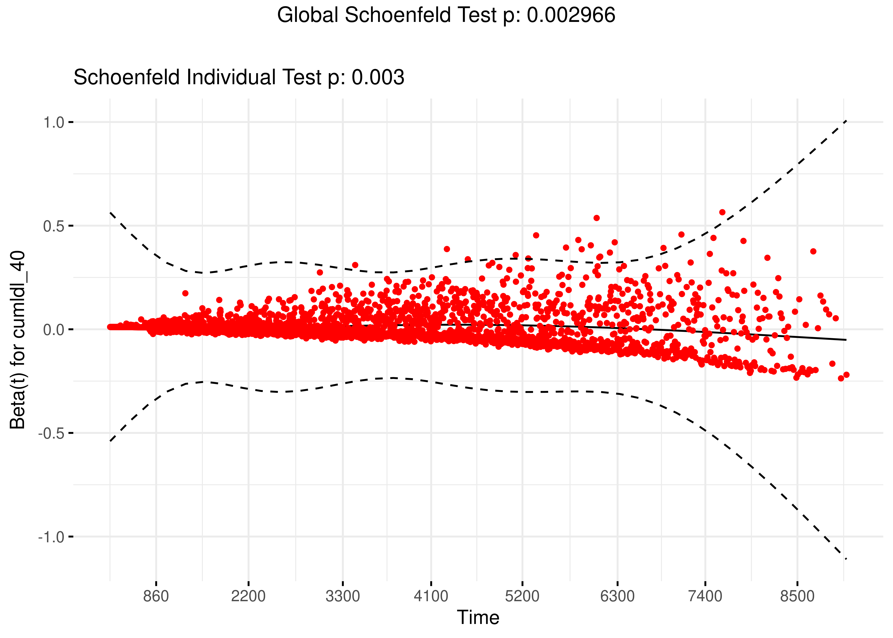
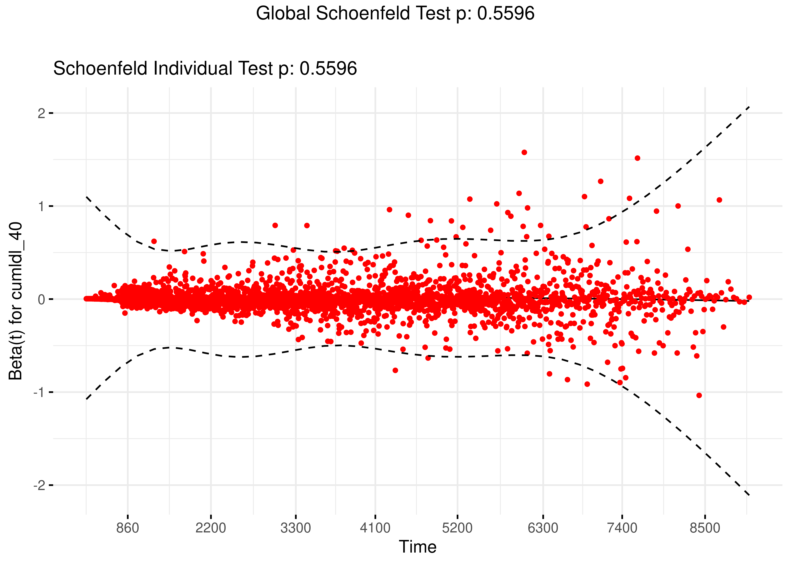
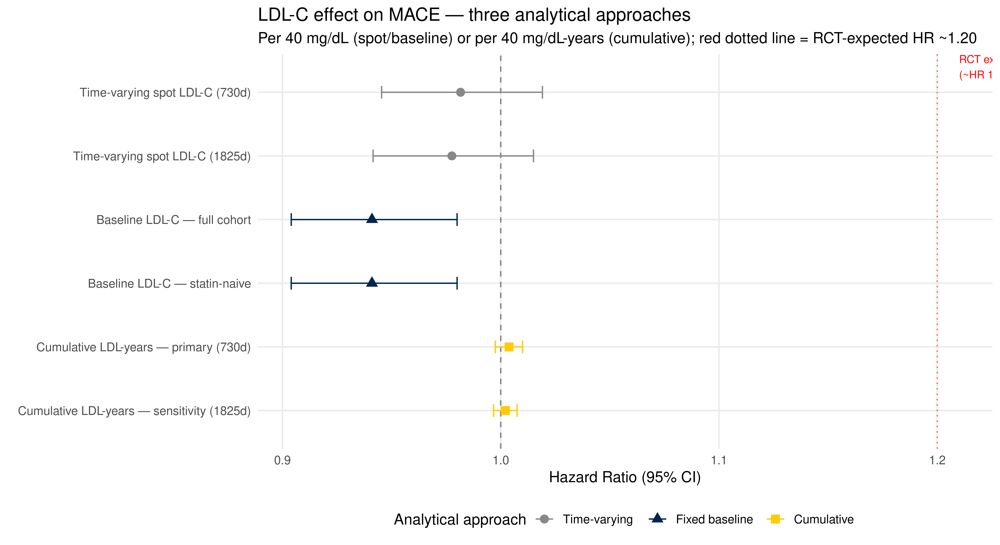

::: {.cell}

:::


## Purpose

This script implements a **cumulative LDL-C burden model** as the third analytical approach in the MACE/LDL-C series, alongside the time-varying spot LDL-C model (`ldlc_mace_analysis.qmd`) and the fixed baseline LDL-C model (`ldlc_mace_baseline.qmd`).

The three approaches answer progressively different questions:
  
- **Time-varying (primary script)**: Does today's LDL-C predict near-term MACE risk?
- **Baseline (second script)**: Does LDL-C at cohort entry predict long-term MACE risk?
- **Cumulative (this script)**: Does total lifetime LDL-C burden — integrated over the entire observation period — predict MACE risk?

Cumulative LDL-C burden, expressed as **LDL-years** (mg/dL × years), is the most biologically motivated parameterisation. Atherosclerosis is driven by sustained exposure to atherogenic lipoproteins over decades, not by the LDL-C level at any single point. The LDL-years metric is directly analogous to pack-years for smoking and cumulative radiation dose in oncology — it captures the dose-time integral rather than the instantaneous dose.

**Key methodological advantages over spot LDL-C:**

- **No LOCF staleness problem**: gaps in LDL-C measurement are handled naturally by carrying forward the last known value within the cumulative sum. Single-measurement patients accumulate LDL-years from their one measurement without requiring an arbitrary cap.
- **Statin use is partially absorbed**: patients on statins have lower LDL-C at each measurement and therefore accumulate LDL-years more slowly, naturally incorporating part of the statin effect without requiring explicit adjustment. Statin stratification is still included for completeness.
- **Less susceptible to time-zero selection bias**: cumulative exposure aggregates information across the entire observation period, diluting the influence of any single measurement occasion.

**Implementation**: At each interval start (`tstart`), the cumulative LDL-years covariate is the area under the LDL-C versus time curve accumulated up to that point, calculated using a last-observation-carried-forward (LOCF) rectangular approximation. Where LDL-C is missing (stale beyond the 730-day cap), the last known value is carried forward within the cumulative sum. The exposure is parameterised per 40 mg/dL-years — one year of LDL-C 40 mg/dL above the reference level.

---

## Raw Data

This script is fully self-contained and does not depend on objects from the other two scripts.


::: {.cell}

```{.r .cell-code}
demographic.data <- read_csv("combined_data/DemographicInfo.csv",
                             show_col_types = FALSE) %>%
  mutate(DeID_PatientID = as.character(DeID_PatientID))

diagnosis.data <- read_csv("combined_data/DiagnosesCleaned.csv",
                           show_col_types = FALSE) %>%
  mutate(
    DeID_PatientID = as.character(DeID_PatientID),
    MACE.onset     = ymd(MACE.onset)
  )

lab.data <- read_csv("combined_data/LabResultsCleaned.csv",
                     show_col_types = FALSE) %>%
  mutate(
    DeID_PatientID = as.character(DeID_PatientID),
    lab_date = coalesce(
      parse_date_time(DeID_COLLECTION_DATE,
                      orders = c("ymd", "mdy", "ymd HMS", "mdy HM"),
                      quiet  = TRUE),
      parse_date_time(DeID_AdmitDate,
                      orders = c("ymd", "mdy", "ymd HMS", "mdy HM"),
                      quiet  = TRUE)
    ))

ldlc.data <- lab.data %>% filter(test_name == "LDL-C")

cat("Demographic patients:", n_distinct(demographic.data$DeID_PatientID), "\n")
```

::: {.cell-output .cell-output-stdout}

```
Demographic patients: 201073 
```


:::
:::


---

## Cohort Derivation

Identical pipeline to the primary and baseline scripts.


::: {.cell}

```{.r .cell-code}
full_cohort <- demographic.data %>%
  left_join(
    diagnosis.data %>%
      select(DeID_PatientID, MACE, MACE.onset,
             Osteoporosis, Osteoporosis.onset),
    by = "DeID_PatientID"
  ) %>%
  mutate(MACE_flag = if_else(MACE == TRUE, 1L, 0L, missing = 0L))

ids_demo <- unique(full_cohort$DeID_PatientID)
ids_ldlc <- unique(ldlc.data$DeID_PatientID)

ldlc_clean <- ldlc.data %>%
  filter(!is.na(lab_date), !is.na(AgeInYears)) %>%
  filter(value > 0, value <= 400) %>%
  mutate(BMI = if_else(BMI < 10 | BMI > 80, NA_real_, BMI)) %>%
  filter(AgeInYears >= 18) %>%
  group_by(DeID_PatientID, lab_date) %>%
  summarise(
    LDL_value  = mean(value,      na.rm = TRUE),
    AgeInYears = mean(AgeInYears, na.rm = TRUE),
    BMI        = mean(BMI,        na.rm = TRUE),
    .groups    = "drop"
  ) %>%
  arrange(DeID_PatientID, lab_date)

diag_clean <- full_cohort %>%
  filter(!(MACE_flag == 1L & is.na(MACE.onset))) %>%
  select(DeID_PatientID, MACE.onset, MACE_flag)

shared_ids  <- intersect(diag_clean$DeID_PatientID, ldlc_clean$DeID_PatientID)
diag_cohort <- diag_clean  %>% filter(DeID_PatientID %in% shared_ids)
ldlc_cohort <- ldlc_clean  %>% filter(DeID_PatientID %in% shared_ids)

encounter.data <- read_csv("combined_data/EncounterAll.csv",
                           show_col_types = FALSE) %>%
  mutate(
    DeID_PatientID = as.character(DeID_PatientID),
    EncounterDate  = mdy_hm(DeID_AdmitDate)
  )

last_encounter <- encounter.data %>%
  filter(!is.na(EncounterDate), DeID_PatientID %in% shared_ids) %>%
  group_by(DeID_PatientID) %>%
  slice_max(EncounterDate, n = 1, with_ties = FALSE) %>%
  ungroup() %>%
  select(DeID_PatientID, last_encounter_date = EncounterDate)

first_ldlc <- ldlc_cohort %>%
  group_by(DeID_PatientID) %>%
  slice_min(lab_date, n = 1, with_ties = FALSE) %>%
  ungroup() %>%
  select(DeID_PatientID, t0 = lab_date)

base_cohort_full <- diag_cohort %>%
  left_join(first_ldlc,     by = "DeID_PatientID") %>%
  left_join(last_encounter, by = "DeID_PatientID") %>%
  mutate(
    t_end = case_when(
      MACE_flag == 1              ~ MACE.onset,
      !is.na(last_encounter_date) ~ last_encounter_date,
      TRUE                        ~ NA_POSIXct_
    ),
    follow_up_days = as.numeric(difftime(t_end, t0, units = "days"))
  )

base_cohort <- base_cohort_full %>%
  filter(follow_up_days > 0) %>%
  mutate(follow_up_days = pmin(follow_up_days, 14610))

tibble(
  Step = c(
    "Full demographic cohort",
    "No LDL-C data",
    "MACE=TRUE with missing onset date",
    "Negative or zero follow-up",
    "Final analytic cohort"
  ),
  N = c(
    n_distinct(demographic.data$DeID_PatientID),
    -length(setdiff(ids_demo, ids_ldlc)),
    -(nrow(full_cohort %>% filter(MACE_flag == 1 & is.na(MACE.onset)))),
    -(nrow(base_cohort_full %>% filter(follow_up_days <= 0))),
    nrow(base_cohort)
  )
) %>% kable(caption = "CONSORT flow — cohort derivation")
```

::: {.cell-output-display}


Table: CONSORT flow — cohort derivation

|Step                              |       N|
|:---------------------------------|-------:|
|Full demographic cohort           |  201073|
|No LDL-C data                     | -177667|
|MACE=TRUE with missing onset date |   -2867|
|Negative or zero follow-up        |    -556|
|Final analytic cohort             |   20015|


:::
:::


The final analytic cohort contains **20015 patients** (2871 incident MACE cases, 17144 controls), identical to the other two scripts.

---

## Building LDL-C Intervals with LOCF

The LOCF implementation is identical to the primary script — stale sentinel markers are inserted at `t_last_measurement + 730 days` so that `tmerge` creates interval splits at the exact point of staleness. The 730-day primary window is used; the 1825-day sensitivity is run in parallel.


::: {.cell}

```{.r .cell-code}
ldlc_intervals <- ldlc_cohort %>%
  filter(DeID_PatientID %in% base_cohort$DeID_PatientID) %>%
  left_join(base_cohort %>% select(DeID_PatientID, t0, t_end),
            by = "DeID_PatientID") %>%
  filter(lab_date <= t_end) %>%
  mutate(
    t_meas     = as.numeric(difftime(lab_date, t0, units = "days")),
    LDL_value  = as.numeric(LDL_value),
    AgeInYears = as.numeric(AgeInYears),
    BMI        = as.numeric(BMI)
  ) %>%
  filter(t_meas >= 0) %>%
  arrange(DeID_PatientID, t_meas)

add_stale_markers <- function(intervals_df, cap_days, follow_up_df) {
  intervals_df %>%
    arrange(DeID_PatientID, t_meas) %>%
    group_by(DeID_PatientID) %>%
    mutate(next_meas = lead(t_meas)) %>%
    ungroup() %>%
    filter(is.na(next_meas) | next_meas > t_meas + cap_days) %>%
    mutate(stale_t = t_meas + cap_days) %>%
    left_join(follow_up_df %>% select(DeID_PatientID, follow_up_days),
              by = "DeID_PatientID") %>%
    filter(stale_t < follow_up_days) %>%
    transmute(
      DeID_PatientID,
      t_meas     = stale_t,
      LDL_value  = -9999,
      AgeInYears = NA_real_,
      BMI        = NA_real_
    )
}

stale_730  <- add_stale_markers(ldlc_intervals, 730,  base_cohort)
stale_1825 <- add_stale_markers(ldlc_intervals, 1825, base_cohort)

ldlc_intervals_730  <- bind_rows(ldlc_intervals, stale_730)  %>%
  arrange(DeID_PatientID, t_meas)
ldlc_intervals_1825 <- bind_rows(ldlc_intervals, stale_1825) %>%
  arrange(DeID_PatientID, t_meas)

cat("Real LDL-C measurements:", nrow(ldlc_intervals), "\n")
```

::: {.cell-output .cell-output-stdout}

```
Real LDL-C measurements: 34186 
```


:::

```{.r .cell-code}
cat("Stale markers (730d):",    nrow(stale_730), "\n")
```

::: {.cell-output .cell-output-stdout}

```
Stale markers (730d): 25740 
```


:::

```{.r .cell-code}
cat("Stale markers (1825d):",   nrow(stale_1825), "\n")
```

::: {.cell-output .cell-output-stdout}

```
Stale markers (1825d): 18748 
```


:::
:::


---

## Constructing tmerge Dataset

The tmerge dataset is built identically to the primary script. The cumulative LDL-years covariate is computed *after* tmerge, directly from the interval structure.


::: {.cell}

```{.r .cell-code}
surv_base <- base_cohort %>%
  mutate(
    DeID_PatientID = as.character(DeID_PatientID),
    tstart_days    = 0,
    tstop_days     = as.numeric(follow_up_days)
  )

build_surv_data <- function(ldlc_int) {
  sd <- tmerge(
    data1 = surv_base, data2 = surv_base,
    id    = DeID_PatientID,
    MACE  = event(tstop_days, MACE_flag)
  )
  sd <- tmerge(
    data1 = sd,
    data2 = ldlc_int %>%
      mutate(DeID_PatientID = as.character(DeID_PatientID)),
    id         = DeID_PatientID,
    LDL_value  = tdc(t_meas, LDL_value),
    AgeInYears = tdc(t_meas, AgeInYears),
    BMI        = tdc(t_meas, BMI)
  )
  sd %>%
    group_by(DeID_PatientID) %>%
    fill(BMI, AgeInYears, .direction = "downup") %>%
    mutate(
      LDL_value = if_else(LDL_value == -9999, NA_real_, LDL_value),
      LDL_value = if_else(is.na(LDL_value) & MACE == 1,
                          last(na.omit(LDL_value)), LDL_value)
    ) %>%
    ungroup() %>%
    filter(tstop - tstart >= 0.5)
}

surv.data.730  <- build_surv_data(ldlc_intervals_730)
surv.data.1825 <- build_surv_data(ldlc_intervals_1825)

map_dfr(
  list(`730d` = surv.data.730, `1825d` = surv.data.1825),
  ~ tibble(
    Rows       = nrow(.x),
    Patients   = n_distinct(.x$DeID_PatientID),
    Events     = sum(.x$MACE),
    NA_LDL     = sum(is.na(.x$LDL_value)),
    Pct_NA_LDL = round(100 * mean(is.na(.x$LDL_value)), 1)
  ),
  .id = "Window"
) %>% kable(caption = "tmerge datasets before cumulative LDL computation")
```

::: {.cell-output-display}


Table: tmerge datasets before cumulative LDL computation

|Window |  Rows| Patients| Events| NA_LDL| Pct_NA_LDL|
|:------|-----:|--------:|------:|------:|----------:|
|730d   | 59799|    20007|   2867|  23431|       39.2|
|1825d  | 52818|    20007|   2866|  17129|       32.4|


:::
:::


---

## Computing Cumulative LDL-Years

Cumulative LDL-years at each interval is the area under the LDL-C versus time curve accumulated up to `tstart`, using a LOCF rectangular approximation. Within each patient:

1. Sort intervals chronologically
2. Carry forward the last known LDL-C value into stale (NA) intervals — this is the LOCF step within the cumulative calculation
3. Compute each interval's LDL contribution: `LDL_locf × interval_length_days / 365.25`
4. The cumulative sum up to (but not including) the current interval is the time-varying exposure at `tstart`

The cumulative sum is lagged by one interval so the exposure at `tstart` of interval *i* reflects only LDL-C accumulated *before* interval *i* begins — the current interval has not yet been observed by the patient at its start.


::: {.cell}

```{.r .cell-code}
add_cumulative_ldl <- function(df) {
  df %>%
    arrange(DeID_PatientID, tstart) %>%
    group_by(DeID_PatientID) %>%
    mutate(
      # Step 1: fill NA LDL-C (stale intervals) with last known value
      # This is LOCF *within* the cumulative calculation
      LDL_locf = {
        x <- LDL_value
        # Forward fill only (never back-fill — future values unknown at tstart)
        for (i in seq_along(x)) {
          if (is.na(x[i]) && i > 1 && !is.na(x[i - 1])) x[i] <- x[i - 1]
        }
        x
      },
      # Step 2: contribution of each interval in mg/dL-years
      interval_days    = tstop - tstart,
      ldl_contribution = if_else(
        !is.na(LDL_locf),
        LDL_locf * interval_days / 365.25,
        0  # no contribution if no LDL-C ever recorded yet
      ),
      # Step 3: cumulative LDL-years at the START of each interval
      # lag() shifts cumsum forward by 1 so current interval is not included
      cumulative_ldl_years = lag(cumsum(ldl_contribution), default = 0),
      # Step 4: time elapsed since t0 at interval start (years)
      years_elapsed = tstart / 365.25,
      # Step 5: mean LDL-C rate (sensitivity) — cumulative / time
      # Add small epsilon to avoid division by zero at tstart = 0
      mean_ldl_rate = if_else(
        years_elapsed > 0,
        cumulative_ldl_years / years_elapsed,
        LDL_locf  # at t=0, mean rate = first measurement
      ),
      # Step 6: per-40 mg/dL-year parameterisation
      cumldl_40 = cumulative_ldl_years / 40,
      # Step 7: per-40 mg/dL for mean rate
      mean_ldl_rate_40 = mean_ldl_rate / 40
    ) %>%
    ungroup()
}

surv.data.730  <- add_cumulative_ldl(surv.data.730)
surv.data.1825 <- add_cumulative_ldl(surv.data.1825)

# Sanity checks
cat("=== Cumulative LDL-years summary (730d dataset) ===\n")
```

::: {.cell-output .cell-output-stdout}

```
=== Cumulative LDL-years summary (730d dataset) ===
```


:::

```{.r .cell-code}
surv.data.730 %>%
  summarise(
    `Min cumulative LDL-years`    = round(min(cumulative_ldl_years), 1),
    `25th percentile`             = round(quantile(cumulative_ldl_years, 0.25), 1),
    `Median cumulative LDL-years` = round(median(cumulative_ldl_years), 1),
    `Mean cumulative LDL-years`   = round(mean(cumulative_ldl_years), 1),
    `75th percentile`             = round(quantile(cumulative_ldl_years, 0.75), 1),
    `Max cumulative LDL-years`    = round(max(cumulative_ldl_years), 1),
    `Rows with 0 cumulative`      = sum(cumulative_ldl_years == 0),
    `% rows with 0 cumulative`    = round(100 * mean(cumulative_ldl_years == 0), 1)
  ) %>%
  pivot_longer(everything(), names_to = "Metric", values_to = "Value") %>%
  kable(caption = "Cumulative LDL-years distribution across intervals (730d)")
```

::: {.cell-output-display}


Table: Cumulative LDL-years distribution across intervals (730d)

|Metric                      |   Value|
|:---------------------------|-------:|
|Min cumulative LDL-years    |     0.0|
|25th percentile             |     0.0|
|Median cumulative LDL-years |   203.9|
|Mean cumulative LDL-years   |   403.0|
|75th percentile             |   464.9|
|Max cumulative LDL-years    |  6612.3|
|Rows with 0 cumulative      | 20007.0|
|% rows with 0 cumulative    |    33.5|


:::

```{.r .cell-code}
# Cumulative LDL-years at time of MACE event
surv.data.730 %>%
  filter(MACE == 1) %>%
  summarise(
    `Min at MACE`    = round(min(cumulative_ldl_years), 1),
    `25th at MACE`   = round(quantile(cumulative_ldl_years, 0.25), 1),
    `Median at MACE` = round(median(cumulative_ldl_years), 1),
    `Mean at MACE`   = round(mean(cumulative_ldl_years), 1),
    `75th at MACE`   = round(quantile(cumulative_ldl_years, 0.75), 1),
    `Max at MACE`    = round(max(cumulative_ldl_years), 1)
  ) %>%
  pivot_longer(everything(), names_to = "Metric", values_to = "Value") %>%
  kable(caption = "Cumulative LDL-years at time of MACE event (730d)")
```

::: {.cell-output-display}


Table: Cumulative LDL-years at time of MACE event (730d)

|Metric         |  Value|
|:--------------|------:|
|Min at MACE    |    0.0|
|25th at MACE   |  158.9|
|Median at MACE |  245.8|
|Mean at MACE   |  435.9|
|75th at MACE   |  506.4|
|Max at MACE    | 4098.7|


:::

```{.r .cell-code}
# Visualise cumulative LDL-years distribution over follow-up time
surv.data.730 %>%
  filter(years_elapsed > 0) %>%
  mutate(follow_up_band = cut(years_elapsed,
                              breaks = c(0, 2, 5, 10, 15, Inf),
                              labels = c("0-2yr", "2-5yr", "5-10yr",
                                         "10-15yr", "15yr+"),
                              right  = FALSE)) %>%
  group_by(follow_up_band) %>%
  summarise(
    N                             = n(),
    `Median cumulative LDL-years` = round(median(cumulative_ldl_years), 1),
    `Mean cumulative LDL-years`   = round(mean(cumulative_ldl_years), 1),
    .groups = "drop"
  ) %>%
  kable(caption = "Cumulative LDL-years by follow-up time band — confirms monotonic accumulation")
```

::: {.cell-output-display}


Table: Cumulative LDL-years by follow-up time band — confirms monotonic accumulation

|follow_up_band |     N| Median cumulative LDL-years| Mean cumulative LDL-years|
|:--------------|-----:|---------------------------:|-------------------------:|
|0-2yr          | 19800|                       211.9|                     211.9|
|2-5yr          |  5099|                       331.9|                     360.0|
|5-10yr         |  6590|                       706.0|                     756.0|
|10-15yr        |  4296|                      1199.0|                    1267.7|
|15yr+          |  4028|                      1785.6|                    1896.8|


:::
:::


---
  
## Adding Time-Varying Covariates
  
Statin use (via range join), comorbidities, follow-up period, age category, and the composite cardiometabolic stratum are added identically to the primary script.


::: {.cell}

```{.r .cell-code}
# Load statin intervals
statin_intervals <- read_csv(
  "combined_data/MedicationOrdersCleanedStatins.csv",
  show_col_types = FALSE
) %>%
  mutate(
    DeID_PatientID = as.character(DeID_PatientID),
    period_start   = as_date(period_start),
    period_end     = as_date(period_end),
    intensity      = factor(intensity, levels = c("low", "moderate", "high"))
  )

statin_tv <- statin_intervals %>%
  inner_join(first_ldlc, by = "DeID_PatientID") %>%
  mutate(
    tstart_statin = as.numeric(period_start - as_date(t0)),
    tstop_statin  = as.numeric(period_end   - as_date(t0))
  ) %>%
  filter(tstop_statin > 0) %>%
  mutate(tstart_statin = pmax(tstart_statin, 0)) %>%
  filter(tstop_statin > tstart_statin) %>%
  select(DeID_PatientID, tstart_statin, tstop_statin, intensity)

# Load comorbidity onset dates
comorbidity_onset <- read_csv(
  "combined_data/ComorbiditiesOnset.csv",
  show_col_types = FALSE
) %>%
  mutate(
    DeID_PatientID      = as.character(DeID_PatientID),
    diabetes_onset      = as_datetime(diabetes_onset),
    hypertension_onset  = as_datetime(hypertension_onset),
    obesity_onset       = as_datetime(obesity_onset),
    renal_failure_onset = as_datetime(renal_failure_onset)
  )

comorbidity_tv <- comorbidity_onset %>%
  inner_join(first_ldlc, by = "DeID_PatientID") %>%
  mutate(
    t_diabetes     = as.numeric(difftime(diabetes_onset,
                                         t0, units = "days")),
    t_hypertension = as.numeric(difftime(hypertension_onset,
                                         t0, units = "days")),
    t_renal        = as.numeric(difftime(renal_failure_onset,
                                         t0, units = "days")),
    t_obesity      = as.numeric(difftime(obesity_onset,
                                         t0, units = "days"))
  ) %>%
  select(DeID_PatientID, t_diabetes, t_hypertension, t_renal, t_obesity)

# Baseline age for age_cat
baseline_age <- ldlc_intervals %>%
  group_by(DeID_PatientID) %>%
  slice_min(t_meas, n = 1, with_ties = FALSE) %>%
  ungroup() %>%
  select(DeID_PatientID, baseline_age = AgeInYears)

# Add all covariates in a single function applied to both datasets
add_all_tvc <- function(df) {
  statin_cohort    <- statin_tv %>% filter(DeID_PatientID %in% base_cohort$DeID_PatientID)
  comorbidity_cohort <- comorbidity_tv %>% filter(DeID_PatientID %in% base_cohort$DeID_PatientID)
  
  # Step 1: statin via range join
  df <- df %>%
    left_join(statin_cohort,
              by = "DeID_PatientID", relationship = "many-to-many") %>%
    mutate(
      on_statin_overlap = !is.na(tstart_statin) &
        tstart < tstop_statin &
        tstop  > tstart_statin,
      intensity_match   = if_else(on_statin_overlap,
                                  as.character(intensity), NA_character_)
    ) %>%
    group_by(DeID_PatientID, tstart, tstop) %>%
    summarise(
      across(c(MACE, LDL_value, AgeInYears, BMI, MACE.onset, MACE_flag,
               t0, last_encounter_date, t_end, follow_up_days,
               tstart_days, tstop_days,
               LDL_locf, interval_days, ldl_contribution,
               cumulative_ldl_years, years_elapsed,
               mean_ldl_rate, cumldl_40, mean_ldl_rate_40),
             ~ first(na.omit(.x))),
      on_statin        = as.integer(any(on_statin_overlap, na.rm = TRUE)),
      statin_intensity = {
        vals <- na.omit(intensity_match)
        if (length(vals) == 0) NA_character_
        else names(which.max(table(vals)))
      },
      .groups = "drop"
    ) %>%
    distinct(DeID_PatientID, tstart, tstop, .keep_all = TRUE) %>%
    mutate(statin_intensity = factor(statin_intensity,
                                     levels = c("low", "moderate", "high"))) %>%
    arrange(DeID_PatientID, tstart)
  
  # Step 2: comorbidities, baseline age, period, age_cat, cardiomet
  df %>%
    left_join(comorbidity_cohort, by = "DeID_PatientID") %>%
    left_join(baseline_age,       by = "DeID_PatientID") %>%
    mutate(
      on_diabetes     = as.integer(!is.na(t_diabetes)     & tstart >= t_diabetes),
      on_hypertension = as.integer(!is.na(t_hypertension) & tstart >= t_hypertension),
      on_renal        = as.integer(!is.na(t_renal)        & tstart >= t_renal),
      on_obesity      = as.integer(!is.na(t_obesity)      & tstart >= t_obesity),
      period = factor(
        case_when(
          tstart < 1825 ~ "0-5yr",
          tstart < 3650 ~ "5-10yr",
          TRUE          ~ "10yr+"
        ),
        levels = c("0-5yr", "5-10yr", "10yr+")
      ),
      age_cat = cut(baseline_age,
                    breaks = c(18, 45, 55, 65, 75, Inf),
                    labels = c("<45", "45-54", "55-64", "65-74", "75+"),
                    right  = FALSE),
      cardiomet = factor(
        case_when(
          on_diabetes == 1 & on_hypertension == 1 ~ "DM+HTN",
          on_diabetes == 1 & on_hypertension == 0 ~ "DM only",
          on_diabetes == 0 & on_hypertension == 1 ~ "HTN only",
          TRUE                                     ~ "Neither"
        ),
        levels = c("Neither", "HTN only", "DM only", "DM+HTN")
      )
    ) %>%
    select(-t_diabetes, -t_hypertension, -t_renal, -t_obesity)
}

surv.data.730  <- add_all_tvc(surv.data.730)
surv.data.1825 <- add_all_tvc(surv.data.1825)

# Verification
tibble(
  Dataset   = c("730d", "1825d"),
  Rows      = c(nrow(surv.data.730),    nrow(surv.data.1825)),
  Events    = c(sum(surv.data.730$MACE), sum(surv.data.1825$MACE)),
  On_statin = c(sum(surv.data.730$on_statin == 1),
                sum(surv.data.1825$on_statin == 1)),
  Pct_statin = c(round(100 * mean(surv.data.730$on_statin == 1), 1),
                 round(100 * mean(surv.data.1825$on_statin == 1), 1))
) %>% kable(caption = "Dataset summary after all covariates added")
```

::: {.cell-output-display}


Table: Dataset summary after all covariates added

|Dataset |  Rows| Events| On_statin| Pct_statin|
|:-------|-----:|------:|---------:|----------:|
|730d    | 59799|   2867|     19001|       31.8|
|1825d   | 52818|   2866|     18349|       34.7|


:::

```{.r .cell-code}
# Confirm cumulative LDL columns survived the range join
cat("Cumulative LDL columns in surv.data.730:\n")
```

::: {.cell-output .cell-output-stdout}

```
Cumulative LDL columns in surv.data.730:
```


:::

```{.r .cell-code}
print(c("cumulative_ldl_years", "cumldl_40", "mean_ldl_rate_40") %in%
        names(surv.data.730))
```

::: {.cell-output .cell-output-stdout}

```
[1] TRUE TRUE TRUE
```


:::
:::


---
  
## Final Dataset Checks
  


::: {.cell}

```{.r .cell-code}
# Confirm cumulative LDL-years is monotonically increasing per patient
# (a decrease would indicate a bug in the cumulative calculation)
monotone_check <- surv.data.730 %>%
  arrange(DeID_PatientID, tstart) %>%
  group_by(DeID_PatientID) %>%
  summarise(
    any_decrease = any(diff(cumulative_ldl_years) < -0.001),
    .groups = "drop"
  )

cat("Patients with non-monotone cumulative LDL (should be 0):",
    sum(monotone_check$any_decrease), "\n")
```

::: {.cell-output .cell-output-stdout}

```
Patients with non-monotone cumulative LDL (should be 0): 0 
```


:::

```{.r .cell-code}
# Events per stratum
surv.data.730 %>%
  filter(MACE == 1) %>%
  count(period, on_statin, age_cat) %>%
  arrange(n) %>%
  head(15) %>%
  kable(caption = "MACE events per stratum (period × statin × age) — primary strata")
```

::: {.cell-output-display}


Table: MACE events per stratum (period × statin × age) — primary strata

|period | on_statin|age_cat |  n|
|:------|---------:|:-------|--:|
|10yr+  |         0|75+     | 13|
|5-10yr |         0|<45     | 19|
|10yr+  |         1|75+     | 19|
|10yr+  |         0|65-74   | 23|
|10yr+  |         0|45-54   | 26|
|10yr+  |         0|<45     | 27|
|5-10yr |         1|<45     | 28|
|5-10yr |         0|75+     | 30|
|10yr+  |         1|<45     | 30|
|5-10yr |         0|55-64   | 34|
|10yr+  |         0|55-64   | 34|
|5-10yr |         0|65-74   | 36|
|5-10yr |         1|75+     | 37|
|5-10yr |         0|45-54   | 52|
|10yr+  |         1|65-74   | 52|


:::
:::


---
  
## Cox Proportional Hazards Models
  
### Unadjusted Cumulative LDL-Years Model
  
  The unadjusted model is presented primarily as a methodological reference. Unlike spot LDL-C, cumulative LDL-years may not show the same paradoxical inverse association in the unadjusted model — higher cumulative burden will correlate with longer follow-up, which in turn correlates with more time at risk, partially counteracting the selection bias.


::: {.cell}

```{.r .cell-code}
fit_unadj_730 <- coxph(
  Surv(tstart, tstop, MACE) ~ cumldl_40,
  data = surv.data.730, ties = "efron", id = DeID_PatientID
)

fit_unadj_1825 <- coxph(
  Surv(tstart, tstop, MACE) ~ cumldl_40,
  data = surv.data.1825, ties = "efron", id = DeID_PatientID
)

bind_rows(
  broom::tidy(fit_unadj_730,  exponentiate = TRUE, conf.int = TRUE) %>%
    mutate(Model = "Unadjusted (730d)"),
  broom::tidy(fit_unadj_1825, exponentiate = TRUE, conf.int = TRUE) %>%
    mutate(Model = "Unadjusted (1825d)")
) %>%
  select(Model, HR = estimate, `95% CI low` = conf.low,
         `95% CI high` = conf.high, `p-value` = p.value) %>%
  mutate(across(where(is.numeric), ~round(.x, 4))) %>%
  kable(caption = "Unadjusted model — cumulative LDL-C burden (per 40 mg/dL-years)")
```

::: {.cell-output-display}


Table: Unadjusted model — cumulative LDL-C burden (per 40 mg/dL-years)

|Model              |     HR| 95% CI low| 95% CI high| p-value|
|:------------------|------:|----------:|-----------:|-------:|
|Unadjusted (730d)  | 1.0112|     1.0080|      1.0144|   0.000|
|Unadjusted (1825d) | 1.0055|     1.0016|      1.0094|   0.006|


:::
:::


### Proportional Hazards — Unadjusted


::: {.cell}

```{.r .cell-code}
ph_unadj <- cox.zph(fit_unadj_730)

tibble(
  Term      = rownames(ph_unadj$table),
  `Chi-sq`  = round(ph_unadj$table[, "chisq"], 3),
  df        = ph_unadj$table[, "df"],
  `p-value` = round(ph_unadj$table[, "p"], 4)
) %>% kable(caption = "Schoenfeld residuals — unadjusted model (730d)")
```

::: {.cell-output-display}


Table: Schoenfeld residuals — unadjusted model (730d)

|Term      | Chi-sq| df| p-value|
|:---------|------:|--:|-------:|
|cumldl_40 |  8.829|  1|   0.003|
|GLOBAL    |  8.829|  1|   0.003|


:::

```{.r .cell-code}
ggcoxzph(ph_unadj, font.main = 12, ggtheme = theme_minimal())
```

::: {.cell-output-display}
{width=2100}
:::
:::


### Primary Model — Stratified Cox with Statin Adjustment

The primary model stratifies on statin use (time-varying on/off), age category, follow-up period, and composite cardiometabolic stratum. This matches the stratification structure of the primary time-varying LDL-C model, enabling direct comparison of the two approaches.


::: {.cell}

```{.r .cell-code}
# Primary: stratified including statin (time-varying on_statin)
fit_primary_730 <- coxph(
  Surv(tstart, tstop, MACE) ~ cumldl_40 +
    strata(period) + strata(on_statin) +
    strata(age_cat) + strata(cardiomet),
  data = surv.data.730, ties = "efron", id = DeID_PatientID
)

fit_primary_1825 <- coxph(
  Surv(tstart, tstop, MACE) ~ cumldl_40 +
    strata(period) + strata(on_statin) +
    strata(age_cat) + strata(cardiomet),
  data = surv.data.1825, ties = "efron", id = DeID_PatientID
)

bind_rows(
  broom::tidy(fit_primary_730,  exponentiate = TRUE, conf.int = TRUE) %>%
    mutate(Model = "Primary — 730d LOCF cap"),
  broom::tidy(fit_primary_1825, exponentiate = TRUE, conf.int = TRUE) %>%
    mutate(Model = "Sensitivity — 1825d LOCF cap")
) %>%
  select(Model, HR = estimate, `95% CI low` = conf.low,
         `95% CI high` = conf.high, `p-value` = p.value) %>%
  mutate(across(where(is.numeric), ~round(.x, 4))) %>%
  kable(caption = "Primary model — cumulative LDL-C burden per 40 mg/dL-years")
```

::: {.cell-output-display}


Table: Primary model — cumulative LDL-C burden per 40 mg/dL-years

|Model                        |     HR| 95% CI low| 95% CI high| p-value|
|:----------------------------|------:|----------:|-----------:|-------:|
|Primary — 730d LOCF cap      | 1.0038|     0.9975|      1.0100|  0.2357|
|Sensitivity — 1825d LOCF cap | 1.0021|     0.9967|      1.0075|  0.4452|


:::
:::


### Proportional Hazards — Primary Model


::: {.cell}

```{.r .cell-code}
ph_primary <- cox.zph(fit_primary_730)

tibble(
  Term      = rownames(ph_primary$table),
  `Chi-sq`  = round(ph_primary$table[, "chisq"], 3),
  df        = ph_primary$table[, "df"],
  `p-value` = round(ph_primary$table[, "p"], 4)
) %>% kable(caption = "Schoenfeld residuals — primary model (730d)")
```

::: {.cell-output-display}


Table: Schoenfeld residuals — primary model (730d)

|Term      | Chi-sq| df| p-value|
|:---------|------:|--:|-------:|
|cumldl_40 |   0.34|  1|  0.5596|
|GLOBAL    |   0.34|  1|  0.5596|


:::

```{.r .cell-code}
ggcoxzph(ph_primary, font.main = 12, ggtheme = theme_minimal())
```

::: {.cell-output-display}
{width=2100}
:::
:::


The proportional hazards assumption holds in the primary model (global p > 0.05).

### Sensitivity Analyses


::: {.cell}

```{.r .cell-code}
# Sensitivity 1: No statin stratification
# Statin effect absorbed into cumulative LDL-years — patients on statins
# accumulate LDL-years more slowly, so statin use is partially encoded
# in the exposure itself
fit_no_statin_730 <- coxph(
  Surv(tstart, tstop, MACE) ~ cumldl_40 +
    strata(period) + strata(age_cat) + strata(cardiomet),
  data = surv.data.730, ties = "efron", id = DeID_PatientID
)

# Sensitivity 2: Mean LDL-C rate instead of cumulative sum
# (cumulative / years elapsed) — answers "what is the average LDL-C
# level over follow-up" rather than the total burden
fit_mean_rate_730 <- coxph(
  Surv(tstart, tstop, MACE) ~ mean_ldl_rate_40 +
    strata(period) + strata(on_statin) +
    strata(age_cat) + strata(cardiomet),
  data = surv.data.730 %>% filter(years_elapsed > 0),
  ties = "efron", id = DeID_PatientID
)

# Sensitivity 3: Restrict to patients with >=2 LDL-C measurements
# Single-measurement patients have cumulative LDL that is entirely
# driven by one observation — this sensitivity checks robustness
pts_ge2 <- ldlc_intervals %>%
  count(DeID_PatientID) %>%
  filter(n >= 2) %>%
  pull(DeID_PatientID)

fit_ge2_730 <- coxph(
  Surv(tstart, tstop, MACE) ~ cumldl_40 +
    strata(period) + strata(on_statin) +
    strata(age_cat) + strata(cardiomet),
  data = surv.data.730 %>% filter(DeID_PatientID %in% pts_ge2),
  ties = "efron", id = DeID_PatientID
)

extract_hr <- function(fit, label, term = "cumldl_40") {
  broom::tidy(fit, exponentiate = TRUE, conf.int = TRUE) %>%
    filter(str_detect(.data$term, str_replace(term, "_", "."))) %>%
    slice(1) %>%
    mutate(
      Model      = label,
      HR         = round(estimate, 4),
      `95% CI`   = paste0("(", round(conf.low, 4),
                          "–", round(conf.high, 4), ")"),
      `p-value`  = round(p.value, 4),
      `N obs`    = fit$n,
      `N events` = fit$nevent
    ) %>%
    select(Model, HR, `95% CI`, `p-value`, `N obs`, `N events`)
}

bind_rows(
  extract_hr(fit_unadj_730,     "Unadjusted (730d)"),
  extract_hr(fit_primary_730,   "Stratified + statin — PRIMARY (730d)"),
  extract_hr(fit_primary_1825,  "Stratified + statin — sensitivity (1825d)"),
  extract_hr(fit_no_statin_730, "Stratified, no statin — statin absorbed (730d)"),
  extract_hr(fit_ge2_730,       "≥2 LDL-C measurements only (730d)"),
  broom::tidy(fit_mean_rate_730, exponentiate = TRUE, conf.int = TRUE) %>%
    filter(str_detect(term, "mean_ldl")) %>%
    slice(1) %>%
    mutate(
      Model      = "Mean LDL-C rate per 40 mg/dL (730d)",
      HR         = round(estimate, 4),
      `95% CI`   = paste0("(", round(conf.low, 4),
                          "–", round(conf.high, 4), ")"),
      `p-value`  = round(p.value, 4),
      `N obs`    = fit_mean_rate_730$n,
      `N events` = fit_mean_rate_730$nevent
    ) %>%
    select(Model, HR, `95% CI`, `p-value`, `N obs`, `N events`)
) %>%
  kable(caption = "Cumulative LDL-C burden HR across model specifications")
```

::: {.cell-output-display}


Table: Cumulative LDL-C burden HR across model specifications

|Model                                          |     HR|95% CI          | p-value| N obs| N events|
|:----------------------------------------------|------:|:---------------|-------:|-----:|--------:|
|Unadjusted (730d)                              | 1.0112|(1.008–1.0144)  |  0.0000| 59799|     2867|
|Stratified + statin — PRIMARY (730d)           | 1.0038|(0.9975–1.01)   |  0.2357| 59799|     2867|
|Stratified + statin — sensitivity (1825d)      | 1.0021|(0.9967–1.0075) |  0.4452| 52818|     2866|
|Stratified, no statin — statin absorbed (730d) | 1.0045|(0.9984–1.0106) |  0.1475| 59799|     2867|
|≥2 LDL-C measurements only (730d)              | 1.0093|(1.003–1.0157)  |  0.0039| 31781|     1030|
|Mean LDL-C rate per 40 mg/dL (730d)            | 0.9714|(0.9294–1.0154) |  0.1989| 39813|     2616|


:::
:::


The mean LDL-C rate sensitivity (Sensitivity 2) is particularly informative — it separates the *duration* component from the *level* component of cumulative burden. If the mean rate model gives a similar HR to the cumulative model, duration of follow-up is not driving the association. If they diverge, patients with longer follow-up are systematically different in their LDL-C trajectories.

The ≥2-measurement sensitivity (Sensitivity 3) addresses whether single-measurement patients — who account for 71.7% of the cohort — are distorting the cumulative exposure distribution.

---
  
## Comparison Across All Three Analytical Approaches
  
  This section places all three LDL-C parameterisations side by side. Values for the time-varying and baseline models are taken from the outputs of the other two scripts. Update if those scripts are re-run.


::: {.cell}

```{.r .cell-code}
comparison <- tibble(
  Model = c(
    # Time-varying (from ldlc_mace_analysis.qmd)
    "Time-varying spot LDL-C (730d)",
    "Time-varying spot LDL-C (1825d)",
    # Baseline (from ldlc_mace_baseline.qmd)
    "Baseline LDL-C — full cohort",
    "Baseline LDL-C — statin-naive",
    # Cumulative (this script — extracted below)
    "Cumulative LDL-years — primary (730d)",
    "Cumulative LDL-years — sensitivity (1825d)"
  ),
  Approach = c(
    "Time-varying", "Time-varying",
    "Fixed baseline", "Fixed baseline",
    "Cumulative", "Cumulative"
  ),
  `HR per 40 units` = c(0.9816, 0.9776, 0.941, 0.941, NA, NA),
  CI_low            = c(0.9454, 0.9415, 0.904, 0.904, NA, NA),
  CI_high           = c(1.0191, 1.0150, 0.980, 0.980, NA, NA),
  `p-value`         = c(0.3316, 0.2367, 0.0033, 0.0040, NA, NA)
)

# Fill in cumulative results from live models
cum_730  <- broom::tidy(fit_primary_730,  exponentiate = TRUE, conf.int = TRUE) %>%
  filter(term == "cumldl_40")
cum_1825 <- broom::tidy(fit_primary_1825, exponentiate = TRUE, conf.int = TRUE) %>%
  filter(term == "cumldl_40")

comparison$`HR per 40 units`[5] <- round(cum_730$estimate, 4)
comparison$CI_low[5]             <- round(cum_730$conf.low, 4)
comparison$CI_high[5]            <- round(cum_730$conf.high, 4)
comparison$`p-value`[5]          <- round(cum_730$p.value, 4)

comparison$`HR per 40 units`[6] <- round(cum_1825$estimate, 4)
comparison$CI_low[6]             <- round(cum_1825$conf.low, 4)
comparison$CI_high[6]            <- round(cum_1825$conf.high, 4)
comparison$`p-value`[6]          <- round(cum_1825$p.value, 4)

comparison %>%
  mutate(`95% CI` = paste0("(", CI_low, "–", CI_high, ")")) %>%
  select(Model, Approach, `HR per 40 units`, `95% CI`, `p-value`) %>%
  kable(caption = paste0("LDL-C effect on MACE — HR per 40 mg/dL (spot/baseline)",
                         " or per 40 mg/dL-years (cumulative) across all approaches"))
```

::: {.cell-output-display}


Table: LDL-C effect on MACE — HR per 40 mg/dL (spot/baseline) or per 40 mg/dL-years (cumulative) across all approaches

|Model                                      |Approach       | HR per 40 units|95% CI          | p-value|
|:------------------------------------------|:--------------|---------------:|:---------------|-------:|
|Time-varying spot LDL-C (730d)             |Time-varying   |          0.9816|(0.9454–1.0191) |  0.3316|
|Time-varying spot LDL-C (1825d)            |Time-varying   |          0.9776|(0.9415–1.015)  |  0.2367|
|Baseline LDL-C — full cohort               |Fixed baseline |          0.9410|(0.904–0.98)    |  0.0033|
|Baseline LDL-C — statin-naive              |Fixed baseline |          0.9410|(0.904–0.98)    |  0.0040|
|Cumulative LDL-years — primary (730d)      |Cumulative     |          1.0038|(0.9975–1.01)   |  0.2357|
|Cumulative LDL-years — sensitivity (1825d) |Cumulative     |          1.0021|(0.9967–1.0075) |  0.4452|


:::
:::


---
  
## Forest Plot — Three Analytical Approaches
  


::: {.cell}

```{.r .cell-code}
theme_set(theme_minimal())

forest_data <- comparison %>%
  mutate(
    Model = factor(Model, levels = rev(Model)),
    Approach = factor(Approach,
                      levels = c("Time-varying", "Fixed baseline", "Cumulative"))
  )

ggplot(forest_data,
       aes(x = `HR per 40 units`, xmin = CI_low, xmax = CI_high,
           y = Model, colour = Approach, shape = Approach)) +
  geom_vline(xintercept = 1,    linetype = "dashed", colour = "grey50") +
  geom_vline(xintercept = 1.20, linetype = "dotted", colour = "red",
             alpha = 0.6) +
  annotate("text", x = 1.21, y = 6.4,
           label = "RCT expected\n(~HR 1.20)",
           size = 3, colour = "red", hjust = 0) +
  geom_errorbarh(height = 0.2) +
  geom_point(size = 3) +
  scale_colour_manual(values = c(
    "Time-varying"   = "#888888",
    "Fixed baseline" = "#00274c",
    "Cumulative"     = "#ffcb05"
  )) +
  scale_shape_manual(values = c(
    "Time-varying"   = 16,
    "Fixed baseline" = 17,
    "Cumulative"     = 15
  )) +
  scale_y_discrete() +
  labs(
    title    = "LDL-C effect on MACE — three analytical approaches",
    subtitle = paste0("Per 40 mg/dL (spot/baseline) or per 40 mg/dL-years (cumulative); ",
                      "red dotted line = RCT-expected HR ~1.20"),
    x        = "Hazard Ratio (95% CI)",
    y        = NULL,
    colour   = "Analytical approach",
    shape    = "Analytical approach"
  ) +
  theme_minimal(base_size = 12) +
  theme(panel.grid.minor = element_blank(),
        legend.position  = "bottom")
```

::: {.cell-output-display}
{width=3300}
:::
:::


---
  
## Session Information
  


::: {.cell}

```{.r .cell-code}
sessionInfo()
```

::: {.cell-output .cell-output-stdout}

```
R version 4.4.3 (2025-02-28)
Platform: x86_64-pc-linux-gnu
Running under: Red Hat Enterprise Linux 8.10 (Ootpa)

Matrix products: default
BLAS:   /sw/pkgs/arc/stacks/gcc/13.2.0/R/4.4.3/lib64/R/lib/libRblas.so 
LAPACK: /sw/pkgs/arc/stacks/gcc/13.2.0/R/4.4.3/lib64/R/lib/libRlapack.so;  LAPACK version 3.12.0

locale:
 [1] LC_CTYPE=en_US.UTF-8       LC_NUMERIC=C              
 [3] LC_TIME=en_US.UTF-8        LC_COLLATE=en_US.UTF-8    
 [5] LC_MONETARY=en_US.UTF-8    LC_MESSAGES=en_US.UTF-8   
 [7] LC_PAPER=en_US.UTF-8       LC_NAME=C                 
 [9] LC_ADDRESS=C               LC_TELEPHONE=C            
[11] LC_MEASUREMENT=en_US.UTF-8 LC_IDENTIFICATION=C       

time zone: America/Detroit
tzcode source: system (glibc)

attached base packages:
[1] stats     graphics  grDevices utils     datasets  methods   base     

other attached packages:
 [1] survminer_0.4.9 ggpubr_0.6.0    survival_3.7-0  broom_1.0.12   
 [5] knitr_1.48      lubridate_1.9.3 forcats_1.0.0   stringr_1.5.1  
 [9] dplyr_1.2.0     purrr_1.0.2     readr_2.1.5     tidyr_1.3.1    
[13] tibble_3.2.1    ggplot2_3.5.1   tidyverse_2.0.0

loaded via a namespace (and not attached):
 [1] gtable_0.3.6      xfun_0.45         htmlwidgets_1.6.4 rstatix_0.7.2    
 [5] lattice_0.22-6    tzdb_0.4.0        vctrs_0.7.1       tools_4.4.3      
 [9] generics_0.1.3    parallel_4.4.3    fansi_1.0.6       pkgconfig_2.0.3  
[13] Matrix_1.7-2      data.table_1.17.8 lifecycle_1.0.5   farver_2.1.2     
[17] compiler_4.4.3    munsell_0.5.1     carData_3.0-5     htmltools_0.5.8.1
[21] yaml_2.3.9        Formula_1.2-5     crayon_1.5.3      pillar_1.9.0     
[25] car_3.1-3         abind_1.4-8       km.ci_0.5-6       tidyselect_1.2.1 
[29] digest_0.6.36     stringi_1.8.4     labeling_0.4.3    splines_4.4.3    
[33] fastmap_1.2.0     grid_4.4.3        colorspace_2.1-0  cli_3.6.3        
[37] magrittr_2.0.3    utf8_1.2.4        withr_3.0.0       scales_1.3.0     
[41] backports_1.5.0   bit64_4.0.5       timechange_0.3.0  rmarkdown_2.27   
[45] bit_4.0.5         gridExtra_2.3     ggsignif_0.6.4    zoo_1.8-12       
[49] hms_1.1.3         evaluate_0.24.0   KMsurv_0.1-5      survMisc_0.5.6   
[53] rlang_1.1.7       xtable_1.8-4      glue_1.8.0        rstudioapi_0.16.0
[57] vroom_1.6.5       jsonlite_1.8.8    R6_2.5.1         
```


:::
:::
