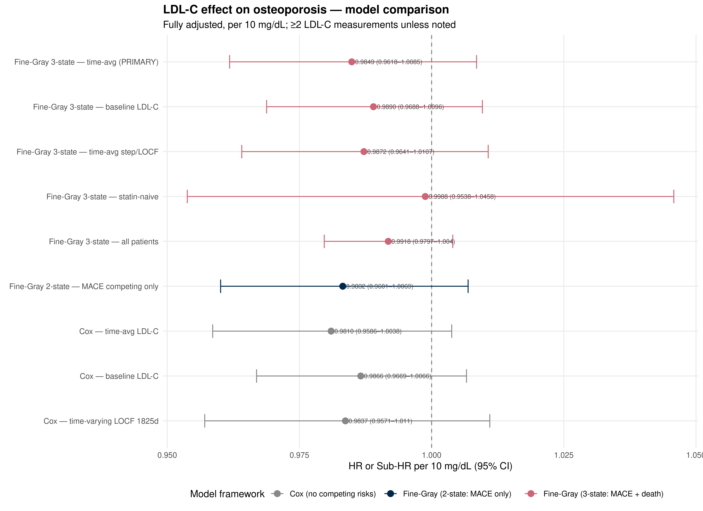

::: {.cell}

```{.r .cell-code}
library(tidyverse)
library(lubridate)
library(survival)
library(survminer)
library(cmprsk)
library(broom)
library(knitr)

# ── CONFIGURATION ──────────────────────────────────────────────────────────
SEX_COL       <- "GenderCode"
RACE_COL      <- "RaceCode"
ETHNICITY_COL <- "EthnicityCode"
LDL_SCALE     <- 10             # HR expressed per this many mg/dL

theme_set(theme_minimal(base_size = 12))

# Michigan colors for plots
color_osteo  <- "#ffcb05"
color_mace   <- "#00274c"
color_death  <- "#CC6677"
color_censor <- "#888888"
```
:::


## Purpose

This script estimates the association between **time-averaged LDL-C burden** and
incident **osteoporosis** using a **Fine-Gray competing risks model** with MACE
and death as competing events.

**Competing risks framework (three-state)**:

- **Status 1**: Osteoporosis (event of interest)
- **Status 2**: MACE without prior osteoporosis (cardiovascular competing event)
- **Status 3**: Death without prior osteoporosis or MACE (mortality competing event)
- **Status 0**: Censored at last encounter date

Death date is derived as the earliest of EHR-recorded death (`DeID_DeceasedDate`)
and Michigan Death Index (`DeID_MDIDeceasedDate`).

**Primary exposure**: Time-averaged LDL-C (trapezoid AUC ÷ follow-up years),
per 10 mg/dL.

**Covariates**: Age at baseline, sex, race/ethnicity, ever/never statin use,
diabetes, hypertension.

**Primary cohort**: ≥2 LDL-C measurements.

**Parallel structure**: This document mirrors `ldlc_mace_competing_risks.qmd`
in cohort construction, exposure computation, and covariate definitions to
enable direct comparison of the LDL-C effect across outcomes.

---

## Data Input


::: {.cell}

```{.r .cell-code}
demographic.data <- read_csv("combined_data/DemographicInfo.csv",
                             show_col_types = FALSE) %>%
  mutate(
    DeID_PatientID = as.character(DeID_PatientID),
    ehr_death_date = mdy_hm(DeID_DeceasedDate)
  )

cat("Demographic columns:\n")
```

::: {.cell-output .cell-output-stdout}

```
Demographic columns:
```


:::

```{.r .cell-code}
cat(paste(names(demographic.data), collapse = ", "), "\n")
```

::: {.cell-output .cell-output-stdout}

```
DeID_PatientID, GenderCode, DeID_DOB, DeID_DeceasedDate, RaceCode, EthnicityCode, DeathIndexUnderlyingCOD_ICD10, ehr_death_date 
```


:::

```{.r .cell-code}
mdi.data <- read_csv("combined_data/MichiganDeathIndex.csv",
                     show_col_types = FALSE) %>%
  mutate(
    DeID_PatientID = as.character(DeID_PatientID),
    mdi_death_date = mdy_hm(DeID_MDIDeceasedDate)
  ) %>%
  select(DeID_PatientID, mdi_death_date)

diagnosis.data <- read_csv("combined_data/DiagnosesCleaned.csv",
                           show_col_types = FALSE) %>%
  mutate(
    DeID_PatientID     = as.character(DeID_PatientID),
    Osteoporosis.onset = ymd(Osteoporosis.onset),
    MACE.onset         = ymd(MACE.onset)
  )

lab.data <- read_csv("combined_data/LabResultsCleaned.csv",
                     show_col_types = FALSE) %>%
  mutate(
    DeID_PatientID = as.character(DeID_PatientID),
    lab_date = coalesce(
      parse_date_time(DeID_COLLECTION_DATE,
                      orders = c("ymd", "mdy", "ymd HMS", "mdy HM"),
                      quiet  = TRUE),
      parse_date_time(DeID_AdmitDate,
                      orders = c("ymd", "mdy", "ymd HMS", "mdy HM"),
                      quiet  = TRUE)
    )
  )

ldlc.data <- lab.data %>% filter(test_name == "LDL-C")

encounter.data <- read_csv("combined_data/EncounterAll.csv",
                           show_col_types = FALSE) %>%
  mutate(
    DeID_PatientID = as.character(DeID_PatientID),
    EncounterDate  = mdy_hm(DeID_AdmitDate)
  )

statin_intervals <- read_csv(
  "combined_data/MedicationOrdersCleanedStatins.csv",
  show_col_types = FALSE
) %>%
  mutate(
    DeID_PatientID = as.character(DeID_PatientID),
    period_start   = as_date(period_start),
    period_end     = as_date(period_end),
    intensity      = factor(intensity, levels = c("low", "moderate", "high"))
  )

comorbidity_onset <- read_csv("combined_data/ComorbiditiesOnset.csv",
                              show_col_types = FALSE) %>%
  mutate(
    DeID_PatientID      = as.character(DeID_PatientID),
    diabetes_onset      = as_datetime(diabetes_onset),
    hypertension_onset  = as_datetime(hypertension_onset)
  )

cat("Demographic patients:", scales::comma(n_distinct(demographic.data$DeID_PatientID)), "\n")
```

::: {.cell-output .cell-output-stdout}

```
Demographic patients: 201,073 
```


:::

```{.r .cell-code}
cat("MDI death records:",    scales::comma(n_distinct(mdi.data$DeID_PatientID)), "\n")
```

::: {.cell-output .cell-output-stdout}

```
MDI death records: 17,318 
```


:::
:::


---

## Cohort Construction


::: {.cell}

```{.r .cell-code}
# --- Unified death date ---
death_dates <- demographic.data %>%
  select(DeID_PatientID, ehr_death_date) %>%
  left_join(mdi.data, by = "DeID_PatientID") %>%
  mutate(death_date = pmin(ehr_death_date, mdi_death_date, na.rm = TRUE))

death_dates %>%
  summarise(
    `EHR death`       = sum(!is.na(ehr_death_date)),
    `MDI death`       = sum(!is.na(mdi_death_date)),
    `Any death`       = sum(!is.na(death_date)),
    `MDI-only deaths` = sum(!is.na(mdi_death_date) & is.na(ehr_death_date))
  ) %>%
  pivot_longer(everything(), names_to = "Source", values_to = "N") %>%
  kable(caption = "Death data coverage")
```

::: {.cell-output-display}


Table: Death data coverage

|Source          |     N|
|:---------------|-----:|
|EHR death       | 14845|
|MDI death       | 16677|
|Any death       | 17283|
|MDI-only deaths |  2438|


:::

```{.r .cell-code}
# --- Full cohort ---
full_cohort <- demographic.data %>%
  select(DeID_PatientID, all_of(c(SEX_COL, RACE_COL, ETHNICITY_COL))) %>%
  left_join(death_dates %>% select(DeID_PatientID, death_date),
            by = "DeID_PatientID") %>%
  left_join(
    diagnosis.data %>%
      select(DeID_PatientID, Osteoporosis, Osteoporosis.onset,
             MACE, MACE.onset),
    by = "DeID_PatientID"
  ) %>%
  mutate(
    osteo_flag = if_else(Osteoporosis == TRUE, 1L, 0L, missing = 0L),
    mace_flag  = if_else(MACE == TRUE,         1L, 0L, missing = 0L),
    sex_raw    = as.character(.data[[SEX_COL]]),
    sex        = case_when(
      str_detect(sex_raw, regex("^f", ignore_case = TRUE)) ~ "Female",
      str_detect(sex_raw, regex("^m", ignore_case = TRUE)) ~ "Male",
      TRUE ~ NA_character_
    )
  )

cat("GenderCode mapping:\n")
```

::: {.cell-output .cell-output-stdout}

```
GenderCode mapping:
```


:::

```{.r .cell-code}
print(table(full_cohort$sex_raw, full_cohort$sex, useNA = "ifany"))
```

::: {.cell-output .cell-output-stdout}

```
   
    Female   Male   <NA>
  F 109410      0      0
  M      0  91653      0
  U      0      0     10
```


:::

```{.r .cell-code}
# --- Clean race/ethnicity ---
# DataDirect codes: RaceCode = A/AA/AI/C/D/O/P/U
#                   EthnicityCode = HL/NonHL/D/U
# Hispanic/Latino ethnicity overrides race (standard NIH classification)
cat("Race categories:\n")
```

::: {.cell-output .cell-output-stdout}

```
Race categories:
```


:::

```{.r .cell-code}
print(sort(table(full_cohort[[RACE_COL]], useNA = "ifany"), decreasing = TRUE))
```

::: {.cell-output .cell-output-stdout}

```

     C     AA      A      O      U      D   <NA>     AI      P 
150655  19851  18004   7346   1564   1388   1368    748    149 
```


:::

```{.r .cell-code}
cat("\nEthnicity categories:\n")
```

::: {.cell-output .cell-output-stdout}

```

Ethnicity categories:
```


:::

```{.r .cell-code}
print(sort(table(full_cohort[[ETHNICITY_COL]], useNA = "ifany"), decreasing = TRUE))
```

::: {.cell-output .cell-output-stdout}

```

 NonHL     HL      U   <NA>      D 
180630   7948   5516   5130   1849 
```


:::

```{.r .cell-code}
full_cohort <- full_cohort %>%
  mutate(
    race_eth = case_when(
      # Hispanic/Latino ethnicity takes priority regardless of race
      .data[[ETHNICITY_COL]] == "HL"       ~ "Hispanic",
      # Map race codes
      .data[[RACE_COL]] == "C"             ~ "White",
      .data[[RACE_COL]] == "AA"            ~ "Black",
      .data[[RACE_COL]] == "A"             ~ "Asian",
      .data[[RACE_COL]] %in% c("AI", "P")  ~ "Other/Unknown",
      .data[[RACE_COL]] %in% c("D", "O", "U") ~ "Other/Unknown",
      TRUE ~ "Other/Unknown"
    ),
    race_eth = factor(race_eth,
                      levels = c("White", "Black", "Asian",
                                 "Hispanic", "Other/Unknown"))
  )

cat("\nCombined race/ethnicity:\n")
```

::: {.cell-output .cell-output-stdout}

```

Combined race/ethnicity:
```


:::

```{.r .cell-code}
print(table(full_cohort$race_eth, useNA = "ifany"))
```

::: {.cell-output .cell-output-stdout}

```

        White         Black         Asian      Hispanic Other/Unknown 
       147266         19564         17928          7948          8367 
```


:::

```{.r .cell-code}
# --- Clean diagnoses (exclude osteo=TRUE with missing onset) ---
diag_clean <- full_cohort %>%
  filter(!(osteo_flag == 1L & is.na(Osteoporosis.onset))) %>%
  select(DeID_PatientID, sex, race_eth,
         Osteoporosis.onset, osteo_flag,
         MACE.onset, mace_flag, death_date)

# --- Clean LDL-C ---
ldlc_clean <- ldlc.data %>%
  filter(!is.na(lab_date), !is.na(AgeInYears)) %>%
  filter(value > 0, value <= 400) %>%
  mutate(BMI = if_else(BMI < 10 | BMI > 80, NA_real_, BMI)) %>%
  filter(AgeInYears >= 18) %>%
  group_by(DeID_PatientID, lab_date) %>%
  summarise(
    LDL_value  = mean(value,      na.rm = TRUE),
    AgeInYears = mean(AgeInYears, na.rm = TRUE),
    BMI        = mean(BMI,        na.rm = TRUE),
    .groups    = "drop"
  ) %>%
  arrange(DeID_PatientID, lab_date)

# --- Shared IDs ---
shared_ids  <- intersect(diag_clean$DeID_PatientID, ldlc_clean$DeID_PatientID)
diag_cohort <- diag_clean %>% filter(DeID_PatientID %in% shared_ids)
ldlc_cohort <- ldlc_clean %>% filter(DeID_PatientID %in% shared_ids)

# --- Last encounter (censoring) ---
last_encounter <- encounter.data %>%
  filter(!is.na(EncounterDate), DeID_PatientID %in% shared_ids) %>%
  group_by(DeID_PatientID) %>%
  slice_max(EncounterDate, n = 1, with_ties = FALSE) %>%
  ungroup() %>%
  select(DeID_PatientID, last_encounter_date = EncounterDate)

# --- First LDL-C = time zero ---
first_ldlc <- ldlc_cohort %>%
  group_by(DeID_PatientID) %>%
  slice_min(lab_date, n = 1, with_ties = FALSE) %>%
  ungroup() %>%
  select(DeID_PatientID,
         t0           = lab_date,
         LDL_baseline = LDL_value,
         Age_baseline = AgeInYears)

# --- Build base cohort with three-state competing risks ---
base_cohort_full <- diag_cohort %>%
  left_join(first_ldlc,     by = "DeID_PatientID") %>%
  left_join(last_encounter, by = "DeID_PatientID") %>%
  mutate(
    t_end = case_when(
      osteo_flag == 1             ~ Osteoporosis.onset,
      !is.na(last_encounter_date) ~ last_encounter_date,
      TRUE                        ~ NA_POSIXct_
    ),
    follow_up_days  = as.numeric(difftime(t_end, t0, units = "days")),
    follow_up_years = follow_up_days / 365.25,
    # Three-state competing risks
    # Priority: osteoporosis > MACE > death > censored
    fg_status = case_when(
      osteo_flag == 1                                          ~ 1L,
      mace_flag == 1 & osteo_flag == 0                         ~ 2L,
      !is.na(death_date) & death_date <= t_end &
        osteo_flag == 0 & mace_flag == 0                       ~ 3L,
      TRUE                                                     ~ 0L
    )
  )

base_cohort <- base_cohort_full %>%
  filter(follow_up_days > 0)

# --- CONSORT flow ---
tibble(
  Step = c(
    "Full demographic cohort",
    "No LDL-C data",
    "Osteoporosis=TRUE with missing onset date",
    "Negative or zero follow-up",
    "Final analytic cohort"
  ),
  N = c(
    n_distinct(demographic.data$DeID_PatientID),
    -length(setdiff(unique(full_cohort$DeID_PatientID), shared_ids)),
    -(nrow(full_cohort %>% filter(osteo_flag == 1L & is.na(Osteoporosis.onset)))),
    -(nrow(base_cohort_full %>% filter(follow_up_days <= 0))),
    nrow(base_cohort)
  )
) %>% kable(caption = "CONSORT flow — cohort derivation")
```

::: {.cell-output-display}


Table: CONSORT flow — cohort derivation

|Step                                      |       N|
|:-----------------------------------------|-------:|
|Full demographic cohort                   |  201073|
|No LDL-C data                             | -180453|
|Osteoporosis=TRUE with missing onset date |   -2912|
|Negative or zero follow-up                |    -470|
|Final analytic cohort                     |   20150|


:::

```{.r .cell-code}
# --- Competing events summary ---
base_cohort %>%
  count(fg_status) %>%
  mutate(
    Status = case_when(
      fg_status == 0 ~ "Censored",
      fg_status == 1 ~ "Osteoporosis (event of interest)",
      fg_status == 2 ~ "MACE without osteoporosis (competing)",
      fg_status == 3 ~ "Death without osteoporosis or MACE (competing)"
    ),
    pct = round(100 * n / sum(n), 1)
  ) %>%
  select(Status, N = n, `%` = pct) %>%
  kable(caption = "Three-state competing risks status")
```

::: {.cell-output-display}


Table: Three-state competing risks status

|Status                                         |     N|    %|
|:----------------------------------------------|-----:|----:|
|Censored                                       | 14091| 69.9|
|Osteoporosis (event of interest)               |  2262| 11.2|
|MACE without osteoporosis (competing)          |  2862| 14.2|
|Death without osteoporosis or MACE (competing) |   935|  4.6|


:::
:::


---

## LDL-C Exposure Computation


::: {.cell}

```{.r .cell-code}
ldlc_with_time <- ldlc_cohort %>%
  filter(DeID_PatientID %in% base_cohort$DeID_PatientID) %>%
  left_join(base_cohort %>% select(DeID_PatientID, t0, t_end),
            by = "DeID_PatientID") %>%
  filter(lab_date >= t0, lab_date <= t_end) %>%
  mutate(t_years = as.numeric(difftime(lab_date, t0, units = "days")) / 365.25) %>%
  arrange(DeID_PatientID, t_years)

n_measurements <- ldlc_with_time %>%
  count(DeID_PatientID, name = "n_measurements")

# --- Trapezoid AUC ---
auc_trapezoid <- ldlc_with_time %>%
  group_by(DeID_PatientID) %>%
  mutate(
    t_next   = lead(t_years),
    ldl_next = lead(LDL_value),
    t_end_yr = as.numeric(difftime(first(t_end), first(t0),
                                   units = "days")) / 365.25,
    interval_area = case_when(
      !is.na(t_next) ~ (LDL_value + ldl_next) / 2 * (t_next - t_years),
      TRUE           ~ LDL_value * (t_end_yr - t_years)
    )
  ) %>%
  summarise(
    cumLDL_trap = sum(interval_area, na.rm = TRUE),
    fu_years    = first(t_end_yr),
    .groups     = "drop"
  ) %>%
  mutate(meanLDL_trap = cumLDL_trap / fu_years)

# --- Step / LOCF AUC ---
auc_step <- ldlc_with_time %>%
  group_by(DeID_PatientID) %>%
  mutate(
    t_next   = lead(t_years),
    t_end_yr = as.numeric(difftime(first(t_end), first(t0),
                                   units = "days")) / 365.25,
    duration = if_else(!is.na(t_next), t_next - t_years, t_end_yr - t_years)
  ) %>%
  summarise(
    cumLDL_step = sum(LDL_value * duration, na.rm = TRUE),
    fu_years    = first(t_end_yr),
    .groups     = "drop"
  ) %>%
  mutate(meanLDL_step = cumLDL_step / fu_years)

# --- Join to base cohort ---
base_cohort <- base_cohort %>%
  left_join(n_measurements, by = "DeID_PatientID") %>%
  left_join(auc_trapezoid %>% select(DeID_PatientID, cumLDL_trap, meanLDL_trap),
            by = "DeID_PatientID") %>%
  left_join(auc_step %>% select(DeID_PatientID, cumLDL_step, meanLDL_step),
            by = "DeID_PatientID") %>%
  mutate(
    LDL_baseline_s  = LDL_baseline / LDL_SCALE,
    meanLDL_trap_s  = meanLDL_trap / LDL_SCALE,
    meanLDL_step_s  = meanLDL_step / LDL_SCALE
  )

# --- Primary cohort: ≥2 measurements ---
cohort_2plus <- base_cohort %>% filter(n_measurements >= 2)

cohort_2plus %>%
  count(fg_status) %>%
  mutate(
    Status = case_when(
      fg_status == 0 ~ "Censored",
      fg_status == 1 ~ "Osteoporosis",
      fg_status == 2 ~ "MACE (competing)",
      fg_status == 3 ~ "Death (competing)"
    ),
    pct = round(100 * n / sum(n), 1)
  ) %>%
  select(Status, N = n, `%` = pct) %>%
  kable(caption = "Competing risks status (≥2 measurements cohort)")
```

::: {.cell-output-display}


Table: Competing risks status (≥2 measurements cohort)

|Status            |    N|    %|
|:-----------------|----:|----:|
|Censored          | 3805| 65.8|
|Osteoporosis      |  595| 10.3|
|MACE (competing)  | 1094| 18.9|
|Death (competing) |  290|  5.0|


:::

```{.r .cell-code}
cohort_2plus %>%
  summarise(
    `N patients`                     = n(),
    `Osteoporosis events`            = sum(fg_status == 1),
    `MACE competing`                 = sum(fg_status == 2),
    `Death competing`                = sum(fg_status == 3),
    `Median follow-up (years)`       = round(median(follow_up_years), 1),
    `Median baseline LDL-C (mg/dL)`  = round(median(LDL_baseline, na.rm = TRUE), 1),
    `Median time-avg LDL-C (mg/dL)`  = round(median(meanLDL_trap, na.rm = TRUE), 1),
    `Trap-step correlation`          = round(cor(meanLDL_trap, meanLDL_step,
                                                 use = "complete.obs"), 3)
  ) %>%
  pivot_longer(everything(), names_to = "Metric", values_to = "Value") %>%
  kable(caption = "Exposure summary (≥2 measurements cohort)")
```

::: {.cell-output-display}


Table: Exposure summary (≥2 measurements cohort)

|Metric                        |    Value|
|:-----------------------------|--------:|
|N patients                    | 5784.000|
|Osteoporosis events           |  595.000|
|MACE competing                | 1094.000|
|Death competing               |  290.000|
|Median follow-up (years)      |   18.500|
|Median baseline LDL-C (mg/dL) |  103.000|
|Median time-avg LDL-C (mg/dL) |  103.100|
|Trap-step correlation         |    0.976|


:::
:::


---

## Covariate Construction


::: {.cell}

```{.r .cell-code}
# --- Ever/never statin ---
ever_statin <- statin_intervals %>%
  inner_join(base_cohort %>% select(DeID_PatientID, t0, t_end),
             by = "DeID_PatientID") %>%
  filter(period_end >= as_date(t0), period_start <= as_date(t_end)) %>%
  distinct(DeID_PatientID) %>%
  mutate(ever_statin = 1L)

# --- Diabetes and hypertension ---
comorbidity_fixed <- comorbidity_onset %>%
  inner_join(base_cohort %>% select(DeID_PatientID, t0, t_end),
             by = "DeID_PatientID") %>%
  mutate(
    ever_diabetes     = as.integer(!is.na(diabetes_onset) &
                                     diabetes_onset <= t_end),
    ever_hypertension = as.integer(!is.na(hypertension_onset) &
                                     hypertension_onset <= t_end)
  ) %>%
  select(DeID_PatientID, ever_diabetes, ever_hypertension)

# --- Join all covariates ---
base_cohort <- base_cohort %>%
  left_join(ever_statin,       by = "DeID_PatientID") %>%
  left_join(comorbidity_fixed, by = "DeID_PatientID") %>%
  mutate(
    ever_statin       = replace_na(ever_statin, 0L),
    ever_diabetes     = replace_na(ever_diabetes, 0L),
    ever_hypertension = replace_na(ever_hypertension, 0L),
    sex               = factor(sex),
    race_eth          = factor(race_eth,
                               levels = c("White", "Black", "Asian",
                                          "Hispanic", "Other/Unknown"))
  )

cohort_2plus <- base_cohort %>% filter(n_measurements >= 2)

cohort_2plus %>%
  summarise(
    N                    = n(),
    `Osteo events`       = sum(fg_status == 1),
    `Ever statin (%)`    = round(100 * mean(ever_statin), 1),
    `Diabetes (%)`       = round(100 * mean(ever_diabetes), 1),
    `Hypertension (%)`   = round(100 * mean(ever_hypertension), 1),
    `Female (%)`         = round(100 * mean(sex == "Female", na.rm = TRUE), 1),
    `Median age`         = round(median(Age_baseline, na.rm = TRUE), 1)
  ) %>%
  pivot_longer(everything(), names_to = "Metric", values_to = "Value") %>%
  kable(caption = "Covariate summary (≥2 measurements cohort)")
```

::: {.cell-output-display}


Table: Covariate summary (≥2 measurements cohort)

|Metric           |  Value|
|:----------------|------:|
|N                | 5784.0|
|Osteo events     |  595.0|
|Ever statin (%)  |   72.7|
|Diabetes (%)     |   56.8|
|Hypertension (%) |   76.7|
|Female (%)       |   36.8|
|Median age       |   52.0|


:::

```{.r .cell-code}
cohort_2plus %>%
  count(race_eth) %>%
  mutate(pct = round(100 * n / sum(n), 1)) %>%
  kable(caption = "Race/ethnicity distribution (≥2 measurements)")
```

::: {.cell-output-display}


Table: Race/ethnicity distribution (≥2 measurements)

|race_eth      |    n|  pct|
|:-------------|----:|----:|
|White         | 4474| 77.4|
|Black         |  432|  7.5|
|Asian         |  432|  7.5|
|Hispanic      |  228|  3.9|
|Other/Unknown |  218|  3.8|


:::
:::


---

## Descriptive: Table 1


::: {.cell}

```{.r .cell-code}
cohort_2plus %>%
  mutate(
    outcome_group = case_when(
      fg_status == 1 ~ "Osteoporosis",
      fg_status == 2 ~ "MACE (competing)",
      fg_status == 3 ~ "Death (competing)",
      TRUE           ~ "Censored"
    )
  ) %>%
  group_by(outcome_group) %>%
  summarise(
    N                              = n(),
    `Median age`                   = round(median(Age_baseline, na.rm = TRUE), 1),
    `Female (%)`                   = round(100 * mean(sex == "Female", na.rm = TRUE), 1),
    `Ever statin (%)`              = round(100 * mean(ever_statin), 1),
    `Diabetes (%)`                 = round(100 * mean(ever_diabetes), 1),
    `Hypertension (%)`             = round(100 * mean(ever_hypertension), 1),
    `Median baseline LDL-C`        = round(median(LDL_baseline, na.rm = TRUE), 1),
    `Median time-avg LDL-C`        = round(median(meanLDL_trap, na.rm = TRUE), 1),
    `Median follow-up (years)`     = round(median(follow_up_years), 1),
    `Median LDL-C measurements`    = median(n_measurements),
    .groups = "drop"
  ) %>%
  pivot_longer(-outcome_group, names_to = "Variable", values_to = "Value") %>%
  pivot_wider(names_from = outcome_group, values_from = Value) %>%
  kable(caption = "Table 1 — patient characteristics by outcome status")
```

::: {.cell-output-display}


Table: Table 1 — patient characteristics by outcome status

|Variable                  | Censored| Death (competing)| MACE (competing)| Osteoporosis|
|:-------------------------|--------:|-----------------:|----------------:|------------:|
|N                         |   3805.0|             290.0|           1094.0|        595.0|
|Median age                |     48.0|              61.0|             58.0|         64.0|
|Female (%)                |     32.9|              31.7|             29.6|         77.1|
|Ever statin (%)           |     69.1|              67.9|             88.7|         68.6|
|Diabetes (%)              |     50.4|              72.1|             74.5|         57.1|
|Hypertension (%)          |     69.1|              91.0|             94.8|         85.5|
|Median baseline LDL-C     |    106.0|              93.0|             96.0|        103.0|
|Median time-avg LDL-C     |    105.5|              92.4|             96.6|        102.3|
|Median follow-up (years)  |     19.1|              16.6|             19.2|         11.0|
|Median LDL-C measurements |      2.0|               2.0|              3.0|          2.0|


:::
:::


---

## Primary Analysis: Fine-Gray Competing Risks

Three-state: osteoporosis (1), MACE (2), death (3). `crr()` models the
subdistribution hazard for osteoporosis (failcode = 1).


::: {.cell}

```{.r .cell-code}
# Helper functions
format_fg <- function(fg_fit, term_labels) {
  s <- summary(fg_fit)
  tibble(
    Term          = term_labels,
    `Sub-HR`      = round(exp(s$coef[, "coef"]), 4),
    `95% CI low`  = round(exp(s$coef[, "coef"] -
                               1.96 * s$coef[, "se(coef)"]), 4),
    `95% CI high` = round(exp(s$coef[, "coef"] +
                               1.96 * s$coef[, "se(coef)"]), 4),
    `p-value`     = format.pval(s$coef[, "p-value"], digits = 3, eps = 0.001)
  )
}

extract_fg_row <- function(fg_fit, label, term_idx = 1) {
  s <- summary(fg_fit)
  tibble(
    Model     = label,
    HR        = round(exp(s$coef[term_idx, "coef"]), 4),
    CI_low    = round(exp(s$coef[term_idx, "coef"] -
                           1.96 * s$coef[term_idx, "se(coef)"]), 4),
    CI_high   = round(exp(s$coef[term_idx, "coef"] +
                           1.96 * s$coef[term_idx, "se(coef)"]), 4),
    `p-value` = format.pval(s$coef[term_idx, "p-value"],
                            digits = 3, eps = 0.001),
    `N obs`   = as.integer(fg_fit$n),
    `N events`= as.integer(sum(fg_fit$fstatus == fg_fit$failcode)),
    `95% CI`  = paste0("(", CI_low, "\u2013", CI_high, ")")
  ) %>%
    select(Model, HR, `95% CI`, `p-value`, `N obs`, `N events`)
}

extract_hr <- function(fit, label, term_name) {
  broom::tidy(fit, exponentiate = TRUE, conf.int = TRUE) %>%
    filter(term == term_name) %>%
    mutate(
      Model      = label,
      HR         = round(estimate, 4),
      CI_low     = round(conf.low, 4),
      CI_high    = round(conf.high, 4),
      `95% CI`   = paste0("(", CI_low, "\u2013", CI_high, ")"),
      `p-value`  = format.pval(p.value, digits = 3, eps = 0.001),
      `N obs`    = fit$n,
      `N events` = fit$nevent
    ) %>%
    select(Model, HR, CI_low, CI_high, `95% CI`, `p-value`, `N obs`, `N events`)
}

check_ph <- function(fit, label) {
  ph  <- cox.zph(fit)
  row <- ph$table[nrow(ph$table), ]
  cat(sprintf("%s — global chi-sq=%.3f, p=%.4f %s\n",
              label, row["chisq"], row["p"],
              if_else(row["p"] < 0.05, "\u26a0 PH violated", "\u2713 PH holds")))
  invisible(ph)
}

# Wrapper for crr() that drops zero-variance columns and avoids with() scoping
safe_crr <- function(ftime, fstatus, cov_mat, labels, failcode = 1) {
  col_vars <- apply(cov_mat, 2, var, na.rm = TRUE)
  bad_cols <- which(col_vars == 0 | is.na(col_vars))
  if (length(bad_cols) > 0) {
    cat("  Dropping zero-variance columns:",
        paste(colnames(cov_mat)[bad_cols], collapse = ", "), "\n")
    cov_mat <- cov_mat[, -bad_cols, drop = FALSE]
    labels  <- labels[-bad_cols]
  }
  fit <- crr(ftime = ftime, fstatus = fstatus, cov1 = cov_mat,
             failcode = failcode, cencode = 0)
  list(fit = fit, labels = labels)
}

# --- Build design matrix ---
cat(">>> SCRIPT VERSION: 2026-04-06-v4 <<<\n")  # version marker
```

::: {.cell-output .cell-output-stdout}

```
>>> SCRIPT VERSION: 2026-04-06-v4 <<<
```


:::

```{.r .cell-code}
fg_data <- cohort_2plus %>%
  filter(!is.na(meanLDL_trap_s), !is.na(Age_baseline), !is.na(sex),
         !is.na(race_eth)) %>%
  mutate(
    sex_female   = as.integer(sex == "Female"),
    race_black   = as.integer(race_eth == "Black"),
    race_asian   = as.integer(race_eth == "Asian"),
    race_hisp    = as.integer(race_eth == "Hispanic"),
    race_other   = as.integer(race_eth == "Other/Unknown")
  )

cat("fg_data rows:", nrow(fg_data), "\n")
```

::: {.cell-output .cell-output-stdout}

```
fg_data rows: 5784 
```


:::

```{.r .cell-code}
cat("sex distribution in fg_data:\n")
```

::: {.cell-output .cell-output-stdout}

```
sex distribution in fg_data:
```


:::

```{.r .cell-code}
print(table(fg_data$sex, useNA = "ifany"))
```

::: {.cell-output .cell-output-stdout}

```

Female   Male 
  2128   3656 
```


:::

```{.r .cell-code}
cat("race_eth distribution in fg_data:\n")
```

::: {.cell-output .cell-output-stdout}

```
race_eth distribution in fg_data:
```


:::

```{.r .cell-code}
print(table(fg_data$race_eth, useNA = "ifany"))
```

::: {.cell-output .cell-output-stdout}

```

        White         Black         Asian      Hispanic Other/Unknown 
         4474           432           432           228           218 
```


:::

```{.r .cell-code}
cat("sex_female sum:", sum(fg_data$sex_female), "of", nrow(fg_data), "\n")
```

::: {.cell-output .cell-output-stdout}

```
sex_female sum: 2128 of 5784 
```


:::

```{.r .cell-code}
cat("race_black sum:", sum(fg_data$race_black), "\n")
```

::: {.cell-output .cell-output-stdout}

```
race_black sum: 432 
```


:::

```{.r .cell-code}
cat("race_asian sum:", sum(fg_data$race_asian), "\n")
```

::: {.cell-output .cell-output-stdout}

```
race_asian sum: 432 
```


:::

```{.r .cell-code}
cat("race_hisp sum:",  sum(fg_data$race_hisp), "\n")
```

::: {.cell-output .cell-output-stdout}

```
race_hisp sum: 228 
```


:::

```{.r .cell-code}
cat("race_other sum:", sum(fg_data$race_other), "\n")
```

::: {.cell-output .cell-output-stdout}

```
race_other sum: 218 
```


:::

```{.r .cell-code}
# Build design matrix
cov_matrix_avg <- as.matrix(fg_data %>%
  select(meanLDL_trap_s, Age_baseline, sex_female,
         race_black, race_asian, race_hisp, race_other,
         ever_statin, ever_diabetes, ever_hypertension))

cov_labels <- c(
  paste0("Time-avg LDL-C (per ", LDL_SCALE, " mg/dL)"),
  "Age at baseline",
  "Female (vs Male)",
  "Black (vs White)", "Asian (vs White)",
  "Hispanic (vs White)", "Other/Unknown (vs White)",
  "Ever statin", "Diabetes", "Hypertension"
)

# Drop any zero-variance or constant columns and run model
cat("Final design matrix:", nrow(cov_matrix_avg), "x", ncol(cov_matrix_avg), "\n")
```

::: {.cell-output .cell-output-stdout}

```
Final design matrix: 5784 x 10 
```


:::

```{.r .cell-code}
cat("Columns:", paste(colnames(cov_matrix_avg), collapse = ", "), "\n")
```

::: {.cell-output .cell-output-stdout}

```
Columns: meanLDL_trap_s, Age_baseline, sex_female, race_black, race_asian, race_hisp, race_other, ever_statin, ever_diabetes, ever_hypertension 
```


:::

```{.r .cell-code}
# --- PRIMARY: Fine-Gray, time-averaged LDL-C (trapezoid) ---
primary_result <- safe_crr(fg_data$follow_up_days, fg_data$fg_status,
                           cov_matrix_avg, cov_labels, failcode = 1)
fg_primary <- primary_result$fit
cov_labels <- primary_result$labels

format_fg(fg_primary, cov_labels) %>%
  kable(caption = paste0(
    "PRIMARY — Fine-Gray: time-averaged LDL-C per ",
    LDL_SCALE, " mg/dL; MACE + death as competing events"))
```

::: {.cell-output-display}


Table: PRIMARY — Fine-Gray: time-averaged LDL-C per 10 mg/dL; MACE + death as competing events

|Term                          | Sub-HR| 95% CI low| 95% CI high|p-value |
|:-----------------------------|------:|----------:|-----------:|:-------|
|Time-avg LDL-C (per 10 mg/dL) | 0.9849|     0.9618|      1.0085|0.2100  |
|Age at baseline               | 1.0547|     1.0480|      1.0614|<0.001  |
|Female (vs Male)              | 6.0350|     4.9405|      7.3719|<0.001  |
|Black (vs White)              | 0.6623|     0.4613|      0.9509|0.0260  |
|Asian (vs White)              | 0.8732|     0.6191|      1.2315|0.4400  |
|Hispanic (vs White)           | 0.5836|     0.3167|      1.0756|0.0840  |
|Other/Unknown (vs White)      | 0.9621|     0.6035|      1.5337|0.8700  |
|Ever statin                   | 0.6459|     0.5301|      0.7871|<0.001  |
|Diabetes                      | 0.7822|     0.6502|      0.9411|0.0092  |
|Hypertension                  | 0.9922|     0.7622|      1.2918|0.9500  |


:::
:::


---

## Sensitivity 1: Standard Cox (No Competing Risks)


::: {.cell}

```{.r .cell-code}
fit_cox_avg <- coxph(
  Surv(follow_up_days, osteo_flag) ~ meanLDL_trap_s + Age_baseline +
    sex + race_eth + ever_statin + ever_diabetes + ever_hypertension,
  data = fg_data, ties = "efron"
)

broom::tidy(fit_cox_avg, exponentiate = TRUE, conf.int = TRUE) %>%
  mutate(across(where(is.numeric), ~round(.x, 4))) %>%
  select(term, estimate, conf.low, conf.high, p.value) %>%
  kable(caption = "Cox (no competing risks) — time-averaged LDL-C")
```

::: {.cell-output-display}


Table: Cox (no competing risks) — time-averaged LDL-C

|term                  | estimate| conf.low| conf.high| p.value|
|:---------------------|--------:|--------:|---------:|-------:|
|meanLDL_trap_s        |   0.9810|   0.9586|    1.0038|  0.1016|
|Age_baseline          |   1.0598|   1.0531|    1.0666|  0.0000|
|sexMale               |   0.1694|   0.1391|    0.2063|  0.0000|
|race_ethBlack         |   0.6795|   0.4766|    0.9688|  0.0327|
|race_ethAsian         |   0.8313|   0.5869|    1.1776|  0.2984|
|race_ethHispanic      |   0.5617|   0.3082|    1.0239|  0.0597|
|race_ethOther/Unknown |   0.9384|   0.5913|    1.4893|  0.7873|
|ever_statin           |   0.6097|   0.5061|    0.7344|  0.0000|
|ever_diabetes         |   0.8063|   0.6767|    0.9607|  0.0160|
|ever_hypertension     |   1.0271|   0.7929|    1.3305|  0.8394|


:::

```{.r .cell-code}
check_ph(fit_cox_avg, "Cox time-averaged LDL-C")
```

::: {.cell-output .cell-output-stdout}

```
Cox time-averaged LDL-C — global chi-sq=25.471, p=0.0045 ⚠ PH violated
```


:::
:::


---

## Sensitivity 2: Baseline LDL-C


::: {.cell}

```{.r .cell-code}
cov_matrix_base <- as.matrix(fg_data %>%
  select(LDL_baseline_s, Age_baseline, sex_female,
         race_black, race_asian, race_hisp, race_other,
         ever_statin, ever_diabetes, ever_hypertension))

cov_labels_base <- cov_labels
cov_labels_base[1] <- paste0("Baseline LDL-C (per ", LDL_SCALE, " mg/dL)")

base_result <- safe_crr(fg_data$follow_up_days, fg_data$fg_status,
                        cov_matrix_base, cov_labels_base, failcode = 1)
fg_baseline <- base_result$fit

format_fg(fg_baseline, base_result$labels) %>%
  kable(caption = "Fine-Gray — baseline LDL-C")
```

::: {.cell-output-display}


Table: Fine-Gray — baseline LDL-C

|Term                          | Sub-HR| 95% CI low| 95% CI high|p-value |
|:-----------------------------|------:|----------:|-----------:|:-------|
|Baseline LDL-C (per 10 mg/dL) | 0.9890|     0.9688|      1.0096|0.2900  |
|Age at baseline               | 1.0549|     1.0483|      1.0616|<0.001  |
|Female (vs Male)              | 6.0003|     4.9110|      7.3311|<0.001  |
|Black (vs White)              | 0.6630|     0.4623|      0.9510|0.0260  |
|Asian (vs White)              | 0.8743|     0.6194|      1.2341|0.4400  |
|Hispanic (vs White)           | 0.5817|     0.3153|      1.0733|0.0830  |
|Other/Unknown (vs White)      | 0.9572|     0.6007|      1.5251|0.8500  |
|Ever statin                   | 0.6444|     0.5290|      0.7851|<0.001  |
|Diabetes                      | 0.7839|     0.6521|      0.9423|0.0095  |
|Hypertension                  | 0.9953|     0.7643|      1.2961|0.9700  |


:::

```{.r .cell-code}
fit_cox_base <- coxph(
  Surv(follow_up_days, osteo_flag) ~ LDL_baseline_s + Age_baseline +
    sex + race_eth + ever_statin + ever_diabetes + ever_hypertension,
  data = fg_data, ties = "efron"
)

check_ph(fit_cox_base, "Cox baseline LDL-C")
```

::: {.cell-output .cell-output-stdout}

```
Cox baseline LDL-C — global chi-sq=26.067, p=0.0037 ⚠ PH violated
```


:::
:::


---

## Sensitivity 3: Time-Varying LDL-C (tmerge + Cox)


::: {.cell}

```{.r .cell-code}
ldlc_intervals_tv <- ldlc_cohort %>%
  filter(DeID_PatientID %in% cohort_2plus$DeID_PatientID) %>%
  left_join(cohort_2plus %>% select(DeID_PatientID, t0, t_end),
            by = "DeID_PatientID") %>%
  filter(lab_date <= t_end) %>%
  mutate(
    t_meas     = as.numeric(difftime(lab_date, t0, units = "days")),
    LDL_value  = as.numeric(LDL_value),
    AgeInYears = as.numeric(AgeInYears)
  ) %>%
  filter(t_meas >= 0) %>%
  arrange(DeID_PatientID, t_meas)

# Stale markers at 1825d
add_stale_markers <- function(intervals_df, cap_days, follow_up_df) {
  intervals_df %>%
    arrange(DeID_PatientID, t_meas) %>%
    group_by(DeID_PatientID) %>%
    mutate(next_meas = lead(t_meas)) %>%
    ungroup() %>%
    filter(is.na(next_meas) | next_meas > t_meas + cap_days) %>%
    mutate(stale_t = t_meas + cap_days) %>%
    left_join(follow_up_df %>% select(DeID_PatientID, follow_up_days),
              by = "DeID_PatientID") %>%
    filter(stale_t < follow_up_days) %>%
    transmute(
      DeID_PatientID,
      t_meas     = stale_t,
      LDL_value  = -9999,
      AgeInYears = NA_real_
    )
}

stale_1825 <- add_stale_markers(ldlc_intervals_tv, 1825, cohort_2plus)
ldlc_intervals_1825 <- bind_rows(ldlc_intervals_tv, stale_1825) %>%
  arrange(DeID_PatientID, t_meas)

surv_base_tv <- cohort_2plus %>%
  mutate(tstart_days = 0, tstop_days = as.numeric(follow_up_days))

surv.data.tv <- tmerge(
  data1 = surv_base_tv, data2 = surv_base_tv,
  id = DeID_PatientID,
  Osteoporosis = event(tstop_days, osteo_flag)
)

surv.data.tv <- tmerge(
  data1 = surv.data.tv,
  data2 = ldlc_intervals_1825 %>%
    mutate(DeID_PatientID = as.character(DeID_PatientID)),
  id         = DeID_PatientID,
  LDL_value  = tdc(t_meas, LDL_value),
  AgeInYears = tdc(t_meas, AgeInYears)
)

surv.data.tv <- surv.data.tv %>%
  group_by(DeID_PatientID) %>%
  fill(AgeInYears, .direction = "downup") %>%
  mutate(LDL_value = if_else(LDL_value == -9999, NA_real_, LDL_value)) %>%
  ungroup() %>%
  filter(tstop - tstart >= 0.5) %>%
  mutate(LDL_per_s = LDL_value / LDL_SCALE)

# Time-varying statin (range join)
statin_tv <- statin_intervals %>%
  inner_join(first_ldlc %>% select(DeID_PatientID, t0),
             by = "DeID_PatientID") %>%
  mutate(
    tstart_statin = as.numeric(period_start - as_date(t0)),
    tstop_statin  = as.numeric(period_end   - as_date(t0))
  ) %>%
  filter(tstop_statin > 0) %>%
  mutate(tstart_statin = pmax(tstart_statin, 0)) %>%
  filter(tstop_statin > tstart_statin) %>%
  select(DeID_PatientID, tstart_statin, tstop_statin)

surv.data.tv <- surv.data.tv %>%
  left_join(statin_tv, by = "DeID_PatientID",
            relationship = "many-to-many") %>%
  mutate(
    on_statin = as.integer(
      !is.na(tstart_statin) &
        tstart < tstop_statin &
        tstop  > tstart_statin
    )
  ) %>%
  group_by(DeID_PatientID, tstart, tstop) %>%
  summarise(
    across(c(Osteoporosis, LDL_value, LDL_per_s, AgeInYears,
             sex, race_eth, ever_diabetes, ever_hypertension,
             osteo_flag, t0, t_end, follow_up_days),
           ~ first(na.omit(.x))),
    on_statin = as.integer(any(on_statin == 1, na.rm = TRUE)),
    .groups   = "drop"
  ) %>%
  arrange(DeID_PatientID, tstart)

fit_cox_tv <- coxph(
  Surv(tstart, tstop, Osteoporosis) ~ LDL_per_s + AgeInYears +
    sex + race_eth + on_statin + ever_diabetes + ever_hypertension,
  data = surv.data.tv, ties = "efron", id = DeID_PatientID
)

broom::tidy(fit_cox_tv, exponentiate = TRUE, conf.int = TRUE) %>%
  mutate(across(where(is.numeric), ~round(.x, 4))) %>%
  select(term, estimate, conf.low, conf.high, p.value) %>%
  kable(caption = "Cox — time-varying LOCF 1825d with time-varying statin")
```

::: {.cell-output-display}


Table: Cox — time-varying LOCF 1825d with time-varying statin

|term                  | estimate| conf.low| conf.high| p.value|
|:---------------------|--------:|--------:|---------:|-------:|
|LDL_per_s             |   0.9837|   0.9571|    1.0110|  0.2384|
|AgeInYears            |   1.0718|   1.0623|    1.0814|  0.0000|
|sexMale               |   0.1769|   0.1366|    0.2291|  0.0000|
|race_ethBlack         |   0.6866|   0.4256|    1.1077|  0.1233|
|race_ethAsian         |   0.8216|   0.5272|    1.2805|  0.3855|
|race_ethHispanic      |   0.4233|   0.1573|    1.1396|  0.0889|
|race_ethOther/Unknown |   0.9157|   0.4992|    1.6797|  0.7759|
|on_statin             |   1.0931|   0.8649|    1.3815|  0.4562|
|ever_diabetes         |   0.7885|   0.6260|    0.9932|  0.0436|
|ever_hypertension     |   0.7294|   0.5194|    1.0243|  0.0686|


:::

```{.r .cell-code}
check_ph(fit_cox_tv, "Cox time-varying LOCF")
```

::: {.cell-output .cell-output-stdout}

```
Cox time-varying LOCF — global chi-sq=34.055, p=0.0002 ⚠ PH violated
```


:::
:::


---

## Sensitivity 4: Step/LOCF AUC (vs Trapezoid)


::: {.cell}

```{.r .cell-code}
fg_data_step <- fg_data %>% filter(!is.na(meanLDL_step_s))

cov_matrix_step <- as.matrix(fg_data_step %>%
  select(meanLDL_step_s, Age_baseline, sex_female,
         race_black, race_asian, race_hisp, race_other,
         ever_statin, ever_diabetes, ever_hypertension))

cov_labels_step <- cov_labels
cov_labels_step[1] <- paste0("Time-avg LDL-C step/LOCF (per ", LDL_SCALE, " mg/dL)")

step_result <- safe_crr(fg_data_step$follow_up_days, fg_data_step$fg_status,
                        cov_matrix_step, cov_labels_step, failcode = 1)
fg_step <- step_result$fit

format_fg(fg_step, step_result$labels) %>%
  kable(caption = "Fine-Gray — time-averaged LDL-C (step/LOCF method)")
```

::: {.cell-output-display}


Table: Fine-Gray — time-averaged LDL-C (step/LOCF method)

|Term                                    | Sub-HR| 95% CI low| 95% CI high|p-value |
|:---------------------------------------|------:|----------:|-----------:|:-------|
|Time-avg LDL-C step/LOCF (per 10 mg/dL) | 0.9872|     0.9641|      1.0107|0.2800  |
|Age at baseline                         | 1.0548|     1.0481|      1.0615|<0.001  |
|Female (vs Male)                        | 6.0142|     4.9227|      7.3478|<0.001  |
|Black (vs White)                        | 0.6632|     0.4621|      0.9520|0.0260  |
|Asian (vs White)                        | 0.8745|     0.6199|      1.2338|0.4500  |
|Hispanic (vs White)                     | 0.5820|     0.3157|      1.0728|0.0830  |
|Other/Unknown (vs White)                | 0.9617|     0.6034|      1.5328|0.8700  |
|Ever statin                             | 0.6461|     0.5302|      0.7872|<0.001  |
|Diabetes                                | 0.7838|     0.6517|      0.9427|0.0097  |
|Hypertension                            | 0.9926|     0.7623|      1.2925|0.9600  |


:::
:::


---

## Sensitivity 5: Statin-Naive Subgroup


::: {.cell}

```{.r .cell-code}
fg_statin_naive <- fg_data %>% filter(ever_statin == 0)

cov_matrix_naive <- as.matrix(fg_statin_naive %>%
  select(meanLDL_trap_s, Age_baseline, sex_female,
         race_black, race_asian, race_hisp, race_other,
         ever_diabetes, ever_hypertension))

cov_labels_naive <- cov_labels[cov_labels != "Ever statin"]

naive_result <- safe_crr(fg_statin_naive$follow_up_days, fg_statin_naive$fg_status,
                         cov_matrix_naive, cov_labels_naive, failcode = 1)
fg_naive <- naive_result$fit

format_fg(fg_naive, naive_result$labels) %>%
  kable(caption = "Fine-Gray — statin-naive subgroup, time-averaged LDL-C")
```

::: {.cell-output-display}


Table: Fine-Gray — statin-naive subgroup, time-averaged LDL-C

|Term                          | Sub-HR| 95% CI low| 95% CI high|p-value |
|:-----------------------------|------:|----------:|-----------:|:-------|
|Time-avg LDL-C (per 10 mg/dL) | 0.9988|     0.9538|      1.0458|0.96    |
|Age at baseline               | 1.0557|     1.0445|      1.0669|<0.001  |
|Female (vs Male)              | 6.4706|     4.3234|      9.6842|<0.001  |
|Black (vs White)              | 0.4663|     0.1811|      1.2004|0.11    |
|Asian (vs White)              | 0.8227|     0.4710|      1.4372|0.49    |
|Hispanic (vs White)           | 0.8216|     0.2937|      2.2979|0.71    |
|Other/Unknown (vs White)      | 1.4006|     0.7274|      2.6968|0.31    |
|Diabetes                      | 0.8761|     0.6208|      1.2363|0.45    |
|Hypertension                  | 1.0343|     0.6989|      1.5307|0.87    |


:::
:::


---

## Sensitivity 6: All Patients (Including Single Measurement)


::: {.cell}

```{.r .cell-code}
fg_all_data <- base_cohort %>%
  filter(!is.na(meanLDL_trap_s), !is.na(Age_baseline),
         !is.na(sex), !is.na(race_eth)) %>%
  mutate(
    sex_female   = as.integer(sex == "Female"),
    race_black   = as.integer(race_eth == "Black"),
    race_asian   = as.integer(race_eth == "Asian"),
    race_hisp    = as.integer(race_eth == "Hispanic"),
    race_other   = as.integer(race_eth == "Other/Unknown")
  )

cov_matrix_all <- as.matrix(fg_all_data %>%
  select(meanLDL_trap_s, Age_baseline, sex_female,
         race_black, race_asian, race_hisp, race_other,
         ever_statin, ever_diabetes, ever_hypertension))

all_result <- safe_crr(fg_all_data$follow_up_days, fg_all_data$fg_status,
                       cov_matrix_all, cov_labels, failcode = 1)
fg_all <- all_result$fit

format_fg(fg_all, all_result$labels) %>%
  kable(caption = "Fine-Gray — all patients (including single measurement)")
```

::: {.cell-output-display}


Table: Fine-Gray — all patients (including single measurement)

|Term                          | Sub-HR| 95% CI low| 95% CI high|p-value |
|:-----------------------------|------:|----------:|-----------:|:-------|
|Time-avg LDL-C (per 10 mg/dL) | 0.9918|     0.9797|      1.0040|0.190   |
|Age at baseline               | 1.0657|     1.0623|      1.0691|<0.001  |
|Female (vs Male)              | 5.0650|     4.5531|      5.6344|<0.001  |
|Black (vs White)              | 0.5445|     0.4490|      0.6603|<0.001  |
|Asian (vs White)              | 1.0181|     0.8715|      1.1895|0.820   |
|Hispanic (vs White)           | 0.7245|     0.5513|      0.9520|0.021   |
|Other/Unknown (vs White)      | 1.1285|     0.9099|      1.3995|0.270   |
|Ever statin                   | 0.6722|     0.6092|      0.7417|<0.001  |
|Diabetes                      | 0.7830|     0.7096|      0.8641|<0.001  |
|Hypertension                  | 0.8127|     0.7258|      0.9099|<0.001  |


:::
:::


---

## Sensitivity 7: Two-State vs Three-State Competing Events

Quantify the contribution of adding death as a competing event beyond MACE.


::: {.cell}

```{.r .cell-code}
fg_data_2state <- fg_data %>%
  mutate(
    fg_status_2state = case_when(
      fg_status == 1 ~ 1L,   # osteoporosis
      fg_status == 2 ~ 2L,   # MACE
      TRUE           ~ 0L    # death + censored both treated as censored
    )
  )

fg_2state_result <- safe_crr(fg_data_2state$follow_up_days,
                             fg_data_2state$fg_status_2state,
                             cov_matrix_avg, cov_labels, failcode = 1)
fg_2state <- fg_2state_result$fit

bind_rows(
  extract_fg_row(fg_2state,  "Two-state: MACE competing only"),
  extract_fg_row(fg_primary, "Three-state: MACE + death competing")
) %>%
  select(Model, HR, `95% CI`, `p-value`) %>%
  kable(caption = "Two-state vs three-state competing risks comparison")
```

::: {.cell-output-display}


Table: Two-state vs three-state competing risks comparison

|Model                               |     HR|95% CI          |p-value |
|:-----------------------------------|------:|:---------------|:-------|
|Two-state: MACE competing only      | 0.9832|(0.9601–1.0069) |0.16    |
|Three-state: MACE + death competing | 0.9849|(0.9618–1.0085) |0.21    |


:::
:::


---

## Summary: All Models


::: {.cell}

```{.r .cell-code}
all_results <- bind_rows(
  # Primary
  extract_fg_row(fg_primary, "Fine-Gray 3-state — time-avg (PRIMARY)"),
  # Fine-Gray sensitivities
  extract_fg_row(fg_baseline, "Fine-Gray 3-state — baseline LDL-C"),
  extract_fg_row(fg_step,     "Fine-Gray 3-state — time-avg step/LOCF"),
  extract_fg_row(fg_naive,    "Fine-Gray 3-state — statin-naive"),
  extract_fg_row(fg_all,      "Fine-Gray 3-state — all patients"),
  extract_fg_row(fg_2state,   "Fine-Gray 2-state — MACE competing only"),
  # Cox sensitivities
  extract_hr(fit_cox_avg,  "Cox — time-avg LDL-C",         "meanLDL_trap_s"),
  extract_hr(fit_cox_base, "Cox — baseline LDL-C",         "LDL_baseline_s"),
  extract_hr(fit_cox_tv,   "Cox — time-varying LOCF 1825d", "LDL_per_s")
)

all_results %>%
  kable(caption = paste0(
    "All models — LDL-C effect on osteoporosis per ", LDL_SCALE,
    " mg/dL (fully adjusted)"))
```

::: {.cell-output-display}


Table: All models — LDL-C effect on osteoporosis per 10 mg/dL (fully adjusted)

|Model                                   |     HR|95% CI          |p-value | N obs| N events| CI_low| CI_high|
|:---------------------------------------|------:|:---------------|:-------|-----:|--------:|------:|-------:|
|Fine-Gray 3-state — time-avg (PRIMARY)  | 0.9849|(0.9618–1.0085) |0.21    |  5784|        0|     NA|      NA|
|Fine-Gray 3-state — baseline LDL-C      | 0.9890|(0.9688–1.0096) |0.29    |  5784|        0|     NA|      NA|
|Fine-Gray 3-state — time-avg step/LOCF  | 0.9872|(0.9641–1.0107) |0.28    |  5784|        0|     NA|      NA|
|Fine-Gray 3-state — statin-naive        | 0.9988|(0.9538–1.0458) |0.96    |  1580|        0|     NA|      NA|
|Fine-Gray 3-state — all patients        | 0.9918|(0.9797–1.004)  |0.19    | 20150|        0|     NA|      NA|
|Fine-Gray 2-state — MACE competing only | 0.9832|(0.9601–1.0069) |0.16    |  5784|        0|     NA|      NA|
|Cox — time-avg LDL-C                    | 0.9810|(0.9586–1.0038) |0.102   |  5784|      595| 0.9586|  1.0038|
|Cox — baseline LDL-C                    | 0.9866|(0.9669–1.0066) |0.187   |  5784|      595| 0.9669|  1.0066|
|Cox — time-varying LOCF 1825d           | 0.9837|(0.9571–1.011)  |0.238   | 20502|      341| 0.9571|  1.0110|


:::
:::


---

## Forest Plot


::: {.cell}

```{.r .cell-code}
forest_data <- all_results %>%
  mutate(
    CI_low  = if_else(is.na(CI_low),
                      as.numeric(str_extract(`95% CI`, "(?<=\\().*(?=\u2013)")),
                      CI_low),
    CI_high = if_else(is.na(CI_high),
                      as.numeric(str_extract(`95% CI`, "(?<=\u2013).*(?=\\))")),
                      CI_high),
    model_type = case_when(
      str_detect(Model, "3-state") ~ "Fine-Gray (3-state: MACE + death)",
      str_detect(Model, "2-state") ~ "Fine-Gray (2-state: MACE only)",
      str_detect(Model, "Cox")     ~ "Cox (no competing risks)"
    ),
    Model = factor(Model, levels = rev(Model))
  )

ggplot(forest_data,
       aes(x = HR, xmin = CI_low, xmax = CI_high,
           y = Model, colour = model_type)) +
  geom_vline(xintercept = 1, linetype = "dashed", colour = "grey50") +
  geom_errorbarh(height = 0.3) +
  geom_point(size = 3) +
  geom_text(aes(label = sprintf("%.4f %s", HR, `95% CI`)),
            hjust = -0.05, size = 2.5, colour = "grey30") +
  scale_colour_manual(values = c(
    "Fine-Gray (3-state: MACE + death)" = color_death,
    "Fine-Gray (2-state: MACE only)"    = color_mace,
    "Cox (no competing risks)"          = color_censor
  )) +
  labs(
    title    = "LDL-C effect on osteoporosis — model comparison",
    subtitle = paste0("Fully adjusted, per ", LDL_SCALE, " mg/dL; ",
                      "\u22652 LDL-C measurements unless noted"),
    x        = paste0("HR or Sub-HR per ", LDL_SCALE, " mg/dL (95% CI)"),
    y        = NULL,
    colour   = "Model framework"
  ) +
  theme_minimal(base_size = 11) +
  theme(panel.grid.minor = element_blank(),
        legend.position  = "bottom",
        plot.title       = element_text(face = "bold"))
```

::: {.cell-output-display}
{width=3300}
:::
:::


---

## Session Information


::: {.cell}

```{.r .cell-code}
sessionInfo()
```

::: {.cell-output .cell-output-stdout}

```
R version 4.4.3 (2025-02-28)
Platform: x86_64-pc-linux-gnu
Running under: Red Hat Enterprise Linux 8.10 (Ootpa)

Matrix products: default
BLAS:   /sw/pkgs/arc/stacks/gcc/13.2.0/R/4.4.3/lib64/R/lib/libRblas.so 
LAPACK: /sw/pkgs/arc/stacks/gcc/13.2.0/R/4.4.3/lib64/R/lib/libRlapack.so;  LAPACK version 3.12.0

locale:
 [1] LC_CTYPE=en_US.UTF-8       LC_NUMERIC=C              
 [3] LC_TIME=en_US.UTF-8        LC_COLLATE=en_US.UTF-8    
 [5] LC_MONETARY=en_US.UTF-8    LC_MESSAGES=en_US.UTF-8   
 [7] LC_PAPER=en_US.UTF-8       LC_NAME=C                 
 [9] LC_ADDRESS=C               LC_TELEPHONE=C            
[11] LC_MEASUREMENT=en_US.UTF-8 LC_IDENTIFICATION=C       

time zone: America/Detroit
tzcode source: system (glibc)

attached base packages:
[1] stats     graphics  grDevices utils     datasets  methods   base     

other attached packages:
 [1] knitr_1.48      broom_1.0.12    cmprsk_2.2-12   survminer_0.4.9
 [5] ggpubr_0.6.0    survival_3.7-0  lubridate_1.9.3 forcats_1.0.0  
 [9] stringr_1.5.1   dplyr_1.2.0     purrr_1.0.2     readr_2.1.5    
[13] tidyr_1.3.1     tibble_3.2.1    ggplot2_3.5.1   tidyverse_2.0.0

loaded via a namespace (and not attached):
 [1] gtable_0.3.6      xfun_0.45         htmlwidgets_1.6.4 rstatix_0.7.2    
 [5] lattice_0.22-6    tzdb_0.4.0        vctrs_0.7.1       tools_4.4.3      
 [9] generics_0.1.3    parallel_4.4.3    fansi_1.0.6       pkgconfig_2.0.3  
[13] Matrix_1.7-2      data.table_1.17.8 lifecycle_1.0.5   farver_2.1.2     
[17] compiler_4.4.3    munsell_0.5.1     carData_3.0-5     htmltools_0.5.8.1
[21] yaml_2.3.9        Formula_1.2-5     crayon_1.5.3      pillar_1.9.0     
[25] car_3.1-3         abind_1.4-8       km.ci_0.5-6       tidyselect_1.2.1 
[29] digest_0.6.36     stringi_1.8.4     labeling_0.4.3    splines_4.4.3    
[33] fastmap_1.2.0     grid_4.4.3        colorspace_2.1-0  cli_3.6.3        
[37] magrittr_2.0.3    utf8_1.2.4        withr_3.0.0       scales_1.3.0     
[41] backports_1.5.0   bit64_4.0.5       timechange_0.3.0  rmarkdown_2.27   
[45] bit_4.0.5         gridExtra_2.3     ggsignif_0.6.4    zoo_1.8-12       
[49] hms_1.1.3         evaluate_0.24.0   KMsurv_0.1-5      survMisc_0.5.6   
[53] rlang_1.1.7       xtable_1.8-4      glue_1.8.0        vroom_1.6.5      
[57] rstudioapi_0.16.0 jsonlite_1.8.8    R6_2.5.1         
```


:::
:::
