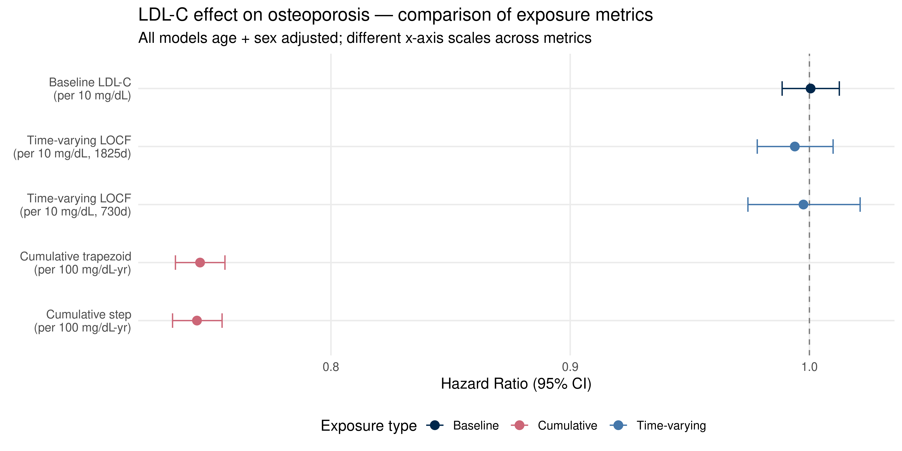

::: {.cell}

:::


## Purpose

This script compares three LDL-C exposure metrics for predicting incident
osteoporosis, using a three-state competing risks framework:

- **Status 1**: Osteoporosis (event of interest)
- **Status 2**: MACE without prior osteoporosis (cardiovascular competing event)
- **Status 3**: Death without prior osteoporosis or MACE (mortality competing event)
- **Status 0**: Censored at last encounter date

Death date is derived as the earliest of EHR-recorded death (`DeID_DeceasedDate`)
and Michigan Death Index (`DeID_MDIDeceasedDate`). Death is used **only** for
competing event coding — follow-up is censored at last encounter to avoid
informative censoring from patients leaving the health system.

Three LDL-C exposure metrics:

1. **Baseline LDL-C** — first measurement (mg/dL), per 10 mg/dL
2. **Time-varying LDL-C** — LOCF, primary 1825d / sensitivity 730d, per 10 mg/dL
3. **Time-averaged LDL-C** — AUC ÷ follow-up years (mg/dL), per 10 mg/dL

**Note on raw cumulative AUC:** Raw AUC (mg/dL × years) is not used as a
primary exposure because it is confounded with follow-up time. Time-averaged
LDL-C (AUC ÷ follow-up years) removes this dependency and is the correct
cumulative metric.

Primary analysis restricted to **≥2 LDL-C measurements**.
Sex included as covariate (interaction p=0.34, non-significant).

---

## Data Input


::: {.cell}

```{.r .cell-code}
# --- Demographic (includes EHR death date) ---
demographic.data <- read_csv("combined_data/DemographicInfo.csv",
                             show_col_types = FALSE) %>%
  mutate(
    DeID_PatientID    = as.character(DeID_PatientID),
    ehr_death_date    = mdy_hm(DeID_DeceasedDate)
  )

# --- Michigan Death Index ---
mdi.data <- read_csv("combined_data/MichiganDeathIndex.csv",
                     show_col_types = FALSE) %>%
  mutate(
    DeID_PatientID = as.character(DeID_PatientID),
    mdi_death_date = mdy_hm(DeID_MDIDeceasedDate)
  ) %>%
  select(DeID_PatientID, mdi_death_date)

# --- Diagnoses ---
diagnosis.data <- read_csv("combined_data/DiagnosesCleaned.csv",
                           show_col_types = FALSE) %>%
  mutate(
    DeID_PatientID     = as.character(DeID_PatientID),
    Osteoporosis.onset = ymd(Osteoporosis.onset),
    MACE.onset         = ymd(MACE.onset)
  )

# --- Labs ---
lab.data <- read_csv("combined_data/LabResultsCleaned.csv",
                     show_col_types = FALSE) %>%
  mutate(
    DeID_PatientID       = as.character(DeID_PatientID),
    DeID_COLLECTION_DATE = mdy_hm(DeID_COLLECTION_DATE)
  )

ldlc.data <- lab.data %>% filter(test_name == "LDL-C")

# --- Encounters ---
encounter.data <- read_csv("combined_data/EncounterAll.csv",
                           show_col_types = FALSE) %>%
  mutate(
    DeID_PatientID = as.character(DeID_PatientID),
    EncounterDate  = mdy_hm(DeID_AdmitDate)
  )

cat("Demographic file: ",
    scales::comma(n_distinct(demographic.data$DeID_PatientID)),
    "patients\n")
```

::: {.cell-output .cell-output-stdout}

```
Demographic file:  201,073 patients
```


:::

```{.r .cell-code}
cat("MDI file:         ",
    scales::comma(n_distinct(mdi.data$DeID_PatientID)),
    "patients with death records\n")
```

::: {.cell-output .cell-output-stdout}

```
MDI file:          17,318 patients with death records
```


:::
:::


---

## Cohort Construction


::: {.cell}

```{.r .cell-code}
# --- Derive unified death date (earliest of EHR and MDI) ---
death_dates <- demographic.data %>%
  select(DeID_PatientID, ehr_death_date) %>%
  left_join(mdi.data, by = "DeID_PatientID") %>%
  mutate(
    death_date = pmin(ehr_death_date, mdi_death_date, na.rm = TRUE)
  )

cat("Death date summary:\n")
```

::: {.cell-output .cell-output-stdout}

```
Death date summary:
```


:::

```{.r .cell-code}
death_dates %>%
  summarise(
    `Patients with EHR death date`  = sum(!is.na(ehr_death_date)),
    `Patients with MDI death date`  = sum(!is.na(mdi_death_date)),
    `Patients with any death date`  = sum(!is.na(death_date)),
    `Additional deaths from MDI`    = sum(!is.na(mdi_death_date) &
                                           is.na(ehr_death_date))
  ) %>%
  pivot_longer(everything(), names_to = "Metric", values_to = "N") %>%
  kable(caption = "Death data coverage — EHR vs Michigan Death Index")
```

::: {.cell-output-display}


Table: Death data coverage — EHR vs Michigan Death Index

|Metric                       |     N|
|:----------------------------|-----:|
|Patients with EHR death date | 14845|
|Patients with MDI death date | 16677|
|Patients with any death date | 17283|
|Additional deaths from MDI   |  2438|


:::

```{.r .cell-code}
# --- Full cohort from demographic base ---
full_cohort <- demographic.data %>%
  select(DeID_PatientID, .data[[SEX_COL]]) %>%
  left_join(death_dates %>% select(DeID_PatientID, death_date),
          by = "DeID_PatientID")%>%
  left_join(
    diagnosis.data %>%
      select(DeID_PatientID, Osteoporosis, Osteoporosis.onset,
             MACE, MACE.onset),
    by = "DeID_PatientID"
  ) %>%
  mutate(
    osteo_flag = if_else(Osteoporosis == TRUE, 1L, 0L, missing = 0L),
    mace_flag  = if_else(MACE == TRUE,         1L, 0L, missing = 0L),
    sex        = as.character(.data[[SEX_COL]])
  )

# --- Clean diagnosis base ---
diag_clean <- full_cohort %>%
  filter(!(osteo_flag == 1L & is.na(Osteoporosis.onset))) %>%
  select(DeID_PatientID, sex, Osteoporosis.onset, osteo_flag,
         MACE.onset, mace_flag, death_date)

# --- Clean LDL-C ---
ldlc_clean <- ldlc.data %>%
  filter(!is.na(DeID_COLLECTION_DATE), !is.na(AgeInYears)) %>%
  filter(value > 0, value <= 400) %>%
  mutate(BMI = if_else(BMI < 10 | BMI > 80, NA_real_, BMI)) %>%
  filter(AgeInYears >= 18) %>%
  group_by(DeID_PatientID, DeID_COLLECTION_DATE) %>%
  summarise(
    LDL_value  = mean(value,      na.rm = TRUE),
    AgeInYears = mean(AgeInYears, na.rm = TRUE),
    BMI        = mean(BMI,        na.rm = TRUE),
    .groups    = "drop"
  ) %>%
  arrange(DeID_PatientID, DeID_COLLECTION_DATE)

# --- Restrict to shared IDs ---
shared_ids  <- intersect(diag_clean$DeID_PatientID, ldlc_clean$DeID_PatientID)
diag_cohort <- diag_clean %>% filter(DeID_PatientID %in% shared_ids)
ldlc_cohort <- ldlc_clean %>% filter(DeID_PatientID %in% shared_ids)

# --- Last encounter for censoring ---
last_encounter <- encounter.data %>%
  filter(!is.na(EncounterDate), DeID_PatientID %in% shared_ids) %>%
  group_by(DeID_PatientID) %>%
  slice_max(EncounterDate, n = 1, with_ties = FALSE) %>%
  ungroup() %>%
  select(DeID_PatientID, last_encounter_date = EncounterDate)

# --- First LDL-C = time zero ---
first_ldlc <- ldlc_cohort %>%
  group_by(DeID_PatientID) %>%
  slice_min(DeID_COLLECTION_DATE, n = 1, with_ties = FALSE) %>%
  ungroup() %>%
  select(DeID_PatientID,
         t0           = DeID_COLLECTION_DATE,
         LDL_baseline = LDL_value,
         Age_baseline = AgeInYears)

# --- Build base cohort ---
# t_end = last encounter (censoring mechanism)
# Competing events coded separately via fg_status
base_cohort <- diag_cohort %>%
  left_join(first_ldlc,     by = "DeID_PatientID") %>%
  left_join(last_encounter, by = "DeID_PatientID") %>%
  mutate(
    # Follow-up ends at event for cases, last encounter for controls/competing
    t_end = case_when(
      osteo_flag == 1             ~ Osteoporosis.onset,
      !is.na(last_encounter_date) ~ last_encounter_date,
      TRUE                        ~ NA_POSIXct_
    ),
    follow_up_days  = as.numeric(difftime(t_end, t0, units = "days")),
    follow_up_years = follow_up_days / 365.25,

    # Three-state competing risks status
    # Priority: osteoporosis > MACE > death > censored
    # Death used for status only — does not extend follow-up
    fg_status = case_when(
      osteo_flag == 1                             ~ 1L,  # event of interest
      mace_flag  == 1 & osteo_flag == 0           ~ 2L,  # CV competing event
      !is.na(death_date) & death_date <= t_end &
        osteo_flag == 0 & mace_flag == 0          ~ 3L,  # death competing event
      TRUE                                        ~ 0L   # censored
    )
  ) %>%
  filter(follow_up_days > 0)

# Competing events summary
base_cohort %>%
  count(fg_status) %>%
  mutate(
    Status = case_when(
      fg_status == 0 ~ "Censored",
      fg_status == 1 ~ "Osteoporosis (event)",
      fg_status == 2 ~ "MACE (competing)",
      fg_status == 3 ~ "Death (competing)"
    ),
    pct = round(100 * n / sum(n), 1)
  ) %>%
  select(Status, N = n, `%` = pct) %>%
  kable(caption = "Three-state competing risks status distribution")
```

::: {.cell-output-display}


Table: Three-state competing risks status distribution

|Status               |     N|    %|
|:--------------------|-----:|----:|
|Censored             | 14090| 71.2|
|Osteoporosis (event) |  1891|  9.6|
|MACE (competing)     |  2862| 14.5|
|Death (competing)    |   935|  4.7|


:::

```{.r .cell-code}
tibble(
  Metric = c("Patients after exclusions",
             "Osteoporosis cases (status=1)",
             "MACE competing (status=2)",
             "Death competing (status=3)",
             "Censored (status=0)",
             "Median follow-up (years)"),
  Value  = c(nrow(base_cohort),
             sum(base_cohort$fg_status == 1),
             sum(base_cohort$fg_status == 2),
             sum(base_cohort$fg_status == 3),
             sum(base_cohort$fg_status == 0),
             round(median(base_cohort$follow_up_years), 1))
) %>% kable(caption = "Base cohort summary")
```

::: {.cell-output-display}


Table: Base cohort summary

|Metric                        |   Value|
|:-----------------------------|-------:|
|Patients after exclusions     | 19778.0|
|Osteoporosis cases (status=1) |  1891.0|
|MACE competing (status=2)     |  2862.0|
|Death competing (status=3)    |   935.0|
|Censored (status=0)           | 14090.0|
|Median follow-up (years)      |     8.2|


:::
:::


---

## LDL-C Exposure Computation


::: {.cell}

```{.r .cell-code}
# LDL-C measurements with time relative to t0
ldlc_with_time <- ldlc_cohort %>%
  filter(DeID_PatientID %in% base_cohort$DeID_PatientID) %>%
  left_join(base_cohort %>% select(DeID_PatientID, t0, t_end),
            by = "DeID_PatientID") %>%
  filter(DeID_COLLECTION_DATE >= t0,
         DeID_COLLECTION_DATE <= t_end) %>%
  mutate(
    t_years = as.numeric(difftime(DeID_COLLECTION_DATE, t0,
                                  units = "days")) / 365.25
  ) %>%
  arrange(DeID_PatientID, t_years)

# --- Trapezoid AUC ---
auc_trapezoid <- ldlc_with_time %>%
  group_by(DeID_PatientID) %>%
  mutate(
    t_next      = lead(t_years),
    ldl_next    = lead(LDL_value),
    t_end_yr    = as.numeric(difftime(first(t_end), first(t0),
                                      units = "days")) / 365.25,
    interval_area = case_when(
      !is.na(t_next) ~ (LDL_value + ldl_next) / 2 * (t_next - t_years),
      TRUE            ~ LDL_value * (t_end_yr - t_years)
    )
  ) %>%
  summarise(
    cumLDL_trap    = sum(interval_area, na.rm = TRUE),
    n_measurements = n(),
    fu_years       = first(t_end_yr),
    .groups        = "drop"
  ) %>%
  mutate(meanLDL_trap = cumLDL_trap / fu_years)

# --- Step / LOCF AUC ---
auc_step <- ldlc_with_time %>%
  group_by(DeID_PatientID) %>%
  mutate(
    t_next   = lead(t_years),
    t_end_yr = as.numeric(difftime(first(t_end), first(t0),
                                   units = "days")) / 365.25,
    duration = if_else(!is.na(t_next),
                       t_next - t_years,
                       t_end_yr - t_years)
  ) %>%
  summarise(
    cumLDL_step = sum(LDL_value * duration, na.rm = TRUE),
    fu_years    = first(t_end_yr),
    .groups     = "drop"
  ) %>%
  mutate(meanLDL_step = cumLDL_step / fu_years)

# --- Join to base cohort and create all scaled variables ---
base_cohort <- base_cohort %>%
  left_join(auc_trapezoid %>%
              select(DeID_PatientID, cumLDL_trap, meanLDL_trap,
                     n_measurements),
            by = "DeID_PatientID") %>%
  left_join(auc_step %>%
              select(DeID_PatientID, cumLDL_step, meanLDL_step),
            by = "DeID_PatientID") %>%
  mutate(
    sex             = as.factor(sex),
    # All scaled per LDL_SCALE mg/dL
    LDL_baseline_s  = LDL_baseline / LDL_SCALE,
    meanLDL_trap_s  = meanLDL_trap / LDL_SCALE,
    meanLDL_step_s  = meanLDL_step / LDL_SCALE
  )

# Primary analytic cohort: 2+ measurements
cohort_2plus <- base_cohort %>% filter(n_measurements >= 2)

# Competing events in 2+ cohort
cohort_2plus %>%
  count(fg_status) %>%
  mutate(
    Status = case_when(
      fg_status == 0 ~ "Censored",
      fg_status == 1 ~ "Osteoporosis (event)",
      fg_status == 2 ~ "MACE (competing)",
      fg_status == 3 ~ "Death (competing)"
    ),
    pct = round(100 * n / sum(n), 1)
  ) %>%
  select(Status, N = n, `%` = pct) %>%
  kable(caption = "Competing risks status (≥2 measurements cohort)")
```

::: {.cell-output-display}


Table: Competing risks status (≥2 measurements cohort)

|Status               |    N|    %|
|:--------------------|----:|----:|
|Censored             | 3805| 66.9|
|Osteoporosis (event) |  497|  8.7|
|MACE (competing)     | 1094| 19.2|
|Death (competing)    |  290|  5.1|


:::

```{.r .cell-code}
# Exposure summary
cohort_2plus %>%
  summarise(
    `N patients`                       = n(),
    `Osteoporosis events`              = sum(fg_status == 1),
    `Median follow-up (years)`         = round(median(follow_up_years), 1),
    `Median baseline LDL-C (mg/dL)`   = round(median(LDL_baseline,  na.rm=TRUE), 1),
    `Median time-avg LDL-C (mg/dL)`   = round(median(meanLDL_trap,  na.rm=TRUE), 1),
    `Trapezoid-step correlation`       = round(cor(meanLDL_trap, meanLDL_step,
                                                    use = "complete.obs"), 3)
  ) %>%
  pivot_longer(everything(), names_to = "Metric", values_to = "Value") %>%
  kable(caption = "Exposure summary (≥2 measurements cohort)")
```

::: {.cell-output-display}


Table: Exposure summary (≥2 measurements cohort)

|Metric                        |    Value|
|:-----------------------------|--------:|
|N patients                    | 5686.000|
|Osteoporosis events           |  497.000|
|Median follow-up (years)      |   12.000|
|Median baseline LDL-C (mg/dL) |  105.000|
|Median time-avg LDL-C (mg/dL) |  101.900|
|Trapezoid-step correlation    |    0.981|


:::

```{.r .cell-code}
# Distribution plot
cohort_2plus %>%
  select(DeID_PatientID, fg_status,
         `Baseline LDL-C` = LDL_baseline,
         `Time-avg LDL-C\n(trapezoid)` = meanLDL_trap) %>%
  pivot_longer(c(`Baseline LDL-C`, `Time-avg LDL-C\n(trapezoid)`),
               names_to = "Metric", values_to = "Value") %>%
  filter(!is.na(Value),
         Value > quantile(Value, 0.01, na.rm=TRUE),
         Value < quantile(Value, 0.99, na.rm=TRUE)) %>%
  mutate(Status = if_else(fg_status == 1, "Osteoporosis", "No osteoporosis")) %>%
  ggplot(aes(x = Value, fill = Status)) +
  geom_histogram(binwidth = 5, alpha = 0.6, position = "identity") +
  scale_fill_manual(values = color_scheme) +
  facet_wrap(~Metric, scales = "free") +
  labs(title = "LDL-C exposure distribution by osteoporosis status",
       x = "LDL-C (mg/dL)", y = "Count") +
  theme_classic() +
  theme(legend.position = "bottom")
```

::: {.cell-output-display}
{width=2100}
:::
:::


---

## Cox Models (Standard Survival Analysis)

Note: Cox models do not account for competing risks. Results shown for
comparison with Fine-Gray models below.


::: {.cell}

```{.r .cell-code}
extract_hr <- function(fit, label, term_name) {
  broom::tidy(fit, exponentiate = TRUE, conf.int = TRUE) %>%
    filter(term == term_name) %>%
    mutate(
      Model     = label,
      HR        = round(estimate, 4),
      `95% CI`  = paste0("(", round(conf.low,  4), "\u2013",
                              round(conf.high, 4), ")"),
      `p-value` = format.pval(p.value, digits = 3, eps = 0.001),
      `N obs`   = fit$n,
      `N events`= fit$nevent
    ) %>%
    select(Model, HR, `95% CI`, `p-value`, `N obs`, `N events`)
}

check_ph <- function(fit, label) {
  ph  <- cox.zph(fit)
  row <- ph$table[1, ]
  cat(sprintf("%s — chi-sq=%.3f, p=%.4f %s\n",
              label, row["chisq"], row["p"],
              if_else(row["p"] < 0.05, "⚠ PH violated", "✓ PH holds")))
  invisible(ph)
}
```
:::


### Baseline LDL-C — Cox


::: {.cell}

```{.r .cell-code}
fit_cox_base_all <- coxph(
  Surv(follow_up_days, osteo_flag) ~ LDL_baseline_s + Age_baseline + sex,
  data = base_cohort, ties = "efron"
)

fit_cox_base_2plus <- coxph(
  Surv(follow_up_days, osteo_flag) ~ LDL_baseline_s + Age_baseline + sex,
  data = cohort_2plus, ties = "efron"
)

bind_rows(
  extract_hr(fit_cox_base_all,   "Cox — baseline LDL-C, all patients",    "LDL_baseline_s"),
  extract_hr(fit_cox_base_2plus, "Cox — baseline LDL-C, 2+ measurements", "LDL_baseline_s")
) %>% kable(caption = paste0(
  "Cox — baseline LDL-C (per ", LDL_SCALE, " mg/dL)"))
```

::: {.cell-output-display}


Table: Cox — baseline LDL-C (per 10 mg/dL)

|Model                                 |     HR|95% CI          |p-value | N obs| N events|
|:-------------------------------------|------:|:---------------|:-------|-----:|--------:|
|Cox — baseline LDL-C, all patients    | 1.0005|(0.9886–1.0125) |0.935   | 19778|     1891|
|Cox — baseline LDL-C, 2+ measurements | 0.9945|(0.9729–1.0166) |0.624   |  5686|      497|


:::

```{.r .cell-code}
check_ph(fit_cox_base_all,   "Cox baseline all")
```

::: {.cell-output .cell-output-stdout}

```
Cox baseline all — chi-sq=9.261, p=0.0023 ⚠ PH violated
```


:::

```{.r .cell-code}
check_ph(fit_cox_base_2plus, "Cox baseline 2+")
```

::: {.cell-output .cell-output-stdout}

```
Cox baseline 2+ — chi-sq=0.452, p=0.5013 ✓ PH holds
```


:::
:::


### Time-Varying LDL-C — Cox (LOCF)


::: {.cell}

```{.r .cell-code}
ldlc_intervals <- ldlc_cohort %>%
  filter(DeID_PatientID %in% cohort_2plus$DeID_PatientID) %>%
  left_join(cohort_2plus %>% select(DeID_PatientID, t0, t_end),
            by = "DeID_PatientID") %>%
  filter(DeID_COLLECTION_DATE <= t_end) %>%
  mutate(
    t_meas     = as.numeric(difftime(DeID_COLLECTION_DATE, t0,
                                     units = "days")),
    LDL_value  = as.numeric(LDL_value),
    AgeInYears = as.numeric(AgeInYears)
  ) %>%
  filter(t_meas >= 0) %>%
  arrange(DeID_PatientID, t_meas)

surv_base_tv <- cohort_2plus %>%
  mutate(
    DeID_PatientID = as.character(DeID_PatientID),
    tstart_days    = 0,
    tstop_days     = as.numeric(follow_up_days)
  )

surv.data <- tmerge(
  data1 = surv_base_tv,
  data2 = surv_base_tv,
  id    = DeID_PatientID,
  Osteoporosis = event(tstop_days, osteo_flag)
)

surv.data <- tmerge(
  data1 = surv.data,
  data2 = ldlc_intervals %>%
    mutate(DeID_PatientID = as.character(DeID_PatientID)),
  id    = DeID_PatientID,
  LDL_value  = tdc(t_meas, LDL_value),
  AgeInYears = tdc(t_meas, AgeInYears)
)

apply_locf_cap <- function(surv_df, meas_df, cap_days) {
  staleness <- surv_df %>%
    select(DeID_PatientID, tstart, tstop, Osteoporosis) %>%
    left_join(meas_df, by = "DeID_PatientID",
              relationship = "many-to-many") %>%
    filter(is.na(t_meas) | t_meas <= tstart) %>%
    group_by(DeID_PatientID, tstart, tstop) %>%
    summarise(
      last_meas_t = suppressWarnings(max(t_meas, na.rm = TRUE)),
      .groups     = "drop"
    ) %>%
    mutate(
      last_meas_t      = if_else(is.infinite(last_meas_t),
                                 NA_real_, last_meas_t),
      stale_at         = if_else(!is.na(last_meas_t),
                                 last_meas_t + cap_days, NA_real_),
      days_since_start = tstart - last_meas_t
    )

  df <- surv_df %>%
    left_join(staleness, by = c("DeID_PatientID", "tstart", "tstop"))

  already_stale <- df %>%
    filter(!is.na(days_since_start) & days_since_start > cap_days) %>%
    mutate(LDL_value = NA_real_) %>%
    select(-last_meas_t, -stale_at, -days_since_start)

  needs_split <- df %>%
    filter(!is.na(stale_at) & stale_at > tstart & stale_at < tstop &
             (is.na(days_since_start) | days_since_start <= 0))

  fully_valid <- df %>%
    filter(
      (is.na(days_since_start) | days_since_start <= 0) &
      (is.na(stale_at)         | stale_at >= tstop) &
      (is.na(days_since_start) | days_since_start <= cap_days)
    ) %>%
    select(-last_meas_t, -stale_at, -days_since_start)

  split_valid <- needs_split %>%
    mutate(tstop = stale_at, Osteoporosis = 0L) %>%
    select(-last_meas_t, -stale_at, -days_since_start)

  split_stale <- needs_split %>%
    mutate(tstart = stale_at, LDL_value = NA_real_) %>%
    select(-last_meas_t, -stale_at, -days_since_start)

  bind_rows(fully_valid, already_stale, split_valid, split_stale) %>%
    arrange(DeID_PatientID, tstart) %>%
    filter(tstop > tstart)
}

meas_times <- ldlc_intervals %>%
  select(DeID_PatientID, t_meas) %>%
  distinct()

surv.data.1825 <- apply_locf_cap(surv.data, meas_times, cap_days = 1825) %>%
  mutate(LDL_per_s = LDL_value / LDL_SCALE)

surv.data.730 <- apply_locf_cap(surv.data, meas_times, cap_days = 730) %>%
  mutate(LDL_per_s = LDL_value / LDL_SCALE)

# Verify cap working
map_dfr(
  list(`1825d (primary)` = surv.data.1825,
       `730d (sensitivity)` = surv.data.730),
  ~tibble(Rows      = nrow(.x),
          Events    = sum(.x$Osteoporosis),
          `Valid LDL` = sum(!is.na(.x$LDL_value)),
          `NA LDL`  = sum(is.na(.x$LDL_value)),
          `% NA`    = round(100 * mean(is.na(.x$LDL_value)), 1)),
  .id = "LOCF window"
) %>% kable(caption = "LOCF cap verification")
```

::: {.cell-output-display}


Table: LOCF cap verification

|LOCF window        |  Rows| Events| Valid LDL| NA LDL| % NA|
|:------------------|-----:|------:|---------:|------:|----:|
|1825d (primary)    | 24847|    497|     20273|   4574| 18.4|
|730d (sensitivity) | 30139|    497|     20273|   9866| 32.7|


:::

```{.r .cell-code}
fit_cox_tv_1825 <- coxph(
  Surv(tstart, tstop, Osteoporosis) ~ LDL_per_s + AgeInYears + sex,
  data = surv.data.1825, ties = "efron", id = DeID_PatientID
)

fit_cox_tv_730 <- coxph(
  Surv(tstart, tstop, Osteoporosis) ~ LDL_per_s + AgeInYears + sex,
  data = surv.data.730, ties = "efron", id = DeID_PatientID
)

bind_rows(
  extract_hr(fit_cox_tv_1825, "Cox — LOCF 1825d (primary)",    "LDL_per_s"),
  extract_hr(fit_cox_tv_730,  "Cox — LOCF 730d (sensitivity)", "LDL_per_s")
) %>% kable(caption = paste0(
  "Cox — time-varying LDL-C (per ", LDL_SCALE, " mg/dL, LOCF, 2+ measurements)"))
```

::: {.cell-output-display}


Table: Cox — time-varying LDL-C (per 10 mg/dL, LOCF, 2+ measurements)

|Model                         |     HR|95% CI          |p-value | N obs| N events|
|:-----------------------------|------:|:---------------|:-------|-----:|--------:|
|Cox — LOCF 1825d (primary)    | 1.0011|(0.9746–1.0283) |0.937   | 20273|      326|
|Cox — LOCF 730d (sensitivity) | 0.9986|(0.9626–1.036)  |0.94    | 20273|      174|


:::

```{.r .cell-code}
check_ph(fit_cox_tv_1825, "TV LOCF 1825d")
```

::: {.cell-output .cell-output-stdout}

```
TV LOCF 1825d — chi-sq=0.000, p=0.9874 ✓ PH holds
```


:::

```{.r .cell-code}
check_ph(fit_cox_tv_730,  "TV LOCF 730d")
```

::: {.cell-output .cell-output-stdout}

```
TV LOCF 730d — chi-sq=0.040, p=0.8418 ✓ PH holds
```


:::
:::


### Time-Averaged LDL-C — Cox


::: {.cell}

```{.r .cell-code}
fit_cox_avg_all <- coxph(
  Surv(follow_up_days, osteo_flag) ~ meanLDL_trap_s + Age_baseline + sex,
  data = base_cohort, ties = "efron"
)

fit_cox_avg_2plus <- coxph(
  Surv(follow_up_days, osteo_flag) ~ meanLDL_trap_s + Age_baseline + sex,
  data = cohort_2plus, ties = "efron"
)

fit_cox_avg_step <- coxph(
  Surv(follow_up_days, osteo_flag) ~ meanLDL_step_s + Age_baseline + sex,
  data = cohort_2plus, ties = "efron"
)

bind_rows(
  extract_hr(fit_cox_avg_all,   "Cox — time-avg trapezoid, all",    "meanLDL_trap_s"),
  extract_hr(fit_cox_avg_2plus, "Cox — time-avg trapezoid, 2+ meas","meanLDL_trap_s"),
  extract_hr(fit_cox_avg_step,  "Cox — time-avg step/LOCF, 2+ meas","meanLDL_step_s")
) %>% kable(caption = paste0(
  "Cox — time-averaged LDL-C (per ", LDL_SCALE, " mg/dL)"))
```

::: {.cell-output-display}


Table: Cox — time-averaged LDL-C (per 10 mg/dL)

|Model                             |     HR|95% CI          |p-value | N obs| N events|
|:---------------------------------|------:|:---------------|:-------|-----:|--------:|
|Cox — time-avg trapezoid, all     | 1.0036|(0.9914–1.016)  |0.566   | 19778|     1891|
|Cox — time-avg trapezoid, 2+ meas | 1.0000|(0.9764–1.0243) |0.997   |  5686|      497|
|Cox — time-avg step/LOCF, 2+ meas | 1.0003|(0.9762–1.0249) |0.982   |  5686|      497|


:::

```{.r .cell-code}
check_ph(fit_cox_avg_all,   "Time-avg all")
```

::: {.cell-output .cell-output-stdout}

```
Time-avg all — chi-sq=6.737, p=0.0094 ⚠ PH violated
```


:::

```{.r .cell-code}
check_ph(fit_cox_avg_2plus, "Time-avg 2+")
```

::: {.cell-output .cell-output-stdout}

```
Time-avg 2+ — chi-sq=0.179, p=0.6725 ✓ PH holds
```


:::
:::


---

## Fine-Gray Competing Risks Models (Primary Analysis)

Three-state competing risks: osteoporosis (1), MACE (2), death (3).
`cmprsk::crr()` fits the subdistribution hazard for osteoporosis (cause 1).


::: {.cell}

```{.r .cell-code}
# Helper to format crr output cleanly
format_fg <- function(fg_fit, term_labels) {
  s <- summary(fg_fit)
  tibble(
    Term          = term_labels,
    `Sub-HR`      = round(exp(s$coef[, "coef"]), 4),
    `95% CI low`  = round(exp(s$coef[, "coef"] -
                               1.96 * s$coef[, "se(coef)"]), 4),
    `95% CI high` = round(exp(s$coef[, "coef"] +
                               1.96 * s$coef[, "se(coef)"]), 4),
    `p-value`     = format.pval(s$coef[, "p-value"],
                                digits = 3, eps = 0.001)
  )
}
```
:::


### Baseline LDL-C — Fine-Gray


::: {.cell}

```{.r .cell-code}
fg_base_data <- cohort_2plus %>%
  filter(!is.na(LDL_baseline_s), !is.na(Age_baseline))

fg_base <- with(fg_base_data,
                crr(ftime    = follow_up_days,
                    fstatus  = fg_status,
                    cov1     = cbind(LDL_baseline_s, Age_baseline),
                    failcode = 1, cencode = 0))

format_fg(fg_base, c(paste0("LDL_baseline (per ", LDL_SCALE, " mg/dL)"),
                      "Age at baseline")) %>%
  kable(caption = paste0(
    "Fine-Gray — baseline LDL-C (per ", LDL_SCALE, " mg/dL); ",
    "competing: MACE + death; 2+ measurements"))
```

::: {.cell-output-display}


Table: Fine-Gray — baseline LDL-C (per 10 mg/dL); competing: MACE + death; 2+ measurements

|Term                        | Sub-HR| 95% CI low| 95% CI high|p-value |
|:---------------------------|------:|----------:|-----------:|:-------|
|LDL_baseline (per 10 mg/dL) | 1.0359|     1.0132|      1.0591|0.0018  |
|Age at baseline             | 1.0584|     1.0512|      1.0655|<0.001  |


:::
:::


### Time-Averaged LDL-C — Fine-Gray (Primary)


::: {.cell}

```{.r .cell-code}
fg_avg_data <- cohort_2plus %>%
  filter(!is.na(meanLDL_trap_s), !is.na(Age_baseline))

fg_avg_trap <- with(fg_avg_data,
                    crr(ftime    = follow_up_days,
                        fstatus  = fg_status,
                        cov1     = cbind(meanLDL_trap_s, Age_baseline),
                        failcode = 1, cencode = 0))

fg_avg_step <- with(fg_avg_data %>%
                      filter(!is.na(meanLDL_step_s)),
                    crr(ftime    = follow_up_days,
                        fstatus  = fg_status,
                        cov1     = cbind(meanLDL_step_s, Age_baseline),
                        failcode = 1, cencode = 0))

format_fg(fg_avg_trap, c(paste0("Time-avg LDL-C trapezoid (per ", LDL_SCALE, " mg/dL)"),
                          "Age at baseline")) %>%
  kable(caption = paste0(
    "Fine-Gray — time-averaged LDL-C trapezoid (per ", LDL_SCALE, " mg/dL); ",
    "competing: MACE + death; 2+ measurements"))
```

::: {.cell-output-display}


Table: Fine-Gray — time-averaged LDL-C trapezoid (per 10 mg/dL); competing: MACE + death; 2+ measurements

|Term                                    | Sub-HR| 95% CI low| 95% CI high|p-value |
|:---------------------------------------|------:|----------:|-----------:|:-------|
|Time-avg LDL-C trapezoid (per 10 mg/dL) | 1.0486|     1.0240|      1.0737|<0.001  |
|Age at baseline                         | 1.0590|     1.0519|      1.0661|<0.001  |


:::

```{.r .cell-code}
format_fg(fg_avg_step, c(paste0("Time-avg LDL-C step/LOCF (per ", LDL_SCALE, " mg/dL)"),
                          "Age at baseline")) %>%
  kable(caption = paste0(
    "Fine-Gray — time-averaged LDL-C step/LOCF (per ", LDL_SCALE, " mg/dL); ",
    "competing: MACE + death; 2+ measurements"))
```

::: {.cell-output-display}


Table: Fine-Gray — time-averaged LDL-C step/LOCF (per 10 mg/dL); competing: MACE + death; 2+ measurements

|Term                                    | Sub-HR| 95% CI low| 95% CI high|p-value |
|:---------------------------------------|------:|----------:|-----------:|:-------|
|Time-avg LDL-C step/LOCF (per 10 mg/dL) | 1.0502|     1.0246|      1.0764|<0.001  |
|Age at baseline                         | 1.0591|     1.0519|      1.0662|<0.001  |


:::
:::


### Sensitivity — Two vs Three Competing Events

To quantify the contribution of adding death as a competing event, compare
the two-state model (MACE only) against the three-state model (MACE + death).


::: {.cell}

```{.r .cell-code}
# Two-state: MACE only (status 2), death not treated as competing
fg_data_2state <- cohort_2plus %>%
  filter(!is.na(meanLDL_trap_s), !is.na(Age_baseline)) %>%
  mutate(
    fg_status_2state = case_when(
      fg_status == 1 ~ 1L,   # osteoporosis
      fg_status == 2 ~ 2L,   # MACE
      TRUE           ~ 0L    # death and censored both treated as censored
    )
  )

fg_avg_2state <- with(fg_data_2state,
                      crr(ftime    = follow_up_days,
                          fstatus  = fg_status_2state,
                          cov1     = cbind(meanLDL_trap_s, Age_baseline),
                          failcode = 1, cencode = 0))

# Compare two-state vs three-state
bind_rows(
  format_fg(fg_avg_2state, c(paste0("Time-avg LDL-C (per ", LDL_SCALE, " mg/dL)"),
                               "Age")) %>%
    slice(1) %>%
    mutate(Model = "Two-state: MACE competing only"),
  format_fg(fg_avg_trap, c(paste0("Time-avg LDL-C (per ", LDL_SCALE, " mg/dL)"),
                             "Age")) %>%
    slice(1) %>%
    mutate(Model = "Three-state: MACE + death competing")
) %>%
  select(Model, everything(), -Term) %>%
  kable(caption = paste0(
    "Sensitivity — two-state vs three-state competing risks model; ",
    "time-averaged LDL-C per ", LDL_SCALE, " mg/dL"))
```

::: {.cell-output-display}


Table: Sensitivity — two-state vs three-state competing risks model; time-averaged LDL-C per 10 mg/dL

|Model                               | Sub-HR| 95% CI low| 95% CI high|p-value |
|:-----------------------------------|------:|----------:|-----------:|:-------|
|Two-state: MACE competing only      | 1.0475|     1.0229|      1.0726|<0.001  |
|Three-state: MACE + death competing | 1.0486|     1.0240|      1.0737|<0.001  |


:::
:::


---

## Summary — All Models


::: {.cell}

```{.r .cell-code}
# Extract Fine-Gray results manually for summary table
extract_fg_row <- function(fg_fit, label, term_idx = 1) {
  s <- summary(fg_fit)
  tibble(
    Model     = label,
    HR        = round(exp(s$coef[term_idx, "coef"]), 4),
    CI_low    = round(exp(s$coef[term_idx, "coef"] -
                           1.96 * s$coef[term_idx, "se(coef)"]), 4),
    CI_high   = round(exp(s$coef[term_idx, "coef"] +
                           1.96 * s$coef[term_idx, "se(coef)"]), 4),
    `p-value` = format.pval(s$coef[term_idx, "p-value"],
                            digits = 3, eps = 0.001),
    `N obs`   = as.integer(fg_fit$n),
    `N events`= as.integer(sum(fg_fit$fstatus == fg_fit$failcode)),
    `95% CI`  = paste0("(", CI_low, "\u2013", CI_high, ")")
  ) %>%
    select(Model, HR, `95% CI`, `p-value`, `N obs`, `N events`)
}

bind_rows(
  # Cox models
  extract_hr(fit_cox_base_all,   "Cox — baseline LDL-C (all)",      "LDL_baseline_s"),
  extract_hr(fit_cox_base_2plus, "Cox — baseline LDL-C (2+ meas)",  "LDL_baseline_s"),
  extract_hr(fit_cox_tv_1825,    "Cox — LOCF 1825d (2+ meas)",      "LDL_per_s"),
  extract_hr(fit_cox_tv_730,     "Cox — LOCF 730d (2+ meas)",       "LDL_per_s"),
  extract_hr(fit_cox_avg_2plus,  "Cox — time-avg trapezoid (2+ meas)","meanLDL_trap_s"),
  extract_hr(fit_cox_avg_step,   "Cox — time-avg step/LOCF (2+ meas)","meanLDL_step_s"),
  # Fine-Gray models
  extract_fg_row(fg_base,      "Fine-Gray — baseline LDL-C (2+ meas)"),
  extract_fg_row(fg_avg_trap,  "Fine-Gray — time-avg trapezoid (2+ meas)"),
  extract_fg_row(fg_avg_step,  "Fine-Gray — time-avg step/LOCF (2+ meas)"),
  extract_fg_row(fg_avg_2state,"Fine-Gray — time-avg, MACE competing only (2+ meas)")
) %>%
  kable(caption = paste0(
    "All models — LDL-C effect on osteoporosis per ", LDL_SCALE,
    " mg/dL (age + sex adjusted)"))
```

::: {.cell-output-display}


Table: All models — LDL-C effect on osteoporosis per 10 mg/dL (age + sex adjusted)

|Model                                               |     HR|95% CI          |p-value | N obs| N events|
|:---------------------------------------------------|------:|:---------------|:-------|-----:|--------:|
|Cox — baseline LDL-C (all)                          | 1.0005|(0.9886–1.0125) |0.935   | 19778|     1891|
|Cox — baseline LDL-C (2+ meas)                      | 0.9945|(0.9729–1.0166) |0.624   |  5686|      497|
|Cox — LOCF 1825d (2+ meas)                          | 1.0011|(0.9746–1.0283) |0.937   | 20273|      326|
|Cox — LOCF 730d (2+ meas)                           | 0.9986|(0.9626–1.036)  |0.94    | 20273|      174|
|Cox — time-avg trapezoid (2+ meas)                  | 1.0000|(0.9764–1.0243) |0.997   |  5686|      497|
|Cox — time-avg step/LOCF (2+ meas)                  | 1.0003|(0.9762–1.0249) |0.982   |  5686|      497|
|Fine-Gray — baseline LDL-C (2+ meas)                | 1.0359|(1.0132–1.0591) |0.0018  |  5686|        0|
|Fine-Gray — time-avg trapezoid (2+ meas)            | 1.0486|(1.024–1.0737)  |<0.001  |  5686|        0|
|Fine-Gray — time-avg step/LOCF (2+ meas)            | 1.0502|(1.0246–1.0764) |<0.001  |  5686|        0|
|Fine-Gray — time-avg, MACE competing only (2+ meas) | 1.0475|(1.0229–1.0726) |<0.001  |  5686|        0|


:::
:::


---

## Forest Plot


::: {.cell}

```{.r .cell-code}
forest_data <- bind_rows(
  extract_hr(fit_cox_base_2plus, "Cox\nBaseline LDL-C",        "LDL_baseline_s"),
  extract_hr(fit_cox_tv_1825,    "Cox\nLOCF 1825d",            "LDL_per_s"),
  extract_hr(fit_cox_tv_730,     "Cox\nLOCF 730d",             "LDL_per_s"),
  extract_hr(fit_cox_avg_2plus,  "Cox\nTime-avg trapezoid",    "meanLDL_trap_s"),
  extract_hr(fit_cox_avg_step,   "Cox\nTime-avg step/LOCF",    "meanLDL_step_s"),
  extract_fg_row(fg_base,        "Fine-Gray (3-state)\nBaseline LDL-C"),
  extract_fg_row(fg_avg_trap,    "Fine-Gray (3-state)\nTime-avg trapezoid"),
  extract_fg_row(fg_avg_step,    "Fine-Gray (3-state)\nTime-avg step/LOCF"),
  extract_fg_row(fg_avg_2state,  "Fine-Gray (2-state)\nTime-avg trapezoid")
) %>%
  mutate(
    CI_low  = as.numeric(str_extract(`95% CI`, "(?<=\\().*(?=\u2013)")),
    CI_high = as.numeric(str_extract(`95% CI`, "(?<=\u2013).*(?=\\))")),
    model_type = case_when(
      str_detect(Model, "Cox")             ~ "Cox (no competing risks)",
      str_detect(Model, "3-state")         ~ "Fine-Gray (3-state: MACE + death)",
      str_detect(Model, "2-state")         ~ "Fine-Gray (2-state: MACE only)"
    ),
    Model = factor(Model, levels = rev(Model))
  )

ggplot(forest_data,
       aes(x = HR, xmin = CI_low, xmax = CI_high,
           y = Model, colour = model_type)) +
  geom_vline(xintercept = 1, linetype = "dashed", colour = "grey50") +
  geom_errorbarh(height = 0.3) +
  geom_point(size = 3) +
  geom_text(aes(label = sprintf("%.4f (%.4f\u2013%.4f)",
                                HR, CI_low, CI_high)),
            hjust = -0.08, size = 2.6, colour = "grey30") +
  scale_colour_manual(values = c(
    "Cox (no competing risks)"          = "#00274c",
    "Fine-Gray (3-state: MACE + death)" = "#CC6677",
    "Fine-Gray (2-state: MACE only)"    = "#4477AA"
  )) +
  labs(
    title    = "LDL-C effect on osteoporosis — model comparison",
    subtitle = paste0("All models: age + sex adjusted, ≥2 LDL-C measurements, per ",
                      LDL_SCALE, " mg/dL"),
    x        = paste0("HR or Sub-HR per ", LDL_SCALE, " mg/dL (95% CI)"),
    y        = NULL,
    colour   = "Model type"
  ) +
  theme_minimal(base_size = 11) +
  theme(panel.grid.minor = element_blank(),
        legend.position  = "bottom",
        plot.title       = element_text(face = "bold"))
```

::: {.cell-output-display}
{width=3300}
:::
:::


---

## Session Information


::: {.cell}

```{.r .cell-code}
sessionInfo()
```

::: {.cell-output .cell-output-stdout}

```
R version 4.4.3 (2025-02-28)
Platform: x86_64-pc-linux-gnu
Running under: Red Hat Enterprise Linux 8.10 (Ootpa)

Matrix products: default
BLAS:   /sw/pkgs/arc/stacks/gcc/13.2.0/R/4.4.3/lib64/R/lib/libRblas.so 
LAPACK: /sw/pkgs/arc/stacks/gcc/13.2.0/R/4.4.3/lib64/R/lib/libRlapack.so;  LAPACK version 3.12.0

locale:
 [1] LC_CTYPE=en_US.UTF-8       LC_NUMERIC=C              
 [3] LC_TIME=en_US.UTF-8        LC_COLLATE=en_US.UTF-8    
 [5] LC_MONETARY=en_US.UTF-8    LC_MESSAGES=en_US.UTF-8   
 [7] LC_PAPER=en_US.UTF-8       LC_NAME=C                 
 [9] LC_ADDRESS=C               LC_TELEPHONE=C            
[11] LC_MEASUREMENT=en_US.UTF-8 LC_IDENTIFICATION=C       

time zone: America/Detroit
tzcode source: system (glibc)

attached base packages:
[1] stats     graphics  grDevices utils     datasets  methods   base     

other attached packages:
 [1] cmprsk_2.2-12   survminer_0.4.9 ggpubr_0.6.0    survival_3.7-0 
 [5] broom_1.0.12    knitr_1.48      lubridate_1.9.3 forcats_1.0.0  
 [9] stringr_1.5.1   dplyr_1.2.0     purrr_1.0.2     readr_2.1.5    
[13] tidyr_1.3.1     tibble_3.2.1    ggplot2_3.5.1   tidyverse_2.0.0

loaded via a namespace (and not attached):
 [1] gtable_0.3.6      xfun_0.45         htmlwidgets_1.6.4 rstatix_0.7.2    
 [5] lattice_0.22-6    tzdb_0.4.0        vctrs_0.7.1       tools_4.4.3      
 [9] generics_0.1.3    parallel_4.4.3    fansi_1.0.6       pkgconfig_2.0.3  
[13] Matrix_1.7-2      data.table_1.17.8 lifecycle_1.0.5   farver_2.1.2     
[17] compiler_4.4.3    munsell_0.5.1     carData_3.0-5     htmltools_0.5.8.1
[21] yaml_2.3.9        Formula_1.2-5     crayon_1.5.3      pillar_1.9.0     
[25] car_3.1-3         abind_1.4-8       km.ci_0.5-6       tidyselect_1.2.1 
[29] digest_0.6.36     stringi_1.8.4     labeling_0.4.3    splines_4.4.3    
[33] fastmap_1.2.0     grid_4.4.3        colorspace_2.1-0  cli_3.6.3        
[37] magrittr_2.0.3    utf8_1.2.4        withr_3.0.0       scales_1.3.0     
[41] backports_1.5.0   bit64_4.0.5       timechange_0.3.0  rmarkdown_2.27   
[45] bit_4.0.5         gridExtra_2.3     ggsignif_0.6.4    zoo_1.8-12       
[49] hms_1.1.3         evaluate_0.24.0   KMsurv_0.1-5      survMisc_0.5.6   
[53] rlang_1.1.7       xtable_1.8-4      glue_1.8.0        vroom_1.6.5      
[57] rstudioapi_0.16.0 jsonlite_1.8.8    R6_2.5.1         
```


:::
:::
