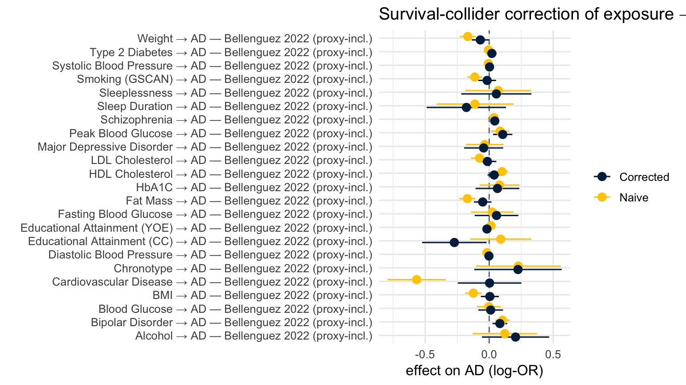

## Purpose

Step 1 (`exposure_survival_screen.qmd`) established two things: (i) AD shortens
survival, so the survival collider `S` is real, and (ii) for the exposures
flagged there, the `E → S` arm is present — i.e. selecting on survival induces a
spurious `G_exposure`–AD association, in a direction given by
`sign(b_E · b_AD)`. This notebook does the correction: for each exposure we

1. estimate the **naive** `E → AD` effect (standard two-sample MR, *uncorrected*
   — this is the estimate that carries the survival-collider bias), then
2. subtract the selection-induced component using a **SlopeHunter** selection
   slope `b_SH`, exactly as in the smoking→AD analysis
   (`smoking/04e_overlap_indexevent.qmd`).

Because IVW is linear, the correction is exact:
$$ \text{corrected}(E\to\text{AD}) \;=\; (E\to\text{AD}) \;-\; b_{SH}\,(E\to\text{lifespan}). $$

`b_SH` is the SlopeHunter slope relating SNP effects on AD (prognosis) to SNP
effects on lifespan (the selection axis). It is a property of the **(AD GWAS ×
lifespan GWAS)** pair and is *exposure-independent* — estimate it once per AD
GWAS (`R/fit_selection_slope.R`, genome-wide, APOE excluded), then apply it to
every exposure. `E → lifespan` is reused from Step 1.

## Setup


::: {.cell}

```{.r .cell-code}
# cache=FALSE is required: a cached setup chunk is restored WITHOUT re-running library()/source(),
# so on re-render dplyr etc. would not be attached ("could not find function transmute").
library(TwoSampleMR)
library(ieugwasr)
library(dplyr)
library(tidyr)
library(purrr)
library(readr)
library(ggplot2)
# Optional, needed only for those naive models: MRPRESSO (MR-PRESSO), mr.raps (MR-RAPS).
# install.packages(c("MRPRESSO", "mr.raps"))  # both used via TwoSampleMR wrappers; absent -> IVW-MRE fallback

# Correction engine (correct_estimate + the genome-wide fit driver).
source("R/fit_selection_slope.R")

stopifnot(nchar(ieugwasr::get_opengwas_jwt()) > 0)
```
:::


## Configuration 


::: {.cell}

```{.r .cell-code}
# ---- Exposures + the SOP-validated naive model used for each E -> AD association. ----
# One row per exposure: OpenGWAS `id` AND the `naive_model` you validated for that association,
# so the collider correction runs on the exact model you used — not a re-derived default.
# Model choice can be a judgement call (e.g. LDL-C: visual APOE outliers -> MR-PRESSO), which is
# why it is recorded explicitly here rather than auto-selected. `note` documents the rationale.
# Allowed `naive_model`: "IVW-FE", "IVW-MRE", "MR-Egger", "Weighted median", "Weighted mode",
# "MR-RAPS", "MR-PRESSO"  (SOP: https://bridgeslab.sph.umich.edu/protocols/index.php/Mendelian_Randomization)
exposures <- tibble::tribble(
  ~label,                         ~id,                  ~naive_model,      ~note,
  "Weight",                       "ukb-b-12039",        "IVW-MRE",         "no horizontal pleiotropy, heterogeneity",
  "BMI",                          "ukb-b-2303",         "IVW-MRE",         "no horizontal pleiotropy, heterogeneity",
  "Fat Mass",                     "ukb-b-19393",        "IVW-MRE",         "no horizontal pleiotropy, heterogeneity",
  "Lean Mass",                    "ebi-a-GCST90000025", "IVW-MRE",         "no horizontal pleiotropy, heterogeneity",
  "Type 2 Diabetes",              "ebi-a-GCST006867",   "IVW-MRE",         "no horizontal pleiotropy, heterogeneity",
  "HbA1C",                        "ieu-b-103",          "IVW-FE",          "no horizontal pleiotropy, no heterogeneity",
  "Blood Glucose",                "ebi-a-GCST90025986", "IVW-MRE",         "no horizontal pleiotropy, heterogeneity",
  "Fasting Blood Glucose",        "ebi-a-GCST005186",   "IVW-MRE",         "no horizontal pleiotropy, heterogeneity",
  "Peak Blood Glucose",           "ebi-a-GCST90002227", "IVW-FE",          "no horizontal pleiotropy, no heterogeneity",
  "HDL Cholesterol",              "ieu-b-109",          "MR-PRESSO",       "visual APOE outliers -> PRESSO",
  "LDL Cholesterol",              "ieu-b-110",          "MR-PRESSO",       "visual APOE outliers -> PRESSO",
  "Cardiovascular Disease",       "ebi-a-GCST90029019", "IVW-MRE",         "no horizontal pleiotropy, heterogeneity",
  "Systolic Blood Pressure",      "ieu-b-5138",         "IVW-MRE",         "no horizontal pleiotropy, heterogeneity",
  "Diastolic Blood Pressure",     "ieu-b-5139",         "IVW-MRE",         "no horizontal pleiotropy, heterogeneity",
  # Spelling must match the `tsm` lookup in `run_naive_model` (matching is case-insensitive
  # since 2026-08-04; "Weighted Median" previously fell through to IVW-MRE silently).
  "Chronotype",                   "ieu-a-1087",         "Weighted median", "why?",
  "Sleep Duration",               "ukb-b-4424",         "IVW-MRE",         "no horizontal pleiotropy, heterogeneity",
  "Sleeplessness",                "ukb-b-3957",         "IVW-FE",          "no horizontal pleiotropy, no heterogeneity",
  "Educational Attainment (CC)",  "ebi-a-GCST90029012", "MR-RAPS",         "Weak Instruments (F<10)",
  "Educational Attainment (YOE)", "ebi-a-GCST90029013", "IVW-MRE",         "no horizontal pleiotropy, heterogeneity",
  "Smoking (GSCAN)",              "ieu-b-142",          "MR-PRESSO",       "visual APOE outliers -> PRESSO",
  "Alcohol",                      "ieu-b-73",           "IVW-MRE",         "no horizontal pleiotropy, heterogeneity",
  "Schizophrenia",                "ieu-b-5102",         "IVW-MRE",         "no horizontal pleiotropy, heterogeneity",
  "Bipolar Disorder",             "ieu-b-5110",         "IVW-MRE",         "no horizontal pleiotropy, heterogeneity",
  "Major Depressive Disorder",    "ieu-a-1187",         "IVW-MRE",         "no horizontal pleiotropy, heterogeneity"
)

# ---- AD outcomes (the downstream trait, measured only in survivors). ----
ad_gwas <- c(
  "AD — Bellenguez 2022 (proxy-incl.)" = "ebi-a-GCST90027158",
  "AD — Kunkle 2019 IGAP (clinical)"   = "ieu-b-2"
)

# ---- Selection axis = the lifespan GWAS b_SH is fit on. MUST match Step 1's PRIMARY_SURVIVAL
#      and the E -> lifespan estimates we reuse below. ----
SELECTION_LABEL <- "Parental lifespan (combined, Martingale resid)"  # ebi-a-GCST006697

# ---- Selection slope b_SH per AD GWAS. ----
# b_SH is genome-wide, LD-clumped, APOE-excluded (see R/fit_selection_slope.R). It is heavy to
# fit (needs full sumstats), so we consume a cached fits CSV per AD GWAS. Bellenguez x this same
# lifespan is already fit in the smoking pipeline; Kunkle needs its own fit (chunk below).
# `trusted` gates whether a fitted b_SH is actually APPLIED. A b_SH is only meaningful if the
# underlying data carry a raw selection signal — SlopeHunter returns a slope with a tight
# bootstrap CI even when the two axes are unrelated (see "Why the Kunkle b_SH is not used").
# Set trusted = FALSE rather than deleting the fit, so the value stays visible and the reason
# travels with the table instead of living in someone's memory.
bsh_sources <- tibble::tribble(
  ~ad_id,               ~fits_csv,                                          ~fit_set,              ~trusted, ~reason,
  "ebi-a-GCST90027158", "smoking/results/indexevent_slopehunter_fits.csv",  "excl_APOE (PRIMARY)", TRUE,     "validated in the smoking pipeline",
  "ieu-b-2",            "R/fits/kunkle_lifespan_slopehunter_fits.csv",      "excl_APOE (PRIMARY)", FALSE,    "not identified: raw r = -0.0008, sign agreement 0.499 on the 2250 fitted SNPs"
)

# Instrument / clumping parameters (match Step 1).
P_THRESH <- 5e-8
R2       <- 0.001
KB       <- 10000

# ROPE for judging whether a *corrected* effect is practically non-null (per-SD outcome).
ROPE <- 0.01
```
:::


## Naive exposure → AD (uncorrected)

The bias-carrying estimate. Same instrument selection as Step 1, pointed at AD.


::: {.cell}

```{.r .cell-code}
# Retry a (possibly rate-limited) OpenGWAS call with exponential backoff. `fn` is a thunk.
og_retry <- function(fn, tries = 4, base = 3) {
  for (i in seq_len(tries)) {
    r <- tryCatch(fn(), error = function(e) NULL)
    if (!is.null(r) && (!is.data.frame(r) || nrow(r) > 0)) return(r)
    if (i < tries) Sys.sleep(base * i)
  }
  NULL
}

# Instruments are pulled ONCE per exposure and reused across AD outcomes (halves API calls and
# keeps the instrument set identical across the two AD GWAS).
.inst_cache <- new.env(parent = emptyenv())
get_instruments <- function(exp_id, p, r2, kb) {
  key <- paste(exp_id, p, r2, kb)
  if (is.null(.inst_cache[[key]]))
    .inst_cache[[key]] <- og_retry(function() extract_instruments(exp_id, p1 = p, r2 = r2, kb = kb))
  .inst_cache[[key]]
}

# Dispatch to the SOP-validated naive model on a harmonised dataset. Returns one row with the
# estimate + diagnostics (Cochran's Q p, Egger-intercept p, and — for MR-PRESSO — #outliers and
# the global-test p). Unknown/failed methods and missing optional packages (MRPRESSO, mr.raps)
# degrade to IVW-MRE, and the `method` column shows what actually ran so a fallback is visible.
run_naive_model <- function(dat, model = "IVW-MRE") {
  tsm <- c("IVW-FE" = "mr_ivw_fe", "IVW-MRE" = "mr_ivw_mre", "MR-Egger" = "mr_egger_regression",
           "Weighted median" = "mr_weighted_median", "Weighted mode" = "mr_weighted_mode",
           "MR-RAPS" = "mr_raps")
  Q_p   <- tryCatch(mr_heterogeneity(dat, method_list = "mr_ivw")$Q_pval[1], error = \(e) NA_real_)
  egg_p <- tryCatch(mr_pleiotropy_test(dat)$pval,                            error = \(e) NA_real_)
  # Enforce column types so rows from different models always bind (list_rbind is type-strict).
  out_row <- function(method, b, se, p, n, n_out = NA_integer_, gp = NA_real_)
    tibble(model = model, method = method, n_snp = as.integer(n),
           b = as.numeric(b), se = as.numeric(se), p = as.numeric(p),
           Q_p = as.numeric(Q_p), egger_int_p = as.numeric(egg_p),
           n_outlier = as.integer(n_out), presso_global_p = as.numeric(gp))

  # MR-PRESSO reports very small p-values as strings ("<0.001"); coerce to numeric so rows bind.
  as_num <- function(x) if (is.character(x)) suppressWarnings(as.numeric(sub("^<", "", x))) else as.numeric(x)

  # Case-insensitive so a capitalisation slip in the config cannot silently downgrade an
  # exposure to IVW-MRE. That is exactly what happened to Chronotype ("Weighted Median" vs the
  # table's "Weighted median"): it ran IVW-MRE while the config claimed weighted median, AND it
  # made `cache_ok` below permanently FALSE, forcing a full 48-call OpenGWAS re-pull every render.
  if (toupper(model) == "MR-PRESSO") {                     # SOP: chosen when outliers seen / Q sig
    pr <- tryCatch(suppressWarnings(run_mr_presso(dat, NbDistribution = 1000,
                                                  SignifThreshold = 0.05)), error = \(e) NULL)
    if (!is.null(pr)) {
      main <- pr[[1]]$`Main MR results`
      gp   <- as_num(pr[[1]]$`MR-PRESSO results`$`Global Test`$Pvalue)
      oidx <- pr[[1]]$`MR-PRESSO results`$`Distortion Test`$`Outliers Indices`
      n_out <- if (is.null(oidx)) 0L else length(oidx)
      row <- main[main$`MR Analysis` == "Outlier-corrected", ]
      lab <- "MR-PRESSO (outlier-corrected)"
      if (nrow(row) == 0 || is.na(as_num(row$`Causal Estimate`))) {   # no outliers -> raw estimate
        row <- main[main$`MR Analysis` == "Raw", ]; lab <- "MR-PRESSO (raw; no outliers)"
      }
      return(out_row(lab, as_num(row$`Causal Estimate`), as_num(row$Sd),
                     as_num(row$`P-value`), nrow(dat), n_out, gp))
    }
    message("MR-PRESSO unavailable/failed — falling back to IVW-MRE"); model <- "IVW-MRE"
  }

  meth <- unname(tsm[match(toupper(model), toupper(names(tsm)))])  # NA if genuinely unknown
  if (is.na(meth)) {
    warning("unknown naive_model '", model, "' — falling back to IVW-MRE. Fix the config: ",
            "allowed values are ", paste(names(tsm), collapse = ", "), ", MR-PRESSO.")
    model <- "IVW-MRE (fallback)"; meth <- "mr_ivw_mre"
  }
  res <- tryCatch(mr(dat, method_list = meth), error = \(e) NULL)
  if (is.null(res) || nrow(res) == 0) {                                # e.g. mr.raps not installed
    res <- mr(dat, method_list = "mr_ivw_mre")
    return(out_row("IVW-MRE (fallback)", res$b[1], res$se[1], res$pval[1], res$nsnp[1]))
  }
  out_row(model, res$b[1], res$se[1], res$pval[1], res$nsnp[1])
}

# One exposure x one AD outcome: pull, harmonise, run the SOP-validated model -> one estimate row.
mr_pair <- function(exp_id, exp_label, out_id, out_label, model = "IVW-MRE",
                    p = P_THRESH, r2 = R2, kb = KB) {
  inst <- get_instruments(exp_id, p, r2, kb)
  if (is.null(inst) || nrow(inst) == 0) stop("no instruments: ", exp_id)
  out <- og_retry(function() extract_outcome_data(snps = inst$SNP, outcomes = out_id))
  if (is.null(out) || nrow(out) == 0) stop("no overlap: ", out_id)
  dat <- harmonise_data(inst, out, action = 2) |> filter(mr_keep)
  if (nrow(dat) == 0) stop("nothing kept after harmonisation")
  run_naive_model(dat, model) |>
    mutate(exposure = exp_label, ad = out_label, .before = 1) |>
    rename(b_ad = b, se_ad = se, p_ad = p)
}

# Typed empty prototype so a fully-failed pull still carries the schema downstream joins need.
naive_proto <- tibble(exposure = character(), ad = character(), model = character(),
                      method = character(), n_snp = integer(), b_ad = double(),
                      se_ad = double(), p_ad = double(), Q_p = double(),
                      egger_int_p = double(), n_outlier = integer(), presso_global_p = double())
```
:::


::: {.cell}

```{.r .cell-code}
naive_grid <- expand_grid(
  exposures |> transmute(exp_id = id, exp_label = label, model = naive_model),
  tibble(out_id = unname(ad_gwas), out_label = names(ad_gwas))
)

# Persist the successful pull to CSV rather than knitr cache: an empty/failed pull is never
# written, so a later render retries once the OpenGWAS allowance is back.
naive_csv <- "exposure_ad_naive.csv"
# Re-pull if the cache is missing, predates the schema, OR was computed under different
# `naive_model` choices than the config now requests — so changing a model auto-invalidates it.
cache_ok <- local({
  if (!file.exists(naive_csv)) return(FALSE)
  hdr <- names(read_csv(naive_csv, n_max = 0, show_col_types = FALSE))
  if (!all(c("exposure", "model", "b_ad", "se_ad", "p_ad", "n_outlier", "Q_p") %in% hdr))
    return(FALSE)
  cached    <- read_csv(naive_csv, show_col_types = FALSE) |> distinct(exposure, model)
  requested <- exposures |> transmute(exposure = label, model = naive_model)
  nrow(anti_join(requested, cached, by = c("exposure", "model"))) == 0
})

naive_ad <-
  if (cache_ok) {
    read_csv(naive_csv, show_col_types = FALSE)
  } else {
    x <- pmap(naive_grid, possibly(mr_pair, otherwise = NULL)) |> compact() |> list_rbind()
    if (nrow(x) > 0) {
      write_csv(x, naive_csv); x
    } else {
      warning("Naive E→AD returned no rows — OpenGWAS is likely rate-limited or the token's ",
              "allowance is exhausted. Check ieugwasr::user(); rerun once available. The ",
              "correction below will be empty until then.")
      naive_proto
    }
  }

naive_ad |>
  select(exposure, ad, model, method, n_snp, b_ad, se_ad, p_ad, n_outlier, Q_p) |>
  mutate(across(where(is.numeric), \(x) signif(x, 3))) |>
  knitr::kable(caption = "Naive exposure → AD, per SOP-validated model (n_outlier / Q p = MR-PRESSO / heterogeneity diagnostics).")
```

::: {.cell-output-display}


Table: Naive exposure → AD, per SOP-validated model (n_outlier / Q p = MR-PRESSO / heterogeneity diagnostics).

|exposure                     |ad                                 |model           |method                        | n_snp|     b_ad|   se_ad|     p_ad| n_outlier|      Q_p|
|:----------------------------|:----------------------------------|:---------------|:-----------------------------|-----:|--------:|-------:|--------:|---------:|--------:|
|Weight                       |AD — Bellenguez 2022 (proxy-incl.) |IVW-MRE         |IVW-MRE                       |   470| -0.16700| 0.03210| 2.00e-07|        NA| 0.00e+00|
|Weight                       |AD — Kunkle 2019 IGAP (clinical)   |IVW-MRE         |IVW-MRE                       |   397| -0.16400| 0.06480| 1.12e-02|        NA| 0.00e+00|
|BMI                          |AD — Bellenguez 2022 (proxy-incl.) |IVW-MRE         |IVW-MRE                       |   429| -0.12400| 0.03300| 1.80e-04|        NA| 0.00e+00|
|BMI                          |AD — Kunkle 2019 IGAP (clinical)   |IVW-MRE         |IVW-MRE                       |   371| -0.24200| 0.16300| 1.37e-01|        NA| 0.00e+00|
|Fat Mass                     |AD — Bellenguez 2022 (proxy-incl.) |IVW-MRE         |IVW-MRE                       |   414| -0.17000| 0.03200| 1.00e-07|        NA| 0.00e+00|
|Fat Mass                     |AD — Kunkle 2019 IGAP (clinical)   |IVW-MRE         |IVW-MRE                       |   362| -0.33700| 0.17100| 4.87e-02|        NA| 0.00e+00|
|Lean Mass                    |AD — Bellenguez 2022 (proxy-incl.) |IVW-MRE         |IVW-MRE                       |   608| -0.10100| 0.02190| 4.10e-06|        NA| 0.00e+00|
|Lean Mass                    |AD — Kunkle 2019 IGAP (clinical)   |IVW-MRE         |IVW-MRE                       |   528| -0.13000| 0.03910| 8.99e-04|        NA| 5.70e-06|
|Type 2 Diabetes              |AD — Bellenguez 2022 (proxy-incl.) |IVW-MRE         |IVW-MRE                       |   115| -0.00508| 0.01830| 7.81e-01|        NA| 0.00e+00|
|Type 2 Diabetes              |AD — Kunkle 2019 IGAP (clinical)   |IVW-MRE         |IVW-MRE                       |   108| -0.01020| 0.02770| 7.14e-01|        NA| 2.51e-05|
|HbA1C                        |AD — Bellenguez 2022 (proxy-incl.) |IVW-FE          |IVW-FE                        |    11|  0.08140| 0.07970| 3.07e-01|        NA| 7.25e-01|
|HbA1C                        |AD — Kunkle 2019 IGAP (clinical)   |IVW-FE          |IVW-FE                        |    11|  0.26100| 0.14400| 6.96e-02|        NA| 8.38e-01|
|Blood Glucose                |AD — Bellenguez 2022 (proxy-incl.) |IVW-MRE         |IVW-MRE                       |   113| -0.00215| 0.04810| 9.64e-01|        NA| 0.00e+00|
|Blood Glucose                |AD — Kunkle 2019 IGAP (clinical)   |IVW-MRE         |IVW-MRE                       |    98|  0.04270| 0.07330| 5.60e-01|        NA| 3.60e-06|
|Fasting Blood Glucose        |AD — Bellenguez 2022 (proxy-incl.) |IVW-MRE         |IVW-MRE                       |    21|  0.02400| 0.08530| 7.79e-01|        NA| 1.59e-03|
|Fasting Blood Glucose        |AD — Kunkle 2019 IGAP (clinical)   |IVW-MRE         |IVW-MRE                       |    18|  0.14100| 0.22000| 5.21e-01|        NA| 5.00e-06|
|Peak Blood Glucose           |AD — Bellenguez 2022 (proxy-incl.) |IVW-FE          |IVW-FE                        |    14|  0.08590| 0.03640| 1.83e-02|        NA| 9.83e-02|
|Peak Blood Glucose           |AD — Kunkle 2019 IGAP (clinical)   |IVW-FE          |IVW-FE                        |    11|  0.05440| 0.07180| 4.48e-01|        NA| 6.90e-01|
|HDL Cholesterol              |AD — Bellenguez 2022 (proxy-incl.) |MR-PRESSO       |MR-PRESSO (outlier-corrected) |   314|  0.10000| 0.02440| 5.15e-05|        13| 0.00e+00|
|HDL Cholesterol              |AD — Kunkle 2019 IGAP (clinical)   |MR-PRESSO       |MR-PRESSO (outlier-corrected) |   291| -0.03360| 0.04870| 4.91e-01|         7| 0.00e+00|
|LDL Cholesterol              |AD — Bellenguez 2022 (proxy-incl.) |MR-PRESSO       |MR-PRESSO (outlier-corrected) |   161| -0.07530| 0.03390| 2.78e-02|         9| 0.00e+00|
|LDL Cholesterol              |AD — Kunkle 2019 IGAP (clinical)   |MR-PRESSO       |MR-PRESSO (outlier-corrected) |   149|  0.02290| 0.06660| 7.32e-01|        12| 0.00e+00|
|Cardiovascular Disease       |AD — Bellenguez 2022 (proxy-incl.) |IVW-MRE         |IVW-MRE                       |   213| -0.56600| 0.11600| 1.00e-06|        NA| 0.00e+00|
|Cardiovascular Disease       |AD — Kunkle 2019 IGAP (clinical)   |IVW-MRE         |IVW-MRE                       |   181|  0.36100| 0.35900| 3.15e-01|        NA| 0.00e+00|
|Systolic Blood Pressure      |AD — Bellenguez 2022 (proxy-incl.) |IVW-MRE         |IVW-MRE                       |   243| -0.00668| 0.00278| 1.63e-02|        NA| 0.00e+00|
|Systolic Blood Pressure      |AD — Kunkle 2019 IGAP (clinical)   |IVW-MRE         |IVW-MRE                       |   216| -0.00278| 0.00424| 5.12e-01|        NA| 1.14e-04|
|Diastolic Blood Pressure     |AD — Bellenguez 2022 (proxy-incl.) |IVW-MRE         |IVW-MRE                       |   254| -0.01750| 0.00452| 1.11e-04|        NA| 0.00e+00|
|Diastolic Blood Pressure     |AD — Kunkle 2019 IGAP (clinical)   |IVW-MRE         |IVW-MRE                       |   214| -0.01980| 0.00727| 6.46e-03|        NA| 4.68e-03|
|Chronotype                   |AD — Bellenguez 2022 (proxy-incl.) |Weighted median |Weighted median               |    10|  0.22800| 0.16900| 1.79e-01|        NA| 1.01e-01|
|Chronotype                   |AD — Kunkle 2019 IGAP (clinical)   |Weighted median |Weighted median               |     8|  0.08340| 0.29300| 7.76e-01|        NA| 9.49e-01|
|Sleep Duration               |AD — Bellenguez 2022 (proxy-incl.) |IVW-MRE         |IVW-MRE                       |    66| -0.11100| 0.15300| 4.67e-01|        NA| 0.00e+00|
|Sleep Duration               |AD — Kunkle 2019 IGAP (clinical)   |IVW-MRE         |IVW-MRE                       |    56| -0.02820| 0.25600| 9.12e-01|        NA| 4.15e-05|
|Sleeplessness                |AD — Bellenguez 2022 (proxy-incl.) |IVW-FE          |IVW-FE                        |    39|  0.07000| 0.13100| 5.94e-01|        NA| 4.68e-01|
|Sleeplessness                |AD — Kunkle 2019 IGAP (clinical)   |IVW-FE          |IVW-FE                        |    31| -0.08890| 0.25800| 7.31e-01|        NA| 1.60e-01|
|Educational Attainment (CC)  |AD — Bellenguez 2022 (proxy-incl.) |MR-RAPS         |MR-RAPS                       |   203|  0.09040| 0.12200| 4.58e-01|        NA| 0.00e+00|
|Educational Attainment (CC)  |AD — Kunkle 2019 IGAP (clinical)   |MR-RAPS         |MR-RAPS                       |   181| -0.64100| 0.20900| 2.14e-03|        NA| 1.02e-03|
|Educational Attainment (YOE) |AD — Bellenguez 2022 (proxy-incl.) |IVW-MRE         |IVW-MRE                       |   211|  0.01500| 0.01100| 1.74e-01|        NA| 0.00e+00|
|Educational Attainment (YOE) |AD — Kunkle 2019 IGAP (clinical)   |IVW-MRE         |IVW-MRE                       |   185| -0.05390| 0.01840| 3.44e-03|        NA| 3.07e-03|
|Smoking (GSCAN)              |AD — Bellenguez 2022 (proxy-incl.) |MR-PRESSO       |MR-PRESSO (outlier-corrected) |    23| -0.11200| 0.03050| 1.47e-03|         2| 0.00e+00|
|Smoking (GSCAN)              |AD — Kunkle 2019 IGAP (clinical)   |MR-PRESSO       |MR-PRESSO (raw; no outliers)  |    21| -0.02630| 0.07080| 7.14e-01|         0| 4.16e-02|
|Alcohol                      |AD — Bellenguez 2022 (proxy-incl.) |IVW-MRE         |IVW-MRE                       |    34|  0.12200| 0.12800| 3.42e-01|        NA| 0.00e+00|
|Alcohol                      |AD — Kunkle 2019 IGAP (clinical)   |IVW-MRE         |IVW-MRE                       |    29|  0.16600| 0.21400| 4.40e-01|        NA| 1.14e-05|
|Schizophrenia                |AD — Bellenguez 2022 (proxy-incl.) |IVW-MRE         |IVW-MRE                       |   150|  0.03800| 0.01640| 2.05e-02|        NA| 0.00e+00|
|Schizophrenia                |AD — Kunkle 2019 IGAP (clinical)   |IVW-MRE         |IVW-MRE                       |   131|  0.03170| 0.02450| 1.97e-01|        NA| 2.04e-02|
|Bipolar Disorder             |AD — Bellenguez 2022 (proxy-incl.) |IVW-MRE         |IVW-MRE                       |    44|  0.10400| 0.02860| 2.64e-04|        NA| 5.34e-04|
|Bipolar Disorder             |AD — Kunkle 2019 IGAP (clinical)   |IVW-MRE         |IVW-MRE                       |    44|  0.01120| 0.04670| 8.11e-01|        NA| 1.01e-02|
|Major Depressive Disorder    |AD — Bellenguez 2022 (proxy-incl.) |IVW-MRE         |IVW-MRE                       |    32| -0.03520| 0.07470| 6.37e-01|        NA| 2.78e-05|
|Major Depressive Disorder    |AD — Kunkle 2019 IGAP (clinical)   |IVW-MRE         |IVW-MRE                       |    31| -0.08770| 0.12400| 4.79e-01|        NA| 1.00e-03|


:::
:::


Model selection (scatter/funnel inspection, MR-PRESSO vs IVW-MRE vs …) was done
when these associations were first identified; the validated choice is recorded in
`naive_model` above and applied here. This notebook only carries the correction.

## Exposure → lifespan arm (reused from Step 1)

`E → lifespan` on the same selection axis `b_SH` is fit on. Read from Step 1's
saved screen; if that file is absent, recompute with the same function.

::: callout-note
**Sign convention: this axis increases with MORTALITY, not with lifespan.**
`GCST006697` is a Martingale residual from a Cox model for death, so a *positive*
beta means *shorter* life. Verified two ways: in the raw sumstats every established
AD risk allele is positive (`rs429358`/C +0.057, `rs6656401`/A +0.007,
`rs6733839`/T +0.007) and the ε2 longevity allele `rs7412`/T is negative; and in
Step 1's output every harmful exposure is positive (CVD +0.60, smoking +0.10,
BMI +0.14, LDL +0.065) while protective ones are negative (education −0.38,
HDL −0.066). So `E→life = +0.6` for CVD reads "CVD raises mortality", **not**
"CVD extends life".

`b_SH` and `b_life` are both taken from this same axis, so the subtraction
`b_ad − b_SH · b_life` is internally consistent — **do not "fix" this by negating
one term**, which would silently break the correction. The column is named
`b_life` for continuity with Step 1.

One consequence worth noting: on a mortality-increasing axis, survival-collider
bias predicts a **negative** `b_SH` (alleles that raise mortality deplete their
carriers before AD can be ascertained, so they look protective for AD). Bellenguez's
`−0.944` has that expected sign; Kunkle's `+1.10` does not — a further reason to
distrust it, alongside the identifiability failure documented below.
:::


::: {.cell}

```{.r .cell-code}
# Step 1 keys exposures by source-tagged name; this notebook keys by `label`.
# Map explicitly rather than fuzzy-matching — the tags encode which GWAS was used.
step1_key <- tibble::tribble(
  ~label,                         ~exposure_step1,
  "Weight",                       "weight.ukb",
  "BMI",                          "BMI.elsworth",
  "Fat Mass",                     "fatmass.elsworth",
  # Lean Mass IS in Step 1, but only against other survival traits — it has no row on
  # SELECTION_LABEL, the axis b_SH is fit on. Mapped here so the crosswalk is complete and the
  # gap is attributed to the missing axis (below) rather than to a missing key.
  "Lean Mass",                    "leanmass.pei",
  "Type 2 Diabetes",              "T2D.xue",
  "HbA1C",                        "HbA1C.soranzo",
  "Blood Glucose",                "bloodglucose.barton",
  "Fasting Blood Glucose",        "FBG.manning",
  "Peak Blood Glucose",           "PBG.chen",
  "HDL Cholesterol",              "HDLchol.ukb.richardson",
  "LDL Cholesterol",              "LDLchol.ukb.richardson",
  "Cardiovascular Disease",       "CVD.loh",
  "Systolic Blood Pressure",      "SBP.tang",
  "Diastolic Blood Pressure",     "DBP.tang",
  "Chronotype",                   "chronotype.ukbb",
  "Sleep Duration",               "sleepduration.elsworth",
  "Sleeplessness",                "sleeplessness.elsworth",
  "Educational Attainment (CC)",  "EA.collegecomplete",
  "Educational Attainment (YOE)", "EA.yearsofed",
  "Smoking (GSCAN)",              "cig.liu",
  "Alcohol",                      "alcohol.liu",
  "Schizophrenia",                "schizophrenia.pgc",
  "Bipolar Disorder",             "bipolar.pgc",
  "Major Depressive Disorder",    "MDD.pgc"
)

es_arm <-
  if (file.exists("exposure_survival_screen.csv")) {
    read_csv("exposure_survival_screen.csv", show_col_types = FALSE) |>
      filter(survival == SELECTION_LABEL) |>
      inner_join(step1_key, by = c("exposure" = "exposure_step1")) |>
      transmute(exposure = label, b_life = b, se_life = se, p_life = p)
  } else {
    warning("exposure_survival_screen.csv not found — recomputing E → lifespan (IVW-MRE).")
    life_id <- "ebi-a-GCST006697"
    exp_tbl <- exposures |> transmute(exp_id = id, exp_label = label)
    pmap(exp_tbl, \(exp_id, exp_label)
         possibly(mr_pair, NULL)(exp_id, exp_label, life_id, SELECTION_LABEL)) |>
      compact() |> list_rbind() |>
      transmute(exposure, b_life = b_ad, se_life = se_ad, p_life = p_ad)
  }

# Fail LOUDLY on a broken join. A silent key mismatch here yields b_life = NA for every row,
# which propagates to b_corr = NA and an all-gaps corrected table — the failure this notebook
# previously mis-reported as a missing b_SH. Separate the two causes so the fix is obvious:
#   - not in `step1_key`      -> add a crosswalk row
#   - in the key, no CSV row  -> run Step 1 for that exposure on SELECTION_LABEL
missing_life <- setdiff(exposures$label, es_arm$exposure)
if (length(missing_life)) {
  unmapped <- setdiff(missing_life, step1_key$label)
  no_axis  <- intersect(missing_life, step1_key$label)
  if (length(unmapped))
    warning("NOT IN step1_key (add a crosswalk row): ", paste(unmapped, collapse = ", "))
  if (length(no_axis))
    warning("no Step 1 row on '", SELECTION_LABEL, "' (rerun Step 1 for these): ",
            paste(no_axis, collapse = ", "))
}
if (nrow(es_arm) == 0)
  stop("es_arm is empty — the Step 1 join matched nothing. Check `step1_key` against ",
       "`unique(read_csv('exposure_survival_screen.csv')$exposure)` and that SELECTION_LABEL ",
       "matches a value of the `survival` column.")

es_arm |>
  mutate(across(where(is.numeric), \(x) signif(x, 3))) |>
  knitr::kable(caption = "Exposure → lifespan (selection axis), from Step 1.")
```

::: {.cell-output-display}


Table: Exposure → lifespan (selection axis), from Step 1.

|exposure                     |   b_life|  se_life|  p_life|
|:----------------------------|--------:|--------:|-------:|
|Chronotype                   | -0.00327| 0.043200| 0.94000|
|Sleeplessness                | -0.01520| 0.051600| 0.76900|
|Sleep Duration               | -0.07080| 0.040800| 0.08260|
|LDL Cholesterol              |  0.06500| 0.010600| 0.00000|
|HDL Cholesterol              | -0.06560| 0.008860| 0.00000|
|Weight                       |  0.10400| 0.010100| 0.00000|
|Fasting Blood Glucose        |  0.03510| 0.017700| 0.04760|
|Peak Blood Glucose           |  0.02090| 0.012900| 0.10400|
|Type 2 Diabetes              |  0.02730| 0.004940| 0.00000|
|BMI                          |  0.13600| 0.011100| 0.00000|
|Blood Glucose                |  0.01430| 0.010700| 0.18100|
|HbA1C                        | -0.01800| 0.037600| 0.63200|
|Schizophrenia                |  0.00582| 0.005380| 0.28000|
|Major Depressive Disorder    | -0.00869| 0.023000| 0.70600|
|Bipolar Disorder             | -0.02210| 0.007080| 0.00177|
|Systolic Blood Pressure      |  0.01000| 0.000812| 0.00000|
|Diastolic Blood Pressure     |  0.01640| 0.001410| 0.00000|
|Educational Attainment (YOE) | -0.03480| 0.003020| 0.00000|
|Educational Attainment (CC)  | -0.38400| 0.032500| 0.00000|
|Cardiovascular Disease       |  0.60300| 0.030100| 0.00000|
|Smoking (GSCAN)              |  0.10200| 0.017700| 0.00000|
|Alcohol                      |  0.08870| 0.039700| 0.02560|
|Fat Mass                     |  0.12700| 0.011800| 0.00000|


:::
:::


## Selection slope b_SH

One genome-wide, APOE-excluded SlopeHunter slope per AD GWAS. Bellenguez × this
lifespan is reused from the smoking pipeline; a missing fit (e.g. Kunkle before
you run the driver) yields `NA` and its exposures are reported as a gap rather
than silently left uncorrected.


::: {.cell}

```{.r .cell-code}
# Returns the fitted value in `b_SH_fitted` (always, for display) and in `b_SH` (the column the
# correction consumes) ONLY when trusted. An untrusted fit therefore propagates as b_corr = NA
# and is reported as an explicit gap, never silently applied.
load_bsh <- function(ad_id) {
  src <- bsh_sources |> filter(ad_id == !!ad_id)
  na_row <- tibble(ad_id = ad_id, b_SH_fitted = NA_real_, se_SH_fitted = NA_real_,
                   n_fit = NA_integer_, trusted = FALSE, reason = "no fits CSV — run the driver")
  if (nrow(src) == 0 || !file.exists(src$fits_csv[1])) return(na_row)
  fit <- read_csv(src$fits_csv[1], show_col_types = FALSE) |>
    filter(set == src$fit_set[1]) |>
    transmute(ad_id = ad_id, b_SH_fitted = b_SH, se_SH_fitted = se_SH,
              n_fit = dplyr::coalesce(n_fit, NA_integer_)) |>
    slice(1)
  if (nrow(fit) == 0) return(na_row)
  fit |> mutate(trusted = src$trusted[1], reason = src$reason[1])
}

bsh <- map(unname(ad_gwas), load_bsh) |> list_rbind() |>
  left_join(tibble(ad_id = unname(ad_gwas), ad = names(ad_gwas)), by = "ad_id") |>
  mutate(b_SH  = if_else(trusted, b_SH_fitted,  NA_real_),
         se_SH = if_else(trusted, se_SH_fitted, NA_real_))

bsh |>
  transmute(`AD GWAS` = ad, `b_SH (fitted)` = signif(b_SH_fitted, 3),
            se_SH = signif(se_SH_fitted, 3), n_fit,
            applied = if_else(trusted, "yes", "NO"), reason) |>
  knitr::kable(caption = paste0(
    "SlopeHunter selection slope b_SH (genome-wide, APOE excluded). A fit is applied only if ",
    "the raw data carry a selection signal — see 'Why the Kunkle b_SH is not used'."))
```

::: {.cell-output-display}


Table: SlopeHunter selection slope b_SH (genome-wide, APOE excluded). A fit is applied only if the raw data carry a selection signal — see 'Why the Kunkle b_SH is not used'.

|AD GWAS                            | b_SH (fitted)|  se_SH| n_fit|applied |reason                                                                        |
|:----------------------------------|-------------:|------:|-----:|:-------|:-----------------------------------------------------------------------------|
|AD — Bellenguez 2022 (proxy-incl.) |        -0.944| 0.0701|  2250|yes     |validated in the smoking pipeline                                             |
|AD — Kunkle 2019 IGAP (clinical)   |         1.100| 0.1120|  2250|NO      |not identified: raw r = -0.0008, sign agreement 0.499 on the 2250 fitted SNPs |


:::
:::


To fit `b_SH` for an AD GWAS that has no cached fit yet (needs full sumstats +
plink2 clumping — see `smoking/scripts/fetch_sumstats.sh`):


::: {.cell}

```{.r .cell-code}
# Turnkey: `bash scripts/fetch_kunkle_sumstats.sh` downloads + normalizes the Kunkle and
# lifespan sumstats and the LD panel, then prints the prep + `plink2 --clump` commands. After
# clumping, this single call preps, filters to the clumped set, fits, and writes the fits CSV:
dir.create("R/fits", showWarnings = FALSE, recursive = TRUE)
build_selection_slope(
  ad_file      = "data/cache/sumstats/AD_kunkle_harmonised.tsv.gz",
  life_file    = "data/cache/sumstats/LIFESPAN_pilling_harmonised.tsv.gz",
  clumped_snps = "data/cache/sumstats/kunkle_clumped.clumps",  # plink2 --clump output
  out_csv      = "R/fits/kunkle_lifespan_slopehunter_fits.csv")
```
:::


### Why the Kunkle `b_SH` is not used

The Kunkle fit returns `b_SH = +1.10 (SE 0.112)`, opposite in sign to the validated
Bellenguez `−0.944`. Two candidate explanations were tested, and a third was found.

**1. Allele inversion in the Kunkle sumstats — ruled out.** `rs429358` carries
effect allele `T` with `beta = −1.202` (`p = 1.2e-881`), i.e. the `C`/ε4 allele is
`+1.20` — correct. `rs6656401`/A (CR1), `rs6733839`/T (BIN1), `rs11136000`/T (CLU)
and `rs3851179`/T (PICALM) all match published directions. The file is correctly
oriented, so the sign is not an orientation artefact. (Reusable check below.)

**2. A different sign convention between the two fits — ruled out.** Both fits use
the same lifespan file (`GCST006697`) and identical prep code
(`smoking/R/prep_indexevent_genomewide.R` vs `prep_selection_merge()` here);
neither negates `beta_life`. Both clump on the *lifespan* axis, which is why the
two fits share `n_fit = 2250` — that agreement is expected, not suspicious.

**3. The actual cause — `b_SH` is not identified in Kunkle.** On the exact SNPs
SlopeHunter fits (`p_life < 1e-3`, APOE excluded, n = 2250), the raw relationship
between lifespan and Kunkle AD effects is *absent*: Pearson *r* = −0.0008, OLS
slope −0.002, sign agreement 0.499 — a coin flip. There is no survival-collider
signal in the data for the model to recover. SlopeHunter nonetheless returns a
slope, because its mixture model always partitions the cloud it is given; with no
signal, the "hunted" cluster is carved out of noise. The estimate is perfectly
stable across 20 seeds (SD = 0) and flips to exactly `−1.101` when the AD betas are
negated, so the fit is a faithful, deterministic function of its input — there is no
bug. It is simply describing noise geometry, not a selection slope.

Two further checks agree. Block-permuting the AD statistics (a guaranteed null)
returns `b_SH ≈ −0.73`, confirming that **this model's no-signal output is a large
non-zero slope**, so the tight CI around `+1.10` carries no evidential weight. And
on a mortality-increasing axis, survival-collider bias predicts a *negative* `b_SH`
(see the sign-convention note above) — `+1.10` has the wrong sign for the mechanism
it is supposed to be measuring.

This is the expected regime for Kunkle: clinical-only ascertainment at ~63k is both
less powered and — by design — carries less survival-driven structure than a
proxy-inclusive GWAS. That absence is the *substantive result*, and it is the same
point the Task B comparison makes. So we report the Kunkle column **uncorrected**
and let the raw Bellenguez-vs-Kunkle attenuation carry the argument, rather than
subtracting a slope estimated from noise.

::: callout-important
**Never apply a `b_SH` without checking identifiability first.** A slope fitted to
noise will *manufacture* corrected effects — including significant UNMASKED and
REVERSED verdicts — out of true nulls, and its bootstrap CI gives no warning.
Run `bsh_identifiability()` on every new AD GWAS before trusting its `b_SH`.
:::


::: {.cell}

```{.r .cell-code}
# (a) Orientation — needs only the one AD file, so it runs even when a second AD GWAS is not
# on disk (the two-file `ad_orientation_check()` could not: no local Bellenguez sumstats).
oc <- check_ad_orientation_anchors("data/cache/sumstats/AD_kunkle_harmonised.tsv.gz")
oc; attr(oc, "verdict")

# (b) Identifiability — is there any raw selection signal for SlopeHunter to find?
m_kunk <- prep_selection_merge("data/cache/sumstats/AD_kunkle_harmonised.tsv.gz",
                               "data/cache/sumstats/LIFESPAN_pilling_harmonised.tsv.gz")
ct <- data.table::fread("data/cache/sumstats/kunkle_clumped.clumps", header = TRUE)
prim <- m_kunk[SNP %in% ct$ID][apoe == FALSE]
bsh_identifiability(prim)

# (c) Null distribution — what does SlopeHunter return when there is provably no relationship?
# Compare |observed b_SH| against this spread, NOT against the bootstrap CI. (~2 min.)
bsh_null_permutation(prim, n_perm = 8)
```
:::


::: callout-tip
**Run (a)–(c) on the Bellenguez merge too** — see caveat 0 under "How to read this".
The `−0.944` currently being applied has passed neither (b) nor (c); it is inherited
from the smoking pipeline, where those checks did not exist. `AD_bellenguez_harmonised.tsv.gz`
is not on disk here; `bash smoking/scripts/fetch_sumstats.sh` refetches it.
:::

## Corrected exposure → AD


::: {.cell}

```{.r .cell-code}
joined <- naive_ad |>
  left_join(es_arm, by = "exposure") |>
  left_join(bsh |> select(ad, b_SH, se_SH, trusted, reason), by = "ad")

# correct_estimate() is vectorized, so call it once on whole columns. This is NA-safe (b_SH NA
# -> b_corr NA) and empty-safe (0 rows in -> a 0-row tibble that still carries b_corr etc.),
# unlike a per-row list-column + unnest() which cannot materialize columns from zero elements.
corrected <- bind_cols(
  joined,
  correct_estimate(joined$b_ad, joined$se_ad, joined$b_life, joined$se_life,
                   joined$b_SH, joined$se_SH)
) |>
  mutate(
    attenuation = 1 - abs(b_corr) / abs(b_uncorr),
    verdict = case_when(
      # `trusted` is FALSE for an unusable fit and NA if `ad` failed to join bsh at all.
      !coalesce(trusted, FALSE) ~ paste0("NOT CORRECTED — ",
                                         coalesce(reason, "no b_SH for this AD GWAS")),
      is.na(b_SH)                                     ~ "no b_SH — run the fit for this AD GWAS",
      is.na(b_life)                                   ~ "no E→lifespan — check Step 1 join key",
      is.na(b_corr)                                   ~ "correction failed — inspect inputs",
      sign(b_corr) != sign(b_uncorr) & p_corr < 0.05  ~ "REVERSED after correction",
      p_ad >= 0.05 & p_corr < 0.05                    ~ "UNMASKED — null naive, significant after correction",
      p_ad < 0.05 & p_corr >= 0.05                    ~ "ABOLISHED — signal explained by survival bias",
      p_corr < 0.05                                   ~ "ROBUST — survives correction",
      TRUE                                            ~ "inconclusive"
    )
  )
```
:::


::: {.cell}

```{.r .cell-code}
corrected |>
  transmute(
    exposure, `AD GWAS` = ad, model, n_snp,
    naive = signif(b_ad, 3), `p naive` = signif(p_ad, 2),
    # `b_SH` is blank wherever the fit was not applied; `verdict` carries the reason.
    b_SH = signif(b_SH, 3), `E→life` = signif(b_life, 3),
    corrected = signif(b_corr, 3),
    `corr 95% CI` = ifelse(is.na(b_corr), NA,
                           sprintf("[%.3f, %.3f]", ci_lo, ci_hi)),
    `p corr` = signif(p_corr, 2),
    `% attenuated` = ifelse(is.na(attenuation), NA, round(100 * attenuation)),
    verdict
  ) |>
  knitr::kable(caption = paste0(
    "Naive vs SlopeHunter-corrected exposure → AD. ",
    "corrected = naive − b_SH × (E→lifespan)."))
```

::: {.cell-output-display}


Table: Naive vs SlopeHunter-corrected exposure → AD. corrected = naive − b_SH × (E→lifespan).

|exposure                     |AD GWAS                            |model           | n_snp|    naive| p naive|   b_SH|   E→life| corrected|corr 95% CI      | p corr| % attenuated|verdict                                                                                       |
|:----------------------------|:----------------------------------|:---------------|-----:|--------:|-------:|------:|--------:|---------:|:----------------|------:|------------:|:---------------------------------------------------------------------------------------------|
|Weight                       |AD — Bellenguez 2022 (proxy-incl.) |IVW-MRE         |   470| -0.16700| 2.0e-07| -0.944|  0.10400|  -0.06910|[-0.136, -0.002] | 0.0440|           59|ROBUST — survives correction                                                                  |
|Weight                       |AD — Kunkle 2019 IGAP (clinical)   |IVW-MRE         |   397| -0.16400| 1.1e-02|     NA|  0.10400|        NA|NA               |     NA|           NA|NOT CORRECTED — not identified: raw r = -0.0008, sign agreement 0.499 on the 2250 fitted SNPs |
|BMI                          |AD — Bellenguez 2022 (proxy-incl.) |IVW-MRE         |   429| -0.12400| 1.8e-04| -0.944|  0.13600|   0.00517|[-0.065, 0.076]  | 0.8900|           96|ABOLISHED — signal explained by survival bias                                                 |
|BMI                          |AD — Kunkle 2019 IGAP (clinical)   |IVW-MRE         |   371| -0.24200| 1.4e-01|     NA|  0.13600|        NA|NA               |     NA|           NA|NOT CORRECTED — not identified: raw r = -0.0008, sign agreement 0.499 on the 2250 fitted SNPs |
|Fat Mass                     |AD — Bellenguez 2022 (proxy-incl.) |IVW-MRE         |   414| -0.17000| 1.0e-07| -0.944|  0.12700|  -0.05070|[-0.119, 0.018]  | 0.1500|           70|ABOLISHED — signal explained by survival bias                                                 |
|Fat Mass                     |AD — Kunkle 2019 IGAP (clinical)   |IVW-MRE         |   362| -0.33700| 4.9e-02|     NA|  0.12700|        NA|NA               |     NA|           NA|NOT CORRECTED — not identified: raw r = -0.0008, sign agreement 0.499 on the 2250 fitted SNPs |
|Lean Mass                    |AD — Bellenguez 2022 (proxy-incl.) |IVW-MRE         |   608| -0.10100| 4.1e-06| -0.944|       NA|        NA|NA               |     NA|           NA|no E→lifespan — check Step 1 join key                                                         |
|Lean Mass                    |AD — Kunkle 2019 IGAP (clinical)   |IVW-MRE         |   528| -0.13000| 9.0e-04|     NA|       NA|        NA|NA               |     NA|           NA|NOT CORRECTED — not identified: raw r = -0.0008, sign agreement 0.499 on the 2250 fitted SNPs |
|Type 2 Diabetes              |AD — Bellenguez 2022 (proxy-incl.) |IVW-MRE         |   115| -0.00508| 7.8e-01| -0.944|  0.02730|   0.02060|[-0.017, 0.058]  | 0.2800|         -306|inconclusive                                                                                  |
|Type 2 Diabetes              |AD — Kunkle 2019 IGAP (clinical)   |IVW-MRE         |   108| -0.01020| 7.1e-01|     NA|  0.02730|        NA|NA               |     NA|           NA|NOT CORRECTED — not identified: raw r = -0.0008, sign agreement 0.499 on the 2250 fitted SNPs |
|HbA1C                        |AD — Bellenguez 2022 (proxy-incl.) |IVW-FE          |    11|  0.08140| 3.1e-01| -0.944| -0.01800|   0.06440|[-0.107, 0.235]  | 0.4600|           21|inconclusive                                                                                  |
|HbA1C                        |AD — Kunkle 2019 IGAP (clinical)   |IVW-FE          |    11|  0.26100| 7.0e-02|     NA| -0.01800|        NA|NA               |     NA|           NA|NOT CORRECTED — not identified: raw r = -0.0008, sign agreement 0.499 on the 2250 fitted SNPs |
|Blood Glucose                |AD — Bellenguez 2022 (proxy-incl.) |IVW-MRE         |   113| -0.00215| 9.6e-01| -0.944|  0.01430|   0.01140|[-0.085, 0.108]  | 0.8200|         -427|inconclusive                                                                                  |
|Blood Glucose                |AD — Kunkle 2019 IGAP (clinical)   |IVW-MRE         |    98|  0.04270| 5.6e-01|     NA|  0.01430|        NA|NA               |     NA|           NA|NOT CORRECTED — not identified: raw r = -0.0008, sign agreement 0.499 on the 2250 fitted SNPs |
|Fasting Blood Glucose        |AD — Bellenguez 2022 (proxy-incl.) |IVW-MRE         |    21|  0.02400| 7.8e-01| -0.944|  0.03510|   0.05710|[-0.113, 0.228]  | 0.5100|         -138|inconclusive                                                                                  |
|Fasting Blood Glucose        |AD — Kunkle 2019 IGAP (clinical)   |IVW-MRE         |    18|  0.14100| 5.2e-01|     NA|  0.03510|        NA|NA               |     NA|           NA|NOT CORRECTED — not identified: raw r = -0.0008, sign agreement 0.499 on the 2250 fitted SNPs |
|Peak Blood Glucose           |AD — Bellenguez 2022 (proxy-incl.) |IVW-FE          |    14|  0.08590| 1.8e-02| -0.944|  0.02090|   0.10600|[0.030, 0.181]   | 0.0059|          -23|ROBUST — survives correction                                                                  |
|Peak Blood Glucose           |AD — Kunkle 2019 IGAP (clinical)   |IVW-FE          |    11|  0.05440| 4.5e-01|     NA|  0.02090|        NA|NA               |     NA|           NA|NOT CORRECTED — not identified: raw r = -0.0008, sign agreement 0.499 on the 2250 fitted SNPs |
|HDL Cholesterol              |AD — Bellenguez 2022 (proxy-incl.) |MR-PRESSO       |   314|  0.10000| 5.2e-05| -0.944| -0.06560|   0.03840|[-0.013, 0.090]  | 0.1400|           62|ABOLISHED — signal explained by survival bias                                                 |
|HDL Cholesterol              |AD — Kunkle 2019 IGAP (clinical)   |MR-PRESSO       |   291| -0.03360| 4.9e-01|     NA| -0.06560|        NA|NA               |     NA|           NA|NOT CORRECTED — not identified: raw r = -0.0008, sign agreement 0.499 on the 2250 fitted SNPs |
|LDL Cholesterol              |AD — Bellenguez 2022 (proxy-incl.) |MR-PRESSO       |   161| -0.07530| 2.8e-02| -0.944|  0.06500|  -0.01400|[-0.084, 0.056]  | 0.6900|           81|ABOLISHED — signal explained by survival bias                                                 |
|LDL Cholesterol              |AD — Kunkle 2019 IGAP (clinical)   |MR-PRESSO       |   149|  0.02290| 7.3e-01|     NA|  0.06500|        NA|NA               |     NA|           NA|NOT CORRECTED — not identified: raw r = -0.0008, sign agreement 0.499 on the 2250 fitted SNPs |
|Cardiovascular Disease       |AD — Bellenguez 2022 (proxy-incl.) |IVW-MRE         |   213| -0.56600| 1.1e-06| -0.944|  0.60300|   0.00313|[-0.245, 0.251]  | 0.9800|           99|ABOLISHED — signal explained by survival bias                                                 |
|Cardiovascular Disease       |AD — Kunkle 2019 IGAP (clinical)   |IVW-MRE         |   181|  0.36100| 3.1e-01|     NA|  0.60300|        NA|NA               |     NA|           NA|NOT CORRECTED — not identified: raw r = -0.0008, sign agreement 0.499 on the 2250 fitted SNPs |
|Systolic Blood Pressure      |AD — Bellenguez 2022 (proxy-incl.) |IVW-MRE         |   243| -0.00668| 1.6e-02| -0.944|  0.01000|   0.00277|[-0.003, 0.009]  | 0.3500|           59|ABOLISHED — signal explained by survival bias                                                 |
|Systolic Blood Pressure      |AD — Kunkle 2019 IGAP (clinical)   |IVW-MRE         |   216| -0.00278| 5.1e-01|     NA|  0.01000|        NA|NA               |     NA|           NA|NOT CORRECTED — not identified: raw r = -0.0008, sign agreement 0.499 on the 2250 fitted SNPs |
|Diastolic Blood Pressure     |AD — Bellenguez 2022 (proxy-incl.) |IVW-MRE         |   254| -0.01750| 1.1e-04| -0.944|  0.01640|  -0.00202|[-0.012, 0.007]  | 0.6800|           88|ABOLISHED — signal explained by survival bias                                                 |
|Diastolic Blood Pressure     |AD — Kunkle 2019 IGAP (clinical)   |IVW-MRE         |   214| -0.01980| 6.5e-03|     NA|  0.01640|        NA|NA               |     NA|           NA|NOT CORRECTED — not identified: raw r = -0.0008, sign agreement 0.499 on the 2250 fitted SNPs |
|Chronotype                   |AD — Bellenguez 2022 (proxy-incl.) |Weighted median |    10|  0.22800| 1.8e-01| -0.944| -0.00327|   0.22500|[-0.117, 0.566]  | 0.2000|            1|inconclusive                                                                                  |
|Chronotype                   |AD — Kunkle 2019 IGAP (clinical)   |Weighted median |     8|  0.08340| 7.8e-01|     NA| -0.00327|        NA|NA               |     NA|           NA|NOT CORRECTED — not identified: raw r = -0.0008, sign agreement 0.499 on the 2250 fitted SNPs |
|Sleep Duration               |AD — Bellenguez 2022 (proxy-incl.) |IVW-MRE         |    66| -0.11100| 4.7e-01| -0.944| -0.07080|  -0.17800|[-0.488, 0.132]  | 0.2600|          -60|inconclusive                                                                                  |
|Sleep Duration               |AD — Kunkle 2019 IGAP (clinical)   |IVW-MRE         |    56| -0.02820| 9.1e-01|     NA| -0.07080|        NA|NA               |     NA|           NA|NOT CORRECTED — not identified: raw r = -0.0008, sign agreement 0.499 on the 2250 fitted SNPs |
|Sleeplessness                |AD — Bellenguez 2022 (proxy-incl.) |IVW-FE          |    39|  0.07000| 5.9e-01| -0.944| -0.01520|   0.05560|[-0.219, 0.330]  | 0.6900|           20|inconclusive                                                                                  |
|Sleeplessness                |AD — Kunkle 2019 IGAP (clinical)   |IVW-FE          |    31| -0.08890| 7.3e-01|     NA| -0.01520|        NA|NA               |     NA|           NA|NOT CORRECTED — not identified: raw r = -0.0008, sign agreement 0.499 on the 2250 fitted SNPs |
|Educational Attainment (CC)  |AD — Bellenguez 2022 (proxy-incl.) |MR-RAPS         |   203|  0.09040| 4.6e-01| -0.944| -0.38400|  -0.27200|[-0.524, -0.021] | 0.0340|         -201|REVERSED after correction                                                                     |
|Educational Attainment (CC)  |AD — Kunkle 2019 IGAP (clinical)   |MR-RAPS         |   181| -0.64100| 2.1e-03|     NA| -0.38400|        NA|NA               |     NA|           NA|NOT CORRECTED — not identified: raw r = -0.0008, sign agreement 0.499 on the 2250 fitted SNPs |
|Educational Attainment (YOE) |AD — Bellenguez 2022 (proxy-incl.) |IVW-MRE         |   211|  0.01500| 1.7e-01| -0.944| -0.03480|  -0.01790|[-0.041, 0.005]  | 0.1300|          -19|inconclusive                                                                                  |
|Educational Attainment (YOE) |AD — Kunkle 2019 IGAP (clinical)   |IVW-MRE         |   185| -0.05390| 3.4e-03|     NA| -0.03480|        NA|NA               |     NA|           NA|NOT CORRECTED — not identified: raw r = -0.0008, sign agreement 0.499 on the 2250 fitted SNPs |
|Smoking (GSCAN)              |AD — Bellenguez 2022 (proxy-incl.) |MR-PRESSO       |    23| -0.11200| 1.5e-03| -0.944|  0.10200|  -0.01640|[-0.086, 0.053]  | 0.6500|           85|ABOLISHED — signal explained by survival bias                                                 |
|Smoking (GSCAN)              |AD — Kunkle 2019 IGAP (clinical)   |MR-PRESSO       |    21| -0.02630| 7.1e-01|     NA|  0.10200|        NA|NA               |     NA|           NA|NOT CORRECTED — not identified: raw r = -0.0008, sign agreement 0.499 on the 2250 fitted SNPs |
|Alcohol                      |AD — Bellenguez 2022 (proxy-incl.) |IVW-MRE         |    34|  0.12200| 3.4e-01| -0.944|  0.08870|   0.20600|[-0.057, 0.468]  | 0.1200|          -69|inconclusive                                                                                  |
|Alcohol                      |AD — Kunkle 2019 IGAP (clinical)   |IVW-MRE         |    29|  0.16600| 4.4e-01|     NA|  0.08870|        NA|NA               |     NA|           NA|NOT CORRECTED — not identified: raw r = -0.0008, sign agreement 0.499 on the 2250 fitted SNPs |
|Schizophrenia                |AD — Bellenguez 2022 (proxy-incl.) |IVW-MRE         |   150|  0.03800| 2.1e-02| -0.944|  0.00582|   0.04350|[0.010, 0.077]   | 0.0110|          -14|ROBUST — survives correction                                                                  |
|Schizophrenia                |AD — Kunkle 2019 IGAP (clinical)   |IVW-MRE         |   131|  0.03170| 2.0e-01|     NA|  0.00582|        NA|NA               |     NA|           NA|NOT CORRECTED — not identified: raw r = -0.0008, sign agreement 0.499 on the 2250 fitted SNPs |
|Bipolar Disorder             |AD — Bellenguez 2022 (proxy-incl.) |IVW-MRE         |    44|  0.10400| 2.6e-04| -0.944| -0.02210|   0.08330|[0.026, 0.141]   | 0.0046|           20|ROBUST — survives correction                                                                  |
|Bipolar Disorder             |AD — Kunkle 2019 IGAP (clinical)   |IVW-MRE         |    44|  0.01120| 8.1e-01|     NA| -0.02210|        NA|NA               |     NA|           NA|NOT CORRECTED — not identified: raw r = -0.0008, sign agreement 0.499 on the 2250 fitted SNPs |
|Major Depressive Disorder    |AD — Bellenguez 2022 (proxy-incl.) |IVW-MRE         |    32| -0.03520| 6.4e-01| -0.944| -0.00869|  -0.04340|[-0.196, 0.109]  | 0.5800|          -23|inconclusive                                                                                  |
|Major Depressive Disorder    |AD — Kunkle 2019 IGAP (clinical)   |IVW-MRE         |    31| -0.08770| 4.8e-01|     NA| -0.00869|        NA|NA               |     NA|           NA|NOT CORRECTED — not identified: raw r = -0.0008, sign agreement 0.499 on the 2250 fitted SNPs |


:::
:::


## Naive vs corrected — forest


::: {.cell}

```{.r .cell-code}
plot_df <- corrected |> filter(!is.na(b_corr))

if (nrow(plot_df) == 0) {
  message("No corrected estimates to plot yet (naive pull empty or b_SH unavailable).")
} else {
  plot_df |>
    mutate(lab = paste(exposure, ad, sep = " → ")) |>
    select(lab, Naive = b_ad, Corrected = b_corr,
           se_n = se_ad, se_c = se_corr) |>
    pivot_longer(c(Naive, Corrected), names_to = "estimate", values_to = "b") |>
    mutate(se = if_else(estimate == "Naive", se_n, se_c)) |>
    ggplot(aes(b, lab, colour = estimate)) +
    geom_vline(xintercept = 0, linetype = 2, colour = "grey50") +
    geom_pointrange(aes(xmin = b - 1.96 * se, xmax = b + 1.96 * se),
                    position = position_dodge(width = 0.5)) +
    scale_colour_manual(values = c(Naive = "#ffcb05", Corrected = "#00274c")) +
    labs(x = "effect on AD (log-OR)", y = NULL, colour = NULL,
         title = "Survival-collider correction of exposure → AD") +
    theme_minimal(base_size = 12)
}
```

::: {.cell-output-display}
{width=768}
:::
:::


## How to read this

- **ABOLISHED** — the naive effect is explained by the survival collider: after
  removing `b_SH · (E→lifespan)` the corrected CI covers 0. Do not treat the
  naive `E → AD` effect as causal/druggable (this was the smoking→AD verdict).
- **ROBUST** — significant before *and* after; the collider does not account for
  it (though see caveats).
- **UNMASKED** — the naive was null but the corrected effect is significant. The
  collider was *suppressing* a real effect: `naive = true + bias`, and here the
  bias ≈ −true, so the two cancelled to ~0 until correction removed the bias.
  A null naive never means "no effect" — the collider can hide one.
- **REVERSED** — correction flips the sign; the induced bias dominated the naive.

**Trust caveat for UNMASKED/REVERSED.** These "revealed" effects are only as
reliable as `b_SH` and `E→lifespan`. A wrong selection slope (e.g. a mis-oriented
`b_SH`) can *manufacture* a significant corrected effect out of a true null just
as easily as it can reveal a real one — so verify the inputs (allele orientation,
`b_SH` sign) before believing an UNMASKED result.

The `induced_bias` direction from Step 1 predicts *which way* the naive estimate
is pulled; this step quantifies *how much*. They should agree in sign: a
"spurious PROTECTION" flag in Step 1 means correction should move the naive
`E → AD` estimate in the harmful (less protective) direction.

Caveats carried from Step 1 and the smoking analysis:

0. **OUTSTANDING — the null value of `b_SH` is not zero, and Bellenguez has not been
   checked against it.** Block-permuting the Kunkle data (AD `beta`/`se`/`p` shuffled
   together, so any real relationship is destroyed by construction) still returns a
   stable `b_SH ≈ −0.73` (range −0.73 to −0.53, SD 0.074). The bootstrap SE is not
   misleadingly narrow — it is the *reference point* that is wrong. **"`b_SH` differs
   significantly from 0" is therefore not evidence of selection**, and every `b_SH`
   must be compared against its own permutation null instead.

   This matters directly: the applied Bellenguez `−0.944` is close to the value the
   Kunkle geometry produces from pure noise. The two GWAS have different error
   structure so the null does not transfer exactly, but **`−0.944` cannot be treated
   as validated until `bsh_null_permutation()` is run on the Bellenguez merge**. That
   needs `AD_bellenguez_harmonised.tsv.gz`, not currently on disk
   (`bash smoking/scripts/fetch_sumstats.sh` refetches it).

   Until then the Bellenguez corrected column is **provisional**. The ABOLISHED
   verdicts are its robust part — they report that a naive signal fails to survive,
   which a noisy `b_SH` makes harder rather than easier — whereas the REVERSED
   (Educational Attainment CC) and any UNMASKED verdicts should be held back
   pending that check, per the trust caveat above.
1. **b_SH is per AD GWAS.** Bellenguez (proxy-inclusive) and Kunkle (clinical)
   can carry different selection slopes; fit each rather than reusing one.
2. **The correction cannot separate collider-induced association from a genuine
   effect collinear with the mortality axis** — strong evidence, not proof.
3. **`E → lifespan` uses kin-proxy parental lifespan** (~halved per-allele
   effects), so the subtracted term is conservative.


::: {.cell}

```{.r .cell-code}
write_csv(corrected, "exposure_ad_indexevent_corrected.csv")
```
:::

