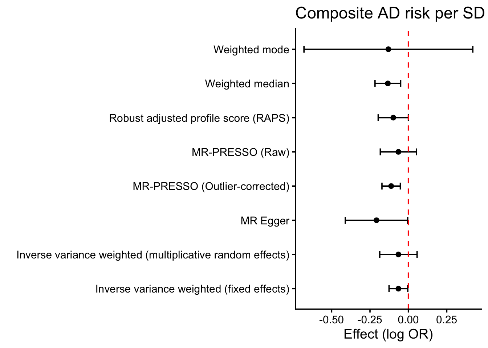

::: {.cell}

```{.r .cell-code}
library(TwoSampleMR)
library(ieugwasr)
library(MRPRESSO)
library(knitr)
source(here::here("R", "helpers.R"))
cfg <- load_config()
set.seed(cfg$seed)
dir.create(here::here("results"), showWarnings = FALSE)
dir.create(here::here("figures"), showWarnings = FALSE)
```
:::


## Purpose

This is **Layer 0** of the decomposition pipeline (see `APPROACH.md`). The goal here is
*not* to confirm that smoking is protective for AD — it is to re-establish the composite
smoking→AD signal cleanly so later layers can decompose it into a druggable
nicotinic-acetylcholine-receptor (nAChR) axis vs. a non-druggable behavioral/combustion
axis. Record sign, magnitude, heterogeneity, pleiotropy.

## Data

Exposure: Cigarettes per day (GSCAN / Liu 2019, `ieu-b-142`); pre-clumped instrument set
copied to `data/`. Outcome: Alzheimer's disease, Bellenguez 2022 (`ebi-a-GCST90027158`).


::: {.cell}

```{.r .cell-code}
instruments <- read_csv(here::here("data", "Instruments - cig.liu - Sleep.csv")) |>
  mutate(samplesize.exposure = cfg$samplesizes$smk_cpd_exposure,
         exposure = "Cigarettes per day")

ad.outcome <- extract_outcome_data(
  snps = instruments$SNP,
  outcomes = cfg$opengwas$ad_primary,
  proxies = TRUE, rsq = 0.8)

ad.data <- harmonise_data(instruments, ad.outcome, action = 2)
ad.data.steiger <- steiger_filtering(ad.data)
```
:::


::: {.cell}

```{.r .cell-code}
# Annotate nearest gene (hg19) and instrument strength; persist for downstream layers.
ad.annot <- ad.data.steiger |>
  filter(mr_keep == TRUE) |>
  annotate_nearest_gene(chr_col = "chr.exposure", pos_col = "pos.exposure") |>
  add_instrument_strength(cfg$samplesizes$smk_cpd_exposure) |>
  assign_mechanism_bin(cfg)

write_csv(ad.annot, here::here("results", "baseline_harmonised_annotated.csv"))

instrument_summary(ad.annot) |>
  kable(caption = "Cigarettes-per-day instrument strength (post-harmonisation, post-Steiger)",
        digits = c(0, 0, 4, 1, 1, 1))
```

::: {.cell-output-display}


Table: Cigarettes-per-day instrument strength (post-harmonisation, post-Steiger)

| num_snps| samplesize.exposure| cumulative_R2| mean_F| median_F| overall_F|
|--------:|-------------------:|-------------:|------:|--------:|---------:|
|       22|              249752|        0.0349|  399.1|    153.9|     410.4|


:::
:::


## Composite MR


::: {.cell}

```{.r .cell-code}
ad.mr <- mr(ad.data.steiger,
            method_list = c("mr_ivw_mre", "mr_ivw_fe", "mr_raps",
                            "mr_egger_regression", "mr_weighted_median",
                            "mr_weighted_mode"))

mr_pleiotropy_test(ad.data.steiger) |>
  dplyr::select(-starts_with("id")) |>
  kable(caption = "MR-Egger intercept (directional pleiotropy)")
```

::: {.cell-output-display}


Table: MR-Egger intercept (directional pleiotropy)

|outcome                                                |exposure           | egger_intercept|        se|      pval|
|:------------------------------------------------------|:------------------|---------------:|---------:|---------:|
|Alzheimer's disease &#124;&#124; id:ebi-a-GCST90027158 |Cigarettes per day |       0.0114142| 0.0067915| 0.1083789|


:::

```{.r .cell-code}
mr_heterogeneity(ad.data.steiger) |>
  dplyr::select(-starts_with("id")) |>
  mutate(I2 = pmax(0, (Q - Q_df) / Q) * 100) |>
  kable(caption = "Heterogeneity", digits = c(0, 0, 0, 3, 3, 99))
```

::: {.cell-output-display}


Table: Heterogeneity

|outcome                                                |exposure           |method                    |      Q| Q_df|       Q_pval| I2|
|:------------------------------------------------------|:------------------|:-------------------------|------:|----:|------------:|--:|
|Alzheimer's disease &#124;&#124; id:ebi-a-GCST90027158 |Cigarettes per day |MR Egger                  | 72.926|   20| 6.020378e-08| 73|
|Alzheimer's disease &#124;&#124; id:ebi-a-GCST90027158 |Cigarettes per day |Inverse variance weighted | 83.225|   21| 2.317303e-09| 75|


:::
:::


::: {.cell}

```{.r .cell-code}
ad.presso <- mr_presso(
  BetaOutcome = "beta.outcome", BetaExposure = "beta.exposure",
  SdOutcome = "se.outcome", SdExposure = "se.exposure",
  data = as.data.frame(ad.data.steiger),
  NbDistribution = 2000, SignifThreshold = 0.05,
  OUTLIERtest = TRUE, DISTORTIONtest = TRUE)

presso.df <- ad.presso$`Main MR results` |>
  dplyr::select(`MR Analysis`, `Causal Estimate`, Sd, `P-value`) |>
  dplyr::rename(method = `MR Analysis`, b = `Causal Estimate`,
                se = Sd, pval = `P-value`) |>
  mutate(method = forcats::fct_recode(method,
           "MR-PRESSO (Raw)" = "Raw",
           "MR-PRESSO (Outlier-corrected)" = "Outlier-corrected"))

baseline.results <- bind_rows(as_tibble(ad.mr), presso.df) |>
  tidyr::fill(id.exposure, id.outcome, exposure, outcome, nsnp, .direction = "down")

write_csv(baseline.results, here::here("results", "baseline_mr_results.csv"))
baseline.results |> dplyr::select(-starts_with("id")) |>
  kable(caption = "Composite smoking→AD MR (the signal to be decomposed)",
        digits = c(0, 0, 0, 0, 3, 3, 99))
```

::: {.cell-output-display}


Table: Composite smoking→AD MR (the signal to be decomposed)

|outcome                                                |exposure           |method                                                    | nsnp|      b|    se|        pval|
|:------------------------------------------------------|:------------------|:---------------------------------------------------------|----:|------:|-----:|-----------:|
|Alzheimer's disease &#124;&#124; id:ebi-a-GCST90027158 |Cigarettes per day |Inverse variance weighted (multiplicative random effects) |   22| -0.065| 0.062| 0.295858668|
|Alzheimer's disease &#124;&#124; id:ebi-a-GCST90027158 |Cigarettes per day |Inverse variance weighted (fixed effects)                 |   22| -0.065| 0.031| 0.037429345|
|Alzheimer's disease &#124;&#124; id:ebi-a-GCST90027158 |Cigarettes per day |Robust adjusted profile score (RAPS)                      |   22| -0.098| 0.050| 0.050083352|
|Alzheimer's disease &#124;&#124; id:ebi-a-GCST90027158 |Cigarettes per day |MR Egger                                                  |   22| -0.208| 0.104| 0.059053921|
|Alzheimer's disease &#124;&#124; id:ebi-a-GCST90027158 |Cigarettes per day |Weighted median                                           |   22| -0.134| 0.043| 0.001698172|
|Alzheimer's disease &#124;&#124; id:ebi-a-GCST90027158 |Cigarettes per day |Weighted mode                                             |   22| -0.130| 0.281| 0.647473029|
|Alzheimer's disease &#124;&#124; id:ebi-a-GCST90027158 |Cigarettes per day |MR-PRESSO (Raw)                                           |   22| -0.065| 0.060| 0.292087897|
|Alzheimer's disease &#124;&#124; id:ebi-a-GCST90027158 |Cigarettes per day |MR-PRESSO (Outlier-corrected)                             |   22| -0.112| 0.031| 0.001488486|


:::
:::


::: {.cell}

```{.r .cell-code}
ggplot(baseline.results, aes(y = method, x = b)) +
  geom_point() +
  geom_errorbar(aes(xmin = b - 1.96 * se, xmax = b + 1.96 * se), width = 0.2) +
  geom_vline(xintercept = 0, linetype = "dashed", color = "red") +
  theme_classic(base_size = 14) +
  labs(title = "Composite AD risk per SD cigarettes/day", y = "", x = "Effect (log OR)")
```

::: {.cell-output-display}
{width=672}
:::
:::


## Pleiotropy-outlier sensitivity (CLU / MINDY2)

Two SNPs — `rs73229090` (nearest **CLU**, a canonical AD susceptibility gene) and
`rs632811` (**MINDY2**) — behave as **uncorrelated horizontal pleiotropy**: they are the
SNPs MR-Clust isolates into a separate *risk* cluster (Layer 1), they are the most
influential in leave-one-out, and they are what MR-PRESSO trims to reach the
outlier-corrected estimate. Their effect looks direct-to-AD rather than via smoking. We
report an explicit sensitivity estimate dropping them.


::: {.cell}

```{.r .cell-code}
outliers <- names(cfg$pleiotropy_outliers)
ad.pruned <- ad.data.steiger |> filter(!SNP %in% outliers)
pruned.mr <- mr(ad.pruned, method_list = c("mr_ivw_mre", "mr_weighted_median")) |>
  as_tibble() |>
  mutate(set = "outliers removed (CLU, MINDY2)")
full.mr <- ad.mr |>
  filter(method %in% c("Inverse variance weighted (multiplicative random effects)",
                       "Weighted median")) |>
  as_tibble() |> mutate(set = "all SNPs")

prune.compare <- bind_rows(full.mr, pruned.mr) |>
  dplyr::select(set, method, nsnp, b, se, pval)
write_csv(prune.compare, here::here("results", "baseline_pleiotropy_pruned.csv"))
prune.compare |>
  kable(caption = "Effect of removing the CLU/MINDY2 pleiotropy outliers",
        digits = c(0, 0, 0, 3, 3, 99))
```

::: {.cell-output-display}


Table: Effect of removing the CLU/MINDY2 pleiotropy outliers

|set                            |method                                                    | nsnp|      b|    se|         pval|
|:------------------------------|:---------------------------------------------------------|----:|------:|-----:|------------:|
|all SNPs                       |Inverse variance weighted (multiplicative random effects) |   22| -0.065| 0.062| 0.2958586681|
|all SNPs                       |Weighted median                                           |   22| -0.134| 0.043| 0.0016981717|
|outliers removed (CLU, MINDY2) |Inverse variance weighted (multiplicative random effects) |   20| -0.113| 0.032| 0.0003447299|
|outliers removed (CLU, MINDY2) |Weighted median                                           |   20| -0.134| 0.041| 0.0011107705|


:::

```{.r .cell-code}
pr_ivw <- pruned.mr |> filter(method == "Inverse variance weighted (multiplicative random effects)")
log_decision("L0b", "IVW after removing CLU/MINDY2 pleiotropy outliers",
             sprintf("b=%.3f, p=%.3g (n=%d)", pr_ivw$b, pr_ivw$pval, pr_ivw$nsnp),
             "protective estimate strengthens — outliers are AD-direct pleiotropy; adopt as canonical baseline")
```
:::


### Canonical baseline set

The CLU/MINDY2-pruned IVW (b = -0.113, p = 3.4\times 10^{-4}) is the
**more accurate baseline** and is what Layers 1–5 build on. We persist the pruned,
annotated, bin-assigned SNP table and a pruned instrument file for downstream use; the full
22-SNP set is retained only for the pleiotropy comparison above and the full-set MR-Clust
discovery in Layer 1.


::: {.cell}

```{.r .cell-code}
ad.annot.pruned <- ad.annot |> filter(!SNP %in% outliers)
write_csv(ad.annot.pruned, here::here("results", "baseline_harmonised_pruned.csv"))

# Pruned raw instrument file (smoking exposure) for MVMR / CAUSE / ascertainment downstream.
instruments |> filter(!SNP %in% outliers) |>
  write_csv(here::here("data", "cig_instruments_pruned.csv"))

cat(sprintf("Canonical baseline: %d SNPs (dropped %s).\n",
            nrow(ad.annot.pruned), paste(unname(unlist(cfg$pleiotropy_outliers)), collapse = ", ")))
```

::: {.cell-output .cell-output-stdout}

```
Canonical baseline: 20 SNPs (dropped CLU, MINDY2).
```


:::
:::


## Decision


::: {.cell}

```{.r .cell-code}
ivw <- baseline.results |>
  filter(method == "Inverse variance weighted (multiplicative random effects)")
sign_txt <- ifelse(ivw$b < 0, "protective (b<0)", "risk (b>0)")
log_decision("L0", "Composite IVW sign/magnitude",
             sprintf("b=%.3f, p=%.3g", ivw$b, ivw$pval),
             sprintf("%s — proceed to decompose", sign_txt))
cat(sprintf("Composite IVW: b = %.3f, OR = %.2f, p = %.3g (%s)\n",
            ivw$b, exp(ivw$b), ivw$pval, sign_txt))
```

::: {.cell-output .cell-output-stdout}

```
Composite IVW: b = -0.065, OR = 0.94, p = 0.296 (protective (b<0))
```


:::
:::


The composite estimate is the baseline to be **decomposed**, not the result. Layer 1
asks whether the protection is mechanistically clustered at nAChR loci.


::: {.cell}

```{.r .cell-code}
sessionInfo()
```

::: {.cell-output .cell-output-stdout}

```
R version 4.6.0 (2026-04-24)
Platform: aarch64-apple-darwin23
Running under: macOS Tahoe 26.5

Matrix products: default
BLAS:   /Library/Frameworks/R.framework/Versions/4.6/Resources/lib/libRblas.0.dylib 
LAPACK: /Library/Frameworks/R.framework/Versions/4.6/Resources/lib/libRlapack.dylib;  LAPACK version 3.12.1

locale:
[1] en_US/en_US/en_US/C/en_US/en_US

time zone: America/Detroit
tzcode source: internal

attached base packages:
[1] stats4    stats     graphics  grDevices utils     datasets  methods  
[8] base     

other attached packages:
 [1] org.Hs.eg.db_3.23.1                     
 [2] TxDb.Hsapiens.UCSC.hg19.knownGene_3.22.1
 [3] GenomicFeatures_1.64.0                  
 [4] AnnotationDbi_1.74.0                    
 [5] Biobase_2.72.0                          
 [6] GenomicRanges_1.64.0                    
 [7] Seqinfo_1.2.0                           
 [8] IRanges_2.46.0                          
 [9] S4Vectors_0.50.1                        
[10] BiocGenerics_0.58.1                     
[11] generics_0.1.4                          
[12] here_1.0.2                              
[13] lubridate_1.9.5                         
[14] forcats_1.0.1                           
[15] stringr_1.6.0                           
[16] dplyr_1.2.1                             
[17] purrr_1.2.2                             
[18] readr_2.2.0                             
[19] tidyr_1.3.2                             
[20] tibble_3.3.1                            
[21] ggplot2_4.0.3                           
[22] tidyverse_2.0.0                         
[23] knitr_1.51                              
[24] MRPRESSO_1.0                            
[25] ieugwasr_1.1.0                          
[26] TwoSampleMR_0.7.5                       

loaded via a namespace (and not attached):
 [1] DBI_1.3.0                   mnormt_2.1.2               
 [3] bitops_1.0-9                gridExtra_2.3              
 [5] rlang_1.2.0                 magrittr_2.0.5             
 [7] otel_0.2.0                  matrixStats_1.5.0          
 [9] compiler_4.6.0              RSQLite_3.53.1             
[11] png_0.1-9                   vctrs_0.7.3                
[13] httpcode_0.3.0              pkgconfig_2.0.3            
[15] crayon_1.5.3                fastmap_1.2.0              
[17] XVector_0.52.0              labeling_0.4.3             
[19] Rsamtools_2.28.0            rmarkdown_2.31             
[21] tzdb_0.5.0                  bit_4.6.0                  
[23] xfun_0.57                   cachem_1.1.0               
[25] cigarillo_1.2.0             jsonlite_2.0.0             
[27] blob_1.3.0                  DelayedArray_0.38.1        
[29] mr.raps_0.4.3               BiocParallel_1.46.0        
[31] psych_2.6.5                 parallel_4.6.0             
[33] R6_2.6.1                    stringi_1.8.7              
[35] RColorBrewer_1.1-3          rtracklayer_1.72.0         
[37] Rcpp_1.1.1-1.1              SummarizedExperiment_1.42.0
[39] splines_4.6.0               Matrix_1.7-5               
[41] timechange_0.4.0            tidyselect_1.2.1           
[43] abind_1.4-8                 yaml_2.3.12                
[45] codetools_0.2-20            curl_7.1.0                 
[47] plyr_1.8.9                  lattice_0.22-9             
[49] withr_3.0.2                 KEGGREST_1.52.0            
[51] S7_0.2.2                    evaluate_1.0.5             
[53] Biostrings_2.80.0           pillar_1.11.1              
[55] MatrixGenerics_1.24.0       nortest_1.0-4              
[57] vroom_1.7.1                 rprojroot_2.1.1            
[59] RCurl_1.98-1.18             hms_1.1.4                  
[61] rootSolve_1.8.2.4           scales_1.4.0               
[63] glue_1.8.1                  tools_4.6.0                
[65] BiocIO_1.22.0               data.table_1.18.4          
[67] rsnps_0.6.1                 GenomicAlignments_1.48.0   
[69] XML_3.99-0.23               grid_4.6.0                 
[71] nlme_3.1-169                restfulr_0.0.16            
[73] cli_3.6.6                   S4Arrays_1.12.0            
[75] gtable_0.3.6                digest_0.6.39              
[77] SparseArray_1.12.2          ggrepel_0.9.8              
[79] crul_1.6.0                  rjson_0.2.23               
[81] htmlwidgets_1.6.4           farver_2.1.2               
[83] memoise_2.0.1               htmltools_0.5.9            
[85] lifecycle_1.0.5             httr_1.4.8                 
[87] bit64_4.8.2                
```


:::
:::

