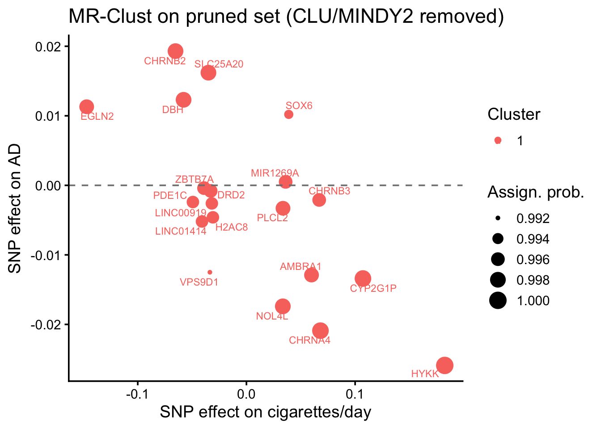

::: {.cell}

```{.r .cell-code}
library(mrclust)
library(knitr)
source(here::here("R", "helpers.R"))
cfg <- load_config()
set.seed(cfg$seed)
```
:::


## Purpose

A genuine receptor-mediated drug signal should **concentrate** in a cluster of SNPs
enriched for nAChR loci, rather than smearing uniformly across all smoking instruments.
We run MR-Clust on the smoking→AD instruments, annotate each SNP to a mechanism bin, and
ask (hypergeometric test) whether any protective cluster is enriched for
`nAChR_pharmacodynamic` genes.

## MR-Clust (run on two SNP sets)

We run MR-Clust twice: (1) the **full** 22-SNP set, to confirm the original discovery that
CLU/MINDY2 form a distinct *risk* cluster; and (2) the **pruned** canonical set (those two
removed; Layer 0b), to ask whether *new* substructure emerges once the dominant pleiotropy
outliers are gone.


::: {.cell}

```{.r .cell-code}
run_mrclust <- function(h) {
  cl <- mr_clust_em(
    theta    = h$beta.outcome / h$beta.exposure,
    theta_se = abs(h$se.outcome / h$beta.exposure),
    bx = h$beta.exposure, by = h$beta.outcome,
    bxse = h$se.exposure, byse = h$se.outcome,
    obs_names = h$SNP)
  assign <- cl$results$best |>
    as_tibble() |>
    dplyr::rename(SNP = observation) |>
    left_join(h |> dplyr::select(SNP, nearest_gene, mechanism, beta.exposure, beta.outcome),
              by = "SNP")
  enrich <- assign |>
    filter(!is.na(cluster), cluster != "Null") |>
    group_by(cluster) |>
    summarise(n_in_cluster = n(),
              n_nachr = sum(mechanism == "nAChR_pharmacodynamic"),
              genes = paste(sort(unique(nearest_gene)), collapse = ", "),
              mean_theta = mean(theta, na.rm = TRUE), .groups = "drop") |>
    rowwise() |>
    mutate(p_enrich = phyper(n_nachr - 1,
                             sum(assign$mechanism == "nAChR_pharmacodynamic"),
                             nrow(assign) - sum(assign$mechanism == "nAChR_pharmacodynamic"),
                             n_in_cluster, lower.tail = FALSE),
           direction = ifelse(mean_theta < 0, "protective", "risk")) |>
    ungroup()
  list(assign = assign, enrich = enrich)
}
```
:::


### Full 22-SNP set (original discovery)


::: {.cell}

```{.r .cell-code}
h_full <- read_csv(here::here("results", "baseline_harmonised_annotated.csv"))
full <- run_mrclust(h_full)
write_csv(full$assign,  here::here("results", "mrclust_assignments_full.csv"))
write_csv(full$enrich,  here::here("results", "mrclust_enrichment_full.csv"))
full$enrich |> kable(caption = "Full-set clusters (note the CLU/MINDY2 risk cluster)", digits = 3)
```

::: {.cell-output-display}


Table: Full-set clusters (note the CLU/MINDY2 risk cluster)

| cluster| n_in_cluster| n_nachr|genes                                                                                                                                                       | mean_theta| p_enrich|direction  |
|-------:|------------:|-------:|:-----------------------------------------------------------------------------------------------------------------------------------------------------------|----------:|--------:|:----------|
|       1|            2|       0|CLU, MINDY2                                                                                                                                                 |      1.242|    1.000|risk       |
|       2|           20|       4|AMBRA1, CHRNA4, CHRNB2, CHRNB3, CYP2G1P, DBH, DRD2, EGLN2, H2AC8, HYKK, LINC00919, LINC01414, MIR1269A, NOL4L, PDE1C, PLCL2, SLC25A20, SOX6, VPS9D1, ZBTB7A |     -0.070|    0.662|protective |


:::
:::


### Pruned canonical set (CLU/MINDY2 removed) — primary


::: {.cell}

```{.r .cell-code}
h <- read_csv(here::here("results", "baseline_harmonised_pruned.csv"))
pruned <- run_mrclust(h)
assign <- pruned$assign
enrich <- pruned$enrich
write_csv(assign, here::here("results", "mrclust_assignments.csv"))
write_csv(enrich, here::here("results", "mrclust_enrichment.csv"))
assign |>
  dplyr::select(SNP, nearest_gene, mechanism, cluster, probability, cluster_mean = theta) |>
  arrange(cluster, -probability) |>
  kable(caption = "Pruned-set SNP→cluster assignments", digits = 3)
```

::: {.cell-output-display}


Table: Pruned-set SNP→cluster assignments

|SNP        |nearest_gene |mechanism             | cluster| probability| cluster_mean|
|:----------|:------------|:---------------------|-------:|-----------:|------------:|
|rs11852372 |HYKK         |nAChR_pharmacodynamic |       1|       1.000|       -0.142|
|rs2273500  |CHRNA4       |nAChR_pharmacodynamic |       1|       0.999|       -0.307|
|rs56113850 |CYP2G1P      |nicotine_metabolism   |       1|       0.999|       -0.125|
|rs2072659  |CHRNB2       |nAChR_pharmacodynamic |       1|       0.998|       -0.296|
|rs2424888  |NOL4L        |other_pleiotropic     |       1|       0.998|       -0.520|
|rs3025383  |DBH          |reward_behavioral     |       1|       0.998|       -0.213|
|rs7431710  |SLC25A20     |other_pleiotropic     |       1|       0.998|       -0.463|
|rs2084533  |PLCL2        |other_pleiotropic     |       1|       0.997|       -0.098|
|rs34406232 |EGLN2        |nicotine_metabolism   |       1|       0.997|       -0.077|
|rs75494138 |AMBRA1       |other_pleiotropic     |       1|       0.997|       -0.215|
|rs11725618 |MIR1269A     |other_pleiotropic     |       1|       0.996|        0.014|
|rs58379124 |CHRNB3       |nAChR_pharmacodynamic |       1|       0.996|       -0.031|
|rs7928017  |DRD2         |reward_behavioral     |       1|       0.996|        0.024|
|rs895330   |ZBTB7A       |other_pleiotropic     |       1|       0.996|        0.010|
|rs1579233  |LINC00919    |other_pleiotropic     |       1|       0.995|        0.082|
|rs215600   |PDE1C        |other_pleiotropic     |       1|       0.995|        0.049|
|rs790564   |LINC01414    |other_pleiotropic     |       1|       0.995|        0.127|
|rs806798   |H2AC8        |other_pleiotropic     |       1|       0.995|        0.149|
|rs7951365  |SOX6         |other_pleiotropic     |       1|       0.993|        0.262|
|rs4785587  |VPS9D1       |other_pleiotropic     |       1|       0.992|        0.372|


:::

```{.r .cell-code}
enrich |> kable(caption = "Pruned-set clusters + nAChR enrichment (hypergeometric)", digits = 4)
```

::: {.cell-output-display}


Table: Pruned-set clusters + nAChR enrichment (hypergeometric)

| cluster| n_in_cluster| n_nachr|genes                                                                                                                                                       | mean_theta| p_enrich|direction  |
|-------:|------------:|-------:|:-----------------------------------------------------------------------------------------------------------------------------------------------------------|----------:|--------:|:----------|
|       1|           20|       4|AMBRA1, CHRNA4, CHRNB2, CHRNB3, CYP2G1P, DBH, DRD2, EGLN2, H2AC8, HYKK, LINC00919, LINC01414, MIR1269A, NOL4L, PDE1C, PLCL2, SLC25A20, SOX6, VPS9D1, ZBTB7A |    -0.0699|        1|protective |


:::
:::


::: {.cell}

```{.r .cell-code}
library(ggrepel)
ggplot(assign, aes(x = beta.exposure, y = beta.outcome, colour = factor(cluster))) +
  geom_point(aes(size = probability)) +
  geom_text_repel(aes(label = nearest_gene), size = 3, max.overlaps = 15) +
  geom_hline(yintercept = 0, linetype = "dashed", colour = "grey50") +
  theme_classic(base_size = 14) +
  labs(x = "SNP effect on cigarettes/day", y = "SNP effect on AD",
       colour = "Cluster", size = "Assign. prob.",
       title = "MR-Clust on pruned set (CLU/MINDY2 removed)")
```

::: {.cell-output-display}
{width=672}
:::
:::


## Decision


::: {.cell}

```{.r .cell-code}
n_substantive <- nrow(enrich)                      # non-null clusters in pruned set
prot_enriched <- enrich |> filter(direction == "protective", p_enrich < 0.05)
new_risk <- enrich |> filter(direction == "risk")
msg <- sprintf("pruned set: %d non-null cluster(s); %d new risk cluster(s); nAChR enrichment min p=%.3g",
               n_substantive, nrow(new_risk),
               suppressWarnings(min(enrich$p_enrich)))
log_decision("L1", "MR-Clust substructure on pruned canonical set",
             sprintf("%d clusters", n_substantive), msg)
cat(msg, "\n")
```

::: {.cell-output .cell-output-stdout}

```
pruned set: 1 non-null cluster(s); 0 new risk cluster(s); nAChR enrichment min p=1 
```


:::
:::


If protection concentrates in an nAChR-enriched cluster, Layer 2 quantifies the
bin-stratified effects; otherwise the signal is more consistent with a dose/combustion
mechanism and the drug-target framing should be reconsidered.
