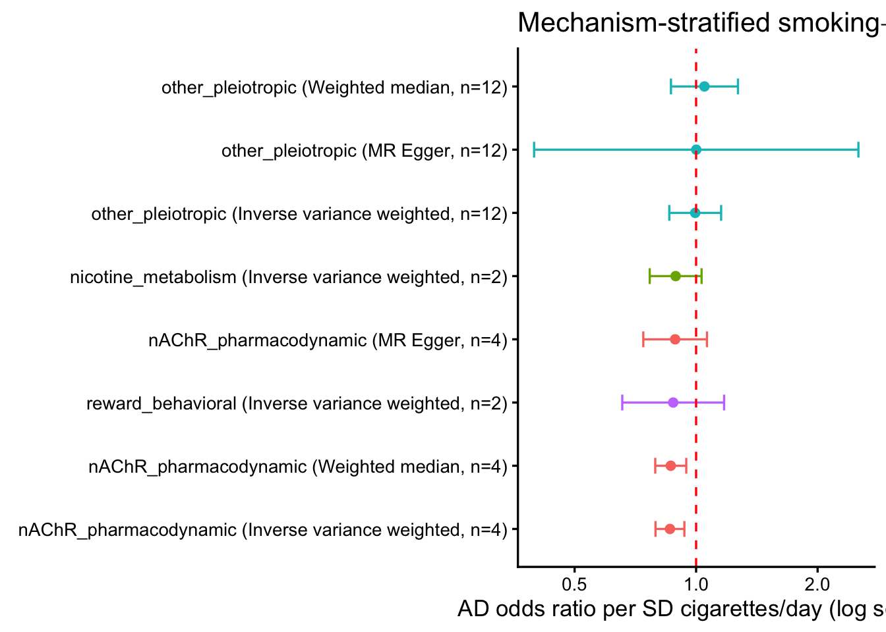

::: {.cell}

```{.r .cell-code}
library(TwoSampleMR)
library(knitr)
source(here::here("R", "helpers.R"))
cfg <- load_config()
set.seed(cfg$seed)
```
:::


## Purpose

Partition the smoking instrument by mechanism bin (nearest-gene → bin from `config.yml`)
and run MR within each bin. The **nAChR-only** estimate is the candidate druggable signal;
metabolism / reward / other bins are non-druggable comparators. Effect localizing to
`nAChR_pharmacodynamic` supports a receptor mechanism.


::: {.cell}

```{.r .cell-code}
# Canonical (pruned, CLU/MINDY2-removed) baseline set from Layer 0b.
h <- read_csv(here::here("results", "baseline_harmonised_pruned.csv"))
table(h$mechanism)
```

::: {.cell-output .cell-output-stdout}

```

nAChR_pharmacodynamic   nicotine_metabolism     other_pleiotropic 
                    4                     2                    12 
    reward_behavioral 
                    2 
```


:::
:::


## MR per mechanism bin


::: {.cell}

```{.r .cell-code}
# Run IVW / Egger / weighted median within each bin that has >= 2 SNPs (>=3 for Egger).
strat <- h |>
  group_by(mechanism) |>
  group_modify(~{
    n <- nrow(.x)
    methods <- if (n >= 3) c("mr_ivw", "mr_egger_regression", "mr_weighted_median")
               else "mr_ivw"
    res <- tryCatch(mr(.x, method_list = methods), error = function(e) NULL)
    if (is.null(res)) tibble() else
      res |> dplyr::select(method, nsnp, b, se, pval)
  }) |>
  ungroup()

write_csv(strat, here::here("results", "stratified_mr_results.csv"))
strat |> kable(caption = "Mechanism-stratified MR (smoking→AD by bin)",
               digits = c(0, 0, 0, 3, 3, 99))
```

::: {.cell-output-display}


Table: Mechanism-stratified MR (smoking→AD by bin)

|mechanism             |method                    | nsnp|      b|    se|         pval|
|:---------------------|:-------------------------|----:|------:|-----:|------------:|
|nAChR_pharmacodynamic |Inverse variance weighted |    4| -0.149| 0.042| 0.0003820795|
|nAChR_pharmacodynamic |MR Egger                  |    4| -0.120| 0.093| 0.3257629852|
|nAChR_pharmacodynamic |Weighted median           |    4| -0.145| 0.045| 0.0013530143|
|nicotine_metabolism   |Inverse variance weighted |    2| -0.117| 0.076| 0.1222739074|
|other_pleiotropic     |Inverse variance weighted |   12| -0.005| 0.075| 0.9459737125|
|other_pleiotropic     |MR Egger                  |   12|  0.001| 0.472| 0.9985633265|
|other_pleiotropic     |Weighted median           |   12|  0.048| 0.098| 0.6247313683|
|reward_behavioral     |Inverse variance weighted |    2| -0.131| 0.148| 0.3778757694|


:::
:::


::: {.cell}

```{.r .cell-code}
plot_df <- strat |>
  mutate(or = exp(b), lo = exp(b - 1.96 * se), hi = exp(b + 1.96 * se),
         label = paste0(mechanism, " (", method, ", n=", nsnp, ")"))

ggplot(plot_df, aes(x = or, y = reorder(label, or), colour = mechanism)) +
  geom_point(size = 2) +
  geom_errorbarh(aes(xmin = lo, xmax = hi), height = 0.25) +
  geom_vline(xintercept = 1, linetype = "dashed", colour = "red") +
  scale_x_log10() +
  theme_classic(base_size = 13) +
  theme(legend.position = "none") +
  labs(x = "AD odds ratio per SD cigarettes/day (log scale)", y = "",
       title = "Mechanism-stratified smoking→AD effect")
```

::: {.cell-output-display}
{width=672}
:::
:::


## Decision


::: {.cell}

```{.r .cell-code}
nachr_ivw <- strat |> filter(mechanism == "nAChR_pharmacodynamic", method == "Inverse variance weighted")
other_ivw <- strat |> filter(mechanism == "other_pleiotropic", method == "Inverse variance weighted")
if (nrow(nachr_ivw) > 0) {
  loc <- ifelse(nachr_ivw$b < 0 && nachr_ivw$pval < 0.05,
                "localizes to nAChR (protective, p<0.05) — receptor mechanism supported",
                "nAChR bin not clearly protective — interpret with caution")
  log_decision("L2", "nAChR-bin IVW",
               sprintf("b=%.3f, p=%.3g (n=%d)", nachr_ivw$b, nachr_ivw$pval, nachr_ivw$nsnp),
               loc)
  cat(sprintf("nAChR bin IVW: b=%.3f, OR=%.2f, p=%.3g\n",
              nachr_ivw$b, exp(nachr_ivw$b), nachr_ivw$pval))
} else {
  cat("No nAChR-bin SNPs available for stratified MR.\n")
}
```

::: {.cell-output .cell-output-stdout}

```
nAChR bin IVW: b=-0.149, OR=0.86, p=0.000382
```


:::
:::


The bin-level estimate is still driven by the *behavioral* exposure. Layer 3 swaps the
exposure to each receptor gene's cis-eQTL/pQTL to obtain the behavior-independent
(druggable) direct effect.
