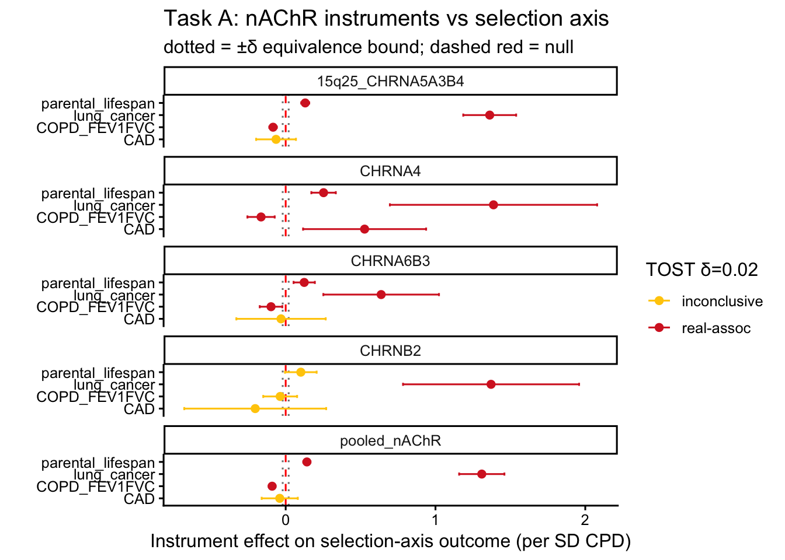

::: {.cell}

```{.r .cell-code}
library(TwoSampleMR)
library(ieugwasr)
library(MendelianRandomization)
library(knitr)
source(here::here("R", "helpers.R"))
source(here::here("R", "run_taskB.R"))
cfg <- load_config()
set.seed(cfg$seed)
```
:::


## Purpose

The primary outcome **Bellenguez 2022** is **proxy-majority** (≈39,106 clinical cases vs
≈46,828 UK Biobank by-proxy cases; proxy fraction ≈ 0.55). Proxy / prevalent sampling biases
AD *risk* alleles downward — toward apparent *protection*. If the protective smoking→AD
signal is a selection/collider artefact of proxy ascertainment, it should **attenuate toward
null** when the outcome is a **de-selected, clinically-ascertained** AD GWAS.

This layer re-estimates the effect against a **gradient of by-proxy fraction**, on a
harmonised per-SD-CPD log-OR scale (fixing the scale mismatch noted in SUMMARY.md), and tests
attenuation formally:

| Outcome | Proxy fraction | UKB / proxy |
|---|---|---|
| Kunkle 2019 (IGAP) | 0.00 | clinical, no UKB |
| Lambert 2013 (IGAP) | 0.00 | clinical, no UKB |
| Bellenguez 2022 (primary) | 0.55 | proxy-majority |
| Schwartzentruber 2021 (family-history GWAX) | 1.00 | pure UKB by-proxy |

The Schwartzentruber GWAX outcome is on a family-history scale; its MR estimate is rescaled
×2 to approximate case-control log-OR (each first-degree relative shares ~50% of the genome).
This rescale is **approximate and flagged**; the decisive contrast — proxy-majority Bellenguez
vs the clinical-only Kunkle/Lambert — needs no rescaling and is fully scale-comparable.

## Effect across the ascertainment gradient


::: {.cell}

```{.r .cell-code}
res <- run_taskB(cfg)
write_csv(res, here::here("results", "ascertainment_swap.csv"))
res |>
  filter(status == "ok") |>
  transmute(set, outcome, proxy_frac, n = nsnp,
            b = round(b,3), OR = round(or,3),
            `95% CI` = sprintf("[%.3f, %.3f]", ci_lo, ci_hi),
            p = signif(pval,2)) |>
  arrange(set, proxy_frac) |>
  kable(caption = "Task B: smoking→AD effect by outcome proxy fraction (per-SD-CPD log-OR)")
```

::: {.cell-output-display}


Table: Task B: smoking→AD effect by outcome proxy fraction (per-SD-CPD log-OR)

|set              |outcome                 | proxy_frac|  n|      b|    OR|95% CI           |       p|
|:----------------|:-----------------------|----------:|--:|------:|-----:|:----------------|-------:|
|15q25_CHRNA5A3B4 |Kunkle2019_clinical     |      0.000| 27| -0.136| 0.873|[-0.300, 0.028]  | 0.10000|
|15q25_CHRNA5A3B4 |Lambert2013_clinical    |      0.000| 20| -0.123| 0.884|[-0.288, 0.041]  | 0.14000|
|15q25_CHRNA5A3B4 |Bellenguez2022_proxymaj |      0.545| 31| -0.105| 0.901|[-0.195, -0.014] | 0.02300|
|15q25_CHRNA5A3B4 |Schwartzentruber_GWAX   |      1.000| 31| -0.011| 0.989|[-0.027, 0.005]  | 0.17000|
|CHRNA4           |Kunkle2019_clinical     |      0.000|  3| -0.302| 0.740|[-0.948, 0.345]  | 0.36000|
|CHRNA4           |Lambert2013_clinical    |      0.000|  3|  0.232| 1.261|[-0.795, 1.258]  | 0.66000|
|CHRNA4           |Bellenguez2022_proxymaj |      0.545|  4| -0.256| 0.774|[-0.550, 0.038]  | 0.08700|
|CHRNA4           |Schwartzentruber_GWAX   |      1.000|  4| -0.007| 0.993|[-0.062, 0.047]  | 0.79000|
|canonical_20snp  |Kunkle2019_clinical     |      0.000| 18| -0.077| 0.926|[-0.208, 0.054]  | 0.25000|
|canonical_20snp  |Lambert2013_clinical    |      0.000| 18| -0.076| 0.927|[-0.216, 0.064]  | 0.29000|
|canonical_20snp  |Bellenguez2022_proxymaj |      0.545| 20| -0.113| 0.893|[-0.175, -0.051] | 0.00038|
|canonical_20snp  |Schwartzentruber_GWAX   |      1.000| 20| -0.012| 0.988|[-0.023, -0.000] | 0.04300|
|pooled_nAChR     |Kunkle2019_clinical     |      0.000| 37| -0.133| 0.876|[-0.269, 0.004]  | 0.05700|
|pooled_nAChR     |Lambert2013_clinical    |      0.000| 30| -0.098| 0.907|[-0.248, 0.053]  | 0.20000|
|pooled_nAChR     |Bellenguez2022_proxymaj |      0.545| 43| -0.129| 0.879|[-0.205, -0.053] | 0.00087|
|pooled_nAChR     |Schwartzentruber_GWAX   |      1.000| 43| -0.011| 0.989|[-0.026, 0.004]  | 0.14000|


:::
:::


## Formal attenuation test


::: {.cell}

```{.r .cell-code}
# Difference: proxy-majority Bellenguez vs the inverse-variance pooled clinical (proxy=0)
# anchor; meta-regression of effect on proxy fraction across the gradient (per instrument set).
tests <- taskB_tests(res)
write_csv(tests, here::here("results", "ascertainment_metareg.csv"))
tests |>
  transmute(set,
            b_clinical = round(b_clinical,3), b_proxymaj = round(b_proxymaj,3),
            z_diff = round(z_diff,2), p_diff = signif(p_diff,2),
            `metareg slope (b~proxy)` = round(metareg_slope,3),
            metareg_p = signif(metareg_p,2)) |>
  kable(caption = "Proxy→clinical difference + meta-regression of effect on proxy fraction")
```

::: {.cell-output-display}


Table: Proxy→clinical difference + meta-regression of effect on proxy fraction

|set              | b_clinical| b_proxymaj| z_diff| p_diff| metareg slope (b~proxy)| metareg_p|
|:----------------|----------:|----------:|------:|------:|-----------------------:|---------:|
|15q25_CHRNA5A3B4 |     -0.130|     -0.105|   0.34|   0.74|                   0.140|     0.037|
|CHRNA4           |     -0.150|     -0.256|  -0.34|   0.74|                   0.309|     0.250|
|canonical_20snp  |     -0.077|     -0.113|  -0.62|   0.53|                   0.115|     0.160|
|pooled_nAChR     |     -0.117|     -0.129|  -0.19|   0.85|                   0.146|     0.100|


:::
:::


A **negative meta-regression slope** (effect more protective as proxy fraction rises) with a
**significant proxy-vs-clinical difference** is the collider/selection signature. A flat slope
with overlapping CIs across the gradient supports a **genuine** effect.


::: {.cell}

```{.r .cell-code}
plot_df <- res |> filter(status == "ok")
ggplot(plot_df, aes(x = b, y = reorder(outcome, proxy_frac), colour = factor(proxy_frac))) +
  geom_vline(xintercept = 0, linetype = "dashed", colour = "red") +
  geom_point(size = 2.5) +
  geom_errorbarh(aes(xmin = ci_lo, xmax = ci_hi), height = 0.25) +
  facet_wrap(~ set, ncol = 1, scales = "free_y") +
  theme_classic(base_size = 12) +
  labs(x = "smoking→AD effect (per SD CPD, log-OR)", y = "",
       colour = "proxy frac",
       title = "Task B: ascertainment swap — does protection attenuate in clinical-only AD?")
```

::: {.cell-output-display}
{width=672}
:::
:::


## Decision


::: {.cell}

```{.r .cell-code}
for (i in seq_len(nrow(tests))) {
  t <- tests[i,]
  if (is.na(t$p_diff)) next
  patt <- if (!is.na(t$metareg_p) && t$metareg_p < 0.05 && !is.na(t$metareg_slope) && t$metareg_slope < 0)
            "ATTENUATES in clinical-only (supports selection/collider bias)"
          else if (!is.na(t$p_diff) && t$p_diff >= 0.05)
            "persists with comparable CIs (supports genuine effect)"
          else "mixed / inconclusive"
  log_decision("L4c", sprintf("%s proxy→clinical (Δ test + meta-reg)", t$set),
               sprintf("Δb z=%.2f p=%.2g; slope=%.3f p=%.2g",
                       t$z_diff, t$p_diff, t$metareg_slope, t$metareg_p),
               patt)
  cat(sprintf("%-18s: %s\n", t$set, patt))
}
```

::: {.cell-output .cell-output-stdout}

```
15q25_CHRNA5A3B4  : persists with comparable CIs (supports genuine effect)
CHRNA4            : persists with comparable CIs (supports genuine effect)
canonical_20snp   : persists with comparable CIs (supports genuine effect)
pooled_nAChR      : persists with comparable CIs (supports genuine effect)
```


:::
:::


::: callout-note
**Caveats.** Clinical IGAP outcomes (Kunkle, Lambert) are smaller (≈22k / 17k cases) so CIs
are wider — an apparent "persistence" must be read against power. The GWAX ×2 rescale is
approximate. Incident / younger-onset AD was not reachable in OpenGWAS (gap). The decisive,
scale-clean comparison is Bellenguez (proxy 0.55) vs Kunkle+Lambert (proxy 0).
:::
