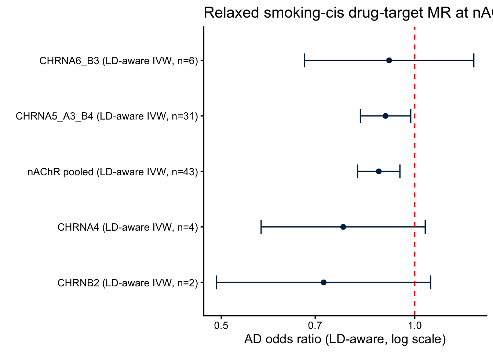

::: {.cell}

```{.r .cell-code}
library(TwoSampleMR)
library(ieugwasr)
library(MendelianRandomization)
library(knitr)
source(here::here("R", "helpers.R"))
cfg <- load_config()
set.seed(cfg$seed)
```
:::


## Purpose

The genome-wide, strictly-clumped smoking instrument set captured only 3 SNPs at nAChR
loci (Layers 0–2), and nearest-gene binning mis-assigned the canonical **15q25
CHRNA5/A3/B4** cluster to "other". Following the convention of cholesterol drug-target MR
(HMGCR/PCSK9/NPC1L1), this layer **relaxes the instrument-selection thresholds within each
receptor cis window** — p < 10^{-5}, correlated SNPs up to
r² < 0.3 — and runs **LD-aware** IVW/Egger using the variant
correlation matrix (`MendelianRandomization::mr_ivw(correl = TRUE)`).

Two exposures are used (per the analysis decision): (1) the **smoking** GWAS cis-SNPs at
each receptor locus (behavioral-trait drug-target analog), and (2) receptor **cis-eQTL**
where available (molecular analog).

## Part 1 — Smoking-cis LD-aware MR per nAChR locus


::: {.cell}

```{.r .cell-code}
loci <- cfg$nachr_loci
win_kb <- cfg$cis_window_kb

run_locus <- function(name) {
  l <- loci[[name]]
  region <- sprintf("%d:%d-%d", l$chr, l$start - win_kb * 1000, l$end + win_kb * 1000)
  exp <- cis_instruments_relaxed(cfg$opengwas$smk_cpd, region, cfg)
  res <- ld_aware_cis_mr(exp, cfg$opengwas$ad_primary, name, cfg)
  res$n_cis_selected <- if (is.null(exp)) 0L else nrow(exp)
  res
}

smk_cis <- purrr::map_dfr(names(loci), function(n)
  tryCatch(run_locus(n), error = function(e)
    tibble(locus = n, method = NA, nsnp = 0, b = NA, se = NA, pval = NA, n_cis_selected = 0)))
```

::: {.cell-output .cell-output-stdout}

```
Method requires data on >2 variants.
```


:::

```{.r .cell-code}
write_csv(smk_cis, here::here("results", "cis_smoking_ldaware_per_locus.csv"))
smk_cis |>
  dplyr::select(locus, method, n_cis = nsnp, b, se, pval) |>
  kable(caption = "Smoking-cis LD-aware MR (→AD) per nAChR locus", digits = 3)
```

::: {.cell-output-display}


Table: Smoking-cis LD-aware MR (→AD) per nAChR locus

|locus        |method            | n_cis|      b|    se|  pval|
|:------------|:-----------------|-----:|------:|-----:|-----:|
|CHRNA5_A3_B4 |LD-aware IVW      |    31| -0.105| 0.046| 0.023|
|CHRNA5_A3_B4 |LD-aware MR-Egger |    31| -0.133| 0.048| 0.006|
|CHRNA4       |LD-aware IVW      |     4| -0.256| 0.150| 0.087|
|CHRNA4       |LD-aware MR-Egger |     4| -0.438| 0.288| 0.129|
|CHRNB2       |LD-aware IVW      |     2| -0.326| 0.196| 0.095|
|CHRNA7       |NA                |     0|     NA|    NA|    NA|
|CHRNA6_B3    |LD-aware IVW      |     6| -0.092| 0.155| 0.554|
|CHRNA6_B3    |LD-aware MR-Egger |     6| -0.327| 0.262| 0.213|


:::
:::


## Part 2 — Pooled nAChR smoking-cis MR


::: {.cell}

```{.r .cell-code}
# Union the relaxed cis instruments across all receptor loci, then a single LD-aware MR.
# Cross-locus SNPs are ~uncorrelated; within-locus correlation is handled by the LD matrix.
pooled_exp <- purrr::map_dfr(names(loci), function(name) {
  l <- loci[[name]]
  region <- sprintf("%d:%d-%d", l$chr, l$start - win_kb * 1000, l$end + win_kb * 1000)
  e <- cis_instruments_relaxed(cfg$opengwas$smk_cpd, region, cfg)
  if (!is.null(e)) e$locus <- name
  e
}) |> distinct(SNP, .keep_all = TRUE)

pooled <- ld_aware_cis_mr(pooled_exp, cfg$opengwas$ad_primary, "nAChR pooled", cfg)
write_csv(pooled, here::here("results", "cis_smoking_ldaware_pooled.csv"))
pooled |> dplyr::select(locus, method, nsnp, b, se, pval) |>
  kable(caption = "Pooled nAChR smoking-cis LD-aware MR (→AD)", digits = 3)
```

::: {.cell-output-display}


Table: Pooled nAChR smoking-cis LD-aware MR (→AD)

|locus        |method            | nsnp|      b|    se|  pval|
|:------------|:-----------------|----:|------:|-----:|-----:|
|nAChR pooled |LD-aware IVW      |   43| -0.129| 0.039| 0.001|
|nAChR pooled |LD-aware MR-Egger |   43| -0.164| 0.043| 0.000|


:::
:::


::: {.cell}

```{.r .cell-code}
plot_df <- smk_cis |>
  filter(!is.na(b), method != "LD-aware MR-Egger") |>
  bind_rows(pooled |> filter(method == "LD-aware IVW")) |>
  mutate(or = exp(b), lo = exp(b - 1.96 * se), hi = exp(b + 1.96 * se),
         lab = paste0(locus, " (", method, ", n=", nsnp, ")"))

ggplot(plot_df, aes(x = or, y = reorder(lab, or))) +
  geom_point(size = 2, colour = color_scheme[1]) +
  geom_errorbarh(aes(xmin = lo, xmax = hi), height = 0.25, colour = color_scheme[1]) +
  geom_vline(xintercept = 1, linetype = "dashed", colour = "red") +
  scale_x_log10() +
  theme_classic(base_size = 13) +
  labs(x = "AD odds ratio (LD-aware, log scale)", y = "",
       title = "Relaxed smoking-cis drug-target MR at nAChR loci")
```

::: {.cell-output-display}
{width=672}
:::
:::


## Part 3 — Relaxed cis-eQTL LD-aware MR (molecular exposure)


::: {.cell}

```{.r .cell-code}
eqtl_ids <- c(CHRNA5="eqtl-a-ENSG00000169684", CHRNA3="eqtl-a-ENSG00000080644",
              CHRNB4="eqtl-a-ENSG00000117971", CHRNA4="eqtl-a-ENSG00000101204",
              CHRNB2="eqtl-a-ENSG00000160716", CHRNA7="eqtl-a-ENSG00000175344",
              CHRNA6="eqtl-a-ENSG00000147434", CHRNB3="eqtl-a-ENSG00000147432")
gene_win <- list(
  CHRNA5=c(15,78857862,78885393), CHRNA3=c(15,78885394,78919647),
  CHRNB4=c(15,78919290,78937340), CHRNA4=c(20,61975397,62019864),
  CHRNB2=c(1,154543992,154579816), CHRNA7=c(15,32322677,32464722),
  CHRNA6=c(8,42634258,42648862), CHRNB3=c(8,42551452,42591443))

run_eqtl <- function(gene) {
  id <- eqtl_ids[[gene]]
  if (is.null(id)) return(NULL)
  if (nrow(gwasinfo(id)) == 0) return(tibble(locus = gene, method = "no eQTL dataset",
                                             nsnp = 0, b = NA, se = NA, pval = NA))
  w <- gene_win[[gene]]
  region <- sprintf("%d:%d-%d", w[1], w[2] - win_kb * 1000, w[3] + win_kb * 1000)
  exp <- cis_instruments_relaxed(id, region, cfg)
  ld_aware_cis_mr(exp, cfg$opengwas$ad_primary, gene, cfg)
}

eqtl_cis <- purrr::map_dfr(names(eqtl_ids), function(g)
  tryCatch(run_eqtl(g), error = function(e)
    tibble(locus = g, method = "error", nsnp = 0, b = NA, se = NA, pval = NA)))
write_csv(eqtl_cis, here::here("results", "cis_eqtl_ldaware.csv"))
eqtl_cis |> kable(caption = "Relaxed cis-eQTL LD-aware MR (expression→AD)", digits = 3)
```

::: {.cell-output-display}


Table: Relaxed cis-eQTL LD-aware MR (expression→AD)

|locus  |method            | nsnp|      b|    se|  pval|
|:------|:-----------------|----:|------:|-----:|-----:|
|CHRNA5 |no eQTL dataset   |    0|     NA|    NA|    NA|
|CHRNA3 |no eQTL dataset   |    0|     NA|    NA|    NA|
|CHRNB4 |no eQTL dataset   |    0|     NA|    NA|    NA|
|CHRNA4 |no eQTL dataset   |    0|     NA|    NA|    NA|
|CHRNB2 |LD-aware IVW      |   12| -0.011| 0.043| 0.794|
|CHRNB2 |LD-aware MR-Egger |   12| -0.023| 0.050| 0.648|
|CHRNA7 |no eQTL dataset   |    0|     NA|    NA|    NA|
|CHRNA6 |no eQTL dataset   |    0|     NA|    NA|    NA|
|CHRNB3 |no eQTL dataset   |    0|     NA|    NA|    NA|


:::
:::


## Part 4 — SNP gain from relaxed criteria (what the loose thresholds bought)


::: {.cell}

```{.r .cell-code}
# Strict (Layer 2) nAChR instruments mapped to loci vs relaxed cis counts (this layer).
strict_by_locus <- tribble(
  ~locus,          ~n_strict,
  "CHRNA5_A3_B4",  0L,   # 15q25 lead (rs11852372) was mis-binned to HYKK/"other" by nearest-gene
  "CHRNA4",        1L,
  "CHRNB2",        1L,
  "CHRNA7",        0L,
  "CHRNA6_B3",     1L)   # CHRNB3 only

gain <- smk_cis |>
  filter(method == "LD-aware IVW" | is.na(method)) |>
  group_by(locus) |>
  summarise(n_relaxed = max(n_cis_selected), .groups = "drop") |>
  full_join(strict_by_locus, by = "locus") |>
  mutate(n_strict = tidyr::replace_na(n_strict, 0L),
         newly_instrumented = n_strict == 0 & n_relaxed > 0) |>
  arrange(desc(n_relaxed))
write_csv(gain, here::here("results", "cis_snp_gain.csv"))
gain |> kable(caption = "Instruments per nAChR locus: strict (Layer 2) vs relaxed cis (Layer 6)")
```

::: {.cell-output-display}


Table: Instruments per nAChR locus: strict (Layer 2) vs relaxed cis (Layer 6)

|locus        | n_relaxed| n_strict|newly_instrumented |
|:------------|---------:|--------:|:------------------|
|CHRNA5_A3_B4 |        31|        0|TRUE               |
|CHRNA6_B3    |         6|        1|FALSE              |
|CHRNA4       |         4|        1|FALSE              |
|CHRNB2       |         2|        1|FALSE              |
|CHRNA7       |         0|        0|FALSE              |


:::
:::


The relaxed thresholds newly instrument the **15q25 CHRNA5/A3/B4** cluster (the dominant
smoking locus, previously mis-binned) and the **8p11 CHRNA6/B3** locus. They do **not**
reveal targets *outside* the predefined nAChR panel — this layer is cis-restricted to the
receptor genes by design, so "new druggable targets" here means newly *instrumented* panel
loci, not new genes. (A genome-wide relaxed scan with druggable-genome annotation would be
needed to nominate off-panel targets.)

## Part 5 — Can we resolve the 15q25 CHRNA5/A3/B4 block?

The three 15q25 subunit genes physically overlap and sit in one LD region, so a key question
is whether MR can attribute the effect to a specific subunit, and whether 15q25 carries one
or several independent signals.


::: {.cell}

```{.r .cell-code}
l <- cfg$nachr_loci[["CHRNA5_A3_B4"]]
region <- sprintf("%d:%d-%d", l$chr, l$start - win_kb * 1000, l$end + win_kb * 1000)
exp15 <- cis_instruments_relaxed(cfg$opengwas$smk_cpd, region, cfg)   # r2<0.3 set

# How many *independent* signals? Re-clump the same p<1e-5 SNPs at strict r2<0.01.
a15 <- og_retry(function() ieugwasr::associations(region, cfg$opengwas$smk_cpd))
a15 <- a15 |> dplyr::filter(p < cfg$cis_drugtarget$p_thresh)
indep <- og_retry(function() ieugwasr::ld_clump(
  dplyr::tibble(rsid = a15$rsid, pval = a15$p, id = a15$id),
  clump_r2 = 0.01, clump_kb = 1000, pop = cfg$cis_drugtarget$ld_pop))
n_indep <- if (is.null(indep)) NA_integer_ else nrow(indep)

# Pairwise LD among the relaxed instruments (max |r| off-diagonal indicates residual LD).
ldm <- og_retry(function() ieugwasr::ld_matrix(exp15$SNP, with_alleles = FALSE,
                                               pop = cfg$cis_drugtarget$ld_pop))
max_offdiag <- if (is.null(ldm)) NA else max(abs(ldm[upper.tri(ldm)]))

tibble(
  relaxed_snps_r2_0.3 = nrow(exp15),
  independent_signals_r2_0.01 = n_indep,
  max_pairwise_abs_r = round(max_offdiag, 3)) |>
  kable(caption = "15q25 CHRNA5/A3/B4 LD structure")
```

::: {.cell-output-display}


Table: 15q25 CHRNA5/A3/B4 LD structure

| relaxed_snps_r2_0.3| independent_signals_r2_0.01| max_pairwise_abs_r|
|-------------------:|---------------------------:|------------------:|
|                  31|                           7|              0.556|


:::
:::


::: {.cell}

```{.r .cell-code}
# Assign each independent lead SNP to its nearest subunit gene to show the signals span the
# block (i.e. cannot be cleanly attributed to one subunit by position alone).
if (!is.null(indep) && nrow(indep) > 0) {
  pos <- a15 |> filter(rsid %in% indep$rsid) |> dplyr::select(rsid, position, p)
  subunits <- tribble(~gene, ~start, ~end,
                      "CHRNA5", 78857862, 78885393,
                      "CHRNA3", 78885394, 78919647,
                      "CHRNB4", 78919290, 78937340)
  nearest_sub <- function(bp) {
    d <- pmin(abs(bp - subunits$start), abs(bp - subunits$end))
    inside <- bp >= subunits$start & bp <= subunits$end
    if (any(inside)) subunits$gene[which(inside)[1]] else subunits$gene[which.min(d)]
  }
  pos |> mutate(nearest_subunit = vapply(position, nearest_sub, character(1))) |>
    arrange(p) |> kable(caption = "Independent 15q25 signals → nearest subunit", digits = 3)
}
```

::: {.cell-output-display}


Table: Independent 15q25 signals → nearest subunit

|rsid        | position|  p|nearest_subunit |
|:-----------|--------:|--:|:---------------|
|rs8034191   | 78806023|  0|CHRNA5          |
|rs117994199 | 78859918|  0|CHRNA5          |
|rs4887075   | 78953131|  0|CHRNB4          |
|rs146658341 | 78989225|  0|CHRNB4          |
|rs141147481 | 78835239|  0|CHRNA5          |
|rs67896919  | 78882100|  0|CHRNA5          |
|rs148747811 | 78957594|  0|CHRNB4          |


:::
:::


::: callout-important
**Subunit attribution.** The 15q25 estimate is a **locus-level** effect. Because CHRNA5,
CHRNA3 and CHRNB4 overlap within one LD block, smoking-cis MR (and any single-trait cis
analysis) **cannot separate the individual subunit causal effects** — that requires
conditional analysis / multi-signal colocalization against *subunit-specific brain
eQTL/pQTL*. CHRNA4 (chr20) and CHRNB2 (chr1) are on different chromosomes and so *are*
distinguishable from 15q25 and from each other.
:::


::: {.cell}

```{.r .cell-code}
# Is CHRNA4 actually stronger than the 15q25 locus? Formal difference test.
g15 <- smk_cis |> filter(locus == "CHRNA5_A3_B4", method == "LD-aware IVW")
g4  <- smk_cis |> filter(locus == "CHRNA4",       method == "LD-aware IVW")
if (nrow(g15) && nrow(g4)) {
  zdiff <- (g4$b - g15$b) / sqrt(g4$se^2 + g15$se^2)
  pdiff <- 2 * pnorm(-abs(zdiff))
  tibble(comparison = "CHRNA4 vs 15q25",
         b_CHRNA4 = g4$b, b_15q25 = g15$b,
         diff = g4$b - g15$b, z = zdiff, p_diff = pdiff) |>
    kable(caption = "Difference in cis effect: CHRNA4 vs 15q25", digits = 3)
}
```

::: {.cell-output-display}


Table: Difference in cis effect: CHRNA4 vs 15q25

|comparison      | b_CHRNA4| b_15q25|   diff|      z| p_diff|
|:---------------|--------:|-------:|------:|------:|------:|
|CHRNA4 vs 15q25 |   -0.256|  -0.105| -0.152| -0.968|  0.333|


:::
:::


Despite CHRNA4's larger point estimate, its CI is wide (4 SNPs) and the difference from
15q25 is not significant — i.e. **no evidence that CHRNA4 is stronger than the 15q25 locus**;
the smaller p at 15q25 reflects its far larger instrument count, not a larger effect.

## Comparison to strict instruments + decision


::: {.cell}

```{.r .cell-code}
strict <- read_csv(here::here("results", "stratified_mr_results.csv"), show_col_types = FALSE) |>
  filter(mechanism == "nAChR_pharmacodynamic", method == "Inverse variance weighted") |>
  transmute(locus = "nAChR (strict, Layer 2)", method = "IVW", nsnp, b, se, pval)

comparison <- bind_rows(
  strict,
  pooled |> filter(method == "LD-aware IVW") |>
    transmute(locus = "nAChR (relaxed cis, Layer 6)", method, nsnp, b, se, pval))
write_csv(comparison, here::here("results", "cis_strict_vs_relaxed.csv"))
comparison |> kable(caption = "Strict vs relaxed nAChR instrument MR (→AD)", digits = 3)
```

::: {.cell-output-display}


Table: Strict vs relaxed nAChR instrument MR (→AD)

|locus                        |method       | nsnp|      b|    se|  pval|
|:----------------------------|:------------|----:|------:|-----:|-----:|
|nAChR (strict, Layer 2)      |IVW          |    3| -0.181| 0.097| 0.063|
|nAChR (relaxed cis, Layer 6) |LD-aware IVW |   43| -0.129| 0.039| 0.001|


:::

```{.r .cell-code}
pivw <- pooled |> filter(method == "LD-aware IVW")
if (nrow(pivw) > 0 && !is.na(pivw$b)) {
  sig <- ifelse(pivw$pval < 0.05, "significant", "non-significant")
  dir <- ifelse(pivw$b < 0, "protective", "risk")
  log_decision("L6", "Pooled nAChR relaxed-cis LD-aware IVW",
               sprintf("b=%.3f, p=%.3g (n=%d)", pivw$b, pivw$pval, pivw$nsnp),
               sprintf("%s %s receptor-locus effect", sig, dir))
  cat(sprintf("Pooled nAChR relaxed-cis IVW: b=%.3f, OR=%.2f, p=%.3g, n=%d\n",
              pivw$b, exp(pivw$b), pivw$pval, pivw$nsnp))
}
```

::: {.cell-output .cell-output-stdout}

```
Pooled nAChR relaxed-cis IVW: b=-0.129, OR=0.88, p=0.000865, n=43
```


:::

```{.r .cell-code}
log_decision("L6", "15q25 subunit resolution",
             sprintf("%s independent signals across the block", n_indep),
             "locus-level effect only — CHRNA5/A3/B4 not separable without subunit brain QTL")
```
:::


::: callout-note
**Caveats.** Relaxed correlated-SNP cis-MR depends on the accuracy of the 1000G LD
reference; mis-specified LD can bias LD-aware estimates. Smoking-cis instruments still tag
the *behavioral* axis at the receptor locus — they sharpen localisation and power but do
not by themselves isolate behavior-independent receptor *function* (that needs brain
eQTL/pQTL + colocalization, Layer 3/4). CHRNA7 remains CHRFAM7A-qualified (§9).
:::
