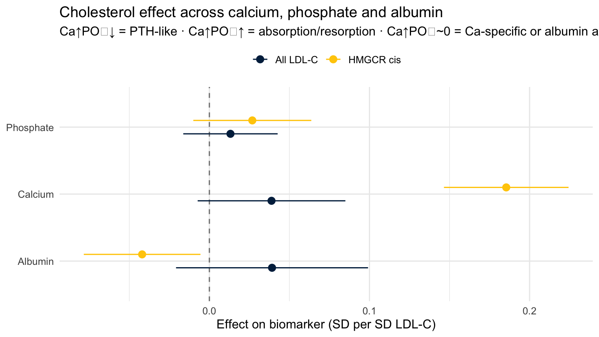

::: {.cell}

:::


## Purpose

The cholesterol/HMGCR → serum-calcium effect is strong (≈ 0.185, p < 1e-20) and
HMGCR-specific, but it is **not** routed through bone mineral density (every BMD
site → calcium leg screened null). Before interpreting it as a real biological
pathway, this script stress-tests the **outcome** itself with two cheap,
decisive checks:

1. **Albumin (assay / binding artefact).** UK Biobank measures *total* serum
   calcium, ~45 % of which is albumin-bound, and lipaemic samples interfere with
   colorimetric calcium assays. If cholesterol perturbs albumin, part of the
   "calcium" signal is a binding/measurement artefact rather than ionised
   calcium. Tests: does HMGCR/LDL → albumin? does albumin → calcium (positive
   control)? and does adjusting for albumin in MVMR **attenuate** the
   cholesterol → calcium effect?

2. **Phosphate (co-regulation diagnostic).** Calcium and phosphate are jointly
   controlled by PTH, FGF23 and vitamin D. The **sign pattern** of the
   cholesterol effect on Ca vs PO₄ discriminates mechanisms:
   - Ca ↑ **and** PO₄ ↑ → intestinal absorption / vitamin-D axis, or bone
     resorption (both ions released together)
   - Ca ↑ **and** PO₄ ↓ → PTH-like (renal phosphate wasting)
   - Ca ↑ **and** PO₄ ≈ 0 → calcium-specific route, or an albumin/assay artefact
     (phosphate is not albumin-bound, so an assay artefact should spare it)

All UK Biobank, so this is one-sample MR (bias toward the null) — noted, not
avoided; the calcium, albumin and phosphate GWAS come from the *same* UKB
biomarker batch (Sinnott-Armstrong 2021, PMID 34226706), which keeps the
albumin adjustment clean.

---

## Setup


::: {.cell}

```{.r .cell-code}
library(TwoSampleMR)
library(MendelianRandomization)
library(ieugwasr)
library(knitr)
library(kableExtra)

GWAS <- list(
  ldl       = "ieu-b-110",           # LDL-C, UKB Neale (all-SNP exposure)
  calcium   = "ebi-a-GCST90025990",  # Serum calcium   (Sinnott-Armstrong 2021 UKB)
  albumin   = "ebi-a-GCST90025992",  # Serum albumin   (same batch)
  phosphate = "ebi-a-GCST90025948"   # Serum phosphate (same batch)
)

# HMGCR cis window (GRCh37 ±500 kb) and clumping (allele score, Swerdlow 2015)
HMGCR_REGION <- "5:74132993-75157941"
R2_CIS       <- 0.30
R2_CLUMP     <- 0.001
CLUMP_KB     <- 10000
P_CIS        <- 5e-8
P_GW         <- 5e-8

dir.create("results", showWarnings = FALSE)
```
:::


### Confirm the datasets (trait + N)


::: {.cell}

```{.r .cell-code}
tryCatch(
  ieugwasr::gwasinfo(unlist(GWAS)) %>% as_tibble() %>%
    select(any_of(c("id", "trait", "sample_size", "population", "author", "year"))) %>%
    kable(caption = "Datasets used in the outcome-robustness checks"),
  error = function(e) message("gwasinfo failed: ", e$message)
)
```

::: {.cell-output-display}


Table: Datasets used in the outcome-robustness checks

|id                 |trait                  | sample_size|population |author          | year|
|:------------------|:----------------------|-----------:|:----------|:---------------|----:|
|ieu-b-110          |LDL cholesterol        |      440546|European   |Richardson, Tom | 2020|
|ebi-a-GCST90025990 |Calcium levels         |      400792|European   |Barton AR       | 2021|
|ebi-a-GCST90025992 |Serum albumin levels   |      400938|European   |Barton AR       | 2021|
|ebi-a-GCST90025948 |Serum phosphate levels |      400159|European   |Barton AR       | 2021|


:::
:::


---

## Helper functions


::: {.cell}

```{.r .cell-code}
# HMGCR cis exposure in TwoSampleMR format (allele-score clumped at r2<0.30).
hmgcr_cis_exposure <- function(exposure_id = GWAS$ldl) {
  raw <- ieugwasr::associations(variants = HMGCR_REGION, id = exposure_id,
                                proxies = FALSE) %>% as_tibble() %>%
    filter(p <= P_CIS)
  clumped <- if (nrow(raw) >= 2) {
    tryCatch(
      ieugwasr::ld_clump(tibble(rsid = raw$rsid, pval = raw$p, id = exposure_id),
                         clump_r2 = R2_CIS, clump_kb = CLUMP_KB, pop = "EUR") %>%
        inner_join(raw, by = "rsid"),
      error = function(e) { warning("HMGCR clump: ", e$message); raw }
    )
  } else raw
  clumped %>%
    transmute(SNP = rsid, beta.exposure = beta, se.exposure = se,
              effect_allele.exposure = toupper(ea), other_allele.exposure = toupper(nea),
              eaf.exposure = eaf, pval.exposure = p,
              exposure = "HMGCR (cis LDL-C)", id.exposure = exposure_id,
              mr_keep.exposure = TRUE, pval_origin.exposure = "reported",
              data_source.exposure = "igd")
}

# Univariable MR of one exposure -> one outcome, returned as a tidy one-row frame.
run_uni <- function(exp_dat, out_id, exp_label, out_label) {
  if (is.null(exp_dat) || nrow(exp_dat) < 1)
    return(tibble(exposure = exp_label, outcome = out_label, n_snps = 0L,
                  beta = NA_real_, se = NA_real_, ci_lower = NA_real_,
                  ci_upper = NA_real_, pval = NA_real_, egger_p = NA_real_))
  out  <- extract_outcome_data(snps = exp_dat$SNP, outcomes = out_id)
  harm <- harmonise_data(exp_dat, out) %>% filter(mr_keep)
  nsnp <- nrow(harm)
  ml   <- if (nsnp >= 3) c("mr_ivw_mre", "mr_egger_regression", "mr_weighted_median") else
          if (nsnp == 2) "mr_ivw_mre" else "mr_wald_ratio"
  res  <- mr(harm, method_list = ml) %>% slice(1)
  egg  <- tryCatch(mr_pleiotropy_test(harm)$pval, error = function(e) NA_real_)
  tibble(exposure = exp_label, outcome = out_label, n_snps = nsnp,
         beta = res$b, se = res$se,
         ci_lower = res$b - 1.96 * res$se, ci_upper = res$b + 1.96 * res$se,
         pval = res$pval, egger_p = egg)
}

# Difference-method MVMR (IVW-MRE) via MendelianRandomization::mr_mvivw.
mvmr_ivw <- function(mvdat, labels) {
  fit <- MendelianRandomization::mr_mvivw(MendelianRandomization::mr_mvinput(
    bx = mvdat$exposure_beta, bxse = mvdat$exposure_se,
    by = as.numeric(mvdat$outcome_beta), byse = as.numeric(mvdat$outcome_se)))
  tibble(exposure = labels, beta = fit@Estimate, se = fit@StdError,
         ci_lower = fit@CILower, ci_upper = fit@CIUpper, pval = fit@Pvalue)
}

# Delta-method product-of-coefficients indirect effect (a * b).
product_indirect <- function(a, se_a, b, se_b) {
  est <- a * b; se <- sqrt(a^2 * se_b^2 + b^2 * se_a^2)
  tibble(beta = est, se = se, ci_lower = est - 1.96*se, ci_upper = est + 1.96*se,
         pval = 2 * pnorm(-abs(est / se)))
}

# Batched OpenGWAS lookup (avoids silent truncation of long variant lists).
associations_batched <- function(rsids, gwas_id, batch_size = 100) {
  rsids <- unique(rsids)
  split(rsids, ceiling(seq_along(rsids) / batch_size)) %>%
    purrr::map_dfr(function(b) tryCatch(
      ieugwasr::associations(variants = b, id = gwas_id, proxies = FALSE) %>% as_tibble(),
      error = function(e) { warning(gwas_id, " batch: ", e$message); tibble() })) %>%
    distinct(rsid, .keep_all = TRUE)
}

# Manual (cis exposure + genome-wide mediator) MVMR on calcium. mv_extract_exposures
# assumes both exposures share a genome-wide instrument pool, which is false for a
# cis drug target — so we assemble the exposure matrix from the rsID union by hand,
# aligning the mediator and outcome betas to the cholesterol effect allele.
cis_mvmr_on_calcium <- function(cis_exp, med_inst, med_id, cis_label, med_label) {
  union_rsids <- union(cis_exp$SNP, med_inst$SNP)
  chol_eff <- associations_batched(union_rsids, cis_exp$id.exposure[1]) %>%
    transmute(SNP = rsid, ea, nea, bx1 = beta, sx1 = se)
  med_eff  <- associations_batched(union_rsids, med_id) %>%
    transmute(SNP = rsid, bx2 = beta, sx2 = se, ea_m = ea)
  ca_eff   <- associations_batched(union_rsids, GWAS$calcium) %>%
    transmute(SNP = rsid, by = beta, sy = se, ea_ca = ea)
  mv <- chol_eff %>%
    inner_join(med_eff, by = "SNP") %>% inner_join(ca_eff, by = "SNP") %>%
    mutate(bx2 = if_else(toupper(ea_m)  == toupper(ea), bx2, -bx2),
           by  = if_else(toupper(ea_ca) == toupper(ea), by,  -by)) %>%
    filter(!is.na(bx1), !is.na(bx2), !is.na(by))
  mvdat <- list(exposure_beta = as.matrix(mv[, c("bx1", "bx2")]),
                exposure_se   = as.matrix(mv[, c("sx1", "sx2")]),
                outcome_beta  = mv$by, outcome_se = mv$sy)
  colnames(mvdat$exposure_beta) <- colnames(mvdat$exposure_se) <- c(cis_label, med_label)
  list(res = mvmr_ivw(mvdat, c(cis_label, med_label)), n_snps = nrow(mv))
}
```
:::


---

## Instruments


::: {.cell}

```{.r .cell-code}
# All-SNP LDL-C instruments, HMGCR cis instruments, and mediator instruments.
ldl_inst     <- extract_instruments(GWAS$ldl, p1 = P_GW, clump = TRUE,
                                    r2 = R2_CLUMP, kb = CLUMP_KB)
hmgcr_inst   <- hmgcr_cis_exposure(GWAS$ldl)
alb_inst     <- extract_instruments(GWAS$albumin,   p1 = P_GW, clump = TRUE,
                                    r2 = R2_CLUMP, kb = CLUMP_KB)
phos_inst    <- extract_instruments(GWAS$phosphate, p1 = P_GW, clump = TRUE,
                                    r2 = R2_CLUMP, kb = CLUMP_KB)

tibble(
  instrument_set = c("All LDL-C", "HMGCR cis", "Albumin", "Phosphate"),
  n_snps = c(nrow(ldl_inst), nrow(hmgcr_inst), nrow(alb_inst), nrow(phos_inst))
) %>% kable(caption = "Instrument counts")
```

::: {.cell-output-display}


Table: Instrument counts

|instrument_set | n_snps|
|:--------------|------:|
|All LDL-C      |    179|
|HMGCR cis      |     43|
|Albumin        |    226|
|Phosphate      |    177|


:::
:::


---

## Univariable panel

Every leg we need, in one table: cholesterol → each biomarker, and each mediator
→ calcium (albumin → calcium is a positive control for the artefact pathway).


::: {.cell}

```{.r .cell-code}
uni_panel <- bind_rows(
  # cholesterol -> biomarkers
  run_uni(ldl_inst,   GWAS$albumin,   "All LDL-C",  "Albumin"),
  run_uni(hmgcr_inst, GWAS$albumin,   "HMGCR cis",  "Albumin"),
  run_uni(ldl_inst,   GWAS$phosphate, "All LDL-C",  "Phosphate"),
  run_uni(hmgcr_inst, GWAS$phosphate, "HMGCR cis",  "Phosphate"),
  run_uni(ldl_inst,   GWAS$calcium,   "All LDL-C",  "Calcium"),
  run_uni(hmgcr_inst, GWAS$calcium,   "HMGCR cis",  "Calcium"),
  # mediator -> calcium (second legs)
  run_uni(alb_inst,   GWAS$calcium,   "Albumin",    "Calcium"),
  run_uni(phos_inst,  GWAS$calcium,   "Phosphate",  "Calcium")
)

write_csv(uni_panel, "results/calcium_artefact_univariable.csv")
kable(uni_panel %>% mutate(across(c(beta, se, ci_lower, ci_upper), ~round(.x, 4)),
                           pval = signif(pval, 3), egger_p = signif(egger_p, 3)),
      caption = "Univariable MR panel (per SD exposure)")
```

::: {.cell-output-display}


Table: Univariable MR panel (per SD exposure)

|exposure  |outcome   | n_snps|    beta|     se| ci_lower| ci_upper|   pval| egger_p|
|:---------|:---------|------:|-------:|------:|--------:|--------:|------:|-------:|
|All LDL-C |Albumin   |    121|  0.0391| 0.0306|  -0.0208|   0.0991| 0.2010|  0.0555|
|HMGCR cis |Albumin   |     16| -0.0420| 0.0186|  -0.0785|  -0.0056| 0.0239|  0.1940|
|All LDL-C |Phosphate |    121|  0.0132| 0.0150|  -0.0163|   0.0426| 0.3810|  0.2700|
|HMGCR cis |Phosphate |     16|  0.0268| 0.0188|  -0.0100|   0.0637| 0.1540|  0.5270|
|All LDL-C |Calcium   |    121|  0.0388| 0.0235|  -0.0073|   0.0849| 0.0992|  0.0058|
|HMGCR cis |Calcium   |     16|  0.1854| 0.0199|   0.1465|   0.2243| 0.0000|  0.8510|
|Albumin   |Calcium   |    224|  0.5257| 0.0185|   0.4894|   0.5620| 0.0000|  0.1710|
|Phosphate |Calcium   |    173| -0.0512| 0.0574|  -0.1636|   0.0613| 0.3720|  0.9280|


:::
:::


---

## Step 1 — Albumin adjustment (the artefact test)

If the calcium signal is an albumin-binding artefact, conditioning on albumin in
an MVMR should **collapse** the cholesterol → calcium effect, and the two-step
`LDL → albumin → calcium` indirect effect should account for much of the total.


::: {.cell}

```{.r .cell-code}
# All-SNP MVMR: (LDL-C, albumin) -> calcium
mv_exp   <- mv_extract_exposures(id_exposure = c(GWAS$ldl, GWAS$albumin),
                                 clump_r2 = R2_CLUMP, clump_kb = CLUMP_KB)
mv_out   <- extract_outcome_data(snps = unique(mv_exp$SNP), outcomes = GWAS$calcium)
mvdat    <- mv_harmonise_data(mv_exp, mv_out)
labels   <- colnames(mvdat$exposure_beta)
mvmr_res <- mvmr_ivw(mvdat, labels)

# Total LDL-C -> calcium (from the panel above) vs albumin-adjusted direct effect
total_ldl_ca <- uni_panel %>% filter(exposure == "All LDL-C", outcome == "Calcium")
direct_ldl   <- mvmr_res %>% filter(exposure == GWAS$ldl)

# Two-step indirect via albumin: (LDL -> albumin) x (albumin -> calcium)
a_alb <- uni_panel %>% filter(exposure == "All LDL-C", outcome == "Albumin")
b_alb <- uni_panel %>% filter(exposure == "Albumin",   outcome == "Calcium")
indirect_alb <- product_indirect(a_alb$beta, a_alb$se, b_alb$beta, b_alb$se)

albumin_summary <- bind_rows(
  tibble(model = "LDL-C -> calcium (total)",          beta = total_ldl_ca$beta,
         se = total_ldl_ca$se, pval = total_ldl_ca$pval),
  tibble(model = "LDL-C -> calcium (direct | albumin)", beta = direct_ldl$beta,
         se = direct_ldl$se, pval = direct_ldl$pval),
  tibble(model = "Indirect via albumin (LDL->Alb->Ca)", beta = indirect_alb$beta,
         se = indirect_alb$se, pval = indirect_alb$pval)
) %>%
  mutate(ci_lower = beta - 1.96*se, ci_upper = beta + 1.96*se,
         pct_of_total = round(100 * beta / total_ldl_ca$beta, 1))

write_csv(albumin_summary, "results/calcium_artefact_albumin_mvmr.csv")
kable(albumin_summary %>% mutate(across(c(beta, se, ci_lower, ci_upper), ~round(.x, 4)),
                                 pval = signif(pval, 3)),
      caption = "Albumin adjustment — SECONDARY (all-SNP LDL-C: weak & pleiotropic total effect)")
```

::: {.cell-output-display}


Table: Albumin adjustment — SECONDARY (all-SNP LDL-C: weak & pleiotropic total effect)

|model                                    |   beta|     se|   pval| ci_lower| ci_upper| pct_of_total|
|:----------------------------------------|------:|------:|------:|--------:|--------:|------------:|
|LDL-C -> calcium (total)                 | 0.0388| 0.0235| 0.0992|  -0.0073|   0.0849|          100|
|LDL-C -> calcium (direct &#124; albumin) | 0.0179| 0.0150| 0.2350|  -0.0116|   0.0474|           46|
|Indirect via albumin (LDL->Alb->Ca)      | 0.0206| 0.0161| 0.2010|  -0.0110|   0.0521|           53|


:::
:::


The all-SNP LDL-C total effect on calcium is weak (≈0.04, p≈0.1) and shows a
non-zero Egger intercept, so decomposing it is unreliable. The **primary** artefact
test uses the strong, pleiotropy-clean **HMGCR-cis** signal, decomposed with the
**two-step product method** (the reliable estimator for a cis exposure). The
difference-method MVMR is included only as a flagged cross-check: pooling 16 cis
SNPs with ~200 genome-wide albumin instruments contaminates the cis coefficient,
so its "direct" effect should not be read as the answer.


::: {.cell}

```{.r .cell-code}
total_hmgcr_ca <- uni_panel %>% filter(exposure == "HMGCR cis", outcome == "Calcium")
a_alb_h        <- uni_panel %>% filter(exposure == "HMGCR cis", outcome == "Albumin")

# PRIMARY estimator = two-step product of coefficients. For a cis exposure this is
# the reliable decomposition: albumin-mediated (indirect) = a*b, and direct =
# total - indirect. (a = HMGCR->albumin, b = albumin->calcium.)
indirect_alb_h <- product_indirect(a_alb_h$beta, a_alb_h$se, b_alb$beta, b_alb$se)
direct_ts_beta <- total_hmgcr_ca$beta - indirect_alb_h$beta
direct_ts_se   <- sqrt(total_hmgcr_ca$se^2 + indirect_alb_h$se^2)   # approximate (treats legs as independent)

# CROSS-CHECK ONLY = difference-method MVMR. mv_extract_exposures cannot build a
# cis MVMR, so we pool the 16 cis SNPs with the genome-wide albumin instruments.
# That mixing makes the "HMGCR/LDL" coefficient a contaminated genome-wide LDL
# estimate rather than the cis effect (same failure mode as the PCSK9 arm in the
# main analysis) — so this row is a flagged cross-check, NOT the headline number.
hmgcr_alb    <- cis_mvmr_on_calcium(hmgcr_inst, alb_inst, GWAS$albumin,
                                    "HMGCR (LDL-C)", "Albumin")
direct_hmgcr <- hmgcr_alb$res %>% filter(exposure == "HMGCR (LDL-C)")

albumin_summary_hmgcr <- bind_rows(
  tibble(model = "HMGCR -> calcium (total)",                         beta = total_hmgcr_ca$beta,
         se = total_hmgcr_ca$se, pval = total_hmgcr_ca$pval),
  tibble(model = "Albumin-mediated / indirect (two-step a*b)",       beta = indirect_alb_h$beta,
         se = indirect_alb_h$se, pval = indirect_alb_h$pval),
  tibble(model = "HMGCR -> calcium DIRECT (two-step: total-indirect)", beta = direct_ts_beta,
         se = direct_ts_se, pval = 2 * pnorm(-abs(direct_ts_beta / direct_ts_se))),
  tibble(model = "HMGCR -> calcium direct (MVMR — UNRELIABLE for cis)", beta = direct_hmgcr$beta,
         se = direct_hmgcr$se, pval = direct_hmgcr$pval)
) %>%
  mutate(ci_lower = beta - 1.96*se, ci_upper = beta + 1.96*se,
         pct_of_total = round(100 * beta / total_hmgcr_ca$beta, 1))

write_csv(albumin_summary_hmgcr, "results/calcium_artefact_albumin_mvmr_hmgcr.csv")
kable(albumin_summary_hmgcr %>% mutate(across(c(beta, se, ci_lower, ci_upper), ~round(.x, 4)),
                                       pval = signif(pval, 3)),
      caption = paste0("Albumin decomposition of the HMGCR-cis calcium effect. ",
                       "Read the two-step rows: albumin-mediated fraction is negative/tiny, so the ",
                       "direct effect is ~100%+ of total ⇒ NOT an albumin artefact. The MVMR row (",
                       hmgcr_alb$n_snps, " SNPs) is contaminated by the genome-wide albumin ",
                       "instruments and is shown only as a flagged cross-check."))
```

::: {.cell-output-display}


Table: Albumin decomposition of the HMGCR-cis calcium effect. Read the two-step rows: albumin-mediated fraction is negative/tiny, so the direct effect is ~100%+ of total ⇒ NOT an albumin artefact. The MVMR row (211 SNPs) is contaminated by the genome-wide albumin instruments and is shown only as a flagged cross-check.

|model                                               |    beta|     se|    pval| ci_lower| ci_upper| pct_of_total|
|:---------------------------------------------------|-------:|------:|-------:|--------:|--------:|------------:|
|HMGCR -> calcium (total)                            |  0.1854| 0.0199| 0.00000|   0.1465|   0.2243|        100.0|
|Albumin-mediated / indirect (two-step a*b)          | -0.0221| 0.0098| 0.02430|  -0.0413|  -0.0029|        -11.9|
|HMGCR -> calcium DIRECT (two-step: total-indirect)  |  0.2075| 0.0221| 0.00000|   0.1641|   0.2509|        111.9|
|HMGCR -> calcium direct (MVMR — UNRELIABLE for cis) |  0.1124| 0.0317| 0.00039|   0.0503|   0.1745|         60.6|


:::
:::


---

## Step 2 — Phosphate co-regulation pattern


::: {.cell}

```{.r .cell-code}
pattern <- uni_panel %>%
  filter(exposure %in% c("All LDL-C", "HMGCR cis"),
         outcome %in% c("Calcium", "Phosphate", "Albumin")) %>%
  select(exposure, outcome, beta, ci_lower, ci_upper, pval) %>%
  arrange(exposure, outcome)

kable(pattern %>% mutate(across(c(beta, ci_lower, ci_upper), ~round(.x, 4)),
                         pval = signif(pval, 3)),
      caption = "Cholesterol effect on calcium vs phosphate vs albumin (sign pattern is diagnostic)")
```

::: {.cell-output-display}


Table: Cholesterol effect on calcium vs phosphate vs albumin (sign pattern is diagnostic)

|exposure  |outcome   |    beta| ci_lower| ci_upper|   pval|
|:---------|:---------|-------:|--------:|--------:|------:|
|All LDL-C |Albumin   |  0.0391|  -0.0208|   0.0991| 0.2010|
|All LDL-C |Calcium   |  0.0388|  -0.0073|   0.0849| 0.0992|
|All LDL-C |Phosphate |  0.0132|  -0.0163|   0.0426| 0.3810|
|HMGCR cis |Albumin   | -0.0420|  -0.0785|  -0.0056| 0.0239|
|HMGCR cis |Calcium   |  0.1854|   0.1465|   0.2243| 0.0000|
|HMGCR cis |Phosphate |  0.0268|  -0.0100|   0.0637| 0.1540|


:::
:::


::: {.cell}

```{.r .cell-code}
pdat <- uni_panel %>%
  filter(exposure %in% c("All LDL-C", "HMGCR cis"),
         outcome %in% c("Calcium", "Phosphate", "Albumin"), !is.na(beta))
ggplot(pdat, aes(x = beta, y = outcome, colour = exposure)) +
  geom_vline(xintercept = 0, linetype = "dashed", colour = "grey50") +
  geom_pointrange(aes(xmin = ci_lower, xmax = ci_upper),
                  position = position_dodge(width = 0.4)) +
  scale_colour_manual(values = color_scheme, name = NULL) +
  labs(title = "Cholesterol effect across calcium, phosphate and albumin",
       subtitle = "Ca↑PO₄↓ = PTH-like · Ca↑PO₄↑ = absorption/resorption · Ca↑PO₄~0 = Ca-specific or albumin artefact",
       x = "Effect on biomarker (SD per SD LDL-C)", y = NULL) +
  theme_minimal(base_size = 12) + theme(legend.position = "top")
```

::: {.cell-output-display}
{width=768}
:::
:::


---

## Interpretation

**Step 1 — albumin (assay artefact): NOT an artefact.**

- Albumin → calcium (positive control): β = 0.526 (p = 7.3e-177) — strongly positive, so the total-calcium assay does track albumin binding: the artefact channel is open and the test is sensitive.
- HMGCR → albumin: β = -0.042 (p = 0.024), **negative** — so the albumin-mediated contribution to calcium (a×b = -0.0221) is the **opposite sign** to the observed HMGCR→calcium (0.185). Mediation through albumin cannot produce a positive calcium effect.
- **Two-step direct effect = 0.208 (112% of total)** — albumin adjustment leaves the effect intact (slightly larger), so the HMGCR→calcium signal is **not an albumin/binding artefact**.
- (Cross-check: the difference-method MVMR gives 0.112, but that estimate is contaminated by cis+genome-wide mixing and is not used for the conclusion — see the flagged table row.)

**Step 2 — phosphate (co-regulation):**

- HMGCR → phosphate: β = 0.0268 (p = 0.15).
- Pattern: calcium ↑, phosphate ≈0 → **calcium-specific route** (albumin artefact already excluded in Step 1, and phosphate is unmoved, so PTH / vitamin-D-absorption / bone-resorption are all ruled out — each of those would shift phosphate). Points to renal / direct calcium handling.

**Overall:** the HMGCR→calcium effect is real (not an albumin artefact), does not travel through bone density (screened null), phosphate, PTH-pattern, vitamin D or absorption — converging on a calcium-specific, plausibly renal, mechanism. Direct test of renal handling (urinary calcium / fractional excretion) is the deferred next step.

Caveat: all UK Biobank → one-sample bias toward the null; albumin/phosphate share the calcium cohort, which is ideal for the adjustment but means these are not independent replications. Phosphate power is limited — its CI does not exclude a modest effect, so 'flat' means 'not the strong mover calcium is'.

---

## Session info


::: {.cell}

```{.r .cell-code}
sessionInfo()
```

::: {.cell-output .cell-output-stdout}

```
R version 4.6.1 (2026-06-24)
Platform: aarch64-apple-darwin23
Running under: macOS Tahoe 26.5.2

Matrix products: default
BLAS:   /Library/Frameworks/R.framework/Versions/4.6/Resources/lib/libRblas.0.dylib 
LAPACK: /Library/Frameworks/R.framework/Versions/4.6/Resources/lib/libRlapack.dylib;  LAPACK version 3.12.1

locale:
[1] en_US.UTF-8/en_US.UTF-8/en_US.UTF-8/C/en_US.UTF-8/en_US.UTF-8

time zone: America/Detroit
tzcode source: internal

attached base packages:
[1] stats     graphics  grDevices utils     datasets  methods   base     

other attached packages:
 [1] kableExtra_1.4.0              ieugwasr_1.1.0               
 [3] MendelianRandomization_0.10.0 TwoSampleMR_0.7.5            
 [5] knitr_1.51                    lubridate_1.9.5              
 [7] forcats_1.0.1                 stringr_1.6.0                
 [9] dplyr_1.2.1                   purrr_1.2.2                  
[11] readr_2.2.0                   tidyr_1.3.2                  
[13] tibble_3.3.1                  ggplot2_4.0.3                
[15] tidyverse_2.0.0              

loaded via a namespace (and not attached):
 [1] tidyselect_1.2.1    viridisLite_0.4.3   farver_2.1.2       
 [4] S7_0.2.2            fastmap_1.2.0       lazyeval_0.2.3     
 [7] digest_0.6.39       timechange_0.4.0    lifecycle_1.0.5    
[10] arrangements_1.1.10 survival_3.8-6      magrittr_2.0.5     
[13] compiler_4.6.1      rlang_1.2.0         iterpc_0.4.2       
[16] tools_4.6.1         yaml_2.3.12         data.table_1.18.4  
[19] labeling_0.4.3      htmlwidgets_1.6.4   bit_4.6.0          
[22] curl_7.1.0          xml2_1.6.0          RColorBrewer_1.1-3 
[25] withr_3.0.3         numDeriv_2016.8-1.1 grid_4.6.1         
[28] scales_1.4.0        iterators_1.0.14    MASS_7.3-65        
[31] cli_3.6.6           rmarkdown_2.31      crayon_1.5.3       
[34] generics_0.1.4      otel_0.2.0          rstudioapi_0.19.0  
[37] robustbase_0.99-7   httr_1.4.8          tzdb_0.5.0         
[40] rjson_0.2.23        splines_4.6.1       parallel_4.6.1     
[43] vctrs_0.7.3         glmnet_5.0          Matrix_1.7-5       
[46] jsonlite_2.0.0      SparseM_1.84-2      hms_1.1.4          
[49] bit64_4.8.2         systemfonts_1.3.2   foreach_1.5.2      
[52] plotly_4.12.0       glue_1.8.1          DEoptimR_1.2-0     
[55] codetools_0.2-20    stringi_1.8.7       gtable_0.3.6       
[58] shape_1.4.6.1       gmp_0.7-5.1         pillar_1.11.1      
[61] htmltools_0.5.9     quantreg_6.1        R6_2.6.1           
[64] textshaping_1.0.5   vroom_1.7.1         evaluate_1.0.5     
[67] lattice_0.22-9      MatrixModels_0.5-4  Rcpp_1.1.1-1.1     
[70] svglite_2.2.2       xfun_0.59           pkgconfig_2.0.3    
```


:::
:::

