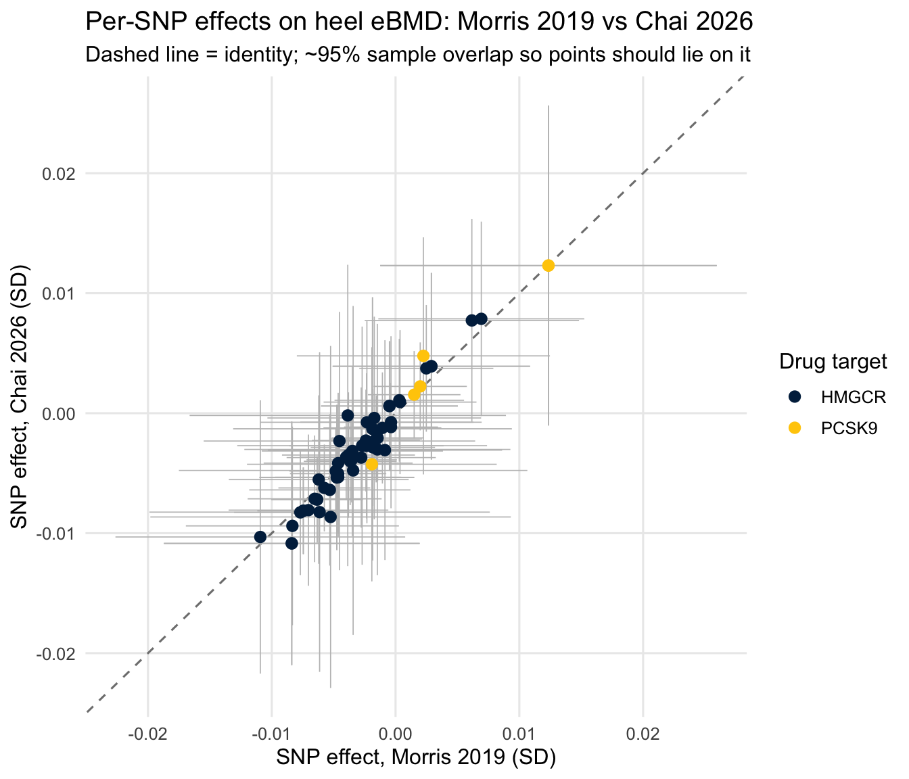
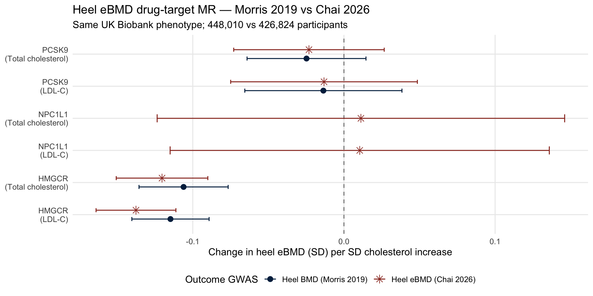
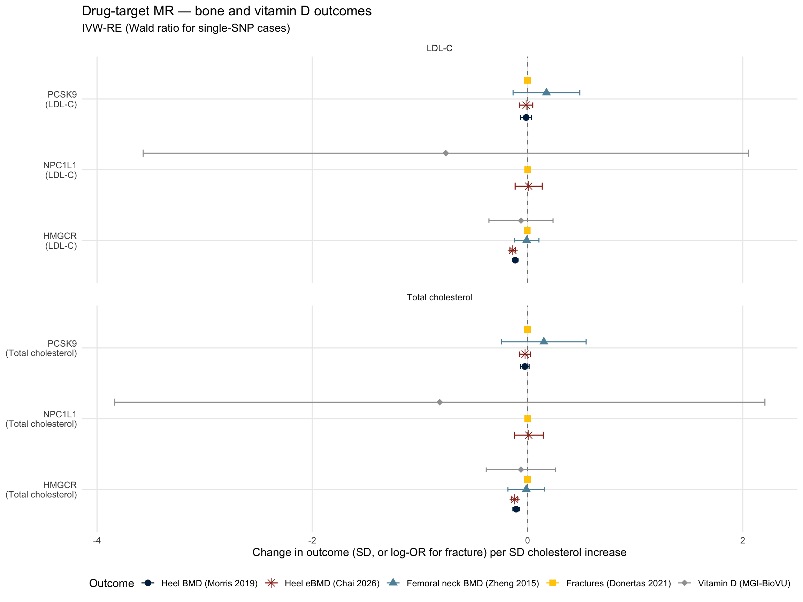
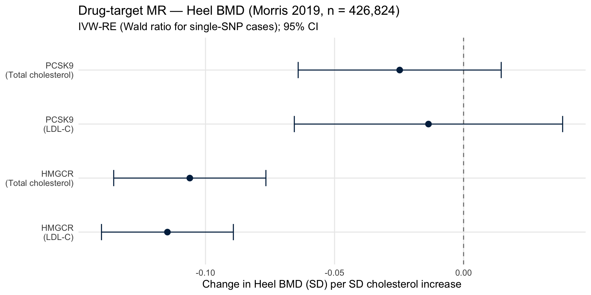
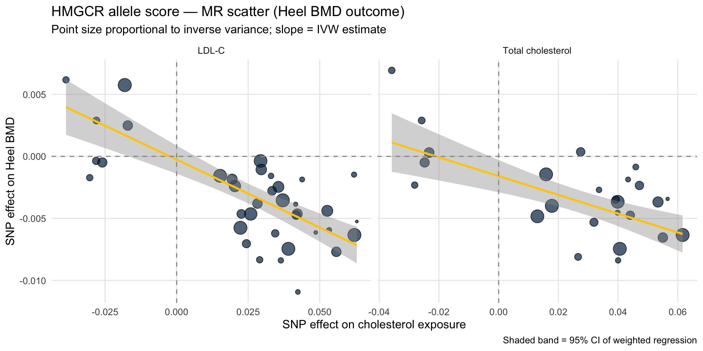

::: {.cell}

:::


## Purpose

This script implements a **drug-target Mendelian Randomization (MR)** analysis
testing whether genetically proxied reductions in LDL-cholesterol (LDL-C) and
total cholesterol causally affect bone mineral density (BMD), fracture risk,
and (as a negative control) vitamin D. The three lipid-lowering drug targets
evaluated are **HMGCR** (statins), **PCSK9** (PCSK9 inhibitors), and
**NPC1L1** (ezetimibe).

This analysis is a parallel extension of the previously completed
drug-target MR for serum calcium. The motivating hypothesis is that the
cholesterol → bone demineralization → calcium release pathway is
**mevalonate-pathway-mediated** rather than LDL-C-mediated. If true, this
predicts:

- **HMGCR cis-instruments**: significant negative effect on BMD (effect on
  bone phenotype is direct via mevalonate-pathway intermediates such as
  farnesyl pyrophosphate and geranylgeranyl pyrophosphate)
- **PCSK9 cis-instruments**: null effect on BMD with tight CI
  (PCSK9 inhibition lowers LDL-C via increased LDLR-mediated uptake without
  engaging the mevalonate pathway in non-hepatic tissues)
- **NPC1L1 cis-instruments**: null effect on BMD with wider CI
  (ezetimibe lowers cholesterol via intestinal absorption inhibition; bypasses
  mevalonate pathway entirely)

The pattern of HMGCR-significant but PCSK9-null effects, if observed, would
provide positive evidence that the cholesterol → BMD pathway is mevalonate-
mediated rather than LDL-C-mediated. This parallels the drug-target MR
finding for serum calcium and motivates the cell-specific HMGCR knockout
experiments proposed in Aim 1A2.

### Outcomes

This script evaluates five outcomes:

- **Heel BMD** (Morris et al. 2019, UK Biobank quantitative ultrasound,
  n = 426,824, 13.7M variants): primary BMD outcome
- **Heel eBMD** (Chai et al. 2026, UK Biobank quantitative ultrasound,
  n = 448,010, 21.6M variants): replication / higher-density re-analysis
  of the same phenotype (see below)
- **Femoral neck BMD** (Zheng et al. 2015, GEFOS, n = 32,735): secondary
  lower-powered BMD outcome
- **Fractures** (Dönertaş et al. 2021, UK Biobank, n = 484,598):
  clinical endpoint
- **25-hydroxyvitamin D** (MGI-BioVU LabWAS, n = 12,250): negative control

### Why add Chai 2026?

`GCST90726625` (Chai RC et al., *Nat Genet*, 2026;
[PMID 42432248](https://www.ebi.ac.uk/gwas/publications/42432248)) is the
same UK Biobank heel quantitative-ultrasound eBMD phenotype as Morris 2019,
with a 5.0% larger sample (448,010 vs 426,824) — worth only ≈2.4% narrower
confidence intervals, which will not move the HMGCR or PCSK9 conclusions.
It is **not** an independent replication: the participants are ~95% shared.

The reason to add it is **variant density**, not power. Morris 2019 as hosted
on OpenGWAS carries 13,705,641 variants; Chai 2026 carries 21,628,442
(+58%). This matters for exactly one thing in this script:

> The single NPC1L1 cis-instrument surviving `p < 5e-8` / `r² < 0.001`
> is **absent from the Morris 2019 summary statistics**, so ezetimibe has no
> heel-BMD estimate at all in the primary analysis (it appears only for
> Fractures and Vitamin D). The denser Chai variant set is the most direct
> route to recovering it.

Note, however, that outcome density is only *half* of the NPC1L1 problem —
the other half is on the exposure side, where strict clumping leaves a single
instrument regardless of which outcome GWAS is used. The
[NPC1L1 sensitivity section](#npc1l1-relaxed-cis-instrument-sensitivity)
addresses that separately.

### Sample Overlap Considerations

The LDL-C exposure GWAS (`ieu-b-110`, UKB Neale Lab, n ≈ 440,546) overlaps
with the UK Biobank-derived outcome GWAS for heel BMD (Morris 2019, UKB),
heel eBMD (Chai 2026, UKB) and fractures (Dönertaş 2021, UKB). This means the
analysis is effectively a *one-sample* MR for those outcome × exposure
combinations. With strong instruments (F >> 10), one-sample bias is generally
toward the null. The total cholesterol exposure (`ebi-a-GCST90025953`, GLGC
meta-analysis) is non-overlapping with UKB, so estimates from that
exposure are immune to sample overlap concerns. Zheng 2015 femoral neck
BMD (GEFOS) and the MGI-BioVU vitamin D GWAS are non-overlapping with
both exposures. Chai 2026 does **not** improve the overlap situation — if
anything it is marginally worse than Morris 2019.

---

## Setup


::: {.cell}

```{.r .cell-code}
library(tidyverse)
library(TwoSampleMR)
library(ieugwasr)
library(data.table)
library(knitr)
library(kableExtra)

# ── Drug-target gene windows (GRCh37/hg19 ±500 kb around gene body) ──────────
WINDOW_KB <- 500

gene_windows <- tribble(
  ~gene,    ~chr, ~gene_start,  ~gene_end,
  "HMGCR",  5,    74632993,     74657941,
  "PCSK9",  1,    55505221,     55530525,
  "NPC1L1", 7,    44552971,     44604640
) %>%
  mutate(
    region_start = pmax(0, gene_start - WINDOW_KB * 1000),
    region_end   = gene_end + WINDOW_KB * 1000,
    region_str   = str_glue("{chr}:{region_start}-{region_end}")
  )

kable(gene_windows %>% select(gene, chr, region_start, region_end, region_str),
      caption = "Drug-target gene windows (GRCh37, ±500 kb)")
```

::: {.cell-output-display}


Table: Drug-target gene windows (GRCh37, ±500 kb)

|gene   | chr| region_start| region_end|region_str          |
|:------|---:|------------:|----------:|:-------------------|
|HMGCR  |   5|     74132993|   75157941|5:74132993-75157941 |
|PCSK9  |   1|     55005221|   56030525|1:55005221-56030525 |
|NPC1L1 |   7|     44052971|   45104640|7:44052971-45104640 |


:::

```{.r .cell-code}
# ── Outcome GWAS IDs ─────────────────────────────────────────────────────────
outcome_gwas <- tribble(
  ~label,                              ~gwas_id,              ~n,       ~year, ~pmid,    ~kind,
  "Heel BMD (Morris 2019)",            "ebi-a-GCST006979",    426824,   2019,  30598549, "ukb",
  "Heel eBMD (Chai 2026)",             "GCST90726625",        448010,   2026,  42432248, "gwascat",
  "Femoral neck BMD (Zheng 2015)",     "ieu-a-980",           32735,    2015,  26367794, "ukb",
  "Fractures (Donertas 2021)",         "ebi-a-GCST90038703",  484598,   2021,  34187969, "ukb",
  "Vitamin D (MGI-BioVU)",             "local",               12250,    2020,  32907938, "mgi"
)

kable(outcome_gwas %>% select(label, gwas_id, n, year, pmid),
      caption = "Outcome GWAS for drug-target MR")
```

::: {.cell-output-display}


Table: Outcome GWAS for drug-target MR

|label                         |gwas_id            |      n| year|     pmid|
|:-----------------------------|:------------------|------:|----:|--------:|
|Heel BMD (Morris 2019)        |ebi-a-GCST006979   | 426824| 2019| 30598549|
|Heel eBMD (Chai 2026)         |GCST90726625       | 448010| 2026| 42432248|
|Femoral neck BMD (Zheng 2015) |ieu-a-980          |  32735| 2015| 26367794|
|Fractures (Donertas 2021)     |ebi-a-GCST90038703 | 484598| 2021| 34187969|
|Vitamin D (MGI-BioVU)         |local              |  12250| 2020| 32907938|


:::

```{.r .cell-code}
# ── Colour / shape keys reused by every figure ───────────────────────────────
outcome_colours <- c(
  "Heel BMD (Morris 2019)"        = "#00274c",  # U-M blue
  "Heel eBMD (Chai 2026)"         = "#9a3324",  # U-M tappan red
  "Femoral neck BMD (Zheng 2015)" = "#5e92a8",
  "Fractures (Donertas 2021)"     = "#ffcb05",  # U-M maize
  "Vitamin D (MGI-BioVU)"         = "#a0a0a0"
)

outcome_shapes <- c(
  "Heel BMD (Morris 2019)"        = 16,
  "Heel eBMD (Chai 2026)"         = 8,
  "Femoral neck BMD (Zheng 2015)" = 17,
  "Fractures (Donertas 2021)"     = 15,
  "Vitamin D (MGI-BioVU)"         = 18
)

outcome_levels <- names(outcome_colours)
```
:::


---

## Exposure: Instrument Extraction

Instruments are drawn from two large GWAS:

- **`ieu-b-110`**: LDL-C from UK Biobank (Neale Lab) — overlaps with UKB outcomes
- **`ebi-a-GCST90025953`**: Total cholesterol from the Global Lipids Genetics
  Consortium meta-analysis — non-overlapping with UKB


::: {.cell}

```{.r .cell-code}
exposure_ids <- c(
  "LDL-C"             = "ieu-b-110",
  "Total cholesterol" = "ebi-a-GCST90025953"
)

extract_regional <- function(gwas_id, gene_df) {
  map_dfr(seq_len(nrow(gene_df)), function(i) {
    row <- gene_df[i, ]
    cat("  Querying", gwas_id, "—", row$gene, "(", row$region_str, ")\n")
    tryCatch({
      res <- ieugwasr::associations(
        variants = row$region_str,
        id       = gwas_id,
        proxies  = FALSE
      )
      if (nrow(res) == 0) return(tibble())

      res_tib <- res %>% as_tibble()

      if ("pos" %in% names(res_tib) && !"position" %in% names(res_tib)) {
        res_tib <- res_tib %>% dplyr::rename(position = pos)
      } else if (!"position" %in% names(res_tib)) {
        res_tib <- res_tib %>% mutate(position = NA_integer_)
      }

      res_tib %>%
        mutate(
          position = as.integer(position),
          n        = as.character(n),
          beta     = as.numeric(beta),
          se       = as.numeric(se),
          eaf      = as.numeric(eaf),
          p        = as.numeric(p),
          gene     = row$gene,
          gwas_id  = gwas_id
        ) %>%
        select(-any_of("pos"))

    }, error = function(e) {
      warning("Failed for ", gwas_id, " / ", row$gene, ": ", e$message)
      tibble()
    })
  })
}

cat("Extracting regional SNPs from OpenGWAS...\n\n")
```

::: {.cell-output .cell-output-stdout}

```
Extracting regional SNPs from OpenGWAS...
```


:::

```{.r .cell-code}
regional_raw <- map_dfr(names(exposure_ids), function(name) {
  cat("== Exposure:", name, "(", exposure_ids[name], ") ==\n")
  extract_regional(exposure_ids[name], gene_windows) %>%
    mutate(exposure_name = name)
})
```

::: {.cell-output .cell-output-stdout}

```
== Exposure: LDL-C ( ieu-b-110 ) ==
  Querying ieu-b-110 — HMGCR ( 5:74132993-75157941 )
```


:::

::: {.cell-output .cell-output-stdout}

```
  Querying ieu-b-110 — PCSK9 ( 1:55005221-56030525 )
```


:::

::: {.cell-output .cell-output-stdout}

```
  Querying ieu-b-110 — NPC1L1 ( 7:44052971-45104640 )
```


:::

::: {.cell-output .cell-output-stdout}

```
== Exposure: Total cholesterol ( ebi-a-GCST90025953 ) ==
  Querying ebi-a-GCST90025953 — HMGCR ( 5:74132993-75157941 )
```


:::

::: {.cell-output .cell-output-stdout}

```
  Querying ebi-a-GCST90025953 — PCSK9 ( 1:55005221-56030525 )
```


:::

::: {.cell-output .cell-output-stdout}

```
  Querying ebi-a-GCST90025953 — NPC1L1 ( 7:44052971-45104640 )
```


:::

```{.r .cell-code}
regional_raw %>%
  count(exposure_name, gene, name = "n_snps_raw") %>%
  kable(caption = "Raw SNP counts per gene window (pre-filtering, pre-clumping)")
```

::: {.cell-output-display}


Table: Raw SNP counts per gene window (pre-filtering, pre-clumping)

|exposure_name     |gene   | n_snps_raw|
|:-----------------|:------|----------:|
|LDL-C             |HMGCR  |       3965|
|LDL-C             |NPC1L1 |       4072|
|LDL-C             |PCSK9  |       5360|
|Total cholesterol |HMGCR  |       1603|
|Total cholesterol |NPC1L1 |       4556|
|Total cholesterol |PCSK9  |       3399|


:::
:::


### Clumping and Instrument Finalisation

Following the same approach as the calcium drug-target MR:

- **HMGCR**: allele score at `r²<0.30` (Swerdlow et al. 2015 *Lancet*)
- **PCSK9**: strict clumping at `r²<0.001`
- **NPC1L1**: strict clumping at `r²<0.001`


::: {.cell}

```{.r .cell-code}
clump_gene <- function(df, gene_name, p_thresh, r2_thresh) {
  df %>%
    filter(gene == gene_name, p <= p_thresh) %>%
    group_by(exposure_name, gene) %>%
    group_modify(~ {
      if (nrow(.x) < 2) return(.x)
      tryCatch(
        ieugwasr::ld_clump(
          tibble(rsid = .x$rsid, pval = .x$p, id = .x$gwas_id),
          clump_r2 = r2_thresh,
          clump_kb = 10000,
          pop      = "EUR"
        ) %>% inner_join(.x, by = "rsid"),
        error = function(e) { warning(e$message); .x }
      )
    }) %>%
    ungroup()
}

instruments_hmgcr  <- clump_gene(regional_raw, "HMGCR",  5e-8, 0.30)
instruments_pcsk9  <- clump_gene(regional_raw, "PCSK9",  5e-8, 0.001)
instruments_npc1l1 <- clump_gene(regional_raw, "NPC1L1", 5e-8, 0.001)

instruments_final <- bind_rows(instruments_hmgcr,
                               instruments_pcsk9,
                               instruments_npc1l1)

instruments_final %>%
  mutate(F_stat = (beta / se)^2) %>%
  group_by(exposure_name, gene) %>%
  summarise(
    n_SNPs   = n(),
    min_F    = round(min(F_stat), 1),
    median_F = round(median(F_stat), 1),
    max_F    = round(max(F_stat), 1),
    min_p    = signif(min(p), 2),
    .groups  = "drop"
  ) %>%
  kable(caption = "Final instrument sets across all three drug targets")
```

::: {.cell-output-display}


Table: Final instrument sets across all three drug targets

|exposure_name     |gene   | n_SNPs| min_F| median_F|  max_F| min_p|
|:-----------------|:------|------:|-----:|--------:|------:|-----:|
|LDL-C             |HMGCR  |     43|  29.9|     66.2|  852.8|     0|
|LDL-C             |NPC1L1 |      1| 176.9|    176.9|  176.9|     0|
|LDL-C             |PCSK9  |      3| 137.3|    381.1| 1930.4|     0|
|Total cholesterol |HMGCR  |     26|  32.3|     61.4|  865.5|     0|
|Total cholesterol |NPC1L1 |      1| 156.8|    156.8|  156.8|     0|
|Total cholesterol |PCSK9  |      3| 135.7|    344.8| 1714.0|     0|


:::
:::


### Relaxed NPC1L1 Instrument Sets (Sensitivity Only)

At `p < 5e-8` / `r² < 0.001` the NPC1L1 window yields a **single** instrument
per exposure, which caps the analysis at a Wald ratio with no heterogeneity
or pleiotropy diagnostics. A denser *outcome* GWAS cannot fix this — the
constraint is on the exposure side.

Relaxing the significance threshold inside a *cis* window is standard practice
for drug-target MR, because the biological validity of the instrument comes
from its location in the drug-target gene rather than from genome-wide
significance. Two relaxed sets are built:

- **`relaxed_indep`** — `p < 1e-6`, `r² < 0.001`. SNPs remain approximately
  independent, so the standard IVW / weighted-median machinery below is valid
  as-is. This is the set reported as the NPC1L1 sensitivity analysis.
- **`relaxed_corr`** — `p < 1e-6`, `r² < 0.30` (matching the HMGCR allele-score
  convention). These SNPs are correlated, so naïve IVW understates the standard
  error. Used only with the correlation-aware IVW below.

These sets are held **entirely separate** from `instruments_final` so that the
primary HMGCR / PCSK9 / NPC1L1 results are unchanged.

::: {.callout-warning}
## `clump_gene()` fails silently

The `clump_gene()` helper above catches `ld_clump` errors with
`warning(e$message); .x` — it returns the **unclumped** SNP set on failure.
With `warning: false` in the document header that warning is invisible, so a
dead or unauthenticated OpenGWAS LD endpoint yields hundreds of correlated
SNPs that look like a legitimate instrument set. At `p < 1e-6` the NPC1L1
window holds 407 (LDL-C) and 25 (total cholesterol) variants, so the failure
mode is not subtle once it propagates downstream.

`select_cis_instruments()` below therefore checks whether clumping actually
removed anything and falls back to **distance-based pruning** — which needs no
API — reporting which method was used. `clump_gene()` is left untouched so the
cached primary instrument sets stay valid.
:::


::: {.cell}

```{.r .cell-code}
# Deliberately NOT cached. Both this chunk and the OpenGWAS top-up below can
# "succeed" in a degraded state when the API is unavailable — distance pruning
# instead of LD clumping, zero recovered rsIDs. Caching that state freezes the
# degraded result in place: the code is unchanged, so fixing the token would
# not invalidate the cache and the failure would silently persist across every
# later render. Two ld_clump calls are cheap enough to repeat.

NPC1L1_P_RELAXED <- 1e-6
NPC1L1_R2_INDEP  <- 0.001
NPC1L1_R2_CORR   <- 0.30
NPC1L1_MAX_SNPS  <- 30

# Greedy distance pruning: keep the most significant SNP, then any SNP at
# least min_kb away from every SNP already kept. LD-free, so it works with no
# API access at all.
prune_by_distance <- function(d, min_kb) {
  d    <- d %>% arrange(p)
  pos  <- d$position
  keep <- integer(0)
  for (i in seq_len(nrow(d))) {
    if (!length(keep) || all(abs(pos[i] - pos[keep]) > min_kb * 1000)) {
      keep <- c(keep, i)
    }
  }
  d[keep, ]
}

select_cis_instruments <- function(df, gene_name, p_thresh, r2_thresh,
                                   min_kb, max_snps) {
  sub <- df %>% filter(gene == gene_name, p <= p_thresh, !is.na(position))
  if (!nrow(sub)) return(tibble())

  map_dfr(unique(sub$exposure_name), function(ex) {
    d <- sub %>% filter(exposure_name == ex) %>% arrange(p)
    if (nrow(d) < 2) return(d %>% mutate(selection = "single SNP"))

    cl <- tryCatch(
      ieugwasr::ld_clump(
        tibble(rsid = d$rsid, pval = d$p, id = d$gwas_id),
        clump_r2 = r2_thresh, clump_kb = 10000, pop = "EUR"
      ),
      error = function(e) {
        message("  [", ex, "] ld_clump failed: ", conditionMessage(e))
        NULL
      }
    )

    # "Returned everything" from a dense window means the call no-oped.
    clump_ok <- !is.null(cl) && nrow(cl) > 0 &&
      (nrow(cl) < nrow(d) || nrow(d) <= 5)

    out <- if (clump_ok) {
      d %>% filter(rsid %in% cl$rsid) %>% mutate(selection = "LD-clumped")
    } else {
      if (!is.null(cl) && nrow(cl) == nrow(d) && nrow(d) > 5) {
        message("  [", ex, "] ld_clump returned all ", nrow(d),
                " SNPs unchanged — treating as a failure.")
      }
      message("  [", ex, "] falling back to ", min_kb, " kb distance pruning.")
      prune_by_distance(d, min_kb) %>%
        mutate(selection = paste0("distance-pruned (", min_kb, " kb)"))
    }

    out %>% arrange(p) %>% slice_head(n = max_snps)
  })
}

instruments_npc1l1_indep <- select_cis_instruments(
  regional_raw, "NPC1L1", NPC1L1_P_RELAXED, NPC1L1_R2_INDEP,
  min_kb = 250, max_snps = NPC1L1_MAX_SNPS
) %>% mutate(instrument_set = "relaxed_indep")
```

::: {.cell-output .cell-output-stderr}

```
Please look at vignettes for options on running this locally if you need to run many instances of this command.
```


:::

::: {.cell-output .cell-output-stderr}

```
Clumping ieu-b-110, 407 variants, using EUR population reference
```


:::

::: {.cell-output .cell-output-stderr}

```
Removing 406 of 407 variants due to LD with other variants or absence from LD reference panel
```


:::

::: {.cell-output .cell-output-stderr}

```
Please look at vignettes for options on running this locally if you need to run many instances of this command.
```


:::

::: {.cell-output .cell-output-stderr}

```
Clumping ebi-a-GCST90025953, 25 variants, using EUR population reference
```


:::

::: {.cell-output .cell-output-stderr}

```
Removing 24 of 25 variants due to LD with other variants or absence from LD reference panel
```


:::

```{.r .cell-code}
instruments_npc1l1_corr <- select_cis_instruments(
  regional_raw, "NPC1L1", NPC1L1_P_RELAXED, NPC1L1_R2_CORR,
  min_kb = 50, max_snps = NPC1L1_MAX_SNPS
) %>% mutate(instrument_set = "relaxed_corr")
```

::: {.cell-output .cell-output-stderr}

```
Please look at vignettes for options on running this locally if you need to run many instances of this command.
```


:::

::: {.cell-output .cell-output-stderr}

```
Clumping ieu-b-110, 407 variants, using EUR population reference
```


:::

::: {.cell-output .cell-output-stderr}

```
Removing 400 of 407 variants due to LD with other variants or absence from LD reference panel
```


:::

::: {.cell-output .cell-output-stderr}

```
Please look at vignettes for options on running this locally if you need to run many instances of this command.
```


:::

::: {.cell-output .cell-output-stderr}

```
Clumping ebi-a-GCST90025953, 25 variants, using EUR population reference
```


:::

::: {.cell-output .cell-output-stderr}

```
Removing 21 of 25 variants due to LD with other variants or absence from LD reference panel
```


:::

```{.r .cell-code}
instruments_npc1l1_relaxed <- bind_rows(instruments_npc1l1_indep,
                                        instruments_npc1l1_corr)

# Hard stop before these rsIDs are handed to any API call.
if (nrow(instruments_npc1l1_relaxed) > 2 * NPC1L1_MAX_SNPS * 2) {
  stop("Relaxed NPC1L1 sets are implausibly large (",
       nrow(instruments_npc1l1_relaxed),
       " rows) — instrument selection did not converge.")
}

bind_rows(
  instruments_npc1l1 %>% mutate(instrument_set = "primary (5e-8, r2<0.001)",
                                selection = "LD-clumped (cached)"),
  instruments_npc1l1_relaxed
) %>%
  mutate(F_stat = (beta / se)^2) %>%
  group_by(instrument_set, exposure_name, selection) %>%
  summarise(
    n_SNPs   = n(),
    min_F    = round(min(F_stat), 1),
    median_F = round(median(F_stat), 1),
    min_p    = signif(min(p), 2),
    .groups  = "drop"
  ) %>%
  kable(caption = paste0(
    "NPC1L1 instrument counts — primary vs relaxed cis-selection. ",
    "Check the 'selection' column: 'distance-pruned' means the OpenGWAS LD ",
    "endpoint was unreachable and these are only approximately independent."
  ))
```

::: {.cell-output-display}


Table: NPC1L1 instrument counts — primary vs relaxed cis-selection. Check the 'selection' column: 'distance-pruned' means the OpenGWAS LD endpoint was unreachable and these are only approximately independent.

|instrument_set           |exposure_name     |selection           | n_SNPs| min_F| median_F| min_p|
|:------------------------|:-----------------|:-------------------|------:|-----:|--------:|-----:|
|primary (5e-8, r2<0.001) |LDL-C             |LD-clumped (cached) |      1| 176.9|    176.9|     0|
|primary (5e-8, r2<0.001) |Total cholesterol |LD-clumped (cached) |      1| 156.8|    156.8|     0|
|relaxed_corr             |LDL-C             |LD-clumped          |      7|  27.9|     46.0|     0|
|relaxed_corr             |Total cholesterol |LD-clumped          |      4|  37.0|     59.4|     0|
|relaxed_indep            |LDL-C             |LD-clumped          |      1| 176.9|    176.9|     0|
|relaxed_indep            |Total cholesterol |LD-clumped          |      1| 156.8|    156.8|     0|


:::
:::


---

## Outcomes: Fetching from OpenGWAS

For the three OpenGWAS-hosted outcomes (Heel BMD, Femoral neck BMD,
Fractures), we query directly via the API using the instrument rsIDs.
Vitamin D is loaded from a local PheWeb file.


::: {.cell}

```{.r .cell-code}
all_rsids <- instruments_final %>% distinct(rsid) %>% pull(rsid)

cat("Total unique instrument SNPs to query:", length(all_rsids), "\n\n")
```

::: {.cell-output .cell-output-stdout}

```
Total unique instrument SNPs to query: 68 
```


:::

```{.r .cell-code}
# Outcomes hosted on OpenGWAS
opengwas_outcomes <- outcome_gwas %>% filter(kind == "ukb", gwas_id != "local")

fetch_opengwas_outcome <- function(gwas_id, label) {
  cat("  Fetching", label, "(", gwas_id, ")...\n")
  res <- tryCatch({
    ieugwasr::associations(
      variants = all_rsids,
      id       = gwas_id,
      proxies  = FALSE
    ) %>% as_tibble()
  }, error = function(e) { cat("    Failed:", e$message, "\n"); tibble() })

  if (nrow(res) == 0) return(tibble())

  if ("pos" %in% names(res) && !"position" %in% names(res)) {
    res <- res %>% dplyr::rename(position = pos)
  }

  res %>%
    mutate(
      position = as.integer(position),
      chr      = as.character(chr),
      beta     = as.numeric(beta),
      se       = as.numeric(se),
      eaf      = as.numeric(eaf),
      p        = as.numeric(p),
      outcome_label = label,
      outcome_gwas_id = gwas_id
    )
}

opengwas_outcome_raw <- pmap_dfr(
  list(opengwas_outcomes$gwas_id, opengwas_outcomes$label),
  fetch_opengwas_outcome
)
```

::: {.cell-output .cell-output-stdout}

```
  Fetching Heel BMD (Morris 2019) ( ebi-a-GCST006979 )...
```


:::

::: {.cell-output .cell-output-stdout}

```
  Fetching Femoral neck BMD (Zheng 2015) ( ieu-a-980 )...
```


:::

::: {.cell-output .cell-output-stdout}

```
  Fetching Fractures (Donertas 2021) ( ebi-a-GCST90038703 )...
```


:::

```{.r .cell-code}
# Coverage check
opengwas_outcome_raw %>%
  count(outcome_label, name = "n_snps_returned") %>%
  mutate(n_instruments = length(all_rsids),
         pct_recovered = round(100 * n_snps_returned / n_instruments, 1)) %>%
  kable(caption = "OpenGWAS outcome SNP recovery (direct rsID match)")
```

::: {.cell-output-display}


Table: OpenGWAS outcome SNP recovery (direct rsID match)

|outcome_label                 | n_snps_returned| n_instruments| pct_recovered|
|:-----------------------------|---------------:|-------------:|-------------:|
|Femoral neck BMD (Zheng 2015) |              47|            68|          69.1|
|Fractures (Donertas 2021)     |              68|            68|         100.0|
|Heel BMD (Morris 2019)        |              60|            68|          88.2|


:::
:::


::: {.cell}

:::


### Coverage by Gene


::: {.cell}

```{.r .cell-code}
opengwas_coverage <- instruments_final %>%
  distinct(rsid, exposure_name, gene) %>%
  left_join(
    opengwas_outcome_raw %>% distinct(rsid, outcome_label) %>% mutate(found = TRUE),
    by = "rsid",
    relationship = "many-to-many"
  ) %>%
  filter(!is.na(outcome_label)) %>%
  count(outcome_label, exposure_name, gene, name = "n_in_outcome")

# Compare to instrument counts
instruments_final %>%
  count(exposure_name, gene, name = "n_instruments") %>%
  left_join(opengwas_coverage,
            by = c("exposure_name", "gene"),
            relationship = "many-to-many") %>%
  pivot_wider(names_from = outcome_label,
              values_from = n_in_outcome,
              values_fill = 0L) %>%
  kable(caption = "OpenGWAS outcome coverage by drug target and exposure")
```

::: {.cell-output-display}


Table: OpenGWAS outcome coverage by drug target and exposure

|exposure_name     |gene   | n_instruments| Femoral neck BMD (Zheng 2015)| Fractures (Donertas 2021)| Heel BMD (Morris 2019)|
|:-----------------|:------|-------------:|-----------------------------:|-------------------------:|----------------------:|
|LDL-C             |HMGCR  |            43|                            32|                        43|                     37|
|LDL-C             |NPC1L1 |             1|                             0|                         1|                      0|
|LDL-C             |PCSK9  |             3|                             2|                         3|                      3|
|Total cholesterol |HMGCR  |            26|                            16|                        26|                     25|
|Total cholesterol |NPC1L1 |             1|                             0|                         1|                      0|
|Total cholesterol |PCSK9  |             3|                             1|                         3|                      3|


:::
:::


### Standardising OpenGWAS Outcomes


::: {.cell}

```{.r .cell-code}
opengwas_outcome_std <- opengwas_outcome_raw %>%
  dplyr::rename(
    REF      = nea,
    ALT      = ea,
    pval     = p,
    eaf_out  = eaf
  ) %>%
  mutate(
    CHR = as.integer(chr),
    POS = as.integer(position)
  ) %>%
  filter(!is.na(CHR), !is.na(POS)) %>%
  select(rsid, CHR, POS, REF, ALT,
         beta_out = beta, se_out = se, pval_out = pval, eaf_out,
         outcome_label, outcome_gwas_id)

cat("OpenGWAS outcomes standardised:",
    scales::comma(nrow(opengwas_outcome_std)),
    "SNP-outcome pairs ready for harmonisation\n")
```

::: {.cell-output .cell-output-stdout}

```
OpenGWAS outcomes standardised: 175 SNP-outcome pairs ready for harmonisation
```


:::
:::


### Topping Up Morris 2019 with the Relaxed NPC1L1 rsIDs

The relaxed NPC1L1 instruments are fetched **separately** and in small
batches, rather than being folded into `all_rsids` above. Two reasons: it
keeps the cached primary query byte-identical so it is never re-run against
the API, and a failure here degrades only the NPC1L1 sensitivity rather than
emptying every outcome.


::: {.cell}

```{.r .cell-code}
# Not cached — see the note on the relaxed-instruments chunk. This is a single
# call for a handful of rsIDs; caching a zero-recovery failure is far more
# costly than repeating it.
extra_rsids <- setdiff(unique(instruments_npc1l1_relaxed$rsid), all_rsids)

cat("Extra rsIDs needed for the relaxed NPC1L1 sets:",
    length(extra_rsids), "\n")
```

::: {.cell-output .cell-output-stdout}

```
Extra rsIDs needed for the relaxed NPC1L1 sets: 9 
```


:::

```{.r .cell-code}
extra_std <- tibble()

if (length(extra_rsids)) {
  batches   <- split(extra_rsids, ceiling(seq_along(extra_rsids) / 100))
  extra_raw <- map_dfr(batches, function(b) {
    tryCatch(
      ieugwasr::associations(variants = b,
                             id       = "ebi-a-GCST006979",
                             proxies  = FALSE) %>% as_tibble(),
      error = function(e) {
        cat("    batch of", length(b), "failed:", e$message, "\n")
        tibble()
      }
    )
  })

  if (nrow(extra_raw)) {
    if ("pos" %in% names(extra_raw) && !"position" %in% names(extra_raw)) {
      extra_raw <- dplyr::rename(extra_raw, position = pos)
    }
    extra_std <- extra_raw %>%
      transmute(
        rsid,
        CHR      = suppressWarnings(as.integer(chr)),
        POS      = suppressWarnings(as.integer(position)),
        REF      = nea,
        ALT      = ea,
        beta_out = as.numeric(beta),
        se_out   = as.numeric(se),
        pval_out = as.numeric(p),
        eaf_out  = as.numeric(eaf),
        outcome_label   = "Heel BMD (Morris 2019)",
        outcome_gwas_id = "ebi-a-GCST006979"
      )
    cat("Recovered", nrow(extra_std), "of", length(extra_rsids),
        "extra rsIDs from Morris 2019\n")
  } else {
    cat("WARNING: no extra rsIDs recovered. The relaxed NPC1L1 comparison\n",
        "will show Chai 2026 only; the Morris arm will be under-covered.\n")
  }
}
```

::: {.cell-output .cell-output-stdout}

```
Recovered 8 of 9 extra rsIDs from Morris 2019
```


:::

```{.r .cell-code}
opengwas_outcome_std <- bind_rows(opengwas_outcome_std, extra_std) %>%
  distinct(rsid, outcome_label, .keep_all = TRUE)

cat("Standardised OpenGWAS table now holds",
    scales::comma(nrow(opengwas_outcome_std)), "SNP-outcome pairs\n")
```

::: {.cell-output .cell-output-stdout}

```
Standardised OpenGWAS table now holds 183 SNP-outcome pairs
```


:::
:::


---

## Outcome: Vitamin D (MGI-BioVU LabWAS, Negative Control)

The Vitamin D analysis acts as a negative control. We do NOT expect any of
the drug-target instruments to affect vitamin D, since the genome-wide MR
already rejected cholesterol → vitamin D as a mediator of the
cholesterol → calcium effect.


::: {.cell}

```{.r .cell-code}
cat("Loading MGI-BioVU vitamin D GWAS...\n")
```

::: {.cell-output .cell-output-stdout}

```
Loading MGI-BioVU vitamin D GWAS...
```


:::

```{.r .cell-code}
vitd_gwas_raw <- read_tsv(
  gzfile("PheWeb Summary Statistics/phenocode-Vit-D.tsv.gz"),
  show_col_types = FALSE
)

cat("Columns:\n"); print(names(vitd_gwas_raw))
```

::: {.cell-output .cell-output-stdout}

```
Columns:
```


:::

::: {.cell-output .cell-output-stdout}

```
 [1] "chrom"         "pos"           "ref"           "alt"          
 [5] "rsids"         "nearest_genes" "pval"          "beta"         
 [9] "sebeta"        "maf"          
```


:::

```{.r .cell-code}
vitd_gwas <- vitd_gwas_raw %>%
  as_tibble() %>%
  dplyr::rename(
    CHR  = chrom,
    POS  = pos,
    REF  = ref,
    ALT  = alt,
    pval = pval,
    beta = beta,
    se   = sebeta,
    eaf  = maf
  ) %>%
  mutate(CHR = as.integer(str_remove(as.character(CHR), "^chr")),
         POS = as.integer(POS)) %>%
  select(CHR, POS, REF, ALT,
         beta_vitd = beta, se_vitd = se, pval_vitd = pval, eaf_vitd = eaf)

cat("\nMGI-BioVU vitamin D GWAS:",
    scales::comma(nrow(vitd_gwas)), "SNPs\n")
```

::: {.cell-output .cell-output-stdout}

```

MGI-BioVU vitamin D GWAS: 763,597 SNPs
```


:::
:::


---

## Outcome: Heel eBMD (Chai 2026, GWAS Catalog `GCST90726625`)

This outcome is **not** on OpenGWAS, so it is read from the GWAS Catalog FTP
flat file. The full file is ~21.6M rows, so it is never loaded into memory:
the instrument rsIDs are written to a temp file and `awk` streams the
gzipped summary statistics, keeping only matching rows.

Matching is by **rsID**, not position, which sidesteps the genome-build
question entirely (the harmonised file reports `hm_coordinate_conversion = lo`,
i.e. lifted over to GRCh38, while the `gene_windows` above and the OpenGWAS
exposures are GRCh37).

One wrinkle: `GCST90726625.h.tsv.gz` ships **two** rsID columns, `rsid`
(field 10) and `rs_id` (field 12), and they disagree on a minority of
variants — at 1:10177 A/AC, `rsid` is rs367896724 (the correct dbSNP ID for
that position and allele pair) while `rs_id` is rs201752861. One is the
harmoniser's dbSNP assignment and the other the author-submitted ID. Since
picking wrong would silently lose instruments — the exact failure this
outcome was added to fix — the extraction matches on **both** and reports
which column produced each hit.


::: {.cell}

```{.r .cell-code}
CHAI_ACC   <- "GCST90726625"
CHAI_DIR   <- file.path("raw_data", "gwas_catalog", CHAI_ACC)
CHAI_FTP   <- paste0(
  "http://ftp.ebi.ac.uk/pub/databases/gwas/summary_statistics/",
  "GCST90726001-GCST90727000/", CHAI_ACC
)

dir.create(CHAI_DIR, recursive = TRUE, showWarnings = FALSE)

# ── Resolve the actual filename on the FTP mirror ────────────────────────────
# Prefer the harmonised (GWAS-SSF) file when present; fall back to the
# author-submitted file.
list_gwascat_files <- function(dir_url) {
  txt <- tryCatch(
    paste(readLines(dir_url, warn = FALSE), collapse = "\n"),
    error = function(e) NA_character_
  )
  if (is.na(txt)) return(character(0))
  unique(str_extract_all(txt, '(?<=href=")[^"]+\\.tsv\\.gz')[[1]])
}

harm_listed <- list_gwascat_files(paste0(CHAI_FTP, "/harmonised/"))
root_listed <- list_gwascat_files(paste0(CHAI_FTP, "/"))

remote_files <- character(0)
if (length(harm_listed)) {
  remote_files <- c(remote_files,
                    paste0(CHAI_FTP, "/harmonised/", basename(harm_listed)))
}
if (length(root_listed)) {
  remote_files <- c(remote_files,
                    paste0(CHAI_FTP, "/", basename(root_listed)))
}

# Deterministic fallback if directory listing is blocked
if (!length(remote_files)) {
  remote_files <- c(
    paste0(CHAI_FTP, "/harmonised/", CHAI_ACC, ".h.tsv.gz"),
    paste0(CHAI_FTP, "/", CHAI_ACC, ".h.tsv.gz"),
    paste0(CHAI_FTP, "/", CHAI_ACC, ".tsv.gz")
  )
}

cat("Candidate remote files:\n"); print(remote_files)
```

::: {.cell-output .cell-output-stdout}

```
Candidate remote files:
```


:::

::: {.cell-output .cell-output-stdout}

```
[1] "http://ftp.ebi.ac.uk/pub/databases/gwas/summary_statistics/GCST90726001-GCST90727000/GCST90726625/harmonised/GCST90726625.h.tsv.gz"
[2] "http://ftp.ebi.ac.uk/pub/databases/gwas/summary_statistics/GCST90726001-GCST90727000/GCST90726625/GCST90726625.tsv.gz"             
```


:::

```{.r .cell-code}
chai_local <- file.path(CHAI_DIR, basename(remote_files[1]))

# Accept ANY already-downloaded .tsv.gz in CHAI_DIR (lets you wget it yourself)
existing <- list.files(CHAI_DIR, pattern = "\\.tsv\\.gz$", full.names = TRUE)
if (length(existing)) {
  chai_local <- existing[1]
  cat("Using existing local file:", chai_local, "\n")
} else {
  options(timeout = max(7200, getOption("timeout")))
  ok <- FALSE
  for (u in remote_files) {
    cat("Attempting download:", u, "\n")
    ok <- tryCatch({
      download.file(u, destfile = file.path(CHAI_DIR, basename(u)),
                    mode = "wb", quiet = FALSE)
      chai_local <- file.path(CHAI_DIR, basename(u))
      TRUE
    }, error = function(e) { cat("  failed:", e$message, "\n"); FALSE })
    if (ok) break
  }
  if (!ok) {
    stop(
      "Could not download ", CHAI_ACC, ".\n",
      "Fetch it manually into ", CHAI_DIR, " and re-render, e.g.:\n\n",
      "  mkdir -p '", CHAI_DIR, "'\n",
      "  curl -L -o '", CHAI_DIR, "/", CHAI_ACC, ".tsv.gz' \\\n",
      "    '", CHAI_FTP, "/", CHAI_ACC, ".tsv.gz'\n"
    )
  }
}
```

::: {.cell-output .cell-output-stdout}

```
Attempting download: http://ftp.ebi.ac.uk/pub/databases/gwas/summary_statistics/GCST90726001-GCST90727000/GCST90726625/harmonised/GCST90726625.h.tsv.gz 
```


:::

```{.r .cell-code}
cat("\nLocal file:", chai_local, "—",
    round(file.size(chai_local) / 1e9, 2), "GB\n")
```

::: {.cell-output .cell-output-stdout}

```

Local file: raw_data/gwas_catalog/GCST90726625/GCST90726625.h.tsv.gz — 0.68 GB
```


:::
:::


::: {.cell}

```{.r .cell-code}
# Peek at the header and first rows without decompressing the whole file.
chai_peek <- data.table::fread(
  cmd = paste("gzip -dc", shQuote(chai_local), "| head -n 5"),
  showProgress = FALSE
) %>% as_tibble()

cat("Columns in", basename(chai_local), ":\n")
```

::: {.cell-output .cell-output-stdout}

```
Columns in GCST90726625.h.tsv.gz :
```


:::

```{.r .cell-code}
print(names(chai_peek))
```

::: {.cell-output .cell-output-stdout}

```
 [1] "chromosome"                  "base_pair_location"         
 [3] "effect_allele"               "other_allele"               
 [5] "beta"                        "standard_error"             
 [7] "effect_allele_frequency"     "p_value"                    
 [9] "variant_id"                  "rsid"                       
[11] "info"                        "rs_id"                      
[13] "n"                           "p_value_infinitesimal_model"
[15] "hm_coordinate_conversion"    "hm_code"                    
```


:::

```{.r .cell-code}
print(chai_peek)
```

::: {.cell-output .cell-output-stdout}

```
# A tibble: 4 × 16
  chromosome base_pair_location effect_allele other_allele                beta
       <int>              <int> <chr>         <chr>                      <dbl>
1          1              10177 AC            A                       0.00140 
2          1              10511 A             G                       0.00567 
3          1              10616 C             CCGCCGTTGCAAAGGCGCGCCG -0.00705 
4          1              13111 A             G                       0.000133
# ℹ 11 more variables: standard_error <dbl>, effect_allele_frequency <dbl>,
#   p_value <dbl>, variant_id <chr>, rsid <chr>, info <dbl>, rs_id <chr>,
#   n <int>, p_value_infinitesimal_model <dbl>, hm_coordinate_conversion <chr>,
#   hm_code <int>
```


:::

```{.r .cell-code}
# Identify EVERY column whose values look like rsIDs. The harmonised
# GCST90726625 file carries two of them — `rsid` and `rs_id` — and they do not
# always agree (e.g. at 1:10177 A/AC, rsid = rs367896724 while
# rs_id = rs201752861). One is the harmoniser's dbSNP assignment, the other the
# author-submitted ID; rather than bet on which, match on both and record
# which column produced each hit.
rs_cols <- intersect(
  c("rsid", "rs_id", "rsID", "RSID", "SNP", "variant_id"),
  names(chai_peek)
)
rs_cols <- rs_cols[
  map_lgl(rs_cols,
          ~ any(str_detect(as.character(chai_peek[[.x]]), "^rs\\d+$")))
]

if (!length(rs_cols)) {
  stop("No rsID-like column found in ", basename(chai_local),
       ". Columns present: ", paste(names(chai_peek), collapse = ", "),
       "\nPositional matching would require lifting the GRCh37 gene windows ",
       "over to GRCh38 — handle that before proceeding.")
}

rs_idx <- match(rs_cols, names(chai_peek))
cat("\nrsID-like columns:", paste0(rs_cols, " (field ", rs_idx, ")",
                                   collapse = ", "), "\n")
```

::: {.cell-output .cell-output-stdout}

```

rsID-like columns: rsid (field 10), rs_id (field 12) 
```


:::

```{.r .cell-code}
if (length(rs_cols) > 1) {
  cat("Matching on all of them; provenance reported after extraction.\n")
}
```

::: {.cell-output .cell-output-stdout}

```
Matching on all of them; provenance reported after extraction.
```


:::
:::


::: {.cell}

```{.r .cell-code}
# Not cached, deliberately. knitr hashes chunk SOURCE, not the values a chunk
# reads, so a cached version here would keep returning rows filtered against
# whatever `chai_query_rsids` held on the first run. The relaxed NPC1L1 rsIDs
# change the moment LD clumping starts working, and this chunk's code would
# not change with them — a silently stale extraction. The download above stays
# cached (that is the expensive part); rescanning the gzip costs under a
# minute and is always consistent with the current instrument set.
scan_started <- Sys.time()

# rsIDs to pull: every primary instrument plus the relaxed NPC1L1 sets.
# Free here — it is a local grep, not an API call.
chai_query_rsids <- union(all_rsids, unique(instruments_npc1l1_relaxed$rsid))

ids_file <- tempfile(fileext = ".txt")
writeLines(chai_query_rsids, ids_file)

# awk reads the ID list in BEGIN (no process substitution — portable to /bin/sh)
# and keeps a row if ANY rsID-like column matches.
match_expr <- paste(sprintf("($%d in ids)", rs_idx), collapse = " || ")
awk_prog <- sprintf(
  'BEGIN{while((getline l < "%s") > 0) ids[l]=1} FNR==1 || %s',
  ids_file, match_expr
)

chai_hits <- data.table::fread(
  cmd = paste("gzip -dc", shQuote(chai_local), "| awk", shQuote(awk_prog)),
  showProgress = FALSE
) %>% as_tibble()

cat("Queried", length(chai_query_rsids), "rsIDs; matched",
    nrow(chai_hits), "rows in Chai 2026 (",
    round(100 * nrow(chai_hits) / length(chai_query_rsids), 1), "% )\n")
```

::: {.cell-output .cell-output-stdout}

```
Queried 77 rsIDs; matched 67 rows in Chai 2026 ( 87 % )
```


:::

```{.r .cell-code}
cat("Full-file scan took",
    round(as.numeric(difftime(Sys.time(), scan_started, units = "secs")), 1),
    "s\n")
```

::: {.cell-output .cell-output-stdout}

```
Full-file scan took 51.6 s
```


:::
:::


### Standardising the Chai 2026 Outcome


::: {.cell}

```{.r .cell-code}
# ── Collapse the rsID-like columns into one canonical `rsid` ────────────────
# A row was kept because at least one of rs_cols matched an instrument. Take
# the matching value as the join key, preferring the earlier column in rs_cols
# when both match, and drop the originals so no rename can collide.
match_key <- rep(NA_character_, nrow(chai_hits))
match_src <- rep(NA_character_, nrow(chai_hits))

for (cn in rs_cols) {
  v   <- as.character(chai_hits[[cn]])
  hit <- is.na(match_key) & !is.na(v) & v %in% chai_query_rsids
  match_key[hit] <- v[hit]
  match_src[hit] <- cn
}

cat("Match provenance across the", length(rs_cols), "rsID column(s):\n")
```

::: {.cell-output .cell-output-stdout}

```
Match provenance across the 2 rsID column(s):
```


:::

```{.r .cell-code}
print(table(match_src, useNA = "ifany"))
```

::: {.cell-output .cell-output-stdout}

```
match_src
rsid 
  67 
```


:::

```{.r .cell-code}
# New object rather than overwriting chai_hits, so re-running this chunk
# interactively is idempotent.
chai_keyed <- chai_hits %>%
  mutate(.rsid_canonical = match_key, .rsid_source = match_src) %>%
  filter(!is.na(.rsid_canonical)) %>%
  select(-all_of(rs_cols)) %>%
  dplyr::rename(rsid = .rsid_canonical)

# Rename whichever of the GWAS-SSF / common aliases are present. Any
# pre-existing column that would collide with a target is parked as
# <name>_file rather than silently dropped.
rename_present <- function(df, mapping) {
  present <- mapping[mapping %in% names(df)]
  if (!length(present)) return(df)

  collisions <- names(present)[names(present) %in% names(df) &
                                 names(present) != unname(present)]
  if (length(collisions)) {
    message("Parking pre-existing column(s) colliding with rename targets: ",
            paste(collisions, collapse = ", "))
    df <- dplyr::rename_with(df, ~ paste0(.x, "_file"), all_of(collisions))
  }

  dplyr::rename(df, !!!setNames(as.list(unname(present)), names(present)))
}

chai_map <- c(
  CHR      = "chromosome",
  POS      = "base_pair_location",
  ALT      = "effect_allele",
  REF      = "other_allele",
  beta_out = "beta",
  se_out   = "standard_error",
  pval_out = "p_value",
  eaf_out  = "effect_allele_frequency"
)

chai_renamed <- rename_present(chai_keyed, chai_map)

# Some depositions omit allele frequency; harmonise_alleles() only needs it for
# the ambiguous-palindrome check, so an explicit NA column is safe.
for (col in c("CHR", "POS", "eaf_out")) {
  if (!col %in% names(chai_renamed)) chai_renamed[[col]] <- NA
}

stopifnot(all(c("rsid", "REF", "ALT", "beta_out", "se_out") %in%
                names(chai_renamed)))

# GWAS-SSF permits -log10(p) in place of p; reconstruct if needed.
if (!"pval_out" %in% names(chai_renamed)) {
  nlp <- intersect(c("neg_log_10_p_value", "log10p", "LOG10P"),
                   names(chai_renamed))
  chai_renamed$pval_out <- if (length(nlp)) {
    10^(-as.numeric(chai_renamed[[nlp[1]]]))
  } else {
    2 * pnorm(-abs(as.numeric(chai_renamed$beta_out) /
                     as.numeric(chai_renamed$se_out)))
  }
}

chai_outcome_std <- chai_renamed %>%
  mutate(
    CHR      = suppressWarnings(as.integer(CHR)),
    POS      = suppressWarnings(as.integer(POS)),
    REF      = toupper(as.character(REF)),
    ALT      = toupper(as.character(ALT)),
    beta_out = as.numeric(beta_out),
    se_out   = as.numeric(se_out),
    pval_out = as.numeric(pval_out),
    eaf_out  = as.numeric(eaf_out),
    outcome_label   = "Heel eBMD (Chai 2026)",
    outcome_gwas_id = CHAI_ACC
  ) %>%
  # Multi-allelic sites can return >1 row per rsID; keep the most significant
  # (ranked on |z| so this works even if p is degenerate at the tail).
  group_by(rsid) %>%
  slice_max(abs(beta_out / se_out), n = 1, with_ties = FALSE) %>%
  ungroup() %>%
  select(rsid, CHR, POS, REF, ALT,
         beta_out, se_out, pval_out, eaf_out,
         outcome_label, outcome_gwas_id)

cat("Chai 2026 outcome standardised:",
    scales::comma(nrow(chai_outcome_std)), "unique SNPs\n")
```

::: {.cell-output .cell-output-stdout}

```
Chai 2026 outcome standardised: 67 unique SNPs
```


:::

```{.r .cell-code}
glimpse(chai_outcome_std)
```

::: {.cell-output .cell-output-stdout}

```
Rows: 67
Columns: 11
$ rsid            <chr> "rs10056543", "rs10473971", "rs10474446", "rs111353455…
$ CHR             <int> 5, 5, 5, 5, 1, 5, 5, 5, 1, 5, 5, 5, 7, 7, 5, 5, 7, 5, …
$ POS             <int> 75847799, 75006416, 75784340, 75328124, 55060755, 7563…
$ REF             <chr> "A", "T", "C", "G", "T", "T", "G", "G", "G", "T", "T",…
$ ALT             <chr> "C", "C", "T", "A", "G", "C", "A", "A", "T", "C", "C",…
$ beta_out        <dbl> -0.005036930, -0.001155400, -0.003077000, -0.008079540…
$ se_out          <dbl> 0.00193362, 0.00188485, 0.00467298, 0.00321436, 0.0049…
$ pval_out        <dbl> 7.8e-03, 6.5e-01, 7.5e-01, 4.0e-03, 3.8e-01, 4.0e-01, …
$ eaf_out         <dbl> 0.319824, 0.356366, 0.038597, 0.085835, 0.033145, 0.02…
$ outcome_label   <chr> "Heel eBMD (Chai 2026)", "Heel eBMD (Chai 2026)", "Hee…
$ outcome_gwas_id <chr> "GCST90726625", "GCST90726625", "GCST90726625", "GCST9…
```


:::
:::


---

## Outcome Extraction and Harmonisation

We use two helpers that handle the OpenGWAS (rsID-keyed) and MGI-BioVU
(position-keyed) outcomes. The MGI helper includes a ±50 bp positional
window fallback to recover SNPs not exactly matched.


::: {.cell}

```{.r .cell-code}
# OpenGWAS outcomes: matched by rsID across multiple outcomes
extract_outcome_opengwas <- function(instruments_df, opengwas_std,
                                     outcome_label_filter) {
  instruments_df %>%
    distinct(rsid, chr, position, ea, nea, eaf, gene, exposure_name,
             beta_exp = beta, se_exp = se) %>%
    inner_join(
      opengwas_std %>% filter(outcome_label == outcome_label_filter),
      by = "rsid"
    )
}

# MGI-BioVU vitamin D outcome: matched by CHR + POS with ±50 bp fallback
extract_outcome_vitd <- function(instruments_df, vitd_df, window_bp = 50) {
  instruments_df %>%
    distinct(rsid, chr, position, ea, nea, eaf, gene, exposure_name,
             beta_exp = beta, se_exp = se) %>%
    mutate(CHR = as.integer(chr), POS = as.integer(position)) %>%
    filter(!is.na(POS)) %>%
    left_join(
      vitd_df %>%
        filter(!is.na(CHR), !is.na(POS)) %>%
        dplyr::rename(beta_out = beta_vitd,
                      se_out   = se_vitd,
                      pval_out = pval_vitd,
                      eaf_out  = eaf_vitd),
      by = c("CHR", "POS")
    ) %>%
    {
      matched   <- filter(., !is.na(beta_out))
      unmatched <- filter(., is.na(beta_out))

      if (nrow(unmatched) > 0 && window_bp > 0) {
        fallback <- map_dfr(seq_len(nrow(unmatched)), function(i) {
          row <- unmatched[i, ]
          hit <- vitd_df %>%
            filter(!is.na(CHR), !is.na(POS),
                   CHR == row$CHR,
                   POS >= row$POS - window_bp,
                   POS <= row$POS + window_bp) %>%
            slice_min(abs(POS - row$POS), n = 1, with_ties = FALSE)

          if (nrow(hit) == 0) return(tibble())

          tibble(
            rsid          = row$rsid,
            chr           = row$chr,
            position      = row$position,
            ea            = row$ea,
            nea           = row$nea,
            eaf           = row$eaf,
            gene          = row$gene,
            exposure_name = row$exposure_name,
            beta_exp      = row$beta_exp,
            se_exp        = row$se_exp,
            CHR           = row$CHR,
            POS           = row$POS,
            REF           = hit$REF,
            ALT           = hit$ALT,
            beta_out      = hit$beta_vitd,
            se_out        = hit$se_vitd,
            pval_out      = hit$pval_vitd,
            eaf_out       = hit$eaf_vitd
          )
        })
        bind_rows(matched, fallback)
      } else {
        matched
      }
    } %>%
    mutate(outcome_label = "Vitamin D (MGI-BioVU)")
}
```
:::


::: {.cell}

```{.r .cell-code}
# Strict allele-pair harmonisation — both alleles must match (or both
# strand-flipped).
harmonise_alleles <- function(df) {
  df %>%
    filter(!is.na(beta_out)) %>%
    mutate(
      ea_comp  = chartr("ACGT", "TGCA", ea),
      nea_comp = chartr("ACGT", "TGCA", nea),

      direct_match    = (ea  == ALT & nea  == REF),
      flipped_match   = (ea  == REF & nea  == ALT),
      comp_match      = (ea_comp == ALT & nea_comp == REF),
      comp_flip_match = (ea_comp == REF & nea_comp == ALT),

      ambiguous = (
        (ea == "A" & nea == "T") | (ea == "T" & nea == "A") |
        (ea == "C" & nea == "G") | (ea == "G" & nea == "C")
      ),
      eaf_incompatible = ambiguous & abs(eaf - eaf_out) > 0.3,

      needs_flip = case_when(
        direct_match    ~ FALSE,
        flipped_match   ~ TRUE,
        comp_match      ~ FALSE,
        comp_flip_match ~ TRUE,
        TRUE            ~ NA
      ),
      beta_out_h = case_when(
        is.na(needs_flip) | eaf_incompatible ~ NA_real_,
        needs_flip                           ~ -beta_out,
        TRUE                                 ~ beta_out
      ),
      se_out_h = if_else(is.na(beta_out_h), NA_real_, se_out),
      harmonise_status = case_when(
        is.na(needs_flip)  ~ "incompatible_alleles",
        eaf_incompatible   ~ "ambiguous_eaf_mismatch",
        needs_flip         ~ "flipped",
        TRUE               ~ "direct"
      )
    )
}

build_harmonised <- function(instruments_df, outcome_df, outcome_label,
                              outcome_kind = c("opengwas", "vitd")) {
  outcome_kind <- match.arg(outcome_kind)

  hits <- if (outcome_kind == "opengwas") {
    extract_outcome_opengwas(instruments_df, outcome_df, outcome_label)
  } else {
    extract_outcome_vitd(instruments_df, outcome_df, window_bp = 50)
  }

  cat("\n=== Harmonising for", outcome_label, "===\n")
  cat("Instruments matched in outcome:", nrow(hits), "\n")

  harm <- harmonise_alleles(hits)

  cat("\nHarmonisation status:\n")
  harm %>% count(gene, harmonise_status) %>% print()

  harm_clean <- harm %>%
    filter(!is.na(beta_out_h)) %>%
    mutate(
      beta_exp   = as.numeric(beta_exp),
      se_exp     = as.numeric(se_exp),
      beta_out_h = as.numeric(beta_out_h),
      se_out_h   = as.numeric(se_out_h),
      F_stat     = (beta_exp / se_exp)^2,
      outcome    = outcome_label
    )

  cat("\nSNPs retained per exposure × gene:\n")
  harm_clean %>% count(exposure_name, gene) %>% print()

  harm_clean
}
```
:::


### Run Harmonisation for All Five Outcomes


::: {.cell}

```{.r .cell-code}
harm_heelbmd <- build_harmonised(instruments_final, opengwas_outcome_std,
                                  outcome_label = "Heel BMD (Morris 2019)",
                                  outcome_kind  = "opengwas")
```

::: {.cell-output .cell-output-stdout}

```

=== Harmonising for Heel BMD (Morris 2019) ===
Instruments matched in outcome: 68 

Harmonisation status:
# A tibble: 2 × 3
  gene  harmonise_status     n
  <chr> <chr>            <int>
1 HMGCR direct              62
2 PCSK9 direct               6

SNPs retained per exposure × gene:
# A tibble: 4 × 3
  exposure_name     gene      n
  <chr>             <chr> <int>
1 LDL-C             HMGCR    37
2 LDL-C             PCSK9     3
3 Total cholesterol HMGCR    25
4 Total cholesterol PCSK9     3
```


:::

```{.r .cell-code}
harm_chai    <- build_harmonised(instruments_final, chai_outcome_std,
                                  outcome_label = "Heel eBMD (Chai 2026)",
                                  outcome_kind  = "opengwas")
```

::: {.cell-output .cell-output-stdout}

```

=== Harmonising for Heel eBMD (Chai 2026) ===
Instruments matched in outcome: 68 

Harmonisation status:
# A tibble: 3 × 3
  gene   harmonise_status     n
  <chr>  <chr>            <int>
1 HMGCR  direct              60
2 NPC1L1 direct               2
3 PCSK9  direct               6

SNPs retained per exposure × gene:
# A tibble: 6 × 3
  exposure_name     gene       n
  <chr>             <chr>  <int>
1 LDL-C             HMGCR     36
2 LDL-C             NPC1L1     1
3 LDL-C             PCSK9      3
4 Total cholesterol HMGCR     24
5 Total cholesterol NPC1L1     1
6 Total cholesterol PCSK9      3
```


:::

```{.r .cell-code}
harm_fembmd  <- build_harmonised(instruments_final, opengwas_outcome_std,
                                  outcome_label = "Femoral neck BMD (Zheng 2015)",
                                  outcome_kind  = "opengwas")
```

::: {.cell-output .cell-output-stdout}

```

=== Harmonising for Femoral neck BMD (Zheng 2015) ===
Instruments matched in outcome: 51 

Harmonisation status:
# A tibble: 2 × 3
  gene  harmonise_status     n
  <chr> <chr>            <int>
1 HMGCR direct              48
2 PCSK9 direct               3

SNPs retained per exposure × gene:
# A tibble: 4 × 3
  exposure_name     gene      n
  <chr>             <chr> <int>
1 LDL-C             HMGCR    32
2 LDL-C             PCSK9     2
3 Total cholesterol HMGCR    16
4 Total cholesterol PCSK9     1
```


:::

```{.r .cell-code}
harm_frac    <- build_harmonised(instruments_final, opengwas_outcome_std,
                                  outcome_label = "Fractures (Donertas 2021)",
                                  outcome_kind  = "opengwas")
```

::: {.cell-output .cell-output-stdout}

```

=== Harmonising for Fractures (Donertas 2021) ===
Instruments matched in outcome: 77 

Harmonisation status:
# A tibble: 3 × 3
  gene   harmonise_status     n
  <chr>  <chr>            <int>
1 HMGCR  direct              69
2 NPC1L1 direct               2
3 PCSK9  direct               6

SNPs retained per exposure × gene:
# A tibble: 6 × 3
  exposure_name     gene       n
  <chr>             <chr>  <int>
1 LDL-C             HMGCR     43
2 LDL-C             NPC1L1     1
3 LDL-C             PCSK9      3
4 Total cholesterol HMGCR     26
5 Total cholesterol NPC1L1     1
6 Total cholesterol PCSK9      3
```


:::

```{.r .cell-code}
harm_vitd    <- build_harmonised(instruments_final, vitd_gwas,
                                  outcome_label = "Vitamin D (MGI-BioVU)",
                                  outcome_kind  = "vitd")
```

::: {.cell-output .cell-output-stdout}

```

=== Harmonising for Vitamin D (MGI-BioVU) ===
Instruments matched in outcome: 28 

Harmonisation status:
# A tibble: 5 × 3
  gene   harmonise_status         n
  <chr>  <chr>                <int>
1 HMGCR  direct                  15
2 HMGCR  flipped                  7
3 HMGCR  incompatible_alleles     1
4 NPC1L1 direct                   2
5 PCSK9  incompatible_alleles     3

SNPs retained per exposure × gene:
# A tibble: 4 × 3
  exposure_name     gene       n
  <chr>             <chr>  <int>
1 LDL-C             HMGCR     11
2 LDL-C             NPC1L1     1
3 Total cholesterol HMGCR     11
4 Total cholesterol NPC1L1     1
```


:::

```{.r .cell-code}
harm_combined <- bind_rows(harm_heelbmd, harm_chai,
                           harm_fembmd, harm_frac, harm_vitd)
```
:::


### Coverage Comparison Across Outcomes


::: {.cell}

```{.r .cell-code}
harm_combined %>%
  count(outcome, exposure_name, gene, name = "n_harmonised") %>%
  pivot_wider(names_from = outcome, values_from = n_harmonised, values_fill = 0L) %>%
  kable(caption = "Harmonised SNP counts per drug target across outcomes")
```

::: {.cell-output-display}


Table: Harmonised SNP counts per drug target across outcomes

|exposure_name     |gene   | Femoral neck BMD (Zheng 2015)| Fractures (Donertas 2021)| Heel BMD (Morris 2019)| Heel eBMD (Chai 2026)| Vitamin D (MGI-BioVU)|
|:-----------------|:------|-----------------------------:|-------------------------:|----------------------:|---------------------:|---------------------:|
|LDL-C             |HMGCR  |                            32|                        43|                     37|                    36|                    11|
|LDL-C             |PCSK9  |                             2|                         3|                      3|                     3|                     0|
|Total cholesterol |HMGCR  |                            16|                        26|                     25|                    24|                    11|
|Total cholesterol |PCSK9  |                             1|                         3|                      3|                     3|                     0|
|LDL-C             |NPC1L1 |                             0|                         1|                      0|                     1|                     1|
|Total cholesterol |NPC1L1 |                             0|                         1|                      0|                     1|                     1|


:::
:::


---

## MR Analysis


::: {.cell}

```{.r .cell-code}
run_drug_target_mr <- function(df, exposure_col = "exposure_name") {

  ivw_re <- function(beta_x, se_x, beta_y, se_y) {
    ratio    <- beta_y / beta_x
    ratio_se <- abs(se_y / beta_x)
    w        <- 1 / ratio_se^2
    theta    <- sum(w * ratio) / sum(w)
    Q        <- sum(w * (ratio - theta)^2)
    df_Q     <- length(ratio) - 1
    Q_p      <- pchisq(Q, df = df_Q, lower.tail = FALSE)
    tau2     <- max(0, (Q - df_Q) / (sum(w) - sum(w^2) / sum(w)))
    w_re     <- 1 / (ratio_se^2 + tau2)
    theta_re <- sum(w_re * ratio) / sum(w_re)
    se_re    <- sqrt(1 / sum(w_re))
    list(estimate = theta_re, se = se_re,
         Q = Q, Q_df = df_Q, Q_p = Q_p, tau2 = tau2)
  }

  weighted_median_mr <- function(beta_x, se_x, beta_y, se_y, nboot = 1000) {
    ratio    <- beta_y / beta_x
    ratio_se <- abs(se_y / beta_x)
    w        <- 1 / ratio_se^2
    w        <- w / sum(w)
    ord      <- order(ratio)
    wm       <- ratio[ord][which(cumsum(w[ord]) >= 0.5)[1]]
    boot_est <- replicate(nboot, {
      r_b <- rnorm(length(ratio), ratio, ratio_se)
      r_b[order(r_b)][which(cumsum(sample(w)) >= 0.5)[1]]
    })
    list(estimate = wm, se = sd(boot_est))
  }

  egger_mr <- function(beta_x, beta_y, se_y) {
    flip <- beta_x < 0
    bx   <- ifelse(flip, -beta_x, beta_x)
    by   <- ifelse(flip, -beta_y,  beta_y)
    w    <- 1 / se_y^2
    fit  <- lm(by ~ bx, weights = w)
    s    <- summary(fit)
    list(
      estimate  = coef(fit)[["bx"]],
      se        = coef(s)[["bx", "Std. Error"]],
      intercept = coef(fit)[["(Intercept)"]],
      int_p     = coef(s)[["(Intercept)", "Pr(>|t|)"]]
    )
  }

  df %>%
    group_by(across(all_of(c("outcome", exposure_col, "gene")))) %>%
    group_map(~ {
      d      <- .x; key <- .y
      n_snps <- nrow(d)
      bx <- d$beta_exp; sx <- d$se_exp
      by <- d$beta_out_h; sy <- d$se_out_h

      rows <- list()

      if (n_snps == 1) {
        wr_est <- by / bx; wr_se <- abs(sy / bx)
        rows[["Wald ratio"]] <- tibble(
          method = "Wald ratio",
          estimate = wr_est, se = wr_se,
          ci_lo = wr_est - 1.96 * wr_se, ci_hi = wr_est + 1.96 * wr_se,
          p_value = 2 * pnorm(-abs(wr_est / wr_se)),
          n_snps = 1L, Q = NA_real_, Q_p = NA_real_, egger_int_p = NA_real_
        )
      } else {
        ivw <- ivw_re(bx, sx, by, sy)
        rows[["IVW-RE"]] <- tibble(
          method   = "IVW-RE",
          estimate = ivw$estimate, se = ivw$se,
          ci_lo    = ivw$estimate - 1.96 * ivw$se,
          ci_hi    = ivw$estimate + 1.96 * ivw$se,
          p_value  = 2 * pnorm(-abs(ivw$estimate / ivw$se)),
          n_snps   = n_snps, Q = round(ivw$Q, 2),
          Q_p      = round(ivw$Q_p, 4), egger_int_p = NA_real_
        )
        wm <- weighted_median_mr(bx, sx, by, sy)
        rows[["Weighted median"]] <- tibble(
          method   = "Weighted median",
          estimate = wm$estimate, se = wm$se,
          ci_lo    = wm$estimate - 1.96 * wm$se,
          ci_hi    = wm$estimate + 1.96 * wm$se,
          p_value  = 2 * pnorm(-abs(wm$estimate / wm$se)),
          n_snps   = n_snps, Q = NA_real_, Q_p = NA_real_, egger_int_p = NA_real_
        )
        if (n_snps >= 3) {
          eg <- egger_mr(bx, by, sy)
          rows[["MR-Egger"]] <- tibble(
            method      = "MR-Egger",
            estimate    = eg$estimate, se = eg$se,
            ci_lo       = eg$estimate - 1.96 * eg$se,
            ci_hi       = eg$estimate + 1.96 * eg$se,
            p_value     = 2 * pnorm(-abs(eg$estimate / eg$se)),
            n_snps      = n_snps, Q = NA_real_, Q_p = NA_real_,
            egger_int_p = round(eg$int_p, 4)
          )
        }
      }
      bind_rows(rows) %>%
        mutate(outcome  = key[["outcome"]],
               exposure = key[[exposure_col]],
               gene     = key[["gene"]])
    }, .keep = TRUE) %>%
    bind_rows()
}
```
:::


### Running Across All Outcomes


::: {.cell}

```{.r .cell-code}
set.seed(42)

mr_results <- run_drug_target_mr(harm_combined)

mr_results %>%
  mutate(
    across(c(estimate, se, ci_lo, ci_hi), ~round(.x, 4)),
    p_value  = format.pval(p_value, digits = 3, eps = 0.001),
    `95% CI` = str_glue("({ci_lo}\u2013{ci_hi})")
  ) %>%
  select(outcome, exposure, gene, method, n_snps,
         estimate, `95% CI`, p_value, Q, Q_p, egger_int_p) %>%
  arrange(exposure, gene, outcome, method) %>%
  kable(caption = paste0(
    "Drug-target MR — all outcomes; estimates are SD outcome ",
    "(or log-OR for fracture) per SD cholesterol increase"
  ))
```

::: {.cell-output-display}


Table: Drug-target MR — all outcomes; estimates are SD outcome (or log-OR for fracture) per SD cholesterol increase

|outcome                       |exposure          |gene   |method          | n_snps| estimate|95% CI            |p_value |     Q|    Q_p| egger_int_p|
|:-----------------------------|:-----------------|:------|:---------------|------:|--------:|:-----------------|:-------|-----:|------:|-----------:|
|Femoral neck BMD (Zheng 2015) |LDL-C             |HMGCR  |IVW-RE          |     32|  -0.0076|(-0.1204–0.1052)  |0.89541 | 20.49| 0.9248|          NA|
|Femoral neck BMD (Zheng 2015) |LDL-C             |HMGCR  |MR-Egger        |     32|  -0.0075|(-0.2451–0.2302)  |0.95098 |    NA|     NA|      0.9992|
|Femoral neck BMD (Zheng 2015) |LDL-C             |HMGCR  |Weighted median |     32|  -0.0199|(-0.3572–0.3175)  |0.90804 |    NA|     NA|          NA|
|Fractures (Donertas 2021)     |LDL-C             |HMGCR  |IVW-RE          |     43|  -0.0026|(-0.007–0.0017)   |0.22764 | 52.00| 0.1386|          NA|
|Fractures (Donertas 2021)     |LDL-C             |HMGCR  |MR-Egger        |     43|   0.0070|(-0.0033–0.0173)  |0.18158 |    NA|     NA|      0.0661|
|Fractures (Donertas 2021)     |LDL-C             |HMGCR  |Weighted median |     43|  -0.0038|(-0.0157–0.0082)  |0.53785 |    NA|     NA|          NA|
|Heel BMD (Morris 2019)        |LDL-C             |HMGCR  |IVW-RE          |     37|  -0.1148|(-0.1403–-0.0892) |< 0.001 | 26.07| 0.8885|          NA|
|Heel BMD (Morris 2019)        |LDL-C             |HMGCR  |MR-Egger        |     37|  -0.0714|(-0.1286–-0.0143) |0.01435 |    NA|     NA|      0.1189|
|Heel BMD (Morris 2019)        |LDL-C             |HMGCR  |Weighted median |     37|  -0.1020|(-0.1804–-0.0237) |0.01068 |    NA|     NA|          NA|
|Heel eBMD (Chai 2026)         |LDL-C             |HMGCR  |IVW-RE          |     36|  -0.1376|(-0.164–-0.1112)  |< 0.001 | 31.15| 0.6547|          NA|
|Heel eBMD (Chai 2026)         |LDL-C             |HMGCR  |MR-Egger        |     36|  -0.0927|(-0.1601–-0.0252) |0.00708 |    NA|     NA|      0.1700|
|Heel eBMD (Chai 2026)         |LDL-C             |HMGCR  |Weighted median |     36|  -0.1236|(-0.2144–-0.0327) |0.00768 |    NA|     NA|          NA|
|Vitamin D (MGI-BioVU)         |LDL-C             |HMGCR  |IVW-RE          |     11|  -0.0608|(-0.3586–0.2371)  |0.68931 |  7.23| 0.7036|          NA|
|Vitamin D (MGI-BioVU)         |LDL-C             |HMGCR  |MR-Egger        |     11|  -0.4038|(-1.0949–0.2873)  |0.25213 |    NA|     NA|      0.3233|
|Vitamin D (MGI-BioVU)         |LDL-C             |HMGCR  |Weighted median |     11|  -0.1610|(-2.4442–2.1222)  |0.89008 |    NA|     NA|          NA|
|Fractures (Donertas 2021)     |LDL-C             |NPC1L1 |Wald ratio      |      1|   0.0009|(-0.0179–0.0197)  |0.92605 |    NA|     NA|          NA|
|Heel eBMD (Chai 2026)         |LDL-C             |NPC1L1 |Wald ratio      |      1|   0.0104|(-0.115–0.1359)   |0.87037 |    NA|     NA|          NA|
|Vitamin D (MGI-BioVU)         |LDL-C             |NPC1L1 |Wald ratio      |      1|  -0.7595|(-3.5713–2.0523)  |0.59652 |    NA|     NA|          NA|
|Femoral neck BMD (Zheng 2015) |LDL-C             |PCSK9  |IVW-RE          |      2|   0.1757|(-0.1343–0.4858)  |0.26653 |  0.08| 0.7835|          NA|
|Femoral neck BMD (Zheng 2015) |LDL-C             |PCSK9  |Weighted median |      2|   0.1485|(-0.3444–0.6414)  |0.55482 |    NA|     NA|          NA|
|Fractures (Donertas 2021)     |LDL-C             |PCSK9  |IVW-RE          |      3|  -0.0008|(-0.006–0.0044)   |0.75994 |  0.44| 0.8031|          NA|
|Fractures (Donertas 2021)     |LDL-C             |PCSK9  |MR-Egger        |      3|   0.0007|(7e-04–8e-04)     |< 0.001 |    NA|     NA|      0.0028|
|Fractures (Donertas 2021)     |LDL-C             |PCSK9  |Weighted median |      3|   0.0001|(-0.0151–0.0153)  |0.98977 |    NA|     NA|          NA|
|Heel BMD (Morris 2019)        |LDL-C             |PCSK9  |IVW-RE          |      3|  -0.0136|(-0.0656–0.0384)  |0.60799 |  2.79| 0.2481|          NA|
|Heel BMD (Morris 2019)        |LDL-C             |PCSK9  |MR-Egger        |      3|  -0.0471|(-0.07–-0.0242)   |< 0.001 |    NA|     NA|      0.1920|
|Heel BMD (Morris 2019)        |LDL-C             |PCSK9  |Weighted median |      3|  -0.0355|(-0.1643–0.0933)  |0.58951 |    NA|     NA|          NA|
|Heel eBMD (Chai 2026)         |LDL-C             |PCSK9  |IVW-RE          |      3|  -0.0132|(-0.0749–0.0486)  |0.67565 |  3.64| 0.1616|          NA|
|Heel eBMD (Chai 2026)         |LDL-C             |PCSK9  |MR-Egger        |      3|  -0.0479|(-0.093–-0.0029)  |0.03712 |    NA|     NA|      0.3499|
|Heel eBMD (Chai 2026)         |LDL-C             |PCSK9  |Weighted median |      3|  -0.0353|(-0.178–0.1074)   |0.62763 |    NA|     NA|          NA|
|Femoral neck BMD (Zheng 2015) |Total cholesterol |HMGCR  |IVW-RE          |     16|  -0.0122|(-0.1827–0.1582)  |0.88829 |  9.12| 0.8712|          NA|
|Femoral neck BMD (Zheng 2015) |Total cholesterol |HMGCR  |MR-Egger        |     16|  -0.0806|(-0.369–0.2078)   |0.58376 |    NA|     NA|      0.6062|
|Femoral neck BMD (Zheng 2015) |Total cholesterol |HMGCR  |Weighted median |     16|  -0.0200|(-0.9442–0.9041)  |0.96609 |    NA|     NA|          NA|
|Fractures (Donertas 2021)     |Total cholesterol |HMGCR  |IVW-RE          |     26|  -0.0009|(-0.0063–0.0045)  |0.74739 | 32.08| 0.1557|          NA|
|Fractures (Donertas 2021)     |Total cholesterol |HMGCR  |MR-Egger        |     26|   0.0086|(-0.0029–0.0201)  |0.14312 |    NA|     NA|      0.1093|
|Fractures (Donertas 2021)     |Total cholesterol |HMGCR  |Weighted median |     26|   0.0035|(-0.013–0.02)     |0.67588 |    NA|     NA|          NA|
|Heel BMD (Morris 2019)        |Total cholesterol |HMGCR  |IVW-RE          |     25|  -0.1061|(-0.1356–-0.0766) |< 0.001 | 17.52| 0.8255|          NA|
|Heel BMD (Morris 2019)        |Total cholesterol |HMGCR  |MR-Egger        |     25|  -0.0677|(-0.1286–-0.0068) |0.02932 |    NA|     NA|      0.1894|
|Heel BMD (Morris 2019)        |Total cholesterol |HMGCR  |Weighted median |     25|  -0.1028|(-0.203–-0.0027)  |0.04416 |    NA|     NA|          NA|
|Heel eBMD (Chai 2026)         |Total cholesterol |HMGCR  |IVW-RE          |     24|  -0.1203|(-0.1506–-0.09)   |< 0.001 | 17.14| 0.8025|          NA|
|Heel eBMD (Chai 2026)         |Total cholesterol |HMGCR  |MR-Egger        |     24|  -0.0910|(-0.1548–-0.0272) |0.00515 |    NA|     NA|      0.3338|
|Heel eBMD (Chai 2026)         |Total cholesterol |HMGCR  |Weighted median |     24|  -0.1167|(-0.2242–-0.0092) |0.03329 |    NA|     NA|          NA|
|Vitamin D (MGI-BioVU)         |Total cholesterol |HMGCR  |IVW-RE          |     11|  -0.0611|(-0.3835–0.2613)  |0.71014 |  8.88| 0.5436|          NA|
|Vitamin D (MGI-BioVU)         |Total cholesterol |HMGCR  |MR-Egger        |     11|  -0.3876|(-1.0502–0.275)   |0.25159 |    NA|     NA|      0.3065|
|Vitamin D (MGI-BioVU)         |Total cholesterol |HMGCR  |Weighted median |     11|  -0.1623|(-2.4861–2.1615)  |0.89113 |    NA|     NA|          NA|
|Fractures (Donertas 2021)     |Total cholesterol |NPC1L1 |Wald ratio      |      1|   0.0010|(-0.0193–0.0212)  |0.92605 |    NA|     NA|          NA|
|Heel eBMD (Chai 2026)         |Total cholesterol |NPC1L1 |Wald ratio      |      1|   0.0112|(-0.1236–0.146)   |0.87037 |    NA|     NA|          NA|
|Vitamin D (MGI-BioVU)         |Total cholesterol |NPC1L1 |Wald ratio      |      1|  -0.8162|(-3.8379–2.2055)  |0.59652 |    NA|     NA|          NA|
|Femoral neck BMD (Zheng 2015) |Total cholesterol |PCSK9  |Wald ratio      |      1|   0.1516|(-0.2406–0.5439)  |0.44865 |    NA|     NA|          NA|
|Fractures (Donertas 2021)     |Total cholesterol |PCSK9  |IVW-RE          |      3|  -0.0006|(-0.0061–0.0049)  |0.82052 |  0.35| 0.8377|          NA|
|Fractures (Donertas 2021)     |Total cholesterol |PCSK9  |MR-Egger        |      3|   0.0003|(-0.0031–0.0037)  |0.86405 |    NA|     NA|      0.5667|
|Fractures (Donertas 2021)     |Total cholesterol |PCSK9  |Weighted median |      3|   0.0001|(-0.0154–0.0156)  |0.98931 |    NA|     NA|          NA|
|Heel BMD (Morris 2019)        |Total cholesterol |PCSK9  |IVW-RE          |      3|  -0.0248|(-0.0641–0.0146)  |0.21738 |  2.08| 0.3541|          NA|
|Heel BMD (Morris 2019)        |Total cholesterol |PCSK9  |MR-Egger        |      3|  -0.0486|(-0.0697–-0.0274) |< 0.001 |    NA|     NA|      0.1936|
|Heel BMD (Morris 2019)        |Total cholesterol |PCSK9  |Weighted median |      3|  -0.0378|(-0.1643–0.0888)  |0.55883 |    NA|     NA|          NA|
|Heel eBMD (Chai 2026)         |Total cholesterol |PCSK9  |IVW-RE          |      3|  -0.0231|(-0.0729–0.0267)  |0.36244 |  2.58| 0.2759|          NA|
|Heel eBMD (Chai 2026)         |Total cholesterol |PCSK9  |MR-Egger        |      3|  -0.0490|(-0.0935–-0.0046) |0.03070 |    NA|     NA|      0.3915|
|Heel eBMD (Chai 2026)         |Total cholesterol |PCSK9  |Weighted median |      3|  -0.0376|(-0.1675–0.0923)  |0.57038 |    NA|     NA|          NA|


:::
:::


### Primary Estimates Only — Summary Table


::: {.cell}

```{.r .cell-code}
mr_results %>%
  filter(method == "IVW-RE" | method == "Wald ratio") %>%
  mutate(
    across(c(estimate, ci_lo, ci_hi), ~round(.x, 4)),
    p_value  = format.pval(p_value, digits = 3, eps = 0.001),
    `95% CI` = str_glue("({ci_lo}\u2013{ci_hi})")
  ) %>%
  select(outcome, exposure, gene, n_snps, method,
         estimate, `95% CI`, p_value) %>%
  arrange(exposure, gene, outcome) %>%
  kable(caption = "Primary MR estimates (IVW-RE or Wald ratio) across all outcomes")
```

::: {.cell-output-display}


Table: Primary MR estimates (IVW-RE or Wald ratio) across all outcomes

|outcome                       |exposure          |gene   | n_snps|method     | estimate|95% CI            |p_value |
|:-----------------------------|:-----------------|:------|------:|:----------|--------:|:-----------------|:-------|
|Femoral neck BMD (Zheng 2015) |LDL-C             |HMGCR  |     32|IVW-RE     |  -0.0076|(-0.1204–0.1052)  |0.895   |
|Fractures (Donertas 2021)     |LDL-C             |HMGCR  |     43|IVW-RE     |  -0.0026|(-0.007–0.0017)   |0.228   |
|Heel BMD (Morris 2019)        |LDL-C             |HMGCR  |     37|IVW-RE     |  -0.1148|(-0.1403–-0.0892) |<0.001  |
|Heel eBMD (Chai 2026)         |LDL-C             |HMGCR  |     36|IVW-RE     |  -0.1376|(-0.164–-0.1112)  |<0.001  |
|Vitamin D (MGI-BioVU)         |LDL-C             |HMGCR  |     11|IVW-RE     |  -0.0608|(-0.3586–0.2371)  |0.689   |
|Fractures (Donertas 2021)     |LDL-C             |NPC1L1 |      1|Wald ratio |   0.0009|(-0.0179–0.0197)  |0.926   |
|Heel eBMD (Chai 2026)         |LDL-C             |NPC1L1 |      1|Wald ratio |   0.0104|(-0.115–0.1359)   |0.870   |
|Vitamin D (MGI-BioVU)         |LDL-C             |NPC1L1 |      1|Wald ratio |  -0.7595|(-3.5713–2.0523)  |0.597   |
|Femoral neck BMD (Zheng 2015) |LDL-C             |PCSK9  |      2|IVW-RE     |   0.1757|(-0.1343–0.4858)  |0.267   |
|Fractures (Donertas 2021)     |LDL-C             |PCSK9  |      3|IVW-RE     |  -0.0008|(-0.006–0.0044)   |0.760   |
|Heel BMD (Morris 2019)        |LDL-C             |PCSK9  |      3|IVW-RE     |  -0.0136|(-0.0656–0.0384)  |0.608   |
|Heel eBMD (Chai 2026)         |LDL-C             |PCSK9  |      3|IVW-RE     |  -0.0132|(-0.0749–0.0486)  |0.676   |
|Femoral neck BMD (Zheng 2015) |Total cholesterol |HMGCR  |     16|IVW-RE     |  -0.0122|(-0.1827–0.1582)  |0.888   |
|Fractures (Donertas 2021)     |Total cholesterol |HMGCR  |     26|IVW-RE     |  -0.0009|(-0.0063–0.0045)  |0.747   |
|Heel BMD (Morris 2019)        |Total cholesterol |HMGCR  |     25|IVW-RE     |  -0.1061|(-0.1356–-0.0766) |<0.001  |
|Heel eBMD (Chai 2026)         |Total cholesterol |HMGCR  |     24|IVW-RE     |  -0.1203|(-0.1506–-0.09)   |<0.001  |
|Vitamin D (MGI-BioVU)         |Total cholesterol |HMGCR  |     11|IVW-RE     |  -0.0611|(-0.3835–0.2613)  |0.710   |
|Fractures (Donertas 2021)     |Total cholesterol |NPC1L1 |      1|Wald ratio |   0.0010|(-0.0193–0.0212)  |0.926   |
|Heel eBMD (Chai 2026)         |Total cholesterol |NPC1L1 |      1|Wald ratio |   0.0112|(-0.1236–0.146)   |0.870   |
|Vitamin D (MGI-BioVU)         |Total cholesterol |NPC1L1 |      1|Wald ratio |  -0.8162|(-3.8379–2.2055)  |0.597   |
|Femoral neck BMD (Zheng 2015) |Total cholesterol |PCSK9  |      1|Wald ratio |   0.1516|(-0.2406–0.5439)  |0.449   |
|Fractures (Donertas 2021)     |Total cholesterol |PCSK9  |      3|IVW-RE     |  -0.0006|(-0.0061–0.0049)  |0.821   |
|Heel BMD (Morris 2019)        |Total cholesterol |PCSK9  |      3|IVW-RE     |  -0.0248|(-0.0641–0.0146)  |0.217   |
|Heel eBMD (Chai 2026)         |Total cholesterol |PCSK9  |      3|IVW-RE     |  -0.0231|(-0.0729–0.0267)  |0.362   |


:::
:::


### Heel BMD — Primary Focus


::: {.cell}

```{.r .cell-code}
mr_results %>%
  filter(outcome == "Heel BMD (Morris 2019)") %>%
  mutate(
    across(c(estimate, ci_lo, ci_hi), ~round(.x, 4)),
    p_value  = format.pval(p_value, digits = 3, eps = 0.001),
    `95% CI` = str_glue("({ci_lo}\u2013{ci_hi})")
  ) %>%
  select(exposure, gene, method, n_snps,
         estimate, `95% CI`, p_value, Q, Q_p, egger_int_p) %>%
  arrange(exposure, gene, method) %>%
  kable(caption = "Heel BMD — all methods across drug targets and exposures")
```

::: {.cell-output-display}


Table: Heel BMD — all methods across drug targets and exposures

|exposure          |gene  |method          | n_snps| estimate|95% CI            |p_value |     Q|    Q_p| egger_int_p|
|:-----------------|:-----|:---------------|------:|--------:|:-----------------|:-------|-----:|------:|-----------:|
|LDL-C             |HMGCR |IVW-RE          |     37|  -0.1148|(-0.1403–-0.0892) |<0.001  | 26.07| 0.8885|          NA|
|LDL-C             |HMGCR |MR-Egger        |     37|  -0.0714|(-0.1286–-0.0143) |0.0144  |    NA|     NA|      0.1189|
|LDL-C             |HMGCR |Weighted median |     37|  -0.1020|(-0.1804–-0.0237) |0.0107  |    NA|     NA|          NA|
|LDL-C             |PCSK9 |IVW-RE          |      3|  -0.0136|(-0.0656–0.0384)  |0.6080  |  2.79| 0.2481|          NA|
|LDL-C             |PCSK9 |MR-Egger        |      3|  -0.0471|(-0.07–-0.0242)   |<0.001  |    NA|     NA|      0.1920|
|LDL-C             |PCSK9 |Weighted median |      3|  -0.0355|(-0.1643–0.0933)  |0.5895  |    NA|     NA|          NA|
|Total cholesterol |HMGCR |IVW-RE          |     25|  -0.1061|(-0.1356–-0.0766) |<0.001  | 17.52| 0.8255|          NA|
|Total cholesterol |HMGCR |MR-Egger        |     25|  -0.0677|(-0.1286–-0.0068) |0.0293  |    NA|     NA|      0.1894|
|Total cholesterol |HMGCR |Weighted median |     25|  -0.1028|(-0.203–-0.0027)  |0.0442  |    NA|     NA|          NA|
|Total cholesterol |PCSK9 |IVW-RE          |      3|  -0.0248|(-0.0641–0.0146)  |0.2174  |  2.08| 0.3541|          NA|
|Total cholesterol |PCSK9 |MR-Egger        |      3|  -0.0486|(-0.0697–-0.0274) |<0.001  |    NA|     NA|      0.1936|
|Total cholesterol |PCSK9 |Weighted median |      3|  -0.0378|(-0.1643–0.0888)  |0.5588  |    NA|     NA|          NA|


:::
:::


---

## Morris 2019 vs Chai 2026 — Is the Swap Justified?

### Are the two GWAS on the same scale?

Both should report effects in SD units of heel eBMD, but this is worth
verifying rather than assuming — if Chai reports on a raw g/cm² scale, or
uses the opposite effect-allele convention, every downstream estimate would
be silently wrong. Regressing the harmonised Chai per-SNP effects on the
Morris ones across the shared instruments gives a slope that should be
**≈ 1** with a very high correlation (the samples are ~95% overlapping).


::: {.cell}

```{.r .cell-code}
units_check <- harm_heelbmd %>%
  select(rsid, exposure_name, gene,
         beta_morris = beta_out_h, se_morris = se_out_h) %>%
  inner_join(
    harm_chai %>%
      select(rsid, exposure_name, gene,
             beta_chai = beta_out_h, se_chai = se_out_h),
    by = c("rsid", "exposure_name", "gene")
  )

if (nrow(units_check) >= 3) {
  fit_units <- lm(beta_chai ~ 0 + beta_morris,
                  data = units_check,
                  weights = 1 / units_check$se_chai^2)
  s_units <- summary(fit_units)

  tibble(
    `Shared SNPs`      = nrow(units_check),
    `Slope (Chai~Morris)` = round(coef(fit_units)[["beta_morris"]], 4),
    `Slope 95% CI`     = str_glue(
      "({round(confint(fit_units)[1, 1], 3)}–{round(confint(fit_units)[1, 2], 3)})"
    ),
    `Pearson r`        = round(cor(units_check$beta_morris,
                                   units_check$beta_chai), 4),
    `Median |SE| ratio (Chai/Morris)` =
      round(median(units_check$se_chai / units_check$se_morris), 4),
    `Expected SE ratio (sqrt(N ratio))` =
      round(sqrt(426824 / 448010), 4)
  ) %>%
    pivot_longer(everything(), names_to = "Check", values_to = "Value",
                 values_transform = as.character) %>%
    kable(caption = paste0(
      "Scale / orientation check. Slope ≈ 1 and r ≈ 1 confirm the two ",
      "GWAS are on the same SD scale with consistent allele orientation. ",
      "The observed SE ratio should track the sample-size expectation."
    ))
} else {
  cat("Too few shared SNPs (", nrow(units_check), ") for a units check.\n")
}
```

::: {.cell-output-display}


Table: Scale / orientation check. Slope ≈ 1 and r ≈ 1 confirm the two GWAS are on the same SD scale with consistent allele orientation. The observed SE ratio should track the sample-size expectation.

|Check                                     |Value         |
|:-----------------------------------------|:-------------|
|Shared SNPs                               |61            |
|Slope (Chai~Morris)                       |1.094         |
|Slope 95% CI                              |(1.054–1.134) |
|Pearson r                                 |0.9726        |
|Median &#124;SE&#124; ratio (Chai/Morris) |0.9737        |
|Expected SE ratio (sqrt(N ratio))         |0.9761        |


:::
:::


::: {.cell}

```{.r .cell-code}
if (nrow(units_check) >= 3) {
  ggplot(units_check, aes(x = beta_morris, y = beta_chai)) +
    geom_abline(slope = 1, intercept = 0,
                linetype = "dashed", colour = "grey50") +
    geom_errorbar(aes(ymin = beta_chai - 1.96 * se_chai,
                      ymax = beta_chai + 1.96 * se_chai),
                  colour = "grey75", linewidth = 0.3) +
    geom_errorbarh(aes(xmin = beta_morris - 1.96 * se_morris,
                       xmax = beta_morris + 1.96 * se_morris),
                   colour = "grey75", height = 0, linewidth = 0.3) +
    geom_point(aes(colour = gene), size = 2.5) +
    scale_colour_manual(values = c(HMGCR  = "#00274c",
                                   PCSK9  = "#ffcb05",
                                   NPC1L1 = "#9a3324")) +
    labs(
      title    = "Per-SNP effects on heel eBMD: Morris 2019 vs Chai 2026",
      subtitle = "Dashed line = identity; ~95% sample overlap so points should lie on it",
      x        = "SNP effect, Morris 2019 (SD)",
      y        = "SNP effect, Chai 2026 (SD)",
      colour   = "Drug target"
    ) +
    theme_minimal(base_size = 12) +
    theme(panel.grid.minor = element_blank())
} else {
  cat("Too few shared SNPs to plot.\n")
}
```

::: {.cell-output-display}
{width=672}
:::
:::


### Instrument recovery — where the extra variant density pays off


::: {.cell}

```{.r .cell-code}
recovery <- instruments_final %>%
  distinct(rsid, exposure_name, gene) %>%
  mutate(
    in_morris = rsid %in% harm_heelbmd$rsid,
    in_chai   = rsid %in% harm_chai$rsid
  )

recovery %>%
  group_by(exposure_name, gene) %>%
  summarise(
    n_instruments = n(),
    Morris_2019   = sum(in_morris),
    Chai_2026     = sum(in_chai),
    `Recovered by Chai only` = sum(!in_morris & in_chai),
    `Lost vs Morris`         = sum(in_morris & !in_chai),
    .groups = "drop"
  ) %>%
  kable(caption = paste0(
    "Harmonised instrument recovery by outcome GWAS. Positive values in ",
    "'Recovered by Chai only' are the payoff from 21.6M vs 13.7M variants."
  ))
```

::: {.cell-output-display}


Table: Harmonised instrument recovery by outcome GWAS. Positive values in 'Recovered by Chai only' are the payoff from 21.6M vs 13.7M variants.

|exposure_name     |gene   | n_instruments| Morris_2019| Chai_2026| Recovered by Chai only| Lost vs Morris|
|:-----------------|:------|-------------:|-----------:|---------:|----------------------:|--------------:|
|LDL-C             |HMGCR  |            43|          37|        36|                      4|              5|
|LDL-C             |NPC1L1 |             1|           0|         1|                      1|              0|
|LDL-C             |PCSK9  |             3|           3|         3|                      0|              0|
|Total cholesterol |HMGCR  |            26|          25|        24|                      1|              2|
|Total cholesterol |NPC1L1 |             1|           0|         1|                      1|              0|
|Total cholesterol |PCSK9  |             3|           3|         3|                      0|              0|


:::

```{.r .cell-code}
recovery %>%
  filter(!in_morris & in_chai) %>%
  arrange(gene, exposure_name) %>%
  kable(caption = "Instruments present in Chai 2026 but missing from Morris 2019")
```

::: {.cell-output-display}


Table: Instruments present in Chai 2026 but missing from Morris 2019

|rsid        |exposure_name     |gene   |in_morris |in_chai |
|:-----------|:-----------------|:------|:---------|:-------|
|rs9293639   |LDL-C             |HMGCR  |FALSE     |TRUE    |
|rs149280707 |LDL-C             |HMGCR  |FALSE     |TRUE    |
|rs566714956 |LDL-C             |HMGCR  |FALSE     |TRUE    |
|rs1917754   |LDL-C             |HMGCR  |FALSE     |TRUE    |
|rs116105075 |Total cholesterol |HMGCR  |FALSE     |TRUE    |
|rs2073547   |LDL-C             |NPC1L1 |FALSE     |TRUE    |
|rs2073547   |Total cholesterol |NPC1L1 |FALSE     |TRUE    |


:::
:::


### Do the estimates actually move?


::: {.cell}

```{.r .cell-code}
heel_compare <- run_drug_target_mr(
  harm_combined %>%
    filter(outcome %in% c("Heel BMD (Morris 2019)", "Heel eBMD (Chai 2026)"))
) %>%
  filter(method %in% c("IVW-RE", "Wald ratio"))

heel_compare %>%
  mutate(
    est = str_glue("{round(estimate, 4)} ({round(ci_lo, 3)}–{round(ci_hi, 3)})"),
    src = if_else(str_detect(outcome, "Morris"), "Morris 2019", "Chai 2026")
  ) %>%
  select(exposure, gene, src, n_snps, est, p_value) %>%
  pivot_wider(names_from = src, values_from = c(n_snps, est, p_value)) %>%
  mutate(across(starts_with("p_value"),
                ~ format.pval(.x, digits = 3, eps = 0.001))) %>%
  arrange(exposure, gene) %>%
  kable(caption = paste0(
    "Primary MR estimates side by side. Expect near-identical point estimates ",
    "with ~2.4% tighter CIs; the material difference is NPC1L1 availability."
  ))
```

::: {.cell-output-display}


Table: Primary MR estimates side by side. Expect near-identical point estimates with ~2.4% tighter CIs; the material difference is NPC1L1 availability.

|exposure          |gene   | n_snps_Morris 2019| n_snps_Chai 2026|est_Morris 2019         |est_Chai 2026           |p_value_Morris 2019 |p_value_Chai 2026 |
|:-----------------|:------|------------------:|----------------:|:-----------------------|:-----------------------|:-------------------|:-----------------|
|LDL-C             |HMGCR  |                 37|               36|-0.1148 (-0.14–-0.089)  |-0.1376 (-0.164–-0.111) |<0.001              |<0.001            |
|LDL-C             |NPC1L1 |                 NA|                1|NA                      |0.0104 (-0.115–0.136)   |NA                  |0.870             |
|LDL-C             |PCSK9  |                  3|                3|-0.0136 (-0.066–0.038)  |-0.0132 (-0.075–0.049)  |0.608               |0.676             |
|Total cholesterol |HMGCR  |                 25|               24|-0.1061 (-0.136–-0.077) |-0.1203 (-0.151–-0.09)  |<0.001              |<0.001            |
|Total cholesterol |NPC1L1 |                 NA|                1|NA                      |0.0112 (-0.124–0.146)   |NA                  |0.870             |
|Total cholesterol |PCSK9  |                  3|                3|-0.0248 (-0.064–0.015)  |-0.0231 (-0.073–0.027)  |0.217               |0.362             |


:::
:::


::: {.cell}

```{.r .cell-code}
heel_compare %>%
  mutate(label = str_glue("{gene}\n({exposure})")) %>%
  ggplot(aes(x = estimate, xmin = ci_lo, xmax = ci_hi,
             y = label, colour = outcome, shape = outcome)) +
  geom_vline(xintercept = 0, linetype = "dashed", colour = "grey50") +
  geom_errorbarh(height = 0.25, position = position_dodge(width = 0.55)) +
  geom_point(size = 3, position = position_dodge(width = 0.55)) +
  scale_colour_manual(values = outcome_colours) +
  scale_shape_manual(values = outcome_shapes) +
  labs(
    title    = "Heel eBMD drug-target MR — Morris 2019 vs Chai 2026",
    subtitle = "Same UK Biobank phenotype; 448,010 vs 426,824 participants",
    x        = "Change in heel eBMD (SD) per SD cholesterol increase",
    y        = NULL, colour = "Outcome GWAS", shape = "Outcome GWAS"
  ) +
  theme_minimal(base_size = 12) +
  theme(legend.position = "bottom", panel.grid.minor = element_blank())
```

::: {.cell-output-display}
{width=960}
:::
:::


---

## NPC1L1: Relaxed *cis*-Instrument Sensitivity {#npc1l1-relaxed-cis-instrument-sensitivity}

Two distinct fixes for the thin NPC1L1 evidence are separated here so their
contributions can be told apart:

1. **Outcome density** — does Chai 2026 contain the strict NPC1L1 instrument
   that Morris 2019 is missing?
2. **Exposure selection** — does relaxing the *cis* p-value threshold to
   `1e-6` yield enough instruments for an IVW estimate with diagnostics?


::: {.cell}

```{.r .cell-code}
npc1l1_sets <- if (nrow(instruments_npc1l1_relaxed)) {
  distinct(instruments_npc1l1_relaxed, instrument_set) %>% pull(instrument_set)
} else {
  character(0)
}

harm_npc1l1_relaxed <- map_dfr(npc1l1_sets, function(set_name) {
  instr <- instruments_npc1l1_relaxed %>% filter(instrument_set == set_name)

  bind_rows(
    build_harmonised(instr, opengwas_outcome_std,
                     "Heel BMD (Morris 2019)", "opengwas"),
    build_harmonised(instr, chai_outcome_std,
                     "Heel eBMD (Chai 2026)",  "opengwas")
  ) %>%
    mutate(instrument_set = set_name)
})
```

::: {.cell-output .cell-output-stdout}

```

=== Harmonising for Heel BMD (Morris 2019) ===
Instruments matched in outcome: 0 

Harmonisation status:
# A tibble: 0 × 3
# ℹ 3 variables: gene <chr>, harmonise_status <chr>, n <int>

SNPs retained per exposure × gene:
# A tibble: 0 × 3
# ℹ 3 variables: exposure_name <chr>, gene <chr>, n <int>

=== Harmonising for Heel eBMD (Chai 2026) ===
Instruments matched in outcome: 2 

Harmonisation status:
# A tibble: 1 × 3
  gene   harmonise_status     n
  <chr>  <chr>            <int>
1 NPC1L1 direct               2

SNPs retained per exposure × gene:
# A tibble: 2 × 3
  exposure_name     gene       n
  <chr>             <chr>  <int>
1 LDL-C             NPC1L1     1
2 Total cholesterol NPC1L1     1

=== Harmonising for Heel BMD (Morris 2019) ===
Instruments matched in outcome: 8 

Harmonisation status:
# A tibble: 1 × 3
  gene   harmonise_status     n
  <chr>  <chr>            <int>
1 NPC1L1 direct               8

SNPs retained per exposure × gene:
# A tibble: 2 × 3
  exposure_name     gene       n
  <chr>             <chr>  <int>
1 LDL-C             NPC1L1     5
2 Total cholesterol NPC1L1     3

=== Harmonising for Heel eBMD (Chai 2026) ===
Instruments matched in outcome: 10 

Harmonisation status:
# A tibble: 1 × 3
  gene   harmonise_status     n
  <chr>  <chr>            <int>
1 NPC1L1 direct              10

SNPs retained per exposure × gene:
# A tibble: 2 × 3
  exposure_name     gene       n
  <chr>             <chr>  <int>
1 LDL-C             NPC1L1     6
2 Total cholesterol NPC1L1     4
```


:::

```{.r .cell-code}
if (nrow(harm_npc1l1_relaxed)) {
  harm_npc1l1_relaxed %>%
    count(instrument_set, outcome, exposure_name, name = "n_harmonised") %>%
    pivot_wider(names_from = outcome, values_from = n_harmonised,
                values_fill = 0L) %>%
    kable(caption = "NPC1L1 harmonised SNP counts — relaxed sets by outcome GWAS")
} else {
  cat("No relaxed NPC1L1 instruments harmonised against either heel BMD GWAS.\n")
}
```

::: {.cell-output-display}


Table: NPC1L1 harmonised SNP counts — relaxed sets by outcome GWAS

|instrument_set |exposure_name     | Heel BMD (Morris 2019)| Heel eBMD (Chai 2026)|
|:--------------|:-----------------|----------------------:|---------------------:|
|relaxed_corr   |LDL-C             |                      5|                     6|
|relaxed_corr   |Total cholesterol |                      3|                     4|
|relaxed_indep  |LDL-C             |                      0|                     1|
|relaxed_indep  |Total cholesterol |                      0|                     1|


:::
:::


::: {.cell}

```{.r .cell-code}
npc1l1_relaxed_mr <- if (nrow(harm_npc1l1_relaxed) &&
                         any(harm_npc1l1_relaxed$instrument_set ==
                               "relaxed_indep")) {
  run_drug_target_mr(
    harm_npc1l1_relaxed %>% filter(instrument_set == "relaxed_indep")
  )
} else {
  tibble()
}

if (nrow(npc1l1_relaxed_mr)) {
  npc1l1_relaxed_mr %>%
    mutate(
      across(c(estimate, ci_lo, ci_hi), ~round(.x, 4)),
      p_value  = format.pval(p_value, digits = 3, eps = 0.001),
      `95% CI` = str_glue("({ci_lo}–{ci_hi})")
    ) %>%
    select(outcome, exposure, method, n_snps, estimate, `95% CI`,
           p_value, Q, Q_p, egger_int_p) %>%
    arrange(exposure, outcome, method) %>%
    kable(caption = paste0(
      "NPC1L1 sensitivity — relaxed independent cis-instruments ",
      "(p < 1e-6, r² < 0.001). Compare with the single-SNP Wald ratio ",
      "in the primary analysis."
    ))
} else {
  cat("No NPC1L1 instruments survived at p < 1e-6 with r2 < 0.001.\n")
}
```

::: {.cell-output-display}


Table: NPC1L1 sensitivity — relaxed independent cis-instruments (p < 1e-6, r² < 0.001). Compare with the single-SNP Wald ratio in the primary analysis.

|outcome               |exposure          |method     | n_snps| estimate|95% CI          |p_value |  Q| Q_p| egger_int_p|
|:---------------------|:-----------------|:----------|------:|--------:|:---------------|:-------|--:|---:|-----------:|
|Heel eBMD (Chai 2026) |LDL-C             |Wald ratio |      1|   0.0104|(-0.115–0.1359) |0.87    | NA|  NA|          NA|
|Heel eBMD (Chai 2026) |Total cholesterol |Wald ratio |      1|   0.0112|(-0.1236–0.146) |0.87    | NA|  NA|          NA|


:::
:::


### Correlation-aware IVW for the `relaxed_corr` set

With `r² < 0.30` the instruments are correlated, so the independence
assumption behind the IVW standard error fails. This block uses
`MendelianRandomization::mr_ivw(..., correl = TRUE)` with a 1000G EUR LD
matrix from `ieugwasr::ld_matrix()`. It is skipped cleanly if either the
package or the LD reference is unavailable.


::: {.cell}

```{.r .cell-code}
corr_ok <- requireNamespace("MendelianRandomization", quietly = TRUE)

if (!corr_ok) {
  cat("Package 'MendelianRandomization' not installed — skipping.\n",
      "install.packages('MendelianRandomization') to enable.\n")
} else {
  corr_input <- if (nrow(harm_npc1l1_relaxed)) {
    harm_npc1l1_relaxed %>% filter(instrument_set == "relaxed_corr")
  } else {
    tibble(outcome = character(), exposure_name = character())
  }

  corr_results <- corr_input %>%
    group_by(outcome, exposure_name) %>%
    group_map(~ {
      d <- .x; key <- .y
      if (nrow(d) < 2) return(tibble())

      ld <- tryCatch(
        ieugwasr::ld_matrix(d$rsid, pop = "EUR", with_alleles = FALSE),
        error = function(e) { cat("  LD matrix failed:", e$message, "\n"); NULL }
      )
      if (is.null(ld)) return(tibble())

      keep <- d$rsid %in% rownames(ld)
      d    <- d[keep, ]
      ld   <- ld[d$rsid, d$rsid, drop = FALSE]
      if (nrow(d) < 2) return(tibble())

      obj <- MendelianRandomization::mr_input(
        bx = d$beta_exp,   bxse = d$se_exp,
        by = d$beta_out_h, byse = d$se_out_h,
        correlation = ld, snps = d$rsid
      )
      res <- MendelianRandomization::mr_ivw(obj, correl = TRUE)

      tibble(
        outcome  = key[["outcome"]],
        exposure = key[["exposure_name"]],
        n_snps   = nrow(d),
        estimate = res$Estimate,
        se       = res$StdError,
        ci_lo    = res$CILower,
        ci_hi    = res$CIUpper,
        p_value  = res$Pvalue
      )
    }, .keep = TRUE) %>%
    bind_rows()

  if (nrow(corr_results)) {
    corr_results %>%
      mutate(
        across(c(estimate, ci_lo, ci_hi), ~round(.x, 4)),
        p_value  = format.pval(p_value, digits = 3, eps = 0.001),
        `95% CI` = str_glue("({ci_lo}–{ci_hi})")
      ) %>%
      select(outcome, exposure, n_snps, estimate, `95% CI`, p_value) %>%
      kable(caption = paste0(
        "NPC1L1 — correlation-aware IVW (p < 1e-6, r² < 0.30, ",
        "1000G EUR LD matrix)"
      ))
  } else {
    cat("Correlation-aware IVW produced no estimable groups.\n")
  }
}
```

::: {.cell-output-display}


Table: NPC1L1 — correlation-aware IVW (p < 1e-6, r² < 0.30, 1000G EUR LD matrix)

|outcome                |exposure          | n_snps| estimate|95% CI           |p_value |
|:----------------------|:-----------------|------:|--------:|:----------------|:-------|
|Heel BMD (Morris 2019) |LDL-C             |      5|  -0.0202|(-0.1652–0.1247) |0.784   |
|Heel BMD (Morris 2019) |Total cholesterol |      3|  -0.0354|(-0.2059–0.135)  |0.684   |
|Heel eBMD (Chai 2026)  |LDL-C             |      6|  -0.0260|(-0.1398–0.0878) |0.655   |
|Heel eBMD (Chai 2026)  |Total cholesterol |      4|  -0.0196|(-0.1564–0.1173) |0.779   |


:::
:::


---

### Leave-One-Out Sensitivity (HMGCR for Heel BMD)

The HMGCR allele score uses SNPs at `r²<0.30` so leave-one-out is the
appropriate sensitivity check for whether any single SNP drives the result.


::: {.cell}

```{.r .cell-code}
loo_mr <- function(df, outcome_label, exposure_label, gene_label) {
  # `.env$` is load-bearing, not decoration. `harm_combined` carries a column
  # literally named `outcome_label` (it rides along from the outcome join), so
  # a bare `filter(outcome == outcome_label)` resolves the right-hand side to
  # that COLUMN, not to this function's argument. The comparison is then
  # column-vs-column, always TRUE, and no filtering happens — every outcome
  # gets pooled into one leave-one-out analysis, mixing SD-scaled BMD with
  # fracture log-odds. `.env$` forces the argument.
  d <- df %>%
    filter(outcome       == .env$outcome_label,
           exposure_name == .env$exposure_label,
           gene          == .env$gene_label)

  if (nrow(d) < 2) return(tibble())

  map_dfr(seq_len(nrow(d)), function(i) {
    d_loo <- d[-i, ]
    bx <- d_loo$beta_exp; sx <- d_loo$se_exp
    by <- d_loo$beta_out_h; sy <- d_loo$se_out_h
    ratio    <- by / bx
    ratio_se <- abs(sy / bx)
    w        <- 1 / ratio_se^2
    theta    <- sum(w * ratio) / sum(w)
    se_fe    <- sqrt(1 / sum(w))

    tibble(
      outcome     = outcome_label,
      exposure    = exposure_label,
      dropped_snp = d$rsid[i],
      estimate    = round(theta, 4),
      ci_lo       = round(theta - 1.96 * se_fe, 4),
      ci_hi       = round(theta + 1.96 * se_fe, 4),
      p_value     = round(2 * pnorm(-abs(theta / se_fe)), 4)
    )
  })
}

loo_outcomes <- c("Heel BMD (Morris 2019)",
                  "Heel eBMD (Chai 2026)",
                  "Femoral neck BMD (Zheng 2015)",
                  "Fractures (Donertas 2021)",
                  "Vitamin D (MGI-BioVU)")

loo_results <- map_dfr(loo_outcomes, function(o) {
  bind_rows(
    loo_mr(harm_combined, o, "LDL-C",             "HMGCR"),
    loo_mr(harm_combined, o, "Total cholesterol", "HMGCR")
  )
})

loo_summary <- loo_results %>%
  group_by(outcome, exposure) %>%
  summarise(
    n_iterations = n(),
    range_lo     = round(min(estimate), 4),
    range_hi     = round(max(estimate), 4),
    `% iterations p<0.05` = round(100 * mean(p_value < 0.05), 0),
    .groups = "drop"
  )

# Regression guard. One leave-one-out iteration per harmonised HMGCR SNP, per
# outcome. If the outcome filter ever silently stops working again, iteration
# counts collapse to the same pooled number for every outcome and this fires.
loo_expected <- harm_combined %>%
  filter(gene == "HMGCR") %>%
  count(outcome, exposure = exposure_name, name = "n_expected")

loo_check <- loo_summary %>%
  left_join(loo_expected, by = c("outcome", "exposure"))

if (!isTRUE(all(loo_check$n_iterations == loo_check$n_expected))) {
  print(loo_check %>% select(outcome, exposure, n_iterations, n_expected))
  stop("Leave-one-out iteration counts do not match harmonised SNP counts — ",
       "the per-outcome filter in loo_mr() is not working.")
}

loo_summary %>%
  kable(caption = paste0(
    "HMGCR leave-one-out IVW summary across outcomes — ",
    "robustness across instruments. One iteration per harmonised SNP; ",
    "counts must differ across outcomes."
  ))
```

::: {.cell-output-display}


Table: HMGCR leave-one-out IVW summary across outcomes — robustness across instruments. One iteration per harmonised SNP; counts must differ across outcomes.

|outcome                       |exposure          | n_iterations| range_lo| range_hi| % iterations p<0.05|
|:-----------------------------|:-----------------|------------:|--------:|--------:|-------------------:|
|Femoral neck BMD (Zheng 2015) |LDL-C             |           32|  -0.0258|   0.0106|                   0|
|Femoral neck BMD (Zheng 2015) |Total cholesterol |           16|  -0.0394|   0.0004|                   0|
|Fractures (Donertas 2021)     |LDL-C             |           43|  -0.0034|  -0.0015|                   0|
|Fractures (Donertas 2021)     |Total cholesterol |           26|  -0.0017|   0.0005|                   0|
|Heel BMD (Morris 2019)        |LDL-C             |           37|  -0.1189|  -0.1088|                 100|
|Heel BMD (Morris 2019)        |Total cholesterol |           25|  -0.1103|  -0.0971|                 100|
|Heel eBMD (Chai 2026)         |LDL-C             |           36|  -0.1433|  -0.1313|                 100|
|Heel eBMD (Chai 2026)         |Total cholesterol |           24|  -0.1240|  -0.1098|                 100|
|Vitamin D (MGI-BioVU)         |LDL-C             |           11|  -0.1000|   0.0510|                   0|
|Vitamin D (MGI-BioVU)         |Total cholesterol |           11|  -0.1122|   0.0957|                   0|


:::
:::


---

## Visualisation

### Forest Plot — All Outcomes × All Targets


::: {.cell}

```{.r .cell-code}
mr_results %>%
  filter(method %in% c("IVW-RE", "Wald ratio")) %>%
  mutate(
    label   = str_glue("{gene}\n({exposure})"),
    outcome = factor(outcome, levels = outcome_levels)
  ) %>%
  ggplot(aes(x = estimate, xmin = ci_lo, xmax = ci_hi,
             y = label, colour = outcome, shape = outcome)) +
  geom_vline(xintercept = 0, linetype = "dashed", colour = "grey50") +
  geom_errorbarh(height = 0.3,
                 position = position_dodge(width = 0.7)) +
  geom_point(size = 3,
             position = position_dodge(width = 0.7)) +
  scale_colour_manual(values = outcome_colours) +
  scale_shape_manual(values = outcome_shapes) +
  facet_wrap(~exposure, ncol = 1, scales = "free_y") +
  labs(
    title    = "Drug-target MR — bone and vitamin D outcomes",
    subtitle = "IVW-RE (Wald ratio for single-SNP cases)",
    x        = "Change in outcome (SD, or log-OR for fracture) per SD cholesterol increase",
    y        = NULL,
    colour   = "Outcome",
    shape    = "Outcome"
  ) +
  theme_minimal(base_size = 12) +
  theme(legend.position  = "bottom",
        panel.grid.minor = element_blank())
```

::: {.cell-output-display}
{width=1152}
:::
:::


### Forest Plot — Heel BMD Only (Primary)


::: {.cell}

```{.r .cell-code}
mr_results %>%
  filter(outcome == "Heel BMD (Morris 2019)",
         method %in% c("IVW-RE", "Wald ratio")) %>%
  mutate(label = str_glue("{gene}\n({exposure})")) %>%
  ggplot(aes(x = estimate, xmin = ci_lo, xmax = ci_hi,
             y = label)) +
  geom_vline(xintercept = 0, linetype = "dashed", colour = "grey50") +
  geom_errorbarh(height = 0.3, colour = color_scheme[1]) +
  geom_point(size = 3, colour = color_scheme[1]) +
  labs(
    title    = "Drug-target MR — Heel BMD (Morris 2019, n = 426,824)",
    subtitle = "IVW-RE (Wald ratio for single-SNP cases); 95% CI",
    x        = "Change in Heel BMD (SD) per SD cholesterol increase",
    y        = NULL
  ) +
  theme_minimal(base_size = 13) +
  theme(panel.grid.minor = element_blank())
```

::: {.cell-output-display}
{width=960}
:::
:::


### HMGCR Scatter — Heel BMD


::: {.cell}

```{.r .cell-code}
harm_combined %>%
  filter(outcome == "Heel BMD (Morris 2019)", gene == "HMGCR") %>%
  ggplot(aes(x = beta_exp, y = beta_out_h)) +
  geom_point(aes(size = 1 / se_out_h^2), shape = 21,
             fill = "#00274c", alpha = 0.7) +
  geom_smooth(aes(weight = 1 / se_out_h^2),
              method = "lm", se = TRUE,
              colour = "#ffcb05", linewidth = 1) +
  geom_hline(yintercept = 0, linetype = "dashed", colour = "grey60") +
  geom_vline(xintercept = 0, linetype = "dashed", colour = "grey60") +
  facet_wrap(~exposure_name, scales = "free_x") +
  scale_size_continuous(guide = "none") +
  labs(
    title    = "HMGCR allele score — MR scatter (Heel BMD outcome)",
    subtitle = "Point size proportional to inverse variance; slope = IVW estimate",
    x        = "SNP effect on cholesterol exposure",
    y        = "SNP effect on Heel BMD",
    caption  = "Shaded band = 95% CI of weighted regression"
  ) +
  theme_minimal(base_size = 12) +
  theme(panel.grid.minor = element_blank())
```

::: {.cell-output-display}
{width=960}
:::
:::


---

## Combined Results Export


::: {.cell}

```{.r .cell-code}
mr_results_out <- mr_results %>%
  mutate(
    across(c(estimate, se, ci_lo, ci_hi), ~round(.x, 5)),
    p_value = signif(p_value, 3)
  ) %>%
  select(outcome, exposure, gene, method, n_snps,
         estimate, se, ci_lo, ci_hi, p_value,
         Q, Q_p, egger_int_p)

mr_results_out %>%
  write_csv("MR Results - Drug Target BMD.csv")

cat("Wrote", nrow(mr_results_out),
    "rows to 'MR Results - Drug Target BMD.csv'\n")
```

::: {.cell-output .cell-output-stdout}

```
Wrote 57 rows to 'MR Results - Drug Target BMD.csv'
```


:::

```{.r .cell-code}
# ── Morris vs Chai comparison and NPC1L1 sensitivity ────────────────────────
heel_compare %>%
  mutate(across(c(estimate, se, ci_lo, ci_hi), ~round(.x, 5)),
         p_value = signif(p_value, 3)) %>%
  select(outcome, exposure, gene, method, n_snps,
         estimate, se, ci_lo, ci_hi, p_value, Q, Q_p) %>%
  write_csv("MR Results - Heel BMD Morris vs Chai.csv")

if (nrow(npc1l1_relaxed_mr)) {
  npc1l1_relaxed_mr %>%
    mutate(across(c(estimate, se, ci_lo, ci_hi), ~round(.x, 5)),
           p_value = signif(p_value, 3)) %>%
    select(outcome, exposure, gene, method, n_snps,
           estimate, se, ci_lo, ci_hi, p_value, Q, Q_p, egger_int_p) %>%
    write_csv("MR Results - NPC1L1 Relaxed Instruments.csv")
}

recovery %>%
  write_csv("Instrument Recovery - Morris vs Chai.csv")

cat("Wrote comparison and sensitivity CSVs\n")
```

::: {.cell-output .cell-output-stdout}

```
Wrote comparison and sensitivity CSVs
```


:::
:::


---

## Session Information


::: {.cell}

```{.r .cell-code}
sessionInfo()
```

::: {.cell-output .cell-output-stdout}

```
R version 4.6.1 (2026-06-24)
Platform: aarch64-apple-darwin23
Running under: macOS Tahoe 26.6.2

Matrix products: default
BLAS:   /Library/Frameworks/R.framework/Versions/4.6/Resources/lib/libRblas.0.dylib 
LAPACK: /Library/Frameworks/R.framework/Versions/4.6/Resources/lib/libRlapack.dylib;  LAPACK version 3.12.1

locale:
[1] en_US.UTF-8/en_US.UTF-8/en_US.UTF-8/C/en_US.UTF-8/en_US.UTF-8

time zone: America/Detroit
tzcode source: internal

attached base packages:
[1] stats     graphics  grDevices utils     datasets  methods   base     

other attached packages:
 [1] kableExtra_1.4.0    data.table_1.18.4   ieugwasr_1.1.0.9000
 [4] TwoSampleMR_0.7.5   knitr_1.51          lubridate_1.9.5    
 [7] forcats_1.0.1       stringr_1.6.0       dplyr_1.2.1        
[10] purrr_1.2.2         readr_2.2.0         tidyr_1.3.2        
[13] tibble_3.3.1        ggplot2_4.0.3       tidyverse_2.0.0    

loaded via a namespace (and not attached):
 [1] tidyselect_1.2.1              viridisLite_0.4.3            
 [3] farver_2.1.2                  S7_0.2.2                     
 [5] fastmap_1.2.0                 lazyeval_0.2.3               
 [7] digest_0.6.39                 timechange_0.4.0             
 [9] lifecycle_1.0.5               arrangements_1.1.10          
[11] survival_3.8-6                magrittr_2.0.5               
[13] compiler_4.6.1                rlang_1.3.0                  
[15] iterpc_0.4.2                  tools_4.6.1                  
[17] utf8_1.2.6                    yaml_2.3.12                  
[19] labeling_0.4.3                htmlwidgets_1.6.4            
[21] bit_4.6.0                     curl_7.1.0                   
[23] xml2_1.6.0                    RColorBrewer_1.1-3           
[25] withr_3.0.3                   numDeriv_2016.8-1.1          
[27] grid_4.6.1                    MendelianRandomization_0.10.0
[29] scales_1.4.0                  iterators_1.0.14             
[31] MASS_7.3-65                   cli_3.6.6                    
[33] crayon_1.5.3                  rmarkdown_2.31               
[35] generics_0.1.4                otel_0.2.0                   
[37] rstudioapi_0.19.0             robustbase_0.99-7            
[39] httr_1.4.8                    tzdb_0.5.0                   
[41] rjson_0.2.23                  splines_4.6.1                
[43] parallel_4.6.1                vctrs_0.7.3                  
[45] glmnet_5.0                    Matrix_1.7-5                 
[47] jsonlite_2.0.0                SparseM_1.84-2               
[49] hms_1.1.4                     bit64_4.8.2                  
[51] systemfonts_1.3.2             foreach_1.5.2                
[53] plotly_4.12.0                 glue_1.8.1                   
[55] DEoptimR_1.2-0                codetools_0.2-20             
[57] stringi_1.8.7                 gtable_0.3.6                 
[59] shape_1.4.6.1                 gmp_0.7-5.1                  
[61] pillar_1.11.1                 htmltools_0.5.9              
[63] quantreg_6.1                  R6_2.6.1                     
[65] textshaping_1.0.5             vroom_1.7.1                  
[67] evaluate_1.0.5                lattice_0.22-9               
[69] MatrixModels_0.5-4            Rcpp_1.1.1-1.1               
[71] svglite_2.2.2                 nlme_3.1-169                 
[73] mgcv_1.9-4                    xfun_0.59                    
[75] pkgconfig_2.0.3              
```


:::
:::

