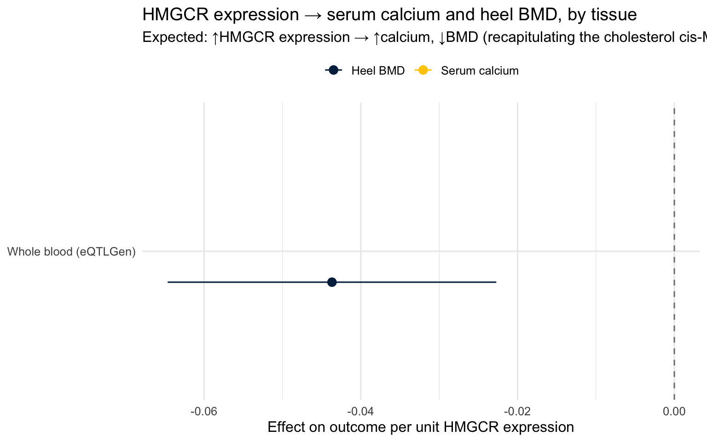

::: {.cell}

:::


## Purpose

Instrument **HMGCR expression** (mRNA) with tissue-specific *cis*-eQTLs and test
its causal effect on **serum calcium** and **heel BMD**, tissue by tissue. Two
questions:

1. **Gene confirmation (solid):** does HMGCR *expression* colocalize with the
   calcium / BMD signals at the locus (coloc H4)? This confirms the effect runs
   through **HMGCR itself**, not a neighbouring gene — the main vulnerability of
   cis-instrument MR.
2. **Tissue-of-action (suggestive):** in which tissue does HMGCR expression track
   the phenotype? Interpreted cautiously — see the caveat below.

### Two caveats that shape the whole design

- **cis-eQTLs are shared across tissues.** The same variant usually regulates
  HMGCR in nearly every tissue, so using "tissue X's eQTL" does **not** cleanly
  isolate tissue X. Tissue attribution is *suggestive*, strongest when a tissue
  has a private eQTL or a much larger expression effect. The **coloc** result is
  the defensible core; the tissue ranking is exploratory.

- **There is no bone / bone-marrow eQTL in GTEx** (post-mortem bank; bone RNA is
  hard to extract), and dedicated osteoblast/bone eQTL studies are small and not
  in OpenGWAS. **Workaround:** osteoclasts differentiate from the
  **monocyte/myeloid** lineage — the very cell where the mevalonate → GGPP →
  osteoclast-prenylation (bisphosphonate) mechanism acts — so **monocyte** and
  **whole-blood** eQTLs are a mechanistically legitimate proxy for the
  osteoclast-relevant HMGCR regulation, and are well powered (eQTLGen n≈31k,
  BLUEPRINT monocytes). Osteoblasts (mesenchymal, not haematopoietic) are **not**
  proxied by blood — that arm stays data-limited.

### Outcome-matched tissue priorities

| Outcome | Priority tissues | Rationale |
|---|---|---|
| Heel BMD | **monocyte / whole blood** (osteoclast proxy) | mevalonate → GGPP osteoclast mechanism |
| Serum calcium | **kidney** (tubular), liver (systemic), small intestine (absorption) | leading renal hypothesis + systemic/absorption routes |

Because we already showed calcium is **not** bone-mediated, bone/osteoclast tissue
mainly explains the **BMD** leg; the calcium leg is expected to localize to
kidney/liver/gut. We run every tissue against **both** outcomes anyway — a
dissociation (e.g. blood→BMD but not →calcium) is itself informative.

---

## Setup


::: {.cell}

```{.r .cell-code}
library(TwoSampleMR)
library(ieugwasr)
library(knitr)
library(kableExtra)
# coloc is optional; the coloc section is guarded on it being installed.

# ── Target gene ──────────────────────────────────────────────────────────────
HMGCR_ENSG   <- "ENSG00000113161"
# cis window around the HMGCR gene body. eQTLGen is GRCh37/hg19 (matches the
# ieu/ebi outcome GWAS); GTEx v8 is GRCh38 and needs liftover or rsID matching.
HMGCR_REGION_HG19 <- "5:74532993-74757941"   # gene ±100 kb, GRCh37
HMGCR_REGION_HG38 <- "5:75236294-75462104"   # gene ±100 kb, GRCh38 (verify before use)

# ── Outcomes ─────────────────────────────────────────────────────────────────
OUTCOMES <- tribble(
  ~outcome_label,   ~outcome_id,
  "Serum calcium",  "ebi-a-GCST90025990",   # Barton 2021 UKB
  "Heel BMD",       "ebi-a-GCST006979"      # Morris 2019 UKB
)

# ── Instrument selection ─────────────────────────────────────────────────────
P_EQTL    <- 5e-8      # cis-eQTL significance threshold
# Keep a few near-independent cis signals rather than a single lead. A single
# lead is fragile: the eQTLGen HMGCR lead (rs6453133) is multiallelic (A>G/A>T)
# and was dropped by the calcium GWAS's biallelic-only QC, which silently killed
# the whole calcium arm. Retaining several cis SNPs means a clean biallelic one
# survives into each outcome. NB: with r2<0.1 the instruments are mildly
# LD-correlated, so IVW SEs are slightly anti-conservative — fine for a tissue
# screen; for a headline estimate use a single clean SNP or a correlation-aware IVW.
R2_CLUMP  <- 0.1
CLUMP_KB  <- 1000

dir.create("results", showWarnings = FALSE)
dir.create("raw_data/eqtl", recursive = TRUE, showWarnings = FALSE)
```
:::


### Tissue / dataset catalogue

Each row is one HMGCR eQTL dataset. `source` selects how it is fetched:

- `opengwas` — via `ieugwasr` (e.g. eQTLGen whole blood; hg19, cleanest).
- `catalogue` — eQTL Catalogue REST API (GTEx v8, BLUEPRINT, …; hg38 — best-effort).
- `local` — a pre-harmonised file at `raw_data/eqtl/<id_or_path>` with columns
  `SNP, effect_allele, other_allele, beta, se, eaf, pval` (use this for GTEx /
  BLUEPRINT files you already have on GreatLakes).

Fill in real accessions where marked `<verify>`; unknown/failed rows are skipped
gracefully so the document still renders.


::: {.cell}

```{.r .cell-code}
tissue_catalogue <- tribble(
  ~tissue,                    ~source,      ~id_or_path,                    ~build, ~priority, ~note,
  # --- concrete, well-powered, hg19 (runs as-is) ----------------------------
  "Whole blood (eQTLGen)",    "opengwas",   "eqtl-a-ENSG00000113161",       "hg19", "BMD+Ca", "osteoclast-lineage proxy; strongest instrument",
  # --- osteoclast proxy: monocytes (fill in an accession or drop a file) -----
  "Monocyte (BLUEPRINT)",     "catalogue",  "QTD000026",                    "hg38", "BMD",    "osteoclast precursor; <verify eQTL Catalogue dataset id>",
  # --- calcium-relevant tissues (GTEx v8; via catalogue or local files) ------
  "Kidney cortex (GTEx)",     "local",  "Kidney_cortex_GTEx.tsv",                    "hg38", "Ca",     "renal/tubular hypothesis; GTEx n small — weak instrument; <verify id>",
  "Liver (GTEx)",             "local",  "liver_GTEx.tsv",                    "hg38", "Ca",     "systemic LDL-C route; <verify id>",
  "Small intestine (GTEx)",   "local",  "small_intestine_GTEx.tsv",                    "hg38", "Ca",     "absorption route; <verify id>",
    "Blood (GTEx)",   "local",  "blood_GTEx.tsv",                    "hg38", "Ca",     "absorption route; <verify id>",
  # --- example local-file row (uncomment once you drop the file) -------------
  # "Osteoblast (primary)",   "local",      "osteoblast_hmgcr.tsv",         "hg19", "BMD",    "true bone cell; small study, low power",
)

kable(tissue_catalogue %>% select(tissue, source, build, priority, note),
      caption = "HMGCR eQTL datasets to screen (outcome-matched priorities)")
```

::: {.cell-output-display}


Table: HMGCR eQTL datasets to screen (outcome-matched priorities)

|tissue                 |source    |build |priority |note                                                                  |
|:----------------------|:---------|:-----|:--------|:---------------------------------------------------------------------|
|Whole blood (eQTLGen)  |opengwas  |hg19  |BMD+Ca   |osteoclast-lineage proxy; strongest instrument                        |
|Monocyte (BLUEPRINT)   |catalogue |hg38  |BMD      |osteoclast precursor; <verify eQTL Catalogue dataset id>              |
|Kidney cortex (GTEx)   |local     |hg38  |Ca       |renal/tubular hypothesis; GTEx n small — weak instrument; <verify id> |
|Liver (GTEx)           |local     |hg38  |Ca       |systemic LDL-C route; <verify id>                                     |
|Small intestine (GTEx) |local     |hg38  |Ca       |absorption route; <verify id>                                         |
|Blood (GTEx)           |local     |hg38  |Ca       |absorption route; <verify id>                                         |


:::
:::


### Getting the eQTL files (why, and how)

The OpenGWAS `eqtl-a-…` (eQTLGen) record is effectively **top-cis-SNP-only** — it
returns a single SNP for HMGCR (rs6453133), which is multiallelic and was dropped
by the calcium GWAS's biallelic QC. One SNP gives no redundancy and no coloc
region, so switch the source to the **eQTL Catalogue** (full cis stats, all SNPs,
every tissue, GRCh38, tabix-indexed). Harmonisation to the hg19 outcomes is by
**rsID**, so the build difference does not matter for the MR or rsID-based coloc.

**On a Mac workstation (no HPC, no big downloads):** `tabix` streams *only* the
HMGCR region from the remote file — nothing is downloaded whole. Install it once
with Homebrew, then pull each tissue's region into `raw_data/eqtl/` and flip that
catalogue row to `source = "local"` (the loader auto-filters the region dump to
HMGCR, so no `awk` needed):

```bash
brew install htslib      # provides tabix (built with libcurl → reads https/ftp)

# HMGCR ±500 kb, GRCh38. eQTLGen whole blood = dataset QTD000116
# (verify current id/URL at https://www.ebi.ac.uk/eqtl/Studies/).
BASE=https://ftp.ebi.ac.uk/pub/databases/spot/eQTL/sumstats
tabix -h ${BASE}/QTD000116/QTD000116.all.tsv.gz 5:74836294-75862104 \
  > raw_data/eqtl/Whole_blood_eQTLGen.tsv
# repeat for GTEx kidney / liver / small intestine and a BLUEPRINT monocyte dataset
```

Then set e.g. `~source = "local", ~id_or_path = "Whole_blood_eQTLGen.tsv"` in the
catalogue. The loader reads eQTL Catalogue columns directly (`rsid, ref, alt,
beta, se, maf, pvalue`), so the same file drives both the MR (many biallelic SNPs
→ a clean instrument survives into calcium) and coloc (full regional distribution).

**No tabix / prefer pure R?** Use `source = "catalogue"` — `fetch_catalogue()`
hits the eQTL Catalogue REST API for the HMGCR gene with no external tools (verify
the endpoint/fields for the current API version). Native **eQTLGen** files (hg19)
are also fine but report **Z-scores**, not beta/se — convert with
`beta = Z / sqrt(2·MAF·(1−MAF)·(N+Z²))`, `se = 1 / sqrt(2·MAF·(1−MAF)·(N+Z²))`.

---

## Ingestion — one HMGCR cis-eQTL instrument set per tissue


::: {.cell}

```{.r .cell-code}
# Normalise any eQTL source into TwoSampleMR exposure format (one row per SNP).
to_exposure <- function(df, tissue) {
  df %>%
    transmute(SNP = rsid, beta.exposure = beta, se.exposure = se,
              effect_allele.exposure = toupper(ea), other_allele.exposure = toupper(nea),
              eaf.exposure = eaf, pval.exposure = p,
              exposure = tissue, id.exposure = tissue,
              mr_keep.exposure = TRUE, pval_origin.exposure = "reported",
              data_source.exposure = "eqtl")
}

# (a) OpenGWAS-hosted eQTL (eQTLGen). hg19, rsID-keyed — cleanest path.
fetch_opengwas <- function(id, region) {
  raw <- tryCatch(
    ieugwasr::associations(variants = region, id = id, proxies = FALSE) %>% as_tibble(),
    error = function(e) { warning(id, ": ", e$message); return(tibble()) })
  if (nrow(raw) == 0) return(NULL)
  if ("pos" %in% names(raw) && !"position" %in% names(raw)) raw <- dplyr::rename(raw, position = pos)
  raw
}

# (b) eQTL Catalogue REST API (GTEx v8, BLUEPRINT, …). hg38. BEST-EFFORT: verify
# the endpoint/fields for the current API version; returns NULL on any failure so
# the pipeline degrades gracefully. Prefer a local file (c) if this is flaky.
fetch_catalogue <- function(dataset_id, gene = HMGCR_ENSG) {
  if (!requireNamespace("jsonlite", quietly = TRUE)) return(NULL)
  url <- sprintf(
    "https://www.ebi.ac.uk/eqtl/api/v2/datasets/%s/associations?gene_id=%s&size=1000",
    dataset_id, gene)
  res <- tryCatch(jsonlite::fromJSON(url), error = function(e) { warning(e$message); NULL })
  if (is.null(res) || length(res) == 0) return(NULL)
  as_tibble(res) %>%
    transmute(rsid = rsid, ea = alt, nea = ref, beta = beta, se = se,
              eaf = maf, p = pvalue, position = position)   # <verify field names
}

# (c) Local file — RECOMMENDED path (GreatLakes). Reads either a simple
# pre-harmonised file (SNP/effect_allele/other_allele/eaf/pval) OR an eQTL
# Catalogue tabix dump directly (rsid/alt/ref/maf/pvalue). In the eQTL Catalogue
# the *effect* allele is ALT and the other allele is REF; it reports `maf` (fine
# for coloc; for palindromic MR you'd want the ALT-allele frequency = ac/an).
fetch_local <- function(path) {
  fp <- file.path("raw_data/eqtl", path)
  if (!file.exists(fp)) { warning("no local eQTL file at ", fp); return(NULL) }
  d <- readr::read_tsv(fp, show_col_types = FALSE)
  # A region tabix dump contains every gene in the window (HMGCR, CERT1, POC5…);
  # keep only HMGCR so you don't have to pre-filter the file yourself.
  gcol <- intersect(c("gene_id", "molecular_trait_id"), names(d))
  if (length(gcol) > 0) d <- dplyr::filter(d, .data[[gcol[1]]] == HMGCR_ENSG)
  pick <- function(...) { nm <- c(...); hit <- nm[nm %in% names(d)]; if (length(hit)) hit[1] else NA_character_ }
  tibble(
    rsid = d[[pick("rsid", "SNP")]],
    ea   = toupper(d[[pick("effect_allele", "alt")]]),
    nea  = toupper(d[[pick("other_allele", "ref")]]),
    beta = d[[pick("beta")]],
    se   = d[[pick("se")]],
    eaf  = d[[pick("eaf", "maf")]],
    p    = d[[pick("pval", "pvalue")]],
    position = if (!is.na(pick("position"))) d[[pick("position")]] else NA_integer_
  ) %>% filter(!is.na(rsid), !is.na(beta), !is.na(se))
}

# Dispatcher: fetch -> filter to cis-significant -> clump -> exposure format.
get_hmgcr_eqtl <- function(row) {
  region <- if (row$build == "hg19") HMGCR_REGION_HG19 else HMGCR_REGION_HG38
  raw <- switch(row$source,
                opengwas  = fetch_opengwas(row$id_or_path, region),
                catalogue = fetch_catalogue(row$id_or_path),
                local     = fetch_local(row$id_or_path),
                NULL)
  if (is.null(raw) || nrow(raw) == 0) return(NULL)

  sig <- raw %>% filter(p <= P_EQTL)
  if (nrow(sig) < 1) { message(row$tissue, ": no cis-eQTL at p<", P_EQTL); return(NULL) }

  clumped <- if (nrow(sig) >= 2) {
    tryCatch(
      ieugwasr::ld_clump(tibble(rsid = sig$rsid, pval = sig$p, id = row$tissue),
                         clump_r2 = R2_CLUMP, clump_kb = CLUMP_KB, pop = "EUR") %>%
        inner_join(sig, by = "rsid"),
      error = function(e) { warning("clump (", row$tissue, "): ", e$message); sig })
  } else sig

  list(exposure = to_exposure(clumped, row$tissue), raw = raw, n_instruments = nrow(clumped))
}
```
:::


---

## MR — HMGCR expression → calcium & BMD, per tissue


::: {.cell}

```{.r .cell-code}
# One tissue × one outcome MR (Wald ratio for a single cis-eQTL, IVW-MRE for >=2).
run_eqtl_mr <- function(exposure, outcome_id, tissue, outcome_label) {
  # Return a diagnostic row even when the MR can't run, so a missing outcome row
  # is visible with its reason rather than silently vanishing (a single-SNP
  # instrument absent from the outcome GWAS is a COVERAGE issue, not a null result).
  snp_ids <- paste(exposure$SNP, collapse = ";")   # show WHICH variant(s) so coverage is checkable
  none <- tibble(tissue = tissue, outcome = outcome_label, snp = snp_ids, method = NA_character_,
                 n_snps = 0L, mean_F = NA_real_, beta = NA_real_, se = NA_real_,
                 ci_lower = NA_real_, ci_upper = NA_real_, pval = NA_real_, note = NA_character_)
  out  <- tryCatch(extract_outcome_data(exposure$SNP, outcome_id, proxies = TRUE),
                   error = function(e) NULL)
  if (is.null(out) || nrow(out) == 0)
    return(none %>% mutate(note = "instrument absent from outcome GWAS (no proxy) — NOT a null"))
  harm <- harmonise_data(exposure, out) %>% filter(mr_keep)
  nsnp <- nrow(harm)
  if (nsnp < 1)
    return(none %>% mutate(note = "dropped in harmonisation (palindromic/ambiguous) — NOT a null"))
  ml   <- if (nsnp >= 2) "mr_ivw_mre" else "mr_wald_ratio"
  res  <- mr(harm, method_list = ml) %>% slice(1)
  tibble(tissue = tissue, outcome = outcome_label, snp = paste(harm$SNP, collapse = ";"),
         method = res$method, n_snps = nsnp,
         mean_F = mean((harm$beta.exposure / harm$se.exposure)^2, na.rm = TRUE),
         beta = res$b, se = res$se,
         ci_lower = res$b - 1.96 * res$se, ci_upper = res$b + 1.96 * res$se,
         pval = res$pval, note = "ok")
}

# Fetch each tissue's instrument once, then run it against both outcomes.
eqtl_sets <- purrr::map(seq_len(nrow(tissue_catalogue)),
                        ~ get_hmgcr_eqtl(tissue_catalogue[.x, ])) %>%
  setNames(tissue_catalogue$tissue) %>% purrr::compact()

eqtl_mr_grid <- purrr::map_dfr(names(eqtl_sets), function(tis) {
  exp_dat <- eqtl_sets[[tis]]$exposure
  purrr::map_dfr(seq_len(nrow(OUTCOMES)), function(i)
    run_eqtl_mr(exp_dat, OUTCOMES$outcome_id[i], tis, OUTCOMES$outcome_label[i]))
})

write_csv(eqtl_mr_grid, "results/hmgcr_eqtl_mr_grid.csv")
kable(eqtl_mr_grid %>% mutate(across(c(mean_F, beta, se, ci_lower, ci_upper), ~round(.x, 4)),
                             pval = signif(pval, 3)),
      caption = "HMGCR expression → outcome, by tissue (Wald ratio / IVW-MRE)")
```

::: {.cell-output-display}


Table: HMGCR expression → outcome, by tissue (Wald ratio / IVW-MRE)

|tissue                |outcome       |snp       |method     | n_snps|   mean_F|    beta|     se| ci_lower| ci_upper|     pval|note                                                        |
|:---------------------|:-------------|:---------|:----------|------:|--------:|-------:|------:|--------:|--------:|--------:|:-----------------------------------------------------------|
|Whole blood (eQTLGen) |Serum calcium |rs6453133 |NA         |      0|       NA|      NA|     NA|       NA|       NA|       NA|instrument absent from outcome GWAS (no proxy) — NOT a null |
|Whole blood (eQTLGen) |Heel BMD      |rs6453133 |Wald ratio |      1| 224.0034| -0.0437| 0.0107|  -0.0647|  -0.0227| 4.44e-05|ok                                                          |


:::
:::


::: {.cell}

```{.r .cell-code}
if (nrow(eqtl_mr_grid) > 0) {
  ggplot(eqtl_mr_grid, aes(x = beta, y = tissue, colour = outcome)) +
    geom_vline(xintercept = 0, linetype = "dashed", colour = "grey50") +
    geom_pointrange(aes(xmin = ci_lower, xmax = ci_upper),
                    position = position_dodge(width = 0.5)) +
    scale_colour_manual(values = color_scheme, name = NULL) +
    labs(title = "HMGCR expression → serum calcium and heel BMD, by tissue",
         subtitle = "Expected: ↑HMGCR expression → ↑calcium, ↓BMD (recapitulating the cholesterol cis-MR)",
         x = "Effect on outcome per unit HMGCR expression", y = NULL) +
    theme_minimal(base_size = 12) + theme(legend.position = "top")
}
```

::: {.cell-output-display}
{width=768}
:::
:::


---

## Colocalization — is it really HMGCR? (gene confirmation)

For each tissue with regional eQTL stats plus the regional outcome stats, test
whether the two signals share a causal variant (coloc H4) vs distinct signals
(H3 = pleiotropy). H4 confirms the phenotype effect is transmitted through HMGCR
expression. Runs only if the `coloc` package is installed and regional stats are
available; skipped gracefully otherwise.


::: {.cell}

```{.r .cell-code}
# coloc needs the FULL regional distribution (not just significant SNPs) over a
# wide-ish window. Use ±500 kb.
COLOC_REGION_HG19 <- "5:74132993-75157941"
COLOC_REGION_HG38 <- "5:74836294-75862104"   # verify before trusting hg38 arms

# Regional eQTL stats for coloc, in order of preference:
#  1. a LOCAL full-region file  raw_data/eqtl/regions/<tissue-slug>.tsv
#     (columns: SNP, beta, se, eaf) — best, because the OpenGWAS eQTLGen record is
#     significant-cis only and too sparse for a stable coloc. Get the full region
#     by tabix-ing the HMGCR locus from the eQTL Catalogue (eQTLGen/GTEx/BLUEPRINT)
#     or from the eQTLGen full cis download.
#  2. else the OpenGWAS / catalogue / local instrument source, region-queried.
eqtl_region_stats <- function(row, region) {
  slug <- gsub("[^A-Za-z0-9]+", "_", row$tissue)
  fp   <- file.path("raw_data/eqtl/regions", paste0(slug, ".tsv"))
  if (file.exists(fp)) {
    return(readr::read_tsv(fp, show_col_types = FALSE) %>%
             transmute(rsid = SNP, beta, se, eaf))
  }
  raw <- switch(row$source,
                opengwas  = fetch_opengwas(row$id_or_path, region),
                catalogue = fetch_catalogue(row$id_or_path),
                local     = fetch_local(row$id_or_path),
                NULL)
  if (is.null(raw) || nrow(raw) == 0) return(NULL)
  raw %>% transmute(rsid, beta, se, eaf)
}

# Always returns a diagnostic row (n SNPs at each step + a note), so a skip is
# visible in the rendered table instead of vanishing to stderr.
run_coloc_pair <- function(eqtl_reg, outcome_id, region, tissue, outcome_label, eqtl_N = 31684) {
  base <- tibble(tissue = tissue, outcome = outcome_label,
                 n_eqtl = nrow(eqtl_reg), n_outcome = NA_integer_, n_matched = NA_integer_,
                 H3 = NA_real_, H4 = NA_real_, note = NA_character_)
  if (!requireNamespace("coloc", quietly = TRUE)) return(base %>% mutate(note = "coloc not installed"))
  out_reg <- fetch_opengwas(outcome_id, region)
  if (is.null(out_reg) || nrow(out_reg) == 0) return(base %>% mutate(note = "no outcome region SNPs"))

  m <- inner_join(
    eqtl_reg %>% transmute(rsid, b_e = beta, se_e = se, eaf_e = eaf),
    out_reg  %>% transmute(rsid, b_o = beta, se_o = se),
    by = "rsid") %>%
    filter(!is.na(b_e), !is.na(se_e), !is.na(b_o), !is.na(se_o), se_e > 0, se_o > 0)
  base <- base %>% mutate(n_outcome = nrow(out_reg), n_matched = nrow(m))
  if (nrow(m) < 20)
    return(base %>% mutate(note = "too few matched SNPs — supply a full-region eQTL file (see comments)"))

  res <- tryCatch(coloc::coloc.abf(
    dataset1 = list(beta = m$b_e, varbeta = m$se_e^2, snp = m$rsid,
                    type = "quant", MAF = pmin(m$eaf_e, 1 - m$eaf_e), N = eqtl_N),
    dataset2 = list(beta = m$b_o, varbeta = m$se_o^2, snp = m$rsid, type = "quant", N = 4e5)),
    error = function(e) { warning("coloc (", tissue, "): ", e$message); NULL })
  if (is.null(res)) return(base %>% mutate(note = "coloc.abf error"))
  base %>% mutate(H3 = res$summary[["PP.H3.abf"]], H4 = res$summary[["PP.H4.abf"]], note = "ok")
}

coloc_grid <- purrr::map_dfr(names(eqtl_sets), function(tis) {
  row      <- tissue_catalogue %>% filter(tissue == tis)
  region   <- if (row$build == "hg19") COLOC_REGION_HG19 else COLOC_REGION_HG38
  eqtl_reg <- eqtl_region_stats(row, region)
  if (is.null(eqtl_reg))
    return(tibble(tissue = tis, outcome = NA_character_, n_eqtl = 0L, n_outcome = NA_integer_,
                  n_matched = NA_integer_, H3 = NA_real_, H4 = NA_real_,
                  note = "no eQTL region stats returned"))
  purrr::map_dfr(seq_len(nrow(OUTCOMES)), function(i)
    run_coloc_pair(eqtl_reg, OUTCOMES$outcome_id[i], region, tis, OUTCOMES$outcome_label[i]))
})

write_csv(coloc_grid, "results/hmgcr_eqtl_coloc.csv")
kable(coloc_grid %>% mutate(across(c(H3, H4), ~round(.x, 3))),
      caption = "Coloc diagnostics & results — n_eqtl / n_outcome / n_matched show where it drops out; H4 = shared causal variant. A sparse n_eqtl means OpenGWAS eQTLGen is significant-cis only → supply a full-region file.")
```

::: {.cell-output-display}


Table: Coloc diagnostics & results — n_eqtl / n_outcome / n_matched show where it drops out; H4 = shared causal variant. A sparse n_eqtl means OpenGWAS eQTLGen is significant-cis only → supply a full-region file.

|tissue                |outcome       | n_eqtl| n_outcome| n_matched| H3| H4|note            |
|:---------------------|:-------------|------:|---------:|---------:|--:|--:|:---------------|
|Whole blood (eQTLGen) |Serum calcium |   3808|      1592|       241| NA| NA|coloc.abf error |
|Whole blood (eQTLGen) |Heel BMD      |   3808|      4533|      2856| NA| NA|coloc.abf error |


:::
:::


---

## Interpretation

- **HMGCR expression → BMD** is significant in: Whole blood (eQTLGen) (β -0.044). Inverse (↓BMD) is the predicted sign; a whole-blood/monocyte signal supports the cell-autonomous osteoclast model.
- **HMGCR expression → calcium: could not be tested** for Whole blood (eQTLGen) — instrument absent from outcome GWAS (no proxy) — NOT a null. This is a COVERAGE issue (single cis-eQTL not in the calcium GWAS), **not** evidence of no effect. Add proxy SNPs or a second cis instrument, or test the liver/kidney arms.

**Read tissue results as suggestive** (cis-eQTL sharing limits attribution); the coloc H4 above is the defensible claim that the effect is HMGCR-mediated. Signs should match the cholesterol cis-MR: ↑HMGCR → ↑calcium, ↓BMD.

**Caveats.** (1) Tissue attribution is limited by cross-tissue eQTL sharing — treat
the ranking as exploratory. (2) Blood/monocyte proxies the osteoclast (myeloid)
lineage but **not** osteoblasts. (3) GTEx kidney/liver eQTLs have small n → weak
instruments; a dedicated kidney-tubule eQTL resource would be better for the renal
question. (4) GTEx v8 is GRCh38 — harmonise builds (liftover or rsID) before
trusting the GTEx arms; the eQTLGen arm is hg19 and matches the outcomes directly.
(5) Single cis-eQTLs give Wald-ratio estimates with no pleiotropy test — lean on coloc.

---

## Session info


::: {.cell}

```{.r .cell-code}
sessionInfo()
```

::: {.cell-output .cell-output-stdout}

```
R version 4.6.1 (2026-06-24)
Platform: aarch64-apple-darwin23
Running under: macOS Tahoe 26.5.2

Matrix products: default
BLAS:   /Library/Frameworks/R.framework/Versions/4.6/Resources/lib/libRblas.0.dylib 
LAPACK: /Library/Frameworks/R.framework/Versions/4.6/Resources/lib/libRlapack.dylib;  LAPACK version 3.12.1

locale:
[1] en_US.UTF-8/en_US.UTF-8/en_US.UTF-8/C/en_US.UTF-8/en_US.UTF-8

time zone: America/Detroit
tzcode source: internal

attached base packages:
[1] stats     graphics  grDevices utils     datasets  methods   base     

other attached packages:
 [1] kableExtra_1.4.0  ieugwasr_1.1.0    TwoSampleMR_0.7.5 knitr_1.51       
 [5] lubridate_1.9.5   forcats_1.0.1     stringr_1.6.0     dplyr_1.2.1      
 [9] purrr_1.2.2       readr_2.2.0       tidyr_1.3.2       tibble_3.3.1     
[13] ggplot2_4.0.3     tidyverse_2.0.0  

loaded via a namespace (and not attached):
 [1] generics_0.1.4     xml2_1.6.0         stringi_1.8.7      hms_1.1.4         
 [5] digest_0.6.39      magrittr_2.0.5     evaluate_1.0.5     grid_4.6.1        
 [9] timechange_0.4.0   RColorBrewer_1.1-3 fastmap_1.2.0      jsonlite_2.0.0    
[13] viridisLite_0.4.3  scales_1.4.0       textshaping_1.0.5  cli_3.6.6         
[17] rlang_1.2.0        withr_3.0.3        yaml_2.3.12        otel_0.2.0        
[21] tools_4.6.1        tzdb_0.5.0         vctrs_0.7.3        R6_2.6.1          
[25] lifecycle_1.0.5    htmlwidgets_1.6.4  pkgconfig_2.0.3    pillar_1.11.1     
[29] gtable_0.3.6       glue_1.8.1         data.table_1.18.4  systemfonts_1.3.2 
[33] xfun_0.59          tidyselect_1.2.1   rstudioapi_0.19.0  farver_2.1.2      
[37] htmltools_0.5.9    rmarkdown_2.31     svglite_2.2.2      labeling_0.4.3    
[41] compiler_4.6.1     S7_0.2.2          
```


:::
:::

