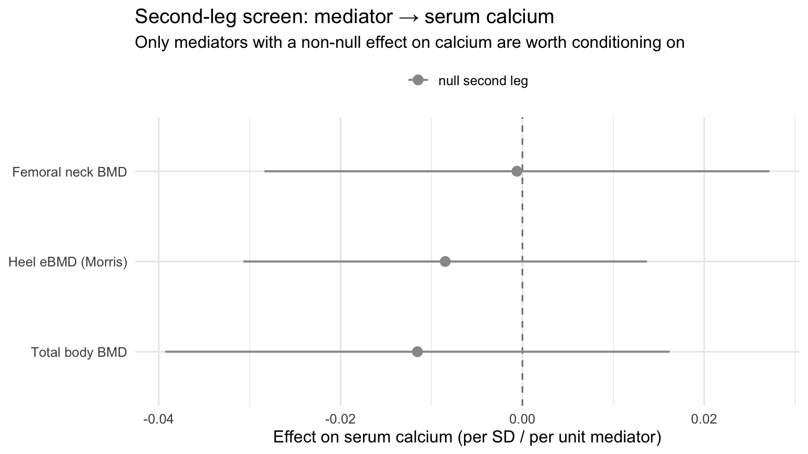

::: {.cell}

:::


## Purpose

Before building any full mediation MVMR (`cholesterol + M → calcium`), screen the
**second leg** of each candidate mediator M: does M causally affect serum
calcium at all? Conditioning the cholesterol effect on a mediator whose own
effect on calcium is null is pointless — the mediator cannot carry an indirect
effect. This script runs a univariable MR of **M → serum calcium** for every
candidate M and reports which legs are worth pursuing.

Candidates fall into two groups:

- **Bone density sites** (heel eBMD, femoral neck, total body, …). The heel
  result is already known to be null (β ≈ −0.005, p ≈ 0.76); screening the other
  sites answers the "but maybe hip/femoral-neck mediates" question directly.
- **Hormonal / turnover markers** (PTH via cis-pQTL; add CTX, P1NP, osteocalcin
  when a GWAS id is available). These index calcium *flux/regulation* rather than
  standing density and are the higher-prior candidates under the
  net-mineral-balance model.

Outcome throughout: **serum calcium**, Barton 2021 UKB, `ebi-a-GCST90025990`.

---

## Setup


::: {.cell}

```{.r .cell-code}
library(TwoSampleMR)
library(ieugwasr)
library(knitr)
library(kableExtra)

CALCIUM_ID  <- "ebi-a-GCST90025990"   # serum calcium outcome (Barton 2021 UKB)
P_GW        <- 5e-8                    # genome-wide instrument threshold
P_CIS       <- 5e-8                    # cis-pQTL threshold (primary)
P_CIS_RELAX <- 1e-5                    # cis fallback if no genome-wide cis hit
R2_CLUMP    <- 0.001
CLUMP_KB    <- 10000

dir.create("results", showWarnings = FALSE)

# ── Candidate-mediator catalogue ─────────────────────────────────────────────
# mode = "genomewide" -> use LD-clumped genome-wide instruments (extract_instruments)
# mode = "cis"        -> use LD-clumped SNPs within `region` (for pQTLs, GRCh37)
#
# PTH gene (GRCh37/hg19) is at chr11:13,492,054-13,495,431; a ±500 kb cis window
# is used below. VERIFY the build of any pQTL dataset before trusting coordinates
# (the OpenGWAS prot-a / prot-c batches are GRCh37).
mediator_catalog <- tribble(
  ~label,                 ~gwas_id,             ~mode,        ~region,
  "Heel eBMD (Morris)",   "ebi-a-GCST006979",   "genomewide", NA_character_,
  "Femoral neck BMD",     "ieu-a-980",          "genomewide", NA_character_,
  "Total body BMD",       "ebi-a-GCST005348",   "genomewide", NA_character_,
  "PTH pQTL (INTERVAL)",  "prot-a-2431",        "cis",        "11:12992054-13995431",
  "PTH pQTL (KORA)",      "prot-c-3726_62_4",   "cis",        "11:12992054-13995431"
  # --- add when a public GWAS id is available: -------------------------------
  # "CTX (resorption)",   "<id>",               "genomewide", NA_character_,
  # "P1NP (formation)",   "<id>",               "genomewide", NA_character_,
  # "Osteocalcin pQTL",   "<prot id>",          "cis",        "<BGLAP region>",
  # "Lumbar spine BMD",   "<verify id>",        "genomewide", NA_character_,
)

kable(mediator_catalog, caption = "Candidate mediators to screen (second leg: M → serum calcium)")
```

::: {.cell-output-display}


Table: Candidate mediators to screen (second leg: M → serum calcium)

|label               |gwas_id          |mode       |region               |
|:-------------------|:----------------|:----------|:--------------------|
|Heel eBMD (Morris)  |ebi-a-GCST006979 |genomewide |NA                   |
|Femoral neck BMD    |ieu-a-980        |genomewide |NA                   |
|Total body BMD      |ebi-a-GCST005348 |genomewide |NA                   |
|PTH pQTL (INTERVAL) |prot-a-2431      |cis        |11:12992054-13995431 |
|PTH pQTL (KORA)     |prot-c-3726_62_4 |cis        |11:12992054-13995431 |


:::
:::


### Confirm what each dataset actually is (trait, N)

A cheap sanity check that also settles the "are the PTH pQTLs too small?"
question — for a **cis** instrument, what matters is the cis F-statistic, not the
discovery N, but it is still worth seeing the trait label and sample size.


::: {.cell}

```{.r .cell-code}
info <- tryCatch(
  ieugwasr::gwasinfo(mediator_catalog$gwas_id),
  error = function(e) { message("gwasinfo failed: ", e$message); NULL }
)
if (!is.null(info)) {
  info %>%
    as_tibble() %>%
    select(any_of(c("id", "trait", "sample_size", "nsnp", "population", "author", "year"))) %>%
    kable(caption = "OpenGWAS metadata for candidate-mediator datasets")
}
```

::: {.cell-output-display}


Table: OpenGWAS metadata for candidate-mediator datasets

|id               |trait                             | sample_size|     nsnp|population |author         | year|
|:----------------|:---------------------------------|-----------:|--------:|:----------|:--------------|----:|
|ebi-a-GCST006979 |Heel bone mineral density         |      426824| 13705641|European   |Morris JA      | 2019|
|ieu-a-980        |Femoral neck bone mineral density |       32735| 10586900|Mixed      |Zheng          | 2015|
|ebi-a-GCST005348 |Total body bone mineral density   |       56284| 16162733|European   |Medina-Gomez C | 2018|
|prot-a-2431      |Parathyroid hormone               |        3301| 10534735|European   |Sun BB         | 2018|
|prot-c-3726_62_4 |PTH                               |          NA|   501428|European   |Suhre K        | 2019|


:::
:::


---

## Screening function


::: {.cell}

```{.r .cell-code}
# Build an LD-clumped cis instrument set from a region of an OpenGWAS dataset and
# return it in TwoSampleMR exposure format. Falls back to a relaxed threshold if
# nothing reaches genome-wide significance (small pQTLs can have a strong cis
# signal that still sits just under 5e-8).
extract_cis_exposure <- function(gwas_id, region, label) {
  raw <- tryCatch(
    ieugwasr::associations(variants = region, id = gwas_id, proxies = FALSE) %>% as_tibble(),
    error = function(e) { warning(label, " cis query failed: ", e$message); tibble() }
  )
  if (nrow(raw) == 0) return(NULL)

  pick <- raw %>% filter(p <= P_CIS)
  thr  <- P_CIS
  if (nrow(pick) < 1) { pick <- raw %>% filter(p <= P_CIS_RELAX); thr <- P_CIS_RELAX }
  if (nrow(pick) < 1) return(NULL)

  # LD-clump to independent cis signals (fall back to unclumped if LD ref fails)
  clumped <- if (nrow(pick) >= 2) {
    tryCatch(
      ieugwasr::ld_clump(tibble(rsid = pick$rsid, pval = pick$p, id = gwas_id),
                         clump_r2 = R2_CLUMP, clump_kb = CLUMP_KB, pop = "EUR") %>%
        inner_join(pick, by = "rsid"),
      error = function(e) { warning("clump failed (", label, "): ", e$message); pick }
    )
  } else pick

  cat("  [", label, "] cis instruments: ", nrow(clumped),
      " (threshold p<", thr, ")\n", sep = "")

  clumped %>%
    transmute(SNP = rsid, beta.exposure = beta, se.exposure = se,
              effect_allele.exposure = toupper(ea), other_allele.exposure = toupper(nea),
              eaf.exposure = eaf, pval.exposure = p,
              exposure = label, id.exposure = gwas_id,
              mr_keep.exposure = TRUE, pval_origin.exposure = "reported",
              data_source.exposure = "igd")
}

# Screen one candidate mediator's effect on serum calcium (the "b" leg).
screen_mediator <- function(label, gwas_id, mode, region = NA_character_) {
  message("\n----- screening ", label, " (", gwas_id, ") -----")

  ## 1. Mediator instruments
  exp_dat <- if (mode == "genomewide") {
    tryCatch(
      extract_instruments(gwas_id, p1 = P_GW, clump = TRUE, r2 = R2_CLUMP, kb = CLUMP_KB),
      error = function(e) { warning(label, ": ", e$message); NULL }
    )
  } else {
    extract_cis_exposure(gwas_id, region, label)
  }

  none <- tibble(mediator = label, mode = mode, n_snps = 0L, mean_F = NA_real_,
                 method = NA_character_, beta = NA_real_, se = NA_real_,
                 ci_lower = NA_real_, ci_upper = NA_real_, pval = NA_real_,
                 egger_p = NA_real_, gate = "no instruments")
  if (is.null(exp_dat) || nrow(exp_dat) < 1) return(none)

  ## 2. Effects on serum calcium + harmonise
  out <- tryCatch(extract_outcome_data(snps = exp_dat$SNP, outcomes = CALCIUM_ID),
                  error = function(e) { warning(label, " outcome: ", e$message); NULL })
  if (is.null(out) || nrow(out) < 1) return(none %>% mutate(gate = "no outcome overlap"))
  harm <- harmonise_data(exp_dat, out)
  harm <- harm %>% filter(mr_keep)
  nsnp <- nrow(harm)
  if (nsnp < 1) return(none %>% mutate(gate = "no SNPs after harmonisation"))

  ## 3. MR — method scales with instrument count (Wald ratio for a single cis SNP)
  ml <- if (nsnp >= 3) c("mr_ivw_mre", "mr_egger_regression", "mr_weighted_median") else
        if (nsnp == 2) "mr_ivw_mre" else "mr_wald_ratio"
  res     <- mr(harm, method_list = ml)
  primary <- res %>% slice(1)          # IVW-MRE (>=2 SNPs) or Wald ratio (1 SNP)
  egger_p <- tryCatch(mr_pleiotropy_test(harm)$pval, error = function(e) NA_real_)
  mean_F  <- mean((harm$beta.exposure / harm$se.exposure)^2, na.rm = TRUE)

  tibble(
    mediator = label, mode = mode, n_snps = nsnp, mean_F = mean_F,
    method   = primary$method, beta = primary$b, se = primary$se,
    ci_lower = primary$b - 1.96 * primary$se,
    ci_upper = primary$b + 1.96 * primary$se,
    pval     = primary$pval, egger_p = egger_p,
    # Gate: nominal evidence the second leg exists. A NULL here for a small pQTL
    # is inconclusive (winner's curse / low power), not proof of no effect.
    gate = dplyr::case_when(
      primary$pval < 0.05 & mean_F >= 10 ~ "carry forward",
      primary$pval < 0.05                ~ "carry forward (weak instrument — caution)",
      TRUE                               ~ "second leg null (do not condition)"
    )
  )
}
```
:::


---

## Run the screen


::: {.cell}

```{.r .cell-code}
screen_results <- purrr::pmap_dfr(
  mediator_catalog,
  function(label, gwas_id, mode, region) screen_mediator(label, gwas_id, mode, region)
)

write_csv(screen_results, "results/mediator_second_leg_screen.csv")

kable(screen_results %>%
        mutate(across(c(mean_F, beta, se, ci_lower, ci_upper), ~round(.x, 4)),
               pval = signif(pval, 3), egger_p = signif(egger_p, 3)),
      caption = "Second-leg screen: causal effect of each candidate mediator on serum calcium")
```

::: {.cell-output-display}


Table: Second-leg screen: causal effect of each candidate mediator on serum calcium

|mediator            |mode       | n_snps|   mean_F|method                                                    |    beta|     se| ci_lower| ci_upper|  pval| egger_p|gate                               |
|:-------------------|:----------|------:|--------:|:---------------------------------------------------------|-------:|------:|--------:|--------:|-----:|-------:|:----------------------------------|
|Heel eBMD (Morris)  |genomewide |    301| 197.0040|Inverse variance weighted (multiplicative random effects) | -0.0085| 0.0113|  -0.0307|   0.0137| 0.454|   0.871|second leg null (do not condition) |
|Femoral neck BMD    |genomewide |     14|  54.2343|Inverse variance weighted (multiplicative random effects) | -0.0006| 0.0142|  -0.0284|   0.0272| 0.966|   0.730|second leg null (do not condition) |
|Total body BMD      |genomewide |     56|  67.4249|Inverse variance weighted (multiplicative random effects) | -0.0115| 0.0142|  -0.0393|   0.0162| 0.415|   0.567|second leg null (do not condition) |
|PTH pQTL (INTERVAL) |cis        |      0|       NA|NA                                                        |      NA|     NA|       NA|       NA|    NA|      NA|no instruments                     |
|PTH pQTL (KORA)     |cis        |      0|       NA|NA                                                        |      NA|     NA|       NA|       NA|    NA|      NA|no instruments                     |


:::
:::


::: {.cell}

```{.r .cell-code}
plot_dat <- screen_results %>% filter(!is.na(beta))
if (nrow(plot_dat) > 0) {
  ggplot(plot_dat, aes(x = beta, y = reorder(mediator, beta))) +
    geom_vline(xintercept = 0, linetype = "dashed", colour = "grey50") +
    geom_pointrange(aes(xmin = ci_lower, xmax = ci_upper,
                        colour = grepl("carry", gate)), linewidth = 0.7) +
    scale_colour_manual(values = c(`TRUE` = color_scheme[1], `FALSE` = "grey60"),
                        labels = c(`TRUE` = "carry forward", `FALSE` = "null second leg"),
                        name = NULL) +
    labs(title = "Second-leg screen: mediator → serum calcium",
         subtitle = "Only mediators with a non-null effect on calcium are worth conditioning on",
         x = "Effect on serum calcium (per SD / per unit mediator)", y = NULL) +
    theme_minimal(base_size = 12) +
    theme(legend.position = "top")
}
```

::: {.cell-output-display}
{width=768}
:::
:::


---

## Interpretation

**No candidate mediator shows a non-null effect on serum calcium.** If this holds after adding turnover markers, it argues the cholesterol → calcium effect is not routed through any tested bone/hormonal node.

**Drop — second leg is null** (conditioning would be pointless): Heel eBMD (Morris), Femoral neck BMD, Total body BMD.

**Could not test** (no usable instruments / outcome overlap): PTH pQTL (INTERVAL) [no instruments]; PTH pQTL (KORA) [no instruments].

Caveat: a null second leg from a small cis-pQTL (e.g. PTH) is *inconclusive* — winner's curse and low power bias the estimate toward zero. Treat a null PTH result as 'underpowered', not 'no effect', and revisit with a larger pQTL (e.g. deCODE) before discarding the hormonal route.

---

## Session info


::: {.cell}

```{.r .cell-code}
sessionInfo()
```

::: {.cell-output .cell-output-stdout}

```
R version 4.6.1 (2026-06-24)
Platform: aarch64-apple-darwin23
Running under: macOS Tahoe 26.5.2

Matrix products: default
BLAS:   /Library/Frameworks/R.framework/Versions/4.6/Resources/lib/libRblas.0.dylib 
LAPACK: /Library/Frameworks/R.framework/Versions/4.6/Resources/lib/libRlapack.dylib;  LAPACK version 3.12.1

locale:
[1] en_US.UTF-8/en_US.UTF-8/en_US.UTF-8/C/en_US.UTF-8/en_US.UTF-8

time zone: America/Detroit
tzcode source: internal

attached base packages:
[1] stats     graphics  grDevices utils     datasets  methods   base     

other attached packages:
 [1] kableExtra_1.4.0  ieugwasr_1.1.0    TwoSampleMR_0.7.5 knitr_1.51       
 [5] lubridate_1.9.5   forcats_1.0.1     stringr_1.6.0     dplyr_1.2.1      
 [9] purrr_1.2.2       readr_2.2.0       tidyr_1.3.2       tibble_3.3.1     
[13] ggplot2_4.0.3     tidyverse_2.0.0  

loaded via a namespace (and not attached):
 [1] generics_0.1.4     xml2_1.6.0         stringi_1.8.7      hms_1.1.4         
 [5] digest_0.6.39      magrittr_2.0.5     evaluate_1.0.5     grid_4.6.1        
 [9] timechange_0.4.0   RColorBrewer_1.1-3 fastmap_1.2.0      jsonlite_2.0.0    
[13] httr_1.4.8         viridisLite_0.4.3  scales_1.4.0       codetools_0.2-20  
[17] textshaping_1.0.5  cli_3.6.6          crayon_1.5.3       rlang_1.2.0       
[21] bit64_4.8.2        withr_3.0.3        yaml_2.3.12        otel_0.2.0        
[25] parallel_4.6.1     tools_4.6.1        tzdb_0.5.0         curl_7.1.0        
[29] vctrs_0.7.3        R6_2.6.1           lifecycle_1.0.5    bit_4.6.0         
[33] htmlwidgets_1.6.4  vroom_1.7.1        pkgconfig_2.0.3    pillar_1.11.1     
[37] gtable_0.3.6       glue_1.8.1         data.table_1.18.4  systemfonts_1.3.2 
[41] xfun_0.59          tidyselect_1.2.1   rstudioapi_0.19.0  farver_2.1.2      
[45] htmltools_0.5.9    labeling_0.4.3     rmarkdown_2.31     svglite_2.2.2     
[49] compiler_4.6.1     S7_0.2.2          
```


:::
:::

