::: {.cell}

:::


## Purpose

To test if SNPs for total cholesterol GWAS identified using UK Biobank relate
to other mechanistic or pathological outcomes related to calcium homeostasis
and bone health. This script can be found in /Users/davebrid/Documents/GitHub/PrecisionNutrition/Human Genetics and was most recently
run on Wed Jul  1 22:35:25 2026.

This is a revised version of an earlier analysis. The previous version used
local PheWeb summary statistics (GEFOS 2012/2015) for bone outcomes and
encountered substantial instrument loss during harmonisation — only 84 of 370
total cholesterol instruments survived for lumbar spine BMD, with no usable
overlap for the 2012 femoral neck GWAS. This version replaces those local
files with OpenGWAS API queries against larger, more recent BMD and fracture
GWAS, using LD proxies (r²>0.8) to recover instruments that aren't directly
present in each outcome dataset.

## Data Entry


::: {.cell}

```{.r .cell-code}
instruments.tc.file <- 'Total Cholesterol Instruments from UKBB.csv'

instruments.tc <- read_csv(instruments.tc.file, show_col_types = FALSE) |>
  dplyr::rename(
    SNP                       = SP2,
    beta.exposure             = BETA,
    se.exposure               = SE,
    effect_allele.exposure    = EA,
    other_allele.exposure     = OA,
    pval.exposure             = P,
    eaf.exposure              = ALT_FREQS,
    samplesize.exposure       = N_exposure
  ) |>
  mutate(id.exposure = "Total Cholesterol (UK Biobank)",
         exposure    = "Total Cholesterol (UK Biobank)")
```
:::


We used 370 SNPs as instruments for total cholesterol from
UK Biobank. These are found in the Total Cholesterol Instruments from UKBB.csv datafile.

### Converting Instrument Identifiers to rsIDs

The instrument file uses chromosome-position-allele IDs (e.g. `1:55505647:C:T`)
but OpenGWAS queries require rsIDs. We use `SNPlocs.Hsapiens.dbSNP144.GRCh37`
to look up rsIDs by genomic position.


::: {.cell}

```{.r .cell-code}
library(SNPlocs.Hsapiens.dbSNP144.GRCh37)
library(GenomicRanges)

# Force tidyverse versions back to top of search path after Bioconductor masking
rename  <- dplyr::rename
first   <- dplyr::first
compact <- purrr::compact

snpdb <- SNPlocs.Hsapiens.dbSNP144.GRCh37

tc.positions <- instruments.tc |>
  separate(SNP, into = c("CHR", "BP", "ALLELE0", "ALLELE1"),
           sep = ":", remove = FALSE) |>
  mutate(CHR = as.integer(CHR), BP = as.integer(BP))

get_rsids_by_chr <- function(chr, positions, snpdb) {
  pos_ranges <- GPos(seqnames = chr, pos = positions)
  snps <- snpsByOverlaps(snpdb, pos_ranges)
  data.frame(
    CHR  = as.integer(chr),
    BP   = as.integer(pos(snps)),
    RSID = snps$RefSNP_id,
    stringsAsFactors = FALSE
  )
}

rsid_list <- list()
for (chr in unique(tc.positions$CHR)) {
  chr_data <- tc.positions |> filter(CHR == chr)
  rsid_list[[chr]] <- get_rsids_by_chr(chr, chr_data$BP, snpdb)
  message("Processed chr", chr)
}
all_rsids <- bind_rows(rsid_list) %>%
  mutate(CHR = as.integer(CHR), BP = as.integer(BP))

# Build rsID-keyed instruments in one pipe to avoid the dplyr/Bioc masking bug
instruments.tc.rsid <- instruments.tc %>%
  separate(SNP, into = c("CHR", "BP", "ALLELE0", "ALLELE1"),
           sep = ":", remove = TRUE) %>%
  mutate(CHR = as.integer(CHR), BP = as.integer(BP)) %>%
  left_join(all_rsids, by = c("CHR", "BP")) %>%
  filter(!is.na(RSID)) %>%
  dplyr::select(
    effect_allele.exposure, other_allele.exposure,
    beta.exposure, se.exposure, pval.exposure, eaf.exposure,
    samplesize.exposure,
    id.exposure, exposure,
    RSID
  ) %>%
  dplyr::rename(SNP = RSID)

cat("Original instruments:              ", nrow(instruments.tc), "\n")
```

::: {.cell-output .cell-output-stdout}

```
Original instruments:               370 
```


:::

```{.r .cell-code}
cat("After rsID lookup (excluding NAs): ", nrow(instruments.tc.rsid), "\n")
```

::: {.cell-output .cell-output-stdout}

```
After rsID lookup (excluding NAs):  360 
```


:::
:::


## Mechanistic Outcomes

### Vitamin D Levels

This analysis tests the hypothesis that total cholesterol impacts
25-hydroxyvitamin D levels, as cholesterol is a precursor for vitamin D
synthesis in the skin. This could positively impact calcium levels indirectly
via increased vitamin D.

The previous version of this analysis used MGI-BioVU LabWAS data
[@goldsteinLabWASNovelFindings2020], a small (n=12,250) non-routine biomarker
GWAS. This version replaces it with the much higher-powered Revez 2020
25-hydroxyvitamin D GWAS (OpenGWAS `ebi-a-GCST90000616`; UK Biobank,
n≈417,580) [@revezGenomewideAssociationStudy2020], queried through the
OpenGWAS API with LD proxies (r²>0.8) using exactly the same pattern as the
bone outcomes below. This raises statistical power for the vitamin D
mechanism by roughly 34-fold in sample size and lets the analysis draw on the
rsID-keyed instrument set.


::: {.cell}

```{.r .cell-code}
# Packages are attached in the non-cached global_options chunk (see note there).

vitd.gwas_id <- "ebi-a-GCST90000616"
vitd.label   <- "25-hydroxyvitamin D (Revez 2020, UKB)"

# Query OpenGWAS for the vitamin D outcome using the rsID-keyed instruments,
# recovering missing SNPs via LD proxies (r²>0.8) — same pattern as bone outcomes
gwas.vitd <- extract_outcome_data(
  snps          = instruments.tc.rsid$SNP,
  outcomes      = vitd.gwas_id,
  proxies       = TRUE,
  rsq           = 0.8,
  align_alleles = 1,
  palindromes   = 1,
  maf_threshold = 0.01
) |>
  mutate(id.outcome = vitd.label, outcome = vitd.label)

cat("Vitamin D outcome SNPs returned:", nrow(gwas.vitd),
    "of", nrow(instruments.tc.rsid), "instruments (",
    sum(gwas.vitd$proxy.outcome == TRUE, na.rm = TRUE), "via proxy )\n")
```

::: {.cell-output .cell-output-stdout}

```
Vitamin D outcome SNPs returned: 344 of 360 instruments ( 12 via proxy )
```


:::

```{.r .cell-code}
# Vitamin D analysis now uses the rsID-keyed instruments (OpenGWAS query)
vitd.data <- harmonise_data(instruments.tc.rsid, gwas.vitd, action = 2)
vitd.data_steiger <- steiger_filtering(vitd.data)

# Pre-harmonization instrument metrics (all rsID-keyed input SNPs)
pre_harm_metrics_vitd <- instruments.tc.rsid %>%
  mutate(
    R2.exposure = 2 * eaf.exposure * (1 - eaf.exposure) * beta.exposure^2,
    F.exposure  = (R2.exposure * (samplesize.exposure - 2)) / (1 - R2.exposure)
  )

pre_harm_summary_vitd <- pre_harm_metrics_vitd %>%
  summarise(
    num_snps            = n(),
    samplesize.exposure = dplyr::first(samplesize.exposure),
    cumulative_R2       = sum(R2.exposure, na.rm = TRUE),
    mean_F              = mean(F.exposure, na.rm = TRUE),
    median_F            = median(F.exposure, na.rm = TRUE),
    mean_maf            = mean(eaf.exposure, na.rm = TRUE),
    mean_beta           = mean(abs(beta.exposure), na.rm = TRUE)
  ) |>
  mutate(
    overall_F = (cumulative_R2 * (samplesize.exposure - num_snps - 1)) /
                ((1 - cumulative_R2) * num_snps)
  )

# Post-harmonization instrument metrics (SNPs that survived harmonization+Steiger)
vitd.data.annot <- vitd.data_steiger %>%
  mutate(
    R2.exposure = 2 * eaf.exposure * (1 - eaf.exposure) * beta.exposure^2,
    F.exposure  = (R2.exposure * (samplesize.exposure - 2)) / (1 - R2.exposure)
  )

vitd.exposure.summary <- vitd.data.annot %>%
  summarise(
    num_snps            = n(),
    samplesize.exposure = dplyr::first(samplesize.exposure),
    cumulative_R2       = sum(R2.exposure, na.rm = TRUE),
    mean_F              = mean(F.exposure, na.rm = TRUE),
    median_F            = median(F.exposure, na.rm = TRUE),
    mean_maf            = mean(eaf.exposure, na.rm = TRUE),
    mean_beta           = mean(abs(beta.exposure), na.rm = TRUE)
  ) |>
  mutate(
    overall_F = (cumulative_R2 * (samplesize.exposure - num_snps - 1)) /
                ((1 - cumulative_R2) * num_snps)
  )

# Write instrument files
pre_harm_summary_vitd %>%
  write_csv("Instrument Metrics - Total Cholesterol for Vitamin D - Pre-Harmonization.csv")
vitd.exposure.summary %>%
  write_csv("Instrument Metrics - Total Cholesterol for Vitamin D - Post-Harmonization.csv")
vitd.data.annot %>%
  write_csv("Total Cholesterol Instruments for Vitamin D.csv")

bind_rows(
  pre_harm_summary_vitd  %>% mutate(Stage = "Pre-Harmonization"),
  vitd.exposure.summary  %>% mutate(Stage = "Post-Harmonization")
) %>%
  dplyr::select(Stage, everything()) %>%
  kable(caption = "Total cholesterol instruments before and after harmonisation for Vitamin D analysis",
        digits = c(NA, 0, 0, 4, 1, 1, 4, 4, 1))
```

::: {.cell-output-display}


Table: Total cholesterol instruments before and after harmonisation for Vitamin D analysis

|Stage              | num_snps| samplesize.exposure| cumulative_R2| mean_F| median_F| mean_maf| mean_beta| overall_F|
|:------------------|--------:|-------------------:|-------------:|------:|--------:|--------:|---------:|---------:|
|Pre-Harmonization  |      360|              420607|        0.1044|  122.2|     48.9|   0.3173|    0.0311|     136.1|
|Post-Harmonization |      262|              420607|        0.0932|  149.9|     52.8|   0.3527|    0.0304|     164.8|


:::

```{.r .cell-code}
vitd.mr <- mr(vitd.data_steiger,
              method_list = c("mr_ivw_mre", "mr_ivw_fe", "mr_raps",
                              "mr_egger_regression",
                              "mr_weighted_median", "mr_weighted_mode"))

vitd.mr |>
  dplyr::select(-starts_with('id')) |>
  kable(caption = "MR Results for Total Cholesterol - Vitamin D Analysis",
        digits = c(0, 0, 0, 0, 3, 3, 99))
```

::: {.cell-output-display}


Table: MR Results for Total Cholesterol - Vitamin D Analysis

|outcome                               |exposure                       |method                                                    | nsnp|      b|    se|         pval|
|:-------------------------------------|:------------------------------|:---------------------------------------------------------|----:|------:|-----:|------------:|
|25-hydroxyvitamin D (Revez 2020, UKB) |Total Cholesterol (UK Biobank) |Inverse variance weighted (multiplicative random effects) |  258| -0.137| 0.012| 1.078878e-29|
|25-hydroxyvitamin D (Revez 2020, UKB) |Total Cholesterol (UK Biobank) |Inverse variance weighted (fixed effects)                 |  258| -0.137| 0.005| 0.000000e+00|
|25-hydroxyvitamin D (Revez 2020, UKB) |Total Cholesterol (UK Biobank) |Robust adjusted profile score (RAPS)                      |  258| -0.125| 0.010| 4.362725e-33|
|25-hydroxyvitamin D (Revez 2020, UKB) |Total Cholesterol (UK Biobank) |MR Egger                                                  |  258| -0.159| 0.019| 8.566824e-15|
|25-hydroxyvitamin D (Revez 2020, UKB) |Total Cholesterol (UK Biobank) |Weighted median                                           |  258| -0.117| 0.011| 7.048850e-29|
|25-hydroxyvitamin D (Revez 2020, UKB) |Total Cholesterol (UK Biobank) |Weighted mode                                             |  258| -0.122| 0.083| 1.411775e-01|


:::

```{.r .cell-code}
vitd.pleio <- mr_pleiotropy_test(vitd.data_steiger)
vitd.pleio |>
  dplyr::select(-starts_with('id')) |>
  kable(caption = "MR Pleiotropy Results for Total Cholesterol - Vitamin D Analysis")
```

::: {.cell-output-display}


Table: MR Pleiotropy Results for Total Cholesterol - Vitamin D Analysis

|outcome                               |exposure                       | egger_intercept|        se|      pval|
|:-------------------------------------|:------------------------------|---------------:|---------:|---------:|
|25-hydroxyvitamin D (Revez 2020, UKB) |Total Cholesterol (UK Biobank) |       0.0009253| 0.0006362| 0.1470586|


:::

```{.r .cell-code}
vitd.het <- mr_heterogeneity(vitd.data_steiger) |>
  mutate(I2 = pmax(0, (Q - Q_df) / Q) * 100)
vitd.het |>
  dplyr::select(-starts_with('id')) |>
  kable(caption = "MR Heterogeneity Results for Total Cholesterol - Vitamin D Analysis",
        digits = c(0, 0, 0, 3, 3, 99, 1))
```

::: {.cell-output-display}


Table: MR Heterogeneity Results for Total Cholesterol - Vitamin D Analysis

|outcome                               |exposure                       |method                    |        Q| Q_df| Q_pval|   I2|
|:-------------------------------------|:------------------------------|:-------------------------|--------:|----:|------:|----:|
|25-hydroxyvitamin D (Revez 2020, UKB) |Total Cholesterol (UK Biobank) |MR Egger                  | 1778.586|  256|      0| 85.6|
|25-hydroxyvitamin D (Revez 2020, UKB) |Total Cholesterol (UK Biobank) |Inverse variance weighted | 1793.282|  257|      0| 85.7|


:::
:::


### Vitamin D — Diagnostic Plots

#### Scatter Plot


::: {.cell}

```{.r .cell-code}
ggplot(vitd.data_steiger, aes(x = beta.exposure, y = beta.outcome)) +
  geom_point(size = 1) +
  geom_errorbar(aes(ymin = beta.outcome - 1.96 * se.outcome,
                    ymax = beta.outcome + 1.96 * se.outcome),
                alpha = 0.5) +
  geom_errorbar(aes(xmin = beta.exposure - 1.96 * se.exposure,
                    xmax = beta.exposure + 1.96 * se.exposure),
                alpha = 0.5) +
  geom_smooth(method = "lm", se = FALSE) +
  theme_classic(base_size = 16) +
  labs(x = "Exposure Estimate (Total Cholesterol)",
       y = "Outcome Estimate (Vitamin D)",
       title = "")
```

::: {.cell-output-display}
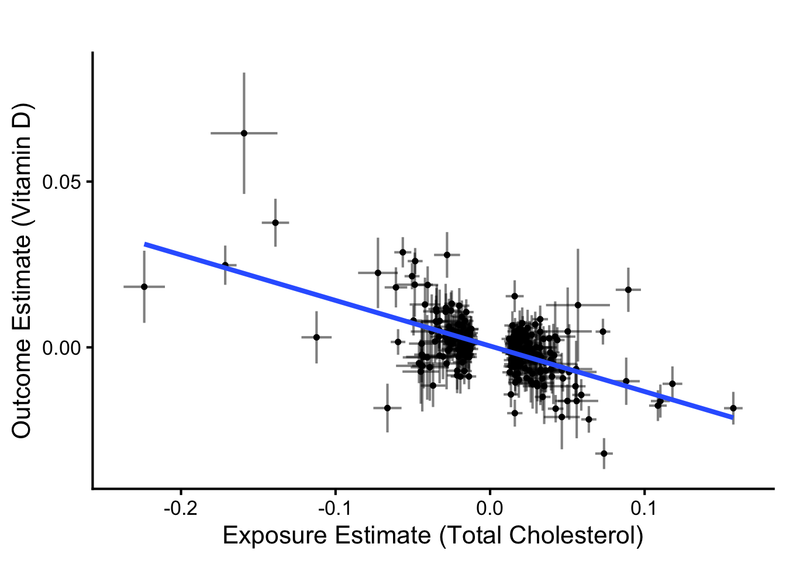{width=672}
:::
:::


#### Funnel Plot


::: {.cell}

```{.r .cell-code}
vitd.single_snp <- mr_singlesnp(vitd.data_steiger)

vitd.ivw_beta <- vitd.mr |>
  filter(method == "Inverse variance weighted (multiplicative random effects)") |>
  pull(b)

vitd.y_max <- max(vitd.single_snp$se^{-1}, na.rm = TRUE) * 1.1
vitd.precision_grid <- seq(0, vitd.y_max, length.out = 1000)
vitd.bounds_df <- data.frame(
  precision = vitd.precision_grid,
  lower     = vitd.ivw_beta - 1.96 / vitd.precision_grid,
  upper     = vitd.ivw_beta + 1.96 / vitd.precision_grid
)

ggplot(vitd.single_snp, aes(x = b, y = 1/se)) +
  geom_point(size = 1) +
  geom_vline(xintercept = vitd.ivw_beta, linetype = "solid",
             color = "#ff7f0e", size = 1) +
  geom_line(data = vitd.bounds_df,
            aes(x = lower, y = precision), linetype = "dashed") +
  geom_line(data = vitd.bounds_df,
            aes(x = upper, y = precision), linetype = "dashed") +
  labs(x = "Estimate (Beta-IVW)", y = "Precision (1/Standard Error)",
       title = "") +
  theme_classic(base_size = 16) +
  theme(plot.title = element_text(hjust = 0.5)) +
  coord_cartesian(ylim = c(0, vitd.y_max),
                  xlim = c(min(vitd.single_snp$b, na.rm = TRUE),
                           max(vitd.single_snp$b, na.rm = TRUE)))
```

::: {.cell-output-display}
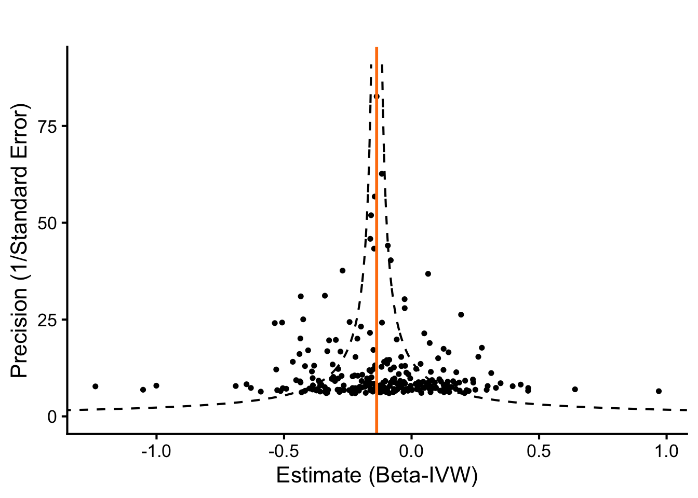{width=672}
:::
:::


#### Leave-One-Out Analysis


::: {.cell}

```{.r .cell-code}
vitd.loo_res <- mr_leaveoneout(vitd.data_steiger)

vitd.loo_res |>
  mutate(diff = b - filter(vitd.mr,
                           method == "Inverse variance weighted (multiplicative random effects)")$b) |>
  arrange(-abs(diff)) |>
  head() |>
  dplyr::select(SNP, diff, b, se, p) |>
  kable(caption = "Leave-One-Out Results for Vitamin D Analysis (IVW method) for influential SNPs",
        digits = c(0, 5, 5, 5, 5))
```

::: {.cell-output-display}


Table: Leave-One-Out Results for Vitamin D Analysis (IVW method) for influential SNPs

|SNP       |     diff|        b|      se|  p|
|:---------|--------:|--------:|-------:|--:|
|rs1077835 |  0.00612| -0.13085| 0.01195|  0|
|rs3846662 | -0.00591| -0.14288| 0.01211|  0|
|rs2043085 |  0.00492| -0.13205| 0.01188|  0|
|rs4841132 | -0.00487| -0.14184| 0.01195|  0|
|rs4520    |  0.00462| -0.13235| 0.01192|  0|
|rs1168085 |  0.00422| -0.13275| 0.01211|  0|


:::

```{.r .cell-code}
ggplot(vitd.loo_res, aes(x = reorder(SNP, -b), y = b)) +
  geom_point(size = 1) +
  geom_errorbar(aes(ymin = b - 1.96 * se, ymax = b + 1.96 * se),
                width = 0.01, alpha = 0.5) +
  coord_flip() +
  labs(x = "SNP Removed", y = "Estimate (Beta-IVW; leave-one-out)") +
  geom_hline(yintercept = 0, linetype = "dashed", color = "red") +
  theme_classic(base_size = 16) +
  theme(axis.text.y = element_text(size = 1))
```

::: {.cell-output-display}
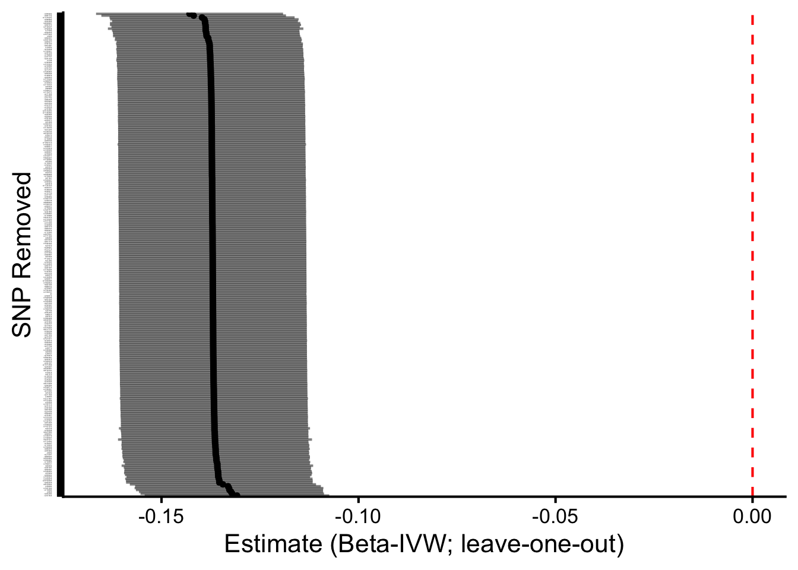{width=672}
:::
:::


Leave-one-out analyses suggested that no individual SNP had a relatively large
influence on the IVW estimate, supporting the robustness of the causal
inference for vitamin D.

#### MR-PRESSO Analysis

MR-PRESSO (Pleiotropy RESidual Sum and Outlier) tests whether the IVW estimate
is driven by a small number of pleiotropic outliers and provides an
outlier-corrected estimate.


::: {.cell}

```{.r .cell-code}
# MRPRESSO is attached in the non-cached global_options chunk.
set.seed(2026)
vitd.mrpresso <- tryCatch(
  mr_presso(BetaOutcome     = "beta.outcome",
            BetaExposure    = "beta.exposure",
            SdOutcome       = "se.outcome",
            SdExposure      = "se.exposure",
            OUTLIERtest     = TRUE,
            DISTORTIONtest  = TRUE,
            data            = vitd.data_steiger,
            NbDistribution  = 50000,
            SignifThreshold = 0.05),
  error = function(e) { message("MR-PRESSO failed: ", e$message); NULL }
)

if (!is.null(vitd.mrpresso)) {
  vitd.mrpresso$`Main MR results` |>
    kable(caption = "MR-PRESSO results for Vitamin D Analysis",
          digits = c(0, 4, 4, 4, 0, 99))

  cat("Global heterogeneity test p-value:",
      vitd.mrpresso$`MR-PRESSO results`$`Global Test`$Pvalue, "\n")
}
```

::: {.cell-output .cell-output-stdout}

```
Global heterogeneity test p-value: <2e-05 
```


:::

```{.r .cell-code}
vitd.mrpresso_rows <- extract_mrpresso_rows(
  vitd.mrpresso,
  "Total Cholesterol (UK Biobank)",
  vitd.label,
  nrow(vitd.data_steiger)
)
```
:::


### Vitamin D — Replication in MGI-BioVU LabWAS

As a lower-powered but independent replication of the primary Revez 2020
result, we repeat the vitamin D analysis in the MGI-BioVU LabWAS GWAS
(n=12,250) [@goldsteinLabWASNovelFindings2020]. Because this is a local
summary-statistics file keyed by chromosome-position-allele IDs (not rsIDs),
it is harmonised against the original `instruments.tc` set rather than the
rsID-keyed instruments used for the OpenGWAS query. The Revez 2020 estimate
remains the primary vitamin D result used for the Primary Mechanisms plot and
the calcium hypothesis test below; MGI-BioVU is reported here as a sensitivity
/ replication data point.


::: {.cell}

```{.r .cell-code}
gwas.vitdbv.file <- 'PheWeb Summary Statistics/phenocode-Vit-D.tsv.gz'
samplesize.outcome.vitdbv <- 12250
vitdbv.label <- "Vitamin D (MGI-BioVU LabWAS)"

gwas.vitdbv <- read_tsv(gwas.vitdbv.file, show_col_types = FALSE) |>
  mutate(ID = paste(chrom, pos, ref, alt, sep = ":")) |>
  dplyr::rename(
    SNP                   = ID,
    beta.outcome          = beta,
    se.outcome            = sebeta,
    effect_allele.outcome = alt,
    other_allele.outcome  = ref,
    pval.outcome          = pval,
    eaf.outcome           = maf,
  ) |>
  mutate(
    id.outcome         = vitdbv.label,
    outcome            = vitdbv.label,
    samplesize.outcome = samplesize.outcome.vitdbv
  )

# BioVU replication uses the original chr:pos:a:b SNP IDs (not rsIDs)
vitdbv.data <- harmonise_data(instruments.tc, gwas.vitdbv, action = 2)
vitdbv.data_steiger <- steiger_filtering(vitdbv.data)

# Pre-harmonization instrument metrics (all chr:pos-keyed input SNPs)
pre_harm_metrics_vitdbv <- instruments.tc %>%
  mutate(
    R2.exposure = 2 * eaf.exposure * (1 - eaf.exposure) * beta.exposure^2,
    F.exposure  = (R2.exposure * (samplesize.exposure - 2)) / (1 - R2.exposure)
  )

pre_harm_summary_vitdbv <- pre_harm_metrics_vitdbv %>%
  summarise(
    num_snps            = n(),
    samplesize.exposure = dplyr::first(samplesize.exposure),
    cumulative_R2       = sum(R2.exposure, na.rm = TRUE),
    mean_F              = mean(F.exposure, na.rm = TRUE),
    median_F            = median(F.exposure, na.rm = TRUE),
    mean_maf            = mean(eaf.exposure, na.rm = TRUE),
    mean_beta           = mean(abs(beta.exposure), na.rm = TRUE)
  ) |>
  mutate(
    overall_F = (cumulative_R2 * (samplesize.exposure - num_snps - 1)) /
                ((1 - cumulative_R2) * num_snps)
  )

# Post-harmonization instrument metrics
vitdbv.data.annot <- vitdbv.data_steiger %>%
  mutate(
    R2.exposure = 2 * eaf.exposure * (1 - eaf.exposure) * beta.exposure^2,
    F.exposure  = (R2.exposure * (samplesize.exposure - 2)) / (1 - R2.exposure)
  )

vitdbv.exposure.summary <- vitdbv.data.annot %>%
  summarise(
    num_snps            = n(),
    samplesize.exposure = dplyr::first(samplesize.exposure),
    cumulative_R2       = sum(R2.exposure, na.rm = TRUE),
    mean_F              = mean(F.exposure, na.rm = TRUE),
    median_F            = median(F.exposure, na.rm = TRUE),
    mean_maf            = mean(eaf.exposure, na.rm = TRUE),
    mean_beta           = mean(abs(beta.exposure), na.rm = TRUE)
  ) |>
  mutate(
    overall_F = (cumulative_R2 * (samplesize.exposure - num_snps - 1)) /
                ((1 - cumulative_R2) * num_snps)
  )

# Write instrument files
pre_harm_summary_vitdbv %>%
  write_csv("Instrument Metrics - Total Cholesterol for Vitamin D MGI-BioVU - Pre-Harmonization.csv")
vitdbv.exposure.summary %>%
  write_csv("Instrument Metrics - Total Cholesterol for Vitamin D MGI-BioVU - Post-Harmonization.csv")
vitdbv.data.annot %>%
  write_csv("Total Cholesterol Instruments for Vitamin D MGI-BioVU.csv")

bind_rows(
  pre_harm_summary_vitdbv  %>% mutate(Stage = "Pre-Harmonization"),
  vitdbv.exposure.summary  %>% mutate(Stage = "Post-Harmonization")
) %>%
  dplyr::select(Stage, everything()) %>%
  kable(caption = "Total cholesterol instruments before and after harmonisation for MGI-BioVU Vitamin D replication",
        digits = c(NA, 0, 0, 4, 1, 1, 4, 4, 1))
```

::: {.cell-output-display}


Table: Total cholesterol instruments before and after harmonisation for MGI-BioVU Vitamin D replication

|Stage              | num_snps| samplesize.exposure| cumulative_R2| mean_F| median_F| mean_maf| mean_beta| overall_F|
|:------------------|--------:|-------------------:|-------------:|------:|--------:|--------:|---------:|---------:|
|Pre-Harmonization  |      370|              420607|        0.1061|  120.8|     48.9|   0.3171|    0.0309|     134.8|
|Post-Harmonization |      285|              420607|        0.0972|  143.8|     53.5|   0.3498|    0.0301|     158.8|


:::

```{.r .cell-code}
vitdbv.mr <- mr(vitdbv.data_steiger,
                method_list = c("mr_ivw_mre", "mr_ivw_fe", "mr_raps",
                                "mr_egger_regression",
                                "mr_weighted_median", "mr_weighted_mode"))

vitdbv.mr |>
  dplyr::select(-starts_with('id')) |>
  kable(caption = "MR Results for Total Cholesterol - MGI-BioVU Vitamin D Replication",
        digits = c(0, 0, 0, 0, 3, 3, 99))
```

::: {.cell-output-display}


Table: MR Results for Total Cholesterol - MGI-BioVU Vitamin D Replication

|outcome                      |exposure                       |method                                                    | nsnp|      b|    se|       pval|
|:----------------------------|:------------------------------|:---------------------------------------------------------|----:|------:|-----:|----------:|
|Vitamin D (MGI-BioVU LabWAS) |Total Cholesterol (UK Biobank) |Inverse variance weighted (multiplicative random effects) |  280| -0.063| 0.033| 0.05362791|
|Vitamin D (MGI-BioVU LabWAS) |Total Cholesterol (UK Biobank) |Inverse variance weighted (fixed effects)                 |  280| -0.063| 0.029| 0.02795864|
|Vitamin D (MGI-BioVU LabWAS) |Total Cholesterol (UK Biobank) |Robust adjusted profile score (RAPS)                      |  280| -0.067| 0.034| 0.04513899|
|Vitamin D (MGI-BioVU LabWAS) |Total Cholesterol (UK Biobank) |MR Egger                                                  |  280| -0.070| 0.053| 0.19017784|
|Vitamin D (MGI-BioVU LabWAS) |Total Cholesterol (UK Biobank) |Weighted median                                           |  280| -0.005| 0.051| 0.92107846|
|Vitamin D (MGI-BioVU LabWAS) |Total Cholesterol (UK Biobank) |Weighted mode                                             |  280| -0.012| 0.464| 0.98005028|


:::

```{.r .cell-code}
vitdbv.pleio <- mr_pleiotropy_test(vitdbv.data_steiger)
vitdbv.pleio |>
  dplyr::select(-starts_with('id')) |>
  kable(caption = "MR Pleiotropy Results for Total Cholesterol - MGI-BioVU Vitamin D Replication")
```

::: {.cell-output-display}


Table: MR Pleiotropy Results for Total Cholesterol - MGI-BioVU Vitamin D Replication

|outcome                      |exposure                       | egger_intercept|        se|      pval|
|:----------------------------|:------------------------------|---------------:|---------:|---------:|
|Vitamin D (MGI-BioVU LabWAS) |Total Cholesterol (UK Biobank) |       0.0002851| 0.0017118| 0.8678594|


:::

```{.r .cell-code}
vitdbv.het <- mr_heterogeneity(vitdbv.data_steiger) |>
  mutate(I2 = pmax(0, (Q - Q_df) / Q) * 100)
vitdbv.het |>
  dplyr::select(-starts_with('id')) |>
  kable(caption = "MR Heterogeneity Results for Total Cholesterol - MGI-BioVU Vitamin D Replication",
        digits = c(0, 0, 0, 3, 3, 99, 1))
```

::: {.cell-output-display}


Table: MR Heterogeneity Results for Total Cholesterol - MGI-BioVU Vitamin D Replication

|outcome                      |exposure                       |method                    |       Q| Q_df|       Q_pval|   I2|
|:----------------------------|:------------------------------|:-------------------------|-------:|----:|------------:|----:|
|Vitamin D (MGI-BioVU LabWAS) |Total Cholesterol (UK Biobank) |MR Egger                  | 361.847|  278| 0.0005223738| 23.2|
|Vitamin D (MGI-BioVU LabWAS) |Total Cholesterol (UK Biobank) |Inverse variance weighted | 361.883|  279| 0.0005999283| 22.9|


:::
:::


#### MGI-BioVU Replication — Diagnostic Plots


::: {.cell}

```{.r .cell-code}
ggplot(vitdbv.data_steiger, aes(x = beta.exposure, y = beta.outcome)) +
  geom_point(size = 1) +
  geom_errorbar(aes(ymin = beta.outcome - 1.96 * se.outcome,
                    ymax = beta.outcome + 1.96 * se.outcome),
                alpha = 0.5) +
  geom_errorbar(aes(xmin = beta.exposure - 1.96 * se.exposure,
                    xmax = beta.exposure + 1.96 * se.exposure),
                alpha = 0.5) +
  geom_smooth(method = "lm", se = FALSE) +
  theme_classic(base_size = 16) +
  labs(x = "Exposure Estimate (Total Cholesterol)",
       y = "Outcome Estimate (Vitamin D, MGI-BioVU)",
       title = "")
```

::: {.cell-output-display}
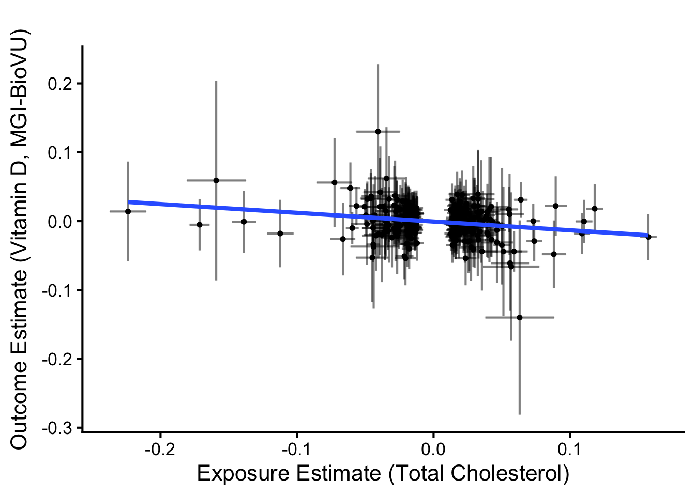{width=672}
:::
:::


::: {.cell}

```{.r .cell-code}
vitdbv.single_snp <- mr_singlesnp(vitdbv.data_steiger)

vitdbv.ivw_beta <- vitdbv.mr |>
  filter(method == "Inverse variance weighted (multiplicative random effects)") |>
  pull(b)

vitdbv.y_max <- max(vitdbv.single_snp$se^{-1}, na.rm = TRUE) * 1.1
vitdbv.precision_grid <- seq(0, vitdbv.y_max, length.out = 1000)
vitdbv.bounds_df <- data.frame(
  precision = vitdbv.precision_grid,
  lower     = vitdbv.ivw_beta - 1.96 / vitdbv.precision_grid,
  upper     = vitdbv.ivw_beta + 1.96 / vitdbv.precision_grid
)

ggplot(vitdbv.single_snp, aes(x = b, y = 1/se)) +
  geom_point(size = 1) +
  geom_vline(xintercept = vitdbv.ivw_beta, linetype = "solid",
             color = "#ff7f0e", size = 1) +
  geom_line(data = vitdbv.bounds_df,
            aes(x = lower, y = precision), linetype = "dashed") +
  geom_line(data = vitdbv.bounds_df,
            aes(x = upper, y = precision), linetype = "dashed") +
  labs(x = "Estimate (Beta-IVW)", y = "Precision (1/Standard Error)",
       title = "") +
  theme_classic(base_size = 16) +
  theme(plot.title = element_text(hjust = 0.5)) +
  coord_cartesian(ylim = c(0, vitdbv.y_max),
                  xlim = c(min(vitdbv.single_snp$b, na.rm = TRUE),
                           max(vitdbv.single_snp$b, na.rm = TRUE)))
```

::: {.cell-output-display}
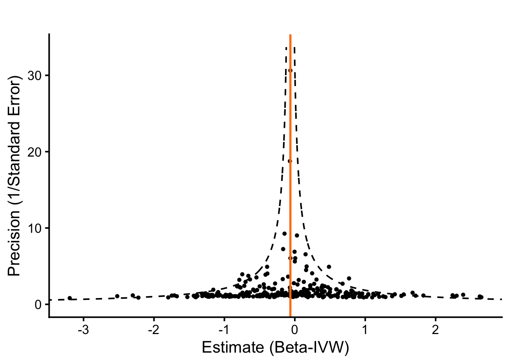{width=672}
:::
:::


::: {.cell}

```{.r .cell-code}
vitdbv.loo_res <- mr_leaveoneout(vitdbv.data_steiger)

vitdbv.loo_res |>
  mutate(diff = b - filter(vitdbv.mr,
                           method == "Inverse variance weighted (multiplicative random effects)")$b) |>
  arrange(-abs(diff)) |>
  head() |>
  dplyr::select(SNP, diff, b, se, p) |>
  kable(caption = "Leave-One-Out Results for MGI-BioVU Vitamin D Replication (IVW method) for influential SNPs",
        digits = c(0, 5, 5, 5, 5))
```

::: {.cell-output-display}


Table: Leave-One-Out Results for MGI-BioVU Vitamin D Replication (IVW method) for influential SNPs

|SNP             |     diff|        b|      se|       p|
|:---------------|--------:|--------:|-------:|-------:|
|1:63112320:C:G  | -0.01110| -0.07410| 0.03269| 0.02342|
|9:136154168:T:C |  0.00879| -0.05421| 0.03258| 0.09612|
|11:61569306:C:G | -0.00797| -0.07097| 0.03249| 0.02894|
|19:45349369:T:C | -0.00789| -0.07089| 0.03320| 0.03275|
|15:58680954:T:C |  0.00690| -0.05610| 0.03266| 0.08590|
|15:58723426:A:G |  0.00669| -0.05631| 0.03291| 0.08709|


:::

```{.r .cell-code}
ggplot(vitdbv.loo_res, aes(x = reorder(SNP, -b), y = b)) +
  geom_point(size = 1) +
  geom_errorbar(aes(ymin = b - 1.96 * se, ymax = b + 1.96 * se),
                width = 0.01, alpha = 0.5) +
  coord_flip() +
  labs(x = "SNP Removed", y = "Estimate (Beta-IVW; leave-one-out)") +
  geom_hline(yintercept = 0, linetype = "dashed", color = "red") +
  theme_classic(base_size = 16) +
  theme(axis.text.y = element_text(size = 1))
```

::: {.cell-output-display}
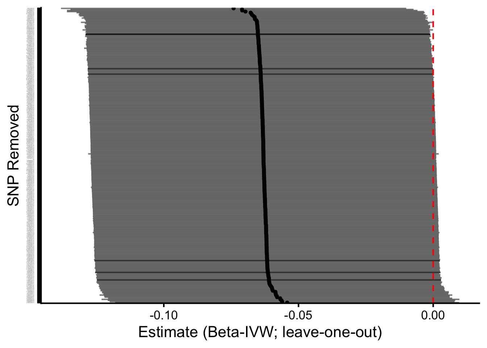{width=672}
:::
:::


::: {.cell}

```{.r .cell-code}
set.seed(2026)
vitdbv.mrpresso <- tryCatch(
  mr_presso(BetaOutcome     = "beta.outcome",
            BetaExposure    = "beta.exposure",
            SdOutcome       = "se.outcome",
            SdExposure      = "se.exposure",
            OUTLIERtest     = TRUE,
            DISTORTIONtest  = TRUE,
            data            = vitdbv.data_steiger,
            NbDistribution  = 50000,
            SignifThreshold = 0.05),
  error = function(e) { message("MR-PRESSO failed: ", e$message); NULL }
)

if (!is.null(vitdbv.mrpresso)) {
  vitdbv.mrpresso$`Main MR results` |>
    kable(caption = "MR-PRESSO results for MGI-BioVU Vitamin D Replication",
          digits = c(0, 4, 4, 4, 0, 99))

  cat("Global heterogeneity test p-value:",
      vitdbv.mrpresso$`MR-PRESSO results`$`Global Test`$Pvalue, "\n")
}
```

::: {.cell-output .cell-output-stdout}

```
Global heterogeneity test p-value: 3e-04 
```


:::

```{.r .cell-code}
vitdbv.mrpresso_rows <- extract_mrpresso_rows(
  vitdbv.mrpresso,
  "Total Cholesterol (UK Biobank)",
  vitdbv.label,
  nrow(vitdbv.data_steiger)
)
```
:::


#### Replication Comparison — Revez 2020 vs MGI-BioVU


::: {.cell}

```{.r .cell-code}
vitd.sources_mr <- bind_rows(vitd.mr, vitdbv.mr) %>%
  filter(method == "Inverse variance weighted (multiplicative random effects)")

vitd.sources_mr %>%
  dplyr::select(outcome, nsnp, b, se, pval) %>%
  kable(caption = paste0(
    "IVW-RE estimates for total cholesterol on 25-hydroxyvitamin D across the ",
    "primary (Revez 2020) and replication (MGI-BioVU) GWAS"),
    digits = c(NA, 0, 4, 4, 6))
```

::: {.cell-output-display}


Table: IVW-RE estimates for total cholesterol on 25-hydroxyvitamin D across the primary (Revez 2020) and replication (MGI-BioVU) GWAS

|outcome                               | nsnp|      b|     se|     pval|
|:-------------------------------------|----:|------:|------:|--------:|
|25-hydroxyvitamin D (Revez 2020, UKB) |  258| -0.137| 0.0121| 0.000000|
|Vitamin D (MGI-BioVU LabWAS)          |  280| -0.063| 0.0326| 0.053628|


:::

```{.r .cell-code}
ggplot(vitd.sources_mr, aes(x = b, y = outcome)) +
  geom_point(size = 3, colour = color_scheme[1]) +
  geom_errorbar(aes(xmin = b - 1.96 * se, xmax = b + 1.96 * se),
                width = 0.2, colour = color_scheme[1]) +
  geom_vline(xintercept = 0, linetype = "dashed", color = "red") +
  theme_classic(base_size = 14) +
  labs(title = "Cholesterol effect on vitamin D — primary vs replication GWAS",
       subtitle = "IVW-RE; 95% CI",
       y = "", x = "Beta Coefficient (per SD total cholesterol)")
```

::: {.cell-output-display}
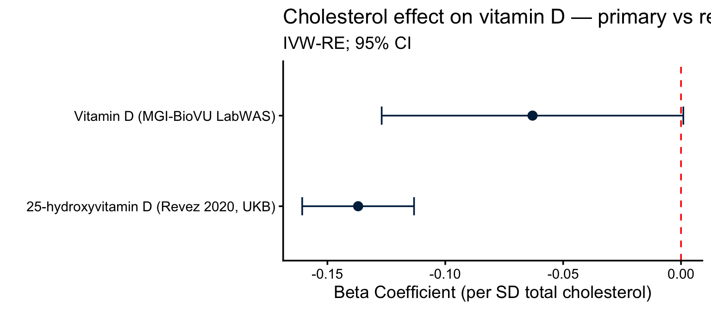{width=768}
:::
:::


::: {.cell}

:::


The MGI-BioVU replication IVW-RE estimate (β = -0.063,
p = 0.054) agrees in direction with the primary Revez 2020 estimate (both negative). Given
its far smaller sample size (n=12,250 vs n≈417,580), MGI-BioVU is
underpowered relative to the primary GWAS and is interpreted only as a
directional replication check.


## Pathological Outcomes

### Bone Outcome GWAS Selection

The previous analysis used local PheWeb summary statistics from older GEFOS
releases (Estrada 2012; Zheng 2015). These files had three problems: small
sample sizes (32k–53k participants), build-37 marker IDs requiring manual
rsID conversion, and dramatic instrument loss during harmonisation. To
address these issues, this version queries three more recent BMD and fracture
GWAS directly via the OpenGWAS API, using LD proxies (r²>0.8) to recover
SNPs that are not directly present in each outcome dataset.

The three bone-related outcomes are treated as primary analyses because
they ask different but complementary questions:

- **Heel BMD (Morris 2019, UKB, n=426,824)**
  [@morrisAtlasGeneticInfluences2019]: highest-powered BMD GWAS available,
  derived from quantitative ultrasound; cortical-bone-dominated
- **Femoral neck BMD (Zheng 2015, GEFOS, n=32,735)**
  [@zhengWholegenomeSequencingIdentifies2015]: DXA-based, lower powered
  legacy comparator
- **Fractures (Dönertaş 2021, UKB, n=484,598)**
  [@donertasCommonGeneticAssociations2021]: clinical endpoint integrating
  bone density, geometry, and fall propensity

### Querying OpenGWAS for BMD and Fracture Outcomes


::: {.cell}

```{.r .cell-code}
library(ieugwasr)

bone_outcome_gwas <- tribble(
  ~label,                              ~gwas_id,              ~n,       ~year, ~pmid,
  "Heel BMD (Morris 2019, UKB)",        "ebi-a-GCST006979",    426824,   2019,  30598549,
  "Femoral neck BMD (Zheng 2015)",      "ieu-a-980",           32735,    2015,  26367794,
  "Fractures (Dönertaş 2021, UKB)",     "ebi-a-GCST90038703",  484598,   2021,  33959723
)

kable(bone_outcome_gwas,
      caption = "Bone outcome GWAS queried via OpenGWAS")
```

::: {.cell-output-display}


Table: Bone outcome GWAS queried via OpenGWAS

|label                          |gwas_id            |      n| year|     pmid|
|:------------------------------|:------------------|------:|----:|--------:|
|Heel BMD (Morris 2019, UKB)    |ebi-a-GCST006979   | 426824| 2019| 30598549|
|Femoral neck BMD (Zheng 2015)  |ieu-a-980          |  32735| 2015| 26367794|
|Fractures (Dönertaş 2021, UKB) |ebi-a-GCST90038703 | 484598| 2021| 33959723|


:::

```{.r .cell-code}
fetch_bone_outcome <- function(gwas_id, label) {
  cat("  Fetching", label, "(", gwas_id, ")...\n")

  outcome_dat <- tryCatch(
    extract_outcome_data(
      snps          = instruments.tc.rsid$SNP,
      outcomes      = gwas_id,
      proxies       = TRUE,
      rsq           = 0.8,
      align_alleles = 1,
      palindromes   = 1,
      maf_threshold = 0.01
    ),
    error = function(e) { cat("    Failed:", e$message, "\n"); NULL }
  )

  if (is.null(outcome_dat) || nrow(outcome_dat) == 0) return(NULL)

  outcome_dat %>%
    mutate(outcome = label, id.outcome = label)
}

cat("Querying OpenGWAS for", nrow(bone_outcome_gwas), "bone outcomes...\n")
```

::: {.cell-output .cell-output-stdout}

```
Querying OpenGWAS for 3 bone outcomes...
```


:::

```{.r .cell-code}
bone_outcomes <- map2(bone_outcome_gwas$gwas_id,
                      bone_outcome_gwas$label,
                      fetch_bone_outcome) %>%
  set_names(bone_outcome_gwas$label) %>%
  purrr::compact()
```

::: {.cell-output .cell-output-stdout}

```
  Fetching Heel BMD (Morris 2019, UKB) ( ebi-a-GCST006979 )...
```


:::

::: {.cell-output .cell-output-stdout}

```
  Fetching Femoral neck BMD (Zheng 2015) ( ieu-a-980 )...
```


:::

::: {.cell-output .cell-output-stdout}

```
    Failed: 
Status code from OpenGWAS API: 401

Message: Unknown error. 
  Fetching Fractures (Dönertaş 2021, UKB) ( ebi-a-GCST90038703 )...
```


:::

```{.r .cell-code}
map_dfr(bone_outcomes, ~ tibble(
  n_snps_returned = nrow(.x),
  n_via_proxy     = sum(.x$proxy.outcome == TRUE, na.rm = TRUE)
), .id = "outcome") |>
  mutate(
    n_instruments = nrow(instruments.tc.rsid),
    pct_recovered = round(100 * n_snps_returned / n_instruments, 1)
  ) |>
  kable(caption = "Outcome SNP recovery via OpenGWAS")
```

::: {.cell-output-display}


Table: Outcome SNP recovery via OpenGWAS

|outcome                        | n_snps_returned| n_via_proxy| n_instruments| pct_recovered|
|:------------------------------|---------------:|-----------:|-------------:|-------------:|
|Heel BMD (Morris 2019, UKB)    |             348|          11|           360|          96.7|
|Fractures (Dönertaş 2021, UKB) |             356|           0|           360|          98.9|


:::
:::


### Running MR Across Bone Outcomes


::: {.cell}

```{.r .cell-code}
instruments.tc.for.bone <- instruments.tc.rsid

# Pre-harmonization summary for the rsID-keyed instrument set used by all bone analyses
pre_harm_metrics_bone <- instruments.tc.rsid %>%
  mutate(
    R2.exposure = 2 * eaf.exposure * (1 - eaf.exposure) * beta.exposure^2,
    F.exposure  = (R2.exposure * (samplesize.exposure - 2)) / (1 - R2.exposure)
  )

pre_harm_summary_bone <- pre_harm_metrics_bone %>%
  summarise(
    num_snps            = n(),
    samplesize.exposure = dplyr::first(samplesize.exposure),
    cumulative_R2       = sum(R2.exposure, na.rm = TRUE),
    mean_F              = mean(F.exposure, na.rm = TRUE),
    median_F            = median(F.exposure, na.rm = TRUE),
    mean_maf            = mean(eaf.exposure, na.rm = TRUE),
    mean_beta           = mean(abs(beta.exposure), na.rm = TRUE)
  ) |>
  mutate(
    overall_F = (cumulative_R2 * (samplesize.exposure - num_snps - 1)) /
                ((1 - cumulative_R2) * num_snps)
  )

# Map outcome labels -> safe filenames
safe_label <- function(label) {
  label %>%
    str_replace_all("[^A-Za-z0-9 ]", "") %>%
    str_squish()
}

run_bone_mr <- function(outcome_dat, label) {

  harm <- harmonise_data(instruments.tc.for.bone, outcome_dat, action = 2)
  harm_steiger <- steiger_filtering(harm)

  if (nrow(harm_steiger) == 0) {
    cat("  ", label, ": no SNPs retained after harmonisation\n")
    return(NULL)
  }

  inst_summary <- harm_steiger %>%
    mutate(R2 = 2 * eaf.exposure * (1 - eaf.exposure) * beta.exposure^2,
           F  = (R2 * (samplesize.exposure - 2)) / (1 - R2)) %>%
    summarise(
      outcome             = label,
      num_snps            = n(),
      samplesize.exposure = dplyr::first(samplesize.exposure),
      cumulative_R2       = sum(R2, na.rm = TRUE),
      mean_F              = mean(F, na.rm = TRUE),
      median_F            = median(F, na.rm = TRUE),
      mean_maf            = mean(eaf.exposure, na.rm = TRUE),
      mean_beta           = mean(abs(beta.exposure), na.rm = TRUE)
    ) %>%
    mutate(
      overall_F = (cumulative_R2 * (samplesize.exposure - num_snps - 1)) /
                  ((1 - cumulative_R2) * num_snps)
    )

  mr_res <- mr(harm_steiger,
               method_list = c("mr_ivw_mre", "mr_ivw_fe", "mr_raps",
                               "mr_egger_regression",
                               "mr_weighted_median", "mr_weighted_mode")) %>%
    mutate(outcome = label)

  pleio <- tryCatch(
    mr_pleiotropy_test(harm_steiger) %>% mutate(outcome = label),
    error = function(e) NULL
  )

  het <- tryCatch(
    mr_heterogeneity(harm_steiger) %>%
      mutate(outcome = label, I2 = pmax(0, (Q - Q_df) / Q) * 100),
    error = function(e) NULL
  )

  # Write per-outcome instrument files
  sl <- safe_label(label)

  inst_summary_pre  <- pre_harm_summary_bone
  inst_summary_post <- inst_summary %>% dplyr::select(-outcome)

  inst_summary_pre  %>%
    write_csv(paste0("Instrument Metrics - Total Cholesterol for ", sl,
                     " - Pre-Harmonization.csv"))
  inst_summary_post %>%
    write_csv(paste0("Instrument Metrics - Total Cholesterol for ", sl,
                     " - Post-Harmonization.csv"))
  harm_steiger %>%
    mutate(R2.exposure = 2 * eaf.exposure * (1 - eaf.exposure) * beta.exposure^2,
           F.exposure  = (R2.exposure * (samplesize.exposure - 2)) / (1 - R2.exposure)) %>%
    write_csv(paste0("Total Cholesterol Instruments for ", sl, ".csv"))

  list(instruments    = inst_summary,
       mr             = mr_res,
       pleiotropy     = pleio,
       heterogeneity  = het,
       harmonised     = harm_steiger)
}

bone_results <- imap(bone_outcomes, run_bone_mr) %>% purrr::compact()

bone_inst_combined  <- map_dfr(bone_results, "instruments")
bone_mr_combined    <- map_dfr(bone_results, "mr")
bone_pleio_combined <- map_dfr(bone_results, "pleiotropy")
bone_het_combined   <- map_dfr(bone_results, "heterogeneity")
```
:::


### Instrument Strength Across Bone Outcomes


::: {.cell}

```{.r .cell-code}
bone_inst_combined %>%
  kable(caption = paste0(
    "Total cholesterol instruments after harmonisation across bone outcome GWAS. ",
    "Pre-harmonization metrics are identical across outcomes (",
    nrow(instruments.tc.rsid), " rsIDs) and are reported in the per-outcome ",
    "Instrument Metrics CSVs."
  ),
  digits = c(NA, 0, 0, 4, 1, 1, 4, 4, 1))
```

::: {.cell-output-display}


Table: Total cholesterol instruments after harmonisation across bone outcome GWAS. Pre-harmonization metrics are identical across outcomes (360 rsIDs) and are reported in the per-outcome Instrument Metrics CSVs.

|outcome                        | num_snps| samplesize.exposure| cumulative_R2| mean_F| median_F| mean_maf| mean_beta| overall_F|
|:------------------------------|--------:|-------------------:|-------------:|------:|--------:|--------:|---------:|---------:|
|Heel BMD (Morris 2019, UKB)    |      261|              420607|        0.0919|  148.4|     52.7|   0.3499|    0.0305|     163.0|
|Fractures (Dönertaş 2021, UKB) |      268|              420607|        0.0939|  147.7|     52.7|   0.3525|    0.0303|     162.6|


:::
:::


### MR Estimates Across Bone Outcomes


::: {.cell}

```{.r .cell-code}
bone_mr_combined %>%
  dplyr::select(-starts_with('id')) %>%
  kable(caption = "MR estimates for total cholesterol on each bone outcome (all methods)",
        digits = c(0, 0, 0, 0, 3, 3, 99))
```

::: {.cell-output-display}


Table: MR estimates for total cholesterol on each bone outcome (all methods)

|outcome                        |exposure                       |method                                                    | nsnp|      b|    se|         pval|
|:------------------------------|:------------------------------|:---------------------------------------------------------|----:|------:|-----:|------------:|
|Heel BMD (Morris 2019, UKB)    |Total Cholesterol (UK Biobank) |Inverse variance weighted (multiplicative random effects) |  257| -0.051| 0.013| 1.449456e-04|
|Heel BMD (Morris 2019, UKB)    |Total Cholesterol (UK Biobank) |Inverse variance weighted (fixed effects)                 |  257| -0.051| 0.004| 1.030146e-31|
|Heel BMD (Morris 2019, UKB)    |Total Cholesterol (UK Biobank) |Robust adjusted profile score (RAPS)                      |  257| -0.041| 0.011| 2.753752e-04|
|Heel BMD (Morris 2019, UKB)    |Total Cholesterol (UK Biobank) |MR Egger                                                  |  257| -0.036| 0.021| 8.992305e-02|
|Heel BMD (Morris 2019, UKB)    |Total Cholesterol (UK Biobank) |Weighted median                                           |  257| -0.026| 0.010| 7.060208e-03|
|Heel BMD (Morris 2019, UKB)    |Total Cholesterol (UK Biobank) |Weighted mode                                             |  257| -0.027| 0.066| 6.878570e-01|
|Fractures (Dönertaş 2021, UKB) |Total Cholesterol (UK Biobank) |Inverse variance weighted (multiplicative random effects) |  264|  0.000| 0.001| 7.405123e-01|
|Fractures (Dönertaş 2021, UKB) |Total Cholesterol (UK Biobank) |Inverse variance weighted (fixed effects)                 |  264|  0.000| 0.001| 7.293549e-01|
|Fractures (Dönertaş 2021, UKB) |Total Cholesterol (UK Biobank) |Robust adjusted profile score (RAPS)                      |  264|  0.000| 0.001| 6.952238e-01|
|Fractures (Dönertaş 2021, UKB) |Total Cholesterol (UK Biobank) |MR Egger                                                  |  264| -0.001| 0.001| 5.411579e-01|
|Fractures (Dönertaş 2021, UKB) |Total Cholesterol (UK Biobank) |Weighted median                                           |  264|  0.000| 0.001| 7.699324e-01|
|Fractures (Dönertaş 2021, UKB) |Total Cholesterol (UK Biobank) |Weighted mode                                             |  264|  0.000| 0.007| 9.863697e-01|


:::
:::


### Primary Estimates Only


::: {.cell}

```{.r .cell-code}
bone_mr_combined %>%
  filter(method == "Inverse variance weighted (multiplicative random effects)") %>%
  dplyr::select(outcome, nsnp, b, se, pval) %>%
  kable(caption = paste0(
    "Primary IVW-RE estimates across bone outcomes — total cholesterol effect ",
    "in standard deviation units (or risk difference per SD for fracture)"
  ),
  digits = c(NA, 0, 4, 4, 6))
```

::: {.cell-output-display}


Table: Primary IVW-RE estimates across bone outcomes — total cholesterol effect in standard deviation units (or risk difference per SD for fracture)

|outcome                        | nsnp|       b|     se|     pval|
|:------------------------------|----:|-------:|------:|--------:|
|Heel BMD (Morris 2019, UKB)    |  257| -0.0509| 0.0134| 0.000145|
|Fractures (Dönertaş 2021, UKB) |  264|  0.0002| 0.0007| 0.740512|


:::
:::


### Pleiotropy and Heterogeneity Across Bone Outcomes


::: {.cell}

```{.r .cell-code}
bone_pleio_combined %>%
  dplyr::select(-starts_with('id')) %>%
  kable(caption = "MR-Egger intercept tests across bone outcomes")
```

::: {.cell-output-display}


Table: MR-Egger intercept tests across bone outcomes

|outcome                        |exposure                       | egger_intercept|        se|      pval|
|:------------------------------|:------------------------------|---------------:|---------:|---------:|
|Heel BMD (Morris 2019, UKB)    |Total Cholesterol (UK Biobank) |      -0.0006185| 0.0007005| 0.3780436|
|Fractures (Dönertaş 2021, UKB) |Total Cholesterol (UK Biobank) |       0.0000359| 0.0000342| 0.2950596|


:::

```{.r .cell-code}
bone_het_combined %>%
  dplyr::select(-starts_with('id')) %>%
  kable(caption = "Heterogeneity (Cochran's Q) across bone outcomes",
        digits = c(NA, NA, 0, 3, 0, 4, 1))
```

::: {.cell-output-display}


Table: Heterogeneity (Cochran's Q) across bone outcomes

|outcome                        |exposure                       |method                    |        Q| Q_df| Q_pval|   I2|
|:------------------------------|:------------------------------|:-------------------------|--------:|----:|------:|----:|
|Heel BMD (Morris 2019, UKB)    |Total Cholesterol (UK Biobank) |MR Egger                  | 2427.477|  255| 0.0000| 89.5|
|Heel BMD (Morris 2019, UKB)    |Total Cholesterol (UK Biobank) |Inverse variance weighted | 2434.900|  256| 0.0000| 89.5|
|Fractures (Dönertaş 2021, UKB) |Total Cholesterol (UK Biobank) |MR Egger                  |  285.846|  262| 0.1490|  8.3|
|Fractures (Dönertaş 2021, UKB) |Total Cholesterol (UK Biobank) |Inverse variance weighted |  287.047|  263| 0.1476|  8.4|


:::
:::


### Heel BMD — Diagnostic Plots

The Heel BMD (Morris 2019) result is the primary BMD estimate and warrants
detailed diagnostics. Vitamin D was already diagnosed above; the other bone
outcomes (femoral neck BMD, fractures) are secondary or null and are
summarised in the combined results table.


::: {.cell}

```{.r .cell-code}
heelbmd.harmonised <- bone_results[["Heel BMD (Morris 2019, UKB)"]]$harmonised
heelbmd.mr         <- bone_results[["Heel BMD (Morris 2019, UKB)"]]$mr
```
:::


#### Scatter Plot


::: {.cell}

```{.r .cell-code}
ggplot(heelbmd.harmonised, aes(x = beta.exposure, y = beta.outcome)) +
  geom_point(size = 1) +
  geom_errorbar(aes(ymin = beta.outcome - 1.96 * se.outcome,
                    ymax = beta.outcome + 1.96 * se.outcome),
                alpha = 0.5) +
  geom_errorbar(aes(xmin = beta.exposure - 1.96 * se.exposure,
                    xmax = beta.exposure + 1.96 * se.exposure),
                alpha = 0.5) +
  geom_smooth(method = "lm", se = FALSE) +
  theme_classic(base_size = 16) +
  labs(x = "Exposure Estimate (Total Cholesterol)",
       y = "Outcome Estimate (Heel BMD)",
       title = "")
```

::: {.cell-output-display}
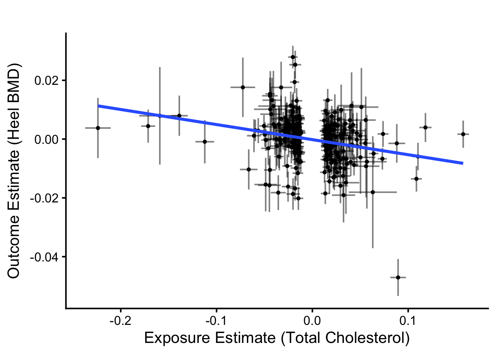{width=672}
:::
:::


#### Funnel Plot


::: {.cell}

```{.r .cell-code}
heelbmd.single_snp <- mr_singlesnp(heelbmd.harmonised)

heelbmd.ivw_beta <- heelbmd.mr |>
  filter(method == "Inverse variance weighted (multiplicative random effects)") |>
  pull(b)

heelbmd.y_max <- max(heelbmd.single_snp$se^{-1}, na.rm = TRUE) * 1.1
heelbmd.precision_grid <- seq(0, heelbmd.y_max, length.out = 1000)
heelbmd.bounds_df <- data.frame(
  precision = heelbmd.precision_grid,
  lower     = heelbmd.ivw_beta - 1.96 / heelbmd.precision_grid,
  upper     = heelbmd.ivw_beta + 1.96 / heelbmd.precision_grid
)

ggplot(heelbmd.single_snp, aes(x = b, y = 1/se)) +
  geom_point(size = 1) +
  geom_vline(xintercept = heelbmd.ivw_beta, linetype = "solid",
             color = "#ff7f0e", size = 1) +
  geom_line(data = heelbmd.bounds_df,
            aes(x = lower, y = precision), linetype = "dashed") +
  geom_line(data = heelbmd.bounds_df,
            aes(x = upper, y = precision), linetype = "dashed") +
  labs(x = "Estimate (Beta-IVW)", y = "Precision (1/Standard Error)",
       title = "") +
  theme_classic(base_size = 16) +
  theme(plot.title = element_text(hjust = 0.5)) +
  coord_cartesian(ylim = c(0, heelbmd.y_max),
                  xlim = c(min(heelbmd.single_snp$b, na.rm = TRUE),
                           max(heelbmd.single_snp$b, na.rm = TRUE)))
```

::: {.cell-output-display}
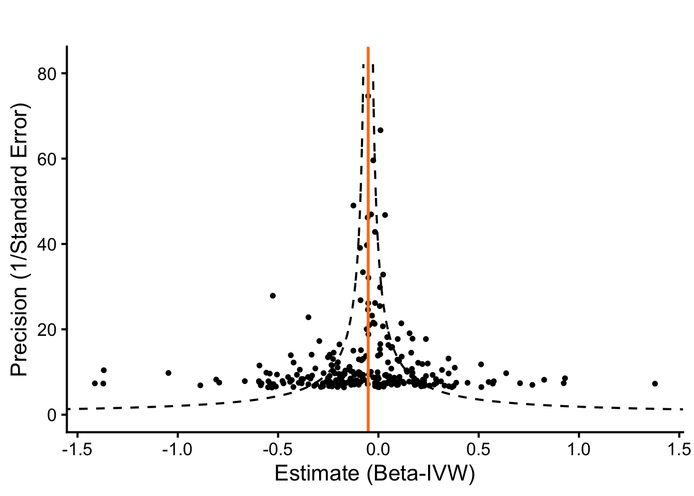{width=672}
:::
:::


#### Leave-One-Out Analysis


::: {.cell}

```{.r .cell-code}
heelbmd.loo_res <- mr_leaveoneout(heelbmd.harmonised)

heelbmd.loo_res |>
  mutate(diff = b - filter(heelbmd.mr,
                           method == "Inverse variance weighted (multiplicative random effects)")$b) |>
  arrange(-abs(diff)) |>
  head() |>
  dplyr::select(SNP, diff, b, se, p) |>
  kable(caption = "Leave-One-Out Results for Heel BMD Analysis (IVW method) for influential SNPs",
        digits = c(0, 5, 5, 5, 5))
```

::: {.cell-output-display}


Table: Leave-One-Out Results for Heel BMD Analysis (IVW method) for influential SNPs

|SNP       |     diff|        b|      se|       p|
|:---------|--------:|--------:|-------:|-------:|
|rs4841132 |  0.00707| -0.04382| 0.01302| 0.00076|
|rs4420638 | -0.00562| -0.05651| 0.01397| 0.00005|
|rs2927472 | -0.00363| -0.05452| 0.01366| 0.00007|
|rs602633  |  0.00349| -0.04740| 0.01370| 0.00054|
|rs174545  |  0.00296| -0.04793| 0.01336| 0.00033|
|rs2737247 |  0.00270| -0.04819| 0.01290| 0.00019|


:::

```{.r .cell-code}
ggplot(heelbmd.loo_res, aes(x = reorder(SNP, -b), y = b)) +
  geom_point(size = 1) +
  geom_errorbar(aes(ymin = b - 1.96 * se, ymax = b + 1.96 * se),
                width = 0.01, alpha = 0.5) +
  coord_flip() +
  labs(x = "SNP Removed", y = "Estimate (Beta-IVW; leave-one-out)") +
  geom_hline(yintercept = 0, linetype = "dashed", color = "red") +
  theme_classic(base_size = 16) +
  theme(axis.text.y = element_text(size = 1))
```

::: {.cell-output-display}
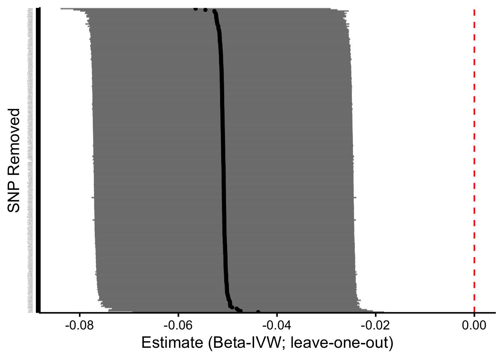{width=672}
:::
:::


Leave-one-out analyses suggested that no individual SNP had a relatively large
influence on the IVW estimate, supporting the robustness of the causal
inference for heel BMD.

#### MR-PRESSO Analysis


::: {.cell}

```{.r .cell-code}
set.seed(2026)
heelbmd.mrpresso <- tryCatch(
  mr_presso(BetaOutcome     = "beta.outcome",
            BetaExposure    = "beta.exposure",
            SdOutcome       = "se.outcome",
            SdExposure      = "se.exposure",
            OUTLIERtest     = TRUE,
            DISTORTIONtest  = TRUE,
            data            = heelbmd.harmonised,
            NbDistribution  = 50000,
            SignifThreshold = 0.05),
  error = function(e) { message("MR-PRESSO failed: ", e$message); NULL }
)

if (!is.null(heelbmd.mrpresso)) {
  heelbmd.mrpresso$`Main MR results` |>
    kable(caption = "MR-PRESSO results for Heel BMD Analysis",
          digits = c(0, 4, 4, 4, 0, 99))

  cat("Global heterogeneity test p-value:",
      heelbmd.mrpresso$`MR-PRESSO results`$`Global Test`$Pvalue, "\n")
}
```

::: {.cell-output .cell-output-stdout}

```
Global heterogeneity test p-value: <2e-05 
```


:::

```{.r .cell-code}
heelbmd.mrpresso_rows <- extract_mrpresso_rows(
  heelbmd.mrpresso,
  "Total Cholesterol (UK Biobank)",
  "Heel BMD (Morris 2019, UKB)",
  nrow(heelbmd.harmonised)
)
```
:::


### Forest Plots — All Methods Per Outcome


::: {.cell}

```{.r .cell-code}
ggplot(bone_mr_combined,
       aes(y = method, x = b)) +
  geom_point() +
  geom_errorbar(aes(xmin = b - 1.96 * se, xmax = b + 1.96 * se),
                width = 0.2) +
  geom_vline(xintercept = 0, linetype = "dashed", color = "red") +
  facet_wrap(~outcome, scales = "free_x", ncol = 2) +
  theme_classic(base_size = 12) +
  labs(title = "Total cholesterol effects on bone outcomes",
       y = "", x = "Effect Size (Beta)")
```

::: {.cell-output-display}
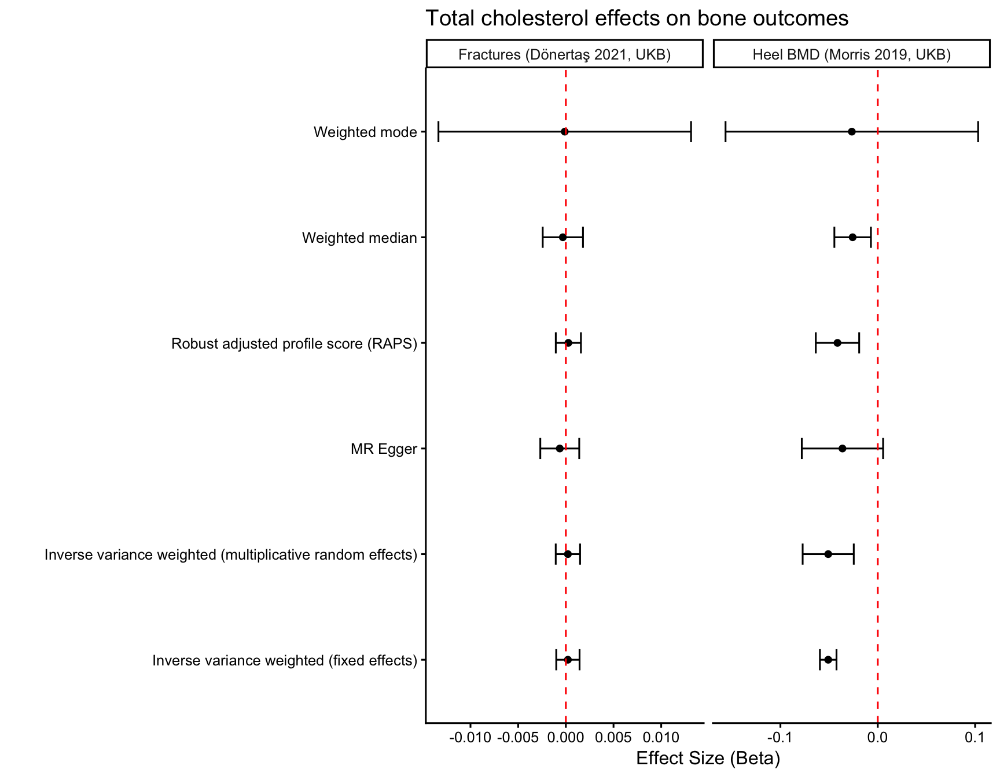{width=864}
:::
:::


### Forest Plot — Primary Estimates Across Outcomes


::: {.cell}

```{.r .cell-code}
bone_mr_combined %>%
  filter(method == "Inverse variance weighted (multiplicative random effects)") %>%
  ggplot(aes(y = outcome, x = b)) +
  geom_point(size = 3, colour = color_scheme[1]) +
  geom_errorbar(aes(xmin = b - 1.96 * se, xmax = b + 1.96 * se),
                width = 0.2, colour = color_scheme[1]) +
  geom_vline(xintercept = 0, linetype = "dashed", color = "red") +
  theme_classic(base_size = 14) +
  labs(title = "Total cholesterol IVW-RE effects on bone outcomes",
       subtitle = "Primary estimate per outcome; 95% CI",
       y = "", x = "Effect Size (Beta)")
```

::: {.cell-output-display}
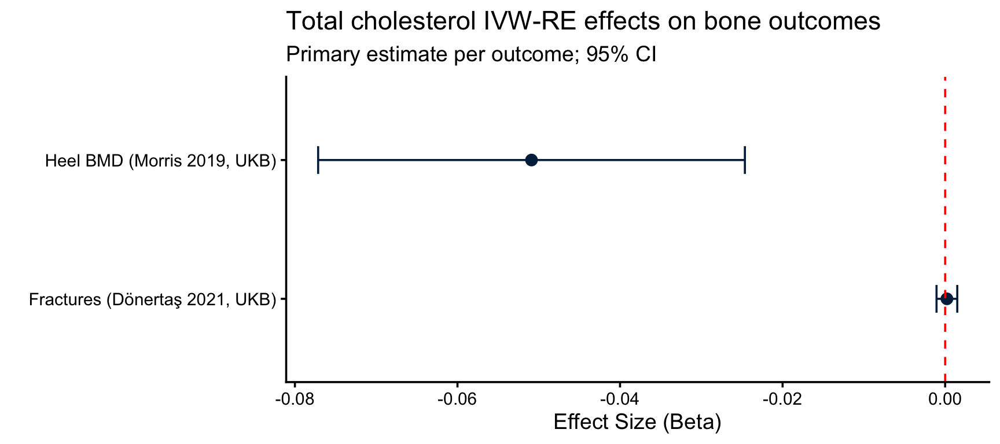{width=864}
:::
:::


## Summary of Proposed Causal Mechanisms


::: {.cell}

```{.r .cell-code}
# Combine vitamin D (primary Revez + MGI-BioVU replication) with all bone outcomes
all_mr_combined <- bind_rows(vitd.mr, vitdbv.mr, bone_mr_combined) %>%
  filter(method == "Inverse variance weighted (multiplicative random effects)")

ggplot(all_mr_combined, aes(x = outcome, y = b)) +
  geom_point(stat = "identity", size = 3) +
  geom_errorbar(aes(ymin = b - 1.96 * se, ymax = b + 1.96 * se), width = 0.2) +
  coord_flip() +
  geom_hline(yintercept = 0, linetype = "dashed", color = "red") +
  theme_classic(base_size = 14) +
  labs(title = "Cholesterol effects on calcium-related mechanisms",
       y = "Beta Coefficient", x = "")
```

::: {.cell-output-display}
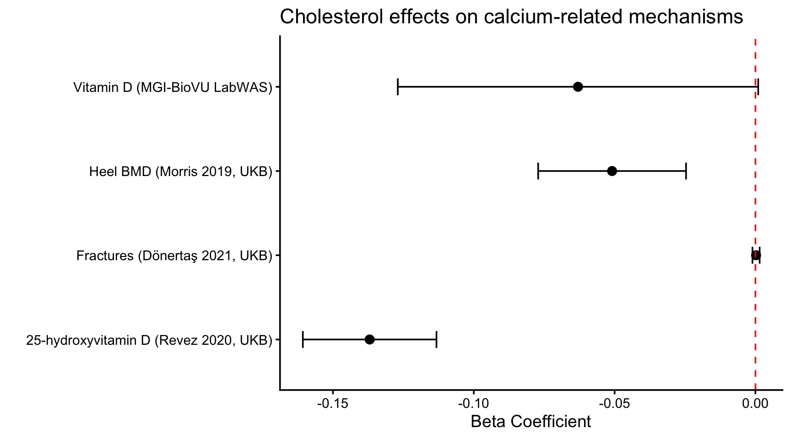{width=864}
:::
:::


### Primary Mechanisms — Vitamin D and Heel BMD Only

To highlight the two pre-specified mechanistic candidates (vitamin D
synthesis from cholesterol; bone demineralisation), this plot shows only the
two primary outcomes for the calcium hypothesis test.


::: {.cell}

```{.r .cell-code}
primary_mechanisms <- all_mr_combined %>%
  filter(outcome %in% c(vitd.label,
                        "Heel BMD (Morris 2019, UKB)"))

ggplot(primary_mechanisms, aes(x = outcome, y = b)) +
  geom_point(size = 3, colour = color_scheme[1]) +
  geom_errorbar(aes(ymin = b - 1.96 * se, ymax = b + 1.96 * se),
                width = 0.2, colour = color_scheme[1]) +
  coord_flip() +
  geom_hline(yintercept = 0, linetype = "dashed", color = "red") +
  theme_classic(base_size = 14) +
  labs(title = "Cholesterol effects on mechanistic outcomes",
       subtitle = "IVW-RE; 95% CI",
       y = "Beta Coefficient (per SD total cholesterol)", x = "")
```

::: {.cell-output-display}
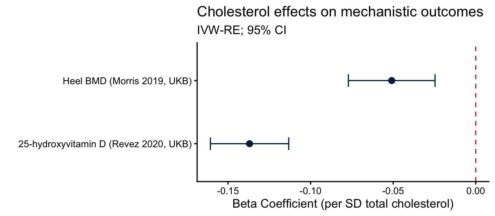{width=768}
:::
:::


## Combined Results — Bone Mechanisms


::: {.cell}

```{.r .cell-code}
# Combine main MR results across all outcomes plus MR-PRESSO rows
all_mr_full <- bind_rows(
  vitd.mr   %>% mutate(outcome = vitd.label),
  vitdbv.mr %>% mutate(outcome = vitdbv.label),
  bone_mr_combined
) %>%
  dplyr::select(-starts_with('id'))

# Append MR-PRESSO rows
all_mrpresso <- bind_rows(
  vitd.mrpresso_rows    %>% mutate(global_pval = as.numeric(global_pval)),
  vitdbv.mrpresso_rows  %>% mutate(global_pval = as.numeric(global_pval)),
  heelbmd.mrpresso_rows %>% mutate(global_pval = as.numeric(global_pval))
)

# Pleiotropy and heterogeneity rows for the summary file
all_pleio <- bind_rows(
  vitd.pleio   %>% mutate(outcome = vitd.label),
  vitdbv.pleio %>% mutate(outcome = vitdbv.label),
  bone_pleio_combined
) %>%
  dplyr::select(-starts_with('id')) %>%
  dplyr::rename(b = egger_intercept) %>%
  mutate(method = "MR-Egger intercept", nsnp = NA_integer_) %>%
  dplyr::select(exposure = exposure, outcome, method, nsnp, b, se, pval)

all_het <- bind_rows(
  vitd.het   %>% mutate(outcome = vitd.label),
  vitdbv.het %>% mutate(outcome = vitdbv.label),
  bone_het_combined
) %>%
  dplyr::select(-starts_with('id'))

# Master combined results table
mr_results_master <- bind_rows(
  all_mr_full %>%
    mutate(method = fct_recode(as.factor(method),
            "IVW-RE"   = "Inverse variance weighted (multiplicative random effects)",
            "IVW-FE"   = "Inverse variance weighted (fixed effects)",
            "MR-RAPS"  = "Robust adjusted profile score (RAPS)")),
  all_mrpresso %>% dplyr::select(-global_pval)
) %>%
  arrange(outcome, method)

mr_results_master |>
  kable(caption = "MR Results — Bone Mechanisms (all outcomes, all methods)",
        digits = c(0, 0, 0, 0, 4, 4, 99))
```

::: {.cell-output-display}


Table: MR Results — Bone Mechanisms (all outcomes, all methods)

|outcome                               |exposure                       |method                | nsnp|       b|     se|         pval|
|:-------------------------------------|:------------------------------|:---------------------|----:|-------:|------:|------------:|
|25-hydroxyvitamin D (Revez 2020, UKB) |Total Cholesterol (UK Biobank) |IVW-FE                |  258| -0.1370| 0.0046| 0.000000e+00|
|25-hydroxyvitamin D (Revez 2020, UKB) |Total Cholesterol (UK Biobank) |IVW-RE                |  258| -0.1370| 0.0121| 1.078878e-29|
|25-hydroxyvitamin D (Revez 2020, UKB) |Total Cholesterol (UK Biobank) |MR Egger              |  258| -0.1588| 0.0193| 8.566824e-15|
|25-hydroxyvitamin D (Revez 2020, UKB) |Total Cholesterol (UK Biobank) |MR-PRESSO (Corrected) |  262| -0.1195| 0.0086| 1.941018e-32|
|25-hydroxyvitamin D (Revez 2020, UKB) |Total Cholesterol (UK Biobank) |MR-PRESSO (Raw)       |  262| -0.1323| 0.0121| 3.458347e-23|
|25-hydroxyvitamin D (Revez 2020, UKB) |Total Cholesterol (UK Biobank) |MR-RAPS               |  258| -0.1246| 0.0104| 4.362725e-33|
|25-hydroxyvitamin D (Revez 2020, UKB) |Total Cholesterol (UK Biobank) |Weighted median       |  258| -0.1173| 0.0105| 7.048850e-29|
|25-hydroxyvitamin D (Revez 2020, UKB) |Total Cholesterol (UK Biobank) |Weighted mode         |  258| -0.1224| 0.0829| 1.411775e-01|
|Fractures (Dönertaş 2021, UKB)        |Total Cholesterol (UK Biobank) |IVW-FE                |  264|  0.0002| 0.0006| 7.293549e-01|
|Fractures (Dönertaş 2021, UKB)        |Total Cholesterol (UK Biobank) |IVW-RE                |  264|  0.0002| 0.0007| 7.405123e-01|
|Fractures (Dönertaş 2021, UKB)        |Total Cholesterol (UK Biobank) |MR Egger              |  264| -0.0006| 0.0010| 5.411579e-01|
|Fractures (Dönertaş 2021, UKB)        |Total Cholesterol (UK Biobank) |MR-RAPS               |  264|  0.0003| 0.0007| 6.952238e-01|
|Fractures (Dönertaş 2021, UKB)        |Total Cholesterol (UK Biobank) |Weighted median       |  264| -0.0003| 0.0011| 7.699324e-01|
|Fractures (Dönertaş 2021, UKB)        |Total Cholesterol (UK Biobank) |Weighted mode         |  264| -0.0001| 0.0068| 9.863697e-01|
|Heel BMD (Morris 2019, UKB)           |Total Cholesterol (UK Biobank) |IVW-FE                |  257| -0.0509| 0.0043| 1.030146e-31|
|Heel BMD (Morris 2019, UKB)           |Total Cholesterol (UK Biobank) |IVW-RE                |  257| -0.0509| 0.0134| 1.449456e-04|
|Heel BMD (Morris 2019, UKB)           |Total Cholesterol (UK Biobank) |MR Egger              |  257| -0.0363| 0.0213| 8.992305e-02|
|Heel BMD (Morris 2019, UKB)           |Total Cholesterol (UK Biobank) |MR-PRESSO (Corrected) |  261| -0.0485| 0.0089| 1.277012e-07|
|Heel BMD (Morris 2019, UKB)           |Total Cholesterol (UK Biobank) |MR-PRESSO (Raw)       |  261| -0.0520| 0.0133| 1.228511e-04|
|Heel BMD (Morris 2019, UKB)           |Total Cholesterol (UK Biobank) |MR-RAPS               |  257| -0.0414| 0.0114| 2.753752e-04|
|Heel BMD (Morris 2019, UKB)           |Total Cholesterol (UK Biobank) |Weighted median       |  257| -0.0258| 0.0096| 7.060208e-03|
|Heel BMD (Morris 2019, UKB)           |Total Cholesterol (UK Biobank) |Weighted mode         |  257| -0.0266| 0.0662| 6.878570e-01|
|Vitamin D (MGI-BioVU LabWAS)          |Total Cholesterol (UK Biobank) |IVW-FE                |  280| -0.0630| 0.0287| 2.795864e-02|
|Vitamin D (MGI-BioVU LabWAS)          |Total Cholesterol (UK Biobank) |IVW-RE                |  280| -0.0630| 0.0326| 5.362791e-02|
|Vitamin D (MGI-BioVU LabWAS)          |Total Cholesterol (UK Biobank) |MR Egger              |  280| -0.0700| 0.0533| 1.901778e-01|
|Vitamin D (MGI-BioVU LabWAS)          |Total Cholesterol (UK Biobank) |MR-PRESSO (Corrected) |  285|      NA|     NA|           NA|
|Vitamin D (MGI-BioVU LabWAS)          |Total Cholesterol (UK Biobank) |MR-PRESSO (Raw)       |  285| -0.0664| 0.0325| 4.225469e-02|
|Vitamin D (MGI-BioVU LabWAS)          |Total Cholesterol (UK Biobank) |MR-RAPS               |  280| -0.0672| 0.0336| 4.513899e-02|
|Vitamin D (MGI-BioVU LabWAS)          |Total Cholesterol (UK Biobank) |Weighted median       |  280| -0.0051| 0.0511| 9.210785e-01|
|Vitamin D (MGI-BioVU LabWAS)          |Total Cholesterol (UK Biobank) |Weighted mode         |  280| -0.0116| 0.4641| 9.800503e-01|


:::

```{.r .cell-code}
# Write the master results file
mr_results_master %>%
  write_csv("MR Results - Bone Mechanisms.csv")

# Also write the pleiotropy and heterogeneity to companion files
all_pleio %>%
  write_csv("MR Results - Bone Mechanisms - Pleiotropy.csv")
all_het %>%
  write_csv("MR Results - Bone Mechanisms - Heterogeneity.csv")
```
:::


## Hypothesis Testing

Given that we have two hypotheses:

- Cholesterol increases calcium by increasing vitamin D
- Cholesterol increases calcium by decreasing bone mineral density

We performed a Bayesian analysis to determine the posterior probabilities of
the four possible outcomes. For the BMD hypothesis we use the **Morris 2019
heel BMD** result as the primary estimate because it has by far the largest
sample size and therefore the tightest standard error; sensitivity analyses
using the Zheng 2015 femoral neck BMD outcome are reported alongside.
Symmetrically, for the vitamin D hypothesis we use the **Revez 2020** result
as the primary estimate (n≈417,580) and report the smaller **MGI-BioVU**
GWAS (n=12,250) as a sensitivity/replication estimate.


::: {.cell}

```{.r .cell-code}
posterior_prob_direction <- function(beta_hat, se,
                                      direction = c("less", "greater")) {
  direction <- match.arg(direction)
  z <- (0 - beta_hat) / se
  if (direction == "less") {
    return(pnorm(z))
  } else {
    return(1 - pnorm(z))
  }
}

bmd_primary_label <- "Heel BMD (Morris 2019, UKB)"

beta_bmd <- bone_mr_combined %>%
  filter(outcome == bmd_primary_label,
         method == "Inverse variance weighted (multiplicative random effects)") %>%
  pull(b)

se_bmd <- bone_mr_combined %>%
  filter(outcome == bmd_primary_label,
         method == "Inverse variance weighted (multiplicative random effects)") %>%
  pull(se)

beta_vitd <- filter(vitd.mr,
                    method == "Inverse variance weighted (multiplicative random effects)") %>%
  pull(b)
se_vitd <- filter(vitd.mr,
                  method == "Inverse variance weighted (multiplicative random effects)") %>%
  pull(se)

p_h1_true  <- posterior_prob_direction(beta_bmd, se_bmd, "less")
p_h1_false <- 1 - p_h1_true
p_h2_true  <- posterior_prob_direction(beta_vitd, se_vitd, "greater")
p_h2_false <- 1 - p_h2_true

p_both_true    <- p_h1_true * p_h2_true
p_only_h1_true <- p_h1_true * p_h2_false
p_only_h2_true <- p_h1_false * p_h2_true
p_neither_true <- p_h1_false * p_h2_false

outcomes_df <- data.frame(
  Outcome = c("Both True", "Only H1 True", "Only H2 True", "Neither True"),
  Description = c(
    "H1 true (β_BMD < 0) and H2 true (β_VitD > 0)",
    "H1 true (β_BMD < 0) and H2 false (β_VitD <= 0)",
    "H1 false (β_BMD >= 0) and H2 true (β_VitD > 0)",
    "H1 false (β_BMD >= 0) and H2 false (β_VitD <= 0)"
  ),
  Posterior_Probability = c(p_both_true, p_only_h1_true,
                             p_only_h2_true, p_neither_true),
  Percentage = sprintf("%.2f%%",
                       c(p_both_true, p_only_h1_true,
                         p_only_h2_true, p_neither_true) * 100)
)

kable(outcomes_df, format = "simple", digits = 4,
      caption = paste0(
        "Joint posterior probabilities (BMD estimate from ",
        bmd_primary_label, ")"
      ))
```

::: {.cell-output-display}


Table: Joint posterior probabilities (BMD estimate from Heel BMD (Morris 2019, UKB))

Outcome        Description                                         Posterior_Probability  Percentage 
-------------  -------------------------------------------------  ----------------------  -----------
Both True      H1 true (β_BMD < 0) and H2 true (β_VitD > 0)                       0.0000  0.00%      
Only H1 True   H1 true (β_BMD < 0) and H2 false (β_VitD <= 0)                     0.9999  99.99%     
Only H2 True   H1 false (β_BMD >= 0) and H2 true (β_VitD > 0)                     0.0000  0.00%      
Neither True   H1 false (β_BMD >= 0) and H2 false (β_VitD <= 0)                   0.0001  0.01%      


:::
:::


### Bayesian Probability Bar Plot


::: {.cell}

```{.r .cell-code}
bayes_plot_data <- outcomes_df %>%
  mutate(
    Outcome = factor(Outcome,
                     levels = rev(c("Only H1 True", "Both True",
                                    "Only H2 True", "Neither True")))
  )

ggplot(bayes_plot_data,
       aes(x = Posterior_Probability, y = Outcome)) +
  geom_col(fill = color_scheme[1]) +
  geom_text(aes(label = Percentage), hjust = -0.1, size = 4) +
  scale_x_continuous(labels = scales::percent_format(accuracy = 1),
                     expand = expansion(mult = c(0, 0.15)),
                     limits = c(0, 1)) +
  theme_classic(base_size = 14) +
  labs(title = "Joint posterior probabilities for calcium mechanism hypotheses",
       subtitle = paste0("H1: cholesterol -> reduced BMD; ",
                         "H2: cholesterol -> increased Vitamin D"),
       x = "Posterior Probability", y = "")
```

::: {.cell-output-display}
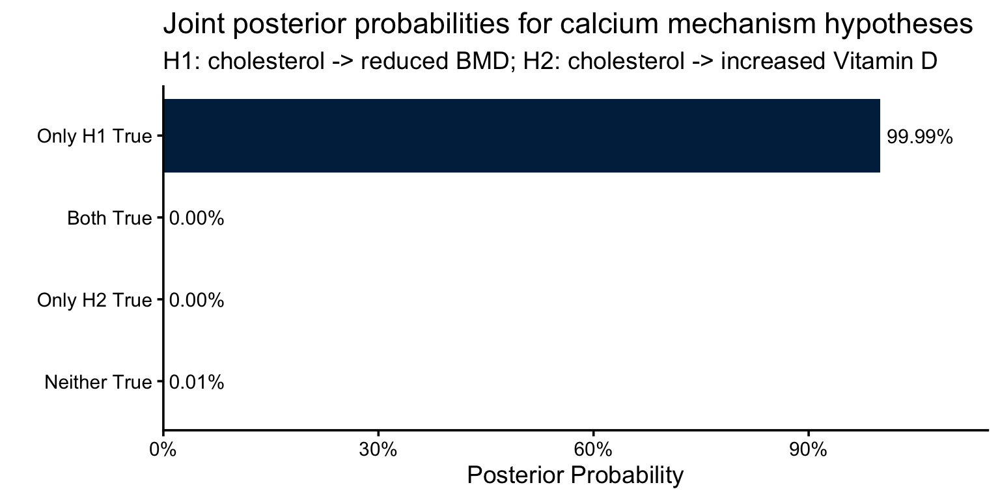{width=768}
:::
:::


### Sensitivity — Bayesian Probabilities Using Each BMD Outcome

To assess robustness of the H1 conclusion across different BMD measurement
modalities, we recompute the posterior probabilities using each of the BMD
estimates separately.


::: {.cell}

```{.r .cell-code}
bmd_outcomes_for_bayes <- bone_mr_combined %>%
  filter(method == "Inverse variance weighted (multiplicative random effects)",
         str_detect(outcome, "BMD"))

bayes_sensitivity <- bmd_outcomes_for_bayes %>%
  rowwise() %>%
  mutate(
    p_h1_true     = posterior_prob_direction(b, se, "less"),
    p_only_h1     = p_h1_true * p_h2_false,
    p_both_true   = p_h1_true * p_h2_true,
    `Only H1 (%)` = sprintf("%.2f%%", p_only_h1 * 100),
    `Both H1+H2 (%)` = sprintf("%.2f%%", p_both_true * 100)
  ) %>%
  ungroup() %>%
  dplyr::select(outcome, b, se, pval, p_h1_true,
                `Only H1 (%)`, `Both H1+H2 (%)`)

kable(bayes_sensitivity,
      caption = "Bayesian posterior sensitivity across BMD outcomes",
      digits = c(NA, 4, 4, 4, 4, NA, NA))
```

::: {.cell-output-display}


Table: Bayesian posterior sensitivity across BMD outcomes

|outcome                     |       b|     se|  pval| p_h1_true|Only H1 (%) |Both H1+H2 (%) |
|:---------------------------|-------:|------:|-----:|---------:|:-----------|:--------------|
|Heel BMD (Morris 2019, UKB) | -0.0509| 0.0134| 1e-04|    0.9999|99.99%      |0.00%          |


:::
:::


### Sensitivity — Bayesian Probabilities Using Each Vitamin D GWAS

To assess robustness of the H2 conclusion, we recompute the posterior
probabilities using each of the two vitamin D estimates separately: the
primary Revez 2020 GWAS and the MGI-BioVU replication. The BMD term is held
at the primary Heel BMD estimate.


::: {.cell}

```{.r .cell-code}
vitd_outcomes_for_bayes <- bind_rows(
  vitd.mr   %>% mutate(outcome = vitd.label),
  vitdbv.mr %>% mutate(outcome = vitdbv.label)
) %>%
  filter(method == "Inverse variance weighted (multiplicative random effects)")

vitd_bayes_sensitivity <- vitd_outcomes_for_bayes %>%
  rowwise() %>%
  mutate(
    p_h2_true        = posterior_prob_direction(b, se, "greater"),
    p_only_h2        = p_h1_false * p_h2_true,
    p_both_true      = p_h1_true * p_h2_true,
    `Only H2 (%)`    = sprintf("%.2f%%", p_only_h2 * 100),
    `Both H1+H2 (%)` = sprintf("%.2f%%", p_both_true * 100)
  ) %>%
  ungroup() %>%
  dplyr::select(outcome, b, se, pval, p_h2_true,
                `Only H2 (%)`, `Both H1+H2 (%)`)

kable(vitd_bayes_sensitivity,
      caption = paste0(
        "Bayesian posterior sensitivity across vitamin D GWAS (BMD term held ",
        "at ", bmd_primary_label, ")"),
      digits = c(NA, 4, 4, 4, 4, NA, NA))
```

::: {.cell-output-display}


Table: Bayesian posterior sensitivity across vitamin D GWAS (BMD term held at Heel BMD (Morris 2019, UKB))

|outcome                               |      b|     se|   pval| p_h2_true|Only H2 (%) |Both H1+H2 (%) |
|:-------------------------------------|------:|------:|------:|---------:|:-----------|:--------------|
|25-hydroxyvitamin D (Revez 2020, UKB) | -0.137| 0.0121| 0.0000|    0.0000|0.00%       |0.00%          |
|Vitamin D (MGI-BioVU LabWAS)          | -0.063| 0.0326| 0.0536|    0.0268|0.00%       |2.68%          |


:::
:::


### Mathematical Approach

To evaluate the two hypotheses regarding elevated calcium levels:

- H1: lower bone mineral density (BMD, supported by $\beta_{BMD} < 0$)
- H2: higher vitamin D levels (supported by $\beta_{VitD} > 0$)

We applied Bayesian inference using Mendelian randomization (MR) point
estimates and standard errors. The analysis assumed flat (non-informative)
priors on the effect sizes and independence between the effects of BMD and
vitamin D on calcium levels.

For each hypothesis, we modelled the effect size $\beta$ with a flat prior,
$p(\beta) \propto 1$. Given the MR point estimate ($\hat{\beta}$) and standard
error $SE$, the posterior distribution for $\beta$ is approximately Normal:

$$p(\beta | \text{data}) \sim \mathcal{N}(\hat{\beta}, \text{SE}^2)$$

- **H1 (Lower BMD explains elevated calcium)**: The MR estimate from
  Heel BMD (Morris 2019, UKB) is $\hat{\beta}_{\text{BMD}}$ = -0.0509,
  $SE_{BMD}$ = 0.0134. The posterior probability that
  $\beta_{BMD} < 0$ (supporting H1) is 0.9999:

$$P(\beta_{\text{BMD}} < 0 | \text{data}) = \Phi\left(\frac{0 - \hat{\beta}_{\text{BMD}}}{\text{SE}_{\text{BMD}}}\right)$$

- **H2 (Higher Vitamin D)**: The MR estimate is
  $\hat{\beta}_{VitD}$ = -0.137,
  $SE_{VitD}$ = 0.0121. The posterior probability that
  $\beta_{\text{VitD}} > 0$ (supporting H2) is 0:

$$P(\beta_{\text{VitD}} > 0 | \text{data}) = 1 - \Phi\left(\frac{0 - \hat{\beta}_{\text{VitD}}}{\text{SE}_{\text{VitD}}}\right)$$

Thus, the posterior probabilities are estimated at
100% for H1 ($\beta_{\text{BMD}} < 0$) and
0% for H2 ($\beta_{VitD} > 0$).

### Joint Posterior Probabilities

Assuming independence between the effects of BMD and vitamin D, we calculated
the joint probabilities for the four possible outcomes:

- **Both True**: 0%
- **Only H1 True**: 99.99%
- **Only H2 True**: 0%
- **Neither True**: 0.01%

These probabilities sum to 1, confirming the calculations.

## Summary of MR Analyses

### Robustness of the Heel BMD Effect

The Heel BMD result is robust across all sensitivity analyses. The
MR-Egger intercept was non-significant (intercept =
-6.2\times 10^{-4},
p = 0.38),
indicating no evidence of directional pleiotropy. To address the high
between-SNP heterogeneity (Cochran's Q I² =
89.5%),
we additionally applied MR-PRESSO with NbDistribution = 50,000 to enable
high-precision outlier detection. The global heterogeneity test was
significant (p =
2e-05),
and 45
of 261 SNPs were flagged as pleiotropic outliers.
After removing these outliers, the corrected estimate (β =
-0.0485,
SE = 0.0089,
p = 1.3e-07)
was essentially unchanged from the raw IVW-RE estimate (β =
-0.0509),
with the standard error in fact decreasing because the heterogeneity
contributing to inflated variance was removed. The MR-PRESSO distortion
test, which formally compares raw vs. corrected estimates, returned
p = 0.6,
confirming that outlier-driven pleiotropy is not the source of the
observed cholesterol→BMD effect.


::: {.cell}

:::


### Vitamin D Does Not Meet the Threshold for a Causal Mediator

Relative to the heel BMD result, the higher-powered Revez 2020 vitamin D
GWAS gives an IVW-RE point estimate that is negative
(β = -0.137, SE = 0.0121,
p = <2e-16), which is the *opposite* sign from
the H2 hypothesis that elevated cholesterol increases serum calcium via
increased vitamin D synthesis. The robust-method estimates are reported for
comparison (weighted median
β = -0.1173,
weighted mode β = -0.1224).
MR-PRESSO returned a global heterogeneity test p = 2e-05, and at NbDistribution = 50,000
34 of 262 SNPs were flagged as pleiotropic outliers. The Bayesian
posterior probability for H2 (cholesterol → increased vitamin D) was
0%. We therefore conclude that
vitamin D does not meet the threshold for a causal mediator, and we focus the remainder of this analysis on the bone demineralisation mechanism.

## References

::: {#refs}
:::

## Session Information


::: {.cell}

```{.r .cell-code}
sessionInfo()
```

::: {.cell-output .cell-output-stdout}

```
R version 4.6.0 (2026-04-24)
Platform: aarch64-apple-darwin23
Running under: macOS Tahoe 26.5.1

Matrix products: default
BLAS:   /Library/Frameworks/R.framework/Versions/4.6/Resources/lib/libRblas.0.dylib 
LAPACK: /Library/Frameworks/R.framework/Versions/4.6/Resources/lib/libRlapack.dylib;  LAPACK version 3.12.1

locale:
[1] en_US.UTF-8/en_US.UTF-8/en_US.UTF-8/C/en_US.UTF-8/en_US.UTF-8

time zone: America/Detroit
tzcode source: internal

attached base packages:
[1] stats4    stats     graphics  grDevices utils     datasets  methods  
[8] base     

other attached packages:
 [1] SNPlocs.Hsapiens.dbSNP144.GRCh37_0.99.20
 [2] BSgenome_1.80.0                         
 [3] rtracklayer_1.72.0                      
 [4] BiocIO_1.22.0                           
 [5] Biostrings_2.80.1                       
 [6] XVector_0.52.0                          
 [7] GenomicRanges_1.64.0                    
 [8] Seqinfo_1.2.0                           
 [9] IRanges_2.46.0                          
[10] S4Vectors_0.50.1                        
[11] BiocGenerics_0.58.1                     
[12] generics_0.1.4                          
[13] MRPRESSO_1.0                            
[14] ieugwasr_1.1.0                          
[15] TwoSampleMR_0.7.5                       
[16] knitr_1.51                              
[17] lubridate_1.9.5                         
[18] forcats_1.0.1                           
[19] stringr_1.6.0                           
[20] dplyr_1.2.1                             
[21] purrr_1.2.2                             
[22] readr_2.2.0                             
[23] tidyr_1.3.2                             
[24] tibble_3.3.1                            
[25] ggplot2_4.0.3                           
[26] tidyverse_2.0.0                         

loaded via a namespace (and not attached):
 [1] tidyselect_1.2.1            psych_2.6.5                
 [3] rootSolve_1.8.2.4           farver_2.1.2               
 [5] S7_0.2.2                    bitops_1.0-9               
 [7] fastmap_1.2.0               RCurl_1.98-1.19            
 [9] GenomicAlignments_1.48.0    XML_3.99-0.23              
[11] digest_0.6.39               timechange_0.4.0           
[13] lifecycle_1.0.5             magrittr_2.0.5             
[15] compiler_4.6.0              rlang_1.2.0                
[17] tools_4.6.0                 yaml_2.3.12                
[19] data.table_1.18.4           labeling_0.4.3             
[21] mr.raps_0.4.3               S4Arrays_1.12.0            
[23] htmlwidgets_1.6.4           mnormt_2.1.2               
[25] bit_4.6.0                   curl_7.1.0                 
[27] DelayedArray_0.38.2         plyr_1.8.9                 
[29] RColorBrewer_1.1-3          abind_1.4-8                
[31] BiocParallel_1.46.0         httpcode_0.3.0             
[33] withr_3.0.3                 grid_4.6.0                 
[35] scales_1.4.0                crul_1.6.0                 
[37] SummarizedExperiment_1.42.0 cli_3.6.6                  
[39] rmarkdown_2.31              crayon_1.5.3               
[41] otel_0.2.0                  rstudioapi_0.19.0          
[43] httr_1.4.8                  tzdb_0.5.0                 
[45] rjson_0.2.23                rsnps_0.6.1                
[47] splines_4.6.0               parallel_4.6.0             
[49] restfulr_0.0.17             matrixStats_1.5.0          
[51] vctrs_0.7.3                 Matrix_1.7-5               
[53] jsonlite_2.0.0              hms_1.1.4                  
[55] ggrepel_0.9.8               bit64_4.8.2                
[57] nortest_1.0-4               glue_1.8.1                 
[59] codetools_0.2-20            stringi_1.8.7              
[61] gtable_0.3.6                GenomeInfoDb_1.48.0        
[63] UCSC.utils_1.8.0            pillar_1.11.1              
[65] htmltools_0.5.9             R6_2.6.1                   
[67] vroom_1.7.1                 evaluate_1.0.5             
[69] Biobase_2.72.0              lattice_0.22-9             
[71] Rsamtools_2.28.0            cigarillo_1.2.0            
[73] Rcpp_1.1.1-1.1              gridExtra_2.3.1            
[75] nlme_3.1-169                SparseArray_1.12.2         
[77] mgcv_1.9-4                  xfun_0.59                  
[79] MatrixGenerics_1.24.0       pkgconfig_2.0.3            
```


:::
:::

