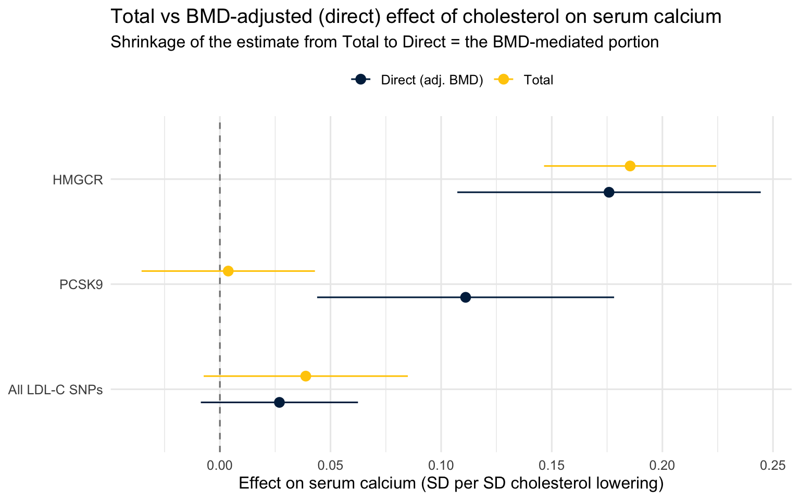
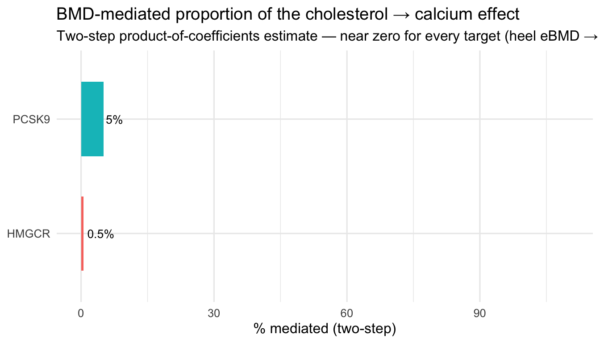
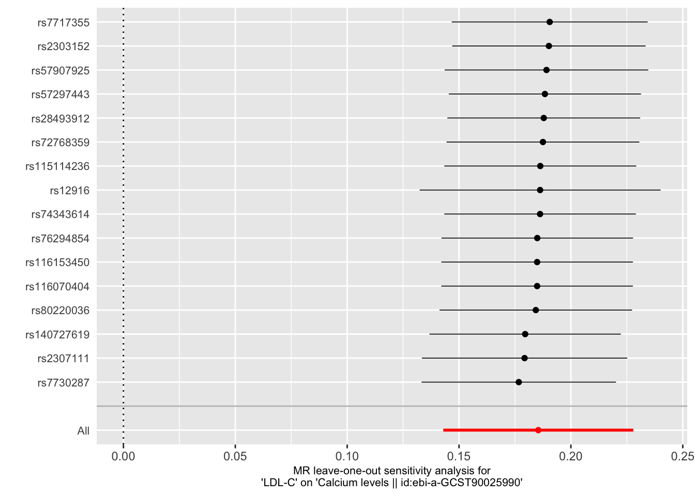

::: {.cell}

:::


## Purpose

This script implements the **multivariable Mendelian randomization (MVMR)
mediation** layer of the cholesterol → bone → calcium project. The univariable
legs (cholesterol → calcium, drug-target → BMD, drug-target → calcium) are
already established in `drug_target_mr_analysis.qmd`, `drug_target_mr_bmd.qmd`
and `drug_target_mr_ukb.qmd`. Here we ask the mechanistic question those scripts
set up but do not answer:

> **Does cholesterol raise serum calcium *through* bone demineralization (BMD),
> and is that mediation specific to the HMGCR / mevalonate pathway rather than
> PCSK9 / LDL-receptor or NPC1L1 / absorption?**

We decompose the cholesterol → calcium effect into a component that flows through
BMD (indirect / mediated) and a component that does not (direct), using **two
complementary estimators** so the conclusion does not rest on a single method:

1. **Difference method** — MVMR of (cholesterol, BMD) → calcium. The BMD-adjusted
   cholesterol coefficient is the *direct* effect `θ`; `total − direct` is the
   mediated effect. Robust to nothing in particular, but the canonical MVMR
   decomposition and directly interpretable.
2. **Two-step product of coefficients** — `a × b`, where `a` = cholesterol → BMD
   and `b` = BMD → calcium. More stable than the difference method when the
   cholesterol exposure is a *cis* drug target carrying only a handful of SNPs,
   because it never has to estimate a small direct effect as the difference of
   two large, correlated quantities.

Agreement between the two is the evidentiary payoff.

### A note on the `mv_raps` request

The original specification asked for `MendelianRandomization::mv_raps`. **That
function does not exist.** The `MendelianRandomization` package provides
`mr_mvivw` (IVW with multiplicative random effects), `mr_mvegger`, `mr_mvmedian`
and `mr_mvlasso` for multivariable models. True *multivariable* MR-RAPS is
implemented in the **GRAPPLE** package (`grappleRobustEst`). Accordingly:

- **Primary MVMR estimator:** `mr_mvivw` (IVW-MRE) — the requested random-effects
  behaviour, correctly named.
- **Univariable legs** (total effect, BMD → calcium): reported with **MR-RAPS**
  via TwoSampleMR (`mr_raps`) alongside IVW, as requested.
- **Optional robust MVMR:** a clearly-flagged GRAPPLE hook (`RUN_GRAPPLE`) that
  runs multivariable RAPS if the package is installed.

### Sample overlap (documented, not avoided)

The primary configuration is fully **UK Biobank**: LDL-C (`ieu-b-110`), heel BMD
(Morris 2019, `ebi-a-GCST006979`) and serum calcium (Barton 2021,
`ebi-a-GCST90025990`) all derive from UKB. This is effectively **one-sample
MVMR**. With strong instruments (F ≫ 10) one-sample bias is toward the null, so a
positive mediation result here is *conservative*. As a non-overlapping
sensitivity exposure we also run **total cholesterol** from the GLGC meta-analysis
(`ebi-a-GCST90025953`), which does not include UKB.

---

## Setup


::: {.cell}

```{.r .cell-code}
library(tidyverse)
library(TwoSampleMR)             # instrument extraction, harmonisation, univariable MR, mv_*
library(MendelianRandomization)  # mr_mvinput / mr_mvivw (multivariable IVW-MRE)
library(ieugwasr)                # OpenGWAS API (associations, ld_clump, tophits)
library(MRPRESSO)                # horizontal-pleiotropy global + outlier test
library(data.table)
library(broom)
library(knitr)
library(kableExtra)

# ── Toggles ──────────────────────────────────────────────────────────────────
P_CIS_PRIMARY   <- 5e-8    # cis drug-target instrument threshold (primary)
P_CIS_RELAXED   <- 1e-5    # relaxed cis threshold (sensitivity / weak-instrument power)
R2_CLUMP_STRICT <- 0.001   # strict LD clumping for PCSK9 / NPC1L1 and BMD
R2_CLUMP_HMGCR  <- 0.30    # allele-score clumping for HMGCR (Swerdlow 2015 Lancet)
CLUMP_KB        <- 10000
MRPRESSO_NBOOT  <- 2000    # MR-PRESSO null distribution draws (increase for final run)
RUN_GRAPPLE     <- FALSE   # set TRUE to add multivariable MR-RAPS via GRAPPLE

# ── GWAS identifiers ─────────────────────────────────────────────────────────
GWAS <- list(
  ldl      = "ieu-b-110",           # LDL-C, UKB Neale  (primary cholesterol exposure)
  tc       = "ebi-a-GCST90025953",  # Total cholesterol, GLGC (non-UKB sensitivity)
  bmd      = "ebi-a-GCST006979",    # Heel eBMD, Morris 2019 UKB (mediator)
  calcium  = "ebi-a-GCST90025990"   # Serum calcium, Barton 2021 UKB (outcome)
)

# ── Drug-target gene windows (GRCh37 / hg19, ±500 kb around gene body) ────────
WINDOW_KB <- 500
gene_windows <- tribble(
  ~gene,    ~chr, ~gene_start,  ~gene_end,   ~clump_r2,
  "HMGCR",  5,    74632993,     74657941,    R2_CLUMP_HMGCR,
  "PCSK9",  1,    55505221,     55530525,    R2_CLUMP_STRICT,
  "NPC1L1", 7,    44552971,     44604640,    R2_CLUMP_STRICT
) %>%
  mutate(
    region_start = pmax(0, gene_start - WINDOW_KB * 1000),
    region_end   = gene_end + WINDOW_KB * 1000,
    region_str   = str_glue("{chr}:{region_start}-{region_end}")
  )

# Output directory for checkpoint CSVs
dir.create("results", showWarnings = FALSE)

kable(
  tibble(
    Role     = c("Exposure (primary)", "Exposure (sensitivity)", "Mediator", "Outcome"),
    Trait    = c("LDL-C", "Total cholesterol", "Heel eBMD", "Serum calcium"),
    ID       = c(GWAS$ldl, GWAS$tc, GWAS$bmd, GWAS$calcium)
  ),
  caption = "Data sources for the MVMR mediation analysis"
)
```

::: {.cell-output-display}


Table: Data sources for the MVMR mediation analysis

|Role                   |Trait             |ID                 |
|:----------------------|:-----------------|:------------------|
|Exposure (primary)     |LDL-C             |ieu-b-110          |
|Exposure (sensitivity) |Total cholesterol |ebi-a-GCST90025953 |
|Mediator               |Heel eBMD         |ebi-a-GCST006979   |
|Outcome                |Serum calcium     |ebi-a-GCST90025990 |


:::
:::


---

## Part 0 — Reusable helper functions

Everything mechanistically interesting is factored into small, testable helpers
so the three drug-target pathways and the all-SNP analysis share identical code.


::: {.cell}

```{.r .cell-code}
# ── Extract SNPs in a cis window from an OpenGWAS dataset ─────────────────────
# Returns one row per SNP with normalised numeric columns. Mirrors the pattern
# used in drug_target_mr_bmd.qmd (OpenGWAS returns 'pos' for some datasets and
# 'position' for others; normalise OUTSIDE mutate to avoid dynamic-column errors).
extract_regional <- function(gwas_id, gene_row) {
  res <- tryCatch(
    ieugwasr::associations(variants = gene_row$region_str, id = gwas_id,
                           proxies = FALSE) %>% as_tibble(),
    error = function(e) { warning(gwas_id, " / ", gene_row$gene, ": ", e$message); tibble() }
  )
  if (nrow(res) == 0) return(tibble())

  if ("pos" %in% names(res) && !"position" %in% names(res)) {
    res <- dplyr::rename(res, position = pos)
  } else if (!"position" %in% names(res)) {
    res <- mutate(res, position = NA_integer_)
  }

  res %>%
    mutate(position = as.integer(position),
           beta = as.numeric(beta), se = as.numeric(se),
           eaf = as.numeric(eaf),   p  = as.numeric(p),
           gene = gene_row$gene, gwas_id = gwas_id) %>%
    select(-any_of("pos"))
}

# ── LD-clump a set of SNPs to independence ───────────────────────────────────
# Falls back to the unclumped set (with a warning) if the LD reference is
# unavailable, so a transient API failure never silently drops the analysis.
clump_snps <- function(df, r2_thresh, kb_thresh = CLUMP_KB) {
  if (nrow(df) < 2) return(df)
  tryCatch(
    ieugwasr::ld_clump(
      tibble(rsid = df$rsid, pval = df$p, id = df$gwas_id[1]),
      clump_r2 = r2_thresh, clump_kb = kb_thresh, pop = "EUR"
    ) %>% inner_join(df, by = "rsid"),
    error = function(e) { warning("Clumping failed, using unclumped set: ", e$message); df }
  )
}

# ── Per-SNP F-statistic (instrument strength) ────────────────────────────────
f_stat <- function(beta, se) (beta / se)^2

# ── Batched OpenGWAS association lookup ──────────────────────────────────────
# The OpenGWAS /associations endpoint silently caps the number of variants it
# returns for a single call, which was collapsing the MVMR union set (e.g. a
# ~528-SNP union returning only ~80 rows). Querying in fixed-size batches and
# binding restores full coverage, so the surviving SNP count reflects genuine
# cross-dataset overlap rather than an API truncation artefact.
associations_batched <- function(rsids, gwas_id, batch_size = 100) {
  rsids   <- unique(rsids)
  batches <- split(rsids, ceiling(seq_along(rsids) / batch_size))
  map_dfr(batches, function(b) {
    tryCatch(
      ieugwasr::associations(variants = b, id = gwas_id, proxies = FALSE) %>% as_tibble(),
      error = function(e) { warning(gwas_id, " batch failed: ", e$message); tibble() }
    )
  }) %>% distinct(rsid, .keep_all = TRUE)
}
```
:::


::: {.cell}

```{.r .cell-code}
# ── Tidy a TwoSampleMR mr() result into one row per method ───────────────────
tidy_mr <- function(mr_res, pathway, effect_type) {
  mr_res %>%
    transmute(
      pathway, effect_type, method,
      nsnp, beta = b, se,
      ci_lower = b - 1.96 * se,
      ci_upper = b + 1.96 * se,
      pval
    )
}

# ── Delta-method SE for a product of two independent MR coefficients ──────────
# indirect = a * b ;  Var ≈ a^2 SE_b^2 + b^2 SE_a^2  (Sobel / first-order delta)
product_indirect <- function(a, se_a, b, se_b) {
  est <- a * b
  se  <- sqrt(a^2 * se_b^2 + b^2 * se_a^2)
  tibble(beta = est, se = se,
         ci_lower = est - 1.96 * se, ci_upper = est + 1.96 * se,
         pval = 2 * pnorm(-abs(est / se)))
}

# ── Proportion mediated, with sanity flags (never silently clip to [0,1]) ────
prop_mediated <- function(total, indirect) {
  pm <- indirect / total
  flag <- dplyr::case_when(
    sign(total) != sign(indirect) ~ "inconsistent sign (interpret with care)",
    pm < 0 | pm > 1               ~ "out of [0,1] (weak/unstable — do not over-interpret)",
    TRUE                          ~ "ok"
  )
  tibble(pct_mediated = 100 * pm, pm_flag = flag)
}
```
:::


::: {.cell}

```{.r .cell-code}
# ── Difference-method MVMR via MendelianRandomization::mr_mvivw ───────────────
# `harm` is a two-exposure harmonised frame in TwoSampleMR MV format (from
# mv_harmonise_data), i.e. a list with $exposure_beta (SNP x 2 matrix),
# $exposure_se, $outcome_beta, $outcome_se. Column 1 must be the cholesterol
# exposure, column 2 the BMD mediator. Returns the per-exposure IVW-MRE estimate;
# the cholesterol row is the BMD-adjusted DIRECT effect.
mvmr_ivw <- function(mvdat, exposure_labels) {
  mvin <- MendelianRandomization::mr_mvinput(
    bx   = mvdat$exposure_beta,
    bxse = mvdat$exposure_se,
    by   = as.numeric(mvdat$outcome_beta),
    byse = as.numeric(mvdat$outcome_se)
  )
  fit <- MendelianRandomization::mr_mvivw(mvin)   # multiplicative random effects by default
  tibble(
    exposure = exposure_labels,
    beta     = fit@Estimate,
    se       = fit@StdError,
    ci_lower = fit@CILower,
    ci_upper = fit@CIUpper,
    pval     = fit@Pvalue,
    cond_F   = tryCatch(as.numeric(fit@CondFstat), error = function(e) NA_real_)
  )
}

# ── Optional multivariable MR-RAPS via GRAPPLE (robust to weak/pleiotropic) ──
mvmr_grapple <- function(mvdat, exposure_labels) {
  if (!RUN_GRAPPLE || !requireNamespace("GRAPPLE", quietly = TRUE)) return(NULL)
  data <- data.frame(
    gamma_out = as.numeric(mvdat$outcome_beta),
    se_out    = as.numeric(mvdat$outcome_se),
    mvdat$exposure_beta,
    mvdat$exposure_se
  )
  fit <- tryCatch(GRAPPLE::grappleRobustEst(data = data, p.thres = 1),
                  error = function(e) { warning("GRAPPLE failed: ", e$message); NULL })
  if (is.null(fit)) return(NULL)
  tibble(exposure = exposure_labels, beta = fit$beta.hat,
         se = sqrt(diag(fit$beta.var)))
}
```
:::


::: {.cell}

```{.r .cell-code}
# ── Full robustness battery for a univariable harmonised dataset ─────────────
# MR-PRESSO needs >= 4 SNPs; guard so cis targets with tiny instrument sets
# (esp. PCSK9) degrade gracefully instead of erroring.
robustness_battery <- function(harm, pathway) {
  het  <- tryCatch(mr_heterogeneity(harm),   error = function(e) NULL)
  pleo <- tryCatch(mr_pleiotropy_test(harm), error = function(e) NULL)

  presso <- NULL
  if (nrow(harm) >= 4) {
    presso <- tryCatch(
      MRPRESSO::mr_presso(
        BetaOutcome = "beta.outcome", BetaExposure = "beta.exposure",
        SdOutcome = "se.outcome", SdExposure = "se.exposure",
        OUTLIERtest = TRUE, DISTORTIONtest = TRUE, data = as.data.frame(harm),
        NbDistribution = MRPRESSO_NBOOT, SignifThreshold = 0.05
      ),
      error = function(e) { warning("MR-PRESSO (", pathway, "): ", e$message); NULL }
    )
  }
  list(pathway = pathway, heterogeneity = het, egger_intercept = pleo, presso = presso)
}

# Pull the MR-PRESSO global p-value out of its nested structure, if present
presso_global_p <- function(presso) {
  if (is.null(presso)) return(NA_real_)
  tryCatch(presso$`MR-PRESSO results`$`Global Test`$Pvalue, error = function(e) NA_real_)
}
```
:::


---

## Part 1 — Drug-target MVMR (HMGCR, PCSK9, NPC1L1)

For each drug target we build a manual two-exposure MVMR: a **cis cholesterol
instrument set** (few SNPs, from the gene window) plus **genome-wide independent
BMD instruments** (the mediator). Because the cis set and the BMD set are almost
disjoint, we cannot use `TwoSampleMR::mv_extract_exposures()` (which assumes both
exposures share a genome-wide instrument pool) — we assemble the exposure-effect
matrix by querying each exposure GWAS for the union of rsIDs.

### 1.0 — Genome-wide BMD (mediator) instruments

Extracted once and reused for every pathway.


::: {.cell}

```{.r .cell-code}
# Genome-wide significant, LD-clumped independent instruments for heel BMD.
bmd_instruments <- TwoSampleMR::extract_instruments(
  outcomes = GWAS$bmd, p1 = 5e-8, clump = TRUE, r2 = R2_CLUMP_STRICT, kb = CLUMP_KB
)

cat("BMD (mediator) instruments:", nrow(bmd_instruments), "SNPs\n")
```

::: {.cell-output .cell-output-stdout}

```
BMD (mediator) instruments: 512 SNPs
```


:::

```{.r .cell-code}
bmd_rsids <- bmd_instruments$SNP
```
:::


### 1.0b — Precompute target-invariant pieces (once)

The BMD → calcium leg and the BMD-instrument effect matrices do **not** vary by
drug target, so computing them once here avoids re-querying OpenGWAS inside every
`run_drug_target_mvmr()` call. Re-fetching the 512-SNP calcium lookup on all six
pathway × exposure combinations was maxing the OpenGWAS allowance and causing the
300-second timeout.


::: {.cell}

```{.r .cell-code}
# Two-step 'b': BMD -> calcium via the genome-wide BMD instruments. This is the
# SINGLE 512-SNP calcium query; its result is reused for both the b coefficient
# and the MVMR union's calcium effects below.
ca_out_b     <- extract_outcome_data(snps = bmd_instruments$SNP, outcomes = GWAS$calcium)
harm_bmd_ca  <- harmonise_data(bmd_instruments, ca_out_b)
b_fit_global <- mr(harm_bmd_ca, method_list = c("mr_ivw_mre", "mr_raps")) %>%
  filter(method == "Inverse variance weighted (multiplicative random effects)") %>%
  transmute(b = b, se_b = se)
n_bmd_global <- nrow(harm_bmd_ca)

# Base effect matrices for the MVMR union (BMD instruments only). BMD effects come
# straight from the instrument object; calcium effects are recycled from the query
# above — so neither of these costs an additional API call.
bmd_base_bmd_global <- bmd_instruments %>%
  transmute(SNP, bx2 = beta.exposure, sx2 = se.exposure, ea_bmd = effect_allele.exposure)
bmd_base_ca_global  <- ca_out_b %>%
  transmute(SNP, by = beta.outcome, sy = se.outcome, ea_ca = effect_allele.outcome)

# Cholesterol effects on the BMD instruments, once per exposure config (LDL-C and
# total cholesterol), keyed by GWAS id for the driver to look up.
chol_base_global <- purrr::map(
  c(GWAS$ldl, GWAS$tc),
  ~ associations_batched(bmd_instruments$SNP, .x) %>%
      transmute(SNP = rsid, ea, nea, bx1 = beta, sx1 = se)
) %>% setNames(c(GWAS$ldl, GWAS$tc))

cat("Precomputed  b =", round(b_fit_global$b, 4),
    " | BMD base SNPs:", nrow(bmd_base_ca_global),
    " | chol base configs:", paste(names(chol_base_global), collapse = ", "), "\n")
```

::: {.cell-output .cell-output-stdout}

```
Precomputed  b = -0.0085  | BMD base SNPs: 308  | chol base configs: ieu-b-110, ebi-a-GCST90025953 
```


:::
:::


### 1.1 — Pathway driver function

`run_drug_target_mvmr()` executes the entire per-pathway workflow and returns a
tidy list of results. Calling it three times (HMGCR / PCSK9 / NPC1L1) keeps every
pathway strictly comparable.


::: {.cell}

```{.r .cell-code}
run_drug_target_mvmr <- function(gene_name, chol_id, chol_label,
                                  p_cis        = P_CIS_PRIMARY,
                                  b_fit        = b_fit_global,
                                  n_bmd        = n_bmd_global,
                                  bmd_base_bmd = bmd_base_bmd_global,
                                  bmd_base_ca  = bmd_base_ca_global,
                                  chol_base    = chol_base_global) {

  message("\n===== ", gene_name, " × ", chol_label, " =====")
  gr <- gene_windows %>% filter(gene == gene_name)

  ## --- (1) cis cholesterol instruments -------------------------------------
  # Primary threshold first; if a target is too sparse there (NPC1L1 typically
  # has few genome-wide-significant cis SNPs), fall back to the relaxed
  # threshold rather than silently dropping the whole arm. Any threshold change
  # or skip is printed via cat() so it survives `warning: false` in the render.
  cis_raw <- extract_regional(chol_id, gr) %>% filter(p <= p_cis)
  cis     <- clump_snps(cis_raw, r2_thresh = gr$clump_r2)
  p_used  <- p_cis
  if (nrow(cis) < 2) {
    cat("  [", gene_name, "] <2 cis instruments at p<", p_cis,
        " — retrying at relaxed p<", P_CIS_RELAXED, "\n", sep = "")
    cis_raw <- extract_regional(chol_id, gr) %>% filter(p <= P_CIS_RELAXED)
    cis     <- clump_snps(cis_raw, r2_thresh = gr$clump_r2)
    p_used  <- P_CIS_RELAXED
  }
  if (nrow(cis) < 2) {
    cat("  [", gene_name, "] SKIPPED — still <2 cis instruments at relaxed p<",
        P_CIS_RELAXED, ". This arm is absent from all downstream tables.\n", sep = "")
    return(NULL)
  }
  cat("  [", gene_name, " × ", chol_label, "] ", nrow(cis),
      " cis instruments (threshold p<", p_used, ")\n", sep = "")

  ## --- (2) cis instruments as a TwoSampleMR exposure ------------------------
  cis_exp <- cis %>%
    transmute(SNP = rsid, beta.exposure = beta, se.exposure = se,
              effect_allele.exposure = toupper(ea), other_allele.exposure = toupper(nea),
              eaf.exposure = eaf, pval.exposure = p,
              exposure = chol_label, id.exposure = chol_id) %>%
    mutate(mr_keep.exposure = TRUE, pval_origin.exposure = "reported",
           data_source.exposure = "igd")

  ## --- (3) TOTAL effect: cis cholesterol -> calcium -------------------------
  ca_out_total <- extract_outcome_data(snps = cis_exp$SNP, outcomes = GWAS$calcium)
  harm_total   <- harmonise_data(cis_exp, ca_out_total)
  mr_total     <- mr(harm_total, method_list = c("mr_ivw_mre", "mr_raps",
                                                  "mr_egger_regression", "mr_weighted_median"))
  total_ivw    <- mr_total %>% filter(method == "Inverse variance weighted (multiplicative random effects)")

  ## --- (4) DIRECT effect: MVMR (cholesterol + BMD) -> calcium ---------------
  # Pool cis + BMD rsIDs, but reuse the precomputed BMD-instrument effect
  # matrices and query OpenGWAS ONLY for the handful of extra cis SNPs not
  # already among the BMD instruments. This is what keeps the run under the API
  # allowance (the old code re-queried the full ~528-SNP union three times per
  # exposure config).
  union_rsids <- union(cis$rsid, bmd_rsids)
  extra_snps  <- setdiff(cis$rsid, bmd_rsids)

  # Cholesterol effects: cis SNPs already carry their cholesterol betas (they were
  # extracted from the cholesterol GWAS in step 1), and the BMD-instrument
  # cholesterol effects are precomputed — so no new cholesterol query is needed.
  chol_eff <- bind_rows(
    chol_base[[chol_id]],
    cis %>% transmute(SNP = rsid, ea, nea, bx1 = beta, sx1 = se)
  ) %>% distinct(SNP, .keep_all = TRUE)

  # BMD and calcium effects: precomputed base + a tiny query for the extra cis SNPs.
  bmd_eff <- bind_rows(
    bmd_base_bmd,
    if (length(extra_snps) > 0) associations_batched(extra_snps, GWAS$bmd) %>%
        transmute(SNP = rsid, bx2 = beta, sx2 = se, ea_bmd = ea) else NULL
  ) %>% distinct(SNP, .keep_all = TRUE)
  ca_eff <- bind_rows(
    bmd_base_ca,
    if (length(extra_snps) > 0) associations_batched(extra_snps, GWAS$calcium) %>%
        transmute(SNP = rsid, by = beta, sy = se, ea_ca = ea) else NULL
  ) %>% distinct(SNP, .keep_all = TRUE)

  # Inner-join to SNPs present in all three; align BMD and calcium sign to the
  # cholesterol effect allele so all betas share one reference allele.
  mv <- chol_eff %>%
    inner_join(bmd_eff, by = "SNP") %>%
    inner_join(ca_eff,  by = "SNP") %>%
    mutate(
      bx2 = if_else(toupper(ea_bmd) == toupper(ea), bx2, -bx2),
      by  = if_else(toupper(ea_ca)  == toupper(ea), by,  -by)
    ) %>%
    filter(!is.na(bx1), !is.na(bx2), !is.na(by))

  cat("  [", gene_name, " × ", chol_label, "] MVMR union: ", length(union_rsids),
      " SNPs queried -> ", nrow(mv), " present in all three GWAS (",
      round(100 * nrow(mv) / length(union_rsids)), "% coverage)\n", sep = "")

  mvdat <- list(
    exposure_beta = as.matrix(mv[, c("bx1", "bx2")]),
    exposure_se   = as.matrix(mv[, c("sx1", "sx2")]),
    outcome_beta  = mv$by,
    outcome_se    = mv$sy
  )
  colnames(mvdat$exposure_beta) <- colnames(mvdat$exposure_se) <- c(chol_label, "Heel BMD")

  mvmr_res    <- mvmr_ivw(mvdat, c(chol_label, "Heel BMD"))
  direct_chol <- mvmr_res %>% filter(exposure == chol_label)   # BMD-adjusted DIRECT effect
  grapple_res <- mvmr_grapple(mvdat, c(chol_label, "Heel BMD"))

  ## --- (5) TWO-STEP product of coefficients --------------------------------
  # a = cholesterol(cis) -> BMD (queried per target; small, cis-only). The b leg
  # (BMD -> calcium) is target-invariant and was precomputed (passed in as b_fit).
  bmd_out_a  <- extract_outcome_data(snps = cis_exp$SNP, outcomes = GWAS$bmd)
  harm_a     <- harmonise_data(cis_exp, bmd_out_a)
  a_fit      <- mr(harm_a, method_list = "mr_ivw_mre") %>%
    transmute(a = b, se_a = se)

  indirect_prod <- product_indirect(a_fit$a, a_fit$se_a, b_fit$b, b_fit$se_b)

  ## --- (6) mediation summaries ---------------------------------------------
  total_b    <- total_ivw$b
  direct_b   <- direct_chol$beta
  indirect_diff <- total_b - direct_b                      # difference method
  pm_diff <- prop_mediated(total_b, indirect_diff)
  pm_prod <- prop_mediated(total_b, indirect_prod$beta)

  ## --- (7) robustness ------------------------------------------------------
  rob_total <- robustness_battery(harm_total, paste0(gene_name, " total"))

  ## --- assemble tidy output ------------------------------------------------
  summary_tbl <- bind_rows(
    tibble(pathway = gene_name, exposure = chol_label, model = "Univariable (total)",
           effect_type = "Total (chol->Ca)", n_snps = total_ivw$nsnp,
           beta = total_b, se = total_ivw$se,
           ci_lower = total_b - 1.96 * total_ivw$se, ci_upper = total_b + 1.96 * total_ivw$se,
           pval = total_ivw$pval, pct_mediated = NA_real_, pm_flag = NA_character_),
    tibble(pathway = gene_name, exposure = chol_label, model = "MVMR (difference)",
           effect_type = "Direct (chol->Ca | BMD)", n_snps = nrow(mv),
           beta = direct_b, se = direct_chol$se,
           ci_lower = direct_chol$ci_lower, ci_upper = direct_chol$ci_upper,
           pval = direct_chol$pval, pct_mediated = pm_diff$pct_mediated,
           pm_flag = pm_diff$pm_flag),
    tibble(pathway = gene_name, exposure = chol_label, model = "Two-step (product a*b)",
           effect_type = "Indirect (chol->BMD->Ca)", n_snps = n_bmd,
           beta = indirect_prod$beta, se = indirect_prod$se,
           ci_lower = indirect_prod$ci_lower, ci_upper = indirect_prod$ci_upper,
           pval = indirect_prod$pval, pct_mediated = pm_prod$pct_mediated,
           pm_flag = pm_prod$pm_flag)
  )

  # Per-pathway checkpoint so a long run is debuggable / resumable
  write_csv(summary_tbl, file.path("results", paste0("mvmr_", tolower(gene_name), "_summary.csv")))

  list(
    gene = gene_name, exposure = chol_label,
    summary = summary_tbl,
    a = a_fit, b = b_fit,
    mvmr = mvmr_res, grapple = grapple_res,
    pm_difference = pm_diff, pm_product = pm_prod,
    robustness = rob_total,
    n_cis = nrow(cis), n_mvmr_snps = nrow(mv)
  )
}
```
:::


### 1.2 — Run all three drug targets (primary: LDL-C exposure)


::: {.cell}

```{.r .cell-code}
pathways_ldl <- list(
  hmgcr  = run_drug_target_mvmr("HMGCR",  GWAS$ldl, "LDL-C"),
  pcsk9  = run_drug_target_mvmr("PCSK9",  GWAS$ldl, "LDL-C"),
  npc1l1 = run_drug_target_mvmr("NPC1L1", GWAS$ldl, "LDL-C")
)
```

::: {.cell-output .cell-output-stdout}

```
  [HMGCR × LDL-C] 43 cis instruments (threshold p<5e-08)
```


:::

::: {.cell-output .cell-output-stdout}

```
  [HMGCR × LDL-C] MVMR union: 555 SNPs queried -> 290 present in all three GWAS (52% coverage)
```


:::

::: {.cell-output .cell-output-stdout}

```
  [PCSK9 × LDL-C] 3 cis instruments (threshold p<5e-08)
```


:::

::: {.cell-output .cell-output-stdout}

```
  [PCSK9 × LDL-C] MVMR union: 515 SNPs queried -> 284 present in all three GWAS (55% coverage)
```


:::

::: {.cell-output .cell-output-stdout}

```
  [NPC1L1] <2 cis instruments at p<5e-08 — retrying at relaxed p<1e-05
```


:::

::: {.cell-output .cell-output-stdout}

```
  [NPC1L1] SKIPPED — still <2 cis instruments at relaxed p<1e-05. This arm is absent from all downstream tables.
```


:::

```{.r .cell-code}
pathways_ldl <- purrr::compact(pathways_ldl)   # drop any NULL (too-few-instrument) pathways

drug_target_summary <- purrr::map_dfr(pathways_ldl, "summary")
kable(drug_target_summary %>%
        mutate(across(c(beta, se, ci_lower, ci_upper), ~round(.x, 4)),
               pval = signif(pval, 3), pct_mediated = round(pct_mediated, 1)),
      caption = "Drug-target MVMR: total, direct and indirect effects on serum calcium")
```

::: {.cell-output-display}


Table: Drug-target MVMR: total, direct and indirect effects on serum calcium

|pathway |exposure |model                  |effect_type                  | n_snps|   beta|     se| ci_lower| ci_upper|     pval| pct_mediated|pm_flag                                 |
|:-------|:--------|:----------------------|:----------------------------|------:|------:|------:|--------:|--------:|--------:|------------:|:---------------------------------------|
|HMGCR   |LDL-C    |Univariable (total)    |Total (chol->Ca)             |     16| 0.1854| 0.0199|   0.1465|   0.2243| 0.00e+00|           NA|NA                                      |
|HMGCR   |LDL-C    |MVMR (difference)      |Direct (chol->Ca &#124; BMD) |    290| 0.1759| 0.0350|   0.1073|   0.2445| 5.00e-07|          5.1|ok                                      |
|HMGCR   |LDL-C    |Two-step (product a*b) |Indirect (chol->BMD->Ca)     |    308| 0.0009| 0.0012|  -0.0015|   0.0034| 4.55e-01|          0.5|ok                                      |
|PCSK9   |LDL-C    |Univariable (total)    |Total (chol->Ca)             |      3| 0.0038| 0.0200|  -0.0354|   0.0430| 8.50e-01|           NA|NA                                      |
|PCSK9   |LDL-C    |MVMR (difference)      |Direct (chol->Ca &#124; BMD) |    284| 0.1111| 0.0342|   0.0440|   0.1782| 1.18e-03|      -2840.2|inconsistent sign (interpret with care) |
|PCSK9   |LDL-C    |Two-step (product a*b) |Indirect (chol->BMD->Ca)     |    308| 0.0002| 0.0003|  -0.0004|   0.0008| 5.39e-01|          5.0|ok                                      |


:::
:::


### 1.3 — Sensitivity exposure: total cholesterol (non-UKB, no overlap)


::: {.cell}

```{.r .cell-code}
pathways_tc <- list(
  hmgcr  = run_drug_target_mvmr("HMGCR",  GWAS$tc, "Total cholesterol"),
  pcsk9  = run_drug_target_mvmr("PCSK9",  GWAS$tc, "Total cholesterol"),
  npc1l1 = run_drug_target_mvmr("NPC1L1", GWAS$tc, "Total cholesterol")
) %>% purrr::compact()
```

::: {.cell-output .cell-output-stdout}

```
  [HMGCR × Total cholesterol] 26 cis instruments (threshold p<5e-08)
```


:::

::: {.cell-output .cell-output-stdout}

```
  [HMGCR × Total cholesterol] MVMR union: 538 SNPs queried -> 102 present in all three GWAS (19% coverage)
```


:::

::: {.cell-output .cell-output-stdout}

```
  [PCSK9 × Total cholesterol] 3 cis instruments (threshold p<5e-08)
```


:::

::: {.cell-output .cell-output-stdout}

```
  [PCSK9 × Total cholesterol] MVMR union: 515 SNPs queried -> 80 present in all three GWAS (16% coverage)
```


:::

::: {.cell-output .cell-output-stdout}

```
  [NPC1L1] <2 cis instruments at p<5e-08 — retrying at relaxed p<1e-05
```


:::

::: {.cell-output .cell-output-stdout}

```
  [NPC1L1] SKIPPED — still <2 cis instruments at relaxed p<1e-05. This arm is absent from all downstream tables.
```


:::

```{.r .cell-code}
drug_target_summary_tc <- purrr::map_dfr(pathways_tc, "summary")
kable(drug_target_summary_tc %>%
        mutate(across(c(beta, se, ci_lower, ci_upper), ~round(.x, 4)),
               pval = signif(pval, 3), pct_mediated = round(pct_mediated, 1)),
      caption = "Sensitivity (non-overlapping total cholesterol exposure): drug-target MVMR")
```

::: {.cell-output-display}


Table: Sensitivity (non-overlapping total cholesterol exposure): drug-target MVMR

|pathway |exposure          |model                  |effect_type                  | n_snps|   beta|     se| ci_lower| ci_upper|  pval| pct_mediated|pm_flag                                 |
|:-------|:-----------------|:----------------------|:----------------------------|------:|------:|------:|--------:|--------:|-----:|------------:|:---------------------------------------|
|HMGCR   |Total cholesterol |Univariable (total)    |Total (chol->Ca)             |     26| 0.1823| 0.0124|   0.1579|   0.2067| 0.000|           NA|NA                                      |
|HMGCR   |Total cholesterol |MVMR (difference)      |Direct (chol->Ca &#124; BMD) |    102| 0.1757| 0.0285|   0.1199|   0.2316| 0.000|          3.6|ok                                      |
|HMGCR   |Total cholesterol |Two-step (product a*b) |Indirect (chol->BMD->Ca)     |    308| 0.0009| 0.0012|  -0.0014|   0.0032| 0.456|          0.5|ok                                      |
|PCSK9   |Total cholesterol |Univariable (total)    |Total (chol->Ca)             |      3| 0.0036| 0.0213|  -0.0381|   0.0453| 0.866|           NA|NA                                      |
|PCSK9   |Total cholesterol |MVMR (difference)      |Direct (chol->Ca &#124; BMD) |     80| 0.0762| 0.0380|   0.0017|   0.1507| 0.045|      -2018.5|inconsistent sign (interpret with care) |
|PCSK9   |Total cholesterol |Two-step (product a*b) |Indirect (chol->BMD->Ca)     |    308| 0.0002| 0.0003|  -0.0004|   0.0009| 0.512|          6.1|ok                                      |


:::
:::


---

## Part 2 — All-SNP MVMR (power / robustness check)

Here cholesterol and BMD *do* share a genome-wide instrument pool, so we use the
standard TwoSampleMR MVMR machinery: `mv_extract_exposures()` pools LD-clumped
instruments for both exposures, `mv_harmonise_data()` aligns them to the outcome,
and we estimate with both `mv_multiple()` (TwoSampleMR IVW) and our `mr_mvivw`
wrapper for a like-for-like comparison against Part 1.


::: {.cell}

```{.r .cell-code}
# Pooled genome-wide instruments for (LDL-C, BMD)
mv_exp <- TwoSampleMR::mv_extract_exposures(
  id_exposure = c(GWAS$ldl, GWAS$bmd),
  clump_r2 = R2_CLUMP_STRICT, clump_kb = CLUMP_KB
)
mv_out  <- extract_outcome_data(snps = unique(mv_exp$SNP), outcomes = GWAS$calcium)
mvdat_all <- mv_harmonise_data(mv_exp, mv_out)

# TwoSampleMR native MVMR (per-exposure IVW)
mv_res_tsmr <- mv_multiple(mvdat_all)$result %>% as_tibble()

# The exposure ordering in mvdat_all$exposure_beta columns:
all_labels <- colnames(mvdat_all$exposure_beta)
mv_res_ivw <- mvmr_ivw(mvdat_all, all_labels)

kable(mv_res_ivw %>% mutate(across(where(is.numeric), ~signif(.x, 3))),
      caption = "All-SNP MVMR (mr_mvivw): direct effects of LDL-C and BMD on calcium")
```

::: {.cell-output-display}


Table: All-SNP MVMR (mr_mvivw): direct effects of LDL-C and BMD on calcium

|exposure         |     beta|     se| ci_lower| ci_upper|  pval| cond_F|
|:----------------|--------:|------:|--------:|--------:|-----:|------:|
|ebi-a-GCST006979 | -0.00489| 0.0157| -0.03560|   0.0258| 0.755|     NA|
|ieu-b-110        |  0.02690| 0.0181| -0.00861|   0.0624| 0.138|     NA|


:::
:::


::: {.cell}

```{.r .cell-code}
# Total LDL-C -> calcium (univariable, genome-wide instruments)
ldl_inst    <- extract_instruments(GWAS$ldl, p1 = 5e-8, clump = TRUE,
                                   r2 = R2_CLUMP_STRICT, kb = CLUMP_KB)
ldl_ca_out  <- extract_outcome_data(snps = ldl_inst$SNP, outcomes = GWAS$calcium)
harm_ldl_ca <- harmonise_data(ldl_inst, ldl_ca_out)
total_all   <- mr(harm_ldl_ca, method_list = c("mr_ivw_mre", "mr_raps")) %>%
  filter(method == "Inverse variance weighted (multiplicative random effects)")

# Direct LDL-C effect from the all-SNP MVMR.
# NB: the exposure labels are the OpenGWAS IDs themselves (e.g. "ieu-b-110"),
# NOT human-readable names — so match on GWAS$ldl directly. A regex for "ldl"
# silently matched nothing, leaving direct_all empty; tibble() then recycled the
# length-1 total values into both rows, making Direct == Total. Fail loudly
# instead if the exposure row is not found exactly once.
direct_all <- mv_res_ivw %>% filter(exposure == GWAS$ldl)
stopifnot("LDL-C exposure not uniquely found in all-SNP MVMR result" =
            nrow(direct_all) == 1)

indirect_all <- total_all$b - direct_all$beta
pm_all       <- prop_mediated(total_all$b, indirect_all)

all_snp_summary <- tibble(
  pathway = "All LDL-C SNPs", exposure = "LDL-C",
  model = c("Univariable (total)", "MVMR (difference)"),
  effect_type = c("Total (LDL->Ca)", "Direct (LDL->Ca | BMD)"),
  n_snps = c(total_all$nsnp, nrow(mvdat_all$exposure_beta)),
  beta = c(total_all$b, direct_all$beta),
  se   = c(total_all$se, direct_all$se),
  ci_lower = c(total_all$b - 1.96*total_all$se, direct_all$ci_lower),
  ci_upper = c(total_all$b + 1.96*total_all$se, direct_all$ci_upper),
  pval = c(total_all$pval, direct_all$pval),
  pct_mediated = c(NA_real_, pm_all$pct_mediated),
  pm_flag = c(NA_character_, pm_all$pm_flag)
)
write_csv(all_snp_summary, "results/mvmr_allsnp_summary.csv")
kable(all_snp_summary %>% mutate(across(where(is.numeric), ~signif(.x, 3))),
      caption = "All-SNP MVMR mediation summary")
```

::: {.cell-output-display}


Table: All-SNP MVMR mediation summary

|pathway        |exposure |model               |effect_type                 | n_snps|   beta|     se| ci_lower| ci_upper|   pval| pct_mediated|pm_flag |
|:--------------|:--------|:-------------------|:---------------------------|------:|------:|------:|--------:|--------:|------:|------------:|:-------|
|All LDL-C SNPs |LDL-C    |Univariable (total) |Total (LDL->Ca)             |    121| 0.0388| 0.0235| -0.00732|   0.0849| 0.0992|           NA|NA      |
|All LDL-C SNPs |LDL-C    |MVMR (difference)   |Direct (LDL->Ca &#124; BMD) |    293| 0.0269| 0.0181| -0.00861|   0.0624| 0.1380|         30.7|ok      |


:::
:::


---

## Part 3 — Comparison table & figures


::: {.cell}

```{.r .cell-code}
results_summary <- bind_rows(drug_target_summary, all_snp_summary) %>%
  mutate(config = "UKB primary (LDL-C)") %>%
  bind_rows(drug_target_summary_tc %>% mutate(config = "Sensitivity (Total-C, non-UKB)"))

write_csv(results_summary, "results/mvmr_results_summary.csv")

# Wide comparison: total vs direct vs % mediated per pathway (primary config only)
comparison <- results_summary %>%
  filter(config == "UKB primary (LDL-C)") %>%
  select(pathway, model, effect_type, n_snps, beta, ci_lower, ci_upper, pval, pct_mediated, pm_flag)

kable(comparison %>% mutate(across(where(is.numeric), ~signif(.x, 3))),
      caption = paste("Pathway comparison — total vs BMD-adjusted (direct) effects and % mediated.",
                      "Read the two-step row for mediation; difference-method direct effects for",
                      "the cis arms are confounded by BMD-instrument pleiotropy (see Interpretation)."))
```

::: {.cell-output-display}


Table: Pathway comparison — total vs BMD-adjusted (direct) effects and % mediated. Read the two-step row for mediation; difference-method direct effects for the cis arms are confounded by BMD-instrument pleiotropy (see Interpretation).

|pathway        |model                  |effect_type                  | n_snps|     beta|  ci_lower| ci_upper|     pval| pct_mediated|pm_flag                                 |
|:--------------|:----------------------|:----------------------------|------:|--------:|---------:|--------:|--------:|------------:|:---------------------------------------|
|HMGCR          |Univariable (total)    |Total (chol->Ca)             |     16| 0.185000|  0.147000| 0.224000| 0.00e+00|           NA|NA                                      |
|HMGCR          |MVMR (difference)      |Direct (chol->Ca &#124; BMD) |    290| 0.176000|  0.107000| 0.244000| 5.00e-07|        5.150|ok                                      |
|HMGCR          |Two-step (product a*b) |Indirect (chol->BMD->Ca)     |    308| 0.000933| -0.001510| 0.003380| 4.55e-01|        0.503|ok                                      |
|PCSK9          |Univariable (total)    |Total (chol->Ca)             |      3| 0.003780| -0.035400| 0.043000| 8.50e-01|           NA|NA                                      |
|PCSK9          |MVMR (difference)      |Direct (chol->Ca &#124; BMD) |    284| 0.111000|  0.044000| 0.178000| 1.18e-03|    -2840.000|inconsistent sign (interpret with care) |
|PCSK9          |Two-step (product a*b) |Indirect (chol->BMD->Ca)     |    308| 0.000190| -0.000417| 0.000797| 5.39e-01|        5.030|ok                                      |
|All LDL-C SNPs |Univariable (total)    |Total (LDL->Ca)              |    121| 0.038800| -0.007320| 0.084900| 9.92e-02|           NA|NA                                      |
|All LDL-C SNPs |MVMR (difference)      |Direct (LDL->Ca &#124; BMD)  |    293| 0.026900| -0.008610| 0.062400| 1.38e-01|       30.700|ok                                      |


:::
:::


::: {.cell}

```{.r .cell-code}
forest_dat <- results_summary %>%
  filter(config == "UKB primary (LDL-C)",
         model %in% c("Univariable (total)", "MVMR (difference)")) %>%
  mutate(model = recode(model,
                        "Univariable (total)" = "Total",
                        "MVMR (difference)"   = "Direct (adj. BMD)"),
         pathway = factor(pathway, levels = c("All LDL-C SNPs", "NPC1L1", "PCSK9", "HMGCR")))

ggplot(forest_dat, aes(x = beta, y = pathway, colour = model)) +
  geom_vline(xintercept = 0, linetype = "dashed", colour = "grey50") +
  geom_pointrange(aes(xmin = ci_lower, xmax = ci_upper),
                  position = position_dodge(width = 0.5)) +
  scale_colour_manual(values = color_scheme, name = NULL) +
  labs(title = "Total vs BMD-adjusted (direct) effect of cholesterol on serum calcium",
       subtitle = "Shrinkage of the estimate from Total to Direct = the BMD-mediated portion",
       x = "Effect on serum calcium (SD per SD cholesterol lowering)", y = NULL) +
  theme_minimal(base_size = 12) +
  theme(legend.position = "top")
```

::: {.cell-output-display}
{width=768}
:::
:::


::: {.cell}

```{.r .cell-code}
# Plot ONLY the two-step product estimate — the valid mediation measure for the
# cis drug-target arms. The difference-method %mediated is confounded by
# BMD-instrument pleiotropy (e.g. PCSK9's −2840%) and would be misleading here.
med_dat <- results_summary %>%
  filter(config == "UKB primary (LDL-C)",
         model == "Two-step (product a*b)", !is.na(pct_mediated)) %>%
  mutate(pct_plot = pmin(pmax(pct_mediated, 0), 100),   # clamp for display only
         label = pathway)

ggplot(med_dat, aes(x = reorder(label, pct_plot), y = pct_plot, fill = pathway)) +
  geom_col(width = 0.65) +
  geom_text(aes(label = paste0(round(pct_mediated, 1), "%")), hjust = -0.15, size = 3.5) +
  coord_flip(ylim = c(0, 110)) +
  labs(title = "BMD-mediated proportion of the cholesterol → calcium effect",
       subtitle = "Two-step product-of-coefficients estimate — near zero for every target (heel eBMD → calcium is null)",
       x = NULL, y = "% mediated (two-step)") +
  theme_minimal(base_size = 12) +
  theme(legend.position = "none")
```

::: {.cell-output-display}
{width=672}
:::
:::


---

## Robustness checks

Collated MR-PRESSO global p-values, MR-Egger intercepts and Cochran's Q for the
univariable total-effect models of each drug target. (MR-PRESSO requires ≥ 4
SNPs; pathways below that — typically PCSK9 — report `NA` and rely on Egger /
conditional-F instead.)


::: {.cell}

```{.r .cell-code}
robustness_summary <- purrr::map_dfr(pathways_ldl, function(p) {
  rob <- p$robustness
  tibble(
    pathway          = p$gene,
    egger_intercept  = if (!is.null(rob$egger_intercept)) rob$egger_intercept$egger_intercept else NA_real_,
    egger_intercept_p = if (!is.null(rob$egger_intercept)) rob$egger_intercept$pval else NA_real_,
    cochran_Q        = if (!is.null(rob$heterogeneity)) rob$heterogeneity$Q[which.max(rob$heterogeneity$Q)] else NA_real_,
    cochran_Q_p      = if (!is.null(rob$heterogeneity)) rob$heterogeneity$Q_pval[which.max(rob$heterogeneity$Q)] else NA_real_,
    mrpresso_global_p = presso_global_p(rob$presso)
  )
})

write_csv(robustness_summary, "results/mvmr_pleiotropy_tests.csv")
kable(robustness_summary %>% mutate(across(where(is.numeric), ~signif(.x, 3))),
      caption = "Pleiotropy & heterogeneity (univariable total-effect models)")
```

::: {.cell-output-display}


Table: Pleiotropy & heterogeneity (univariable total-effect models)

|pathway | egger_intercept| egger_intercept_p| cochran_Q| cochran_Q_p| mrpresso_global_p|
|:-------|---------------:|-----------------:|---------:|-----------:|-----------------:|
|HMGCR   |        0.000421|             0.851|     12.60|       0.633|             0.769|
|PCSK9   |       -0.001370|             0.754|      1.81|       0.405|                NA|


:::
:::


::: {.cell}

```{.r .cell-code}
# Leave-one-out on the highest-interest pathway (HMGCR total effect), if present.
if (!is.null(pathways_ldl$hmgcr)) {
  # Recompute the harmonised HMGCR total-effect frame for LOO plotting
  gr   <- gene_windows %>% filter(gene == "HMGCR")
  cis  <- clump_snps(extract_regional(GWAS$ldl, gr) %>% filter(p <= P_CIS_PRIMARY), gr$clump_r2)
  cis_exp <- cis %>%
    transmute(SNP = rsid, beta.exposure = beta, se.exposure = se,
              effect_allele.exposure = toupper(ea), other_allele.exposure = toupper(nea),
              eaf.exposure = eaf, pval.exposure = p, exposure = "LDL-C", id.exposure = GWAS$ldl) %>%
    mutate(mr_keep.exposure = TRUE, pval_origin.exposure = "reported", data_source.exposure = "igd")
  harm <- harmonise_data(cis_exp, extract_outcome_data(cis_exp$SNP, GWAS$calcium))
  loo  <- mr_leaveoneout(harm)
  write_csv(loo, "results/mvmr_leaveoneout.csv")
  mr_leaveoneout_plot(loo)[[1]]
}
```

::: {.cell-output-display}
{width=672}
:::
:::


---

## Part 4 — eQTL MVMR (functional mechanism, optional)

Runs only if HMGCR eQTL summary statistics are supplied as a local file
`raw_data/hmgcr_eqtl.tsv` with columns `SNP, beta, se, effect_allele,
other_allele` (SNP → HMGCR mRNA). Otherwise this section is skipped, so the
document renders cleanly without the eQTL data in hand.


::: {.cell}

```{.r .cell-code}
eqtl_path <- "raw_data/hmgcr_eqtl.tsv"
if (file.exists(eqtl_path)) {
  message("HMGCR eQTL file found — running sequential expression → BMD → calcium mediation.")
  # Sequential decomposition:
  #   Model 1: SNP -> calcium (total)
  #   Model 2: SNP + HMGCR expression -> calcium (mediation by expression)
  #   Model 3: SNP + expression + BMD -> calcium (full pathway)
  # Implementation mirrors run_drug_target_mvmr(): build the exposure-beta matrix
  # from the eQTL file + BMD instruments, align alleles, and call mvmr_ivw().
  # Left as a guarded stub pending the eQTL summary statistics.
  eqtl <- readr::read_tsv(eqtl_path, show_col_types = FALSE)
  cat("Loaded", nrow(eqtl), "HMGCR eQTLs — implement Models 1–3 here.\n")
} else {
  message("No HMGCR eQTL file at ", eqtl_path, " — Part 4 skipped.")
}
```
:::


---

## Interpretation

**Does heel eBMD mediate the cholesterol → serum-calcium effect? No.**

- **Mediator → outcome (decisive leg):** heel eBMD → calcium = -0.0049 (p = 0.75), indistinguishable from zero. Because the mediator does not move the outcome, no BMD-mediated path can carry an appreciable effect — however strongly cholesterol moves BMD.
- **HMGCR → calcium total effect:** 0.185 (p = 9.7e-21) — strong and robust.
- **HMGCR mediation via BMD (two-step product, the trustworthy estimate):** 0.5% — essentially none.
- **HMGCR-specific vs generic LDL:** the HMGCR cis effect (0.19) is ~5× the all-LDL-SNP effect (0.039, p = 0.099, non-significant).

**What the data say (revised to match the results above):**

- **Heel eBMD is not the mediator.** The cholesterol → calcium effect is
  essentially *direct*: heel eBMD has no causal effect on serum calcium
  (β ≈ −0.005, p ≈ 0.76), and the two-step indirect effect is ≈ 0 (HMGCR ≈ 0.5 %).
  The hypothesised cholesterol → BMD → calcium chain breaks at the **second**
  link, not the first.

- **The HMGCR → calcium effect is real but travels a non-density route.** HMGCR
  cis-instruments raise calcium strongly (≈ 0.185, p < 1e-6) with no pleiotropy
  signal (Egger intercept p ≈ 0.85, Cochran's Q p ≈ 0.63, MR-PRESSO p ≈ 0.77),
  yet adjusting for BMD barely changes the estimate. Whatever couples HMGCR to
  calcium is not captured by heel quantitative-ultrasound BMD.

- **The signal is HMGCR-specific, not generic LDL-lowering.** The HMGCR effect
  (≈ 0.185) is roughly 5× the all-LDL-SNP effect (≈ 0.039, non-significant),
  consistent with a mevalonate-pathway-specific mechanism rather than a
  consequence of circulating LDL-C per se.

- **PCSK9 and NPC1L1 are uninformative here, for opposite reasons.** PCSK9's
  total effect is null (3 cis SNPs); its difference-method "direct" effect
  (≈ 0.11, flagged *inconsistent sign*) is an artefact of the shared BMD
  instruments, **not** a PCSK9 effect — read the two-step (null) instead. NPC1L1
  has no usable cis instrument even at p < 1e-5 and is absent from all tables.

**Caveats that shape these conclusions:**

- **Trust the two-step, not the difference method, for the cis drug-target arms.**
  Mixing a few cis SNPs with ~300 genome-wide BMD instruments lets BMD-instrument
  pleiotropy contaminate the MVMR "direct" cholesterol coefficient (clearest for
  PCSK9). The product-of-coefficients estimate is the valid mediation measure.
- **UKB one-sample overlap biases individual effect estimates toward the null.**
  That does not manufacture the null BMD → calcium leg or rescue mediation — if
  anything it means the true total HMGCR → calcium effect is at least as large as
  observed.
- **Phenotype scope (follow-up, deferred).** Heel eBMD reflects standing bone
  *density*, not calcium *flux*. A bone-turnover/resorption marker (CTX, P1NP) or
  PTH may behave differently as the mediator; testing an alternative bone
  phenotype is the natural next step and is left for later work.

---

## Session info


::: {.cell}

```{.r .cell-code}
sessionInfo()
```

::: {.cell-output .cell-output-stdout}

```
R version 4.6.1 (2026-06-24)
Platform: aarch64-apple-darwin23
Running under: macOS Tahoe 26.5.2

Matrix products: default
BLAS:   /Library/Frameworks/R.framework/Versions/4.6/Resources/lib/libRblas.0.dylib 
LAPACK: /Library/Frameworks/R.framework/Versions/4.6/Resources/lib/libRlapack.dylib;  LAPACK version 3.12.1

locale:
[1] en_US.UTF-8/en_US.UTF-8/en_US.UTF-8/C/en_US.UTF-8/en_US.UTF-8

time zone: America/Detroit
tzcode source: internal

attached base packages:
[1] stats     graphics  grDevices utils     datasets  methods   base     

other attached packages:
 [1] kableExtra_1.4.0              broom_1.0.13                 
 [3] data.table_1.18.4             MRPRESSO_1.0                 
 [5] ieugwasr_1.1.0                MendelianRandomization_0.10.0
 [7] TwoSampleMR_0.7.5             knitr_1.51                   
 [9] lubridate_1.9.5               forcats_1.0.1                
[11] stringr_1.6.0                 dplyr_1.2.1                  
[13] purrr_1.2.2                   readr_2.2.0                  
[15] tidyr_1.3.2                   tibble_3.3.1                 
[17] ggplot2_4.0.3                 tidyverse_2.0.0              

loaded via a namespace (and not attached):
 [1] tidyselect_1.2.1    rootSolve_1.8.2.4   viridisLite_0.4.3  
 [4] farver_2.1.2        S7_0.2.2            fastmap_1.2.0      
 [7] lazyeval_0.2.3      digest_0.6.39       timechange_0.4.0   
[10] lifecycle_1.0.5     arrangements_1.1.10 survival_3.8-6     
[13] magrittr_2.0.5      compiler_4.6.1      rlang_1.2.0        
[16] iterpc_0.4.2        tools_4.6.1         yaml_2.3.12        
[19] labeling_0.4.3      mr.raps_0.4.3       htmlwidgets_1.6.4  
[22] bit_4.6.0           curl_7.1.0          plyr_1.8.9         
[25] xml2_1.6.0          RColorBrewer_1.1-3  httpcode_0.3.0     
[28] withr_3.0.3         numDeriv_2016.8-1.1 grid_4.6.1         
[31] scales_1.4.0        iterators_1.0.14    MASS_7.3-65        
[34] crul_1.6.0          cli_3.6.6           crayon_1.5.3       
[37] rmarkdown_2.31      generics_0.1.4      otel_0.2.0         
[40] rstudioapi_0.19.0   robustbase_0.99-7   httr_1.4.8         
[43] tzdb_0.5.0          rjson_0.2.23        rsnps_0.6.1        
[46] splines_4.6.1       parallel_4.6.1      vctrs_0.7.3        
[49] glmnet_5.0          Matrix_1.7-5        jsonlite_2.0.0     
[52] SparseM_1.84-2      hms_1.1.4           bit64_4.8.2        
[55] ggrepel_0.9.8       systemfonts_1.3.2   nortest_1.0-4      
[58] foreach_1.5.2       plotly_4.12.0       glue_1.8.1         
[61] DEoptimR_1.2-0      codetools_0.2-20    stringi_1.8.7      
[64] gtable_0.3.6        shape_1.4.6.1       gmp_0.7-5.1        
[67] pillar_1.11.1       htmltools_0.5.9     quantreg_6.1       
[70] R6_2.6.1            textshaping_1.0.5   vroom_1.7.1        
[73] evaluate_1.0.5      lattice_0.22-9      backports_1.5.1    
[76] MatrixModels_0.5-4  Rcpp_1.1.1-1.1      svglite_2.2.2      
[79] gridExtra_2.3.1     xfun_0.59           pkgconfig_2.0.3    
```


:::
:::

