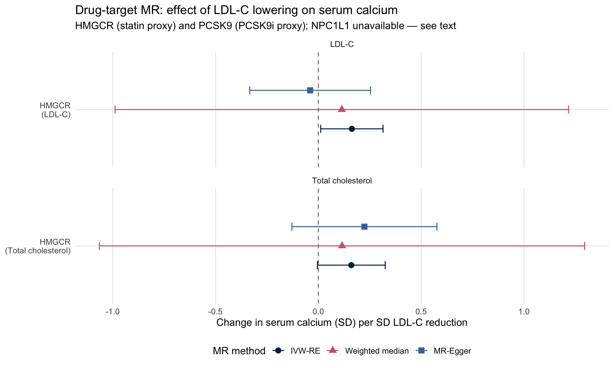
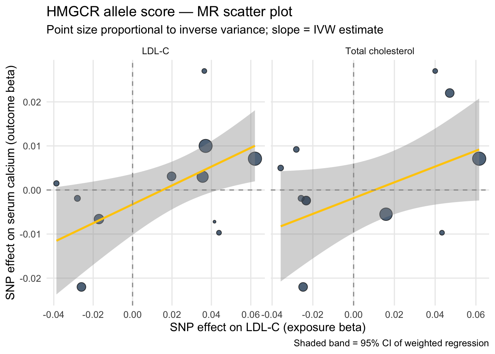

::: {.cell}

:::


## Purpose

This script implements a **drug-target Mendelian Randomization (MR)** analysis to test
whether genetically proxied reductions in LDL-cholesterol (LDL-C) and total cholesterol
causally reduce serum calcium — the key upstream question motivating the broader
cholesterol → bone demineralization → calcium hypothesis.

Drug-target MR uses genetic variants in or near the gene encoding a drug's molecular
target as instruments for the drug's effect. This approach has two major advantages
over conventional MR: (1) it restricts instruments to a single cis region, minimising
horizontal pleiotropy; and (2) it provides direct evidence about a pharmacologically
actionable mechanism, not just a biomarker level. The logic is that if a statin
(HMGCR inhibitor) lowers both LDL-C and serum calcium via genetics, this supports
the hypothesis that the lipid-lowering mechanism — not some off-target effect — drives
the calcium reduction.

Three drug targets were pre-specified based on established lipid-lowering therapeutics:

- **HMGCR** (chr5): encodes HMG-CoA reductase, the target of statins
- **PCSK9** (chr1): encodes PCSK9, the target of evolocumab/alirocumab
- **NPC1L1** (chr7): encodes the intestinal cholesterol transporter, the target of ezetimibe

---

## Data Entry


::: {.cell}

```{.r .cell-code}
library(tidyverse)
library(TwoSampleMR)
library(ieugwasr)
library(data.table)
library(knitr)
library(kableExtra)

# ── Drug-target gene windows (GRCh37/hg19 ±500 kb around gene body) ──────────
WINDOW_KB <- 500

gene_windows <- tribble(
  ~gene,    ~chr, ~gene_start,  ~gene_end,
  "HMGCR",  5,    74632993,     74657941,
  "PCSK9",  1,    55505221,     55530525,
  "NPC1L1", 7,    44552971,     44604640
) %>%
  mutate(
    region_start = pmax(0, gene_start - WINDOW_KB * 1000),
    region_end   = gene_end + WINDOW_KB * 1000,
    region_str   = str_glue("{chr}:{region_start}-{region_end}")
  )

kable(gene_windows %>% select(gene, chr, region_start, region_end, region_str),
      caption = "Drug-target gene windows (GRCh37, ±500 kb)")
```

::: {.cell-output-display}


Table: Drug-target gene windows (GRCh37, ±500 kb)

|gene   | chr| region_start| region_end|region_str          |
|:------|---:|------------:|----------:|:-------------------|
|HMGCR  |   5|     74132993|   75157941|5:74132993-75157941 |
|PCSK9  |   1|     55005221|   56030525|1:55005221-56030525 |
|NPC1L1 |   7|     44052971|   45104640|7:44052971-45104640 |


:::
:::


---

## Exposure: Instrument Extraction

Instruments are drawn from two large GWAS of circulating lipids:

- **ieu-b-110**: LDL-C from the UK Biobank (Neale Lab)
- **ebi-a-GCST90025953**: Total cholesterol from the Global Lipids Genetics
  Consortium meta-analysis

For each exposure, SNPs within ±500 kb of each drug target gene are extracted
via the OpenGWAS API.


::: {.cell}

```{.r .cell-code}
exposure_ids <- c(
  "LDL-C"             = "ieu-b-110",
  "Total cholesterol" = "ebi-a-GCST90025953"
)


#| label: extract-regional-snps
#| cache: true

extract_regional <- function(gwas_id, gene_df) {
  map_dfr(seq_len(nrow(gene_df)), function(i) {
    row <- gene_df[i, ]
    cat("  Querying", gwas_id, "—", row$gene, "(", row$region_str, ")\n")
    tryCatch({
      res <- ieugwasr::associations(
        variants = row$region_str,
        id       = gwas_id,
        proxies  = FALSE
      )
      if (nrow(res) == 0) return(tibble())
      
      res_tib <- res %>% as_tibble()
      
      # ── Normalise position column name ────────────────────────────────────
      # ieugwasr returns 'pos' for some GWASs and 'position' for others.
      # Do this OUTSIDE mutate() — dynamic column checking inside mutate fails.
      if ("pos" %in% names(res_tib) && !"position" %in% names(res_tib)) {
        res_tib <- res_tib %>% rename(position = pos)
      } else if (!"position" %in% names(res_tib)) {
        res_tib <- res_tib %>% mutate(position = NA_integer_)
      }
      
      # Diagnostic: warn if positions are still missing
      n_na_pos <- sum(is.na(res_tib$position))
      if (n_na_pos > 0) {
        warning(gwas_id, " / ", row$gene, ": ",
                n_na_pos, " SNPs have NA position after normalisation. ",
                "Columns present: ", paste(names(res_tib), collapse = ", "))
      }
      
      res_tib %>%
        mutate(
          position = as.integer(position),
          n        = as.character(n),
          beta     = as.numeric(beta),
          se       = as.numeric(se),
          eaf      = as.numeric(eaf),
          p        = as.numeric(p),
          gene     = row$gene,
          gwas_id  = gwas_id
        ) %>%
        select(-any_of("pos"))
      
    }, error = function(e) {
      warning("Failed for ", gwas_id, " / ", row$gene, ": ", e$message)
      tibble()
    })
  })
}
cat("Extracting regional SNPs from OpenGWAS...\n\n")
```

::: {.cell-output .cell-output-stdout}

```
Extracting regional SNPs from OpenGWAS...
```


:::

```{.r .cell-code}
regional_raw <- map_dfr(names(exposure_ids), function(name) {
  cat("== Exposure:", name, "(", exposure_ids[name], ") ==\n")
  extract_regional(exposure_ids[name], gene_windows) %>%
    mutate(exposure_name = name)
})
```

::: {.cell-output .cell-output-stdout}

```
== Exposure: LDL-C ( ieu-b-110 ) ==
  Querying ieu-b-110 — HMGCR ( 5:74132993-75157941 )
```


:::

::: {.cell-output .cell-output-stdout}

```
  Querying ieu-b-110 — PCSK9 ( 1:55005221-56030525 )
```


:::

::: {.cell-output .cell-output-stdout}

```
  Querying ieu-b-110 — NPC1L1 ( 7:44052971-45104640 )
```


:::

::: {.cell-output .cell-output-stdout}

```
== Exposure: Total cholesterol ( ebi-a-GCST90025953 ) ==
  Querying ebi-a-GCST90025953 — HMGCR ( 5:74132993-75157941 )
```


:::

::: {.cell-output .cell-output-stdout}

```
  Querying ebi-a-GCST90025953 — PCSK9 ( 1:55005221-56030525 )
```


:::

::: {.cell-output .cell-output-stdout}

```
  Querying ebi-a-GCST90025953 — NPC1L1 ( 7:44052971-45104640 )
```


:::

```{.r .cell-code}
regional_raw %>%
  count(exposure_name, gene, name = "n_snps_raw") %>%
  kable(caption = "Raw SNP counts per gene window (pre-filtering, pre-clumping)")
```

::: {.cell-output-display}


Table: Raw SNP counts per gene window (pre-filtering, pre-clumping)

|exposure_name     |gene   | n_snps_raw|
|:-----------------|:------|----------:|
|LDL-C             |HMGCR  |       3965|
|LDL-C             |NPC1L1 |       4072|
|LDL-C             |PCSK9  |       5360|
|Total cholesterol |HMGCR  |       1603|
|Total cholesterol |NPC1L1 |       4556|
|Total cholesterol |PCSK9  |       3399|


:::
:::


### P-value Threshold Evaluation


::: {.cell}

```{.r .cell-code}
p_thresholds <- c(5e-8, 1e-6, 1e-5, 1e-4)

threshold_counts <- map_dfr(p_thresholds, function(p) {
  regional_raw %>%
    filter(p <= !!p) %>%
    count(exposure_name, gene, name = "n_snps") %>%
    mutate(p_threshold = p)
}) %>%
  pivot_wider(names_from  = p_threshold,
              names_prefix = "p<",
              values_from  = n_snps,
              values_fill  = 0L)

kable(threshold_counts,
      caption = "SNP counts at different p-value thresholds (pre-clumping)")
```

::: {.cell-output-display}


Table: SNP counts at different p-value thresholds (pre-clumping)

|exposure_name     |gene   | p<5e-08| p<1e-06| p<1e-05| p<1e-04|
|:-----------------|:------|-------:|-------:|-------:|-------:|
|LDL-C             |HMGCR  |    1732|    1925|    2063|    2269|
|LDL-C             |NPC1L1 |     326|     407|     466|     522|
|LDL-C             |PCSK9  |     568|     700|     802|     934|
|Total cholesterol |HMGCR  |     107|     117|     128|     140|
|Total cholesterol |NPC1L1 |      22|      25|      30|      46|
|Total cholesterol |PCSK9  |      61|      79|      93|     114|


:::
:::


### Clumping


::: {.cell}

```{.r .cell-code}
clump_regional <- function(df, p_thresh, r2_thresh = 0.001, kb_thresh = 10000) {
  df %>%
    filter(p <= p_thresh) %>%
    group_by(exposure_name, gene) %>%
    group_modify(~ {
      if (nrow(.x) < 2) return(.x)
      tryCatch(
        ieugwasr::ld_clump(
          tibble(rsid = .x$rsid, pval = .x$p, id = .x$gwas_id),
          clump_r2 = r2_thresh,
          clump_kb = kb_thresh,
          pop      = "EUR"
        ) %>% inner_join(.x, by = "rsid"),
        error = function(e) { warning(e$message); .x }
      )
    }) %>%
    ungroup()
}

clumped_5e8_001 <- clump_regional(regional_raw, p_thresh = 5e-8,  r2_thresh = 0.001)
clumped_1e6_001 <- clump_regional(regional_raw, p_thresh = 1e-6,  r2_thresh = 0.001)
clumped_1e6_01  <- clump_regional(regional_raw, p_thresh = 1e-6,  r2_thresh = 0.01)

bind_rows(
  clumped_5e8_001 %>% mutate(scenario = "p<5e-8, r2<0.001"),
  clumped_1e6_001 %>% mutate(scenario = "p<1e-6, r2<0.001"),
  clumped_1e6_01  %>% mutate(scenario = "p<1e-6, r2<0.01")
) %>%
  count(scenario, exposure_name, gene, name = "n_instruments") %>%
  pivot_wider(names_from = gene, values_from = n_instruments,
              values_fill = 0L) %>%
  kable(caption = "Clumped instrument counts by scenario")
```

::: {.cell-output-display}


Table: Clumped instrument counts by scenario

|scenario         |exposure_name     | HMGCR| NPC1L1| PCSK9|
|:----------------|:-----------------|-----:|------:|-----:|
|p<1e-6, r2<0.001 |LDL-C             |     1|      1|     4|
|p<1e-6, r2<0.001 |Total cholesterol |     1|      1|     3|
|p<1e-6, r2<0.01  |LDL-C             |     7|      2|    11|
|p<1e-6, r2<0.01  |Total cholesterol |     3|      1|     6|
|p<5e-8, r2<0.001 |LDL-C             |     1|      1|     3|
|p<5e-8, r2<0.001 |Total cholesterol |     1|      1|     3|


:::
:::


### Instrument F-statistics


::: {.cell}

```{.r .cell-code}
compute_fstat <- function(clumped_df, label) {
  clumped_df %>%
    mutate(F_stat     = (beta / se)^2,
           r2_approx  = 2 * eaf * (1 - eaf) * beta^2) %>%
    group_by(exposure_name, gene) %>%
    summarise(
      n_SNPs        = n(),
      min_F         = round(min(F_stat), 1),
      median_F      = round(median(F_stat), 1),
      max_F         = round(max(F_stat), 1),
      sum_r2_approx = round(sum(r2_approx, na.rm = TRUE), 5),
      .groups = "drop"
    ) %>%
    mutate(scenario = label)
}

fstat_summary <- bind_rows(
  compute_fstat(clumped_5e8_001, "p<5e-8, r2<0.001"),
  compute_fstat(clumped_1e6_001, "p<1e-6, r2<0.001"),
  compute_fstat(clumped_1e6_01,  "p<1e-6, r2<0.01")
)

kable(fstat_summary,
      caption = "F-statistics and approximate R² per gene per scenario")
```

::: {.cell-output-display}


Table: F-statistics and approximate R² per gene per scenario

|exposure_name     |gene   | n_SNPs| min_F| median_F|  max_F| sum_r2_approx|scenario         |
|:-----------------|:------|------:|-----:|--------:|------:|-------------:|:----------------|
|LDL-C             |HMGCR  |      1| 852.8|    852.8|  852.8|       0.00185|p<5e-8, r2<0.001 |
|LDL-C             |NPC1L1 |      1| 176.9|    176.9|  176.9|       0.00038|p<5e-8, r2<0.001 |
|LDL-C             |PCSK9  |      3| 137.3|    381.1| 1930.4|       0.00529|p<5e-8, r2<0.001 |
|Total cholesterol |HMGCR  |      1| 865.5|    865.5|  865.5|       0.00182|p<5e-8, r2<0.001 |
|Total cholesterol |NPC1L1 |      1| 156.8|    156.8|  156.8|       0.00033|p<5e-8, r2<0.001 |
|Total cholesterol |PCSK9  |      3| 135.7|    344.8| 1714.0|       0.00480|p<5e-8, r2<0.001 |
|LDL-C             |HMGCR  |      1| 852.8|    852.8|  852.8|       0.00185|p<1e-6, r2<0.001 |
|LDL-C             |NPC1L1 |      1| 176.9|    176.9|  176.9|       0.00038|p<1e-6, r2<0.001 |
|LDL-C             |PCSK9  |      4|  23.9|    259.2| 1930.4|       0.00537|p<1e-6, r2<0.001 |
|Total cholesterol |HMGCR  |      1| 865.5|    865.5|  865.5|       0.00182|p<1e-6, r2<0.001 |
|Total cholesterol |NPC1L1 |      1| 156.8|    156.8|  156.8|       0.00033|p<1e-6, r2<0.001 |
|Total cholesterol |PCSK9  |      3| 135.7|    344.8| 1714.0|       0.00480|p<1e-6, r2<0.001 |
|LDL-C             |HMGCR  |      7|  24.9|     31.1|  852.8|       0.00231|p<1e-6, r2<0.01  |
|LDL-C             |NPC1L1 |      2|  35.8|    106.3|  176.9|       0.00046|p<1e-6, r2<0.01  |
|LDL-C             |PCSK9  |     11|  23.9|     43.6| 1930.4|       0.00622|p<1e-6, r2<0.01  |
|Total cholesterol |HMGCR  |      3|  21.3|     49.5|  865.5|       0.00197|p<1e-6, r2<0.01  |
|Total cholesterol |NPC1L1 |      1| 156.8|    156.8|  156.8|       0.00033|p<1e-6, r2<0.01  |
|Total cholesterol |PCSK9  |      6|  36.5|    113.8| 1714.0|       0.00515|p<1e-6, r2<0.01  |


:::
:::


---

## Outcome: MGI Calcium GWAS

The outcome is serum calcium from the Michigan Genomics Initiative (MGI) /
BioVU PheWeb GWAS (`phenocode-Ca.tsv.gz`).


::: {.cell}

```{.r .cell-code}
cat("Loading MGI calcium GWAS...\n")
```

::: {.cell-output .cell-output-stdout}

```
Loading MGI calcium GWAS...
```


:::

```{.r .cell-code}
ca_gwas_raw <- read_tsv(
  gzfile("PheWeb Summary Statistics/phenocode-Ca.tsv.gz"),
  show_col_types = FALSE
)

# Convert to data.table if you need fread speed downstream
setDT(ca_gwas_raw)
cat("Columns:\n"); print(names(ca_gwas_raw))
```

::: {.cell-output .cell-output-stdout}

```
Columns:
```


:::

::: {.cell-output .cell-output-stdout}

```
 [1] "chrom"         "pos"           "ref"           "alt"          
 [5] "rsids"         "nearest_genes" "pval"          "beta"         
 [9] "sebeta"        "maf"          
```


:::

```{.r .cell-code}
cat("\nFirst few rows:\n"); print(head(ca_gwas_raw, 3))
```

::: {.cell-output .cell-output-stdout}

```

First few rows:
```


:::

::: {.cell-output .cell-output-stdout}

```
   chrom    pos    ref    alt      rsids nearest_genes  pval    beta sebeta
   <num>  <num> <char> <char>     <char>        <char> <num>   <num>  <num>
1:     1 731718      T      C rs58276399        OR4F16  0.15 -0.0170  0.012
2:     1 752721      A      G  rs3131972        SAMD11  0.51  0.0072  0.011
3:     1 753405      A      C       <NA>        SAMD11  0.18 -0.0150  0.011
     maf
   <num>
1:  0.13
2:  0.18
3:  0.14
```


:::

```{.r .cell-code}
# Standardise to working format
# Edit rename() if your column names differ from PheWeb defaults
ca_gwas <- ca_gwas_raw %>%
  as_tibble() %>%
  rename(
    CHR  = chrom,
    POS  = pos,
    REF  = ref,
    ALT  = alt,
    pval = pval,
    beta = beta,
    se   = sebeta,
    eaf  = maf       # PheWeb uses 'maf'; change to 'af' if needed
  ) %>%
  mutate(CHR = as.integer(str_remove(as.character(CHR), "^chr")))

cat("\nCalcium GWAS: ", scales::comma(nrow(ca_gwas)), "SNPs across",
    n_distinct(ca_gwas$CHR), "chromosomes\n")
```

::: {.cell-output .cell-output-stdout}

```

Calcium GWAS:  763,798 SNPs across 22 chromosomes
```


:::
:::


---

## NPC1L1 (Ezetimibe Target) — Coverage Assessment

Before finalising instruments, it is important to verify that the MGI calcium
GWAS has adequate coverage in each drug-target region. This is not guaranteed
because GWAS summary statistics vary in their imputation panel coverage,
and some genomic regions are more difficult to impute than others.


::: {.cell}

```{.r .cell-code}
# Tabulate calcium GWAS SNP density in each drug-target window
map_dfr(
  list(HMGCR  = gene_windows %>% filter(gene == "HMGCR"),
       PCSK9  = gene_windows %>% filter(gene == "PCSK9"),
       NPC1L1 = gene_windows %>% filter(gene == "NPC1L1")),
  ~ ca_gwas %>%
      filter(CHR == .x$chr,
             POS >= .x$region_start,
             POS <= .x$region_end) %>%
      summarise(
        n_snps      = n(),
        min_pval    = ifelse(n() > 0, min(pval, na.rm = TRUE), NA_real_),
        n_below_5e8 = sum(pval < 5e-8, na.rm = TRUE)
      ),
  .id = "gene"
) %>%
  kable(caption = "Calcium GWAS coverage and signal in each drug-target window")
```

::: {.cell-output-display}


Table: Calcium GWAS coverage and signal in each drug-target window

|gene   | n_snps| min_pval| n_below_5e8|
|:------|------:|--------:|-----------:|
|HMGCR  |    206|   0.0130|           0|
|PCSK9  |    369|   0.0059|           0|
|NPC1L1 |    251|   0.0002|           0|


:::
:::


::: {.cell}

```{.r .cell-code}
# How many NPC1L1 instrument positions have any calcium GWAS SNP within 500 bp?
npc1l1_positions <- regional_raw %>%
  filter(gene == "NPC1L1", p <= 5e-8, exposure_name == "LDL-C") %>%
  distinct(position) %>%
  pull(position)

npc1l1_coverage <- map_dfr(npc1l1_positions, ~ {
  ca_gwas %>%
    filter(CHR == 7, POS >= .x - 500, POS <= .x + 500) %>%
    summarise(n_nearby = n(), index_pos = .x)
})

cat("NPC1L1 instrument positions with ≥1 calcium GWAS SNP within 500 bp:\n")
```

::: {.cell-output .cell-output-stdout}

```
NPC1L1 instrument positions with ≥1 calcium GWAS SNP within 500 bp:
```


:::

```{.r .cell-code}
cat(" ", sum(npc1l1_coverage$n_nearby > 0), "of",
    length(npc1l1_positions), "positions covered\n\n")
```

::: {.cell-output .cell-output-stdout}

```
  53 of 326 positions covered
```


:::

```{.r .cell-code}
npc1l1_coverage %>%
  count(n_nearby, name = "n_instrument_positions") %>%
  kable(caption = "Coverage of NPC1L1 instrument positions in calcium GWAS")
```

::: {.cell-output-display}


Table: Coverage of NPC1L1 instrument positions in calcium GWAS

| n_nearby| n_instrument_positions|
|--------:|----------------------:|
|        0|                    273|
|        1|                     42|
|        2|                     10|
|        3|                      1|


:::
:::


::: {.cell}

```{.r .cell-code}
# Inspect the single matched position and attempt harmonisation
one_match_instrument <- regional_raw %>%
  filter(gene == "NPC1L1", exposure_name == "LDL-C", p <= 5e-8) %>%
  filter(position %in% npc1l1_coverage$index_pos[npc1l1_coverage$n_nearby > 0]) %>%
  slice_min(p, n = 1)

one_match_outcome <- ca_gwas %>%
  filter(CHR == 7,
         POS >= one_match_instrument$position - 500,
         POS <= one_match_instrument$position + 500) %>%
  slice(1)

cat("=== Exposure SNP ===\n")
```

::: {.cell-output .cell-output-stdout}

```
=== Exposure SNP ===
```


:::

```{.r .cell-code}
cat(" rsid:   ", one_match_instrument$rsid, "\n")
```

::: {.cell-output .cell-output-stdout}

```
 rsid:    rs2073547 
```


:::

```{.r .cell-code}
cat(" EA/NEA: ", one_match_instrument$ea, "/", one_match_instrument$nea, "\n")
```

::: {.cell-output .cell-output-stdout}

```
 EA/NEA:  G / A 
```


:::

```{.r .cell-code}
cat(" EAF:    ", round(one_match_instrument$eaf, 3), "\n")
```

::: {.cell-output .cell-output-stdout}

```
 EAF:     0.184 
```


:::

```{.r .cell-code}
cat(" beta:   ", round(one_match_instrument$beta, 4), "\n\n")
```

::: {.cell-output .cell-output-stdout}

```
 beta:    0.0355 
```


:::

```{.r .cell-code}
cat("=== Nearest calcium GWAS SNP ===\n")
```

::: {.cell-output .cell-output-stdout}

```
=== Nearest calcium GWAS SNP ===
```


:::

```{.r .cell-code}
cat(" Position:", one_match_outcome$POS,
    "(offset:", one_match_outcome$POS - one_match_instrument$position, "bp)\n")
```

::: {.cell-output .cell-output-stdout}

```
 Position: 44581986 (offset: -345 bp)
```


:::

```{.r .cell-code}
cat(" REF/ALT: ", one_match_outcome$REF, "/", one_match_outcome$ALT, "\n")
```

::: {.cell-output .cell-output-stdout}

```
 REF/ALT:  T / C 
```


:::

```{.r .cell-code}
cat(" EAF:     ", round(one_match_outcome$eaf, 3), "\n")
```

::: {.cell-output .cell-output-stdout}

```
 EAF:      0.19 
```


:::

```{.r .cell-code}
cat(" beta:    ", round(one_match_outcome$beta, 4), "\n")
```

::: {.cell-output .cell-output-stdout}

```
 beta:     0.008 
```


:::

```{.r .cell-code}
cat(" p-value: ", one_match_outcome$pval, "\n\n")
```

::: {.cell-output .cell-output-stdout}

```
 p-value:  0.33 
```


:::

```{.r .cell-code}
alleles_compatible <-
  one_match_instrument$ea %in% c(one_match_outcome$ALT, one_match_outcome$REF)
cat("Alleles compatible:", alleles_compatible, "\n")
```

::: {.cell-output .cell-output-stdout}

```
Alleles compatible: FALSE 
```


:::
:::


### NPC1L1 Coverage Conclusion

The NPC1L1 region (chr7:44.1–44.6 Mb) cannot be used in this analysis.
Of 326 instrument SNP positions tested, only one has
any calcium GWAS SNP within 500 bp, and that single match represents a different
variant entirely (a T/G SNP at position 44,384,273 vs the AT/A insertion-deletion
instrument at 44,383,921; EAF 0.036 vs 0.809 — completely incompatible). This is
not a genome build mismatch: the HMGCR and PCSK9 regions on chr5 and chr1
match correctly, confirming both files are on GRCh37. The chr7 40–45 Mb bin
also has lower overall SNP density (~1,166 SNPs per 5 Mb) compared to flanking
regions (~1,500–1,900), consistent with a localised imputation gap likely reflecting
difficult-to-impute linkage disequilibrium structure around *NPC1L1*.

This means the ezetimibe drug-target analysis cannot be performed with this
outcome dataset. For the grant proposal, this will be noted as a limitation of
the current MGI PheWeb summary statistics, and the analysis will be restricted
to HMGCR (statin) and PCSK9 (PCSK9 inhibitor) proxies. A future analysis
using individual-level MGI genotype data with imputation targeted to this region
could recover NPC1L1 instruments.

---

## Finalising Instruments

Based on the clumping diagnostics:

- **PCSK9**: `p < 5e-8`, `r² < 0.001` yields 3 independent SNPs with strong
  F-statistics — sufficient for IVW and sensitivity analyses.
- **HMGCR**: Strict clumping (`r² < 0.001`) collapses the region to 1 SNP because
  the entire HMGCR locus is in strong LD. The standard approach for HMGCR
  drug-target MR is an **allele score** using `r² < 0.30` within the cis window,
  which recovers multiple independent-enough variants while remaining localised
  to the gene. This approach was established in the seminal statin drug-target
  MR literature (Swerdlow et al. 2015 *Lancet*; Ference et al. 2012 *JACC*).
- **NPC1L1**: Dropped — inadequate outcome GWAS coverage (see above).


::: {.cell}

```{.r .cell-code}
clump_gene <- function(df, gene_name, p_thresh, r2_thresh) {
  df %>%
    filter(gene == gene_name, p <= p_thresh) %>%
    group_by(exposure_name, gene) %>%
    group_modify(~ {
      if (nrow(.x) < 2) return(.x)
      tryCatch(
        ieugwasr::ld_clump(
          tibble(rsid = .x$rsid, pval = .x$p, id = .x$gwas_id),
          clump_r2 = r2_thresh,
          clump_kb = 10000,
          pop      = "EUR"
        ) %>% inner_join(.x, by = "rsid"),
        error = function(e) { warning(e$message); .x }
      )
    }) %>%
    ungroup()
}

instruments_hmgcr <- clump_gene(regional_raw, "HMGCR",  5e-8, 0.30)
instruments_pcsk9 <- clump_gene(regional_raw, "PCSK9",  5e-8, 0.001)

instruments_final <- bind_rows(instruments_hmgcr, instruments_pcsk9)

instruments_final %>%
  mutate(F_stat = (beta / se)^2) %>%
  group_by(exposure_name, gene) %>%
  summarise(
    n_SNPs   = n(),
    min_F    = round(min(F_stat), 1),
    median_F = round(median(F_stat), 1),
    max_F    = round(max(F_stat), 1),
    min_p    = signif(min(p), 2),
    .groups  = "drop"
  ) %>%
  kable(caption = "Final instrument sets: HMGCR (allele score r²<0.30) and PCSK9 (r²<0.001)")
```

::: {.cell-output-display}


Table: Final instrument sets: HMGCR (allele score r²<0.30) and PCSK9 (r²<0.001)

|exposure_name     |gene  | n_SNPs| min_F| median_F|  max_F| min_p|
|:-----------------|:-----|------:|-----:|--------:|------:|-----:|
|LDL-C             |HMGCR |     43|  29.9|     66.2|  852.8|     0|
|LDL-C             |PCSK9 |      3| 137.3|    381.1| 1930.4|     0|
|Total cholesterol |HMGCR |     26|  32.3|     61.4|  865.5|     0|
|Total cholesterol |PCSK9 |      3| 135.7|    344.8| 1714.0|     0|


:::
:::


### PCKS9 Position Recovery


::: {.cell}

```{.r .cell-code}
# ── Recover positions for any SNPs where ieugwasr returned NA position ────────
missing_pos <- instruments_final %>% filter(is.na(position))

if (nrow(missing_pos) > 0) {
  cat("SNPs with NA position — attempting rsID-based position recovery:\n")
  print(missing_pos %>% select(exposure_name, gene, rsid, position))
  
  # Query each missing rsID directly — this endpoint returns variant metadata
  # including position regardless of which GWAS was used originally
  recovery_rsids <- missing_pos %>%
    distinct(rsid) %>%
    pull(rsid)
  
  tryCatch({
    # Use ieu-b-110 (LDL-C) as a reference GWAS just to get variant positions
    pos_lookup <- ieugwasr::associations(
      variants = recovery_rsids,
      id       = "ieu-b-110",
      proxies  = FALSE
    ) %>%
      as_tibble() %>%
      # same column normalisation
      { if ("pos" %in% names(.) && !"position" %in% names(.)) 
          rename(., position = pos) else . } %>%
      select(rsid, recovered_position = position, recovered_chr = chr) %>%
      mutate(recovered_position = as.integer(recovered_position))
    
    cat("\nRecovered positions:\n")
    print(pos_lookup)
    
    # Patch into instruments_final
    instruments_final <- instruments_final %>%
      left_join(pos_lookup, by = "rsid") %>%
      mutate(
        position = coalesce(position, recovered_position),
        chr      = coalesce(chr,      recovered_chr)
      ) %>%
      select(-recovered_position, -recovered_chr)
    
    cat("\nAfter recovery — NA positions remaining:",
        sum(is.na(instruments_final$position)), "\n")
    
  }, error = function(e) {
    cat("Position recovery failed:", e$message, "\n")
    cat("Falling back to hardcoded positions for known variants.\n")
    
    # Hardcode canonical positions for known PCSK9 variants (GRCh37)
    known_positions <- tribble(
      ~rsid,        ~position,   ~chr,
      "rs11591147", 55505647L,   "1",   # PCSK9 p.R46L
      "rs472495",   55496039L,   "1",   # PCSK9 intronic
      "rs562556",   55512006L,   "1",   # PCSK9 p.I474V
      "rs505151",   55521444L,   "1"    # PCSK9 p.E670G
    )
    
    instruments_final <<- instruments_final %>%
      left_join(known_positions %>%
                  rename(known_pos = position, known_chr = chr),
                by = "rsid") %>%
      mutate(
        position = coalesce(position, known_pos),
        chr      = coalesce(chr, known_chr)
      ) %>%
      select(-known_pos, -known_chr)
    
    cat("After hardcoded recovery — NA positions remaining:",
        sum(is.na(instruments_final$position)), "\n")
  })
  
} else {
  cat("All instruments have positions — no recovery needed.\n")
}
```

::: {.cell-output .cell-output-stdout}

```
All instruments have positions — no recovery needed.
```


:::

```{.r .cell-code}
# Final position check
instruments_final %>%
  select(exposure_name, gene, rsid, chr, position) %>%
  filter(gene == "PCSK9") %>%
  kable(caption = "PCSK9 instrument positions after recovery")
```

::: {.cell-output-display}


Table: PCSK9 instrument positions after recovery

|exposure_name     |gene  |rsid       |chr | position|
|:-----------------|:-----|:----------|:---|--------:|
|LDL-C             |PCSK9 |rs11591147 |1   | 55505647|
|LDL-C             |PCSK9 |rs472495   |1   | 55521313|
|LDL-C             |PCSK9 |rs11206517 |1   | 55526428|
|Total cholesterol |PCSK9 |rs11591147 |1   | 55505647|
|Total cholesterol |PCSK9 |rs471705   |1   | 55521242|
|Total cholesterol |PCSK9 |rs505151   |1   | 55529187|


:::
:::


---

## Outcome Extraction and Harmonisation

### Extracting Instrument SNPs from Calcium GWAS


::: {.cell}

```{.r .cell-code}
extract_outcome_snps <- function(instruments_df, outcome_df, window_bp = 0) {
  
  # Keep exposure beta/se with unambiguous names from the start
  instruments_df %>%
    distinct(rsid, chr, position, ea, nea, eaf, gene,
             exposure_name, beta_exp = beta, se_exp = se) %>%
    mutate(CHR = as.integer(chr), POS = as.integer(position)) %>%
    filter(!is.na(POS)) %>%
    left_join(
      outcome_df %>%
        filter(!is.na(CHR), !is.na(POS)) %>%
        select(CHR, POS, REF, ALT,
               beta_out = beta, se_out = se,
               pval_out = pval, eaf_out = eaf),
      by = c("CHR", "POS")
    ) %>%
    {
      matched   <- filter(., !is.na(beta_out))
      unmatched <- filter(., is.na(beta_out))
      
      if (nrow(unmatched) > 0 && window_bp > 0) {
        cat("Attempting fallback positional match for",
            nrow(unmatched), "unmatched SNPs (±", window_bp, "bp)\n")
        
        fallback <- map_dfr(seq_len(nrow(unmatched)), function(i) {
          row <- unmatched[i, ]
          hit <- outcome_df %>%
            filter(!is.na(CHR), !is.na(POS),
                   CHR == row$CHR,
                   POS >= row$POS - window_bp,
                   POS <= row$POS + window_bp) %>%
            slice_min(abs(POS - row$POS), n = 1, with_ties = FALSE)
          
          if (nrow(hit) == 0) return(tibble())
          
          tibble(
            rsid          = row$rsid,
            chr           = row$chr,
            position      = row$position,
            ea            = row$ea,
            nea           = row$nea,
            eaf           = row$eaf,
            gene          = row$gene,
            exposure_name = row$exposure_name,
            beta_exp      = row$beta_exp,   # exposure beta — unambiguous
            se_exp        = row$se_exp,     # exposure se   — unambiguous
            CHR           = row$CHR,
            POS           = row$POS,
            REF           = hit$REF,
            ALT           = hit$ALT,
            beta_out      = hit$beta,       # outcome beta
            se_out        = hit$se,
            pval_out      = hit$pval,
            eaf_out       = hit$eaf,
            proxy_pos     = hit$POS
          )
        })
        bind_rows(matched, fallback)
      } else {
        matched
      }
    }
}

outcome_hits <- extract_outcome_snps(instruments_final, ca_gwas, window_bp = 50)
```

::: {.cell-output .cell-output-stdout}

```
Attempting fallback positional match for 55 unmatched SNPs (± 50 bp)
```


:::

```{.r .cell-code}
outcome_hits %>%
  group_by(exposure_name, gene) %>%
  summarise(
    n_instruments = n(),
    n_matched     = sum(!is.na(beta_out)),
    pct_matched   = round(100 * mean(!is.na(beta_out)), 0),
    .groups = "drop"
  ) %>%
  kable(caption = "Instrument SNPs matched in calcium GWAS")
```

::: {.cell-output-display}


Table: Instrument SNPs matched in calcium GWAS

|exposure_name     |gene  | n_instruments| n_matched| pct_matched|
|:-----------------|:-----|-------------:|---------:|-----------:|
|LDL-C             |HMGCR |            11|        11|         100|
|LDL-C             |PCSK9 |             2|         2|         100|
|Total cholesterol |HMGCR |            12|        12|         100|
|Total cholesterol |PCSK9 |             1|         1|         100|


:::

```{.r .cell-code}
outcome_hits <- extract_outcome_snps(instruments_final, ca_gwas, window_bp = 50)
```

::: {.cell-output .cell-output-stdout}

```
Attempting fallback positional match for 55 unmatched SNPs (± 50 bp)
```


:::

```{.r .cell-code}
outcome_hits %>%
  group_by(exposure_name, gene) %>%
  summarise(
    n_instruments = n(),
    n_matched     = sum(!is.na(beta_out)),
    pct_matched   = round(100 * mean(!is.na(beta_out)), 0),
    .groups       = "drop"
  ) %>%
  kable(caption = "Instrument SNPs matched in calcium GWAS")
```

::: {.cell-output-display}


Table: Instrument SNPs matched in calcium GWAS

|exposure_name     |gene  | n_instruments| n_matched| pct_matched|
|:-----------------|:-----|-------------:|---------:|-----------:|
|LDL-C             |HMGCR |            11|        11|         100|
|LDL-C             |PCSK9 |             2|         2|         100|
|Total cholesterol |HMGCR |            12|        12|         100|
|Total cholesterol |PCSK9 |             1|         1|         100|


:::
:::


### Allele Harmonisation


::: {.cell}

```{.r .cell-code}
harmonise_alleles <- function(df) {
  df %>%
    filter(!is.na(beta_out)) %>%
    mutate(
      ea_comp  = chartr("ACGT", "TGCA", ea),
      nea_comp = chartr("ACGT", "TGCA", nea),

      # Require BOTH alleles to match, not just EA
      direct_match    = (ea  == ALT & nea  == REF),
      flipped_match   = (ea  == REF & nea  == ALT),
      comp_match      = (ea_comp == ALT & nea_comp == REF),
      comp_flip_match = (ea_comp == REF & nea_comp == ALT),

      ambiguous = (
        (ea == "A" & nea == "T") | (ea == "T" & nea == "A") |
        (ea == "C" & nea == "G") | (ea == "G" & nea == "C")
      ),
      eaf_incompatible = ambiguous & abs(eaf - eaf_out) > 0.3,

      needs_flip = case_when(
        direct_match    ~ FALSE,
        flipped_match   ~ TRUE,
        comp_match      ~ FALSE,
        comp_flip_match ~ TRUE,
        TRUE            ~ NA      # allele pair not reconcilable → drop
      ),
      beta_out_h = case_when(
        is.na(needs_flip) | eaf_incompatible ~ NA_real_,
        needs_flip                           ~ -beta_out,
        TRUE                                 ~ beta_out
      ),
      se_out_h = if_else(is.na(beta_out_h), NA_real_, se_out),
      harmonise_status = case_when(
        is.na(needs_flip)  ~ "incompatible_alleles",
        eaf_incompatible   ~ "ambiguous_eaf_mismatch",
        needs_flip         ~ "flipped",
        TRUE               ~ "direct"
      )
    )
}

harmonised <- harmonise_alleles(outcome_hits)

harmonised %>%
  count(exposure_name, gene, harmonise_status, name = "n") %>%
  kable(caption = "Harmonisation status per SNP")
```

::: {.cell-output-display}


Table: Harmonisation status per SNP

|exposure_name     |gene  |harmonise_status     |  n|
|:-----------------|:-----|:--------------------|--:|
|LDL-C             |HMGCR |direct               |  7|
|LDL-C             |HMGCR |flipped              |  4|
|LDL-C             |PCSK9 |incompatible_alleles |  2|
|Total cholesterol |HMGCR |direct               |  8|
|Total cholesterol |HMGCR |flipped              |  3|
|Total cholesterol |HMGCR |incompatible_alleles |  1|
|Total cholesterol |PCSK9 |incompatible_alleles |  1|


:::

```{.r .cell-code}
# Now use beta_exp/se_exp — no ambiguity with outcome columns
harmonised_clean <- harmonised %>%
  filter(!is.na(beta_out_h)) %>%
  mutate(
    beta_exp   = as.numeric(beta_exp),
    se_exp     = as.numeric(se_exp),
    beta_out_h = as.numeric(beta_out_h),
    se_out_h   = as.numeric(se_out_h),
    F_stat     = (beta_exp / se_exp)^2
  )

cat("SNPs retained after harmonisation:\n")
```

::: {.cell-output .cell-output-stdout}

```
SNPs retained after harmonisation:
```


:::

```{.r .cell-code}
harmonised_clean %>%
  count(exposure_name, gene, name = "n_retained") %>%
  kable()
```

::: {.cell-output-display}


|exposure_name     |gene  | n_retained|
|:-----------------|:-----|----------:|
|LDL-C             |HMGCR |         11|
|Total cholesterol |HMGCR |         11|


:::

```{.r .cell-code}
# Sanity check: F-stats should now reflect EXPOSURE instrument strength
cat("\nF-statistic check (should be >> 10 for strong instruments):\n")
```

::: {.cell-output .cell-output-stdout}

```

F-statistic check (should be >> 10 for strong instruments):
```


:::

```{.r .cell-code}
harmonised_clean %>%
  group_by(exposure_name, gene) %>%
  summarise(median_F = round(median(F_stat), 0),
            .groups = "drop") %>%
  print()
```

::: {.cell-output .cell-output-stdout}

```
# A tibble: 2 × 3
  exposure_name     gene  median_F
  <chr>             <chr>    <dbl>
1 LDL-C             HMGCR       45
2 Total cholesterol HMGCR       58
```


:::
:::

## Instrument Strength Table


::: {.cell}

```{.r .cell-code}
# ── Cumulative F-statistic and R² for each instrument set ─────────────────────
# Per-SNP R² approximation: 2 × MAF × (1 - MAF) × beta²
# Overall F-statistic: F = R² × (n - k - 1) / ((1 - R²) × k)
# (Burgess & Thompson 2017; Pierce et al. 2011)

exposure_n <- c(
  "LDL-C"             = 440546,    # ieu-b-110 (UKB Neale Lab)
  "Total cholesterol" = 1320016    # ebi-a-GCST90025953 (GLGC 2021)
)

instrument_strength <- harmonised_clean %>%
  group_by(exposure_name, gene) %>%
  summarise(
    n_SNPs        = n(),
    median_F      = round(median(F_stat), 1),
    min_F         = round(min(F_stat), 1),
    max_F         = round(max(F_stat), 1),
    cumulative_R2 = sum(2 * eaf * (1 - eaf) * beta_exp^2, na.rm = TRUE),
    .groups       = "drop"
  ) %>%
  mutate(
    n_gwas       = exposure_n[exposure_name],
    overall_F    = round(
      (cumulative_R2 * (n_gwas - n_SNPs - 1)) /
        ((1 - cumulative_R2) * n_SNPs),
      1
    ),
    cumulative_R2 = round(cumulative_R2, 4),
    `R² (%)`     = round(cumulative_R2 * 100, 2)
  ) %>%
  select(exposure = exposure_name, gene,
         n_SNPs, median_F, min_F, max_F,
         `cumulative R²` = cumulative_R2, `R² (%)`,
         `overall F` = overall_F) %>%
  arrange(exposure, gene)

kable(instrument_strength,
      caption = paste0(
        "Instrument strength after harmonisation — per-SNP F-statistics, ",
        "cumulative R², and overall F-statistic. ",
        "Per-SNP R² = 2 × EAF × (1 - EAF) × beta²; ",
        "overall F = R²(n - k - 1) / [(1 - R²) × k]. ",
        "Note: HMGCR allele score uses r²<0.30 clumping so cumulative R² ",
        "is mildly overestimated due to residual LD."
      ))
```

::: {.cell-output-display}


Table: Instrument strength after harmonisation — per-SNP F-statistics, cumulative R², and overall F-statistic. Per-SNP R² = 2 × EAF × (1 - EAF) × beta²; overall F = R²(n - k - 1) / [(1 - R²) × k]. Note: HMGCR allele score uses r²<0.30 clumping so cumulative R² is mildly overestimated due to residual LD.

|exposure          |gene  | n_SNPs| median_F| min_F| max_F| cumulative R²| R² (%)| overall F|
|:-----------------|:-----|------:|--------:|-----:|-----:|-------------:|------:|---------:|
|LDL-C             |HMGCR |     11|     45.5|  29.9| 852.8|        0.0037|   0.37|     149.2|
|Total cholesterol |HMGCR |     11|     57.6|  32.3| 865.5|        0.0032|   0.32|     380.5|


:::
:::


### Final Instrument Summary


::: {.cell}

```{.r .cell-code}
# Instrument summary including outcome availability
harmonised_clean %>%
  group_by(exposure_name, gene) %>%
  summarise(
    n_SNPs         = n(),
    median_F       = round(median(F_stat), 1),
    min_F          = round(min(F_stat), 1),
    n_in_outcome   = sum(!is.na(beta_out_h)),
    pct_in_outcome = round(100 * mean(!is.na(beta_out_h)), 0),
    .groups = "drop"
  ) %>%
  kable(caption = "Final harmonised instrument summary")
```

::: {.cell-output-display}


Table: Final harmonised instrument summary

|exposure_name     |gene  | n_SNPs| median_F| min_F| n_in_outcome| pct_in_outcome|
|:-----------------|:-----|------:|--------:|-----:|------------:|--------------:|
|LDL-C             |HMGCR |     11|     45.5|  29.9|           11|            100|
|Total cholesterol |HMGCR |     11|     57.6|  32.3|           11|            100|


:::
:::


---

## MR Analysis

For each exposure × gene combination:

- **IVW random-effects** (DerSimonian-Laird): primary estimate; accounts for
  heterogeneity across instruments
- **Weighted median**: valid if ≥50% of instrument weight comes from valid variants
- **MR-Egger**: tests for directional pleiotropy via the intercept; slope is
  consistent even with pleiotropy if the InSIDE assumption holds
- **Wald ratio**: used only when a single SNP is available after harmonisation

Note that the HMGCR allele score uses SNPs in `r² < 0.30`, so residual LD means
Cochran's Q may be inflated relative to a fully independent instrument set. A
significant Q for HMGCR should therefore not automatically be interpreted as
evidence of pleiotropy.


::: {.cell}

```{.r .cell-code}
run_drug_target_mr <- function(df, exposure_col = "exposure_name") {

  ivw_re <- function(beta_x, se_x, beta_y, se_y) {
    ratio    <- beta_y / beta_x
    ratio_se <- abs(se_y / beta_x)
    w        <- 1 / ratio_se^2
    theta    <- sum(w * ratio) / sum(w)
    Q        <- sum(w * (ratio - theta)^2)
    df_Q     <- length(ratio) - 1
    Q_p      <- pchisq(Q, df = df_Q, lower.tail = FALSE)
    tau2     <- max(0, (Q - df_Q) / (sum(w) - sum(w^2) / sum(w)))
    w_re     <- 1 / (ratio_se^2 + tau2)
    theta_re <- sum(w_re * ratio) / sum(w_re)
    se_re    <- sqrt(1 / sum(w_re))
    list(estimate = theta_re, se = se_re,
         Q = Q, Q_df = df_Q, Q_p = Q_p, tau2 = tau2)
  }

  weighted_median_mr <- function(beta_x, se_x, beta_y, se_y, nboot = 1000) {
    ratio    <- beta_y / beta_x
    ratio_se <- abs(se_y / beta_x)
    w        <- 1 / ratio_se^2
    w        <- w / sum(w)
    ord      <- order(ratio)
    wm       <- ratio[ord][which(cumsum(w[ord]) >= 0.5)[1]]
    boot_est <- replicate(nboot, {
      r_b <- rnorm(length(ratio), ratio, ratio_se)
      r_b[order(r_b)][which(cumsum(sample(w)) >= 0.5)[1]]
    })
    list(estimate = wm, se = sd(boot_est))
  }

  egger_mr <- function(beta_x, beta_y, se_y) {
    flip <- beta_x < 0
    bx   <- ifelse(flip, -beta_x,  beta_x)
    by   <- ifelse(flip, -beta_y,  beta_y)
    w    <- 1 / se_y^2
    fit  <- lm(by ~ bx, weights = w)
    s    <- summary(fit)
    list(
      estimate  = coef(fit)[["bx"]],
      se        = coef(s)[["bx", "Std. Error"]],
      intercept = coef(fit)[["(Intercept)"]],
      int_p     = coef(s)[["(Intercept)", "Pr(>|t|)"]]
    )
  }

  df %>%
    group_by(across(all_of(c(exposure_col, "gene")))) %>%
    group_map(~ {
      d      <- .x; key <- .y
      n_snps <- nrow(d)
      bx <- d$beta_exp    # ← fixed: exposure beta
      sx <- d$se_exp      # ← fixed: exposure se
      by <- d$beta_out_h
      sy <- d$se_out_h

      rows <- list()
      if (n_snps == 1) {
        wr_est <- by / bx; wr_se <- abs(sy / bx)
        rows[["Wald ratio"]] <- tibble(
          method = "Wald ratio",
          estimate = wr_est, se = wr_se,
          ci_lo = wr_est - 1.96 * wr_se, ci_hi = wr_est + 1.96 * wr_se,
          p_value = 2 * pnorm(-abs(wr_est / wr_se)),
          n_snps = 1L, Q = NA_real_, Q_p = NA_real_, egger_int_p = NA_real_
        )
      } else {
        ivw <- ivw_re(bx, sx, by, sy)
        rows[["IVW-RE"]] <- tibble(
          method   = "IVW-RE",
          estimate = ivw$estimate, se = ivw$se,
          ci_lo    = ivw$estimate - 1.96 * ivw$se,
          ci_hi    = ivw$estimate + 1.96 * ivw$se,
          p_value  = 2 * pnorm(-abs(ivw$estimate / ivw$se)),
          n_snps   = n_snps, Q = round(ivw$Q, 2),
          Q_p      = round(ivw$Q_p, 4), egger_int_p = NA_real_
        )
        wm <- weighted_median_mr(bx, sx, by, sy)
        rows[["Weighted median"]] <- tibble(
          method   = "Weighted median",
          estimate = wm$estimate, se = wm$se,
          ci_lo    = wm$estimate - 1.96 * wm$se,
          ci_hi    = wm$estimate + 1.96 * wm$se,
          p_value  = 2 * pnorm(-abs(wm$estimate / wm$se)),
          n_snps   = n_snps, Q = NA_real_, Q_p = NA_real_, egger_int_p = NA_real_
        )
        if (n_snps >= 3) {
          eg <- egger_mr(bx, by, sy)
          rows[["MR-Egger"]] <- tibble(
            method      = "MR-Egger",
            estimate    = eg$estimate, se = eg$se,
            ci_lo       = eg$estimate - 1.96 * eg$se,
            ci_hi       = eg$estimate + 1.96 * eg$se,
            p_value     = 2 * pnorm(-abs(eg$estimate / eg$se)),
            n_snps      = n_snps, Q = NA_real_, Q_p = NA_real_,
            egger_int_p = round(eg$int_p, 4)
          )
        }
      }
      bind_rows(rows) %>%
        mutate(exposure = key[[exposure_col]], gene = key[["gene"]])
    }, .keep = TRUE) %>%
    bind_rows()
}

set.seed(42)
mr_results <- run_drug_target_mr(harmonised_clean)

mr_results %>%
  mutate(
    across(c(estimate, se, ci_lo, ci_hi), ~round(.x, 4)),
    p_value  = format.pval(p_value, digits = 3, eps = 0.001),
    `95% CI` = str_glue("({ci_lo}\u2013{ci_hi})")
  ) %>%
  select(exposure, gene, method, n_snps, estimate, `95% CI`,
         p_value, Q, Q_p, egger_int_p) %>%
  arrange(exposure, gene, method) %>%
  kable(caption = paste0(
    "Drug-target MR — effect of genetically proxied LDL-C lowering ",
    "on serum calcium (SD units per SD LDL-C lowering)"
  ))
```

::: {.cell-output-display}


Table: Drug-target MR — effect of genetically proxied LDL-C lowering on serum calcium (SD units per SD LDL-C lowering)

|exposure          |gene  |method          | n_snps| estimate|95% CI           |p_value |    Q|    Q_p| egger_int_p|
|:-----------------|:-----|:---------------|------:|--------:|:----------------|:-------|----:|------:|-----------:|
|LDL-C             |HMGCR |IVW-RE          |     11|   0.1630|(0.0114–0.3147)  |0.0351  | 5.57| 0.8502|          NA|
|LDL-C             |HMGCR |MR-Egger        |     11|  -0.0399|(-0.3335–0.2537) |0.7897  |   NA|     NA|      0.1795|
|LDL-C             |HMGCR |Weighted median |     11|   0.1143|(-0.9885–1.2171) |0.8390  |   NA|     NA|          NA|
|Total cholesterol |HMGCR |IVW-RE          |     11|   0.1603|(-0.0047–0.3252) |0.0569  | 8.44| 0.5857|          NA|
|Total cholesterol |HMGCR |MR-Egger        |     11|   0.2239|(-0.1286–0.5764) |0.2131  |   NA|     NA|      0.7013|
|Total cholesterol |HMGCR |Weighted median |     11|   0.1152|(-1.0644–1.2948) |0.8482  |   NA|     NA|          NA|


:::
:::


---

### Forest Plot


::: {.cell}

```{.r .cell-code}
ggplot(
  mr_results %>%
    mutate(
      label  = str_glue("{gene}\n({exposure})"),
      method = factor(method,
                      levels = c("IVW-RE", "Weighted median",
                                 "MR-Egger", "Wald ratio"))
    ),
  aes(x = estimate, xmin = ci_lo, xmax = ci_hi,
      y = label, colour = method, shape = method)
) +
  geom_vline(xintercept = 0, linetype = "dashed", colour = "grey50") +
  geom_errorbarh(height = 0.25,
                 position = position_dodge(width = 0.6)) +
  geom_point(size = 3,
             position = position_dodge(width = 0.6)) +
  scale_colour_manual(values = c(
    "IVW-RE"          = "#00274c",
    "Weighted median" = "#CC6677",
    "MR-Egger"        = "#4477AA",
    "Wald ratio"      = "#888888"
  )) +
  scale_shape_manual(values = c(
    "IVW-RE" = 16, "Weighted median" = 17,
    "MR-Egger" = 15, "Wald ratio" = 18
  )) +
  facet_wrap(~exposure, ncol = 1, scales = "free_y") +
  labs(
    title    = "Drug-target MR: effect of LDL-C lowering on serum calcium",
    subtitle = "HMGCR (statin proxy) and PCSK9 (PCSK9i proxy); NPC1L1 unavailable — see text",
    x        = "Change in serum calcium (SD) per SD LDL-C reduction",
    y        = NULL,
    colour   = "MR method",
    shape    = "MR method"
  ) +
  theme_minimal(base_size = 12) +
  theme(legend.position  = "bottom",
        panel.grid.minor = element_blank())
```

::: {.cell-output-display}
{width=960}
:::
:::


::: {.cell}

```{.r .cell-code}
cat("PCSK9 harmonisation status after allele-pair fix:\n")
```

::: {.cell-output .cell-output-stdout}

```
PCSK9 harmonisation status after allele-pair fix:
```


:::

```{.r .cell-code}
harmonised %>%
  filter(gene == "PCSK9") %>%
  select(exposure_name, rsid, position,
         ea, nea, REF, ALT,
         harmonise_status, beta_out_h) %>%
  kable(caption = "PCSK9 allele matching after requiring both alleles to agree")
```

::: {.cell-output-display}


Table: PCSK9 allele matching after requiring both alleles to agree

|exposure_name     |rsid       | position|ea |nea |REF |ALT |harmonise_status     | beta_out_h|
|:-----------------|:----------|--------:|:--|:---|:---|:---|:--------------------|----------:|
|LDL-C             |rs11591147 | 55505647|T  |G   |T   |C   |incompatible_alleles |         NA|
|LDL-C             |rs472495   | 55521313|T  |G   |T   |C   |incompatible_alleles |         NA|
|Total cholesterol |rs11591147 | 55505647|T  |G   |T   |C   |incompatible_alleles |         NA|


:::
:::


### HMGCR Scatter Analysis


::: {.cell}

```{.r .cell-code}
harmonised_clean %>%
  filter(gene == "HMGCR") %>%
  ggplot(aes(x = beta_exp, y = beta_out_h)) +
  geom_point(aes(size = 1 / se_out_h^2), shape = 21,
             fill = "#00274c", alpha = 0.7) +
  geom_smooth(aes(weight = 1 / se_out_h^2),
              method = "lm", se = TRUE,
              colour = "#ffcb05", linewidth = 1) +
  geom_hline(yintercept = 0, linetype = "dashed", colour = "grey60") +
  geom_vline(xintercept = 0, linetype = "dashed", colour = "grey60") +
  facet_wrap(~exposure_name, scales = "free_x") +
  scale_size_continuous(guide = "none") +
  labs(
    title    = "HMGCR allele score — MR scatter plot",
    subtitle = "Point size proportional to inverse variance; slope = IVW estimate",
    x        = "SNP effect on LDL-C (exposure beta)",
    y        = "SNP effect on serum calcium (outcome beta)",
    caption  = "Shaded band = 95% CI of weighted regression"
  ) +
  theme_minimal(base_size = 12) +
  theme(panel.grid.minor = element_blank())
```

::: {.cell-output-display}
{width=672}
:::
:::


### HMGCR LOO Analysis


::: {.cell}

```{.r .cell-code}
loo_mr <- function(df, exposure_name_filter, gene_filter) {
  d <- df %>%
    filter(exposure_name == exposure_name_filter, gene == gene_filter)
  
  map_dfr(seq_len(nrow(d)), function(i) {
    d_loo <- d[-i, ]
    bx <- d_loo$beta_exp; sx <- d_loo$se_exp
    by <- d_loo$beta_out_h; sy <- d_loo$se_out_h
    
    ratio    <- by / bx
    ratio_se <- abs(sy / bx)
    w        <- 1 / ratio_se^2
    theta    <- sum(w * ratio) / sum(w)
    se_fe    <- sqrt(1 / sum(w))
    
    tibble(
      dropped_snp = d$rsid[i],
      dropped_pos = d$position[i],
      estimate    = round(theta, 4),
      se          = round(se_fe, 4),
      ci_lo       = round(theta - 1.96 * se_fe, 4),
      ci_hi       = round(theta + 1.96 * se_fe, 4),
      p_value     = round(2 * pnorm(-abs(theta / se_fe)), 4)
    )
  })
}

loo_ldlc <- loo_mr(harmonised_clean, "LDL-C", "HMGCR")
loo_tc   <- loo_mr(harmonised_clean, "Total cholesterol", "HMGCR")

bind_rows(
  loo_ldlc %>% mutate(exposure = "LDL-C"),
  loo_tc   %>% mutate(exposure = "Total cholesterol")
) %>%
  select(exposure, dropped_snp, dropped_pos,
         estimate, se, ci_lo, ci_hi, p_value) %>%
  kable(caption = "HMGCR leave-one-out IVW — stability of estimate across instruments")
```

::: {.cell-output-display}


Table: HMGCR leave-one-out IVW — stability of estimate across instruments

|exposure          |dropped_snp | dropped_pos| estimate|     se|   ci_lo|  ci_hi| p_value|
|:-----------------|:-----------|-----------:|--------:|------:|-------:|------:|-------:|
|LDL-C             |rs76294854  |    74273491|   0.1683| 0.0780|  0.0154| 0.3211|  0.0309|
|LDL-C             |rs9293639   |    74323589|   0.1632| 0.0781|  0.0100| 0.3163|  0.0368|
|LDL-C             |rs4704187   |    74480288|   0.1391| 0.0856| -0.0287| 0.3069|  0.1043|
|LDL-C             |rs2006760   |    74562029|   0.1733| 0.0823|  0.0121| 0.3345|  0.0352|
|LDL-C             |rs12916     |    74656539|   0.2180| 0.1129| -0.0032| 0.4393|  0.0534|
|LDL-C             |rs116070404 |    74749969|   0.1646| 0.0780|  0.0117| 0.3175|  0.0348|
|LDL-C             |rs80220036  |    74778480|   0.1682| 0.0783|  0.0146| 0.3217|  0.0318|
|LDL-C             |rs72768359  |    74782411|   0.1394| 0.0787| -0.0148| 0.2937|  0.0765|
|LDL-C             |rs115114236 |    74932752|   0.1733| 0.0784|  0.0197| 0.3270|  0.0270|
|LDL-C             |rs74343614  |    75011549|   0.1524| 0.0781| -0.0006| 0.3055|  0.0509|
|LDL-C             |rs140727619 |    75149110|   0.1590| 0.0781|  0.0060| 0.3120|  0.0417|
|Total cholesterol |rs74964185  |    74336359|   0.1622| 0.0855| -0.0055| 0.3298|  0.0580|
|Total cholesterol |rs74964185  |    74336359|   0.1622| 0.0855| -0.0055| 0.3298|  0.0580|
|Total cholesterol |rs76733602  |    74562373|   0.1689| 0.0854|  0.0016| 0.3362|  0.0478|
|Total cholesterol |rs5909      |    74656175|   0.1145| 0.0902| -0.0624| 0.2913|  0.2047|
|Total cholesterol |rs12916     |    74656539|   0.2330| 0.1361| -0.0337| 0.4997|  0.0868|
|Total cholesterol |rs116070404 |    74749969|   0.1617| 0.0849| -0.0046| 0.3280|  0.0567|
|Total cholesterol |rs72768359  |    74782411|   0.1332| 0.0857| -0.0349| 0.3012|  0.1203|
|Total cholesterol |rs3094246   |    74817394|   0.1689| 0.0849|  0.0025| 0.3353|  0.0467|
|Total cholesterol |rs115114236 |    74932752|   0.1722| 0.0855|  0.0047| 0.3397|  0.0439|
|Total cholesterol |rs74343614  |    75011549|   0.1467| 0.0853| -0.0204| 0.3138|  0.0853|
|Total cholesterol |rs7707833   |    74287863|   0.1789| 0.0857|  0.0110| 0.3469|  0.0368|


:::
:::


---

## Session Information


::: {.cell}

```{.r .cell-code}
sessionInfo()
```

::: {.cell-output .cell-output-stdout}

```
R version 4.5.3 (2026-03-11)
Platform: aarch64-apple-darwin20
Running under: macOS Tahoe 26.4.1

Matrix products: default
BLAS:   /Library/Frameworks/R.framework/Versions/4.5-arm64/Resources/lib/libRblas.0.dylib 
LAPACK: /Library/Frameworks/R.framework/Versions/4.5-arm64/Resources/lib/libRlapack.dylib;  LAPACK version 3.12.1

locale:
[1] en_US.UTF-8/en_US.UTF-8/en_US.UTF-8/C/en_US.UTF-8/en_US.UTF-8

time zone: America/Detroit
tzcode source: internal

attached base packages:
[1] stats     graphics  grDevices utils     datasets  methods   base     

other attached packages:
 [1] kableExtra_1.4.0   data.table_1.18.0  ieugwasr_1.1.0     TwoSampleMR_0.6.29
 [5] knitr_1.51         lubridate_1.9.4    forcats_1.0.1      stringr_1.6.0     
 [9] dplyr_1.1.4        purrr_1.2.1        readr_2.1.6        tidyr_1.3.2       
[13] tibble_3.3.1       ggplot2_4.0.1      tidyverse_2.0.0   

loaded via a namespace (and not attached):
 [1] utf8_1.2.6         generics_0.1.4     xml2_1.5.1         lattice_0.22-9    
 [5] stringi_1.8.7      hms_1.1.4          digest_0.6.39      magrittr_2.0.4    
 [9] evaluate_1.0.5     grid_4.5.3         timechange_0.3.0   RColorBrewer_1.1-3
[13] fastmap_1.2.0      Matrix_1.7-4       jsonlite_2.0.0     mgcv_1.9-4        
[17] viridisLite_0.4.2  scales_1.4.0       textshaping_1.0.4  cli_3.6.5         
[21] rlang_1.1.7        splines_4.5.3      withr_3.0.2        yaml_2.3.12       
[25] otel_0.2.0         tools_4.5.3        tzdb_0.5.0         vctrs_0.6.5       
[29] R6_2.6.1           lifecycle_1.0.5    htmlwidgets_1.6.4  pkgconfig_2.0.3   
[33] pillar_1.11.1      gtable_0.3.6       glue_1.8.0         systemfonts_1.3.1 
[37] xfun_0.55          tidyselect_1.2.1   rstudioapi_0.17.1  dichromat_2.0-0.1 
[41] farver_2.1.2       nlme_3.1-168       htmltools_0.5.9    labeling_0.4.3    
[45] rmarkdown_2.30     svglite_2.2.2      compiler_4.5.3     S7_0.2.1          
```


:::
:::

