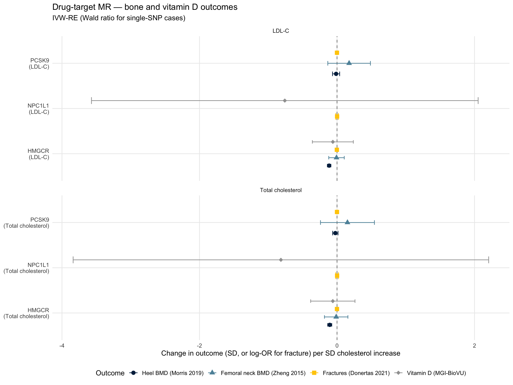
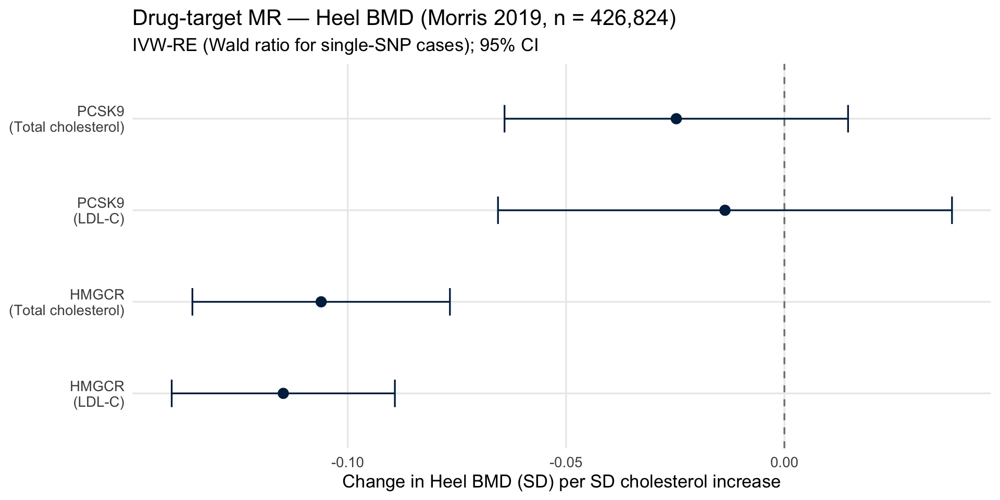
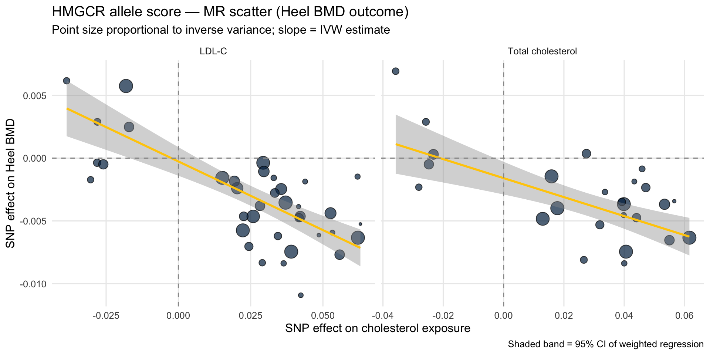

::: {.cell}

:::


## Purpose

This script implements a **drug-target Mendelian Randomization (MR)** analysis
testing whether genetically proxied reductions in LDL-cholesterol (LDL-C) and
total cholesterol causally affect bone mineral density (BMD), fracture risk,
and (as a negative control) vitamin D. The three lipid-lowering drug targets
evaluated are **HMGCR** (statins), **PCSK9** (PCSK9 inhibitors), and
**NPC1L1** (ezetimibe).

This analysis is a parallel extension of the previously completed
drug-target MR for serum calcium. The motivating hypothesis is that the
cholesterol → bone demineralization → calcium release pathway is
**mevalonate-pathway-mediated** rather than LDL-C-mediated. If true, this
predicts:

- **HMGCR cis-instruments**: significant negative effect on BMD (effect on
  bone phenotype is direct via mevalonate-pathway intermediates such as
  farnesyl pyrophosphate and geranylgeranyl pyrophosphate)
- **PCSK9 cis-instruments**: null effect on BMD with tight CI
  (PCSK9 inhibition lowers LDL-C via increased LDLR-mediated uptake without
  engaging the mevalonate pathway in non-hepatic tissues)
- **NPC1L1 cis-instruments**: null effect on BMD with wider CI
  (ezetimibe lowers cholesterol via intestinal absorption inhibition; bypasses
  mevalonate pathway entirely)

The pattern of HMGCR-significant but PCSK9-null effects, if observed, would
provide positive evidence that the cholesterol → BMD pathway is mevalonate-
mediated rather than LDL-C-mediated. This parallels the drug-target MR
finding for serum calcium and motivates the cell-specific HMGCR knockout
experiments proposed in Aim 1A2.

### Outcomes

This script evaluates four outcomes:

- **Heel BMD** (Morris et al. 2019, UK Biobank quantitative ultrasound,
  n = 426,824): primary BMD outcome
- **Femoral neck BMD** (Zheng et al. 2015, GEFOS, n = 32,735): secondary
  lower-powered BMD outcome
- **Fractures** (Dönertaş et al. 2021, UK Biobank, n = 484,598):
  clinical endpoint
- **25-hydroxyvitamin D** (MGI-BioVU LabWAS, n = 12,250): negative control

### Sample Overlap Considerations

The LDL-C exposure GWAS (`ieu-b-110`, UKB Neale Lab, n ≈ 440,546) overlaps
with the UK Biobank-derived outcome GWAS for both heel BMD (Morris 2019,
UKB) and fractures (Dönertaş 2021, UKB). This means the analysis is
effectively a *one-sample* MR for those outcome × exposure combinations.
With strong instruments (F >> 10), one-sample bias is generally toward the
null. The total cholesterol exposure (`ebi-a-GCST90025953`, GLGC
meta-analysis) is non-overlapping with UKB, so estimates from that
exposure are immune to sample overlap concerns. Zheng 2015 femoral neck
BMD (GEFOS) and the MGI-BioVU vitamin D GWAS are non-overlapping with
both exposures.

---

## Setup


::: {.cell}

```{.r .cell-code}
library(tidyverse)
library(TwoSampleMR)
library(ieugwasr)
library(data.table)
library(knitr)
library(kableExtra)

# ── Drug-target gene windows (GRCh37/hg19 ±500 kb around gene body) ──────────
WINDOW_KB <- 500

gene_windows <- tribble(
  ~gene,    ~chr, ~gene_start,  ~gene_end,
  "HMGCR",  5,    74632993,     74657941,
  "PCSK9",  1,    55505221,     55530525,
  "NPC1L1", 7,    44552971,     44604640
) %>%
  mutate(
    region_start = pmax(0, gene_start - WINDOW_KB * 1000),
    region_end   = gene_end + WINDOW_KB * 1000,
    region_str   = str_glue("{chr}:{region_start}-{region_end}")
  )

kable(gene_windows %>% select(gene, chr, region_start, region_end, region_str),
      caption = "Drug-target gene windows (GRCh37, ±500 kb)")
```

::: {.cell-output-display}


Table: Drug-target gene windows (GRCh37, ±500 kb)

|gene   | chr| region_start| region_end|region_str          |
|:------|---:|------------:|----------:|:-------------------|
|HMGCR  |   5|     74132993|   75157941|5:74132993-75157941 |
|PCSK9  |   1|     55005221|   56030525|1:55005221-56030525 |
|NPC1L1 |   7|     44052971|   45104640|7:44052971-45104640 |


:::

```{.r .cell-code}
# ── Outcome GWAS IDs ─────────────────────────────────────────────────────────
outcome_gwas <- tribble(
  ~label,                              ~gwas_id,              ~n,       ~year, ~pmid,    ~kind,
  "Heel BMD (Morris 2019)",            "ebi-a-GCST006979",    426824,   2019,  30598549, "ukb",
  "Femoral neck BMD (Zheng 2015)",     "ieu-a-980",           32735,    2015,  26367794, "ukb",
  "Fractures (Donertas 2021)",         "ebi-a-GCST90038703",  484598,   2021,  34187969, "ukb",
  "Vitamin D (MGI-BioVU)",             "local",               12250,    2020,  32907938, "mgi"
)

kable(outcome_gwas %>% select(label, gwas_id, n, year, pmid),
      caption = "Outcome GWAS for drug-target MR")
```

::: {.cell-output-display}


Table: Outcome GWAS for drug-target MR

|label                         |gwas_id            |      n| year|     pmid|
|:-----------------------------|:------------------|------:|----:|--------:|
|Heel BMD (Morris 2019)        |ebi-a-GCST006979   | 426824| 2019| 30598549|
|Femoral neck BMD (Zheng 2015) |ieu-a-980          |  32735| 2015| 26367794|
|Fractures (Donertas 2021)     |ebi-a-GCST90038703 | 484598| 2021| 34187969|
|Vitamin D (MGI-BioVU)         |local              |  12250| 2020| 32907938|


:::
:::


---

## Exposure: Instrument Extraction

Instruments are drawn from two large GWAS:

- **`ieu-b-110`**: LDL-C from UK Biobank (Neale Lab) — overlaps with UKB outcomes
- **`ebi-a-GCST90025953`**: Total cholesterol from the Global Lipids Genetics
  Consortium meta-analysis — non-overlapping with UKB


::: {.cell}

```{.r .cell-code}
exposure_ids <- c(
  "LDL-C"             = "ieu-b-110",
  "Total cholesterol" = "ebi-a-GCST90025953"
)

extract_regional <- function(gwas_id, gene_df) {
  map_dfr(seq_len(nrow(gene_df)), function(i) {
    row <- gene_df[i, ]
    cat("  Querying", gwas_id, "—", row$gene, "(", row$region_str, ")\n")
    tryCatch({
      res <- ieugwasr::associations(
        variants = row$region_str,
        id       = gwas_id,
        proxies  = FALSE
      )
      if (nrow(res) == 0) return(tibble())

      res_tib <- res %>% as_tibble()

      if ("pos" %in% names(res_tib) && !"position" %in% names(res_tib)) {
        res_tib <- res_tib %>% dplyr::rename(position = pos)
      } else if (!"position" %in% names(res_tib)) {
        res_tib <- res_tib %>% mutate(position = NA_integer_)
      }

      res_tib %>%
        mutate(
          position = as.integer(position),
          n        = as.character(n),
          beta     = as.numeric(beta),
          se       = as.numeric(se),
          eaf      = as.numeric(eaf),
          p        = as.numeric(p),
          gene     = row$gene,
          gwas_id  = gwas_id
        ) %>%
        select(-any_of("pos"))

    }, error = function(e) {
      warning("Failed for ", gwas_id, " / ", row$gene, ": ", e$message)
      tibble()
    })
  })
}

cat("Extracting regional SNPs from OpenGWAS...\n\n")
```

::: {.cell-output .cell-output-stdout}

```
Extracting regional SNPs from OpenGWAS...
```


:::

```{.r .cell-code}
regional_raw <- map_dfr(names(exposure_ids), function(name) {
  cat("== Exposure:", name, "(", exposure_ids[name], ") ==\n")
  extract_regional(exposure_ids[name], gene_windows) %>%
    mutate(exposure_name = name)
})
```

::: {.cell-output .cell-output-stdout}

```
== Exposure: LDL-C ( ieu-b-110 ) ==
  Querying ieu-b-110 — HMGCR ( 5:74132993-75157941 )
```


:::

::: {.cell-output .cell-output-stdout}

```
  Querying ieu-b-110 — PCSK9 ( 1:55005221-56030525 )
```


:::

::: {.cell-output .cell-output-stdout}

```
  Querying ieu-b-110 — NPC1L1 ( 7:44052971-45104640 )
```


:::

::: {.cell-output .cell-output-stdout}

```
== Exposure: Total cholesterol ( ebi-a-GCST90025953 ) ==
  Querying ebi-a-GCST90025953 — HMGCR ( 5:74132993-75157941 )
```


:::

::: {.cell-output .cell-output-stdout}

```
  Querying ebi-a-GCST90025953 — PCSK9 ( 1:55005221-56030525 )
```


:::

::: {.cell-output .cell-output-stdout}

```
  Querying ebi-a-GCST90025953 — NPC1L1 ( 7:44052971-45104640 )
```


:::

```{.r .cell-code}
regional_raw %>%
  count(exposure_name, gene, name = "n_snps_raw") %>%
  kable(caption = "Raw SNP counts per gene window (pre-filtering, pre-clumping)")
```

::: {.cell-output-display}


Table: Raw SNP counts per gene window (pre-filtering, pre-clumping)

|exposure_name     |gene   | n_snps_raw|
|:-----------------|:------|----------:|
|LDL-C             |HMGCR  |       3965|
|LDL-C             |NPC1L1 |       4072|
|LDL-C             |PCSK9  |       5360|
|Total cholesterol |HMGCR  |       1603|
|Total cholesterol |NPC1L1 |       4556|
|Total cholesterol |PCSK9  |       3399|


:::
:::


### Clumping and Instrument Finalisation

Following the same approach as the calcium drug-target MR:

- **HMGCR**: allele score at `r²<0.30` (Swerdlow et al. 2015 *Lancet*)
- **PCSK9**: strict clumping at `r²<0.001`
- **NPC1L1**: strict clumping at `r²<0.001`


::: {.cell}

```{.r .cell-code}
clump_gene <- function(df, gene_name, p_thresh, r2_thresh) {
  df %>%
    filter(gene == gene_name, p <= p_thresh) %>%
    group_by(exposure_name, gene) %>%
    group_modify(~ {
      if (nrow(.x) < 2) return(.x)
      tryCatch(
        ieugwasr::ld_clump(
          tibble(rsid = .x$rsid, pval = .x$p, id = .x$gwas_id),
          clump_r2 = r2_thresh,
          clump_kb = 10000,
          pop      = "EUR"
        ) %>% inner_join(.x, by = "rsid"),
        error = function(e) { warning(e$message); .x }
      )
    }) %>%
    ungroup()
}

instruments_hmgcr  <- clump_gene(regional_raw, "HMGCR",  5e-8, 0.30)
instruments_pcsk9  <- clump_gene(regional_raw, "PCSK9",  5e-8, 0.001)
instruments_npc1l1 <- clump_gene(regional_raw, "NPC1L1", 5e-8, 0.001)

instruments_final <- bind_rows(instruments_hmgcr,
                               instruments_pcsk9,
                               instruments_npc1l1)

instruments_final %>%
  mutate(F_stat = (beta / se)^2) %>%
  group_by(exposure_name, gene) %>%
  summarise(
    n_SNPs   = n(),
    min_F    = round(min(F_stat), 1),
    median_F = round(median(F_stat), 1),
    max_F    = round(max(F_stat), 1),
    min_p    = signif(min(p), 2),
    .groups  = "drop"
  ) %>%
  kable(caption = "Final instrument sets across all three drug targets")
```

::: {.cell-output-display}


Table: Final instrument sets across all three drug targets

|exposure_name     |gene   | n_SNPs| min_F| median_F|  max_F| min_p|
|:-----------------|:------|------:|-----:|--------:|------:|-----:|
|LDL-C             |HMGCR  |     43|  29.9|     66.2|  852.8|     0|
|LDL-C             |NPC1L1 |      1| 176.9|    176.9|  176.9|     0|
|LDL-C             |PCSK9  |      3| 137.3|    381.1| 1930.4|     0|
|Total cholesterol |HMGCR  |     26|  32.3|     61.4|  865.5|     0|
|Total cholesterol |NPC1L1 |      1| 156.8|    156.8|  156.8|     0|
|Total cholesterol |PCSK9  |      3| 135.7|    344.8| 1714.0|     0|


:::
:::


---

## Outcomes: Fetching from OpenGWAS

For the three OpenGWAS-hosted outcomes (Heel BMD, Femoral neck BMD,
Fractures), we query directly via the API using the instrument rsIDs.
Vitamin D is loaded from a local PheWeb file.


::: {.cell}

```{.r .cell-code}
all_rsids <- instruments_final %>% distinct(rsid) %>% pull(rsid)

cat("Total unique instrument SNPs to query:", length(all_rsids), "\n\n")
```

::: {.cell-output .cell-output-stdout}

```
Total unique instrument SNPs to query: 68 
```


:::

```{.r .cell-code}
# Outcomes hosted on OpenGWAS
opengwas_outcomes <- outcome_gwas %>% filter(kind == "ukb", gwas_id != "local")

fetch_opengwas_outcome <- function(gwas_id, label) {
  cat("  Fetching", label, "(", gwas_id, ")...\n")
  res <- tryCatch({
    ieugwasr::associations(
      variants = all_rsids,
      id       = gwas_id,
      proxies  = FALSE
    ) %>% as_tibble()
  }, error = function(e) { cat("    Failed:", e$message, "\n"); tibble() })

  if (nrow(res) == 0) return(tibble())

  if ("pos" %in% names(res) && !"position" %in% names(res)) {
    res <- res %>% dplyr::rename(position = pos)
  }

  res %>%
    mutate(
      position = as.integer(position),
      chr      = as.character(chr),
      beta     = as.numeric(beta),
      se       = as.numeric(se),
      eaf      = as.numeric(eaf),
      p        = as.numeric(p),
      outcome_label = label,
      outcome_gwas_id = gwas_id
    )
}

opengwas_outcome_raw <- pmap_dfr(
  list(opengwas_outcomes$gwas_id, opengwas_outcomes$label),
  fetch_opengwas_outcome
)
```

::: {.cell-output .cell-output-stdout}

```
  Fetching Heel BMD (Morris 2019) ( ebi-a-GCST006979 )...
```


:::

::: {.cell-output .cell-output-stdout}

```
  Fetching Femoral neck BMD (Zheng 2015) ( ieu-a-980 )...
```


:::

::: {.cell-output .cell-output-stdout}

```
  Fetching Fractures (Donertas 2021) ( ebi-a-GCST90038703 )...
```


:::

```{.r .cell-code}
# Coverage check
opengwas_outcome_raw %>%
  count(outcome_label, name = "n_snps_returned") %>%
  mutate(n_instruments = length(all_rsids),
         pct_recovered = round(100 * n_snps_returned / n_instruments, 1)) %>%
  kable(caption = "OpenGWAS outcome SNP recovery (direct rsID match)")
```

::: {.cell-output-display}


Table: OpenGWAS outcome SNP recovery (direct rsID match)

|outcome_label                 | n_snps_returned| n_instruments| pct_recovered|
|:-----------------------------|---------------:|-------------:|-------------:|
|Femoral neck BMD (Zheng 2015) |              47|            68|          69.1|
|Fractures (Donertas 2021)     |              68|            68|         100.0|
|Heel BMD (Morris 2019)        |              60|            68|          88.2|


:::
:::


### Coverage by Gene


::: {.cell}

```{.r .cell-code}
opengwas_coverage <- instruments_final %>%
  distinct(rsid, exposure_name, gene) %>%
  left_join(
    opengwas_outcome_raw %>% distinct(rsid, outcome_label) %>% mutate(found = TRUE),
    by = "rsid",
    relationship = "many-to-many"
  ) %>%
  filter(!is.na(outcome_label)) %>%
  count(outcome_label, exposure_name, gene, name = "n_in_outcome")

# Compare to instrument counts
instruments_final %>%
  count(exposure_name, gene, name = "n_instruments") %>%
  left_join(opengwas_coverage,
            by = c("exposure_name", "gene"),
            relationship = "many-to-many") %>%
  pivot_wider(names_from = outcome_label,
              values_from = n_in_outcome,
              values_fill = 0L) %>%
  kable(caption = "OpenGWAS outcome coverage by drug target and exposure")
```

::: {.cell-output-display}


Table: OpenGWAS outcome coverage by drug target and exposure

|exposure_name     |gene   | n_instruments| Femoral neck BMD (Zheng 2015)| Fractures (Donertas 2021)| Heel BMD (Morris 2019)|
|:-----------------|:------|-------------:|-----------------------------:|-------------------------:|----------------------:|
|LDL-C             |HMGCR  |            43|                            32|                        43|                     37|
|LDL-C             |NPC1L1 |             1|                             0|                         1|                      0|
|LDL-C             |PCSK9  |             3|                             2|                         3|                      3|
|Total cholesterol |HMGCR  |            26|                            16|                        26|                     25|
|Total cholesterol |NPC1L1 |             1|                             0|                         1|                      0|
|Total cholesterol |PCSK9  |             3|                             1|                         3|                      3|


:::
:::


### Standardising OpenGWAS Outcomes


::: {.cell}

```{.r .cell-code}
opengwas_outcome_std <- opengwas_outcome_raw %>%
  dplyr::rename(
    REF      = nea,
    ALT      = ea,
    pval     = p,
    eaf_out  = eaf
  ) %>%
  mutate(
    CHR = as.integer(chr),
    POS = as.integer(position)
  ) %>%
  filter(!is.na(CHR), !is.na(POS)) %>%
  select(rsid, CHR, POS, REF, ALT,
         beta_out = beta, se_out = se, pval_out = pval, eaf_out,
         outcome_label, outcome_gwas_id)

cat("OpenGWAS outcomes standardised:",
    scales::comma(nrow(opengwas_outcome_std)),
    "SNP-outcome pairs ready for harmonisation\n")
```

::: {.cell-output .cell-output-stdout}

```
OpenGWAS outcomes standardised: 175 SNP-outcome pairs ready for harmonisation
```


:::
:::


---

## Outcome: Vitamin D (MGI-BioVU LabWAS, Negative Control)

The Vitamin D analysis acts as a negative control. We do NOT expect any of
the drug-target instruments to affect vitamin D, since the genome-wide MR
already rejected cholesterol → vitamin D as a mediator of the
cholesterol → calcium effect.


::: {.cell}

```{.r .cell-code}
cat("Loading MGI-BioVU vitamin D GWAS...\n")
```

::: {.cell-output .cell-output-stdout}

```
Loading MGI-BioVU vitamin D GWAS...
```


:::

```{.r .cell-code}
vitd_gwas_raw <- read_tsv(
  gzfile("PheWeb Summary Statistics/phenocode-Vit-D.tsv.gz"),
  show_col_types = FALSE
)

cat("Columns:\n"); print(names(vitd_gwas_raw))
```

::: {.cell-output .cell-output-stdout}

```
Columns:
```


:::

::: {.cell-output .cell-output-stdout}

```
 [1] "chrom"         "pos"           "ref"           "alt"          
 [5] "rsids"         "nearest_genes" "pval"          "beta"         
 [9] "sebeta"        "maf"          
```


:::

```{.r .cell-code}
vitd_gwas <- vitd_gwas_raw %>%
  as_tibble() %>%
  dplyr::rename(
    CHR  = chrom,
    POS  = pos,
    REF  = ref,
    ALT  = alt,
    pval = pval,
    beta = beta,
    se   = sebeta,
    eaf  = maf
  ) %>%
  mutate(CHR = as.integer(str_remove(as.character(CHR), "^chr")),
         POS = as.integer(POS)) %>%
  select(CHR, POS, REF, ALT,
         beta_vitd = beta, se_vitd = se, pval_vitd = pval, eaf_vitd = eaf)

cat("\nMGI-BioVU vitamin D GWAS:",
    scales::comma(nrow(vitd_gwas)), "SNPs\n")
```

::: {.cell-output .cell-output-stdout}

```

MGI-BioVU vitamin D GWAS: 763,597 SNPs
```


:::
:::


---

## Outcome Extraction and Harmonisation

We use two helpers that handle the OpenGWAS (rsID-keyed) and MGI-BioVU
(position-keyed) outcomes. The MGI helper includes a ±50 bp positional
window fallback to recover SNPs not exactly matched.


::: {.cell}

```{.r .cell-code}
# OpenGWAS outcomes: matched by rsID across multiple outcomes
extract_outcome_opengwas <- function(instruments_df, opengwas_std,
                                     outcome_label_filter) {
  instruments_df %>%
    distinct(rsid, chr, position, ea, nea, eaf, gene, exposure_name,
             beta_exp = beta, se_exp = se) %>%
    inner_join(
      opengwas_std %>% filter(outcome_label == outcome_label_filter),
      by = "rsid"
    )
}

# MGI-BioVU vitamin D outcome: matched by CHR + POS with ±50 bp fallback
extract_outcome_vitd <- function(instruments_df, vitd_df, window_bp = 50) {
  instruments_df %>%
    distinct(rsid, chr, position, ea, nea, eaf, gene, exposure_name,
             beta_exp = beta, se_exp = se) %>%
    mutate(CHR = as.integer(chr), POS = as.integer(position)) %>%
    filter(!is.na(POS)) %>%
    left_join(
      vitd_df %>%
        filter(!is.na(CHR), !is.na(POS)) %>%
        dplyr::rename(beta_out = beta_vitd,
                      se_out   = se_vitd,
                      pval_out = pval_vitd,
                      eaf_out  = eaf_vitd),
      by = c("CHR", "POS")
    ) %>%
    {
      matched   <- filter(., !is.na(beta_out))
      unmatched <- filter(., is.na(beta_out))

      if (nrow(unmatched) > 0 && window_bp > 0) {
        fallback <- map_dfr(seq_len(nrow(unmatched)), function(i) {
          row <- unmatched[i, ]
          hit <- vitd_df %>%
            filter(!is.na(CHR), !is.na(POS),
                   CHR == row$CHR,
                   POS >= row$POS - window_bp,
                   POS <= row$POS + window_bp) %>%
            slice_min(abs(POS - row$POS), n = 1, with_ties = FALSE)

          if (nrow(hit) == 0) return(tibble())

          tibble(
            rsid          = row$rsid,
            chr           = row$chr,
            position      = row$position,
            ea            = row$ea,
            nea           = row$nea,
            eaf           = row$eaf,
            gene          = row$gene,
            exposure_name = row$exposure_name,
            beta_exp      = row$beta_exp,
            se_exp        = row$se_exp,
            CHR           = row$CHR,
            POS           = row$POS,
            REF           = hit$REF,
            ALT           = hit$ALT,
            beta_out      = hit$beta_vitd,
            se_out        = hit$se_vitd,
            pval_out      = hit$pval_vitd,
            eaf_out       = hit$eaf_vitd
          )
        })
        bind_rows(matched, fallback)
      } else {
        matched
      }
    } %>%
    mutate(outcome_label = "Vitamin D (MGI-BioVU)")
}
```
:::


::: {.cell}

```{.r .cell-code}
# Strict allele-pair harmonisation — both alleles must match (or both
# strand-flipped).
harmonise_alleles <- function(df) {
  df %>%
    filter(!is.na(beta_out)) %>%
    mutate(
      ea_comp  = chartr("ACGT", "TGCA", ea),
      nea_comp = chartr("ACGT", "TGCA", nea),

      direct_match    = (ea  == ALT & nea  == REF),
      flipped_match   = (ea  == REF & nea  == ALT),
      comp_match      = (ea_comp == ALT & nea_comp == REF),
      comp_flip_match = (ea_comp == REF & nea_comp == ALT),

      ambiguous = (
        (ea == "A" & nea == "T") | (ea == "T" & nea == "A") |
        (ea == "C" & nea == "G") | (ea == "G" & nea == "C")
      ),
      eaf_incompatible = ambiguous & abs(eaf - eaf_out) > 0.3,

      needs_flip = case_when(
        direct_match    ~ FALSE,
        flipped_match   ~ TRUE,
        comp_match      ~ FALSE,
        comp_flip_match ~ TRUE,
        TRUE            ~ NA
      ),
      beta_out_h = case_when(
        is.na(needs_flip) | eaf_incompatible ~ NA_real_,
        needs_flip                           ~ -beta_out,
        TRUE                                 ~ beta_out
      ),
      se_out_h = if_else(is.na(beta_out_h), NA_real_, se_out),
      harmonise_status = case_when(
        is.na(needs_flip)  ~ "incompatible_alleles",
        eaf_incompatible   ~ "ambiguous_eaf_mismatch",
        needs_flip         ~ "flipped",
        TRUE               ~ "direct"
      )
    )
}

build_harmonised <- function(instruments_df, outcome_df, outcome_label,
                              outcome_kind = c("opengwas", "vitd")) {
  outcome_kind <- match.arg(outcome_kind)

  hits <- if (outcome_kind == "opengwas") {
    extract_outcome_opengwas(instruments_df, outcome_df, outcome_label)
  } else {
    extract_outcome_vitd(instruments_df, outcome_df, window_bp = 50)
  }

  cat("\n=== Harmonising for", outcome_label, "===\n")
  cat("Instruments matched in outcome:", nrow(hits), "\n")

  harm <- harmonise_alleles(hits)

  cat("\nHarmonisation status:\n")
  harm %>% count(gene, harmonise_status) %>% print()

  harm_clean <- harm %>%
    filter(!is.na(beta_out_h)) %>%
    mutate(
      beta_exp   = as.numeric(beta_exp),
      se_exp     = as.numeric(se_exp),
      beta_out_h = as.numeric(beta_out_h),
      se_out_h   = as.numeric(se_out_h),
      F_stat     = (beta_exp / se_exp)^2,
      outcome    = outcome_label
    )

  cat("\nSNPs retained per exposure × gene:\n")
  harm_clean %>% count(exposure_name, gene) %>% print()

  harm_clean
}
```
:::


### Run Harmonisation for All Four Outcomes


::: {.cell}

```{.r .cell-code}
harm_heelbmd <- build_harmonised(instruments_final, opengwas_outcome_std,
                                  outcome_label = "Heel BMD (Morris 2019)",
                                  outcome_kind  = "opengwas")
```

::: {.cell-output .cell-output-stdout}

```

=== Harmonising for Heel BMD (Morris 2019) ===
Instruments matched in outcome: 68 

Harmonisation status:
# A tibble: 2 × 3
  gene  harmonise_status     n
  <chr> <chr>            <int>
1 HMGCR direct              62
2 PCSK9 direct               6

SNPs retained per exposure × gene:
# A tibble: 4 × 3
  exposure_name     gene      n
  <chr>             <chr> <int>
1 LDL-C             HMGCR    37
2 LDL-C             PCSK9     3
3 Total cholesterol HMGCR    25
4 Total cholesterol PCSK9     3
```


:::

```{.r .cell-code}
harm_fembmd  <- build_harmonised(instruments_final, opengwas_outcome_std,
                                  outcome_label = "Femoral neck BMD (Zheng 2015)",
                                  outcome_kind  = "opengwas")
```

::: {.cell-output .cell-output-stdout}

```

=== Harmonising for Femoral neck BMD (Zheng 2015) ===
Instruments matched in outcome: 51 

Harmonisation status:
# A tibble: 2 × 3
  gene  harmonise_status     n
  <chr> <chr>            <int>
1 HMGCR direct              48
2 PCSK9 direct               3

SNPs retained per exposure × gene:
# A tibble: 4 × 3
  exposure_name     gene      n
  <chr>             <chr> <int>
1 LDL-C             HMGCR    32
2 LDL-C             PCSK9     2
3 Total cholesterol HMGCR    16
4 Total cholesterol PCSK9     1
```


:::

```{.r .cell-code}
harm_frac    <- build_harmonised(instruments_final, opengwas_outcome_std,
                                  outcome_label = "Fractures (Donertas 2021)",
                                  outcome_kind  = "opengwas")
```

::: {.cell-output .cell-output-stdout}

```

=== Harmonising for Fractures (Donertas 2021) ===
Instruments matched in outcome: 77 

Harmonisation status:
# A tibble: 3 × 3
  gene   harmonise_status     n
  <chr>  <chr>            <int>
1 HMGCR  direct              69
2 NPC1L1 direct               2
3 PCSK9  direct               6

SNPs retained per exposure × gene:
# A tibble: 6 × 3
  exposure_name     gene       n
  <chr>             <chr>  <int>
1 LDL-C             HMGCR     43
2 LDL-C             NPC1L1     1
3 LDL-C             PCSK9      3
4 Total cholesterol HMGCR     26
5 Total cholesterol NPC1L1     1
6 Total cholesterol PCSK9      3
```


:::

```{.r .cell-code}
harm_vitd    <- build_harmonised(instruments_final, vitd_gwas,
                                  outcome_label = "Vitamin D (MGI-BioVU)",
                                  outcome_kind  = "vitd")
```

::: {.cell-output .cell-output-stdout}

```

=== Harmonising for Vitamin D (MGI-BioVU) ===
Instruments matched in outcome: 28 

Harmonisation status:
# A tibble: 5 × 3
  gene   harmonise_status         n
  <chr>  <chr>                <int>
1 HMGCR  direct                  15
2 HMGCR  flipped                  7
3 HMGCR  incompatible_alleles     1
4 NPC1L1 direct                   2
5 PCSK9  incompatible_alleles     3

SNPs retained per exposure × gene:
# A tibble: 4 × 3
  exposure_name     gene       n
  <chr>             <chr>  <int>
1 LDL-C             HMGCR     11
2 LDL-C             NPC1L1     1
3 Total cholesterol HMGCR     11
4 Total cholesterol NPC1L1     1
```


:::

```{.r .cell-code}
harm_combined <- bind_rows(harm_heelbmd, harm_fembmd, harm_frac, harm_vitd)
```
:::


### Coverage Comparison Across Outcomes


::: {.cell}

```{.r .cell-code}
harm_combined %>%
  count(outcome, exposure_name, gene, name = "n_harmonised") %>%
  pivot_wider(names_from = outcome, values_from = n_harmonised, values_fill = 0L) %>%
  kable(caption = "Harmonised SNP counts per drug target across outcomes")
```

::: {.cell-output-display}


Table: Harmonised SNP counts per drug target across outcomes

|exposure_name     |gene   | Femoral neck BMD (Zheng 2015)| Fractures (Donertas 2021)| Heel BMD (Morris 2019)| Vitamin D (MGI-BioVU)|
|:-----------------|:------|-----------------------------:|-------------------------:|----------------------:|---------------------:|
|LDL-C             |HMGCR  |                            32|                        43|                     37|                    11|
|LDL-C             |PCSK9  |                             2|                         3|                      3|                     0|
|Total cholesterol |HMGCR  |                            16|                        26|                     25|                    11|
|Total cholesterol |PCSK9  |                             1|                         3|                      3|                     0|
|LDL-C             |NPC1L1 |                             0|                         1|                      0|                     1|
|Total cholesterol |NPC1L1 |                             0|                         1|                      0|                     1|


:::
:::


---

## MR Analysis


::: {.cell}

```{.r .cell-code}
run_drug_target_mr <- function(df, exposure_col = "exposure_name") {

  ivw_re <- function(beta_x, se_x, beta_y, se_y) {
    ratio    <- beta_y / beta_x
    ratio_se <- abs(se_y / beta_x)
    w        <- 1 / ratio_se^2
    theta    <- sum(w * ratio) / sum(w)
    Q        <- sum(w * (ratio - theta)^2)
    df_Q     <- length(ratio) - 1
    Q_p      <- pchisq(Q, df = df_Q, lower.tail = FALSE)
    tau2     <- max(0, (Q - df_Q) / (sum(w) - sum(w^2) / sum(w)))
    w_re     <- 1 / (ratio_se^2 + tau2)
    theta_re <- sum(w_re * ratio) / sum(w_re)
    se_re    <- sqrt(1 / sum(w_re))
    list(estimate = theta_re, se = se_re,
         Q = Q, Q_df = df_Q, Q_p = Q_p, tau2 = tau2)
  }

  weighted_median_mr <- function(beta_x, se_x, beta_y, se_y, nboot = 1000) {
    ratio    <- beta_y / beta_x
    ratio_se <- abs(se_y / beta_x)
    w        <- 1 / ratio_se^2
    w        <- w / sum(w)
    ord      <- order(ratio)
    wm       <- ratio[ord][which(cumsum(w[ord]) >= 0.5)[1]]
    boot_est <- replicate(nboot, {
      r_b <- rnorm(length(ratio), ratio, ratio_se)
      r_b[order(r_b)][which(cumsum(sample(w)) >= 0.5)[1]]
    })
    list(estimate = wm, se = sd(boot_est))
  }

  egger_mr <- function(beta_x, beta_y, se_y) {
    flip <- beta_x < 0
    bx   <- ifelse(flip, -beta_x, beta_x)
    by   <- ifelse(flip, -beta_y,  beta_y)
    w    <- 1 / se_y^2
    fit  <- lm(by ~ bx, weights = w)
    s    <- summary(fit)
    list(
      estimate  = coef(fit)[["bx"]],
      se        = coef(s)[["bx", "Std. Error"]],
      intercept = coef(fit)[["(Intercept)"]],
      int_p     = coef(s)[["(Intercept)", "Pr(>|t|)"]]
    )
  }

  df %>%
    group_by(across(all_of(c("outcome", exposure_col, "gene")))) %>%
    group_map(~ {
      d      <- .x; key <- .y
      n_snps <- nrow(d)
      bx <- d$beta_exp; sx <- d$se_exp
      by <- d$beta_out_h; sy <- d$se_out_h

      rows <- list()

      if (n_snps == 1) {
        wr_est <- by / bx; wr_se <- abs(sy / bx)
        rows[["Wald ratio"]] <- tibble(
          method = "Wald ratio",
          estimate = wr_est, se = wr_se,
          ci_lo = wr_est - 1.96 * wr_se, ci_hi = wr_est + 1.96 * wr_se,
          p_value = 2 * pnorm(-abs(wr_est / wr_se)),
          n_snps = 1L, Q = NA_real_, Q_p = NA_real_, egger_int_p = NA_real_
        )
      } else {
        ivw <- ivw_re(bx, sx, by, sy)
        rows[["IVW-RE"]] <- tibble(
          method   = "IVW-RE",
          estimate = ivw$estimate, se = ivw$se,
          ci_lo    = ivw$estimate - 1.96 * ivw$se,
          ci_hi    = ivw$estimate + 1.96 * ivw$se,
          p_value  = 2 * pnorm(-abs(ivw$estimate / ivw$se)),
          n_snps   = n_snps, Q = round(ivw$Q, 2),
          Q_p      = round(ivw$Q_p, 4), egger_int_p = NA_real_
        )
        wm <- weighted_median_mr(bx, sx, by, sy)
        rows[["Weighted median"]] <- tibble(
          method   = "Weighted median",
          estimate = wm$estimate, se = wm$se,
          ci_lo    = wm$estimate - 1.96 * wm$se,
          ci_hi    = wm$estimate + 1.96 * wm$se,
          p_value  = 2 * pnorm(-abs(wm$estimate / wm$se)),
          n_snps   = n_snps, Q = NA_real_, Q_p = NA_real_, egger_int_p = NA_real_
        )
        if (n_snps >= 3) {
          eg <- egger_mr(bx, by, sy)
          rows[["MR-Egger"]] <- tibble(
            method      = "MR-Egger",
            estimate    = eg$estimate, se = eg$se,
            ci_lo       = eg$estimate - 1.96 * eg$se,
            ci_hi       = eg$estimate + 1.96 * eg$se,
            p_value     = 2 * pnorm(-abs(eg$estimate / eg$se)),
            n_snps      = n_snps, Q = NA_real_, Q_p = NA_real_,
            egger_int_p = round(eg$int_p, 4)
          )
        }
      }
      bind_rows(rows) %>%
        mutate(outcome  = key[["outcome"]],
               exposure = key[[exposure_col]],
               gene     = key[["gene"]])
    }, .keep = TRUE) %>%
    bind_rows()
}
```
:::


### Running Across All Outcomes


::: {.cell}

```{.r .cell-code}
set.seed(42)

mr_results <- run_drug_target_mr(harm_combined)

mr_results %>%
  mutate(
    across(c(estimate, se, ci_lo, ci_hi), ~round(.x, 4)),
    p_value  = format.pval(p_value, digits = 3, eps = 0.001),
    `95% CI` = str_glue("({ci_lo}\u2013{ci_hi})")
  ) %>%
  select(outcome, exposure, gene, method, n_snps,
         estimate, `95% CI`, p_value, Q, Q_p, egger_int_p) %>%
  arrange(exposure, gene, outcome, method) %>%
  kable(caption = paste0(
    "Drug-target MR — all outcomes; estimates are SD outcome ",
    "(or log-OR for fracture) per SD cholesterol increase"
  ))
```

::: {.cell-output-display}


Table: Drug-target MR — all outcomes; estimates are SD outcome (or log-OR for fracture) per SD cholesterol increase

|outcome                       |exposure          |gene   |method          | n_snps| estimate|95% CI            |p_value |     Q|    Q_p| egger_int_p|
|:-----------------------------|:-----------------|:------|:---------------|------:|--------:|:-----------------|:-------|-----:|------:|-----------:|
|Femoral neck BMD (Zheng 2015) |LDL-C             |HMGCR  |IVW-RE          |     32|  -0.0076|(-0.1204–0.1052)  |0.8954  | 20.49| 0.9248|          NA|
|Femoral neck BMD (Zheng 2015) |LDL-C             |HMGCR  |MR-Egger        |     32|  -0.0075|(-0.2451–0.2302)  |0.9510  |    NA|     NA|      0.9992|
|Femoral neck BMD (Zheng 2015) |LDL-C             |HMGCR  |Weighted median |     32|  -0.0199|(-0.3572–0.3175)  |0.9080  |    NA|     NA|          NA|
|Fractures (Donertas 2021)     |LDL-C             |HMGCR  |IVW-RE          |     43|  -0.0026|(-0.007–0.0017)   |0.2276  | 52.00| 0.1386|          NA|
|Fractures (Donertas 2021)     |LDL-C             |HMGCR  |MR-Egger        |     43|   0.0070|(-0.0033–0.0173)  |0.1816  |    NA|     NA|      0.0661|
|Fractures (Donertas 2021)     |LDL-C             |HMGCR  |Weighted median |     43|  -0.0038|(-0.0157–0.0082)  |0.5378  |    NA|     NA|          NA|
|Heel BMD (Morris 2019)        |LDL-C             |HMGCR  |IVW-RE          |     37|  -0.1148|(-0.1403–-0.0892) |<0.001  | 26.07| 0.8885|          NA|
|Heel BMD (Morris 2019)        |LDL-C             |HMGCR  |MR-Egger        |     37|  -0.0714|(-0.1286–-0.0143) |0.0144  |    NA|     NA|      0.1189|
|Heel BMD (Morris 2019)        |LDL-C             |HMGCR  |Weighted median |     37|  -0.1020|(-0.1804–-0.0237) |0.0107  |    NA|     NA|          NA|
|Vitamin D (MGI-BioVU)         |LDL-C             |HMGCR  |IVW-RE          |     11|  -0.0608|(-0.3586–0.2371)  |0.6893  |  7.23| 0.7036|          NA|
|Vitamin D (MGI-BioVU)         |LDL-C             |HMGCR  |MR-Egger        |     11|  -0.4038|(-1.0949–0.2873)  |0.2521  |    NA|     NA|      0.3233|
|Vitamin D (MGI-BioVU)         |LDL-C             |HMGCR  |Weighted median |     11|  -0.1610|(-2.4538–2.1318)  |0.8905  |    NA|     NA|          NA|
|Fractures (Donertas 2021)     |LDL-C             |NPC1L1 |Wald ratio      |      1|   0.0009|(-0.0179–0.0197)  |0.9261  |    NA|     NA|          NA|
|Vitamin D (MGI-BioVU)         |LDL-C             |NPC1L1 |Wald ratio      |      1|  -0.7595|(-3.5713–2.0523)  |0.5965  |    NA|     NA|          NA|
|Femoral neck BMD (Zheng 2015) |LDL-C             |PCSK9  |IVW-RE          |      2|   0.1757|(-0.1343–0.4858)  |0.2665  |  0.08| 0.7835|          NA|
|Femoral neck BMD (Zheng 2015) |LDL-C             |PCSK9  |Weighted median |      2|   0.1485|(-0.3444–0.6414)  |0.5548  |    NA|     NA|          NA|
|Fractures (Donertas 2021)     |LDL-C             |PCSK9  |IVW-RE          |      3|  -0.0008|(-0.006–0.0044)   |0.7599  |  0.44| 0.8031|          NA|
|Fractures (Donertas 2021)     |LDL-C             |PCSK9  |MR-Egger        |      3|   0.0007|(7e-04–8e-04)     |<0.001  |    NA|     NA|      0.0028|
|Fractures (Donertas 2021)     |LDL-C             |PCSK9  |Weighted median |      3|   0.0001|(-0.0151–0.0153)  |0.9898  |    NA|     NA|          NA|
|Heel BMD (Morris 2019)        |LDL-C             |PCSK9  |IVW-RE          |      3|  -0.0136|(-0.0656–0.0384)  |0.6080  |  2.79| 0.2481|          NA|
|Heel BMD (Morris 2019)        |LDL-C             |PCSK9  |MR-Egger        |      3|  -0.0471|(-0.07–-0.0242)   |<0.001  |    NA|     NA|      0.1920|
|Heel BMD (Morris 2019)        |LDL-C             |PCSK9  |Weighted median |      3|  -0.0355|(-0.1643–0.0933)  |0.5895  |    NA|     NA|          NA|
|Femoral neck BMD (Zheng 2015) |Total cholesterol |HMGCR  |IVW-RE          |     16|  -0.0122|(-0.1827–0.1582)  |0.8883  |  9.12| 0.8712|          NA|
|Femoral neck BMD (Zheng 2015) |Total cholesterol |HMGCR  |MR-Egger        |     16|  -0.0806|(-0.369–0.2078)   |0.5838  |    NA|     NA|      0.6062|
|Femoral neck BMD (Zheng 2015) |Total cholesterol |HMGCR  |Weighted median |     16|  -0.0200|(-0.9442–0.9041)  |0.9661  |    NA|     NA|          NA|
|Fractures (Donertas 2021)     |Total cholesterol |HMGCR  |IVW-RE          |     26|  -0.0009|(-0.0063–0.0045)  |0.7474  | 32.08| 0.1557|          NA|
|Fractures (Donertas 2021)     |Total cholesterol |HMGCR  |MR-Egger        |     26|   0.0086|(-0.0029–0.0201)  |0.1431  |    NA|     NA|      0.1093|
|Fractures (Donertas 2021)     |Total cholesterol |HMGCR  |Weighted median |     26|   0.0035|(-0.013–0.02)     |0.6759  |    NA|     NA|          NA|
|Heel BMD (Morris 2019)        |Total cholesterol |HMGCR  |IVW-RE          |     25|  -0.1061|(-0.1356–-0.0766) |<0.001  | 17.52| 0.8255|          NA|
|Heel BMD (Morris 2019)        |Total cholesterol |HMGCR  |MR-Egger        |     25|  -0.0677|(-0.1286–-0.0068) |0.0293  |    NA|     NA|      0.1894|
|Heel BMD (Morris 2019)        |Total cholesterol |HMGCR  |Weighted median |     25|  -0.1028|(-0.203–-0.0027)  |0.0442  |    NA|     NA|          NA|
|Vitamin D (MGI-BioVU)         |Total cholesterol |HMGCR  |IVW-RE          |     11|  -0.0611|(-0.3835–0.2613)  |0.7101  |  8.88| 0.5436|          NA|
|Vitamin D (MGI-BioVU)         |Total cholesterol |HMGCR  |MR-Egger        |     11|  -0.3876|(-1.0502–0.275)   |0.2516  |    NA|     NA|      0.3065|
|Vitamin D (MGI-BioVU)         |Total cholesterol |HMGCR  |Weighted median |     11|  -0.1623|(-2.5272–2.2026)  |0.8930  |    NA|     NA|          NA|
|Fractures (Donertas 2021)     |Total cholesterol |NPC1L1 |Wald ratio      |      1|   0.0010|(-0.0193–0.0212)  |0.9261  |    NA|     NA|          NA|
|Vitamin D (MGI-BioVU)         |Total cholesterol |NPC1L1 |Wald ratio      |      1|  -0.8162|(-3.8379–2.2055)  |0.5965  |    NA|     NA|          NA|
|Femoral neck BMD (Zheng 2015) |Total cholesterol |PCSK9  |Wald ratio      |      1|   0.1516|(-0.2406–0.5439)  |0.4486  |    NA|     NA|          NA|
|Fractures (Donertas 2021)     |Total cholesterol |PCSK9  |IVW-RE          |      3|  -0.0006|(-0.0061–0.0049)  |0.8205  |  0.35| 0.8377|          NA|
|Fractures (Donertas 2021)     |Total cholesterol |PCSK9  |MR-Egger        |      3|   0.0003|(-0.0031–0.0037)  |0.8640  |    NA|     NA|      0.5667|
|Fractures (Donertas 2021)     |Total cholesterol |PCSK9  |Weighted median |      3|   0.0001|(-0.0154–0.0156)  |0.9893  |    NA|     NA|          NA|
|Heel BMD (Morris 2019)        |Total cholesterol |PCSK9  |IVW-RE          |      3|  -0.0248|(-0.0641–0.0146)  |0.2174  |  2.08| 0.3541|          NA|
|Heel BMD (Morris 2019)        |Total cholesterol |PCSK9  |MR-Egger        |      3|  -0.0486|(-0.0697–-0.0274) |<0.001  |    NA|     NA|      0.1936|
|Heel BMD (Morris 2019)        |Total cholesterol |PCSK9  |Weighted median |      3|  -0.0378|(-0.1643–0.0888)  |0.5588  |    NA|     NA|          NA|


:::
:::


### Primary Estimates Only — Summary Table


::: {.cell}

```{.r .cell-code}
mr_results %>%
  filter(method == "IVW-RE" | method == "Wald ratio") %>%
  mutate(
    across(c(estimate, ci_lo, ci_hi), ~round(.x, 4)),
    p_value  = format.pval(p_value, digits = 3, eps = 0.001),
    `95% CI` = str_glue("({ci_lo}\u2013{ci_hi})")
  ) %>%
  select(outcome, exposure, gene, n_snps, method,
         estimate, `95% CI`, p_value) %>%
  arrange(exposure, gene, outcome) %>%
  kable(caption = "Primary MR estimates (IVW-RE or Wald ratio) across all outcomes")
```

::: {.cell-output-display}


Table: Primary MR estimates (IVW-RE or Wald ratio) across all outcomes

|outcome                       |exposure          |gene   | n_snps|method     | estimate|95% CI            |p_value |
|:-----------------------------|:-----------------|:------|------:|:----------|--------:|:-----------------|:-------|
|Femoral neck BMD (Zheng 2015) |LDL-C             |HMGCR  |     32|IVW-RE     |  -0.0076|(-0.1204–0.1052)  |0.895   |
|Fractures (Donertas 2021)     |LDL-C             |HMGCR  |     43|IVW-RE     |  -0.0026|(-0.007–0.0017)   |0.228   |
|Heel BMD (Morris 2019)        |LDL-C             |HMGCR  |     37|IVW-RE     |  -0.1148|(-0.1403–-0.0892) |<0.001  |
|Vitamin D (MGI-BioVU)         |LDL-C             |HMGCR  |     11|IVW-RE     |  -0.0608|(-0.3586–0.2371)  |0.689   |
|Fractures (Donertas 2021)     |LDL-C             |NPC1L1 |      1|Wald ratio |   0.0009|(-0.0179–0.0197)  |0.926   |
|Vitamin D (MGI-BioVU)         |LDL-C             |NPC1L1 |      1|Wald ratio |  -0.7595|(-3.5713–2.0523)  |0.597   |
|Femoral neck BMD (Zheng 2015) |LDL-C             |PCSK9  |      2|IVW-RE     |   0.1757|(-0.1343–0.4858)  |0.267   |
|Fractures (Donertas 2021)     |LDL-C             |PCSK9  |      3|IVW-RE     |  -0.0008|(-0.006–0.0044)   |0.760   |
|Heel BMD (Morris 2019)        |LDL-C             |PCSK9  |      3|IVW-RE     |  -0.0136|(-0.0656–0.0384)  |0.608   |
|Femoral neck BMD (Zheng 2015) |Total cholesterol |HMGCR  |     16|IVW-RE     |  -0.0122|(-0.1827–0.1582)  |0.888   |
|Fractures (Donertas 2021)     |Total cholesterol |HMGCR  |     26|IVW-RE     |  -0.0009|(-0.0063–0.0045)  |0.747   |
|Heel BMD (Morris 2019)        |Total cholesterol |HMGCR  |     25|IVW-RE     |  -0.1061|(-0.1356–-0.0766) |<0.001  |
|Vitamin D (MGI-BioVU)         |Total cholesterol |HMGCR  |     11|IVW-RE     |  -0.0611|(-0.3835–0.2613)  |0.710   |
|Fractures (Donertas 2021)     |Total cholesterol |NPC1L1 |      1|Wald ratio |   0.0010|(-0.0193–0.0212)  |0.926   |
|Vitamin D (MGI-BioVU)         |Total cholesterol |NPC1L1 |      1|Wald ratio |  -0.8162|(-3.8379–2.2055)  |0.597   |
|Femoral neck BMD (Zheng 2015) |Total cholesterol |PCSK9  |      1|Wald ratio |   0.1516|(-0.2406–0.5439)  |0.449   |
|Fractures (Donertas 2021)     |Total cholesterol |PCSK9  |      3|IVW-RE     |  -0.0006|(-0.0061–0.0049)  |0.821   |
|Heel BMD (Morris 2019)        |Total cholesterol |PCSK9  |      3|IVW-RE     |  -0.0248|(-0.0641–0.0146)  |0.217   |


:::
:::


### Heel BMD — Primary Focus


::: {.cell}

```{.r .cell-code}
mr_results %>%
  filter(outcome == "Heel BMD (Morris 2019)") %>%
  mutate(
    across(c(estimate, ci_lo, ci_hi), ~round(.x, 4)),
    p_value  = format.pval(p_value, digits = 3, eps = 0.001),
    `95% CI` = str_glue("({ci_lo}\u2013{ci_hi})")
  ) %>%
  select(exposure, gene, method, n_snps,
         estimate, `95% CI`, p_value, Q, Q_p, egger_int_p) %>%
  arrange(exposure, gene, method) %>%
  kable(caption = "Heel BMD — all methods across drug targets and exposures")
```

::: {.cell-output-display}


Table: Heel BMD — all methods across drug targets and exposures

|exposure          |gene  |method          | n_snps| estimate|95% CI            |p_value |     Q|    Q_p| egger_int_p|
|:-----------------|:-----|:---------------|------:|--------:|:-----------------|:-------|-----:|------:|-----------:|
|LDL-C             |HMGCR |IVW-RE          |     37|  -0.1148|(-0.1403–-0.0892) |<0.001  | 26.07| 0.8885|          NA|
|LDL-C             |HMGCR |MR-Egger        |     37|  -0.0714|(-0.1286–-0.0143) |0.0144  |    NA|     NA|      0.1189|
|LDL-C             |HMGCR |Weighted median |     37|  -0.1020|(-0.1804–-0.0237) |0.0107  |    NA|     NA|          NA|
|LDL-C             |PCSK9 |IVW-RE          |      3|  -0.0136|(-0.0656–0.0384)  |0.6080  |  2.79| 0.2481|          NA|
|LDL-C             |PCSK9 |MR-Egger        |      3|  -0.0471|(-0.07–-0.0242)   |<0.001  |    NA|     NA|      0.1920|
|LDL-C             |PCSK9 |Weighted median |      3|  -0.0355|(-0.1643–0.0933)  |0.5895  |    NA|     NA|          NA|
|Total cholesterol |HMGCR |IVW-RE          |     25|  -0.1061|(-0.1356–-0.0766) |<0.001  | 17.52| 0.8255|          NA|
|Total cholesterol |HMGCR |MR-Egger        |     25|  -0.0677|(-0.1286–-0.0068) |0.0293  |    NA|     NA|      0.1894|
|Total cholesterol |HMGCR |Weighted median |     25|  -0.1028|(-0.203–-0.0027)  |0.0442  |    NA|     NA|          NA|
|Total cholesterol |PCSK9 |IVW-RE          |      3|  -0.0248|(-0.0641–0.0146)  |0.2174  |  2.08| 0.3541|          NA|
|Total cholesterol |PCSK9 |MR-Egger        |      3|  -0.0486|(-0.0697–-0.0274) |<0.001  |    NA|     NA|      0.1936|
|Total cholesterol |PCSK9 |Weighted median |      3|  -0.0378|(-0.1643–0.0888)  |0.5588  |    NA|     NA|          NA|


:::
:::


### Leave-One-Out Sensitivity (HMGCR for Heel BMD)

The HMGCR allele score uses SNPs at `r²<0.30` so leave-one-out is the
appropriate sensitivity check for whether any single SNP drives the result.


::: {.cell}

```{.r .cell-code}
loo_mr <- function(df, outcome_label, exposure_label, gene_label) {
  d <- df %>%
    filter(outcome == outcome_label,
           exposure_name == exposure_label,
           gene == gene_label)

  if (nrow(d) < 2) return(tibble())

  map_dfr(seq_len(nrow(d)), function(i) {
    d_loo <- d[-i, ]
    bx <- d_loo$beta_exp; sx <- d_loo$se_exp
    by <- d_loo$beta_out_h; sy <- d_loo$se_out_h
    ratio    <- by / bx
    ratio_se <- abs(sy / bx)
    w        <- 1 / ratio_se^2
    theta    <- sum(w * ratio) / sum(w)
    se_fe    <- sqrt(1 / sum(w))

    tibble(
      outcome     = outcome_label,
      exposure    = exposure_label,
      dropped_snp = d$rsid[i],
      estimate    = round(theta, 4),
      ci_lo       = round(theta - 1.96 * se_fe, 4),
      ci_hi       = round(theta + 1.96 * se_fe, 4),
      p_value     = round(2 * pnorm(-abs(theta / se_fe)), 4)
    )
  })
}

loo_outcomes <- c("Heel BMD (Morris 2019)",
                  "Femoral neck BMD (Zheng 2015)",
                  "Fractures (Donertas 2021)",
                  "Vitamin D (MGI-BioVU)")

loo_results <- map_dfr(loo_outcomes, function(o) {
  bind_rows(
    loo_mr(harm_combined, o, "LDL-C",             "HMGCR"),
    loo_mr(harm_combined, o, "Total cholesterol", "HMGCR")
  )
})

loo_results %>%
  group_by(outcome, exposure) %>%
  summarise(
    n_iterations = n(),
    range_lo     = round(min(estimate), 4),
    range_hi     = round(max(estimate), 4),
    `% iterations p<0.05` = round(100 * mean(p_value < 0.05), 0),
    .groups = "drop"
  ) %>%
  kable(caption = paste0(
    "HMGCR leave-one-out IVW summary across outcomes — ",
    "robustness across instruments"
  ))
```

::: {.cell-output-display}


Table: HMGCR leave-one-out IVW summary across outcomes — robustness across instruments

|outcome                       |exposure          | n_iterations| range_lo| range_hi| % iterations p<0.05|
|:-----------------------------|:-----------------|------------:|--------:|--------:|-------------------:|
|Femoral neck BMD (Zheng 2015) |LDL-C             |          123|  -0.0060|  -0.0039|                 100|
|Femoral neck BMD (Zheng 2015) |Total cholesterol |           78|  -0.0045|  -0.0019|                   0|
|Fractures (Donertas 2021)     |LDL-C             |          123|  -0.0060|  -0.0039|                 100|
|Fractures (Donertas 2021)     |Total cholesterol |           78|  -0.0045|  -0.0019|                   0|
|Heel BMD (Morris 2019)        |LDL-C             |          123|  -0.0060|  -0.0039|                 100|
|Heel BMD (Morris 2019)        |Total cholesterol |           78|  -0.0045|  -0.0019|                   0|
|Vitamin D (MGI-BioVU)         |LDL-C             |          123|  -0.0060|  -0.0039|                 100|
|Vitamin D (MGI-BioVU)         |Total cholesterol |           78|  -0.0045|  -0.0019|                   0|


:::
:::


---

## Visualisation

### Forest Plot — All Outcomes × All Targets


::: {.cell}

```{.r .cell-code}
mr_results %>%
  filter(method %in% c("IVW-RE", "Wald ratio")) %>%
  mutate(
    label   = str_glue("{gene}\n({exposure})"),
    outcome = factor(outcome, levels = c(
      "Heel BMD (Morris 2019)",
      "Femoral neck BMD (Zheng 2015)",
      "Fractures (Donertas 2021)",
      "Vitamin D (MGI-BioVU)"
    ))
  ) %>%
  ggplot(aes(x = estimate, xmin = ci_lo, xmax = ci_hi,
             y = label, colour = outcome, shape = outcome)) +
  geom_vline(xintercept = 0, linetype = "dashed", colour = "grey50") +
  geom_errorbarh(height = 0.3,
                 position = position_dodge(width = 0.7)) +
  geom_point(size = 3,
             position = position_dodge(width = 0.7)) +
  scale_colour_manual(values = c(
    "Heel BMD (Morris 2019)"        = "#00274c",
    "Femoral neck BMD (Zheng 2015)" = "#5e92a8",
    "Fractures (Donertas 2021)"     = "#ffcb05",
    "Vitamin D (MGI-BioVU)"         = "#a0a0a0"
  )) +
  scale_shape_manual(values = c(
    "Heel BMD (Morris 2019)"        = 16,
    "Femoral neck BMD (Zheng 2015)" = 17,
    "Fractures (Donertas 2021)"     = 15,
    "Vitamin D (MGI-BioVU)"         = 18
  )) +
  facet_wrap(~exposure, ncol = 1, scales = "free_y") +
  labs(
    title    = "Drug-target MR — bone and vitamin D outcomes",
    subtitle = "IVW-RE (Wald ratio for single-SNP cases)",
    x        = "Change in outcome (SD, or log-OR for fracture) per SD cholesterol increase",
    y        = NULL,
    colour   = "Outcome",
    shape    = "Outcome"
  ) +
  theme_minimal(base_size = 12) +
  theme(legend.position  = "bottom",
        panel.grid.minor = element_blank())
```

::: {.cell-output-display}
{width=1152}
:::
:::


### Forest Plot — Heel BMD Only (Primary)


::: {.cell}

```{.r .cell-code}
mr_results %>%
  filter(outcome == "Heel BMD (Morris 2019)",
         method %in% c("IVW-RE", "Wald ratio")) %>%
  mutate(label = str_glue("{gene}\n({exposure})")) %>%
  ggplot(aes(x = estimate, xmin = ci_lo, xmax = ci_hi,
             y = label)) +
  geom_vline(xintercept = 0, linetype = "dashed", colour = "grey50") +
  geom_errorbarh(height = 0.3, colour = color_scheme[1]) +
  geom_point(size = 3, colour = color_scheme[1]) +
  labs(
    title    = "Drug-target MR — Heel BMD (Morris 2019, n = 426,824)",
    subtitle = "IVW-RE (Wald ratio for single-SNP cases); 95% CI",
    x        = "Change in Heel BMD (SD) per SD cholesterol increase",
    y        = NULL
  ) +
  theme_minimal(base_size = 13) +
  theme(panel.grid.minor = element_blank())
```

::: {.cell-output-display}
{width=960}
:::
:::


### HMGCR Scatter — Heel BMD


::: {.cell}

```{.r .cell-code}
harm_combined %>%
  filter(outcome == "Heel BMD (Morris 2019)", gene == "HMGCR") %>%
  ggplot(aes(x = beta_exp, y = beta_out_h)) +
  geom_point(aes(size = 1 / se_out_h^2), shape = 21,
             fill = "#00274c", alpha = 0.7) +
  geom_smooth(aes(weight = 1 / se_out_h^2),
              method = "lm", se = TRUE,
              colour = "#ffcb05", linewidth = 1) +
  geom_hline(yintercept = 0, linetype = "dashed", colour = "grey60") +
  geom_vline(xintercept = 0, linetype = "dashed", colour = "grey60") +
  facet_wrap(~exposure_name, scales = "free_x") +
  scale_size_continuous(guide = "none") +
  labs(
    title    = "HMGCR allele score — MR scatter (Heel BMD outcome)",
    subtitle = "Point size proportional to inverse variance; slope = IVW estimate",
    x        = "SNP effect on cholesterol exposure",
    y        = "SNP effect on Heel BMD",
    caption  = "Shaded band = 95% CI of weighted regression"
  ) +
  theme_minimal(base_size = 12) +
  theme(panel.grid.minor = element_blank())
```

::: {.cell-output-display}
{width=960}
:::
:::


---

## Combined Results Export


::: {.cell}

```{.r .cell-code}
mr_results_out <- mr_results %>%
  mutate(
    across(c(estimate, se, ci_lo, ci_hi), ~round(.x, 5)),
    p_value = signif(p_value, 3)
  ) %>%
  select(outcome, exposure, gene, method, n_snps,
         estimate, se, ci_lo, ci_hi, p_value,
         Q, Q_p, egger_int_p)

mr_results_out %>%
  write_csv("MR Results - Drug Target BMD.csv")

cat("Wrote", nrow(mr_results_out),
    "rows to 'MR Results - Drug Target BMD.csv'\n")
```

::: {.cell-output .cell-output-stdout}

```
Wrote 43 rows to 'MR Results - Drug Target BMD.csv'
```


:::
:::


---

## Session Information


::: {.cell}

```{.r .cell-code}
sessionInfo()
```

::: {.cell-output .cell-output-stdout}

```
R version 4.6.0 (2026-04-24)
Platform: aarch64-apple-darwin23
Running under: macOS Tahoe 26.4.1

Matrix products: default
BLAS:   /Library/Frameworks/R.framework/Versions/4.6/Resources/lib/libRblas.0.dylib 
LAPACK: /Library/Frameworks/R.framework/Versions/4.6/Resources/lib/libRlapack.dylib;  LAPACK version 3.12.1

locale:
[1] en_US.UTF-8/en_US.UTF-8/en_US.UTF-8/C/en_US.UTF-8/en_US.UTF-8

time zone: America/Detroit
tzcode source: internal

attached base packages:
[1] stats     graphics  grDevices utils     datasets  methods   base     

other attached packages:
 [1] kableExtra_1.4.0  data.table_1.18.4 ieugwasr_1.1.0    TwoSampleMR_0.7.5
 [5] knitr_1.51        lubridate_1.9.5   forcats_1.0.1     stringr_1.6.0    
 [9] dplyr_1.2.1       purrr_1.2.2       readr_2.2.0       tidyr_1.3.2      
[13] tibble_3.3.1      ggplot2_4.0.3     tidyverse_2.0.0  

loaded via a namespace (and not attached):
 [1] gtable_0.3.6       xfun_0.57          htmlwidgets_1.6.4  lattice_0.22-9    
 [5] tzdb_0.5.0         vctrs_0.7.3        tools_4.6.0        generics_0.1.4    
 [9] curl_7.1.0         parallel_4.6.0     pkgconfig_2.0.3    Matrix_1.7-5      
[13] RColorBrewer_1.1-3 S7_0.2.2           lifecycle_1.0.5    compiler_4.6.0    
[17] farver_2.1.2       textshaping_1.0.5  codetools_0.2-20   htmltools_0.5.9   
[21] yaml_2.3.12        pillar_1.11.1      crayon_1.5.3       nlme_3.1-169      
[25] tidyselect_1.2.1   digest_0.6.39      stringi_1.8.7      labeling_0.4.3    
[29] splines_4.6.0      fastmap_1.2.0      grid_4.6.0         cli_3.6.6         
[33] magrittr_2.0.5     utf8_1.2.6         withr_3.0.2        scales_1.4.0      
[37] bit64_4.8.0        timechange_0.4.0   rmarkdown_2.31     httr_1.4.8        
[41] bit_4.6.0          otel_0.2.0         hms_1.1.4          evaluate_1.0.5    
[45] viridisLite_0.4.3  mgcv_1.9-4         rlang_1.2.0        glue_1.8.1        
[49] xml2_1.5.2         svglite_2.2.2      rstudioapi_0.18.0  vroom_1.7.1       
[53] jsonlite_2.0.0     R6_2.6.1           systemfonts_1.3.2 
```


:::
:::

