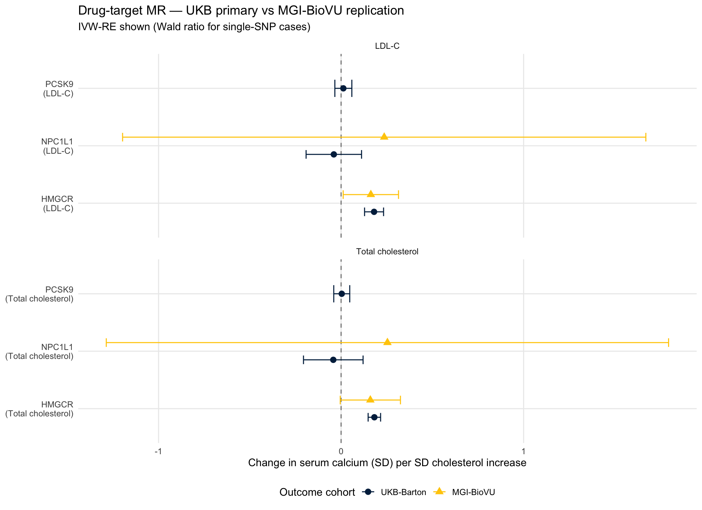
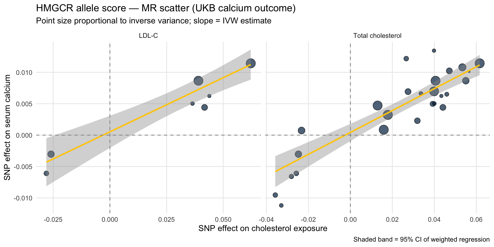

::: {.cell}

:::


## Purpose

This script implements a **drug-target Mendelian Randomization (MR)** analysis
testing whether genetically proxied reductions in LDL-cholesterol (LDL-C) and
total cholesterol causally reduce serum calcium, using the three lipid-lowering
drug targets **HMGCR** (statins), **PCSK9** (PCSK9 inhibitors), and
**NPC1L1** (ezetimibe).

This is a revised version of an earlier analysis. The previous version used
the local MGI-BioVU PheWeb calcium GWAS as the outcome dataset and
encountered substantive coverage problems at the PCSK9 and NPC1L1 loci. This
version replaces the outcome GWAS with the larger, more densely imputed UK
Biobank serum calcium GWAS (Barton et al. 2021, n≈400,000), which provides
adequate coverage at all three drug-target loci. The MGI-BioVU GWAS is
retained as a sensitivity replication for HMGCR.

### Why the Prior Outcome GWAS Did Not Work

The earlier analysis using the MGI-BioVU calcium GWAS as the outcome failed
for two of the three drug targets due to **outcome variant coverage**, not
exposure instrument strength. The exposure GWAS (UKB LDL-C, `ieu-b-110`)
returned thousands of SNPs across all three regions — 1,839 in HMGCR, 348 in
NPC1L1, and ~80 in PCSK9 at p<5×10⁻⁸. The exposure side was never the
bottleneck. The problem was on the outcome side:

- **NPC1L1** (chr7:44.1–44.6 Mb): The MGI-BioVU calcium GWAS had a localised
  imputation gap in this region — ~1,166 SNPs per 5 Mb in the 40–45 Mb bin
  versus ~1,800–1,900 in flanking bins. Of approximately 350 candidate
  instrument positions, **zero** matched a calcium GWAS variant. The single
  SNP that landed within 500 bp of an instrument position was a different
  variant entirely (a T/G SNP at 44,384,273 vs an AT/A insertion-deletion
  instrument at 44,383,921; effect allele frequency 0.036 vs 0.809). This
  precluded any drug-target MR analysis of the ezetimibe target.

- **PCSK9** (chr1:55.5 Mb): The canonical loss-of-function variant
  rs11591147 (p.R46L), which is the workhorse instrument for PCSK9
  drug-target MR, was nominally present in the MGI-BioVU GWAS at the correct
  position but with **incompatible alleles** — exposure T/G versus outcome
  T/C. These are different variants at the same coordinate, and harmonisation
  correctly excluded them. After the allele-pair check, no PCSK9 instrument
  could be retained.

- **HMGCR** (chr5:74.6 Mb): Coverage was adequate; 11 instruments harmonised
  cleanly and produced an interpretable result (IVW-RE b=0.163, p=0.035).

The diagnosis was confirmed by tabulating SNP density across each
drug-target window in the MGI-BioVU GWAS — only HMGCR had complete
coverage. The chr7 40–45 Mb dropout in MGI-BioVU likely reflects difficult
LD structure near the centromere combined with PheWeb's variant filtering,
which disproportionately drops marginal-info-score SNPs in low-LD regions.

### Why a UKB-Based Outcome Should Work

The UK Biobank-based serum calcium GWAS (Barton et al. 2021, OpenGWAS
ID `ebi-a-GCST90025990`) was selected as the new primary outcome because:

- **Sample size**: n=400,792, the largest serum calcium GWAS available on
  OpenGWAS, providing adequate power at the rare-variant frequencies where
  PCSK9 instruments are concentrated (rs11591147 MAF ≈1–2%).
- **Imputation density**: UK Biobank uses the Haplotype Reference Consortium
  + UK10K + 1000 Genomes reference panel, which provides dense and uniform
  coverage across the genome including the regions that were sparse in
  MGI-BioVU.
- **Variant availability**: rs11591147 and the major NPC1L1 variants are
  routinely reported in UKB-based studies.

A note on **sample overlap**: both the LDL-C exposure GWAS (`ieu-b-110`) and
the new calcium outcome GWAS (`ebi-a-GCST90025990`) draw from UK Biobank.
This means the analysis is effectively a *one-sample* MR rather than the
ideal two-sample design. With strong instruments (F>>10), one-sample bias is
generally toward the null — meaning estimates may be slightly attenuated but
not falsely inflated, and significant findings remain interpretable. The
total cholesterol exposure (`ebi-a-GCST90025953`, GLGC meta-analysis) is
non-overlapping with UKB, so estimates from that exposure are immune to
sample overlap concerns. The MGI-BioVU GWAS is run as a fully non-overlapping
sensitivity replication for HMGCR.

---

## Setup


::: {.cell}

```{.r .cell-code}
library(tidyverse)
library(TwoSampleMR)
library(ieugwasr)
library(data.table)
library(knitr)
library(kableExtra)

# ── Drug-target gene windows (GRCh37/hg19 ±500 kb around gene body) ──────────
WINDOW_KB <- 500

gene_windows <- tribble(
  ~gene,    ~chr, ~gene_start,  ~gene_end,
  "HMGCR",  5,    74632993,     74657941,
  "PCSK9",  1,    55505221,     55530525,
  "NPC1L1", 7,    44552971,     44604640
) %>%
  mutate(
    region_start = pmax(0, gene_start - WINDOW_KB * 1000),
    region_end   = gene_end + WINDOW_KB * 1000,
    region_str   = str_glue("{chr}:{region_start}-{region_end}")
  )

kable(gene_windows %>% select(gene, chr, region_start, region_end, region_str),
      caption = "Drug-target gene windows (GRCh37, ±500 kb)")
```

::: {.cell-output-display}


Table: Drug-target gene windows (GRCh37, ±500 kb)

|gene   | chr| region_start| region_end|region_str          |
|:------|---:|------------:|----------:|:-------------------|
|HMGCR  |   5|     74132993|   75157941|5:74132993-75157941 |
|PCSK9  |   1|     55005221|   56030525|1:55005221-56030525 |
|NPC1L1 |   7|     44052971|   45104640|7:44052971-45104640 |


:::

```{.r .cell-code}
# ── Outcome GWAS IDs ─────────────────────────────────────────────────────────
outcome_ids <- c(
  "UKB-Barton" = "ebi-a-GCST90025990",   # n=400,792 — primary
  "MGI-BioVU"  = "local"                  # local file — sensitivity
)

cat("Outcome datasets:\n")
```

::: {.cell-output .cell-output-stdout}

```
Outcome datasets:
```


:::

```{.r .cell-code}
cat("  Primary:     UKB Barton et al. 2021 (n=400,792) — ebi-a-GCST90025990\n")
```

::: {.cell-output .cell-output-stdout}

```
  Primary:     UKB Barton et al. 2021 (n=400,792) — ebi-a-GCST90025990
```


:::

```{.r .cell-code}
cat("  Replication: MGI-BioVU PheWeb (local file)\n")
```

::: {.cell-output .cell-output-stdout}

```
  Replication: MGI-BioVU PheWeb (local file)
```


:::
:::


---

## Exposure: Instrument Extraction

Instruments are drawn from two large GWAS:

- **`ieu-b-110`**: LDL-C from UK Biobank (Neale Lab) — overlaps with UKB outcome
- **`ebi-a-GCST90025953`**: Total cholesterol from the Global Lipids Genetics
  Consortium meta-analysis — non-overlapping with UKB


::: {.cell}

```{.r .cell-code}
exposure_ids <- c(
  "LDL-C"             = "ieu-b-110",
  "Total cholesterol" = "ebi-a-GCST90025953"
)

extract_regional <- function(gwas_id, gene_df) {
  map_dfr(seq_len(nrow(gene_df)), function(i) {
    row <- gene_df[i, ]
    cat("  Querying", gwas_id, "—", row$gene, "(", row$region_str, ")\n")
    tryCatch({
      res <- ieugwasr::associations(
        variants = row$region_str,
        id       = gwas_id,
        proxies  = FALSE
      )
      if (nrow(res) == 0) return(tibble())
      
      res_tib <- res %>% as_tibble()
      
      # Normalise position column name (ieugwasr inconsistent across GWASs)
      if ("pos" %in% names(res_tib) && !"position" %in% names(res_tib)) {
        res_tib <- res_tib %>% rename(position = pos)
      } else if (!"position" %in% names(res_tib)) {
        res_tib <- res_tib %>% mutate(position = NA_integer_)
      }
      
      res_tib %>%
        mutate(
          position = as.integer(position),
          n        = as.character(n),
          beta     = as.numeric(beta),
          se       = as.numeric(se),
          eaf      = as.numeric(eaf),
          p        = as.numeric(p),
          gene     = row$gene,
          gwas_id  = gwas_id
        ) %>%
        select(-any_of("pos"))
      
    }, error = function(e) {
      warning("Failed for ", gwas_id, " / ", row$gene, ": ", e$message)
      tibble()
    })
  })
}

cat("Extracting regional SNPs from OpenGWAS...\n\n")
```

::: {.cell-output .cell-output-stdout}

```
Extracting regional SNPs from OpenGWAS...
```


:::

```{.r .cell-code}
regional_raw <- map_dfr(names(exposure_ids), function(name) {
  cat("== Exposure:", name, "(", exposure_ids[name], ") ==\n")
  extract_regional(exposure_ids[name], gene_windows) %>%
    mutate(exposure_name = name)
})
```

::: {.cell-output .cell-output-stdout}

```
== Exposure: LDL-C ( ieu-b-110 ) ==
  Querying ieu-b-110 — HMGCR ( 5:74132993-75157941 )
```


:::

::: {.cell-output .cell-output-stdout}

```
  Querying ieu-b-110 — PCSK9 ( 1:55005221-56030525 )
```


:::

::: {.cell-output .cell-output-stdout}

```
  Querying ieu-b-110 — NPC1L1 ( 7:44052971-45104640 )
```


:::

::: {.cell-output .cell-output-stdout}

```
== Exposure: Total cholesterol ( ebi-a-GCST90025953 ) ==
  Querying ebi-a-GCST90025953 — HMGCR ( 5:74132993-75157941 )
```


:::

::: {.cell-output .cell-output-stdout}

```
  Querying ebi-a-GCST90025953 — PCSK9 ( 1:55005221-56030525 )
```


:::

::: {.cell-output .cell-output-stdout}

```
  Querying ebi-a-GCST90025953 — NPC1L1 ( 7:44052971-45104640 )
```


:::

```{.r .cell-code}
regional_raw %>%
  count(exposure_name, gene, name = "n_snps_raw") %>%
  kable(caption = "Raw SNP counts per gene window (pre-filtering, pre-clumping)")
```

::: {.cell-output-display}


Table: Raw SNP counts per gene window (pre-filtering, pre-clumping)

|exposure_name     |gene   | n_snps_raw|
|:-----------------|:------|----------:|
|LDL-C             |HMGCR  |       3965|
|LDL-C             |NPC1L1 |       4072|
|LDL-C             |PCSK9  |       5360|
|Total cholesterol |HMGCR  |       1603|
|Total cholesterol |NPC1L1 |       4556|
|Total cholesterol |PCSK9  |       3399|


:::
:::


### P-value Threshold Evaluation


::: {.cell}

```{.r .cell-code}
p_thresholds <- c(5e-8, 1e-6, 1e-5, 1e-4)

threshold_counts <- map_dfr(p_thresholds, function(p) {
  regional_raw %>%
    filter(p <= !!p) %>%
    count(exposure_name, gene, name = "n_snps") %>%
    mutate(p_threshold = p)
}) %>%
  pivot_wider(names_from   = p_threshold,
              names_prefix = "p<",
              values_from  = n_snps,
              values_fill  = 0L)

kable(threshold_counts,
      caption = "SNP counts at different p-value thresholds (pre-clumping)")
```

::: {.cell-output-display}


Table: SNP counts at different p-value thresholds (pre-clumping)

|exposure_name     |gene   | p<5e-08| p<1e-06| p<1e-05| p<1e-04|
|:-----------------|:------|-------:|-------:|-------:|-------:|
|LDL-C             |HMGCR  |    1732|    1925|    2063|    2269|
|LDL-C             |NPC1L1 |     326|     407|     466|     522|
|LDL-C             |PCSK9  |     568|     700|     802|     934|
|Total cholesterol |HMGCR  |     107|     117|     128|     140|
|Total cholesterol |NPC1L1 |      22|      25|      30|      46|
|Total cholesterol |PCSK9  |      61|      79|      93|     114|


:::
:::


### Clumping


::: {.cell}

```{.r .cell-code}
clump_gene <- function(df, gene_name, p_thresh, r2_thresh) {
  df %>%
    filter(gene == gene_name, p <= p_thresh) %>%
    group_by(exposure_name, gene) %>%
    group_modify(~ {
      if (nrow(.x) < 2) return(.x)
      tryCatch(
        ieugwasr::ld_clump(
          tibble(rsid = .x$rsid, pval = .x$p, id = .x$gwas_id),
          clump_r2 = r2_thresh,
          clump_kb = 10000,
          pop      = "EUR"
        ) %>% inner_join(.x, by = "rsid"),
        error = function(e) { warning(e$message); .x }
      )
    }) %>%
    ungroup()
}
```
:::


### Finalising Instruments

Following the same approach as the previous analysis:

- **HMGCR**: allele score at `r²<0.30` (recovers ~11 SNPs from a high-LD region;
  standard for statin drug-target MR per Swerdlow et al. 2015 *Lancet*)
- **PCSK9**: strict clumping at `r²<0.001` (conventional independent SNPs;
  the rs11591147 LoF variant is the key instrument)
- **NPC1L1**: strict clumping at `r²<0.001` (newly accessible with adequate
  outcome coverage)


::: {.cell}

```{.r .cell-code}
instruments_hmgcr  <- clump_gene(regional_raw, "HMGCR",  5e-8, 0.30)
instruments_pcsk9  <- clump_gene(regional_raw, "PCSK9",  5e-8, 0.001)
instruments_npc1l1 <- clump_gene(regional_raw, "NPC1L1", 5e-8, 0.001)

instruments_final <- bind_rows(instruments_hmgcr,
                               instruments_pcsk9,
                               instruments_npc1l1)

instruments_final %>%
  mutate(F_stat = (beta / se)^2) %>%
  group_by(exposure_name, gene) %>%
  summarise(
    n_SNPs   = n(),
    min_F    = round(min(F_stat), 1),
    median_F = round(median(F_stat), 1),
    max_F    = round(max(F_stat), 1),
    min_p    = signif(min(p), 2),
    .groups  = "drop"
  ) %>%
  kable(caption = "Final instrument sets across all three drug targets")
```

::: {.cell-output-display}


Table: Final instrument sets across all three drug targets

|exposure_name     |gene   | n_SNPs| min_F| median_F|  max_F| min_p|
|:-----------------|:------|------:|-----:|--------:|------:|-----:|
|LDL-C             |HMGCR  |     43|  29.9|     66.2|  852.8|     0|
|LDL-C             |NPC1L1 |      1| 176.9|    176.9|  176.9|     0|
|LDL-C             |PCSK9  |      3| 137.3|    381.1| 1930.4|     0|
|Total cholesterol |HMGCR  |     26|  32.3|     61.4|  865.5|     0|
|Total cholesterol |NPC1L1 |      1| 156.8|    156.8|  156.8|     0|
|Total cholesterol |PCSK9  |      3| 135.7|    344.8| 1714.0|     0|


:::
:::


---

## Outcome 1: UK Biobank Calcium GWAS (Primary)

The UKB calcium GWAS is queried directly via the OpenGWAS API. This bypasses
the local-file positional join issues entirely — instruments are matched by
rsID, and the API handles harmonisation metadata.


::: {.cell}

```{.r .cell-code}
ukb_id <- "ebi-a-GCST90025990"

# All instrument rsIDs across both exposures and all three genes
all_rsids <- instruments_final %>%
  distinct(rsid) %>%
  pull(rsid)

cat("Querying UKB calcium GWAS (", ukb_id, ") for",
    length(all_rsids), "instrument SNPs...\n", sep = "")
```

::: {.cell-output .cell-output-stdout}

```
Querying UKB calcium GWAS (ebi-a-GCST90025990) for68instrument SNPs...
```


:::

```{.r .cell-code}
ukb_outcome_raw <- tryCatch({
  ieugwasr::associations(
    variants = all_rsids,
    id       = ukb_id,
    proxies  = FALSE
  ) %>%
    as_tibble()
}, error = function(e) {
  cat("Direct rsID query failed:", e$message, "\n")
  cat("Falling back to regional queries...\n")
  
  map_dfr(seq_len(nrow(gene_windows)), function(i) {
    row <- gene_windows[i, ]
    tryCatch(
      ieugwasr::associations(
        variants = row$region_str,
        id       = ukb_id,
        proxies  = FALSE
      ) %>% as_tibble() %>% mutate(gene_window = row$gene),
      error = function(e2) { warning(e2$message); tibble() }
    )
  })
})

# Normalise column names
if ("pos" %in% names(ukb_outcome_raw) &&
    !"position" %in% names(ukb_outcome_raw)) {
  ukb_outcome_raw <- ukb_outcome_raw %>% rename(position = pos)
}

ukb_outcome_raw <- ukb_outcome_raw %>%
  mutate(
    position = as.integer(position),
    chr      = as.character(chr),
    beta     = as.numeric(beta),
    se       = as.numeric(se),
    eaf      = as.numeric(eaf),
    p        = as.numeric(p)
  )

cat("\nUKB outcome SNPs returned:", nrow(ukb_outcome_raw), "\n")
```

::: {.cell-output .cell-output-stdout}

```

UKB outcome SNPs returned: 30 
```


:::

```{.r .cell-code}
cat("Of", length(all_rsids), "instrument SNPs queried,",
    sum(all_rsids %in% ukb_outcome_raw$rsid),
    "found in UKB calcium GWAS\n")
```

::: {.cell-output .cell-output-stdout}

```
Of 68 instrument SNPs queried, 30 found in UKB calcium GWAS
```


:::
:::


::: {.cell}

```{.r .cell-code}
# How many instruments per gene are in the UKB calcium GWAS?
instruments_final %>%
  left_join(ukb_outcome_raw %>%
              select(rsid, found_in_ukb = position),
            by = "rsid") %>%
  group_by(exposure_name, gene) %>%
  summarise(
    n_instruments = n(),
    n_in_ukb      = sum(!is.na(found_in_ukb)),
    pct_in_ukb    = round(100 * mean(!is.na(found_in_ukb)), 0),
    .groups       = "drop"
  ) %>%
  kable(caption = "UKB calcium GWAS coverage of instrument SNPs by gene")
```

::: {.cell-output-display}


Table: UKB calcium GWAS coverage of instrument SNPs by gene

|exposure_name     |gene   | n_instruments| n_in_ukb| pct_in_ukb|
|:-----------------|:------|-------------:|--------:|----------:|
|LDL-C             |HMGCR  |            43|        7|         16|
|LDL-C             |NPC1L1 |             1|        1|        100|
|LDL-C             |PCSK9  |             3|        1|         33|
|Total cholesterol |HMGCR  |            26|       26|        100|
|Total cholesterol |NPC1L1 |             1|        1|        100|
|Total cholesterol |PCSK9  |             3|        3|        100|


:::
:::


### Standardising UKB Outcome to Working Format


::: {.cell}

```{.r .cell-code}
# UKB OpenGWAS returns 'ea' (effect allele) and 'nea' (non-effect allele)
# We rename to ALT/REF convention used by the harmonisation function
ukb_gwas <- ukb_outcome_raw %>%
  rename(
    REF      = nea,    # non-effect allele = reference
    ALT      = ea,     # effect allele = alternate
    pval     = p,
    eaf_out  = eaf
  ) %>%
  mutate(
    CHR = as.integer(chr),
    POS = as.integer(position)
  ) %>%
  filter(!is.na(CHR), !is.na(POS)) %>%
  select(rsid, CHR, POS, REF, ALT,
         beta_ukb = beta, se_ukb = se, pval_ukb = pval, eaf_ukb = eaf_out)

cat("UKB calcium GWAS standardised:",
    scales::comma(nrow(ukb_gwas)), "SNPs ready for harmonisation\n")
```

::: {.cell-output .cell-output-stdout}

```
UKB calcium GWAS standardised: 30 SNPs ready for harmonisation
```


:::
:::


---

## Outcome 2: MGI-BioVU PheWeb Calcium GWAS (Replication)


::: {.cell}

```{.r .cell-code}
cat("Loading MGI-BioVU calcium GWAS...\n")
```

::: {.cell-output .cell-output-stdout}

```
Loading MGI-BioVU calcium GWAS...
```


:::

```{.r .cell-code}
mgi_gwas_raw <- read_tsv(
  gzfile("PheWeb Summary Statistics/phenocode-Ca.tsv.gz"),
  show_col_types = FALSE
)
setDT(mgi_gwas_raw)

cat("Columns:\n"); print(names(mgi_gwas_raw))
```

::: {.cell-output .cell-output-stdout}

```
Columns:
```


:::

::: {.cell-output .cell-output-stdout}

```
 [1] "chrom"         "pos"           "ref"           "alt"          
 [5] "rsids"         "nearest_genes" "pval"          "beta"         
 [9] "sebeta"        "maf"          
```


:::

```{.r .cell-code}
# Standardise to the same format as UKB outcome
mgi_gwas <- mgi_gwas_raw %>%
  as_tibble() %>%
  rename(
    CHR  = chrom,
    POS  = pos,
    REF  = ref,
    ALT  = alt,
    pval = pval,
    beta = beta,
    se   = sebeta,
    eaf  = maf       # PheWeb uses 'maf'; change if needed
  ) %>%
  mutate(CHR = as.integer(str_remove(as.character(CHR), "^chr")),
         POS = as.integer(POS)) %>%
  select(CHR, POS, REF, ALT,
         beta_mgi = beta, se_mgi = se, pval_mgi = pval, eaf_mgi = eaf)

cat("\nMGI-BioVU calcium GWAS:",
    scales::comma(nrow(mgi_gwas)), "SNPs\n")
```

::: {.cell-output .cell-output-stdout}

```

MGI-BioVU calcium GWAS: 763,798 SNPs
```


:::
:::


---

## Outcome Extraction and Harmonisation

A single helper extracts and harmonises against either outcome GWAS.


::: {.cell}

```{.r .cell-code}
# Generalised extraction function — works with either outcome GWAS format
# UKB matches by rsID; MGI matches by CHR + POS

extract_outcome_ukb <- function(instruments_df, ukb_outcome_df) {
  instruments_df %>%
    distinct(rsid, chr, position, ea, nea, eaf, gene, exposure_name,
             beta_exp = beta, se_exp = se) %>%
    inner_join(
      ukb_outcome_df %>%
        rename(beta_out = beta_ukb,
               se_out   = se_ukb,
               pval_out = pval_ukb,
               eaf_out  = eaf_ukb),
      by = "rsid"
    )
}

extract_outcome_mgi <- function(instruments_df, mgi_outcome_df, window_bp = 50) {
  instruments_df %>%
    distinct(rsid, chr, position, ea, nea, eaf, gene, exposure_name,
             beta_exp = beta, se_exp = se) %>%
    mutate(CHR = as.integer(chr), POS = as.integer(position)) %>%
    filter(!is.na(POS)) %>%
    left_join(
      mgi_outcome_df %>%
        filter(!is.na(CHR), !is.na(POS)) %>%
        rename(beta_out = beta_mgi,
               se_out   = se_mgi,
               pval_out = pval_mgi,
               eaf_out  = eaf_mgi),
      by = c("CHR", "POS")
    ) %>%
    {
      matched   <- filter(., !is.na(beta_out))
      unmatched <- filter(., is.na(beta_out))
      
      if (nrow(unmatched) > 0 && window_bp > 0) {
        fallback <- map_dfr(seq_len(nrow(unmatched)), function(i) {
          row <- unmatched[i, ]
          hit <- mgi_outcome_df %>%
            filter(!is.na(CHR), !is.na(POS),
                   CHR == row$CHR,
                   POS >= row$POS - window_bp,
                   POS <= row$POS + window_bp) %>%
            slice_min(abs(POS - row$POS), n = 1, with_ties = FALSE)
          
          if (nrow(hit) == 0) return(tibble())
          
          tibble(
            rsid          = row$rsid,
            chr           = row$chr,
            position      = row$position,
            ea            = row$ea,
            nea           = row$nea,
            eaf           = row$eaf,
            gene          = row$gene,
            exposure_name = row$exposure_name,
            beta_exp      = row$beta_exp,
            se_exp        = row$se_exp,
            CHR           = row$CHR,
            POS           = row$POS,
            REF           = hit$REF,
            ALT           = hit$ALT,
            beta_out      = hit$beta_mgi,
            se_out        = hit$se_mgi,
            pval_out      = hit$pval_mgi,
            eaf_out       = hit$eaf_mgi
          )
        })
        bind_rows(matched, fallback)
      } else {
        matched
      }
    }
}
```
:::


::: {.cell}

```{.r .cell-code}
# Strict allele-pair harmonisation — both alleles must match (or both
# strand-flipped). EA-only matching produced spurious -1 ratios in the
# previous version of this analysis.

harmonise_alleles <- function(df) {
  df %>%
    filter(!is.na(beta_out)) %>%
    mutate(
      ea_comp  = chartr("ACGT", "TGCA", ea),
      nea_comp = chartr("ACGT", "TGCA", nea),
      
      direct_match    = (ea  == ALT & nea  == REF),
      flipped_match   = (ea  == REF & nea  == ALT),
      comp_match      = (ea_comp == ALT & nea_comp == REF),
      comp_flip_match = (ea_comp == REF & nea_comp == ALT),
      
      ambiguous = (
        (ea == "A" & nea == "T") | (ea == "T" & nea == "A") |
        (ea == "C" & nea == "G") | (ea == "G" & nea == "C")
      ),
      eaf_incompatible = ambiguous & abs(eaf - eaf_out) > 0.3,
      
      needs_flip = case_when(
        direct_match    ~ FALSE,
        flipped_match   ~ TRUE,
        comp_match      ~ FALSE,
        comp_flip_match ~ TRUE,
        TRUE            ~ NA
      ),
      beta_out_h = case_when(
        is.na(needs_flip) | eaf_incompatible ~ NA_real_,
        needs_flip                           ~ -beta_out,
        TRUE                                 ~ beta_out
      ),
      se_out_h = if_else(is.na(beta_out_h), NA_real_, se_out),
      harmonise_status = case_when(
        is.na(needs_flip)  ~ "incompatible_alleles",
        eaf_incompatible   ~ "ambiguous_eaf_mismatch",
        needs_flip         ~ "flipped",
        TRUE               ~ "direct"
      )
    )
}

# Wrapper: run extraction + harmonisation + cleaning in one call
build_harmonised <- function(instruments_df, outcome_df, outcome_label,
                              outcome_kind = c("ukb", "mgi")) {
  outcome_kind <- match.arg(outcome_kind)
  
  hits <- if (outcome_kind == "ukb") {
    extract_outcome_ukb(instruments_df, outcome_df)
  } else {
    extract_outcome_mgi(instruments_df, outcome_df, window_bp = 50)
  }
  
  cat("\n=== Harmonising for", outcome_label, "===\n")
  cat("Instruments matched in outcome:", nrow(hits), "\n")
  
  harm <- harmonise_alleles(hits)
  
  cat("\nHarmonisation status:\n")
  harm %>% count(gene, harmonise_status) %>% print()
  
  harm_clean <- harm %>%
    filter(!is.na(beta_out_h)) %>%
    mutate(
      beta_exp   = as.numeric(beta_exp),
      se_exp     = as.numeric(se_exp),
      beta_out_h = as.numeric(beta_out_h),
      se_out_h   = as.numeric(se_out_h),
      F_stat     = (beta_exp / se_exp)^2,
      outcome    = outcome_label
    )
  
  cat("\nSNPs retained per exposure × gene:\n")
  harm_clean %>% count(exposure_name, gene) %>% print()
  
  harm_clean
}
```
:::


### Run Harmonisation for Both Outcomes


::: {.cell}

```{.r .cell-code}
harm_ukb <- build_harmonised(instruments_final, ukb_gwas,
                              outcome_label = "UKB-Barton",
                              outcome_kind  = "ukb")
```

::: {.cell-output .cell-output-stdout}

```

=== Harmonising for UKB-Barton ===
Instruments matched in outcome: 39 

Harmonisation status:
# A tibble: 3 × 3
  gene   harmonise_status     n
  <chr>  <chr>            <int>
1 HMGCR  direct              33
2 NPC1L1 direct               2
3 PCSK9  direct               4

SNPs retained per exposure × gene:
# A tibble: 6 × 3
  exposure_name     gene       n
  <chr>             <chr>  <int>
1 LDL-C             HMGCR      7
2 LDL-C             NPC1L1     1
3 LDL-C             PCSK9      1
4 Total cholesterol HMGCR     26
5 Total cholesterol NPC1L1     1
6 Total cholesterol PCSK9      3
```


:::

```{.r .cell-code}
harm_mgi <- build_harmonised(instruments_final, mgi_gwas,
                              outcome_label = "MGI-BioVU",
                              outcome_kind  = "mgi")
```

::: {.cell-output .cell-output-stdout}

```

=== Harmonising for MGI-BioVU ===
Instruments matched in outcome: 28 

Harmonisation status:
# A tibble: 5 × 3
  gene   harmonise_status         n
  <chr>  <chr>                <int>
1 HMGCR  direct                  15
2 HMGCR  flipped                  7
3 HMGCR  incompatible_alleles     1
4 NPC1L1 direct                   2
5 PCSK9  incompatible_alleles     3

SNPs retained per exposure × gene:
# A tibble: 4 × 3
  exposure_name     gene       n
  <chr>             <chr>  <int>
1 LDL-C             HMGCR     11
2 LDL-C             NPC1L1     1
3 Total cholesterol HMGCR     11
4 Total cholesterol NPC1L1     1
```


:::
:::


## Instrument Strength Assessment


::: {.cell}

```{.r .cell-code}
# ── Cumulative F-statistic and R² for each instrument set ─────────────────────
# Per-SNP R² approximation: 2 × MAF × (1 - MAF) × beta²
# Overall F-statistic: F = R² × (n - k - 1) / ((1 - R²) × k)
# (Burgess & Thompson 2017; Pierce et al. 2011)

harm_combined <- bind_rows(harm_ukb, harm_mgi)

exposure_n <- c(
  "LDL-C"             = 440546,    # ieu-b-110 (UKB Neale Lab)
  "Total cholesterol" = 1320016    # ebi-a-GCST90025953 (GLGC 2021)
)

instrument_strength <- harm_combined %>%
  group_by(outcome, exposure_name, gene) %>%
  summarise(
    num_snps           = n(),
    samplesize.exposure = first(exposure_n[exposure_name]),
    cumulative_R2      = sum(2 * eaf * (1 - eaf) * beta_exp^2, na.rm = TRUE),
    mean_F             = mean(F_stat, na.rm = TRUE),
    median_F           = median(F_stat, na.rm = TRUE),
    mean_maf           = mean(pmin(eaf, 1 - eaf), na.rm = TRUE),
    mean_beta          = mean(beta_exp, na.rm = TRUE),
    .groups            = "drop"
  ) %>%
  mutate(
    overall_F = (cumulative_R2 * (samplesize.exposure - num_snps - 1)) /
                ((1 - cumulative_R2) * num_snps)
  ) %>%
  select(outcome, exposure = exposure_name, gene,
         num_snps, samplesize.exposure, cumulative_R2,
         mean_F, median_F, mean_maf, mean_beta, overall_F) %>%
  arrange(exposure, gene, outcome)

kable(instrument_strength,
      digits  = c(NA, NA, NA, 0, 0, 4, 1, 1, 4, 4, 1),
      caption = paste0(
        "Summary of instruments after harmonisation. ",
        "Per-SNP R² = 2 × EAF × (1 - EAF) × beta²; ",
        "overall F = R²(n - k - 1) / [(1 - R²) × k]. ",
        "Note: HMGCR allele score uses r²<0.30 clumping so cumulative R² ",
        "is mildly overestimated due to residual LD."
      ))
```

::: {.cell-output-display}


Table: Summary of instruments after harmonisation. Per-SNP R² = 2 × EAF × (1 - EAF) × beta²; overall F = R²(n - k - 1) / [(1 - R²) × k]. Note: HMGCR allele score uses r²<0.30 clumping so cumulative R² is mildly overestimated due to residual LD.

|outcome    |exposure          |gene   | num_snps| samplesize.exposure| cumulative_R2| mean_F| median_F| mean_maf| mean_beta| overall_F|
|:----------|:-----------------|:------|--------:|-------------------:|-------------:|------:|--------:|--------:|---------:|---------:|
|MGI-BioVU  |LDL-C             |HMGCR  |       11|              440546|        0.0037|  154.1|     45.5|   0.1487|    0.0152|     149.2|
|UKB-Barton |LDL-C             |HMGCR  |        7|              440546|        0.0033|  215.6|     66.2|   0.1605|    0.0242|     207.3|
|MGI-BioVU  |LDL-C             |NPC1L1 |        1|              440546|        0.0004|  176.9|    176.9|   0.1840|    0.0355|     167.3|
|UKB-Barton |LDL-C             |NPC1L1 |        1|              440546|        0.0004|  176.9|    176.9|   0.1840|    0.0355|     167.3|
|UKB-Barton |LDL-C             |PCSK9  |        1|              440546|        0.0042| 1930.4|   1930.4|   0.0175|   -0.3485|    1843.8|
|MGI-BioVU  |Total cholesterol |HMGCR  |       11|             1320016|        0.0032|  136.3|     57.6|   0.1352|    0.0043|     380.5|
|UKB-Barton |Total cholesterol |HMGCR  |       26|             1320016|        0.0076|  138.3|     61.4|   0.1429|    0.0232|     388.3|
|MGI-BioVU  |Total cholesterol |NPC1L1 |        1|             1320016|        0.0003|  156.8|    156.8|   0.1837|    0.0331|     433.4|
|UKB-Barton |Total cholesterol |NPC1L1 |        1|             1320016|        0.0003|  156.8|    156.8|   0.1837|    0.0331|     433.4|
|UKB-Barton |Total cholesterol |PCSK9  |        3|             1320016|        0.0048|  731.5|    344.8|   0.1400|   -0.1185|    2123.3|


:::

```{.r .cell-code}
write_csv(instrument_strength, "Instrument Metrics - Drug Target MR.csv")
```
:::


### Comparing Coverage Across Outcomes


::: {.cell}

```{.r .cell-code}
bind_rows(
  harm_ukb %>% count(exposure_name, gene, name = "n_ukb"),
  harm_mgi %>% count(exposure_name, gene, name = "n_mgi") %>%
    rename(n_ukb = n_mgi) %>% mutate(outcome = "MGI"),
  .id = "src"
) %>%
  pivot_wider(id_cols = c(exposure_name, gene),
              names_from = src,
              values_from = n_ukb,
              values_fill = 0L) %>%
  rename(`n in UKB` = `1`, `n in MGI` = `2`) %>%
  kable(caption = "Instrument coverage across the two outcome cohorts")
```

::: {.cell-output-display}


Table: Instrument coverage across the two outcome cohorts

|exposure_name     |gene   | n in UKB| n in MGI|
|:-----------------|:------|--------:|--------:|
|LDL-C             |HMGCR  |        7|       11|
|LDL-C             |NPC1L1 |        1|        1|
|LDL-C             |PCSK9  |        1|        0|
|Total cholesterol |HMGCR  |       26|       11|
|Total cholesterol |NPC1L1 |        1|        1|
|Total cholesterol |PCSK9  |        3|        0|


:::
:::


This is the key diagnostic — if UKB now has PCSK9 and NPC1L1 instruments
where MGI did not, the new outcome dataset has solved the coverage problem.

---

## MR Analysis


::: {.cell}

```{.r .cell-code}
run_drug_target_mr <- function(df, exposure_col = "exposure_name") {
  
  ivw_re <- function(beta_x, se_x, beta_y, se_y) {
    ratio    <- beta_y / beta_x
    ratio_se <- abs(se_y / beta_x)
    w        <- 1 / ratio_se^2
    theta    <- sum(w * ratio) / sum(w)
    Q        <- sum(w * (ratio - theta)^2)
    df_Q     <- length(ratio) - 1
    Q_p      <- pchisq(Q, df = df_Q, lower.tail = FALSE)
    tau2     <- max(0, (Q - df_Q) / (sum(w) - sum(w^2) / sum(w)))
    w_re     <- 1 / (ratio_se^2 + tau2)
    theta_re <- sum(w_re * ratio) / sum(w_re)
    se_re    <- sqrt(1 / sum(w_re))
    list(estimate = theta_re, se = se_re,
         Q = Q, Q_df = df_Q, Q_p = Q_p, tau2 = tau2)
  }
  
  weighted_median_mr <- function(beta_x, se_x, beta_y, se_y, nboot = 1000) {
    ratio    <- beta_y / beta_x
    ratio_se <- abs(se_y / beta_x)
    w        <- 1 / ratio_se^2
    w        <- w / sum(w)
    ord      <- order(ratio)
    wm       <- ratio[ord][which(cumsum(w[ord]) >= 0.5)[1]]
    boot_est <- replicate(nboot, {
      r_b <- rnorm(length(ratio), ratio, ratio_se)
      r_b[order(r_b)][which(cumsum(sample(w)) >= 0.5)[1]]
    })
    list(estimate = wm, se = sd(boot_est))
  }
  
  egger_mr <- function(beta_x, beta_y, se_y) {
    flip <- beta_x < 0
    bx   <- ifelse(flip, -beta_x, beta_x)
    by   <- ifelse(flip, -beta_y,  beta_y)
    w    <- 1 / se_y^2
    fit  <- lm(by ~ bx, weights = w)
    s    <- summary(fit)
    list(
      estimate  = coef(fit)[["bx"]],
      se        = coef(s)[["bx", "Std. Error"]],
      intercept = coef(fit)[["(Intercept)"]],
      int_p     = coef(s)[["(Intercept)", "Pr(>|t|)"]]
    )
  }
  
  df %>%
    group_by(across(all_of(c("outcome", exposure_col, "gene")))) %>%
    group_map(~ {
      d      <- .x; key <- .y
      n_snps <- nrow(d)
      bx <- d$beta_exp; sx <- d$se_exp
      by <- d$beta_out_h; sy <- d$se_out_h
      
      rows <- list()
      
      if (n_snps == 1) {
        wr_est <- by / bx; wr_se <- abs(sy / bx)
        rows[["Wald ratio"]] <- tibble(
          method = "Wald ratio",
          estimate = wr_est, se = wr_se,
          ci_lo = wr_est - 1.96 * wr_se, ci_hi = wr_est + 1.96 * wr_se,
          p_value = 2 * pnorm(-abs(wr_est / wr_se)),
          n_snps = 1L, Q = NA_real_, Q_p = NA_real_, egger_int_p = NA_real_
        )
      } else {
        ivw <- ivw_re(bx, sx, by, sy)
        rows[["IVW-RE"]] <- tibble(
          method   = "IVW-RE",
          estimate = ivw$estimate, se = ivw$se,
          ci_lo    = ivw$estimate - 1.96 * ivw$se,
          ci_hi    = ivw$estimate + 1.96 * ivw$se,
          p_value  = 2 * pnorm(-abs(ivw$estimate / ivw$se)),
          n_snps   = n_snps, Q = round(ivw$Q, 2),
          Q_p      = round(ivw$Q_p, 4), egger_int_p = NA_real_
        )
        wm <- weighted_median_mr(bx, sx, by, sy)
        rows[["Weighted median"]] <- tibble(
          method   = "Weighted median",
          estimate = wm$estimate, se = wm$se,
          ci_lo    = wm$estimate - 1.96 * wm$se,
          ci_hi    = wm$estimate + 1.96 * wm$se,
          p_value  = 2 * pnorm(-abs(wm$estimate / wm$se)),
          n_snps   = n_snps, Q = NA_real_, Q_p = NA_real_, egger_int_p = NA_real_
        )
        if (n_snps >= 3) {
          eg <- egger_mr(bx, by, sy)
          rows[["MR-Egger"]] <- tibble(
            method      = "MR-Egger",
            estimate    = eg$estimate, se = eg$se,
            ci_lo       = eg$estimate - 1.96 * eg$se,
            ci_hi       = eg$estimate + 1.96 * eg$se,
            p_value     = 2 * pnorm(-abs(eg$estimate / eg$se)),
            n_snps      = n_snps, Q = NA_real_, Q_p = NA_real_,
            egger_int_p = round(eg$int_p, 4)
          )
        }
      }
      bind_rows(rows) %>%
        mutate(outcome  = key[["outcome"]],
               exposure = key[[exposure_col]],
               gene     = key[["gene"]])
    }, .keep = TRUE) %>%
    bind_rows()
}
```
:::


### Running Across Both Outcomes


::: {.cell}

```{.r .cell-code}
set.seed(42)

mr_results <- run_drug_target_mr(harm_combined)

mr_results %>%
  mutate(
    across(c(estimate, se, ci_lo, ci_hi), ~round(.x, 4)),
    p_value  = format.pval(p_value, digits = 3, eps = 0.001),
    `95% CI` = str_glue("({ci_lo}\u2013{ci_hi})")
  ) %>%
  select(outcome, exposure, gene, method, n_snps,
         estimate, `95% CI`, p_value, Q, Q_p, egger_int_p) %>%
  arrange(exposure, gene, outcome, method) %>%
  kable(caption = paste0(
    "Drug-target MR — UKB-Barton (primary) and MGI-BioVU (replication); ",
    "estimates are SD calcium per SD cholesterol increase"
  ))
```

::: {.cell-output-display}


Table: Drug-target MR — UKB-Barton (primary) and MGI-BioVU (replication); estimates are SD calcium per SD cholesterol increase

|outcome    |exposure          |gene   |method          | n_snps| estimate|95% CI           |p_value |     Q|    Q_p| egger_int_p|
|:----------|:-----------------|:------|:---------------|------:|--------:|:----------------|:-------|-----:|------:|-----------:|
|MGI-BioVU  |LDL-C             |HMGCR  |IVW-RE          |     11|   0.1630|(0.0114–0.3147)  |0.0351  |  5.57| 0.8502|          NA|
|MGI-BioVU  |LDL-C             |HMGCR  |MR-Egger        |     11|  -0.0399|(-0.3335–0.2537) |0.7897  |    NA|     NA|      0.1795|
|MGI-BioVU  |LDL-C             |HMGCR  |Weighted median |     11|   0.1143|(-0.9885–1.2171) |0.8390  |    NA|     NA|          NA|
|UKB-Barton |LDL-C             |HMGCR  |IVW-RE          |      7|   0.1807|(0.1286–0.2327)  |<0.001  |  1.68| 0.9467|          NA|
|UKB-Barton |LDL-C             |HMGCR  |MR-Egger        |      7|   0.1984|(0.0946–0.3022)  |<0.001  |    NA|     NA|      0.7403|
|UKB-Barton |LDL-C             |HMGCR  |Weighted median |      7|   0.1841|(-0.0741–0.4423) |0.1622  |    NA|     NA|          NA|
|MGI-BioVU  |LDL-C             |NPC1L1 |Wald ratio      |      1|   0.2363|(-1.1972–1.6698) |0.7466  |    NA|     NA|          NA|
|UKB-Barton |LDL-C             |NPC1L1 |Wald ratio      |      1|  -0.0398|(-0.1917–0.1121) |0.6075  |    NA|     NA|          NA|
|UKB-Barton |LDL-C             |PCSK9  |Wald ratio      |      1|   0.0124|(-0.0342–0.0589) |0.6020  |    NA|     NA|          NA|
|MGI-BioVU  |Total cholesterol |HMGCR  |IVW-RE          |     11|   0.1603|(-0.0047–0.3252) |0.0569  |  8.44| 0.5857|          NA|
|MGI-BioVU  |Total cholesterol |HMGCR  |MR-Egger        |     11|   0.2239|(-0.1286–0.5764) |0.2131  |    NA|     NA|      0.7013|
|MGI-BioVU  |Total cholesterol |HMGCR  |Weighted median |     11|   0.1152|(-1.0644–1.2948) |0.8482  |    NA|     NA|          NA|
|UKB-Barton |Total cholesterol |HMGCR  |IVW-RE          |     26|   0.1823|(0.1482–0.2164)  |<0.001  | 12.76| 0.9793|          NA|
|UKB-Barton |Total cholesterol |HMGCR  |MR-Egger        |     26|   0.1837|(0.1223–0.2451)  |<0.001  |    NA|     NA|      0.9617|
|UKB-Barton |Total cholesterol |HMGCR  |Weighted median |     26|   0.1856|(0.0763–0.2949)  |<0.001  |    NA|     NA|          NA|
|MGI-BioVU  |Total cholesterol |NPC1L1 |Wald ratio      |      1|   0.2539|(-1.2866–1.7944) |0.7466  |    NA|     NA|          NA|
|UKB-Barton |Total cholesterol |NPC1L1 |Wald ratio      |      1|  -0.0428|(-0.206–0.1205)  |0.6075  |    NA|     NA|          NA|
|UKB-Barton |Total cholesterol |PCSK9  |IVW-RE          |      3|   0.0036|(-0.0402–0.0474) |0.8721  |  1.82| 0.4035|          NA|
|UKB-Barton |Total cholesterol |PCSK9  |MR-Egger        |      3|   0.0132|(-0.0599–0.0864) |0.7228  |    NA|     NA|      0.7626|
|UKB-Barton |Total cholesterol |PCSK9  |Weighted median |      3|   0.0132|(-0.1481–0.1745) |0.8727  |    NA|     NA|          NA|


:::
:::


### Primary Estimates Only — Summary Table


::: {.cell}

```{.r .cell-code}
mr_results %>%
  filter(method == "IVW-RE" | method == "Wald ratio") %>%
  mutate(
    across(c(estimate, ci_lo, ci_hi), ~round(.x, 4)),
    p_value  = format.pval(p_value, digits = 3, eps = 0.001),
    `95% CI` = str_glue("({ci_lo}\u2013{ci_hi})")
  ) %>%
  select(outcome, exposure, gene, n_snps, method,
         estimate, `95% CI`, p_value) %>%
  arrange(exposure, gene, outcome) %>%
  kable(caption = "Primary MR estimates (IVW-RE or Wald ratio) across both outcomes")
```

::: {.cell-output-display}


Table: Primary MR estimates (IVW-RE or Wald ratio) across both outcomes

|outcome    |exposure          |gene   | n_snps|method     | estimate|95% CI           |p_value |
|:----------|:-----------------|:------|------:|:----------|--------:|:----------------|:-------|
|MGI-BioVU  |LDL-C             |HMGCR  |     11|IVW-RE     |   0.1630|(0.0114–0.3147)  |0.0351  |
|UKB-Barton |LDL-C             |HMGCR  |      7|IVW-RE     |   0.1807|(0.1286–0.2327)  |<0.001  |
|MGI-BioVU  |LDL-C             |NPC1L1 |      1|Wald ratio |   0.2363|(-1.1972–1.6698) |0.7466  |
|UKB-Barton |LDL-C             |NPC1L1 |      1|Wald ratio |  -0.0398|(-0.1917–0.1121) |0.6075  |
|UKB-Barton |LDL-C             |PCSK9  |      1|Wald ratio |   0.0124|(-0.0342–0.0589) |0.6020  |
|MGI-BioVU  |Total cholesterol |HMGCR  |     11|IVW-RE     |   0.1603|(-0.0047–0.3252) |0.0569  |
|UKB-Barton |Total cholesterol |HMGCR  |     26|IVW-RE     |   0.1823|(0.1482–0.2164)  |<0.001  |
|MGI-BioVU  |Total cholesterol |NPC1L1 |      1|Wald ratio |   0.2539|(-1.2866–1.7944) |0.7466  |
|UKB-Barton |Total cholesterol |NPC1L1 |      1|Wald ratio |  -0.0428|(-0.206–0.1205)  |0.6075  |
|UKB-Barton |Total cholesterol |PCSK9  |      3|IVW-RE     |   0.0036|(-0.0402–0.0474) |0.8721  |


:::
:::


### Leave-One-Out Sensitivity (HMGCR Allele Score)

The HMGCR allele score uses SNPs at `r²<0.30` so leave-one-out is the
appropriate sensitivity check for whether any single SNP drives the result.


::: {.cell}

```{.r .cell-code}
loo_mr <- function(df, outcome_label, exposure_label, gene_label) {
  d <- df %>%
    filter(outcome == outcome_label,
           exposure_name == exposure_label,
           gene == gene_label)
  
  if (nrow(d) < 2) return(tibble())
  
  map_dfr(seq_len(nrow(d)), function(i) {
    d_loo <- d[-i, ]
    bx <- d_loo$beta_exp; sx <- d_loo$se_exp
    by <- d_loo$beta_out_h; sy <- d_loo$se_out_h
    ratio    <- by / bx
    ratio_se <- abs(sy / bx)
    w        <- 1 / ratio_se^2
    theta    <- sum(w * ratio) / sum(w)
    se_fe    <- sqrt(1 / sum(w))
    
    tibble(
      outcome     = outcome_label,
      exposure    = exposure_label,
      dropped_snp = d$rsid[i],
      estimate    = round(theta, 4),
      ci_lo       = round(theta - 1.96 * se_fe, 4),
      ci_hi       = round(theta + 1.96 * se_fe, 4),
      p_value     = round(2 * pnorm(-abs(theta / se_fe)), 4)
    )
  })
}

loo_results <- bind_rows(
  loo_mr(harm_combined, "UKB-Barton", "LDL-C",             "HMGCR"),
  loo_mr(harm_combined, "UKB-Barton", "Total cholesterol", "HMGCR"),
  loo_mr(harm_combined, "MGI-BioVU",  "LDL-C",             "HMGCR"),
  loo_mr(harm_combined, "MGI-BioVU",  "Total cholesterol", "HMGCR")
)

loo_results %>%
  group_by(outcome, exposure) %>%
  summarise(
    n_iterations = n(),
    range_lo     = round(min(estimate), 4),
    range_hi     = round(max(estimate), 4),
    `% iterations p<0.05` = round(100 * mean(p_value < 0.05), 0),
    .groups = "drop"
  ) %>%
  kable(caption = "HMGCR leave-one-out IVW summary — robustness across instruments")
```

::: {.cell-output-display}


Table: HMGCR leave-one-out IVW summary — robustness across instruments

|outcome    |exposure          | n_iterations| range_lo| range_hi| % iterations p<0.05|
|:----------|:-----------------|------------:|--------:|--------:|-------------------:|
|MGI-BioVU  |LDL-C             |           11|   0.1391|   0.2180|                  64|
|MGI-BioVU  |Total cholesterol |           11|   0.1145|   0.2330|                  36|
|UKB-Barton |LDL-C             |            7|   0.1693|   0.1881|                 100|
|UKB-Barton |Total cholesterol |           26|   0.1788|   0.1860|                 100|


:::
:::


---

## Visualisation

### Forest Plot — Two-Outcome Comparison


::: {.cell}

```{.r .cell-code}
mr_results %>%
  filter(method %in% c("IVW-RE", "Wald ratio")) %>%
  mutate(
    label   = str_glue("{gene}\n({exposure})"),
    outcome = factor(outcome, levels = c("UKB-Barton", "MGI-BioVU"))
  ) %>%
  ggplot(aes(x = estimate, xmin = ci_lo, xmax = ci_hi,
             y = label, colour = outcome, shape = outcome)) +
  geom_vline(xintercept = 0, linetype = "dashed", colour = "grey50") +
  geom_errorbarh(height = 0.3,
                 position = position_dodge(width = 0.6)) +
  geom_point(size = 3,
             position = position_dodge(width = 0.6)) +
  scale_colour_manual(values = c(
    "UKB-Barton" = "#00274c",
    "MGI-BioVU"  = "#ffcb05"
  )) +
  scale_shape_manual(values = c("UKB-Barton" = 16, "MGI-BioVU" = 17)) +
  facet_wrap(~exposure, ncol = 1, scales = "free_y") +
  labs(
    title    = "Drug-target MR — UKB primary vs MGI-BioVU replication",
    subtitle = "IVW-RE shown (Wald ratio for single-SNP cases)",
    x        = "Change in serum calcium (SD) per SD cholesterol increase",
    y        = NULL,
    colour   = "Outcome cohort",
    shape    = "Outcome cohort"
  ) +
  theme_minimal(base_size = 12) +
  theme(legend.position  = "bottom",
        panel.grid.minor = element_blank())
```

::: {.cell-output-display}
{width=1056}
:::
:::


### HMGCR Scatter — UKB Outcome


::: {.cell}

```{.r .cell-code}
harm_combined %>%
  filter(outcome == "UKB-Barton", gene == "HMGCR") %>%
  ggplot(aes(x = beta_exp, y = beta_out_h)) +
  geom_point(aes(size = 1 / se_out_h^2), shape = 21,
             fill = "#00274c", alpha = 0.7) +
  geom_smooth(aes(weight = 1 / se_out_h^2),
              method = "lm", se = TRUE,
              colour = "#ffcb05", linewidth = 1) +
  geom_hline(yintercept = 0, linetype = "dashed", colour = "grey60") +
  geom_vline(xintercept = 0, linetype = "dashed", colour = "grey60") +
  facet_wrap(~exposure_name, scales = "free_x") +
  scale_size_continuous(guide = "none") +
  labs(
    title    = "HMGCR allele score — MR scatter (UKB calcium outcome)",
    subtitle = "Point size proportional to inverse variance; slope = IVW estimate",
    x        = "SNP effect on cholesterol exposure",
    y        = "SNP effect on serum calcium",
    caption  = "Shaded band = 95% CI of weighted regression"
  ) +
  theme_minimal(base_size = 12) +
  theme(panel.grid.minor = element_blank())
```

::: {.cell-output-display}
{width=960}
:::
:::


---

## Session Information


::: {.cell}

```{.r .cell-code}
sessionInfo()
```

::: {.cell-output .cell-output-stdout}

```
R version 4.5.3 (2026-03-11)
Platform: aarch64-apple-darwin20
Running under: macOS Tahoe 26.4.1

Matrix products: default
BLAS:   /Library/Frameworks/R.framework/Versions/4.5-arm64/Resources/lib/libRblas.0.dylib 
LAPACK: /Library/Frameworks/R.framework/Versions/4.5-arm64/Resources/lib/libRlapack.dylib;  LAPACK version 3.12.1

locale:
[1] en_US.UTF-8/en_US.UTF-8/en_US.UTF-8/C/en_US.UTF-8/en_US.UTF-8

time zone: America/Detroit
tzcode source: internal

attached base packages:
[1] stats     graphics  grDevices utils     datasets  methods   base     

other attached packages:
 [1] kableExtra_1.4.0   data.table_1.18.0  ieugwasr_1.1.0     TwoSampleMR_0.6.29
 [5] knitr_1.51         lubridate_1.9.4    forcats_1.0.1      stringr_1.6.0     
 [9] dplyr_1.1.4        purrr_1.2.1        readr_2.1.6        tidyr_1.3.2       
[13] tibble_3.3.1       ggplot2_4.0.1      tidyverse_2.0.0   

loaded via a namespace (and not attached):
 [1] utf8_1.2.6         generics_0.1.4     xml2_1.5.1         lattice_0.22-9    
 [5] stringi_1.8.7      hms_1.1.4          digest_0.6.39      magrittr_2.0.4    
 [9] evaluate_1.0.5     grid_4.5.3         timechange_0.3.0   RColorBrewer_1.1-3
[13] fastmap_1.2.0      Matrix_1.7-4       jsonlite_2.0.0     mgcv_1.9-4        
[17] viridisLite_0.4.2  scales_1.4.0       textshaping_1.0.4  cli_3.6.5         
[21] crayon_1.5.3       rlang_1.1.7        splines_4.5.3      bit64_4.6.0-1     
[25] withr_3.0.2        yaml_2.3.12        otel_0.2.0         parallel_4.5.3    
[29] tools_4.5.3        tzdb_0.5.0         vctrs_0.6.5        R6_2.6.1          
[33] lifecycle_1.0.5    bit_4.6.0          htmlwidgets_1.6.4  vroom_1.6.7       
[37] pkgconfig_2.0.3    pillar_1.11.1      gtable_0.3.6       glue_1.8.0        
[41] systemfonts_1.3.1  xfun_0.55          tidyselect_1.2.1   rstudioapi_0.17.1 
[45] dichromat_2.0-0.1  farver_2.1.2       nlme_3.1-168       htmltools_0.5.9   
[49] labeling_0.4.3     rmarkdown_2.30     svglite_2.2.2      compiler_4.5.3    
[53] S7_0.2.1          
```


:::
:::

