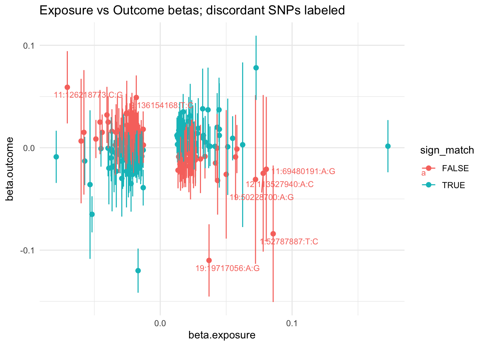
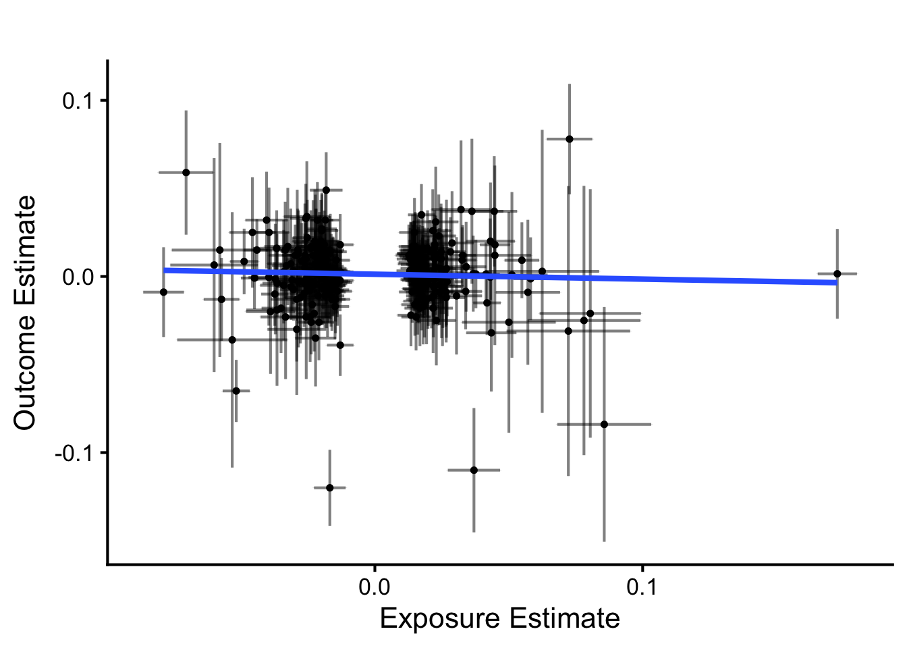
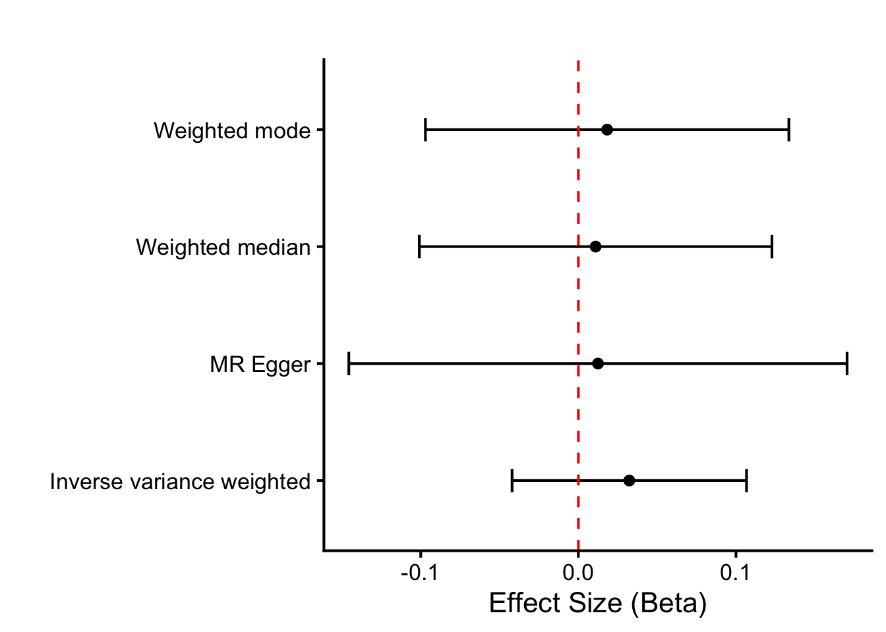
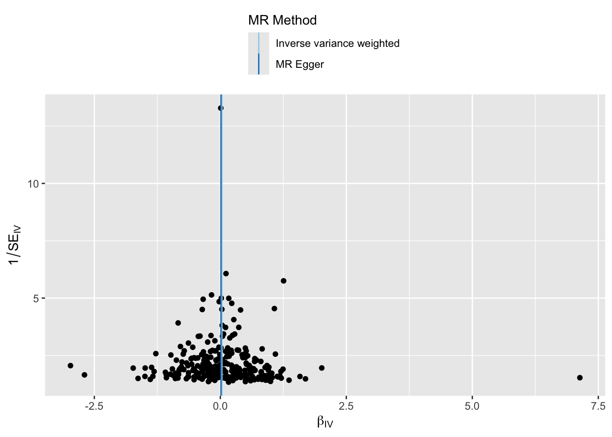
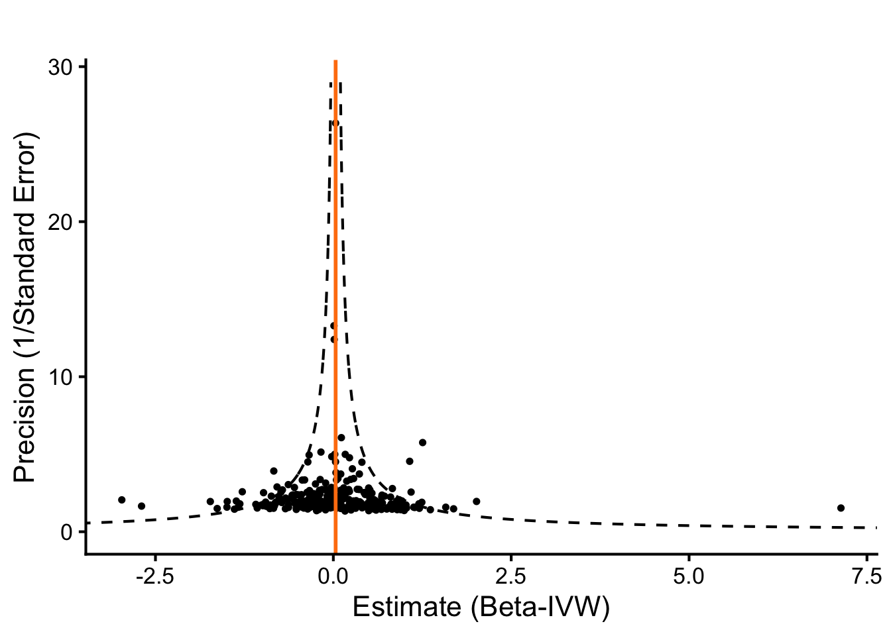
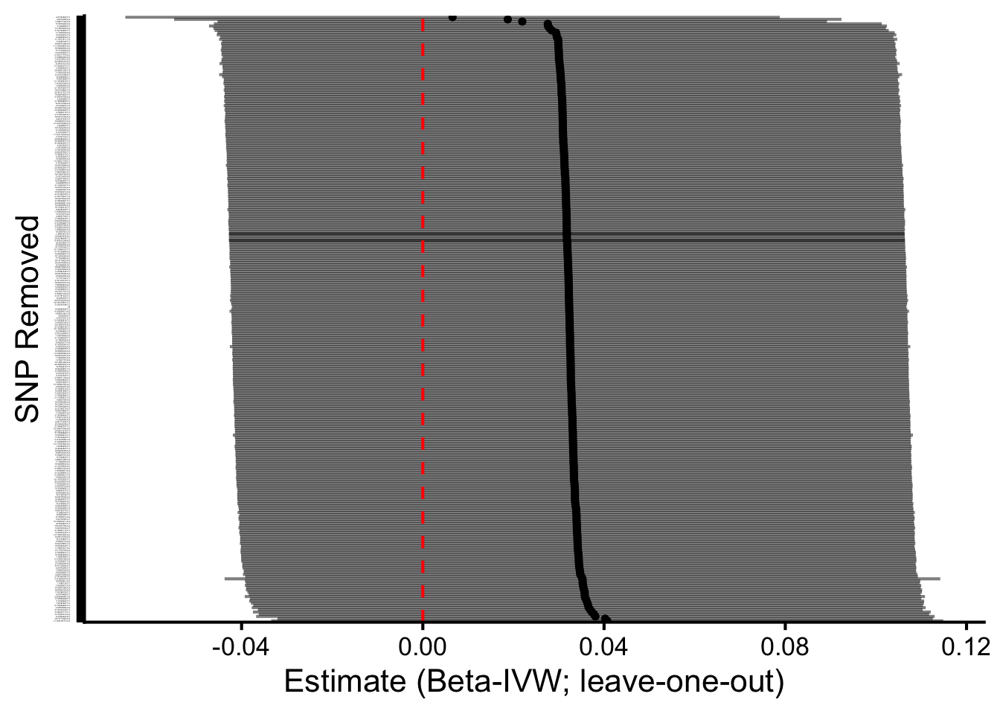

::: {.cell}

```{.r .cell-code}
# hide this code chunk
#| echo: false
#| message: false

# defines the se function
se <- function(x) {
  sd(x, na.rm = TRUE) / sqrt(length(x))
}

#load these packages, nearly always needed
library(tidyverse)
library(knitr)

# sets maize and blue color scheme
color_scheme <- c("#00274c", "#ffcb05")
```
:::


## Purpose

To validate SNPs for calcium GWAS using those identified using UK Biobank.  This script can be found in /Users/davebrid/Documents/GitHub/PrecisionNutrition/Human Genetics and was most recently run on Tue Oct 14 10:59:03 2025

## Data Entry


::: {.cell}

```{.r .cell-code}
instruments.calcium.file <- 'Calcium Instruments from UKBB.csv'
gwas.tc.file <- 'PheWeb Summary Statistics/phenocode-Chol.tsv.gz'
samplesize.outcome.tc <- 46100


# loaded and renamed columns
instruments.calcium <- read_csv(instruments.calcium.file) |>
  rename(
    SNP                       = SP2,
    beta.exposure             = BETA,
    se.exposure               = SE,
    effect_allele.exposure    = EA,
    other_allele.exposure     = OA,
    pval.exposure             = P,
    eaf.exposure              = ALT_FREQS,
    samplesize.exposure       = N_exposure
  ) |>
  mutate(id.exposure="Calcium (UK Biobank)",
         exposure="Calcium (UK Biobank)")


gwas.tc <- read_tsv(gwas.tc.file) |>
  mutate(ID=paste(chrom, pos, ref,alt, sep=":")) |>
  rename(
    SNP                        = ID,            # or ID if that’s the matching ID
    beta.outcome               = beta,
    se.outcome                 = sebeta,
    effect_allele.outcome      = alt,   # whichever is effect allele
    other_allele.outcome       = ref,   # whichever is other allele
    pval.outcome               = pval,
    eaf.outcome                = maf,
  ) |>
  mutate(id.outcome = "Total Cholesterol (MGI-BioVU LabWAS)",
         outcome = "Total Cholesterol (MGI-BioVU LabWAS)",
         samplesize.outcome = samplesize.outcome.tc)  # sample size for MGI/BioVU for calcium)
```
:::


This presumes the sample sizes was 46100 from Table 1 of https://doi.org/10.1371/journal.pgen.1009077.

Loaded in the instruments for calcium from UK Biobank from the datafile Calcium Instruments from UKBB.csv and the GWAS summary statistics for calcium from the datafile PheWeb Summary Statistics/phenocode-Chol.tsv.gz.


::: {.cell}

```{.r .cell-code}
library(TwoSampleMR)

data <- harmonise_data(instruments.calcium, gwas.tc, action = 2)

table(data$mr_keep) |>
  kable(caption="Number of SNPs kept for MR analysis")
```

::: {.cell-output-display}


Table: Number of SNPs kept for MR analysis

|Var1  | Freq|
|:-----|----:|
|FALSE |    2|
|TRUE  |  275|


:::

```{.r .cell-code}
table(data$palindromic)  |>
  kable(caption="Number of palindromic SNPs")
```

::: {.cell-output-display}


Table: Number of palindromic SNPs

|Var1  | Freq|
|:-----|----:|
|FALSE |  255|
|TRUE  |   22|


:::

```{.r .cell-code}
data <- data %>%
  mutate(
    allele_match = (toupper(effect_allele.exposure) == toupper(effect_allele.outcome)) &
                  (toupper(other_allele.exposure) == toupper(other_allele.outcome)),
    allele_swapped = (toupper(effect_allele.exposure) == toupper(other_allele.outcome)) &
                    (toupper(other_allele.exposure) == toupper(effect_allele.outcome))
  )

# 2) EAF concordance checks (detect possible strand/orientation issues)
# requires eaf.exposure and eaf.outcome present
if(all(c("eaf.exposure","eaf.outcome") %in% names(data))){
  data <- data %>%
    mutate(
      eaf_diff = abs(eaf.exposure - eaf.outcome),
      eaf_flip_diff = abs(eaf.exposure - (1 - eaf.outcome)),
      suspicious_eaf = (eaf_diff > 0.2 & eaf_flip_diff > 0.2)  # very different frequencies
    )
  summary(data$eaf_diff)
  summary(data$eaf_flip_diff)
  cat("Num suspicious EAFs:", sum(data$suspicious_eaf, na.rm=TRUE), "\n")
} else {
  cat("No EAF columns present for both datasets; consider adding reference panel EAFs.\n")
}
```

::: {.cell-output .cell-output-stdout}

```
Num suspicious EAFs: 0 
```


:::

```{.r .cell-code}
# 3) List discordant SNPs
data <- data %>%
  mutate(sign_match = sign(beta.exposure) == sign(beta.outcome))

discordant <- data %>% filter(!sign_match) %>%
  select(SNP, beta.exposure, se.exposure, beta.outcome, se.outcome,
         effect_allele.exposure, other_allele.exposure,
         effect_allele.outcome, other_allele.outcome,
         palindromic, ambiguous, eaf.exposure, eaf.outcome)

kable(discordant |>
        arrange(beta.exposure) |>
        select(SNP,beta.exposure,se.exposure,beta.outcome,se.outcome),
      caption="Discordant SNPs where the beta coefficients directionally differ between exposure and outcome")
```

::: {.cell-output-display}


Table: Discordant SNPs where the beta coefficients directionally differ between exposure and outcome

|SNP              | beta.exposure| se.exposure| beta.outcome| se.outcome|
|:----------------|-------------:|-----------:|------------:|----------:|
|11:126218773:C:G |      -0.07050|    0.005199|       0.0590|     0.0180|
|10:9524819:T:C   |      -0.06003|    0.008350|       0.0065|     0.0310|
|19:50219862:T:C  |      -0.05790|    0.009157|       0.0150|     0.0310|
|2:234264848:C:G  |      -0.04882|    0.002709|       0.0085|     0.0095|
|9:97804641:A:C   |      -0.04572|    0.004387|       0.0250|     0.0160|
|6:74493432:A:C   |      -0.04406|    0.002516|       0.0150|     0.0089|
|4:40555956:A:G   |      -0.04045|    0.004049|       0.0320|     0.0140|
|3:12390484:T:C   |      -0.03952|    0.003841|       0.0250|     0.0130|
|19:50028163:A:G  |      -0.03666|    0.003253|       0.0160|     0.0110|
|14:95053849:T:C  |      -0.03404|    0.004198|       0.0027|     0.0150|
|19:35378725:T:C  |      -0.03349|    0.003704|       0.0150|     0.0140|
|11:2956166:T:C   |      -0.03301|    0.002766|       0.0061|     0.0098|
|15:49278090:A:G  |      -0.03252|    0.004474|       0.0170|     0.0170|
|3:121364173:A:T  |      -0.03141|    0.004461|       0.0072|     0.0160|
|1:43458250:T:C   |      -0.03045|    0.002791|       0.0033|     0.0097|
|7:65326821:A:G   |      -0.02975|    0.002522|       0.0120|     0.0089|
|1:51659401:A:C   |      -0.02900|    0.005431|       0.0120|     0.0190|
|17:59450441:T:C  |      -0.02881|    0.003364|       0.0150|     0.0120|
|14:92279983:T:G  |      -0.02856|    0.003357|       0.0140|     0.0120|
|10:8108592:T:C   |      -0.02730|    0.003026|       0.0088|     0.0110|
|8:106583124:A:G  |      -0.02619|    0.002810|       0.0051|     0.0098|
|17:6703825:T:C   |      -0.02612|    0.004207|       0.0120|     0.0150|
|8:8283706:A:G    |      -0.02600|    0.003840|       0.0047|     0.0130|
|17:37387413:A:G  |      -0.02579|    0.002984|       0.0330|     0.0100|
|5:131329591:T:C  |      -0.02572|    0.003741|       0.0100|     0.0130|
|17:67290356:A:G  |      -0.02541|    0.004384|       0.0340|     0.0160|
|1:1095130:T:C    |      -0.02524|    0.002786|       0.0220|     0.0110|
|19:36038390:A:G  |      -0.02458|    0.002609|       0.0021|     0.0091|
|7:16042596:T:C   |      -0.02389|    0.003055|       0.0160|     0.0110|
|1:155186729:T:C  |      -0.02375|    0.002510|       0.0170|     0.0088|
|1:21680008:A:G   |      -0.02306|    0.004535|       0.0120|     0.0160|
|14:105992183:A:C |      -0.02300|    0.002945|       0.0020|     0.0100|
|19:37395697:A:C  |      -0.02241|    0.004269|       0.0200|     0.0150|
|7:92252203:C:G   |      -0.02231|    0.002848|       0.0067|     0.0099|
|7:107202502:A:C  |      -0.02224|    0.002785|       0.0072|     0.0097|
|10:96035980:T:C  |      -0.02221|    0.004032|       0.0190|     0.0140|
|15:78325229:T:C  |      -0.02204|    0.003103|       0.0170|     0.0110|
|3:121323008:C:G  |      -0.02193|    0.003964|       0.0110|     0.0140|
|10:52881906:T:C  |      -0.02148|    0.003597|       0.0053|     0.0130|
|17:47863368:T:C  |      -0.02146|    0.003021|       0.0320|     0.0110|
|10:22337752:A:G  |      -0.02115|    0.002880|       0.0120|     0.0100|
|5:133845380:A:G  |      -0.02087|    0.002552|       0.0009|     0.0089|
|20:5532853:T:C   |      -0.02072|    0.003083|       0.0150|     0.0110|
|6:137264165:A:G  |      -0.02070|    0.002519|       0.0120|     0.0088|
|2:111989372:T:G  |      -0.02055|    0.004040|       0.0074|     0.0140|
|12:12891420:A:G  |      -0.02039|    0.004124|       0.0048|     0.0150|
|14:60617639:A:G  |      -0.02018|    0.003536|       0.0200|     0.0120|
|4:27016468:T:C   |      -0.01980|    0.002844|       0.0270|     0.0100|
|2:133188106:T:G  |      -0.01979|    0.003106|       0.0260|     0.0110|
|1:226917898:A:G  |      -0.01971|    0.002520|       0.0150|     0.0089|
|12:110723203:T:C |      -0.01952|    0.002618|       0.0067|     0.0092|
|6:25745243:A:T   |      -0.01892|    0.002773|       0.0180|     0.0099|
|21:35893737:T:C  |      -0.01874|    0.002560|       0.0044|     0.0090|
|13:110501545:A:C |      -0.01869|    0.002598|       0.0120|     0.0091|
|17:1982952:A:G   |      -0.01868|    0.002601|       0.0063|     0.0092|
|6:134509254:T:C  |      -0.01851|    0.002664|       0.0320|     0.0095|
|14:70000399:A:C  |      -0.01821|    0.003351|       0.0058|     0.0110|
|9:136154168:T:C  |      -0.01818|    0.003106|       0.0490|     0.0110|
|10:94436851:T:C  |      -0.01808|    0.002518|       0.0018|     0.0089|
|15:96648537:T:C  |      -0.01808|    0.002716|       0.0096|     0.0095|
|17:17783748:A:G  |      -0.01743|    0.002608|       0.0140|     0.0091|
|3:56865776:A:G   |      -0.01714|    0.002595|       0.0140|     0.0092|
|6:129827116:T:C  |      -0.01691|    0.002776|       0.0150|     0.0098|
|6:44097472:T:C   |      -0.01666|    0.003138|       0.0140|     0.0110|
|7:150614934:T:C  |      -0.01631|    0.002912|       0.0045|     0.0100|
|17:35860964:T:C  |      -0.01609|    0.002611|       0.0038|     0.0092|
|2:190984523:A:T  |      -0.01569|    0.002790|       0.0030|     0.0100|
|2:25492467:A:G   |      -0.01555|    0.002718|       0.0035|     0.0095|
|4:115385540:T:C  |      -0.01468|    0.002551|       0.0011|     0.0090|
|6:139834012:T:G  |      -0.01443|    0.002601|       0.0092|     0.0091|
|2:37237450:T:C   |      -0.01410|    0.002528|       0.0027|     0.0089|
|1:78578550:A:G   |      -0.01372|    0.002777|       0.0015|     0.0097|
|10:96305329:T:C  |      -0.01295|    0.002527|       0.0180|     0.0089|
|11:8252853:A:G   |      -0.01279|    0.002444|       0.0026|     0.0089|
|7:25997536:A:G   |       0.01348|    0.002555|      -0.0220|     0.0090|
|1:153606851:A:G  |       0.01397|    0.002528|      -0.0088|     0.0089|
|15:60895636:A:G  |       0.01462|    0.002569|      -0.0018|     0.0091|
|1:116804727:A:C  |       0.01493|    0.002574|      -0.0160|     0.0090|
|22:30800338:T:G  |       0.01512|    0.002527|      -0.0022|     0.0088|
|6:43299058:T:G   |       0.01538|    0.002799|      -0.0230|     0.0097|
|8:98812563:A:G   |       0.01540|    0.002523|      -0.0070|     0.0090|
|10:116003053:T:C |       0.01562|    0.002543|      -0.0005|     0.0090|
|10:126477406:A:G |       0.01587|    0.002857|      -0.0070|     0.0100|
|15:60762779:T:C  |       0.01602|    0.002763|      -0.0140|     0.0097|
|1:200457488:A:G  |       0.01617|    0.002624|      -0.0076|     0.0093|
|21:37835347:A:T  |       0.01630|    0.002865|      -0.0013|     0.0100|
|2:69573029:T:C   |       0.01637|    0.002546|      -0.0025|     0.0089|
|19:30304483:T:C  |       0.01662|    0.002567|      -0.0090|     0.0090|
|12:4057955:T:C   |       0.01683|    0.002947|      -0.0180|     0.0110|
|2:131089135:T:C  |       0.01689|    0.003111|      -0.0007|     0.0110|
|5:55816081:A:C   |       0.01745|    0.002946|      -0.0110|     0.0100|
|10:64914467:A:G  |       0.01789|    0.002722|      -0.0017|     0.0097|
|22:25000229:A:T  |       0.01793|    0.002635|      -0.0050|     0.0093|
|10:104654211:A:G |       0.01805|    0.003067|      -0.0170|     0.0110|
|1:178515187:A:G  |       0.01815|    0.002519|      -0.0043|     0.0088|
|5:174050806:T:C  |       0.01836|    0.002641|      -0.0055|     0.0093|
|19:3133853:T:C   |       0.01856|    0.002842|      -0.0150|     0.0100|
|8:72414019:T:C   |       0.01856|    0.002832|      -0.0024|     0.0100|
|15:52856934:A:C  |       0.01930|    0.003840|      -0.0130|     0.0130|
|8:38226277:A:G   |       0.01934|    0.002913|      -0.0012|     0.0110|
|2:103151136:A:G  |       0.01981|    0.003588|      -0.0042|     0.0130|
|7:143095378:T:C  |       0.01994|    0.003956|      -0.0026|     0.0130|
|1:217456447:T:G  |       0.02116|    0.002513|      -0.0120|     0.0089|
|13:20436598:T:G  |       0.02175|    0.003751|      -0.0180|     0.0130|
|3:113275624:A:C  |       0.02178|    0.002569|      -0.0053|     0.0090|
|20:33335657:A:G  |       0.02189|    0.003229|      -0.0110|     0.0120|
|12:4573791:T:G   |       0.02200|    0.003770|      -0.0003|     0.0140|
|3:156798732:A:G  |       0.02215|    0.002571|      -0.0062|     0.0090|
|4:17809538:A:G   |       0.02218|    0.003766|      -0.0015|     0.0130|
|8:21944962:T:G   |       0.02279|    0.002913|      -0.0003|     0.0110|
|8:101703522:A:T  |       0.02295|    0.003722|      -0.0250|     0.0130|
|11:126595819:T:C |       0.02353|    0.003961|      -0.0004|     0.0140|
|9:903352:A:T     |       0.02411|    0.004078|       0.0000|     0.0140|
|5:72385914:A:G   |       0.02412|    0.002674|      -0.0089|     0.0095|
|1:156754465:T:C  |       0.02422|    0.002874|      -0.0046|     0.0100|
|17:73497415:T:C  |       0.02491|    0.004268|      -0.0056|     0.0150|
|14:21944174:A:G  |       0.02525|    0.004435|      -0.0082|     0.0160|
|12:90171438:T:G  |       0.02538|    0.003466|      -0.0057|     0.0120|
|1:21821757:A:G   |       0.02544|    0.002519|      -0.0007|     0.0089|
|6:32152387:A:T   |       0.02656|    0.003157|      -0.0089|     0.0100|
|19:3128748:T:C   |       0.02663|    0.003585|      -0.0120|     0.0130|
|2:213697875:A:G  |       0.02672|    0.004114|      -0.0003|     0.0140|
|3:136289466:T:C  |       0.02700|    0.002941|      -0.0030|     0.0100|
|20:52813216:T:C  |       0.03049|    0.004855|      -0.0110|     0.0170|
|14:94796184:A:T  |       0.03391|    0.003120|      -0.0085|     0.0110|
|19:19717056:A:G  |       0.03700|    0.004983|      -0.1100|     0.0180|
|3:186337713:T:C  |       0.04188|    0.002626|      -0.0150|     0.0093|
|3:107219309:T:C  |       0.04309|    0.004835|      -0.0004|     0.0170|
|17:55301369:A:G  |       0.04350|    0.004778|      -0.0320|     0.0170|
|3:122069056:T:C  |       0.05004|    0.008926|      -0.0260|     0.0320|
|15:44244523:T:C  |       0.05713|    0.006127|      -0.0090|     0.0210|
|19:35559474:T:C  |       0.05815|    0.003271|      -0.0013|     0.0120|
|12:113527940:A:C |       0.07225|    0.011770|      -0.0310|     0.0420|
|19:50228700:A:G  |       0.07808|    0.010760|      -0.0250|     0.0390|
|11:69480191:A:G  |       0.08044|    0.009657|      -0.0210|     0.0360|
|1:52787887:T:C   |       0.08565|    0.008950|      -0.0840|     0.0340|


:::

```{.r .cell-code}
library(ggrepel)
ggplot(data, aes(x=beta.exposure, y=beta.outcome, color = sign_match)) +
  geom_point(size=2) +
  geom_errorbar(aes(ymin = beta.outcome - 1.96*se.outcome, ymax = beta.outcome + 1.96*se.outcome), width=0) +
  geom_text_repel(data = filter(data, !sign_match), aes(label=SNP), hjust=0, vjust=0, size=3) +
  theme_minimal() +
  labs(x="beta.exposure", y="beta.outcome", title="Exposure vs Outcome betas; discordant SNPs labeled")
```

::: {.cell-output-display}
{width=672}
:::
:::


::: {.cell}

```{.r .cell-code}
ggplot(data, aes(x=beta.exposure, y=beta.outcome)) +
  geom_point(size=1) +
  geom_errorbar(aes(ymin = beta.outcome - 1.96*se.outcome,
                    ymax = beta.outcome + 1.96*se.outcome),
                alpha=0.5) +
  geom_errorbar(aes(xmin = beta.exposure - 1.96*se.exposure,
                    xmax = beta.exposure + 1.96*se.exposure),
                alpha=0.5) +
  geom_smooth(method="lm",se=F) +
  theme_classic(base_size=16) +
  labs(x="Exposure Estimate", 
       y="Outcome Estimate", 
       title="Calcium (UK Biobank) vs Total Cholesterol (LabWAS)") 
```

::: {.cell-output-display}
{width=672}
:::
:::


There were 136 discordant SNPs between the exposure and outcome datasets.  These are listed above.  We can see that some of these SNPs have very small effect sizes in the outcome dataset, suggesting that the discordance may be due to noise.  These were kept in the analysis

### Steiger Filtering


::: {.cell}

```{.r .cell-code}
data_steiger <- steiger_filtering(data)

table(data_steiger$steiger_direction, useNA="ifany") |>
  kable(caption="Steiger filtering results for calcium-tc evaluation")
```

::: {.cell-output-display}


Table: Steiger filtering results for calcium-tc evaluation

| Freq|
|----:|


:::
:::


Harmonization results

- We used 363 SNPs as instruments for calcium from UK Biobank.
- There were 275 SNPs in common between the exposure and outcome datasets.
- Removed 0 SNPs due to allele mismatches
- Identified 22 palindromic SNPs 
- A total of 277 SNPs remained for use after harmonization.  2 SNPS were removed because the palindromic SNP is ambiguous and strand alignment could not be resolved, this variant was automatically dropped from the MR analysis to avoid mis-specified effect directions.
- After Steiger filtering, 275 SNPs were retained for analysis, indicating that all SNPs had stronger associations with the exposure (calcium in UK Biobank) than the outcome (calcium in MGI/BioVU), supporting the assumed causal direction.  0 SNPs were removed by Steiger filtering.


::: {.cell}

```{.r .cell-code}
data.annot <- data_steiger %>%
  mutate(
    R2.exposure = 2 * eaf.exposure * (1 - eaf.exposure) * beta.exposure^2,
    F.exposure = (R2.exposure * (samplesize.exposure - 2)) / (1 - R2.exposure)
  )

calcium.exposure.summary <- data.annot %>%
  summarise(
    num_snps = n(),
    samplesize.exposure = first(samplesize.exposure),
    cumulative_R2 = sum(R2.exposure, na.rm = TRUE),
    mean_F = mean(F.exposure, na.rm = TRUE),
    median_F = median(F.exposure, na.rm = TRUE),
    mean_maf = mean(eaf.exposure, na.rm = TRUE),
    mean_beta = mean(abs(beta.exposure), na.rm = TRUE)
  ) |>
  mutate(overall_F = (cumulative_R2 * (samplesize.exposure - num_snps - 1)) / 
                     ((1 - cumulative_R2) * num_snps))

# For outcome (e.g., cholesterol) SNPs
outcome.summary_metrics <- data.annot %>%
  summarise(
    num_snps = n(),
    mean_beta = mean(abs(beta.outcome), na.rm = TRUE),
    mean_se = mean(se.outcome, na.rm = TRUE),
    mean_maf = mean(eaf.outcome, na.rm = TRUE)
  )

library(knitr)
kable(calcium.exposure.summary, caption="Summary of calcium instruments after harmonisation")
```

::: {.cell-output-display}


Table: Summary of calcium instruments after harmonisation

| num_snps| samplesize.exposure| cumulative_R2|  mean_F| median_F|  mean_maf| mean_beta| overall_F|
|--------:|-------------------:|-------------:|-------:|--------:|---------:|---------:|---------:|
|      277|              385066|     0.0638365| 88.8467| 54.59161| 0.3670863| 0.0259874|  94.72378|


:::

```{.r .cell-code}
write_csv(outcome.summary_metrics, "Instrument Metrics - Calcium - Post-Harmonization (Total Cholesterol).csv")

#write out the instruments used for calcium
data_steiger %>% filter(mr_keep==TRUE) %>% 
  mutate(Exposure = "Calcium") |>
  select(Exposure, CHR, POS, effect_allele.exposure, other_allele.exposure, beta.exposure, se.exposure, pval.exposure, eaf.exposure, R2, `F`, rsids, nearest_genes) |>
  rename(effect_allele = effect_allele.exposure,
         other_allele = other_allele.exposure,
         beta = beta.exposure,
         se = se.exposure,
         p = pval.exposure,
         eaf = eaf.exposure) |>
  write_csv("Calcium Instruments Post-Harmonization (Total Cholesterol).csv")
  
kable(outcome.summary_metrics, caption="Summary of total cholesterol effects by calcium instruments after harmonisation")
```

::: {.cell-output-display}


Table: Summary of total cholesterol effects by calcium instruments after harmonisation

| num_snps| mean_beta|   mean_se|  mean_maf|
|--------:|---------:|---------:|---------:|
|      277| 0.0127552| 0.0121437| 0.2610072|


:::
:::


::: {.cell}

```{.r .cell-code}
calcium.tc.mr <- mr(data_steiger,
                         method_list = c("mr_ivw", 
                                         "mr_egger_regression", 
                                         "mr_weighted_median", 
                                         "mr_weighted_mode"))

calcium.tc.mr |> select(-starts_with('id')) |> 
  kable(caption="MR Results for Calcium Effects on Total Cholesterol",
        digits=c(0,0,0,0,3,3,99))
```

::: {.cell-output-display}


Table: MR Results for Calcium Effects on Total Cholesterol

|outcome                              |exposure             |method                    | nsnp|     b|    se|      pval|
|:------------------------------------|:--------------------|:-------------------------|----:|-----:|-----:|---------:|
|Total Cholesterol (MGI-BioVU LabWAS) |Calcium (UK Biobank) |Inverse variance weighted |  275| 0.032| 0.038| 0.3945054|
|Total Cholesterol (MGI-BioVU LabWAS) |Calcium (UK Biobank) |MR Egger                  |  275| 0.012| 0.081| 0.8776367|
|Total Cholesterol (MGI-BioVU LabWAS) |Calcium (UK Biobank) |Weighted median           |  275| 0.011| 0.057| 0.8478306|
|Total Cholesterol (MGI-BioVU LabWAS) |Calcium (UK Biobank) |Weighted mode             |  275| 0.018| 0.059| 0.7565062|


:::

```{.r .cell-code}
ggplot(calcium.tc.mr, aes(y=method,x=b)) +
  geom_point() +
  geom_errorbar(aes(xmin=b-1.96*se, xmax=b+1.96*se), width=0.2) +
  theme_classic(base_size=16) +
  labs(title="",
       y="",
       x="Effect Size (Beta)") +
  geom_vline(xintercept=0, linetype="dashed", color = "red") 
```

::: {.cell-output-display}
{width=672}
:::
:::


The primary result, using the inverse variance weighted method shows a 0.0323096 $\pm$ 0.0379454 SD increase in total cholesterol (MGI-BioVU LabWAS) per 1 SD increase in calcium (UK Biobank).  This is statistically significant with a p-value of 0.3945054.  All four MR methods (IVW, weighted median, weighted mode, MR-Egger) gave consistent, **non-significant** causal estimates, confirming instrument validity and harmonisation.

### MR-Egger Intercept


::: {.cell}

```{.r .cell-code}
egger_intercept <- mr_pleiotropy_test(data_steiger)
egger_intercept|>
  select(-starts_with('id')) |> 
  kable(caption="MR Pleiotropy Results for Calcium-Cholesterol Analysis")
```

::: {.cell-output-display}


Table: MR Pleiotropy Results for Calcium-Cholesterol Analysis

|outcome                              |exposure             | egger_intercept|        se|      pval|
|:------------------------------------|:--------------------|---------------:|---------:|---------:|
|Total Cholesterol (MGI-BioVU LabWAS) |Calcium (UK Biobank) |       0.0005832| 0.0020864| 0.7800383|


:::
:::

The MR-Egger intercept is  with a p-value of 0.7800383, indicating no evidence of directional pleiotropy.  The intercept magnitude is near zero, indicating that any pleiotropic bias is likely minor.

### Heterogeneity Statistics


::: {.cell}

```{.r .cell-code}
# Heterogeneity tests for IVW and MR-Egger
heterogeneity <- mr_heterogeneity(data_steiger)
heterogeneity|>
  select(-starts_with('id')) |> 
  kable(caption="MR Heterogeneity Results for Calcium Effects on Cholesterol",
        digits=c(0,0,0,3,3,99))
```

::: {.cell-output-display}


Table: MR Heterogeneity Results for Calcium Effects on Cholesterol

|outcome                              |exposure             |method                    |       Q| Q_df|       Q_pval|
|:------------------------------------|:--------------------|:-------------------------|-------:|----:|------------:|
|Total Cholesterol (MGI-BioVU LabWAS) |Calcium (UK Biobank) |MR Egger                  | 633.031|  273| 1.222553e-30|
|Total Cholesterol (MGI-BioVU LabWAS) |Calcium (UK Biobank) |Inverse variance weighted | 633.213|  274| 1.773972e-30|


:::

```{.r .cell-code}
# Columns: method, Q, Q_df, Q_pval
# Interpretation: small Q_pval (<0.05) indicates heterogeneity among SNPs
```
:::


This is expected with polygenic traits and does not necessarily invalidate the overall causal estimate, particularly since robust methods (weighted median, weighted mode) gave consistent results.


::: {.cell}

```{.r .cell-code}
single_snp_results <- mr_singlesnp(data_steiger)
mr_funnel_plot(single_snp_results) 
```

::: {.cell-output .cell-output-stdout}

```
$`Calcium (UK Biobank).Total Cholesterol (MGI-BioVU LabWAS)`
```


:::

::: {.cell-output-display}
{width=672}
:::

::: {.cell-output .cell-output-stdout}

```

attr(,"split_type")
[1] "data.frame"
attr(,"split_labels")
           id.exposure                           id.outcome
1 Calcium (UK Biobank) Total Cholesterol (MGI-BioVU LabWAS)
```


:::

```{.r .cell-code}
# Get overall IVW estimate for the vertical line
ivw_beta <- calcium.tc.mr |> filter(method=="Inverse variance weighted") |> pull(b)

# Determine y-range based on your data
y_min <- 0
y_max <- max(single_snp_results$se^{-1}) * 1.1  # 10% padding above max precision

# Generate a fine grid of precision values
precision_grid <- seq(y_min, y_max, length.out = 1000)

# Compute boundaries: ivw_beta ± 1.96 / precision
lower_bound <- ivw_beta - 1.96 / precision_grid
upper_bound <- ivw_beta + 1.96 / precision_grid

# Create data frame for boundaries
bounds_df <- data.frame(precision = precision_grid, lower = lower_bound, upper = upper_bound)

# Plot
ggplot(single_snp_results, aes(x = b, y = 1/se)) +
  # Scatter points for each SNP
  geom_point(size = 1) +
  # Vertical line at IVW estimate
  geom_vline(xintercept = ivw_beta, linetype = "solid", color = "#ff7f0e", size = 1) +
  # Curved pseudo-95% CI boundaries (the cone)
  geom_line(data = bounds_df, aes(x = lower, y = precision), linetype = "dashed") +
  geom_line(data = bounds_df, aes(x = upper, y = precision), linetype = "dashed") +
  # Customize axes and labels
  labs(
    x = "Estimate (Beta-IVW)",
    y = "Precision (1/Standard Error)",
    title = ""
  ) +
  # Apply clean theme and limit y to >=0
  theme_classic(base_size = 16) +
  theme(plot.title = element_text(hjust = 0.5)) +
  coord_cartesian(ylim = c(0, y_max), xlim = c(min(single_snp_results$b), max(single_snp_results$b)))  # Adjust x-limits for visibility
```

::: {.cell-output-display}
{width=672}
:::
:::


### Leave-one-out Analysis

Using IVW methods


::: {.cell}

```{.r .cell-code}
# LOO using IVW
loo_res <- mr_leaveoneout(data_steiger)
loo_res |> 
  mutate(diff = b - filter(calcium.tc.mr, method=="Inverse variance weighted")$b) |>
  arrange(-abs(diff)) |>
  head() |>
  select(SNP,diff,b,se,p) |>
  kable(caption="Leave-One-Out Results for Calcium-Total Cholesterol Analysis (IVW method) for Influential SNPs",
        digits=c(0,5,5,5,5))
```

::: {.cell-output-display}


Table: Leave-One-Out Results for Calcium-Total Cholesterol Analysis (IVW method) for Influential SNPs

|SNP              |     diff|       b|      se|       p|
|:----------------|--------:|-------:|-------:|-------:|
|2:27742603:T:C   | -0.02575| 0.00656| 0.03685| 0.85867|
|8:9183358:A:G    | -0.01356| 0.01875| 0.03757| 0.61771|
|1:109817192:A:G  | -0.01036| 0.02195| 0.03431| 0.52238|
|11:126218773:C:G |  0.00839| 0.04070| 0.03784| 0.28219|
|19:19717056:A:G  |  0.00793| 0.04024| 0.03690| 0.27542|
|6:74493432:A:C   |  0.00578| 0.03809| 0.03820| 0.31876|


:::

```{.r .cell-code}
# Columns: SNP, nsnp, b, se, pval — gives causal estimate with each SNP removed once

# Optional: plot LOO results

ggplot(loo_res, aes(x = reorder(SNP, -b), y = b)) +
  geom_point(size=1) +
  geom_errorbar(aes(ymin = b - 1.96*se, ymax = b + 1.96*se), width = 0.01 ,alpha=0.5) +
  coord_flip() +
  labs(x = "SNP Removed", y = "Estimate (Beta-IVW; leave-one-out)") +
  geom_hline(yintercept=0, linetype="dashed", color = "red") +
  theme_classic(base_size=16) +
  theme(axis.text.y = element_text(size = 1)) 
```

::: {.cell-output-display}
{width=672}
:::
:::

Leave-one-out analyses suggested that three SNPs had a relatively large influence on the IVW estimate, but removal of either SNP did not qualitatively change the overall conclusion.


## Session Information


::: {.cell}

```{.r .cell-code}
sessionInfo()
```

::: {.cell-output .cell-output-stdout}

```
R version 4.5.1 (2025-06-13)
Platform: aarch64-apple-darwin20
Running under: macOS Sequoia 15.7.1

Matrix products: default
BLAS:   /Library/Frameworks/R.framework/Versions/4.5-arm64/Resources/lib/libRblas.0.dylib 
LAPACK: /Library/Frameworks/R.framework/Versions/4.5-arm64/Resources/lib/libRlapack.dylib;  LAPACK version 3.12.1

locale:
[1] en_US.UTF-8/en_US.UTF-8/en_US.UTF-8/C/en_US.UTF-8/en_US.UTF-8

time zone: America/Detroit
tzcode source: internal

attached base packages:
[1] stats     graphics  grDevices utils     datasets  methods   base     

other attached packages:
 [1] ggrepel_0.9.6      TwoSampleMR_0.6.22 knitr_1.50         lubridate_1.9.4   
 [5] forcats_1.0.1      stringr_1.5.2      dplyr_1.1.4        purrr_1.1.0       
 [9] readr_2.1.5        tidyr_1.3.1        tibble_3.3.0       ggplot2_4.0.0     
[13] tidyverse_2.0.0   

loaded via a namespace (and not attached):
 [1] generics_0.1.4     lattice_0.22-7     stringi_1.8.7      hms_1.1.3         
 [5] digest_0.6.37      magrittr_2.0.4     evaluate_1.0.5     grid_4.5.1        
 [9] timechange_0.3.0   RColorBrewer_1.1-3 fastmap_1.2.0      Matrix_1.7-4      
[13] plyr_1.8.9         jsonlite_2.0.0     mgcv_1.9-3         scales_1.4.0      
[17] mnormt_2.1.1       cli_3.6.5          rlang_1.1.6        crayon_1.5.3      
[21] splines_4.5.1      bit64_4.6.0-1      withr_3.0.2        yaml_2.3.10       
[25] tools_4.5.1        parallel_4.5.1     tzdb_0.5.0         vctrs_0.6.5       
[29] R6_2.6.1           lifecycle_1.0.4    htmlwidgets_1.6.4  bit_4.6.0         
[33] psych_2.5.6        vroom_1.6.5        pkgconfig_2.0.3    pillar_1.11.1     
[37] gtable_0.3.6       glue_1.8.0         data.table_1.17.8  Rcpp_1.1.0        
[41] xfun_0.53          tidyselect_1.2.1   rstudioapi_0.17.1  farver_2.1.2      
[45] nlme_3.1-168       htmltools_0.5.8.1  rmarkdown_2.29     labeling_0.4.3    
[49] compiler_4.5.1     S7_0.2.0          
```


:::
:::

