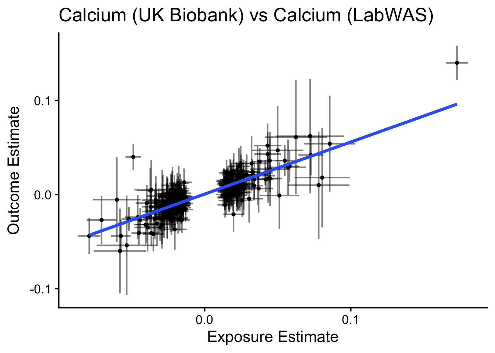
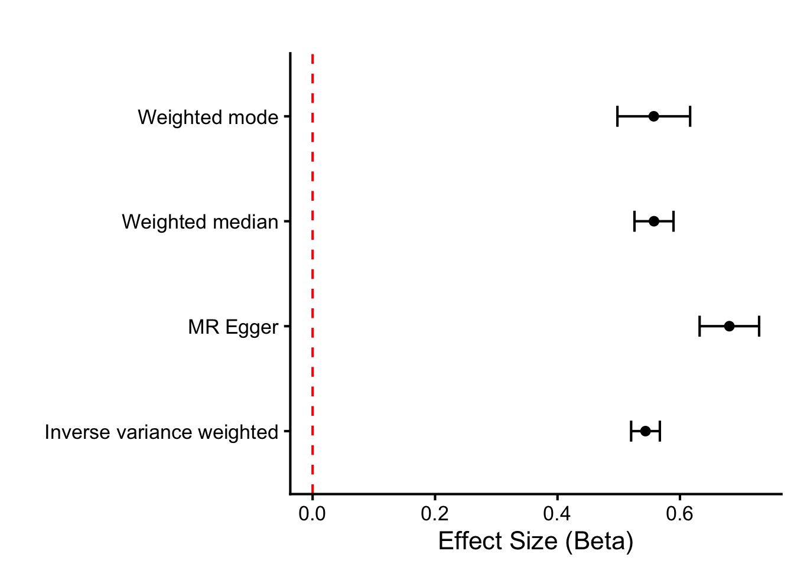
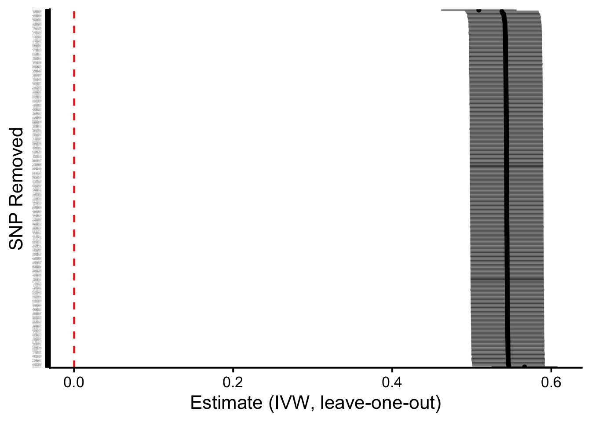

::: {.cell}

```{.r .cell-code}
# hide this code chunk
#| echo: false
#| message: false

# defines the se function
se <- function(x) {
  sd(x, na.rm = TRUE) / sqrt(length(x))
}

#load these packages, nearly always needed
library(tidyverse)
library(knitr)

# sets maize and blue color scheme
color_scheme <- c("#00274c", "#ffcb05")
```
:::


## Purpose

To validate SNPs for calcium GWAS using those identified using UK Biobank.  This script can be found in /Users/davebrid/Documents/GitHub/PrecisionNutrition/Human Genetics and was most recently run on Fri Oct 10 15:24:20 2025

## Data Entry


::: {.cell}

```{.r .cell-code}
instruments.calcium.file <- 'Calcium Instruments from UKBB.csv'
gwas.calcium.file <- 'PheWeb Summary Statistics/phenocode-Ca.tsv.gz'
samplesize.outcome.calcium <- 46100


# loaded and renamed columns
instruments.calcium <- read_csv(instruments.calcium.file) |>
  rename(
    SNP                       = SP2,
    beta.exposure             = BETA,
    se.exposure               = SE,
    effect_allele.exposure    = EA,
    other_allele.exposure     = OA,
    pval.exposure             = P,
    eaf.exposure              = ALT_FREQS,
    samplesize.exposure       = N_exposure
  ) |>
  mutate(id.exposure="Calcium (UK Biobank)",
         exposure="Calcium (UK Biobank)")


gwas.calcium <- read_tsv(gwas.calcium.file) |>
  mutate(ID=paste(chrom, pos, ref,alt, sep=":")) |>
  rename(
    SNP                        = ID,            # or ID if that’s the matching ID
    beta.outcome               = beta,
    se.outcome                 = sebeta,
    effect_allele.outcome      = alt,   # whichever is effect allele
    other_allele.outcome       = ref,   # whichever is other allele
    pval.outcome               = pval,
    eaf.outcome                = maf,
  ) |>
  mutate(id.outcome = "Calcium (Michigan GWAS)",
         outcome = "Calcium (Michigan GWAS)",
         samplesize.outcome = samplesize.outcome.calcium)  # sample size for MGI/BioVU for calcium)
```
:::


This presumes the sample sizes was 46100 from Table 1 of https://doi.org/10.1371/journal.pgen.1009077.

Loaded in the instruments for calcium from UK Biobank from the datafile Calcium Instruments from UKBB.csv and the GWAS summary statistics for calcium from the datafile PheWeb Summary Statistics/phenocode-Ca.tsv.gz.


::: {.cell}

```{.r .cell-code}
library(TwoSampleMR)

data <- harmonise_data(instruments.calcium, gwas.calcium, action = 2)

table(data$mr_keep) |>
  kable(caption="Number of SNPs kept for MR analysis")
```

::: {.cell-output-display}


Table: Number of SNPs kept for MR analysis

|Var1  | Freq|
|:-----|----:|
|FALSE |    2|
|TRUE  |  275|


:::

```{.r .cell-code}
table(data$palindromic)  |>
  kable(caption="Number of palindromic SNPs")
```

::: {.cell-output-display}


Table: Number of palindromic SNPs

|Var1  | Freq|
|:-----|----:|
|FALSE |  255|
|TRUE  |   22|


:::

```{.r .cell-code}
data <- data %>%
  mutate(
    allele_match = (toupper(effect_allele.exposure) == toupper(effect_allele.outcome)) &
                  (toupper(other_allele.exposure) == toupper(other_allele.outcome)),
    allele_swapped = (toupper(effect_allele.exposure) == toupper(other_allele.outcome)) &
                    (toupper(other_allele.exposure) == toupper(effect_allele.outcome))
  )

# 2) EAF concordance checks (detect possible strand/orientation issues)
# requires eaf.exposure and eaf.outcome present
if(all(c("eaf.exposure","eaf.outcome") %in% names(data))){
  data <- data %>%
    mutate(
      eaf_diff = abs(eaf.exposure - eaf.outcome),
      eaf_flip_diff = abs(eaf.exposure - (1 - eaf.outcome)),
      suspicious_eaf = (eaf_diff > 0.2 & eaf_flip_diff > 0.2)  # very different frequencies
    )
  summary(data$eaf_diff)
  summary(data$eaf_flip_diff)
  cat("Num suspicious EAFs:", sum(data$suspicious_eaf, na.rm=TRUE), "\n")
} else {
  cat("No EAF columns present for both datasets; consider adding reference panel EAFs.\n")
}
```

::: {.cell-output .cell-output-stdout}

```
Num suspicious EAFs: 0 
```


:::

```{.r .cell-code}
# 3) List discordant SNPs
data <- data %>%
  mutate(sign_match = sign(beta.exposure) == sign(beta.outcome))

discordant <- data %>% filter(!sign_match) %>%
  select(SNP, beta.exposure, se.exposure, beta.outcome, se.outcome,
         effect_allele.exposure, other_allele.exposure,
         effect_allele.outcome, other_allele.outcome,
         palindromic, ambiguous, eaf.exposure, eaf.outcome)

kable(discordant |>
        arrange(beta.exposure) |>
        select(SNP,beta.exposure,se.exposure,beta.outcome,se.outcome),
      caption="Discordant SNPs where the beta coefficients directionally differ between exposure and outcome")
```

::: {.cell-output-display}


Table: Discordant SNPs where the beta coefficients directionally differ between exposure and outcome

|SNP              | beta.exposure| se.exposure| beta.outcome| se.outcome|
|:----------------|-------------:|-----------:|------------:|----------:|
|2:234264848:C:G  |      -0.04882|    0.002709|       0.0400|     0.0070|
|10:100179851:T:C |      -0.03719|    0.004556|       0.0043|     0.0120|
|16:47980267:T:C  |      -0.03655|    0.005844|       0.0051|     0.0160|
|5:131329591:T:C  |      -0.02572|    0.003741|       0.0005|     0.0096|
|12:4004752:T:C   |      -0.02562|    0.003298|       0.0012|     0.0085|
|1:1095130:T:C    |      -0.02524|    0.002786|       0.0010|     0.0081|
|10:96035980:T:C  |      -0.02221|    0.004032|       0.0055|     0.0100|
|3:121323008:C:G  |      -0.02193|    0.003964|       0.0099|     0.0100|
|2:111989372:T:G  |      -0.02055|    0.004040|       0.0015|     0.0100|
|6:25745243:A:T   |      -0.01892|    0.002773|       0.0020|     0.0072|
|15:51524292:A:G  |      -0.01865|    0.002634|       0.0098|     0.0068|
|14:70000399:A:C  |      -0.01821|    0.003351|       0.0028|     0.0085|
|19:3369753:C:G   |      -0.01767|    0.003447|       0.0120|     0.0095|
|2:165539661:T:C  |      -0.01696|    0.002570|       0.0037|     0.0066|
|6:44097472:T:C   |      -0.01666|    0.003138|       0.0063|     0.0079|
|17:66820449:T:C  |      -0.01576|    0.002533|       0.0041|     0.0065|
|19:35370305:A:G  |      -0.01430|    0.002619|       0.0014|     0.0068|
|14:30364061:C:G  |      -0.01397|    0.002769|       0.0130|     0.0075|
|2:202207993:T:C  |       0.01268|    0.002512|       0.0000|     0.0065|
|20:62586262:T:C  |       0.01384|    0.002572|      -0.0034|     0.0067|
|16:54573024:A:G  |       0.01404|    0.002640|      -0.0027|     0.0071|
|22:39131727:T:G  |       0.01406|    0.002635|      -0.0110|     0.0068|
|13:110955187:T:C |       0.01500|    0.002756|      -0.0063|     0.0073|
|21:37835347:A:T  |       0.01630|    0.002865|      -0.0014|     0.0075|
|2:10213497:A:G   |       0.01634|    0.003023|      -0.0002|     0.0078|
|12:4057955:T:C   |       0.01683|    0.002947|      -0.0023|     0.0078|
|2:131089135:T:C  |       0.01689|    0.003111|      -0.0029|     0.0081|
|10:65393613:A:G  |       0.01743|    0.002640|      -0.0016|     0.0069|
|2:103151136:A:G  |       0.01981|    0.003588|      -0.0210|     0.0096|
|20:52786406:T:C  |       0.02285|    0.003207|      -0.0008|     0.0083|
|2:54846400:A:G   |       0.02574|    0.003572|      -0.0063|     0.0090|
|20:52813216:T:C  |       0.03049|    0.004855|      -0.0044|     0.0130|
|2:96061242:C:G   |       0.05118|    0.006802|      -0.0011|     0.0180|


:::

```{.r .cell-code}
library(ggrepel)
ggplot(data, aes(x=beta.exposure, y=beta.outcome, color = sign_match)) +
  geom_point(size=2) +
  geom_errorbar(aes(ymin = beta.outcome - 1.96*se.outcome, ymax = beta.outcome + 1.96*se.outcome), width=0) +
  geom_text_repel(data = filter(data, !sign_match), aes(label=SNP), hjust=0, vjust=0, size=3) +
  theme_minimal() +
  labs(x="beta.exposure", y="beta.outcome", title="Exposure vs Outcome betas; discordant SNPs labeled")
```

::: {.cell-output-display}
{width=672}
:::
:::


::: {.cell}

```{.r .cell-code}
ggplot(data, aes(x=beta.exposure, y=beta.outcome)) +
  geom_point(size=1) +
  geom_errorbar(aes(ymin = beta.outcome - 1.96*se.outcome,
                    ymax = beta.outcome + 1.96*se.outcome),
                alpha=0.5) +
  geom_errorbar(aes(xmin = beta.exposure - 1.96*se.exposure,
                    xmax = beta.exposure + 1.96*se.exposure),
                alpha=0.5) +
  geom_smooth(method="lm",se=F) +
  theme_classic(base_size=16) +
  labs(x="Exposure Estimate", 
       y="Outcome Estimate", 
       title="Calcium (UK Biobank) vs Calcium (LabWAS)") 
```

::: {.cell-output-display}
{width=672}
:::
:::


There were 33 discordant SNPs between the exposure and outcome datasets.  These are listed above.  We can see that some of these SNPs have very small effect sizes in the outcome dataset, suggesting that the discordance may be due to noise.  These were kept in the analysis

Harmonization results

- We used 363 SNPs as instruments for calcium from UK Biobank.
- There were 275 SNPs in common between the exposure and outcome datasets.
- A total of 277 SNPs remained for use after harmonization
- Removed 0 SNPs due to allele mismatches
- Identified 22 palindromic SNPs 


::: {.cell}

```{.r .cell-code}
data.annot <- data %>%
  mutate(
    R2.exposure = 2 * eaf.exposure * (1 - eaf.exposure) * beta.exposure^2,
    F.exposure = (R2.exposure * (samplesize.exposure - 2)) / (1 - R2.exposure)
  )

calcium.exposure.summary <- data.annot %>%
  summarise(
    num_snps = n(),
    samplesize.exposure = first(samplesize.exposure),
    cumulative_R2 = sum(R2.exposure, na.rm = TRUE),
    mean_F = mean(F.exposure, na.rm = TRUE),
    median_F = median(F.exposure, na.rm = TRUE),
    mean_maf = mean(eaf.exposure, na.rm = TRUE),
    mean_beta = mean(abs(beta.exposure), na.rm = TRUE)
  ) |>
  mutate(overall_F = (cumulative_R2 * (samplesize.exposure - num_snps - 1)) / 
                     ((1 - cumulative_R2) * num_snps))

# For outcome (e.g., cholesterol) SNPs
outcome.summary_metrics <- data.annot %>%
  summarise(
    num_snps = n(),
    mean_beta = mean(abs(beta.outcome), na.rm = TRUE),
    mean_se = mean(se.outcome, na.rm = TRUE),
    mean_maf = mean(eaf.outcome, na.rm = TRUE)
  )

library(knitr)
kable(calcium.exposure.summary, caption="Summary of calcium instruments after harmonisation")
```

::: {.cell-output-display}


Table: Summary of calcium instruments after harmonisation

| num_snps| samplesize.exposure| cumulative_R2|  mean_F| median_F|  mean_maf| mean_beta| overall_F|
|--------:|-------------------:|-------------:|-------:|--------:|---------:|---------:|---------:|
|      277|              385066|     0.0638365| 88.8467| 54.59161| 0.3670863| 0.0259874|  94.72378|


:::

```{.r .cell-code}
write_csv(outcome.summary_metrics, "Instrument Metrics - Calcium - Post-Harmonization.csv")

#write out the instruments used for calcium
data %>% filter(mr_keep==TRUE) %>% 
  mutate(Exposure = "Calcium") |>
  select(Exposure, CHR, POS, effect_allele.exposure, other_allele.exposure, beta.exposure, se.exposure, pval.exposure, eaf.exposure, R2, `F`, rsids, nearest_genes) |>
  rename(effect_allele = effect_allele.exposure,
         other_allele = other_allele.exposure,
         beta = beta.exposure,
         se = se.exposure,
         p = pval.exposure,
         eaf = eaf.exposure) |>
  write_csv("Calcium Instruments Post-Harmonization.csv")
  
kable(outcome.summary_metrics, caption="Summary of outcome summary ")
```

::: {.cell-output-display}


Table: Summary of outcome summary 

| num_snps| mean_beta|   mean_se|  mean_maf|
|--------:|---------:|---------:|---------:|
|      277| 0.0146729| 0.0089444| 0.2610072|


:::
:::


::: {.cell}

```{.r .cell-code}
calcium.control.mr <- mr(data,
                         method_list = c(
  "mr_ivw", 
  "mr_egger_regression", 
  "mr_weighted_median", 
  "mr_weighted_mode"
))

dat_h_steiger <- steiger_filtering(data)
table(dat_h_steiger$steiger_direction) 
```

::: {.cell-output .cell-output-stdout}

```
< table of extent 0 >
```


:::

```{.r .cell-code}
calcium.control.mr |> select(-starts_with('id')) |> 
  kable(caption="MR Results for Calcium Positive Control",
        digits=c(0,0,0,0,3,3,99))
```

::: {.cell-output-display}


Table: MR Results for Calcium Positive Control

|outcome                 |exposure             |method                    | nsnp|     b|    se|         pval|
|:-----------------------|:--------------------|:-------------------------|----:|-----:|-----:|------------:|
|Calcium (Michigan GWAS) |Calcium (UK Biobank) |Inverse variance weighted |  275| 0.544| 0.023| 0.000000e+00|
|Calcium (Michigan GWAS) |Calcium (UK Biobank) |MR Egger                  |  275| 0.681| 0.049| 5.752555e-34|
|Calcium (Michigan GWAS) |Calcium (UK Biobank) |Weighted median           |  275| 0.558| 0.032| 1.663999e-68|
|Calcium (Michigan GWAS) |Calcium (UK Biobank) |Weighted mode             |  275| 0.557| 0.059| 2.529196e-18|


:::

```{.r .cell-code}
ggplot(calcium.control.mr, aes(y=method,x=b)) +
  geom_point() +
  geom_errorbar(aes(xmin=b-se, xmax=b+se), width=0.2) +
  theme_classic(base_size=16) +
  labs(title="",
       y="",
       x="Effect Size (Beta)") +
  geom_vline(xintercept=0, linetype="dashed", color = "red") 
```

::: {.cell-output-display}
{width=672}
:::
:::


The primary result, using the inverse variance weighted method shows a 0.5437075 $\pm$ 0.0234494 increase in calcium (Michigan GWAS) per 1 unit increase in calcium (UK Biobank).  This is statistically significant with a p-value of 6.2499238\times 10^{-119}.  All four MR methods (IVW, weighted median, weighted mode, MR-Egger) gave consistent, significant causal estimates, confirming instrument validity and harmonisation.

### MR-Egger Intercept


::: {.cell}

```{.r .cell-code}
egger_intercept <- mr_pleiotropy_test(data)
egger_intercept|>
  select(-starts_with('id')) |> 
  kable(caption="MR Pleiotropy Results for Calcium Positive Control")
```

::: {.cell-output-display}


Table: MR Pleiotropy Results for Calcium Positive Control

|outcome                 |exposure             | egger_intercept|        se|      pval|
|:-----------------------|:--------------------|---------------:|---------:|---------:|
|Calcium (Michigan GWAS) |Calcium (UK Biobank) |      -0.0040361| 0.0012601| 0.0015212|


:::
:::

The MR-Egger intercept is  with a p-value of 0.0015212, indicating some evidence of directional pleiotropy.  Although the p-value is small, the intercept magnitude is near zero, indicating that any pleiotropic bias is likely minor.

### Heterogeneity Statistics


::: {.cell}

```{.r .cell-code}
# Heterogeneity tests for IVW and MR-Egger
heterogeneity <- mr_heterogeneity(data)
heterogeneity|>
  select(-starts_with('id')) |> 
  kable(caption="MR Heterogeneity Results for Calcium Positive Control",
        digits=c(0,0,0,3,3,99))
```

::: {.cell-output-display}


Table: MR Heterogeneity Results for Calcium Positive Control

|outcome                 |exposure             |method                    |       Q| Q_df|       Q_pval|
|:-----------------------|:--------------------|:-------------------------|-------:|----:|------------:|
|Calcium (Michigan GWAS) |Calcium (UK Biobank) |MR Egger                  | 433.461|  273| 2.060484e-09|
|Calcium (Michigan GWAS) |Calcium (UK Biobank) |Inverse variance weighted | 449.751|  274| 1.083278e-10|


:::

```{.r .cell-code}
# Columns: method, Q, Q_df, Q_pval
# Interpretation: small Q_pval (<0.05) indicates heterogeneity among SNPs
```
:::


This is expected with polygenic traits and does not necessarily invalidate the overall causal estimate, particularly since robust methods (weighted median, weighted mode) gave consistent results.

### Leave-one-out Analysis

Using IVW methods


::: {.cell}

```{.r .cell-code}
# LOO using IVW
loo_res <- mr_leaveoneout(data)
loo_res |> 
  mutate(diff = b - filter(calcium.control.mr, method=="Inverse variance weighted")$b) |>
  arrange(-abs(diff)) |>
  head() |>
  select(SNP,diff,b,se,p) |>
  kable(caption="Leave-One-Out Results for Calcium Positive Control (IVW method) for influential SNPs",
        digits=c(0,5,5,5,5))
```

::: {.cell-output-display}


Table: Leave-One-Out Results for Calcium Positive Control (IVW method) for influential SNPs

|SNP             |     diff|       b|      se|  p|
|:---------------|--------:|-------:|-------:|--:|
|3:121993247:A:G | -0.03487| 0.50884| 0.02420|  0|
|2:234264848:C:G |  0.02258| 0.56629| 0.02113|  0|
|2:97400324:A:G  | -0.00581| 0.53789| 0.02351|  0|
|9:80366259:T:C  | -0.00503| 0.53867| 0.02336|  0|
|1:43458250:T:C  | -0.00365| 0.54006| 0.02339|  0|
|20:52720530:A:G | -0.00347| 0.54024| 0.02349|  0|


:::

```{.r .cell-code}
# Columns: SNP, nsnp, b, se, pval — gives causal estimate with each SNP removed once

# Optional: plot LOO results

ggplot(loo_res, aes(x = reorder(SNP, -b), y = b)) +
  geom_point(size=1) +
  geom_errorbar(aes(ymin = b - 1.96*se, ymax = b + 1.96*se), width = 0.01 ,alpha=0.5) +
  coord_flip() +
  labs(x = "SNP Removed", y = "Estimate (IVW, leave-one-out)") +
  geom_hline(yintercept=0, linetype="dashed", color = "red") +
  theme_classic(base_size=16) +
  theme(axis.text.y = element_text(size = 1)) 
```

::: {.cell-output-display}
{width=672}
:::
:::

Leave-one-out analyses suggested that two SNPs had a relatively large influence on the IVW estimate, but removal of either SNP did not qualitatively change the overall conclusion, supporting the robustness of the causal inference.”

## Session Information


::: {.cell}

```{.r .cell-code}
sessionInfo()
```

::: {.cell-output .cell-output-stdout}

```
R version 4.5.1 (2025-06-13)
Platform: aarch64-apple-darwin20
Running under: macOS Sequoia 15.7.1

Matrix products: default
BLAS:   /Library/Frameworks/R.framework/Versions/4.5-arm64/Resources/lib/libRblas.0.dylib 
LAPACK: /Library/Frameworks/R.framework/Versions/4.5-arm64/Resources/lib/libRlapack.dylib;  LAPACK version 3.12.1

locale:
[1] en_US.UTF-8/en_US.UTF-8/en_US.UTF-8/C/en_US.UTF-8/en_US.UTF-8

time zone: America/Detroit
tzcode source: internal

attached base packages:
[1] stats     graphics  grDevices utils     datasets  methods   base     

other attached packages:
 [1] ggrepel_0.9.6      TwoSampleMR_0.6.22 knitr_1.50         lubridate_1.9.4   
 [5] forcats_1.0.1      stringr_1.5.2      dplyr_1.1.4        purrr_1.1.0       
 [9] readr_2.1.5        tidyr_1.3.1        tibble_3.3.0       ggplot2_4.0.0     
[13] tidyverse_2.0.0   

loaded via a namespace (and not attached):
 [1] generics_0.1.4     lattice_0.22-7     stringi_1.8.7      hms_1.1.3         
 [5] digest_0.6.37      magrittr_2.0.4     evaluate_1.0.5     grid_4.5.1        
 [9] timechange_0.3.0   RColorBrewer_1.1-3 fastmap_1.2.0      Matrix_1.7-4      
[13] plyr_1.8.9         jsonlite_2.0.0     mgcv_1.9-3         scales_1.4.0      
[17] mnormt_2.1.1       cli_3.6.5          rlang_1.1.6        crayon_1.5.3      
[21] splines_4.5.1      bit64_4.6.0-1      withr_3.0.2        yaml_2.3.10       
[25] tools_4.5.1        parallel_4.5.1     tzdb_0.5.0         vctrs_0.6.5       
[29] R6_2.6.1           lifecycle_1.0.4    htmlwidgets_1.6.4  bit_4.6.0         
[33] psych_2.5.6        vroom_1.6.5        pkgconfig_2.0.3    pillar_1.11.1     
[37] gtable_0.3.6       glue_1.8.0         data.table_1.17.8  Rcpp_1.1.0        
[41] xfun_0.53          tidyselect_1.2.1   rstudioapi_0.17.1  farver_2.1.2      
[45] nlme_3.1-168       htmltools_0.5.8.1  rmarkdown_2.29     labeling_0.4.3    
[49] compiler_4.5.1     S7_0.2.0          
```


:::
:::

