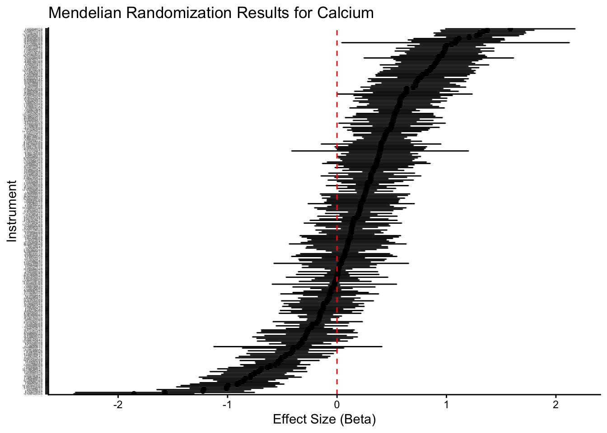

::: {.cell}

```{.r .cell-code}
# hide this code chunk
#| echo: false
#| message: false

# defines the se function
se <- function(x) {
  sd(x, na.rm = TRUE) / sqrt(length(x))
}

#load these packages, nearly always needed
library(tidyverse)

# sets maize and blue color scheme
color_scheme <- c("#00274c", "#ffcb05")
```
:::


## Purpose

To validate SNPs for calcium GWAS using those identified using UK Biobank.  This script can be found in /Users/davebrid/Documents/GitHub/PrecisionNutrition/Human Genetics and was most recently run on Mon Sep 29 12:54:49 2025

## Data Entry


::: {.cell}

```{.r .cell-code}
instruments.calcium.file <- 'Calcium Instruments from UKBB.csv'
gwas.calcium.file <- 'PheWeb Summary Statistics/phenocode-Ca.tsv.gz'
samplesize.outcome.calcium <- 46100


# loaded and renamed columns
instruments.calcium <- read_csv(instruments.calcium.file) |>
  rename(
    SNP                       = SP2,
    id.exposure               = SP2,  
    beta.exposure             = BETA,
    se.exposure               = SE,
    effect_allele.exposure    = EA,
    other_allele.exposure     = OA,
    pval.exposure             = P,
    eaf.exposure              = ALT_FREQS,
    samplesize.exposure       = N_exposure
  ) |>
  mutate(exposure="Calcium (UK Biobank)",
         SNP=id.exposure)


gwas.calcium <- read_tsv(gwas.calcium.file) |>
  mutate(ID=paste(chrom, pos, ref,alt, sep=":")) |>
  rename(
    SNP                        = ID,            # or ID if that’s the matching ID
    id.outcome                 = ID,               # can also just set to a string
    beta.outcome               = beta,
    se.outcome                 = sebeta,
    effect_allele.outcome      = alt,   # whichever is effect allele
    other_allele.outcome       = ref,   # whichever is other allele
    pval.outcome               = pval,
    eaf.outcome                = maf,
  ) |>
  mutate(outcome = "Calcium (Michigan GWAS)",
         SNP=id.outcome,# name of your trait)
         samplesize.outcome = samplesize.outcome.calcium)  # sample size for MGI/BioVU for calcium)
```
:::


This presumes the sample sizes was 46100 from Table 1 of https://doi.org/10.1371/journal.pgen.1009077.

Loaded in the instruments for calcium from UK Biobank from the datafile Calcium Instruments from UKBB.csv and the GWAS summary statistics for calcium from the datafile PheWeb Summary Statistics/phenocode-Ca.tsv.gz.


::: {.cell}

```{.r .cell-code}
library(TwoSampleMR)

data <- harmonise_data(instruments.calcium, gwas.calcium, action = 2)
```
:::


Harmonization results

- We used 269 SNPs as instruments for calcium from UK Biobank.
- There were 269 SNPs in common between the exposure and outcome datasets.
- A total of 270 SNPs remained for use after harmonization
- Removed 0 SNPs due to allele mismatches
- Identified 21 palindromic SNPs 


::: {.cell}

```{.r .cell-code}
data.annot <- data |>
  mutate(R2 = 2 * eaf.outcome * (1 - eaf.outcome) * beta.outcome^2,
         F = (R2 * (samplesize.outcome.calcium - 2)) / (1 - R2))

# Calculate summary metrics
calcium.summary_metrics.outcome <- 
  data.annot %>%
  ungroup %>%
  summarise(
    num_snps = n(),
   cumulative_R2 = sum(R2, na.rm = TRUE),
    mean_F = mean(F, na.rm=TRUE),
    median_F = median(F, na.rm=TRUE),
    mean_maf = mean(eaf.outcome, na.rm = TRUE),
    mean_beta = mean(abs(beta.outcome), na.rm = TRUE),
    overall_F = (cumulative_R2 * (samplesize.outcome.calcium - n() - 1)) / ((1 - cumulative_R2) * n())
  )

library(knitr)
kable(calcium.summary_metrics.outcome, caption="Summary of calcium instruments for outcome GWAS")
```

::: {.cell-output-display}


Table: Summary of calcium instruments for outcome GWAS

| num_snps| cumulative_R2|   mean_F| median_F| mean_maf| mean_beta| overall_F|
|--------:|-------------:|--------:|--------:|--------:|---------:|---------:|
|      270|     0.0171846| 2.934478| 1.509012| 0.275463|  0.012093|  2.967857|


:::
:::


::: {.cell}

```{.r .cell-code}
calcium.control.mr <- mr(data)
summary(calcium.control.mr)
```

::: {.cell-output .cell-output-stdout}

```
 id.exposure         id.outcome          outcome            exposure        
 Length:264         Length:264         Length:264         Length:264        
 Class :character   Class :character   Class :character   Class :character  
 Mode  :character   Mode  :character   Mode  :character   Mode  :character  
                                                                            
                                                                            
                                                                            
    method               nsnp             b                 se         
 Length:264         Min.   :1.000   Min.   :-1.8556   Min.   :0.04448  
 Class :character   1st Qu.:1.000   1st Qu.:-0.1051   1st Qu.:0.26035  
 Mode  :character   Median :1.000   Median : 0.2050   Median :0.35097  
                    Mean   :1.004   Mean   : 0.1825   Mean   :0.33637  
                    3rd Qu.:1.000   3rd Qu.: 0.5137   3rd Qu.:0.41512  
                    Max.   :2.000   Max.   : 1.5834   Max.   :1.04167  
      pval          
 Min.   :1.000e-08  
 1st Qu.:4.550e-02  
 Median :2.354e-01  
 Mean   :3.354e-01  
 3rd Qu.:6.052e-01  
 Max.   :1.000e+00  
```


:::

```{.r .cell-code}
#mr_forest_plot(calcium.control.mr)

dat_h_steiger <- steiger_filtering(data)
table(dat_h_steiger$steiger_direction) 
```

::: {.cell-output .cell-output-stdout}

```
< table of extent 0 >
```


:::

```{.r .cell-code}
ggplot(calcium.control.mr, aes(y=reorder(id.outcome,b),x=b)) +
  geom_point() +
  geom_errorbar(aes(xmin=b-se, xmax=b+se), width=0.2) +
  theme_classic() +
  labs(title="Mendelian Randomization Results for Calcium",
       y="Instrument",
       x="Effect Size (Beta)") +
  geom_vline(xintercept=0, linetype="dashed", color = "red") +
  theme(axis.text.y = element_text(size=2))
```

::: {.cell-output-display}
{width=672}
:::
:::


## Session Information


::: {.cell}

```{.r .cell-code}
sessionInfo()
```

::: {.cell-output .cell-output-stdout}

```
R version 4.5.1 (2025-06-13)
Platform: aarch64-apple-darwin20
Running under: macOS Sequoia 15.7

Matrix products: default
BLAS:   /Library/Frameworks/R.framework/Versions/4.5-arm64/Resources/lib/libRblas.0.dylib 
LAPACK: /Library/Frameworks/R.framework/Versions/4.5-arm64/Resources/lib/libRlapack.dylib;  LAPACK version 3.12.1

locale:
[1] en_US.UTF-8/en_US.UTF-8/en_US.UTF-8/C/en_US.UTF-8/en_US.UTF-8

time zone: America/Detroit
tzcode source: internal

attached base packages:
[1] stats     graphics  grDevices utils     datasets  methods   base     

other attached packages:
 [1] knitr_1.50         TwoSampleMR_0.6.22 lubridate_1.9.4    forcats_1.0.0     
 [5] stringr_1.5.2      dplyr_1.1.4        purrr_1.1.0        readr_2.1.5       
 [9] tidyr_1.3.1        tibble_3.3.0       ggplot2_4.0.0      tidyverse_2.0.0   

loaded via a namespace (and not attached):
 [1] generics_0.1.4     lattice_0.22-7     stringi_1.8.7      hms_1.1.3         
 [5] digest_0.6.37      magrittr_2.0.4     evaluate_1.0.5     grid_4.5.1        
 [9] timechange_0.3.0   RColorBrewer_1.1-3 fastmap_1.2.0      plyr_1.8.9        
[13] jsonlite_2.0.0     scales_1.4.0       mnormt_2.1.1       cli_3.6.5         
[17] rlang_1.1.6        crayon_1.5.3       bit64_4.6.0-1      withr_3.0.2       
[21] yaml_2.3.10        tools_4.5.1        parallel_4.5.1     tzdb_0.5.0        
[25] vctrs_0.6.5        R6_2.6.1           lifecycle_1.0.4    htmlwidgets_1.6.4 
[29] bit_4.6.0          vroom_1.6.5        psych_2.5.6        pkgconfig_2.0.3   
[33] pillar_1.11.0      gtable_0.3.6       glue_1.8.0         data.table_1.17.8 
[37] Rcpp_1.1.0         xfun_0.53          tidyselect_1.2.1   rstudioapi_0.17.1 
[41] farver_2.1.2       nlme_3.1-168       htmltools_0.5.8.1  labeling_0.4.3    
[45] rmarkdown_2.29     compiler_4.5.1     S7_0.2.0          
```


:::
:::

