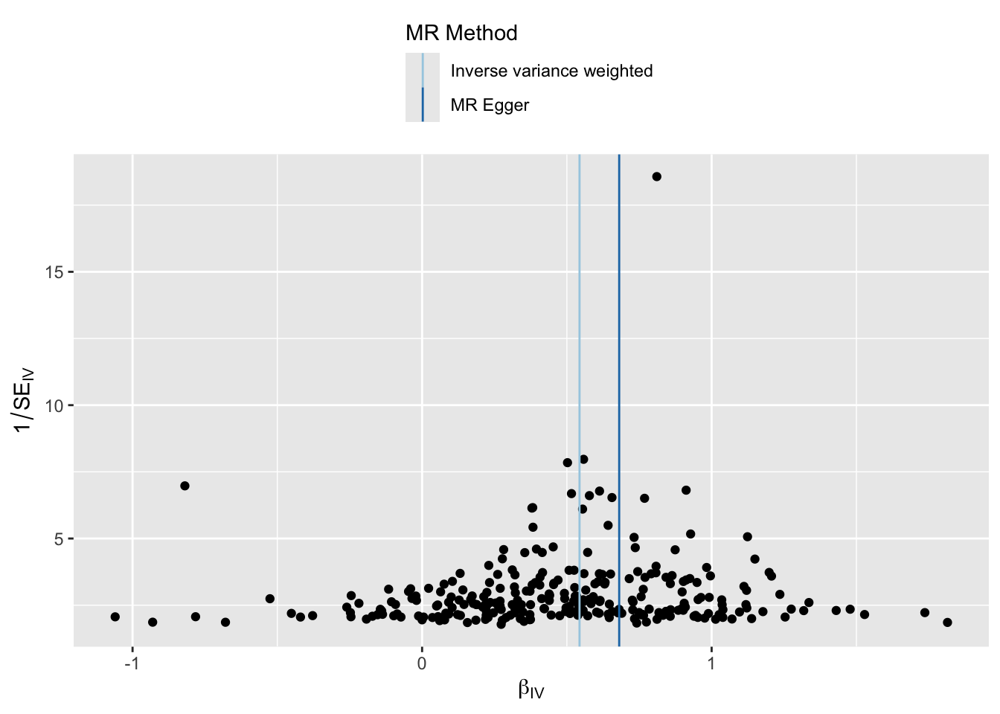
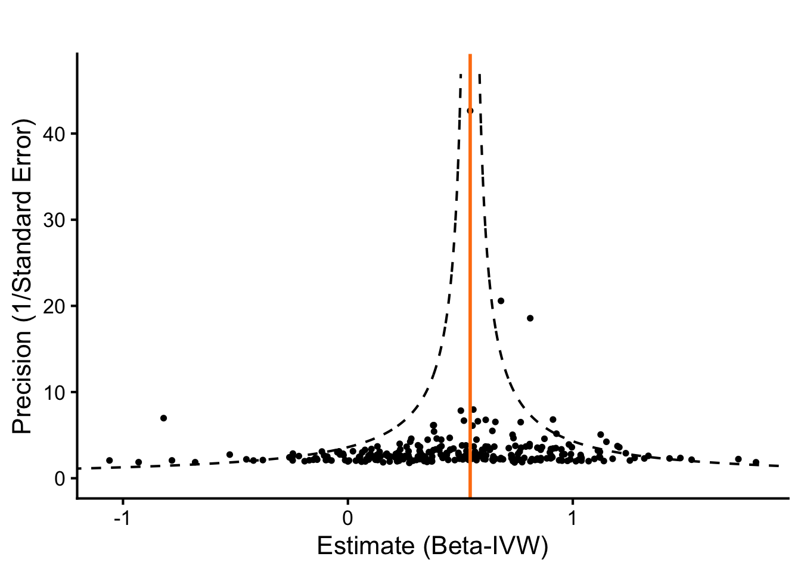
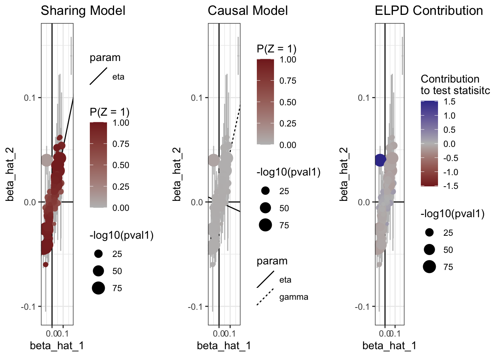

::: {.cell}

```{.r .cell-code}
# hide this code chunk
#| echo: false
#| message: false

# defines the se function
se <- function(x) {
  sd(x, na.rm = TRUE) / sqrt(length(x))
}

#load these packages, nearly always needed
library(tidyverse)
library(knitr)

# sets maize and blue color scheme
color_scheme <- c("#00274c", "#ffcb05")
```
:::


## Purpose

To validate SNPs for calcium GWAS using those identified using UK Biobank.  This script can be found in /Users/davebrid/Documents/GitHub/PrecisionNutrition/Human Genetics and was most recently run on Wed Nov 26 10:14:08 2025

## Data Entry


::: {.cell}

```{.r .cell-code}
instruments.calcium.file <- 'Calcium Instruments from UKBB.csv'
gwas.calcium.file <- 'PheWeb Summary Statistics/phenocode-Ca.tsv.gz'
samplesize.outcome.calcium <- 46100


# loaded and renamed columns
instruments.calcium <- read_csv(instruments.calcium.file) |>
  rename(
    SNP                       = SP2,
    beta.exposure             = BETA,
    se.exposure               = SE,
    effect_allele.exposure    = EA,
    other_allele.exposure     = OA,
    pval.exposure             = P,
    eaf.exposure              = ALT_FREQS,
    samplesize.exposure       = N_exposure
  ) |>
  mutate(id.exposure="Calcium (UK Biobank)",
         exposure="Calcium (UK Biobank)")


gwas.calcium <- read_tsv(gwas.calcium.file) |>
  mutate(ID=paste(chrom, pos, ref,alt, sep=":")) |>
  rename(
    SNP                        = ID,            # or ID if that’s the matching ID
    beta.outcome               = beta,
    se.outcome                 = sebeta,
    effect_allele.outcome      = alt,   # whichever is effect allele
    other_allele.outcome       = ref,   # whichever is other allele
    pval.outcome               = pval,
    eaf.outcome                = maf,
  ) |>
  mutate(id.outcome = "Calcium (Michigan GWAS)",
         outcome = "Calcium (Michigan GWAS)",
         samplesize.outcome = samplesize.outcome.calcium)  # sample size for MGI/BioVU for calcium)
```
:::


This presumes the sample sizes was 46100 from Table 1 of https://doi.org/10.1371/journal.pgen.1009077.

Loaded in the instruments for calcium from UK Biobank from the datafile Calcium Instruments from UKBB.csv and the GWAS summary statistics for calcium from the datafile PheWeb Summary Statistics/phenocode-Ca.tsv.gz.


::: {.cell}

```{.r .cell-code}
library(TwoSampleMR)

data <- harmonise_data(instruments.calcium, gwas.calcium, action = 2)

table(data$mr_keep) |>
  kable(caption="Number of SNPs kept for MR analysis")
```

::: {.cell-output-display}


Table: Number of SNPs kept for MR analysis

|Var1  | Freq|
|:-----|----:|
|FALSE |    2|
|TRUE  |  275|


:::

```{.r .cell-code}
table(data$palindromic)  |>
  kable(caption="Number of palindromic SNPs")
```

::: {.cell-output-display}


Table: Number of palindromic SNPs

|Var1  | Freq|
|:-----|----:|
|FALSE |  255|
|TRUE  |   22|


:::

```{.r .cell-code}
data <- data %>%
  mutate(
    allele_match = (toupper(effect_allele.exposure) == toupper(effect_allele.outcome)) &
                  (toupper(other_allele.exposure) == toupper(other_allele.outcome)),
    allele_swapped = (toupper(effect_allele.exposure) == toupper(other_allele.outcome)) &
                    (toupper(other_allele.exposure) == toupper(effect_allele.outcome))
  )

# 2) EAF concordance checks (detect possible strand/orientation issues)
# requires eaf.exposure and eaf.outcome present
if(all(c("eaf.exposure","eaf.outcome") %in% names(data))){
  data <- data %>%
    mutate(
      eaf_diff = abs(eaf.exposure - eaf.outcome),
      eaf_flip_diff = abs(eaf.exposure - (1 - eaf.outcome)),
      suspicious_eaf = (eaf_diff > 0.2 & eaf_flip_diff > 0.2)  # very different frequencies
    )
  summary(data$eaf_diff)
  summary(data$eaf_flip_diff)
  cat("Num suspicious EAFs:", sum(data$suspicious_eaf, na.rm=TRUE), "\n")
} else {
  cat("No EAF columns present for both datasets; consider adding reference panel EAFs.\n")
}
```

::: {.cell-output .cell-output-stdout}

```
Num suspicious EAFs: 0 
```


:::

```{.r .cell-code}
# 3) List discordant SNPs
data <- data %>%
  mutate(sign_match = sign(beta.exposure) == sign(beta.outcome))

discordant <- data %>% filter(!sign_match) %>%
  select(SNP, beta.exposure, se.exposure, beta.outcome, se.outcome,
         effect_allele.exposure, other_allele.exposure,
         effect_allele.outcome, other_allele.outcome,
         palindromic, ambiguous, eaf.exposure, eaf.outcome)

kable(discordant |>
        arrange(beta.exposure) |>
        select(SNP,beta.exposure,se.exposure,beta.outcome,se.outcome),
      caption="Discordant SNPs where the beta coefficients directionally differ between exposure and outcome")
```

::: {.cell-output-display}


Table: Discordant SNPs where the beta coefficients directionally differ between exposure and outcome

|SNP              | beta.exposure| se.exposure| beta.outcome| se.outcome|
|:----------------|-------------:|-----------:|------------:|----------:|
|2:234264848:C:G  |      -0.04882|    0.002709|       0.0400|     0.0070|
|10:100179851:T:C |      -0.03719|    0.004556|       0.0043|     0.0120|
|16:47980267:T:C  |      -0.03655|    0.005844|       0.0051|     0.0160|
|5:131329591:T:C  |      -0.02572|    0.003741|       0.0005|     0.0096|
|12:4004752:T:C   |      -0.02562|    0.003298|       0.0012|     0.0085|
|1:1095130:T:C    |      -0.02524|    0.002786|       0.0010|     0.0081|
|10:96035980:T:C  |      -0.02221|    0.004032|       0.0055|     0.0100|
|3:121323008:C:G  |      -0.02193|    0.003964|       0.0099|     0.0100|
|2:111989372:T:G  |      -0.02055|    0.004040|       0.0015|     0.0100|
|6:25745243:A:T   |      -0.01892|    0.002773|       0.0020|     0.0072|
|15:51524292:A:G  |      -0.01865|    0.002634|       0.0098|     0.0068|
|14:70000399:A:C  |      -0.01821|    0.003351|       0.0028|     0.0085|
|19:3369753:C:G   |      -0.01767|    0.003447|       0.0120|     0.0095|
|2:165539661:T:C  |      -0.01696|    0.002570|       0.0037|     0.0066|
|6:44097472:T:C   |      -0.01666|    0.003138|       0.0063|     0.0079|
|17:66820449:T:C  |      -0.01576|    0.002533|       0.0041|     0.0065|
|19:35370305:A:G  |      -0.01430|    0.002619|       0.0014|     0.0068|
|14:30364061:C:G  |      -0.01397|    0.002769|       0.0130|     0.0075|
|2:202207993:T:C  |       0.01268|    0.002512|       0.0000|     0.0065|
|20:62586262:T:C  |       0.01384|    0.002572|      -0.0034|     0.0067|
|16:54573024:A:G  |       0.01404|    0.002640|      -0.0027|     0.0071|
|22:39131727:T:G  |       0.01406|    0.002635|      -0.0110|     0.0068|
|13:110955187:T:C |       0.01500|    0.002756|      -0.0063|     0.0073|
|21:37835347:A:T  |       0.01630|    0.002865|      -0.0014|     0.0075|
|2:10213497:A:G   |       0.01634|    0.003023|      -0.0002|     0.0078|
|12:4057955:T:C   |       0.01683|    0.002947|      -0.0023|     0.0078|
|2:131089135:T:C  |       0.01689|    0.003111|      -0.0029|     0.0081|
|10:65393613:A:G  |       0.01743|    0.002640|      -0.0016|     0.0069|
|2:103151136:A:G  |       0.01981|    0.003588|      -0.0210|     0.0096|
|20:52786406:T:C  |       0.02285|    0.003207|      -0.0008|     0.0083|
|2:54846400:A:G   |       0.02574|    0.003572|      -0.0063|     0.0090|
|20:52813216:T:C  |       0.03049|    0.004855|      -0.0044|     0.0130|
|2:96061242:C:G   |       0.05118|    0.006802|      -0.0011|     0.0180|


:::

```{.r .cell-code}
library(ggrepel)
ggplot(data, aes(x=beta.exposure, y=beta.outcome, color = sign_match)) +
  geom_point(size=2) +
  geom_errorbar(aes(ymin = beta.outcome - 1.96*se.outcome, ymax = beta.outcome + 1.96*se.outcome), width=0) +
  geom_text_repel(data = filter(data, !sign_match), aes(label=SNP), hjust=0, vjust=0, size=3) +
  theme_minimal() +
  labs(x="beta.exposure", y="beta.outcome", title="Exposure vs Outcome betas; discordant SNPs labeled")
```

::: {.cell-output-display}
{width=672}
:::
:::


::: {.cell}

```{.r .cell-code}
ggplot(data, aes(x=beta.exposure, y=beta.outcome)) +
  geom_point(size=1) +
  geom_errorbar(aes(ymin = beta.outcome - 1.96*se.outcome,
                    ymax = beta.outcome + 1.96*se.outcome),
                alpha=0.5) +
  geom_errorbar(aes(xmin = beta.exposure - 1.96*se.exposure,
                    xmax = beta.exposure + 1.96*se.exposure),
                alpha=0.5) +
  geom_smooth(method="lm",se=F) +
  theme_classic(base_size=16) +
  labs(x="Exposure Estimate", 
       y="Outcome Estimate", 
       title="Calcium (UK Biobank -> LabWAS)") 
```

::: {.cell-output-display}
{width=672}
:::
:::


There were 33 discordant SNPs between the exposure and outcome datasets.  These are listed above.  We can see that some of these SNPs have very small effect sizes in the outcome dataset, suggesting that the discordance may be due to noise.  These were kept in the analysis

### Steiger Filtering


::: {.cell}

```{.r .cell-code}
data_steiger <- steiger_filtering(data)

table(data_steiger$steiger_direction, useNA="ifany") |>
  kable(caption="Steiger filtering results for calcium-calcium evaluation")
```

::: {.cell-output-display}


Table: Steiger filtering results for calcium-calcium evaluation

| Freq|
|----:|


:::
:::


Harmonization results

- We used 363 SNPs as instruments for calcium from UK Biobank.
- There were 275 SNPs in common between the exposure and outcome datasets.
- Removed 0 SNPs due to allele mismatches
- Identified 22 palindromic SNPs 
- A total of 277 SNPs remained for use after harmonization.  2 SNPS were removed because the palindromic SNP is ambiguous and strand alignment could not be resolved, this variant was automatically dropped from the MR analysis to avoid mis-specified effect directions.
- After Steiger filtering, 275 SNPs were retained for analysis, indicating that all SNPs had stronger associations with the exposure (calcium in UK Biobank) than the outcome (calcium in MGI/BioVU), supporting the assumed causal direction.  0 SNPs were removed by Steiger filtering.


::: {.cell}

```{.r .cell-code}
data.annot <- data_steiger %>%
  mutate(
    R2.exposure = 2 * eaf.exposure * (1 - eaf.exposure) * beta.exposure^2,
    F.exposure = (R2.exposure * (samplesize.exposure - 2)) / (1 - R2.exposure)
  )

calcium.exposure.summary <- data.annot %>%
  summarise(
    num_snps = n(),
    samplesize.exposure = first(samplesize.exposure),
    cumulative_R2 = sum(R2.exposure, na.rm = TRUE),
    mean_F = mean(F.exposure, na.rm = TRUE),
    median_F = median(F.exposure, na.rm = TRUE),
    mean_maf = mean(eaf.exposure, na.rm = TRUE),
    mean_beta = mean(abs(beta.exposure), na.rm = TRUE)
  ) |>
  mutate(overall_F = (cumulative_R2 * (samplesize.exposure - num_snps - 1)) / 
                     ((1 - cumulative_R2) * num_snps))

# For outcome (e.g., cholesterol) SNPs
outcome.summary_metrics <- data.annot %>%
  summarise(
    num_snps = n(),
    mean_beta = mean(abs(beta.outcome), na.rm = TRUE),
    mean_se = mean(se.outcome, na.rm = TRUE),
    mean_maf = mean(eaf.outcome, na.rm = TRUE)
  )

library(knitr)
kable(calcium.exposure.summary, caption="Summary of calcium instruments after harmonisation")
```

::: {.cell-output-display}


Table: Summary of calcium instruments after harmonisation

| num_snps| samplesize.exposure| cumulative_R2|  mean_F| median_F|  mean_maf| mean_beta| overall_F|
|--------:|-------------------:|-------------:|-------:|--------:|---------:|---------:|---------:|
|      277|              385066|     0.0638365| 88.8467| 54.59161| 0.3670863| 0.0259874|  94.72378|


:::

```{.r .cell-code}
write_csv(outcome.summary_metrics, "Instrument Metrics - Calcium - Post-Harmonization.csv")

#write out the instruments used for calcium
data_steiger %>% filter(mr_keep==TRUE) %>% 
  mutate(Exposure = "Calcium") |>
  select(Exposure, CHR, POS, effect_allele.exposure, other_allele.exposure, beta.exposure, se.exposure, pval.exposure, eaf.exposure, R2, `F`, rsids, nearest_genes) |>
  rename(effect_allele = effect_allele.exposure,
         other_allele = other_allele.exposure,
         beta = beta.exposure,
         se = se.exposure,
         p = pval.exposure,
         eaf = eaf.exposure) |>
  write_csv("Calcium Instruments Post-Harmonization.csv")
  
kable(outcome.summary_metrics, caption="Summary of outcome summary ")
```

::: {.cell-output-display}


Table: Summary of outcome summary 

| num_snps| mean_beta|   mean_se|  mean_maf|
|--------:|---------:|---------:|---------:|
|      277| 0.0146729| 0.0089444| 0.2610072|


:::
:::


::: {.cell}

```{.r .cell-code}
calcium.control.mr <- mr(data_steiger,
                         method_list = c(
  "mr_ivw_mre",
  "mr_ivw_fe",
  "mr_egger_regression", 
  'mr_raps',
  "mr_weighted_median", 
  "mr_weighted_mode"
))

#M-PRESSO has to be run separately
library(MRPRESSO)

calcium.control.mr_presso_results <- mr_presso(
  BetaOutcome = "beta.outcome",      # Column name for outcome betas
  BetaExposure = "beta.exposure",    # Column name for exposure betas
  SdOutcome = "se.outcome",          # Column name for outcome SEs
  SdExposure = "se.exposure",        # Column name for exposure SEs
  data = data_steiger,                  # Your dataset
  NbDistribution = 2000,              # Number of distributions (default 1000)
  SignifThreshold = 0.05,             # Significance threshold
  OUTLIERtest = TRUE,                 # Perform outlier test
  DISTORTIONtest = TRUE,              # Perform distortion test
)

library(forcats)
calcium.control.mr_presso_results$`Main MR results` |>
  select(`MR Analysis`, `Causal Estimate`, Sd, `P-value`) |>
  rename(method = `MR Analysis`,
         b = `Causal Estimate`,
         se = Sd,
         pval = `P-value`) |>
  mutate(method = fct_recode(method,
                             "MR-PRESSO (Raw)"="Raw",
                             "MR-PRESSO (Outlier-corrected)"="Outlier-corrected")) -> calcium.control.mr_presso_df

calcuim.control.mr.mrpresso <- bind_rows(as_tibble(calcium.control.mr), as_tibble(calcium.control.mr_presso_df))|>
  fill(id.exposure, id.outcome, exposure, outcome,nsnp,.direction="down")

calcuim.control.mr.mrpresso |> #select(-starts_with('id')) |> 
  kable(caption="MR Results for Calcium Positive Control",
        digits=c(0,0,0,0,3,3,99))
```

::: {.cell-output-display}


Table: MR Results for Calcium Positive Control

|id.exposure          |id.outcome              |outcome                 |exposure             |method                                                    | nsnp|         b| se| pval|
|:--------------------|:-----------------------|:-----------------------|:--------------------|:---------------------------------------------------------|----:|---------:|--:|----:|
|Calcium (UK Biobank) |Calcium (Michigan GWAS) |Calcium (Michigan GWAS) |Calcium (UK Biobank) |Inverse variance weighted (multiplicative random effects) |  275| 0.5437075|  0|    0|
|Calcium (UK Biobank) |Calcium (Michigan GWAS) |Calcium (Michigan GWAS) |Calcium (UK Biobank) |Inverse variance weighted (fixed effects)                 |  275| 0.5437075|  0|    0|
|Calcium (UK Biobank) |Calcium (Michigan GWAS) |Calcium (Michigan GWAS) |Calcium (UK Biobank) |MR Egger                                                  |  275| 0.6806916|  0|    0|
|Calcium (UK Biobank) |Calcium (Michigan GWAS) |Calcium (Michigan GWAS) |Calcium (UK Biobank) |Robust adjusted profile score (RAPS)                      |  275| 0.5420480|  0|    0|
|Calcium (UK Biobank) |Calcium (Michigan GWAS) |Calcium (Michigan GWAS) |Calcium (UK Biobank) |Weighted median                                           |  275| 0.5576021|  0|    0|
|Calcium (UK Biobank) |Calcium (Michigan GWAS) |Calcium (Michigan GWAS) |Calcium (UK Biobank) |Weighted mode                                             |  275| 0.5572371|  0|    0|
|Calcium (UK Biobank) |Calcium (Michigan GWAS) |Calcium (Michigan GWAS) |Calcium (UK Biobank) |MR-PRESSO (Raw)                                           |  275| 0.5451830|  0|    0|
|Calcium (UK Biobank) |Calcium (Michigan GWAS) |Calcium (Michigan GWAS) |Calcium (UK Biobank) |MR-PRESSO (Outlier-corrected)                             |  275| 0.5355132|  0|    0|


:::

```{.r .cell-code}
calcuim.control.mr.mrpresso |> select(-starts_with('id')) |> 
  write_csv("MR Results - Calcium Postive Control.csv")

ggplot(calcuim.control.mr.mrpresso, aes(y=method,x=b)) +
  geom_point() +
  geom_errorbar(aes(xmin=b-1.96*se, xmax=b+1.96*se), width=0.2) +
  theme_classic(base_size=16) +
  labs(title="",
       y="",
       x="Effect Size (Beta)") +
  geom_vline(xintercept=0, linetype="dashed", color = "red") 
```

::: {.cell-output-display}
{width=672}
:::
:::


The primary result, using the Inverse variance weighted (multiplicative random effects) method shows a 0.5437075 $\pm$ 0.0234494 SD increase in calcium (MGI-BioVU LabWAS) per 1 SD increase in calcium (UK Biobank).  This is statistically significant with a p-value of 6.2499238\times 10^{-119}.  All six MR methods (IVW, weighted median, weighted mode, MR-Egger, MR-PRESSO with and without outliers) gave consistent, significant causal estimates, confirming instrument validity and harmonisation.

### MR-Egger Intercept


::: {.cell}

```{.r .cell-code}
egger_intercept <- mr_pleiotropy_test(data_steiger)
egger_intercept|>
  select(-starts_with('id')) |> 
  kable(caption="MR Pleiotropy Results for Calcium Positive Control")
```

::: {.cell-output-display}


Table: MR Pleiotropy Results for Calcium Positive Control

|outcome                 |exposure             | egger_intercept|        se|      pval|
|:-----------------------|:--------------------|---------------:|---------:|---------:|
|Calcium (Michigan GWAS) |Calcium (UK Biobank) |      -0.0040361| 0.0012601| 0.0015212|


:::
:::


The MR-Egger intercept is  with a p-value of 0.0015212, indicating some evidence of directional pleiotropy.  Although the p-value is small, the intercept magnitude is near zero, indicating that any pleiotropic bias is likely minor.

### Heterogeneity Statistics


::: {.cell}

```{.r .cell-code}
# Heterogeneity tests for IVW and MR-Egger
heterogeneity <- mr_heterogeneity(data_steiger)
heterogeneity|>
  select(-starts_with('id')) |> 
  kable(caption="MR Heterogeneity Results for Calcium Positive Control",
        digits=c(0,0,0,3,3,99))
```

::: {.cell-output-display}


Table: MR Heterogeneity Results for Calcium Positive Control

|outcome                 |exposure             |method                    |       Q| Q_df|       Q_pval|
|:-----------------------|:--------------------|:-------------------------|-------:|----:|------------:|
|Calcium (Michigan GWAS) |Calcium (UK Biobank) |MR Egger                  | 433.461|  273| 2.060484e-09|
|Calcium (Michigan GWAS) |Calcium (UK Biobank) |Inverse variance weighted | 449.751|  274| 1.083278e-10|


:::

```{.r .cell-code}
# Columns: method, Q, Q_df, Q_pval
# Interpretation: small Q_pval (<0.05) indicates heterogeneity among SNPs
```
:::


This is expected with polygenic traits and does not necessarily invalidate the overall causal estimate, particularly since robust methods (weighted median, weighted mode) gave consistent results.

### MR-PRESSO Global Test and Distortion Test


::: {.cell}

```{.r .cell-code}
calcium.control.mr_presso_results$`MR-PRESSO results`$`Global Test` |>
  unlist() |> as.data.frame() |>
  rename(`Global Test` = 1) |>
  kable(caption="MR-PRESSO Global Test Results for Calcium Positive Control")
```

::: {.cell-output-display}


Table: MR-PRESSO Global Test Results for Calcium Positive Control

|       |Global Test      |
|:------|:----------------|
|RSSobs |463.917446671805 |
|Pvalue |<5e-04           |


:::

```{.r .cell-code}
calcium.control.mr_presso_results$`MR-PRESSO results`$`Distortion Test` -> calcium.distortion.test
```
:::


From MR-PRESSO there were 2 outliers that were removed before the distortion test.  The ratio of the IVW estimate before and after their removal was 1.8057037, with a p-value of 0.6305, indicating no significant distortion due to outliers.  The global test was significant, showing evidence of average directional horizontal pleiotropy so we should prefer the corrected estimate.  This is consistent with the evidence from the MR-Egger intercept.  This means we should prefer the MR-PRESSO pleiotropy-corrected estimate as the primary result.


::: {.cell}

```{.r .cell-code}
single_snp_results <- mr_singlesnp(data_steiger)
mr_funnel_plot(single_snp_results) 
```

::: {.cell-output .cell-output-stdout}

```
$`Calcium (UK Biobank).Calcium (Michigan GWAS)`
```


:::

::: {.cell-output-display}
{width=672}
:::

::: {.cell-output .cell-output-stdout}

```

attr(,"split_type")
[1] "data.frame"
attr(,"split_labels")
           id.exposure              id.outcome
1 Calcium (UK Biobank) Calcium (Michigan GWAS)
```


:::

```{.r .cell-code}
# Get overall IVW estimate for the vertical line
ivw_beta <- calcium.control.mr |> filter(method=="Inverse variance weighted (multiplicative random effects)") |> pull(b)

# Determine y-range based on your data
y_min <- 0
y_max <- max(single_snp_results$se^{-1}) * 1.1  # 10% padding above max precision

# Generate a fine grid of precision values
precision_grid <- seq(y_min, y_max, length.out = 1000)

# Compute boundaries: ivw_beta ± 1.96 / precision
lower_bound <- ivw_beta - 1.96 / precision_grid
upper_bound <- ivw_beta + 1.96 / precision_grid

# Create data frame for boundaries
bounds_df <- data.frame(precision = precision_grid, lower = lower_bound, upper = upper_bound)

# Plot
ggplot(single_snp_results, aes(x = b, y = 1/se)) +
  # Scatter points for each SNP
  geom_point(size = 1) +
  # Vertical line at IVW estimate
  geom_vline(xintercept = ivw_beta, linetype = "solid", color = "#ff7f0e", size = 1) +
  # Curved pseudo-95% CI boundaries (the cone)
  geom_line(data = bounds_df, aes(x = lower, y = precision), linetype = "dashed") +
  geom_line(data = bounds_df, aes(x = upper, y = precision), linetype = "dashed") +
  # Customize axes and labels
  labs(
    x = "Estimate (Beta-IVW)",
    y = "Precision (1/Standard Error)",
    title = ""
  ) +
  # Apply clean theme and limit y to >=0
  theme_classic(base_size = 16) +
  theme(plot.title = element_text(hjust = 0.5)) +
  coord_cartesian(ylim = c(0, y_max), xlim = c(min(single_snp_results$b), max(single_snp_results$b)))  # Adjust x-limits for visibility
```

::: {.cell-output-display}
{width=672}
:::
:::


### MR-CAUSE Analysis

CAUSE was used to model both correlated and uncorrelated horizontal pleiotropy.  Correlated pleiotropy are the effects of the SNPs an outcome not through the trait but through a confounder.  Uncorrelated horizontal pleiotropy is direct effects of the SNPs on the outcome independent of the modeled trait.  This is described in [@morrisonMendelianRandomizationAccounting2020].


::: {.cell}

```{.r .cell-code}
#devtools::install_github("jean997/cause@v1.2.0")
library(cause)
calcium.cause.data <-
  data_steiger |>
  rename(
    snp = SNP,
    beta_hat_1 = beta.exposure,
    beta_hat_2 = beta.outcome,
    seb1 = se.exposure,
    seb2 = se.outcome
  ) |>
  new_cause_data()

calcium.params_ests <- est_cause_params(
  X = calcium.cause.data,                    # Merged data
  variants = calcium.cause.data$snp,
  optmethod = "mixSQP",     # Default & recommended
  null_wt = 10,             # Weight on null (default)
  max_candidates = Inf      # Full grid (default)
)
```

::: {.cell-output .cell-output-stdout}

```
Estimating CAUSE parameters with  277  variants.
1 0.8507359 
2 0.01343516 
3 0.0001838567 
4 2.506443e-06 
5 3.416405e-08 
```


:::

```{.r .cell-code}
calcium.control.cause <- cause(X=calcium.cause.data,
                               param_ests = calcium.params_ests)
```

::: {.cell-output .cell-output-stdout}

```
Estimating CAUSE posteriors using  277  variants.
```


:::

```{.r .cell-code}
calcium.control.cause$elpd |> kable(caption="if delta_elpd is negative, model2 is a better fit, in this case means the causal model is better than the pleiotropic sharing model or either null models")
```

::: {.cell-output-display}


Table: if delta_elpd is negative, model2 is a better fit, in this case means the causal model is better than the pleiotropic sharing model or either null models

|model1  |model2  | delta_elpd| se_delta_elpd|         z|
|:-------|:-------|----------:|-------------:|---------:|
|null    |sharing | -83.463413|      9.048679| -9.223823|
|null    |causal  | -91.048117|     10.288707| -8.849325|
|sharing |causal  |  -7.584704|      1.869789| -4.056449|


:::

```{.r .cell-code}
plot(calcium.control.cause, type="data")
```

::: {.cell-output-display}
{width=672}
:::

```{.r .cell-code}
summary(calcium.control.cause, ci_size = 0.95)$tab |> kable(caption="Pathway estimates and 95% confidence interveals for estimated effect sizes, ")
```

::: {.cell-output-display}


Table: Pathway estimates and 95% confidence interveals for estimated effect sizes, 

|model   |gamma             |eta                 |q               |
|:-------|:-----------------|:-------------------|:---------------|
|Sharing |NA                |0.52 (0.45, 0.59)   |0.81 (0.7, 0.9) |
|Causal  |0.48 (0.41, 0.55) |-0.05 (-1.15, 0.58) |0.03 (0, 0.24)  |


:::
:::


From the CAUSE analyses there is significant evidence to prefer the causal pathway compared with the shared (pleiotropic) pathways (p=2.4912242\times 10^{-5}). The estimated causal effect ($\gamma$) is 0.48 (0.41, 0.55) and the residual correlated pleiotropy was minimal after accounting for this causal effect. The $\eta$ = -0.05 (-1.15, 0.58) is near zero for the causal model but is substantial for the sharing model [$\eta$=-0.05 (-1.15, 0.58)]]. In the absence of a causal effect (sharing model), correlated horizontal pleiotropy would explain 0.81 (0.7, 0.9)% of the genetic correlation between traits. However, the preference for the causal model indicates the observed correlation is primarily driven by the causal pathway rather than shared pleiotropy.

### Leave-one-out Analysis

Using IVW methods


::: {.cell}

```{.r .cell-code}
# LOO using IVW
loo_res <- mr_leaveoneout(data_steiger)
loo_res |> 
  mutate(diff = b - filter(calcium.control.mr, method=="Inverse variance weighted (multiplicative random effects)")$b) |>
  arrange(-abs(diff)) |>
  head() |>
  select(SNP,diff,b,se,p) |>
  kable(caption="Leave-One-Out Results for Calcium Positive Control (IVW method) for influential SNPs",
        digits=c(0,5,5,5,5))
```

::: {.cell-output-display}


Table: Leave-One-Out Results for Calcium Positive Control (IVW method) for influential SNPs

|SNP             |     diff|       b|      se|  p|
|:---------------|--------:|-------:|-------:|--:|
|3:121993247:A:G | -0.03487| 0.50884| 0.02420|  0|
|2:234264848:C:G |  0.02258| 0.56629| 0.02113|  0|
|2:97400324:A:G  | -0.00581| 0.53789| 0.02351|  0|
|9:80366259:T:C  | -0.00503| 0.53867| 0.02336|  0|
|1:43458250:T:C  | -0.00365| 0.54006| 0.02339|  0|
|20:52720530:A:G | -0.00347| 0.54024| 0.02349|  0|


:::

```{.r .cell-code}
# Columns: SNP, nsnp, b, se, pval — gives causal estimate with each SNP removed once

# Optional: plot LOO results

ggplot(loo_res, aes(x = reorder(SNP, -b), y = b)) +
  geom_point(size=1) +
  geom_errorbar(aes(ymin = b - 1.96*se, ymax = b + 1.96*se), width = 0.01 ,alpha=0.5) +
  coord_flip() +
  labs(x = "SNP Removed", y = "Estimate (Beta-IVW; leave-one-out)") +
  geom_hline(yintercept=0, linetype="dashed", color = "red") +
  theme_classic(base_size=16) +
  theme(axis.text.y = element_text(size = 1)) 
```

::: {.cell-output-display}
{width=672}
:::
:::

Leave-one-out analyses suggested that two SNPs had a relatively large influence on the IVW estimate, but removal of either SNP did not qualitatively change the overall conclusion, supporting the robustness of the causal inference.


## Session Information


::: {.cell}

```{.r .cell-code}
sessionInfo()
```

::: {.cell-output .cell-output-stdout}

```
R version 4.5.2 (2025-10-31)
Platform: aarch64-apple-darwin20
Running under: macOS Tahoe 26.1

Matrix products: default
BLAS:   /System/Library/Frameworks/Accelerate.framework/Versions/A/Frameworks/vecLib.framework/Versions/A/libBLAS.dylib 
LAPACK: /Library/Frameworks/R.framework/Versions/4.5-arm64/Resources/lib/libRlapack.dylib;  LAPACK version 3.12.1

locale:
[1] en_US.UTF-8/en_US.UTF-8/en_US.UTF-8/C/en_US.UTF-8/en_US.UTF-8

time zone: America/Detroit
tzcode source: internal

attached base packages:
[1] stats     graphics  grDevices utils     datasets  methods   base     

other attached packages:
 [1] cause_1.2.0        MRPRESSO_1.0       ggrepel_0.9.6      TwoSampleMR_0.6.22
 [5] knitr_1.50         lubridate_1.9.4    forcats_1.0.1      stringr_1.6.0     
 [9] dplyr_1.1.4        purrr_1.2.0        readr_2.1.6        tidyr_1.3.1       
[13] tibble_3.3.0       ggplot2_4.0.1      tidyverse_2.0.0   

loaded via a namespace (and not attached):
 [1] gtable_0.3.6          xfun_0.54             htmlwidgets_1.6.4    
 [4] psych_2.5.6           lattice_0.22-7        tzdb_0.5.0           
 [7] vctrs_0.6.5           tools_4.5.2           generics_0.1.4       
[10] curl_7.0.0            parallel_4.5.2        pkgconfig_2.0.3      
[13] Matrix_1.7-4          SQUAREM_2021.1        data.table_1.17.8    
[16] RColorBrewer_1.1-3    S7_0.2.1              RcppParallel_5.1.11-1
[19] truncnorm_1.0-9       lifecycle_1.0.4       rootSolve_1.8.2.4    
[22] compiler_4.5.2        farver_2.1.2          mnormt_2.1.1         
[25] htmltools_0.5.8.1     mr.raps_0.4.2         yaml_2.3.10          
[28] pillar_1.11.1         crayon_1.5.3          nlme_3.1-168         
[31] rsnps_0.6.1           tidyselect_1.2.1      digest_0.6.38        
[34] nortest_1.0-4         stringi_1.8.7         ashr_2.2-63          
[37] labeling_0.4.3        splines_4.5.2         fastmap_1.2.0        
[40] grid_4.5.2            invgamma_1.2          cli_3.6.5            
[43] magrittr_2.0.4        loo_2.8.0             crul_1.6.0           
[46] withr_3.0.2           scales_1.4.0          bit64_4.6.0-1        
[49] timechange_0.3.0      rmarkdown_2.30        matrixStats_1.5.0    
[52] bit_4.6.0             gridExtra_2.3         hms_1.1.4            
[55] evaluate_1.0.5        irlba_2.3.5.1         mgcv_1.9-4           
[58] rlang_1.1.6           mixsqp_0.3-54         Rcpp_1.1.0           
[61] glue_1.8.0            httpcode_0.3.0        rstudioapi_0.17.1    
[64] vroom_1.6.6           jsonlite_2.0.0        R6_2.6.1             
[67] plyr_1.8.9            intervals_0.15.5     
```


:::
:::

