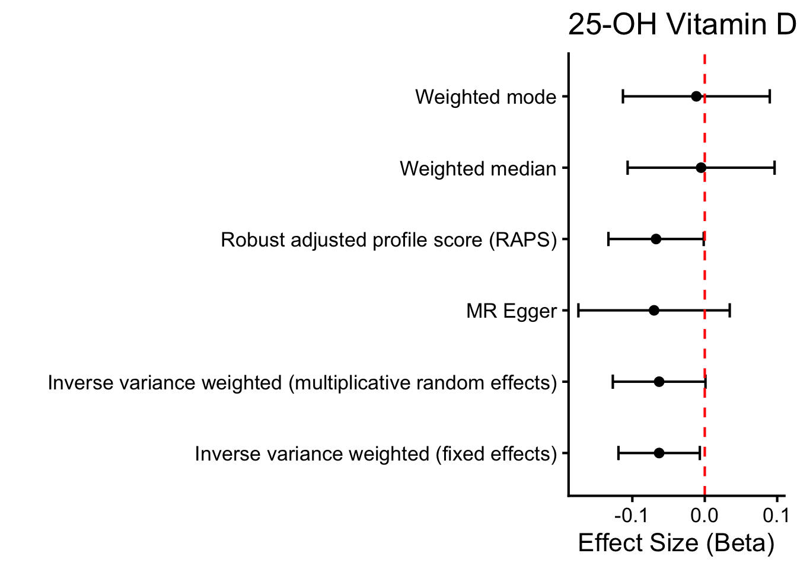
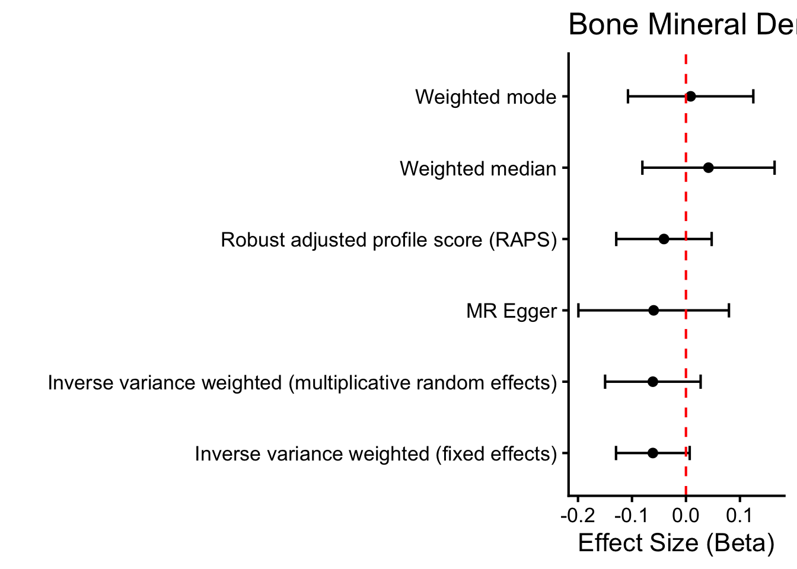
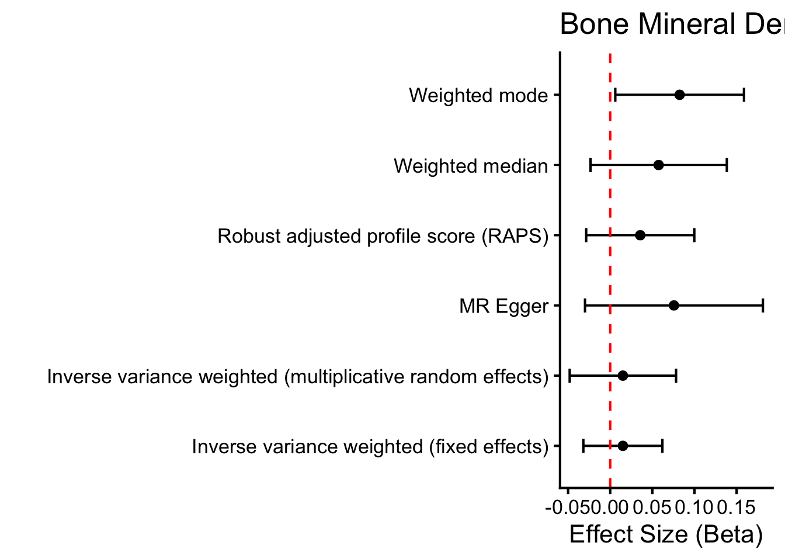
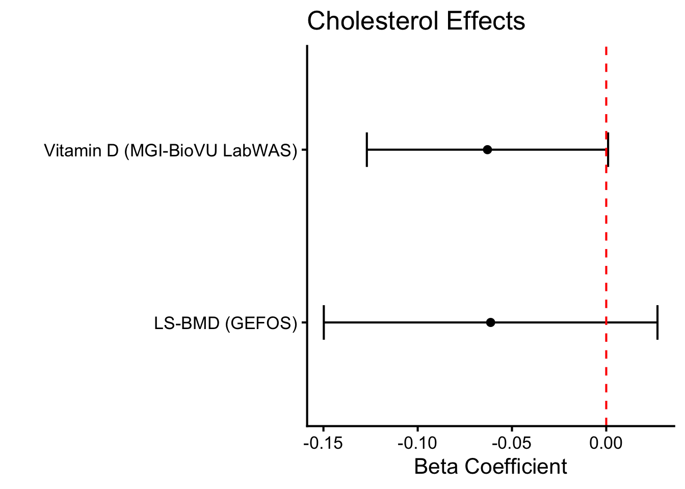

::: {.cell}

```{.r .cell-code}
# hide this code chunk
#| echo: false
#| message: false

# defines the se function
se <- function(x) {
  sd(x, na.rm = TRUE) / sqrt(length(x))
}

#load these packages, nearly always needed
library(tidyverse)
library(knitr)

# sets maize and blue color scheme
color_scheme <- c("#00274c", "#ffcb05")
```
:::


## Purpose

To test if SNPs for total cholesterol GWAS identified using UK Biobank relate to other mechanistic or pathological outcomes related to calcium homeostasis and bone health.  This script can be found in /Users/davebrid/Documents/GitHub/PrecisionNutrition/Human Genetics and was most recently run on Fri Jan 16 13:12:17 2026

## Data Entry


::: {.cell}

```{.r .cell-code}
instruments.tc.file <- 'Total Cholesterol Instruments from UKBB.csv'

# loaded and renamed columns
instruments.tc <- read_csv(instruments.tc.file) |>
  rename(
    SNP                       = SP2,
    beta.exposure             = BETA,
    se.exposure               = SE,
    effect_allele.exposure    = EA,
    other_allele.exposure     = OA,
    pval.exposure             = P,
    eaf.exposure              = ALT_FREQS,
    samplesize.exposure       = N_exposure
  ) |>
  mutate(id.exposure="Total Cholesterol (UK Biobank)",
         exposure="Total Cholesterol (UK Biobank)")
```
:::


We used 370 SNPs as instruments for total cholesterol from UK Biobank.  These are found in the Total Cholesterol Instruments from UKBB.csv datafile.

## Mechanistic Outcomes

### Vitamin D Levels

This analysis is to test the hypothesis that total cholesterol impacts 25-hydroxyvitamin D levels, as cholesterol is a precursor for vitamin D synthesis in the skin.  This could positively impact calcium levels indirectly via increased vitamin D.  This was from MGI-BioVU LabWAS data [@goldsteinLabWASNovelFindings2020].


::: {.cell}

```{.r .cell-code}
gwas.vitd.file <- 'PheWeb Summary Statistics/phenocode-Vit-D.tsv.gz'
samplesize.outcome.vitd <- 12250  # sample size for MGI/BioVU for calcium from 

gwas.vitd <- read_tsv(gwas.vitd.file) |>
  mutate(ID=paste(chrom, pos, ref,alt, sep=":")) |>
  rename(
    SNP                        = ID,            # or ID if that’s the matching ID
    beta.outcome               = beta,
    se.outcome                 = sebeta,
    effect_allele.outcome      = alt,   # whichever is effect allele
    other_allele.outcome       = ref,   # whichever is other allele
    pval.outcome               = pval,
    eaf.outcome                = maf,
  ) |>
  mutate(id.outcome = "Vitamin D (MGI-BioVU LabWAS)",
         outcome = "Vitamin D (MGI-BioVU LabWAS)",
         samplesize.outcome = samplesize.outcome.vitd)  # sample size for MGI/BioVU for vitamin D)
library(TwoSampleMR)

vitd.data <- harmonise_data(instruments.tc, gwas.vitd, action = 2)
vitd.data_steiger <- steiger_filtering(vitd.data)

#instrument strength
vitd.data.annot <- vitd.data_steiger %>%
  mutate(
    R2.exposure = 2 * eaf.exposure * (1 - eaf.exposure) * beta.exposure^2,
    F.exposure = (R2.exposure * (samplesize.exposure - 2)) / (1 - R2.exposure)
  )

vitd.exposure.summary <- vitd.data.annot %>%
  summarise(
    num_snps = n(),
    samplesize.exposure = first(samplesize.exposure),
    cumulative_R2 = sum(R2.exposure, na.rm = TRUE),
    mean_F = mean(F.exposure, na.rm = TRUE),
    median_F = median(F.exposure, na.rm = TRUE),
    mean_maf = mean(eaf.exposure, na.rm = TRUE),
    mean_beta = mean(abs(beta.exposure), na.rm = TRUE)
  ) |>
  mutate(overall_F = (cumulative_R2 * (samplesize.exposure - num_snps - 1)) / 
                     ((1 - cumulative_R2) * num_snps))

library(knitr)
kable(vitd.exposure.summary, caption="Summary of total cholesterol instruments after harmonisation for vitamin D analysis")
```

::: {.cell-output-display}


Table: Summary of total cholesterol instruments after harmonisation for vitamin D analysis

| num_snps| samplesize.exposure| cumulative_R2|   mean_F| median_F|  mean_maf| mean_beta| overall_F|
|--------:|-------------------:|-------------:|--------:|--------:|---------:|---------:|---------:|
|      285|              420607|     0.0972188| 143.7673|  53.4925| 0.3497576| 0.0301266|  158.8196|


:::

```{.r .cell-code}
vitd.mr <- mr(vitd.data_steiger,
                         method_list = c("mr_ivw_mre",
                                         "mr_ivw_fe",
                                         "mr_raps",
                                         "mr_egger_regression",
                                         "mr_weighted_median", 
                                         "mr_weighted_mode"))

vitd.mr |> dplyr::select(-starts_with('id')) |> 
  kable(caption="MR Results for Total Cholesterol - Vitamin D Analysis",
        digits=c(0,0,0,0,3,3,99))
```

::: {.cell-output-display}


Table: MR Results for Total Cholesterol - Vitamin D Analysis

|outcome                      |exposure                       |method                                                    | nsnp|      b|    se|       pval|
|:----------------------------|:------------------------------|:---------------------------------------------------------|----:|------:|-----:|----------:|
|Vitamin D (MGI-BioVU LabWAS) |Total Cholesterol (UK Biobank) |Inverse variance weighted (multiplicative random effects) |  280| -0.063| 0.033| 0.05362791|
|Vitamin D (MGI-BioVU LabWAS) |Total Cholesterol (UK Biobank) |Inverse variance weighted (fixed effects)                 |  280| -0.063| 0.029| 0.02795864|
|Vitamin D (MGI-BioVU LabWAS) |Total Cholesterol (UK Biobank) |Robust adjusted profile score (RAPS)                      |  280| -0.067| 0.034| 0.04513899|
|Vitamin D (MGI-BioVU LabWAS) |Total Cholesterol (UK Biobank) |MR Egger                                                  |  280| -0.070| 0.053| 0.19017784|
|Vitamin D (MGI-BioVU LabWAS) |Total Cholesterol (UK Biobank) |Weighted median                                           |  280| -0.005| 0.052| 0.92206208|
|Vitamin D (MGI-BioVU LabWAS) |Total Cholesterol (UK Biobank) |Weighted mode                                             |  280| -0.012| 0.052| 0.82246723|


:::

```{.r .cell-code}
mr_pleiotropy_test(vitd.data_steiger) |>
  select(-starts_with('id')) |> 
  kable(caption="MR Pleiotropy Results for Total Cholesterol - Vitamin D Analysis")
```

::: {.cell-output-display}


Table: MR Pleiotropy Results for Total Cholesterol - Vitamin D Analysis

|outcome                      |exposure                       | egger_intercept|        se|      pval|
|:----------------------------|:------------------------------|---------------:|---------:|---------:|
|Vitamin D (MGI-BioVU LabWAS) |Total Cholesterol (UK Biobank) |       0.0002851| 0.0017118| 0.8678594|


:::

```{.r .cell-code}
mr_heterogeneity(vitd.data_steiger) |>
  select(-starts_with('id')) |> 
    mutate(
    I2 = pmax(0, (Q - Q_df) / Q) * 100 # 
  ) |>
  kable(caption="MR Heterogeneity Results for Total Cholesterol - Vitamin D Analysis",
        digits=c(0,0,0,3,3,99))
```

::: {.cell-output-display}


Table: MR Heterogeneity Results for Total Cholesterol - Vitamin D Analysis

|outcome                      |exposure                       |method                    |       Q| Q_df|       Q_pval| I2|
|:----------------------------|:------------------------------|:-------------------------|-------:|----:|------------:|--:|
|Vitamin D (MGI-BioVU LabWAS) |Total Cholesterol (UK Biobank) |MR Egger                  | 361.847|  278| 0.0005223738| 23|
|Vitamin D (MGI-BioVU LabWAS) |Total Cholesterol (UK Biobank) |Inverse variance weighted | 361.883|  279| 0.0005999283| 23|


:::

```{.r .cell-code}
ggplot(vitd.mr, aes(y=method,x=b)) +
  geom_point() +
  geom_errorbar(aes(xmin=b-1.96*se, xmax=b+1.96*se), width=0.2) +
  theme_classic(base_size=16) +
  labs(title="25-OH Vitamin D (LabWAS)",
       y="",
       x="Effect Size (Beta)") +
  geom_vline(xintercept=0, linetype="dashed", color = "red") 
```

::: {.cell-output-display}
{width=672}
:::
:::


## Pathological Outcomes

### Bone Mineral Density

#### GEFOS Consortium Lumbar Spine BMD

Lumbar spine tends to reflect trabecular bone, which is metabolically active, hormonally responsive, and more sensitive to lipid and endocrine perturbations. Multiple epidemiologic studies report inverse associations between total cholesterol and LS-BMD, particularly among older adults and postmenopausal women [@huAssociationsSerumTotal2023;@fangNegativeAssociationTotal2022].  We used the pooled (not sex-specific) estimates from the GEFOS consortium's pooled meta-analysis [@estradaGenomewideMetaanalysisIdentifies2012].


::: {.cell}

```{.r .cell-code}
gwas.bmd.file <- 'PheWeb Summary Statistics/GEFOS2_LSBMD_POOLED_GC.txt.gz'
samplesize.outcome.bmd <- 32961  # sample size from estradaGenomewideMetaanalysisIdentifies2012

gwas.bmd <- read_tsv(gwas.bmd.file) |>
  rename(
    beta.outcome               = Effect,
    se.outcome                 = StdErr,
    pval.outcome               = `P-value`,
    eaf.outcome                = Freq1,
  ) |>
  mutate(id.outcome = "bmd",
         outcome = "LS-BMD (GEFOS)",
         effect_allele.outcome = toupper(Allele1),   # whichever is effect allele
         other_allele.outcome = toupper(Allele2),   # whichever is other allele
         samplesize.outcome = samplesize.outcome.bmd)  # sample size for MGI/BioVU for vitamin D)

#runs very slow so commented out after saving the SNP file 
library(biomaRt)
#snp.mart <- useEnsembl(biomart="snp", dataset="hsapiens_snp")
#snp.data <- getBM(attributes=c("refsnp_id", "chr_name", "chrom_start", "allele"),
#                  filters="snp_filter",
#                  values=gwas.bmd$MarkerName,
#                  mart=snp.mart)
gefos.snp.datafile <- "GEFOS-2012 SNP ID File.csv"
#write_csv(snp.data, gefos.snp.datafile)
bmd.snp.data <- read_csv(gefos.snp.datafile) |>
  mutate(SNP=paste(chr_name, 
                   chrom_start,
                   substr(allele, 1, 1), #first allele in naming
                   substr(allele, 3, 3), #second allele (third position) in naming
                   sep=":")) #just picked the first alt allele

gwas.bmd.combined <- 
  left_join(gwas.bmd,bmd.snp.data, by=c("MarkerName"="refsnp_id")) 
  #169542882
table(instruments.tc$SNP %in% gwas.bmd.combined$SNP)
```

::: {.cell-output .cell-output-stdout}

```

FALSE  TRUE 
  369     1 
```


:::

```{.r .cell-code}
#only one harmonised SNPs
#bmd.data <- harmonise_data(instruments.tc, gwas.bmd.combined, action = 2)
#bmd.data_steiger <- steiger_filtering(bmd.data)
#bmd.mr <- mr(bmd.data_steiger,
#                         method_list = c("mr_ivw_mre",
#                                         "mr_ivw_fe",
#                                         "mr_raps",
#                                         "mr_egger_regression",
#                                         "mr_weighted_median", 
#                                         "mr_weighted_mode"))

#bmd.mr |> dplyr::select(-starts_with('id')) |> 
#  kable(caption="MR Results for Total Cholesterol - Lumbar Spine BMD (GEFOS - 2012)",
#        digits=c(0,0,0,0,3,3,99))

# ggplot(bmd.mr, aes(y=method,x=b)) +
#   geom_point() +
#   geom_errorbar(aes(xmin=b-1.96*se, xmax=b+1.96*se), width=0.2) +
#   theme_classic(base_size=16) +
#   labs(title="Bone Minderal Density (GEFOS)",
#        y="",
#        x="Effect Size (Beta)") +
#   geom_vline(xintercept=0, linetype="dashed", color = "red") 
```
:::


This second analysis is from lumbar spine data from the GEFOS 2015 release [@zhengWholegenomeSequencingIdentifies2015].


::: {.cell}

```{.r .cell-code}
gwas.bmd.file.2015 <- 'PheWeb Summary Statistics/ls2stu.MAF0_.005.pos_.out_.gz'
samplesize.outcome.bmd.2015 <- 53236  # sample size from zhengWholegenomeSequencingIdentifies2015

gwas.bmd.2015 <- read_tsv(gwas.bmd.file.2015) |>
  rename(
    beta.outcome               = beta,
    se.outcome                 = se,
    effect_allele.outcome      = reference_allele,   # whichever is effect allele
    other_allele.outcome       = other_allele,   # whichever is other allele
    pval.outcome               = `p-value`,
    eaf.outcome                = eaf,
  ) |>
  mutate(SNP=paste(chromosome,position,effect_allele.outcome,other_allele.outcome,sep=":"),
         id.outcome = "bmd",
         outcome = "LS-BMD (GEFOS)",
         samplesize.outcome = samplesize.outcome.bmd.2015)  # sample size for MGI/BioVU for vitamin D)

bmd.data.2015 <- harmonise_data(instruments.tc, gwas.bmd.2015, action = 2)
bmd.data_steiger.2015 <- steiger_filtering(bmd.data.2015)


#instrument strength
bmd.2015.data.annot <- bmd.data_steiger.2015 %>%
  mutate(
    R2.exposure = 2 * eaf.exposure * (1 - eaf.exposure) * beta.exposure^2,
    F.exposure = (R2.exposure * (samplesize.exposure - 2)) / (1 - R2.exposure)
  )

bmd.2015.exposure.summary <- bmd.2015.data.annot %>%
  summarise(
    num_snps = n(),
    samplesize.exposure = first(samplesize.exposure),
    cumulative_R2 = sum(R2.exposure, na.rm = TRUE),
    mean_F = mean(F.exposure, na.rm = TRUE),
    median_F = median(F.exposure, na.rm = TRUE),
    mean_maf = mean(eaf.exposure, na.rm = TRUE),
    mean_beta = mean(abs(beta.exposure), na.rm = TRUE)
  ) |>
  mutate(overall_F = (cumulative_R2 * (samplesize.exposure - num_snps - 1)) / 
                     ((1 - cumulative_R2) * num_snps))

library(knitr)
kable(bmd.2015.exposure.summary, caption="Summary of total cholesterol instruments after harmonisation for BMD analysis")
```

::: {.cell-output-display}


Table: Summary of total cholesterol instruments after harmonisation for BMD analysis

| num_snps| samplesize.exposure| cumulative_R2|   mean_F| median_F|  mean_maf| mean_beta| overall_F|
|--------:|-------------------:|-------------:|--------:|--------:|---------:|---------:|---------:|
|       87|              420607|     0.0346371| 167.7501| 50.84945| 0.5781175| 0.0313052|  173.4275|


:::

```{.r .cell-code}
bmd.mr.2015 <- mr(bmd.data_steiger.2015,
                         method_list = c("mr_ivw_mre",
                                         "mr_ivw_fe",
                                         "mr_raps",
                                         "mr_egger_regression",
                                         "mr_weighted_median", 
                                         "mr_weighted_mode"))

bmd.mr.2015 |> 
  dplyr::select(-starts_with('id')) |> 
  kable(caption="MR Results for Total Cholesterol - Lumbar Spine BMD (GEFOS - 2015)",
        digits=c(0,0,0,0,3,3,99))
```

::: {.cell-output-display}


Table: MR Results for Total Cholesterol - Lumbar Spine BMD (GEFOS - 2015)

|outcome        |exposure                       |method                                                    | nsnp|      b|    se|       pval|
|:--------------|:------------------------------|:---------------------------------------------------------|----:|------:|-----:|----------:|
|LS-BMD (GEFOS) |Total Cholesterol (UK Biobank) |Inverse variance weighted (multiplicative random effects) |   84| -0.061| 0.045| 0.17447219|
|LS-BMD (GEFOS) |Total Cholesterol (UK Biobank) |Inverse variance weighted (fixed effects)                 |   84| -0.061| 0.035| 0.07825289|
|LS-BMD (GEFOS) |Total Cholesterol (UK Biobank) |Robust adjusted profile score (RAPS)                      |   84| -0.041| 0.045| 0.36616562|
|LS-BMD (GEFOS) |Total Cholesterol (UK Biobank) |MR Egger                                                  |   84| -0.060| 0.071| 0.40291614|
|LS-BMD (GEFOS) |Total Cholesterol (UK Biobank) |Weighted median                                           |   84|  0.042| 0.062| 0.50431937|
|LS-BMD (GEFOS) |Total Cholesterol (UK Biobank) |Weighted mode                                             |   84|  0.009| 0.059| 0.88369819|


:::

```{.r .cell-code}
mr_pleiotropy_test(bmd.data_steiger.2015) |>
  dplyr::select(-starts_with('id')) |> 
  kable(caption="MR Pleiotropy Results for Total Cholesterol - Lumbar Spine BMD (GEFOS)")
```

::: {.cell-output-display}


Table: MR Pleiotropy Results for Total Cholesterol - Lumbar Spine BMD (GEFOS)

|outcome        |exposure                       | egger_intercept|        se|      pval|
|:--------------|:------------------------------|---------------:|---------:|---------:|
|LS-BMD (GEFOS) |Total Cholesterol (UK Biobank) |       -6.56e-05| 0.0024077| 0.9783216|


:::

```{.r .cell-code}
mr_heterogeneity(bmd.data_steiger.2015) |>
  dplyr::select(-starts_with('id')) |> 
    mutate(
    I2 = pmax(0, (Q - Q_df) / Q) * 100 # 
  ) |>
  kable(caption="MR Heterogeneity Results for Total Cholesterol - Lumbar Spine BMD (GEFOS) Analysis",
        digits=c(0,0,0,3,3,99))
```

::: {.cell-output-display}


Table: MR Heterogeneity Results for Total Cholesterol - Lumbar Spine BMD (GEFOS) Analysis

|outcome        |exposure                       |method                    |       Q| Q_df|       Q_pval| I2|
|:--------------|:------------------------------|:-------------------------|-------:|----:|------------:|--:|
|LS-BMD (GEFOS) |Total Cholesterol (UK Biobank) |MR Egger                  | 139.562|   82| 7.677723e-05| 41|
|LS-BMD (GEFOS) |Total Cholesterol (UK Biobank) |Inverse variance weighted | 139.564|   83| 1.019875e-04| 41|


:::

```{.r .cell-code}
ggplot(bmd.mr.2015, aes(y=method,x=b)) +
  geom_point() +
  geom_errorbar(aes(xmin=b-1.96*se, xmax=b+1.96*se), width=0.2) +
  theme_classic(base_size=16) +
  labs(title="Bone Mineral Density (GEFOS)",
       y="",
       x="Effect Size (Beta)") +
  geom_vline(xintercept=0, linetype="dashed", color = "red") 
```

::: {.cell-output-display}
{width=672}
:::
:::


### Fracture Risk

Used the 2018 GEFOS meta-analysis of fracture risk GWAS to test if total cholesterol SNPs related to fracture risk [@trajanoskaAssessmentGeneticClinical2018].


::: {.cell}

```{.r .cell-code}
gwas.fractures.file <- 'PheWeb Summary Statistics/ALLFX_GWAS_build37.txt.gz'
samplesize.outcome.fractures <- 37857  # sample size from trajanoskaAssessmentGeneticClinical2018 (cases only)

#need to convert instruments into rsids

# Get the SNP database
library(SNPlocs.Hsapiens.dbSNP144.GRCh37)
snpdb <- SNPlocs.Hsapiens.dbSNP144.GRCh37

# Prepare positions
tc.positions <- instruments.tc |>
  separate(SNP, into = c("CHR", "BP", "ALLELE0", "ALLELE1"), 
           sep = ":", remove = FALSE) |>
  mutate(CHR = as.integer(CHR), BP = as.integer(BP))

# Query by chromosome
get_rsids_by_chr <- function(chr, positions, snpdb) {
  pos_ranges <- GPos(seqnames = chr, pos = positions)
  snps <- snpsByOverlaps(snpdb, pos_ranges)
  
  data.frame(
    CHR = chr,
    BP = pos(snps),
    RSID = snps$RefSNP_id
  )
}

# Process each chromosome
rsid_list <- list()
for(chr in unique(tc.positions$CHR)) {
  chr_data <- tc.positions |> filter(CHR == chr)
  rsid_list[[chr]] <- get_rsids_by_chr(chr, chr_data$BP, snpdb)
  message("Processed chr", chr)
}

all_rsids <- bind_rows(rsid_list)

# Merge back
instruments.tc.fractures <- tc.positions |>
  left_join(all_rsids, by = c("CHR", "BP")) |>
  dplyr::select(-SNP) |> #remove old snp id column
  dplyr::rename('SNP' = 'RSID')  #rename rsid column to SNP

 gwas.fractures <- read_tsv(gwas.fractures.file)  |>
   dplyr::rename(
     beta.outcome               = Effect,
     se.outcome                 = StdErr,
     pval.outcome               = `P-value`,
     eaf.outcome                = Freq1,
     SNP = MarkerName
   ) |>
   mutate(id.outcome = "fractures",
          effect_allele.outcome = toupper(Allele1),
          other_allele.outcome = toupper(Allele2),
          outcome = "Fracture Risk (GEFOS)",
          samplesize.outcome = samplesize.outcome.fractures)  


 
fracture.data <- harmonise_data(instruments.tc.fractures, gwas.fractures, action = 2)
fracture.data_steiger <- steiger_filtering(fracture.data)
fracture.mr <- mr(fracture.data_steiger,
                         method_list = c("mr_ivw_mre",
                                         "mr_ivw_fe",
                                         "mr_raps",
                                         "mr_egger_regression",
                                         "mr_weighted_median", 
                                         "mr_weighted_mode"))

fracture.mr |> 
  dplyr::select(-starts_with('id')) |> 
  kable(caption="MR Results for Total Cholesterol - Fracture Risk (GEFOS)",
        digits=c(0,0,0,0,3,3,99))
```

::: {.cell-output-display}


Table: MR Results for Total Cholesterol - Fracture Risk (GEFOS)

|outcome               |exposure                       |method                                                    | nsnp|     b|    se|       pval|
|:---------------------|:------------------------------|:---------------------------------------------------------|----:|-----:|-----:|----------:|
|Fracture Risk (GEFOS) |Total Cholesterol (UK Biobank) |Inverse variance weighted (multiplicative random effects) |  181| 0.015| 0.032| 0.64096289|
|Fracture Risk (GEFOS) |Total Cholesterol (UK Biobank) |Inverse variance weighted (fixed effects)                 |  181| 0.015| 0.024| 0.53024429|
|Fracture Risk (GEFOS) |Total Cholesterol (UK Biobank) |Robust adjusted profile score (RAPS)                      |  181| 0.036| 0.033| 0.27643903|
|Fracture Risk (GEFOS) |Total Cholesterol (UK Biobank) |MR Egger                                                  |  181| 0.076| 0.054| 0.16193689|
|Fracture Risk (GEFOS) |Total Cholesterol (UK Biobank) |Weighted median                                           |  181| 0.057| 0.041| 0.16358604|
|Fracture Risk (GEFOS) |Total Cholesterol (UK Biobank) |Weighted mode                                             |  181| 0.082| 0.039| 0.03583824|


:::

```{.r .cell-code}
ggplot(fracture.mr, aes(y=method,x=b)) +
  geom_point() +
  geom_errorbar(aes(xmin=b-1.96*se, xmax=b+1.96*se), width=0.2) +
  theme_classic(base_size=16) +
  labs(title="Bone Mineral Density (GEFOS)",
       y="",
       x="Effect Size (Beta)") +
  geom_vline(xintercept=0, linetype="dashed", color = "red") 
```

::: {.cell-output-display}
{width=672}
:::

```{.r .cell-code}
mr_pleiotropy_test(fracture.data) |>
  dplyr::select(-starts_with('id')) |> 
  kable(caption="MR Pleiotropy Results for Total Cholesterol - Fracture Risk")
```

::: {.cell-output-display}


Table: MR Pleiotropy Results for Total Cholesterol - Fracture Risk

|outcome               |exposure                       | egger_intercept|        se|     pval|
|:---------------------|:------------------------------|---------------:|---------:|--------:|
|Fracture Risk (GEFOS) |Total Cholesterol (UK Biobank) |      -0.0022811| 0.0016269| 0.162613|


:::

```{.r .cell-code}
mr_heterogeneity(fracture.data) |>
  dplyr::select(-starts_with('id')) |> 
    mutate(
    I2 = pmax(0, (Q - Q_df) / Q) * 100 # 
  ) |>
  kable(caption="MR Heterogeneity Results for Total Cholesterol - Fracture Risk",
        digits=c(0,0,0,3,3,99))
```

::: {.cell-output-display}


Table: MR Heterogeneity Results for Total Cholesterol - Fracture Risk

|outcome               |exposure                       |method                    |       Q| Q_df|       Q_pval| I2|
|:---------------------|:------------------------------|:-------------------------|-------:|----:|------------:|--:|
|Fracture Risk (GEFOS) |Total Cholesterol (UK Biobank) |MR Egger                  | 322.486|  179| 2.701386e-10| 44|
|Fracture Risk (GEFOS) |Total Cholesterol (UK Biobank) |Inverse variance weighted | 326.028|  180| 1.623798e-10| 45|


:::
:::


## Summary of Proposed Causal Mechanisms


::: {.cell}

```{.r .cell-code}
bind_rows(vitd.mr,bmd.mr.2015) |>
  filter(method == "Inverse variance weighted (multiplicative random effects)") |>
  ggplot(aes(x = outcome, y = b)) +
  geom_point(stat = "identity") +
  geom_errorbar(aes(ymin = b - 1.96 * se, ymax = b + 1.96 * se), width = 0.2) +
  coord_flip() +
  geom_hline(yintercept = 0, linetype = "dashed", color = "red") +
  theme_classic(base_size = 16) +
  labs(title = "Cholesterol Effects", y = "Beta Coefficient", x = "") 
```

::: {.cell-output-display}
{width=672}
:::
:::


## Hypothesis Testing

Given that we have two hypotheses:

- Cholesterol increases calcium by increasing vitamin D
- Cholesterol increases calcium by decreasing bone mineral density

We performed a Bayesian analysis to determine the posterior probabilities of four possible outcomes:


::: {.cell}

```{.r .cell-code}
# Function to compute posterior probability for a directional hypothesis
# - beta_hat: point estimate
# - se: standard error
# - direction: "less" for P(beta < 0), "greater" for P(beta > 0)
posterior_prob_direction <- function(beta_hat, se, direction = c("less", "greater")) {
  direction <- match.arg(direction)
  z <- (0 - beta_hat) / se  # z-score for the boundary at 0
  if (direction == "less") {
    return(pnorm(z))  # P(beta < 0) = CDF(z)
  } else {
    return(1 - pnorm(z))  # P(beta > 0) = 1 - CDF(z)
  }
}

# Input MR point estimates and standard errors
beta_bmd <- filter(bmd.mr.2015,method=="Inverse variance weighted (multiplicative random effects)") %>% pull(b)  # Point estimate for BMD effect on calcium
se_bmd <- filter(bmd.mr.2015,method=="Inverse variance weighted (multiplicative random effects)") %>% pull(se)     # Standard error for BMD
beta_vitd <- filter(vitd.mr,method=="Inverse variance weighted (multiplicative random effects)") %>% pull(b) # Point estimate for Vitamin D effect on calcium
se_vitd <- filter(vitd.mr,method=="Inverse variance weighted (multiplicative random effects)") %>% pull(se)    # Standard error for Vitamin D

# Compute individual posterior probabilities
p_h1_true <- posterior_prob_direction(beta_bmd, se_bmd, "less")      # P(β_BMD < 0) ~ supports H1 (lower BMD)
p_h1_false <- 1 - p_h1_true                                          # P(β_BMD >= 0) ~ opposes H1
p_h2_true <- posterior_prob_direction(beta_vitd, se_vitd, "greater") # P(β_VitD > 0) ~ supports H2 (higher Vit D)
p_h2_false <- 1 - p_h2_true                                          # P(β_VitD <= 0) ~ opposes H2

# Compute joint probabilities (assuming independence)
p_both_true <- p_h1_true * p_h2_true
p_only_h1_true <- p_h1_true * p_h2_false
p_only_h2_true <- p_h1_false * p_h2_true
p_neither_true <- p_h1_false * p_h2_false

# Create a data frame for the table
outcomes_df <- data.frame(
  Outcome = c("Both True", "Only H1 True", "Only H2 True", "Neither True"),
  Description = c(
    "H1 true (β_BMD < 0) and H2 true (β_VitD > 0)",
    "H1 true (β_BMD < 0) and H2 false (β_VitD <= 0)",
    "H1 false (β_BMD >= 0) and H2 true (β_VitD > 0)",
    "H1 false (β_BMD >= 0) and H2 false (β_VitD <= 0)"
  ),
  Posterior_Probability = c(p_both_true, p_only_h1_true, p_only_h2_true, p_neither_true),
  Percentage = sprintf("%.2f%%", c(p_both_true, p_only_h1_true, p_only_h2_true, p_neither_true) * 100)
)

# Output the table using kable
kable(outcomes_df, format = "simple", digits = 4, caption = "Joint Posterior Probabilities for the Four Outcomes")
```

::: {.cell-output-display}


Table: Joint Posterior Probabilities for the Four Outcomes

Outcome        Description                                         Posterior_Probability  Percentage 
-------------  -------------------------------------------------  ----------------------  -----------
Both True      H1 true (β_BMD < 0) and H2 true (β_VitD > 0)                       0.0245  2.45%      
Only H1 True   H1 true (β_BMD < 0) and H2 false (β_VitD <= 0)                     0.8883  88.83%     
Only H2 True   H1 false (β_BMD >= 0) and H2 true (β_VitD > 0)                     0.0023  0.23%      
Neither True   H1 false (β_BMD >= 0) and H2 false (β_VitD <= 0)                   0.0849  8.49%      


:::
:::


To evaluate the two hypotheses regarding elevated calcium levels: 

- H1: lower bone mineral density (BMD, supported by $\beta_{BMD} < 0$)
- H2: higher vitamin D levels (supported by $\beta_{VitD} > 0$)

We applied Bayesian inference using Mendelian randomization (MR) point estimates and standard errors. The analysis assumed flat (non-informative) priors on the effect sizes and independence between the effects of BMD and vitamin D on calcium levels. Below, we summarize the mathematical approach.

### Individual Posterior Probabilities

For each hypothesis, we modeled the effect size $\beta$ (representing the causal effect on calcium levels) with a flat prior, $(p(\beta) \propto 1$. Given the MR point estimate ($\hat{\beta}$) and standard error $SE$), and assuming that the posterior distribution for $\beta$ is Normal:

$$p(\beta | \text{data}) \sim \mathcal{N}(\hat{\beta}, \text{SE}^2)$$

- **H1 (Lower BMD explains high cholesterol)**: The MR estimate is $\hat{\beta}_{\text{BMD}}$ = -0.0613143, $SE_{BMD}$ = 0.0451513. The posterior probability that $\beta_{BMD} < 0$ (supporting H1) is 0.9127639 as calculated by the following equation where $\Phi$ is the cumulative distribution function of the standard normal distribution:

$$P(\beta_{\text{BMD}} < 0 | \text{data}) = \Phi\left(\frac{0 - \hat{\beta}_{\text{BMD}}}{\text{SE}_{\text{BMD}}}\right)$$


- **H2 (Higher Vitamin D)**: The MR estimate is $\hat{\beta}_{VitD}$ = -0.062997, $SE_{VitD}$ = 0.0326438 ). The posterior probability that $\beta_{\text{VitD}} > 0$ (supporting H2) is therefore 0.026814 calculated as:

$$
P(\beta_{\text{VitD}} > 0 | \text{data}) = 1 - \Phi\left(\frac{0 - \hat{\beta}_{\text{VitD}}}{\text{SE}_{\text{VitD}}}\right)
$$


Thus, the posterior probabilities are estimated at 91.2763903% for H1 ($\beta_{\text{BMD}} < 0$) and 2.6813955% for H2 ($\beta_{VitD} > 0$).

### Joint Posterior Probabilities

Assuming independence between the effects of BMD and vitamin D, we calculated the joint probabilities for the four possible outcomes:

- **Both True**: $P(\beta_{\text{BMD}} < 0, \beta_{\text{VitD}} > 0) = P(\beta_{\text{BMD}} < 0) \times P(\beta_{\text{VitD}} > 0)$ = 0.9127639 $\times$` 0.026814 $\approx$ 0.0244748(2.447481%).
- **Only H1 True**: $P(\beta_{\text{BMD}} < 0, \beta_{\text{VitD}} \leq 0) = P(\beta_{\text{BMD}} < 0) \times P(\beta_{\text{VitD}} \leq 0)$ where $P(\beta_{\text{VitD}} \leq 0) = 1 - P(\beta_{\text{VitD}} > 0)$ = 1 - 0.026814 = 0.973186 so 0.9127639 $\times$ 0.973186 $\approx$ 0.8882891(88.8289093%).
- **Only H2 True**: $P(\beta_{\text{BMD}} \geq 0, \beta_{\text{VitD}} > 0) = P(\beta_{\text{BMD}} \geq 0) \times P(\beta_{\text{VitD}} > 0)$ where $P(\beta_{\text{BMD}} \geq 0) = 1 - P(\beta_{\text{BMD}} < 0)$ = 1 - 0.9127639 = 0.0872361 and 0.0872361 $\times$ 0.026814 (0.2339145%).
- **Neither True**: $P(\beta_{\text{BMD}} \geq 0, \beta_{\text{VitD}} \leq 0) = P(\beta_{\text{BMD}} \geq 0) \times P(\beta_{\text{VitD}} \leq 0)$ so 0.0872361 $\times$ 0.973186 (8.4896953%).

These probabilities sum to 1, confirming the calculations. The results strongly support H1 (lower BMD) as the most likely explanation for elevated calcium levels (88.8289093% for Only H1 True), with minimal support for the alternate hypotheses.

## References

::: {#refs}
:::

## Session Information


::: {.cell}

```{.r .cell-code}
sessionInfo()
```

::: {.cell-output .cell-output-stdout}

```
R version 4.5.2 (2025-10-31)
Platform: aarch64-apple-darwin20
Running under: macOS Tahoe 26.2

Matrix products: default
BLAS:   /System/Library/Frameworks/Accelerate.framework/Versions/A/Frameworks/vecLib.framework/Versions/A/libBLAS.dylib 
LAPACK: /Library/Frameworks/R.framework/Versions/4.5-arm64/Resources/lib/libRlapack.dylib;  LAPACK version 3.12.1

locale:
[1] en_US.UTF-8/en_US.UTF-8/en_US.UTF-8/C/en_US.UTF-8/en_US.UTF-8

time zone: America/Detroit
tzcode source: internal

attached base packages:
[1] stats4    stats     graphics  grDevices utils     datasets  methods  
[8] base     

other attached packages:
 [1] SNPlocs.Hsapiens.dbSNP144.GRCh37_0.99.20
 [2] BSgenome_1.76.0                         
 [3] rtracklayer_1.68.0                      
 [4] BiocIO_1.18.0                           
 [5] Biostrings_2.76.0                       
 [6] XVector_0.48.0                          
 [7] GenomicRanges_1.60.0                    
 [8] GenomeInfoDb_1.44.3                     
 [9] IRanges_2.42.0                          
[10] S4Vectors_0.46.0                        
[11] BiocGenerics_0.54.1                     
[12] generics_0.1.4                          
[13] biomaRt_2.64.0                          
[14] TwoSampleMR_0.6.29                      
[15] knitr_1.51                              
[16] lubridate_1.9.4                         
[17] forcats_1.0.1                           
[18] stringr_1.6.0                           
[19] dplyr_1.1.4                             
[20] purrr_1.2.1                             
[21] readr_2.1.6                             
[22] tidyr_1.3.2                             
[23] tibble_3.3.1                            
[24] ggplot2_4.0.1                           
[25] tidyverse_2.0.0                         

loaded via a namespace (and not attached):
 [1] DBI_1.2.3                   mnormt_2.1.1               
 [3] bitops_1.0-9                gridExtra_2.3              
 [5] httr2_1.2.2                 rlang_1.1.7                
 [7] magrittr_2.0.4              otel_0.2.0                 
 [9] matrixStats_1.5.0           compiler_4.5.2             
[11] RSQLite_2.4.5               png_0.1-8                  
[13] vctrs_0.6.5                 httpcode_0.3.0             
[15] pkgconfig_2.0.3             crayon_1.5.3               
[17] fastmap_1.2.0               dbplyr_2.5.1               
[19] labeling_0.4.3              Rsamtools_2.24.1           
[21] rmarkdown_2.30              tzdb_0.5.0                 
[23] UCSC.utils_1.4.0            bit_4.6.0                  
[25] xfun_0.55                   cachem_1.1.0               
[27] jsonlite_2.0.0              progress_1.2.3             
[29] blob_1.2.4                  DelayedArray_0.34.1        
[31] mr.raps_0.4.3               BiocParallel_1.42.2        
[33] psych_2.5.6                 parallel_4.5.2             
[35] prettyunits_1.2.0           R6_2.6.1                   
[37] stringi_1.8.7               RColorBrewer_1.1-3         
[39] SummarizedExperiment_1.38.1 Rcpp_1.1.1                 
[41] Matrix_1.7-4                splines_4.5.2              
[43] timechange_0.3.0            tidyselect_1.2.1           
[45] abind_1.4-8                 rstudioapi_0.17.1          
[47] dichromat_2.0-0.1           yaml_2.3.12                
[49] codetools_0.2-20            curl_7.0.0                 
[51] lattice_0.22-7              plyr_1.8.9                 
[53] Biobase_2.68.0              withr_3.0.2                
[55] KEGGREST_1.48.1             S7_0.2.1                   
[57] evaluate_1.0.5              BiocFileCache_2.16.2       
[59] xml2_1.5.1                  pillar_1.11.1              
[61] filelock_1.0.3              MatrixGenerics_1.20.0      
[63] nortest_1.0-4               vroom_1.6.7                
[65] RCurl_1.98-1.17             hms_1.1.4                  
[67] scales_1.4.0                rootSolve_1.8.2.4          
[69] glue_1.8.0                  tools_4.5.2                
[71] data.table_1.18.0           GenomicAlignments_1.44.0   
[73] rsnps_0.6.1                 XML_3.99-0.20              
[75] grid_4.5.2                  AnnotationDbi_1.70.0       
[77] nlme_3.1-168                GenomeInfoDbData_1.2.14    
[79] restfulr_0.0.16             cli_3.6.5                  
[81] rappdirs_0.3.3              S4Arrays_1.8.1             
[83] gtable_0.3.6                digest_0.6.39              
[85] SparseArray_1.8.1           ggrepel_0.9.6              
[87] crul_1.6.0                  rjson_0.2.23               
[89] htmlwidgets_1.6.4           farver_2.1.2               
[91] memoise_2.0.1               htmltools_0.5.9            
[93] lifecycle_1.0.5             httr_1.4.7                 
[95] bit64_4.6.0-1              
```


:::
:::

