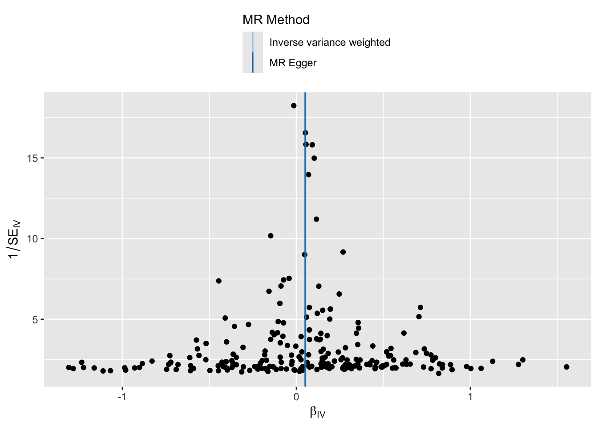
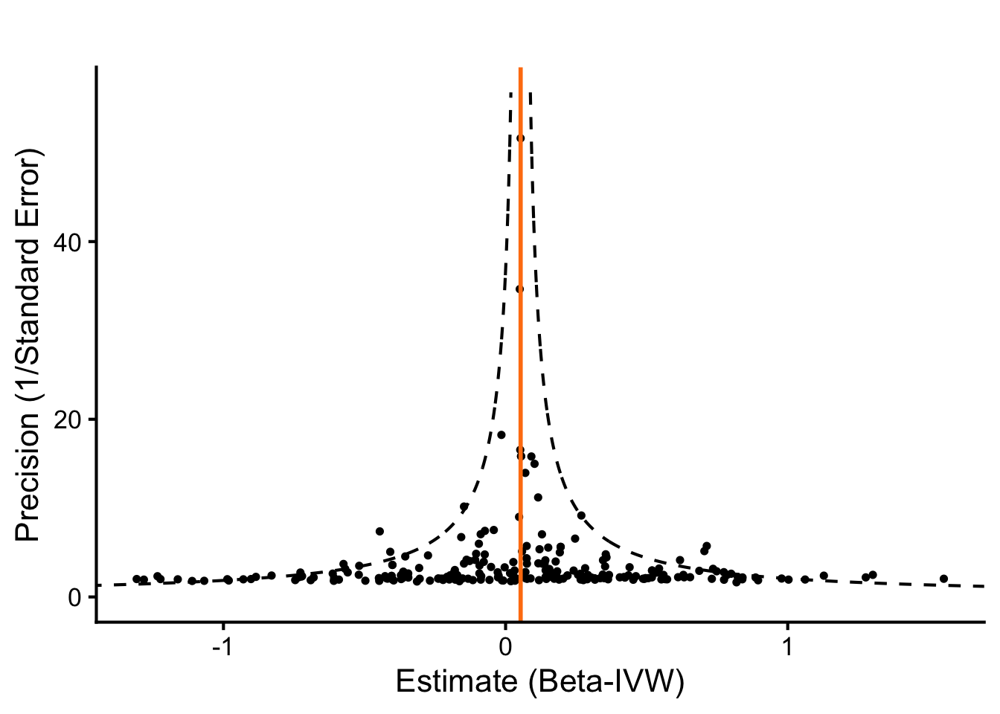
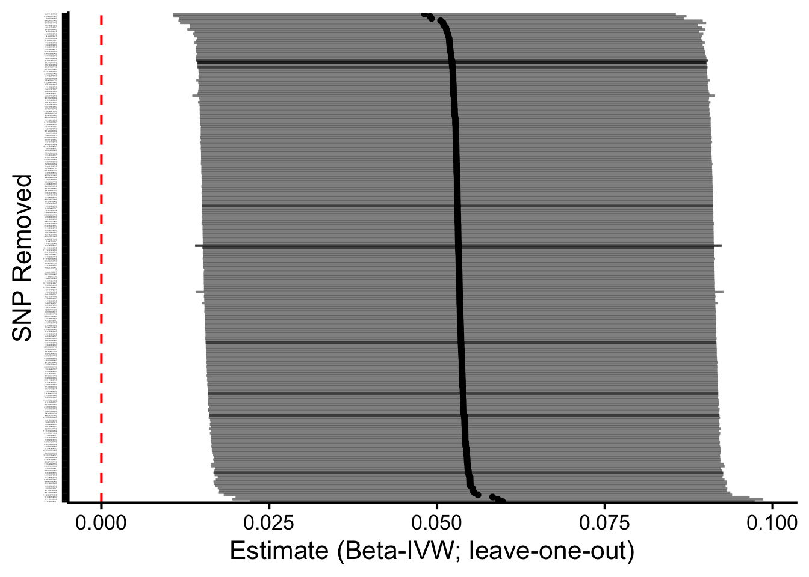
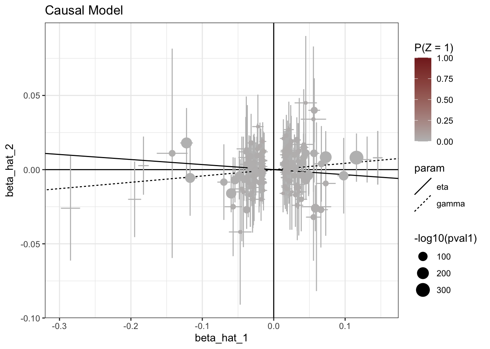
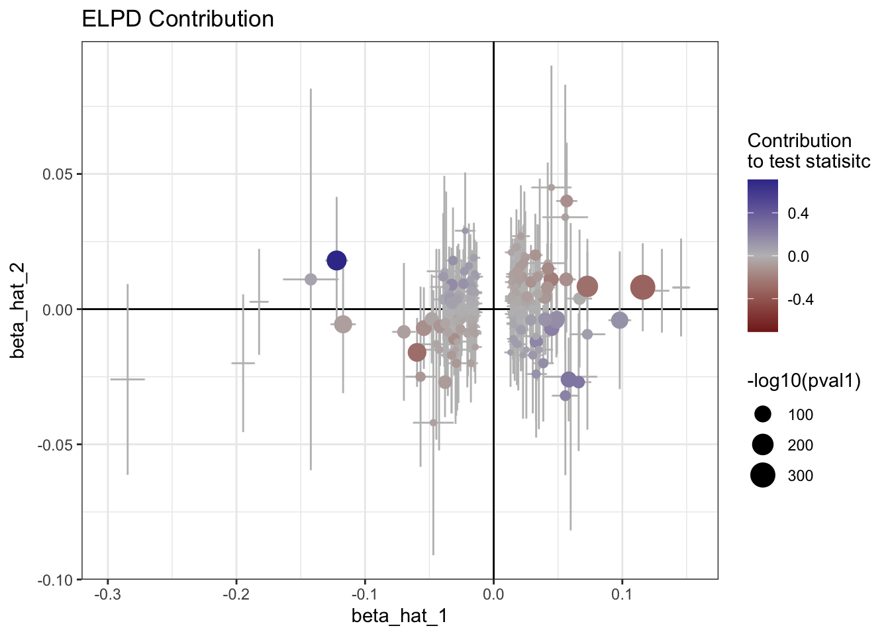
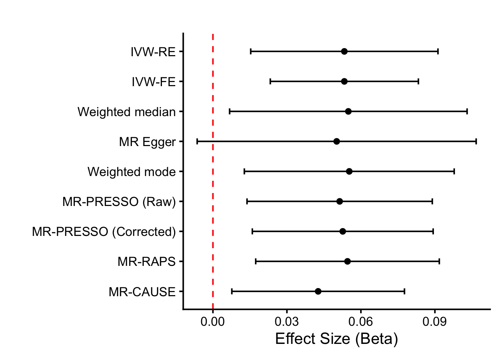

::: {.cell}

```{.r .cell-code}
# hide this code chunk
#| echo: false
#| message: false

# defines the se function
se <- function(x) {
  sd(x, na.rm = TRUE) / sqrt(length(x))
}

#load these packages, nearly always needed
library(tidyverse)
library(knitr)

# sets maize and blue color scheme
color_scheme <- c("#00274c", "#ffcb05")
```
:::


## Purpose

To validate SNPs for LDL cholesterol GWAS using those identified using UK Biobank.  This script can be found in /Users/davebrid/Documents/GitHub/PrecisionNutrition/Human Genetics and was most recently run on Sun Nov 30 10:24:23 2025

## Data Entry


::: {.cell}

```{.r .cell-code}
instruments.ldlc.file <- 'LDL Cholesterol Instruments from UKBB.csv'
gwas.calcium.file <- 'PheWeb Summary Statistics/phenocode-Ca.tsv.gz'
samplesize.outcome.calcium <- 46100


# loaded and renamed columns
instruments.ldlc <- read_csv(instruments.ldlc.file) |>
  rename(
    SNP                       = SP2,
    beta.exposure             = BETA,
    se.exposure               = SE,
    effect_allele.exposure    = EA,
    other_allele.exposure     = OA,
    pval.exposure             = P,
    eaf.exposure              = ALT_FREQS,
    samplesize.exposure       = N_exposure
  ) |>
  mutate(id.exposure="LDL Cholesterol (UK Biobank)",
         exposure="LDL Cholesterol (UK Biobank)")


gwas.calcium <- read_tsv(gwas.calcium.file) |>
  mutate(ID=paste(chrom, pos, ref,alt, sep=":")) |>
  rename(
    SNP                        = ID,            # or ID if that’s the matching ID
    beta.outcome               = beta,
    se.outcome                 = sebeta,
    effect_allele.outcome      = alt,   # whichever is effect allele
    other_allele.outcome       = ref,   # whichever is other allele
    pval.outcome               = pval,
    eaf.outcome                = maf,
  ) |>
  mutate(id.outcome = "Calcium (MGI-BioVU LabWAS)",
         outcome = "Calcium (MGI-BioVU LabWAS)",
         samplesize.outcome = samplesize.outcome.calcium)  # sample size for MGI/BioVU for calcium)
```
:::


This presumes the sample sizes was 46100 from Table 1 of https://doi.org/10.1371/journal.pgen.1009077.

Loaded in the instruments for LDL cholesterol from UK Biobank from the datafile LDL Cholesterol Instruments from UKBB.csv and the GWAS summary statistics for calcium from the datafile PheWeb Summary Statistics/phenocode-Ca.tsv.gz.


::: {.cell}

```{.r .cell-code}
library(TwoSampleMR)

data <- harmonise_data(instruments.ldlc, gwas.calcium, action = 2)

table(data$mr_keep) |>
  kable(caption="Number of SNPs kept for MR analysis")
```

::: {.cell-output-display}


Table: Number of SNPs kept for MR analysis

|Var1  | Freq|
|:-----|----:|
|FALSE |    4|
|TRUE  |  232|


:::

```{.r .cell-code}
table(data$palindromic)  |>
  kable(caption="Number of palindromic SNPs")
```

::: {.cell-output-display}


Table: Number of palindromic SNPs

|Var1  | Freq|
|:-----|----:|
|FALSE |  209|
|TRUE  |   27|


:::

```{.r .cell-code}
data <- data %>%
  mutate(
    allele_match = (toupper(effect_allele.exposure) == toupper(effect_allele.outcome)) &
                  (toupper(other_allele.exposure) == toupper(other_allele.outcome)),
    allele_swapped = (toupper(effect_allele.exposure) == toupper(other_allele.outcome)) &
                    (toupper(other_allele.exposure) == toupper(effect_allele.outcome))
  )

# 2) EAF concordance checks (detect possible strand/orientation issues)
# requires eaf.exposure and eaf.outcome present
if(all(c("eaf.exposure","eaf.outcome") %in% names(data))){
  data <- data %>%
    mutate(
      eaf_diff = abs(eaf.exposure - eaf.outcome),
      eaf_flip_diff = abs(eaf.exposure - (1 - eaf.outcome)),
      suspicious_eaf = (eaf_diff > 0.2 & eaf_flip_diff > 0.2)  # very different frequencies
    )
  summary(data$eaf_diff)
  summary(data$eaf_flip_diff)
  cat("Num suspicious EAFs:", sum(data$suspicious_eaf, na.rm=TRUE), "\n")
} else {
  cat("No EAF columns present for both datasets; consider adding reference panel EAFs.\n")
}
```

::: {.cell-output .cell-output-stdout}

```
Num suspicious EAFs: 0 
```


:::

```{.r .cell-code}
# 3) List discordant SNPs
data <- data %>%
  mutate(sign_match = sign(beta.exposure) == sign(beta.outcome))

discordant <- data %>% filter(!sign_match) %>%
  select(SNP, beta.exposure, se.exposure, beta.outcome, se.outcome,
         effect_allele.exposure, other_allele.exposure,
         effect_allele.outcome, other_allele.outcome,
         palindromic, ambiguous, eaf.exposure, eaf.outcome)

kable(discordant |>
        arrange(beta.exposure) |>
        select(SNP,beta.exposure,se.exposure,beta.outcome,se.outcome),
      caption="Discordant SNPs where the beta coefficients directionally differ between exposure and outcome")
```

::: {.cell-output-display}


Table: Discordant SNPs where the beta coefficients directionally differ between exposure and outcome

|SNP              | beta.exposure| se.exposure| beta.outcome| se.outcome|
|:----------------|-------------:|-----------:|------------:|----------:|
|19:11188153:A:C  |      -0.18240|    0.003721|       0.0027|     0.0100|
|19:19380513:A:G  |      -0.14220|    0.010950|       0.0110|     0.0360|
|19:19407718:T:C  |      -0.12210|    0.004483|       0.0180|     0.0120|
|2:118720271:A:G  |      -0.03917|    0.004347|       0.0120|     0.0120|
|16:72295289:A:G  |      -0.03896|    0.004049|       0.0036|     0.0110|
|1:55794891:T:C   |      -0.03839|    0.006882|       0.0140|     0.0180|
|8:41549194:T:C   |      -0.03698|    0.006271|       0.0082|     0.0180|
|6:160485194:A:G  |      -0.03545|    0.006976|       0.0058|     0.0200|
|7:99382936:A:G   |      -0.03510|    0.006734|       0.0450|     0.0180|
|19:44955927:A:G  |      -0.03458|    0.003288|       0.0051|     0.0092|
|2:21135577:A:G   |      -0.03352|    0.002500|       0.0035|     0.0069|
|16:56987369:T:C  |      -0.03273|    0.002560|       0.0090|     0.0070|
|8:59388565:T:C   |      -0.03251|    0.002528|       0.0024|     0.0068|
|9:107669073:T:C  |      -0.03166|    0.003706|       0.0180|     0.0100|
|19:45040753:A:C  |      -0.03107|    0.003226|       0.0016|     0.0092|
|6:160682897:A:G  |      -0.02903|    0.005768|       0.0130|     0.0160|
|6:16124560:T:C   |      -0.02876|    0.002601|       0.0031|     0.0069|
|2:203933339:A:G  |      -0.02747|    0.003644|       0.0050|     0.0098|
|20:34116282:T:C  |      -0.02669|    0.003327|       0.0048|     0.0088|
|6:26091179:C:G   |      -0.02502|    0.003357|       0.0007|     0.0090|
|19:45448036:T:C  |      -0.02343|    0.002416|       0.0094|     0.0065|
|19:45448036:T:C  |      -0.02343|    0.002416|       0.0094|     0.0065|
|20:17843824:T:C  |      -0.02285|    0.003165|       0.0140|     0.0087|
|2:21935603:A:C   |      -0.02218|    0.004026|       0.0290|     0.0110|
|5:131781288:A:C  |      -0.01929|    0.003046|       0.0160|     0.0080|
|19:45120905:T:C  |      -0.01858|    0.003025|       0.0005|     0.0084|
|3:88341366:A:G   |      -0.01834|    0.003260|       0.0042|     0.0089|
|8:116660365:A:G  |      -0.01830|    0.002524|       0.0017|     0.0069|
|7:87103670:C:G   |      -0.01810|    0.003101|       0.0110|     0.0085|
|9:139317869:T:C  |      -0.01752|    0.002655|       0.0065|     0.0072|
|20:39092895:A:G  |      -0.01749|    0.002542|       0.0030|     0.0071|
|17:29578360:T:C  |      -0.01730|    0.002597|       0.0034|     0.0071|
|13:33017043:T:C  |      -0.01718|    0.003075|       0.0041|     0.0083|
|13:33017043:T:C  |      -0.01718|    0.003075|       0.0041|     0.0083|
|15:58680954:T:C  |      -0.01672|    0.002452|       0.0087|     0.0067|
|3:142649110:C:G  |      -0.01658|    0.002540|       0.0067|     0.0070|
|3:142649110:C:G  |      -0.01658|    0.002540|       0.0067|     0.0070|
|1:10796866:T:C   |      -0.01626|    0.002537|       0.0004|     0.0068|
|11:103871404:A:C |      -0.01553|    0.002998|       0.0002|     0.0083|
|9:78729213:T:C   |      -0.01540|    0.002468|       0.0190|     0.0066|
|19:45818628:A:G  |      -0.01469|    0.002400|       0.0130|     0.0065|
|17:7560835:T:G   |      -0.01403|    0.002477|       0.0063|     0.0066|
|14:74250126:T:C  |      -0.01402|    0.002711|       0.0025|     0.0072|
|17:46526303:A:C  |      -0.01399|    0.002488|       0.0059|     0.0067|
|2:165513091:T:C  |      -0.01376|    0.002441|       0.0021|     0.0066|
|6:29396874:T:C   |      -0.01366|    0.002578|       0.0012|     0.0070|
|15:49829019:T:C  |      -0.01330|    0.002427|       0.0120|     0.0066|
|6:145114935:A:G  |      -0.01318|    0.002446|       0.0130|     0.0066|
|4:36220072:A:C   |      -0.01303|    0.002503|       0.0090|     0.0069|
|22:41272143:T:C  |      -0.01291|    0.002395|       0.0120|     0.0065|
|11:30532992:A:C  |      -0.01220|    0.002405|       0.0001|     0.0066|
|19:58729833:T:C  |      -0.01217|    0.002464|       0.0130|     0.0067|
|8:55452454:T:G   |       0.01210|    0.002396|      -0.0048|     0.0065|
|3:69879741:A:T   |       0.01223|    0.002426|      -0.0120|     0.0066|
|7:21443716:A:G   |       0.01264|    0.002432|      -0.0028|     0.0066|
|10:101912064:T:C |       0.01291|    0.002401|      -0.0150|     0.0065|
|10:65274927:A:G  |       0.01308|    0.002395|      -0.0160|     0.0065|
|2:204305093:T:C  |       0.01355|    0.002420|      -0.0018|     0.0066|
|1:182151909:A:G  |       0.01369|    0.002541|      -0.0055|     0.0069|
|5:147805120:T:C  |       0.01402|    0.002683|      -0.0008|     0.0073|
|1:234803619:T:C  |       0.01497|    0.002442|      -0.0031|     0.0066|
|9:78206459:T:C   |       0.01508|    0.002533|      -0.0052|     0.0069|
|2:135597628:T:G  |       0.01510|    0.002504|      -0.0055|     0.0066|
|6:130397238:A:G  |       0.01520|    0.002425|      -0.0110|     0.0066|
|6:127509139:C:G  |       0.01536|    0.002397|      -0.0008|     0.0065|
|8:18243603:T:C   |       0.01544|    0.003090|      -0.0094|     0.0085|
|10:18506017:T:C  |       0.01554|    0.002978|      -0.0031|     0.0079|
|11:18632984:T:C  |       0.01635|    0.002718|      -0.0120|     0.0074|
|1:224544529:A:G  |       0.01802|    0.002933|      -0.0130|     0.0077|
|2:109232388:A:C  |       0.01892|    0.003420|      -0.0070|     0.0094|
|18:47158186:T:C  |       0.01911|    0.003118|      -0.0130|     0.0087|
|6:160637239:T:C  |       0.02012|    0.003897|      -0.0100|     0.0110|
|20:62903550:A:G  |       0.02082|    0.002972|      -0.0018|     0.0089|
|13:114558421:A:G |       0.02115|    0.002940|      -0.0073|     0.0080|
|4:69343287:A:G   |       0.02152|    0.002775|      -0.0078|     0.0076|
|4:69343287:A:G   |       0.02152|    0.002775|      -0.0078|     0.0076|
|2:234565283:A:C  |       0.02280|    0.004152|      -0.0170|     0.0120|
|18:47101589:T:C  |       0.02387|    0.004796|      -0.0064|     0.0130|
|15:57494392:A:T  |       0.02539|    0.004620|      -0.0150|     0.0130|
|5:156138356:T:C  |       0.02611|    0.005283|      -0.0082|     0.0150|
|12:121416988:A:G |       0.02891|    0.002567|      -0.0040|     0.0069|
|10:124712961:A:G |       0.03038|    0.003966|      -0.0170|     0.0110|
|6:29788569:A:T   |       0.03067|    0.003450|      -0.0001|     0.0092|
|2:44068341:C:G   |       0.03285|    0.005535|      -0.0100|     0.0160|
|19:49206108:C:G  |       0.03289|    0.002400|      -0.0120|     0.0065|
|17:67290356:A:G  |       0.03300|    0.004179|      -0.0240|     0.0120|
|1:55520265:T:C   |       0.03374|    0.002738|      -0.0120|     0.0074|
|2:118518819:A:G  |       0.03512|    0.005571|      -0.0150|     0.0150|
|1:109751285:A:C  |       0.03792|    0.007053|      -0.0044|     0.0200|
|6:160338775:A:C  |       0.03855|    0.004103|      -0.0200|     0.0110|
|5:156390297:T:C  |       0.04012|    0.002481|      -0.0038|     0.0067|
|19:11224265:A:G  |       0.04514|    0.002460|      -0.0071|     0.0067|
|19:11275139:A:C  |       0.04873|    0.002542|      -0.0043|     0.0069|
|19:45401666:A:G  |       0.04910|    0.002453|      -0.0036|     0.0066|
|19:11164790:A:G  |       0.05570|    0.005287|      -0.0320|     0.0150|
|9:136154168:T:C  |       0.05830|    0.002956|      -0.0260|     0.0079|
|19:11262229:T:C  |       0.05985|    0.010490|      -0.0250|     0.0290|
|11:116714293:A:G |       0.06301|    0.012740|      -0.0700|     0.0350|
|11:126218773:C:G |       0.06604|    0.004954|      -0.0270|     0.0130|
|17:64210580:A:C  |       0.07284|    0.007061|      -0.0093|     0.0180|
|6:161010118:A:G  |       0.09798|    0.004445|      -0.0041|     0.0130|


:::

```{.r .cell-code}
library(ggrepel)
ggplot(data, aes(x=beta.exposure, y=beta.outcome, color = sign_match)) +
  geom_point(size=2) +
  geom_errorbar(aes(ymin = beta.outcome - 1.96*se.outcome, ymax = beta.outcome + 1.96*se.outcome), width=0) +
  geom_text_repel(data = filter(data, !sign_match), aes(label=SNP), hjust=0, vjust=0, size=3) +
  theme_minimal() +
  labs(x="beta.exposure", y="beta.outcome", title="Exposure vs Outcome betas; discordant SNPs labeled")
```

::: {.cell-output-display}
{width=672}
:::
:::


::: {.cell}

```{.r .cell-code}
ggplot(data, aes(x=beta.exposure, y=beta.outcome)) +
  geom_point(size=1) +
  geom_errorbar(aes(ymin = beta.outcome - 1.96*se.outcome,
                    ymax = beta.outcome + 1.96*se.outcome),
                alpha=0.5) +
  geom_errorbar(aes(xmin = beta.exposure - 1.96*se.exposure,
                    xmax = beta.exposure + 1.96*se.exposure),
                alpha=0.5) +
  geom_smooth(method="lm",se=F) +
  theme_classic(base_size=16) +
  labs(x="Exposure Estimate", 
       y="Outcome Estimate", 
       title="") 
```

::: {.cell-output-display}
{width=672}
:::
:::


There were 101 discordant SNPs between the exposure and outcome datasets.  These are listed above.  We can see that some of these SNPs have very small effect sizes in the outcome dataset, suggesting that the discordance may be due to noise.  These were kept in the analysis

### Steiger Filtering


::: {.cell}

```{.r .cell-code}
data_steiger <- steiger_filtering(data)

table(data_steiger$steiger_direction, useNA="ifany") |>
  kable(caption="Steiger filtering results for calcium-calcium evaluation")
```

::: {.cell-output-display}


Table: Steiger filtering results for calcium-calcium evaluation

| Freq|
|----:|


:::
:::


Harmonization results

- We used 324 SNPs as instruments for calcium from UK Biobank.
- There were 225 SNPs in common between the exposure and outcome datasets.
- Removed 0 SNPs due to allele mismatches
- Identified 27 palindromic SNPs 
- A total of 236 SNPs remained for use after harmonization.  4 SNPS were removed because the palindromic SNP is ambiguous and strand alignment could not be resolved, this variant was automatically dropped from the MR analysis to avoid mis-specified effect directions.
- After Steiger filtering, 232 SNPs were retained for analysis, indicating that all SNPs had stronger associations with the exposure (calcium in UK Biobank) than the outcome (calcium in MGI/BioVU), supporting the assumed causal direction.  0 SNPs were removed by Steiger filtering.


::: {.cell}

```{.r .cell-code}
data.annot <- data_steiger %>%
  mutate(
    R2.exposure = 2 * eaf.exposure * (1 - eaf.exposure) * beta.exposure^2,
    F.exposure = (R2.exposure * (samplesize.exposure - 2)) / (1 - R2.exposure)
  )

calcium.exposure.summary <- data.annot %>%
  summarise(
    num_snps = n(),
    samplesize.exposure = first(samplesize.exposure),
    cumulative_R2 = sum(R2.exposure, na.rm = TRUE),
    mean_F = mean(F.exposure, na.rm = TRUE),
    median_F = median(F.exposure, na.rm = TRUE),
    mean_maf = mean(eaf.exposure, na.rm = TRUE),
    mean_beta = mean(abs(beta.exposure), na.rm = TRUE)
  ) |>
  mutate(overall_F = (cumulative_R2 * (samplesize.exposure - num_snps - 1)) / 
                     ((1 - cumulative_R2) * num_snps))

# For outcome (e.g., cholesterol) SNPs
outcome.summary_metrics <- data.annot %>%
  summarise(
    num_snps = n(),
    mean_beta = mean(abs(beta.outcome), na.rm = TRUE),
    mean_se = mean(se.outcome, na.rm = TRUE),
    mean_maf = mean(eaf.outcome, na.rm = TRUE)
  )

library(knitr)
kable(calcium.exposure.summary, caption="Summary of LDL cholesterol instruments after harmonisation")
```

::: {.cell-output-display}


Table: Summary of LDL cholesterol instruments after harmonisation

| num_snps| samplesize.exposure| cumulative_R2|   mean_F| median_F|  mean_maf| mean_beta| overall_F|
|--------:|-------------------:|-------------:|--------:|--------:|---------:|---------:|---------:|
|      236|              419831|     0.0886163| 158.0255| 51.04586| 0.3428665| 0.0321334|   172.874|


:::

```{.r .cell-code}
write_csv(calcium.exposure.summary, "Instrument Metrics - LDL Cholesterol - Post-Harmonization.csv")
write_csv(outcome.summary_metrics, "Outcome Metrics - LDL Cholesterol - Post-Harmonization.csv")

#write out the instruments used for calcium
data_steiger %>% filter(mr_keep==TRUE) %>% 
  mutate(Exposure = "Calcium") |>
  select(Exposure, CHR, POS, effect_allele.exposure, other_allele.exposure, beta.exposure, se.exposure, pval.exposure, eaf.exposure, R2, `F`, rsids, nearest_genes) |>
  rename(effect_allele = effect_allele.exposure,
         other_allele = other_allele.exposure,
         beta = beta.exposure,
         se = se.exposure,
         p = pval.exposure,
         eaf = eaf.exposure) |>
  write_csv("LDL Cholesterol Instruments Post-Harmonization.csv")
  
kable(outcome.summary_metrics, caption="Summary of LDL cholesterol effects after harmonisation")
```

::: {.cell-output-display}


Table: Summary of LDL cholesterol effects after harmonisation

| num_snps| mean_beta|   mean_se|  mean_maf|
|--------:|---------:|---------:|---------:|
|      236| 0.0099784| 0.0097466| 0.2483305|


:::
:::


## MR Analyses


::: {.cell}

```{.r .cell-code}
ldlc.calcium.mr <- mr(data_steiger,
                         method_list = c(
    "mr_ivw_mre",
  "mr_ivw_fe", 
  "mr_raps",
  "mr_egger_regression", 
  "mr_weighted_median", 
  "mr_weighted_mode"
))

#M-PRESSO has to be run separately
library(MRPRESSO)

ldlc.calcium.mr_presso_results <- mr_presso(
  BetaOutcome = "beta.outcome",      # Column name for outcome betas
  BetaExposure = "beta.exposure",    # Column name for exposure betas
  SdOutcome = "se.outcome",          # Column name for outcome SEs
  SdExposure = "se.exposure",        # Column name for exposure SEs
  data = data_steiger,                  # Your dataset
  NbDistribution = 2000,              # Number of distributions (default 1000)
  SignifThreshold = 0.05,             # Significance threshold
  OUTLIERtest = TRUE,                 # Perform outlier test
  DISTORTIONtest = TRUE,              # Perform distortion test
)

library(forcats)
ldlc.calcium.mr_presso_results$`Main MR results` |>
  select(`MR Analysis`, `Causal Estimate`, Sd, `P-value`) |>
  rename(method = `MR Analysis`,
         b = `Causal Estimate`,
         se = Sd,
         pval = `P-value`) |>
  mutate(method = fct_recode(method,
                             "MR-PRESSO (Raw)"="Raw",
                             "MR-PRESSO (Outlier-corrected)"="Outlier-corrected")) -> ldlc.calcium.mr_presso_df

ldlc.calcium.mr.mrpresso <- bind_rows(as_tibble(ldlc.calcium.mr), as_tibble(ldlc.calcium.mr_presso_df))|>
  fill(id.exposure, id.outcome, exposure, outcome,nsnp,.direction="down")
```
:::


The primary result, using the inverse variance weighted (multiplicative random effects) method shows a 0.0532824 $\pm$ 0.0193685 SD increase in calcium (MGI-BioVU LabWAS) per 1 SD increase in LDL cholesterol (UK Biobank).  This is statistically significant with a p-value of 0.0059417.  Three of the four MR methods (IVW, weighted median, weighted mode) gave consistent, significant causal estimates, supporting the hypothesis that LDL cholesterol may impact serum calcium levels in a positive direction.  The MR-Egger estimate was not statistically significant, but this method is known to have low power.

### MR-Egger Intercept


::: {.cell}

```{.r .cell-code}
egger_intercept <- mr_pleiotropy_test(data_steiger)
egger_intercept|>
  select(-starts_with('id')) |> 
  kable(caption="MR Pleiotropy Results for LDL Cholesterol - Calcium Analysis")
```

::: {.cell-output-display}


Table: MR Pleiotropy Results for LDL Cholesterol - Calcium Analysis

|outcome                    |exposure                     | egger_intercept|        se|      pval|
|:--------------------------|:----------------------------|---------------:|---------:|---------:|
|Calcium (MGI-BioVU LabWAS) |LDL Cholesterol (UK Biobank) |       0.0001457| 0.0010005| 0.8843611|


:::
:::

The MR-Egger intercept is  with a p-value of 0.8843611, indicating no evidence of directional pleiotropy.  Although the p-value is small, the intercept magnitude is near zero, indicating that any pleiotropic bias is likely minor.

### Heterogeneity Statistics


::: {.cell}

```{.r .cell-code}
# Heterogeneity tests for IVW and MR-Egger
heterogeneity <- mr_heterogeneity(data_steiger)
heterogeneity|>
  select(-starts_with('id')) |> 
    mutate(
    I2 = pmax(0, (Q - Q_df) / Q) * 100 # 
  ) |>
  kable(caption="MR Heterogeneity Results for LDL Cholesterol - Calcium Analysis",
        digits=c(0,0,0,3,3,99))
```

::: {.cell-output-display}


Table: MR Heterogeneity Results for LDL Cholesterol - Calcium Analysis

|outcome                    |exposure                     |method                    |       Q| Q_df|       Q_pval| I2|
|:--------------------------|:----------------------------|:-------------------------|-------:|----:|------------:|--:|
|Calcium (MGI-BioVU LabWAS) |LDL Cholesterol (UK Biobank) |MR Egger                  | 369.247|  230| 1.508296e-08| 38|
|Calcium (MGI-BioVU LabWAS) |LDL Cholesterol (UK Biobank) |Inverse variance weighted | 369.281|  231| 1.913407e-08| 37|


:::

```{.r .cell-code}
# Columns: method, Q, Q_df, Q_pval
# Interpretation: small Q_pval (<0.05) indicates heterogeneity among SNPs
```
:::


This is expected with polygenic traits and does not necessarily invalidate the overall causal estimate, particularly since robust methods (weighted median, weighted mode) gave consistent results.


::: {.cell}

```{.r .cell-code}
single_snp_results <- mr_singlesnp(data_steiger)
mr_funnel_plot(single_snp_results) 
```

::: {.cell-output .cell-output-stdout}

```
$`LDL Cholesterol (UK Biobank).Calcium (MGI-BioVU LabWAS)`
```


:::

::: {.cell-output-display}
{width=672}
:::

::: {.cell-output .cell-output-stdout}

```

attr(,"split_type")
[1] "data.frame"
attr(,"split_labels")
                   id.exposure                 id.outcome
1 LDL Cholesterol (UK Biobank) Calcium (MGI-BioVU LabWAS)
```


:::

```{.r .cell-code}
# Get overall IVW estimate for the vertical line
ivw_beta <- ldlc.calcium.mr |> filter(method=="Inverse variance weighted (multiplicative random effects)") |> pull(b)

# Determine y-range based on your data
y_min <- 0
y_max <- max(single_snp_results$se^{-1}) * 1.1  # 10% padding above max precision

# Generate a fine grid of precision values
precision_grid <- seq(y_min, y_max, length.out = 1000)

# Compute boundaries: ivw_beta ± 1.96 / precision
lower_bound <- ivw_beta - 1.96 / precision_grid
upper_bound <- ivw_beta + 1.96 / precision_grid

# Create data frame for boundaries
bounds_df <- data.frame(precision = precision_grid, lower = lower_bound, upper = upper_bound)

# Plot
ggplot(single_snp_results, aes(x = b, y = 1/se)) +
  # Scatter points for each SNP
  geom_point(size = 1) +
  # Vertical line at IVW estimate
  geom_vline(xintercept = ivw_beta, linetype = "solid", color = "#ff7f0e", size = 1) +
  # Curved pseudo-95% CI boundaries (the cone)
  geom_line(data = bounds_df, aes(x = lower, y = precision), linetype = "dashed") +
  geom_line(data = bounds_df, aes(x = upper, y = precision), linetype = "dashed") +
  # Customize axes and labels
  labs(
    x = "Estimate (Beta-IVW)",
    y = "Precision (1/Standard Error)",
    title = ""
  ) +
  # Apply clean theme and limit y to >=0
  theme_classic(base_size = 16) +
  theme(plot.title = element_text(hjust = 0.5)) +
  coord_cartesian(ylim = c(0, y_max), xlim = c(min(single_snp_results$b), max(single_snp_results$b)))  # Adjust x-limits for visibility
```

::: {.cell-output-display}
{width=672}
:::
:::


### Leave-one-out Analysis

Using IVW methods


::: {.cell}

```{.r .cell-code}
# LOO using IVW
loo_res <- mr_leaveoneout(data_steiger)
loo_res |> 
  mutate(diff = b - filter(ldlc.calcium.mr, method=="Inverse variance weighted (multiplicative random effects)")$b) |>
  arrange(-abs(diff)) |>
  head() |>
  select(SNP,diff,b,se,p) |>
  kable(caption="Leave-One-Out Results for LDL Cholesterol Analysis (IVW method) for influential SNPs",
        digits=c(0,5,5,5,5))
```

::: {.cell-output-display}


Table: Leave-One-Out Results for LDL Cholesterol Analysis (IVW method) for influential SNPs

|SNP             |     diff|       b|      se|       p|
|:---------------|--------:|-------:|-------:|-------:|
|9:136154168:T:C |  0.00646| 0.05975| 0.01917| 0.00183|
|19:11188153:A:C |  0.00577| 0.05905| 0.02017| 0.00342|
|2:27741237:T:C  | -0.00514| 0.04815| 0.01910| 0.01172|
|19:19407718:T:C |  0.00500| 0.05828| 0.01954| 0.00285|
|8:126485337:A:G | -0.00433| 0.04895| 0.01950| 0.01206|
|8:9183596:A:G   | -0.00410| 0.04919| 0.01917| 0.01029|


:::

```{.r .cell-code}
# Columns: SNP, nsnp, b, se, pval — gives causal estimate with each SNP removed once

# Optional: plot LOO results

ggplot(loo_res, aes(x = reorder(SNP, -b), y = b)) +
  geom_point(size=1) +
  geom_errorbar(aes(ymin = b - 1.96*se, ymax = b + 1.96*se), width = 0.01 ,alpha=0.5) +
  coord_flip() +
  labs(x = "SNP Removed", y = "Estimate (Beta-IVW; leave-one-out)") +
  geom_hline(yintercept=0, linetype="dashed", color = "red") +
  theme_classic(base_size=16) +
  theme(axis.text.y = element_text(size = 1)) 
```

::: {.cell-output-display}
{width=672}
:::
:::

Leave-one-out analyses suggested that no SNPs had a relatively large influence on the IVW estimate, because removal did not qualitatively change the overall conclusion, supporting the robustness of the causal inference.

### MR-CAUSE Analysis

CAUSE was used to model both correlated and uncorrelated horizontal pleiotropy.  Correlated pleiotropy are the effects of the SNPs an outcome not through the trait but through a confounder.  Uncorrelated horizontal pleiotropy is direct effects of the SNPs on the outcome independent of the modeled trait.  This is described in [@morrisonMendelianRandomizationAccounting2020].


::: {.cell}

```{.r .cell-code}
#devtools::install_github("jean997/cause@v1.2.0")
library(cause)
tc.cause.data <-
  data_steiger |>
  rename(
    snp = SNP,
    beta_hat_1 = beta.exposure,
    beta_hat_2 = beta.outcome,
    seb1 = se.exposure,
    seb2 = se.outcome
  ) |>
  new_cause_data()

tc.params_ests <- est_cause_params(
  X = tc.cause.data,                    # Merged data
  variants = tc.cause.data$snp,
  optmethod = "mixSQP",     # Default & recommended
  null_wt = 10,             # Weight on null (default)
  max_candidates = Inf      # Full grid (default)
)
```

::: {.cell-output .cell-output-stdout}

```
Estimating CAUSE parameters with  236  variants.
1 0.3607963 
2 0.001964467 
3 9.720953e-06 
4 1.859641e-08 
```


:::

```{.r .cell-code}
ldlc.calcium.cause <- cause(X=tc.cause.data,
                               param_ests = tc.params_ests)
```

::: {.cell-output .cell-output-stdout}

```
Estimating CAUSE posteriors using  236  variants.
```


:::

```{.r .cell-code}
ldlc.calcium.cause$elpd |> kable(caption="if delta_elpd is negative, model2 is a better fit, in this case means the causal model is better than the pleiotropic sharing model or either null models")
```

::: {.cell-output-display}


Table: if delta_elpd is negative, model2 is a better fit, in this case means the causal model is better than the pleiotropic sharing model or either null models

|model1  |model2  | delta_elpd| se_delta_elpd|          z|
|:-------|:-------|----------:|-------------:|----------:|
|null    |sharing |  0.0383782|     0.6036004|  0.0635821|
|null    |causal  | -1.5066168|     2.2065872| -0.6827814|
|sharing |causal  | -1.5449950|     1.8930777| -0.8161287|


:::

```{.r .cell-code}
plot(ldlc.calcium.cause, type="data",intern=TRUE) -> tmp.plots
tmp.plots[[1]]
```

::: {.cell-output-display}
{width=672}
:::

```{.r .cell-code}
tmp.plots[[2]]
```

::: {.cell-output-display}
{width=672}
:::

```{.r .cell-code}
tmp.plots[[3]]
```

::: {.cell-output-display}
{width=672}
:::

```{.r .cell-code}
summary(ldlc.calcium.cause, ci_size = 0.95)$tab |> kable(caption="Pathway estimates and 95% confidence interveals for estimated effect sizes, ")
```

::: {.cell-output-display}


Table: Pathway estimates and 95% confidence interveals for estimated effect sizes, 

|model   |gamma             |eta                |q              |
|:-------|:-----------------|:------------------|:--------------|
|Sharing |NA                |0.23 (-0.62, 0.86) |0.05 (0, 0.27) |
|Causal  |0.04 (0.01, 0.08) |-0.03 (-0.75, 0.8) |0.04 (0, 0.21) |


:::
:::


From the CAUSE analyses there is qualitative evidence to prefer the causal pathway compared with the shared (pleiotropic) pathways (p=0.2072133). The estimated causal effect ($\gamma$) is 0.04 (0.01, 0.08) and the residual correlated pleiotropy was minimal after accounting for this causal effect. The $\eta$ = -0.03 (-0.75, 0.8) is near zero for the causal model but is slightly larger for the sharing model [$\eta$=0.23 (-0.62, 0.86)]. To explain this data without a causal effect, CAUSE would require more correlated pleiotropy.  In the absence of a causal effect (sharing model), correlated horizontal pleiotropy would explain 0.04 (0, 0.21)% of the SNPs would require correlated pleiotropy for the causal model, but 0.05 (0, 0.27)% of the SNPs would. Overall, CAUSE provided weak but consistent evidence favoring a causal model over correlated pleiotropy.

Alternate explanation with assistance from ChatGPT:

The CAUSE model comparison favored the causal model over both the null and sharing models, although none of the differences reached statistical significance. For example, comparing the sharing vs. causal models yielded a $\Delta$ELPD (Expected Log Pointwise Predictive Density) of -1.544995 with a standard error of 1.8930777 (z score of = -0.8161287). The causal model estimated a positive effect of LDL-C on calcium (0.04 (0.01, 0.08)), while the corresponding pleiotropic parameter $\eta$ was centered near zero (-0.03 (-0.75, 0.8)), suggesting minimal directional pleiotropy. The estimated fraction of variants exhibiting correlated pleiotropy (q) was small under the causal model (0.04 (0, 0.21)), and lower than under the sharing model (0.05 (0, 0.27)). Together, these results indicate that correlated pleiotropy does not adequately explain the SNP–trait associations and that the CAUSE analysis is most consistent with a causal effect.

### Summary of Analyses


::: {.cell}

```{.r .cell-code}
ldlc.calcium.cause.summary <- 
  summary(ldlc.calcium.cause, ci_size = 0.95)$tab |> 
  as_tibble() |>
  filter(model=="Causal") |>
  mutate(method=fct_recode(as.factor(model), "MR-CAUSE"="Causal")) |>
  select(method,gamma) |>
  separate(
    col = gamma, into = c("b", "ci"), sep = " \\(",remove = TRUE) |>
  mutate(
    ci = str_remove(ci, "\\)$"),          # remove trailing ")"
    ci = str_squish(ci)) |>              # clean any extra spaces
  separate(ci, into=c("lower.ci","upper.ci"), sep=", ") |>
  mutate(se = (as.numeric(upper.ci)-as.numeric(lower.ci))/2/1.96) |>
  mutate(b=summary(ldlc.calcium.cause)$quants[[2]][1,'gamma']) |>
  select(method,b,se)

method.order <- c("IVW-RE",
                  "IVW-FE",
                  "Weighted median",
                  "MR Egger",
                  "Weighted mode",
                  "MR-PRESSO (Raw)",
                  "MR-PRESSO (Corrected)",
                  "MR-RAPS",
                  "MR-CAUSE")

ldlc.calcium.summary <-
  ldlc.calcium.mr.mrpresso |> 
  select(-starts_with('id')) |>
  bind_rows(ldlc.calcium.cause.summary) |>
  mutate(method=fct_recode(as.factor(method),
                                  "IVW-RE"="Inverse variance weighted (multiplicative random effects)",
                                  "IVW-FE"="Inverse variance weighted (fixed effects)",
                           "MR-RAPS"="Robust adjusted profile score (RAPS)",
                           "MR-PRESSO (Corrected)" = "MR-PRESSO (Outlier-corrected)")) |>
  mutate(method = factor(method, levels=method.order)) |>
  arrange(method) |>
  fill(outcome,exposure,nsnp) 
  
  
ldlc.calcium.summary |>   
  kable(caption="MR Results for LDL-C on Calcium",
        digits=c(0,0,0,0,4,4,99))
```

::: {.cell-output-display}


Table: MR Results for LDL-C on Calcium

|outcome                    |exposure                     |method                | nsnp|      b|     se|        pval|
|:--------------------------|:----------------------------|:---------------------|----:|------:|------:|-----------:|
|Calcium (MGI-BioVU LabWAS) |LDL Cholesterol (UK Biobank) |IVW-RE                |  232| 0.0533| 0.0194| 0.005941743|
|Calcium (MGI-BioVU LabWAS) |LDL Cholesterol (UK Biobank) |IVW-FE                |  232| 0.0533| 0.0153| 0.000504717|
|Calcium (MGI-BioVU LabWAS) |LDL Cholesterol (UK Biobank) |Weighted median       |  232| 0.0549| 0.0246| 0.025404364|
|Calcium (MGI-BioVU LabWAS) |LDL Cholesterol (UK Biobank) |MR Egger              |  232| 0.0502| 0.0289| 0.083444518|
|Calcium (MGI-BioVU LabWAS) |LDL Cholesterol (UK Biobank) |Weighted mode         |  232| 0.0553| 0.0217| 0.011529409|
|Calcium (MGI-BioVU LabWAS) |LDL Cholesterol (UK Biobank) |MR-PRESSO (Raw)       |  232| 0.0514| 0.0192| 0.007856621|
|Calcium (MGI-BioVU LabWAS) |LDL Cholesterol (UK Biobank) |MR-PRESSO (Corrected) |  232| 0.0526| 0.0187| 0.005313518|
|Calcium (MGI-BioVU LabWAS) |LDL Cholesterol (UK Biobank) |MR-RAPS               |  232| 0.0546| 0.0190| 0.004061396|
|Calcium (MGI-BioVU LabWAS) |LDL Cholesterol (UK Biobank) |MR-CAUSE              |  232| 0.0427| 0.0179|          NA|


:::

```{.r .cell-code}
ldlc.calcium.summary |> 
  write_csv("MR Results - LDL Cholesterol - Calcium.csv")

ldlc.calcium.summary |>
  mutate(method = factor(method, levels = rev(method.order))) %>% #reverse order
  ggplot(aes(y=method ,x=b)) +
  geom_point() +
  geom_errorbar(aes(xmin=b-1.96*se, xmax=b+1.96*se), width=0.2) +
  theme_classic(base_size=16) +
  labs(title="",
       y="",
       x="Effect Size (Beta)") +
  geom_vline(xintercept=0, linetype="dashed", color = "red") 
```

::: {.cell-output-display}
{width=672}
:::
:::


## Session Information


::: {.cell}

```{.r .cell-code}
sessionInfo()
```

::: {.cell-output .cell-output-stdout}

```
R version 4.5.2 (2025-10-31)
Platform: aarch64-apple-darwin20
Running under: macOS Tahoe 26.1

Matrix products: default
BLAS:   /System/Library/Frameworks/Accelerate.framework/Versions/A/Frameworks/vecLib.framework/Versions/A/libBLAS.dylib 
LAPACK: /Library/Frameworks/R.framework/Versions/4.5-arm64/Resources/lib/libRlapack.dylib;  LAPACK version 3.12.1

locale:
[1] en_US.UTF-8/en_US.UTF-8/en_US.UTF-8/C/en_US.UTF-8/en_US.UTF-8

time zone: America/Detroit
tzcode source: internal

attached base packages:
[1] stats     graphics  grDevices utils     datasets  methods   base     

other attached packages:
 [1] cause_1.2.0        MRPRESSO_1.0       ggrepel_0.9.6      TwoSampleMR_0.6.22
 [5] knitr_1.50         lubridate_1.9.4    forcats_1.0.1      stringr_1.6.0     
 [9] dplyr_1.1.4        purrr_1.2.0        readr_2.1.6        tidyr_1.3.1       
[13] tibble_3.3.0       ggplot2_4.0.1      tidyverse_2.0.0   

loaded via a namespace (and not attached):
 [1] gtable_0.3.6          xfun_0.54             htmlwidgets_1.6.4    
 [4] psych_2.5.6           lattice_0.22-7        tzdb_0.5.0           
 [7] vctrs_0.6.5           tools_4.5.2           generics_0.1.4       
[10] curl_7.0.0            parallel_4.5.2        pkgconfig_2.0.3      
[13] Matrix_1.7-4          SQUAREM_2021.1        data.table_1.17.8    
[16] RColorBrewer_1.1-3    S7_0.2.1              RcppParallel_5.1.11-1
[19] truncnorm_1.0-9       lifecycle_1.0.4       rootSolve_1.8.2.4    
[22] compiler_4.5.2        farver_2.1.2          mnormt_2.1.1         
[25] htmltools_0.5.8.1     mr.raps_0.4.2         yaml_2.3.10          
[28] pillar_1.11.1         crayon_1.5.3          nlme_3.1-168         
[31] rsnps_0.6.1           tidyselect_1.2.1      digest_0.6.38        
[34] nortest_1.0-4         stringi_1.8.7         ashr_2.2-63          
[37] labeling_0.4.3        splines_4.5.2         fastmap_1.2.0        
[40] grid_4.5.2            invgamma_1.2          cli_3.6.5            
[43] magrittr_2.0.4        loo_2.8.0             crul_1.6.0           
[46] withr_3.0.2           scales_1.4.0          bit64_4.6.0-1        
[49] timechange_0.3.0      rmarkdown_2.30        matrixStats_1.5.0    
[52] bit_4.6.0             gridExtra_2.3         hms_1.1.4            
[55] evaluate_1.0.5        irlba_2.3.5.1         mgcv_1.9-4           
[58] rlang_1.1.6           mixsqp_0.3-54         Rcpp_1.1.0           
[61] glue_1.8.0            httpcode_0.3.0        rstudioapi_0.17.1    
[64] vroom_1.6.6           jsonlite_2.0.0        R6_2.6.1             
[67] plyr_1.8.9            intervals_0.15.5     
```


:::
:::

