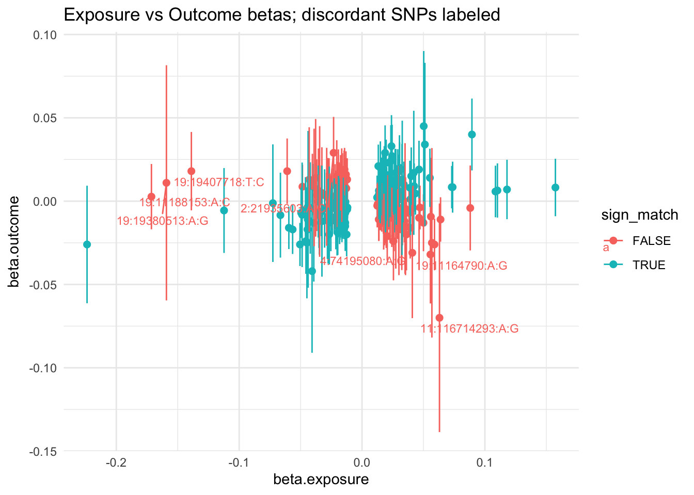
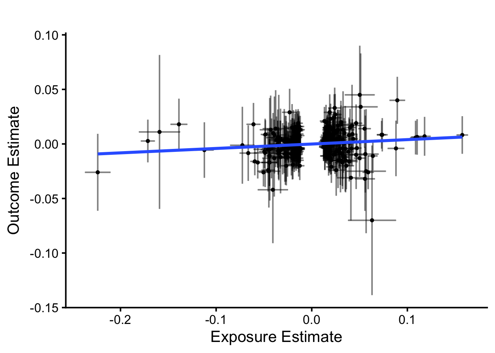
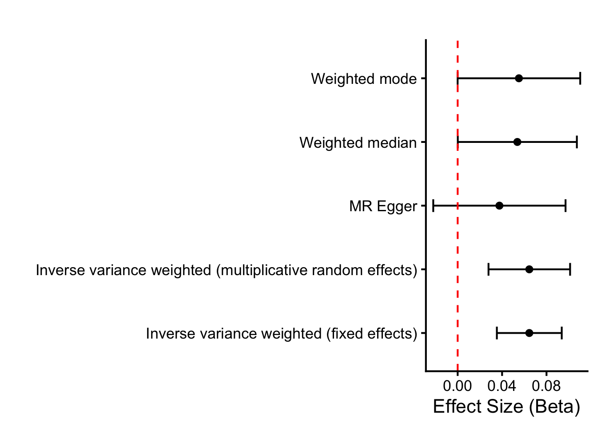
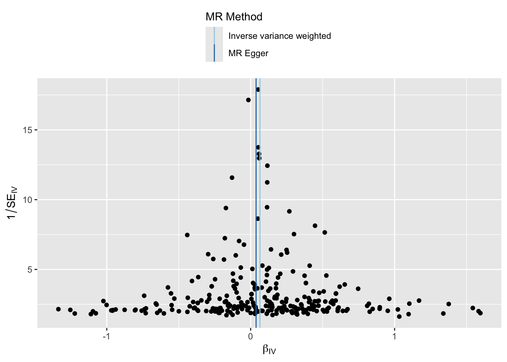
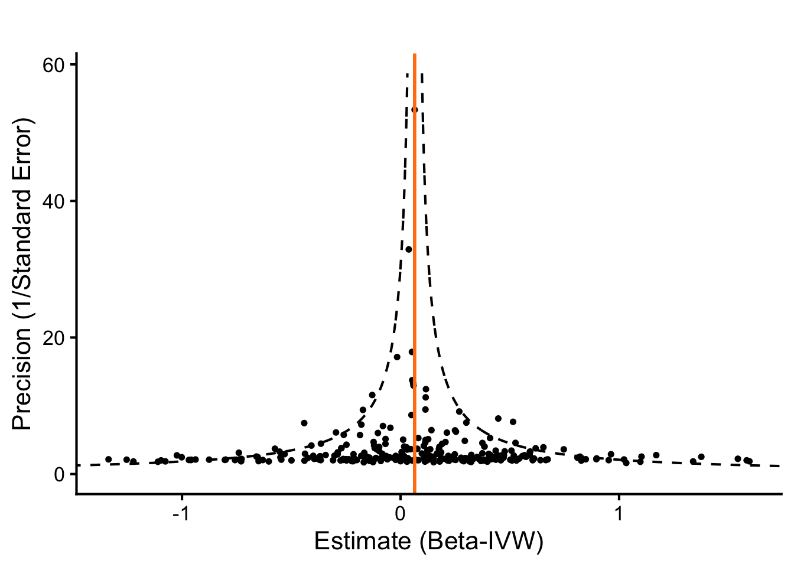
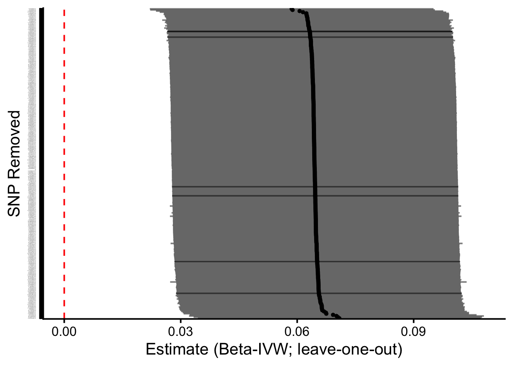

::: {.cell}

```{.r .cell-code}
# hide this code chunk
#| echo: false
#| message: false

# defines the se function
se <- function(x) {
  sd(x, na.rm = TRUE) / sqrt(length(x))
}

#load these packages, nearly always needed
library(tidyverse)
library(knitr)

# sets maize and blue color scheme
color_scheme <- c("#00274c", "#ffcb05")
```
:::


## Purpose

To validate SNPs for total cholesterol GWAS using those identified using UK Biobank.  This script can be found in /Users/davebrid/Documents/GitHub/PrecisionNutrition/Human Genetics and was most recently run on Wed Nov 26 10:25:36 2025

## Data Entry


::: {.cell}

```{.r .cell-code}
instruments.tc.file <- 'Total Cholesterol Instruments from UKBB.csv'
gwas.calcium.file <- 'PheWeb Summary Statistics/phenocode-Ca.tsv.gz'
samplesize.outcome.calcium <- 46100


# loaded and renamed columns
instruments.tc <- read_csv(instruments.tc.file) |>
  rename(
    SNP                       = SP2,
    beta.exposure             = BETA,
    se.exposure               = SE,
    effect_allele.exposure    = EA,
    other_allele.exposure     = OA,
    pval.exposure             = P,
    eaf.exposure              = ALT_FREQS,
    samplesize.exposure       = N_exposure
  ) |>
  mutate(id.exposure="Total Cholesterol (UK Biobank)",
         exposure="Total Cholesterol (UK Biobank)")


gwas.calcium <- read_tsv(gwas.calcium.file) |>
  mutate(ID=paste(chrom, pos, ref,alt, sep=":")) |>
  rename(
    SNP                        = ID,            # or ID if that’s the matching ID
    beta.outcome               = beta,
    se.outcome                 = sebeta,
    effect_allele.outcome      = alt,   # whichever is effect allele
    other_allele.outcome       = ref,   # whichever is other allele
    pval.outcome               = pval,
    eaf.outcome                = maf,
  ) |>
  mutate(id.outcome = "Calcium (MGI-BioVU LabWAS)",
         outcome = "Calcium (MGI-BioVU LabWAS)",
         samplesize.outcome = samplesize.outcome.calcium)  # sample size for MGI/BioVU for calcium)
```
:::


This presumes the sample sizes was 46100 from Table 1 of https://doi.org/10.1371/journal.pgen.1009077.

Loaded in the instruments for total cholesterol from UK Biobank from the datafile Total Cholesterol Instruments from UKBB.csv and the GWAS summary statistics for calcium from the datafile PheWeb Summary Statistics/phenocode-Ca.tsv.gz.


::: {.cell}

```{.r .cell-code}
library(TwoSampleMR)

data <- harmonise_data(instruments.tc, gwas.calcium, action = 2)

table(data$mr_keep) |>
  kable(caption="Number of SNPs kept for MR analysis")
```

::: {.cell-output-display}


Table: Number of SNPs kept for MR analysis

|Var1  | Freq|
|:-----|----:|
|FALSE |    5|
|TRUE  |  280|


:::

```{.r .cell-code}
table(data$palindromic)  |>
  kable(caption="Number of palindromic SNPs")
```

::: {.cell-output-display}


Table: Number of palindromic SNPs

|Var1  | Freq|
|:-----|----:|
|FALSE |  250|
|TRUE  |   35|


:::

```{.r .cell-code}
data <- data %>%
  mutate(
    allele_match = (toupper(effect_allele.exposure) == toupper(effect_allele.outcome)) &
                  (toupper(other_allele.exposure) == toupper(other_allele.outcome)),
    allele_swapped = (toupper(effect_allele.exposure) == toupper(other_allele.outcome)) &
                    (toupper(other_allele.exposure) == toupper(effect_allele.outcome))
  )

# 2) EAF concordance checks (detect possible strand/orientation issues)
# requires eaf.exposure and eaf.outcome present
if(all(c("eaf.exposure","eaf.outcome") %in% names(data))){
  data <- data %>%
    mutate(
      eaf_diff = abs(eaf.exposure - eaf.outcome),
      eaf_flip_diff = abs(eaf.exposure - (1 - eaf.outcome)),
      suspicious_eaf = (eaf_diff > 0.2 & eaf_flip_diff > 0.2)  # very different frequencies
    )
  summary(data$eaf_diff)
  summary(data$eaf_flip_diff)
  cat("Num suspicious EAFs:", sum(data$suspicious_eaf, na.rm=TRUE), "\n")
} else {
  cat("No EAF columns present for both datasets; consider adding reference panel EAFs.\n")
}
```

::: {.cell-output .cell-output-stdout}

```
Num suspicious EAFs: 0 
```


:::

```{.r .cell-code}
# 3) List discordant SNPs
data <- data %>%
  mutate(sign_match = sign(beta.exposure) == sign(beta.outcome))

discordant <- data %>% filter(!sign_match) %>%
  select(SNP, beta.exposure, se.exposure, beta.outcome, se.outcome,
         effect_allele.exposure, other_allele.exposure,
         effect_allele.outcome, other_allele.outcome,
         palindromic, ambiguous, eaf.exposure, eaf.outcome)

kable(discordant |>
        arrange(beta.exposure) |>
        select(SNP,beta.exposure,se.exposure,beta.outcome,se.outcome),
      caption="Discordant SNPs where the beta coefficients directionally differ between exposure and outcome")
```

::: {.cell-output-display}


Table: Discordant SNPs where the beta coefficients directionally differ between exposure and outcome

|SNP              | beta.exposure| se.exposure| beta.outcome| se.outcome|
|:----------------|-------------:|-----------:|------------:|----------:|
|19:11188153:A:C  |      -0.17140|    0.003743|       0.0027|     0.0100|
|19:19380513:A:G  |      -0.15920|    0.011020|       0.0110|     0.0360|
|19:19407718:T:C  |      -0.13890|    0.004510|       0.0180|     0.0120|
|9:107669073:T:C  |      -0.06093|    0.003729|       0.0180|     0.0100|
|15:58680954:T:C  |      -0.04849|    0.002466|       0.0087|     0.0067|
|6:160682897:A:G  |      -0.04298|    0.005800|       0.0130|     0.0160|
|15:58579956:A:G  |      -0.04040|    0.003485|       0.0100|     0.0094|
|8:41549194:T:C   |      -0.03901|    0.006309|       0.0082|     0.0180|
|1:55794891:T:C   |      -0.03775|    0.006923|       0.0140|     0.0180|
|16:72295289:A:G  |      -0.03691|    0.004073|       0.0036|     0.0110|
|19:45461007:A:G  |      -0.03549|    0.004789|       0.0061|     0.0130|
|8:59388565:T:C   |      -0.03492|    0.002543|       0.0024|     0.0068|
|6:160485194:A:G  |      -0.03449|    0.007016|       0.0058|     0.0200|
|20:34160455:A:G  |      -0.03303|    0.003460|       0.0036|     0.0091|
|18:19595650:T:C  |      -0.03267|    0.005263|       0.0049|     0.0140|
|2:21135577:A:G   |      -0.02892|    0.002515|       0.0035|     0.0069|
|16:69114634:A:G  |      -0.02875|    0.005255|       0.0026|     0.0150|
|10:113910721:A:G |      -0.02858|    0.002704|       0.0028|     0.0072|
|11:75492203:T:C  |      -0.02785|    0.004292|       0.0043|     0.0110|
|19:44693612:A:G  |      -0.02684|    0.003839|       0.0042|     0.0110|
|6:16124560:T:C   |      -0.02622|    0.002616|       0.0031|     0.0069|
|19:45040753:A:C  |      -0.02429|    0.003245|       0.0016|     0.0092|
|2:21935603:A:C   |      -0.02314|    0.004050|       0.0290|     0.0110|
|16:57008508:A:T  |      -0.02194|    0.003658|       0.0026|     0.0100|
|6:26091179:C:G   |      -0.02133|    0.003377|       0.0007|     0.0090|
|13:74747883:T:G  |      -0.02056|    0.003935|       0.0150|     0.0110|
|6:35285720:A:C   |      -0.02050|    0.003694|       0.0041|     0.0100|
|8:116660365:A:G  |      -0.02038|    0.002539|       0.0017|     0.0069|
|3:142110818:T:C  |      -0.02021|    0.003584|       0.0046|     0.0096|
|10:5260682:C:G   |      -0.01993|    0.003334|       0.0012|     0.0092|
|20:17843824:T:C  |      -0.01924|    0.003184|       0.0140|     0.0087|
|17:29578360:T:C  |      -0.01892|    0.002612|       0.0034|     0.0071|
|11:103871404:A:C |      -0.01871|    0.003016|       0.0002|     0.0083|
|19:45439163:C:G  |      -0.01854|    0.003108|       0.0072|     0.0082|
|17:7560835:T:G   |      -0.01838|    0.002492|       0.0063|     0.0066|
|3:88306596:A:G   |      -0.01825|    0.003243|       0.0048|     0.0088|
|3:142649110:C:G  |      -0.01821|    0.002556|       0.0067|     0.0070|
|3:142649110:C:G  |      -0.01821|    0.002556|       0.0067|     0.0070|
|1:10796866:T:C   |      -0.01809|    0.002552|       0.0004|     0.0068|
|11:46466828:A:C  |      -0.01790|    0.003191|       0.0004|     0.0086|
|7:87103670:C:G   |      -0.01745|    0.003119|       0.0110|     0.0085|
|20:39091487:A:G  |      -0.01713|    0.002574|       0.0027|     0.0071|
|5:131744574:T:C  |      -0.01652|    0.003048|       0.0160|     0.0080|
|6:29396874:T:C   |      -0.01650|    0.002594|       0.0012|     0.0070|
|14:75293374:A:G  |      -0.01598|    0.002412|       0.0160|     0.0065|
|17:46526303:A:C  |      -0.01493|    0.002503|       0.0059|     0.0067|
|16:11644842:A:G  |      -0.01462|    0.002611|       0.0140|     0.0070|
|12:125071709:A:T |      -0.01460|    0.002651|       0.0160|     0.0073|
|9:78729213:T:C   |      -0.01422|    0.002483|       0.0190|     0.0066|
|5:161097142:T:G  |      -0.01401|    0.002727|       0.0091|     0.0074|
|22:41272143:T:C  |      -0.01370|    0.002409|       0.0120|     0.0065|
|6:145114935:A:G  |      -0.01355|    0.002461|       0.0130|     0.0066|
|13:51050243:T:C  |      -0.01309|    0.002637|       0.0160|     0.0071|
|10:88515072:T:C  |      -0.01277|    0.002585|       0.0077|     0.0069|
|19:45818628:A:G  |      -0.01208|    0.002414|       0.0130|     0.0065|
|10:130357578:A:C |       0.01243|    0.002443|      -0.0027|     0.0066|
|7:21443716:A:G   |       0.01253|    0.002447|      -0.0028|     0.0066|
|2:204305093:T:C  |       0.01272|    0.002434|      -0.0018|     0.0066|
|6:130397238:A:G  |       0.01368|    0.002439|      -0.0110|     0.0066|
|20:25210827:A:G  |       0.01375|    0.002403|      -0.0110|     0.0065|
|4:7211197:A:G    |       0.01415|    0.002614|      -0.0035|     0.0071|
|1:183074582:T:C  |       0.01443|    0.002428|      -0.0031|     0.0065|
|19:17316782:T:C  |       0.01476|    0.002449|      -0.0014|     0.0067|
|1:234803619:T:C  |       0.01477|    0.002457|      -0.0031|     0.0066|
|17:37835755:T:C  |       0.01525|    0.002564|      -0.0040|     0.0069|
|15:63793238:T:G  |       0.01601|    0.002536|      -0.0018|     0.0068|
|2:64905729:T:C   |       0.01603|    0.002745|      -0.0038|     0.0074|
|5:39543680:T:C   |       0.01614|    0.002523|      -0.0023|     0.0067|
|12:110027795:A:G |       0.01629|    0.002513|      -0.0008|     0.0067|
|16:67977382:T:C  |       0.01736|    0.003220|      -0.0028|     0.0085|
|19:50028163:A:G  |       0.01762|    0.003113|      -0.0130|     0.0082|
|9:15284100:T:C   |       0.01783|    0.002735|      -0.0098|     0.0073|
|11:18632984:T:C  |       0.01836|    0.002734|      -0.0120|     0.0074|
|2:135597628:T:G  |       0.01910|    0.002519|      -0.0055|     0.0066|
|2:109232388:A:C  |       0.01916|    0.003441|      -0.0070|     0.0094|
|1:224544529:A:G  |       0.01972|    0.002951|      -0.0130|     0.0077|
|10:101912064:T:C |       0.02027|    0.002415|      -0.0150|     0.0065|
|10:46013277:A:C  |       0.02052|    0.002784|      -0.0210|     0.0075|
|20:62903550:A:G  |       0.02081|    0.002990|      -0.0018|     0.0089|
|11:16266403:T:C  |       0.02261|    0.004418|       0.0000|     0.0120|
|12:9077330:A:G   |       0.02288|    0.002877|      -0.0100|     0.0077|
|8:18267338:A:G   |       0.02428|    0.003399|      -0.0097|     0.0091|
|13:114558421:A:G |       0.02537|    0.002957|      -0.0073|     0.0080|
|17:67290356:A:G  |       0.02558|    0.004205|      -0.0240|     0.0120|
|1:110213514:A:T  |       0.02610|    0.004454|      -0.0065|     0.0120|
|15:57494392:A:T  |       0.02749|    0.004647|      -0.0150|     0.0130|
|4:69343287:A:G   |       0.02880|    0.002792|      -0.0078|     0.0076|
|4:69343287:A:G   |       0.02880|    0.002792|      -0.0078|     0.0076|
|1:25775682:A:T   |       0.02922|    0.002420|      -0.0045|     0.0065|
|5:156138356:T:C  |       0.02990|    0.005315|      -0.0082|     0.0150|
|12:133207789:T:C |       0.03005|    0.005783|      -0.0150|     0.0150|
|10:124712961:A:G |       0.03204|    0.003990|      -0.0170|     0.0110|
|2:44068341:C:G   |       0.03237|    0.005568|      -0.0100|     0.0160|
|12:121416988:A:G |       0.03242|    0.002583|      -0.0040|     0.0069|
|1:55520265:T:C   |       0.03294|    0.002754|      -0.0120|     0.0074|
|19:49206108:C:G  |       0.03454|    0.002414|      -0.0120|     0.0065|
|1:109751285:A:C  |       0.03502|    0.007097|      -0.0044|     0.0200|
|2:118518819:A:G  |       0.03540|    0.005603|      -0.0150|     0.0150|
|6:160338775:A:C  |       0.03613|    0.004128|      -0.0200|     0.0110|
|19:11224265:A:G  |       0.03827|    0.002474|      -0.0071|     0.0067|
|11:126246076:T:C |       0.03923|    0.003527|      -0.0160|     0.0094|
|4:74195080:A:G   |       0.04093|    0.007569|      -0.0310|     0.0200|
|19:11275139:A:C  |       0.04147|    0.002557|      -0.0043|     0.0069|
|18:47118923:T:G  |       0.04643|    0.005952|      -0.0100|     0.0160|
|5:156390297:T:C  |       0.04715|    0.002495|      -0.0038|     0.0067|
|18:47158186:T:C  |       0.05001|    0.003136|      -0.0130|     0.0087|
|19:11164790:A:G  |       0.05567|    0.005319|      -0.0320|     0.0150|
|17:64210580:A:C  |       0.05605|    0.007104|      -0.0093|     0.0180|
|19:11262229:T:C  |       0.05687|    0.010550|      -0.0250|     0.0290|
|9:136154168:T:C  |       0.05899|    0.002974|      -0.0260|     0.0079|
|11:116714293:A:G |       0.06304|    0.012810|      -0.0700|     0.0350|
|1:63112320:C:G   |       0.06391|    0.002512|      -0.0110|     0.0068|
|6:161010118:A:G  |       0.08809|    0.004472|      -0.0041|     0.0130|


:::

```{.r .cell-code}
library(ggrepel)
ggplot(data, aes(x=beta.exposure, y=beta.outcome, color = sign_match)) +
  geom_point(size=2) +
  geom_errorbar(aes(ymin = beta.outcome - 1.96*se.outcome, ymax = beta.outcome + 1.96*se.outcome), width=0) +
  geom_text_repel(data = filter(data, !sign_match), aes(label=SNP), hjust=0, vjust=0, size=3) +
  theme_minimal() +
  labs(x="beta.exposure", y="beta.outcome", title="Exposure vs Outcome betas; discordant SNPs labeled")
```

::: {.cell-output-display}
{width=672}
:::
:::


::: {.cell}

```{.r .cell-code}
ggplot(data, aes(x=beta.exposure, y=beta.outcome)) +
  geom_point(size=1) +
  geom_errorbar(aes(ymin = beta.outcome - 1.96*se.outcome,
                    ymax = beta.outcome + 1.96*se.outcome),
                alpha=0.5) +
  geom_errorbar(aes(xmin = beta.exposure - 1.96*se.exposure,
                    xmax = beta.exposure + 1.96*se.exposure),
                alpha=0.5) +
  geom_smooth(method="lm",se=F) +
  theme_classic(base_size=16) +
  labs(x="Exposure Estimate", 
       y="Outcome Estimate", 
       title="") 
```

::: {.cell-output-display}
{width=672}
:::
:::


There were 113 discordant SNPs between the exposure and outcome datasets.  These are listed above.  We can see that some of these SNPs have very small effect sizes in the outcome dataset, suggesting that the discordance may be due to noise.  These were kept in the analysis

### Steiger Filtering


::: {.cell}

```{.r .cell-code}
data_steiger <- steiger_filtering(data)

table(data_steiger$steiger_direction, useNA="ifany") |>
  kable(caption="Steiger filtering results for calcium-calcium evaluation")
```

::: {.cell-output-display}


Table: Steiger filtering results for calcium-calcium evaluation

| Freq|
|----:|


:::
:::


Harmonization results

- We used 370 SNPs as instruments for calcium from UK Biobank.
- There were 277 SNPs in common between the exposure and outcome datasets.
- Removed 0 SNPs due to allele mismatches
- Identified 35 palindromic SNPs 
- A total of 285 SNPs remained for use after harmonization.  5 SNPS were removed because the palindromic SNP is ambiguous and strand alignment could not be resolved, this variant was automatically dropped from the MR analysis to avoid mis-specified effect directions.
- After Steiger filtering, 280 SNPs were retained for analysis, indicating that all SNPs had stronger associations with the exposure (calcium in UK Biobank) than the outcome (calcium in MGI/BioVU), supporting the assumed causal direction.  0 SNPs were removed by Steiger filtering.


::: {.cell}

```{.r .cell-code}
data.annot <- data_steiger %>%
  mutate(
    R2.exposure = 2 * eaf.exposure * (1 - eaf.exposure) * beta.exposure^2,
    F.exposure = (R2.exposure * (samplesize.exposure - 2)) / (1 - R2.exposure)
  )

calcium.exposure.summary <- data.annot %>%
  summarise(
    num_snps = n(),
    samplesize.exposure = first(samplesize.exposure),
    cumulative_R2 = sum(R2.exposure, na.rm = TRUE),
    mean_F = mean(F.exposure, na.rm = TRUE),
    median_F = median(F.exposure, na.rm = TRUE),
    mean_maf = mean(eaf.exposure, na.rm = TRUE),
    mean_beta = mean(abs(beta.exposure), na.rm = TRUE)
  ) |>
  mutate(overall_F = (cumulative_R2 * (samplesize.exposure - num_snps - 1)) / 
                     ((1 - cumulative_R2) * num_snps))

# For outcome (e.g., cholesterol) SNPs
outcome.summary_metrics <- data.annot %>%
  summarise(
    num_snps = n(),
    mean_beta = mean(abs(beta.outcome), na.rm = TRUE),
    mean_se = mean(se.outcome, na.rm = TRUE),
    mean_maf = mean(eaf.outcome, na.rm = TRUE)
  )

library(knitr)
kable(calcium.exposure.summary, caption="Summary of total cholesterol instruments after harmonisation")
```

::: {.cell-output-display}


Table: Summary of total cholesterol instruments after harmonisation

| num_snps| samplesize.exposure| cumulative_R2|   mean_F| median_F|  mean_maf| mean_beta| overall_F|
|--------:|-------------------:|-------------:|--------:|--------:|---------:|---------:|---------:|
|      285|              420607|     0.0972188| 143.7673|  53.4925| 0.3497576| 0.0301266|  158.8196|


:::

```{.r .cell-code}
write_csv(calcium.exposure.summary, "Instrument Metrics - Total Cholesterol - Post-Harmonization.csv")
write_csv(outcome.summary_metrics, "Outcome Metrics - Total Cholesterol - Post-Harmonization.csv")

#write out the instruments used for calcium
data_steiger %>% filter(mr_keep==TRUE) %>% 
  mutate(Exposure = "Calcium") |>
  select(Exposure, CHR, POS, effect_allele.exposure, other_allele.exposure, beta.exposure, se.exposure, pval.exposure, eaf.exposure, R2, `F`, rsids, nearest_genes) |>
  rename(effect_allele = effect_allele.exposure,
         other_allele = other_allele.exposure,
         beta = beta.exposure,
         se = se.exposure,
         p = pval.exposure,
         eaf = eaf.exposure) |>
  write_csv("Total Cholesterol Instruments Post-Harmonization.csv")
  
kable(outcome.summary_metrics, caption="Summary of total cholesterol effects after harmonisation")
```

::: {.cell-output-display}


Table: Summary of total cholesterol effects after harmonisation

| num_snps| mean_beta|   mean_se|  mean_maf|
|--------:|---------:|---------:|---------:|
|      285| 0.0091807| 0.0093411| 0.2567684|


:::
:::


::: {.cell}

```{.r .cell-code}
tc.control.mr <- mr(data_steiger,
                         method_list = c(
  "mr_ivw_mre",
  "mr_ivw_fe",
  "mr_egger_regression", 
  "mr_weighted_median", 
  "mr_weighted_mode"
))

tc.control.mr |> select(-starts_with('id')) |> 
  kable(caption="MR Results for Total Cholesterol - Calcium Control",
        digits=c(0,0,0,0,3,3,99))
```

::: {.cell-output-display}


Table: MR Results for Total Cholesterol - Calcium Control

|outcome                    |exposure                       |method                                                    | nsnp|     b|    se|         pval|
|:--------------------------|:------------------------------|:---------------------------------------------------------|----:|-----:|-----:|------------:|
|Calcium (MGI-BioVU LabWAS) |Total Cholesterol (UK Biobank) |Inverse variance weighted (multiplicative random effects) |  280| 0.065| 0.019| 5.780089e-04|
|Calcium (MGI-BioVU LabWAS) |Total Cholesterol (UK Biobank) |Inverse variance weighted (fixed effects)                 |  280| 0.065| 0.015| 1.504019e-05|
|Calcium (MGI-BioVU LabWAS) |Total Cholesterol (UK Biobank) |MR Egger                                                  |  280| 0.038| 0.030| 2.173225e-01|
|Calcium (MGI-BioVU LabWAS) |Total Cholesterol (UK Biobank) |Weighted median                                           |  280| 0.054| 0.027| 4.952359e-02|
|Calcium (MGI-BioVU LabWAS) |Total Cholesterol (UK Biobank) |Weighted mode                                             |  280| 0.055| 0.028| 5.113359e-02|


:::

```{.r .cell-code}
tc.control.mr |> select(-starts_with('id')) |> 
  write_csv("MR Results - Total Cholesterol - Calcium.csv")

ggplot(tc.control.mr, aes(y=method,x=b)) +
  geom_point() +
  geom_errorbar(aes(xmin=b-1.96*se, xmax=b+1.96*se), width=0.2) +
  theme_classic(base_size=16) +
  labs(title="",
       y="",
       x="Effect Size (Beta)") +
  geom_vline(xintercept=0, linetype="dashed", color = "red") 
```

::: {.cell-output-display}
{width=672}
:::
:::


The primary result, using the inverse variance weighted (multiplicative random effects) method shows a 0.064511 $\pm$ 0.0187438 SD increase in calcium (MGI-BioVU LabWAS) per 1 SD increase in total cholesterol (UK Biobank).  This is statistically significant with a p-value of 5.7800887\times 10^{-4}.  Three of the four MR methods (IVW, weighted median, weighted mode) gave consistent, significant causal estimates, supporting the hypothesis that total cholesterol may impact serum calcium levels in a positive direction.  The MR-Egger estimate was not statistically significant, but this method is known to have low power.

### MR-Egger Intercept


::: {.cell}

```{.r .cell-code}
egger_intercept <- mr_pleiotropy_test(data_steiger)
egger_intercept|>
  select(-starts_with('id')) |> 
  kable(caption="MR Pleiotropy Results for Total Cholesterol - Calcium Analysis")
```

::: {.cell-output-display}


Table: MR Pleiotropy Results for Total Cholesterol - Calcium Analysis

|outcome                    |exposure                       | egger_intercept|        se|      pval|
|:--------------------------|:------------------------------|---------------:|---------:|---------:|
|Calcium (MGI-BioVU LabWAS) |Total Cholesterol (UK Biobank) |       0.0011055| 0.0009825| 0.2614705|


:::
:::

The MR-Egger intercept is  with a p-value of 0.2614705, indicating no evidence of directional pleiotropy.  Although the p-value is small, the intercept magnitude is near zero, indicating that any pleiotropic bias is likely minor.

### Heterogeneity Statistics


::: {.cell}

```{.r .cell-code}
# Heterogeneity tests for IVW and MR-Egger
heterogeneity <- mr_heterogeneity(data_steiger)
heterogeneity|>
  select(-starts_with('id')) |> 
  kable(caption="MR Heterogeneity Results for Total Cholesterol - Calcium Analysis",
        digits=c(0,0,0,3,3,99))
```

::: {.cell-output-display}


Table: MR Heterogeneity Results for Total Cholesterol - Calcium Analysis

|outcome                    |exposure                       |method                    |      Q| Q_df|       Q_pval|
|:--------------------------|:------------------------------|:-------------------------|------:|----:|------------:|
|Calcium (MGI-BioVU LabWAS) |Total Cholesterol (UK Biobank) |MR Egger                  | 439.21|  278| 2.264577e-09|
|Calcium (MGI-BioVU LabWAS) |Total Cholesterol (UK Biobank) |Inverse variance weighted | 441.21|  279| 1.963535e-09|


:::

```{.r .cell-code}
# Columns: method, Q, Q_df, Q_pval
# Interpretation: small Q_pval (<0.05) indicates heterogeneity among SNPs
```
:::


This is expected with polygenic traits and does not necessarily invalidate the overall causal estimate, particularly since robust methods (weighted median, weighted mode) gave consistent results.


::: {.cell}

```{.r .cell-code}
single_snp_results <- mr_singlesnp(data_steiger)
mr_funnel_plot(single_snp_results) 
```

::: {.cell-output .cell-output-stdout}

```
$`Total Cholesterol (UK Biobank).Calcium (MGI-BioVU LabWAS)`
```


:::

::: {.cell-output-display}
{width=672}
:::

::: {.cell-output .cell-output-stdout}

```

attr(,"split_type")
[1] "data.frame"
attr(,"split_labels")
                     id.exposure                 id.outcome
1 Total Cholesterol (UK Biobank) Calcium (MGI-BioVU LabWAS)
```


:::

```{.r .cell-code}
# Get overall IVW estimate for the vertical line
ivw_beta <- tc.control.mr |> filter(method=="Inverse variance weighted (multiplicative random effects)") |> pull(b)

# Determine y-range based on your data
y_min <- 0
y_max <- max(single_snp_results$se^{-1}) * 1.1  # 10% padding above max precision

# Generate a fine grid of precision values
precision_grid <- seq(y_min, y_max, length.out = 1000)

# Compute boundaries: ivw_beta ± 1.96 / precision
lower_bound <- ivw_beta - 1.96 / precision_grid
upper_bound <- ivw_beta + 1.96 / precision_grid

# Create data frame for boundaries
bounds_df <- data.frame(precision = precision_grid, lower = lower_bound, upper = upper_bound)

# Plot
ggplot(single_snp_results, aes(x = b, y = 1/se)) +
  # Scatter points for each SNP
  geom_point(size = 1) +
  # Vertical line at IVW estimate
  geom_vline(xintercept = ivw_beta, linetype = "solid", color = "#ff7f0e", size = 1) +
  # Curved pseudo-95% CI boundaries (the cone)
  geom_line(data = bounds_df, aes(x = lower, y = precision), linetype = "dashed") +
  geom_line(data = bounds_df, aes(x = upper, y = precision), linetype = "dashed") +
  # Customize axes and labels
  labs(
    x = "Estimate (Beta-IVW)",
    y = "Precision (1/Standard Error)",
    title = ""
  ) +
  # Apply clean theme and limit y to >=0
  theme_classic(base_size = 16) +
  theme(plot.title = element_text(hjust = 0.5)) +
  coord_cartesian(ylim = c(0, y_max), xlim = c(min(single_snp_results$b), max(single_snp_results$b)))  # Adjust x-limits for visibility
```

::: {.cell-output-display}
{width=672}
:::
:::


### Leave-one-out Analysis

Using IVW methods


::: {.cell}

```{.r .cell-code}
# LOO using IVW
loo_res <- mr_leaveoneout(data_steiger)
loo_res |> 
  mutate(diff = b - filter(tc.control.mr, method=="Inverse variance weighted (multiplicative random effects)")$b) |>
  arrange(-abs(diff)) |>
  head() |>
  select(SNP,diff,b,se,p) |>
  kable(caption="Leave-One-Out Results for Total Cholesterol Analysis (IVW method) for influential SNPs",
        digits=c(0,5,5,5,5))
```

::: {.cell-output-display}


Table: Leave-One-Out Results for Total Cholesterol Analysis (IVW method) for influential SNPs

|SNP             |     diff|       b|      se|       p|
|:---------------|--------:|-------:|-------:|-------:|
|9:136154168:T:C |  0.00634| 0.07085| 0.01858| 0.00014|
|19:19407718:T:C |  0.00595| 0.07047| 0.01895| 0.00020|
|2:27742603:T:C  | -0.00593| 0.05858| 0.01864| 0.00168|
|8:9183596:A:G   | -0.00571| 0.05880| 0.01871| 0.00167|
|19:11188153:A:C |  0.00560| 0.07012| 0.01938| 0.00030|
|1:63112320:C:G  |  0.00474| 0.06925| 0.01886| 0.00024|


:::

```{.r .cell-code}
# Columns: SNP, nsnp, b, se, pval — gives causal estimate with each SNP removed once

# Optional: plot LOO results

ggplot(loo_res, aes(x = reorder(SNP, -b), y = b)) +
  geom_point(size=1) +
  geom_errorbar(aes(ymin = b - 1.96*se, ymax = b + 1.96*se), width = 0.01 ,alpha=0.5) +
  coord_flip() +
  labs(x = "SNP Removed", y = "Estimate (Beta-IVW; leave-one-out)") +
  geom_hline(yintercept=0, linetype="dashed", color = "red") +
  theme_classic(base_size=16) +
  theme(axis.text.y = element_text(size = 1)) 
```

::: {.cell-output-display}
{width=672}
:::
:::

Leave-one-out analyses suggested that no SNPs had a relatively large influence on the IVW estimate, because removal did not qualitatively change the overall conclusion, supporting the robustness of the causal inference.


## Session Information


::: {.cell}

```{.r .cell-code}
sessionInfo()
```

::: {.cell-output .cell-output-stdout}

```
R version 4.5.2 (2025-10-31)
Platform: aarch64-apple-darwin20
Running under: macOS Tahoe 26.1

Matrix products: default
BLAS:   /System/Library/Frameworks/Accelerate.framework/Versions/A/Frameworks/vecLib.framework/Versions/A/libBLAS.dylib 
LAPACK: /Library/Frameworks/R.framework/Versions/4.5-arm64/Resources/lib/libRlapack.dylib;  LAPACK version 3.12.1

locale:
[1] en_US.UTF-8/en_US.UTF-8/en_US.UTF-8/C/en_US.UTF-8/en_US.UTF-8

time zone: America/Detroit
tzcode source: internal

attached base packages:
[1] stats     graphics  grDevices utils     datasets  methods   base     

other attached packages:
 [1] ggrepel_0.9.6      TwoSampleMR_0.6.22 knitr_1.50         lubridate_1.9.4   
 [5] forcats_1.0.1      stringr_1.6.0      dplyr_1.1.4        purrr_1.2.0       
 [9] readr_2.1.6        tidyr_1.3.1        tibble_3.3.0       ggplot2_4.0.1     
[13] tidyverse_2.0.0   

loaded via a namespace (and not attached):
 [1] generics_0.1.4     lattice_0.22-7     stringi_1.8.7      hms_1.1.4         
 [5] digest_0.6.38      magrittr_2.0.4     evaluate_1.0.5     grid_4.5.2        
 [9] timechange_0.3.0   RColorBrewer_1.1-3 fastmap_1.2.0      Matrix_1.7-4      
[13] plyr_1.8.9         jsonlite_2.0.0     mgcv_1.9-4         scales_1.4.0      
[17] mnormt_2.1.1       cli_3.6.5          rlang_1.1.6        crayon_1.5.3      
[21] splines_4.5.2      bit64_4.6.0-1      withr_3.0.2        yaml_2.3.10       
[25] tools_4.5.2        parallel_4.5.2     tzdb_0.5.0         vctrs_0.6.5       
[29] R6_2.6.1           lifecycle_1.0.4    htmlwidgets_1.6.4  bit_4.6.0         
[33] psych_2.5.6        vroom_1.6.6        pkgconfig_2.0.3    pillar_1.11.1     
[37] gtable_0.3.6       glue_1.8.0         data.table_1.17.8  Rcpp_1.1.0        
[41] xfun_0.54          tidyselect_1.2.1   rstudioapi_0.17.1  farver_2.1.2      
[45] nlme_3.1-168       htmltools_0.5.8.1  rmarkdown_2.30     labeling_0.4.3    
[49] compiler_4.5.2     S7_0.2.1          
```


:::
:::

