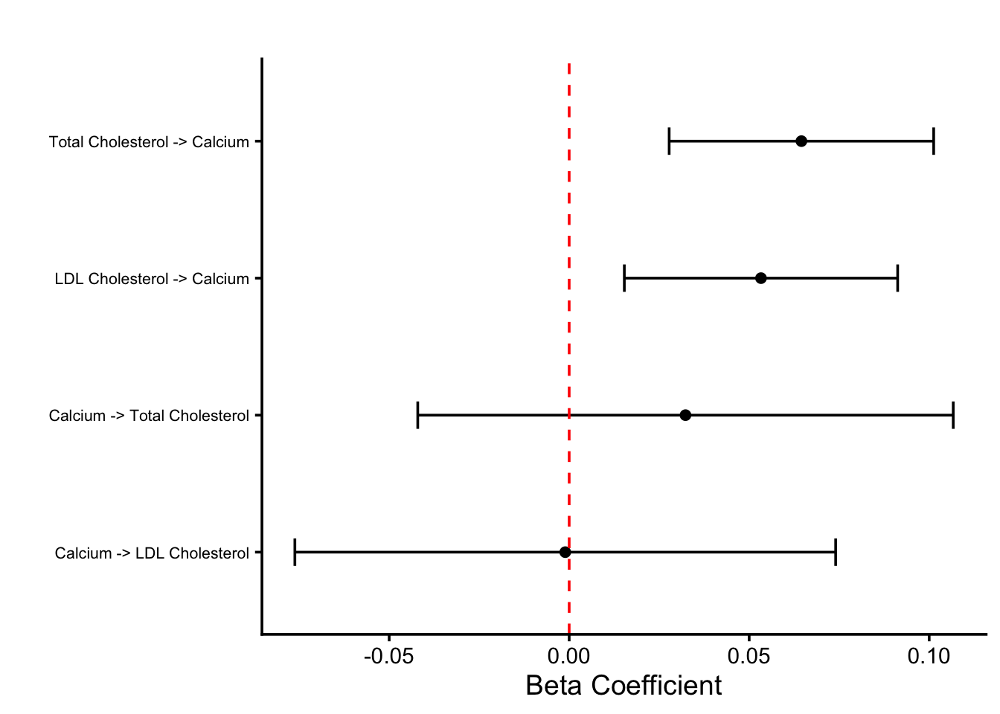
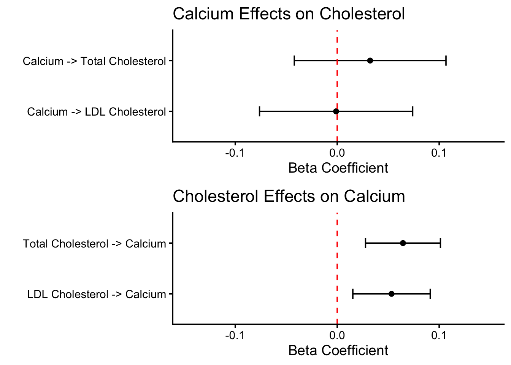

::: {.cell}

```{.r .cell-code}
# hide this code chunk
#| echo: false
#| message: false

# defines the se function
se <- function(x) {
  sd(x, na.rm = TRUE) / sqrt(length(x))
}

#load these packages, nearly always needed
library(tidyverse)
library(knitr)

# sets maize and blue color scheme
color_scheme <- c("#00274c", "#ffcb05")
```
:::


## Purpose

To generate summary tables and figures from individual analyses for publicaiton

## Post-Harmonization Instrument Summary Statistics Table


::: {.cell}

```{.r .cell-code}
calcium.instrument.summary.file <- 'Instrument Metrics - Calcium - Post-Harmonization (Total Cholesterol).csv' #identical instruments for LDL-Cholesterol outcomes after harmonisation
ldl.instrument.summary.file <- 'Instrument Metrics - LDL Cholesterol - Post-Harmonization.csv'
tc.instrument.summary.file <- 'Instrument Metrics - Total Cholesterol - Post-Harmonization.csv'

bind_rows(read_csv(calcium.instrument.summary.file) |> mutate(Instrument = "Serum Calcium"),
      read_csv(ldl.instrument.summary.file) |> mutate(Instrument = "LDL-Cholesterol"),
      read_csv(tc.instrument.summary.file) |> mutate(Instrument = "Total Cholesterol")) |>
  relocate(Instrument, .before = everything()) |>
  relocate(overall_F, .before= mean_maf) |>
  rename(N=samplesize.exposure,
         SNPs = num_snps,
         `Cumulative R2`=cumulative_R2,
         `Mean F Statistic` = mean_F,
         `Median F Statistic`=median_F,
         `Overall F Statistic`=overall_F,
         `Mean MAF`=mean_maf,
         `Mean Beta Coefficient`=mean_beta) -> instrument.summary

instrument.summary |> 
  kable(caption="Instrument summary after harmonisation")
```

::: {.cell-output-display}


Table: Instrument summary after harmonisation

|Instrument        | SNPs|      N| Cumulative R2| Mean F Statistic| Median F Statistic| Overall F Statistic|  Mean MAF| Mean Beta Coefficient|
|:-----------------|----:|------:|-------------:|----------------:|------------------:|-------------------:|---------:|---------------------:|
|Serum Calcium     |  277| 385066|     0.0638365|          88.8467|           54.59161|            94.72378| 0.3670863|             0.0259874|
|LDL-Cholesterol   |  236| 419831|     0.0886163|         158.0255|           51.04586|           172.87401| 0.3428665|             0.0321334|
|Total Cholesterol |  285| 420607|     0.0972188|         143.7673|           53.49250|           158.81963| 0.3497576|             0.0301266|


:::

```{.r .cell-code}
instrument.summary |>
  mutate(across(ends_with("R2") | ends_with("Coefficient") | ends_with('MAF'), ~ round(., 3))) %>%
  mutate(across(ends_with("Statistic"), ~ round(., 1))) %>%
  # SNPs and N are left unrounded (no action needed) |>
  write_csv("Instrument Metrics - Post-Harmonization.csv")
```
:::


## Instrument Lists


::: {.cell}

```{.r .cell-code}
calcium.instruments.file <- 'Calcium Instruments Post-Harmonization (Total Cholesterol).csv'
ldl.instruments.file <- 'LDL Cholesterol Instruments Post-Harmonization.csv'
tc.instruments.file <- 'Total Cholesterol Instruments Post-Harmonization.csv'

bind_rows(read_csv(calcium.instruments.file) |> mutate(Instrument = "Serum Calcium"),
      read_csv(ldl.instruments.file) |> mutate(Instrument = "LDL-Cholesterol"),
      read_csv(tc.instruments.file) |> mutate(Instrument = "Total Cholesterol")) |>
  relocate(Instrument, .before = everything()) |>
  select(-Exposure) -> instrument.list

instrument.list |>
  write_csv("Instrument SNP Lists - Post-Harmonization.csv")
```
:::


## MR Results Summary Table


::: {.cell}

```{.r .cell-code}
calcium.tc.mr.file <- 'MR Results - Calcium - Total Cholesterol.csv'
calcium.ldl.mr.file <- 'MR Results - Calcium - LDL Cholesterol.csv'
tc.calcium.mr.file <- 'MR Results - Total Cholesterol - Calcium.csv'
ldl.calcium.instruments.file <- 'MR Results - LDL Cholesterol - Calcium.csv'

bind_rows(read_csv(calcium.tc.mr.file) |> mutate(Analysis = "Calcium -> Total Cholesterol"),
      read_csv(calcium.ldl.mr.file) |> mutate(Analysis = "Calcium -> LDL Cholesterol"),
      read_csv(tc.calcium.mr.file) |> mutate(Analysis = "Total Cholesterol -> Calcium"),
      read_csv(ldl.calcium.instruments.file) |> mutate(Analysis = "LDL Cholesterol -> Calcium")) |>
  relocate(Analysis, .before = everything()) |>
  select(-nsnp,-outcome,-exposure) -> mr.results.summary

mr.results.summary |> kable(caption="Mendelian Randomization Results Summary")
```

::: {.cell-output-display}


Table: Mendelian Randomization Results Summary

|Analysis                     |method                |          b|        se|      pval|
|:----------------------------|:---------------------|----------:|---------:|---------:|
|Calcium -> Total Cholesterol |IVW-RE                |  0.0323096| 0.0379454| 0.3945054|
|Calcium -> Total Cholesterol |IVW-FE                |  0.0323096| 0.0249609| 0.1955242|
|Calcium -> Total Cholesterol |Weighted median       |  0.0109517| 0.0541468| 0.8397134|
|Calcium -> Total Cholesterol |MR Egger              |  0.0124277| 0.0806417| 0.8776367|
|Calcium -> Total Cholesterol |Weighted mode         |  0.0182577| 0.0574237| 0.7507675|
|Calcium -> Total Cholesterol |MR-PRESSO (Raw)       |  0.0375495| 0.0383199| 0.3279968|
|Calcium -> Total Cholesterol |MR-PRESSO (Corrected) | -0.0090727| 0.0297982| 0.7610049|
|Calcium -> Total Cholesterol |MR-RAPS               |  0.0085414| 0.0330626| 0.7961437|
|Calcium -> Total Cholesterol |MR-CAUSE              |  0.0204349| 0.0382653|        NA|
|Calcium -> LDL Cholesterol   |IVW-RE                | -0.0010879| 0.0383213| 0.9773529|
|Calcium -> LDL Cholesterol   |IVW-FE                | -0.0010879| 0.0257579| 0.9663122|
|Calcium -> LDL Cholesterol   |Weighted median       | -0.0598648| 0.0484156| 0.2162812|
|Calcium -> LDL Cholesterol   |MR Egger              | -0.0659224| 0.0806079| 0.4141755|
|Calcium -> LDL Cholesterol   |Weighted mode         | -0.0003838| 0.0635790| 0.9951880|
|Calcium -> LDL Cholesterol   |MR-PRESSO (Raw)       |  0.0006814| 0.0382568| 0.9858026|
|Calcium -> LDL Cholesterol   |MR-PRESSO (Corrected) | -0.0016373| 0.0294716| 0.9557368|
|Calcium -> LDL Cholesterol   |MR-RAPS               | -0.0044180| 0.0327750| 0.8927706|
|Calcium -> LDL Cholesterol   |MR-CAUSE              |  0.0115015| 0.0433673|        NA|
|Total Cholesterol -> Calcium |IVW-RE                |  0.0645110| 0.0187438| 0.0005780|
|Total Cholesterol -> Calcium |IVW-FE                |  0.0645110| 0.0149052| 0.0000150|
|Total Cholesterol -> Calcium |Weighted median       |  0.0537301| 0.0278917| 0.0540565|
|Total Cholesterol -> Calcium |MR Egger              |  0.0375814| 0.0303938| 0.2173225|
|Total Cholesterol -> Calcium |Weighted mode         |  0.0551629| 0.0259909| 0.0346854|
|Total Cholesterol -> Calcium |MR-PRESSO (Raw)       |  0.0619382| 0.0185117| 0.0009306|
|Total Cholesterol -> Calcium |MR-PRESSO (Corrected) |  0.0681044| 0.0183582| 0.0002497|
|Total Cholesterol -> Calcium |MR-RAPS               |  0.0615523| 0.0186190| 0.0009468|
|Total Cholesterol -> Calcium |MR-CAUSE              |  0.0504610| 0.0229592|        NA|
|LDL Cholesterol -> Calcium   |IVW-RE                |  0.0532824| 0.0193685| 0.0059417|
|LDL Cholesterol -> Calcium   |IVW-FE                |  0.0532824| 0.0153188| 0.0005047|
|LDL Cholesterol -> Calcium   |Weighted median       |  0.0549073| 0.0245649| 0.0254044|
|LDL Cholesterol -> Calcium   |MR Egger              |  0.0501729| 0.0288584| 0.0834445|
|LDL Cholesterol -> Calcium   |Weighted mode         |  0.0552770| 0.0217065| 0.0115294|
|LDL Cholesterol -> Calcium   |MR-PRESSO (Raw)       |  0.0513826| 0.0191643| 0.0078566|
|LDL Cholesterol -> Calcium   |MR-PRESSO (Corrected) |  0.0526317| 0.0187045| 0.0053135|
|LDL Cholesterol -> Calcium   |MR-RAPS               |  0.0545648| 0.0189899| 0.0040614|
|LDL Cholesterol -> Calcium   |MR-CAUSE              |  0.0426601| 0.0178571|        NA|


:::

```{.r .cell-code}
mr.results.summary |>
  filter(method=="IVW-RE") |>
  mutate(across(c(b, se), ~ round(., 4))) %>%
  mutate(across(c(pval), ~ signif(., 3))) %>%
  select(-method) %>%
  rename(`Beta Coefficient`=b,
         `Standard Error`=se,
         `P-value`=pval) %>%
  # Analysis and Method are left unrounded (no action needed) |>
  write_csv("MR Results Summary.csv")

mr.results.summary |>
  filter(method=="IVW-RE") |>
  ggplot(aes(x=Analysis, y=b)) +
  geom_point(stat="identity") +
  geom_errorbar(aes(ymin=b - 1.96*se, ymax=b + 1.96*se), width=.2) +
  coord_flip() +
  geom_hline(yintercept=0, linetype="dashed", color="red") +
  theme_classic(base_size=14)+
  labs(title="", y="Beta Coefficient", x="") +
  theme(axis.text.y = element_text(size = 8))
```

::: {.cell-output-display}
{width=672}
:::

```{.r .cell-code}
# Calculate x-axis limits (for beta coefficients, which will be the x-axis after coord_flip)
mr.results.summary |>
  summarize(xmin = min(b) - max(se), xmax = max(b) + max(se)) -> grid.xlims

# Create the first plot (Calcium -> Cholesterol)
calcium.mr.plot <- mr.results.summary |>
  filter(method == "IVW-RE") |>
  filter(Analysis %in% c("Calcium -> Total Cholesterol", "Calcium -> LDL Cholesterol")) |>
  ggplot(aes(x = Analysis, y = b)) +
  geom_point(stat = "identity") +
  geom_errorbar(aes(ymin = b - 1.96 * se, ymax = b + 1.96 * se), width = 0.2) +
  coord_flip() +
  geom_hline(yintercept = 0, linetype = "dashed", color = "red") +
  theme_classic(base_size = 14) +
  labs(title = "Calcium Effects on Cholesterol", y = "Beta Coefficient", x = "") +
  # Apply limits to the y-axis (beta coefficients, which become x-axis after coord_flip)
  scale_y_continuous(limits = c(grid.xlims$xmin, grid.xlims$xmax)) 

# Create the second plot (Cholesterol -> Calcium)
cholesterol.mr.plot <- mr.results.summary |>
  filter(method == "IVW-RE") |>
  filter(Analysis %in% c("Total Cholesterol -> Calcium", "LDL Cholesterol -> Calcium")) |>
  ggplot(aes(x = Analysis, y = b)) +
  geom_point(stat = "identity") +
  geom_errorbar(aes(ymin = b - 1.96 * se, ymax = b + 1.96 * se), width = 0.2) +
  coord_flip() +
  geom_hline(yintercept = 0, linetype = "dashed", color = "red") +
  theme_classic(base_size = 14) +
  labs(title = "Cholesterol Effects on Calcium", y = "Beta Coefficient", x = "") +
  # Apply limits to the y-axis (beta coefficients, which become x-axis after coord_flip)
  scale_y_continuous(limits = c(grid.xlims$xmin, grid.xlims$xmax)) 

# Arrange plots vertically with aligned axes
library(cowplot)
plot_grid(calcium.mr.plot, cholesterol.mr.plot, ncol = 1, align = "hv")
```

::: {.cell-output-display}
{width=672}
:::
:::


## Session Information


::: {.cell}

```{.r .cell-code}
sessionInfo()
```

::: {.cell-output .cell-output-stdout}

```
R version 4.5.2 (2025-10-31)
Platform: aarch64-apple-darwin20
Running under: macOS Tahoe 26.1

Matrix products: default
BLAS:   /System/Library/Frameworks/Accelerate.framework/Versions/A/Frameworks/vecLib.framework/Versions/A/libBLAS.dylib 
LAPACK: /Library/Frameworks/R.framework/Versions/4.5-arm64/Resources/lib/libRlapack.dylib;  LAPACK version 3.12.1

locale:
[1] en_US.UTF-8/en_US.UTF-8/en_US.UTF-8/C/en_US.UTF-8/en_US.UTF-8

time zone: America/Detroit
tzcode source: internal

attached base packages:
[1] stats     graphics  grDevices utils     datasets  methods   base     

other attached packages:
 [1] cowplot_1.2.0   knitr_1.50      lubridate_1.9.4 forcats_1.0.1  
 [5] stringr_1.6.0   dplyr_1.1.4     purrr_1.2.0     readr_2.1.6    
 [9] tidyr_1.3.1     tibble_3.3.0    ggplot2_4.0.1   tidyverse_2.0.0

loaded via a namespace (and not attached):
 [1] bit_4.6.0          gtable_0.3.6       jsonlite_2.0.0     crayon_1.5.3      
 [5] compiler_4.5.2     tidyselect_1.2.1   parallel_4.5.2     scales_1.4.0      
 [9] yaml_2.3.10        fastmap_1.2.0      R6_2.6.1           labeling_0.4.3    
[13] generics_0.1.4     htmlwidgets_1.6.4  pillar_1.11.1      RColorBrewer_1.1-3
[17] tzdb_0.5.0         rlang_1.1.6        stringi_1.8.7      xfun_0.54         
[21] S7_0.2.1           bit64_4.6.0-1      timechange_0.3.0   cli_3.6.5         
[25] withr_3.0.2        magrittr_2.0.4     digest_0.6.38      grid_4.5.2        
[29] vroom_1.6.6        rstudioapi_0.17.1  hms_1.1.4          lifecycle_1.0.4   
[33] vctrs_0.6.5        evaluate_1.0.5     glue_1.8.0         farver_2.1.2      
[37] rmarkdown_2.30     tools_4.5.2        pkgconfig_2.0.3    htmltools_0.5.8.1 
```


:::
:::

