# Purpose

To evaluate how LDL changes in ketogenic diet studies

# Experimental Details

Evaluated studies where ketogenic diets (<25g/day of CHO) are used and weight and LDL-C are reported as an outcome

# Raw Data

Reviewed data from the Choi *et al* meta-analysis (http://dx.doi.org/10.3390/nu12072005), pulling in data on baseline weight, weight changes, LDL, LDL changes and standard deviations. A systematic literature search of PubMed was then performed to identify other randomized controlled trials (RCTs) and single-arm interventions of patients that evaluated the effects of a ketogenic diet on weight and lipid profile as primary endpoints. All studies using a KD diet that met our inclusion criteria where intake of carbohydrate was less than 25 grams per day were included. This search was most recently updated on Tue May 21 16:17:31 2024.

We used a value 130mg/dL of LDL-C at baseline to stratify individuals as being hypercholesterolemic or not.


Correlations in this meta-analysis before and after the administration of the ketogenic diet were analyzed with linear models and results given using pearsons correlation coefficient, statistical significance was defined as below 0.05. 


For all outcomes, we tested sex as a modifier and as a covariate. For outcomes where sex was found to be a significant modifier, these results are reported. 


```r
filename <- 'VLCF Meta-Analysis.csv'
#filename <- 'LDL Study Summary.xlsx' #make this a separate line, you can use any variable you want
google.sheet.link <- 'https://docs.google.com/spreadsheets/d/e/2PACX-1vRkVL0hHHPMJ_fI8EVc_RiFJvcnTHmBySUd3bvikUJjancG8DCsaG5k0eIFUBfov4drTr8MMNV8GLnv/pub?gid=0&single=true&output=csv'
download.file(google.sheet.link,destfile=filename) #can commnt this out if you dont want to udpat the file

#this loads whatever the file is into a dataframe called exp.data if it exists
#make a new variable called break.groups, make it so c is the break.groups so that is the code

exp.data <- read_csv(filename)
eval.data <- 
  exp.data %>% 
  filter(Use=='x') %>%
  mutate(across(`Baseline Weight`:n,.fns=as.numeric)) %>% #force all fields to be numeric
  mutate(Pct.Wt.Change = `Weight Change`/`Baseline Weight`*100)%>%
  mutate(PCT.BMI.Change = `BMI Change` / `Baseline BMI`*100)%>%
  mutate(Sex.Group = cut(`Percent Male`, breaks = c(0,.1,.9,1), include.lowest = TRUE, labels = c("Mostly Female", "Mixed", "Mostly Male")))
```

These data can be found in **/Users/davebrid/Documents/GitHub/PrecisionNutrition/Meta Analysis** in a file named **VLCF Meta-Analysis.csv**.  This script was most recently updated on **Tue May 21 16:17:34 2024**.

# Meta-Analysis 


```r
meta.data <-
  eval.data %>%
  filter(!is.na(`LDL Endpoint SD`)) %>%
  mutate(Pooled.LDL.SD=sqrt(`Baseline LDL SD`^2+`LDL Endpoint SD`^2)) %>%
  mutate(SMD=`Change in LDL-C`) %>%
  mutate(SMD.Wt = `Weight Change`) %>%
  mutate(Pooled.Wt.SD=sqrt(`Baseline Weight SD`)) 

library(meta)
ldl.c.meta <- metagen(TE = SMD,
                 seTE = Pooled.LDL.SD,
                 n.e=n,
                 n.c=n,
                 studlab = Study,
                 data = meta.data,
                 sm = "SMD",
                 comb.fixed = TRUE,
                 comb.random = FALSE,
                 #method.tau = "REML",
                 hakn = TRUE,
                 title = "LDL-C Changes in Ketogenic Diet Studies")
```

We evaluated 11 studies for this meta-analysis. Using the meta-analysis method, we found fasting blood LDL-C levels were increased 4.803 mg/dL (95% CI: -20.712 to 30.317) after the ketogenic diet intervention compared to pre-intervention levels, with a significant p-value of 0.712. Across these studies, the I<sup>2</sup> is 0, the p-value for Q is 1. This is a highly consistent I^2. 

# Average Change in LDL-C


```r
eval.data %>%
  ggplot(aes(y=`Change in LDL-C`,
             x=reorder(Study, -`Change in LDL-C`))) +
  geom_bar(stat='identity') +
  labs(x="Study")
```

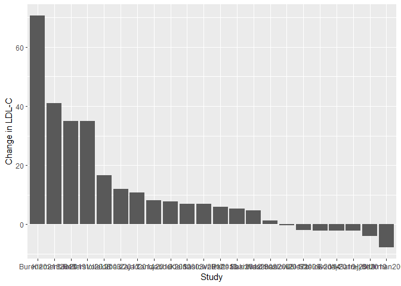<!-- -->

```r
eval.data %>%
  ggplot(aes(y=`Change in LDL-C`,
             x=reorder(Study, -`Change in LDL-C`))) +
  geom_bar(stat='identity', aes(fill=`Percent Male`)) +
  labs(x="Study")+
    theme(axis.text.x = element_text(angle = 45, vjust = 0.5, hjust=1))
```

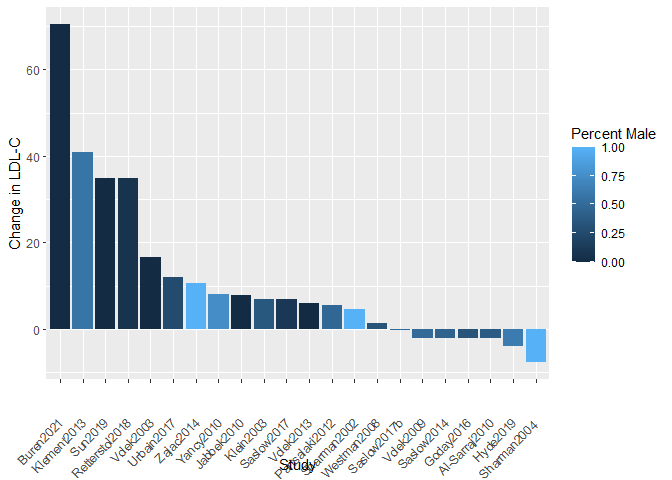<!-- -->

```r
eval.data %>%
  ggplot(aes(y=`Change in LDL-C`,
             x=reorder(Study, -`Change in LDL-C`))) +
  geom_bar(stat='identity', aes(fill=`Sex.Group`)) +
  labs(x="Study") +
    theme(axis.text.x = element_text(angle = 45, vjust = 0.5, hjust=1))
```

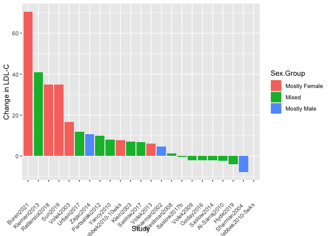<!-- -->

## Relative to Weight


```r
library(ggrepel)
library(ggplot2)
eval.data %>%
  ggplot(aes(y=`Change in LDL-C`,
             x=`Baseline Weight`)) +
  geom_point() +
  geom_smooth(span=1) +
  geom_text_repel(aes(label=Study)) +
  labs(x="Baseline Weight")
```

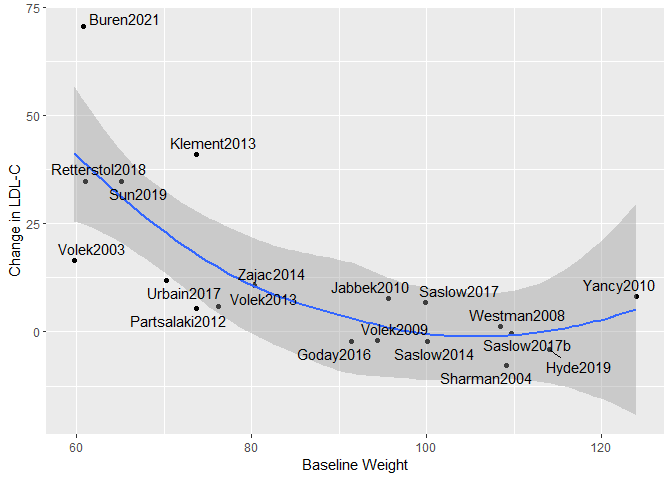<!-- -->

```r
eval.data %>%
  ggplot(aes(y=`Change in LDL-C`,
             x=`Baseline BMI`)) +
  geom_point() +
  geom_smooth(span=1) +
  geom_text_repel(aes(label=Study)) +
  labs(x="Baseline BMI")
```

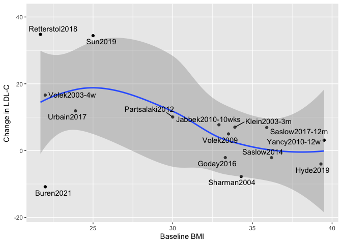<!-- -->

```r
eval.data %>%
  ggplot(aes(y=`Change in LDL-C`,
             x=`Baseline Weight`)) +
  geom_point() +
  geom_smooth(method='lm') +
  geom_text_repel(aes(label=Study)) +
  labs(x="Baseline Weight")
```

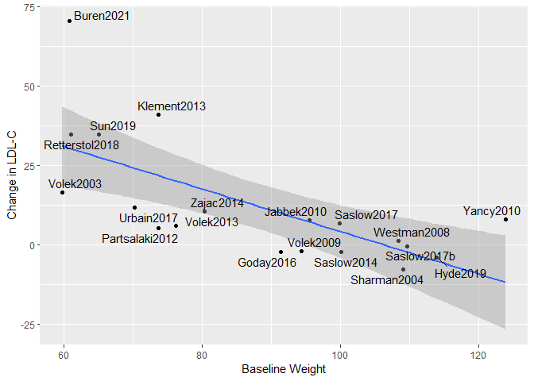<!-- -->

```r
eval.data %>%
  ggplot(aes(y=`Change in LDL-C`,
             x=`Baseline BMI`)) +
  geom_point() +
  geom_smooth(method='lm') +
  geom_text_repel(aes(label=Study)) +
  labs(x="Baseline BMI")
```

<!-- -->

```r
eval.data %>%
  ggplot(aes(y=`Change in LDL-C`,
             x=`Baseline Weight`,
             col=`Percent Male`)) +
  geom_point() +
  geom_smooth(method='lm') +
  geom_text_repel(aes(label=Study)) +
  labs(x="Baseline Weight")
```

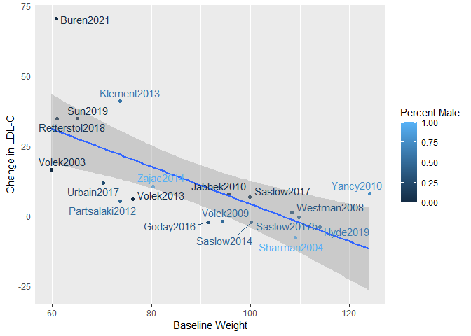<!-- -->

```r
eval.data %>%
  ggplot(aes(y=`Change in LDL-C`,
             x=`Baseline Weight`,
             col=`Sex.Group`)) +
  geom_point() +
  geom_smooth(method='lm') +
  geom_text_repel(aes(label=Study)) +
  labs(x="Baseline Weight")
```

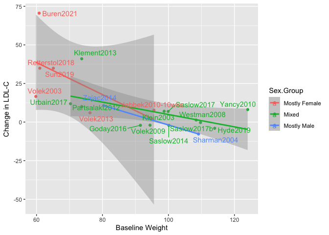<!-- -->

```r
eval.data %>%
  ggplot(aes(y=`Change in LDL-C`,
             x=`Baseline BMI`,
             col=`Sex.Group`)) +
  geom_point() +
  geom_smooth(method='lm') +
  geom_text_repel(aes(label=Study)) +
  labs(x="Baseline Weight")
```

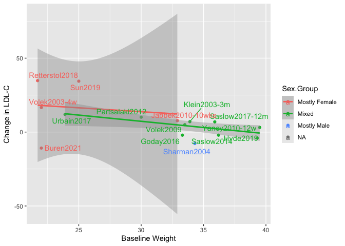<!-- -->

```r
eval.data %>%
  ggplot(aes(y=`Change in LDL-C`,
             x=`Baseline BMI`,
             col=`Normal weight`)) +
  geom_point() +
  geom_smooth(method='lm') +
  geom_text_repel(aes(label=Study)) +
  labs(x="Baseline Weight")
```

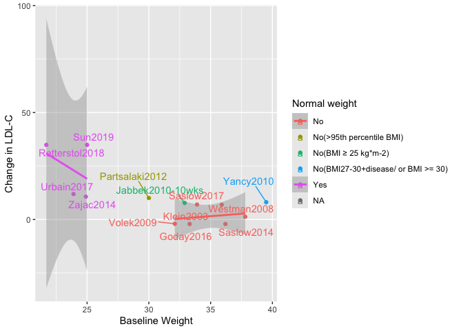<!-- -->

```r
library(broom)
bind_rows(`Baseline`=shapiro.test(eval.data$`Baseline Weight`)$p.value,
          `Change`=shapiro.test(eval.data$`Change in LDL-C`)$p.value) %>%
  kable(caption="Shapiro Tests for Correlates")
```


Table: Shapiro Tests for Correlates

| Baseline| Change|
|--------:|------:|
|    0.141|   0.01|

```r
with(eval.data, cor.test(`Change in LDL-C`,`Baseline Weight`, method="spearman")) %>% tidy %>% kable(caption="Correlation between change in LDL-C and baseline weight")
```


Table: Correlation between change in LDL-C and baseline weight

| estimate| statistic| p.value|method                          |alternative |
|--------:|---------:|-------:|:-------------------------------|:-----------|
|   -0.563|      1515|   0.015|Spearman's rank correlation rho |two.sided   |

```r
lm(`Change in LDL-C`~`Baseline Weight`+`Percent Male`, data=eval.data) %>% tidy %>% kable(caption="Linear model between change in LDL-C and baseline weight, including gender")
```


Table: Linear model between change in LDL-C and baseline weight, including gender

|term              | estimate| std.error| statistic| p.value|
|:-----------------|--------:|---------:|---------:|-------:|
|(Intercept)       |   47.440|    15.741|     3.014|   0.009|
|`Baseline Weight` |   -0.468|     0.208|    -2.249|   0.040|
|`Percent Male`    |    7.209|    14.182|     0.508|   0.619|

```r
ldl.weightsex.baseline.aov <- aov(`Change in LDL-C` ~ `Baseline Weight`*`Sex.Group`, data = eval.data)
ldl.weightsex.baseline.aov %>% tidy %>% kable
```


|term                        | df|  sumsq| meansq| statistic| p.value|
|:---------------------------|--:|------:|------:|---------:|-------:|
|`Baseline Weight`           |  1| 1118.2| 1118.2|     6.009|   0.029|
|Sex.Group                   |  2|   93.1|   46.5|     0.250|   0.782|
|`Baseline Weight`:Sex.Group |  1|   16.9|   16.9|     0.091|   0.768|
|Residuals                   | 13| 2419.0|  186.1|        NA|      NA|

```r
ldl.weightsex.baseline.aov <- aov(`Change in LDL-C` ~ `Baseline Weight` + `Sex.Group`, data = eval.data)
ldl.weightsex.baseline.aov %>% tidy %>% kable
```


|term              | df|  sumsq| meansq| statistic| p.value|
|:-----------------|--:|------:|------:|---------:|-------:|
|`Baseline Weight` |  1| 1118.2| 1118.2|     6.427|   0.024|
|Sex.Group         |  2|   93.1|   46.5|     0.267|   0.769|
|Residuals         | 14| 2436.0|  174.0|        NA|      NA|

```r
ldl.weight.baseline.lm <- lm(`Change in LDL-C` ~ `Baseline Weight`, data = eval.data)
ldl.weight.baseline.lm %>% tidy %>% kable
```


|term              | estimate| std.error| statistic| p.value|
|:-----------------|--------:|---------:|---------:|-------:|
|(Intercept)       |   43.525|    13.406|      3.25|   0.005|
|`Baseline Weight` |   -0.396|     0.149|     -2.66|   0.017|

```r
ldl.weightsex.baseline.lm <- lm(`Change in LDL-C` ~ `Baseline Weight` + `Sex.Group`, data = eval.data)
ldl.weightsex.baseline.lm %>% tidy %>% kable
```


|term                 | estimate| std.error| statistic| p.value|
|:--------------------|--------:|---------:|---------:|-------:|
|(Intercept)          |   43.543|    15.461|     2.816|   0.014|
|`Baseline Weight`    |   -0.412|     0.208|    -1.984|   0.067|
|Sex.GroupMixed       |    2.867|     8.600|     0.333|   0.744|
|Sex.GroupMostly Male |   -6.313|    16.427|    -0.384|   0.707|

```r
ldl.weightsex.baseline.aov <- aov(`Change in LDL-C` ~ `Baseline Weight` + `Sex.Group`, data = eval.data)
ldl.weightsex.baseline.aov %>% tidy %>% kable
```


|term              | df|  sumsq| meansq| statistic| p.value|
|:-----------------|--:|------:|------:|---------:|-------:|
|`Baseline Weight` |  1| 1118.2| 1118.2|     6.427|   0.024|
|Sex.Group         |  2|   93.1|   46.5|     0.267|   0.769|
|Residuals         | 14| 2436.0|  174.0|        NA|      NA|

```r
ldl.bmi.baseline.lm <- lm(`Change in LDL-C` ~ `Baseline BMI`, data = eval.data)
ldl.bmi.baseline.lm %>% tidy %>% kable
```


|term           | estimate| std.error| statistic| p.value|
|:--------------|--------:|---------:|---------:|-------:|
|(Intercept)    |    42.09|    15.540|      2.71|   0.018|
|`Baseline BMI` |    -1.12|     0.493|     -2.28|   0.040|

```r
ldl.bmi.baseline.sex.aov <- aov(`Change in LDL-C` ~ `Baseline BMI`*`Sex.Group`, data = eval.data)
ldl.bmi.baseline.sex.aov %>% tidy %>% kable
```


|term                     | df|   sumsq| meansq| statistic| p.value|
|:------------------------|--:|-------:|------:|---------:|-------:|
|`Baseline BMI`           |  1|  709.76| 709.76|     4.491|   0.060|
|Sex.Group                |  2|  193.84|  96.92|     0.613|   0.561|
|`Baseline BMI`:Sex.Group |  1|    5.92|   5.92|     0.037|   0.850|
|Residuals                | 10| 1580.29| 158.03|        NA|      NA|

```r
ldl.bmi.baseline.aov <- aov(`Change in LDL-C` ~ `Baseline BMI` + `Sex.Group`, data = eval.data)
ldl.bmi.baseline.aov %>% tidy %>% kable
```


|term           | df| sumsq| meansq| statistic| p.value|
|:--------------|--:|-----:|------:|---------:|-------:|
|`Baseline BMI` |  1|   710|  709.8|     4.922|   0.048|
|Sex.Group      |  2|   194|   96.9|     0.672|   0.530|
|Residuals      | 11|  1586|  144.2|        NA|      NA|

```r
ldl.bmi.baseline.mixed.lm<- lm(`Change in LDL-C` ~ `Baseline BMI`, filter(eval.data, Sex.Group == "Mixed"))
ldl.bmi.baseline.mixed.lm %>% tidy %>% kable (caption="Correlation betwteen baseline BMI and delta-LDL of Mixed groups")
```


Table: Correlation betwteen baseline BMI and delta-LDL of Mixed groups

|term           | estimate| std.error| statistic| p.value|
|:--------------|--------:|---------:|---------:|-------:|
|(Intercept)    |   32.463|    10.667|      3.04|   0.019|
|`Baseline BMI` |   -0.839|     0.311|     -2.69|   0.031|

```r
ldl.bmi.baseline.female.lm <- lm(`Change in LDL-C` ~ `Baseline BMI`, filter(eval.data, Sex.Group == "Mostly Female"))
ldl.bmi.baseline.female.lm %>% tidy %>% kable (caption="Correlation betwteen baseline BMI and delta-LDL of Mostly Female groups")
```


Table: Correlation betwteen baseline BMI and delta-LDL of Mostly Female groups

|term           | estimate| std.error| statistic| p.value|
|:--------------|--------:|---------:|---------:|-------:|
|(Intercept)    |   29.600|     57.93|     0.511|   0.645|
|`Baseline BMI` |   -0.528|      2.31|    -0.229|   0.834|

```r
ldl.bmi.baseline.male.lm <- lm(`Change in LDL-C` ~ `Baseline BMI`, filter(eval.data, Sex.Group == "Mostly Male"))
ldl.bmi.baseline.male.lm %>% tidy %>% kable (caption="Correlation betwteen baseline BMI and delta-LDL of Mostly Male")
```


Table: Correlation betwteen baseline BMI and delta-LDL of Mostly Male

|term           | estimate| std.error| statistic| p.value|
|:--------------|--------:|---------:|---------:|-------:|
|(Intercept)    |    -7.74|       NaN|       NaN|     NaN|
|`Baseline BMI` |       NA|        NA|        NA|      NA|

```r
ldl.bmi.baseline.sex.aov <- aov(`Change in LDL-C` ~ `Baseline BMI`*`Normal weight`, data = eval.data)
ldl.bmi.baseline.sex.aov %>% tidy %>% kable
```


|term                           | df|  sumsq| meansq| statistic| p.value|
|:------------------------------|--:|------:|------:|---------:|-------:|
|`Baseline BMI`                 |  1|  709.8|  709.8|     1.328|   0.368|
|`Normal weight`                |  9|  663.8|   73.8|     0.138|   0.987|
|`Baseline BMI`:`Normal weight` |  2|   47.5|   23.8|     0.044|   0.957|
|Residuals                      |  2| 1068.7|  534.3|        NA|      NA|

```r
ldl.bmi.baseline.female.lm <- lm(`Change in LDL-C` ~ `Baseline BMI`, filter(eval.data, `Normal weight` == "Yes"))
ldl.bmi.baseline.female.lm %>% tidy %>% kable (caption="Correlation betwteen baseline BMI and delta-LDL of Normal weight studies")
```


Table: Correlation betwteen baseline BMI and delta-LDL of Normal weight studies

|term           | estimate| std.error| statistic| p.value|
|:--------------|--------:|---------:|---------:|-------:|
|(Intercept)    |    67.09|       428|     0.157|   0.901|
|`Baseline BMI` |    -2.45|        19|    -0.129|   0.918|

```r
ldl.bmi.baseline.male.lm <- lm(`Change in LDL-C` ~ `Baseline BMI`, filter(eval.data, `Normal weight` == "No"))
ldl.bmi.baseline.male.lm %>% tidy %>% kable (caption="Correlation betwteen baseline BMI and delta-LDL of Overweight studies")
```


Table: Correlation betwteen baseline BMI and delta-LDL of Overweight studies

|term           | estimate| std.error| statistic| p.value|
|:--------------|--------:|---------:|---------:|-------:|
|(Intercept)    |   -46.76|    104.15|    -0.449|   0.731|
|`Baseline BMI` |     1.36|      2.96|     0.458|   0.727|

Lower baseline BMI was associated with an increased change in LDL-C after consumption of a ketogenic diet (r<sup>2</sup> = 0.285, p-value = 0.04). The association with increased LDL-C was consistent with baseline weight, where a lower baseline weight was associated with an increased change in LDL-C (r<sup>2</sup> = 0.307, p-value = 0.017). 

## Relative to Weight Loss


```r
library(ggplot2)

eval.data %>%
  ggplot(aes(y=`Change in LDL-C`,
             x=Pct.Wt.Change)) +
  geom_point() +
  geom_smooth(method='lm') +
  geom_text_repel(aes(label=Study)) +
  labs(x="Weight Change (%)")
```

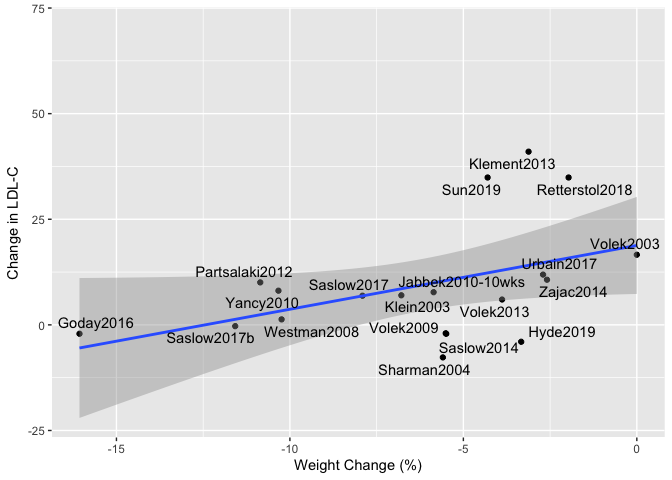<!-- -->

```r
eval.data %>%
  ggplot(aes(y=`Change in LDL-C`,
             x=`BMI Change`)) +
  geom_point() +
  geom_smooth(method='lm') +
  geom_text_repel(aes(label=Study)) +
  labs(x="BMI Change")
```

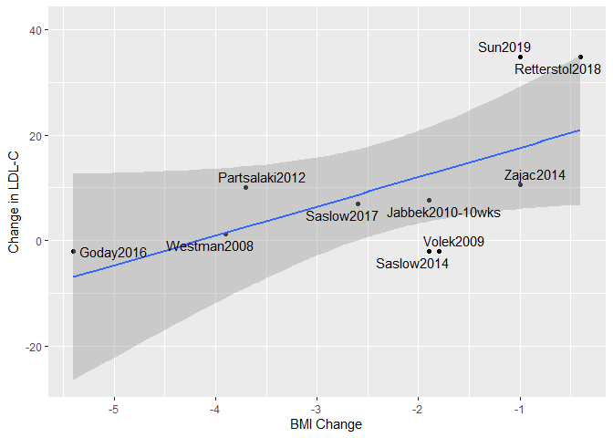<!-- -->

```r
eval.data %>%
  ggplot(aes(y=`Change in LDL-C`,
             x=`BMI Change`,
             col = `Sex.Group`)) +
  geom_point() +
  geom_smooth(method='lm') +
  geom_text_repel(aes(label=Study)) +
  labs(x="BMI Change")
```

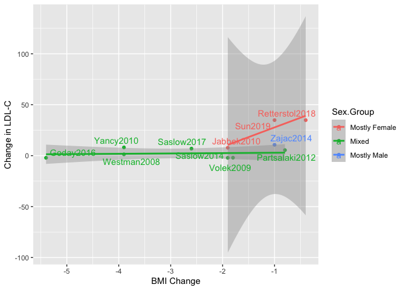<!-- -->

```r
eval.data %>%
  ggplot(aes(y=`Change in LDL-C`,
             x=`PCT.BMI.Change`)) +
  geom_point() +
  geom_smooth(method='lm') +
  geom_text_repel(aes(label=Study)) +
  labs(x="% BMI Change")
```

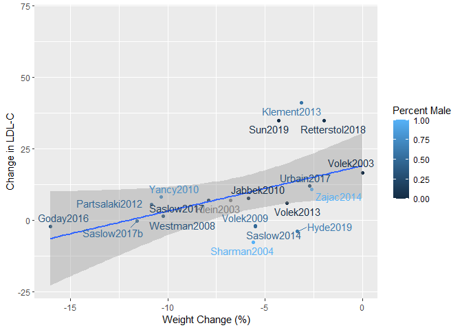<!-- -->

```r
eval.data %>%
  ggplot(aes(y=`Change in LDL-C`,
             x=`PCT.BMI.Change`,
             col = `Sex.Group`)) +
  geom_point() +
  geom_smooth(method='lm') +
  geom_text_repel(aes(label=Study)) +
  labs(x="% BMI Change")
```

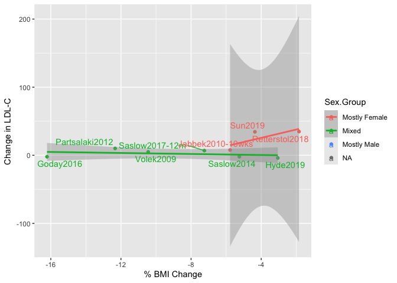<!-- -->

```r
eval.data %>%
  ggplot(aes(y=`Change in LDL-C`,
             x=Pct.Wt.Change,
             col=`Percent Male`)) +
  geom_point() +
  geom_smooth(method='lm') +
  geom_text_repel(aes(label=Study)) +
  labs(x="Weight Change (%)")
```

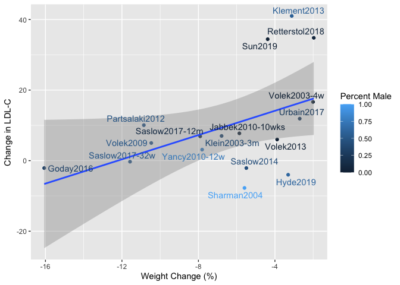<!-- -->

```r
library(broom)
bind_rows(`Weight Change`=shapiro.test(eval.data$Pct.Wt.Change)$p.value,
          `LDL Change`=shapiro.test(eval.data$`Change in LDL-C`)$p.value) %>%
  kable(caption="Shapiro Tests for Correlates")
```


Table: Shapiro Tests for Correlates

| Weight Change| LDL Change|
|-------------:|----------:|
|         0.147|       0.01|

```r
with(eval.data, cor.test(`Change in LDL-C`,Pct.Wt.Change, method="spearman")) %>% tidy %>% kable(caption="Correlation between change in LDL-C and weight change")
```


Table: Correlation between change in LDL-C and weight change

| estimate| statistic| p.value|method                          |alternative |
|--------:|---------:|-------:|:-------------------------------|:-----------|
|    0.489|       417|   0.046|Spearman's rank correlation rho |two.sided   |

```r
ldl.weightsexinter.change.aov <- aov(`Change in LDL-C` ~ `Pct.Wt.Change`*`Sex.Group`, data = eval.data)
ldl.weightsexinter.change.aov %>% tidy %>% kable
```


|term                    | df| sumsq| meansq| statistic| p.value|
|:-----------------------|--:|-----:|------:|---------:|-------:|
|Pct.Wt.Change           |  1|   727|    727|     4.516|   0.055|
|Sex.Group               |  2|   525|    262|     1.630|   0.237|
|Pct.Wt.Change:Sex.Group |  1|    57|     57|     0.354|   0.563|
|Residuals               | 12|  1932|    161|        NA|      NA|

```r
ldl.weightsex.change.aov <- aov(`Change in LDL-C` ~ `Pct.Wt.Change` + `Sex.Group`, data = eval.data)
ldl.weightsex.change.aov %>% tidy %>% kable
```


|term          | df| sumsq| meansq| statistic| p.value|
|:-------------|--:|-----:|------:|---------:|-------:|
|Pct.Wt.Change |  1|   727|    727|      4.75|   0.048|
|Sex.Group     |  2|   525|    262|      1.72|   0.218|
|Residuals     | 13|  1989|    153|        NA|      NA|

```r
ldl.weight.change.lm <- lm(`Change in LDL-C` ~ `Pct.Wt.Change`, data = eval.data)
ldl.weight.change.lm %>% tidy %>% kable
```


|term          | estimate| std.error| statistic| p.value|
|:-------------|--------:|---------:|---------:|-------:|
|(Intercept)   |    21.00|     6.186|      3.40|   0.004|
|Pct.Wt.Change |     1.72|     0.825|      2.08|   0.055|

```r
ldl.bmisexinter.change.aov <- aov(`Change in LDL-C` ~ `BMI Change`*`Sex.Group`, data = eval.data)
ldl.bmisexinter.change.aov %>% tidy %>% kable
```


|term                   | df| sumsq| meansq| statistic| p.value|
|:----------------------|--:|-----:|------:|---------:|-------:|
|`BMI Change`           |  1|   510|  510.0|     10.05|   0.025|
|Sex.Group              |  1|   590|  589.9|     11.62|   0.019|
|`BMI Change`:Sex.Group |  1|   386|  386.2|      7.61|   0.040|
|Residuals              |  5|   254|   50.8|        NA|      NA|

```r
ldl.bmisex.change.aov <- aov(`Change in LDL-C` ~ `BMI Change` + `Sex.Group`, data = eval.data)
ldl.bmisex.change.aov %>% tidy %>% kable
```


|term         | df| sumsq| meansq| statistic| p.value|
|:------------|--:|-----:|------:|---------:|-------:|
|`BMI Change` |  1|   510|    510|      4.78|   0.071|
|Sex.Group    |  1|   590|    590|      5.53|   0.057|
|Residuals    |  6|   640|    107|        NA|      NA|

```r
ldl.bmi.change.lm <- lm(`Change in LDL-C` ~ `BMI Change`, data = eval.data)
ldl.bmi.change.lm %>% tidy %>% kable
```


|term         | estimate| std.error| statistic| p.value|
|:------------|--------:|---------:|---------:|-------:|
|(Intercept)  |     22.4|      8.46|      2.64|   0.033|
|`BMI Change` |      5.1|      2.99|      1.70|   0.132|

```r
ldl.bmi.change.mixed.lm<- lm(`Change in LDL-C` ~ `BMI Change`, filter(eval.data, Sex.Group == "Mixed"))
ldl.bmi.change.mixed.lm %>% tidy %>% kable (caption="Correlation betwteen BMI Change and delta-LDL of Mixed groups")
```


Table: Correlation betwteen BMI Change and delta-LDL of Mixed groups

|term         | estimate| std.error| statistic| p.value|
|:------------|--------:|---------:|---------:|-------:|
|(Intercept)  |   -0.611|      6.28|    -0.097|   0.927|
|`BMI Change` |   -0.952|      1.88|    -0.506|   0.639|

```r
#ldl.bmi.change.male.lm<- lm(`Change in LDL-C` ~ `BMI Change`, filter(eval.data, Sex.Group == "Mostly Male"))
#ldl.bmi.change.male.lm %>% tidy %>% kable (caption="Correlation betwteen BMI Change and delta-LDL of Mostly Male groups")

ldl.bmi.change.female.lm<- lm(`Change in LDL-C` ~ `BMI Change`, filter(eval.data, Sex.Group == "Mostly Female"))
ldl.bmi.change.female.lm %>% tidy %>% kable (caption="Correlation betwteen BMI Change and delta-LDL of Mostly Female groups")
```


Table: Correlation betwteen BMI Change and delta-LDL of Mostly Female groups

|term         | estimate| std.error| statistic| p.value|
|:------------|--------:|---------:|---------:|-------:|
|(Intercept)  |     46.5|     11.91|      3.90|   0.160|
|`BMI Change` |     18.5|      9.27|      1.99|   0.296|

```r
ldl.pctbmi.change.lm <- lm(`Change in LDL-C` ~ `PCT.BMI.Change`, data = eval.data)
ldl.pctbmi.change.lm %>% tidy %>% kable
```


|term           | estimate| std.error| statistic| p.value|
|:--------------|--------:|---------:|---------:|-------:|
|(Intercept)    |    20.17|      9.18|      2.20|   0.064|
|PCT.BMI.Change |     1.37|      1.06|      1.28|   0.240|

```r
ldl.pctbmisexinter.change.aov <- aov(`Change in LDL-C` ~ `PCT.BMI.Change`*`Sex.Group`, data = eval.data)
ldl.pctbmisexinter.change.aov %>% tidy %>% kable
```


|term                     | df| sumsq| meansq| statistic| p.value|
|:------------------------|--:|-----:|------:|---------:|-------:|
|PCT.BMI.Change           |  1|   331|  331.4|      4.92|   0.077|
|Sex.Group                |  1|   760|  760.0|     11.28|   0.020|
|PCT.BMI.Change:Sex.Group |  1|   311|  311.4|      4.62|   0.084|
|Residuals                |  5|   337|   67.4|        NA|      NA|

```r
ldl.pctbmisex.change.aov <- aov(`Change in LDL-C` ~ `PCT.BMI.Change` + `Sex.Group`, data = eval.data)
ldl.pctbmisex.change.aov %>% tidy %>% kable
```


|term           | df| sumsq| meansq| statistic| p.value|
|:--------------|--:|-----:|------:|---------:|-------:|
|PCT.BMI.Change |  1|   331|    331|      3.07|   0.130|
|Sex.Group      |  1|   760|    760|      7.03|   0.038|
|Residuals      |  6|   648|    108|        NA|      NA|

```r
ldl.pctbmi.change.lm <- lm(`Change in LDL-C` ~ `PCT.BMI.Change`, data = eval.data)
ldl.pctbmi.change.lm %>% tidy %>% kable
```


|term           | estimate| std.error| statistic| p.value|
|:--------------|--------:|---------:|---------:|-------:|
|(Intercept)    |    20.17|      9.18|      2.20|   0.064|
|PCT.BMI.Change |     1.37|      1.06|      1.28|   0.240|

```r
ldl.pctbmi.change.mixed.lm<- lm(`Change in LDL-C` ~ `BMI Change`, filter(eval.data, Sex.Group == "Mixed"))
ldl.pctbmi.change.mixed.lm %>% tidy %>% kable (caption="Correlation betwteen BMI Change and delta-LDL of Mixed groups")
```


Table: Correlation betwteen BMI Change and delta-LDL of Mixed groups

|term         | estimate| std.error| statistic| p.value|
|:------------|--------:|---------:|---------:|-------:|
|(Intercept)  |   -0.611|      6.28|    -0.097|   0.927|
|`BMI Change` |   -0.952|      1.88|    -0.506|   0.639|

```r
#ldl.pctbmi.change.male.lm<- lm(`Change in LDL-C` ~ `BMI Change`, filter(eval.data, Sex.Group == "Mostly Male"))
#ldl.pctbmi.change.male.lm %>% tidy %>% kable (caption="Correlation betwteen BMI Change and delta-LDL of Mostly Male groups")

ldl.pctbmi.change.female.lm<- lm(`Change in LDL-C` ~ `BMI Change`, filter(eval.data, Sex.Group == "Mostly Female"))
ldl.pctbmi.change.female.lm %>% tidy %>% kable (caption="Correlation betwteen BMI Change and delta-LDL of Mostly Female groups")
```


Table: Correlation betwteen BMI Change and delta-LDL of Mostly Female groups

|term         | estimate| std.error| statistic| p.value|
|:------------|--------:|---------:|---------:|-------:|
|(Intercept)  |     46.5|     11.91|      3.90|   0.160|
|`BMI Change` |     18.5|      9.27|      1.99|   0.296|
Greater BMI decreases over the study period were associated with a smaller increase in LDL-C after consumption of a ketogenic diet, though this did not reach significance (r<sup>2</sup> = 0.293, p-value = 0.132). The association with the change in LDL-C and decrease in BMI was consistent with weight, with change in weight on LDL-C reaching significance (r<sup>2</sup> = 0.224, p-value = 0.055), where greater decreases in weight were associated with lower increases in LDL-C after consumption of a ketogenic diet. Looking at percent BMI change to account for baseline BMI, greater percent change decreases were associated with a lower increase in LDL-C on a ketogenic diet, though this was not significant (r<sup>2</sup> = 0.19, p-value = 0.24).


## Relative to Baseline LDL-C


```r
library(ggplot2)
eval.data %>%
  ggplot(aes(y=`Change in LDL-C`,
             x=`Baseline LDL`)) +
  geom_point() +
  geom_smooth(method='lm') +
  geom_text_repel(aes(label=Study)) +
  labs(x="Baseline LDL-C")
```

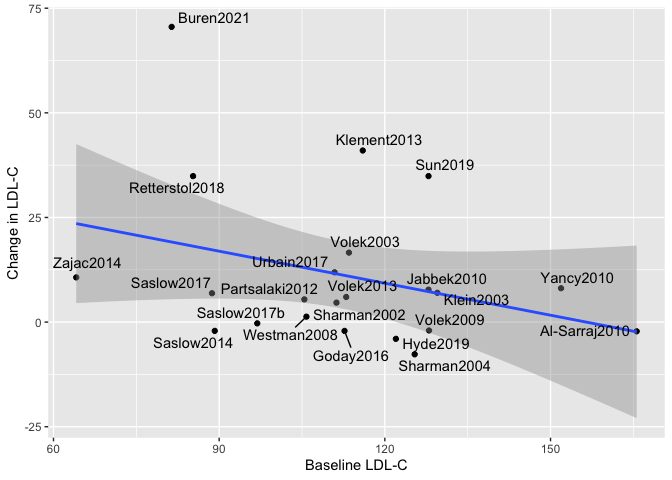<!-- -->

```r
eval.data %>%
  ggplot(aes(y=`Change in LDL-C`,
             x=`Baseline LDL`,
             col=`Percent Male`)) +
  geom_point() +
  geom_smooth(method='lm') +
  geom_text_repel(aes(label=Study)) +
  labs(x="Baseline LDL-C")
```

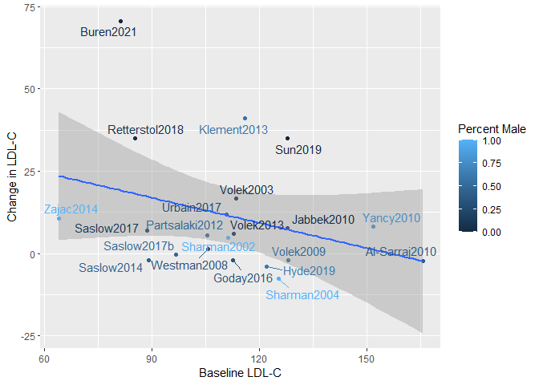<!-- -->

```r
eval.data %>%
  ggplot(aes(y=`Change in LDL-C`,
             x=`Baseline LDL`,
             col=`Sex.Group`)) +
  geom_point() +
  geom_smooth(method='lm') +
  geom_text_repel(aes(label=Study)) +
  labs(x="Baseline LDL-C")
```

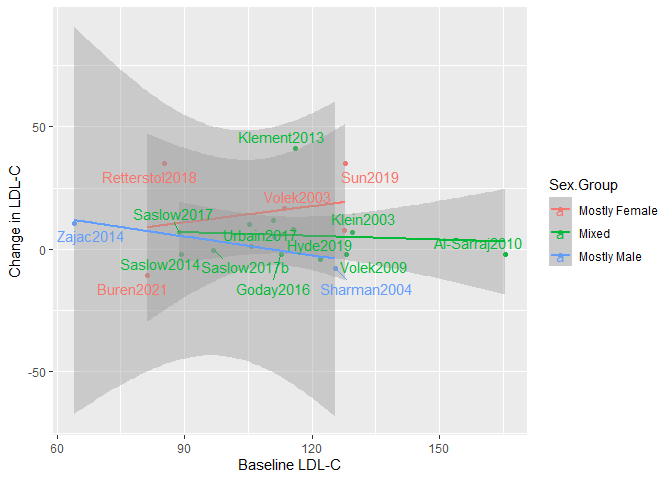<!-- -->

```r
library(broom)
bind_rows(`Baseline`=shapiro.test(eval.data$`Baseline LDL`)$p.value,
          `Change`=shapiro.test(eval.data$`Change in LDL-C`)$p.value) %>%
  kable(caption="Shapiro Tests for Correlates")
```


Table: Shapiro Tests for Correlates

| Baseline| Change|
|--------:|------:|
|    0.143|   0.01|

```r
with(eval.data, cor.test(`Change in LDL-C`,`Baseline LDL`, method="spearman")) %>% tidy %>% kable(caption="Correlation between baseline and change in LDL-C")
```


Table: Correlation between baseline and change in LDL-C

| estimate| statistic| p.value|method                          |alternative |
|--------:|---------:|-------:|:-------------------------------|:-----------|
|    0.011|      1315|   0.962|Spearman's rank correlation rho |two.sided   |

```r
ldl.baselinesexinter.aov <- aov(`Change in LDL-C` ~ `Baseline LDL` * `Sex.Group`, data = eval.data)
ldl.baselinesexinter.aov %>% tidy %>% kable
```


|term                     | df|   sumsq| meansq| statistic| p.value|
|:------------------------|--:|-------:|------:|---------:|-------:|
|`Baseline LDL`           |  1|    5.56|   5.56|     0.025|   0.876|
|Sex.Group                |  2|  496.12| 248.06|     1.122|   0.353|
|`Baseline LDL`:Sex.Group |  2|  175.33|  87.66|     0.396|   0.680|
|Residuals                | 14| 3095.59| 221.11|        NA|      NA|

```r
ldl.baselinesex.aov <- aov(`Change in LDL-C` ~ `Baseline LDL` + `Sex.Group`, data = eval.data)
ldl.baselinesex.aov %>% tidy %>% kable
```


|term           | df|   sumsq| meansq| statistic| p.value|
|:--------------|--:|-------:|------:|---------:|-------:|
|`Baseline LDL` |  1|    5.56|   5.56|     0.027|   0.871|
|Sex.Group      |  2|  496.12| 248.06|     1.213|   0.323|
|Residuals      | 16| 3270.91| 204.43|        NA|      NA|

```r
ldl.baseline.lm <- lm(`Change in LDL-C` ~ `Baseline LDL`, data = eval.data)
ldl.baseline.lm %>% tidy %>% kable
```


|term           | estimate| std.error| statistic| p.value|
|:--------------|--------:|---------:|---------:|-------:|
|(Intercept)    |   11.129|    19.484|     0.571|   0.575|
|`Baseline LDL` |   -0.028|     0.169|    -0.163|   0.872|

```r
ldl.baselinesex.lm <- lm(`Change in LDL-C` ~ `Baseline LDL` + `Sex.Group`, data = eval.data)
ldl.baselinesex.lm %>% tidy %>% kable
```


|term                 | estimate| std.error| statistic| p.value|
|:--------------------|--------:|---------:|---------:|-------:|
|(Intercept)          |   12.442|    19.334|     0.644|   0.529|
|`Baseline LDL`       |    0.022|     0.171|     0.128|   0.900|
|Sex.GroupMixed       |   -8.759|     7.252|    -1.208|   0.245|
|Sex.GroupMostly Male |  -16.564|    11.809|    -1.403|   0.180|

```r
ldl.baseline.aov <- aov(`Change in LDL-C` ~ `Baseline LDL` + `Sex.Group`, data = eval.data)
ldl.baseline.aov %>% tidy %>% kable
```


|term           | df|   sumsq| meansq| statistic| p.value|
|:--------------|--:|-------:|------:|---------:|-------:|
|`Baseline LDL` |  1|    5.56|   5.56|     0.027|   0.871|
|Sex.Group      |  2|  496.12| 248.06|     1.213|   0.323|
|Residuals      | 16| 3270.91| 204.43|        NA|      NA|

```r
ldl.baseline.aov <- aov(`Change in LDL-C` ~ `Sex.Group`, data = eval.data)
ldl.baseline.aov %>% tidy %>% kable
```


|term      | df| sumsq| meansq| statistic| p.value|
|:---------|--:|-----:|------:|---------:|-------:|
|Sex.Group |  2|   498|    249|      1.29|     0.3|
|Residuals | 17|  3274|    193|        NA|      NA|

```r
ldl.baseline.aov <- aov(`Change in LDL-C` ~ `Percent Male`, data = eval.data)
ldl.baseline.aov %>% tidy %>% kable
```


|term           | df| sumsq| meansq| statistic| p.value|
|:--------------|--:|-----:|------:|---------:|-------:|
|`Percent Male` |  1|   321|    321|      1.67|   0.212|
|Residuals      | 18|  3452|    192|        NA|      NA|

Among individuals, baseline LDL-C was not positively correlated with change in LDL-C after consumption of a ketogenic diet and the relationship was not significant (r<sup>2</sup> = 0.001, p-value = 0.872). 


```r
library(broom)
lm(formula=`Change in LDL-C`~`Baseline Weight`,
   data=eval.data)%>%
  summary %>%
  tidy %>%
  kable
```


|term              | estimate| std.error| statistic| p.value|
|:-----------------|--------:|---------:|---------:|-------:|
|(Intercept)       |   43.525|    13.406|      3.25|   0.005|
|`Baseline Weight` |   -0.396|     0.149|     -2.66|   0.017|

```r
lm(formula=`Change in LDL-C`~`Baseline HOMA-IR`,
   data=eval.data)%>%
  summary %>%
  tidy %>%
  kable
```


|term               | estimate| std.error| statistic| p.value|
|:------------------|--------:|---------:|---------:|-------:|
|(Intercept)        |    3.682|      5.32|     0.692|    0.52|
|`Baseline HOMA-IR` |   -0.831|      1.37|    -0.608|    0.57|

# Decision Tree


```r
eval.data %>% select(where(is.numeric)) %>%
  select(-ends_with('SD'),-ends_with('CI')) -> combined.data.numeric

correlation.matrix <- cor(combined.data.numeric, use="pairwise.complete.obs")
library(corrplot)
corrplot(correlation.matrix, method="color", diag=FALSE, order="alphabet")
```

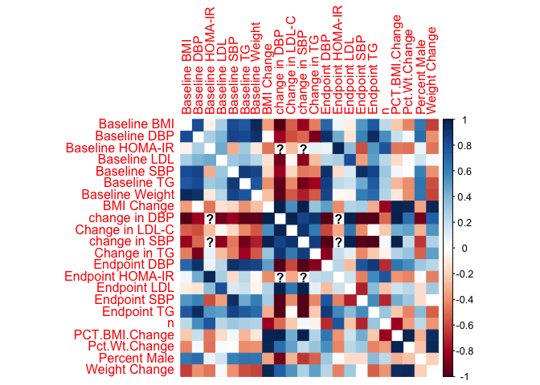<!-- -->

```r
corrplot(correlation.matrix, method="color", diag=FALSE, tl.cex = .7)
```

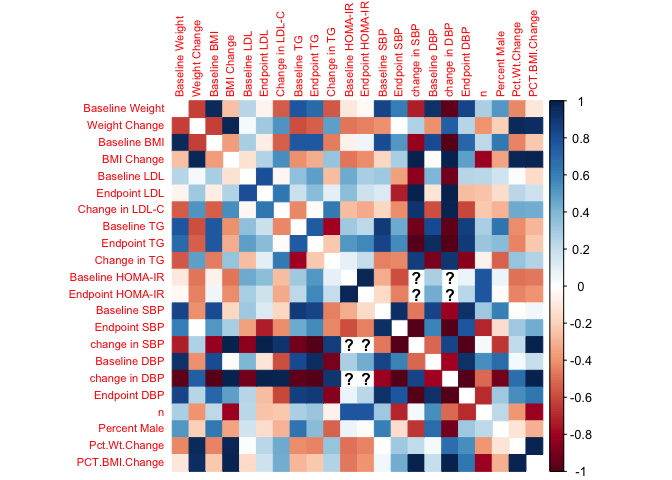<!-- -->

```r
library(rpart)
combined.data.numeric -> tree.data
rpart(`Change in LDL-C`~., data=tree.data) ->tree
library(rattle)
library(rpart.plot)
rpart.plot(tree)
```

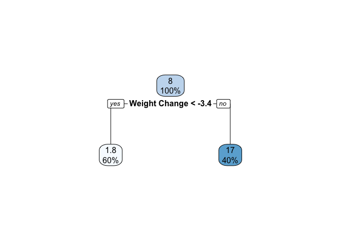<!-- -->


# Session Information


```r
sessionInfo()
```

```
## R version 4.3.3 (2024-02-29)
## Platform: x86_64-apple-darwin20 (64-bit)
## Running under: macOS Sonoma 14.5
## 
## Matrix products: default
## BLAS:   /Library/Frameworks/R.framework/Versions/4.3-x86_64/Resources/lib/libRblas.0.dylib 
## LAPACK: /Library/Frameworks/R.framework/Versions/4.3-x86_64/Resources/lib/libRlapack.dylib;  LAPACK version 3.11.0
## 
## locale:
## [1] en_US.UTF-8/en_US.UTF-8/en_US.UTF-8/C/en_US.UTF-8/en_US.UTF-8
## 
## time zone: America/Detroit
## tzcode source: internal
## 
## attached base packages:
## [1] stats     graphics  grDevices utils     datasets  methods   base     
## 
## other attached packages:
##  [1] rpart.plot_3.1.2 rattle_5.5.1     bitops_1.0-7     tibble_3.2.1    
##  [5] rpart_4.1.23     corrplot_0.92    broom_1.0.6      ggrepel_0.9.5   
##  [9] meta_7.0-0       metadat_1.2-0    readr_2.1.5      ggplot2_3.5.1   
## [13] dplyr_1.1.4      tidyr_1.3.1      knitr_1.45      
## 
## loaded via a namespace (and not attached):
##  [1] gtable_0.3.5        xfun_0.44           bslib_0.7.0        
##  [4] CompQuadForm_1.4.3  lattice_0.22-6      mathjaxr_1.6-0     
##  [7] tzdb_0.4.0          numDeriv_2016.8-1.1 vctrs_0.6.5        
## [10] tools_4.3.3         generics_0.1.3      parallel_4.3.3     
## [13] fansi_1.0.6         highr_0.10          pkgconfig_2.0.3    
## [16] Matrix_1.6-5        lifecycle_1.0.4     compiler_4.3.3     
## [19] farver_2.1.2        stringr_1.5.1       munsell_0.5.1      
## [22] htmltools_0.5.8.1   sass_0.4.9          yaml_2.3.8         
## [25] pillar_1.9.0        nloptr_2.0.3        crayon_1.5.2       
## [28] jquerylib_0.1.4     MASS_7.3-60.0.1     cachem_1.1.0       
## [31] boot_1.3-30         nlme_3.1-164        tidyselect_1.2.1   
## [34] digest_0.6.35       stringi_1.8.4       purrr_1.0.2        
## [37] labeling_0.4.3      splines_4.3.3       fastmap_1.2.0      
## [40] grid_4.3.3          colorspace_2.1-0    cli_3.6.2          
## [43] metafor_4.6-0       magrittr_2.0.3      utf8_1.2.4         
## [46] withr_3.0.0         scales_1.3.0        backports_1.4.1    
## [49] bit64_4.0.5         rmarkdown_2.27      bit_4.0.5          
## [52] lme4_1.1-35.3       hms_1.1.3           evaluate_0.23      
## [55] mgcv_1.9-1          rlang_1.1.3         Rcpp_1.0.12        
## [58] glue_1.7.0          xml2_1.3.6          rstudioapi_0.16.0  
## [61] vroom_1.6.5         minqa_1.2.6         jsonlite_1.8.8     
## [64] R6_2.5.1
```
