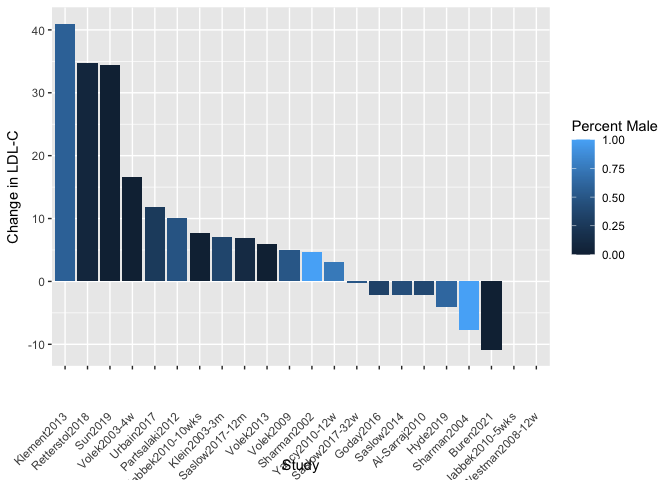

=
# Purpose

To evaluate how LDL changes in ketogenic diet studies

# Experimental Details

Evaluated studies where ketogenic diets (<25g/day of CHO) are used and weight and LDL-C are reported as an outcome

# Raw Data

Reviewed data from the Choi *et al* meta-analysis (http://dx.doi.org/10.3390/nu12072005), pulling in data on baseline weight, weight changes, LDL, LDL changes and standard deviations.


```r
library(readxl) #loads the readr package
filename <- 'LDL Study Summary.xlsx' #make this a separate line, you can use any variable you want

#this loads whatever the file is into a dataframe called exp.data if it exists
exp.data <- read_excel(filename)
eval.data <- exp.data %>% 
  filter(Use=='x') %>%
  mutate(Pct.Wt.Change = `Weight Change`/`Baseline Weight`*100)%>%
  mutate(Sex.Group = cut(`Percent Male`, breaks = c(0,.1,.9,1), include.lowest = TRUE, labels = c("Mostly Female", "Mixed", "Mostly Male")))
```

These data can be found in **C:/Users/Cody/Documents/GitHub/PrecisionNutrition/Meta Analysis** in a file named **LDL Study Summary.xlsx**.  This script was most recently updated on **Fri Apr 01 09:39:10 2022**.

# Analysis

# Variance in LDL-C


```r
library(ggplot2)

eval.data <-
  eval.data %>%
  mutate(LDL.endpoint = `Baseline LDL`+`Change in LDL-C`)

eval.data %>%
  filter(!(is.na(`Endpoint SD`))) %>%
  ggplot(aes(y=LDL.endpoint,
             ymin=LDL.endpoint-`Endpoint SD`,
             ymax=LDL.endpoint+`Endpoint SD`,
             x=reorder(Study,-`LDL.endpoint` ))) +
  geom_point() +
  geom_errorbar()+
  theme(axis.text.x = element_text(angle = 45, vjust = 0.5, hjust=1))
```

<!-- -->

```r
eval.data %>% 
  summarize_at(.vars=vars(Pct.Wt.Change,`Weight Change`,`Change in LDL-C`),
               .funs=funs(mean)) 
```

```
## # A tibble: 1 x 3
##   Pct.Wt.Change `Weight Change` `Change in LDL-C`
##           <dbl>           <dbl>             <dbl>
## 1            NA              NA              11.8
```

# Meta-Analysis


```r
meta.data <-
  eval.data %>%
  filter(!is.na(`Endpoint SD`)) %>%
  mutate(Pooled.SD=sqrt(`Baseline SD`^2+`Endpoint SD`^2)) %>%
  mutate(SMD=`Change in LDL-C`) %>%
  mutate(SMD.Wt = `Weight Change`) 

library(meta)
ldl.c.meta <- metagen(TE = SMD,
                 seTE = Pooled.SD,
                 n.e=n,
                 n.c=n,
                 studlab = Study,
                 data = meta.data,
                 sm = "SMD",
                 comb.fixed = TRUE,
                 comb.random = FALSE,
                 #method.tau = "REML",
                 hakn = TRUE,
                 title = "LDL-C Changes in Ketogenic Diet Studies")

forest.meta(ldl.c.meta, 
            sortvar = SMD,
            predict = F, 
            print.tau2 = TRUE,
            print.I2 = TRUE,
            #leftcols=c('Study'),
            #rightlabs=c('Change','95% CI','Weight'),
            layout = "RevMan5",
            fontsize=8,
            leftcols = c("Study",'effect',"seTE",'ci','w.fixed'),
            leftlabs = c("Study","Change","SE","95% CI","Weight"),
            range = F,
            digits=1,
            digits.se=1)
```

<!-- -->

# Average Change in LDL-C


```r
eval.data %>%
  ggplot(aes(y=`Change in LDL-C`,
             x=reorder(Study, -`Change in LDL-C`))) +
  geom_bar(stat='identity') +
  labs(x="Study")
```

<!-- -->

```r
eval.data %>%
  ggplot(aes(y=`Change in LDL-C`,
             x=reorder(Study, -`Change in LDL-C`))) +
  geom_bar(stat='identity', aes(fill=`Percent Male`)) +
  labs(x="Study")+
    theme(axis.text.x = element_text(angle = 45, vjust = 0.5, hjust=1))
```

<!-- -->

```r
eval.data %>%
  ggplot(aes(y=`Change in LDL-C`,
             x=reorder(Study, -`Change in LDL-C`))) +
  geom_bar(stat='identity', aes(fill=`Sex.Group`)) +
  labs(x="Study") +
    theme(axis.text.x = element_text(angle = 45, vjust = 0.5, hjust=1))
```

<!-- -->

## Relative to Weight


```r
library(ggrepel)
library(ggplot2)
eval.data %>%
  ggplot(aes(y=`Change in LDL-C`,
             x=`Baseline Weight`)) +
  geom_point() +
  geom_smooth(span=1) +
  geom_text_repel(aes(label=Study)) +
  labs(x="Baseline Weight")
```

<!-- -->

```r
eval.data %>%
  ggplot(aes(y=`Change in LDL-C`,
             x=`Baseline Weight`)) +
  geom_point() +
  geom_smooth(method='lm') +
  geom_text_repel(aes(label=Study)) +
  labs(x="Baseline Weight")
```

<!-- -->

```r
eval.data %>%
  ggplot(aes(y=`Change in LDL-C`,
             x=`Baseline Weight`,
             col=`Percent Male`)) +
  geom_point() +
  geom_smooth(method='lm') +
  geom_text_repel(aes(label=Study)) +
  labs(x="Baseline Weight")
```

<!-- -->

```r
eval.data %>%
  ggplot(aes(y=`Change in LDL-C`,
             x=`Baseline Weight`,
             col=`Sex.Group`)) +
  geom_point() +
  geom_smooth(method='lm') +
  geom_text_repel(aes(label=Study)) +
  labs(x="Baseline Weight")
```

<!-- -->

```r
library(broom)
bind_rows(`Baseline`=shapiro.test(eval.data$`Baseline Weight`)$p.value,
          `Change`=shapiro.test(eval.data$`Change in LDL-C`)$p.value) %>%
  kable(caption="Shapiro Tests for Correlates")
```


Table: Shapiro Tests for Correlates

| Baseline| Change|
|--------:|------:|
|    0.199|      0|

```r
with(eval.data, cor.test(`Change in LDL-C`,`Baseline Weight`, method="spearman")) %>% tidy %>% kable(caption="Correlation between change in LDL-C and baseline weight")
```


Table: Correlation between change in LDL-C and baseline weight

| estimate| statistic| p.value|method                          |alternative |
|--------:|---------:|-------:|:-------------------------------|:-----------|
|   -0.749|      1994|       0|Spearman's rank correlation rho |two.sided   |

```r
lm(`Change in LDL-C`~`Baseline Weight`+`Percent Male`, data=eval.data) %>% tidy %>% kable(caption="Linear model between change in LDL-C and baseline weight, including gender")
```


Table: Linear model between change in LDL-C and baseline weight, including gender

|term              | estimate| std.error| statistic| p.value|
|:-----------------|--------:|---------:|---------:|-------:|
|(Intercept)       |   69.310|    16.332|     4.244|   0.001|
|`Baseline Weight` |   -0.624|     0.205|    -3.044|   0.008|
|`Percent Male`    |   -4.376|    12.636|    -0.346|   0.734|

```r
ldl.weight.baseline.lm <- lm(`Change in LDL-C` ~ `Baseline Weight` + `Sex.Group`, data = eval.data)
ldl.weight.baseline.lm %>% tidy %>% kable
```


|term                 | estimate| std.error| statistic| p.value|
|:--------------------|--------:|---------:|---------:|-------:|
|(Intercept)          |   66.279|     16.51|     4.013|   0.001|
|`Baseline Weight`    |   -0.542|      0.22|    -2.463|   0.026|
|Sex.GroupMixed       |   -7.455|      9.57|    -0.779|   0.448|
|Sex.GroupMostly Male |  -13.409|     13.32|    -1.007|   0.330|

```r
ldl.weight.baseline.aov <- aov(`Change in LDL-C` ~ `Baseline Weight` + `Sex.Group`, data = eval.data)
ldl.weight.baseline.aov %>% tidy %>% kable
```


|term              | df| sumsq| meansq| statistic| p.value|
|:-----------------|--:|-----:|------:|---------:|-------:|
|`Baseline Weight` |  1|  3265|   3265|    14.783|   0.002|
|Sex.Group         |  2|   241|    120|     0.545|   0.591|
|Residuals         | 15|  3313|    221|        NA|      NA|

```r
ldl.weight.baseline.aov <- aov(`Change in LDL-C` ~ `Baseline Weight`*`Sex.Group`, data = eval.data)
ldl.weight.baseline.aov %>% tidy %>% kable
```


|term                        | df| sumsq| meansq| statistic| p.value|
|:---------------------------|--:|-----:|------:|---------:|-------:|
|`Baseline Weight`           |  1|  3265|   3265|    14.255|   0.002|
|Sex.Group                   |  2|   241|    120|     0.525|   0.603|
|`Baseline Weight`:Sex.Group |  2|   335|    168|     0.732|   0.500|
|Residuals                   | 13|  2978|    229|        NA|      NA|

```r
ldl.weight.baseline.aov <- aov(`Change in LDL-C` ~ `Baseline Weight`, data = eval.data)
ldl.weight.baseline.aov %>% tidy %>% kable
```


|term              | df| sumsq| meansq| statistic| p.value|
|:-----------------|--:|-----:|------:|---------:|-------:|
|`Baseline Weight` |  1|  3265|   3265|      15.6|   0.001|
|Residuals         | 17|  3554|    209|        NA|      NA|

## Relative to Weight Loss


```r
library(ggplot2)

eval.data %>%
  ggplot(aes(y=`Change in LDL-C`,
             x=Pct.Wt.Change)) +
  geom_point() +
  geom_smooth(method='lm') +
  geom_text_repel(aes(label=Study)) +
  labs(x="Weight Change (%)")
```

<!-- -->

```r
eval.data %>%
  ggplot(aes(y=`Change in LDL-C`,
             x=Pct.Wt.Change,
             col=`Percent Male`)) +
  geom_point() +
  geom_smooth(method='lm') +
  geom_text_repel(aes(label=Study)) +
  labs(x="Weight Change (%)")
```

<!-- -->

```r
eval.data %>%
  ggplot(aes(y=`Change in LDL-C`,
             x=Pct.Wt.Change,
             col=`Sex.Group`)) +
  geom_point() +
  geom_smooth(method='lm') +
  geom_text_repel(aes(label=Study)) +
  labs(x="Weight Change (%)")
```

<!-- -->

```r
library(broom)
bind_rows(`Weight Change`=shapiro.test(eval.data$Pct.Wt.Change)$p.value,
          `LDL Change`=shapiro.test(eval.data$`Change in LDL-C`)$p.value) %>%
  kable(caption="Shapiro Tests for Correlates")
```


Table: Shapiro Tests for Correlates

| Weight Change| LDL Change|
|-------------:|----------:|
|         0.247|          0|

```r
with(eval.data, cor.test(`Change in LDL-C`,Pct.Wt.Change, method="spearman")) %>% tidy %>% kable(caption="Correlation between change in LDL-C and weight change")
```


Table: Correlation between change in LDL-C and weight change

| estimate| statistic| p.value|method                          |alternative |
|--------:|---------:|-------:|:-------------------------------|:-----------|
|    0.571|       416|   0.015|Spearman's rank correlation rho |two.sided   |

```r
ldl.weight.change.lm <- lm(`Change in LDL-C` ~ `Pct.Wt.Change` + `Sex.Group`, data = eval.data)
ldl.weight.change.lm %>% tidy %>% kable
```


|term                 | estimate| std.error| statistic| p.value|
|:--------------------|--------:|---------:|---------:|-------:|
|(Intercept)          |    24.62|     6.126|     4.020|   0.001|
|Pct.Wt.Change        |     1.44|     0.855|     1.681|   0.115|
|Sex.GroupMixed       |    -6.13|     7.950|    -0.772|   0.453|
|Sex.GroupMostly Male |   -17.26|    10.281|    -1.679|   0.115|

```r
ldl.weight.change.aov <- aov(`Change in LDL-C` ~ `Pct.Wt.Change` + `Sex.Group`, data = eval.data)
ldl.weight.change.aov %>% tidy %>% kable
```


|term          | df| sumsq| meansq| statistic| p.value|
|:-------------|--:|-----:|------:|---------:|-------:|
|Pct.Wt.Change |  1|   782|    782|      5.21|   0.039|
|Sex.Group     |  2|   425|    212|      1.41|   0.276|
|Residuals     | 14|  2102|    150|        NA|      NA|

```r
ldl.weight.change.aov <- aov(`Change in LDL-C` ~ `Pct.Wt.Change`, data = eval.data)
ldl.weight.change.aov %>% tidy %>% kable
```


|term          | df| sumsq| meansq| statistic| p.value|
|:-------------|--:|-----:|------:|---------:|-------:|
|Pct.Wt.Change |  1|   782|    782|      4.96|   0.041|
|Residuals     | 16|  2527|    158|        NA|      NA|

## Relative to Baseline LDL-C


```r
library(ggplot2)
eval.data %>%
  ggplot(aes(y=`Change in LDL-C`,
             x=`Baseline LDL`)) +
  geom_point() +
  geom_smooth(method='lm') +
  geom_text_repel(aes(label=Study)) +
  labs(x="Baseline LDL-C")
```

<!-- -->

```r
eval.data %>%
  ggplot(aes(y=`Change in LDL-C`,
             x=`Baseline LDL`,
             col=`Percent Male`)) +
  geom_point() +
  geom_smooth(method='lm') +
  geom_text_repel(aes(label=Study)) +
  labs(x="Baseline LDL-C")
```

<!-- -->

```r
eval.data %>%
  ggplot(aes(y=`Change in LDL-C`,
             x=`Baseline LDL`,
             col=`Sex.Group`)) +
  geom_point() +
  geom_smooth(method='lm') +
  geom_text_repel(aes(label=Study)) +
  labs(x="Baseline LDL-C")
```

<!-- -->

```r
library(broom)
bind_rows(`Baseline`=shapiro.test(eval.data$`Baseline LDL`)$p.value,
          `Change`=shapiro.test(eval.data$`Change in LDL-C`)$p.value) %>%
  kable(caption="Shapiro Tests for Correlates")
```


Table: Shapiro Tests for Correlates

| Baseline| Change|
|--------:|------:|
|    0.779|      0|

```r
with(eval.data, cor.test(`Change in LDL-C`,`Baseline LDL`, method="spearman")) %>% tidy %>% kable(caption="Correlation between baseline and change in LDL-C")
```


Table: Correlation between baseline and change in LDL-C

| estimate| statistic| p.value|method                          |alternative |
|--------:|---------:|-------:|:-------------------------------|:-----------|
|   -0.226|      1888|   0.324|Spearman's rank correlation rho |two.sided   |

```r
ldl.baseline.lm <- lm(`Change in LDL-C` ~ `Baseline LDL` + `Sex.Group`, data = eval.data)
ldl.baseline.lm %>% tidy %>% kable
```


|term                 | estimate| std.error| statistic| p.value|
|:--------------------|--------:|---------:|---------:|-------:|
|(Intercept)          |   52.824|    18.045|      2.93|   0.009|
|`Baseline LDL`       |   -0.225|     0.156|     -1.45|   0.166|
|Sex.GroupMixed       |  -20.876|     7.970|     -2.62|   0.018|
|Sex.GroupMostly Male |  -27.683|    11.197|     -2.47|   0.024|

```r
ldl.baseline.aov <- aov(`Change in LDL-C` ~ `Baseline LDL` + `Sex.Group`, data = eval.data)
ldl.baseline.aov %>% tidy %>% kable
```


|term           | df| sumsq| meansq| statistic| p.value|
|:--------------|--:|-----:|------:|---------:|-------:|
|`Baseline LDL` |  1|   651|    651|      2.63|   0.124|
|Sex.Group      |  2|  2227|   1113|      4.50|   0.027|
|Residuals      | 17|  4211|    248|        NA|      NA|

```r
ldl.baseline.aov <- aov(`Change in LDL-C` ~ `Sex.Group`, data = eval.data)
ldl.baseline.aov %>% tidy %>% kable
```


|term      | df| sumsq| meansq| statistic| p.value|
|:---------|--:|-----:|------:|---------:|-------:|
|Sex.Group |  2|  2359|   1180|      4.49|   0.026|
|Residuals | 18|  4729|    263|        NA|      NA|

```r
ldl.baseline.aov <- aov(`Change in LDL-C` ~ `Percent Male`, data = eval.data)
ldl.baseline.aov %>% tidy %>% kable
```


|term           | df| sumsq| meansq| statistic| p.value|
|:--------------|--:|-----:|------:|---------:|-------:|
|`Percent Male` |  1|  1259|   1259|      4.11|   0.057|
|Residuals      | 19|  5829|    307|        NA|      NA|

# Session Information


```r
sessionInfo()
```

```
## R version 4.1.1 (2021-08-10)
## Platform: x86_64-w64-mingw32/x64 (64-bit)
## Running under: Windows 10 x64 (build 19044)
## 
## Matrix products: default
## 
## locale:
## [1] LC_COLLATE=English_United States.1252 
## [2] LC_CTYPE=English_United States.1252   
## [3] LC_MONETARY=English_United States.1252
## [4] LC_NUMERIC=C                          
## [5] LC_TIME=English_United States.1252    
## 
## attached base packages:
## [1] stats     graphics  grDevices utils     datasets  methods   base     
## 
## other attached packages:
## [1] broom_0.7.8   ggrepel_0.9.1 meta_5.1-1    ggplot2_3.3.5 readxl_1.3.1 
## [6] dplyr_1.0.7   tidyr_1.1.3   knitr_1.33   
## 
## loaded via a namespace (and not attached):
##  [1] tidyselect_1.1.1   xfun_0.24          purrr_0.3.4        splines_4.1.1     
##  [5] lattice_0.20-44    colorspace_2.0-2   vctrs_0.3.8        generics_0.1.2    
##  [9] htmltools_0.5.1.1  mgcv_1.8-36        yaml_2.2.1         utf8_1.2.1        
## [13] rlang_0.4.11       nloptr_2.0.0       jquerylib_0.1.4    pillar_1.7.0      
## [17] glue_1.4.2         withr_2.4.3        DBI_1.1.2          lifecycle_1.0.1   
## [21] stringr_1.4.0      munsell_0.5.0      gtable_0.3.0       cellranger_1.1.0  
## [25] evaluate_0.14      labeling_0.4.2     metafor_3.0-2      fansi_0.5.0       
## [29] highr_0.9          Rcpp_1.0.7         backports_1.2.1    scales_1.1.1      
## [33] farver_2.1.0       lme4_1.1-27.1      digest_0.6.27      stringi_1.7.6     
## [37] CompQuadForm_1.4.3 mathjaxr_1.4-0     grid_4.1.1         cli_3.0.1         
## [41] tools_4.1.1        magrittr_2.0.1     tibble_3.1.2       crayon_1.4.2      
## [45] pkgconfig_2.0.3    ellipsis_0.3.2     MASS_7.3-54        Matrix_1.3-4      
## [49] xml2_1.3.3         assertthat_0.2.1   minqa_1.2.4        rmarkdown_2.11    
## [53] rstudioapi_0.13    R6_2.5.1           boot_1.3-28        nlme_3.1-152      
## [57] compiler_4.1.1
```
