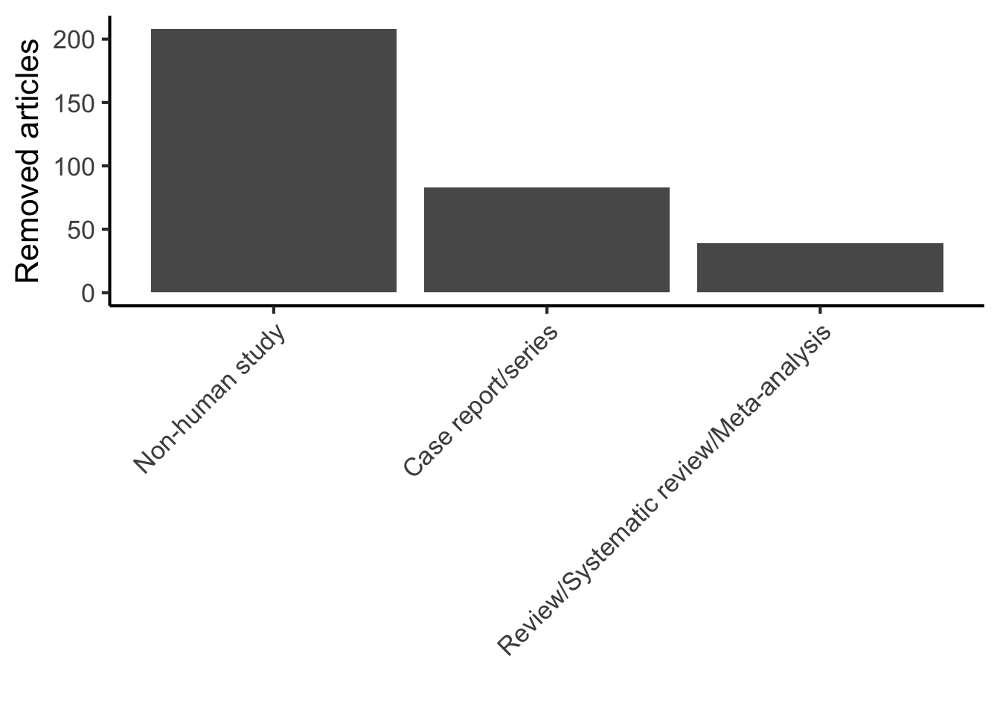

::: {.cell}

```{.r .cell-code}
# hide this code chunk
#| echo: false
#| message: false

# defines the se function
se <- function(x) {
  sd(x, na.rm = TRUE) / sqrt(length(x))
}

#load these packages, nearly always needed
library(tidyverse)

# sets maize and blue color scheme
color_scheme <- c("#00274c", "#ffcb05")
```
:::


## Purpose

I used a GPT-based screen to evaluate the deduplicated list to remove meta-analyses, nonhuman studies, and review articles

## GPT Prompt

You are acting as an expert systematic-reviewer following PRISMA guidelines.  
You will classify each article in a deduplicated list by reading its Title and Abstract (fields: `Title`, `Abstract Note`).

Flag any article as:
- "Case report/series" if the title or abstract clearly states “case report”, “case series”, or “a case of …”.
- "Review/Systematic review/Meta-analysis" if the title or abstract clearly states “systematic review”, “meta-analysis”, “review article”, or “narrative review”.
- "Non-human study" only if it is clear the study population is not human and no human data are included.
- "Unsure" if you cannot confidently classify it into one of the above categories.

Be conservative: only flag an article if it clearly matches the criteria.  
Do not exclude any article with both human and non-human data.

Output a CSV file with two columns:  
`Key` (article key from input file) and `Reason` (one of the four categories above).

## Raw Data

Describe your raw data files, including what the columns mean (and what units they are in).


::: {.cell}

```{.r .cell-code}
library(readr) #loads the readr package
library.file <- 'deduplicated-library.csv'
deduplicated.file <- 'classified_articles.csv'

deduplicatd.library <- read_csv(library.file)
annotation <- read_csv(deduplicated.file)

combined.file <- left_join(deduplicatd.library,annotation, by="Key") |>
  mutate(Key = as.factor(Reason)) |>
  mutate(method_ineligible = ifelse(Reason !="Unsure", 1, 0))
```
:::


These data can be found in /Users/davebrid/Documents/GitHub/PrecisionNutrition/Meta Analysis/Searching and Screening/Calcium-Cholesterol in files named deduplicated-library.csv and classified_articles.csv.  This input file was most recently updated on 2025-09-21.  This script was most recently updated on Sun Sep 21 14:40:29 2025.

## Analysis

### Manual Screening


::: {.cell}

```{.r .cell-code}
added.fields <- c('DateScreened','Screener','Decision','FullTextView','ExclusionReason','Notes')
deduplicatd.library |>
  select(Key,Title,DOI,`Abstract Note`) |>
  mutate(!!!set_names(rep(NA, length(added.fields)), added.fields)) |>
  write_csv("Screening Log.csv")
```
:::


This screen flagged 330 out of 2195 articles.

### Annotations by Key


::: {.cell}

```{.r .cell-code}
combined.file %>%
  group_by(Reason) |>
  count() -> annotation.counts
library(knitr)
library(kableExtra)
kable(annotation.counts, caption="Annotated articles by keys")
```

::: {.cell-output-display}
Table: Annotated articles by keys

|Reason                                 |    n|
|:--------------------------------------|----:|
|Case report/series                     |   83|
|Non-human study                        |  208|
|Review/Systematic review/Meta-analysis |   39|
|Unsure                                 | 1865|
:::

```{.r .cell-code}
ggplot(annotation.counts |> filter(Reason!="Unsure"),
       aes(x=reorder(Reason,desc(n)),y=n)) +
  geom_bar(stat='identity') +
  theme_classic(base_size=16) +
  labs(y='Removed articles',
       x='') +
  theme(axis.text.x = element_text(angle = 45, hjust = 1, vjust = 1))
```

::: {.cell-output-display}
{width=672}
:::
:::


## Interpretation

A brief summary of what the interpretation of these results were

## Session Information


::: {.cell}

```{.r .cell-code}
sessionInfo()
```

::: {.cell-output .cell-output-stdout}
```
R version 4.4.2 (2024-10-31)
Platform: x86_64-apple-darwin20
Running under: macOS Monterey 12.7.6

Matrix products: default
BLAS:   /Library/Frameworks/R.framework/Versions/4.4-x86_64/Resources/lib/libRblas.0.dylib 
LAPACK: /Library/Frameworks/R.framework/Versions/4.4-x86_64/Resources/lib/libRlapack.dylib;  LAPACK version 3.12.0

locale:
[1] en_US.UTF-8/en_US.UTF-8/en_US.UTF-8/C/en_US.UTF-8/en_US.UTF-8

time zone: America/Detroit
tzcode source: internal

attached base packages:
[1] stats     graphics  grDevices utils     datasets  methods   base     

other attached packages:
 [1] kableExtra_1.4.0 knitr_1.49       lubridate_1.9.4  forcats_1.0.0   
 [5] stringr_1.5.1    dplyr_1.1.4      purrr_1.0.2      readr_2.1.5     
 [9] tidyr_1.3.1      tibble_3.2.1     ggplot2_3.5.1    tidyverse_2.0.0 

loaded via a namespace (and not attached):
 [1] generics_0.1.3    xml2_1.3.6        stringi_1.8.4     hms_1.1.3        
 [5] digest_0.6.37     magrittr_2.0.3    evaluate_1.0.3    grid_4.4.2       
 [9] timechange_0.3.0  fastmap_1.2.0     jsonlite_1.8.9    viridisLite_0.4.2
[13] scales_1.3.0      textshaping_0.4.1 cli_3.6.5         rlang_1.1.6      
[17] crayon_1.5.3      bit64_4.5.2       munsell_0.5.1     withr_3.0.2      
[21] yaml_2.3.10       tools_4.4.2       parallel_4.4.2    tzdb_0.5.0       
[25] colorspace_2.1-1  vctrs_0.6.5       R6_2.5.1          lifecycle_1.0.4  
[29] htmlwidgets_1.6.4 bit_4.5.0.1       vroom_1.6.5       pkgconfig_2.0.3  
[33] archive_1.1.12    pillar_1.10.1     gtable_0.3.6      glue_1.8.0       
[37] systemfonts_1.2.3 xfun_0.50         tidyselect_1.2.1  rstudioapi_0.17.1
[41] farver_2.1.2      htmltools_0.5.8.1 labeling_0.4.3    rmarkdown_2.29   
[45] svglite_2.2.1     compiler_4.4.2   
```
:::
:::
