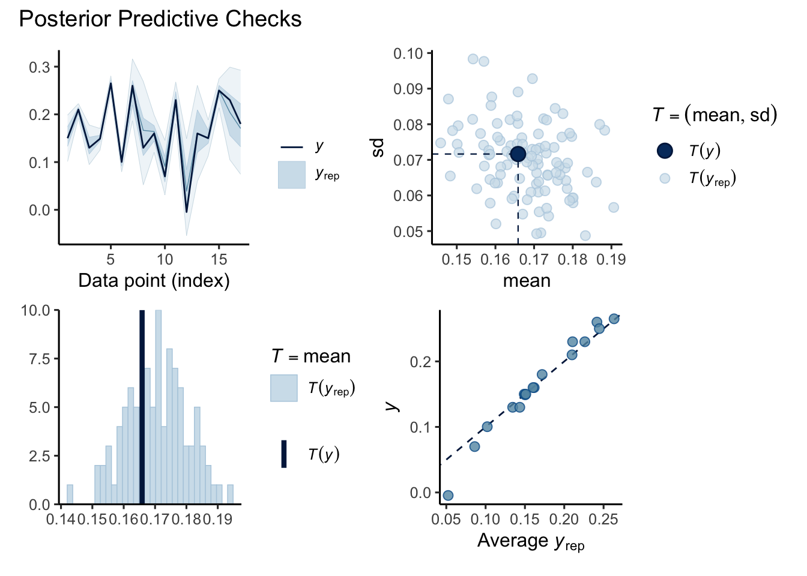
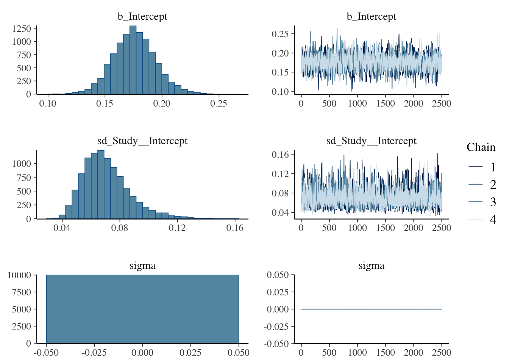
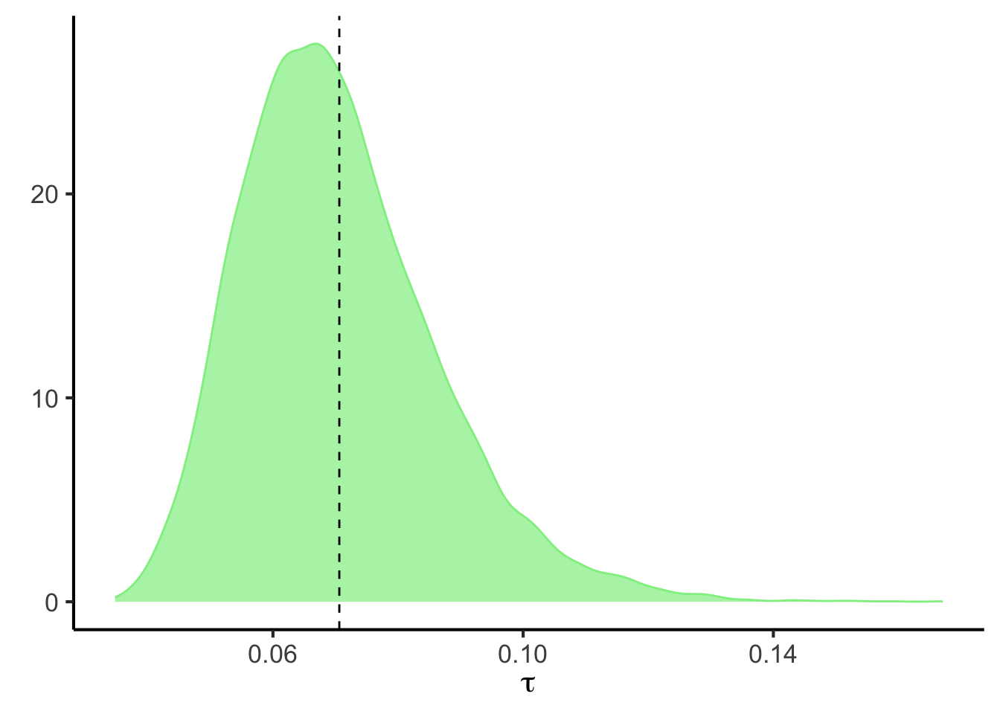
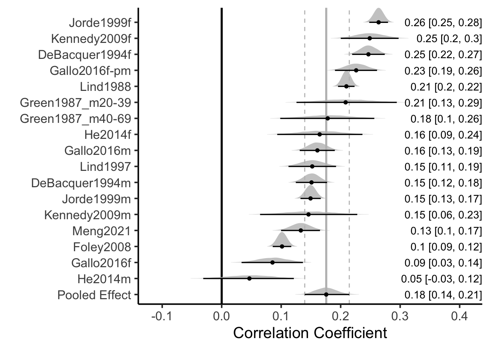

## Data Souces

Located studies from PubMed searches and checking internal references. Manually re-calculated cholesterol to mM when presented in mg/dL


::: {.cell}

```{.r .cell-code}
data.sheet <- 'https://docs.google.com/spreadsheets/d/e/2PACX-1vTyvQnc6bLRLGT6QXEMHxiAQVbK_zag_JIAjvYjTMXINcqdkBwglmg_mlj_k9ml9QsrNQl-tZgy8ACl/pub?gid=1100702568&single=true&output=csv'
library(readr)
data <- read_csv(data.sheet)#from a google sheet
```
:::


The data can be found in a [google sheet](https://docs.google.com/spreadsheets/d/e/2PACX-1vTyvQnc6bLRLGT6QXEMHxiAQVbK_zag_JIAjvYjTMXINcqdkBwglmg_mlj_k9ml9QsrNQl-tZgy8ACl/pub?gid=1100702568&single=true&output=csv). This script can be found in /Users/davebrid/Documents/GitHub/PrecisionNutrition/Meta Analysis and was most recently run on Sun Jan 19 18:07:00 2025

## Meta Analysis - Standard Approach

Analysed data from mean +/- SD of cases and controls


::: {.cell}

```{.r .cell-code}
library(meta)
library(tidyr)
analysis <- metacor(data=data %>% dplyr::filter(!is.na(`r`)),
                   cor = r, 
                   n = n,
                 studlab = Study,
                 fixed = FALSE,
                 random = TRUE,
                 method.tau = "REML",
                 hakn = TRUE,
                 title="Calcium and Cholesterol")

forest(analysis,
            fontsize=6,,
            test.overall.random=TRUE)
```

::: {.cell-output-display}
{width=672}
:::
:::

### Summary of Standard Approach

There is solid evidence of cross-sectional associations between cholesterol and calcium levels in multiple studies. The aggregate effect size is 0.17 +/- 0.018 (p=4.15\times 10^{-8}).


## Bayesian Hierarchical Model

**Goals and Justification**:  Our goal is to com up with a pooled estimate of the correlation between cholesterol and calcium in human observational studies.  In addition to the approach above, we decided to use a Bayesian approach for two reasons, one is that it allows us to produce full posterior distributions for both the within- and between study-variability.  The other is that it allows us to incorporate previous data, in this case the preclinical data reported in @cousineauCrosssectionalAssociationBlood2024.  

Followed the procedure outlined in @bayesianmetabookdown and @harrer2021doing at [here]( https://bookdown.org/MathiasHarrer/Doing_Meta_Analysis_in_R/bayesian-ma.html).  This uses a framework described by @higgins2008.  Under this approach there is a "true" effect ($\mu$) with a cross-study variance of $\tau$.  Within this each study ($\theta _k$) should be normally distributed defined:

$$\theta _k \sim N(\mu,\tau^2)$$
Each study in turn is a proximate measure of the effect size in that population $\hat{\theta_k}$, with sampling error $\sigma^2$ drawn from another normal distribution

$$\hat\theta _k \sim N(\theta _k,\sigma^2_k)$$

This can be simplified to

$$\hat\theta _k \sim N(\mu,\sigma^2_k + \tau^2)$$

### Defining a Prior Distribution

$$
p \sim (\mu,tau^2)
$$
We took an approach using *weakly informative* priors (recommended in @williamsBayesianMetaAnalysisWeakly2018) of $\mu_{weak} = N(0,0.2)$ and $\tau=HC(0,0.5)$.  This means we predict the correlations to be around zero but with a standard deviation of $\pm 0.2$.  For the betwen study variance ($\tau$) we used the heavy-tailed only positive Half-Cauchy distribution.

Our alternative prior was the preclinical prior descibed in @cousineauCrosssectionalAssociationBlood2024, which was that Spearman's $\rho$ was estimated at 0.4-0.5 depending on the condition (parameterized as $\mu_{alt}=N(0.45,0.1)).

We calculated the standard error of the estimate of r using

$$SE = \sqrt{\frac{(1 - r^2)}{(n - 2)}}$$


::: {.cell}

```{.r .cell-code}
library(dplyr)
data <-
  data %>%
  mutate(se=sqrt((1-r^2)/(n-2)))
```
:::


**Model Specification** We used a Gaussian (normal) distribution to estimate the pooled effect using a random-effects meta-analysis model computed within brms (@brms_citation) version 2.22.0. The model included a fixed effect for the overall pooled estimate and random effects to account for between-study heterogeneity. The within-study variability was also accounted for in the model.

**Justification of Priors**:  We set our prior probabilities that the correlation coefficient would be 0.4, normally distributed with a standard deviation of 0.1, based on the pre-clinical assoications described in @cousineauCrosssectionalAssociationBlood2024.  We used a weakly informative prior for the between study variation setting it to be a half-Cauchy distribution centered at 0 with a scale parameter of 0.5.


::: {.cell}

```{.r .cell-code}
library(brms)
priors <- c(prior(normal(0.4,0.1), class = Intercept),
            prior(cauchy(0,0.5), class = sd, lb = 0))

prior_summary(priors) %>% kable(caption="Prior summary for effects of transmission on engine type")
```
:::


#### Performing a Prior Predictive Check


::: {.cell}

```{.r .cell-code}
brms.fit.prior.check <- 
  brm(r|se(se) ~ 1 + (1|Study),
      data = data,
      prior = priors,
      family = gaussian(),
      sample_prior = "only")

library(patchwork)
library(ggplot2)
p1 <- pp_check(brms.fit.prior.check, ndraws = 100, type = "ribbon")
p2 <- pp_check(brms.fit.prior.check, ndraws = 100, type = "stat_2d")
p3 <- pp_check(brms.fit.prior.check, ndraws = 100, type = "stat") +
  stat_bin(binwidth=0.6)
p4 <- pp_check(brms.fit.prior.check, ndraws = 100, type = "scatter_avg")
combined_plot <- (p1 + p2) / (p3 + p4) + 
  plot_annotation(title = "Prior Predictive Checks") &
  theme(plot.title = element_text(hjust = 0.5)) +
  theme_classic(base_size=12)

combined_plot
```
:::


As seen above, we did several prior predictive checks and values from simulated from our prior distributions were similar to the observed data.

The model was computed using {brms} (@brms_citation, version 2.22.0), calling Stan, using no U-turn sampling (NUTS) as described in @hoffman14a. This was implemented within R (@baseR) R version 4.4.2 (2024-10-31).


::: {.cell}

```{.r .cell-code}
meta.brm <- brm(r|se(se) ~ 1 + (1|Study),
             data = data,
             prior = priors,
             family = gaussian(), #default but specified
             iter = 5000) #not the default
```
:::


### MCMC Chain Convergence and Resolution


::: {.cell}

```{.r .cell-code}
kable(data.frame(
  Parameter = names(rhat(meta.brm)),
  Rhat = format(rhat(meta.brm), nsmall = 5)),
caption="Rhat values for model (should be between 0.99 and 1.01 for convergence).",
row.names = F)
```

::: {.cell-output-display}
Table: Rhat values for model (should be between 0.99 and 1.01 for convergence).

|Parameter                           |Rhat    |
|:-----------------------------------|:-------|
|b_Intercept                         |1.00364 |
|sd_Study__Intercept                 |1.00091 |
|sigma                               |NA      |
|Intercept                           |1.00364 |
|r_Study[DeBacquer1994f,Intercept]   |1.00230 |
|r_Study[DeBacquer1994m,Intercept]   |1.00246 |
|r_Study[Foley2008,Intercept]        |1.00301 |
|r_Study[Gallo2016f,Intercept]       |1.00090 |
|r_Study[Gallo2016f-pm,Intercept]    |1.00182 |
|r_Study[Gallo2016m,Intercept]       |1.00215 |
|r_Study[Green1987_m20-39,Intercept] |1.00064 |
|r_Study[Green1987_m40-69,Intercept] |1.00065 |
|r_Study[He2014f,Intercept]          |1.00031 |
|r_Study[He2014m,Intercept]          |1.00062 |
|r_Study[Jorde1999f,Intercept]       |1.00304 |
|r_Study[Jorde1999m,Intercept]       |1.00302 |
|r_Study[Kennedy2009f,Intercept]     |1.00133 |
|r_Study[Kennedy2009m,Intercept]     |1.00047 |
|r_Study[Lind1988,Intercept]         |1.00360 |
|r_Study[Lind1997,Intercept]         |1.00161 |
|r_Study[Meng2021,Intercept]         |1.00220 |
|lprior                              |1.00364 |
|lp__                                |1.00056 |
:::
:::


Chain convergence was good with a $\hat R$ between 1.00031 and 1.00364 for each model estimate.


::: {.cell}

```{.r .cell-code}
library(broom.mixed)
tidy(meta.brm, ess = TRUE) %>% kable(caption="Model parameters including effective sample size")
```

::: {.cell-output-display}
Table: Model parameters including effective sample size

|effect   |component |group    |term            | estimate| std.error| conf.low| conf.high|  ess|
|:--------|:---------|:--------|:---------------|--------:|---------:|--------:|---------:|----:|
|fixed    |cond      |NA       |(Intercept)     |    0.176|     0.019|    0.140|     0.217| 1541|
|ran_pars |cond      |Study    |sd__(Intercept) |    0.071|     0.017|    0.046|     0.110| 1765|
|ran_pars |cond      |Residual |sd__Observation |    0.000|     0.000|    0.000|     0.000|   NA|
:::
:::

The effective sample size was at least 1540.977 samples for each parameter.

### Posterior Probability Check


::: {.cell}

```{.r .cell-code}
p1 <- pp_check(meta.brm, ndraws = 100, type = "ribbon")
p2 <- pp_check(meta.brm, ndraws = 100, type = "stat_2d")
p3 <- pp_check(meta.brm, ndraws = 100, type = "stat") 
p4 <- pp_check(meta.brm, ndraws = 100, type = "scatter_avg")
combined_plot <- (p1 + p2) / (p3 + p4) + 
  plot_annotation(title = "Posterior Predictive Checks") &
  theme(plot.title = element_text(hjust = 0.5)) +
  theme_classic(base_size=12)

combined_plot
```

::: {.cell-output-display}
{width=672}
:::
:::


As shown above, the posterior predictive checks indicated a good model fit.

### Interpretation of Posterior Probabilities


::: {.cell}

```{.r .cell-code}
#summary(meta.brm)
#ranef(meta.brm)
fixef(meta.brm) %>% kable(caption="Bayesian estimates of correlation between cholesterol and calcium")
```

::: {.cell-output-display}
Table: Bayesian estimates of correlation between cholesterol and calcium

|          | Estimate| Est.Error| Q2.5| Q97.5|
|:---------|--------:|---------:|----:|-----:|
|Intercept |    0.176|     0.019| 0.14| 0.217|
:::

```{.r .cell-code}
plot(meta.brm) 
```

::: {.cell-output-display}
{width=672}
:::
:::

::: {.cell}

```{.r .cell-code}
post.samples <- as_draws_df(meta.brm, c("Intercept", "sd_Study__Intercept"))
names(post.samples) <- c("smd", "tau")
library(ggplot2)

ggplot(aes(x = smd), data = post.samples) +
  geom_density(fill = "#FFCB05",                # set the color
               color = "#FFCB05", alpha = 0.7) +  
  geom_vline(xintercept = mean(post.samples$smd),lty=2) +
  geom_vline(xintercept = 0,lty=2) +
  labs(x = expression(italic(r)),
       y = element_blank()) +
  theme_classic(base_size=16)
```

::: {.cell-output-display}
{width=672}
:::

```{.r .cell-code}
ggplot(aes(x = tau), data = post.samples) +
  geom_density(fill = "#00274C",               # set the color
               color = "#00274C", alpha = 0.7) +  
  geom_vline(xintercept= mean(post.samples$tau),lty=2) +        # add point at mean
    labs(x = expression(tau),
       y = element_blank()) +
  theme_classic(base_size=16)
```

::: {.cell-output-display}
{width=672}
:::
:::


The distribution of the posterior probabilities are unimodal, approximately gaussian distributions with a mean of 0.176 with a 95% confidence interval of 0.14-0.217 for the pooled estimate of $r$.  This corresponds to a $R^2$ of 0.031.

#### Bayes Factors and Hypothesis Testing


::: {.cell}

```{.r .cell-code}
hypothesis(meta.brm, "Intercept>0")$hypothesis %>%
  kable(caption="Hypothesis test for estimate >0", digits=3)
```

::: {.cell-output-display}
Table: Hypothesis test for estimate >0

|Hypothesis      | Estimate| Est.Error| CI.Lower| CI.Upper| Evid.Ratio| Post.Prob|Star |
|:---------------|--------:|---------:|--------:|--------:|----------:|---------:|:----|
|(Intercept) > 0 |    0.176|     0.019|    0.146|    0.208|        Inf|         1|*    |
:::

```{.r .cell-code}
#comparason to preclinical data
hypothesis(meta.brm, "Intercept<0.39")$hypothesis %>%
  kable(caption="Hypothesis test for estimate <0.39", digits=3)
```

::: {.cell-output-display}
Table: Hypothesis test for estimate <0.39

|Hypothesis             | Estimate| Est.Error| CI.Lower| CI.Upper| Evid.Ratio| Post.Prob|Star |
|:----------------------|--------:|---------:|--------:|--------:|----------:|---------:|:----|
|(Intercept)-(0.39) < 0 |   -0.214|     0.019|   -0.244|   -0.182|        Inf|         1|*    |
:::
:::


The posterior probability that $r > 0$ was 1.00000000000000000000.  Similarly this was smaller than the effect observed in mice ($\rho<0.39$) 1.00000000000000000000.  In both cases the Bayes factor was >100 so this is extremely strong evidence of an effect (see @leeBayesianCognitiveModeling2014). 

#### Forest Plot for Bayesian Meta-Analysis


::: {.cell}

```{.r .cell-code}
library(tidybayes)
library(ggridges)
library(glue)
library(stringr)
library(forcats)

# posterior probabilitieis for each study
study.draws <- spread_draws(meta.brm, r_Study[Study,], b_Intercept) %>% 
  mutate(b_Intercept = r_Study + b_Intercept)

# pooled effect size draws
pooled.effect.draws <- spread_draws(meta.brm, b_Intercept) %>% 
  mutate(Study = "Pooled Effect")

# combined draws
forest.data <- bind_rows(study.draws, 
                         pooled.effect.draws) %>% 
   ungroup() %>%
   mutate(Study = str_replace_all(Study, "[.]", " ")) %>% 
   mutate(Study = reorder(Study, b_Intercept)) #arrange by effect size

# calculate effect size of each study
forest.data.summary <- group_by(forest.data, Study) %>% 
  mean_qi(b_Intercept)

# generate plot
ggplot(aes(b_Intercept, 
           relevel(Study, "Pooled Effect", 
                   after = Inf)), 
       data = forest.data) +
  
  # Add vertical lines for pooled effect and CI
  geom_vline(xintercept = fixef(meta.brm)[1, 1], 
             color = "grey", size = 1) +
  geom_vline(xintercept = fixef(meta.brm)[1, 3:4], 
             color = "grey", linetype = 2) +
  geom_vline(xintercept = 0, color = "black", 
             size = 1) +
  
  # Add densities
  geom_density_ridges(fill = "grey", 
                      rel_min_height = 0.01, 
                      col = NA, scale = 1,
                      alpha = 0.8) +
  geom_pointinterval(data = forest.data.summary, 
                      size = 1,
                     orientation='horizontal',
                     aes(xmin = .lower, xmax = .upper)) +
  
  # Add text and labels
  geom_text(data = mutate_if(forest.data.summary, 
                             is.numeric, round, 2),
    aes(label = glue("{b_Intercept} [{.lower}, {.upper}]"), 
        x = Inf), hjust = "inward") +
  labs(x = "Correlation Coefficient", # summary measure
       y = element_blank()) +
  theme_classic(base_size=16)
```

::: {.cell-output-display}
{width=672}
:::
:::


## References

::: {#refs}
:::

# Session Information


::: {.cell}

```{.r .cell-code}
sessionInfo()
```

::: {.cell-output .cell-output-stdout}
```
R version 4.4.2 (2024-10-31)
Platform: x86_64-apple-darwin20
Running under: macOS Monterey 12.7.6

Matrix products: default
BLAS:   /Library/Frameworks/R.framework/Versions/4.4-x86_64/Resources/lib/libRblas.0.dylib 
LAPACK: /Library/Frameworks/R.framework/Versions/4.4-x86_64/Resources/lib/libRlapack.dylib;  LAPACK version 3.12.0

locale:
[1] en_US.UTF-8/en_US.UTF-8/en_US.UTF-8/C/en_US.UTF-8/en_US.UTF-8

time zone: America/Detroit
tzcode source: internal

attached base packages:
[1] stats     graphics  grDevices utils     datasets  methods   base     

other attached packages:
 [1] forcats_1.0.0       stringr_1.5.1       glue_1.8.0         
 [4] ggridges_0.5.6      tidybayes_3.0.7     broom.mixed_0.2.9.6
 [7] ggplot2_3.5.1       patchwork_1.3.0     brms_2.22.0        
[10] Rcpp_1.0.14         dplyr_1.1.4         tidyr_1.3.1        
[13] meta_8.0-1          metadat_1.2-0       readr_2.1.5        
[16] knitr_1.49         

loaded via a namespace (and not attached):
 [1] Rdpack_2.6.2         gridExtra_2.3        inline_0.3.21       
 [4] rlang_1.1.4          magrittr_2.0.3       furrr_0.3.1         
 [7] matrixStats_1.5.0    compiler_4.4.2       loo_2.8.0           
[10] callr_3.7.6          vctrs_0.6.5          reshape2_1.4.4      
[13] pkgconfig_2.0.3      arrayhelpers_1.1-0   crayon_1.5.3        
[16] fastmap_1.2.0        backports_1.5.0      labeling_0.4.3      
[19] rmarkdown_2.29       tzdb_0.4.0           ps_1.8.1            
[22] nloptr_2.1.1         purrr_1.0.2          bit_4.5.0.1         
[25] xfun_0.50            jsonlite_1.8.9       broom_1.0.7         
[28] parallel_4.4.2       R6_2.5.1             stringi_1.8.4       
[31] StanHeaders_2.32.10  parallelly_1.41.0    boot_1.3-31         
[34] numDeriv_2016.8-1.1  rstan_2.32.6         bayesplot_1.11.1    
[37] Matrix_1.7-1         splines_4.4.2        tidyselect_1.2.1    
[40] rstudioapi_0.17.1    abind_1.4-8          yaml_2.3.10         
[43] codetools_0.2-20     metafor_4.6-0        curl_6.1.0          
[46] processx_3.8.5       listenv_0.9.1        pkgbuild_1.4.5      
[49] lattice_0.22-6       tibble_3.2.1         plyr_1.8.9          
[52] withr_3.0.2          bridgesampling_1.1-2 posterior_1.6.0     
[55] coda_0.19-4.1        evaluate_1.0.3       future_1.34.0       
[58] CompQuadForm_1.4.3   RcppParallel_5.1.9   ggdist_3.3.2        
[61] xml2_1.3.6           pillar_1.10.1        tensorA_0.36.2.1    
[64] checkmate_2.3.2      stats4_4.4.2         reformulas_0.4.0    
[67] distributional_0.5.0 generics_0.1.3       vroom_1.6.5         
[70] mathjaxr_1.6-0       hms_1.1.3            rstantools_2.4.0    
[73] munsell_0.5.1        scales_1.3.0         minqa_1.2.8         
[76] globals_0.16.3       tools_4.4.2          lme4_1.1-36         
[79] mvtnorm_1.3-3        grid_4.4.2           rbibutils_2.3       
[82] QuickJSR_1.5.1       colorspace_2.1-1     nlme_3.1-166        
[85] cli_3.6.3            svUnit_1.0.6         Brobdingnag_1.2-9   
[88] gtable_0.3.6         digest_0.6.37        htmlwidgets_1.6.4   
[91] farver_2.1.2         htmltools_0.5.8.1    lifecycle_1.0.4     
[94] bit64_4.5.2          MASS_7.3-64         
```
:::
:::
