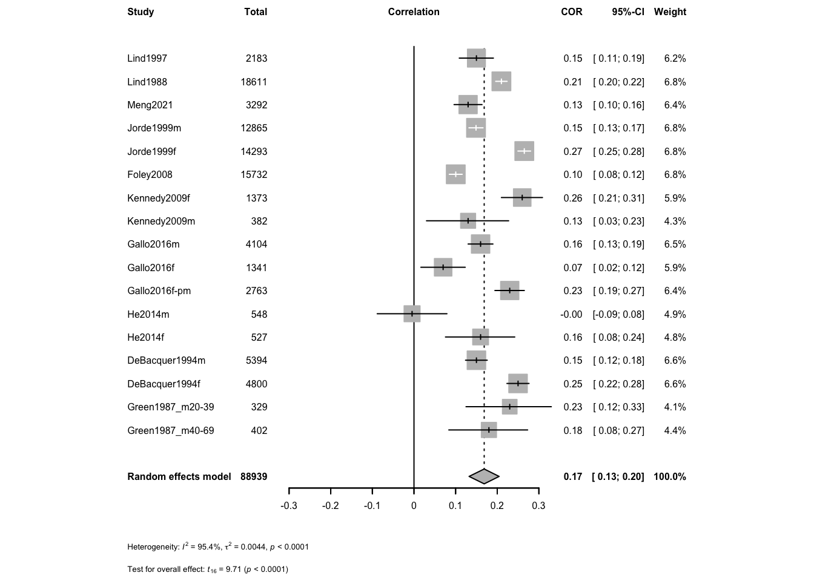

## Data Souces

Located studies from PubMed searches and checking internal references. Manually re-calculated cholesterol to mM when presented in mg/dL


::: {.cell}

```{.r .cell-code}
data.sheet <- 'https://docs.google.com/spreadsheets/d/e/2PACX-1vTyvQnc6bLRLGT6QXEMHxiAQVbK_zag_JIAjvYjTMXINcqdkBwglmg_mlj_k9ml9QsrNQl-tZgy8ACl/pub?gid=1100702568&single=true&output=csv'
library(readr)
data <- read_csv(data.sheet)#from a google sheet
```
:::


The data can be found in a [google sheet](https://docs.google.com/spreadsheets/d/e/2PACX-1vTyvQnc6bLRLGT6QXEMHxiAQVbK_zag_JIAjvYjTMXINcqdkBwglmg_mlj_k9ml9QsrNQl-tZgy8ACl/pub?gid=1100702568&single=true&output=csv). This script can be found in /Users/davebrid/Documents/GitHub/PrecisionNutrition/Meta Analysis and was most recently run on Sun Jan 19 10:44:51 2025

## Meta Analysis - Standard Approach

Analysed data from mean +/- SD of cases and controls


::: {.cell}

```{.r .cell-code}
library(meta)
library(tidyr)
analysis <- metacor(data=data %>% dplyr::filter(!is.na(`r`)),
                   cor = r, 
                   n = n,
                 studlab = Study,
                 fixed = FALSE,
                 random = TRUE,
                 method.tau = "REML",
                 hakn = TRUE,
                 title="Calcium and Cholesterol")

forest(analysis,
            fontsize=6,,
            test.overall.random=TRUE)
```

::: {.cell-output-display}
{width=672}
:::
:::


## Bayesian Hierarchical Model

Followed the procedure outlined in @bayesianmetabookdown and @harrer2021doing at [here]( https://bookdown.org/MathiasHarrer/Doing_Meta_Analysis_in_R/bayesian-ma.html).  This uses a framework described by @higgins2008.  Under this approach there is a "true" effect ($\mu$) with a cross-study variance of $\tau$.  Within this each study ($\theta _k$) should be normally distributed defined:

$$\theta _k \sim N(\mu,\tau^2)$$
Each study in turn is a proximate measure of the effect size in that population $\hat{\theta_k}$, with sampling error $\sigma^2$ drawn from another normal distribution

$$\hat\theta _k \sim N(\theta _k,\sigma^2_k)$$

This can be simplified to

$$\hat\theta _k \sim N(\mu,\sigma^2_k + \tau^2)$$

### Defining a Prior Distribution

$$
p \sim (\mu,tau^2)
$$
We took an approach using *weakly informative* priors (recommended in @williamsBayesianMetaAnalysisWeakly2018) of $\mu = N(0,0.2)$ and $\tau=HC(0,0.5)$.  This means we predict the correlations to be around zero but with a standard deviation of $\pm 0.2$.  For the betwen study variance ($\tau$) we used the heavy-tailed only positive Half-Cauchy distribution.

We calculated the standard error of the estimate of r using

$$SE = \sqrt{\frac{(1 - r^2)}{(n - 2)}}$$


::: {.cell}

```{.r .cell-code}
library(dplyr)
data <-
  data %>%
  mutate(se=sqrt((1-r^2)/(n-2)))
```
:::


This was analysed using {brms} (see @) using no U-turn sampling (NUTS) as described in @hoffman14a.


::: {.cell}

```{.r .cell-code}
library(brms)
priors <- c(prior(normal(0,0.2), class = Intercept),
            prior(cauchy(0,0.5), class = sd))

meta.brm <- brm(r|se(se) ~ 1 + (1|Study),
             data = data,
             prior = priors,
             iter = 4000)
```
:::


### Internpretation of Bayesian Analysis


::: {.cell}

```{.r .cell-code}
#summary(meta.brm)
#ranef(meta.brm)
fixef(meta.brm) %>% kable(caption="Bayesian estimates of correlation between cholesterol and calcium")
```

::: {.cell-output-display}
Table: Bayesian estimates of correlation between cholesterol and calcium

|          | Estimate| Est.Error|  Q2.5| Q97.5|
|:---------|--------:|---------:|-----:|-----:|
|Intercept |    0.167|     0.019| 0.128| 0.205|
:::
:::


#### Posterior Probability Check


::: {.cell}

```{.r .cell-code}
pp_check(meta.brm)
```

::: {.cell-output-display}
{width=672}
:::
:::


#### Posterior Probabilities


::: {.cell}

```{.r .cell-code}
post.samples <- as_draws_df(meta.brm, c("Intercept", "sd_Study__Intercept"))
names(post.samples) <- c("smd", "tau")
library(ggplot2)

ggplot(aes(x = smd), data = post.samples) +
  geom_density(fill = "lightblue",                # set the color
               color = "lightblue", alpha = 0.7) +  
  geom_vline(xintercept = mean(post.samples$smd),lty=2) +
  geom_vline(xintercept = 0,lty=2) +
  labs(x = expression(italic(r)),
       y = element_blank()) +
  theme_classic(base_size=16)
```

::: {.cell-output-display}
{width=672}
:::

```{.r .cell-code}
ggplot(aes(x = tau), data = post.samples) +
  geom_density(fill = "lightgreen",               # set the color
               color = "lightgreen", alpha = 0.7) +  
  geom_vline(xintercept= mean(post.samples$tau),lty=2) +        # add point at mean
    labs(x = expression(tau),
       y = element_blank()) +
  theme_classic(base_size=16)
```

::: {.cell-output-display}
{width=672}
:::
:::

#### Forest Plot for Bayesian Meta-Analysis


::: {.cell}

```{.r .cell-code}
library(tidybayes)
library(ggridges)
library(glue)
library(stringr)
library(forcats)

# posterior probabilitieis for each study
study.draws <- spread_draws(meta.brm, r_Study[Study,], b_Intercept) %>% 
  mutate(b_Intercept = r_Study + b_Intercept)

# pooled effect size draws
pooled.effect.draws <- spread_draws(meta.brm, b_Intercept) %>% 
  mutate(Study = "Pooled Effect")

# combined draws
forest.data <- bind_rows(study.draws, 
                         pooled.effect.draws) %>% 
   ungroup() %>%
   mutate(Study = str_replace_all(Study, "[.]", " ")) %>% 
   mutate(Study = reorder(Study, b_Intercept)) #arrange by effect size

# calculate effect size of each study
forest.data.summary <- group_by(forest.data, Study) %>% 
  mean_qi(b_Intercept)

# generate plot
ggplot(aes(b_Intercept, 
           relevel(Study, "Pooled Effect", 
                   after = Inf)), 
       data = forest.data) +
  
  # Add vertical lines for pooled effect and CI
  geom_vline(xintercept = fixef(meta.brm)[1, 1], 
             color = "grey", size = 1) +
  geom_vline(xintercept = fixef(meta.brm)[1, 3:4], 
             color = "grey", linetype = 2) +
  geom_vline(xintercept = 0, color = "black", 
             size = 1) +
  
  # Add densities
  geom_density_ridges(fill = "grey", 
                      rel_min_height = 0.01, 
                      col = NA, scale = 1,
                      alpha = 0.8) +
  geom_pointinterval(data = forest.data.summary, 
                      size = 1,
                     orientation='horizontal',
                     aes(xmin = .lower, xmax = .upper)) +
  
  # Add text and labels
  geom_text(data = mutate_if(forest.data.summary, 
                             is.numeric, round, 2),
    aes(label = glue("{b_Intercept} [{.lower}, {.upper}]"), 
        x = Inf), hjust = "inward") +
  labs(x = "Correlation Coefficient", # summary measure
       y = element_blank()) +
  theme_classic(base_size=16)
```

::: {.cell-output-display}
{width=672}
:::
:::


## Summary

There is solid evidence of cross-sectional associations between cholesterol and calcium levels in multiple studies. The aggregate effect size is 0.17 +/- 0.018 (p=4.15\times 10^{-8}).

## References

::: {#refs}
:::

# Session Information


::: {.cell}

```{.r .cell-code}
sessionInfo()
```

::: {.cell-output .cell-output-stdout}
```
R version 4.4.2 (2024-10-31)
Platform: x86_64-apple-darwin20
Running under: macOS Monterey 12.7.6

Matrix products: default
BLAS:   /Library/Frameworks/R.framework/Versions/4.4-x86_64/Resources/lib/libRblas.0.dylib 
LAPACK: /Library/Frameworks/R.framework/Versions/4.4-x86_64/Resources/lib/libRlapack.dylib;  LAPACK version 3.12.0

locale:
[1] en_US.UTF-8/en_US.UTF-8/en_US.UTF-8/C/en_US.UTF-8/en_US.UTF-8

time zone: America/Detroit
tzcode source: internal

attached base packages:
[1] stats     graphics  grDevices utils     datasets  methods   base     

other attached packages:
 [1] forcats_1.0.0   stringr_1.5.1   glue_1.8.0      ggridges_0.5.6 
 [5] tidybayes_3.0.7 ggplot2_3.5.1   brms_2.22.0     Rcpp_1.0.14    
 [9] dplyr_1.1.4     tidyr_1.3.1     meta_8.0-1      metadat_1.2-0  
[13] readr_2.1.5     knitr_1.49     

loaded via a namespace (and not attached):
 [1] svUnit_1.0.6         tidyselect_1.2.1     farver_2.1.2        
 [4] loo_2.8.0            fastmap_1.2.0        CompQuadForm_1.4.3  
 [7] tensorA_0.36.2.1     mathjaxr_1.6-0       digest_0.6.37       
[10] lifecycle_1.0.4      StanHeaders_2.32.10  processx_3.8.5      
[13] magrittr_2.0.3       posterior_1.6.0      compiler_4.4.2      
[16] rlang_1.1.4          tools_4.4.2          yaml_2.3.10         
[19] labeling_0.4.3       bridgesampling_1.1-2 htmlwidgets_1.6.4   
[22] bit_4.5.0.1          pkgbuild_1.4.5       curl_6.1.0          
[25] plyr_1.8.9           xml2_1.3.6           abind_1.4-8         
[28] withr_3.0.2          purrr_1.0.2          numDeriv_2016.8-1.1 
[31] grid_4.4.2           stats4_4.4.2         colorspace_2.1-1    
[34] inline_0.3.21        scales_1.3.0         MASS_7.3-64         
[37] cli_3.6.3            mvtnorm_1.3-3        rmarkdown_2.29      
[40] metafor_4.6-0        crayon_1.5.3         reformulas_0.4.0    
[43] generics_0.1.3       RcppParallel_5.1.9   rstudioapi_0.17.1   
[46] reshape2_1.4.4       tzdb_0.4.0           minqa_1.2.8         
[49] rstan_2.32.6         splines_4.4.2        bayesplot_1.11.1    
[52] parallel_4.4.2       matrixStats_1.5.0    vctrs_0.6.5         
[55] boot_1.3-31          Matrix_1.7-1         jsonlite_1.8.9      
[58] callr_3.7.6          arrayhelpers_1.1-0   hms_1.1.3           
[61] bit64_4.5.2          ggdist_3.3.2         nloptr_2.1.1        
[64] codetools_0.2-20     ps_1.8.1             distributional_0.5.0
[67] stringi_1.8.4        gtable_0.3.6         QuickJSR_1.5.1      
[70] lme4_1.1-36          munsell_0.5.1        tibble_3.2.1        
[73] pillar_1.10.1        htmltools_0.5.8.1    Brobdingnag_1.2-9   
[76] R6_2.5.1             Rdpack_2.6.2         vroom_1.6.5         
[79] evaluate_1.0.3       lattice_0.22-6       rbibutils_2.3       
[82] backports_1.5.0      rstantools_2.4.0     coda_0.19-4.1       
[85] gridExtra_2.3        nlme_3.1-166         checkmate_2.3.2     
[88] xfun_0.50            pkgconfig_2.0.3     
```
:::
:::
