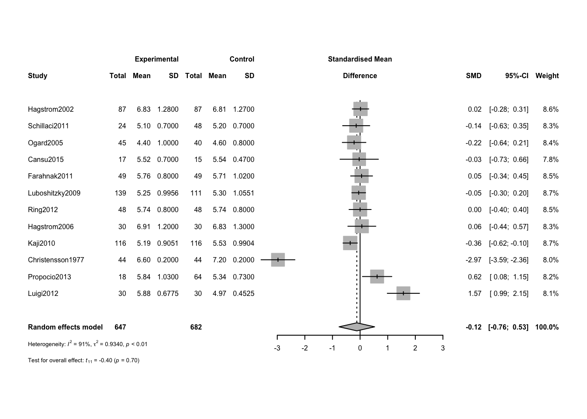

## Data Souces

Located studies from PubMed searches and checking internal references.  Manually re-calculated cholesterol to mM when presented in mg/dL


::: {.cell}

```{.r .cell-code}
data.sheet <- 'https://docs.google.com/spreadsheets/d/e/2PACX-1vTyvQnc6bLRLGT6QXEMHxiAQVbK_zag_JIAjvYjTMXINcqdkBwglmg_mlj_k9ml9QsrNQl-tZgy8ACl/pub?gid=381583063&single=true&output=csv'
library(readr)
data <- read_csv(data.sheet)#from a google sheet
```
:::


The data can be found in the google sheet https://docs.google.com/spreadsheets/d/e/2PACX-1vTyvQnc6bLRLGT6QXEMHxiAQVbK_zag_JIAjvYjTMXINcqdkBwglmg_mlj_k9ml9QsrNQl-tZgy8ACl/pub?gid=381583063&single=true&output=csv.  This script can be found in /Users/davebrid/Documents/GitHub/PrecisionNutrition/Meta Analysis and was most recently run on Mon Dec  5 11:33:03 2022

## Meta Analysis

Analysed data from mean +/- SD of cases and controls


::: {.cell}

```{.r .cell-code}
library(meta)
analysis <- metacont(data=data,
                    n.e=PTH_n,
                    n.c=Controls_n,
                    mean.e=PTH_mean,
                    mean.c=Controls_mean,
                    sd.e=PTH_SD,
                    sd.c=Controls_SD,
                    studlab = Study,
                    method.smd="Hedges",
                    sm="SMD",
                    fixed=FALSE,
                    random=TRUE,
                    method.tau="REML",
                    hakn=TRUE,
                    title="pPTH on Cholesterol")

forest.meta(analysis,
            fontsize=6)
```

::: {.cell-output-display}
{width=672}
:::
:::


# Analysis

There is no evidence that primary hyperparathyroidism results in elevated total cholesterol from case-control studies.

# Session Information


::: {.cell}

```{.r .cell-code}
sessionInfo()
```

::: {.cell-output .cell-output-stdout}
```
R version 4.2.0 (2022-04-22)
Platform: x86_64-apple-darwin17.0 (64-bit)
Running under: macOS Big Sur/Monterey 10.16

Matrix products: default
BLAS:   /Library/Frameworks/R.framework/Versions/4.2/Resources/lib/libRblas.0.dylib
LAPACK: /Library/Frameworks/R.framework/Versions/4.2/Resources/lib/libRlapack.dylib

locale:
[1] en_US.UTF-8/en_US.UTF-8/en_US.UTF-8/C/en_US.UTF-8/en_US.UTF-8

attached base packages:
[1] stats     graphics  grDevices utils     datasets  methods   base     

other attached packages:
[1] meta_6.0-0  readr_2.1.3 knitr_1.41 

loaded via a namespace (and not attached):
 [1] Rcpp_1.0.9         mathjaxr_1.6-0     nloptr_2.0.3       pillar_1.8.1      
 [5] compiler_4.2.0     tools_4.2.0        metadat_1.2-0      boot_1.3-28       
 [9] lme4_1.1-31        digest_0.6.30      bit_4.0.5          nlme_3.1-160      
[13] lattice_0.20-45    jsonlite_1.8.3     evaluate_0.18      lifecycle_1.0.3   
[17] tibble_3.1.8       pkgconfig_2.0.3    rlang_1.0.6        Matrix_1.5-3      
[21] cli_3.4.1          rstudioapi_0.14    curl_4.3.3         yaml_2.3.6        
[25] parallel_4.2.0     CompQuadForm_1.4.3 xfun_0.35          fastmap_1.1.0     
[29] xml2_1.3.3         metafor_3.8-1      stringr_1.4.1      vctrs_0.5.1       
[33] htmlwidgets_1.5.4  hms_1.1.2          bit64_4.0.5        grid_4.2.0        
[37] tidyselect_1.2.0   glue_1.6.2         R6_2.5.1           fansi_1.0.3       
[41] vroom_1.6.0        rmarkdown_2.18     minqa_1.2.5        tzdb_0.3.0        
[45] magrittr_2.0.3     MASS_7.3-58.1      splines_4.2.0      ellipsis_0.3.2    
[49] htmltools_0.5.3    utf8_1.2.2         stringi_1.7.8      crayon_1.5.2      
```
:::
:::
