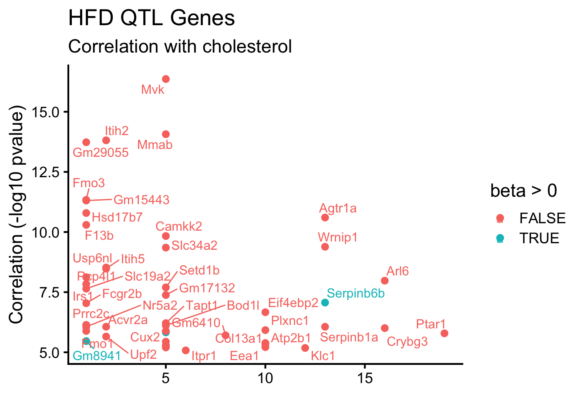
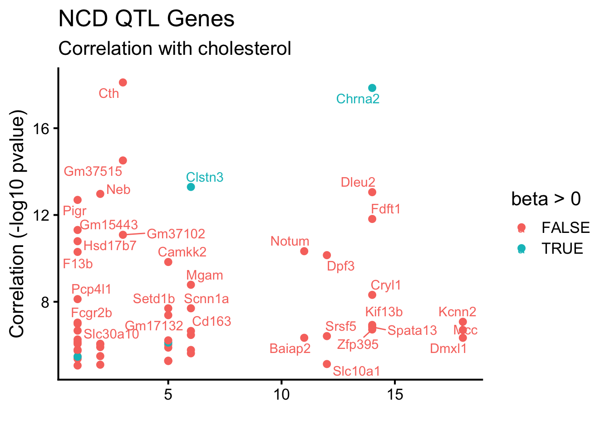
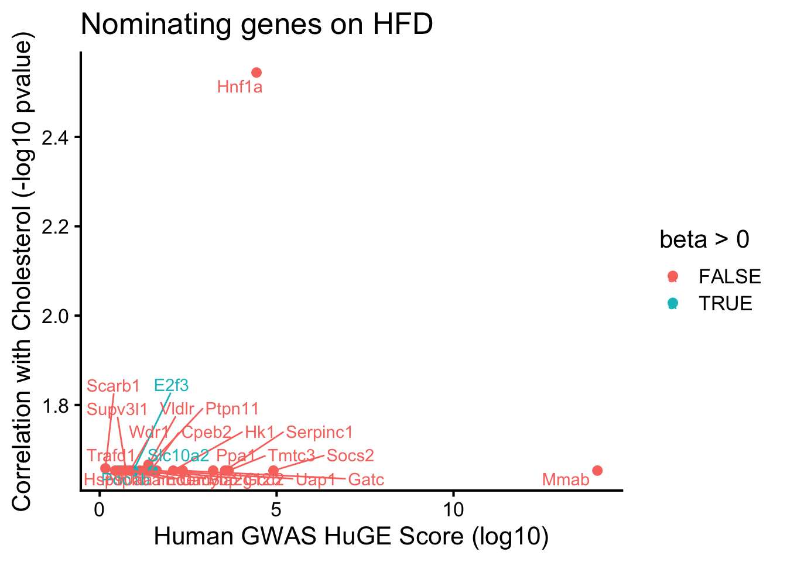
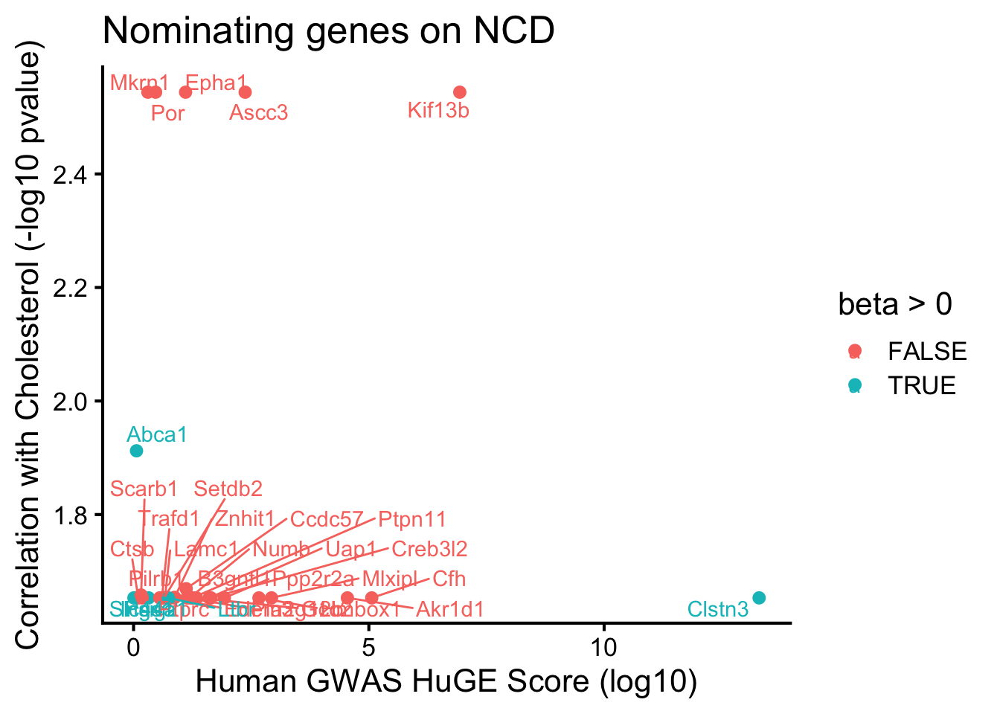

This file is for looking at genes within the clumped QTL regions for NCD and HFD, and cross-referencing these against TWAS results. This script was last run on Sun Dec 21 09:42:13 2025 and can be found in /Users/davebrid/Documents/GitHub/PrecisionNutrition/Mouse Genetics/Cholesterol/GWAS.

## Data  Entry

Loaded in clumping data and TWAS data

## Load Clumping Data

This is long-format annotated clump data for NCD or HFD GWAS


::: {.cell}

```{.r .cell-code}
ncd.clump.filename <- 'ld-calculations/Annotated Gene Clumps NCD QTLs.csv'
hfd.clump.filename <- 'ld-calculations/Annotated Gene Clumps HFD QTLs.csv'

library(readr)
ncd.clump.data <- read_csv(ncd.clump.filename)
hfd.clump.data <- read_csv(hfd.clump.filename)
```
:::


## Loaded in Human Cholesterol Data


::: {.cell}

```{.r .cell-code}
library(forcats)
library(dplyr)
library(tidyr)
human.mouse.mapping.filename <- 'HOM_MouseHumanSequence.rpt'
mouse.human.mapping <- read_tsv(human.mouse.mapping.filename) |>
  select(`DB Class Key`,Symbol,`Common Organism Name`) |>
  rename(Species = `Common Organism Name`) |>
  mutate(Species = fct_recode(as.factor(Species),
                              human='human',
                              mouse='mouse, laboratory')) |>
  pivot_wider(id_cols=`DB Class Key`,
              names_from=Species,
              values_from=Symbol,
              values_fn=first)

human.cholesterol.filename <- 'gene_associations_total_cholesterol.csv'
human.cholesterol.data <- read_csv(human.cholesterol.filename) |>
  left_join(mouse.human.mapping,
            by=c('gene'='human')) |>
  rename(gene_mouse = mouse)
```
:::


### TWAS Data


::: {.cell}

```{.r .cell-code}
twas.all.filename <- 'Cholesterol - Expression Associations - Linear Model.csv'
library(dplyr)
library(knitr)
twas.all.data <- read_csv(twas.all.filename) %>%
  mutate(t.statistic=sqrt(abs(r2))*sqrt((478-2)/(1-r2)),
         BF=sqrt(478/2)*exp((t.statistic^2)/2)) |>
  left_join(human.cholesterol.data |> select(gene_mouse,bf_common,bf_rare,huge),
            by=c('symbol'='gene_mouse'))

#using twas data, dont have lm data yet
twas.hfd.data <- read_csv('Cholesterol TWAS - HFD Only - Sex Adjusted.csv')
twas.ncd.data <- read_csv('Cholesterol TWAS - NCD Only - Sex Adjusted.csv')
```
:::


Calculated an approximate Bayes factor according to this formula from Bartos and Wagenmakers (https://doi.org/10.1002/sta4.600)

$$t = r \sqrt{\frac{n-2}{1-r^2}}$$
$$ BF \approx \sqrt{\frac{n}{2}} \cdot e^{t^2/2} \ $$
 
## Top Hits with Human Evidence


::: {.cell}

```{.r .cell-code}
twas.all.data %>%
  filter(!(is.na(huge))) %>%
  arrange(-huge,-BF) %>%
  filter(pval<0.05) %>%
  select(symbol,beta,se,r2,BF,pval,huge,chr,start.true) %>%
  head(25) %>%
  kable(caption="Top TWAS hits with human evidence from Type 2 Diabetes Knowledge Portal")
```

::: {.cell-output-display}


Table: Top TWAS hits with human evidence from Type 2 Diabetes Knowledge Portal

|symbol    |       beta|        se|        r2|           BF|      pval|     huge|chr | start.true|
|:---------|----------:|---------:|---------:|------------:|---------:|--------:|:---|----------:|
|Apoh      | -13.908686| 3.4093597| 0.0322105| 4.259457e+04| 0.0000530| 902.7753|11  |  108343354|
|Ldlr      | -13.316654| 2.8038642| 0.0438540| 8.510247e+05| 0.0000027| 762.8057|9   |   21723576|
|Abca6     | -15.545207| 3.3720847| 0.0413090| 4.395062e+05| 0.0000052| 717.4041|11  |  110176820|
|Fgb       |  -8.138551| 2.8579048| 0.0149014| 5.658927e+02| 0.0045965| 385.5009|3   |   83040141|
|Slc27a5   | -14.763216| 3.3991425| 0.0366159| 1.311405e+05| 0.0000172| 366.5396|7   |   12988346|
|Plscr4    |  -7.079956| 2.6183314| 0.0132510| 3.777808e+02| 0.0071001| 360.8304|9   |   92457373|
|Usp8      | -17.859983| 4.0873768| 0.0370686| 1.472941e+05| 0.0000153| 355.9564|2   |  126707328|
|Hbb-bt    |   3.816633| 0.8320338| 0.0408978| 3.951248e+05| 0.0000058| 351.3551|7   |  103812524|
|Hbb-bs    |   4.055409| 0.9277789| 0.0370953| 1.483063e+05| 0.0000152| 351.3551|7   |  103826534|
|Jak2      |  -7.284364| 3.6933509| 0.0061112| 6.679611e+01| 0.0491634| 351.1317|19  |   29251828|
|Myct1     |  -7.774825| 3.1071354| 0.0110702| 2.219469e+02| 0.0126801| 350.7582|10  |    5593728|
|Cps1      | -18.616299| 2.6531024| 0.0930765| 6.267955e+11| 0.0000000| 350.0000|1   |   67123026|
|Kif13b    | -15.099085| 2.8057361| 0.0561502| 2.179095e+07| 0.0000001| 350.0000|14  |   64652531|
|Fgfr4     | -17.084330| 3.2014584| 0.0552334| 1.706114e+07| 0.0000001| 350.0000|13  |   55152640|
|Slc39a8   | -15.375389| 3.1180771| 0.0472624| 2.073342e+06| 0.0000011| 350.0000|3   |  135825279|
|Uap1l1    |   9.146948| 1.9751726| 0.0416882| 4.848714e+05| 0.0000047| 350.0000|2   |   25359889|
|Hnf1a     | -16.314856| 3.9170676| 0.0336134| 6.086892e+04| 0.0000371| 350.0000|5   |  114948980|
|Lrba      | -16.020666| 3.8998373| 0.0326749| 4.793210e+04| 0.0000471| 350.0000|3   |   86224680|
|Hnf4a     | -13.853094| 3.5233840| 0.0298451| 2.338577e+04| 0.0000970| 350.0000|2   |  163506808|
|Cd300lg   | -11.618793| 3.1030821| 0.0269546| 1.128392e+04| 0.0002034| 350.0000|11  |  102041509|
|Serpina1b | -12.250695| 3.2812964| 0.0267921| 1.083247e+04| 0.0002120| 350.0000|12  |  103728156|
|Rbm47     | -13.104253| 3.6999518| 0.0239727| 5.344714e+03| 0.0004372| 350.0000|5   |   66016549|
|Gpam      |   6.392380| 1.9562174| 0.0201761| 2.077703e+03| 0.0011637| 350.0000|19  |   55069734|
|Golga3    | -12.282048| 3.8828763| 0.0188002| 1.477953e+03| 0.0016621| 350.0000|5   |  110176701|
|Golga2    | -14.026952| 4.6382547| 0.0170360| 9.563085e+02| 0.0026298| 350.0000|2   |   32287384|


:::
:::


## TWAS and QTL Hits

First looked for genes in HFD that were in QTL clumps, and also had TWAS associations under any conditions


::: {.cell}

```{.r .cell-code}
library(dplyr)
library(knitr)
twas.all.data %>%
  filter(symbol %in% hfd.clump.data$external_gene_name) %>% #is in a QTL
  #filter(pval<0.05) %>%
  dplyr::select(symbol,beta,se,BF,pval,chr,start.true,end.true) %>%
  arrange(chr,start.true) -> twas.QTL.summary.hfd
nrow(twas.QTL.summary.hfd)
```

::: {.cell-output .cell-output-stdout}

```
[1] 596
```


:::

```{.r .cell-code}
#twas.QTL.summary.hfd %>% kable(caption="Nominally significant TWAS hits inside QTL regions on HFD")
```
:::


### HFD Specific QTLs

#### Chromosome 13 QTL


::: {.cell}

```{.r .cell-code}
twas.QTL.summary.hfd |> filter(chr==13) |>
  arrange(-BF) |>
  kable(caption="TWAS hits in NCD-specific QTL on chromosome 13, sorted by BF", digits=c(1,3,3,1,99,0,0))
```

::: {.cell-output-display}


Table: TWAS hits in NCD-specific QTL on chromosome 13, sorted by BF

|symbol    |    beta|    se|           BF|         pval|chr | start.true| end.true|
|:---------|-------:|-----:|------------:|------------:|:---|----------:|--------:|
|Agtr1a    | -15.897| 2.325| 1.796853e+11| 2.500392e-11|13  |   30336441| 30382867|
|Wrnip1    | -18.523| 2.900| 8.680169e+09| 4.096926e-10|13  |   32802038| 32822609|
|Serpinb6b |   9.806| 1.802| 3.014299e+07| 8.563320e-08|13  |   32965209| 32979067|
|Serpinb1a |  -4.169| 0.836| 2.737724e+06| 8.675233e-07|13  |   32842092| 32851185|
|Foxq1     |  -5.213| 1.452| 6.348600e+03| 3.663418e-04|13  |   31558324| 31560976|
|Cdkal1    | -11.077| 3.200| 4.019900e+03| 5.865143e-04|13  |   29191746| 29855674|
|Dcdc2a    |  -5.484| 1.796| 1.047900e+03| 2.387231e-03|13  |   25056004| 25210706|
|Ripk1     | -10.073| 3.603| 4.876000e+02| 5.392955e-03|13  |   34002363| 34035170|
|Bphl      |  -7.423| 3.174| 1.486000e+02| 1.977461e-02|13  |   34037641| 34074074|
|Uqcrfs1   |  -8.369| 3.717| 1.214000e+02| 2.479991e-02|13  |   30540308| 30545362|
|Nqo2      |  -6.125| 2.843| 9.760000e+01| 3.175643e-02|13  |   33964659| 33988465|
|Exoc2     |  -7.680| 4.291| 4.720000e+01| 7.410977e-02|13  |   30813919| 30974047|
|Dusp22    |   6.407| 3.598| 4.640000e+01| 7.557076e-02|13  |   30659999| 30711231|
|E2f3      |   5.275| 3.307| 3.380000e+01| 1.113563e-01|13  |   29906575| 29985668|
|Serpinb6a |  -4.551| 3.031| 2.920000e+01| 1.339351e-01|13  |   33917918| 34002794|
|Psmg4     |  -1.410| 2.599| 2.210000e+01| 5.876993e-01|13  |   34162964| 34178172|
|Slc22a23  |  -4.921| 3.949| 2.050000e+01| 2.133114e-01|13  |   34179158| 34345182|
|Prl8a1    |  -1.631| 2.234| 1.960000e+01| 4.658490e-01|13  |   27573922| 27582171|
|Tubb2a    |  -0.914| 1.137| 1.850000e+01| 4.214421e-01|13  |   34074301| 34078008|
|Serpinb9  |  -3.234| 2.822| 1.810000e+01| 2.523675e-01|13  |   33003250| 33017957|


:::
:::


#### Chromosome 5 QTL


::: {.cell}

```{.r .cell-code}
twas.QTL.summary.hfd |> filter(chr==5) |>
  arrange(-BF) |>
  kable(caption="TWAS hits in NCD-specific QTL on chromosome 5, sorted by BF", digits=c(1,3,3,1,99,0,0))
```

::: {.cell-output-display}


Table: TWAS hits in NCD-specific QTL on chromosome 5, sorted by BF

|symbol        |    beta|    se|           BF|         pval|chr | start.true|  end.true|
|:-------------|-------:|-----:|------------:|------------:|:---|----------:|---------:|
|Mvk           | -16.141| 1.848| 5.576668e+17| 4.355677e-17|5   |  114444269| 114460591|
|Mmab          | -18.542| 2.312| 1.292696e+15| 8.569911e-15|5   |  114431034| 114444060|
|Camkk2        | -13.152| 2.006| 2.627536e+10| 1.467250e-10|5   |  122731170| 122779409|
|Slc34a2       |  -4.927| 0.773| 7.968718e+09| 4.435994e-10|5   |   53038081|  53071664|
|Setd1b        | -15.726| 2.754| 1.380595e+08| 2.005191e-08|5   |  123142193| 123168629|
|Gm17132       | -13.525| 2.425| 6.434028e+07| 4.147667e-08|5   |  127877333| 127878490|
|Tapt1         | -16.951| 3.352| 3.907922e+06| 6.139314e-07|5   |   44175154|  44226626|
|Bod1l         | -17.113| 3.414| 3.123478e+06| 7.631659e-07|5   |   41787538|  41844315|
|Cux2          |  -2.322| 0.474| 1.810178e+06| 1.298047e-06|5   |  121856366| 122050102|
|Sel1l3        |   8.823| 1.810| 1.577370e+06| 1.484695e-06|5   |   53107083|  53213927|
|Med13l        | -18.356| 3.916| 6.334424e+05| 3.628692e-06|5   |  118560679| 118765438|
|Hip1r         | -12.925| 2.805| 4.352512e+05| 5.249667e-06|5   |  123973628| 124005558|
|Gm17131       | -11.995| 2.603| 4.352135e+05| 5.250114e-06|5   |  127878531| 127882376|
|Prom1         |  -2.911| 0.637| 3.635026e+05| 6.270254e-06|5   |   43993620|  44102032|
|Asl           | -11.878| 2.724| 1.413704e+05| 1.598021e-05|5   |  130011258| 130029247|
|Sepsecs       | -15.604| 3.622| 1.126693e+05| 2.003007e-05|5   |   52640087|  52669708|
|Pxn           | -15.333| 3.606| 8.830400e+04| 2.554090e-05|5   |  115506676| 115555987|
|Hnf1a         | -16.315| 3.917| 6.086890e+04| 3.705519e-05|5   |  114948980| 114971094|
|Fbxo21        |  -7.984| 1.930| 5.408720e+04| 4.171329e-05|5   |  117976730| 118010201|
|Taok3         | -12.077| 2.971| 4.018870e+04| 5.621227e-05|5   |  117120129| 117275219|
|Rsrc2         | -13.975| 3.515| 2.791790e+04| 8.114488e-05|5   |  123728426| 123749414|
|Hpd           |  -9.920| 2.517| 2.430150e+04| 9.335225e-05|5   |  123171807| 123182727|
|Dhx15         | -13.523| 3.539| 1.514300e+04| 1.507702e-04|5   |   52150203|  52190514|
|P2rx4         |  12.556| 3.305| 1.390710e+04| 1.644011e-04|5   |  122707544| 122729738|
|Zcchc8        | -14.983| 3.997| 1.148980e+04| 1.996803e-04|5   |  123698294| 123721100|
|9230114K14Rik |  -9.050| 2.424| 1.082210e+04| 2.122501e-04|5   |   52190672|  52279034|
|Kctd7         | -10.020| 2.711| 9.391000e+03| 2.453201e-04|5   |  130144861| 130155806|
|Abcb9         |   9.702| 2.730| 5.580100e+03| 4.182799e-04|5   |  124061530| 124095798|
|Ubc           |  -7.912| 2.233| 5.375300e+03| 4.346806e-04|5   |  125385965| 125390202|
|Sart3         | -13.280| 3.776| 4.883900e+03| 4.797856e-04|5   |  113742446| 113772510|
|Vps33a        | -12.101| 3.590| 2.935100e+03| 8.123075e-04|5   |  123528659| 123573038|
|Ift81         |  -8.394| 2.509| 2.694200e+03| 8.878488e-04|5   |  122550204| 122614518|
|Atp2a2        |  -8.592| 2.569| 2.684700e+03| 8.911156e-04|5   |  122453513| 122502225|
|Zbed5         |   6.347| 1.958| 1.909000e+03| 1.271312e-03|5   |  129895723| 129903623|
|Oas1a         |   4.267| 1.320| 1.842500e+03| 1.319370e-03|5   |  120896256| 120907521|
|Rbpj          | -13.466| 4.183| 1.772800e+03| 1.373633e-03|5   |   53466152|  53657362|
|Anapc5        | -10.234| 3.331| 1.108900e+03| 2.248799e-03|5   |  122787459| 122821339|
|Tpst1         |  -7.831| 2.576| 1.003700e+03| 2.498629e-03|5   |  130073326| 130135729|
|Sfswap        | -12.521| 4.169| 8.978000e+02| 2.811583e-03|5   |  129501221| 129571384|
|Zfp664        | -12.268| 4.102| 8.645000e+02| 2.926713e-03|5   |  124862691| 124902693|
|Sh2b3         | -11.097| 3.808| 6.861000e+02| 3.741579e-03|5   |  121815488| 121837646|
|Tchp          |  -9.441| 3.261| 6.502000e+02| 3.962740e-03|5   |  114707760| 114722327|
|Gatc          | -10.267| 3.596| 5.779000e+02| 4.494008e-03|5   |  115333239| 115341178|
|Ddx55         |  -9.636| 3.398| 5.466000e+02| 4.770107e-03|5   |  124552864| 124569660|
|Ddx54         | -10.775| 3.803| 5.431000e+02| 4.803159e-03|5   |  120612739| 120628592|
|Crcp          |  -9.762| 3.454| 5.318000e+02| 4.912559e-03|5   |  130029290| 130060789|
|Fbxl5         |  -9.555| 3.383| 5.285000e+02| 4.945753e-03|5   |   43744615|  43821638|
|Aldh2         | -10.153| 3.600| 5.237000e+02| 4.994004e-03|5   |  121566027| 121593824|
|Cd38          |  -7.430| 2.670| 4.698000e+02| 5.612101e-03|5   |   43868553|  43912375|
|Gm38102       |  -7.864| 2.840| 4.521000e+02| 5.849884e-03|5   |  123133939| 123137695|
|Mphosph9      | -10.901| 3.999| 4.013000e+02| 6.651337e-03|5   |  124250959| 124327972|
|Sbno1         | -12.163| 4.472| 3.945000e+02| 6.775843e-03|5   |  124368702| 124426001|
|Pitpnm2       |  -9.547| 3.564| 3.525000e+02| 7.652854e-03|5   |  124118690| 124249760|
|Rabgef1       |  -9.043| 3.407| 3.303000e+02| 8.211970e-03|5   |  130171798| 130214342|
|Slc2a9        |  -8.340| 3.214| 2.817000e+02| 9.764533e-03|5   |   38349273|  38503143|
|Ube3b         | -10.990| 4.309| 2.511000e+02| 1.107256e-02|5   |  114380607| 114421169|
|Vsig10        |  -5.429| 2.150| 2.355000e+02| 1.188113e-02|5   |  117319083| 117355005|
|Git2          | -10.660| 4.235| 2.304000e+02| 1.217173e-02|5   |  114727407| 114775517|
|Dhx37         |  -9.054| 3.619| 2.217000e+02| 1.269581e-02|5   |  125413858| 125434121|
|Ncor2         |  -7.523| 3.026| 2.129000e+02| 1.327538e-02|5   |  125017153| 125179219|
|Naa25         |  -8.541| 3.501| 1.898000e+02| 1.506872e-02|5   |  121397936| 121444378|
|Atxn2         |  -9.940| 4.076| 1.893000e+02| 1.511287e-02|5   |  121711337| 121816493|
|AI480526      |  -7.808| 3.212| 1.856000e+02| 1.544264e-02|5   |  123133723| 123141666|
|Pop5          |  -6.893| 2.869| 1.731000e+02| 1.668687e-02|5   |  115235836| 115245351|
|Unc119b       |  -9.074| 3.805| 1.661000e+02| 1.747416e-02|5   |  115122550| 115134975|
|Caln1         |   4.953| 2.096| 1.573000e+02| 1.855489e-02|5   |  130369455| 130847412|
|Rbm19         |  -9.047| 3.863| 1.499000e+02| 1.958758e-02|5   |  120116465| 120198981|
|Cct6a         |  -6.977| 3.038| 1.346000e+02| 2.209421e-02|5   |  129786998| 129846371|
|Rilpl1        |  -6.870| 3.035| 1.248000e+02| 2.405235e-02|5   |  124493080| 124531391|
|Coro1c        |  -9.565| 4.248| 1.214000e+02| 2.481289e-02|5   |  113842436| 113908758|
|Acacb         |   2.824| 1.266| 1.157000e+02| 2.618175e-02|5   |  114146535| 114250761|
|Glt1d1        |  -5.475| 2.457| 1.152000e+02| 2.633152e-02|5   |  127632262| 127709374|
|Tbc1d19       |  -6.111| 2.743| 1.150000e+02| 2.637925e-02|5   |   53809606|  53903965|
|Mlxip         |  -8.375| 3.760| 1.149000e+02| 2.639922e-02|5   |  123394798| 123457932|
|Vps37b        |  -6.012| 2.779| 9.970000e+01| 3.101032e-02|5   |  124004641| 124032270|
|Oas1g         |   2.677| 1.241| 9.840000e+01| 3.148328e-02|5   |  120876142| 120887613|
|Usp30         |  -9.921| 4.635| 9.480000e+01| 3.284384e-02|5   |  114065461| 114124720|
|Cc2d2a        |  -4.826| 2.269| 9.200000e+01| 3.396728e-02|5   |   43662346|  43740972|
|Pptc7         |  -7.548| 3.551| 9.180000e+01| 3.408238e-02|5   |  122284365| 122324281|
|Atp6v0a2      |   8.880| 4.215| 8.820000e+01| 3.564872e-02|5   |  124628576| 124724455|
|Cpeb2         |  -6.290| 2.990| 8.760000e+01| 3.594914e-02|5   |   43233170|  43289724|
|Ankrd13a      |  -7.012| 3.377| 8.260000e+01| 3.842950e-02|5   |  114774677| 114806200|
|Ppp1cc        |  -7.460| 3.602| 8.180000e+01| 3.889961e-02|5   |  122158278| 122175273|
|Sirt4         |  -7.006| 3.418| 7.820000e+01| 4.094593e-02|5   |  115478010| 115484725|
|Acad12        |   3.576| 1.775| 7.270000e+01| 4.454744e-02|5   |  121596775| 121618938|
|P2rx7         |   3.065| 1.546| 6.820000e+01| 4.800536e-02|5   |  122643911| 122691432|
|Denr          |  -6.426| 3.252| 6.730000e+01| 4.870435e-02|5   |  123907175| 123928835|
|Cmklr1        |  -4.302| 2.189| 6.590000e+01| 4.994669e-02|5   |  113612354| 113650426|
|Zcchc4        |  -7.242| 3.751| 6.150000e+01| 5.410233e-02|5   |   52775409|  52824665|
|Ptpn11        |  -8.687| 4.537| 5.960000e+01| 5.616551e-02|5   |  121130533| 121191397|
|Srrm4         |  -3.352| 1.777| 5.640000e+01| 5.991296e-02|5   |  116439275| 116591817|
|Bcl7a         |  -7.406| 3.948| 5.540000e+01| 6.125575e-02|5   |  123343834| 123374992|
|Kdm2b         |  -5.040| 2.705| 5.400000e+01| 6.306970e-02|5   |  122870665| 122989823|
|Srsf9         |  -6.048| 3.308| 5.060000e+01| 6.818065e-02|5   |  115327177| 115333080|
|Kctd10        |  -6.444| 3.589| 4.770000e+01| 7.320036e-02|5   |  114363567| 114380508|
|Tpcn1         |  -5.791| 3.392| 4.080000e+01| 8.838425e-02|5   |  120534153| 120588673|
|Oasl2         |   2.545| 1.566| 3.550000e+01| 1.048222e-01|5   |  114896936| 114912234|
|Eif2b1        |  -6.187| 3.845| 3.460000e+01| 1.082598e-01|5   |  124570213| 124579131|
|Gtf2h3        |  -5.586| 3.609| 3.130000e+01| 1.224195e-01|5   |  124579140| 124597680|
|Rnf34         |  -5.846| 3.787| 3.110000e+01| 1.233435e-01|5   |  122850048| 122871291|
|Oasl1         |   2.800| 1.815| 3.110000e+01| 1.236685e-01|5   |  114923240| 114937915|
|Arl6ip4       |  -5.027| 3.266| 3.090000e+01| 1.245174e-01|5   |  124116089| 124118196|
|Stim2         |  -5.279| 3.517| 2.920000e+01| 1.340723e-01|5   |   53998499|  54121057|
|Slc8b1        |  -4.243| 2.836| 2.890000e+01| 1.352727e-01|5   |  120511168| 120534024|
|Wdr1          |  -5.606| 3.766| 2.860000e+01| 1.372629e-01|5   |   38526813|  38563221|
|Sds           |  -3.163| 2.150| 2.790000e+01| 1.419701e-01|5   |  120476526| 120483932|
|Anapc7        |  -5.598| 3.841| 2.730000e+01| 1.455875e-01|5   |  122421693| 122444912|
|Pi4k2b        |  -4.260| 3.001| 2.580000e+01| 1.564998e-01|5   |   52741574|  52769340|
|Tmem248       |  -5.042| 3.554| 2.580000e+01| 1.566287e-01|5   |  130217081| 130243765|
|Cdk2ap1       |   0.006| 3.276| 2.570000e+01| 9.984571e-01|5   |  124345417| 124363082|
|Alkbh2        |   0.057| 1.873| 2.560000e+01| 9.759447e-01|5   |  114123926| 114128218|
|2900026A02Rik |  -0.175| 3.692| 2.560000e+01| 9.622187e-01|5   |  113086323| 113163351|
|Ogfod2        |   0.255| 3.480| 2.560000e+01| 9.416259e-01|5   |  124112297| 124115483|
|Orai1         |  -0.356| 2.908| 2.550000e+01| 9.025850e-01|5   |  123015074| 123030456|
|Suds3         |  -0.746| 3.718| 2.510000e+01| 8.410735e-01|5   |  117091680| 117116113|
|Psph          |   0.661| 2.640| 2.490000e+01| 8.025204e-01|5   |  129765558| 129787449|
|Plbd2         |  -1.194| 4.074| 2.460000e+01| 7.696566e-01|5   |  120483282| 120503625|
|Cox6a1        |   0.908| 2.926| 2.440000e+01| 7.564879e-01|5   |  115345642| 115348981|
|Triap1        |   1.085| 3.493| 2.440000e+01| 7.562789e-01|5   |  115341225| 115343569|
|Ssh1          |   1.305| 4.115| 2.440000e+01| 7.513414e-01|5   |  113937094| 113993894|
|Rita1         |  -1.150| 3.268| 2.410000e+01| 7.251697e-01|5   |  120594305| 120612589|
|Gltp          |  -0.854| 2.424| 2.410000e+01| 7.248246e-01|5   |  114669398| 114690984|
|Gpn3          |  -1.108| 3.042| 2.400000e+01| 7.159435e-01|5   |  122371876| 122382902|
|Acad10        |  -3.653| 2.674| 2.400000e+01| 1.725622e-01|5   |  121621026| 121660514|
|Aacs          |  -2.069| 1.518| 2.390000e+01| 1.734606e-01|5   |  125475814| 125517410|
|Scarb1        |  -1.315| 3.308| 2.370000e+01| 6.912268e-01|5   |  125277087| 125341094|
|Tmem120b      |  -1.169| 2.914| 2.360000e+01| 6.884678e-01|5   |  123068415| 123117749|
|Ung           |  -0.882| 2.200| 2.360000e+01| 6.884520e-01|5   |  114130386| 114139323|
|Fam216a       |   0.905| 2.205| 2.360000e+01| 6.817719e-01|5   |  122364580| 122372364|
|Fbxw8         |  -1.696| 4.101| 2.350000e+01| 6.794722e-01|5   |  118064965| 118155464|
|Gm15690       |  -0.720| 1.667| 2.330000e+01| 6.661159e-01|5   |  120479842| 120480903|
|Mrps17        |  -4.828| 3.587| 2.330000e+01| 1.789680e-01|5   |  129715497| 129722556|
|Erp29         |   1.502| 3.455| 2.330000e+01| 6.638841e-01|5   |  121428590| 121452506|
|Vps29         |  -4.824| 3.635| 2.270000e+01| 1.851103e-01|5   |  122354369| 122364984|
|Sod3          |  -0.856| 1.697| 2.260000e+01| 6.142007e-01|5   |   52363791|  52371418|
|Prkab1        |  -3.965| 3.004| 2.250000e+01| 1.875494e-01|5   |  116013586| 116024508|
|Mapkapk5      |  -1.890| 3.445| 2.200000e+01| 5.836202e-01|5   |  121525038| 121545905|
|Rad9b         |  -0.687| 1.242| 2.200000e+01| 5.805192e-01|5   |  122323223| 122354233|
|Acads         |   2.043| 3.623| 2.180000e+01| 5.730640e-01|5   |  115110299| 115119346|
|Chchd2        |  -4.020| 3.103| 2.180000e+01| 1.957696e-01|5   |  129881156| 129887470|
|Wsb2          |   2.490| 4.337| 2.170000e+01| 5.660648e-01|5   |  117357304| 117378601|
|Sumf2         |   1.846| 3.186| 2.160000e+01| 5.625547e-01|5   |  129846986| 129864050|
|Clip1         |  -5.528| 4.304| 2.150000e+01| 1.996518e-01|5   |  123577795| 123684618|
|Hnf1aos1      |   0.579| 0.965| 2.140000e+01| 5.489051e-01|5   |  114968784| 114998042|
|Rab35         |  -5.093| 4.010| 2.110000e+01| 2.047287e-01|5   |  115631908| 115647736|
|Smim20        |   2.432| 3.895| 2.110000e+01| 5.327282e-01|5   |   53267083|  53278540|
|Diablo        |  -4.369| 3.507| 2.040000e+01| 2.134905e-01|5   |  123509765| 123525488|
|Rnf10         |  -5.001| 4.039| 2.030000e+01| 2.161985e-01|5   |  115241412| 115272898|
|Brap          |  -2.531| 3.579| 1.990000e+01| 4.797585e-01|5   |  121660563| 121687256|
|Tmed2         |  -3.052| 4.143| 1.950000e+01| 4.617541e-01|5   |  124540695| 124550506|
|Sppl3         |  -5.103| 4.234| 1.940000e+01| 2.287175e-01|5   |  115011137| 115098790|
|Coq5          |  -4.242| 3.534| 1.930000e+01| 2.306369e-01|5   |  115279666| 115296972|
|Selplg        |   1.460| 1.933| 1.920000e+01| 4.505552e-01|5   |  113818536| 113832644|
|Hspb8         |  -3.525| 2.950| 1.920000e+01| 2.328430e-01|5   |  116408491| 116422864|
|Rab28         |  -4.272| 3.586| 1.910000e+01| 2.341797e-01|5   |   41624976|  41708157|
|Tyw1          |   3.080| 4.034| 1.910000e+01| 4.454827e-01|5   |  130255619| 130341563|
|Sdsl          |   2.189| 2.818| 1.890000e+01| 4.377405e-01|5   |  120458186| 120472810|
|Rfc5          |  -4.089| 3.472| 1.880000e+01| 2.394921e-01|5   |  117378103| 117389047|
|Rpl37rt       |  -0.488| 0.611| 1.860000e+01| 4.249593e-01|5   |  115102923| 115110268|
|2210016L21Rik |  -4.221| 3.628| 1.850000e+01| 2.452246e-01|5   |  114942158| 114949783|
|Trafd1        |  -3.700| 3.216| 1.820000e+01| 2.504680e-01|5   |  121371725| 121385632|
|Pebp1         |  -3.002| 2.610| 1.820000e+01| 2.505614e-01|5   |  117282654| 117287625|
|Ficd          |  -2.129| 2.585| 1.820000e+01| 4.104596e-01|5   |  113735803| 113740600|
|Oas1b         |   2.289| 2.002| 1.810000e+01| 2.535036e-01|5   |  120812635| 120824163|
|Rps16-ps2     |   0.369| 0.444| 1.810000e+01| 4.054455e-01|5   |  129128077| 129128517|
|Stx2          |   4.070| 3.573| 1.800000e+01| 2.553021e-01|5   |  128984557| 129008574|
|Ccdc62        |  -2.171| 2.579| 1.790000e+01| 4.001883e-01|5   |  123930679| 123969895|
|Dynll1        |  -2.511| 2.248| 1.750000e+01| 2.646143e-01|5   |  115297110| 115300999|
|Rplp0         |  -3.065| 3.526| 1.750000e+01| 3.851629e-01|5   |  115559467| 115563727|
|Slc15a4       |  -2.607| 2.354| 1.730000e+01| 2.686302e-01|5   |  127595664| 127632897|
|Anapc4        |  -3.676| 3.432| 1.670000e+01| 2.846865e-01|5   |   52834012|  52867797|
|Snrnp35       |   2.918| 2.740| 1.650000e+01| 2.874432e-01|5   |  124483134| 124491124|
|Tctn1         |  -3.683| 3.481| 1.640000e+01| 2.906149e-01|5   |  122237848| 122264460|
|Ran           |  -3.045| 3.207| 1.630000e+01| 3.429326e-01|5   |  129020069| 129024323|
|Rpl6          |  -3.298| 3.170| 1.610000e+01| 2.986873e-01|5   |  121204481| 121209241|
|Sbds          |  -3.662| 3.545| 1.600000e+01| 3.021322e-01|5   |  130245731| 130255530|
|Rilpl2        |  -3.437| 3.555| 1.600000e+01| 3.340704e-01|5   |  124463265| 124478366|
|Gusb          |   3.679| 3.590| 1.590000e+01| 3.059606e-01|5   |  129989011| 130003049|
|Bri3bp        |  -3.046| 3.107| 1.580000e+01| 3.274162e-01|5   |  125441568| 125460370|
|Psmd9         |  -3.241| 3.304| 1.580000e+01| 3.270894e-01|5   |  123169413| 123250131|
|Iscu          |   3.177| 3.210| 1.560000e+01| 3.228053e-01|5   |  113772748| 113778288|
|Mlec          |   2.927| 2.952| 1.560000e+01| 3.218615e-01|5   |  115142981| 115158179|
|Vkorc1l1      |   3.960| 3.988| 1.560000e+01| 3.211672e-01|5   |  129941970| 129986692|
|Arpc3         |  -3.450| 3.447| 1.550000e+01| 3.174613e-01|5   |  122391878| 122414184|


:::
:::


## Normal Chow Diet TWAS and QTL Hits

First looked for genes in HFD that were in QTL clumps, and also had TWAS associations under all conditions


::: {.cell}

```{.r .cell-code}
twas.all.data %>%
  filter(symbol %in% ncd.clump.data$external_gene_name) %>% #is in a QTL
  #filter(pval<0.05) %>%
  dplyr::select(symbol,beta,se,BF,pval,chr,start.true,end.true) %>%
  arrange(chr,start.true) -> twas.QTL.summary.ncd
nrow(twas.QTL.summary.ncd)
```

::: {.cell-output .cell-output-stdout}

```
[1] 745
```


:::

```{.r .cell-code}
#twas.QTL.summary.ncd %>% kable(caption="Nominally significant TWAS hits inside QTL regions on NCD")
```
:::


For the chromosome 18 (NCD-specific QTL) the top hits are


::: {.cell}

```{.r .cell-code}
twas.QTL.summary.ncd |> 
  filter(chr==18) |>
  left_join(human.cholesterol.data |> select(gene_mouse,bf_common,bf_rare,huge),
            by=c('symbol'='gene_mouse')) |>
  arrange(-BF) |> 
  kable(caption="TWAS hits in NCD-specific QTL on chromosome 18, sorted by BF")
```

::: {.cell-output-display}


Table: TWAS hits in NCD-specific QTL on chromosome 18, sorted by BF

|symbol  |       beta|        se|           BF|      pval|chr | start.true| end.true| bf_common| bf_rare| huge|
|:-------|----------:|---------:|------------:|---------:|:---|----------:|--------:|---------:|-------:|----:|
|Kcnn2   | -17.365697| 3.1894318| 3.082363e+07| 0.0000001|18  |   45268860| 45686024|        NA|      NA|   NA|
|Mcc     | -14.665844| 2.7789693| 1.242611e+07| 0.0000002|18  |   44425060| 44812182|        NA|      NA|   NA|
|Dmxl1   | -16.540550| 3.2338647| 5.279756e+06| 0.0000005|18  |   49832670| 49965473|        NA|      NA|   NA|
|Cdo1    | -10.423712| 2.6631628| 2.179571e+04| 0.0001042|18  |   46713205| 46728342|        NA|      NA|   NA|
|Tcerg1  | -12.041842| 3.3512814| 6.437031e+03| 0.0003612|18  |   42511510| 42575551|        NA|      NA|   NA|
|Pggt1b  |  -8.989326| 3.2668702| 4.309549e+02| 0.0061590|18  |   46239949| 46280850|        NA|      NA|   NA|
|Fem1c   | -10.311275| 3.8929393| 3.252088e+02| 0.0083524|18  |   46501746| 46525971|        NA|      NA|   NA|
|Ythdc2  |  -7.773632| 3.3252239| 1.483143e+02| 0.0198184|18  |   44827746| 44889724|        NA|      NA|   NA|
|Dcp2    |  -9.187939| 3.9550669| 1.432581e+02| 0.0206017|18  |   44380502| 44424969|        NA|      NA|   NA|
|Commd10 |  -4.699061| 2.7203130| 4.221795e+01| 0.0847547|18  |   46958862| 47087992|        NA|      NA|   NA|
|Ap3s1   |   5.295224| 3.1032238| 4.070171e+01| 0.0886026|18  |   46741917| 46790826|        NA|      NA|   NA|
|Atg12   |  -5.657356| 3.5890469| 3.278738e+01| 0.1156347|18  |   46732417| 46741579|        NA|      NA|   NA|
|Tmed7   |  -5.326377| 3.5594534| 2.895528e+01| 0.1352213|18  |   46560235| 46597535|        NA|      NA|   NA|
|Gm3650  |   1.315251| 0.8937922| 2.789328e+01| 0.1418157|18  |   43472816| 43475169|        NA|      NA|   NA|
|Eif3j2  |  -4.670281| 3.2012572| 2.737454e+01| 0.1452649|18  |   43475418| 43477796|        NA|      NA|   NA|
|Sema6a  |  -4.388689| 3.0594824| 2.641186e+01| 0.1521090|18  |   47235598| 47368870|        NA|      NA|   NA|
|Dtwd2   |  -2.762396| 3.3932563| 1.833878e+01| 0.4160100|18  |   49696145| 49755601|        NA|      NA|   NA|
|Tnfaip8 |  -2.217297| 2.2649550| 1.578907e+01| 0.3281052|18  |   49979427| 50107173|        NA|      NA|   NA|
|Eif1a   |  -2.435114| 2.4852013| 1.577518e+01| 0.3276675|18  |   46597704| 46610225|        NA|      NA|   NA|


:::
:::

Manually searched these for associations in the Type 2 Diabetes knowledge portal, listing their BFs (rare + common, most of the contribution to the BF is from common variants):

- *Mcc*: HDL-C - 	51.69 (total cholesterol $<$1)
- *Tcerg1*: HDL-C 45.02; Total cholesterol 45
- *Ythdc2*: HDL-C and triglycerides 45
- *Dcp2*: HDL-C (3) and triglycerides  
- *Dmxl1*: 1.42
- *Fem1c* 1.01


### Overlap between NCD and HFD TWAS QTL hits 


::: {.cell}

```{.r .cell-code}
intersect(twas.QTL.summary.hfd$symbol, twas.QTL.summary.ncd$symbol) %>%
  length()
```

::: {.cell-output .cell-output-stdout}

```
[1] 214
```


:::

```{.r .cell-code}
twas.hfd.data %>%
  filter(symbol %in% ncd.clump.data$external_gene_name) %>% #is in a QTL
  filter(pvalue<0.05) %>%
  dplyr::select(symbol,log2FoldChange,lfcSE,pvalue,padj,chr,start.true,end.true)%>%
  arrange(chr,start.true) -> twas.QTL.summary.hfd.diet
nrow(twas.QTL.summary.hfd.diet)
```

::: {.cell-output .cell-output-stdout}

```
[1] 88
```


:::

```{.r .cell-code}
twas.QTL.summary.hfd.diet %>%
  kable(caption="Nominally significant TWAS hits inside QTL regions on ")
```

::: {.cell-output-display}


Table: Nominally significant TWAS hits inside QTL regions on 

|symbol        | log2FoldChange|     lfcSE|    pvalue|      padj|chr | start.true|  end.true|
|:-------------|--------------:|---------:|---------:|---------:|:---|----------:|---------:|
|Nifk          |     -0.0506763| 0.0223161| 0.0231564| 0.3356404|1   |  118321839| 118333822|
|3110009E18Rik |     -0.0949011| 0.0475483| 0.0459463| 0.4136252|1   |  120121187| 120188189|
|Marco         |      0.3904106| 0.1487229| 0.0086627| 0.2554948|1   |  120474538| 120505024|
|Insig2        |     -0.0953302| 0.0459599| 0.0380604| 0.3956228|1   |  121304353| 121332589|
|Ikbke         |      0.0733426| 0.0291397| 0.0118381| 0.2747565|1   |  131254343| 131279606|
|Srgap2        |      0.0474709| 0.0206319| 0.0213999| 0.3246424|1   |  131285251| 131527352|
|Ctse          |      0.2760881| 0.1315515| 0.0358427| 0.3861734|1   |  131638306| 131675505|
|Pm20d1        |      0.1020898| 0.0465489| 0.0282951| 0.3595812|1   |  131797381| 131821473|
|Slc41a1       |      0.0694023| 0.0344402| 0.0438886| 0.4076766|1   |  131827493| 131848865|
|Nuak2         |     -0.0833710| 0.0265210| 0.0016689| 0.1780157|1   |  132316126| 132333488|
|Adora1        |      0.1164115| 0.0471011| 0.0134538| 0.2827333|1   |  134199223| 134235431|
|Rabif         |     -0.0330875| 0.0126729| 0.0090310| 0.2597073|1   |  134494648| 134508774|
|Gm37903       |      0.1084034| 0.0508941| 0.0331732| 0.3762117|1   |  137528850| 137531230|
|F13b          |     -0.0413537| 0.0180000| 0.0215939| 0.3264962|1   |  139501702| 139523752|
|Cfhr3         |     -0.1706295| 0.0640713| 0.0077420| 0.2523863|1   |  139584783| 139660899|
|Gm8941        |      0.1811721| 0.0523626| 0.0005403| 0.1152539|1   |  151136507| 151137780|
|Ivns1abp      |      0.0622842| 0.0229798| 0.0067205| 0.2443709|1   |  151344477| 151364422|
|Swt1          |     -0.0466786| 0.0224941| 0.0379731| 0.3956228|1   |  151367699| 151428455|
|Tsen15        |     -0.1099456| 0.0334725| 0.0010211| 0.1555901|1   |  152370735| 152386688|
|Ncf2          |      0.0848810| 0.0419721| 0.0431432| 0.4046446|1   |  152800194| 152836991|
|Rnasel        |      0.0992414| 0.0381792| 0.0093399| 0.2642052|1   |  153749426| 153764221|
|Gm7694        |      0.1273335| 0.0380330| 0.0008140| 0.1425552|1   |  170298199| 170306332|
|Nos1ap        |      0.1047939| 0.0484713| 0.0306200| 0.3707245|1   |  170302668| 170589861|
|Fcgr3         |      0.0713595| 0.0339615| 0.0356245| 0.3850991|1   |  171051174| 171064935|
|Nr1i3         |      0.1101385| 0.0490380| 0.0247051| 0.3454892|1   |  171213970| 171220701|
|Tomm40l       |      0.0835892| 0.0304362| 0.0060258| 0.2379691|1   |  171216011| 171222514|
|Nit1          |     -0.0263516| 0.0112304| 0.0189525| 0.3134661|1   |  171338008| 171345646|
|Arhgap30      |      0.0778587| 0.0394527| 0.0484424| 0.4204712|1   |  171388954| 171410298|
|Alyref2       |     -0.0570725| 0.0260701| 0.0285827| 0.3595812|1   |  171503478| 171504750|
|Gm10171       |      0.2646169| 0.1103935| 0.0165285| 0.3046139|1   |  172144274| 172144901|
|Igsf8         |      0.0814814| 0.0289384| 0.0048674| 0.2275245|1   |  172261641| 172319841|
|Tagln2        |      0.0795048| 0.0381941| 0.0373789| 0.3919272|1   |  172500047| 172507380|
|Tlr5          |      0.1165295| 0.0483720| 0.0159952| 0.3017221|1   |  182954788| 182976044|
|Slc30a10      |     -0.1347604| 0.0479244| 0.0049244| 0.2283544|1   |  185454848| 185468762|
|Gopc          |     -0.0433182| 0.0165425| 0.0088291| 0.2559334|10  |   52337024|  52382124|
|Cep85l        |      0.0945755| 0.0458811| 0.0392730| 0.3960657|10  |   53278081|  53379851|
|Tbc1d32       |      0.0663140| 0.0269540| 0.0138832| 0.2878868|10  |   56014298|  56228689|
|Hsf2          |     -0.0505604| 0.0181816| 0.0054216| 0.2313141|10  |   57486385|  57513133|
|Serinc1       |     -0.0400168| 0.0146497| 0.0063033| 0.2379691|10  |   57515774|  57532530|
|Sowahc        |      0.0873625| 0.0403739| 0.0304769| 0.3697996|10  |   59221953|  59226434|
|Tmc6          |      0.0721993| 0.0300006| 0.0161021| 0.3026062|11  |  117765988| 117782198|
|Cant1         |      0.0313108| 0.0145683| 0.0316153| 0.3724834|11  |  118406289| 118419086|
|Tbc1d16       |      0.0580361| 0.0233147| 0.0128013| 0.2797472|11  |  119143045| 119228499|
|Rnf113a2      |     -0.0480108| 0.0189246| 0.0111824| 0.2710635|12  |   84417196|  84418578|
|Abcd4         |      0.0468879| 0.0175580| 0.0075750| 0.2523863|12  |   84602531|  84617466|
|Npc2          |      0.0562442| 0.0219807| 0.0105032| 0.2689251|12  |   84754560|  84773112|
|Arel1         |      0.0506088| 0.0195641| 0.0096868| 0.2680461|12  |   84918148|  84970900|
|Ctsb          |      0.0596169| 0.0185737| 0.0013285| 0.1640760|14  |   63122462|  63145919|
|Ccdc25        |     -0.0504418| 0.0196391| 0.0102159| 0.2689251|14  |   65837302|  65866604|
|Adra1a        |      0.0840677| 0.0308419| 0.0064153| 0.2386397|14  |   66635251|  66733462|
|Irak4         |      0.0509739| 0.0234991| 0.0300682| 0.3671075|15  |   94543643|  94581815|
|Vim           |      0.0720432| 0.0320262| 0.0244800| 0.3435693|2   |   13573927|  13582826|
|Gm37416       |     -0.2316710| 0.1063051| 0.0293092| 0.3634259|2   |   16023108|  16023425|
|Etl4          |      0.0594825| 0.0296929| 0.0451495| 0.4125491|2   |   19909780|  20810713|
|Rpl35         |     -0.2261255| 0.0984634| 0.0216447| 0.3268439|2   |   39001580|  39005624|
|Ppp6c         |     -0.0299986| 0.0101193| 0.0030316| 0.1998322|2   |   39194354|  39226451|
|Arl5a         |     -0.0675150| 0.0217754| 0.0019318| 0.1786000|2   |   52397951|  52424901|
|Tmem38b       |      0.0613405| 0.0206857| 0.0030234| 0.1998322|4   |   53826045|  53862019|
|Rad23b        |     -0.0218233| 0.0111173| 0.0496461| 0.4239427|4   |   55350043|  55392237|
|Trafd1        |      0.0757353| 0.0249477| 0.0023992| 0.1827941|5   |  121371725| 121385632|
|Acad12        |      0.1060901| 0.0514513| 0.0392124| 0.3960657|5   |  121596775| 121618938|
|Sh2b3         |      0.0385725| 0.0194439| 0.0472797| 0.4172258|5   |  121815488| 121837646|
|Atp2a2        |     -0.0876891| 0.0251521| 0.0004897| 0.1152539|5   |  122453513| 122502225|
|P2rx4         |      0.0674352| 0.0235122| 0.0041296| 0.2195655|5   |  122707544| 122729738|
|Vps37b        |     -0.0754587| 0.0250821| 0.0026256| 0.1863431|5   |  124004641| 124032270|
|Slc15a4       |      0.0998121| 0.0389118| 0.0103150| 0.2689251|5   |  127595664| 127632897|
|Cct6a         |     -0.0632169| 0.0210216| 0.0026364| 0.1863431|5   |  129786998| 129846371|
|Gtf2i         |      0.0268289| 0.0113778| 0.0183739| 0.3126328|5   |  134237834| 134314760|
|Limk1         |      0.1166832| 0.0421015| 0.0055803| 0.2347340|5   |  134656039| 134688598|
|Rasa4         |      0.1581733| 0.0461421| 0.0006081| 0.1274146|5   |  136083916| 136111860|
|Prkrip1       |     -0.0392829| 0.0170064| 0.0208946| 0.3240045|5   |  136178127| 136198963|
|Ufsp1         |     -0.0694581| 0.0274578| 0.0114183| 0.2723807|5   |  137294629| 137295665|
|Tsc22d4       |      0.0714556| 0.0363623| 0.0494025| 0.4234346|5   |  137745730| 137768450|
|D630045J12Rik |      0.0954920| 0.0360605| 0.0080944| 0.2526373|6   |   38123174|  38254009|
|Tbxas1        |      0.0905482| 0.0411962| 0.0279509| 0.3580223|6   |   38875404|  39084585|
|Mkrn1         |      0.0598844| 0.0173038| 0.0005387| 0.1152539|6   |   39397804|  39420462|
|Casp2         |      0.0334196| 0.0164018| 0.0415948| 0.4038375|6   |   42264985|  42282508|
|Epha1         |      0.0377995| 0.0184065| 0.0400149| 0.3990850|6   |   42358487|  42373268|
|Lpcat3        |      0.0748876| 0.0200215| 0.0001838| 0.0770010|6   |  124663027| 124704418|
|Ptpn6         |      0.0311744| 0.0157981| 0.0484604| 0.4204712|6   |  124720707| 124738714|
|Vamp1         |      0.0662286| 0.0265310| 0.0125507| 0.2789394|6   |  125215551| 125245964|
|Plekhg6       |      0.0705923| 0.0266945| 0.0081822| 0.2526373|6   |  125362660| 125380793|
|Vwf           |      0.1195287| 0.0463581| 0.0099265| 0.2689251|6   |  125546774| 125686679|
|Ccnd2         |     -0.0798016| 0.0216860| 0.0002334| 0.0881236|6   |  127125162| 127152193|
|Clec2d        |     -0.0639072| 0.0296396| 0.0310724| 0.3724834|6   |  129180615| 129186534|
|Clec12a       |      0.1286312| 0.0497797| 0.0097659| 0.2681461|6   |  129342691| 129365303|
|Clec1b        |      0.1177551| 0.0273853| 0.0000171| 0.0200446|6   |  129397297| 129409335|
|Clec9a        |      0.0864991| 0.0388053| 0.0258104| 0.3505011|6   |  129408862| 129424763|


:::

```{.r .cell-code}
twas.ncd.data %>%
  filter(symbol %in% ncd.clump.data$external_gene_name) %>% #is in a QTL
  filter(pvalue<0.05) %>%
  dplyr::select(symbol,log2FoldChange,lfcSE,pvalue,padj,chr,start.true,end.true) %>%
  arrange(chr,start.true) -> twas.QTL.summary.ncd.diet
nrow(twas.QTL.summary.ncd.diet)
```

::: {.cell-output .cell-output-stdout}

```
[1] 125
```


:::

```{.r .cell-code}
twas.QTL.summary.ncd.diet %>%
  kable(caption="Nominally significant TWAS hits inside QTL regions on NCD")
```

::: {.cell-output-display}


Table: Nominally significant TWAS hits inside QTL regions on NCD

|symbol        | log2FoldChange|     lfcSE|    pvalue|      padj|chr | start.true|  end.true|
|:-------------|--------------:|---------:|---------:|---------:|:---|----------:|---------:|
|Clasp1        |     -0.0486526| 0.0168570| 0.0038993| 0.1485431|1   |  118389058| 118612678|
|Tfcp2l1       |      0.1099501| 0.0559888| 0.0495547| 0.3482480|1   |  118627945| 118685168|
|Marco         |     -0.5331838| 0.1950912| 0.0062761| 0.1705906|1   |  120474538| 120505024|
|Insig2        |      0.1379804| 0.0549584| 0.0120516| 0.2121367|1   |  121304353| 121332589|
|Srgap2        |     -0.0556333| 0.0225419| 0.0135871| 0.2194061|1   |  131285251| 131527352|
|Rbbp5         |     -0.0379895| 0.0118966| 0.0014066| 0.0996524|1   |  132477365| 132505659|
|Etnk2         |     -0.1211890| 0.0455074| 0.0077433| 0.1806661|1   |  133363572| 133380336|
|Zc3h11a       |     -0.0371585| 0.0153528| 0.0155076| 0.2279925|1   |  133619862| 133661380|
|Zbed6         |     -0.1012759| 0.0344661| 0.0032989| 0.1391131|1   |  133655879| 133660885|
|Atp2b4        |     -0.1883096| 0.0451971| 0.0000309| 0.0154005|1   |  133699457| 133801041|
|Adora1        |      0.1557604| 0.0654946| 0.0173966| 0.2376797|1   |  134199223| 134235431|
|Rnpep         |      0.0565321| 0.0279263| 0.0429362| 0.3275355|1   |  135262712| 135284084|
|Nav1          |     -0.0969552| 0.0425780| 0.0227792| 0.2587966|1   |  135434580| 135607295|
|Camsap2       |     -0.0435947| 0.0214823| 0.0424247| 0.3266430|1   |  136268123| 136346104|
|Ddx59         |      0.1042566| 0.0429164| 0.0151283| 0.2256858|1   |  136415271| 136440158|
|F13b          |     -0.0616959| 0.0185141| 0.0008611| 0.0814992|1   |  139501702| 139523752|
|Cfhr1         |      0.1633519| 0.0650334| 0.0120112| 0.2119751|1   |  139547053| 139560272|
|Edem3         |     -0.0519113| 0.0259411| 0.0453791| 0.3340899|1   |  151755371| 151822051|
|1700025G04Rik |     -0.0872398| 0.0382313| 0.0224957| 0.2587615|1   |  151852403| 152090125|
|Rgl1          |     -0.0818979| 0.0384627| 0.0332309| 0.3006924|1   |  152516760| 152766351|
|Smg7          |     -0.0434257| 0.0145850| 0.0029068| 0.1307040|1   |  152836995| 152902646|
|Dhx9          |     -0.0463615| 0.0169537| 0.0062458| 0.1705906|1   |  153455758| 153487660|
|Atf6          |     -0.0768415| 0.0215069| 0.0003531| 0.0552502|1   |  170704674| 170867771|
|Fcgr2b        |     -0.1563403| 0.0362577| 0.0000162| 0.0118713|1   |  170958617| 170976547|
|Fcgr3         |     -0.1293270| 0.0603248| 0.0320453| 0.2965956|1   |  171051174| 171064935|
|Pfdn2         |     -0.0346822| 0.0150739| 0.0214019| 0.2557764|1   |  171345670| 171359254|
|Usf1          |      0.0599431| 0.0184659| 0.0011698| 0.0933914|1   |  171411313| 171419142|
|Tstd1         |      0.1077245| 0.0481472| 0.0252602| 0.2688090|1   |  171418872| 171420352|
|Cd84          |     -0.1417022| 0.0487103| 0.0036249| 0.1452847|1   |  171839697| 171890718|
|Gm10171       |     -0.2481702| 0.1018796| 0.0148542| 0.2246499|1   |  172144274| 172144901|
|Sowahc        |      0.1327271| 0.0538889| 0.0137789| 0.2194715|10  |   59221953|  59226434|
|P4ha1         |     -0.1760666| 0.0657621| 0.0074213| 0.1787574|10  |   59323296|  59373304|
|Oit3          |     -0.0945545| 0.0409227| 0.0208570| 0.2523477|10  |   59422958|  59441778|
|C1qtnf1       |     -0.1094640| 0.0441563| 0.0131748| 0.2171373|11  |  118428203| 118449963|
|Gaa           |      0.0480655| 0.0232341| 0.0385702| 0.3159769|11  |  119267887| 119285454|
|Endov         |      0.0520787| 0.0184729| 0.0048145| 0.1599436|11  |  119491347| 119511437|
|2900052L18Rik |      0.1418181| 0.0530266| 0.0074847| 0.1795178|11  |  120229802| 120231585|
|Ccdc137       |     -0.0558069| 0.0277487| 0.0443093| 0.3312192|11  |  120458115| 120464358|
|Pcyt2         |      0.0445286| 0.0197422| 0.0241019| 0.2628606|11  |  120610087| 120617936|
|Rfng          |      0.0554944| 0.0213952| 0.0094929| 0.1975329|11  |  120780746| 120784207|
|Narf          |     -0.0835018| 0.0370212| 0.0241011| 0.2628606|11  |  121237253| 121255856|
|Foxk2         |     -0.0557752| 0.0275201| 0.0426923| 0.3273183|11  |  121259990| 121309896|
|Rbm25         |     -0.0391373| 0.0172520| 0.0232948| 0.2608657|12  |   83631236|  83683123|
|Acot4         |     -0.1164921| 0.0546713| 0.0331078| 0.3006924|12  |   84038379|  84044723|
|Acot3         |     -0.3146727| 0.1240967| 0.0112221| 0.2079622|12  |   84052144|  84059565|
|Lin52         |     -0.0819289| 0.0232492| 0.0004252| 0.0570808|12  |   84451508|  84531533|
|Nek9          |     -0.0313462| 0.0118197| 0.0080012| 0.1829353|12  |   85299514|  85339362|
|Jdp2          |     -0.1182518| 0.0586116| 0.0436382| 0.3300838|12  |   85599105|  85639878|
|Snw1          |     -0.0457965| 0.0166305| 0.0058913| 0.1696552|12  |   87449936|  87472299|
|Zmym2         |     -0.0328753| 0.0163542| 0.0444092| 0.3313325|14  |   56887795|  56962579|
|Xpo4          |     -0.0593887| 0.0296338| 0.0450609| 0.3334391|14  |   57581002|  57665430|
|Micu2         |      0.1568117| 0.0442565| 0.0003952| 0.0565666|14  |   57916280|  57999262|
|Rcbtb1        |     -0.0402833| 0.0193501| 0.0373599| 0.3127358|14  |   59201209|  59237265|
|Cdadc1        |     -0.0309475| 0.0112199| 0.0058109| 0.1696431|14  |   59560896|  59597836|
|Mtmr6         |     -0.0637602| 0.0179149| 0.0003722| 0.0565666|14  |   60265205|  60302370|
|Mipep         |      0.0523937| 0.0217466| 0.0159842| 0.2321657|14  |   60784566|  60903610|
|Trim13        |      0.0776533| 0.0362432| 0.0321480| 0.2966111|14  |   61598226|  61605946|
|Ints6         |     -0.0587553| 0.0286620| 0.0403704| 0.3214298|14  |   62676330|  62761112|
|Wdfy2         |     -0.0836480| 0.0310278| 0.0070197| 0.1768845|14  |   62837690|  62956886|
|Msra          |     -0.0592353| 0.0287072| 0.0390721| 0.3166785|14  |   64122623|  64455903|
|Kif13b        |     -0.0715865| 0.0288942| 0.0132293| 0.2174501|14  |   64652531|  64806296|
|Gxylt1        |     -0.0341808| 0.0152482| 0.0249854| 0.2670569|15  |   93239742|  93275161|
|Prickle1      |     -0.1129966| 0.0409138| 0.0057480| 0.1686461|15  |   93499114|  93595891|
|Ap3s1         |      0.0497513| 0.0208087| 0.0168078| 0.2348447|18  |   46741917|  46790826|
|Sema6a        |     -0.1001948| 0.0366134| 0.0062085| 0.1705906|18  |   47235598|  47368870|
|Dtwd2         |      0.0810299| 0.0292921| 0.0056701| 0.1676026|18  |   49696145|  49755601|
|Dmxl1         |     -0.0584460| 0.0212648| 0.0059871| 0.1697225|18  |   49832670|  49965473|
|Mrc1          |     -0.1354355| 0.0498056| 0.0065423| 0.1737125|2   |   14229392|  14332057|
|Bmi1          |     -0.0395640| 0.0188424| 0.0357524| 0.3069422|2   |   18677018|  18686629|
|Golga1        |     -0.0357959| 0.0176334| 0.0423562| 0.3266430|2   |   39016155|  39065541|
|Zeb2          |     -0.0827552| 0.0400470| 0.0387856| 0.3159769|2   |   44983632|  45117395|
|Mbd5          |     -0.0601933| 0.0238989| 0.0117800| 0.2113904|2   |   48949508|  49325405|
|Rbm43         |      0.0813165| 0.0325680| 0.0125312| 0.2147241|2   |   51924448|  51935163|
|Rif1          |     -0.0522924| 0.0219240| 0.0170717| 0.2353719|2   |   52072837|  52122383|
|Neb           |     -0.1643880| 0.0672755| 0.0145453| 0.2240208|2   |   52136647|  52338798|
|Ankrd13c      |     -0.0418134| 0.0173983| 0.0162473| 0.2322847|3   |  157947239| 158008034|
|Wls           |     -0.0765136| 0.0346472| 0.0272188| 0.2768396|3   |  159839672| 159938664|
|Slc44a1       |      0.1220670| 0.0416617| 0.0033901| 0.1407702|4   |   53440413|  53622478|
|Ptpn11        |     -0.0273686| 0.0123560| 0.0267595| 0.2740372|5   |  121130533| 121191397|
|Trafd1        |      0.0743244| 0.0308837| 0.0161021| 0.2321657|5   |  121371725| 121385632|
|Cux2          |     -0.2615562| 0.0908001| 0.0039695| 0.1485431|5   |  121856366| 122050102|
|Pptc7         |     -0.0748092| 0.0373406| 0.0451315| 0.3335412|5   |  122284365| 122324281|
|Vps29         |     -0.0347548| 0.0144182| 0.0159320| 0.2316944|5   |  122354369| 122364984|
|Tmem120b      |     -0.0740126| 0.0367850| 0.0442164| 0.3311571|5   |  123068415| 123117749|
|Clip1         |     -0.0473595| 0.0189689| 0.0125359| 0.2147241|5   |  123577795| 123684618|
|Eif2b1        |     -0.0355851| 0.0153921| 0.0207826| 0.2517908|5   |  124570213| 124579131|
|Zfp664        |     -0.0455875| 0.0151489| 0.0026185| 0.1249552|5   |  124862691| 124902693|
|Ubc           |     -0.0880001| 0.0441974| 0.0464733| 0.3364657|5   |  125385965| 125390202|
|Bri3bp        |      0.0696838| 0.0307916| 0.0236310| 0.2616352|5   |  125441568| 125460370|
|Asl           |     -0.0775911| 0.0380014| 0.0411721| 0.3232262|5   |  130011258| 130029247|
|Crcp          |     -0.1119015| 0.0276577| 0.0000521| 0.0210788|5   |  130029290| 130060789|
|Tpst1         |     -0.0965283| 0.0336316| 0.0041025| 0.1506580|5   |  130073326| 130135729|
|Tyw1          |      0.0320425| 0.0161602| 0.0473894| 0.3395375|5   |  130255619| 130341563|
|Gtf2ird1      |      0.0947108| 0.0319124| 0.0029991| 0.1323201|5   |  134357656| 134456716|
|Mlxipl        |      0.0623015| 0.0313730| 0.0470521| 0.3393811|5   |  135089890| 135138382|
|Baz1b         |     -0.0577567| 0.0214726| 0.0071497| 0.1769723|5   |  135187264| 135246129|
|Hip1          |     -0.1016084| 0.0395325| 0.0101624| 0.2013140|5   |  135406531| 135545120|
|Ccl24         |     -0.1891078| 0.0783390| 0.0157799| 0.2303398|5   |  135569937| 135573049|
|Rhbdd2        |     -0.0740858| 0.0357449| 0.0382069| 0.3148850|5   |  135632618| 135646448|
|Por           |     -0.1585605| 0.0582663| 0.0065025| 0.1732678|5   |  135670033| 135735326|
|Srrt          |      0.0465935| 0.0194295| 0.0164816| 0.2328448|5   |  137295704| 137307674|
|Trip6         |      0.0747929| 0.0269111| 0.0054483| 0.1663206|5   |  137309654| 137314404|
|Gigyf1        |      0.0496544| 0.0245451| 0.0430748| 0.3280506|5   |  137518548| 137527935|
|Gnb2          |      0.0346418| 0.0135581| 0.0106167| 0.2037592|5   |  137528127| 137533510|
|Gm15502       |     -0.2321069| 0.1149008| 0.0433768| 0.3296784|5   |  137896752| 137896959|
|Mblac1        |      0.1167325| 0.0492477| 0.0177730| 0.2411370|5   |  138194314| 138195621|
|Creb3l2       |     -0.0924481| 0.0421286| 0.0282050| 0.2799905|6   |   37327255|  37442146|
|Zc3hav1       |      0.0491228| 0.0217914| 0.0241819| 0.2629738|6   |   38305286|  38354603|
|Ubn2          |     -0.0468287| 0.0223615| 0.0362448| 0.3078406|6   |   38433950|  38524825|
|Mkrn1         |      0.0388258| 0.0160470| 0.0155414| 0.2279925|6   |   39397804|  39420462|
|Adck2         |      0.0483476| 0.0223945| 0.0308579| 0.2921779|6   |   39573873|  39588769|
|Gstk1         |     -0.1200622| 0.0442291| 0.0066365| 0.1748159|6   |   42245935|  42250447|
|Arhgef5       |      0.0648614| 0.0284676| 0.0227012| 0.2587615|6   |   43265582|  43289320|
|Cd163         |     -0.2612550| 0.0776053| 0.0007614| 0.0757267|6   |  124304656| 124330527|
|Pex5          |      0.0368238| 0.0163062| 0.0239287| 0.2624663|6   |  124396816| 124415067|
|Clstn3        |      0.1979132| 0.0981892| 0.0438385| 0.3300838|6   |  124430759| 124464794|
|Emg1          |      0.0318165| 0.0155197| 0.0403579| 0.3214298|6   |  124704085| 124712178|
|Spsb2         |      0.0600892| 0.0241797| 0.0129511| 0.2165159|6   |  124808661| 124810619|
|Usp5          |      0.0295180| 0.0113438| 0.0092646| 0.1945073|6   |  124815019| 124829484|
|Ptms          |      0.0453654| 0.0227017| 0.0456812| 0.3347685|6   |  124913681| 124920103|
|Mlf2          |      0.0241758| 0.0119234| 0.0426018| 0.3271456|6   |  124931386| 124937238|
|Iffo1         |      0.0790989| 0.0299191| 0.0081991| 0.1839601|6   |  125145241| 125161782|
|Plekhg6       |      0.0744302| 0.0365799| 0.0418783| 0.3254859|6   |  125362660| 125380793|
|Rhno1         |      0.0719133| 0.0269912| 0.0077143| 0.1806661|6   |  128357000| 128362911|
|Clec2d        |     -0.0788088| 0.0373892| 0.0350486| 0.3042557|6   |  129180615| 129186534|


:::
:::


## Diet-Independent TWAS and QTL Hits

First looked for genes in HFD that were in QTL clumps, and also had TWAS associations under HFD conditions


::: {.cell}

```{.r .cell-code}
twas.all.data %>%
  filter(symbol %in% ncd.clump.data$external_gene_name) %>% #is in a QTL
  filter(padj<0.05) %>%
  dplyr::select(symbol,beta,se,pval,padj,BF,chr,start.true,end.true) %>%
  arrange(chr,start.true) %>% 
  kable(caption="Significant TWAS hits inside NCD QTL regions where TWAS is sex-adjusted but not diet specific")
```

::: {.cell-output-display}


Table: Significant TWAS hits inside NCD QTL regions where TWAS is sex-adjusted but not diet specific

|symbol        |       beta|        se|      pval|      padj|           BF|chr | start.true|  end.true|
|:-------------|----------:|---------:|---------:|---------:|------------:|:---|----------:|---------:|
|Nifk          |  -6.899588| 2.9422911| 0.0194446| 0.0498178| 1.508661e+02|1   |  118321839| 118333822|
|Clasp1        | -11.310719| 4.1353357| 0.0064716| 0.0209032| 4.116169e+02|1   |  118389058| 118612678|
|Tfcp2l1       | -10.340293| 2.0358010| 0.0000005| 0.0000146| 4.394169e+06|1   |  118627945| 118685168|
|Ptpn4         | -12.148570| 3.8584636| 0.0017455| 0.0075811| 1.410659e+03|1   |  119652467| 119837613|
|Ccdc93        | -17.448242| 4.0567403| 0.0000207| 0.0002431| 1.090370e+05|1   |  121431049| 121506460|
|Ddx18         |  -9.455132| 3.4252089| 0.0059983| 0.0196821| 4.416603e+02|1   |  121553835| 121567989|
|Pigr          | -19.297456| 2.5497333| 0.0000000| 0.0000000| 3.685353e+13|1   |  130826684| 130852249|
|Rassf5        |  -9.402855| 3.3468528| 0.0051698| 0.0174721| 5.071304e+02|1   |  131176410| 131245258|
|Ikbke         |   9.195362| 2.6956117| 0.0007026| 0.0037302| 3.375783e+03|1   |  131254343| 131279606|
|Srgap2        | -13.722587| 3.1306555| 0.0000144| 0.0001866| 1.565492e+05|1   |  131285251| 131527352|
|Gm37954       |  -8.814751| 2.5237589| 0.0005234| 0.0029520| 4.488245e+03|1   |  131376461| 131378531|
|Ctse          |   2.397876| 0.5490124| 0.0000155| 0.0001956| 1.460416e+05|1   |  131638306| 131675505|
|Elk4          | -17.833030| 4.6503992| 0.0001429| 0.0010807| 1.596721e+04|1   |  132007607| 132032612|
|Cdk18         |  10.835437| 3.7480199| 0.0040187| 0.0144577| 6.416663e+02|1   |  132112237| 132139684|
|Dstyk         | -17.584360| 4.0582351| 0.0000180| 0.0002188| 1.253872e+05|1   |  132417555| 132466958|
|Rbbp5         | -18.180111| 4.3256941| 0.0000316| 0.0003409| 7.142773e+04|1   |  132477365| 132505659|
|Tmem81        |  -9.135452| 2.9761710| 0.0022683| 0.0093185| 1.099931e+03|1   |  132506230| 132508639|
|Mdm4          | -14.195116| 4.0512683| 0.0005025| 0.0028629| 4.669300e+03|1   |  132959484| 133030561|
|Plekha6       | -19.379971| 3.6807836| 0.0000002| 0.0000067| 1.163856e+07|1   |  133181321| 133303435|
|Zc3h11a       | -15.785277| 3.8543454| 0.0000496| 0.0004820| 4.549066e+04|1   |  133619862| 133661380|
|Zbed6         | -11.074862| 2.2897118| 0.0000018| 0.0000371| 1.300762e+06|1   |  133655879| 133660885|
|Atp2b4        |  -7.583635| 2.5974034| 0.0036724| 0.0135328| 6.982529e+02|1   |  133699457| 133801041|
|Prelp         |  -5.476451| 2.1822712| 0.0124255| 0.0348044| 2.260801e+02|1   |  133910304| 133921414|
|Adora1        |   8.688697| 1.9504880| 0.0000105| 0.0001462| 2.154238e+05|1   |  134199223| 134235431|
|Klhl12        | -19.077133| 4.0530317| 0.0000033| 0.0000602| 6.942729e+05|1   |  134455531| 134491018|
|Ppp1r12b      | -18.264835| 3.9253084| 0.0000043| 0.0000741| 5.380448e+05|1   |  134754658| 134955942|
|Arl8a         |  13.029843| 3.3153648| 0.0000977| 0.0008131| 2.323545e+04|1   |  135146824| 135156269|
|Ipo9          | -13.120966| 4.4636698| 0.0034497| 0.0129310| 7.405089e+02|1   |  135382312| 135430499|
|Nav1          |  -8.856470| 2.6848094| 0.0010451| 0.0050873| 2.303365e+03|1   |  135434580| 135607295|
|Camsap2       | -11.571767| 3.7674918| 0.0022538| 0.0092753| 1.106606e+03|1   |  136268123| 136346104|
|Zfp281        |  -8.669133| 3.6566589| 0.0181539| 0.0471993| 1.604566e+02|1   |  136624901| 136630053|
|Nr5a2         | -16.849699| 3.3793892| 0.0000009| 0.0000210| 2.732496e+06|1   |  136842571| 136960448|
|Zbtb41        |  -8.514881| 3.3498282| 0.0113463| 0.0324772| 2.455947e+02|1   |  139422288| 139453005|
|F13b          | -22.309570| 3.3160816| 0.0000000| 0.0000000| 8.379693e+10|1   |  139501702| 139523752|
|Cfhr3         |  -4.496747| 1.2785963| 0.0004790| 0.0027633| 4.891405e+03|1   |  139584783| 139660899|
|Cfhr2         |  -6.720345| 2.6600342| 0.0118513| 0.0336283| 2.360329e+02|1   |  139804167| 139858702|
|Cfh           | -10.870282| 2.4169657| 0.0000087| 0.0001259| 2.616267e+05|1   |  140084708| 140183764|
|Gm15443       | -16.776456| 2.3656680| 0.0000000| 0.0000000| 1.069816e+12|1   |  149025228| 149026047|
|Gm8941        |   9.735873| 2.0713148| 0.0000034| 0.0000620| 6.729608e+05|1   |  151136507| 151137780|
|Ivns1abp      |  14.578249| 3.2962529| 0.0000121| 0.0001632| 1.865994e+05|1   |  151344477| 151364422|
|Swt1          | -10.010490| 3.0687133| 0.0011865| 0.0056242| 2.039508e+03|1   |  151367699| 151428455|
|Gm37893       |  -8.184264| 3.0605020| 0.0077533| 0.0239895| 3.482962e+02|1   |  151445305| 151447741|
|Rnf2          |  -9.218013| 3.6094769| 0.0109695| 0.0315443| 2.532859e+02|1   |  151458004| 151500955|
|1700025G04Rik | -10.132549| 2.8295185| 0.0003780| 0.0022897| 6.158182e+03|1   |  151852403| 152090125|
|Tsen15        |  -8.600081| 2.4974363| 0.0006256| 0.0033874| 3.776693e+03|1   |  152370735| 152386688|
|Colgalt2      |  -4.770195| 1.3262059| 0.0003563| 0.0021919| 6.523576e+03|1   |  152399830| 152510695|
|Rgl1          |  -8.806314| 2.8433064| 0.0020707| 0.0086887| 1.199225e+03|1   |  152516760| 152766351|
|Smg7          | -16.324672| 4.3946101| 0.0002279| 0.0015446| 1.009139e+04|1   |  152836995| 152902646|
|Dhx9          | -10.996518| 3.2972543| 0.0009205| 0.0045907| 2.602255e+03|1   |  153455758| 153487660|
|Rnasel        |  -5.970634| 2.2622482| 0.0085856| 0.0259710| 3.170709e+02|1   |  153749426| 153764221|
|Mgst3         |  -5.494030| 1.5079886| 0.0002992| 0.0018953| 7.733616e+03|1   |  167371966| 167393841|
|Hsd17b7       | -16.829885| 2.4366226| 0.0000000| 0.0000000| 2.891075e+11|1   |  169949535| 169969241|
|3110045C21Rik |  -6.591628| 1.8200110| 0.0003245| 0.0020296| 7.144645e+03|1   |  169969409| 169972396|
|Uhmk1         | -10.398067| 4.2021492| 0.0136963| 0.0377001| 2.069377e+02|1   |  170193420| 170215397|
|Dusp12        |  -8.227555| 2.9366424| 0.0052939| 0.0177822| 4.960512e+02|1   |  170873498| 170885540|
|Fcgr2b        | -15.969029| 2.9416953| 0.0000001| 0.0000035| 2.818552e+07|1   |  170958617| 170976547|
|Pcp4l1        |  -5.313941| 0.9028510| 0.0000000| 0.0000005| 3.869875e+08|1   |  171173262| 171196268|
|B4galt3       |  -9.596745| 3.5181184| 0.0066149| 0.0212552| 4.033510e+02|1   |  171270328| 171276896|
|Ppox          |  -8.997235| 3.3059653| 0.0067401| 0.0215691| 3.964094e+02|1   |  171275990| 171281186|
|Usp21         |  -8.706872| 3.5740542| 0.0152165| 0.0410680| 1.881242e+02|1   |  171281945| 171287991|
|Nit1          |  -9.991594| 3.6517427| 0.0064528| 0.0208625| 4.127330e+02|1   |  171338008| 171345646|
|Tstd1         |  -5.089168| 2.0551069| 0.0136250| 0.0375811| 2.079195e+02|1   |  171418872| 171420352|
|F11r          | -11.321987| 3.5888554| 0.0017095| 0.0074549| 1.438908e+03|1   |  171437535| 171464603|
|Cd84          |  -6.045828| 2.3659344| 0.0109221| 0.0314611| 2.542904e+02|1   |  171839697| 171890718|
|Ncstn         | -12.947941| 4.1506735| 0.0019233| 0.0081799| 1.286317e+03|1   |  172066013| 172082795|
|Copa          | -11.243495| 4.0933651| 0.0062503| 0.0203276| 4.251126e+02|1   |  172082529| 172122330|
|Dcaf8         | -14.461022| 4.6395350| 0.0019398| 0.0082364| 1.275929e+03|1   |  172148084| 172197005|
|Pigm          | -10.665663| 4.0142010| 0.0081533| 0.0249257| 3.325161e+02|1   |  172376546| 172384099|
|Susd4         |   1.494563| 0.5756224| 0.0097155| 0.0286021| 2.830444e+02|1   |  182763860| 182896591|
|Disp1         |  -9.579077| 2.5214775| 0.0001644| 0.0012004| 1.390697e+04|1   |  183086266| 183221522|
|Brox          | -16.136718| 4.2041667| 0.0001409| 0.0010698| 1.618815e+04|1   |  183276352| 183297269|
|Mia3          | -18.192615| 3.6184559| 0.0000007| 0.0000178| 3.376083e+06|1   |  183326725| 183369553|
|C130074G19Rik | -16.507927| 3.4002025| 0.0000016| 0.0000349| 1.422225e+06|1   |  184871926| 184883218|
|Rab3gap2      | -12.554171| 4.1880230| 0.0028652| 0.0111557| 8.819345e+02|1   |  185204117| 185286759|
|Slc30a10      |  -9.553884| 1.7676635| 0.0000001| 0.0000039| 2.474886e+07|1   |  185454848| 185468762|
|Gpatch2       | -15.128526| 3.8139608| 0.0000843| 0.0007306| 2.688460e+04|1   |  187215508| 187351704|
|Ascc3         | -10.427196| 3.6293156| 0.0042497| 0.0150613| 6.089509e+02|10  |   50592669|  50851202|
|Gopc          | -13.320562| 3.6122100| 0.0002528| 0.0016774| 9.118193e+03|10  |   52337024|  52382124|
|Mcm9          | -12.681229| 3.3062415| 0.0001424| 0.0010779| 1.601760e+04|10  |   53536329|  53630439|
|Hsf2          |  -9.851172| 3.3454920| 0.0033942| 0.0127751| 7.518678e+02|10  |   57486385|  57513133|
|Serinc1       | -11.387432| 3.5919517| 0.0016227| 0.0071533| 1.512146e+03|10  |   57515774|  57532530|
|Pkib          |  -7.893786| 2.8122975| 0.0052107| 0.0175449| 5.034223e+02|10  |   57631981|  57741112|
|Ranbp2        | -11.339568| 3.0943595| 0.0002760| 0.0017850| 8.368149e+03|10  |   58446852|  58494155|
|Sowahc        |   7.029641| 2.1998337| 0.0014899| 0.0067058| 1.640479e+03|10  |   59221953|  59226434|
|Oit3          |  -7.930336| 2.7122899| 0.0036246| 0.0133987| 7.068886e+02|10  |   59422958|  59441778|
|Mcu           |  -8.452653| 2.3496631| 0.0003556| 0.0021888| 6.535849e+03|10  |   59446984|  59616692|
|Tnrc6c        | -16.542773| 4.3039122| 0.0001379| 0.0010527| 1.653126e+04|11  |  117654289| 117763439|
|Tk1           |  -6.109350| 1.9845394| 0.0022026| 0.0091069| 1.130976e+03|11  |  117815526| 117826092|
|Afmid         |  -7.883040| 2.0772759| 0.0001671| 0.0012153| 1.368941e+04|11  |  117825924| 117839908|
|Usp36         | -15.684222| 3.6889031| 0.0000256| 0.0002904| 8.806597e+04|11  |  118259651| 118290244|
|Timp2         |  -9.419869| 2.8210858| 0.0009075| 0.0045530| 2.638034e+03|11  |  118301069| 118355740|
|Cbx2          | -11.978138| 3.0012567| 0.0000763| 0.0006742| 2.966499e+04|11  |  119022962| 119031270|
|Cbx8          |  -8.305054| 3.2276731| 0.0103861| 0.0302138| 2.662600e+02|11  |  119036305| 119040969|
|Gm11752       |   4.268272| 1.3226444| 0.0013382| 0.0061766| 1.817699e+03|11  |  119220160| 119222473|
|Eif4a3        |  -8.072546| 3.2884120| 0.0144566| 0.0394150| 1.970484e+02|11  |  119288363| 119300089|
|Slc26a11      | -10.488364| 4.3968438| 0.0174552| 0.0458078| 1.662193e+02|11  |  119355557| 119381079|
|Rptor         | -10.456497| 4.1580266| 0.0122443| 0.0344198| 2.291231e+02|11  |  119602905| 119899576|
|Baiap2        | -13.124178| 2.5659287| 0.0000005| 0.0000126| 5.279567e+06|11  |  119942763| 120006782|
|Cep131        | -13.745752| 3.3657154| 0.0000520| 0.0005012| 4.339276e+04|11  |  120064430| 120086827|
|Bahcc1        | -10.935695| 3.3983300| 0.0013805| 0.0063099| 1.764433e+03|11  |  120232947| 120292296|
|Gm11789       |  -8.359246| 2.9217260| 0.0044108| 0.0154787| 5.881266e+02|11  |  120526855| 120531784|
|Gcgr          | -10.550707| 3.7788420| 0.0054515| 0.0182129| 4.826889e+02|11  |  120530699| 120538986|
|Notum         | -15.994108| 2.3730228| 0.0000000| 0.0000000| 9.111816e+10|11  |  120653788| 120661175|
|Notumos       |  -9.734875| 2.3048384| 0.0000289| 0.0003189| 7.807361e+04|11  |  120659157| 120661815|
|Aspscr1       |  -9.378053| 3.8629786| 0.0155713| 0.0417482| 1.842454e+02|11  |  120672973| 120709447|
|Dcxr          |  -9.799190| 2.7443375| 0.0003928| 0.0023538| 5.932255e+03|11  |  120725399| 120727281|
|Rfng          | -10.386133| 3.6179827| 0.0042809| 0.0151568| 6.048024e+02|11  |  120780746| 120784207|
|Narf          | -10.607187| 3.4456353| 0.0022028| 0.0091069| 1.130867e+03|11  |  121237253| 121255856|
|Gm12590       |   7.386999| 1.7166978| 0.0000205| 0.0002415| 1.099809e+05|11  |  121882333| 121883863|
|Dcaf5         | -10.388107| 3.7906496| 0.0063695| 0.0206470| 4.177295e+02|12  |   80335847|  80436601|
|Exd2          | -10.007337| 4.0012984| 0.0127235| 0.0354787| 2.212585e+02|12  |   80463095|  80498135|
|Srsf5         | -16.791958| 3.2600429| 0.0000004| 0.0000108| 6.367846e+06|12  |   80945504|  80950507|
|Slc10a1       | -14.011551| 3.0917061| 0.0000074| 0.0001119| 3.063151e+05|12  |   80953185|  80968079|
|Smoc1         | -12.498282| 3.1062697| 0.0000668| 0.0006101| 3.385108e+04|12  |   81026808|  81186414|
|Gm28370       | -13.377055| 3.3497410| 0.0000756| 0.0006702| 2.995651e+04|12  |   81492199|  81497015|
|Synj2bp       | -16.592049| 3.8632643| 0.0000213| 0.0002485| 1.061229e+05|12  |   81497941|  81532911|
|Dpf3          | -12.685015| 1.9010833| 0.0000000| 0.0000000| 5.762892e+10|12  |   83213745|  83487716|
|Rbm25         |  -9.457166| 3.2071991| 0.0033502| 0.0126463| 7.611687e+02|12  |   83631236|  83683123|
|Acot4         |  -3.744057| 1.2675711| 0.0032974| 0.0124632| 7.726163e+02|12  |   84038379|  84044723|
|Acot3         |  -1.607514| 0.5215175| 0.0021745| 0.0090156| 1.144842e+03|12  |   84052144|  84059565|
|Rnf113a2      |  -9.673032| 3.3628010| 0.0042046| 0.0149376| 6.150678e+02|12  |   84417196|  84418578|
|Aldh6a1       | -16.134526| 3.6774285| 0.0000142| 0.0001838| 1.594633e+05|12  |   84430723|  84450950|
|Npc2          |  -6.284074| 2.5989273| 0.0159884| 0.0427203| 1.799009e+02|12  |   84754560|  84773112|
|Ylpm1         | -14.070595| 3.8952920| 0.0003364| 0.0020922| 6.899111e+03|12  |   84996321|  85070515|
|Mlh3          |  -9.584106| 3.7133142| 0.0101538| 0.0296920| 2.718307e+02|12  |   85234529|  85270591|
|Ttll5         | -13.144300| 3.6956681| 0.0004137| 0.0024533| 5.639612e+03|12  |   85824659|  86061893|
|Gpatch2l      | -14.592988| 3.7105724| 0.0000966| 0.0008090| 2.348423e+04|12  |   86241890|  86291414|
|Angel1        | -10.087277| 2.7152157| 0.0002276| 0.0015436| 1.010617e+04|12  |   86700502|  86726460|
|Pomt2         |  -9.402577| 3.9449951| 0.0175497| 0.0459738| 1.654141e+02|12  |   87106866|  87147902|
|Tmed8         | -12.992853| 3.6559890| 0.0004181| 0.0024752| 5.582577e+03|12  |   87166242|  87200229|
|Snw1          |  -9.736775| 3.9360836| 0.0137244| 0.0377598| 2.065531e+02|12  |   87449936|  87472299|
|Mphosph8      | -11.465283| 3.1458582| 0.0002978| 0.0018925| 7.770256e+03|14  |   56668248|  56697430|
|Gm16973       |  -8.210045| 3.0367359| 0.0071090| 0.0224383| 3.773467e+02|14  |   56696280|  56701268|
|Zmym5         | -15.295907| 3.8350421| 0.0000771| 0.0006805| 2.935708e+04|14  |   56790585|  56811716|
|Zmym2         | -15.548871| 3.8596782| 0.0000655| 0.0005996| 3.454469e+04|14  |   56887795|  56962579|
|Gjb2          | -12.018796| 3.3800446| 0.0004151| 0.0024599| 5.622017e+03|14  |   57098600|  57104702|
|Cryl1         | -14.694016| 2.4632075| 0.0000000| 0.0000003| 6.242035e+08|14  |   57275034|  57398483|
|Ift88         | -14.715780| 3.6762732| 0.0000727| 0.0006503| 3.112470e+04|14  |   57424062|  57517936|
|Xpo4          |  -8.365721| 3.2558697| 0.0104946| 0.0304541| 2.637410e+02|14  |   57581002|  57665430|
|Lats2         | -10.088221| 3.9693549| 0.0113578| 0.0324968| 2.453675e+02|14  |   57642077|  57758388|
|Zdhhc20       | -14.498408| 3.4170132| 0.0000266| 0.0002986| 8.482222e+04|14  |   57832702|  57890262|
|Rcbtb1        | -14.024614| 3.7226748| 0.0001860| 0.0013252| 1.231902e+04|14  |   59201209|  59237265|
|Cab39l        | -13.237582| 3.8334716| 0.0006043| 0.0033051| 3.905380e+03|14  |   59440981|  59548903|
|Cdadc1        | -14.835146| 3.8499366| 0.0001327| 0.0010265| 1.716746e+04|14  |   59560896|  59597836|
|Mtmr6         | -12.844775| 3.9053319| 0.0010809| 0.0052271| 2.230041e+03|14  |   60265205|  60302370|
|Spata13       | -16.778776| 3.1424286| 0.0000001| 0.0000051| 1.734089e+07|14  |   60634001|  60764556|
|Tnfrsf19      |   4.694136| 1.6999949| 0.0059836| 0.0196560| 4.426625e+02|14  |   60963834|  61046855|
|Dleu2         | -16.113844| 2.0960658| 0.0000000| 0.0000000| 9.258536e+13|14  |   61602839|  61682373|
|Fam124a       |   9.535015| 2.5440230| 0.0002005| 0.0013971| 1.144481e+04|14  |   62555737|  62608486|
|Ints6         | -10.668773| 3.0202028| 0.0004524| 0.0026389| 5.170197e+03|14  |   62676330|  62761112|
|Wdfy2         | -11.010223| 3.3133319| 0.0009602| 0.0047555| 2.498679e+03|14  |   62837690|  62956886|
|Fdft1         | -13.487567| 1.8554340| 0.0000000| 0.0000000| 3.892027e+12|14  |   63145153|  63177793|
|Mtmr9         | -14.079229| 3.7776842| 0.0002175| 0.0014872| 1.056790e+04|14  |   63523616|  63543953|
|Kif13b        | -15.099085| 2.8057361| 0.0000001| 0.0000043| 2.179095e+07|14  |   64652531|  64806296|
|Hmbox1        | -13.476836| 4.3702799| 0.0021647| 0.0089872| 1.149744e+03|14  |   64811600|  64949871|
|Ints9         | -13.318560| 3.9533491| 0.0008168| 0.0041855| 2.919423e+03|14  |   64950045|  65039835|
|Extl3         | -10.576054| 4.5023188| 0.0192367| 0.0493928| 1.523264e+02|14  |   65052060|  65098106|
|Zfp395        | -12.980065| 2.4547171| 0.0000002| 0.0000062| 1.313463e+07|14  |   65358676|  65398930|
|Chrna2        |   9.488751| 1.0337201| 0.0000000| 0.0000000| 3.157089e+19|14  |   66140960|  66152948|
|Adra1a        |  -9.819612| 3.1021493| 0.0016494| 0.0072437| 1.488843e+03|14  |   66635251|  66733462|
|Ppp2r2a       |  -9.666132| 3.8213518| 0.0117488| 0.0334261| 2.379093e+02|14  |   67014057|  67072471|
|Gxylt1        | -13.858733| 3.8914709| 0.0004067| 0.0024176| 5.734562e+03|15  |   93239742|  93275161|
|Prickle1      |  -9.570107| 2.5312378| 0.0001765| 0.0012683| 1.296903e+04|15  |   93499114|  93595891|
|Tcerg1        | -12.041842| 3.3512814| 0.0003612| 0.0022152| 6.437031e+03|18  |   42511510|  42575551|
|Mcc           | -14.665844| 2.7789693| 0.0000002| 0.0000064| 1.242611e+07|18  |   44425060|  44812182|
|Kcnn2         | -17.365697| 3.1894318| 0.0000001| 0.0000033| 3.082363e+07|18  |   45268860|  45686024|
|Pggt1b        |  -8.989326| 3.2668702| 0.0061590| 0.0200807| 4.309549e+02|18  |   46239949|  46280850|
|Fem1c         | -10.311275| 3.8929393| 0.0083524| 0.0253960| 3.252088e+02|18  |   46501746|  46525971|
|Cdo1          | -10.423712| 2.6631628| 0.0001042| 0.0008530| 2.179571e+04|18  |   46713205|  46728342|
|Dmxl1         | -16.540550| 3.2338647| 0.0000005| 0.0000126| 5.279756e+06|18  |   49832670|  49965473|
|Pter          |  -8.217563| 2.5650913| 0.0014496| 0.0065652| 1.684005e+03|2   |   12924041|  13003455|
|Trdmt1        |  -7.970316| 2.3677309| 0.0008247| 0.0042162| 2.892609e+03|2   |   13509014|  13544668|
|Stam          | -12.913923| 3.7230503| 0.0005713| 0.0031616| 4.123174e+03|2   |   14074098|  14149634|
|Mrc1          |  -8.372195| 2.4314631| 0.0006262| 0.0033874| 3.772888e+03|2   |   14229392|  14332057|
|Arl5b         | -13.809158| 3.2032355| 0.0000198| 0.0002363| 1.138740e+05|2   |   15049395|  15082456|
|Mllt10        | -18.206747| 4.0313531| 0.0000080| 0.0001184| 2.850629e+05|2   |   18055237|  18212388|
|Dnajc1        | -14.116864| 3.7196454| 0.0001668| 0.0012145| 1.370651e+04|2   |   18195654|  18392830|
|Nr6a1         | -16.777952| 3.3711004| 0.0000009| 0.0000218| 2.610889e+06|2   |   38723370|  38927688|
|Golga1        | -11.144467| 3.4983496| 0.0015406| 0.0068870| 1.588845e+03|2   |   39016155|  39065541|
|Zeb2          |  -6.277187| 2.5647480| 0.0147513| 0.0400885| 1.934812e+02|2   |   44983632|  45117395|
|Acvr2a        | -17.497995| 3.5089165| 0.0000009| 0.0000210| 2.742227e+06|2   |   48814109|  48903269|
|Mbd5          | -14.137644| 3.7262555| 0.0001676| 0.0012185| 1.364576e+04|2   |   48949508|  49325405|
|Epc2          | -13.317307| 3.4259828| 0.0001160| 0.0009242| 1.959951e+04|2   |   49451486|  49551948|
|Nmi           | -10.010136| 2.8343914| 0.0004538| 0.0026440| 5.155447e+03|2   |   51948487|  51973494|
|Rif1          | -15.088916| 3.0699970| 0.0000012| 0.0000276| 1.913536e+06|2   |   52072837|  52122383|
|Neb           | -10.503729| 1.3710655| 0.0000000| 0.0000000| 7.525551e+13|2   |   52136647|  52338798|
|Arl5a         | -13.516675| 2.8673960| 0.0000032| 0.0000587| 7.179859e+05|2   |   52397951|  52424901|
|Fpgt          |  -9.682942| 3.4910813| 0.0057646| 0.0190907| 4.582633e+02|3   |  155084918| 155093403|
|Gm37324       |  -6.288065| 2.2908715| 0.0062865| 0.0204228| 4.228425e+02|3   |  155771325| 155775828|
|Gm37102       | -14.703638| 2.0966663| 0.0000000| 0.0000000| 6.094998e+11|3   |  155903348| 155904452|
|Gm37515       | -19.325548| 2.3678021| 0.0000000| 0.0000000| 4.161333e+15|3   |  155904509| 155908325|
|Zranb2        |  -9.452075| 3.3858955| 0.0054589| 0.0182272| 4.820820e+02|3   |  157534160| 157548410|
|Cth           | -15.697326| 1.6964500| 0.0000000| 0.0000000| 6.288012e+19|3   |  157894248| 157925077|
|Ankrd13c      | -12.047541| 3.7084978| 0.0012429| 0.0058165| 1.950838e+03|3   |  157947239| 158008034|
|Srsf11        | -11.301363| 3.7325380| 0.0025992| 0.0103143| 9.669428e+02|3   |  158010473| 158036639|
|Lrrc40        | -12.162773| 3.6626693| 0.0009679| 0.0047844| 2.479701e+03|3   |  158036662| 158068487|
|Fktn          | -13.558436| 3.7038463| 0.0002802| 0.0018031| 8.246249e+03|4   |   53713998|  53765785|
|Naa25         |  -8.541030| 3.5008441| 0.0150687| 0.0407708| 1.897911e+02|5   |  121397936| 121444378|
|Aldh2         | -10.153398| 3.5995125| 0.0049940| 0.0169932| 5.237470e+02|5   |  121566027| 121593824|
|Atxn2         |  -9.940325| 4.0761840| 0.0151129| 0.0408353| 1.892896e+02|5   |  121711337| 121816493|
|Sh2b3         | -11.096813| 3.8084073| 0.0037416| 0.0137234| 6.861255e+02|5   |  121815488| 121837646|
|Cux2          |  -2.322342| 0.4735808| 0.0000013| 0.0000290| 1.810178e+06|5   |  121856366| 122050102|
|Atp2a2        |  -8.592000| 2.5691668| 0.0008911| 0.0044861| 2.684701e+03|5   |  122453513| 122502225|
|Ift81         |  -8.393703| 2.5090895| 0.0008878| 0.0044773| 2.694206e+03|5   |  122550204| 122614518|
|P2rx4         |  12.556307| 3.3051651| 0.0001644| 0.0012004| 1.390707e+04|5   |  122707544| 122729738|
|Camkk2        | -13.151670| 2.0062753| 0.0000000| 0.0000000| 2.627536e+10|5   |  122731170| 122779409|
|Anapc5        | -10.233727| 3.3311214| 0.0022488| 0.0092644| 1.108947e+03|5   |  122787459| 122821339|
|AI480526      |  -7.808254| 3.2123188| 0.0154426| 0.0415443| 1.856321e+02|5   |  123133723| 123141666|
|Gm38102       |  -7.864289| 2.8403634| 0.0058499| 0.0193206| 4.520541e+02|5   |  123133939| 123137695|
|Setd1b        | -15.726495| 2.7541034| 0.0000000| 0.0000010| 1.380595e+08|5   |  123142193| 123168629|
|Hpd           |  -9.920347| 2.5169645| 0.0000934| 0.0007903| 2.430155e+04|5   |  123171807| 123182727|
|Vps33a        | -12.100700| 3.5901845| 0.0008123| 0.0041678| 2.935051e+03|5   |  123528659| 123573038|
|Zcchc8        | -14.983407| 3.9965978| 0.0001997| 0.0013931| 1.148981e+04|5   |  123698294| 123721100|
|Rsrc2         | -13.975404| 3.5149449| 0.0000811| 0.0007096| 2.791791e+04|5   |  123728426| 123749414|
|Hip1r         | -12.925483| 2.8050792| 0.0000052| 0.0000863| 4.352512e+05|5   |  123973628| 124005558|
|Abcb9         |   9.702030| 2.7300970| 0.0004183| 0.0024752| 5.580098e+03|5   |  124061530| 124095798|
|Pitpnm2       |  -9.546834| 3.5641210| 0.0076529| 0.0237412| 3.525103e+02|5   |  124118690| 124249760|
|Mphosph9      | -10.901141| 3.9990014| 0.0066513| 0.0213430| 4.013061e+02|5   |  124250959| 124327972|
|Sbno1         | -12.162622| 4.4719803| 0.0067758| 0.0216481| 3.944750e+02|5   |  124368702| 124426001|
|Ddx55         |  -9.635873| 3.3980484| 0.0047701| 0.0163925| 5.466428e+02|5   |  124552864| 124569660|
|Zfp664        | -12.268324| 4.1016993| 0.0029267| 0.0113388| 8.644523e+02|5   |  124862691| 124902693|
|Ncor2         |  -7.522922| 3.0264277| 0.0132754| 0.0367650| 2.128842e+02|5   |  125017153| 125179219|
|Ubc           |  -7.911866| 2.2328912| 0.0004347| 0.0025555| 5.375331e+03|5   |  125385965| 125390202|
|Dhx37         |  -9.053764| 3.6188936| 0.0126958| 0.0354183| 2.216972e+02|5   |  125413858| 125434121|
|Gm17132       | -13.524531| 2.4252202| 0.0000000| 0.0000018| 6.434028e+07|5   |  127877333| 127878490|
|Gm17131       | -11.995177| 2.6031954| 0.0000053| 0.0000863| 4.352135e+05|5   |  127878531| 127882376|
|Sfswap        | -12.520777| 4.1687213| 0.0028116| 0.0109984| 8.978042e+02|5   |  129501221| 129571384|
|Zbed5         |   6.347261| 1.9577983| 0.0012713| 0.0059284| 1.909033e+03|5   |  129895723| 129903623|
|Asl           | -11.877504| 2.7240352| 0.0000160| 0.0001995| 1.413704e+05|5   |  130011258| 130029247|
|Crcp          |  -9.761919| 3.4541620| 0.0049126| 0.0167645| 5.318395e+02|5   |  130029290| 130060789|
|Tpst1         |  -7.830860| 2.5759970| 0.0024986| 0.0099962| 1.003686e+03|5   |  130073326| 130135729|
|Kctd7         | -10.020429| 2.7114971| 0.0002453| 0.0016341| 9.390994e+03|5   |  130144861| 130155806|
|Rabgef1       |  -9.042792| 3.4065562| 0.0082120| 0.0250661| 3.303263e+02|5   |  130171798| 130214342|
|Caln1         |   4.952862| 2.0963665| 0.0185549| 0.0479348| 1.573389e+02|5   |  130369455| 130847412|
|Eif4h         | -10.542486| 3.9956624| 0.0086048| 0.0260087| 3.164229e+02|5   |  134619721| 134639490|
|Dnajc30       |  -8.062575| 2.9071900| 0.0057698| 0.0190976| 4.578770e+02|5   |  135064202| 135065862|
|Mlxipl        | -10.684999| 3.2715109| 0.0011704| 0.0055692| 2.066392e+03|5   |  135089890| 135138382|
|Pom121        | -14.137615| 3.8969025| 0.0003171| 0.0019873| 7.308025e+03|5   |  135376141| 135394546|
|Ccl24         |  -5.171629| 1.5595622| 0.0009838| 0.0048508| 2.441146e+03|5   |  135569937| 135573049|
|Dtx2          |  -9.030938| 3.6774878| 0.0144214| 0.0393645| 1.974847e+02|5   |  135994800| 136032872|
|Lrwd1         | -14.163301| 3.3842322| 0.0000340| 0.0003592| 6.624513e+04|5   |  136122772| 136136074|
|4933404O12Rik | -15.211474| 3.0618785| 0.0000009| 0.0000225| 2.495504e+06|5   |  136919146| 136937112|
|Trim56        | -12.871582| 3.7010759| 0.0005527| 0.0030770| 4.258102e+03|5   |  137105644| 137116209|
|Srrt          | -10.455203| 3.6058442| 0.0039128| 0.0141746| 6.579362e+02|5   |  137295704| 137307674|
|Trip6         |  15.800260| 3.1518307| 0.0000008| 0.0000189| 3.133158e+06|5   |  137309654| 137314404|
|Slc12a9       |  -7.943250| 3.2388822| 0.0145514| 0.0396091| 1.958865e+02|5   |  137314558| 137333597|
|Gigyf1        | -14.528724| 3.8168538| 0.0001597| 0.0011752| 1.431302e+04|5   |  137518548| 137527935|
|Tfr2          | -15.253528| 4.1869224| 0.0002994| 0.0018953| 7.729406e+03|5   |  137569840| 137587481|
|Mospd3        | -13.547574| 3.1823392| 0.0000250| 0.0002851| 9.013184e+04|5   |  137596645| 137601058|
|Lrch4         | -11.492262| 4.0909080| 0.0051736| 0.0174730| 5.067820e+02|5   |  137629121| 137641099|
|Agfg2         | -19.122353| 3.7787507| 0.0000006| 0.0000157| 3.991263e+06|5   |  137650463| 137684726|
|Tsc22d4       |  -8.064260| 2.0573850| 0.0001019| 0.0008386| 2.228796e+04|5   |  137745730| 137768450|
|Mepce         |  -9.739985| 3.7073459| 0.0088907| 0.0267153| 3.070553e+02|5   |  137781906| 137787655|
|Zcwpw1        | -10.113485| 2.7675524| 0.0002870| 0.0018379| 8.055136e+03|5   |  137787798| 137822621|
|Zscan21       | -14.865695| 3.2303386| 0.0000054| 0.0000880| 4.232702e+05|5   |  138116903| 138134265|
|Zfp113        | -10.611350| 2.7279653| 0.0001148| 0.0009180| 1.980835e+04|5   |  138139702| 138155744|
|Cnpy4         |  -9.208685| 3.1759333| 0.0039127| 0.0141746| 6.579459e+02|5   |  138187485| 138193918|
|Akr1d1        |  -9.977844| 2.3610504| 0.0000286| 0.0003160| 7.886258e+04|6   |   37530173|  37568815|
|Trim24        |  -6.463340| 1.3528479| 0.0000024| 0.0000461| 9.749893e+05|6   |   37870811|  37966296|
|Zc3hav1       | -10.339767| 3.6446442| 0.0047515| 0.0163477| 5.486373e+02|6   |   38305286|  38354603|
|Ubn2          | -14.186585| 3.4377998| 0.0000436| 0.0004371| 5.180036e+04|6   |   38433950|  38524825|
|Luc7l2        | -11.813144| 3.6279087| 0.0012110| 0.0057104| 1.999991e+03|6   |   38551334|  38609470|
|Hipk2         | -10.346603| 2.5706831| 0.0000665| 0.0006078| 3.402809e+04|6   |   38694390|  38876165|
|Kdm7a         | -18.432382| 3.7993319| 0.0000017| 0.0000352| 1.397944e+06|6   |   39136623|  39206789|
|Slc37a3       |  -9.188213| 3.8965341| 0.0187809| 0.0484443| 1.556383e+02|6   |   39334773|  39377675|
|Braf          | -15.996026| 3.7437858| 0.0000234| 0.0002692| 9.640411e+04|6   |   39603237|  39725463|
|Agk           | -13.549315| 3.2550008| 0.0000374| 0.0003883| 6.024235e+04|6   |   40325172|  40396762|
|Ssbp1         |  -7.806844| 3.2744951| 0.0175160| 0.0459160| 1.657009e+02|6   |   40471352|  40484700|
|Mgam          | -23.302243| 3.7881887| 0.0000000| 0.0000001| 1.952835e+09|6   |   40628831|  40769123|
|Gstk1         |  -6.463710| 2.4089404| 0.0075495| 0.0235072| 3.569625e+02|6   |   42245935|  42250447|
|Tcaf1         |  -6.353890| 2.2322965| 0.0046162| 0.0160086| 5.636346e+02|6   |   42668002|  42710088|
|Cd163         |  -8.236793| 1.5667546| 0.0000002| 0.0000069| 1.115625e+07|6   |  124304656| 124330527|
|Clstn3        |   8.441781| 1.0868372| 0.0000000| 0.0000000| 1.726590e+14|6   |  124430759| 124464794|
|Lpcat3        |  12.961366| 2.9686867| 0.0000156| 0.0001961| 1.450187e+05|6   |  124663027| 124704418|
|Spsb2         |  -8.017497| 3.0061544| 0.0079171| 0.0243684| 3.416442e+02|6   |  124808661| 124810619|
|Zfp384        | -10.734935| 3.9914422| 0.0074112| 0.0231731| 3.631046e+02|6   |  125009145| 125037870|
|Chd4          | -12.126633| 3.8322067| 0.0016550| 0.0072659| 1.483971e+03|6   |  125095981| 125130591|
|Gapdh         |  10.709796| 3.0956474| 0.0005903| 0.0032482| 3.994876e+03|6   |  125161715| 125166467|
|Scnn1a        | -15.176753| 2.6576521| 0.0000000| 0.0000010| 1.383648e+08|6   |  125320659| 125344943|
|Plekhg6       |  10.570351| 3.6008667| 0.0034936| 0.0130250| 7.317494e+02|6   |  125362660| 125380793|
|Tigar         |  -7.478254| 2.8304965| 0.0085165| 0.0258017| 3.194377e+02|6   |  127085116| 127109557|
|Ccnd2         |  -9.813166| 2.6425598| 0.0002290| 0.0015489| 1.004611e+04|6   |  127125162| 127152193|
|Parp11        |  -9.997939| 2.6733686| 0.0002069| 0.0014310| 1.109534e+04|6   |  127446840| 127494261|
|Tspan9        | -17.103224| 3.3051605| 0.0000003| 0.0000099| 7.214085e+06|6   |  127961396| 128143594|
|Fkbp4         |  -7.521262| 2.8939842| 0.0096460| 0.0284403| 2.849121e+02|6   |  128429735| 128438677|
|Gm10069       |  -5.851344| 1.9999563| 0.0036031| 0.0133490| 7.108430e+02|6   |  128438757| 128503281|
|Pzp           | -15.589374| 3.5057221| 0.0000109| 0.0001501| 2.079903e+05|6   |  128483567| 128526720|
|Clec2d        | -10.009749| 2.6309181| 0.0001608| 0.0011814| 1.421374e+04|6   |  129180615| 129186534|


:::

```{.r .cell-code}
twas.all.data %>%
  filter(symbol %in% hfd.clump.data$external_gene_name) %>% #is in a QTL
  filter(padj<0.05) %>%
  dplyr::select(symbol,beta,se,pval,padj,BF,chr,start.true,end.true)  %>%
  arrange(chr,start.true) %>% 
  kable(caption="Significant TWAS hits inside HFD QTL regions where TWAS is sex-adjusted but not diet specific")
```

::: {.cell-output-display}


Table: Significant TWAS hits inside HFD QTL regions where TWAS is sex-adjusted but not diet specific

|symbol        |       beta|        se|      pval|      padj|           BF|chr | start.true|  end.true|
|:-------------|----------:|---------:|---------:|---------:|------------:|:---|----------:|---------:|
|Ap1s3         |  -7.237131| 2.4990419| 0.0039565| 0.0142892| 6.511098e+02|1   |   79606876|  79671972|
|Cul3          | -11.595571| 3.6729261| 0.0016965| 0.0074092| 1.449414e+03|1   |   80264923|  80340480|
|Irs1          | -13.732176| 2.3800824| 0.0000000| 0.0000008| 1.950169e+08|1   |   82233101|  82291416|
|Agfg1         | -13.194453| 3.9916220| 0.0010206| 0.0049950| 2.356375e+03|1   |   82839483|  82901182|
|Pid1          |  -7.952163| 2.7802523| 0.0044222| 0.0155094| 5.867082e+02|1   |   84036296|  84364180|
|Trip12        | -10.290527| 4.3100085| 0.0173543| 0.0456040| 1.670888e+02|1   |   84721189|  84840516|
|2810459M11Rik |  -8.215537| 3.1173880| 0.0086824| 0.0262029| 3.138212e+02|1   |   86045863|  86055456|
|Psmd1         | -10.712433| 3.5952482| 0.0030360| 0.0116737| 8.351001e+02|1   |   86064387|  86139151|
|Ncl           | -10.317850| 3.4769894| 0.0031561| 0.0120298| 8.051150e+02|1   |   86344719|  86359400|
|Cops7b        | -11.105382| 4.0372968| 0.0061769| 0.0201279| 4.297970e+02|1   |   86582904|  86609375|
|Dis3l2        |  -9.850696| 3.7892768| 0.0096268| 0.0283908| 2.854334e+02|1   |   86703808|  87050095|
|Gm29055       | -14.787099| 1.8691398| 0.0000000| 0.0000000| 5.411474e+14|1   |   86774819|  86776528|
|Gigyf2        | -14.882660| 3.4145433| 0.0000161| 0.0002005| 1.403433e+05|1   |   87326998|  87450796|
|Camsap2       | -11.571767| 3.7674918| 0.0022538| 0.0092753| 1.106606e+03|1   |  136268123| 136346104|
|Zfp281        |  -8.669133| 3.6566589| 0.0181539| 0.0471993| 1.604566e+02|1   |  136624901| 136630053|
|Nr5a2         | -16.849699| 3.3793892| 0.0000009| 0.0000210| 2.732496e+06|1   |  136842571| 136960448|
|Zbtb41        |  -8.514881| 3.3498282| 0.0113463| 0.0324772| 2.455947e+02|1   |  139422288| 139453005|
|F13b          | -22.309570| 3.3160816| 0.0000000| 0.0000000| 8.379693e+10|1   |  139501702| 139523752|
|Cfhr3         |  -4.496747| 1.2785963| 0.0004790| 0.0027633| 4.891405e+03|1   |  139584783| 139660899|
|Cfhr2         |  -6.720345| 2.6600342| 0.0118513| 0.0336283| 2.360329e+02|1   |  139804167| 139858702|
|Cdc73         | -14.603366| 3.7113035| 0.0000959| 0.0008041| 2.367414e+04|1   |  143598800| 143702893|
|Glrx2         |  -9.986252| 3.4282512| 0.0037515| 0.0137468| 6.844305e+02|1   |  143716338| 143749676|
|Gm15443       | -16.776456| 2.3656680| 0.0000000| 0.0000000| 1.069816e+12|1   |  149025228| 149026047|
|Gm8941        |   9.735873| 2.0713148| 0.0000034| 0.0000620| 6.729608e+05|1   |  151136507| 151137780|
|Ivns1abp      |  14.578249| 3.2962529| 0.0000121| 0.0001632| 1.865994e+05|1   |  151344477| 151364422|
|Swt1          | -10.010490| 3.0687133| 0.0011865| 0.0056242| 2.039508e+03|1   |  151367699| 151428455|
|Gm37893       |  -8.184264| 3.0605020| 0.0077533| 0.0239895| 3.482962e+02|1   |  151445305| 151447741|
|Rnf2          |  -9.218013| 3.6094769| 0.0109695| 0.0315443| 2.532859e+02|1   |  151458004| 151500955|
|1700025G04Rik | -10.132549| 2.8295185| 0.0003780| 0.0022897| 6.158182e+03|1   |  151852403| 152090125|
|Tsen15        |  -8.600081| 2.4974363| 0.0006256| 0.0033874| 3.776693e+03|1   |  152370735| 152386688|
|Colgalt2      |  -4.770195| 1.3262059| 0.0003563| 0.0021919| 6.523576e+03|1   |  152399830| 152510695|
|Rgl1          |  -8.806314| 2.8433064| 0.0020707| 0.0086887| 1.199225e+03|1   |  152516760| 152766351|
|Smg7          | -16.324672| 4.3946101| 0.0002279| 0.0015446| 1.009139e+04|1   |  152836995| 152902646|
|Dhx9          | -10.996518| 3.2972543| 0.0009205| 0.0045907| 2.602255e+03|1   |  153455758| 153487660|
|Rnasel        |  -5.970634| 2.2622482| 0.0085856| 0.0259710| 3.170709e+02|1   |  153749426| 153764221|
|Qsox1         | -12.572247| 3.3042564| 0.0001607| 0.0011812| 1.422493e+04|1   |  155776029| 155812889|
|Cep350        | -14.148147| 3.5412880| 0.0000750| 0.0006671| 3.016796e+04|1   |  155844964| 155973255|
|Abl2          | -12.887898| 4.1484324| 0.0020067| 0.0084595| 1.235485e+03|1   |  156558786| 156649568|
|2810025M15Rik |  -8.341402| 2.8956765| 0.0041505| 0.0148168| 6.225718e+02|1   |  157412352| 157420236|
|Sec16b        | -15.150412| 4.0329090| 0.0001938| 0.0013646| 1.182903e+04|1   |  157506728| 157568425|
|Rabgap1l      | -11.955319| 3.8793251| 0.0021786| 0.0090289| 1.142791e+03|1   |  160219174| 160793211|
|Serpinc1      | -12.680424| 3.4693748| 0.0002863| 0.0018353| 8.074624e+03|1   |  160978585| 161005863|
|Gm37072       |  -9.128266| 2.4139344| 0.0001760| 0.0012657| 1.300322e+04|1   |  161001009| 161001845|
|Zbtb37        | -12.672104| 3.0543568| 0.0000397| 0.0004064| 5.685428e+04|1   |  161002922| 161034849|
|Gas5          |  -8.401991| 2.9560601| 0.0046743| 0.0161529| 5.570924e+02|1   |  161034422| 161038539|
|Dars2         | -11.648135| 3.8449400| 0.0025851| 0.0102653| 9.719242e+02|1   |  161040601| 161070658|
|Klhl20        | -15.946019| 4.3781584| 0.0003005| 0.0019004| 7.702048e+03|1   |  161088375| 161131511|
|Mettl13       | -11.060210| 3.9563413| 0.0053935| 0.0180499| 4.875169e+02|1   |  162532127| 162548551|
|Vamp4         |  -9.741574| 3.6932237| 0.0086246| 0.0260554| 3.157524e+02|1   |  162570515| 162599084|
|Prrc2c        | -17.058993| 3.3960693| 0.0000007| 0.0000182| 3.298452e+06|1   |  162670725| 162740556|
|Fmo4          |  -4.012449| 1.5410679| 0.0095153| 0.0281252| 2.885006e+02|1   |  162793188| 162813972|
|Fmo1          |  -9.936238| 2.0258601| 0.0000013| 0.0000289| 1.818358e+06|1   |  162829561| 162866610|
|Fmo3          |  -2.601500| 0.3663488| 0.0000000| 0.0000000| 1.145564e+12|1   |  162953800| 162984528|
|Gorab         |  -9.810531| 3.3649893| 0.0037216| 0.0136756| 6.895864e+02|1   |  163384908| 163403669|
|Kifap3        | -12.007116| 2.8949244| 0.0000399| 0.0004071| 5.656412e+04|1   |  163779583| 163917109|
|Mettl18       |  -8.207653| 3.0161901| 0.0067465| 0.0215836| 3.960638e+02|1   |  163994889| 163997243|
|F5            | -15.397060| 3.8235825| 0.0000659| 0.0006033| 3.430971e+04|1   |  164151838| 164220277|
|Slc19a2       | -16.795895| 2.9527554| 0.0000000| 0.0000011| 1.215998e+08|1   |  164249046| 164265385|
|Ccdc181       |  -9.120266| 3.3056834| 0.0060252| 0.0197430| 4.398266e+02|1   |  164275585| 164287847|
|Blzf1         |  -9.093791| 3.7099001| 0.0146011| 0.0397352| 1.952824e+02|1   |  164289800| 164307489|
|Nme7          |  -9.905344| 2.6747515| 0.0002382| 0.0015983| 9.667399e+03|1   |  164304121| 164437725|
|Atp1b1        | -12.220493| 3.1584866| 0.0001247| 0.0009778| 1.825802e+04|1   |  164437109| 164458355|
|Hsd17b7       | -16.829885| 2.4366226| 0.0000000| 0.0000000| 2.891075e+11|1   |  169949535| 169969241|
|3110045C21Rik |  -6.591628| 1.8200110| 0.0003245| 0.0020296| 7.144645e+03|1   |  169969409| 169972396|
|Uhmk1         | -10.398067| 4.2021492| 0.0136963| 0.0377001| 2.069377e+02|1   |  170193420| 170215397|
|Dusp12        |  -8.227555| 2.9366424| 0.0052939| 0.0177822| 4.960512e+02|1   |  170873498| 170885540|
|Fcgr2b        | -15.969029| 2.9416953| 0.0000001| 0.0000035| 2.818552e+07|1   |  170958617| 170976547|
|Pcp4l1        |  -5.313941| 0.9028510| 0.0000000| 0.0000005| 3.869875e+08|1   |  171173262| 171196268|
|B4galt3       |  -9.596745| 3.5181184| 0.0066149| 0.0212552| 4.033510e+02|1   |  171270328| 171276896|
|Ppox          |  -8.997235| 3.3059653| 0.0067401| 0.0215691| 3.964094e+02|1   |  171275990| 171281186|
|Usp21         |  -8.706872| 3.5740542| 0.0152165| 0.0410680| 1.881242e+02|1   |  171281945| 171287991|
|Nit1          |  -9.991594| 3.6517427| 0.0064528| 0.0208625| 4.127330e+02|1   |  171338008| 171345646|
|Tstd1         |  -5.089168| 2.0551069| 0.0136250| 0.0375811| 2.079195e+02|1   |  171418872| 171420352|
|F11r          | -11.321987| 3.5888554| 0.0017095| 0.0074549| 1.438908e+03|1   |  171437535| 171464603|
|Cd84          |  -6.045828| 2.3659344| 0.0109221| 0.0314611| 2.542904e+02|1   |  171839697| 171890718|
|Ncstn         | -12.947941| 4.1506735| 0.0019233| 0.0081799| 1.286317e+03|1   |  172066013| 172082795|
|Copa          | -11.243495| 4.0933651| 0.0062503| 0.0203276| 4.251126e+02|1   |  172082529| 172122330|
|Dcaf8         | -14.461022| 4.6395350| 0.0019398| 0.0082364| 1.275929e+03|1   |  172148084| 172197005|
|Pigm          | -10.665663| 4.0142010| 0.0081533| 0.0249257| 3.325161e+02|1   |  172376546| 172384099|
|Hsf2          |  -9.851172| 3.3454920| 0.0033942| 0.0127751| 7.518678e+02|10  |   57486385|  57513133|
|Serinc1       | -11.387432| 3.5919517| 0.0016227| 0.0071533| 1.512146e+03|10  |   57515774|  57532530|
|Pkib          |  -7.893786| 2.8122975| 0.0052107| 0.0175449| 5.034223e+02|10  |   57631981|  57741112|
|Ranbp2        | -11.339568| 3.0943595| 0.0002760| 0.0017850| 8.368149e+03|10  |   58446852|  58494155|
|Sowahc        |   7.029641| 2.1998337| 0.0014899| 0.0067058| 1.640479e+03|10  |   59221953|  59226434|
|Oit3          |  -7.930336| 2.7122899| 0.0036246| 0.0133987| 7.068886e+02|10  |   59422958|  59441778|
|Mcu           |  -8.452653| 2.3496631| 0.0003556| 0.0021888| 6.535849e+03|10  |   59446984|  59616692|
|Eif4ebp2      | -19.086503| 3.6261113| 0.0000002| 0.0000068| 1.154297e+07|10  |   61432497|  61452669|
|Ppa1          | -10.497851| 3.0469812| 0.0006216| 0.0033732| 3.800015e+03|10  |   61648552|  61674168|
|Sar1a         |  -8.929168| 3.7163345| 0.0166630| 0.0441420| 1.733194e+02|10  |   61680310|  61693295|
|Col13a1       | -11.454869| 2.4577116| 0.0000041| 0.0000723| 5.579203e+05|10  |   61838236|  61979108|
|Gm5424        |  -3.395039| 1.2899403| 0.0087699| 0.0264196| 3.109413e+02|10  |   62071015|  62072609|
|Hk1           |  -7.575292| 2.8609677| 0.0083745| 0.0254433| 3.244208e+02|10  |   62268855|  62379908|
|Ddx21         | -10.022572| 3.2759397| 0.0023444| 0.0095415| 1.066045e+03|10  |   62580248|  62602298|
|Ccar1         | -10.358754| 3.0253024| 0.0006711| 0.0035937| 3.528773e+03|10  |   62743928|  62792368|
|Snrpf         |  -6.824328| 2.8229604| 0.0160106| 0.0427604| 1.796752e+02|10  |   93583029|  93589706|
|Metap2        |  -9.673480| 3.7162539| 0.0095334| 0.0281576| 2.879976e+02|10  |   93858489|  93897093|
|Nr2c1         | -15.643312| 3.6017961| 0.0000172| 0.0002111| 1.311289e+05|10  |   94148023|  94197211|
|Plxnc1        | -13.983297| 2.8417000| 0.0000012| 0.0000271| 1.969517e+06|10  |   94790866|  94944578|
|Socs2         |  -5.104110| 1.1550176| 0.0000123| 0.0001652| 1.836177e+05|10  |   95385362|  95417180|
|Eea1          | -15.030585| 3.2851911| 0.0000061| 0.0000970| 3.739735e+05|10  |   95940663|  96045518|
|Btg1          |  -7.193181| 2.1606740| 0.0009398| 0.0046732| 2.550823e+03|10  |   96617001|  96622813|
|Atp2b1        | -16.523044| 3.5623764| 0.0000046| 0.0000777| 5.016480e+05|10  |   98915152|  99026143|
|Tmtc3         | -12.029818| 3.2373186| 0.0002268| 0.0015397| 1.014006e+04|10  |  100443902| 100487350|
|Setd3         |  -9.024171| 3.7991155| 0.0179341| 0.0467311| 1.622227e+02|12  |  108106431| 108179314|
|Ccnk          | -12.553587| 4.1722864| 0.0027639| 0.0108620| 9.124015e+02|12  |  108179738| 108203359|
|Ccdc85c       | -11.451835| 2.6366121| 0.0000172| 0.0002111| 1.312400e+05|12  |  108206345| 108275417|
|Yy1           | -13.370794| 3.8568228| 0.0005752| 0.0031754| 4.096464e+03|12  |  108792973| 108816632|
|Slc25a29      | -11.201052| 2.5743347| 0.0000166| 0.0002055| 1.357398e+05|12  |  108825873| 108835883|
|Wdr25         |  -8.635705| 3.5017464| 0.0140155| 0.0383972| 2.026595e+02|12  |  108894272| 109028452|
|Meg3          |  -2.619466| 0.6697955| 0.0001056| 0.0008618| 2.152190e+04|12  |  109541001| 109571726|
|Rian          |  -3.057895| 0.7272284| 0.0000313| 0.0003395| 7.205127e+04|12  |  109603940| 109661716|
|Dync1h1       | -12.848300| 4.3717216| 0.0034556| 0.0129310| 7.393076e+02|12  |  110601452| 110666945|
|Wdr20         |  -9.107736| 3.8007692| 0.0169528| 0.0447588| 1.706472e+02|12  |  110737944| 110804238|
|Zfp839        | -11.434614| 3.2250454| 0.0004311| 0.0025396| 5.418705e+03|12  |  110850279| 110869998|
|Ankrd9        |  -6.573092| 2.0601808| 0.0015153| 0.0067916| 1.614211e+03|12  |  110975353| 110979040|
|Rcor1         | -12.528075| 3.3454641| 0.0002030| 0.0014095| 1.130615e+04|12  |  111039351| 111115901|
|Cdc42bpb      | -10.935627| 4.0520779| 0.0072108| 0.0226867| 3.724185e+02|12  |  111292972| 111377718|
|Eif5          |  -9.971532| 3.4406348| 0.0039293| 0.0142171| 6.553347e+02|12  |  111538101| 111546753|
|Bag5          |  -9.097611| 3.7989622| 0.0170226| 0.0449129| 1.700168e+02|12  |  111709488| 111713257|
|Klc1          | -16.533826| 3.6273465| 0.0000066| 0.0001024| 3.454572e+05|12  |  111758849| 111807844|
|Dcdc2a        |  -5.483780| 1.7956538| 0.0023872| 0.0096589| 1.047946e+03|13  |   25056004|  25210706|
|Cdkal1        | -11.076531| 3.2000050| 0.0005865| 0.0032304| 4.019878e+03|13  |   29191746|  29855674|
|Agtr1a        | -15.896852| 2.3245333| 0.0000000| 0.0000000| 1.796853e+11|13  |   30336441|  30382867|
|Foxq1         |  -5.213493| 1.4524690| 0.0003663| 0.0022378| 6.348559e+03|13  |   31558324|  31560976|
|Wrnip1        | -18.523065| 2.9004576| 0.0000000| 0.0000000| 8.680169e+09|13  |   32802038|  32822609|
|Serpinb1a     |  -4.168872| 0.8360488| 0.0000009| 0.0000210| 2.737724e+06|13  |   32842092|  32851185|
|Serpinb6b     |   9.805908| 1.8023211| 0.0000001| 0.0000033| 3.014299e+07|13  |   32965209|  32979067|
|Ripk1         | -10.073476| 3.6033347| 0.0053930| 0.0180499| 4.875625e+02|13  |   34002363|  34035170|
|Crybg3        | -12.157690| 2.4508795| 0.0000010| 0.0000233| 2.403417e+06|16  |   59490775|  59555752|
|Arl6          | -15.784773| 2.7090306| 0.0000000| 0.0000006| 2.727075e+08|16  |   59612949|  59639391|
|Arl13b        | -10.509759| 2.4112936| 0.0000161| 0.0002005| 1.403104e+05|16  |   62793685|  62847040|
|Zfp654        | -12.318720| 3.2088937| 0.0001405| 0.0010684| 1.622991e+04|16  |   64780351|  64786321|
|Cggbp1        | -12.701790| 3.5914451| 0.0004455| 0.0026108| 5.248713e+03|16  |   64851996|  64859507|
|Ptar1         | -13.218432| 2.7217261| 0.0000016| 0.0000348| 1.433828e+06|19  |   23687400|  23721129|
|Dock8         |  -8.396063| 2.7686704| 0.0025596| 0.0101846| 9.810791e+02|19  |   24999529|  25202432|
|Kank1         | -12.348810| 3.7921668| 0.0012101| 0.0057085| 2.001403e+03|19  |   25236975|  25434496|
|Nmt2          |  -8.854520| 2.6541714| 0.0009172| 0.0045859| 2.611271e+03|2   |    3284212|   3328877|
|Bend7         | -11.189069| 3.3492455| 0.0009022| 0.0045321| 2.653061e+03|2   |    4717831|   4802142|
|Sephs1        | -10.248518| 3.8798589| 0.0085305| 0.0258372| 3.189575e+02|2   |    4881564|   4910557|
|Camk1d        |  -3.412993| 1.0517017| 0.0012576| 0.0058759| 1.929012e+03|2   |    5293457|   5714515|
|Upf2          | -14.966342| 3.1226919| 0.0000022| 0.0000434| 1.049463e+06|2   |    5951469|   6056703|
|Proser2       | -10.728746| 2.5312694| 0.0000271| 0.0003042| 8.319095e+04|2   |    6097607|   6130211|
|Echdc3        | -10.254995| 2.4204189| 0.0000273| 0.0003059| 8.261575e+04|2   |    6188465|   6213033|
|Usp6nl        | -15.901286| 2.6286844| 0.0000000| 0.0000002| 1.038951e+09|2   |    6322667|   6446390|
|Celf2         |  11.232071| 2.6669746| 0.0000304| 0.0003318| 7.413182e+04|2   |    6539694|   7509563|
|Taf3          | -15.775673| 3.9824386| 0.0000861| 0.0007410| 2.631773e+04|2   |    9914552|  10048596|
|Kin           | -10.947438| 2.6328977| 0.0000382| 0.0003943| 5.906803e+04|2   |   10080593|  10092806|
|Itih2         | -22.124730| 2.7874971| 0.0000000| 0.0000000| 6.664520e+14|2   |   10094593|  10131396|
|Itih5         |  -9.116359| 1.5119096| 0.0000000| 0.0000002| 9.224559e+08|2   |   10153571|  10256529|
|Zeb2          |  -6.277187| 2.5647480| 0.0147513| 0.0400885| 1.934812e+02|2   |   44983632|  45117395|
|Acvr2a        | -17.497995| 3.5089165| 0.0000009| 0.0000210| 2.742227e+06|2   |   48814109|  48903269|
|Mbd5          | -14.137644| 3.7262555| 0.0001676| 0.0012185| 1.364576e+04|2   |   48949508|  49325405|
|Epc2          | -13.317307| 3.4259828| 0.0001160| 0.0009242| 1.959951e+04|2   |   49451486|  49551948|
|Slc2a9        |  -8.339779| 3.2141914| 0.0097645| 0.0287250| 2.817409e+02|5   |   38349273|  38503143|
|Bod1l         | -17.113239| 3.4141585| 0.0000008| 0.0000189| 3.123478e+06|5   |   41787538|  41844315|
|Fbxl5         |  -9.554784| 3.3834973| 0.0049458| 0.0168680| 5.285098e+02|5   |   43744615|  43821638|
|Cd38          |  -7.429568| 2.6701238| 0.0056121| 0.0186489| 4.698277e+02|5   |   43868553|  43912375|
|Prom1         |  -2.910801| 0.6370593| 0.0000063| 0.0000988| 3.635026e+05|5   |   43993620|  44102032|
|Tapt1         | -16.951357| 3.3524709| 0.0000006| 0.0000158| 3.907922e+06|5   |   44175154|  44226626|
|Dhx15         | -13.523104| 3.5390974| 0.0001508| 0.0011231| 1.514300e+04|5   |   52150203|  52190514|
|9230114K14Rik |  -9.049501| 2.4240350| 0.0002123| 0.0014567| 1.082209e+04|5   |   52190672|  52279034|
|Sepsecs       | -15.604359| 3.6217058| 0.0000200| 0.0002374| 1.126693e+05|5   |   52640087|  52669708|
|Slc34a2       |  -4.926642| 0.7730466| 0.0000000| 0.0000000| 7.968718e+09|5   |   53038081|  53071664|
|Sel1l3        |   8.823274| 1.8095331| 0.0000015| 0.0000324| 1.577370e+06|5   |   53107083|  53213927|
|Rbpj          | -13.465878| 4.1827094| 0.0013736| 0.0062922| 1.772813e+03|5   |   53466152|  53657362|
|Sart3         | -13.279724| 3.7763959| 0.0004798| 0.0027640| 4.883860e+03|5   |  113742446| 113772510|
|Ube3b         | -10.990183| 4.3089768| 0.0110726| 0.0318096| 2.511318e+02|5   |  114380607| 114421169|
|Mmab          | -18.541993| 2.3122212| 0.0000000| 0.0000000| 1.292696e+15|5   |  114431034| 114444060|
|Mvk           | -16.140789| 1.8479835| 0.0000000| 0.0000000| 5.576668e+17|5   |  114444269| 114460591|
|Tchp          |  -9.441461| 3.2607785| 0.0039627| 0.0143028| 6.501564e+02|5   |  114707760| 114722327|
|Git2          | -10.660243| 4.2354676| 0.0121717| 0.0342640| 2.303668e+02|5   |  114727407| 114775517|
|Hnf1a         | -16.314856| 3.9170676| 0.0000371| 0.0003847| 6.086892e+04|5   |  114948980| 114971094|
|Unc119b       |  -9.073836| 3.8045008| 0.0174742| 0.0458473| 1.660574e+02|5   |  115122550| 115134975|
|Pop5          |  -6.892523| 2.8693139| 0.0166869| 0.0441704| 1.730955e+02|5   |  115235836| 115245351|
|Gatc          | -10.266702| 3.5960036| 0.0044940| 0.0157004| 5.779450e+02|5   |  115333239| 115341178|
|Pxn           | -15.333213| 3.6058148| 0.0000255| 0.0002902| 8.830399e+04|5   |  115506676| 115555987|
|Taok3         | -12.076835| 2.9705926| 0.0000562| 0.0005327| 4.018872e+04|5   |  117120129| 117275219|
|Vsig10        |  -5.428956| 2.1496397| 0.0118811| 0.0336696| 2.354938e+02|5   |  117319083| 117355005|
|Fbxo21        |  -7.983544| 1.9298045| 0.0000417| 0.0004218| 5.408720e+04|5   |  117976730| 118010201|
|Med13l        | -18.355572| 3.9157680| 0.0000036| 0.0000650| 6.334424e+05|5   |  118560679| 118765438|
|Ddx54         | -10.775061| 3.8027884| 0.0048032| 0.0164791| 5.431316e+02|5   |  120612739| 120628592|
|Oas1a         |   4.266544| 1.3204162| 0.0013194| 0.0061042| 1.842458e+03|5   |  120896256| 120907521|
|Naa25         |  -8.541030| 3.5008441| 0.0150687| 0.0407708| 1.897911e+02|5   |  121397936| 121444378|
|Aldh2         | -10.153398| 3.5995125| 0.0049940| 0.0169932| 5.237470e+02|5   |  121566027| 121593824|
|Atxn2         |  -9.940325| 4.0761840| 0.0151129| 0.0408353| 1.892896e+02|5   |  121711337| 121816493|
|Sh2b3         | -11.096813| 3.8084073| 0.0037416| 0.0137234| 6.861255e+02|5   |  121815488| 121837646|
|Cux2          |  -2.322342| 0.4735808| 0.0000013| 0.0000290| 1.810178e+06|5   |  121856366| 122050102|
|Atp2a2        |  -8.592000| 2.5691668| 0.0008911| 0.0044861| 2.684701e+03|5   |  122453513| 122502225|
|Ift81         |  -8.393703| 2.5090895| 0.0008878| 0.0044773| 2.694206e+03|5   |  122550204| 122614518|
|P2rx4         |  12.556307| 3.3051651| 0.0001644| 0.0012004| 1.390707e+04|5   |  122707544| 122729738|
|Camkk2        | -13.151670| 2.0062753| 0.0000000| 0.0000000| 2.627536e+10|5   |  122731170| 122779409|
|Anapc5        | -10.233727| 3.3311214| 0.0022488| 0.0092644| 1.108947e+03|5   |  122787459| 122821339|
|AI480526      |  -7.808254| 3.2123188| 0.0154426| 0.0415443| 1.856321e+02|5   |  123133723| 123141666|
|Gm38102       |  -7.864289| 2.8403634| 0.0058499| 0.0193206| 4.520541e+02|5   |  123133939| 123137695|
|Setd1b        | -15.726495| 2.7541034| 0.0000000| 0.0000010| 1.380595e+08|5   |  123142193| 123168629|
|Hpd           |  -9.920347| 2.5169645| 0.0000934| 0.0007903| 2.430155e+04|5   |  123171807| 123182727|
|Vps33a        | -12.100700| 3.5901845| 0.0008123| 0.0041678| 2.935051e+03|5   |  123528659| 123573038|
|Zcchc8        | -14.983407| 3.9965978| 0.0001997| 0.0013931| 1.148981e+04|5   |  123698294| 123721100|
|Rsrc2         | -13.975404| 3.5149449| 0.0000811| 0.0007096| 2.791791e+04|5   |  123728426| 123749414|
|Hip1r         | -12.925483| 2.8050792| 0.0000052| 0.0000863| 4.352512e+05|5   |  123973628| 124005558|
|Abcb9         |   9.702030| 2.7300970| 0.0004183| 0.0024752| 5.580098e+03|5   |  124061530| 124095798|
|Pitpnm2       |  -9.546834| 3.5641210| 0.0076529| 0.0237412| 3.525103e+02|5   |  124118690| 124249760|
|Mphosph9      | -10.901141| 3.9990014| 0.0066513| 0.0213430| 4.013061e+02|5   |  124250959| 124327972|
|Sbno1         | -12.162622| 4.4719803| 0.0067758| 0.0216481| 3.944750e+02|5   |  124368702| 124426001|
|Ddx55         |  -9.635873| 3.3980484| 0.0047701| 0.0163925| 5.466428e+02|5   |  124552864| 124569660|
|Zfp664        | -12.268324| 4.1016993| 0.0029267| 0.0113388| 8.644523e+02|5   |  124862691| 124902693|
|Ncor2         |  -7.522922| 3.0264277| 0.0132754| 0.0367650| 2.128842e+02|5   |  125017153| 125179219|
|Ubc           |  -7.911866| 2.2328912| 0.0004347| 0.0025555| 5.375331e+03|5   |  125385965| 125390202|
|Dhx37         |  -9.053764| 3.6188936| 0.0126958| 0.0354183| 2.216972e+02|5   |  125413858| 125434121|
|Gm17132       | -13.524531| 2.4252202| 0.0000000| 0.0000018| 6.434028e+07|5   |  127877333| 127878490|
|Gm17131       | -11.995177| 2.6031954| 0.0000053| 0.0000863| 4.352135e+05|5   |  127878531| 127882376|
|Sfswap        | -12.520777| 4.1687213| 0.0028116| 0.0109984| 8.978042e+02|5   |  129501221| 129571384|
|Zbed5         |   6.347261| 1.9577983| 0.0012713| 0.0059284| 1.909033e+03|5   |  129895723| 129903623|
|Asl           | -11.877504| 2.7240352| 0.0000160| 0.0001995| 1.413704e+05|5   |  130011258| 130029247|
|Crcp          |  -9.761919| 3.4541620| 0.0049126| 0.0167645| 5.318395e+02|5   |  130029290| 130060789|
|Tpst1         |  -7.830860| 2.5759970| 0.0024986| 0.0099962| 1.003686e+03|5   |  130073326| 130135729|
|Kctd7         | -10.020429| 2.7114971| 0.0002453| 0.0016341| 9.390994e+03|5   |  130144861| 130155806|
|Rabgef1       |  -9.042792| 3.4065562| 0.0082120| 0.0250661| 3.303263e+02|5   |  130171798| 130214342|
|Caln1         |   4.952862| 2.0963665| 0.0185549| 0.0479348| 1.573389e+02|5   |  130369455| 130847412|
|Trnt1         | -10.265180| 3.7369898| 0.0062475| 0.0203241| 4.252906e+02|6   |  106769120| 106782474|
|Crbn          | -14.527998| 3.8395154| 0.0001744| 0.0012574| 1.311938e+04|6   |  106780201| 106800077|
|Itpr1         | -17.717538| 3.9311934| 0.0000083| 0.0001224| 2.731083e+05|6   |  108213096| 108551109|
|Insr          | -12.110610| 3.7248470| 0.0012315| 0.0057771| 1.968077e+03|8   |    3150922|   3279617|
|Arhgef18      | -16.058002| 4.0866083| 0.0000980| 0.0008143| 2.316914e+04|8   |    3393006|   3456601|
|Xab2          | -10.803582| 4.0270849| 0.0075603| 0.0235285| 3.564907e+02|8   |    3608421|   3621316|
|Clec4g        |  -6.966976| 2.8697128| 0.0155677| 0.0417479| 1.842846e+02|8   |    3707064|   3720651|
|Map2k7        | -15.461363| 4.1280322| 0.0002025| 0.0014076| 1.133457e+04|8   |    4238740|   4251423|
|Ccl25         |  -7.293024| 2.3204487| 0.0017786| 0.0076850| 1.385652e+03|8   |    4325210|   4360020|
|Cers4         | -12.646113| 3.3219738| 0.0001594| 0.0011744| 1.433185e+04|8   |    4493026|   4531680|
|Zfp958        |  -8.003354| 3.1362971| 0.0110314| 0.0317146| 2.519873e+02|8   |    4613167|   4629549|
|Gm6410        | -11.304828| 2.3466704| 0.0000020| 0.0000396| 1.183050e+06|8   |    4678462|   4688494|


:::
:::


# Plotting


::: {.cell}

```{.r .cell-code}
library(ggplot2)
library(ggrepel)
ggplot(twas.QTL.summary.hfd %>% filter(pval<1E-5),
       aes(y=-log10(pval),
           x=as.integer(chr),
           col=beta>0)) +
  geom_point() +
  geom_text_repel(aes(label=symbol)) +
  theme_classic(base_size=16) +
  labs(y="Correlation (-log10 pvalue)",
       x="",
       title="HFD QTL Genes",
       subtitle="Correlation with cholesterol")
```

::: {.cell-output-display}
{width=672}
:::
:::


::: {.cell}

```{.r .cell-code}
ggplot(twas.QTL.summary.ncd %>% filter(pval<1E-5),
       aes(y=-log10(pval),
           x=as.integer(chr),
           col=beta>0)) +
  geom_point() +
  geom_text_repel(aes(label=symbol)) +
  theme_classic(base_size=16) +
  labs(y="Correlation (-log10 pvalue)",
       x="",
       title="NCD QTL Genes",
       subtitle="Correlation with cholesterol")
```

::: {.cell-output-display}
{width=672}
:::
:::


# Comparason with human GWAS


::: {.cell}

```{.r .cell-code}
mgi_table <- "http://www.informatics.jax.org/downloads/reports/HOM_MouseHumanSequence.rpt"
mgi_file <- 'HOM_MouseHumanSequence.rpt'
#download.file(url=mgi_table,destfile=mgi_file)
mouse_human_genes = read_tsv(mgi_file)

library(tidyr)
mouse.human.table <- mouse_human_genes %>%
  select(`DB Class Key`, `Common Organism Name`,`Symbol`) %>%
  group_by(`DB Class Key`) %>%
  pivot_wider(names_from=`Common Organism Name`,
              values_from=Symbol,
              values_fn=first) %>%
  rename(mouse=`mouse, laboratory`)
```
:::


To convert human to mouse genes, I used the resource from MGI at http://www.informatics.jax.org/downloads/reports/HOM_MouseHumanSequence.rpt.

Downloaded gene- and SNP-level asssociations for total cholesterol from https://t2d.hugeamp.org/phenotype.html?phenotype=CHOL 


::: {.cell}

```{.r .cell-code}
gene.associations.file <- 'gene_associations_total_cholesterol.csv'
snp.associations.file <- 'associations_total_cholesterol.csv'
cholesterol.data.human <- read_csv(gene.associations.file) 

twas.QTL.summary.hfd.anno <- 
  left_join(twas.QTL.summary.hfd,
            mouse.human.table,
            by=c('symbol'='mouse')) %>%
  left_join(cholesterol.data.human,
            by=c('human'='gene'))

twas.QTL.summary.ncd.anno <- 
  left_join(twas.QTL.summary.ncd,
            mouse.human.table,
            by=c('symbol'='mouse')) %>%
  left_join(cholesterol.data.human,
            by=c('human'='gene'))
```
:::


::: {.cell}

```{.r .cell-code}
ggplot(twas.QTL.summary.hfd.anno %>% filter(!(is.na(phenotype))),
       aes(x=-log10(pval),
           y=log10(huge),
           col=beta>0)) +
  geom_point() +
  geom_text_repel(aes(label=symbol),
                  max.overlaps=99) +
  theme_classic(base_size=16) +
  labs(y="Correlation with Cholesterol (-log10 pvalue)",
       title="Nominating genes on HFD",
       x="Human GWAS HuGE Score (log10)")
```

::: {.cell-output-display}
{width=672}
:::

```{.r .cell-code}
twas.QTL.summary.hfd.anno %>% filter(!(is.na(phenotype))) %>%
  select(symbol,beta,pval,chr,start.true,huge) %>%
  arrange(-huge) %>%
  filter(huge>=3) %>%
  kable(caption="Nominated genes by HUGE score on HFD, showing all strong scores")
```

::: {.cell-output-display}


Table: Nominated genes by HUGE score on HFD, showing all strong scores

|symbol   |       beta|      pval|chr | start.true|      huge|
|:--------|----------:|---------:|:---|----------:|---------:|
|Hnf1a    | -16.314856| 0.0000371|5   |  114948980| 350.00000|
|Vldlr    |  -1.567638| 0.0419419|19  |   27216484|  46.39236|
|Scarb1   |  -1.314871| 0.6912268|5   |  125277087|  45.52194|
|Edem3    |  -4.575992| 0.1393890|1   |  151755371|  45.00370|
|Tmtc3    | -12.029818| 0.0002268|10  |  100443902|  45.00129|
|Ptprc    |  -2.028485| 0.2782451|1   |  138062861|  45.00000|
|Lamc1    |  -3.846796| 0.2158643|1   |  153218922|  45.00000|
|Cacybp   |  -4.084661| 0.1178355|1   |  160202367|  45.00000|
|Serpinc1 | -12.680424| 0.0002863|1   |  160978585|  45.00000|
|Uap1     |  -6.693991| 0.0246369|1   |  170141938|  45.00000|
|Gcc2     |  -7.697912| 0.0460763|10  |   58255497|  45.00000|
|Pla2g12b |  -6.231954| 0.0737374|10  |   59403660|  45.00000|
|Ppa1     | -10.497851| 0.0006216|10  |   61648552|  45.00000|
|Hk1      |  -7.575292| 0.0083745|10  |   62268855|  45.00000|
|Supv3l1  |  -5.250118| 0.1807558|10  |   62429209|  45.00000|
|Socs2    |  -5.104110| 0.0000123|10  |   95385362|  45.00000|
|Poc1b    |   2.709332| 0.2916259|10  |   99107036|  45.00000|
|Hsp90aa1 |  -1.767038| 0.3632859|12  |  110690605|  45.00000|
|E2f3     |   5.275242| 0.1113563|13  |   29906575|  45.00000|
|Wdr1     |  -5.606407| 0.1372629|5   |   38526813|  45.00000|
|Cpeb2    |  -6.289915| 0.0359491|5   |   43233170|  45.00000|
|Mmab     | -18.541993| 0.0000000|5   |  114431034|  45.00000|
|Gatc     | -10.266702| 0.0044940|5   |  115333239|  45.00000|
|Ptpn11   |  -8.686637| 0.0561655|5   |  121130533|  45.00000|
|Trafd1   |  -3.699923| 0.2504680|5   |  121371725|  45.00000|
|Slc10a2  |   2.699177| 0.0317342|8   |    5085623|  45.00000|


:::
:::


::: {.cell}

```{.r .cell-code}
ggplot(twas.QTL.summary.ncd.anno %>% filter(!(is.na(phenotype))),
       aes(x=-log10(pval),
           y=log10(huge),
           col=beta>0)) +
  geom_point() +
  geom_text_repel(aes(label=symbol),
                  max.overlaps = 99) +
  theme_classic(base_size=16) +
  labs(title="Nominating genes on NCD",
         y="Correlation with Cholesterol (-log10 pvalue)",
       x="Human GWAS HuGE Score (log10)")
```

::: {.cell-output-display}
{width=672}
:::

```{.r .cell-code}
twas.QTL.summary.ncd.anno %>% filter(!(is.na(phenotype))) %>%
  select(symbol,beta,pval,chr,start.true,huge) %>%
  arrange(-huge) %>%
  filter(huge>=3) %>%
  kable(caption="Nominated genes by HUGE score on NCD, showing all strong scores")
```

::: {.cell-output-display}


Table: Nominated genes by HUGE score on NCD, showing all strong scores

|symbol   |        beta|      pval|chr | start.true|      huge|
|:--------|-----------:|---------:|:---|----------:|---------:|
|Mkrn1    |  -2.5886657| 0.4966203|6   |   39397804| 350.00599|
|Ascc3    | -10.4271962| 0.0042497|10  |   50592669| 350.00000|
|Kif13b   | -15.0990849| 0.0000001|14  |   64652531| 350.00000|
|Por      |  -1.6928605| 0.3400210|5   |  135670033| 350.00000|
|Epha1    |  -6.6071747| 0.0784288|6   |   42358487| 350.00000|
|Abca1    |   0.6537588| 0.8653869|4   |   53030787|  81.71939|
|Ccdc57   |  -4.6322076| 0.0761573|11  |  120826529|  46.70051|
|Scarb1   |  -1.3148709| 0.6912268|5   |  125277087|  45.52194|
|Znhit1   |  -4.8906652| 0.1339001|5   |  136982164|  45.08911|
|Edem3    |  -4.5759917| 0.1393890|1   |  151755371|  45.00370|
|Insig2   |   1.3965616| 0.4791633|1   |  121304353|  45.00110|
|Ptprc    |  -2.0284854| 0.2782451|1   |  138062861|  45.00000|
|Cfh      | -10.8702824| 0.0000087|1   |  140084708|  45.00000|
|Lamc1    |  -3.8467961| 0.2158643|1   |  153218922|  45.00000|
|Uap1     |  -6.6939911| 0.0246369|1   |  170141938|  45.00000|
|Gcc2     |  -7.6979115| 0.0460763|10  |   58255497|  45.00000|
|Pla2g12b |  -6.2319537| 0.0737374|10  |   59403660|  45.00000|
|Pgs1     |   0.2448758| 0.9370242|11  |  117986292|  45.00000|
|B3gntl1  |  -6.3142503| 0.0585402|11  |  121616197|  45.00000|
|Numb     |  -7.9134887| 0.0643199|12  |   83794034|  45.00000|
|Setdb2   |  -4.0317039| 0.2247331|14  |   59402009|  45.00000|
|Ctsb     |  -0.8513389| 0.7952935|14  |   63122462|  45.00000|
|Hmbox1   | -13.4768364| 0.0021647|14  |   64811600|  45.00000|
|Ppp2r2a  |  -9.6661316| 0.0117488|14  |   67014057|  45.00000|
|Slc44a1  |   0.0605020| 0.9827662|4   |   53440413|  45.00000|
|Ptpn11   |  -8.6866367| 0.0561655|5   |  121130533|  45.00000|
|Trafd1   |  -3.6999230| 0.2504680|5   |  121371725|  45.00000|
|Mlxipl   | -10.6849988| 0.0011704|5   |  135089890|  45.00000|
|Pilrb1   |  -0.6707457| 0.6556008|5   |  137852147|  45.00000|
|Creb3l2  |  -6.2524741| 0.0226419|6   |   37327255|  45.00000|
|Akr1d1   |  -9.9778438| 0.0000286|6   |   37530173|  45.00000|
|Clstn3   |   8.4417805| 0.0000000|6   |  124430759|  45.00000|
|Ltbr     |   5.2992265| 0.1822738|6   |  125306571|  45.00000|


:::
:::


# Session Information


::: {.cell}

```{.r .cell-code}
sessionInfo()
```

::: {.cell-output .cell-output-stdout}

```
R version 4.5.2 (2025-10-31)
Platform: aarch64-apple-darwin20
Running under: macOS Tahoe 26.2

Matrix products: default
BLAS:   /System/Library/Frameworks/Accelerate.framework/Versions/A/Frameworks/vecLib.framework/Versions/A/libBLAS.dylib 
LAPACK: /Library/Frameworks/R.framework/Versions/4.5-arm64/Resources/lib/libRlapack.dylib;  LAPACK version 3.12.1

locale:
[1] en_US.UTF-8/en_US.UTF-8/en_US.UTF-8/C/en_US.UTF-8/en_US.UTF-8

time zone: America/Detroit
tzcode source: internal

attached base packages:
[1] stats     graphics  grDevices utils     datasets  methods   base     

other attached packages:
[1] ggrepel_0.9.6 ggplot2_4.0.1 knitr_1.50    tidyr_1.3.1   dplyr_1.1.4  
[6] forcats_1.0.1 readr_2.1.6  

loaded via a namespace (and not attached):
 [1] bit_4.6.0          gtable_0.3.6       jsonlite_2.0.0     compiler_4.5.2    
 [5] crayon_1.5.3       Rcpp_1.1.0         tidyselect_1.2.1   parallel_4.5.2    
 [9] dichromat_2.0-0.1  scales_1.4.0       yaml_2.3.12        fastmap_1.2.0     
[13] R6_2.6.1           labeling_0.4.3     generics_0.1.4     htmlwidgets_1.6.4 
[17] tibble_3.3.0       pillar_1.11.1      RColorBrewer_1.1-3 tzdb_0.5.0        
[21] rlang_1.1.6        xfun_0.54          S7_0.2.1           bit64_4.6.0-1     
[25] cli_3.6.5          withr_3.0.2        magrittr_2.0.4     digest_0.6.39     
[29] grid_4.5.2         vroom_1.6.7        rstudioapi_0.17.1  hms_1.1.4         
[33] lifecycle_1.0.4    vctrs_0.6.5        evaluate_1.0.5     glue_1.8.0        
[37] farver_2.1.2       rmarkdown_2.30     purrr_1.2.0        tools_4.5.2       
[41] pkgconfig_2.0.3    htmltools_0.5.9   
```


:::
:::


