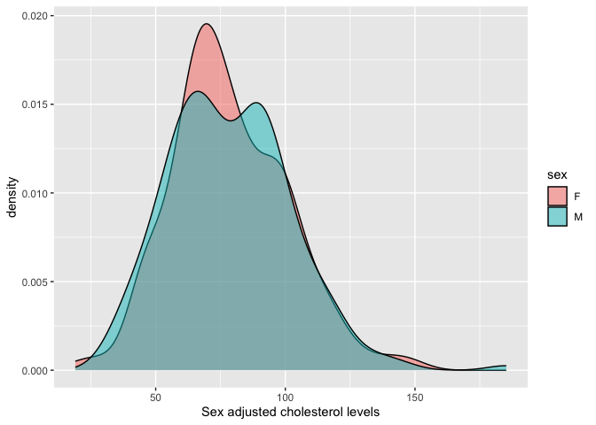

# Purpose

# Experimental Details

Link to the protocol used (permalink preferred) for the experiment and include any notes relevant to your analysis.  This might include specifics not in the general protocol such as cell lines, treatment doses etc.

# Raw Data

Describe your raw data files, including what the columns mean (and what units they are in).


```r
library(readr) #loads the readr package
genotype.filename <- '../Svenson-183_Svenson_DO-MegaMUGA-calls.csv'
genotype.data <- read_csv(genotype.filename,
                          col_types = cols(
  .default = col_character(),
  chr = col_factor(levels=NULL),
  pos = col_double()
))

phenotype.filename <- '../Svenson-183_Svenson_DO-phenotypes.csv'
phenotype.data <- read_csv(phenotype.filename)
phenotype.data[phenotype.data=="-999999"] <- NA
```

# Analysis

## Cholesterol Levels for NCD Annimals


```r
cholesterol.data <-
  phenotype.data %>%
  mutate(TC = mean(c(chol1,chol2), na.rm=T))

summary.data <-
  cholesterol.data %>%
  group_by(sex,diet) %>%
  summarize_at(.vars=vars(chol2), .funs=list(mean=mean,se=se))

library(broom)
lm(chol2~sex*diet, data=cholesterol.data) %>%
  tidy %>%
  kable(caption="Global interactions between sex and diet")
```


Table: Global interactions between sex and diet

|term        | estimate| std.error| statistic| p.value|
|:-----------|--------:|---------:|---------:|-------:|
|(Intercept) |    78.67|      1.88|    41.767|   0.000|
|sexM        |    17.80|      2.69|     6.628|   0.000|
|diethf      |    34.61|      2.75|    12.601|   0.000|
|sexM:diethf |    -1.69|      3.93|    -0.431|   0.667|

There is no evidence of an interaction between sex and diet, though both covariates were significant.  

## Setup For Chow Data

### Preparing Phenotype Data


```r
#wrote out chol2 to a phenotype file
cholesterol.phenotype.ncd.file <- 'phenotype-chow.txt'
cholesterol.data %>%
  filter(diet=='chow') %>%
  dplyr::select(chol2) %>%
  write_delim(col_names = F,cholesterol.phenotype.ncd.file)


# regress chol2 to sex and wrote out those phenotypes
lm.sex <- lm(chol2~sex,data=filter(cholesterol.data, diet=='chow'))
cholesterol.phenotype.ncd.adjusted.file <- 'phenotype-chow-adjusted.txt'
model.frame(lm.sex) %>% 
  mutate(adj.chol2 = residuals(lm.sex)+coef(lm.sex)['(Intercept)']) %>% 
  mutate(sample=paste(sex,row_number(),sep="")) -> 
  adjusted.cholesterol.data

adjusted.cholesterol.data %>%
  dplyr::select(adj.chol2) %>%
  write_delim(col_names = F,cholesterol.phenotype.ncd.adjusted.file)

cholesterol.data %>%
  filter(diet=='chow') %>%
  dplyr::select(sex) %>%
  mutate(intercept=1,
         cov=case_when(sex=='F'~1,
                       sex=='M'~0)) %>%
  dplyr::select(-sex) %>% 
  write_tsv(col_names = F, 'ncd-gender.txt') #this is the gender covariate file


library(ggplot2)
ggplot(adjusted.cholesterol.data,
       aes(x=adj.chol2,
           fill=sex)) +
  geom_density(alpha=0.5) +
  labs(x='Sex adjusted cholesterol levels')
```

<!-- -->

```r
library(broom)
shapiro.test(adjusted.cholesterol.data$adj.chol2) %>% 
  tidy() %>%
  kable(caption="Normality test for adjusted cholesterol levels")
```


Table: Normality test for adjusted cholesterol levels

| statistic| p.value|method                      |
|---------:|-------:|:---------------------------|
|     0.984|       0|Shapiro-Wilk normality test |

### Preparing Genotype Data for NCD


```r
library(stringr)

calc.geno <- function(Strain) {
  if_else(Strain==paste(`Ref`,`Ref`,sep=""), "2",
                     if_else(startsWith(Strain,`Ref`),"1","0"))
}

genotype.formattted.file.ncd <- 'DO-genotype-ncd.txt'
genotype.data %>%
  filter(chr!='P') %>% #remove chromosomes marked p
  select(-chr,-pos) %>%
  mutate(Ref=substr(`F326`,1,1),
         Alt='X') %>%
  mutate_at(.vars=vars(starts_with('F'),starts_with('M', ignore.case=F)),
            .funs=funs(if_else(.==paste(`Ref`,`Ref`,sep=""), "2",
                     if_else(startsWith(.,`Ref`),"1","0")))) -> formatted.genotype.data 

strains <- filter(cholesterol.data, diet=='chow') %>%
  pull(sample) #all strains

formatted.genotype.data %>%
  select(marker,Ref,Alt,any_of(strains)) %>%
  write_csv(col_names = F, genotype.formattted.file.ncd)

#making file formats for PLINK, needs a map and ped file
genotype.formattted.map <- 'DO-genotype.map'
genotype.data %>%
  filter(chr!='P') %>% #remove chromosomes marked p
  select(chr,marker,pos) %>%
  write_tsv(col_names = F, genotype.formattted.map)

genotype.formattted.ped <- 'DO-genotype.ped'
genotype.data %>%
  filter(chr!='P') %>% #remove chromosomes marked p
  pivot_longer(cols=c(starts_with('F'),starts_with('M', ignore.case=F)),
               names_to='id') %>%
  full_join(adjusted.cholesterol.data, by=c('id'='sample')) %>%
  mutate(fam='DO') %>% #added family
  mutate(pid=0) %>% #unknown father
  mutate(mid=0) %>% #uknnown mother 
  rename(pheno=adj.chol2) %>% #added phenotype
  #mutate(sex=0) %>% #add sex from phenotype
  #mutate(id='colname') %>% #added column name
  separate(id, into=c('sex','id'), sep=1) %>% #separate name into sex and id
  mutate(sex.n=case_when(sex=="F"~2,
                         sex=="M"~1)) %>%
  group_by(fam,id,pid,mid,sex.n,pheno) %>%
  select(-chr,-pos,-sex) %>%
  select(fam,id,pid,mid,sex.n,pheno,marker,value) %>%
  pivot_wider(names_from=marker,values_from=value) %>%
  write_tsv(col_names = F, genotype.formattted.ped)
```

## Set Up for HFD Data 

### Preparing Phenotype Data - HFD


```r
#wrote out chol2 to a phenotype file
cholesterol.phenotype.hf.file <- 'phenotype-hf.txt'
cholesterol.data %>%
  filter(diet=='hf') %>%
  dplyr::select(chol2) %>%
  write_delim(col_names = F,cholesterol.phenotype.hf.file)


# regress chol2 to sex and wrote out those phenotypes
lm.sex <- lm(chol2~sex,data=filter(cholesterol.data, diet=='hf'))
cholesterol.phenotype.hf.adjusted.file <- 'phenotype-hf-adjusted.txt'
model.frame(lm.sex) %>% 
  mutate(adj.chol2 = residuals(lm.sex)+coef(lm.sex)['(Intercept)']) -> 
  adjusted.cholesterol.data.hf

adjusted.cholesterol.data.hf %>%
  dplyr::select(adj.chol2) %>%
  write_delim(col_names = F,cholesterol.phenotype.hf.adjusted.file)

cholesterol.data %>%
  filter(diet=='hf') %>%
  dplyr::select(sex) %>%
  mutate(intercept=1,
         cov=case_when(sex=='F'~1,
                       sex=='M'~0)) %>%
  dplyr::select(-sex) %>% 
  write_tsv(col_names = F, 'hf-gender.txt') #this is the gender covariate file


library(ggplot2)
ggplot(adjusted.cholesterol.data.hf,
       aes(x=adj.chol2,
           fill=sex)) +
  geom_density(alpha=0.5) +
  labs(x='Sex adjusted cholesterol levels')
```

<!-- -->

```r
library(broom)
shapiro.test(adjusted.cholesterol.data.hf$adj.chol2) %>% 
  tidy() %>%
  kable(caption="Normality test for adjusted cholesterol levels")
```


Table: Normality test for adjusted cholesterol levels

| statistic| p.value|method                      |
|---------:|-------:|:---------------------------|
|     0.976|       0|Shapiro-Wilk normality test |

### Preparing Genotype Data For HFD


```r
library(stringr)

calc.geno <- function(Strain) {
  if_else(Strain==paste(`Ref`,`Ref`,sep=""), "2",
                     if_else(startsWith(Strain,`Ref`),"1","0"))
}

genotype.formattted.file.hf <- 'DO-genotype-hf.txt'
genotype.data %>%
  filter(chr!='P') %>% #remove chromosomes marked p
  select(-chr,-pos) %>%
  mutate(Ref=substr(`F326`,1,1),
         Alt='X') %>%
  mutate_at(.vars=vars(starts_with('F'),starts_with('M', ignore.case=F)),
            .funs=funs(if_else(.==paste(`Ref`,`Ref`,sep=""), "2",
                     if_else(startsWith(.,`Ref`),"1","0")))) -> formatted.genotype.data 

strains.hf <- filter(cholesterol.data, diet=='hf') %>%
  pull(sample) #all strains

formatted.genotype.data %>%
  select(marker,Ref,Alt,any_of(strains.hf)) %>%
  write_csv(col_names = F, genotype.formattted.file.hf)

#making file formats for PLINK, needs a map and ped file
genotype.formattted.map <- 'DO-genotype.map'
genotype.data %>%
  filter(chr!='P') %>% #remove chromosomes marked p
  select(chr,marker,pos) %>%
  write_tsv(col_names = F, genotype.formattted.map)

genotype.formattted.ped <- 'DO-genotype.ped'
genotype.data %>%
  filter(chr!='P') %>% #remove chromosomes marked p
  pivot_longer(cols=c(starts_with('F'),starts_with('M', ignore.case=F)),
               names_to='id') %>%
  full_join(adjusted.cholesterol.data, by=c('id'='sample')) %>%
  mutate(fam='DO') %>% #added family
  mutate(pid=0) %>% #unknown father
  mutate(mid=0) %>% #uknnown mother 
  rename(pheno=adj.chol2) %>% #added phenotype
  #mutate(sex=0) %>% #add sex from phenotype
  #mutate(id='colname') %>% #added column name
  separate(id, into=c('sex','id'), sep=1) %>% #separate name into sex and id
  mutate(sex.n=case_when(sex=="F"~2,
                         sex=="M"~1)) %>%
  group_by(fam,id,pid,mid,sex.n,pheno) %>%
  select(-chr,-pos,-sex) %>%
  select(fam,id,pid,mid,sex.n,pheno,marker,value) %>%
  pivot_wider(names_from=marker,values_from=value) %>%
  write_tsv(col_names = F, genotype.formattted.ped)
```

## NCD Analysis


```sh
#generate relatedness matrix (uses standard matrix).  this analysis is using teh non-adjusted cholesterol levels, and using ncd-gender as the covariate file
gemma -g DO-genotype-ncd.txt -p phenotype-chow.txt -gk 1 -c ncd-gender.txt -o ncd.cholesterol
#perform eigen decomposition
gemma -g DO-genotype-ncd.txt -p phenotype-chow.txt -c ncd-gender.txt -k output/ncd.cholesterol.cXX.txt -eigen -o ncd.cholesterol
#run mixed linear model for fat.gain mass
gemma -g DO-genotype-ncd.txt -p phenotype-chow.txt -c ncd-gender.txt -a SNP-annotation.txt -maf 0.05 -d output/ncd.cholesterol.eigenD.txt -u output/ncd.cholesterol.eigenU.txt -lmm 1 -o ncd.cholesterol #used maf cutoff of 0.05 (Default is 0.01)

## number of total individuals = 96
## number of analyzed individuals = 96
## number of covariates = 2
## number of phenotypes = 1
## number of total SNPs/var        =    77642
## number of analyzed SNPs         =    72766
#pve estimate =0.999981
#se(pve) =0.00727931

#using pruned file
#generate relatedness matrix (uses standard matrix)
gemma -bfile DO-genotype-pruned -p phenotype-chow.txt -gk 1 -o ncd.cholesterol.pruned
#perform eigen decomposition
gemma -bfile DO-genotype-pruned -p phenotype-chow.txt -k output/ncd.cholesterol.pruned.cXX.txt -eigen -o ncd.cholesterol.pruned
#run mixed linear model for fat.gain mass
gemma -bfile DO-genotype-pruned -p phenotype-chow.txt -a SNP-annotation.txt -d output/ncd.cholesterol.pruned.eigenD.txt -u output/ncd.cholesterol.pruned.eigenU.txt -lmm 1 -o ncd.cholesterol.pruned

#run bslmm (see http://romainvilloutreix.alwaysdata.net/romainvilloutreix/wp-content/uploads/2017/01/gwas_gemma-2017-01-17.pdf), 250,000 burnin and 1,000,000 for number of sampling iterations
gemma -g DO-genotype-ncd.txt -p phenotype-chow-adjusted.txt -a SNP-annotation.txt -bslmm 1 -w 100000 -s 1000000 -rpace 10 -wpace 1000 -maf 0.05 -o ncd.cholesterol
```

## HFD Analysis


```sh
#generate relatedness matrix (uses standard matrix).  this analysis is using teh non-adjusted cholesterol levels, and using ncd-gender as the covariate file
gemma -g DO-genotype-hf.txt -p phenotype-hf.txt -gk 1 -c hf-gender.txt -o hfd.cholesterol
#perform eigen decomposition
gemma -g DO-genotype-hf.txt -p phenotype-hf.txt -c hf-gender.txt -k output/hfd.cholesterol.cXX.txt -eigen -o hfd.cholesterol
#run mixed linear model for fat.gain mass
gemma -g DO-genotype-hf.txt -p phenotype-hf.txt -c hf-gender.txt -a SNP-annotation.txt -maf 0.05 -d output/hfd.cholesterol.eigenD.txt -u output/hfd.cholesterol.eigenU.txt -lmm 1 -o hfd.cholesterol #used maf cutoff of 0.05 (Default is 0.01)

## number of total individuals = 91
## number of analyzed individuals = 91
## number of covariates = 2
## number of phenotypes = 1
## number of total SNPs/var        =    77642
## number of analyzed SNPs         =    72093
#pve estimate =0.764911
#se(pve) =0.34549

#using pruned file
#generate relatedness matrix (uses standard matrix)
#gemma -bfile DO-genotype-pruned -p phenotype-chow.txt -gk 1 -o ncd.cholesterol.pruned
#perform eigen decomposition
#gemma -bfile DO-genotype-pruned -p phenotype-chow.txt -k output/ncd.cholesterol.pruned.cXX.txt -eigen -o ncd.cholesterol.pruned
#run mixed linear model for fat.gain mass
#gemma -bfile DO-genotype-pruned -p phenotype-chow.txt -a SNP-annotation.txt -d output/ncd.cholesterol.pruned.eigenD.txt -u output/ncd.cholesterol.pruned.eigenU.txt -lmm 1 -o ncd.cholesterol.pruned

#run bslmm (see http://romainvilloutreix.alwaysdata.net/romainvilloutreix/wp-content/uploads/2017/01/gwas_gemma-2017-01-17.pdf), 250,000 burnin and 1,000,000 for number of sampling iterations
gemma -g DO-genotype-hf.txt -p phenotype-hf-adjusted.txt -a SNP-annotation.txt -bslmm 1 -w 100000 -s 1000000 -rpace 10 -wpace 1000 -maf 0.05 -o hfd.cholesterol
```

## Pruning and Clumping by LD

To limit the number of SNPs we performed a pruning procedure using plink v 1.90.  Pruned SNPs with LD > 0.5.  These have not been performed yet on the LMM analysis


```sh
#create plink binaries
plink2 --file DO-genotype --out DO-genotype
#pruning with a 50 snp window, using a sliding frame of 5, and a R2 threshold of 0.5
plink2 --file DO-genotype --indep-pairwise 50 3 0.8 --out DO-genotype 
# 41564 of 77633 variants removed.
#new pruned file 
plink2 --file DO-genotype --extract DO-genotype.prune.in --make-bed --out DO-genotype-pruned
```

Clumping is generally recommended rather than pruning so did this as well.  


```sh
plink2 --file DO-genotype --out DO-genotype --freq 

plink2 --file DO-genotype --out DO-genotype-clumped --clump --clump-p1 1 --clump-p2 1 --clump-r2 0.2

```


# Session Information


```r
sessionInfo()
```

```
## R version 4.2.2 (2022-10-31)
## Platform: x86_64-apple-darwin17.0 (64-bit)
## Running under: macOS Big Sur ... 10.16
## 
## Matrix products: default
## BLAS:   /Library/Frameworks/R.framework/Versions/4.2/Resources/lib/libRblas.0.dylib
## LAPACK: /Library/Frameworks/R.framework/Versions/4.2/Resources/lib/libRlapack.dylib
## 
## locale:
## [1] en_US.UTF-8/en_US.UTF-8/en_US.UTF-8/C/en_US.UTF-8/en_US.UTF-8
## 
## attached base packages:
## [1] stats     graphics  grDevices utils     datasets  methods   base     
## 
## other attached packages:
## [1] stringr_1.5.0 ggplot2_3.4.4 broom_1.0.5   readr_2.1.4   dplyr_1.1.3  
## [6] tidyr_1.3.0   knitr_1.44   
## 
## loaded via a namespace (and not attached):
##  [1] pillar_1.9.0      bslib_0.5.1       compiler_4.2.2    jquerylib_0.1.4  
##  [5] tools_4.2.2       digest_0.6.33     bit_4.0.5         gtable_0.3.4     
##  [9] jsonlite_1.8.7    evaluate_0.22     lifecycle_1.0.3   tibble_3.2.1     
## [13] pkgconfig_2.0.3   rlang_1.1.1       cli_3.6.1         rstudioapi_0.15.0
## [17] yaml_2.3.7        parallel_4.2.2    xfun_0.40         fastmap_1.1.1    
## [21] withr_2.5.1       generics_0.1.3    vctrs_0.6.4       sass_0.4.7       
## [25] hms_1.1.3         grid_4.2.2        bit64_4.0.5       tidyselect_1.2.0 
## [29] glue_1.6.2        R6_2.5.1          fansi_1.0.5       vroom_1.6.4      
## [33] rmarkdown_2.25    farver_2.1.1      purrr_1.0.2       tzdb_0.4.0       
## [37] magrittr_2.0.3    scales_1.2.1      backports_1.4.1   htmltools_0.5.6.1
## [41] colorspace_2.1-0  labeling_0.4.3    utf8_1.2.3        stringi_1.7.12   
## [45] munsell_0.5.0     cachem_1.0.8      crayon_1.5.2
```

