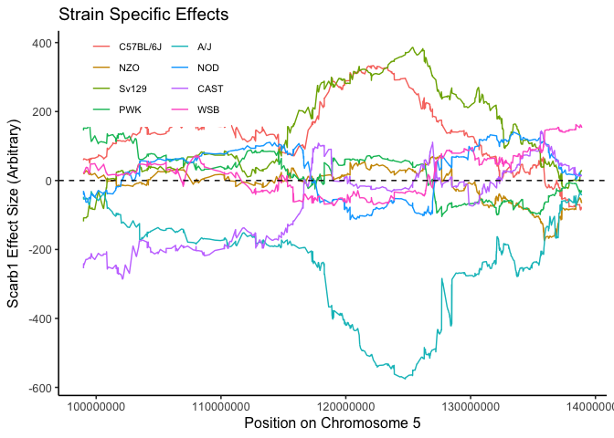

# Purpose

# Experimental Details

This analyses the data analysed via GEMMA and provided in the various output folders.

# Data Entry


```r
# additive lmm data
scarb1.filename <- 'output/ENSMUSG00000037936.assoc.txt'
scarb1.additive.data <- read_tsv(scarb1.filename) %>%
  separate(rs, sep="_", into=c("chromosome","position","allele","alt"),remove=FALSE) %>%
  mutate(chromosome=factor(chromosome, c(1:19,"X"))) %>%
  mutate(position=as.integer(position))

#ENSMUSG00000005681 is apoa2
apoa2.filename <- 'output/ENSMUSG00000005681.assoc.txt'
apoa2.additive.data <- read_tsv(apoa2.filename) %>%
  separate(rs, sep="_", into=c("chromosome","position","allele","alt"),remove=FALSE) %>%
  mutate(chromosome=factor(chromosome, c(1:19,"X"))) %>%
  mutate(position=as.integer(position))

#ENSMUSG00000032083 is apoa1 on chromosome 9
apoa1.filename <- 'output/ENSMUSG00000032083.assoc.txt'
apoa1.additive.data <- read_tsv(apoa1.filename) %>%
  separate(rs, sep="_", into=c("chromosome","position","allele","alt"),remove=FALSE) %>%
  mutate(chromosome=factor(chromosome, c(1:19,"X"))) %>%
  mutate(position=as.integer(position))

#ENSMUSG00000006191 is Cdkal1 on chromosome 13
cdkal1.filename <- 'output/ENSMUSG00000006191.assoc.txt'
cdkal1.additive.data <- read_tsv(cdkal1.filename) %>%
  separate(rs, sep="_", into=c("chromosome","position","allele","alt"),remove=FALSE) %>%
  mutate(chromosome=factor(chromosome, c(1:19,"X"))) %>%
  mutate(position=as.integer(position))
```

# Additive Models

Ran the additive models using GEMMA, first using intercepts and additive covariates for diet and sex

$SNP = beta_1 SNP + \beta_2 Diet + \beta_3 Sex + \mu +\epsilon$

Where $$\epsilon$$ are the residuals and $$\mu$$ is the relationship matrix of the strains as defined by

## Scarb1


```r
library(qqman)
qq(scarb1.additive.data$p_wald)
suggestive.pval <- 1E-5
genome.pval <- 5E-8

scarb1.additive.data %>%
  arrange(p_wald) %>% 
  filter(p_wald<genome.pval) %>%
  kable(caption="Genome-wide significant associations from mixed linear models for Scarb1 in additive model") 
```


Table: Genome-wide significant associations from mixed linear models for Scarb1 in additive model

| chr|rs              |chromosome |  position|allele |alt | ps| n_miss|allele1 |allele0 |    af| beta|   se| logl_H1| l_remle| p_wald|
|---:|:---------------|:----------|---------:|:------|:---|--:|------:|:-------|:-------|-----:|----:|----:|-------:|-------:|------:|
|  -9|5_124770045_H_E |5          | 124770045|H      |E   | -9|      0|E       |H       | 0.107| -575| 73.3|   -3678|    1.32|      0|
|  -9|5_124775832_H_E |5          | 124775832|H      |E   | -9|      0|E       |H       | 0.107| -572| 72.9|   -3679|    1.27|      0|
|  -9|5_124781618_H_E |5          | 124781618|H      |E   | -9|      0|E       |H       | 0.107| -572| 72.9|   -3679|    1.27|      0|
|  -9|5_125050278_H_E |5          | 125050278|H      |E   | -9|      0|E       |H       | 0.105| -565| 72.5|   -3679|    1.20|      0|
|  -9|5_125054283_H_E |5          | 125054283|H      |E   | -9|      0|E       |H       | 0.105| -565| 72.5|   -3679|    1.20|      0|
|  -9|5_125058287_H_E |5          | 125058287|H      |E   | -9|      0|E       |H       | 0.105| -565| 72.5|   -3679|    1.20|      0|
|  -9|5_125062292_H_E |5          | 125062292|H      |E   | -9|      0|E       |H       | 0.105| -565| 72.5|   -3679|    1.20|      0|
|  -9|5_125066296_H_E |5          | 125066296|H      |E   | -9|      0|E       |H       | 0.105| -565| 72.5|   -3679|    1.20|      0|
|  -9|5_125070300_H_E |5          | 125070300|H      |E   | -9|      0|E       |H       | 0.105| -565| 72.5|   -3679|    1.20|      0|
|  -9|5_124344875_B_E |5          | 124344875|B      |E   | -9|      0|E       |B       | 0.106| -570| 73.9|   -3679|    1.44|      0|
|  -9|5_124388730_B_E |5          | 124388730|B      |E   | -9|      0|E       |B       | 0.106| -569| 73.9|   -3679|    1.43|      0|
|  -9|5_125354378_H_E |5          | 125354378|H      |E   | -9|      0|E       |H       | 0.105| -565| 73.3|   -3680|    1.18|      0|
|  -9|5_124432586_B_E |5          | 124432586|B      |E   | -9|      0|E       |B       | 0.106| -569| 73.9|   -3679|    1.43|      0|
|  -9|5_125342743_H_E |5          | 125342743|H      |E   | -9|      0|E       |H       | 0.104| -566| 73.9|   -3680|    1.20|      0|
|  -9|5_125332356_H_E |5          | 125332356|H      |E   | -9|      0|E       |H       | 0.103| -565| 74.4|   -3680|    1.23|      0|
|  -9|5_125331866_H_E |5          | 125331866|H      |E   | -9|      0|E       |H       | 0.103| -565| 74.4|   -3680|    1.23|      0|
|  -9|5_125331376_H_E |5          | 125331376|H      |E   | -9|      0|E       |H       | 0.103| -565| 74.4|   -3680|    1.23|      0|
|  -9|5_125330887_H_E |5          | 125330887|H      |E   | -9|      0|E       |H       | 0.103| -564| 74.4|   -3680|    1.23|      0|
|  -9|5_125330397_H_E |5          | 125330397|H      |E   | -9|      0|E       |H       | 0.103| -564| 74.5|   -3680|    1.23|      0|
|  -9|5_125329907_H_E |5          | 125329907|H      |E   | -9|      0|E       |H       | 0.103| -564| 74.5|   -3680|    1.23|      0|
|  -9|5_125327631_H_E |5          | 125327631|H      |E   | -9|      0|E       |H       | 0.103| -564| 74.6|   -3681|    1.24|      0|
|  -9|5_123908181_B_E |5          | 123908181|B      |E   | -9|      0|E       |B       | 0.106| -562| 74.4|   -3680|    1.45|      0|
|  -9|5_123903091_B_E |5          | 123903091|B      |E   | -9|      0|E       |B       | 0.106| -562| 74.4|   -3680|    1.45|      0|
|  -9|5_123898001_B_E |5          | 123898001|B      |E   | -9|      0|E       |B       | 0.106| -562| 74.4|   -3680|    1.45|      0|
|  -9|5_123885281_B_E |5          | 123885281|B      |E   | -9|      0|E       |B       | 0.106| -561| 74.4|   -3680|    1.45|      0|
|  -9|5_125374355_H_E |5          | 125374355|H      |E   | -9|      0|E       |H       | 0.101| -552| 75.1|   -3682|    1.30|      0|
|  -9|5_123860885_B_E |5          | 123860885|B      |E   | -9|      0|E       |B       | 0.107| -547| 74.4|   -3682|    1.40|      0|
|  -9|5_123629774_B_E |5          | 123629774|B      |E   | -9|      0|E       |B       | 0.106| -546| 74.3|   -3682|    1.40|      0|
|  -9|5_125359372_H_E |5          | 125359372|H      |E   | -9|      0|E       |H       | 0.101| -551| 75.1|   -3682|    1.32|      0|
|  -9|5_125364366_H_E |5          | 125364366|H      |E   | -9|      0|E       |H       | 0.101| -550| 75.1|   -3682|    1.32|      0|
|  -9|5_123677414_B_E |5          | 123677414|B      |E   | -9|      0|E       |B       | 0.107| -544| 74.3|   -3682|    1.40|      0|
|  -9|5_125369361_H_E |5          | 125369361|H      |E   | -9|      0|E       |H       | 0.101| -550| 75.1|   -3682|    1.31|      0|
|  -9|5_123661534_B_E |5          | 123661534|B      |E   | -9|      0|E       |B       | 0.107| -544| 74.3|   -3682|    1.39|      0|
|  -9|5_123645654_B_E |5          | 123645654|B      |E   | -9|      0|E       |B       | 0.107| -543| 74.3|   -3682|    1.39|      0|
|  -9|5_125544310_E_E |5          | 125544310|E      |E   | -9|      0|E       |E       | 0.099| -550| 75.7|   -3682|    1.33|      0|
|  -9|5_125534955_E_E |5          | 125534955|E      |E   | -9|      0|E       |E       | 0.099| -550| 75.9|   -3683|    1.33|      0|
|  -9|5_123725152_B_E |5          | 123725152|B      |E   | -9|      0|E       |B       | 0.107| -538| 74.3|   -3682|    1.38|      0|
|  -9|5_123358166_B_E |5          | 123358166|B      |E   | -9|      0|E       |B       | 0.108| -537| 74.1|   -3683|    1.37|      0|
|  -9|5_123786005_B_E |5          | 123786005|B      |E   | -9|      0|E       |B       | 0.107| -537| 74.3|   -3683|    1.38|      0|
|  -9|5_125525600_E_E |5          | 125525600|E      |E   | -9|      0|E       |E       | 0.099| -549| 76.0|   -3683|    1.33|      0|
|  -9|5_123873083_B_E |5          | 123873083|B      |E   | -9|      0|E       |B       | 0.107| -536| 74.3|   -3683|    1.37|      0|
|  -9|5_123394206_B_E |5          | 123394206|B      |E   | -9|      0|E       |B       | 0.108| -532| 74.1|   -3683|    1.35|      0|
|  -9|5_123322125_B_E |5          | 123322125|B      |E   | -9|      0|E       |B       | 0.108| -532| 74.4|   -3683|    1.35|      0|
|  -9|5_122514244_B_E |5          | 122514244|B      |E   | -9|      0|E       |B       | 0.105| -541| 75.7|   -3683|    1.27|      0|
|  -9|5_122944168_B_E |5          | 122944168|B      |E   | -9|      0|E       |B       | 0.107| -536| 74.9|   -3683|    1.29|      0|
|  -9|5_123025081_B_E |5          | 123025081|B      |E   | -9|      0|E       |B       | 0.108| -535| 74.9|   -3683|    1.32|      0|
|  -9|5_123106581_B_E |5          | 123106581|B      |E   | -9|      0|E       |B       | 0.108| -533| 74.7|   -3683|    1.33|      0|
|  -9|5_123106556_B_E |5          | 123106556|B      |E   | -9|      0|E       |B       | 0.108| -533| 74.7|   -3683|    1.33|      0|
|  -9|5_123106530_B_E |5          | 123106530|B      |E   | -9|      0|E       |B       | 0.108| -533| 74.7|   -3683|    1.33|      0|
|  -9|5_123105995_B_E |5          | 123105995|B      |E   | -9|      0|E       |B       | 0.108| -533| 74.7|   -3683|    1.33|      0|
|  -9|5_123224923_B_E |5          | 123224923|B      |E   | -9|      0|E       |B       | 0.108| -532| 74.5|   -3683|    1.34|      0|
|  -9|5_122483834_B_E |5          | 122483834|B      |E   | -9|      0|E       |B       | 0.105| -537| 75.6|   -3684|    1.30|      0|
|  -9|5_122491436_B_E |5          | 122491436|B      |E   | -9|      0|E       |B       | 0.105| -537| 75.7|   -3684|    1.30|      0|
|  -9|5_122466086_B_E |5          | 122466086|B      |E   | -9|      0|E       |B       | 0.105| -537| 75.7|   -3684|    1.30|      0|
|  -9|5_122499039_B_E |5          | 122499039|B      |E   | -9|      0|E       |B       | 0.105| -536| 75.7|   -3684|    1.30|      0|
|  -9|5_122506641_B_E |5          | 122506641|B      |E   | -9|      0|E       |B       | 0.105| -536| 75.8|   -3684|    1.30|      0|
|  -9|5_122675823_B_E |5          | 122675823|B      |E   | -9|      0|E       |B       | 0.104| -536| 75.8|   -3684|    1.26|      0|
|  -9|5_122442470_B_E |5          | 122442470|B      |E   | -9|      0|E       |B       | 0.105| -536| 75.8|   -3684|    1.30|      0|
|  -9|5_122416280_B_E |5          | 122416280|B      |E   | -9|      0|E       |B       | 0.105| -536| 75.8|   -3684|    1.30|      0|
|  -9|5_126733040_D_E |5          | 126733040|D      |E   | -9|      0|E       |D       | 0.110| -515| 73.0|   -3684|    1.33|      0|
|  -9|5_126724060_D_E |5          | 126724060|D      |E   | -9|      0|E       |D       | 0.110| -515| 73.0|   -3684|    1.33|      0|
|  -9|5_126715079_D_E |5          | 126715079|D      |E   | -9|      0|E       |D       | 0.110| -512| 73.1|   -3684|    1.32|      0|
|  -9|5_122390090_B_E |5          | 122390090|B      |E   | -9|      0|E       |B       | 0.105| -531| 76.0|   -3684|    1.32|      0|
|  -9|5_125698690_E_E |5          | 125698690|E      |E   | -9|      0|E       |E       | 0.101| -533| 76.3|   -3684|    1.24|      0|
|  -9|5_125696054_E_E |5          | 125696054|E      |E   | -9|      0|E       |E       | 0.101| -532| 76.3|   -3684|    1.24|      0|
|  -9|5_125693419_E_E |5          | 125693419|E      |E   | -9|      0|E       |E       | 0.101| -532| 76.3|   -3684|    1.24|      0|
|  -9|5_126759981_D_E |5          | 126759981|D      |E   | -9|      0|E       |D       | 0.110| -508| 73.0|   -3684|    1.30|      0|
|  -9|5_125794418_E_E |5          | 125794418|E      |E   | -9|      0|E       |E       | 0.102| -528| 75.9|   -3685|    1.20|      0|
|  -9|5_125796829_E_E |5          | 125796829|E      |E   | -9|      0|E       |E       | 0.102| -528| 75.9|   -3685|    1.20|      0|
|  -9|5_125799240_E_E |5          | 125799240|E      |E   | -9|      0|E       |E       | 0.102| -528| 75.9|   -3685|    1.20|      0|
|  -9|5_125801650_E_E |5          | 125801650|E      |E   | -9|      0|E       |E       | 0.102| -527| 75.9|   -3685|    1.20|      0|
|  -9|5_125804061_E_E |5          | 125804061|E      |E   | -9|      0|E       |E       | 0.101| -527| 75.9|   -3685|    1.20|      0|
|  -9|5_125806472_E_E |5          | 125806472|E      |E   | -9|      0|E       |E       | 0.101| -527| 75.9|   -3685|    1.20|      0|
|  -9|5_126279609_E_E |5          | 126279609|E      |E   | -9|      0|E       |E       | 0.105| -517| 74.6|   -3685|    1.21|      0|
|  -9|5_126751000_D_E |5          | 126751000|D      |E   | -9|      0|E       |D       | 0.111| -505| 73.0|   -3685|    1.30|      0|
|  -9|5_126174903_E_E |5          | 126174903|E      |E   | -9|      0|E       |E       | 0.105| -515| 74.5|   -3685|    1.22|      0|
|  -9|5_126176577_E_E |5          | 126176577|E      |E   | -9|      0|E       |E       | 0.105| -515| 74.5|   -3685|    1.22|      0|
|  -9|5_126183060_E_E |5          | 126183060|E      |E   | -9|      0|E       |E       | 0.105| -516| 74.6|   -3685|    1.21|      0|
|  -9|5_126189650_E_E |5          | 126189650|E      |E   | -9|      0|E       |E       | 0.105| -516| 74.6|   -3685|    1.21|      0|
|  -9|5_126609235_E_E |5          | 126609235|E      |E   | -9|      0|E       |E       | 0.110| -506| 73.3|   -3685|    1.34|      0|
|  -9|5_126667668_E_E |5          | 126667668|E      |E   | -9|      0|E       |E       | 0.110| -506| 73.3|   -3685|    1.31|      0|
|  -9|5_126608098_E_E |5          | 126608098|E      |E   | -9|      0|E       |E       | 0.110| -506| 73.3|   -3685|    1.34|      0|
|  -9|5_126606962_E_E |5          | 126606962|E      |E   | -9|      0|E       |E       | 0.110| -506| 73.3|   -3685|    1.34|      0|
|  -9|5_126669532_E_E |5          | 126669532|E      |E   | -9|      0|E       |E       | 0.110| -505| 73.3|   -3685|    1.31|      0|
|  -9|5_126657791_E_E |5          | 126657791|E      |E   | -9|      0|E       |E       | 0.110| -505| 73.3|   -3685|    1.31|      0|
|  -9|5_126657791_D_E |5          | 126657791|D      |E   | -9|      0|E       |D       | 0.110| -505| 73.3|   -3685|    1.31|      0|
|  -9|5_126671396_E_E |5          | 126671396|E      |E   | -9|      0|E       |E       | 0.110| -505| 73.3|   -3685|    1.31|      0|
|  -9|5_126588046_E_E |5          | 126588046|E      |E   | -9|      0|E       |E       | 0.110| -505| 73.3|   -3685|    1.34|      0|
|  -9|5_126588034_E_E |5          | 126588034|E      |E   | -9|      0|E       |E       | 0.110| -505| 73.3|   -3685|    1.34|      0|
|  -9|5_126588021_E_E |5          | 126588021|E      |E   | -9|      0|E       |E       | 0.110| -505| 73.3|   -3685|    1.34|      0|
|  -9|5_122211097_B_E |5          | 122211097|B      |E   | -9|      0|E       |B       | 0.106| -521| 75.6|   -3685|    1.38|      0|
|  -9|5_126663939_E_E |5          | 126663939|E      |E   | -9|      0|E       |E       | 0.110| -505| 73.3|   -3685|    1.31|      0|
|  -9|5_126665803_E_E |5          | 126665803|E      |E   | -9|      0|E       |E       | 0.110| -504| 73.3|   -3685|    1.31|      0|
|  -9|5_126742020_D_E |5          | 126742020|D      |E   | -9|      0|E       |D       | 0.111| -502| 72.9|   -3685|    1.29|      0|
|  -9|5_126163767_E_E |5          | 126163767|E      |E   | -9|      0|E       |E       | 0.105| -514| 74.8|   -3685|    1.20|      0|
|  -9|5_126166484_E_E |5          | 126166484|E      |E   | -9|      0|E       |E       | 0.105| -514| 74.8|   -3685|    1.20|      0|
|  -9|5_126168726_E_E |5          | 126168726|E      |E   | -9|      0|E       |E       | 0.105| -514| 74.8|   -3685|    1.20|      0|
|  -9|5_126170968_E_E |5          | 126170968|E      |E   | -9|      0|E       |E       | 0.105| -514| 74.8|   -3685|    1.20|      0|
|  -9|5_126173210_E_E |5          | 126173210|E      |E   | -9|      0|E       |E       | 0.105| -514| 74.8|   -3685|    1.20|      0|
|  -9|5_126118083_E_E |5          | 126118083|E      |E   | -9|      0|E       |E       | 0.105| -512| 74.8|   -3685|    1.19|      0|
|  -9|5_126129218_E_E |5          | 126129218|E      |E   | -9|      0|E       |E       | 0.105| -512| 74.8|   -3685|    1.17|      0|
|  -9|5_126123650_E_E |5          | 126123650|E      |E   | -9|      0|E       |E       | 0.105| -512| 74.8|   -3685|    1.17|      0|
|  -9|5_126061603_E_E |5          | 126061603|E      |E   | -9|      0|E       |E       | 0.105| -512| 74.9|   -3685|    1.18|      0|
|  -9|5_126062210_E_E |5          | 126062210|E      |E   | -9|      0|E       |E       | 0.105| -512| 74.9|   -3685|    1.18|      0|
|  -9|5_126062816_E_E |5          | 126062816|E      |E   | -9|      0|E       |E       | 0.105| -512| 74.9|   -3685|    1.18|      0|
|  -9|5_126063423_E_E |5          | 126063423|E      |E   | -9|      0|E       |E       | 0.105| -512| 74.9|   -3685|    1.18|      0|
|  -9|5_126063749_E_E |5          | 126063749|E      |E   | -9|      0|E       |E       | 0.105| -512| 74.9|   -3685|    1.18|      0|
|  -9|5_126064006_E_E |5          | 126064006|E      |E   | -9|      0|E       |E       | 0.105| -512| 74.9|   -3685|    1.18|      0|
|  -9|5_126064264_E_E |5          | 126064264|E      |E   | -9|      0|E       |E       | 0.105| -512| 74.9|   -3685|    1.18|      0|
|  -9|5_126064521_E_E |5          | 126064521|E      |E   | -9|      0|E       |E       | 0.105| -512| 74.9|   -3685|    1.18|      0|
|  -9|5_126064778_E_E |5          | 126064778|E      |E   | -9|      0|E       |E       | 0.105| -512| 74.9|   -3685|    1.18|      0|
|  -9|5_126622571_E_E |5          | 126622571|E      |E   | -9|      0|E       |E       | 0.110| -501| 73.3|   -3685|    1.31|      0|
|  -9|5_126811912_D_E |5          | 126811912|D      |E   | -9|      0|E       |D       | 0.111| -498| 72.8|   -3685|    1.28|      0|
|  -9|5_126427671_E_E |5          | 126427671|E      |E   | -9|      0|E       |E       | 0.108| -505| 74.1|   -3685|    1.26|      0|
|  -9|5_127209731_D_E |5          | 127209731|D      |E   | -9|      0|E       |D       | 0.112| -497| 73.1|   -3685|    1.27|      0|
|  -9|5_121927046_B_E |5          | 121927046|B      |E   | -9|      0|E       |B       | 0.108| -510| 75.2|   -3685|    1.39|      0|
|  -9|5_127208174_D_E |5          | 127208174|D      |E   | -9|      0|E       |D       | 0.112| -496| 73.1|   -3686|    1.27|      0|
|  -9|5_126947212_D_E |5          | 126947212|D      |E   | -9|      0|E       |D       | 0.111| -492| 72.7|   -3686|    1.26|      0|
|  -9|5_126949214_D_E |5          | 126949214|D      |E   | -9|      0|E       |D       | 0.111| -492| 72.7|   -3686|    1.26|      0|
|  -9|5_126951676_D_E |5          | 126951676|D      |E   | -9|      0|E       |D       | 0.111| -492| 72.7|   -3686|    1.26|      0|
|  -9|5_121817037_B_E |5          | 121817037|B      |E   | -9|      0|E       |B       | 0.108| -508| 75.1|   -3685|    1.40|      0|
|  -9|5_126377141_E_E |5          | 126377141|E      |E   | -9|      0|E       |E       | 0.108| -501| 74.1|   -3686|    1.25|      0|
|  -9|5_127206616_D_E |5          | 127206616|D      |E   | -9|      0|E       |D       | 0.112| -494| 73.1|   -3686|    1.26|      0|
|  -9|5_126917366_D_E |5          | 126917366|D      |E   | -9|      0|E       |D       | 0.111| -492| 72.7|   -3686|    1.27|      0|
|  -9|5_126923895_D_E |5          | 126923895|D      |E   | -9|      0|E       |D       | 0.111| -492| 72.7|   -3686|    1.27|      0|
|  -9|5_126930424_D_E |5          | 126930424|D      |E   | -9|      0|E       |D       | 0.111| -492| 72.7|   -3686|    1.27|      0|
|  -9|5_126935200_D_E |5          | 126935200|D      |E   | -9|      0|E       |D       | 0.111| -492| 72.7|   -3686|    1.27|      0|
|  -9|5_126937202_D_E |5          | 126937202|D      |E   | -9|      0|E       |D       | 0.111| -492| 72.7|   -3686|    1.27|      0|
|  -9|5_126939204_D_E |5          | 126939204|D      |E   | -9|      0|E       |D       | 0.111| -492| 72.7|   -3686|    1.27|      0|
|  -9|5_126941206_D_E |5          | 126941206|D      |E   | -9|      0|E       |D       | 0.111| -492| 72.7|   -3686|    1.27|      0|
|  -9|5_126378592_E_E |5          | 126378592|E      |E   | -9|      0|E       |E       | 0.108| -501| 74.1|   -3686|    1.25|      0|
|  -9|5_126943208_D_E |5          | 126943208|D      |E   | -9|      0|E       |D       | 0.111| -492| 72.7|   -3686|    1.27|      0|
|  -9|5_126945210_D_E |5          | 126945210|D      |E   | -9|      0|E       |D       | 0.111| -492| 72.8|   -3686|    1.27|      0|
|  -9|5_121702189_B_E |5          | 121702189|B      |E   | -9|      0|E       |B       | 0.108| -507| 75.1|   -3686|    1.42|      0|
|  -9|5_121707812_B_E |5          | 121707812|B      |E   | -9|      0|E       |B       | 0.108| -507| 75.1|   -3686|    1.42|      0|
|  -9|5_121713435_B_E |5          | 121713435|B      |E   | -9|      0|E       |B       | 0.108| -507| 75.1|   -3686|    1.42|      0|
|  -9|5_126380044_E_E |5          | 126380044|E      |E   | -9|      0|E       |E       | 0.108| -501| 74.1|   -3686|    1.25|      0|
|  -9|5_121968594_B_E |5          | 121968594|B      |E   | -9|      0|E       |B       | 0.108| -508| 75.2|   -3686|    1.39|      0|
|  -9|5_126381495_E_E |5          | 126381495|E      |E   | -9|      0|E       |E       | 0.108| -500| 74.1|   -3686|    1.25|      0|
|  -9|5_127205059_D_E |5          | 127205059|D      |E   | -9|      0|E       |D       | 0.112| -493| 73.1|   -3686|    1.26|      0|
|  -9|5_122044155_B_E |5          | 122044155|B      |E   | -9|      0|E       |B       | 0.108| -508| 75.3|   -3686|    1.37|      0|
|  -9|5_126382946_E_E |5          | 126382946|E      |E   | -9|      0|E       |E       | 0.108| -500| 74.1|   -3686|    1.25|      0|
|  -9|5_126384397_E_E |5          | 126384397|E      |E   | -9|      0|E       |E       | 0.108| -499| 74.1|   -3686|    1.25|      0|
|  -9|5_126385849_E_E |5          | 126385849|E      |E   | -9|      0|E       |E       | 0.108| -499| 74.1|   -3686|    1.25|      0|
|  -9|5_126387851_E_E |5          | 126387851|E      |E   | -9|      0|E       |E       | 0.108| -498| 74.1|   -3686|    1.25|      0|
|  -9|5_126389906_E_E |5          | 126389906|E      |E   | -9|      0|E       |E       | 0.108| -498| 74.1|   -3686|    1.25|      0|
|  -9|5_126295305_E_E |5          | 126295305|E      |E   | -9|      0|E       |E       | 0.107| -498| 74.1|   -3686|    1.25|      0|
|  -9|5_121660329_B_E |5          | 121660329|B      |E   | -9|      0|E       |B       | 0.109| -505| 75.3|   -3686|    1.40|      0|
|  -9|5_127203501_D_E |5          | 127203501|D      |E   | -9|      0|E       |D       | 0.112| -489| 73.1|   -3686|    1.25|      0|
|  -9|5_127201134_D_E |5          | 127201134|D      |E   | -9|      0|E       |D       | 0.112| -487| 73.0|   -3686|    1.25|      0|
|  -9|5_122010143_B_E |5          | 122010143|B      |E   | -9|      0|E       |B       | 0.106| -506| 75.9|   -3686|    1.35|      0|
|  -9|5_122049789_B_E |5          | 122049789|B      |E   | -9|      0|E       |B       | 0.105| -505| 75.9|   -3686|    1.33|      0|
|  -9|5_122055423_B_E |5          | 122055423|B      |E   | -9|      0|E       |B       | 0.105| -505| 75.9|   -3686|    1.34|      0|
|  -9|5_126356854_E_E |5          | 126356854|E      |E   | -9|      0|E       |E       | 0.108| -492| 73.9|   -3686|    1.26|      0|
|  -9|5_122061058_B_E |5          | 122061058|B      |E   | -9|      0|E       |B       | 0.105| -505| 75.9|   -3686|    1.34|      0|
|  -9|5_126360932_E_E |5          | 126360932|E      |E   | -9|      0|E       |E       | 0.108| -491| 73.8|   -3686|    1.26|      0|
|  -9|5_122066692_B_E |5          | 122066692|B      |E   | -9|      0|E       |B       | 0.106| -505| 75.9|   -3686|    1.34|      0|
|  -9|5_126363588_E_E |5          | 126363588|E      |E   | -9|      0|E       |E       | 0.108| -491| 73.8|   -3686|    1.26|      0|
|  -9|5_122072326_B_E |5          | 122072326|B      |E   | -9|      0|E       |B       | 0.106| -505| 75.9|   -3686|    1.34|      0|
|  -9|5_126366244_E_E |5          | 126366244|E      |E   | -9|      0|E       |E       | 0.108| -490| 73.8|   -3686|    1.26|      0|
|  -9|5_122077961_B_E |5          | 122077961|B      |E   | -9|      0|E       |B       | 0.106| -504| 75.9|   -3686|    1.34|      0|
|  -9|5_126368900_E_E |5          | 126368900|E      |E   | -9|      0|E       |E       | 0.108| -490| 73.8|   -3686|    1.26|      0|
|  -9|5_126371336_E_E |5          | 126371336|E      |E   | -9|      0|E       |E       | 0.108| -490| 73.8|   -3686|    1.26|      0|
|  -9|5_126372787_E_E |5          | 126372787|E      |E   | -9|      0|E       |E       | 0.108| -490| 73.7|   -3686|    1.26|      0|
|  -9|5_126374239_E_E |5          | 126374239|E      |E   | -9|      0|E       |E       | 0.108| -490| 73.7|   -3686|    1.26|      0|
|  -9|5_126375690_E_E |5          | 126375690|E      |E   | -9|      0|E       |E       | 0.108| -489| 73.7|   -3686|    1.27|      0|
|  -9|5_121381571_B_E |5          | 121381571|B      |E   | -9|      0|E       |B       | 0.110| -494| 74.5|   -3686|    1.35|      0|
|  -9|5_121404091_B_E |5          | 121404091|B      |E   | -9|      0|E       |B       | 0.110| -494| 74.5|   -3686|    1.35|      0|
|  -9|5_121297536_B_E |5          | 121297536|B      |E   | -9|      0|E       |B       | 0.110| -494| 74.5|   -3686|    1.35|      0|
|  -9|5_121336531_B_E |5          | 121336531|B      |E   | -9|      0|E       |B       | 0.110| -494| 74.5|   -3686|    1.35|      0|
|  -9|5_121517137_B_E |5          | 121517137|B      |E   | -9|      0|E       |B       | 0.111| -495| 74.8|   -3686|    1.33|      0|
|  -9|5_121359051_B_E |5          | 121359051|B      |E   | -9|      0|E       |B       | 0.110| -492| 74.5|   -3687|    1.34|      0|
|  -9|5_126287457_E_E |5          | 126287457|E      |E   | -9|      0|E       |E       | 0.108| -484| 73.5|   -3687|    1.26|      0|
|  -9|5_121184066_B_E |5          | 121184066|B      |E   | -9|      0|E       |B       | 0.112| -487| 74.6|   -3687|    1.35|      0|
|  -9|5_121118040_B_E |5          | 121118040|B      |E   | -9|      0|E       |B       | 0.113| -476| 74.2|   -3688|    1.35|      0|
|  -9|5_121116445_B_E |5          | 121116445|B      |E   | -9|      0|E       |B       | 0.113| -476| 74.1|   -3688|    1.35|      0|
|  -9|5_121114850_B_E |5          | 121114850|B      |E   | -9|      0|E       |B       | 0.113| -476| 74.1|   -3688|    1.35|      0|
|  -9|5_127289046_D_E |5          | 127289046|D      |E   | -9|      0|E       |D       | 0.108| -456| 74.1|   -3689|    1.37|      0|
|  -9|5_121072169_B_E |5          | 121072169|B      |E   | -9|      0|E       |B       | 0.121| -448| 73.3|   -3689|    1.47|      0|
|  -9|5_127348598_D_E |5          | 127348598|D      |E   | -9|      0|E       |D       | 0.109| -443| 74.2|   -3690|    1.37|      0|
|  -9|5_127322612_D_E |5          | 127322612|D      |E   | -9|      0|E       |D       | 0.109| -441| 74.2|   -3690|    1.37|      0|
|  -9|5_120624583_B_E |5          | 120624583|B      |E   | -9|      0|E       |B       | 0.124| -433| 72.8|   -3690|    1.52|      0|
|  -9|5_127344699_D_E |5          | 127344699|D      |E   | -9|      0|E       |D       | 0.109| -440| 74.2|   -3690|    1.37|      0|
|  -9|5_120693238_B_E |5          | 120693238|B      |E   | -9|      0|E       |B       | 0.123| -435| 73.4|   -3690|    1.52|      0|
|  -9|5_120695765_B_E |5          | 120695765|B      |E   | -9|      0|E       |B       | 0.123| -435| 73.4|   -3690|    1.52|      0|
|  -9|5_120698293_B_E |5          | 120698293|B      |E   | -9|      0|E       |B       | 0.123| -435| 73.4|   -3690|    1.52|      0|
|  -9|5_120700821_B_E |5          | 120700821|B      |E   | -9|      0|E       |B       | 0.123| -435| 73.5|   -3690|    1.52|      0|
|  -9|5_120703348_B_E |5          | 120703348|B      |E   | -9|      0|E       |B       | 0.123| -435| 73.5|   -3690|    1.52|      0|
|  -9|5_120705876_B_E |5          | 120705876|B      |E   | -9|      0|E       |B       | 0.123| -435| 73.5|   -3690|    1.52|      0|
|  -9|5_120708403_B_E |5          | 120708403|B      |E   | -9|      0|E       |B       | 0.123| -435| 73.5|   -3690|    1.52|      0|
|  -9|5_120712626_B_E |5          | 120712626|B      |E   | -9|      0|E       |B       | 0.123| -435| 73.5|   -3690|    1.52|      0|
|  -9|5_120717274_B_E |5          | 120717274|B      |E   | -9|      0|E       |B       | 0.123| -435| 73.6|   -3690|    1.52|      0|
|  -9|5_120958700_B_E |5          | 120958700|B      |E   | -9|      0|E       |B       | 0.124| -429| 72.5|   -3690|    1.52|      0|
|  -9|5_120721923_B_E |5          | 120721923|B      |E   | -9|      0|E       |B       | 0.122| -435| 73.6|   -3690|    1.52|      0|
|  -9|5_120726572_B_E |5          | 120726572|B      |E   | -9|      0|E       |B       | 0.122| -435| 73.6|   -3690|    1.53|      0|
|  -9|5_120731397_B_E |5          | 120731397|B      |E   | -9|      0|E       |B       | 0.122| -435| 73.7|   -3690|    1.53|      0|
|  -9|5_127510736_D_E |5          | 127510736|D      |E   | -9|      0|E       |D       | 0.108| -445| 75.4|   -3691|    1.32|      0|
|  -9|5_120738685_B_E |5          | 120738685|B      |E   | -9|      0|E       |B       | 0.122| -435| 73.7|   -3690|    1.53|      0|
|  -9|5_127340799_D_E |5          | 127340799|D      |E   | -9|      0|E       |D       | 0.109| -437| 74.2|   -3691|    1.37|      0|
|  -9|5_127620150_D_E |5          | 127620150|D      |E   | -9|      0|E       |D       | 0.115| -439| 74.4|   -3691|    1.40|      0|
|  -9|5_127664899_D_E |5          | 127664899|D      |E   | -9|      0|E       |D       | 0.117| -433| 73.5|   -3691|    1.45|      0|
|  -9|5_127660156_D_E |5          | 127660156|D      |E   | -9|      0|E       |D       | 0.118| -432| 73.3|   -3691|    1.46|      0|
|  -9|5_127668489_D_E |5          | 127668489|D      |E   | -9|      0|E       |D       | 0.117| -433| 73.5|   -3691|    1.44|      0|
|  -9|5_127672079_D_E |5          | 127672079|D      |E   | -9|      0|E       |D       | 0.117| -434| 73.6|   -3691|    1.44|      0|
|  -9|5_120845230_B_E |5          | 120845230|B      |E   | -9|      0|E       |B       | 0.121| -435| 74.1|   -3691|    1.53|      0|
|  -9|5_127640153_D_E |5          | 127640153|D      |E   | -9|      0|E       |D       | 0.116| -434| 74.0|   -3691|    1.44|      0|
|  -9|5_127360297_D_E |5          | 127360297|D      |E   | -9|      0|E       |D       | 0.110| -435| 74.2|   -3691|    1.37|      0|
|  -9|5_127336900_D_E |5          | 127336900|D      |E   | -9|      0|E       |D       | 0.109| -434| 74.2|   -3691|    1.37|      0|
|  -9|5_128424180_D_E |5          | 128424180|D      |E   | -9|      0|E       |D       | 0.116| -421| 71.9|   -3691|    1.46|      0|
|  -9|5_127390105_D_E |5          | 127390105|D      |E   | -9|      0|E       |D       | 0.110| -435| 74.3|   -3691|    1.35|      0|
|  -9|5_128449233_D_E |5          | 128449233|D      |E   | -9|      0|E       |D       | 0.115| -422| 72.0|   -3691|    1.46|      0|
|  -9|5_127356397_D_E |5          | 127356397|D      |E   | -9|      0|E       |D       | 0.110| -434| 74.1|   -3691|    1.37|      0|
|  -9|5_127408905_D_E |5          | 127408905|D      |E   | -9|      0|E       |D       | 0.109| -437| 74.7|   -3691|    1.34|      0|
|  -9|5_127352498_D_E |5          | 127352498|D      |E   | -9|      0|E       |D       | 0.111| -432| 74.0|   -3691|    1.37|      0|
|  -9|5_128474286_D_E |5          | 128474286|D      |E   | -9|      0|E       |D       | 0.117| -415| 71.2|   -3691|    1.44|      0|
|  -9|5_128492848_D_E |5          | 128492848|D      |E   | -9|      0|E       |D       | 0.117| -416| 71.4|   -3691|    1.45|      0|
|  -9|5_127381433_D_E |5          | 127381433|D      |E   | -9|      0|E       |D       | 0.110| -433| 74.3|   -3691|    1.36|      0|
|  -9|5_127399505_D_E |5          | 127399505|D      |E   | -9|      0|E       |D       | 0.109| -433| 74.7|   -3691|    1.35|      0|
|  -9|5_120343935_E_E |5          | 120343935|E      |E   | -9|      0|E       |E       | 0.120| -429| 74.1|   -3691|    1.54|      0|
|  -9|5_120349541_E_E |5          | 120349541|E      |E   | -9|      0|E       |E       | 0.120| -429| 74.2|   -3691|    1.54|      0|
|  -9|5_120356939_E_E |5          | 120356939|E      |E   | -9|      0|E       |E       | 0.120| -428| 74.2|   -3691|    1.54|      0|
|  -9|5_120365668_E_E |5          | 120365668|E      |E   | -9|      0|E       |E       | 0.120| -428| 74.3|   -3691|    1.54|      0|
|  -9|5_120365931_E_E |5          | 120365931|E      |E   | -9|      0|E       |E       | 0.120| -428| 74.3|   -3691|    1.54|      0|
|  -9|5_120366194_E_E |5          | 120366194|E      |E   | -9|      0|E       |E       | 0.120| -428| 74.3|   -3691|    1.54|      0|
|  -9|5_120366458_E_E |5          | 120366458|E      |E   | -9|      0|E       |E       | 0.120| -428| 74.3|   -3691|    1.54|      0|
|  -9|5_120366721_E_E |5          | 120366721|E      |E   | -9|      0|E       |E       | 0.120| -428| 74.3|   -3691|    1.54|      0|
|  -9|5_120366987_E_E |5          | 120366987|E      |E   | -9|      0|E       |E       | 0.120| -428| 74.3|   -3691|    1.54|      0|
|  -9|5_120367255_E_E |5          | 120367255|E      |E   | -9|      0|E       |E       | 0.120| -428| 74.3|   -3691|    1.54|      0|
|  -9|5_120367522_E_E |5          | 120367522|E      |E   | -9|      0|E       |E       | 0.120| -428| 74.3|   -3691|    1.54|      0|
|  -9|5_120367790_E_E |5          | 120367790|E      |E   | -9|      0|E       |E       | 0.120| -428| 74.3|   -3691|    1.54|      0|
|  -9|5_120368058_E_E |5          | 120368058|E      |E   | -9|      0|E       |E       | 0.120| -428| 74.3|   -3691|    1.54|      0|
|  -9|5_128399127_D_E |5          | 128399127|D      |E   | -9|      0|E       |D       | 0.113| -421| 73.1|   -3691|    1.50|      0|
|  -9|5_120398276_E_E |5          | 120398276|E      |E   | -9|      0|E       |E       | 0.120| -428| 74.4|   -3691|    1.55|      0|
|  -9|5_128491640_D_E |5          | 128491640|D      |E   | -9|      0|E       |D       | 0.118| -410| 71.5|   -3691|    1.48|      0|
|  -9|5_120428776_E_E |5          | 120428776|E      |E   | -9|      0|E       |E       | 0.119| -424| 74.5|   -3691|    1.56|      0|
|  -9|5_118958519_B_E |5          | 118958519|B      |E   | -9|      0|E       |B       | 0.133| -402| 70.7|   -3692|    1.50|      0|
|  -9|5_118932883_B_E |5          | 118932883|B      |E   | -9|      0|E       |B       | 0.133| -399| 70.8|   -3692|    1.53|      0|
|  -9|5_118921961_B_E |5          | 118921961|B      |E   | -9|      0|E       |B       | 0.134| -399| 70.8|   -3692|    1.53|      0|
|  -9|5_120459276_E_E |5          | 120459276|E      |E   | -9|      0|E       |E       | 0.119| -420| 74.6|   -3692|    1.58|      0|
|  -9|5_120338329_E_E |5          | 120338329|E      |E   | -9|      0|E       |E       | 0.120| -420| 74.7|   -3692|    1.67|      0|
|  -9|5_120026075_E_E |5          | 120026075|E      |E   | -9|      0|E       |E       | 0.120| -420| 74.7|   -3692|    1.67|      0|
|  -9|5_120332723_E_E |5          | 120332723|E      |E   | -9|      0|E       |E       | 0.120| -421| 74.7|   -3692|    1.67|      0|
|  -9|5_120327117_E_E |5          | 120327117|E      |E   | -9|      0|E       |E       | 0.120| -421| 74.8|   -3692|    1.66|      0|
|  -9|5_120321511_E_E |5          | 120321511|E      |E   | -9|      0|E       |E       | 0.120| -421| 74.8|   -3692|    1.66|      0|
|  -9|5_120032759_E_E |5          | 120032759|E      |E   | -9|      0|E       |E       | 0.120| -420| 74.7|   -3692|    1.66|      0|
|  -9|5_119022595_B_E |5          | 119022595|B      |E   | -9|      0|E       |B       | 0.134| -398| 70.8|   -3692|    1.55|      0|
|  -9|5_120039443_E_E |5          | 120039443|E      |E   | -9|      0|E       |E       | 0.120| -420| 74.7|   -3692|    1.66|      0|
|  -9|5_120308891_E_E |5          | 120308891|E      |E   | -9|      0|E       |E       | 0.119| -421| 74.9|   -3692|    1.66|      0|
|  -9|5_119897986_D_E |5          | 119897986|D      |E   | -9|      0|E       |D       | 0.129| -414| 73.7|   -3692|    1.61|      0|
|  -9|5_120489776_E_E |5          | 120489776|E      |E   | -9|      0|E       |E       | 0.119| -419| 74.6|   -3692|    1.58|      0|
|  -9|5_120280789_E_E |5          | 120280789|E      |E   | -9|      0|E       |E       | 0.119| -421| 75.0|   -3692|    1.66|      0|
|  -9|5_120269607_E_E |5          | 120269607|E      |E   | -9|      0|E       |E       | 0.119| -421| 75.0|   -3692|    1.65|      0|
|  -9|5_120267435_E_E |5          | 120267435|E      |E   | -9|      0|E       |E       | 0.119| -421| 75.0|   -3692|    1.65|      0|
|  -9|5_119890495_D_E |5          | 119890495|D      |E   | -9|      0|E       |D       | 0.127| -415| 74.0|   -3692|    1.58|      0|
|  -9|5_120066407_E_E |5          | 120066407|E      |E   | -9|      0|E       |E       | 0.120| -419| 74.7|   -3692|    1.65|      0|
|  -9|5_120276124_E_E |5          | 120276124|E      |E   | -9|      0|E       |E       | 0.119| -420| 75.0|   -3692|    1.66|      0|
|  -9|5_120273951_E_E |5          | 120273951|E      |E   | -9|      0|E       |E       | 0.119| -420| 75.0|   -3692|    1.66|      0|
|  -9|5_119832924_D_E |5          | 119832924|D      |E   | -9|      0|E       |D       | 0.133| -405| 72.3|   -3692|    1.67|      0|
|  -9|5_120271779_E_E |5          | 120271779|E      |E   | -9|      0|E       |E       | 0.119| -420| 75.0|   -3692|    1.65|      0|
|  -9|5_119968614_D_E |5          | 119968614|D      |E   | -9|      0|E       |D       | 0.119| -418| 74.7|   -3692|    1.63|      0|
|  -9|5_119905478_D_E |5          | 119905478|D      |E   | -9|      0|E       |D       | 0.131| -409| 73.0|   -3692|    1.64|      0|
|  -9|5_119971188_D_E |5          | 119971188|D      |E   | -9|      0|E       |D       | 0.119| -418| 74.6|   -3692|    1.64|      0|
|  -9|5_119980746_D_E |5          | 119980746|D      |E   | -9|      0|E       |D       | 0.119| -418| 74.6|   -3692|    1.63|      0|
|  -9|5_120520276_E_E |5          | 120520276|E      |E   | -9|      0|E       |E       | 0.119| -418| 74.6|   -3692|    1.59|      0|
|  -9|5_120101447_E_E |5          | 120101447|E      |E   | -9|      0|E       |E       | 0.119| -418| 74.7|   -3692|    1.64|      0|
|  -9|5_120264161_E_E |5          | 120264161|E      |E   | -9|      0|E       |E       | 0.119| -420| 75.1|   -3692|    1.64|      0|
|  -9|5_119790049_D_E |5          | 119790049|D      |E   | -9|      0|E       |D       | 0.133| -404| 72.3|   -3692|    1.67|      0|
|  -9|5_119875512_D_E |5          | 119875512|D      |E   | -9|      0|E       |D       | 0.133| -404| 72.3|   -3692|    1.67|      0|
|  -9|5_119868020_D_E |5          | 119868020|D      |E   | -9|      0|E       |D       | 0.133| -404| 72.3|   -3692|    1.67|      0|
|  -9|5_120008863_D_E |5          | 120008863|D      |E   | -9|      0|E       |D       | 0.119| -417| 74.7|   -3692|    1.63|      0|
|  -9|5_119860529_D_E |5          | 119860529|D      |E   | -9|      0|E       |D       | 0.133| -403| 72.3|   -3692|    1.67|      0|
|  -9|5_119853037_D_E |5          | 119853037|D      |E   | -9|      0|E       |D       | 0.133| -403| 72.3|   -3692|    1.67|      0|
|  -9|5_120019278_D_E |5          | 120019278|D      |E   | -9|      0|E       |D       | 0.119| -417| 74.7|   -3692|    1.63|      0|
|  -9|5_119844282_D_E |5          | 119844282|D      |E   | -9|      0|E       |D       | 0.133| -403| 72.3|   -3692|    1.67|      0|
|  -9|5_128374074_D_E |5          | 128374074|D      |E   | -9|      0|E       |D       | 0.112| -410| 73.6|   -3692|    1.54|      0|
|  -9|5_119925360_D_E |5          | 119925360|D      |E   | -9|      0|E       |D       | 0.121| -415| 74.5|   -3692|    1.56|      0|
|  -9|5_119005479_B_E |5          | 119005479|B      |E   | -9|      0|E       |B       | 0.134| -393| 70.6|   -3692|    1.58|      0|
|  -9|5_119943605_D_E |5          | 119943605|D      |E   | -9|      0|E       |D       | 0.118| -414| 74.5|   -3692|    1.62|      0|
|  -9|5_119934483_D_E |5          | 119934483|D      |E   | -9|      0|E       |D       | 0.123| -412| 74.3|   -3692|    1.55|      0|

```r
scarb1.additive.data %>%
  arrange(p_wald) %>% 
  filter(p_wald<suggestive.pval) %>%
  mutate(position.start = substr(as.character(position), 1,2)) %>%
  group_by(chromosome,position.start) %>%
  summarize_all(.funs=first) %>%
  select(-position.start,-chr,-ps) %>%
  kable(caption="Suggestive genome-wide significant associations from mixed linear models for Scarb1 in additive model, clumped by first two digits of the position") 
```


Table: Suggestive genome-wide significant associations from mixed linear models for Scarb1 in additive model, clumped by first two digits of the position

|chromosome |rs              |  position|allele |alt | n_miss|allele1 |allele0 |    af| beta|   se| logl_H1| l_remle| p_wald|
|:----------|:---------------|---------:|:------|:---|------:|:-------|:-------|-----:|----:|----:|-------:|-------:|------:|
|5          |5_118958519_B_E | 118958519|B      |E   |      0|E       |B       | 0.133| -402| 70.7|   -3692|    1.50|      0|
|5          |5_124770045_H_E | 124770045|H      |E   |      0|E       |H       | 0.107| -575| 73.3|   -3678|    1.32|      0|
|10         |10_19919940_G_C |  19919940|G      |C   |      0|C       |G       | 0.081|  399| 84.4|   -3696|    2.14|      0|
|10         |10_20385759_G_C |  20385759|G      |C   |      0|C       |G       | 0.078|  420| 85.3|   -3695|    2.12|      0|
|10         |10_91999607_B_E |  91999607|B      |E   |      0|E       |B       | 0.113| -332| 73.5|   -3697|    2.05|      0|
|10         |10_92579894_B_E |  92579894|B      |E   |      0|E       |B       | 0.115| -343| 73.1|   -3696|    2.04|      0|
|10         |10_93910699_B_E |  93910699|B      |E   |      0|E       |B       | 0.116| -356| 73.7|   -3696|    1.98|      0|
|10         |10_94499084_B_E |  94499084|B      |E   |      0|E       |B       | 0.114| -384| 73.8|   -3694|    2.01|      0|
|10         |10_95418856_F_E |  95418856|F      |E   |      0|E       |F       | 0.116| -341| 69.7|   -3695|    1.81|      0|

```r
scarb1.additive.data %>%
  arrange(p_wald) %>% 
  filter(p_wald<1E-4) %>%
  mutate(position.start = substr(as.character(position), 1,2)) %>%
  group_by(chromosome,position.start) %>%
  summarize_all(.funs=first) %>%
  select(-position.start,-chr,-ps) -> additive.snp.summary

additive.snp.summary %>%
  kable(caption="Relaxed suggestive genome-wide significant associations from mixed linear models for Scarb1 in additive model, clumped by first two digits of the position") 
```


Table: Relaxed suggestive genome-wide significant associations from mixed linear models for Scarb1 in additive model, clumped by first two digits of the position

|chromosome |rs              |  position|allele |alt | n_miss|allele1 |allele0 |    af| beta|   se| logl_H1| l_remle| p_wald|
|:----------|:---------------|---------:|:------|:---|------:|:-------|:-------|-----:|----:|----:|-------:|-------:|------:|
|5          |5_118958519_B_E | 118958519|B      |E   |      0|E       |B       | 0.133| -402| 70.7|   -3692|    1.50|      0|
|5          |5_124770045_H_E | 124770045|H      |E   |      0|E       |H       | 0.107| -575| 73.3|   -3678|    1.32|      0|
|5          |5_130238343_D_E | 130238343|D      |E   |      0|E       |D       | 0.133| -279| 65.4|   -3698|    1.60|      0|
|10         |10_19919940_G_C |  19919940|G      |C   |      0|C       |G       | 0.081|  399| 84.4|   -3696|    2.14|      0|
|10         |10_20385759_G_C |  20385759|G      |C   |      0|C       |G       | 0.078|  420| 85.3|   -3695|    2.12|      0|
|10         |10_24250205_G_H |  24250205|G      |H   |      0|H       |G       | 0.140|  304| 71.0|   -3698|    2.41|      0|
|10         |10_25638058_G_H |  25638058|G      |H   |      0|H       |G       | 0.146|  275| 69.9|   -3699|    2.25|      0|
|10         |10_27141745_F_H |  27141745|F      |H   |      0|H       |F       | 0.129|  296| 71.5|   -3699|    2.29|      0|
|10         |10_91999607_B_E |  91999607|B      |E   |      0|E       |B       | 0.113| -332| 73.5|   -3697|    2.05|      0|
|10         |10_92579894_B_E |  92579894|B      |E   |      0|E       |B       | 0.115| -343| 73.1|   -3696|    2.04|      0|
|10         |10_93910699_B_E |  93910699|B      |E   |      0|E       |B       | 0.116| -356| 73.7|   -3696|    1.98|      0|
|10         |10_94499084_B_E |  94499084|B      |E   |      0|E       |B       | 0.114| -384| 73.8|   -3694|    2.01|      0|
|10         |10_95418856_F_E |  95418856|F      |E   |      0|E       |F       | 0.116| -341| 69.7|   -3695|    1.81|      0|
|10         |10_96143668_F_E |  96143668|F      |E   |      0|E       |F       | 0.110| -291| 71.7|   -3699|    1.70|      0|

```r
library(ggmanh)
```

<!-- -->

```r
manhattan_plot(x = scarb1.additive.data, pval.colname = "p_wald", chr.colname = "chromosome", pos.colname = "position", plot.title = "eQTLs for Scarb1 (Additive Model)", y.label = "LOD Score")
```

<!-- -->

```r
snp.pos <- 118958519
library(forcats)
peak5 <- filter(scarb1.additive.data,
                  chromosome==5,
                  position>snp.pos-20000000,
                  position<snp.pos+20000000) %>%
  mutate(alt=fct_recode(as.factor(alt),
                        "C57BL/6J"="A",
                        "NZO"="B",
                        "Sv129"="C",
                        "PWK"="D",
                        "A/J"="E",
                        "NOD"="F",
                        "CAST"="G",
                        "WSB"="H"))

ggplot(data=peak5,
       aes(x=position,
       y=beta,
       col=alt,
       group=alt)) +
  geom_line() +
  geom_hline(yintercept=0,lty=2) +
  labs(title="Strain Specific Effects",
       y="Scarb1 Effect Size (Arbitrary)",
       x="Position on Chromosome 5") +
  scale_color_discrete(name="") +
  guides(col=guide_legend(ncol=2)) +
  theme_classic(base_size=12) +
  theme(legend.position=c(0.18,0.9),
        legend.text=element_text(size=8))
```

<!-- -->

## Apoa2


```r
qq(apoa2.additive.data$p_wald)
```

<!-- -->

```r
suggestive.pval <- 1E-5
genome.pval <- 5E-8

apoa2.additive.data %>%
  arrange(p_wald) %>% 
  filter(p_wald<genome.pval) %>%
  kable(caption="Genome-wide significant associations from mixed linear models for Apoa2 in additive model") 
```


Table: Genome-wide significant associations from mixed linear models for Apoa2 in additive model

| chr|rs |chromosome | position|allele |alt | ps| n_miss|allele1 |allele0 | af| beta| se| logl_H1| l_remle| p_wald|
|---:|:--|:----------|--------:|:------|:---|--:|------:|:-------|:-------|--:|----:|--:|-------:|-------:|------:|

```r
apoa2.additive.data %>%
  arrange(p_wald) %>% 
  filter(p_wald<suggestive.pval) %>%
  mutate(position.start = substr(as.character(position), 1,2)) %>%
  group_by(chromosome,position.start) %>%
  summarize_all(.funs=first) %>%
  select(-position.start,-chr,-ps) %>%
  kable(caption="Suggestive genome-wide significant associations from mixed linear models for Apoa2 in additive model, clumped by first two digits of the position") 
```


Table: Suggestive genome-wide significant associations from mixed linear models for Apoa2 in additive model, clumped by first two digits of the position

|chromosome |rs              |  position|allele |alt | n_miss|allele1 |allele0 |    af|  beta|   se| logl_H1| l_remle| p_wald|
|:----------|:---------------|---------:|:------|:---|------:|:-------|:-------|-----:|-----:|----:|-------:|-------:|------:|
|1          |1_177024867_H_H | 177024867|H      |H   |      0|H       |H       | 0.204| 14040| 3030|   -5521|     2.1|      0|

```r
apoa2.additive.data %>%
  arrange(p_wald) %>% 
  filter(p_wald<1E-4) %>%
  mutate(position.start = substr(as.character(position), 1,2)) %>%
  group_by(chromosome,position.start) %>%
  summarize_all(.funs=first) %>%
  select(-position.start,-chr,-ps) -> additive.snp.summary

additive.snp.summary %>%
  kable(caption="Relaxed suggestive genome-wide significant associations from mixed linear models for Apoa2 in additive model, clumped by first two digits of the position") 
```


Table: Relaxed suggestive genome-wide significant associations from mixed linear models for Apoa2 in additive model, clumped by first two digits of the position

|chromosome |rs               |  position|allele |alt | n_miss|allele1 |allele0 |    af|   beta|   se| logl_H1| l_remle| p_wald|
|:----------|:----------------|---------:|:------|:---|------:|:-------|:-------|-----:|------:|----:|-------:|-------:|------:|
|1          |1_177024867_H_H  | 177024867|H      |H   |      0|H       |H       | 0.204|  14040| 3030|   -5521|    2.10|      0|
|1          |1_180523641_H_H  | 180523641|H      |H   |      0|H       |H       | 0.212|  12914| 2948|   -5522|    2.06|      0|
|10         |10_109521792_H_E | 109521792|H      |E   |      0|E       |H       | 0.098|  17311| 3987|   -5522|    2.83|      0|
|10         |10_110766961_F_E | 110766961|F      |E   |      0|E       |F       | 0.098|  16739| 3992|   -5523|    2.85|      0|
|15         |15_93728085_E_D  |  93728085|E      |D   |      0|D       |E       | 0.146| -14873| 3598|   -5523|    2.27|      0|
|16         |16_24324833_F_H  |  24324833|F      |H   |      0|H       |F       | 0.101|  16585| 4108|   -5523|    2.80|      0|
|16         |16_25271645_F_H  |  25271645|F      |H   |      0|H       |F       | 0.101|  16262| 4089|   -5524|    2.73|      0|

```r
manhattan_plot(x = apoa2.additive.data, pval.colname = "p_wald", chr.colname = "chromosome", pos.colname = "position", plot.title = "eQTLs for Apoa2 (Additive Model)", y.label = "LOD Score")
```

<!-- -->

```r
snp.pos <- 177024867
peak1b <- filter(apoa2.additive.data,
                  chromosome==1,
                  position>snp.pos-20000000,
                  position<snp.pos+20000000) %>%
  mutate(alt=fct_recode(as.factor(alt),
                        "C57BL/6J"="A",
                        "NZO"="B",
                        "Sv129"="C",
                        "PWK"="D",
                        "A/J"="E",
                        "NOD"="F",
                        "CAST"="G",
                        "WSB"="H"))

ggplot(data=peak1b,
       aes(x=position,
       y=beta,
       col=alt,
       group=alt)) +
  geom_line() +
  geom_hline(yintercept=0,lty=2) +
  labs(title="Strain Specific Effects",
       y="Apoa2 Effect Size (Arbitrary)",
       x="Position on Chromosome 1") +
  scale_color_discrete(name="") +
  guides(col=guide_legend(ncol=2)) +
  theme_classic(base_size=12) +
  theme(legend.position=c(0.18,0.9),
        legend.text=element_text(size=8))
```

<!-- -->

This does not line up with the GWAS pattern, so is probably not the same hit.

## Apoa1


```r
qq(apoa1.additive.data$p_wald)
```

<!-- -->

```r
suggestive.pval <- 1E-5
genome.pval <- 5E-8

apoa1.additive.data %>%
  arrange(p_wald) %>% 
  filter(p_wald<genome.pval) %>%
  kable(caption="Genome-wide significant associations from mixed linear models for Apoa2 in additive model") 
```


Table: Genome-wide significant associations from mixed linear models for Apoa2 in additive model

| chr|rs             |chromosome | position|allele |alt | ps| n_miss|allele1 |allele0 |    af|  beta|   se| logl_H1| l_remle| p_wald|
|---:|:--------------|:----------|--------:|:------|:---|--:|------:|:-------|:-------|-----:|-----:|----:|-------:|-------:|------:|
|  -9|9_45695998_B_F |9          | 45695998|B      |F   | -9|      0|F       |B       | 0.123| 20075| 3056|   -5456|    2.21|      0|
|  -9|9_45699502_B_F |9          | 45699502|B      |F   | -9|      0|F       |B       | 0.123| 20073| 3056|   -5456|    2.21|      0|
|  -9|9_45703005_B_F |9          | 45703005|B      |F   | -9|      0|F       |B       | 0.123| 20070| 3056|   -5456|    2.21|      0|
|  -9|9_45716470_B_F |9          | 45716470|B      |F   | -9|      0|F       |B       | 0.123| 20061| 3056|   -5456|    2.21|      0|
|  -9|9_45243524_B_F |9          | 45243524|B      |F   | -9|      0|F       |B       | 0.121| 20549| 3133|   -5456|    2.16|      0|
|  -9|9_45226398_B_F |9          | 45226398|B      |F   | -9|      0|F       |B       | 0.121| 20553| 3136|   -5457|    2.16|      0|
|  -9|9_45231116_B_F |9          | 45231116|B      |F   | -9|      0|F       |B       | 0.121| 20539| 3134|   -5457|    2.15|      0|
|  -9|9_45224039_B_F |9          | 45224039|B      |F   | -9|      0|F       |B       | 0.121| 20551| 3136|   -5457|    2.16|      0|
|  -9|9_45228757_B_F |9          | 45228757|B      |F   | -9|      0|F       |B       | 0.121| 20536| 3134|   -5457|    2.15|      0|
|  -9|9_45220445_B_F |9          | 45220445|B      |F   | -9|      0|F       |B       | 0.121| 20548| 3136|   -5457|    2.16|      0|
|  -9|9_45210468_B_F |9          | 45210468|B      |F   | -9|      0|F       |B       | 0.121| 20539| 3137|   -5457|    2.16|      0|
|  -9|9_45730723_B_F |9          | 45730723|B      |F   | -9|      0|F       |B       | 0.124| 20009| 3057|   -5457|    2.20|      0|
|  -9|9_45647108_B_F |9          | 45647108|B      |F   | -9|      0|F       |B       | 0.124| 19952| 3058|   -5457|    2.18|      0|
|  -9|9_45653010_B_F |9          | 45653010|B      |F   | -9|      0|F       |B       | 0.124| 19943| 3058|   -5457|    2.18|      0|
|  -9|9_45658912_B_F |9          | 45658912|B      |F   | -9|      0|F       |B       | 0.124| 19933| 3057|   -5457|    2.18|      0|
|  -9|9_45664815_B_F |9          | 45664815|B      |F   | -9|      0|F       |B       | 0.124| 19923| 3057|   -5457|    2.18|      0|
|  -9|9_45669254_B_F |9          | 45669254|B      |F   | -9|      0|F       |B       | 0.124| 19916| 3057|   -5457|    2.18|      0|
|  -9|9_45672132_B_F |9          | 45672132|B      |F   | -9|      0|F       |B       | 0.124| 19911| 3057|   -5457|    2.18|      0|
|  -9|9_45675009_B_F |9          | 45675009|B      |F   | -9|      0|F       |B       | 0.124| 19906| 3057|   -5457|    2.18|      0|
|  -9|9_45677887_B_F |9          | 45677887|B      |F   | -9|      0|F       |B       | 0.124| 19901| 3057|   -5457|    2.18|      0|
|  -9|9_45680764_B_F |9          | 45680764|B      |F   | -9|      0|F       |B       | 0.124| 19897| 3057|   -5457|    2.17|      0|
|  -9|9_45683642_B_F |9          | 45683642|B      |F   | -9|      0|F       |B       | 0.124| 19892| 3057|   -5457|    2.17|      0|
|  -9|9_45686597_B_F |9          | 45686597|B      |F   | -9|      0|F       |B       | 0.124| 19886| 3057|   -5457|    2.17|      0|
|  -9|9_45689604_B_F |9          | 45689604|B      |F   | -9|      0|F       |B       | 0.124| 19881| 3057|   -5457|    2.17|      0|
|  -9|9_45692612_B_F |9          | 45692612|B      |F   | -9|      0|F       |B       | 0.124| 19876| 3057|   -5457|    2.17|      0|
|  -9|9_46397418_B_F |9          | 46397418|B      |F   | -9|      0|F       |B       | 0.124| 19731| 3054|   -5457|    2.16|      0|
|  -9|9_46385725_B_F |9          | 46385725|B      |F   | -9|      0|F       |B       | 0.125| 19640| 3056|   -5457|    2.15|      0|
|  -9|9_45105852_F_F |9          | 45105852|F      |F   | -9|      0|F       |F       | 0.124| 20081| 3131|   -5457|    2.14|      0|
|  -9|9_45932754_B_F |9          | 45932754|B      |F   | -9|      0|F       |B       | 0.126| 19449| 3048|   -5458|    2.14|      0|
|  -9|9_45946473_B_F |9          | 45946473|B      |F   | -9|      0|F       |B       | 0.126| 19435| 3047|   -5458|    2.14|      0|
|  -9|9_45112636_F_F |9          | 45112636|F      |F   | -9|      0|F       |F       | 0.125| 20032| 3142|   -5458|    2.16|      0|
|  -9|9_45960192_B_F |9          | 45960192|B      |F   | -9|      0|F       |B       | 0.127| 19420| 3047|   -5458|    2.14|      0|
|  -9|9_46409110_B_F |9          | 46409110|B      |F   | -9|      0|F       |B       | 0.127| 19274| 3039|   -5458|    2.14|      0|
|  -9|9_46485002_B_F |9          | 46485002|B      |F   | -9|      0|F       |B       | 0.128| 19163| 3033|   -5458|    2.14|      0|
|  -9|9_46530566_B_F |9          | 46530566|B      |F   | -9|      0|F       |B       | 0.128| 19154| 3034|   -5458|    2.14|      0|
|  -9|9_46515378_B_F |9          | 46515378|B      |F   | -9|      0|F       |B       | 0.128| 19107| 3032|   -5458|    2.14|      0|
|  -9|9_46500190_B_F |9          | 46500190|B      |F   | -9|      0|F       |B       | 0.128| 19079| 3031|   -5458|    2.15|      0|
|  -9|9_45128094_F_F |9          | 45128094|F      |F   | -9|      0|F       |F       | 0.125| 19862| 3155|   -5458|    2.17|      0|
|  -9|9_46852003_B_F |9          | 46852003|B      |F   | -9|      0|F       |B       | 0.130| 19109| 3042|   -5458|    2.12|      0|
|  -9|9_46848673_B_F |9          | 46848673|B      |F   | -9|      0|F       |B       | 0.130| 19109| 3042|   -5458|    2.12|      0|
|  -9|9_46972944_B_F |9          | 46972944|B      |F   | -9|      0|F       |B       | 0.129| 19109| 3042|   -5458|    2.12|      0|
|  -9|9_46949904_B_F |9          | 46949904|B      |F   | -9|      0|F       |B       | 0.129| 19101| 3043|   -5458|    2.12|      0|
|  -9|9_46869034_B_F |9          | 46869034|B      |F   | -9|      0|F       |B       | 0.130| 19069| 3045|   -5458|    2.12|      0|
|  -9|9_46855333_B_F |9          | 46855333|B      |F   | -9|      0|F       |B       | 0.130| 19060| 3045|   -5458|    2.12|      0|
|  -9|9_46858096_B_F |9          | 46858096|B      |F   | -9|      0|F       |B       | 0.130| 19060| 3045|   -5458|    2.12|      0|
|  -9|9_46858963_B_F |9          | 46858963|B      |F   | -9|      0|F       |B       | 0.130| 19059| 3045|   -5458|    2.12|      0|
|  -9|9_46859830_B_F |9          | 46859830|B      |F   | -9|      0|F       |B       | 0.130| 19059| 3045|   -5458|    2.12|      0|
|  -9|9_46860697_B_F |9          | 46860697|B      |F   | -9|      0|F       |B       | 0.130| 19059| 3045|   -5458|    2.12|      0|
|  -9|9_46810882_B_F |9          | 46810882|B      |F   | -9|      0|F       |B       | 0.132| 18942| 3032|   -5458|    2.13|      0|
|  -9|9_46819834_B_F |9          | 46819834|B      |F   | -9|      0|F       |B       | 0.132| 18922| 3031|   -5458|    2.13|      0|
|  -9|9_46828785_B_F |9          | 46828785|B      |F   | -9|      0|F       |B       | 0.132| 18900| 3029|   -5458|    2.13|      0|
|  -9|9_46835354_B_F |9          | 46835354|B      |F   | -9|      0|F       |B       | 0.132| 18883| 3027|   -5458|    2.13|      0|
|  -9|9_46838684_B_F |9          | 46838684|B      |F   | -9|      0|F       |B       | 0.132| 18874| 3027|   -5458|    2.13|      0|
|  -9|9_46842014_B_F |9          | 46842014|B      |F   | -9|      0|F       |B       | 0.132| 18865| 3026|   -5458|    2.13|      0|
|  -9|9_46845344_B_F |9          | 46845344|B      |F   | -9|      0|F       |B       | 0.133| 18856| 3025|   -5458|    2.13|      0|
|  -9|9_46998310_B_F |9          | 46998310|B      |F   | -9|      0|F       |B       | 0.134| 18749| 3039|   -5459|    2.12|      0|
|  -9|9_46995088_B_F |9          | 46995088|B      |F   | -9|      0|F       |B       | 0.135| 18688| 3036|   -5459|    2.12|      0|
|  -9|9_46991867_B_F |9          | 46991867|B      |F   | -9|      0|F       |B       | 0.135| 18623| 3032|   -5459|    2.12|      0|
|  -9|9_46988645_B_F |9          | 46988645|B      |F   | -9|      0|F       |B       | 0.136| 18557| 3031|   -5459|    2.12|      0|
|  -9|9_47169522_B_F |9          | 47169522|B      |F   | -9|      0|F       |B       | 0.136| 18428| 3026|   -5459|    2.12|      0|
|  -9|9_47145900_B_F |9          | 47145900|B      |F   | -9|      0|F       |B       | 0.136| 18422| 3026|   -5459|    2.12|      0|
|  -9|9_45099068_F_F |9          | 45099068|F      |F   | -9|      0|F       |F       | 0.125| 19158| 3147|   -5459|    2.19|      0|
|  -9|9_47144267_B_F |9          | 47144267|B      |F   | -9|      0|F       |B       | 0.136| 18421| 3026|   -5459|    2.12|      0|
|  -9|9_47142633_B_F |9          | 47142633|B      |F   | -9|      0|F       |B       | 0.136| 18420| 3026|   -5459|    2.12|      0|
|  -9|9_45092284_F_F |9          | 45092284|F      |F   | -9|      0|F       |F       | 0.125| 19148| 3147|   -5459|    2.19|      0|
|  -9|9_47216498_B_F |9          | 47216498|B      |F   | -9|      0|F       |B       | 0.137| 18440| 3033|   -5459|    2.14|      0|
|  -9|9_45085005_F_F |9          | 45085005|F      |F   | -9|      0|F       |F       | 0.125| 19137| 3147|   -5459|    2.20|      0|
|  -9|9_47206969_B_F |9          | 47206969|B      |F   | -9|      0|F       |B       | 0.137| 18389| 3031|   -5459|    2.15|      0|
|  -9|9_47201287_B_F |9          | 47201287|B      |F   | -9|      0|F       |B       | 0.137| 18352| 3029|   -5459|    2.15|      0|
|  -9|9_47195604_B_F |9          | 47195604|B      |F   | -9|      0|F       |B       | 0.137| 18309| 3027|   -5459|    2.15|      0|
|  -9|9_47189922_B_F |9          | 47189922|B      |F   | -9|      0|F       |B       | 0.138| 18260| 3025|   -5460|    2.15|      0|
|  -9|9_44907739_F_F |9          | 44907739|F      |F   | -9|      0|F       |F       | 0.126| 18877| 3141|   -5460|    2.13|      0|
|  -9|9_44908509_F_F |9          | 44908509|F      |F   | -9|      0|F       |F       | 0.126| 18875| 3141|   -5460|    2.13|      0|
|  -9|9_44909279_F_F |9          | 44909279|F      |F   | -9|      0|F       |F       | 0.126| 18872| 3141|   -5460|    2.13|      0|
|  -9|9_44910049_F_F |9          | 44910049|F      |F   | -9|      0|F       |F       | 0.126| 18869| 3141|   -5460|    2.13|      0|
|  -9|9_44910819_F_F |9          | 44910819|F      |F   | -9|      0|F       |F       | 0.126| 18867| 3140|   -5460|    2.13|      0|
|  -9|9_44911590_F_F |9          | 44911590|F      |F   | -9|      0|F       |F       | 0.126| 18864| 3140|   -5460|    2.13|      0|
|  -9|9_47274098_B_F |9          | 47274098|B      |F   | -9|      0|F       |B       | 0.137| 18108| 3016|   -5460|    2.16|      0|
|  -9|9_47286614_B_F |9          | 47286614|B      |F   | -9|      0|F       |B       | 0.137| 18110| 3017|   -5460|    2.16|      0|
|  -9|9_47299130_B_F |9          | 47299130|B      |F   | -9|      0|F       |B       | 0.138| 18110| 3017|   -5460|    2.16|      0|
|  -9|9_44620318_F_F |9          | 44620318|F      |F   | -9|      0|F       |F       | 0.124| 18000| 3162|   -5461|    2.26|      0|
|  -9|9_44615769_F_F |9          | 44615769|F      |F   | -9|      0|F       |F       | 0.124| 17998| 3162|   -5461|    2.26|      0|
|  -9|9_44611744_F_F |9          | 44611744|F      |F   | -9|      0|F       |F       | 0.124| 17995| 3162|   -5461|    2.26|      0|
|  -9|9_44609085_F_F |9          | 44609085|F      |F   | -9|      0|F       |F       | 0.124| 17994| 3162|   -5461|    2.26|      0|
|  -9|9_44606425_F_F |9          | 44606425|F      |F   | -9|      0|F       |F       | 0.124| 17992| 3162|   -5461|    2.26|      0|
|  -9|9_44603765_F_F |9          | 44603765|F      |F   | -9|      0|F       |F       | 0.124| 17991| 3162|   -5461|    2.26|      0|
|  -9|9_44601105_F_F |9          | 44601105|F      |F   | -9|      0|F       |F       | 0.124| 17989| 3162|   -5461|    2.26|      0|
|  -9|9_44598445_F_F |9          | 44598445|F      |F   | -9|      0|F       |F       | 0.124| 17987| 3162|   -5461|    2.26|      0|
|  -9|9_44624867_F_F |9          | 44624867|F      |F   | -9|      0|F       |F       | 0.124| 17922| 3160|   -5461|    2.26|      0|
|  -9|9_47471001_B_F |9          | 47471001|B      |F   | -9|      0|F       |B       | 0.141| 17071| 3037|   -5462|    2.17|      0|
|  -9|9_44362716_F_F |9          | 44362716|F      |F   | -9|      0|F       |F       | 0.124| 17618| 3154|   -5462|    2.31|      0|
|  -9|9_47650835_B_F |9          | 47650835|B      |F   | -9|      0|F       |B       | 0.142| 16849| 3019|   -5462|    2.21|      0|
|  -9|9_47468600_B_F |9          | 47468600|B      |F   | -9|      0|F       |B       | 0.142| 16913| 3035|   -5462|    2.17|      0|

```r
apoa1.additive.data %>%
  arrange(p_wald) %>% 
  filter(p_wald<suggestive.pval) %>%
  mutate(position.start = substr(as.character(position), 1,2)) %>%
  group_by(chromosome,position.start) %>%
  summarize_all(.funs=first) %>%
  select(-position.start,-chr,-ps) %>%
  kable(caption="Suggestive genome-wide significant associations from mixed linear models for Apoa2 in additive model, clumped by first two digits of the position") 
```


Table: Suggestive genome-wide significant associations from mixed linear models for Apoa2 in additive model, clumped by first two digits of the position

|chromosome |rs             | position|allele |alt | n_miss|allele1 |allele0 |    af|  beta|   se| logl_H1| l_remle| p_wald|
|:----------|:--------------|--------:|:------|:---|------:|:-------|:-------|-----:|-----:|----:|-------:|-------:|------:|
|9          |9_42948280_F_F | 42948280|F      |F   |      0|F       |F       | 0.137| 15105| 3081|   -5465|    2.47|      0|
|9          |9_43953969_F_F | 43953969|F      |F   |      0|F       |F       | 0.127| 16647| 3136|   -5463|    2.37|      0|
|9          |9_44907739_F_F | 44907739|F      |F   |      0|F       |F       | 0.126| 18877| 3141|   -5460|    2.13|      0|
|9          |9_45695998_B_F | 45695998|B      |F   |      0|F       |B       | 0.123| 20075| 3056|   -5456|    2.21|      0|
|9          |9_46397418_B_F | 46397418|B      |F   |      0|F       |B       | 0.124| 19731| 3054|   -5457|    2.16|      0|
|9          |9_47169522_B_F | 47169522|B      |F   |      0|F       |B       | 0.136| 18428| 3026|   -5459|    2.12|      0|
|9          |9_48026815_B_F | 48026815|B      |F   |      0|F       |B       | 0.144| 14623| 3008|   -5465|    2.22|      0|

```r
apoa1.additive.data %>%
  arrange(p_wald) %>% 
  filter(p_wald<1E-4) %>%
  mutate(position.start = substr(as.character(position), 1,2)) %>%
  group_by(chromosome,position.start) %>%
  summarize_all(.funs=first) %>%
  select(-position.start,-chr,-ps) -> additive.snp.summary

additive.snp.summary %>%
  kable(caption="Relaxed suggestive genome-wide significant associations from mixed linear models for apoa1 in additive model, clumped by first two digits of the position") 
```


Table: Relaxed suggestive genome-wide significant associations from mixed linear models for apoa1 in additive model, clumped by first two digits of the position

|chromosome |rs              |  position|allele |alt | n_miss|allele1 |allele0 |    af|  beta|   se| logl_H1| l_remle| p_wald|
|:----------|:---------------|---------:|:------|:---|------:|:-------|:-------|-----:|-----:|----:|-------:|-------:|------:|
|2          |2_125745341_H_F | 125745341|H      |F   |      0|F       |H       | 0.058| 19795| 4507|   -5467|    2.37|      0|
|7          |7_95100364_C_B  |  95100364|C      |B   |      0|B       |C       | 0.096| 14560| 3608|   -5469|    2.96|      0|
|8          |8_16876294_H_F  |  16876294|H      |F   |      0|F       |H       | 0.101| 14047| 3571|   -5469|    2.63|      0|
|8          |8_17032775_H_F  |  17032775|H      |F   |      0|F       |H       | 0.106| 14083| 3582|   -5469|    2.71|      0|
|9          |9_42948280_F_F  |  42948280|F      |F   |      0|F       |F       | 0.137| 15105| 3081|   -5465|    2.47|      0|
|9          |9_43953969_F_F  |  43953969|F      |F   |      0|F       |F       | 0.127| 16647| 3136|   -5463|    2.37|      0|
|9          |9_44907739_F_F  |  44907739|F      |F   |      0|F       |F       | 0.126| 18877| 3141|   -5460|    2.13|      0|
|9          |9_45695998_B_F  |  45695998|B      |F   |      0|F       |B       | 0.123| 20075| 3056|   -5456|    2.21|      0|
|9          |9_46397418_B_F  |  46397418|B      |F   |      0|F       |B       | 0.124| 19731| 3054|   -5457|    2.16|      0|
|9          |9_47169522_B_F  |  47169522|B      |F   |      0|F       |B       | 0.136| 18428| 3026|   -5459|    2.12|      0|
|9          |9_48026815_B_F  |  48026815|B      |F   |      0|F       |B       | 0.144| 14623| 3008|   -5465|    2.22|      0|
|9          |9_49167103_A_F  |  49167103|A      |F   |      0|F       |A       | 0.145| 12766| 2977|   -5468|    2.44|      0|
|9          |9_50357891_B_F  |  50357891|B      |F   |      0|F       |B       | 0.139| 12387| 3074|   -5469|    2.51|      0|
|9          |9_51798503_E_F  |  51798503|E      |F   |      0|F       |E       | 0.129| 12345| 3108|   -5469|    2.47|      0|
|9          |9_52906652_C_F  |  52906652|C      |F   |      0|F       |C       | 0.119| 13531| 3261|   -5468|    2.37|      0|
|9          |9_53010136_F_F  |  53010136|F      |F   |      0|F       |F       | 0.114| 13450| 3278|   -5469|    2.33|      0|
|9          |9_54049009_B_F  |  54049009|B      |F   |      0|F       |B       | 0.111| 13639| 3313|   -5469|    2.37|      0|
|9          |9_55028281_B_F  |  55028281|B      |F   |      0|F       |B       | 0.106| 13701| 3417|   -5469|    2.55|      0|
|9          |9_58287426_G_F  |  58287426|G      |F   |      0|F       |G       | 0.123| 12784| 3257|   -5469|    2.48|      0|

```r
manhattan_plot(x = apoa1.additive.data, pval.colname = "p_wald", chr.colname = "chromosome", pos.colname = "position", plot.title = "eQTLs for Apoa1 (Additive Model)", y.label = "LOD Score")
```

<!-- -->

```r
snp.pos <- 45695998
peak9 <- filter(apoa1.additive.data,
                  chromosome==9,
                  position>snp.pos-20000000,
                  position<snp.pos+20000000) %>%
  mutate(alt=fct_recode(as.factor(alt),
                        "C57BL/6J"="A",
                        "NZO"="B",
                        "Sv129"="C",
                        "PWK"="D",
                        "A/J"="E",
                        "NOD"="F",
                        "CAST"="G",
                        "WSB"="H"))

ggplot(data=peak9,
       aes(x=position,
       y=beta,
       col=alt,
       group=alt)) +
  geom_line() +
  geom_hline(yintercept=0,lty=2) +
  labs(title="Strain Specific Effects",
       y="Apoa1 Effect Size (Arbitrary)",
       x="Position on Chromosome 9") +
  scale_color_discrete(name="") +
  guides(col=guide_legend(ncol=2)) +
  theme_classic(base_size=12) +
  theme(legend.position=c(0.18,0.9),
        legend.text=element_text(size=8))
```

<!-- -->

This does not match a significant GWAS hit

## Cdkal1


```r
qq(cdkal1.additive.data$p_wald)
```

<!-- -->

```r
suggestive.pval <- 1E-5
genome.pval <- 5E-8

cdkal1.additive.data %>%
  arrange(p_wald) %>% 
  filter(p_wald<genome.pval) %>%
  kable(caption="Genome-wide significant associations from mixed linear models for Cdkal1 in additive model") 
```


Table: Genome-wide significant associations from mixed linear models for Cdkal1 in additive model

| chr|rs |chromosome | position|allele |alt | ps| n_miss|allele1 |allele0 | af| beta| se| logl_H1| l_remle| p_wald|
|---:|:--|:----------|--------:|:------|:---|--:|------:|:-------|:-------|--:|----:|--:|-------:|-------:|------:|

```r
cdkal1.additive.data %>%
  arrange(p_wald) %>% 
  filter(p_wald<suggestive.pval) %>%
  mutate(position.start = substr(as.character(position), 1,2)) %>%
  group_by(chromosome,position.start) %>%
  summarize_all(.funs=first) %>%
  select(-position.start,-chr,-ps) %>%
  kable(caption="Suggestive genome-wide significant associations from mixed linear models for Cdkal1 in additive model, clumped by first two digits of the position") 
```


Table: Suggestive genome-wide significant associations from mixed linear models for Cdkal1 in additive model, clumped by first two digits of the position

|chromosome |rs              | position|allele |alt | n_miss|allele1 |allele0 |    af| beta|   se| logl_H1| l_remle| p_wald|
|:----------|:---------------|--------:|:------|:---|------:|:-------|:-------|-----:|----:|----:|-------:|-------:|------:|
|13         |13_23998153_G_G | 23998153|G      |G   |      0|G       |G       | 0.103| 11.4| 2.40|   -2072|    1.82|      0|
|13         |13_24295416_G_G | 24295416|G      |G   |      0|G       |G       | 0.102| 11.2| 2.40|   -2073|    1.80|      0|
|13         |13_25609782_G_G | 25609782|G      |G   |      0|G       |G       | 0.103| 10.9| 2.40|   -2073|    1.84|      0|
|13         |13_26978317_G_G | 26978317|G      |G   |      0|G       |G       | 0.098| 11.6| 2.44|   -2072|    1.77|      0|
|13         |13_27106337_G_G | 27106337|G      |G   |      0|G       |G       | 0.098| 11.6| 2.44|   -2072|    1.75|      0|
|13         |13_28960280_G_G | 28960280|G      |G   |      0|G       |G       | 0.117| 11.8| 2.25|   -2070|    1.68|      0|
|13         |13_29623642_E_G | 29623642|E      |G   |      0|G       |E       | 0.118| 12.1| 2.21|   -2069|    1.67|      0|
|13         |13_30180778_E_G | 30180778|E      |G   |      0|G       |E       | 0.116| 11.8| 2.24|   -2070|    1.71|      0|
|13         |13_31716878_F_G | 31716878|F      |G   |      0|G       |F       | 0.106| 12.3| 2.42|   -2071|    1.77|      0|
|13         |13_32366309_A_G | 32366309|A      |G   |      0|G       |A       | 0.105| 12.3| 2.45|   -2071|    1.81|      0|
|13         |13_34369048_A_G | 34369048|A      |G   |      0|G       |A       | 0.092| 11.6| 2.51|   -2073|    1.97|      0|

```r
cdkal1.additive.data %>%
  arrange(p_wald) %>% 
  filter(p_wald<1E-4) %>%
  mutate(position.start = substr(as.character(position), 1,2)) %>%
  group_by(chromosome,position.start) %>%
  summarize_all(.funs=first) %>%
  select(-position.start,-chr,-ps) -> additive.snp.summary

additive.snp.summary %>%
  kable(caption="Relaxed suggestive genome-wide significant associations from mixed linear models for Cdkal1 in additive model, clumped by first two digits of the position") 
```


Table: Relaxed suggestive genome-wide significant associations from mixed linear models for Cdkal1 in additive model, clumped by first two digits of the position

|chromosome |rs              |  position|allele |alt | n_miss|allele1 |allele0 |    af|  beta|   se| logl_H1| l_remle| p_wald|
|:----------|:---------------|---------:|:------|:---|------:|:-------|:-------|-----:|-----:|----:|-------:|-------:|------:|
|4          |4_156176287_F_C | 156176287|F      |C   |      0|C       |F       | 0.130| 10.13| 2.30|   -2074|    1.97|      0|
|6          |6_33158665_B_G  |  33158665|B      |G   |      0|G       |B       | 0.142| -8.42| 2.11|   -2075|    1.96|      0|
|9          |9_26889718_F_E  |  26889718|F      |E   |      0|E       |F       | 0.134| -9.09| 2.16|   -2074|    2.18|      0|
|13         |13_21814015_F_G |  21814015|F      |G   |      0|G       |F       | 0.097|  9.93| 2.51|   -2075|    1.91|      0|
|13         |13_22319733_E_G |  22319733|E      |G   |      0|G       |E       | 0.109|  9.28| 2.33|   -2075|    1.95|      0|
|13         |13_23998153_G_G |  23998153|G      |G   |      0|G       |G       | 0.103| 11.43| 2.40|   -2072|    1.82|      0|
|13         |13_24295416_G_G |  24295416|G      |G   |      0|G       |G       | 0.102| 11.17| 2.40|   -2073|    1.80|      0|
|13         |13_25609782_G_G |  25609782|G      |G   |      0|G       |G       | 0.103| 10.88| 2.40|   -2073|    1.84|      0|
|13         |13_26978317_G_G |  26978317|G      |G   |      0|G       |G       | 0.098| 11.59| 2.44|   -2072|    1.77|      0|
|13         |13_27106337_G_G |  27106337|G      |G   |      0|G       |G       | 0.098| 11.60| 2.44|   -2072|    1.75|      0|
|13         |13_28960280_G_G |  28960280|G      |G   |      0|G       |G       | 0.117| 11.83| 2.25|   -2070|    1.68|      0|
|13         |13_29623642_E_G |  29623642|E      |G   |      0|G       |E       | 0.118| 12.15| 2.21|   -2069|    1.67|      0|
|13         |13_30180778_E_G |  30180778|E      |G   |      0|G       |E       | 0.116| 11.84| 2.24|   -2070|    1.71|      0|
|13         |13_31716878_F_G |  31716878|F      |G   |      0|G       |F       | 0.106| 12.32| 2.42|   -2071|    1.77|      0|
|13         |13_32366309_A_G |  32366309|A      |G   |      0|G       |A       | 0.105| 12.33| 2.45|   -2071|    1.81|      0|
|13         |13_33883617_A_G |  33883617|A      |G   |      0|G       |A       | 0.085| 10.70| 2.66|   -2075|    1.94|      0|
|13         |13_34369048_A_G |  34369048|A      |G   |      0|G       |A       | 0.092| 11.58| 2.51|   -2073|    1.97|      0|

```r
manhattan_plot(x = cdkal1.additive.data, pval.colname = "p_wald", chr.colname = "chromosome", pos.colname = "position", plot.title = "eQTLs for Cdkal1 (Additive Model)", y.label = "LOD Score")
```

<!-- -->

```r
snp.pos <- 23998153
peak9 <- filter(cdkal1.additive.data,
                  chromosome==13,
                  position>snp.pos-20000000,
                  position<snp.pos+20000000) %>%
  mutate(alt=fct_recode(as.factor(alt),
                        "C57BL/6J"="A",
                        "NZO"="B",
                        "Sv129"="C",
                        "PWK"="D",
                        "A/J"="E",
                        "NOD"="F",
                        "CAST"="G",
                        "WSB"="H"))

ggplot(data=peak9,
       aes(x=position,
       y=beta,
       col=alt,
       group=alt)) +
  geom_line() +
  geom_hline(yintercept=0,lty=2) +
  labs(title="Strain Specific Effects",
       y="Cdkal1 Effect Size (Arbitrary)",
       x="Position on Chromosome 13") +
  scale_color_discrete(name="") +
  guides(col=guide_legend(ncol=2)) +
  theme_classic(base_size=12) +
  theme(legend.position=c(0.18,0.9),
        legend.text=element_text(size=8))
```

<!-- -->

# Session Information


```r
sessionInfo()
```

```
## R version 4.3.3 (2024-02-29)
## Platform: x86_64-apple-darwin20 (64-bit)
## Running under: macOS Sonoma 14.5
## 
## Matrix products: default
## BLAS:   /Library/Frameworks/R.framework/Versions/4.3-x86_64/Resources/lib/libRblas.0.dylib 
## LAPACK: /Library/Frameworks/R.framework/Versions/4.3-x86_64/Resources/lib/libRlapack.dylib;  LAPACK version 3.11.0
## 
## locale:
## [1] en_US.UTF-8/en_US.UTF-8/en_US.UTF-8/C/en_US.UTF-8/en_US.UTF-8
## 
## time zone: America/Detroit
## tzcode source: internal
## 
## attached base packages:
## [1] stats     graphics  grDevices utils     datasets  methods   base     
## 
## other attached packages:
## [1] forcats_1.0.0 ggmanh_1.6.0  ggplot2_3.5.1 qqman_0.1.9   broom_1.0.6  
## [6] dplyr_1.1.4   tidyr_1.3.1   readr_2.1.5   knitr_1.45   
## 
## loaded via a namespace (and not attached):
##  [1] sass_0.4.9         utf8_1.2.4         generics_0.1.3     hms_1.1.3         
##  [5] digest_0.6.35      magrittr_2.0.3     evaluate_0.23      grid_4.3.3        
##  [9] RColorBrewer_1.1-3 calibrate_1.7.7    fastmap_1.2.0      jsonlite_1.8.8    
## [13] backports_1.4.1    purrr_1.0.2        fansi_1.0.6        scales_1.3.0      
## [17] jquerylib_0.1.4    cli_3.6.2          rlang_1.1.3        crayon_1.5.2      
## [21] bit64_4.0.5        munsell_0.5.1      withr_3.0.0        cachem_1.1.0      
## [25] yaml_2.3.8         tools_4.3.3        parallel_4.3.3     tzdb_0.4.0        
## [29] colorspace_2.1-0   vctrs_0.6.5        R6_2.5.1           lifecycle_1.0.4   
## [33] bit_4.0.5          vroom_1.6.5        MASS_7.3-60.0.1    pkgconfig_2.0.3   
## [37] pillar_1.9.0       bslib_0.7.0        gtable_0.3.5       glue_1.7.0        
## [41] highr_0.10         xfun_0.44          tibble_3.2.1       tidyselect_1.2.1  
## [45] rstudioapi_0.16.0  farver_2.1.2       htmltools_0.5.8.1  rmarkdown_2.27    
## [49] labeling_0.4.3     compiler_4.3.3
```

