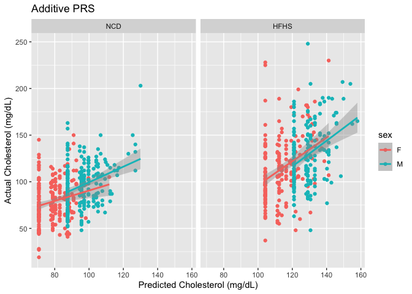
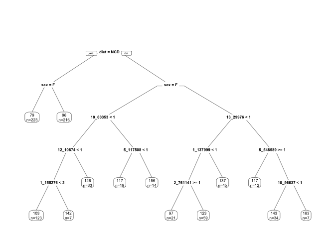
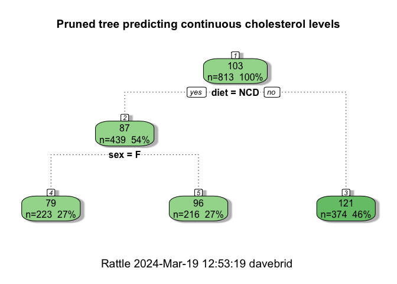
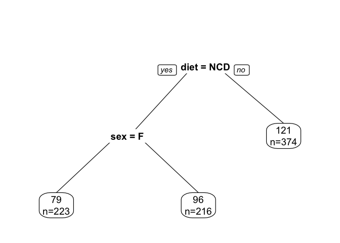

# Purpose

Used QTLs identified in **qtl_analysis.Rmd**, and create plots of their associations with cholesterol

# Experimental Details

This analyses the data from the server where the bimbam file with genotypes was filtered for SNPs of interest using this code, where **SNPs_of_interest.txt** was generated as a nonredundant list of interesting SNPs


# Data Entry


```r
genotype.file <- 'Genotypes_of_interest.bimbam'
cholesterol.file <- 'Cholesterol_all.txt'
covariates.file <- 'Covariates.tab'

genotype.data <- read_csv(genotype.file, col_names = F) 
snps <- genotype.data %>% select(X1,X2,X3)

genotype.data.clean <-
  genotype.data %>%
  select(-X1,-X2,-X3) %>%
  mutate_all(round)

genotype.data.clean.r <-as.data.frame(t(genotype.data.clean))

cholesterol.data <- read_table(cholesterol.file, col_names = F)
covariates.data <- read_delim(covariates.file, col_names = F)

combined.data <- data.frame(Cholesterol=cholesterol.data$X1,
                            Sex=covariates.data$X2,
                            Diet=covariates.data$X3) %>%
  mutate(sex = case_when(Sex==0~"M",
                         Sex==1~"F")) %>%
  mutate(diet = case_when(Diet==1~"HFHS",
                         Diet==0~"NCD")) %>%
  select(-Sex,-Diet) %>%
  bind_cols(genotype.data.clean.r) %>%
  mutate(diet = relevel(as.factor(diet),ref="NCD"))

colnames(combined.data) <- c(colnames(combined.data)[1:3],snps$X1)
```


```r
combined.data.long <-
  combined.data %>%
  group_by(diet,sex) %>%
  pivot_longer(cols=4:89,
               names_to="SNP",
               values_to = "Count") 

summary.data <- combined.data.long %>%
  group_by(SNP,sex,diet,Count) %>%
  filter(!is.na(sex)) %>%
  summarize(Cholesterol.mean = mean(Cholesterol,na.rm=T),
            Cholesterol.se= se(Cholesterol),
            n=length(Cholesterol)) 

lm(Cholesterol ~ diet + sex, data=combined.data.long) %>% tidy %>% kable(caption="Summary statistics among all selected QTLs")
```


Table: Summary statistics among all selected QTLs

|term        | estimate| std.error| statistic| p.value|
|:-----------|--------:|---------:|---------:|-------:|
|(Intercept) |     79.1|     0.178|       444|       0|
|dietHFHS    |     33.8|     0.213|       159|       0|
|sexM        |     17.0|     0.212|        80|       0|
# PRS Analysis


```r
#simple model

null.lm <- lm(Cholesterol ~ diet + sex, data=combined.data)

null.lm %>% glance() %>% kable(caption="Null PRS, only diet and sex")
```


Table: Null PRS, only diet and sex

| r.squared| adj.r.squared| sigma| statistic| p.value| df| logLik|  AIC|  BIC| deviance| df.residual| nobs|
|---------:|-------------:|-----:|---------:|-------:|--:|------:|----:|----:|--------:|-----------:|----:|
|     0.309|         0.307|  28.1|       181|       0|  2|  -3863| 7735| 7754|   638576|         810|  813|

```r
add.model <- lm(Cholesterol ~ diet + sex + `1_171425406_H_C` +
                   `5_123629774_B_E` +
                  `3_148547289_A_H` +
                  `13_29976363_E_C`, data=combined.data)

add.model %>% glance() %>% kable(caption="Four allele PRS, from additive model")
```


Table: Four allele PRS, from additive model

| r.squared| adj.r.squared| sigma| statistic| p.value| df| logLik|  AIC|  BIC| deviance| df.residual| nobs|
|---------:|-------------:|-----:|---------:|-------:|--:|------:|----:|----:|--------:|-----------:|----:|
|     0.377|         0.372|  26.7|      81.2|       0|  6|  -3821| 7658| 7696|   575598|         806|  813|

```r
anova(add.model,null.lm) %>% tidy %>% kable(caption="Chi squared test of f our allele additive model from null model", digits=c(1,1,1,1,1,1,99))
```


Table: Chi squared test of f our allele additive model from null model

|term                                                                                                     | df.residual|    rss| df|  sumsq| statistic|  p.value|
|:--------------------------------------------------------------------------------------------------------|-----------:|------:|--:|------:|---------:|--------:|
|Cholesterol ~ diet + sex + `1_171425406_H_C` + `5_123629774_B_E` + `3_148547289_A_H` + `13_29976363_E_C` |         806| 575598| NA|     NA|        NA|       NA|
|Cholesterol ~ diet + sex                                                                                 |         810| 638576| -4| -62978|        22| 2.74e-17|

```r
ggplot(data=combined.data[names(predict(add.model)),],
       aes(x=predict(add.model),
           y=Cholesterol,
           col=sex)) +
  geom_point() +
  geom_smooth(method="lm") +
  facet_grid(.~diet) +
  labs(x="Predicted Cholesterol (mg/dL)",
       y="Actual Cholesterol (mg/dL)",
       title="Additive PRS")
```

<!-- -->

# Regression Tree Classification


```r
library(rpart)
library(rattle)
rpart.tree <- rpart(Cholesterol ~ .,combined.data)
rpart.plot::prp(rpart.tree, extra=1, 
                main="",
                cex=0.5) 
```

<!-- -->

```r
rpart.tree$cptable %>% kable(caption="Complexity parameter table, used to idenfiy minumum crossvalidated error rate (xerror)")
```


Table: Complexity parameter table, used to idenfiy minumum crossvalidated error rate (xerror)

|    CP| nsplit| rel error| xerror|  xstd|
|-----:|------:|---------:|------:|-----:|
| 0.245|      0|     1.000|  1.006| 0.059|
| 0.038|      1|     0.755|  0.761| 0.045|
| 0.026|      2|     0.717|  0.729| 0.045|
| 0.018|      3|     0.691|  0.714| 0.045|
| 0.014|      4|     0.674|  0.719| 0.045|
| 0.014|      5|     0.660|  0.734| 0.046|
| 0.013|      6|     0.646|  0.732| 0.044|
| 0.012|      7|     0.633|  0.734| 0.045|
| 0.012|      8|     0.621|  0.729| 0.044|
| 0.011|      9|     0.609|  0.737| 0.044|
| 0.011|     10|     0.599|  0.742| 0.044|
| 0.010|     11|     0.588|  0.741| 0.044|
| 0.010|     12|     0.578|  0.742| 0.045|

```r
prune(rpart.tree, cp=0.026) -> rpart.tree.pruned

fancyRpartPlot(rpart.tree.pruned, uniform=TRUE, main="Pruned tree predicting continuous cholesterol levels")
```

<!-- -->

```r
rpart.plot::prp(rpart.tree.pruned, extra=1, 
                main="",
                cex=1.2) 
```

<!-- -->

The regression tree approach did not identify any genetic classifiers after pruning.

# Session Information


```r
sessionInfo()
```

```
## R version 4.3.3 (2024-02-29)
## Platform: x86_64-apple-darwin20 (64-bit)
## Running under: macOS Sonoma 14.3.1
## 
## Matrix products: default
## BLAS:   /Library/Frameworks/R.framework/Versions/4.3-x86_64/Resources/lib/libRblas.0.dylib 
## LAPACK: /Library/Frameworks/R.framework/Versions/4.3-x86_64/Resources/lib/libRlapack.dylib;  LAPACK version 3.11.0
## 
## locale:
## [1] en_US.UTF-8/en_US.UTF-8/en_US.UTF-8/C/en_US.UTF-8/en_US.UTF-8
## 
## time zone: America/Detroit
## tzcode source: internal
## 
## attached base packages:
## [1] stats     graphics  grDevices utils     datasets  methods   base     
## 
## other attached packages:
##  [1] rattle_5.5.1  bitops_1.0-7  tibble_3.2.1  rpart_4.1.23  ggplot2_3.5.0
##  [6] broom_1.0.5   dplyr_1.1.4   tidyr_1.3.1   readr_2.1.5   knitr_1.45   
## 
## loaded via a namespace (and not attached):
##  [1] sass_0.4.8         utf8_1.2.4         generics_0.1.3     stringi_1.8.3     
##  [5] lattice_0.22-5     hms_1.1.3          digest_0.6.34      magrittr_2.0.3    
##  [9] RColorBrewer_1.1-3 evaluate_0.23      grid_4.3.3         fastmap_1.1.1     
## [13] jsonlite_1.8.8     Matrix_1.6-5       backports_1.4.1    rpart.plot_3.1.2  
## [17] mgcv_1.9-1         purrr_1.0.2        fansi_1.0.6        scales_1.3.0      
## [21] jquerylib_0.1.4    cli_3.6.2          rlang_1.1.3        crayon_1.5.2      
## [25] bit64_4.0.5        munsell_0.5.0      splines_4.3.3      withr_3.0.0       
## [29] cachem_1.0.8       yaml_2.3.8         tools_4.3.3        parallel_4.3.3    
## [33] tzdb_0.4.0         colorspace_2.1-0   vctrs_0.6.5        R6_2.5.1          
## [37] lifecycle_1.0.4    stringr_1.5.1      bit_4.0.5          vroom_1.6.5       
## [41] pkgconfig_2.0.3    pillar_1.9.0       bslib_0.6.1        gtable_0.3.4      
## [45] glue_1.7.0         highr_0.10         xfun_0.42          tidyselect_1.2.0  
## [49] farver_2.1.1       htmltools_0.5.7    nlme_3.1-164       rmarkdown_2.26    
## [53] labeling_0.4.3     compiler_4.3.3
```

