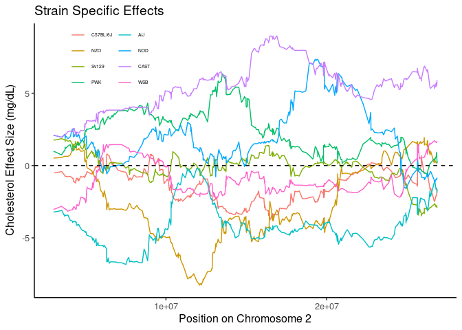

# Purpose

# Experimental Details

This analyses the data analysed via GEMMA and provided in the various output folders.

# Data Entry


``` r
# additive lmm data
lmm.additive.filename <- 'output/cholesterol_all.assoc.txt'
lmm.additive.data <- read_tsv(lmm.additive.filename) %>%
  separate(rs, sep="_", into=c("chromosome","position","allele","alt"),remove=FALSE) %>%
  mutate(chromosome=factor(chromosome, c(1:19,"X"))) %>%
  mutate(position=as.integer(position))

lmm.males.filename <- 'output/cholesterol_males.assoc.txt'
lmm.males.results <- read_tsv(lmm.males.filename) %>%
  separate(rs, sep="_", into=c("chromosome","position","allele","alt"),remove=FALSE) %>%
  mutate(chromosome=factor(chromosome, c(1:19,"X"))) %>%
  mutate(position=as.integer(position))

lmm.females.filename <- 'output/cholesterol_females.assoc.txt'
lmm.females.results <- read_tsv(lmm.females.filename) %>%
  separate(rs, sep="_", into=c("chromosome","position","allele","alt"),remove=FALSE) %>%
  mutate(chromosome=factor(chromosome, c(1:19,"X"))) %>%
  mutate(position=as.integer(position))
```


# Additive Models

Ran the additive models using GEMMA, first using intercepts and additive covariates for diet and sex

$SNP = beta_1 SNP + \beta_2 Diet + \beta_3 Sex + \mu +\epsilon$

Where $$\epsilon$$ are the residuals and $$\mu$$ is the relationship matrix of the strains as defined by

## LMM Analysis for Additive Models


``` r
library(qqman)
qq(lmm.additive.data$p_wald)
```

<!-- -->

``` r
suggestive.pval <- 1E-5
genome.pval <- 5E-8

lmm.additive.data %>%
  arrange(p_wald) %>% 
  filter(p_wald<genome.pval) %>%
  kable(caption="Genome-wide significant associations from mixed linear models for cholesterol in additive model") 
```


Table: Genome-wide significant associations from mixed linear models for cholesterol in additive model

|chr |rs              |chromosome |  position|allele |alt |        ps| n_miss|allele1 |allele0 |    af| beta|   se| logl_H1| l_remle| p_wald|
|:---|:---------------|:----------|---------:|:------|:---|---------:|------:|:-------|:-------|-----:|----:|----:|-------:|-------:|------:|
|1   |1_171425406_H_C |1          | 171425406|H      |C   | 171425406|      0|C       |H       | 0.094| 14.6| 2.62|   -3815|    2.22|      0|
|1   |1_171431917_H_C |1          | 171431917|H      |C   | 171431917|      0|C       |H       | 0.094| 14.6| 2.62|   -3815|    2.22|      0|
|1   |1_171295194_H_C |1          | 171295194|H      |C   | 171295194|      0|C       |H       | 0.095| 14.5| 2.61|   -3815|    2.21|      0|
|1   |1_171418895_H_C |1          | 171418895|H      |C   | 171418895|      0|C       |H       | 0.095| 14.5| 2.62|   -3815|    2.22|      0|

``` r
lmm.additive.data %>%
  arrange(p_wald) %>% 
  filter(p_wald<suggestive.pval) %>%
  mutate(position.start = substr(as.character(position), 1,2)) %>%
  group_by(chromosome,position.start) %>%
  summarize_all(.funs=first) %>%
  select(-position.start,-chr,-ps) %>%
  kable(caption="Suggestive genome-wide significant associations from mixed linear models for cholesterol in additive model, clumped by first two digits of the position") 
```


Table: Suggestive genome-wide significant associations from mixed linear models for cholesterol in additive model, clumped by first two digits of the position

|chromosome |rs              |  position|allele |alt | n_miss|allele1 |allele0 |    af|  beta|   se| logl_H1| l_remle| p_wald|
|:----------|:---------------|---------:|:------|:---|------:|:-------|:-------|-----:|-----:|----:|-------:|-------:|------:|
|1          |1_138064771_D_H | 138064771|D      |H   |      0|H       |D       | 0.160| 10.41| 2.14|   -3818|    1.75|      0|
|1          |1_143704476_D_H | 143704476|D      |H   |      0|H       |D       | 0.161|  9.94| 2.15|   -3820|    1.79|      0|
|1          |1_155276305_H_H | 155276305|H      |H   |      0|H       |H       | 0.199|  9.83| 1.98|   -3818|    1.64|      0|
|1          |1_169972414_F_C | 169972414|F      |C   |      0|C       |F       | 0.084| 14.85| 2.72|   -3815|    2.23|      0|
|1          |1_171425406_H_C | 171425406|H      |C   |      0|C       |H       | 0.094| 14.59| 2.62|   -3815|    2.22|      0|
|5          |5_123629774_B_E | 123629774|B      |E   |      0|E       |B       | 0.110| 11.66| 2.45|   -3819|    2.17|      0|

``` r
lmm.additive.data %>%
  arrange(p_wald) %>% 
  filter(p_wald<1E-4) %>%
  mutate(position.start = substr(as.character(position), 1,2)) %>%
  group_by(chromosome,position.start) %>%
  summarize_all(.funs=first) %>%
  select(-position.start,-chr,-ps) -> additive.snp.summary

additive.snp.summary %>%
  kable(caption="Relaxed suggestive genome-wide significant associations from mixed linear models for cholesterol in additive model, clumped by first two digits of the position") 
```


Table: Relaxed suggestive genome-wide significant associations from mixed linear models for cholesterol in additive model, clumped by first two digits of the position

|chromosome |rs              |  position|allele |alt | n_miss|allele1 |allele0 |    af|  beta|   se| logl_H1| l_remle| p_wald|
|:----------|:---------------|---------:|:------|:---|------:|:-------|:-------|-----:|-----:|----:|-------:|-------:|------:|
|1          |1_138064771_D_H | 138064771|D      |H   |      0|H       |D       | 0.160| 10.41| 2.14|   -3818|    1.75|      0|
|1          |1_143704476_D_H | 143704476|D      |H   |      0|H       |D       | 0.161|  9.94| 2.15|   -3820|    1.79|      0|
|1          |1_155276305_H_H | 155276305|H      |H   |      0|H       |H       | 0.199|  9.83| 1.98|   -3818|    1.64|      0|
|1          |1_169972414_F_C | 169972414|F      |C   |      0|C       |F       | 0.084| 14.85| 2.72|   -3815|    2.23|      0|
|1          |1_171425406_H_C | 171425406|H      |C   |      0|C       |H       | 0.094| 14.59| 2.62|   -3815|    2.22|      0|
|3          |3_148547289_A_H | 148547289|A      |H   |      0|H       |A       | 0.109| 10.00| 2.48|   -3822|    1.99|      0|
|5          |5_123629774_B_E | 123629774|B      |E   |      0|E       |B       | 0.110| 11.66| 2.45|   -3819|    2.17|      0|
|13         |13_29976363_E_C |  29976363|E      |C   |      0|C       |E       | 0.156|  9.25| 2.19|   -3821|    2.10|      0|
|13         |13_30180778_E_C |  30180778|E      |C   |      0|C       |E       | 0.156|  9.27| 2.19|   -3821|    2.10|      0|

``` r
library(ggmanh)
manhattan_plot(x = lmm.additive.data, pval.colname = "p_wald", chr.colname = "chromosome", pos.colname = "position", plot.title = "DO Mice (females, Additive Model)", y.label = "LOD Score")
```

<!-- -->

``` r
#library(GWASTools)
#with(lmm.additive.data,manhattanPlot(p=p_wald,
                               #chromosome=chromosome,
                               #signif=suggestive.pval))
```

### Chromosome 1 Peak


``` r
snp.pos <- 171425406
library(forcats)
peak1.b <- filter(lmm.additive.data,
                  chromosome==1,
                  position>snp.pos-20000000,
                  position<snp.pos+20000000) %>%
  mutate(alt=fct_recode(as.factor(alt),
                        "C57BL/6J"="A",
                        "NZO"="B",
                        "Sv129"="C",
                        "PWK"="D",
                        "A/J"="E",
                        "NOD"="F",
                        "CAST"="G",
                        "WSB"="H"))

ggplot(data=peak1.b,
       aes(x=position,
       y=beta,
       col=alt,
       group=alt)) +
  geom_line() +
  geom_hline(yintercept=0,lty=2) +
  labs(title="Strain Specific Effects",
       y="Cholesterol Effect Size (mg/dL)",
       x="Position on Chromosome 1") +
  scale_color_discrete(name="") +
  guides(col=guide_legend(ncol=2)) +
  theme_classic(base_size=12) +
  theme(legend.position=c(0.18,0.9),
        legend.text=element_text(size=8))
```

<!-- -->

``` r
snp.pos <- 80237174
library(forcats)
peak1 <- filter(lmm.additive.data,
                  chromosome==1,
                  position>snp.pos-35000000,
                  position<snp.pos+20000000) %>%
  mutate(alt=fct_recode(as.factor(alt),
                        "C57BL/6J"="A",
                        "NZO"="B",
                        "Sv129"="C",
                        "PWK"="D",
                        "A/J"="E",
                        "NOD"="F",
                        "CAST"="G",
                        "WSB"="H"))

ggplot(data=peak1,
       aes(x=position,
       y=beta,
       col=alt,
       group=alt)) +
  geom_line() +
  geom_hline(yintercept=0,lty=2) +
  labs(title="Strain Specific Effects",
       y="Cholesterol Effect Size (mg/dL)",
       x="Position on Chromosome 1") +
  scale_color_discrete(name="") +
  guides(col=guide_legend(ncol=2)) +
  theme_classic(base_size=12) +
  theme(legend.position=c(0.18,0.9),
        legend.text=element_text(size=4))
```

<!-- -->

``` r
snp.pos <- 143704476
library(forcats)
peak1 <- filter(lmm.additive.data,
                  chromosome==1,
                  position>snp.pos-20000000,
                  position<snp.pos+20000000) %>%
  mutate(alt=fct_recode(as.factor(alt),
                        "C57BL/6J"="A",
                        "NZO"="B",
                        "Sv129"="C",
                        "PWK"="D",
                        "A/J"="E",
                        "NOD"="F",
                        "CAST"="G",
                        "WSB"="H"))

ggplot(data=peak1,
       aes(x=position,
       y=beta,
       col=alt,
       group=alt)) +
  geom_line() +
  geom_hline(yintercept=0,lty=2) +
  labs(title="Strain Specific Effects",
       y="Cholesterol Effect Size (mg/dL)",
       x="Position on Chromosome 1") +
  scale_color_discrete(name="") +
  guides(col=guide_legend(ncol=2)) +
  theme_classic(base_size=12) +
  theme(legend.position=c(0.18,0.9),
        legend.text=element_text(size=4))
```

<!-- -->


``` r
snp.pos <- 148547289 
library(forcats)
peak3 <- filter(lmm.additive.data,
                  chromosome==3,
                  position>snp.pos-20000000,
                  position<snp.pos+20000000) %>%
  mutate(alt=fct_recode(as.factor(alt),
                        "C57BL/6J"="A",
                        "NZO"="B",
                        "Sv129"="C",
                        "PWK"="D",
                        "A/J"="E",
                        "NOD"="F",
                        "CAST"="G",
                        "WSB"="H"))

ggplot(data=peak3,
       aes(x=position,
       y=beta,
       col=alt,
       group=alt)) +
  geom_line() +
  geom_hline(yintercept=0,lty=2) +
  labs(title="Strain Specific Effects",
       y="Cholesterol Effect Size (mg/dL)",
       x="Position on Chromosome 3") +
  scale_color_discrete(name="") +
  guides(col=guide_legend(ncol=2)) +
  theme_classic(base_size=12) +
  theme(legend.position=c(0.18,0.9),
        legend.text=element_text(size=4))
```

<!-- -->


``` r
snp.pos <- 16902424
library(forcats)
peak2 <- filter(lmm.additive.data,
                  chromosome==2,
                  position>snp.pos-20000000,
                  position<snp.pos+10000000) %>%
  mutate(alt=fct_recode(as.factor(alt),
                        "C57BL/6J"="A",
                        "NZO"="B",
                        "Sv129"="C",
                        "PWK"="D",
                        "A/J"="E",
                        "NOD"="F",
                        "CAST"="G",
                        "WSB"="H"))

ggplot(data=peak2,
       aes(x=position,
       y=beta,
       col=alt,
       group=alt)) +
  geom_line() +
  geom_hline(yintercept=0,lty=2) +
  labs(title="Strain Specific Effects",
       y="Cholesterol Effect Size (mg/dL)",
       x="Position on Chromosome 2") +
  scale_color_discrete(name="") +
  guides(col=guide_legend(ncol=2)) +
  theme_classic(base_size=12) +
  theme(legend.position=c(0.18,0.9),
        legend.text=element_text(size=5))
```

<!-- -->


``` r
snp.pos <-55298460

library(forcats)
peak5 <- filter(lmm.additive.data,
                  chromosome==5,
                  position>snp.pos-20000000,
                  position<snp.pos+20000000) %>%
  mutate(alt=fct_recode(as.factor(alt),
                        "C57BL/6J"="A",
                        "NZO"="B",
                        "Sv129"="C",
                        "PWK"="D",
                        "A/J"="E",
                        "NOD"="F",
                        "CAST"="G",
                        "WSB"="H"))

ggplot(data=peak5,
       aes(x=position,
       y=beta,
       col=alt,
       group=alt)) +
  geom_line() +
  geom_hline(yintercept=0,lty=2) +
  labs(title="Strain Specific Effects",
       y="Cholesterol Effect Size (mg/dL)",
       x="Position on Chromosome 5") +
  scale_color_discrete(name="") +
  guides(col=guide_legend(ncol=2)) +
  theme_classic(base_size=12) +
  theme(legend.position=c(0.18,0.9),
        legend.text=element_text(size=4))
```

<!-- -->


### Chromosome 5 Peak


``` r
snp.pos <- 123629774
peak5 <- filter(lmm.additive.data,
                  chromosome==5,
                  position>snp.pos-10000000,
                  position<snp.pos+10000000) %>%
  mutate(alt=fct_recode(as.factor(alt),
                        "C57BL/6J"="A",
                        "NZO"="B",
                        "Sv129"="C",
                        "PWK"="D",
                        "A/J"="E",
                        "NOD"="F",
                        "CAST"="G",
                        "WSB"="H"))

ggplot(data=peak5,
       aes(x=position,
       y=beta,
       col=alt,
       group=alt)) +
  geom_line() +
  geom_hline(yintercept=0,lty=2) +
  labs(title="Strain Specific Effects",
       y="Cholesterol Effect Size (mg/dL)",
       x="Position on Chromosome 5") +
  scale_color_discrete(name="") +
  guides(col=guide_legend(ncol=2)) +
  theme_classic(base_size=12) +
  theme(legend.position=c(0.18,0.9),
        legend.text=element_text(size=8))
```

<!-- -->
##Chromosome 10

``` r
snp.pos <- 54344829
peak10 <- filter(lmm.additive.data,
                  chromosome==10,
                  position>snp.pos-20000000,
                  position<snp.pos+30000000) %>%
  mutate(alt=fct_recode(as.factor(alt),
                        "C57BL/6J"="A",
                        "NZO"="B",
                        "Sv129"="C",
                        "PWK"="D",
                        "A/J"="E",
                        "NOD"="F",
                        "CAST"="G",
                        "WSB"="H"))

ggplot(data=peak10,
       aes(x=position,
       y=beta,
       col=alt,
       group=alt)) +
  geom_line() +
  geom_hline(yintercept=0,lty=2) +
  labs(title="Strain Specific Effects",
       y="Cholesterol Effect Size (mg/dL)",
       x="Position on Chromosome 10") +
  scale_color_discrete(name="") +
  guides(col=guide_legend(ncol=2)) +
  theme_classic(base_size=12) +
  theme(legend.position=c(0.18,0.9),
        legend.text=element_text(size=8))
```

<!-- -->
##Chromosome 10

``` r
snp.pos <- 95382136
library(forcats)
peak10.b <- filter(lmm.additive.data,
                  chromosome==10,
                  position>snp.pos-20000000,
                  position<snp.pos+20000000) %>%
  mutate(alt=fct_recode(as.factor(alt),
                        "C57BL/6J"="A",
                        "NZO"="B",
                        "Sv129"="C",
                        "PWK"="D",
                        "A/J"="E",
                        "NOD"="F",
                        "CAST"="G",
                        "WSB"="H"))

ggplot(data=peak10.b,
       aes(x=position,
       y=beta,
       col=alt,
       group=alt)) +
  geom_line() +
  geom_hline(yintercept=0,lty=2) +
  labs(title="Strain Specific Effects",
       y="Cholesterol Effect Size (mg/dL)",
       x="Position on Chromosome 10") +
  scale_color_discrete(name="") +
  guides(col=guide_legend(ncol=2)) +
  theme_classic(base_size=12) +
  theme(legend.position=c(0.18,0.9),
        legend.text=element_text(size=8))
```

<!-- -->


``` r
snp.pos <- 91658214
peak11 <- filter(lmm.additive.data,
                  chromosome==11,
                  position>snp.pos-20000000,
                  position<snp.pos+20000000) %>%
  mutate(alt=fct_recode(as.factor(alt),
                        "C57BL/6J"="A",
                        "NZO"="B",
                        "Sv129"="C",
                        "PWK"="D",
                        "A/J"="E",
                        "NOD"="F",
                        "CAST"="G",
                        "WSB"="H"))

ggplot(data=peak11,
       aes(x=position,
       y=beta,
       col=alt,
       group=alt)) +
  geom_line() +
  geom_hline(yintercept=0,lty=2) +
  labs(title="Strain Specific Effects",
       y="Cholesterol Effect Size (mg/dL)",
       x="Position on Chromosome 11") +
  scale_color_discrete(name="") +
  guides(col=guide_legend(ncol=2)) +
  theme_classic(base_size=12) +
  theme(legend.position=c(0.18,0.9),
        legend.text=element_text(size=8))
```

<!-- -->


``` r
snp.pos <-19934709
peak14 <- filter(lmm.additive.data,
                  chromosome==14,
                  position>snp.pos-40000000,
                  position<snp.pos+10000000) %>%
  mutate(alt=fct_recode(as.factor(alt),
                        "C57BL/6J"="A",
                        "NZO"="B",
                        "Sv129"="C",
                        "PWK"="D",
                        "A/J"="E",
                        "NOD"="F",
                        "CAST"="G",
                       "WSB"="H"))
# 
# ggplot(data=peak14,
#        aes(x=position,
#        y=beta,
#        col=alt,
#        group=alt)) +
#   geom_line() +
#   geom_hline(yintercept=0,lty=2) +
#   labs(title="Strain Specific Effects",
#        y="Cholesterol Effect Size (mg/dL)",
#        x="Position on Chromosome 14") +
#   scale_color_discrete(name="") +
#   guides(col=guide_legend(ncol=2)) +
#   theme_classic(base_size=12) +
#   theme(legend.position=c(0.18,0.9),
#         legend.text=element_text(size=5))
```

``` r
library(readr)
#figures makde will go to directory called figures, will make them as both png and pdf files 
opts_chunk$set(fig.path='figures/',
               echo=TRUE, warning=FALSE, message=FALSE,dev=c('png','pdf'))
options(scipen = 2, digits = 3)
snp.pos <- 4.5e07
library(forcats)
peak9 <- filter(lmm.additive.data,
                  chromosome==9,
                  position>snp.pos-20000000,
                  position<snp.pos+20000000) %>%
  mutate(alt=fct_recode(as.factor(alt),
                        "C57BL/6J"="A",
                        "NZO"="B",
                        "Sv129"="C",
                        "PWK"="D",
                        "A/J"="E",
                        "NOD"="F",
                        "CAST"="G",
                        "WSB"="H"))

ggplot(data=peak9,
       aes(x=position,
       y=beta,
       col=alt,
       group=alt)) +
  geom_line() +
  geom_hline(yintercept=0,lty=2) +
  labs(title="Strain Specific Effects",
       y="Cholesterol Effect Size (mg/dL)",
       x="Position on Chromosome 9") +
  scale_color_discrete(name="") +
  guides(col=guide_legend(ncol=2)) +
  theme_classic(base_size=12) +
  theme(legend.position=c(0.18,0.9),
        legend.text=element_text(size=5))
```

<!-- -->


##Chromosome 17

``` r
snp.pos <- 80080939
peak17 <- filter(lmm.additive.data,
                  chromosome==17,
                  position>snp.pos-10000000,
                  position<snp.pos+10000000) %>%
  mutate(alt=fct_recode(as.factor(alt),
                        "C57BL/6J"="A",
                        "NZO"="B",
                        "Sv129"="C",
                        "PWK"="D",
                        "A/J"="E",
                        "NOD"="F",
                        "CAST"="G",
                        "WSB"="H"))

 ggplot(data=peak17,
        aes(x=position,        
        y=beta,
        col=alt,
        group=alt)) +
   geom_line() +
   geom_hline(yintercept=0,lty=2) +
   labs(title="Strain Specific Effects",
        y="Cholesterol Effect Size (mg/dL)",
        x="Position on Chromosome 17") +
   scale_color_discrete(name="") +
   guides(col=guide_legend(ncol=2)) +
   theme_classic(base_size=12) +
   theme(legend.position=c(0.18,0.9),
         legend.text=element_text(size=5))
```

<!-- -->


``` r
library(readr)
#figures makde will go to directory called figures, will make them as both png and pdf files 
opts_chunk$set(fig.path='figures/',
               echo=TRUE, warning=FALSE, message=FALSE,dev=c('png','pdf'))
options(scipen = 2, digits = 3)
snp.pos <- 2e07
library(forcats)
peak12 <- filter(lmm.additive.data,
                  chromosome==12,
                  position>snp.pos-1e07,
                  position<snp.pos+1e07) %>%
  mutate(alt=fct_recode(as.factor(alt),
                        "C57BL/6J"="A",
                        "NZO"="B",
                        "Sv129"="C",
                        "PWK"="D",
                        "A/J"="E",
                        "NOD"="F",
                        "CAST"="G",
                        "WSB"="H"))

ggplot(data=peak12,
       aes(x=position,
       y=beta,
       col=alt,
       group=alt)) +
  geom_line() +
  geom_hline(yintercept=0,lty=2) +
  labs(title="Strain Specific Effects",
       y="Cholesterol Effect Size (mg/dL)",
       x="Position on Chromosome 12") +
  scale_color_discrete(name="") +
  guides(col=guide_legend(ncol=2)) +
  theme_classic(base_size=12) +
  theme(legend.position=c(0.18,0.9),
        legend.text=element_text(size=5))
```

<!-- -->

## SNP Analysis

### Linear Mixed Model SNP Analysis for Males


``` r
qq(lmm.males.results$p_wald)
```

<!-- -->

``` r
lmm.males.results %>%
  arrange(p_wald) %>% 
  filter(p_wald<genome.pval) %>%
  kable(caption="Genome-wide significant associations from mixed linear models for cholesterol on males") 
```


Table: Genome-wide significant associations from mixed linear models for cholesterol on males

|chr |rs |chromosome | position|allele |alt | ps| n_miss|allele1 |allele0 | af| beta| se| logl_H1| l_remle| p_wald|
|:---|:--|:----------|--------:|:------|:---|--:|------:|:-------|:-------|--:|----:|--:|-------:|-------:|------:|

``` r
lmm.males.results %>%
   arrange(p_wald) %>% 
   filter(p_wald<suggestive.pval) %>%
  mutate(position.start = substr(as.character(position), 1,2)) %>%
  group_by(chromosome,position.start) %>%
  summarize_all(.funs=first) %>%
  select(-position.start,-chr,-ps) -> males.snp.summary
  
lmm.males.results %>%
   arrange(p_wald) %>% 
   filter(p_wald<1E-3) %>%
   mutate(position.start = substr(as.character(position), 1,2)) %>%
  group_by(chromosome,position.start) %>%
  summarize_all(.funs=first) %>%
  select(-position.start,-chr,-ps)  %>% 
  kable(caption="Relaxed suggestive genome-wide significant associations from mixed linear models for cholesterol on females, clumped by first two digits of the position") 
```


Table: Relaxed suggestive genome-wide significant associations from mixed linear models for cholesterol on females, clumped by first two digits of the position

|chromosome |rs               |  position|allele |alt | n_miss|allele1 |allele0 |    af|   beta|   se| logl_H1| l_remle| p_wald|
|:----------|:----------------|---------:|:------|:---|------:|:-------|:-------|-----:|------:|----:|-------:|-------:|------:|
|1          |1_107745435_E_C  | 107745435|E      |C   |      0|C       |E       | 0.110|  10.89| 2.90|   -2001|    2.83|  0.000|
|1          |1_117367881_B_C  | 117367881|B      |C   |      0|C       |B       | 0.119|  10.42| 2.77|   -2001|    2.80|  0.000|
|1          |1_136593782_C_A  | 136593782|C      |A   |      0|A       |C       | 0.149|  -9.32| 2.61|   -2002|    2.21|  0.000|
|1          |1_152428168_H_A  | 152428168|H      |A   |      0|A       |H       | 0.139|  -9.87| 2.61|   -2001|    2.66|  0.000|
|1          |1_169972414_F_C  | 169972414|F      |C   |      0|C       |F       | 0.087|  14.62| 3.15|   -1998|    3.11|  0.000|
|1          |1_170324641_H_C  | 170324641|H      |C   |      0|C       |H       | 0.087|  14.65| 3.15|   -1998|    3.10|  0.000|
|2          |2_13971815_H_G   |  13971815|H      |G   |      0|G       |H       | 0.128|   9.87| 2.71|   -2002|    2.69|  0.000|
|2          |2_14535771_H_G   |  14535771|H      |G   |      0|G       |H       | 0.132|  10.16| 2.67|   -2001|    2.69|  0.000|
|2          |2_15491718_H_G   |  15491718|H      |G   |      0|G       |H       | 0.111|  12.16| 2.80|   -1999|    2.46|  0.000|
|2          |2_16145267_H_G   |  16145267|H      |G   |      0|G       |H       | 0.111|  12.36| 2.82|   -1999|    2.46|  0.000|
|2          |2_17071852_H_G   |  17071852|H      |G   |      0|G       |H       | 0.117|  11.32| 2.70|   -2000|    2.44|  0.000|
|2          |2_18068206_H_G   |  18068206|H      |G   |      0|G       |H       | 0.118|  10.89| 2.70|   -2000|    2.49|  0.000|
|2          |2_19158699_H_G   |  19158699|H      |G   |      0|G       |H       | 0.118|   9.95| 2.72|   -2002|    2.66|  0.000|
|2          |2_20154521_H_G   |  20154521|H      |G   |      0|G       |H       | 0.109|   9.63| 2.75|   -2002|    2.71|  0.001|
|2          |2_43690499_H_G   |  43690499|H      |G   |      0|G       |H       | 0.113|  10.87| 2.77|   -2000|    3.27|  0.000|
|2          |2_44256608_H_G   |  44256608|H      |G   |      0|G       |H       | 0.119|  10.43| 2.65|   -2000|    3.28|  0.000|
|2          |2_45242400_H_G   |  45242400|H      |G   |      0|G       |H       | 0.118|  10.66| 2.74|   -2001|    3.26|  0.000|
|2          |2_46253198_H_G   |  46253198|H      |G   |      0|G       |H       | 0.126|   9.50| 2.66|   -2002|    3.24|  0.000|
|2          |2_47871335_G_G   |  47871335|G      |G   |      0|G       |G       | 0.136|   9.71| 2.53|   -2001|    3.15|  0.000|
|2          |2_48818189_G_G   |  48818189|G      |G   |      0|G       |G       | 0.141|  10.06| 2.49|   -2000|    3.11|  0.000|
|2          |2_49650224_G_G   |  49650224|G      |G   |      0|G       |G       | 0.140|  10.63| 2.50|   -1999|    3.15|  0.000|
|2          |2_50330668_G_G   |  50330668|G      |G   |      0|G       |G       | 0.150|   8.73| 2.52|   -2002|    3.36|  0.001|
|3          |3_158368229_C_D  | 158368229|C      |D   |      0|D       |C       | 0.169|  -8.85| 2.53|   -2002|    3.06|  0.001|
|3          |3_160017104_F_B  | 160017104|F      |B   |      0|B       |F       | 0.111|   9.38| 2.76|   -2002|    3.25|  0.001|
|4          |4_54753377_C_G   |  54753377|C      |G   |      0|G       |C       | 0.122|   9.96| 2.73|   -2002|    2.84|  0.000|
|5          |5_122944168_B_E  | 122944168|B      |E   |      0|E       |B       | 0.118|  10.73| 2.74|   -2001|    3.49|  0.000|
|5          |5_143920616_B_A  | 143920616|B      |A   |      0|A       |B       | 0.126|   9.12| 2.75|   -2003|    3.25|  0.001|
|6          |6_127083191_C_E  | 127083191|C      |E   |      0|E       |C       | 0.068|  13.48| 3.51|   -2001|    3.25|  0.000|
|7          |7_138782782_C_H  | 138782782|C      |H   |      0|H       |C       | 0.092|  10.75| 3.06|   -2002|    3.61|  0.000|
|8          |8_110706632_H_G  | 110706632|H      |G   |      0|G       |H       | 0.116|   9.68| 2.76|   -2002|    3.43|  0.001|
|14         |14_105825620_G_H | 105825620|G      |H   |      0|H       |G       | 0.112|   9.55| 2.79|   -2002|    3.36|  0.001|
|14         |14_57716817_G_F  |  57716817|G      |F   |      0|F       |G       | 0.108|   9.51| 2.85|   -2003|    3.07|  0.001|
|14         |14_58928537_F_F  |  58928537|F      |F   |      0|F       |F       | 0.108|   9.73| 2.84|   -2002|    3.10|  0.001|
|14         |14_59011591_F_F  |  59011591|F      |F   |      0|F       |F       | 0.107|   9.77| 2.86|   -2002|    3.06|  0.001|
|14         |14_61606644_H_F  |  61606644|H      |F   |      0|F       |H       | 0.103|   9.99| 2.93|   -2002|    2.96|  0.001|
|14         |14_62948888_H_F  |  62948888|H      |F   |      0|F       |H       | 0.096|  10.96| 3.00|   -2001|    3.22|  0.000|
|14         |14_63527073_H_F  |  63527073|H      |F   |      0|F       |H       | 0.101|  11.95| 2.96|   -2000|    3.29|  0.000|
|14         |14_64318374_H_F  |  64318374|H      |F   |      0|F       |H       | 0.101|  11.96| 2.95|   -2000|    3.29|  0.000|
|14         |14_65047597_H_F  |  65047597|H      |F   |      0|F       |H       | 0.103|  11.84| 2.94|   -2000|    3.28|  0.000|
|14         |14_66022446_H_F  |  66022446|H      |F   |      0|F       |H       | 0.103|  10.25| 2.93|   -2002|    3.14|  0.001|
|14         |14_67143276_H_F  |  67143276|H      |F   |      0|F       |H       | 0.090|  10.97| 3.17|   -2002|    3.19|  0.001|
|15         |15_93728085_E_G  |  93728085|E      |G   |      0|G       |E       | 0.058|  13.00| 3.88|   -2003|    2.95|  0.001|
|15         |15_94566593_F_G  |  94566593|F      |G   |      0|G       |F       | 0.062|  12.95| 3.68|   -2002|    3.00|  0.000|
|18         |18_45622961_G_A  |  45622961|G      |A   |      0|A       |G       | 0.145|   8.74| 2.48|   -2002|    3.06|  0.000|
|18         |18_46410922_G_A  |  46410922|G      |A   |      0|A       |G       | 0.136|  11.08| 2.61|   -1999|    3.00|  0.000|
|18         |18_47130148_G_A  |  47130148|G      |A   |      0|A       |G       | 0.136|  10.01| 2.58|   -2001|    3.08|  0.000|
|18         |18_48037460_G_A  |  48037460|G      |A   |      0|A       |G       | 0.135|   9.53| 2.58|   -2001|    3.05|  0.000|
|X          |X_3046778_F_A    |   3046778|F      |A   |      0|A       |F       | 0.081| -10.04| 2.81|   -2002|    3.42|  0.000|
|X          |X_3140335_F_A    |   3140335|F      |A   |      0|A       |F       | 0.081| -10.04| 2.81|   -2002|    3.42|  0.000|
|X          |X_3233892_F_A    |   3233892|F      |A   |      0|A       |F       | 0.081| -10.04| 2.81|   -2002|    3.42|  0.000|
|X          |X_3327449_F_A    |   3327449|F      |A   |      0|A       |F       | 0.081| -10.04| 2.81|   -2002|    3.42|  0.000|
|X          |X_3421006_F_A    |   3421006|F      |A   |      0|A       |F       | 0.081| -10.04| 2.81|   -2002|    3.42|  0.000|
|X          |X_3514563_F_A    |   3514563|F      |A   |      0|A       |F       | 0.081| -10.04| 2.81|   -2002|    3.42|  0.000|
|X          |X_3608120_F_A    |   3608120|F      |A   |      0|A       |F       | 0.081| -10.04| 2.81|   -2002|    3.42|  0.000|
|X          |X_3701677_F_A    |   3701677|F      |A   |      0|A       |F       | 0.081| -10.04| 2.81|   -2002|    3.42|  0.000|
|X          |X_3842013_F_A    |   3842013|F      |A   |      0|A       |F       | 0.081| -10.04| 2.81|   -2002|    3.42|  0.000|
|X          |X_3935570_F_A    |   3935570|F      |A   |      0|A       |F       | 0.081| -10.04| 2.81|   -2002|    3.42|  0.000|
|X          |X_4029127_F_A    |   4029127|F      |A   |      0|A       |F       | 0.081| -10.04| 2.81|   -2002|    3.42|  0.000|
|X          |X_4122684_F_A    |   4122684|F      |A   |      0|A       |F       | 0.081| -10.04| 2.81|   -2002|    3.42|  0.000|
|X          |X_4216240_F_A    |   4216240|F      |A   |      0|A       |F       | 0.081| -10.04| 2.81|   -2002|    3.42|  0.000|
|X          |X_4309797_F_A    |   4309797|F      |A   |      0|A       |F       | 0.081| -10.04| 2.81|   -2002|    3.42|  0.000|
|X          |X_4403354_F_A    |   4403354|F      |A   |      0|A       |F       | 0.081| -10.04| 2.81|   -2002|    3.42|  0.000|
|X          |X_4543690_F_A    |   4543690|F      |A   |      0|A       |F       | 0.081| -10.04| 2.81|   -2002|    3.42|  0.000|
|X          |X_4637247_F_A    |   4637247|F      |A   |      0|A       |F       | 0.081| -10.04| 2.81|   -2002|    3.42|  0.000|
|X          |X_4730804_F_A    |   4730804|F      |A   |      0|A       |F       | 0.081| -10.04| 2.81|   -2002|    3.42|  0.000|
|X          |X_4824361_F_A    |   4824361|F      |A   |      0|A       |F       | 0.081| -10.04| 2.81|   -2002|    3.42|  0.000|
|X          |X_4917918_F_A    |   4917918|F      |A   |      0|A       |F       | 0.081| -10.04| 2.81|   -2002|    3.42|  0.000|
|X          |X_5058253_F_A    |   5058253|F      |A   |      0|A       |F       | 0.081| -10.04| 2.81|   -2002|    3.42|  0.000|
|X          |X_5151810_F_A    |   5151810|F      |A   |      0|A       |F       | 0.081| -10.04| 2.81|   -2002|    3.42|  0.000|
|X          |X_5292146_F_A    |   5292146|F      |A   |      0|A       |F       | 0.081| -10.04| 2.81|   -2002|    3.42|  0.000|
|X          |X_5385702_F_A    |   5385702|F      |A   |      0|A       |F       | 0.081| -10.04| 2.81|   -2002|    3.42|  0.000|
|X          |X_5432481_F_A    |   5432481|F      |A   |      0|A       |F       | 0.081| -10.04| 2.81|   -2002|    3.42|  0.000|
|X          |X_5710894_F_A    |   5710894|F      |A   |      0|A       |F       | 0.081| -10.06| 2.81|   -2002|    3.42|  0.000|
|X          |X_5989306_F_A    |   5989306|F      |A   |      0|A       |F       | 0.082| -10.07| 2.81|   -2002|    3.42|  0.000|
|X          |X_6094738_F_A    |   6094738|F      |A   |      0|A       |F       | 0.082| -10.02| 2.81|   -2002|    3.41|  0.000|
|X          |X_6162771_F_A    |   6162771|F      |A   |      0|A       |F       | 0.082| -10.03| 2.81|   -2002|    3.41|  0.000|
|X          |X_6264820_F_A    |   6264820|F      |A   |      0|A       |F       | 0.081| -10.05| 2.81|   -2002|    3.41|  0.000|
|X          |X_6332853_H_A    |   6332853|H      |A   |      0|A       |H       | 0.081| -10.04| 2.81|   -2002|    3.41|  0.000|
|X          |X_6407096_H_A    |   6407096|H      |A   |      0|A       |H       | 0.081| -10.03| 2.82|   -2002|    3.41|  0.000|
|X          |X_6506859_H_A    |   6506859|H      |A   |      0|A       |H       | 0.081| -10.01| 2.82|   -2002|    3.41|  0.000|
|X          |X_6613818_H_A    |   6613818|H      |A   |      0|A       |H       | 0.081|  -9.96| 2.82|   -2002|    3.40|  0.000|
|X          |X_6771601_H_A    |   6771601|H      |A   |      0|A       |H       | 0.080|  -9.94| 2.83|   -2002|    3.40|  0.000|
|X          |X_6882326_H_A    |   6882326|H      |A   |      0|A       |H       | 0.080|  -9.94| 2.83|   -2002|    3.40|  0.000|
|X          |X_6964206_H_A    |   6964206|H      |A   |      0|A       |H       | 0.080|  -9.95| 2.83|   -2002|    3.40|  0.000|
|X          |X_7061062_H_A    |   7061062|H      |A   |      0|A       |H       | 0.080|  -9.98| 2.83|   -2002|    3.41|  0.000|
|X          |X_7117389_H_A    |   7117389|H      |A   |      0|A       |H       | 0.079|  -9.85| 2.85|   -2002|    3.40|  0.001|
|X          |X_7279565_H_A    |   7279565|H      |A   |      0|A       |H       | 0.080|  -9.59| 2.86|   -2003|    3.41|  0.001|
|X          |X_7332154_H_A    |   7332154|H      |A   |      0|A       |H       | 0.079|  -9.60| 2.86|   -2003|    3.42|  0.001|
|X          |X_7855167_H_A    |   7855167|H      |A   |      0|A       |H       | 0.082|  -9.48| 2.86|   -2003|    3.42|  0.001|
|X          |X_7941585_H_A    |   7941585|H      |A   |      0|A       |H       | 0.083|  -9.46| 2.83|   -2003|    3.40|  0.001|
|X          |X_8061743_H_A    |   8061743|H      |A   |      0|A       |H       | 0.083|  -9.81| 2.83|   -2002|    3.40|  0.001|
|X          |X_8193637_H_A    |   8193637|H      |A   |      0|A       |H       | 0.082| -10.00| 2.85|   -2002|    3.38|  0.000|
|X          |X_8244135_H_A    |   8244135|H      |A   |      0|A       |H       | 0.081|  -9.78| 2.86|   -2002|    3.36|  0.001|
|X          |X_8313931_H_A    |   8313931|H      |A   |      0|A       |H       | 0.080|  -9.87| 2.87|   -2002|    3.35|  0.001|
|X          |X_8482191_H_A    |   8482191|H      |A   |      0|A       |H       | 0.079|  -9.88| 2.87|   -2002|    3.35|  0.001|
|X          |X_8558623_H_A    |   8558623|H      |A   |      0|A       |H       | 0.076|  -9.89| 2.93|   -2002|    3.34|  0.001|
|X          |X_8653844_H_A    |   8653844|H      |A   |      0|A       |H       | 0.076|  -9.89| 2.93|   -2002|    3.34|  0.001|
|X          |X_8701454_H_A    |   8701454|H      |A   |      0|A       |H       | 0.077|  -9.85| 2.93|   -2003|    3.33|  0.001|
|X          |X_8804402_H_A    |   8804402|H      |A   |      0|A       |H       | 0.078|  -9.77| 2.92|   -2003|    3.32|  0.001|
|X          |X_9079501_H_A    |   9079501|H      |A   |      0|A       |H       | 0.076|  -9.85| 2.97|   -2003|    3.21|  0.001|
|X          |X_9167492_H_A    |   9167492|H      |A   |      0|A       |H       | 0.076|  -9.91| 2.97|   -2003|    3.24|  0.001|
|X          |X_9209110_H_A    |   9209110|H      |A   |      0|A       |H       | 0.076|  -9.88| 2.98|   -2003|    3.23|  0.001|

``` r
males.snp.summary %>%
  kable(caption="Suggestive genome-wide significant associations from mixed linear models for cholesterol on females, clumped by first two digits of the position") 
```


Table: Suggestive genome-wide significant associations from mixed linear models for cholesterol on females, clumped by first two digits of the position

|chromosome |rs              |  position|allele |alt | n_miss|allele1 |allele0 |    af| beta|   se| logl_H1| l_remle| p_wald|
|:----------|:---------------|---------:|:------|:---|------:|:-------|:-------|-----:|----:|----:|-------:|-------:|------:|
|1          |1_169972414_F_C | 169972414|F      |C   |      0|C       |F       | 0.087| 14.6| 3.15|   -1998|    3.11|      0|
|1          |1_170324641_H_C | 170324641|H      |C   |      0|C       |H       | 0.087| 14.7| 3.15|   -1998|    3.10|      0|

``` r
manhattan_plot(x = lmm.males.results, pval.colname = "p_wald", chr.colname = "chromosome", pos.colname = "position", plot.title = "DO Mice (males)", y.label = "LOD Score") -> males.manhattan

males.manhattan
```

<!-- -->

### Linear Mixed Model SNP Analysis for females


``` r
qq(lmm.females.results$p_wald)
```

<!-- -->

``` r
lmm.females.results %>%
  arrange(p_wald) %>% 
  filter(p_wald<genome.pval) %>%
  kable(caption="Genome-wide significant associations from mixed linear models for cholesterol on females") 
```


Table: Genome-wide significant associations from mixed linear models for cholesterol on females

|chr |rs |chromosome | position|allele |alt | ps| n_miss|allele1 |allele0 | af| beta| se| logl_H1| l_remle| p_wald|
|:---|:--|:----------|--------:|:------|:---|--:|------:|:-------|:-------|--:|----:|--:|-------:|-------:|------:|

``` r
lmm.females.results %>%
   arrange(p_wald) %>% 
   filter(p_wald<suggestive.pval) %>%
   mutate(position.start = substr(as.character(position), 1,2)) %>%
  group_by(chromosome,position.start) %>%
  summarize_all(.funs=first) %>%
  select(-position.start,-chr,-ps) %>%
  kable(caption="Suggestive genome-wide significant associations from mixed linear models for cholesterol on females, clumped by first two digits of the position") 
```


Table: Suggestive genome-wide significant associations from mixed linear models for cholesterol on females, clumped by first two digits of the position

|chromosome |rs | position|allele |alt | n_miss|allele1 |allele0 | af| beta| se| logl_H1| l_remle| p_wald|
|:----------|:--|--------:|:------|:---|------:|:-------|:-------|--:|----:|--:|-------:|-------:|------:|

``` r
lmm.females.results %>%
   arrange(p_wald) %>% 
   filter(p_wald<1E-3) %>%
   mutate(position.start = substr(as.character(position), 1,2)) %>%
  group_by(chromosome,position.start) %>%
  summarize_all(.funs=first) %>%
  select(-position.start,-chr,-ps) ->
  females.snp.summary

females.snp.summary %>%
  kable(caption="Suggestive genome-wide significant associations from mixed linear models for cholesterol on females, clumped by first two digits of the position") 
```


Table: Suggestive genome-wide significant associations from mixed linear models for cholesterol on females, clumped by first two digits of the position

|chromosome |rs               |  position|allele |alt | n_miss|allele1 |allele0 |    af|  beta|   se| logl_H1| l_remle| p_wald|
|:----------|:----------------|---------:|:------|:---|------:|:-------|:-------|-----:|-----:|----:|-------:|-------:|------:|
|1          |1_137999848_D_H  | 137999848|D      |H   |      0|H       |D       | 0.183|  13.5| 3.46|   -1828|    1.59|  0.000|
|1          |1_145155626_A_H  | 145155626|A      |H   |      0|H       |A       | 0.169|  14.9| 3.51|   -1827|    1.60|  0.000|
|1          |1_156760432_B_H  | 156760432|B      |H   |      0|H       |B       | 0.193|  15.4| 3.49|   -1826|    1.66|  0.000|
|1          |1_160017753_H_H  | 160017753|H      |H   |      0|H       |H       | 0.221|  12.8| 3.39|   -1829|    1.80|  0.000|
|1          |1_171425406_H_C  | 171425406|H      |C   |      0|C       |H       | 0.097|  15.0| 4.53|   -1830|    2.63|  0.001|
|1          |1_82976244_F_B   |  82976244|F      |B   |      0|B       |F       | 0.138| -13.3| 3.98|   -1830|    2.46|  0.001|
|1          |1_83629456_F_B   |  83629456|F      |B   |      0|B       |F       | 0.144| -13.2| 3.83|   -1830|    2.69|  0.001|
|2          |2_44937781_H_E   |  44937781|H      |E   |      0|E       |H       | 0.076| -18.0| 5.09|   -1829|    2.60|  0.000|
|2          |2_45843192_H_E   |  45843192|H      |E   |      0|E       |H       | 0.076| -18.0| 5.07|   -1829|    2.62|  0.000|
|2          |2_46663204_D_E   |  46663204|D      |E   |      0|E       |D       | 0.074| -18.2| 5.08|   -1829|    2.70|  0.000|
|2          |2_47121856_D_E   |  47121856|D      |E   |      0|E       |D       | 0.074| -18.2| 5.08|   -1829|    2.70|  0.000|
|2          |2_48804294_G_E   |  48804294|G      |E   |      0|E       |G       | 0.070| -17.9| 5.36|   -1830|    2.66|  0.001|
|2          |2_6108249_D_E    |   6108249|D      |E   |      0|E       |D       | 0.132| -12.7| 3.80|   -1830|    2.73|  0.001|
|2          |2_6288486_D_E    |   6288486|D      |E   |      0|E       |D       | 0.131| -12.9| 3.80|   -1830|    2.73|  0.001|
|2          |2_6368382_D_E    |   6368382|D      |E   |      0|E       |D       | 0.129| -14.2| 3.83|   -1829|    2.77|  0.000|
|2          |2_6468723_D_E    |   6468723|D      |E   |      0|E       |D       | 0.128| -14.3| 3.83|   -1829|    2.77|  0.000|
|2          |2_6538764_D_E    |   6538764|D      |E   |      0|E       |D       | 0.127| -14.3| 3.84|   -1829|    2.78|  0.000|
|2          |2_6694186_D_E    |   6694186|D      |E   |      0|E       |D       | 0.127| -14.3| 3.83|   -1829|    2.78|  0.000|
|2          |2_6785451_D_E    |   6785451|D      |E   |      0|E       |D       | 0.127| -14.3| 3.84|   -1829|    2.79|  0.000|
|2          |2_6802081_D_E    |   6802081|D      |E   |      0|E       |D       | 0.127| -14.3| 3.84|   -1829|    2.79|  0.000|
|2          |2_7025078_D_E    |   7025078|D      |E   |      0|E       |D       | 0.127| -14.5| 3.86|   -1829|    2.77|  0.000|
|2          |2_7250227_D_E    |   7250227|D      |E   |      0|E       |D       | 0.127| -14.5| 3.86|   -1829|    2.77|  0.000|
|2          |2_7501966_H_E    |   7501966|H      |E   |      0|E       |H       | 0.122| -15.0| 3.93|   -1828|    2.74|  0.000|
|2          |2_7611414_D_E    |   7611414|D      |E   |      0|E       |D       | 0.125| -14.2| 3.90|   -1829|    2.76|  0.000|
|2          |2_7797604_H_E    |   7797604|H      |E   |      0|E       |H       | 0.124| -14.3| 3.90|   -1829|    2.73|  0.000|
|2          |2_7857737_H_E    |   7857737|H      |E   |      0|E       |H       | 0.124| -14.4| 3.92|   -1829|    2.73|  0.000|
|2          |2_8011673_H_E    |   8011673|H      |E   |      0|E       |H       | 0.123| -14.5| 3.92|   -1829|    2.75|  0.000|
|2          |2_8182575_A_E    |   8182575|A      |E   |      0|E       |A       | 0.125| -14.1| 3.88|   -1829|    2.73|  0.000|
|2          |2_8353477_A_E    |   8353477|A      |E   |      0|E       |A       | 0.127| -14.2| 3.88|   -1829|    2.72|  0.000|
|2          |2_8524379_A_E    |   8524379|A      |E   |      0|E       |A       | 0.127| -14.1| 3.87|   -1829|    2.73|  0.000|
|2          |2_8690542_A_E    |   8690542|A      |E   |      0|E       |A       | 0.128| -13.2| 3.91|   -1830|    2.65|  0.001|
|2          |2_8861444_A_E    |   8861444|A      |E   |      0|E       |A       | 0.127| -13.6| 3.87|   -1830|    2.75|  0.001|
|3          |3_53356261_H_F   |  53356261|H      |F   |      0|F       |H       | 0.078|  16.8| 4.95|   -1830|    2.10|  0.001|
|4          |4_136865478_F_D  | 136865478|F      |D   |      0|D       |F       | 0.124|  14.7| 4.13|   -1829|    2.22|  0.000|
|5          |5_117508066_B_E  | 117508066|B      |E   |      0|E       |B       | 0.153|  13.7| 3.68|   -1829|    2.43|  0.000|
|5          |5_126588021_E_H  | 126588021|E      |H   |      0|H       |E       | 0.171| -13.4| 3.69|   -1829|    2.07|  0.000|
|5          |5_39679307_E_A   |  39679307|E      |A   |      0|A       |E       | 0.090| -16.6| 4.51|   -1829|    2.38|  0.000|
|5          |5_40320928_H_A   |  40320928|H      |A   |      0|A       |H       | 0.096| -16.1| 4.41|   -1829|    2.34|  0.000|
|6          |6_107008934_D_A  | 107008934|D      |A   |      0|A       |D       | 0.077| -17.9| 4.67|   -1828|    2.75|  0.000|
|7          |7_17964892_C_A   |  17964892|C      |A   |      0|A       |C       | 0.075| -16.5| 4.95|   -1830|    2.88|  0.001|
|8          |8_3000000_H_C    |   3000000|H      |C   |      0|C       |H       | 0.077| -15.0| 4.48|   -1830|    2.55|  0.001|
|8          |8_3410751_H_C    |   3410751|H      |C   |      0|C       |H       | 0.077| -15.2| 4.49|   -1830|    2.56|  0.001|
|10         |10_100114175_D_D | 100114175|D      |D   |      0|D       |D       | 0.171| -11.4| 3.32|   -1830|    1.98|  0.001|
|10         |10_57753923_G_C  |  57753923|G      |C   |      0|C       |G       | 0.101|  15.6| 4.51|   -1830|    2.27|  0.001|
|10         |10_58072086_G_C  |  58072086|G      |C   |      0|C       |G       | 0.101|  15.4| 4.52|   -1830|    2.27|  0.001|
|10         |10_60353971_F_C  |  60353971|F      |C   |      0|C       |F       | 0.084|  16.7| 4.92|   -1830|    2.34|  0.001|
|10         |10_98955559_H_D  |  98955559|H      |D   |      0|D       |H       | 0.163| -12.4| 3.45|   -1829|    1.85|  0.000|
|10         |10_99490238_H_D  |  99490238|H      |D   |      0|D       |H       | 0.163| -12.9| 3.33|   -1828|    1.86|  0.000|
|12         |12_108754863_D_C | 108754863|D      |C   |      0|C       |D       | 0.122|  14.7| 3.88|   -1829|    2.28|  0.000|
|13         |13_27924769_G_C  |  27924769|G      |C   |      0|C       |G       | 0.147|  12.9| 3.74|   -1830|    2.24|  0.001|
|13         |13_28960280_G_C  |  28960280|G      |C   |      0|C       |G       | 0.158|  13.7| 3.60|   -1829|    2.09|  0.000|
|13         |13_29976363_E_C  |  29976363|E      |C   |      0|C       |E       | 0.161|  15.1| 3.59|   -1827|    2.13|  0.000|
|13         |13_30180778_E_C  |  30180778|E      |C   |      0|C       |E       | 0.161|  15.2| 3.59|   -1827|    2.13|  0.000|
|13         |13_31072103_E_C  |  31072103|E      |C   |      0|C       |E       | 0.159|  13.6| 3.61|   -1829|    2.15|  0.000|
|13         |13_32379268_A_C  |  32379268|A      |C   |      0|C       |A       | 0.156|  12.5| 3.64|   -1830|    2.10|  0.001|
|19         |19_25768410_H_G  |  25768410|H      |G   |      0|G       |H       | 0.116|  14.9| 4.29|   -1830|    2.56|  0.001|

``` r
manhattan_plot(x = lmm.females.results, pval.colname = "p_wald", chr.colname = "chromosome", pos.colname = "position", plot.title = "DO Mice (females)", y.label = "LOD Score") -> females.manhattan

females.manhattan
```

<!-- -->

#### Chromosome 13 QTL Associated with Cholesterol on females


``` r
snp.pos <- 29976363
library(forcats)
peak13 <- dplyr::filter(lmm.females.results,
                  chromosome==13,
                  position>snp.pos-10000000,
                  position<snp.pos+10000000) %>%
  mutate(alt=fct_recode(as.factor(alt),
                        "C57BL/6J"="A",
                        "NZO"="B",
                        "Sv129"="C",
                        "PWK"="D",
                        "A/J"="E",
                        "NOD"="F",
                        "CAST"="G",
                        "WSB"="H")) %>%
  mutate(LOD=-log10(p_wald)) %>%
  mutate(LOD.drop = LOD-max(LOD))
library(ggplot2)
ggplot(data=peak13,
       aes(x=position,
       y=beta,
       col=alt,
       group=alt)) +
  geom_line() +
  geom_hline(yintercept=0,lty=2) +
  labs(title="Strain Specific Effects",
       y="Cholesterol Effect Size on females (mg/dL)",
       x="Position on Chromosome 13") +
  scale_color_discrete(name="") +
  guides(col=guide_legend(ncol=2)) +
  theme_classic(base_size=16) +
  theme(legend.position=c(0.8,0.2),
        legend.text=element_text(size=8))
```

<!-- -->

``` r
#credible region 1.5 LOD less than peak 28011631-32375634
#From GenomMUSTer 3755 variants differ btween 129 and bl6
#upstream variants in Sox4 and 
#missense variant in rs29850511	chr13:29326051	T	Cdkal1	ENSMUST00000006353.13	Transcript	missense_variant	1879	1723	575	L/M	Ttg/Atg	rs29850511	EXON=16/16
#GWAS associated Cdkal1 with HDL and TC, seems to be a negative regulator of bile acid production, is atheroprotective in Apoe null mice
```

#### Chromosome 18 QTL Associated with Cholesterol on males


``` r
snp.pos <- 46410922
library(forcats)
peak13 <- dplyr::filter(lmm.males.results,
                  chromosome==18,
                  position>snp.pos-10000000,
                  position<snp.pos+10000000) %>%
  mutate(alt=fct_recode(as.factor(alt),
                        "C57BL/6J"="A",
                        "NZO"="B",
                        "Sv129"="C",
                        "PWK"="D",
                        "A/J"="E",
                        "NOD"="F",
                        "CAST"="G",
                        "WSB"="H")) %>%
  mutate(LOD=-log10(p_wald)) %>%
  mutate(LOD.drop = LOD-max(LOD))
library(ggplot2)
ggplot(data=peak13,
       aes(x=position,
       y=beta,
       col=alt,
       group=alt)) +
  geom_line() +
  geom_hline(yintercept=0,lty=2) +
  labs(title="Strain Specific Effects",
       y="Cholesterol Effect Size on males (mg/dL)",
       x="Position on Chromosome 18") +
  scale_color_discrete(name="") +
  guides(col=guide_legend(ncol=2)) +
  theme_classic(base_size=16) +
  theme(legend.position=c(0.8,0.2),
        legend.text=element_text(size=8))
```

<!-- -->

``` r
#credible region 1.5 LOD less than peak 28011631-32375634
#From GenomMUSTer 3755 variants differ btween 129 and bl6
#upstream variants in Sox4 and 
#missense variant in rs29850511	chr13:29326051	T	Cdkal1	ENSMUST00000006353.13	Transcript	missense_variant	1879	1723	575	L/M	Ttg/Atg	rs29850511	EXON=16/16
#GWAS associated Cdkal1 with HDL and TC, seems to be a negative regulator of bile acid production, is atheroprotective in Apoe null mice
```

### Comparason of males and females GWAS


``` r
library(cowplot)

# plots are drawn without alignment
plot_grid(males.manhattan, females.manhattan, align="v",ncol=1)
```

<!-- -->

# Summary of Interesting SNPs


``` r
snps.of.interest <- bind_rows(additive.snp.summary,females.snp.summary,males.snp.summary)

write_csv(snps.of.interest, file="SNPs_of_interest_sex.csv")
snps.of.interest %>% distinct(rs) %>% pull(rs) %>% write(file="SNPs_of_interest_sex.txt") #just the rsids
```

# Session Information


``` r
sessionInfo()
```

```
## R version 4.4.0 (2024-04-24)
## Platform: x86_64-pc-linux-gnu
## Running under: Red Hat Enterprise Linux 8.8 (Ootpa)
## 
## Matrix products: default
## BLAS:   /sw/pkgs/arc/stacks/gcc/13.2.0/R/4.4.0/lib64/R/lib/libRblas.so 
## LAPACK: /sw/pkgs/arc/stacks/gcc/13.2.0/R/4.4.0/lib64/R/lib/libRlapack.so;  LAPACK version 3.12.0
## 
## locale:
##  [1] LC_CTYPE=en_US.UTF-8       LC_NUMERIC=C              
##  [3] LC_TIME=en_US.UTF-8        LC_COLLATE=en_US.UTF-8    
##  [5] LC_MONETARY=en_US.UTF-8    LC_MESSAGES=en_US.UTF-8   
##  [7] LC_PAPER=en_US.UTF-8       LC_NAME=C                 
##  [9] LC_ADDRESS=C               LC_TELEPHONE=C            
## [11] LC_MEASUREMENT=en_US.UTF-8 LC_IDENTIFICATION=C       
## 
## time zone: America/Detroit
## tzcode source: system (glibc)
## 
## attached base packages:
## [1] stats     graphics  grDevices utils     datasets  methods   base     
## 
## other attached packages:
##  [1] cowplot_1.1.3 forcats_1.0.0 ggmanh_1.8.0  ggplot2_3.5.1 qqman_0.1.9  
##  [6] broom_1.0.7   dplyr_1.1.4   tidyr_1.3.1   readr_2.1.5   knitr_1.49   
## 
## loaded via a namespace (and not attached):
##  [1] sass_0.4.9         generics_0.1.3     hms_1.1.3          digest_0.6.37     
##  [5] magrittr_2.0.3     evaluate_1.0.1     grid_4.4.0         RColorBrewer_1.1-3
##  [9] calibrate_1.7.7    fastmap_1.2.0      jsonlite_1.8.9     backports_1.5.0   
## [13] purrr_1.0.2        scales_1.3.0       jquerylib_0.1.4    cli_3.6.3         
## [17] rlang_1.1.4        crayon_1.5.3       bit64_4.5.2        munsell_0.5.1     
## [21] withr_3.0.2        cachem_1.1.0       yaml_2.3.9         tools_4.4.0       
## [25] parallel_4.4.0     tzdb_0.4.0         colorspace_2.1-1   vctrs_0.6.5       
## [29] R6_2.5.1           lifecycle_1.0.4    bit_4.5.0.1        vroom_1.6.5       
## [33] MASS_7.3-60.2      pkgconfig_2.0.3    pillar_1.10.1      bslib_0.8.0       
## [37] gtable_0.3.6       glue_1.8.0         xfun_0.50          tibble_3.2.1      
## [41] tidyselect_1.2.1   rstudioapi_0.17.1  farver_2.1.2       htmltools_0.5.8.1 
## [45] rmarkdown_2.29     labeling_0.4.3     compiler_4.4.0
```

