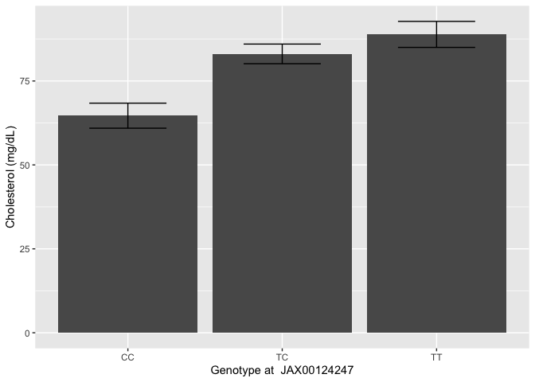
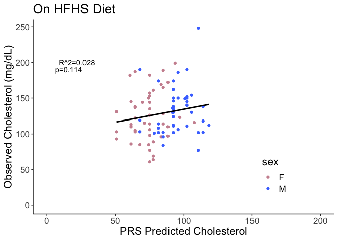
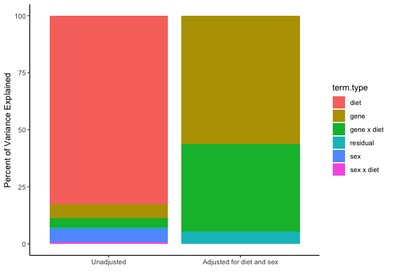

# Purpose

# Experimental Details

This analyses the data analysed via GEMMA and provided in the various output folders.

# Data Entry


## SNP Analysis

### Linear Mixed Model SNP Analysis for Chow


Table: Genome-wide significant associations from mixed linear models for cholesterol on NCD

|chr |rs | ps| n_miss|allele1 |allele0 | af| beta| se| logl_H1| l_remle| p_wald|
|:---|:--|--:|------:|:-------|:-------|--:|----:|--:|-------:|-------:|------:|


Table: Suggestive associations from mixed linear models for cholesterol on NCD.

|chr |rs          |       ps| n_miss|allele1 |allele0 |    af|  beta|   se| logl_H1| l_remle| p_wald|
|:---|:-----------|--------:|------:|:-------|:-------|-----:|-----:|----:|-------:|-------:|------:|
|11  |UNC19008219 |  5728194|      0|T       |X       | 0.786|  15.2| 2.92|    -393|  100000|      0|
|11  |UNC19004230 |  5278906|      0|A       |X       | 0.792|  14.8| 3.00|    -394|  100000|      0|
|11  |JAX00023949 |  5360959|      0|A       |X       | 0.797|  14.6| 3.05|    -394|  100000|      0|
|12  |UNC21619767 | 92403936|      0|C       |X       | 0.781| -10.6| 2.22|    -394|  100000|      0|


Table: Top nominal associations from mixed linear models for cholesterol on NCD

|chr |rs                 |       ps| n_miss|allele1 |allele0 |    af|  beta|   se| logl_H1| l_remle| p_wald|
|:---|:------------------|--------:|------:|:-------|:-------|-----:|-----:|----:|-------:|-------:|------:|
|11  |UNC19008219        |  5728194|      0|T       |X       | 0.786|  15.2| 2.92|    -393|  100000|      0|
|11  |UNC19004230        |  5278906|      0|A       |X       | 0.792|  14.8| 3.00|    -394|  100000|      0|
|11  |JAX00023949        |  5360959|      0|A       |X       | 0.797|  14.6| 3.05|    -394|  100000|      0|
|12  |UNC21619767        | 92403936|      0|C       |X       | 0.781| -10.6| 2.22|    -394|  100000|      0|
|11  |UNC19004988        |  5428780|      0|A       |X       | 0.802|  14.0| 3.06|    -395|  100000|      0|
|6   |backupUNC060370616 | 47102308|      0|A       |X       | 0.646| -16.9| 3.69|    -395|  100000|      0|

<!-- --><!-- -->

### Linear Mixed Model SNP Analysis for HFD

<!-- -->

Table: Genome-wide significant associations from mixed linear models for cholesterol on HFD

|chr |rs | ps| n_miss|allele1 |allele0 | af| beta| se| logl_H1| l_remle| p_wald|
|:---|:--|--:|------:|:-------|:-------|--:|----:|--:|-------:|-------:|------:|


Table: Suggestive associations from mixed linear models for cholesterol on HFD

|chr |rs         |        ps| n_miss|allele1 |allele0 |    af| beta|   se| logl_H1| l_remle| p_wald|
|:---|:----------|---------:|------:|:-------|:-------|-----:|----:|----:|-------:|-------:|------:|
|4   |UNC8307968 | 137030440|      0|C       |X       | 0.242| 15.9| 3.32|    -407|     7.8|      0|


Table: Top nominal associations from mixed linear models for cholesterol on HFD

|chr |rs                |        ps| n_miss|allele1 |allele0 |    af| beta|   se| logl_H1| l_remle| p_wald|
|:---|:-----------------|---------:|------:|:-------|:-------|-----:|----:|----:|-------:|-------:|------:|
|4   |UNC8307968        | 137030440|      0|C       |X       | 0.242| 15.9| 3.32|    -407|    7.80|      0|
|4   |UNC8305749        | 136899132|      0|A       |X       | 0.511| 19.3| 4.16|    -408|    7.88|      0|
|4   |UNC8306998        | 136974720|      0|A       |X       | 0.511| 19.3| 4.16|    -408|    7.88|      0|
|4   |backupJAX00125209 | 138427554|      0|T       |X       | 0.621| 20.6| 4.57|    -408|   13.22|      0|
|4   |UNC8307892        | 137025568|      0|A       |X       | 0.505| 18.7| 4.16|    -408|    8.04|      0|
|4   |UNC8301426        | 136621550|      0|A       |X       | 0.516| 18.4| 4.17|    -409|   10.08|      0|

<!-- -->


## BSLMM Analysis

### For Normal Chow Diet 


Table: Hyperparameters summary

|hyperparam |   mean| median|  2.5%|   97.5%|
|:----------|------:|------:|-----:|-------:|
|PVE        |  0.888|  0.937| 0.530|   1.000|
|PGE        |  0.378|  0.314| 0.000|   0.962|
|pi         |  0.001|  0.001| 0.000|   0.003|
|n.gamma    | 72.970| 48.000| 1.000| 229.000|
|Rho        |  0.421|  0.387| 0.018|   0.960|

### For High Fat Diet 


Table: Hyperparameters summary

|hyperparam |   mean| median|  2.5%|  97.5%|
|:----------|------:|------:|-----:|------:|
|PVE        |  0.697|  0.754| 0.112|  0.999|
|PGE        |  0.299|  0.247| 0.000|  0.890|
|pi         |  0.000|  0.000| 0.000|  0.001|
|n.gamma    | 11.800|  6.000| 0.000| 67.000|
|Rho        |  0.384|  0.351| 0.017|  0.911|

### BSLMM SNP Nomination for NCD


Table: Variants with the largest effect sizes

|chr |rs          |        ps| n_miss| alpha|  beta| gamma| eff.size|
|:---|:-----------|---------:|------:|-----:|-----:|-----:|--------:|
|11  |UNC19008219 |   5728194|      0| 0.007| 10.89| 0.102|    1.114|
|11  |UNC19004230 |   5278906|      0| 0.006|  8.27| 0.027|    0.223|
|11  |UNC19004988 |   5428780|      0| 0.006| 10.63| 0.013|    0.140|
|8   |UNC15632129 | 120333837|      0| 0.004|  9.50| 0.013|    0.126|
|11  |JAX00302993 |   5589616|      0| 0.006|  6.65| 0.013|    0.089|
|11  |JAX00023949 |   5360959|      0| 0.006|  7.92| 0.011|    0.087|
|6   |JAX00608797 |  46726402|      0| 0.006|  7.59| 0.008|    0.064|
|2   |UNC2988444  |  47211646|      0| 0.005|  2.85| 0.022|    0.063|
|3   |UNC4910274  |  26854828|      0| 0.004|  2.34| 0.026|    0.062|
|4   |UNC7148030  |  44347922|      0| 0.003|  4.46| 0.013|    0.058|


Table: Variants with the largest posterior probability

|chr |rs          |       ps| n_miss| alpha|   beta| gamma| eff.size|
|:---|:-----------|--------:|------:|-----:|------:|-----:|--------:|
|11  |UNC19008219 |  5728194|      0| 0.007| 10.886| 0.102|    1.114|
|4   |JAX00546340 | 19329973|      0| 0.000|  0.003| 0.030|    0.000|
|16  |UNC27099503 | 72682749|      0| 0.001|  0.395| 0.030|    0.012|
|11  |UNC19719893 | 58843699|      0| 0.003|  1.379| 0.029|    0.041|
|11  |UNC19715660 | 58622197|      0| 0.001|  0.394| 0.029|    0.012|
|9   |UNC16247528 | 42559566|      0| 0.001|  1.084| 0.028|    0.031|
|11  |UNC19004230 |  5278906|      0| 0.006|  8.269| 0.027|    0.223|
|2   |UNC2488740  |  4829165|      0| 0.005|  1.744| 0.027|    0.047|
|3   |UNC4910274  | 26854828|      0| 0.004|  2.344| 0.026|    0.062|
|17  |UNC27717713 | 26861900|      0| 0.000|  0.353| 0.026|    0.009|

### BSLMM SNP Nomination for HFD


Table: Variants with the largest effect sizes for HFD

|chr |rs                |        ps| n_miss| alpha| beta| gamma| eff.size|
|:---|:-----------------|---------:|------:|-----:|----:|-----:|--------:|
|4   |UNC8307968        | 137030440|      0| 0.011| 13.2| 0.063|    0.833|
|4   |UNC8305749        | 136899132|      0| 0.008| 15.9| 0.025|    0.395|
|4   |UNC8307892        | 137025568|      0| 0.008| 15.1| 0.025|    0.373|
|17  |UNC27920889       |  45579714|      0| 0.008| 15.6| 0.020|    0.305|
|4   |UNC8306998        | 136974720|      0| 0.008| 15.5| 0.016|    0.250|
|4   |UNC8319885        | 137891974|      0| 0.007| 15.3| 0.015|    0.230|
|4   |UNC8311234        | 137243059|      0| 0.007| 15.3| 0.015|    0.229|
|4   |backupJAX00125209 | 138427554|      0| 0.008| 16.6| 0.012|    0.204|
|17  |UNC27585545       |  13693352|      0| 0.008| 12.4| 0.015|    0.186|
|4   |UNC8327379        | 138408221|      0| 0.007| 14.6| 0.010|    0.141|


Table: Variants with the largest posterior probability for HFD

|chr |rs                |        ps| n_miss| alpha| beta| gamma| eff.size|
|:---|:-----------------|---------:|------:|-----:|----:|-----:|--------:|
|4   |UNC8307968        | 137030440|      0| 0.011| 13.2| 0.063|    0.833|
|4   |UNC8305749        | 136899132|      0| 0.008| 15.9| 0.025|    0.395|
|4   |UNC8307892        | 137025568|      0| 0.008| 15.1| 0.025|    0.373|
|17  |UNC27920889       |  45579714|      0| 0.008| 15.6| 0.020|    0.305|
|4   |UNC8306998        | 136974720|      0| 0.008| 15.5| 0.016|    0.250|
|4   |UNC8319885        | 137891974|      0| 0.007| 15.3| 0.015|    0.230|
|17  |UNC27585545       |  13693352|      0| 0.008| 12.4| 0.015|    0.186|
|4   |UNC8311234        | 137243059|      0| 0.007| 15.3| 0.015|    0.229|
|4   |backupJAX00125209 | 138427554|      0| 0.008| 16.6| 0.012|    0.204|
|4   |UNC8301426        | 136621550|      0| 0.008| 13.7| 0.010|    0.138|


### Comparason of BSLMM and LMM Nominated SNPs

<!-- -->

## Genomic Intervals


Table: Summary of genomic regions with SNPs in the top 25 by p-value

|chr |lead.snp           |        ps| sug.snps| p.val.log10|    ps.min|    ps.max| effect|
|:---|:------------------|---------:|--------:|-----------:|---------:|---------:|------:|
|11  |UNC19008219        |   5728194|        7|       -5.92|   5728194|   5728194|  15.19|
|12  |UNC21619767        |  92403936|        3|       -5.18|  92403936|  92403936|  10.22|
|6   |backupUNC060370616 |  47102308|        6|       -4.84|  47102308|  47102308|  14.40|
|9   |UNC090485124       |  95504483|        2|       -3.89|  95504483|  95504483|  -9.02|
|17  |UNC28426567        |  79608992|        1|       -3.77|  79608992|  79608992| -11.28|
|14  |UNC23854062        |  35832555|        1|       -3.73|  35832555|  35832555| -15.21|
|15  |UNC26156906        |  95159874|        3|       -3.68|  95159874|  95159874| -10.14|
|8   |UNC15522366        | 113272493|        1|       -3.67| 113272493| 113272493| -11.02|
|16  |UNC26985492        |  64356092|        1|       -3.54|  64356092|  64356092|  -9.96|


Table: Genes near top SNP interval +/- 500000

|gene_biotype                       |  n|genes                                                                                                                                |
|:----------------------------------|--:|:------------------------------------------------------------------------------------------------------------------------------------|
|protein_coding                     | 19|Znrf3, Xbp1, Ccdc117, Ankrd36, Mrps24, Urgcp, Dbnl, Pgam2, Polm, Aebp1, Pold2, Myl7, Gck, Ykt6, Camk2b, Nudcd3, Npc1l1, Ddx56, Tmed4 |
|processed_pseudogene               |  7|Gm11962, Gm11964, Gm11965, Gm11966, Rps15a-ps6, Gm11969, Gm11401                                                                     |
|lncRNA                             |  5|Gm57349, Gm11963, Ube2d-ps, Gm57397, Gm11967                                                                                         |
|rRNA                               |  1|Gm56346                                                                                                                              |
|snoRNA                             |  1|Gm22471                                                                                                                              |
|transcribed_unprocessed_pseudogene |  1|Ube2d-ps                                                                                                                             |

### Analysis of QTLs

<!-- --><!-- --><!-- -->

Table: ANOVA for sex-genotype interaction on chow only.

|term         | df| sumsq| meansq| statistic| p.value|
|:------------|--:|-----:|------:|---------:|-------:|
|sex          |  1|  5917|   5917|    14.516|   0.000|
|Genotype     |  2|  4557|   2279|     5.589|   0.005|
|sex:Genotype |  2|   776|    388|     0.951|   0.390|
|Residuals    | 88| 35873|    408|        NA|      NA|


Table: ANOVA for sex-genotype interaction.

|term        | estimate| std.error| statistic| p.value|
|:-----------|--------:|---------:|---------:|-------:|
|(Intercept) |     57.3|      8.97|      6.38|   0.000|
|sexM        |     16.9|      4.25|      3.98|   0.000|
|GenotypeTG  |     10.3|      9.36|      1.10|   0.273|
|GenotypeTT  |     22.3|      8.75|      2.55|   0.013|


Table: ANOVA for moderation of genotype effect by diet.

|term              |  df|  sumsq| meansq| statistic| p.value|
|:-----------------|---:|------:|------:|---------:|-------:|
|diet              |   1|  96218|  96218|   123.399|   0.000|
|sex               |   1|   6544|   6544|     8.393|   0.004|
|Genotype          |   2|    254|    127|     0.163|   0.850|
|diet:sex          |   1|    930|    930|     1.192|   0.276|
|diet:Genotype     |   2|   7014|   3507|     4.498|   0.012|
|sex:Genotype      |   2|    319|    159|     0.204|   0.815|
|diet:sex:Genotype |   1|   1781|   1781|     2.284|   0.133|
|Residuals         | 173| 134894|    780|        NA|      NA|


Table: ANOVA for moderation of genotype effect by diet.

|term          |  df|  sumsq| meansq| statistic| p.value|
|:-------------|---:|------:|------:|---------:|-------:|
|diet          |   1|  96218|  96218|   123.529|   0.000|
|sex           |   1|   6544|   6544|     8.402|   0.004|
|Genotype      |   2|    254|    127|     0.163|   0.850|
|diet:Genotype |   2|   7070|   3535|     4.538|   0.012|
|Residuals     | 177| 137867|    779|        NA|      NA|


Table: Model estimates for moderation of genotype effect by diet.

|term              | estimate| std.error| statistic| p.value|
|:-----------------|--------:|---------:|---------:|-------:|
|(Intercept)       |    60.88|      11.9|     5.108|   0.000|
|diethf            |    78.79|      20.0|     3.931|   0.000|
|sexM              |    12.54|       4.2|     2.986|   0.003|
|GenotypeTG        |     8.42|      12.8|     0.657|   0.512|
|GenotypeTT        |    20.75|      12.0|     1.727|   0.086|
|diethf:GenotypeTG |   -20.25|      21.4|    -0.945|   0.346|
|diethf:GenotypeTT |   -42.44|      20.7|    -2.048|   0.042|

<!-- --><!-- --><!-- -->

Table: ANOVA for sex-genotype interaction on chow only.

|term      | df| sumsq| meansq| statistic| p.value|
|:---------|--:|-----:|------:|---------:|-------:|
|sex       |  1|  3591|   3591|     9.784|   0.003|
|Genotype  |  2|   541|    270|     0.737|   0.482|
|Residuals | 73| 26790|    367|        NA|      NA|


Table: linear model for sex-genotype interaction.

|term        | estimate| std.error| statistic| p.value|
|:-----------|--------:|---------:|---------:|-------:|
|(Intercept) |     53.1|     19.68|     2.698|   0.009|
|sexM        |     14.9|      4.51|     3.300|   0.001|
|GenotypeAC  |      6.0|     27.09|     0.221|   0.825|
|GenotypeCC  |     19.7|     19.47|     1.012|   0.315|


Table: ANOVA for moderation of genotype effect by diet.

|term      |  df|  sumsq| meansq| statistic| p.value|
|:---------|---:|------:|------:|---------:|-------:|
|diet      |   1| 105775| 105775|    137.72|   0.000|
|sex       |   1|   3929|   3929|      5.12|   0.025|
|Genotype  |   2|   2269|   1134|      1.48|   0.232|
|Residuals | 149| 114439|    768|        NA|      NA|


Table: ANOVA for moderation of genotype effect by diet.

|term          |  df|  sumsq|   meansq| statistic| p.value|
|:-------------|---:|------:|--------:|---------:|-------:|
|diet          |   1| 105775| 105774.6|   136.025|   0.000|
|sex           |   1|   3929|   3928.7|     5.052|   0.026|
|Genotype      |   2|   2269|   1134.4|     1.459|   0.236|
|diet:Genotype |   2|    130|     65.2|     0.084|   0.920|
|Residuals     | 147| 114309|    777.6|        NA|      NA|


Table: Model estimates for moderation of genotype effect by diet.

|term              | estimate| std.error| statistic| p.value|
|:-----------------|--------:|---------:|---------:|-------:|
|(Intercept)       |    56.58|     28.27|     2.002|   0.047|
|diethf            |    57.61|     32.35|     1.781|   0.077|
|sexM              |    11.42|      4.62|     2.470|   0.015|
|GenotypeAC        |     6.00|     39.44|     0.152|   0.879|
|GenotypeCC        |    17.61|     28.21|     0.624|   0.533|
|diethf:GenotypeAC |   -17.28|     45.64|    -0.379|   0.706|
|diethf:GenotypeCC |    -5.05|     32.71|    -0.154|   0.878|

<!-- --><!-- --><!-- -->

Table: ANOVA for sex-genotype interaction on chow only.

|term         | df| sumsq| meansq| statistic| p.value|
|:------------|--:|-----:|------:|---------:|-------:|
|sex          |  1|  5187|   5187|     14.14|   0.000|
|Genotype     |  1|  2822|   2822|      7.69|   0.007|
|sex:Genotype |  1|  1850|   1850|      5.04|   0.027|
|Residuals    | 90| 33016|    367|        NA|      NA|


Table: linear model for sex-genotype interaction.

|term        | estimate| std.error| statistic| p.value|
|:-----------|--------:|---------:|---------:|-------:|
|(Intercept) |     66.7|      4.25|     15.68|   0.000|
|sexM        |     16.0|      4.06|      3.95|   0.000|
|GenotypeAG  |     11.8|      4.36|      2.71|   0.008|


Table: ANOVA for moderation of genotype effect by diet.

|term              |  df|  sumsq| meansq| statistic| p.value|
|:-----------------|---:|------:|------:|---------:|-------:|
|diet              |   1|  96155|  96155|   125.037|   0.000|
|sex               |   1|   5637|   5637|     7.331|   0.007|
|Genotype          |   1|   1490|   1490|     1.937|   0.166|
|diet:sex          |   1|    963|    963|     1.252|   0.265|
|diet:Genotype     |   1|   1093|   1093|     1.421|   0.235|
|sex:Genotype      |   1|   2491|   2491|     3.239|   0.074|
|diet:sex:Genotype |   1|    119|    119|     0.155|   0.694|
|Residuals         | 175| 134578|    769|        NA|      NA|


Table: ANOVA for moderation of genotype effect by diet.

|term          |  df|  sumsq| meansq| statistic| p.value|
|:-------------|---:|------:|------:|---------:|-------:|
|diet          |   1|  96155|  96155|    123.92|   0.000|
|sex           |   1|   5637|   5637|      7.26|   0.008|
|Genotype      |   1|   1490|   1490|      1.92|   0.168|
|diet:Genotype |   1|   1128|   1128|      1.45|   0.229|
|Residuals     | 178| 138115|    776|        NA|      NA|


Table: Model estimates for moderation of genotype effect by diet.

|term              | estimate| std.error| statistic| p.value|
|:-----------------|--------:|---------:|---------:|-------:|
|(Intercept)       |     69.1|      5.60|     12.34|   0.000|
|diethf            |     53.2|      7.06|      7.53|   0.000|
|sexM              |     11.6|      4.15|      2.80|   0.006|
|GenotypeAG        |     11.3|      6.18|      1.83|   0.069|
|diethf:GenotypeAG |    -10.5|      8.74|     -1.21|   0.229|

### Pre-Computed SNPs

This is based on the lead SNP from the precompiled viewer at https://churchilllab.jax.org/qtlviewer/svenson/DOHFD.  Lead SNP at chr1 171429283

<!-- --><!-- --><!-- -->

Table: ANOVA for sex-genotype interaction on chow only.

|term         | df|   sumsq| meansq| statistic| p.value|
|:------------|--:|-------:|------:|---------:|-------:|
|sex          |  1|  6122.7| 6122.7|    13.884|   0.000|
|Genotype     |  2|    64.1|   32.1|     0.073|   0.930|
|sex:Genotype |  1|  1060.4| 1060.4|     2.405|   0.124|
|Residuals    | 91| 40130.8|  441.0|        NA|      NA|


Table: linear model for sex-genotype interaction.

|term        | estimate| std.error| statistic| p.value|
|:-----------|--------:|---------:|---------:|-------:|
|(Intercept) |   76.110|      3.54|    21.516|   0.000|
|sexM        |   15.675|      4.42|     3.545|   0.001|
|GenotypeTC  |   -1.758|      4.74|    -0.371|   0.712|
|GenotypeTT  |    0.715|     15.34|     0.047|   0.963|


Table: ANOVA for moderation of genotype effect by diet.

|term              |  df|  sumsq|  meansq| statistic| p.value|
|:-----------------|---:|------:|-------:|---------:|-------:|
|diet              |   1|  96523| 96523.2|   119.061|   0.000|
|sex               |   1|   6974|  6973.7|     8.602|   0.004|
|Genotype          |   2|    133|    66.4|     0.082|   0.921|
|diet:sex          |   1|    782|   781.6|     0.964|   0.328|
|diet:Genotype     |   2|    878|   439.1|     0.542|   0.583|
|sex:Genotype      |   1|    706|   706.4|     0.871|   0.352|
|diet:sex:Genotype |   1|    359|   358.6|     0.442|   0.507|
|Residuals         | 175| 141874|   810.7|        NA|      NA|


Table: ANOVA for moderation of genotype effect by diet.

|term          |  df|  sumsq|  meansq| statistic| p.value|
|:-------------|---:|------:|-------:|---------:|-------:|
|diet          |   1|  96523| 96523.2|   119.630|   0.000|
|sex           |   1|   6974|  6973.7|     8.643|   0.004|
|Genotype      |   2|    133|    66.4|     0.082|   0.921|
|diet:Genotype |   2|    979|   489.5|     0.607|   0.546|
|Residuals     | 178| 143619|   806.9|        NA|      NA|


Table: Model estimates for moderation of genotype effect by diet.

|term              | estimate| std.error| statistic| p.value|
|:-----------------|--------:|---------:|---------:|-------:|
|(Intercept)       |    78.14|      4.21|    18.580|   0.000|
|diethf            |    44.46|      4.88|     9.108|   0.000|
|sexM              |    11.86|      4.24|     2.796|   0.006|
|GenotypeTC        |    -2.38|      6.32|    -0.377|   0.706|
|GenotypeTT        |     2.50|     20.49|     0.122|   0.903|
|diethf:GenotypeTC |     7.47|     10.07|     0.742|   0.459|
|diethf:GenotypeTT |   -27.10|     35.37|    -0.766|   0.445|

We identified **0** SNPs at genome-wide significance, and **4** at suggestive significance.


## Polygenic Risk Models and Analysis


Used the top three lead SNPs from the LMM analysis (UNC19008219UNC21619767backupUNC060370616).


Table: Coefficients for additive model

|term                 | estimate| std.error| statistic| p.value|
|:--------------------|--------:|---------:|---------:|-------:|
|(Intercept)          |   105.07|     18.82|     5.582|   0.000|
|sexM                 |    16.41|      4.14|     3.965|   0.000|
|UNC19008219GG        |    -9.52|     15.83|    -0.602|   0.549|
|UNC19008219TG        |     3.86|     14.29|     0.270|   0.788|
|UNC19008219TT        |    10.22|     13.70|     0.746|   0.458|
|UNC21619767AA        |   -41.85|     18.85|    -2.221|   0.029|
|UNC21619767AC        |   -35.85|     18.85|    -1.902|   0.060|
|UNC21619767CC        |   -14.00|      5.40|    -2.593|   0.011|
|backupUNC060370616AA |   -34.12|     13.52|    -2.524|   0.013|
|backupUNC060370616AG |   -21.85|     13.21|    -1.654|   0.102|


Table: ANOVA for additive model

|term               | df| sumsq| meansq| statistic| p.value|
|:------------------|--:|-----:|------:|---------:|-------:|
|sex                |  1|  6123|   6123|     18.43|   0.000|
|UNC19008219        |  3|  4566|   1522|      4.58|   0.005|
|UNC21619767        |  3|  4080|   1360|      4.09|   0.009|
|backupUNC060370616 |  2|  4045|   2022|      6.09|   0.003|
|Residuals          | 86| 28564|    332|        NA|      NA|


Table: Summary of additive PRS model

| r.squared| adj.r.squared| sigma| statistic| p.value| df| logLik| AIC| BIC| deviance| df.residual| nobs|
|---------:|-------------:|-----:|---------:|-------:|--:|------:|---:|---:|--------:|-----------:|----:|
|     0.397|         0.334|  18.2|      6.29|       0|  9|   -410| 841| 869|    28564|          86|   96|


Table: Summary of interacting PRS model

| r.squared| adj.r.squared| sigma| statistic| p.value| df| logLik| AIC| BIC| deviance| df.residual| nobs|
|---------:|-------------:|-----:|---------:|-------:|--:|------:|---:|---:|--------:|-----------:|----:|
|     0.438|         0.332|  18.2|      4.15|       0| 15|   -406| 847| 890|    26646|          80|   96|


Table: ANOVA of additive vs interacting model

|term                                                         | df.residual|   rss| df| sumsq| statistic| p.value|
|:------------------------------------------------------------|-----------:|-----:|--:|-----:|---------:|-------:|
|chol2 ~ sex + UNC19008219 + UNC21619767 + backupUNC060370616 |          86| 28564| NA|    NA|        NA|      NA|
|chol2 ~ sex + UNC19008219 * UNC21619767 * backupUNC060370616 |          80| 26646|  6|  1917|     0.959|   0.458|

<!-- --><!-- --><!-- -->

### Variance Components for PRS Model

Calculated the relative variance explained by the PRS model, relative to gene, sex and diet effects.


|term                    |  df|  sumsq|  meansq| statistic| p.value|
|:-----------------------|---:|------:|-------:|---------:|-------:|
|sex                     |   1|   6689|  6688.5|     9.065|   0.003|
|diet                    |   1|  96319| 96319.2|   130.541|   0.000|
|UNC19008219             |   3|    289|    96.2|     0.130|   0.942|
|UNC21619767             |   3|   2622|   874.1|     1.185|   0.317|
|backupUNC060370616      |   2|   4920|  2460.2|     3.334|   0.038|
|sex:diet                |   1|   1377|  1376.6|     1.866|   0.174|
|diet:UNC19008219        |   2|   6451|  3225.5|     4.372|   0.014|
|diet:UNC21619767        |   3|   5416|  1805.4|     2.447|   0.066|
|diet:backupUNC060370616 |   2|    971|   485.4|     0.658|   0.519|
|Residuals               | 167| 123220|   737.8|        NA|      NA|


Table: Summary of variance components from PRS model

|term.type   | summeansq| pct.var|model                     |
|:-----------|---------:|-------:|:-------------------------|
|diet        |     96319|  84.440|Unadjusted                |
|sex         |      6689|   5.864|Unadjusted                |
|gene x diet |      5516|   4.836|Unadjusted                |
|gene        |      3430|   3.007|Unadjusted                |
|sex x diet  |      1377|   1.207|Unadjusted                |
|residual    |       738|   0.647|Unadjusted                |
|gene x diet |      5516|  56.959|Adjusted for diet and sex |
|gene        |      3430|  35.422|Adjusted for diet and sex |
|residual    |       738|   7.619|Adjusted for diet and sex |

<!-- -->

# Session Information


```r
sessionInfo()
```

```
## R version 4.2.2 (2022-10-31)
## Platform: x86_64-apple-darwin17.0 (64-bit)
## Running under: macOS Big Sur ... 10.16
## 
## Matrix products: default
## BLAS:   /Library/Frameworks/R.framework/Versions/4.2/Resources/lib/libRblas.0.dylib
## LAPACK: /Library/Frameworks/R.framework/Versions/4.2/Resources/lib/libRlapack.dylib
## 
## locale:
## [1] en_US.UTF-8/en_US.UTF-8/en_US.UTF-8/C/en_US.UTF-8/en_US.UTF-8
## 
## attached base packages:
## [1] stats     graphics  grDevices utils     datasets  methods   base     
## 
## other attached packages:
##  [1] gridExtra_2.3       tibble_3.2.1        biomaRt_2.52.0     
##  [4] ggrepel_0.9.4       ggplot2_3.4.4       GWASTools_1.42.1   
##  [7] Biobase_2.58.0      BiocGenerics_0.44.0 forcats_1.0.0      
## [10] qqman_0.1.9         broom_1.0.5         dplyr_1.1.3        
## [13] tidyr_1.3.0         readr_2.1.4         knitr_1.44         
## 
## loaded via a namespace (and not attached):
##   [1] backports_1.4.1        BiocFileCache_2.4.0    splines_4.2.2         
##   [4] operator.tools_1.6.3   GenomeInfoDb_1.34.9    TH.data_1.1-2         
##   [7] digest_0.6.33          foreach_1.5.2          htmltools_0.5.6.1     
##  [10] fansi_1.0.5            magrittr_2.0.3         memoise_2.0.1         
##  [13] tzdb_0.4.0             Biostrings_2.66.0      vroom_1.6.4           
##  [16] formula.tools_1.7.1    sandwich_3.0-2         prettyunits_1.2.0     
##  [19] colorspace_2.1-0       blob_1.2.4             rappdirs_0.3.3        
##  [22] pan_1.9                xfun_0.40              crayon_1.5.2          
##  [25] RCurl_1.98-1.12        jsonlite_1.8.7         lme4_1.1-34           
##  [28] survival_3.5-7         zoo_1.8-12             iterators_1.0.14      
##  [31] glue_1.6.2             gtable_0.3.4           zlibbioc_1.44.0       
##  [34] emmeans_1.8.8          XVector_0.38.0         MatrixModels_0.5-1    
##  [37] shape_1.4.6            jomo_2.7-6             SparseM_1.81          
##  [40] scales_1.2.1           mvtnorm_1.2-3          DBI_1.1.3             
##  [43] Rcpp_1.0.11            xtable_1.8-4           progress_1.2.2        
##  [46] quantsmooth_1.62.0     bit_4.0.5              stats4_4.2.2          
##  [49] glmnet_4.1-8           httr_1.4.7             logistf_1.26.0        
##  [52] calibrate_1.7.7        mice_3.16.0            pkgconfig_2.0.3       
##  [55] XML_3.99-0.14          farver_2.1.1           nnet_7.3-19           
##  [58] sass_0.4.7             dbplyr_2.3.4           utf8_1.2.3            
##  [61] DNAcopy_1.70.0         tidyselect_1.2.0       labeling_0.4.3        
##  [64] rlang_1.1.1            AnnotationDbi_1.60.2   munsell_0.5.0         
##  [67] tools_4.2.2            cachem_1.0.8           cli_3.6.1             
##  [70] generics_0.1.3         RSQLite_2.3.1          evaluate_0.22         
##  [73] stringr_1.5.0          fastmap_1.1.1          yaml_2.3.7            
##  [76] bit64_4.0.5            gdsfmt_1.32.0          purrr_1.0.2           
##  [79] KEGGREST_1.38.0        mitml_0.4-5            nlme_3.1-163          
##  [82] GWASExactHW_1.01       quantreg_5.97          xml2_1.3.5            
##  [85] compiler_4.2.2         rstudioapi_0.15.0      filelock_1.0.2        
##  [88] curl_5.1.0             png_0.1-8              bslib_0.5.1           
##  [91] stringi_1.7.12         lattice_0.21-9         Matrix_1.5-4.1        
##  [94] nloptr_2.0.3           vctrs_0.6.4            pillar_1.9.0          
##  [97] lifecycle_1.0.3        lmtest_0.9-40          jquerylib_0.1.4       
## [100] estimability_1.4.1     data.table_1.14.8      bitops_1.0-7          
## [103] R6_2.5.1               IRanges_2.32.0         codetools_0.2-19      
## [106] boot_1.3-28.1          MASS_7.3-60            withr_2.5.1           
## [109] multcomp_1.4-25        S4Vectors_0.36.2       GenomeInfoDbData_1.2.9
## [112] mgcv_1.9-0             parallel_4.2.2         hms_1.1.3             
## [115] grid_4.2.2             rpart_4.1.21           coda_0.19-4           
## [118] minqa_1.2.6            rmarkdown_2.25
```

