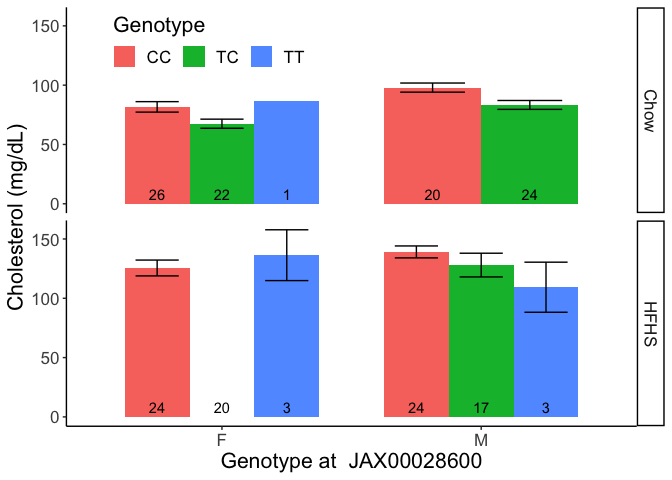
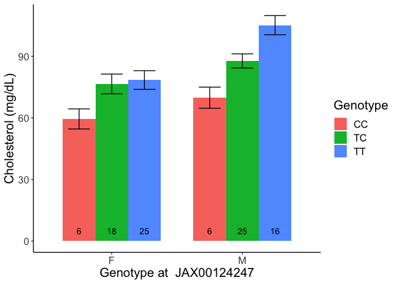

# Purpose

# Experimental Details

This analyses the data analysed via GEMMA and provided in the various output folders.

# Data Entry


## SNP Analysis

### Linear Mixed Model SNP Analysis for Chow


Table: Genome-wide significant associations from mixed linear models for cholesterol on NCD

|chr |rs | ps| n_miss|allele1 |allele0 | af| beta| se| logl_H1| l_remle| p_wald|
|:---|:--|--:|------:|:-------|:-------|--:|----:|--:|-------:|-------:|------:|


Table: Suggestive associations from mixed linear models for cholesterol on NCD.

|chr |rs          |       ps| n_miss|allele1 |allele0 |    af|  beta|   se| logl_H1| l_remle| p_wald|
|:---|:-----------|--------:|------:|:-------|:-------|-----:|-----:|----:|-------:|-------:|------:|
|11  |UNC19008219 |  5728194|      0|T       |X       | 0.786|  15.2| 2.92|    -393|  100000|      0|
|11  |UNC19004230 |  5278906|      0|A       |X       | 0.792|  14.8| 3.00|    -394|  100000|      0|
|11  |JAX00023949 |  5360959|      0|A       |X       | 0.797|  14.6| 3.05|    -394|  100000|      0|
|12  |UNC21619767 | 92403936|      0|C       |X       | 0.781| -10.6| 2.22|    -394|  100000|      0|


Table: Top nominal associations from mixed linear models for cholesterol on NCD

|chr |rs                 |       ps| n_miss|allele1 |allele0 |    af|  beta|   se| logl_H1| l_remle| p_wald|
|:---|:------------------|--------:|------:|:-------|:-------|-----:|-----:|----:|-------:|-------:|------:|
|11  |UNC19008219        |  5728194|      0|T       |X       | 0.786|  15.2| 2.92|    -393|  100000|      0|
|11  |UNC19004230        |  5278906|      0|A       |X       | 0.792|  14.8| 3.00|    -394|  100000|      0|
|11  |JAX00023949        |  5360959|      0|A       |X       | 0.797|  14.6| 3.05|    -394|  100000|      0|
|12  |UNC21619767        | 92403936|      0|C       |X       | 0.781| -10.6| 2.22|    -394|  100000|      0|
|11  |UNC19004988        |  5428780|      0|A       |X       | 0.802|  14.0| 3.06|    -395|  100000|      0|
|6   |backupUNC060370616 | 47102308|      0|A       |X       | 0.646| -16.9| 3.69|    -395|  100000|      0|

<!-- --><!-- -->

### Linear Mixed Model SNP Analysis for HFD

<!-- -->

Table: Genome-wide significant associations from mixed linear models for cholesterol on HFD

|chr |rs | ps| n_miss|allele1 |allele0 | af| beta| se| logl_H1| l_remle| p_wald|
|:---|:--|--:|------:|:-------|:-------|--:|----:|--:|-------:|-------:|------:|


Table: Suggestive associations from mixed linear models for cholesterol on HFD

|chr |rs         |        ps| n_miss|allele1 |allele0 |    af| beta|   se| logl_H1| l_remle| p_wald|
|:---|:----------|---------:|------:|:-------|:-------|-----:|----:|----:|-------:|-------:|------:|
|4   |UNC8307968 | 137030440|      0|C       |X       | 0.242| 15.9| 3.32|    -407|     7.8|      0|


Table: Top nominal associations from mixed linear models for cholesterol on HFD

|chr |rs                |        ps| n_miss|allele1 |allele0 |    af| beta|   se| logl_H1| l_remle| p_wald|
|:---|:-----------------|---------:|------:|:-------|:-------|-----:|----:|----:|-------:|-------:|------:|
|4   |UNC8307968        | 137030440|      0|C       |X       | 0.242| 15.9| 3.32|    -407|    7.80|      0|
|4   |UNC8305749        | 136899132|      0|A       |X       | 0.511| 19.3| 4.16|    -408|    7.88|      0|
|4   |UNC8306998        | 136974720|      0|A       |X       | 0.511| 19.3| 4.16|    -408|    7.88|      0|
|4   |backupJAX00125209 | 138427554|      0|T       |X       | 0.621| 20.6| 4.57|    -408|   13.22|      0|
|4   |UNC8307892        | 137025568|      0|A       |X       | 0.505| 18.7| 4.16|    -408|    8.04|      0|
|4   |UNC8301426        | 136621550|      0|A       |X       | 0.516| 18.4| 4.17|    -409|   10.08|      0|

<!-- -->


## BSLMM Analysis

### For Normal Chow Diet 


Table: Hyperparameters summary

|hyperparam |   mean| median|  2.5%|   97.5%|
|:----------|------:|------:|-----:|-------:|
|PVE        |  0.888|  0.937| 0.530|   1.000|
|PGE        |  0.378|  0.314| 0.000|   0.962|
|pi         |  0.001|  0.001| 0.000|   0.003|
|n.gamma    | 72.970| 48.000| 1.000| 229.000|
|Rho        |  0.421|  0.387| 0.018|   0.960|

### For High Fat Diet 


Table: Hyperparameters summary

|hyperparam |   mean| median|  2.5%|  97.5%|
|:----------|------:|------:|-----:|------:|
|PVE        |  0.697|  0.754| 0.112|  0.999|
|PGE        |  0.299|  0.247| 0.000|  0.890|
|pi         |  0.000|  0.000| 0.000|  0.001|
|n.gamma    | 11.800|  6.000| 0.000| 67.000|
|Rho        |  0.384|  0.351| 0.017|  0.911|

### BSLMM SNP Nomination for NCD


Table: Variants with the largest effect sizes

|chr |rs          |        ps| n_miss| alpha|  beta| gamma| eff.size|
|:---|:-----------|---------:|------:|-----:|-----:|-----:|--------:|
|11  |UNC19008219 |   5728194|      0| 0.007| 10.89| 0.102|    1.114|
|11  |UNC19004230 |   5278906|      0| 0.006|  8.27| 0.027|    0.223|
|11  |UNC19004988 |   5428780|      0| 0.006| 10.63| 0.013|    0.140|
|8   |UNC15632129 | 120333837|      0| 0.004|  9.50| 0.013|    0.126|
|11  |JAX00302993 |   5589616|      0| 0.006|  6.65| 0.013|    0.089|
|11  |JAX00023949 |   5360959|      0| 0.006|  7.92| 0.011|    0.087|
|6   |JAX00608797 |  46726402|      0| 0.006|  7.59| 0.008|    0.064|
|2   |UNC2988444  |  47211646|      0| 0.005|  2.85| 0.022|    0.063|
|3   |UNC4910274  |  26854828|      0| 0.004|  2.34| 0.026|    0.062|
|4   |UNC7148030  |  44347922|      0| 0.003|  4.46| 0.013|    0.058|


Table: Variants with the largest posterior probability

|chr |rs          |       ps| n_miss| alpha|   beta| gamma| eff.size|
|:---|:-----------|--------:|------:|-----:|------:|-----:|--------:|
|11  |UNC19008219 |  5728194|      0| 0.007| 10.886| 0.102|    1.114|
|4   |JAX00546340 | 19329973|      0| 0.000|  0.003| 0.030|    0.000|
|16  |UNC27099503 | 72682749|      0| 0.001|  0.395| 0.030|    0.012|
|11  |UNC19719893 | 58843699|      0| 0.003|  1.379| 0.029|    0.041|
|11  |UNC19715660 | 58622197|      0| 0.001|  0.394| 0.029|    0.012|
|9   |UNC16247528 | 42559566|      0| 0.001|  1.084| 0.028|    0.031|
|11  |UNC19004230 |  5278906|      0| 0.006|  8.269| 0.027|    0.223|
|2   |UNC2488740  |  4829165|      0| 0.005|  1.744| 0.027|    0.047|
|3   |UNC4910274  | 26854828|      0| 0.004|  2.344| 0.026|    0.062|
|17  |UNC27717713 | 26861900|      0| 0.000|  0.353| 0.026|    0.009|

### BSLMM SNP Nomination for HFD


Table: Variants with the largest effect sizes for HFD

|chr |rs                |        ps| n_miss| alpha| beta| gamma| eff.size|
|:---|:-----------------|---------:|------:|-----:|----:|-----:|--------:|
|4   |UNC8307968        | 137030440|      0| 0.011| 13.2| 0.063|    0.833|
|4   |UNC8305749        | 136899132|      0| 0.008| 15.9| 0.025|    0.395|
|4   |UNC8307892        | 137025568|      0| 0.008| 15.1| 0.025|    0.373|
|17  |UNC27920889       |  45579714|      0| 0.008| 15.6| 0.020|    0.305|
|4   |UNC8306998        | 136974720|      0| 0.008| 15.5| 0.016|    0.250|
|4   |UNC8319885        | 137891974|      0| 0.007| 15.3| 0.015|    0.230|
|4   |UNC8311234        | 137243059|      0| 0.007| 15.3| 0.015|    0.229|
|4   |backupJAX00125209 | 138427554|      0| 0.008| 16.6| 0.012|    0.204|
|17  |UNC27585545       |  13693352|      0| 0.008| 12.4| 0.015|    0.186|
|4   |UNC8327379        | 138408221|      0| 0.007| 14.6| 0.010|    0.141|


Table: Variants with the largest posterior probability for HFD

|chr |rs                |        ps| n_miss| alpha| beta| gamma| eff.size|
|:---|:-----------------|---------:|------:|-----:|----:|-----:|--------:|
|4   |UNC8307968        | 137030440|      0| 0.011| 13.2| 0.063|    0.833|
|4   |UNC8305749        | 136899132|      0| 0.008| 15.9| 0.025|    0.395|
|4   |UNC8307892        | 137025568|      0| 0.008| 15.1| 0.025|    0.373|
|17  |UNC27920889       |  45579714|      0| 0.008| 15.6| 0.020|    0.305|
|4   |UNC8306998        | 136974720|      0| 0.008| 15.5| 0.016|    0.250|
|4   |UNC8319885        | 137891974|      0| 0.007| 15.3| 0.015|    0.230|
|17  |UNC27585545       |  13693352|      0| 0.008| 12.4| 0.015|    0.186|
|4   |UNC8311234        | 137243059|      0| 0.007| 15.3| 0.015|    0.229|
|4   |backupJAX00125209 | 138427554|      0| 0.008| 16.6| 0.012|    0.204|
|4   |UNC8301426        | 136621550|      0| 0.008| 13.7| 0.010|    0.138|


### Comparason of BSLMM and LMM Nominated SNPs

<!-- -->

## Genomic Intervals


Table: Summary of genomic regions with SNPs in the top 25 by p-value

|chr |lead.snp           |        ps| sug.snps| p.val.log10|    ps.min|    ps.max| effect|
|:---|:------------------|---------:|--------:|-----------:|---------:|---------:|------:|
|11  |UNC19008219        |   5728194|        7|       -5.92|   5728194|   5728194|  15.19|
|12  |UNC21619767        |  92403936|        3|       -5.18|  92403936|  92403936|  10.22|
|6   |backupUNC060370616 |  47102308|        6|       -4.84|  47102308|  47102308|  14.40|
|9   |UNC090485124       |  95504483|        2|       -3.89|  95504483|  95504483|  -9.02|
|17  |UNC28426567        |  79608992|        1|       -3.77|  79608992|  79608992| -11.28|
|14  |UNC23854062        |  35832555|        1|       -3.73|  35832555|  35832555| -15.21|
|15  |UNC26156906        |  95159874|        3|       -3.68|  95159874|  95159874| -10.14|
|8   |UNC15522366        | 113272493|        1|       -3.67| 113272493| 113272493| -11.02|
|16  |UNC26985492        |  64356092|        1|       -3.54|  64356092|  64356092|  -9.96|


Table: Genes near top SNP interval +/- 500000

|gene_biotype                       |  n|genes                                                                                                                                |
|:----------------------------------|--:|:------------------------------------------------------------------------------------------------------------------------------------|
|protein_coding                     | 19|Znrf3, Xbp1, Ccdc117, Ankrd36, Mrps24, Urgcp, Dbnl, Pgam2, Polm, Aebp1, Pold2, Myl7, Gck, Ykt6, Camk2b, Nudcd3, Npc1l1, Ddx56, Tmed4 |
|processed_pseudogene               |  7|Gm11962, Gm11964, Gm11965, Gm11966, Rps15a-ps6, Gm11969, Gm11401                                                                     |
|lncRNA                             |  5|Gm57349, Gm11963, Ube2d-ps, Gm57397, Gm11967                                                                                         |
|rRNA                               |  1|Gm56346                                                                                                                              |
|snoRNA                             |  1|Gm22471                                                                                                                              |
|transcribed_unprocessed_pseudogene |  1|Ube2d-ps                                                                                                                             |

### Analysis of QTLs

<!-- --><!-- --><!-- -->

Table: ANOVA for sex-genotype interaction on chow only.

|term         | df| sumsq| meansq| statistic| p.value|
|:------------|--:|-----:|------:|---------:|-------:|
|sex          |  1|  7680|   7680|    21.036|   0.000|
|Genotype     |  2|  5877|   2939|     8.048|   0.001|
|sex:Genotype |  2|   338|    169|     0.463|   0.631|
|Residuals    | 88| 32130|    365|        NA|      NA|


Table: ANOVA for sex-genotype interaction.

|term        | estimate| std.error| statistic| p.value|
|:-----------|--------:|---------:|---------:|-------:|
|(Intercept) |    58.07|      8.44|     6.881|   0.000|
|sexM        |    18.91|      4.00|     4.728|   0.000|
|GenotypeTG  |     7.88|      8.81|     0.895|   0.373|
|GenotypeTT  |    22.76|      8.24|     2.762|   0.007|


Table: ANOVA for moderation of genotype effect by diet.

|term              |  df| sumsq|  meansq| statistic| p.value|
|:-----------------|---:|-----:|-------:|---------:|-------:|
|diet              |   1| 65746| 65745.6|   115.368|   0.000|
|sex               |   1| 10286| 10286.3|    18.050|   0.000|
|Genotype          |   2|   239|   119.6|     0.210|   0.811|
|diet:sex          |   1|   612|   612.0|     1.074|   0.301|
|diet:Genotype     |   2|  9490|  4745.2|     8.327|   0.000|
|sex:Genotype      |   2|   151|    75.7|     0.133|   0.876|
|diet:sex:Genotype |   1|   404|   403.7|     0.708|   0.401|
|Residuals         | 174| 99158|   569.9|        NA|      NA|


Table: ANOVA for moderation of genotype effect by diet.

|term          |  df|  sumsq| meansq| statistic| p.value|
|:-------------|---:|------:|------:|---------:|-------:|
|diet          |   1|  65746|  65746|   116.672|   0.000|
|sex           |   1|  10286|  10286|    18.254|   0.000|
|Genotype      |   2|    239|    120|     0.212|   0.809|
|diet:Genotype |   2|   9511|   4756|     8.439|   0.000|
|Residuals     | 178| 100305|    564|        NA|      NA|


Table: Model estimates for moderation of genotype effect by diet.

|term              | estimate| std.error| statistic| p.value|
|:-----------------|--------:|---------:|---------:|-------:|
|(Intercept)       |    61.07|     10.14|     6.025|   0.000|
|diethf            |    71.27|     17.05|     4.181|   0.000|
|sexM              |    15.32|      3.56|     4.299|   0.000|
|GenotypeTG        |     6.33|     10.90|     0.580|   0.562|
|GenotypeTT        |    21.48|     10.22|     2.101|   0.037|
|diethf:GenotypeTG |   -17.42|     18.23|    -0.956|   0.341|
|diethf:GenotypeTT |   -44.52|     17.61|    -2.528|   0.012|

<!-- --><!-- --><!-- -->

Table: ANOVA for sex-genotype interaction on chow only.

|term      | df| sumsq| meansq| statistic| p.value|
|:---------|--:|-----:|------:|---------:|-------:|
|sex       |  1|  2868|   2868|      9.84|   0.002|
|Genotype  |  2|   968|    484|      1.66|   0.197|
|Residuals | 73| 21271|    291|        NA|      NA|


Table: linear model for sex-genotype interaction.

|term        | estimate| std.error| statistic| p.value|
|:-----------|--------:|---------:|---------:|-------:|
|(Intercept) |     98.0|     17.54|     5.590|   0.000|
|sexM        |     11.0|      4.02|     2.726|   0.008|
|GenotypeAC  |     -3.0|     24.14|    -0.124|   0.901|
|GenotypeCC  |    -24.2|     17.35|    -1.393|   0.168|


Table: ANOVA for moderation of genotype effect by diet.

|term      |  df| sumsq| meansq| statistic| p.value|
|:---------|---:|-----:|------:|---------:|-------:|
|diet      |   1| 75109|  75109|   143.998|   0.000|
|sex       |   1|  5863|   5863|    11.240|   0.001|
|Genotype  |   2|   638|    319|     0.611|   0.544|
|Residuals | 149| 77718|    522|        NA|      NA|


Table: ANOVA for moderation of genotype effect by diet.

|term          |  df| sumsq| meansq| statistic| p.value|
|:-------------|---:|-----:|------:|---------:|-------:|
|diet          |   1| 75109|  75109|   143.911|   0.000|
|sex           |   1|  5863|   5863|    11.233|   0.001|
|Genotype      |   2|   638|    319|     0.611|   0.544|
|diet:Genotype |   2|   997|    498|     0.955|   0.387|
|Residuals     | 147| 76721|    522|        NA|      NA|


Table: Model estimates for moderation of genotype effect by diet.

|term              | estimate| std.error| statistic| p.value|
|:-----------------|--------:|---------:|---------:|-------:|
|(Intercept)       |     96.6|     23.16|     4.172|   0.000|
|diethf            |     28.3|     26.50|     1.066|   0.288|
|sexM              |     12.4|      3.79|     3.271|   0.001|
|GenotypeAC        |     -3.0|     32.31|    -0.093|   0.926|
|GenotypeCC        |    -23.3|     23.11|    -1.009|   0.315|
|diethf:GenotypeAC |    -17.9|     37.39|    -0.479|   0.632|
|diethf:GenotypeCC |     15.7|     26.80|     0.587|   0.558|

<!-- --><!-- --><!-- -->

Table: ANOVA for sex-genotype interaction on chow only.

|term         | df| sumsq| meansq| statistic| p.value|
|:------------|--:|-----:|------:|---------:|-------:|
|sex          |  1|  6342|   6342|    20.612|   0.000|
|Genotype     |  1|  3622|   3622|    11.772|   0.001|
|sex:Genotype |  1|   254|    254|     0.825|   0.366|
|Residuals    | 90| 27693|    308|        NA|      NA|


Table: linear model for sex-genotype interaction.

|term        | estimate| std.error| statistic| p.value|
|:-----------|--------:|---------:|---------:|-------:|
|(Intercept) |     65.7|      3.81|     17.26|   0.000|
|sexM        |     17.8|      3.64|      4.88|   0.000|
|GenotypeAG  |     13.4|      3.90|      3.43|   0.001|


Table: ANOVA for moderation of genotype effect by diet.

|term              |  df| sumsq| meansq| statistic| p.value|
|:-----------------|---:|-----:|------:|---------:|-------:|
|diet              |   1| 67363|  67363|   127.665|   0.000|
|sex               |   1|  8652|   8652|    16.397|   0.000|
|Genotype          |   1|  5579|   5579|    10.574|   0.001|
|diet:sex          |   1|   768|    768|     1.455|   0.229|
|diet:Genotype     |   1|    64|     64|     0.121|   0.728|
|sex:Genotype      |   1|  2191|   2191|     4.151|   0.043|
|diet:sex:Genotype |   1|   582|    582|     1.103|   0.295|
|Residuals         | 176| 92868|    528|        NA|      NA|


Table: ANOVA for moderation of genotype effect by diet.

|term          |  df|   sumsq|  meansq| statistic| p.value|
|:-------------|---:|-------:|-------:|---------:|-------:|
|diet          |   1| 67363.5| 67363.5|   125.079|   0.000|
|sex           |   1|  8652.0|  8652.0|    16.065|   0.000|
|Genotype      |   1|  5579.4|  5579.4|    10.360|   0.002|
|diet:Genotype |   1|    69.3|    69.3|     0.129|   0.720|
|Residuals     | 179| 96403.3|   538.6|        NA|      NA|


Table: Model estimates for moderation of genotype effect by diet.

|term              | estimate| std.error| statistic| p.value|
|:-----------------|--------:|---------:|---------:|-------:|
|(Intercept)       |    67.94|      4.67|    14.562|   0.000|
|diethf            |    40.70|      5.88|     6.917|   0.000|
|sexM              |    13.75|      3.45|     3.990|   0.000|
|GenotypeAG        |    12.94|      5.15|     2.512|   0.013|
|diethf:GenotypeAG |    -2.61|      7.27|    -0.359|   0.720|

We identified **0** SNPs at genome-wide significance, and **4** at suggestive significance.


## Polygenic Risk Models and Analysis


Used the top three lead SNPs from the LMM analysis (UNC19008219UNC21619767backupUNC060370616).


Table: Coefficients for additive model

|term                 | estimate| std.error| statistic| p.value|
|:--------------------|--------:|---------:|---------:|-------:|
|(Intercept)          |   115.18|     16.05|     7.175|   0.000|
|sexM                 |    15.13|      3.53|     4.286|   0.000|
|UNC19008219GG        |     5.88|     13.50|     0.436|   0.664|
|UNC19008219TG        |    15.06|     12.19|     1.235|   0.220|
|UNC19008219TT        |    21.51|     11.69|     1.841|   0.069|
|UNC21619767AA        |    -5.50|     16.07|    -0.342|   0.733|
|UNC21619767AC        |    -8.50|     16.07|    -0.529|   0.598|
|UNC21619767CC        |   -20.52|      4.60|    -4.456|   0.000|
|backupUNC060370616AA |   -49.30|     11.53|    -4.276|   0.000|
|backupUNC060370616AG |   -37.32|     11.27|    -3.311|   0.001|


Table: ANOVA for additive model

|term               | df| sumsq| meansq| statistic| p.value|
|:------------------|--:|-----:|------:|---------:|-------:|
|sex                |  1|  7601|   7601|     31.46|       0|
|UNC19008219        |  3|  5968|   1989|      8.23|       0|
|UNC21619767        |  3|  5912|   1971|      8.16|       0|
|backupUNC060370616 |  2|  5851|   2926|     12.11|       0|
|Residuals          | 86| 20776|    242|        NA|      NA|


Table: Summary of additive PRS model

| r.squared| adj.r.squared| sigma| statistic| p.value| df| logLik| AIC| BIC| deviance| df.residual| nobs|
|---------:|-------------:|-----:|---------:|-------:|--:|------:|---:|---:|--------:|-----------:|----:|
|     0.549|         0.502|  15.5|      11.7|       0|  9|   -394| 811| 839|    20776|          86|   96|


Table: Summary of interacting PRS model

| r.squared| adj.r.squared| sigma| statistic| p.value| df| logLik| AIC| BIC| deviance| df.residual| nobs|
|---------:|-------------:|-----:|---------:|-------:|--:|------:|---:|---:|--------:|-----------:|----:|
|     0.602|         0.527|  15.1|      8.07|       0| 15|   -388| 811| 854|    18349|          80|   96|


Table: ANOVA of additive vs interacting model

|term                                                         | df.residual|   rss| df| sumsq| statistic| p.value|
|:------------------------------------------------------------|-----------:|-----:|--:|-----:|---------:|-------:|
|chol1 ~ sex + UNC19008219 + UNC21619767 + backupUNC060370616 |          86| 20776| NA|    NA|        NA|      NA|
|chol1 ~ sex + UNC19008219 * UNC21619767 * backupUNC060370616 |          80| 18349|  6|  2427|      1.76|   0.117|

<!-- --><!-- --><!-- -->

### Variance Components for PRS Model

Calculated the relative variance explained by the PRS model, relative to gene, sex and diet effects.


|term                    |  df|   sumsq|  meansq| statistic| p.value|
|:-----------------------|---:|-------:|-------:|---------:|-------:|
|sex                     |   1|  9931.2|  9931.2|    19.884|   0.000|
|diet                    |   1| 66555.4| 66555.4|   133.257|   0.000|
|UNC19008219             |   3|   292.7|    97.6|     0.195|   0.899|
|UNC21619767             |   3|  3811.1|  1270.4|     2.543|   0.058|
|backupUNC060370616      |   2| 10559.4|  5279.7|    10.571|   0.000|
|sex:diet                |   1|   741.2|   741.2|     1.484|   0.225|
|diet:UNC19008219        |   2|  6253.0|  3126.5|     6.260|   0.002|
|diet:UNC21619767        |   3|  4574.5|  1524.8|     3.053|   0.030|
|diet:backupUNC060370616 |   2|    40.6|    20.3|     0.041|   0.960|
|Residuals               | 168| 83908.1|   499.5|        NA|      NA|


Table: Summary of variance components from PRS model

|term.type   | summeansq| pct.var|model                     |
|:-----------|---------:|-------:|:-------------------------|
|diet        |     66555|  74.742|Unadjusted                |
|sex         |      9931|  11.153|Unadjusted                |
|gene        |      6648|   7.465|Unadjusted                |
|gene x diet |      4672|   5.246|Unadjusted                |
|sex x diet  |       741|   0.832|Unadjusted                |
|residual    |       499|   0.561|Unadjusted                |
|gene        |      6648|  56.247|Adjusted for diet and sex |
|gene x diet |      4672|  39.527|Adjusted for diet and sex |
|residual    |       499|   4.226|Adjusted for diet and sex |

<!-- -->

# Session Information


```r
sessionInfo()
```

```
## R version 4.2.2 (2022-10-31)
## Platform: x86_64-apple-darwin17.0 (64-bit)
## Running under: macOS Big Sur ... 10.16
## 
## Matrix products: default
## BLAS:   /Library/Frameworks/R.framework/Versions/4.2/Resources/lib/libRblas.0.dylib
## LAPACK: /Library/Frameworks/R.framework/Versions/4.2/Resources/lib/libRlapack.dylib
## 
## locale:
## [1] en_US.UTF-8/en_US.UTF-8/en_US.UTF-8/C/en_US.UTF-8/en_US.UTF-8
## 
## attached base packages:
## [1] stats     graphics  grDevices utils     datasets  methods   base     
## 
## other attached packages:
##  [1] gridExtra_2.3       tibble_3.2.1        biomaRt_2.52.0     
##  [4] ggrepel_0.9.4       ggplot2_3.4.4       GWASTools_1.42.1   
##  [7] Biobase_2.58.0      BiocGenerics_0.44.0 forcats_1.0.0      
## [10] qqman_0.1.9         broom_1.0.5         dplyr_1.1.3        
## [13] tidyr_1.3.0         readr_2.1.4         knitr_1.44         
## 
## loaded via a namespace (and not attached):
##   [1] backports_1.4.1        BiocFileCache_2.4.0    splines_4.2.2         
##   [4] operator.tools_1.6.3   GenomeInfoDb_1.34.9    TH.data_1.1-2         
##   [7] digest_0.6.33          foreach_1.5.2          htmltools_0.5.6.1     
##  [10] fansi_1.0.5            magrittr_2.0.3         memoise_2.0.1         
##  [13] tzdb_0.4.0             Biostrings_2.66.0      vroom_1.6.4           
##  [16] formula.tools_1.7.1    sandwich_3.0-2         prettyunits_1.2.0     
##  [19] colorspace_2.1-0       blob_1.2.4             rappdirs_0.3.3        
##  [22] pan_1.9                xfun_0.40              crayon_1.5.2          
##  [25] RCurl_1.98-1.12        jsonlite_1.8.7         lme4_1.1-34           
##  [28] survival_3.5-7         zoo_1.8-12             iterators_1.0.14      
##  [31] glue_1.6.2             gtable_0.3.4           zlibbioc_1.44.0       
##  [34] emmeans_1.8.8          XVector_0.38.0         MatrixModels_0.5-1    
##  [37] shape_1.4.6            jomo_2.7-6             SparseM_1.81          
##  [40] scales_1.2.1           mvtnorm_1.2-3          DBI_1.1.3             
##  [43] Rcpp_1.0.11            xtable_1.8-4           progress_1.2.2        
##  [46] quantsmooth_1.62.0     bit_4.0.5              stats4_4.2.2          
##  [49] glmnet_4.1-8           httr_1.4.7             logistf_1.26.0        
##  [52] calibrate_1.7.7        mice_3.16.0            pkgconfig_2.0.3       
##  [55] XML_3.99-0.14          farver_2.1.1           nnet_7.3-19           
##  [58] sass_0.4.7             dbplyr_2.3.4           utf8_1.2.3            
##  [61] DNAcopy_1.70.0         tidyselect_1.2.0       labeling_0.4.3        
##  [64] rlang_1.1.1            AnnotationDbi_1.60.2   munsell_0.5.0         
##  [67] tools_4.2.2            cachem_1.0.8           cli_3.6.1             
##  [70] generics_0.1.3         RSQLite_2.3.1          evaluate_0.22         
##  [73] stringr_1.5.0          fastmap_1.1.1          yaml_2.3.7            
##  [76] bit64_4.0.5            gdsfmt_1.32.0          purrr_1.0.2           
##  [79] KEGGREST_1.38.0        mitml_0.4-5            nlme_3.1-163          
##  [82] GWASExactHW_1.01       quantreg_5.97          xml2_1.3.5            
##  [85] compiler_4.2.2         rstudioapi_0.15.0      filelock_1.0.2        
##  [88] curl_5.1.0             png_0.1-8              bslib_0.5.1           
##  [91] stringi_1.7.12         lattice_0.21-9         Matrix_1.5-4.1        
##  [94] nloptr_2.0.3           vctrs_0.6.4            pillar_1.9.0          
##  [97] lifecycle_1.0.3        lmtest_0.9-40          jquerylib_0.1.4       
## [100] estimability_1.4.1     data.table_1.14.8      bitops_1.0-7          
## [103] R6_2.5.1               IRanges_2.32.0         codetools_0.2-19      
## [106] boot_1.3-28.1          MASS_7.3-60            withr_2.5.1           
## [109] multcomp_1.4-25        S4Vectors_0.36.2       GenomeInfoDbData_1.2.9
## [112] mgcv_1.9-0             parallel_4.2.2         hms_1.1.3             
## [115] grid_4.2.2             rpart_4.1.21           coda_0.19-4           
## [118] minqa_1.2.6            rmarkdown_2.25
```

