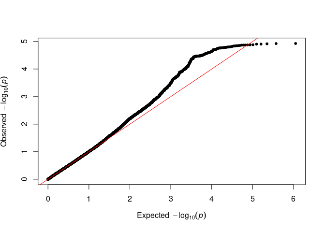
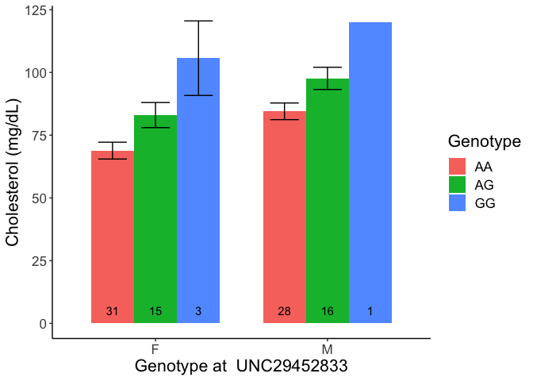
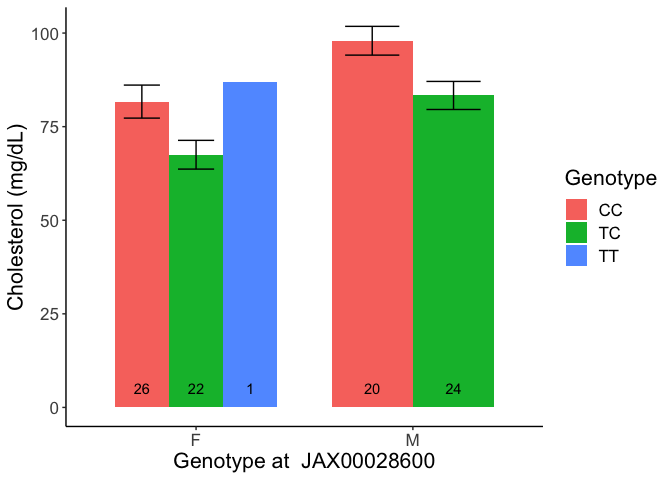
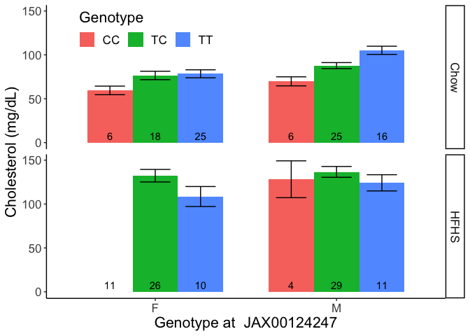

# Purpose

# Experimental Details

This analyses the data analysed via GEMMA and provided in the various output folders.

# Data Entry


```r
genotype.filename <- '../Svenson-183_Svenson_DO-MegaMUGA-calls.csv'
genotype.data <- read_csv(genotype.filename,
                          col_types = cols(
  .default = col_character(),
  chr = col_factor(levels=NULL),
  pos = col_double()
))

phenotype.filename <- '../Svenson-183_Svenson_DO-phenotypes.csv'
phenotype.data <- read_csv(phenotype.filename)
phenotype.data[phenotype.data=="-999999"] <- NA
```

## SNP Analysis

### Linear Mixed Model SNP Analysis for Chow


```r
lmm.filename <- 'output/ncd.cholesterol.assoc.txt'

lmm.results <- read.table(lmm.filename, sep='\t', header=T)
library(qqman)
qq(lmm.results$p_wald)
suggestive.pval <- 1E-5
genome.pval <- 5E-8

lmm.results %>%
  arrange(p_wald) %>% 
  filter(p_wald<genome.pval) %>%
  kable(caption="Genome-wide significant associations from mixed linear models for cholesterol on NCD") 
```


Table: Genome-wide significant associations from mixed linear models for cholesterol on NCD

|chr |rs | ps| n_miss|allele1 |allele0 | af| beta| se| logl_H1| l_remle| p_wald|
|:---|:--|--:|------:|:-------|:-------|--:|----:|--:|-------:|-------:|------:|

```r
lmm.results %>%
   arrange(p_wald) %>% 
   filter(p_wald<suggestive.pval) %>%
   kable(caption="Suggestive associations from mixed linear models for cholesterol on NCD.") 
```


Table: Suggestive associations from mixed linear models for cholesterol on NCD.

|chr |rs          |       ps| n_miss|allele1 |allele0 |    af|  beta|   se| logl_H1| l_remle| p_wald|
|:---|:-----------|--------:|------:|:-------|:-------|-----:|-----:|----:|-------:|-------:|------:|
|18  |UNC29452833 | 65023371|      0|A       |X       | 0.776| -15.8| 3.28|    -402|    1.27|      0|

```r
 lmm.results %>%
    arrange(p_wald) %>% 
    filter(p_wald<0.05) %>%
    head() %>%
    kable(caption="Top nominal associations from mixed linear models for cholesterol on NCD") 
```


Table: Top nominal associations from mixed linear models for cholesterol on NCD

|chr |rs          |        ps| n_miss|allele1 |allele0 |    af|   beta|   se| logl_H1|   l_remle| p_wald|
|:---|:-----------|---------:|------:|:-------|:-------|-----:|------:|----:|-------:|---------:|------:|
|18  |UNC29452833 |  65023371|      0|A       |X       | 0.776| -15.84| 3.28|    -402|      1.27|      0|
|11  |JAX00028600 |  68049727|      0|T       |X       | 0.250| -17.08| 3.82|    -404| 100000.00|      0|
|4   |JAX00124247 | 125354910|      0|T       |X       | 0.651|  12.97| 2.96|    -404|     21.69|      0|
|18  |UNC29442845 |  64377281|      0|A       |X       | 0.354|  13.04| 3.10|    -405|      1.53|      0|
|11  |JAX00028564 |  67564947|      0|A       |X       | 0.745|  15.85| 3.79|    -405|     35.50|      0|
|18  |UNC29416777 |  62677582|      0|G       |X       | 0.750|  -9.68| 2.35|    -404|      2.54|      0|

```r
library(forcats)

library(GWASTools)
```

<!-- -->

```r
with(lmm.results,manhattanPlot(p=p_wald,
                               chromosome=chr,
                               signif=suggestive.pval))
```

<!-- -->

### Linear Mixed Model SNP Analysis for HFD


```r
lmm.filename.hfd <- 'output/hfd.cholesterol.assoc.txt'

lmm.results.hfd <- read.table(lmm.filename.hfd, sep='\t', header=T)
library(qqman)
qq(lmm.results.hfd$p_wald)
```

<!-- -->

```r
suggestive.pval <- 1E-5
genome.pval <- 5E-8

lmm.results.hfd %>%
  arrange(p_wald) %>% 
  filter(p_wald<genome.pval) %>%
  kable(caption="Genome-wide significant associations from mixed linear models for cholesterol on HFD") 
```


Table: Genome-wide significant associations from mixed linear models for cholesterol on HFD

|chr |rs | ps| n_miss|allele1 |allele0 | af| beta| se| logl_H1| l_remle| p_wald|
|:---|:--|--:|------:|:-------|:-------|--:|----:|--:|-------:|-------:|------:|

```r
lmm.results.hfd %>%
   arrange(p_wald) %>% 
   filter(p_wald<suggestive.pval) %>%
   kable(caption="Suggestive associations from mixed linear models for cholesterol on HFD") 
```


Table: Suggestive associations from mixed linear models for cholesterol on HFD

|chr |rs | ps| n_miss|allele1 |allele0 | af| beta| se| logl_H1| l_remle| p_wald|
|:---|:--|--:|------:|:-------|:-------|--:|----:|--:|-------:|-------:|------:|

```r
 lmm.results.hfd %>%
    arrange(p_wald) %>% 
    filter(p_wald<0.05) %>%
    head() %>%
    kable(caption="Top nominal associations from mixed linear models for cholesterol on HFD") 
```


Table: Top nominal associations from mixed linear models for cholesterol on HFD

|chr |rs           |        ps| n_miss|allele1 |allele0 |    af|  beta|   se| logl_H1| l_remle| p_wald|
|:---|:------------|---------:|------:|:-------|:-------|-----:|-----:|----:|-------:|-------:|------:|
|17  |UNC28005802  |  51845501|      0|A       |X       | 0.500|  19.8| 4.75|    -421|   1.548|      0|
|1   |UNC534089    |  42095575|      0|C       |X       | 0.744| -17.2| 4.26|    -421|   8.529|      0|
|1   |UNC339202    |  27569004|      0|C       |X       | 0.656|  14.3| 3.58|    -422|   0.813|      0|
|8   |UNC14503442  |  35998298|      0|G       |X       | 0.600| -14.6| 3.66|    -421|   3.957|      0|
|2   |JAX00512634  | 178753443|      0|A       |X       | 0.578| -18.9| 4.81|    -422|   6.583|      0|
|9   |UNC090368888 | 108973633|      0|T       |X       | 0.539| -18.5| 4.71|    -422|   2.127|      0|

```r
library(forcats)

library(GWASTools)
with(lmm.results.hfd,manhattanPlot(p=p_wald,
                               chromosome=chr,
                               signif=suggestive.pval))
```

<!-- -->


## BSLMM Analysis

### For Normal Chow Diet 


```r
bslmm.hyp.file <- 'output/ncd.cholesterol.hyp.txt'
bslmm.hyp <- read_tsv(bslmm.hyp.file,
         col_types=cols(
           h = col_double(),
           pve = col_double(),
           rho = col_double(),
           pge = col_double(),
           pi = col_double(),
           n_gamma = col_integer()
)) 


# pve -> proportion of phenotypic variance explained by the genotypes
pve<-c("PVE", mean(bslmm.hyp$pve),quantile(bslmm.hyp$pve, probs=c(0.5,0.025,0.975)))

# pge -> proportion of genetic variance explained by major effect loci
pge<-c("PGE",mean(bslmm.hyp$pge),quantile(bslmm.hyp$pge, probs=c(0.5,0.025,0.975)))

#rho -> relatiave proportion of BVSR vs LMM
rho<-c("Rho",mean(bslmm.hyp$rho),quantile(bslmm.hyp$rho, probs=c(0.5,0.025,0.975)))

# pi -> proportion of variants with non-zero effects
pi<-c("pi",mean(bslmm.hyp$pi),quantile(bslmm.hyp$pi, probs=c(0.5,0.025,0.975)))

# n.gamma -> number of variants with major effect
n.gamma<-c("n.gamma",mean(bslmm.hyp$n_gamma),quantile(bslmm.hyp$n_gamma, probs=c(0.5,0.025,0.975)))

hyp.params.table<-as.data.frame(rbind(pve,pge,pi,n.gamma,rho),row.names=F)
colnames(hyp.params.table)<-c("hyperparam", "mean","median","2.5%", "97.5%")
# show table
hyp.params.table %>% 
  tibble() %>% 
  mutate_at(vars(mean,median,`2.5%`,`97.5%`),
            .funs=as.numeric) %>%
  kable(caption="Hyperparameters summary", digits=3)
```


Table: Hyperparameters summary

|hyperparam |   mean| median|  2.5%|   97.5%|
|:----------|------:|------:|-----:|-------:|
|PVE        |  0.888|  0.937| 0.530|   1.000|
|PGE        |  0.378|  0.314| 0.000|   0.962|
|pi         |  0.001|  0.001| 0.000|   0.003|
|n.gamma    | 72.970| 48.000| 1.000| 229.000|
|Rho        |  0.421|  0.387| 0.018|   0.960|

### For High Fat Diet 


```r
bslmm.hyp.file <- 'output/hfd.cholesterol.hyp.txt'
bslmm.hyp <- read_tsv(bslmm.hyp.file,
         col_types=cols(
           h = col_double(),
           pve = col_double(),
           rho = col_double(),
           pge = col_double(),
           pi = col_double(),
           n_gamma = col_integer()
)) 


# pve -> proportion of phenotypic variance explained by the genotypes
pve<-c("PVE", mean(bslmm.hyp$pve),quantile(bslmm.hyp$pve, probs=c(0.5,0.025,0.975)))

# pge -> proportion of genetic variance explained by major effect loci
pge<-c("PGE",mean(bslmm.hyp$pge),quantile(bslmm.hyp$pge, probs=c(0.5,0.025,0.975)))

#rho -> relatiave proportion of BVSR vs LMM
rho<-c("Rho",mean(bslmm.hyp$rho),quantile(bslmm.hyp$rho, probs=c(0.5,0.025,0.975)))

# pi -> proportion of variants with non-zero effects
pi<-c("pi",mean(bslmm.hyp$pi),quantile(bslmm.hyp$pi, probs=c(0.5,0.025,0.975)))

# n.gamma -> number of variants with major effect
n.gamma<-c("n.gamma",mean(bslmm.hyp$n_gamma),quantile(bslmm.hyp$n_gamma, probs=c(0.5,0.025,0.975)))

hyp.params.table<-as.data.frame(rbind(pve,pge,pi,n.gamma,rho),row.names=F)
colnames(hyp.params.table)<-c("hyperparam", "mean","median","2.5%", "97.5%")
# show table
hyp.params.table %>% 
  tibble() %>% 
  mutate_at(vars(mean,median,`2.5%`,`97.5%`),
            .funs=as.numeric) %>%
  kable(caption="Hyperparameters summary", digits=3)
```


Table: Hyperparameters summary

|hyperparam |   mean| median|  2.5%|  97.5%|
|:----------|------:|------:|-----:|------:|
|PVE        |  0.697|  0.754| 0.112|  0.999|
|PGE        |  0.299|  0.247| 0.000|  0.890|
|pi         |  0.000|  0.000| 0.000|  0.001|
|n.gamma    | 11.800|  6.000| 0.000| 67.000|
|Rho        |  0.384|  0.351| 0.017|  0.911|

### BSLMM SNP Nomination for NCD


```r
bslmm.results.file <- 'output/ncd.cholesterol.param.txt'
bslmm.results <- read_tsv(bslmm.results.file, 
                               col_types = cols(chr=col_factor(levels=NULL))) %>%
  mutate(eff.size = beta*gamma) %>%
  filter(eff.size >0) %>%
  arrange(-abs(eff.size))
  
bslmm.results  %>% head(10) %>% kable(caption="Variants with the largest effect sizes")
```


Table: Variants with the largest effect sizes

|chr |rs          |        ps| n_miss| alpha|  beta| gamma| eff.size|
|:---|:-----------|---------:|------:|-----:|-----:|-----:|--------:|
|11  |UNC19008219 |   5728194|      0| 0.007| 10.89| 0.102|    1.114|
|11  |UNC19004230 |   5278906|      0| 0.006|  8.27| 0.027|    0.223|
|11  |UNC19004988 |   5428780|      0| 0.006| 10.63| 0.013|    0.140|
|8   |UNC15632129 | 120333837|      0| 0.004|  9.50| 0.013|    0.126|
|11  |JAX00302993 |   5589616|      0| 0.006|  6.65| 0.013|    0.089|
|11  |JAX00023949 |   5360959|      0| 0.006|  7.92| 0.011|    0.087|
|6   |JAX00608797 |  46726402|      0| 0.006|  7.59| 0.008|    0.064|
|2   |UNC2988444  |  47211646|      0| 0.005|  2.85| 0.022|    0.063|
|3   |UNC4910274  |  26854828|      0| 0.004|  2.34| 0.026|    0.062|
|4   |UNC7148030  |  44347922|      0| 0.003|  4.46| 0.013|    0.058|

```r
bslmm.results  %>% 
  arrange(-gamma) %>%
  head(10) %>% kable(caption="Variants with the largest posterior probability")
```


Table: Variants with the largest posterior probability

|chr |rs          |       ps| n_miss| alpha|   beta| gamma| eff.size|
|:---|:-----------|--------:|------:|-----:|------:|-----:|--------:|
|11  |UNC19008219 |  5728194|      0| 0.007| 10.886| 0.102|    1.114|
|4   |JAX00546340 | 19329973|      0| 0.000|  0.003| 0.030|    0.000|
|16  |UNC27099503 | 72682749|      0| 0.001|  0.395| 0.030|    0.012|
|11  |UNC19719893 | 58843699|      0| 0.003|  1.379| 0.029|    0.041|
|11  |UNC19715660 | 58622197|      0| 0.001|  0.394| 0.029|    0.012|
|9   |UNC16247528 | 42559566|      0| 0.001|  1.084| 0.028|    0.031|
|11  |UNC19004230 |  5278906|      0| 0.006|  8.269| 0.027|    0.223|
|2   |UNC2488740  |  4829165|      0| 0.005|  1.744| 0.027|    0.047|
|3   |UNC4910274  | 26854828|      0| 0.004|  2.344| 0.026|    0.062|
|17  |UNC27717713 | 26861900|      0| 0.000|  0.353| 0.026|    0.009|

```r
top.snps <- bslmm.results
```

### BSLMM SNP Nomination for HFD


```r
bslmm.results.file <- 'output/hfd.cholesterol.param.txt'
bslmm.results <- read_tsv(bslmm.results.file, 
                               col_types = cols(chr=col_factor(levels=NULL))) %>%
  mutate(eff.size = beta*gamma) %>%
  filter(eff.size >0) %>%
  arrange(-abs(eff.size))
  
bslmm.results  %>% head(10) %>% kable(caption="Variants with the largest effect sizes for HFD")
```


Table: Variants with the largest effect sizes for HFD

|chr |rs                |        ps| n_miss| alpha| beta| gamma| eff.size|
|:---|:-----------------|---------:|------:|-----:|----:|-----:|--------:|
|4   |UNC8307968        | 137030440|      0| 0.011| 13.2| 0.063|    0.833|
|4   |UNC8305749        | 136899132|      0| 0.008| 15.9| 0.025|    0.395|
|4   |UNC8307892        | 137025568|      0| 0.008| 15.1| 0.025|    0.373|
|17  |UNC27920889       |  45579714|      0| 0.008| 15.6| 0.020|    0.305|
|4   |UNC8306998        | 136974720|      0| 0.008| 15.5| 0.016|    0.250|
|4   |UNC8319885        | 137891974|      0| 0.007| 15.3| 0.015|    0.230|
|4   |UNC8311234        | 137243059|      0| 0.007| 15.3| 0.015|    0.229|
|4   |backupJAX00125209 | 138427554|      0| 0.008| 16.6| 0.012|    0.204|
|17  |UNC27585545       |  13693352|      0| 0.008| 12.4| 0.015|    0.186|
|4   |UNC8327379        | 138408221|      0| 0.007| 14.6| 0.010|    0.141|

```r
bslmm.results  %>% 
  arrange(-gamma) %>%
  head(10) %>% kable(caption="Variants with the largest posterior probability for HFD")
```


Table: Variants with the largest posterior probability for HFD

|chr |rs                |        ps| n_miss| alpha| beta| gamma| eff.size|
|:---|:-----------------|---------:|------:|-----:|----:|-----:|--------:|
|4   |UNC8307968        | 137030440|      0| 0.011| 13.2| 0.063|    0.833|
|4   |UNC8305749        | 136899132|      0| 0.008| 15.9| 0.025|    0.395|
|4   |UNC8307892        | 137025568|      0| 0.008| 15.1| 0.025|    0.373|
|17  |UNC27920889       |  45579714|      0| 0.008| 15.6| 0.020|    0.305|
|4   |UNC8306998        | 136974720|      0| 0.008| 15.5| 0.016|    0.250|
|4   |UNC8319885        | 137891974|      0| 0.007| 15.3| 0.015|    0.230|
|17  |UNC27585545       |  13693352|      0| 0.008| 12.4| 0.015|    0.186|
|4   |UNC8311234        | 137243059|      0| 0.007| 15.3| 0.015|    0.229|
|4   |backupJAX00125209 | 138427554|      0| 0.008| 16.6| 0.012|    0.204|
|4   |UNC8301426        | 136621550|      0| 0.008| 13.7| 0.010|    0.138|

```r
top.snps <- bslmm.results
```


### Comparason of BSLMM and LMM Nominated SNPs


```r
combined.analysis <-
  full_join(bslmm.results, lmm.results, by=c('chr','rs','ps'),
            suffix=c('_bslmm','_lmm'))

library(ggrepel)
ggplot(combined.analysis,
       aes(y=-log10(p_wald),
           x=gamma,
           col=p_wald<suggestive.pval)) +
  geom_point() +
  geom_text_repel(aes(label=paste('chr',paste(chr,ps,sep=":"))),
                  data = filter(combined.analysis, p_wald < 0.01)) +
  labs(y="Log10 p-value from LMM",
       x="Posterior Inclusion Probability from BSLMM") +
  theme(legend.position='none')
```

<!-- -->

## Genomic Intervals


```r
lmm.results %>%
  arrange(p_wald) %>%
  head(25) -> top.snps #defines top snp as in lowest p_wald

top.snps %>% 
  group_by(chr) %>% #group by linkage region
  summarize(lead.snp = first(rs),
            chr = first(chr),
            ps = first(ps),
            sug.snps = length(rs),
            p.val.log10 = log10(min(p_wald)),
            ps.min = min(ps),
            ps.max = max(ps),
            effect = max(beta)) -> top.snps.summary

kable(top.snps.summary %>% arrange(p.val.log10), caption="Summary of genomic regions with SNPs in the top 25 by p-value")
```


Table: Summary of genomic regions with SNPs in the top 25 by p-value

|chr |lead.snp    |        ps| sug.snps| p.val.log10|    ps.min|    ps.max| effect|
|:---|:-----------|---------:|--------:|-----------:|---------:|---------:|------:|
|18  |UNC29452833 |  65023371|        4|       -5.27|  65023371|  65023371|  13.04|
|11  |JAX00028600 |  68049727|        6|       -4.66|  68049727|  68049727|  15.85|
|4   |JAX00124247 | 125354910|        3|       -4.51| 125354910| 125354910|  15.76|
|1   |JAX00263476 | 115418267|        7|       -4.06| 115418267| 115418267| -11.33|
|3   |UNC6501900  | 148236019|        3|       -3.56| 148236019| 148236019|  10.31|
|9   |JAX00690676 |  37907023|        1|       -3.54|  37907023|  37907023|  -8.89|
|19  |UNC30286875 |  38227322|        1|       -3.47|  38227322|  38227322|   9.34|

```r
range.gap=500000
region<- paste(top.snps$chr[1],paste(top.snps$ps[1]-range.gap,top.snps$ps[1]+range.gap, sep=":"),sep=":")

library(biomaRt)
mart.mm <- useMart("ensembl", "mmusculus_gene_ensembl")
getBM(attributes = c("external_gene_name",'start_position','gene_biotype'), filters = "chromosomal_region", values = region, mart = mart.mm) %>%
  group_by(gene_biotype) %>%
  summarize(n=length(external_gene_name),
            genes=paste0(external_gene_name, collapse = ", ")) %>%
  arrange(-n) -> top.snp.genes
  
top.snp.genes %>% kable(caption=paste("Genes near top SNP interval +/-", range.gap))
```


Table: Genes near top SNP interval +/- 500000

|gene_biotype                     |  n|genes                                                                                       |
|:--------------------------------|--:|:-------------------------------------------------------------------------------------------|
|lncRNA                           |  9|Gm50353, Gm29860, A330084C13Rik, Gm50368, Gm56499, Gm56505, Gm29966, F730048M01Rik, Gm41757 |
|protein_coding                   |  6|Onecut2, Fech, Nars, Atp8b1, Nedd4l, Alpk2                                                  |
|processed_pseudogene             |  4|Gm36804, Amd-ps3, Gm50352, Gm50220                                                          |
|TEC                              |  2|Gm50338, Gm50354                                                                            |
|snRNA                            |  2|Gm23016, Gm24504                                                                            |
|miRNA                            |  1|Mir122                                                                                      |
|transcribed_processed_pseudogene |  1|Gm6978                                                                                      |

```r
# second snp
region<- paste(top.snps$chr[2],paste(top.snps$ps[2]-range.gap,top.snps$ps[2]+range.gap, sep=":"),sep=":")

mart.mm <- useMart("ensembl", "mmusculus_gene_ensembl")
getBM(attributes = c("external_gene_name",'start_position','gene_biotype'), filters = "chromosomal_region", values = region, mart = mart.mm) %>%
  group_by(gene_biotype) %>%
  summarize(n=length(external_gene_name),
            genes=paste0(external_gene_name, collapse = ", ")) %>%
  arrange(-n) -> top.snp.genes
  
top.snp.genes %>% kable(caption=paste("Genes near second SNP interval +/-", range.gap))
```


Table: Genes near second SNP interval +/- 500000

|gene_biotype         |  n|genes                                                                                         |
|:--------------------|--:|:---------------------------------------------------------------------------------------------|
|protein_coding       | 13|Gas7, Glp2r, Rcvrn, Gsg1l2, Dhrs7c, Usp43, Cfap52, Stx8, Ntn1, Pik3r5, Pik3r6, Mfsd6l, Ccdc42 |
|lncRNA               |  5|9130017K11Rik, C78197, Gm12305, Gm32046, Ccdc42os                                             |
|processed_pseudogene |  2|Gm12303, Gm12304                                                                              |
|miRNA                |  1|Mir6406                                                                                       |
|rRNA                 |  1|Gm55958                                                                                       |

```r
# third snp
region<- paste(top.snps$chr[2],paste(top.snps$ps[3]-range.gap,top.snps$ps[3]+range.gap, sep=":"),sep=":")

mart.mm <- useMart("ensembl", "mmusculus_gene_ensembl")
getBM(attributes = c("external_gene_name",'start_position','gene_biotype'), filters = "chromosomal_region", values = region, mart = mart.mm) %>%
  group_by(gene_biotype) %>%
  summarize(n=length(external_gene_name),
            genes=paste0(external_gene_name, collapse = ", ")) %>%
  arrange(-n) -> top.snp.genes
  
top.snp.genes %>% kable(caption=paste("Genes near second SNP interval +/-", range.gap))
```


Table: Genes near second SNP interval +/- 500000

|gene_biotype |  n|genes |
|:------------|--:|:-----|

### Analysis of QTLs


```r
sug.snps <- 
  lmm.results %>%
  arrange(p_wald) %>%
  filter(p_wald<suggestive.pval) %>%
  pull(rs)

gw.snps <- 
  lmm.results %>%
  arrange(p_wald) %>%
  filter(p_wald<genome.pval) %>%
  pull(rs)

top.snp <- top.snps[1,]
snp.genotypes <- 
  filter(genotype.data, marker==top.snp$rs) %>% 
  dplyr::select(-chr,-pos) %>% 
  pivot_longer(cols=c(starts_with('F',ignore.case=F),
                      starts_with('M',ignore.case=F)),
                      names_to='sample',
               values_to='Genotype') 

second.snp <- top.snps[4,]
second.snp.genotypes <- 
  filter(genotype.data, marker==second.snp$rs) %>% 
  dplyr::select(-chr,-pos) %>% 
  pivot_longer(cols=c(starts_with('F',ignore.case=F),
                      starts_with('M',ignore.case=F)),
                      names_to='sample',
               values_to='Genotype') 

third.snp <- top.snps[6,]
third.snp.genotypes <- 
  filter(genotype.data, marker==third.snp$rs) %>% 
  dplyr::select(-chr,-pos) %>% 
  pivot_longer(cols=c(starts_with('F',ignore.case=F),
                      starts_with('M',ignore.case=F)),
                      names_to='sample',
               values_to='Genotype') 


annotated.phenotypes <-
  full_join(phenotype.data,
            dplyr::select(snp.genotypes,-marker),
            by=c('sample'='sample'))


library(ggplot2)
location <- paste('Chr',top.snp$chr,top.snp$pos)
annotated.phenotypes %>%
  group_by(Genotype) %>%
  filter(diet=='chow') %>%
  filter(Genotype!='--') %>%
  summarize(Mean=mean(chol2),
            Error=se(chol2)) %>%
  ggplot(aes(y=Mean,
             x=Genotype,
             ymin=Mean-Error,
             ymax=Mean+Error)) +
  geom_bar(stat='identity') +
  geom_errorbar(width=0.5)+
  labs(y='Cholesterol (mg/dL)',
       x=paste('Genotype at ',paste(paste('Chr',top.snp$chr,sep="")) %>% paste(top.snp$ps, sep=':')))
```

<!-- -->

```r
annotated.phenotypes %>%
  group_by(Genotype,sex) %>%
  filter(diet=='chow') %>%
  filter(Genotype!='--') %>%
  summarize(Mean=mean(chol2),
            Error=se(chol2),
            n=length(chol2)) %>%
  ggplot(aes(y=Mean,
             x=sex,
             fill=Genotype,
             ymin=Mean-Error,
             ymax=Mean+Error)) +
  geom_bar(stat='identity',position=position_dodge(preserve='single'),width=0.75) +
  geom_errorbar(position=position_dodge(width=0.75,preserve='single'),aes(group=Genotype), width=0.5)+
  labs(y='Cholesterol (mg/dL)',
       x=paste('Genotype at ',top.snp$rs)) +
  geom_text(aes(label=n,y=5), position=position_dodge(width=0.75)) +
  theme_classic() +
  theme(text=element_text(size=16))
```

<!-- -->

```r
library(forcats)
annotated.phenotypes %>%
  group_by(Genotype,sex,diet) %>%
  filter(Genotype!='--') %>%
  summarize(Mean=mean(chol2),
            Error=se(chol2),
            n=length(chol2)) %>%
  mutate(diet=fct_recode(diet,
                         "Chow"='chow',
                         "HFHS"='hf')) %>%
  ggplot(aes(y=Mean,
             fill=Genotype,
             x=sex,
             ymin=Mean-Error,
             ymax=Mean+Error)) +
  facet_grid(diet~.) +
  geom_bar(stat='identity',position=position_dodge(preserve='single'),width=0.75) +
  geom_errorbar(position=position_dodge(width=0.75,preserve='single'),aes(group=Genotype), width=0.5)+
  labs(y='Cholesterol (mg/dL)',
       x=paste('Genotype at ',paste(paste('Chr',top.snp$chr,sep="")) %>% paste(top.snp$ps, sep=':'))) +
  geom_text(aes(label=n,y=8), 
            position=position_dodge(width=0.75)) +
  theme_classic() +
  theme(text=element_text(size=16),
        legend.position=c(0.25,0.92))+ guides(fill = guide_legend(nrow = 1))
```

<!-- -->

```r
aov(chol2~sex*Genotype, data=annotated.phenotypes %>%
  filter(diet=='chow') %>%
  filter(Genotype!='--')) %>%
  tidy %>%
  kable(caption='ANOVA for sex-genotype interaction on chow only.')
```


Table: ANOVA for sex-genotype interaction on chow only.

|term         | df|    sumsq|  meansq| statistic| p.value|
|:------------|--:|--------:|-------:|---------:|-------:|
|sex          |  1|  4950.30| 4950.30|    14.493|   0.000|
|Genotype     |  2|  7620.17| 3810.09|    11.155|   0.000|
|sex:Genotype |  2|     6.13|    3.07|     0.009|   0.991|
|Residuals    | 88| 30057.61|  341.56|        NA|      NA|

```r
lm(chol2~sex+Genotype, data=annotated.phenotypes %>%
  filter(diet=='chow') %>%
  filter(Genotype!='--')) %>%
  tidy %>%
  kable(caption='ANOVA for sex-genotype interaction.')
```


Table: ANOVA for sex-genotype interaction.

|term        | estimate| std.error| statistic| p.value|
|:-----------|--------:|---------:|---------:|-------:|
|(Intercept) |     69.0|      2.98|     23.13|   0.000|
|sexM        |     15.3|      3.79|      4.03|   0.000|
|GenotypeAG  |     13.6|      4.06|      3.36|   0.001|
|GenotypeGG  |     36.4|      9.48|      3.84|   0.000|

```r
aov(chol2~diet*sex*Genotype, data=annotated.phenotypes %>%
  filter(Genotype!='--')) %>%
  tidy %>%
  kable(caption='ANOVA for moderation of genotype effect by diet.')
```


Table: ANOVA for moderation of genotype effect by diet.

|term              |  df|    sumsq|   meansq| statistic| p.value|
|:-----------------|---:|--------:|--------:|---------:|-------:|
|diet              |   1|  99203.6| 99203.62|   130.952|   0.000|
|sex               |   1|   6038.5|  6038.49|     7.971|   0.005|
|Genotype          |   2|   9681.0|  4840.50|     6.390|   0.002|
|diet:sex          |   1|    626.6|   626.58|     0.827|   0.364|
|diet:Genotype     |   2|   1042.2|   521.11|     0.688|   0.504|
|sex:Genotype      |   2|     10.1|     5.07|     0.007|   0.993|
|diet:sex:Genotype |   2|     20.5|    10.23|     0.014|   0.987|
|Residuals         | 171| 129542.2|   757.56|        NA|      NA|

```r
aov(chol2~diet+sex+Genotype+diet:Genotype, data=annotated.phenotypes %>%
  filter(Genotype!='--')) %>%
  tidy %>%
  kable(caption='ANOVA for moderation of genotype effect by diet.')
```


Table: ANOVA for moderation of genotype effect by diet.

|term          |  df|  sumsq| meansq| statistic| p.value|
|:-------------|---:|------:|------:|---------:|-------:|
|diet          |   1|  99204|  99204|   134.090|   0.000|
|sex           |   1|   6038|   6038|     8.162|   0.005|
|Genotype      |   2|   9681|   4841|     6.543|   0.002|
|diet:Genotype |   2|   1032|    516|     0.698|   0.499|
|Residuals     | 176| 130209|    740|        NA|      NA|

```r
lm(chol2~diet+sex+Genotype+diet:Genotype, data=annotated.phenotypes %>%
  filter(Genotype!='--')) %>%
  tidy %>%
  kable(caption='Model estimates for moderation of genotype effect by diet.')
```


Table: Model estimates for moderation of genotype effect by diet.

|term              | estimate| std.error| statistic| p.value|
|:-----------------|--------:|---------:|---------:|-------:|
|(Intercept)       |    70.76|      4.03|    17.574|   0.000|
|diethf            |    49.33|      5.12|     9.631|   0.000|
|sexM              |    11.61|      4.04|     2.875|   0.005|
|GenotypeAG        |    13.79|      6.04|     2.285|   0.023|
|GenotypeGG        |    35.59|     14.08|     2.527|   0.012|
|diethf:GenotypeAG |    -9.03|      8.75|    -1.032|   0.304|
|diethf:GenotypeGG |   -13.17|     17.85|    -0.738|   0.461|


```r
sug.snps <- 
  lmm.results %>%
  arrange(p_wald) %>%
  filter(p_wald<suggestive.pval) %>%
  pull(rs)

gw.snps <- 
  lmm.results %>%
  arrange(p_wald) %>%
  filter(p_wald<genome.pval) %>%
  pull(rs)

second.snp <- top.snps[2,]
second.snp.genotypes <- 
  filter(genotype.data, marker==second.snp$rs) %>% 
  dplyr::select(-chr,-pos) %>% 
  pivot_longer(cols=c(starts_with('F',ignore.case=F),
                      starts_with('M',ignore.case=F)),
                      names_to='sample',
               values_to='Genotype') 

third.snp <- top.snps[3,]
third.snp.genotypes <- 
  filter(genotype.data, marker==third.snp$rs) %>% 
  dplyr::select(-chr,-pos) %>% 
  pivot_longer(cols=c(starts_with('F',ignore.case=F),
                      starts_with('M',ignore.case=F)),
                      names_to='sample',
               values_to='Genotype') 


annotated.phenotypes <-
  full_join(phenotype.data,
            dplyr::select(snp.genotypes,-marker),
            by=c('sample'='sample'))

second.annotated.phenotypes <-
  full_join(phenotype.data,
            dplyr::select(second.snp.genotypes,-marker),
            by=c('sample'='sample'))

library(ggplot2)
location <- paste('Chr',second.snp$chr,second.snp$pos)
second.annotated.phenotypes %>%
  group_by(Genotype) %>%
  filter(diet=='chow') %>%
  filter(Genotype!='--') %>%
  summarize(Mean=mean(chol2),
            Error=se(chol2)) %>%
  ggplot(aes(y=Mean,
             x=Genotype,
             ymin=Mean-Error,
             ymax=Mean+Error)) +
  geom_bar(stat='identity') +
  geom_errorbar(width=0.5)+
  labs(y='Cholesterol (mg/dL)',
       x=paste('Genotype at ',second.snp$rs))
```

<!-- -->

```r
second.annotated.phenotypes %>%
  group_by(Genotype,sex) %>%
  filter(diet=='chow') %>%
  filter(Genotype!='--') %>%
  summarize(Mean=mean(chol2),
            Error=se(chol2),
            n=length(chol2)) %>%
  ggplot(aes(y=Mean,
             x=sex,
             fill=Genotype,
             ymin=Mean-Error,
             ymax=Mean+Error)) +
  geom_bar(stat='identity',position='dodge',width=0.75) +
  geom_errorbar(position=position_dodge(width=0.75),aes(group=Genotype), width=0.5)+
  geom_text(aes(label=n,y=5), position=position_dodge(width=0.75)) +
  theme_classic() +
  theme(text=element_text(size=16)) +
    labs(y='Cholesterol (mg/dL)',
       x=paste('Genotype at ',second.snp$rs))
```

<!-- -->

```r
library(forcats)
second.annotated.phenotypes %>%
  group_by(Genotype,sex,diet) %>%
  filter(Genotype!='--') %>%
  summarize(Mean=mean(chol2),
            Error=se(chol2),
            n=length(chol2)) %>%
  mutate(diet=fct_recode(diet,
                         "Chow"='chow',
                         "HFHS"='hf')) %>%
  ggplot(aes(y=Mean,
             fill=Genotype,
             x=sex,
             ymin=Mean-Error,
             ymax=Mean+Error)) +
  facet_grid(diet~.) +
  geom_bar(stat='identity',position='dodge',width=0.75) +
  geom_errorbar(position=position_dodge(width=0.75),aes(group=Genotype), width=0.5)+
    labs(y='Cholesterol (mg/dL)',
       x=paste('Genotype at ',second.snp$rs)) +
  geom_text(aes(label=n,y=8), 
            position=position_dodge(width=0.75)) +
  theme_classic() +
  theme(text=element_text(size=16),
        legend.position=c(0.25,0.92))+ guides(fill = guide_legend(nrow = 1))
```

<!-- -->

```r
aov(chol2~sex*Genotype, data=second.annotated.phenotypes %>%
  filter(diet=='chow') %>%
  filter(Genotype!='--')) %>%
  tidy %>%
  kable(caption='ANOVA for sex-genotype interaction on chow only.')
```


Table: ANOVA for sex-genotype interaction on chow only.

|term         | df|    sumsq|  meansq| statistic| p.value|
|:------------|--:|--------:|-------:|---------:|-------:|
|sex          |  1|  4906.98| 4906.98|    13.159|   0.000|
|Genotype     |  2|  4866.63| 2433.32|     6.525|   0.002|
|sex:Genotype |  1|     1.03|    1.03|     0.003|   0.958|
|Residuals    | 88| 32815.32|  372.90|        NA|      NA|

```r
lm(chol2~sex+Genotype, data=second.annotated.phenotypes %>%
  filter(diet=='chow') %>%
  filter(Genotype!='--')) %>%
  tidy %>%
  kable(caption='linear model for sex-genotype interaction.')
```


Table: linear model for sex-genotype interaction.

|term        | estimate| std.error| statistic| p.value|
|:-----------|--------:|---------:|---------:|-------:|
|(Intercept) |    81.78|      3.33|    24.575|   0.000|
|sexM        |    16.04|      4.02|     3.988|   0.000|
|GenotypeTC  |   -14.39|      4.02|    -3.582|   0.001|
|GenotypeTT  |     5.21|     19.49|     0.268|   0.790|

```r
aov(chol2~diet + sex + Genotype, data=second.annotated.phenotypes %>%
  filter(Genotype!='--')) %>%
  tidy %>%
  kable(caption='ANOVA for moderation of genotype effect by diet.')
```


Table: ANOVA for moderation of genotype effect by diet.

|term      |  df|  sumsq| meansq| statistic| p.value|
|:---------|---:|------:|------:|---------:|-------:|
|diet      |   1|  98752|  98752|    128.91|   0.000|
|sex       |   1|   5763|   5763|      7.52|   0.007|
|Genotype  |   2|   5079|   2540|      3.31|   0.039|
|Residuals | 178| 136359|    766|        NA|      NA|

```r
aov(chol2~diet+sex+Genotype+diet:Genotype, data=second.annotated.phenotypes %>%
  filter(Genotype!='--')) %>%
  tidy %>%
  kable(caption='ANOVA for moderation of genotype effect by diet.')
```


Table: ANOVA for moderation of genotype effect by diet.

|term          |  df|  sumsq| meansq| statistic| p.value|
|:-------------|---:|------:|------:|---------:|-------:|
|diet          |   1|  98752|  98752|   128.177|   0.000|
|sex           |   1|   5763|   5763|     7.481|   0.007|
|Genotype      |   2|   5079|   2540|     3.296|   0.039|
|diet:Genotype |   2|    763|    381|     0.495|   0.610|
|Residuals     | 176| 135596|    770|        NA|      NA|

```r
lm(chol2~diet+sex+Genotype+diet:Genotype, data=second.annotated.phenotypes %>%
  filter(Genotype!='--')) %>%
  tidy %>%
  kable(caption='Model estimates for moderation of genotype effect by diet.')
```


Table: Model estimates for moderation of genotype effect by diet.

|term              | estimate| std.error| statistic| p.value|
|:-----------------|--------:|---------:|---------:|-------:|
|(Intercept)       |    83.60|      4.47|    18.708|   0.000|
|diethf            |    42.78|      5.73|     7.461|   0.000|
|sexM              |    11.88|      4.13|     2.879|   0.004|
|GenotypeTC        |   -14.03|      5.80|    -2.420|   0.017|
|GenotypeTT        |     3.40|     28.11|     0.121|   0.904|
|diethf:GenotypeTC |     7.11|      8.44|     0.842|   0.401|
|diethf:GenotypeTT |   -12.88|     30.57|    -0.421|   0.674|


```r
third.annotated.phenotypes <-
  full_join(phenotype.data,
            dplyr::select(third.snp.genotypes,-marker),
            by=c('sample'='sample'))

library(ggplot2)
location <- paste('Chr',third.snp$chr,third.snp$pos)
third.annotated.phenotypes %>%
  group_by(Genotype) %>%
  filter(diet=='chow') %>%
  filter(Genotype!='--') %>%
  summarize(Mean=mean(chol2),
            Error=se(chol2)) %>%
  ggplot(aes(y=Mean,
             x=Genotype,
             ymin=Mean-Error,
             ymax=Mean+Error)) +
  geom_bar(stat='identity') +
  geom_errorbar(width=0.5)+
    labs(y='Cholesterol (mg/dL)',
       x=paste('Genotype at ',third.snp$rs))
```

<!-- -->

```r
third.annotated.phenotypes %>%
  group_by(Genotype,sex) %>%
  filter(diet=='chow') %>%
  filter(Genotype!='--') %>%
  summarize(Mean=mean(chol2),
            Error=se(chol2),
            n=length(chol2)) %>%
  ggplot(aes(y=Mean,
             x=sex,
             fill=Genotype,
             ymin=Mean-Error,
             ymax=Mean+Error)) +
  geom_bar(stat='identity',position='dodge',width=0.75) +
  geom_errorbar(position=position_dodge(width=0.75),aes(group=Genotype), width=0.5)+
    labs(y='Cholesterol (mg/dL)',
       x=paste('Genotype at ',third.snp$rs)) +
  geom_text(aes(label=n,y=5), position=position_dodge(width=0.75)) +
  theme_classic() +
  theme(text=element_text(size=16))
```

<!-- -->

```r
library(forcats)
third.annotated.phenotypes %>%
  group_by(Genotype,sex,diet) %>%
  filter(Genotype!='--') %>%
  summarize(Mean=mean(chol2),
            Error=se(chol2),
            n=length(chol2)) %>%
  mutate(diet=fct_recode(diet,
                         "Chow"='chow',
                         "HFHS"='hf')) %>%
  ggplot(aes(y=Mean,
             fill=Genotype,
             x=sex,
             ymin=Mean-Error,
             ymax=Mean+Error)) +
  facet_grid(diet~.) +
  geom_bar(stat='identity',position='dodge',width=0.75) +
  geom_errorbar(position=position_dodge(width=0.75),aes(group=Genotype), width=0.5)+
    labs(y='Cholesterol (mg/dL)',
       x=paste('Genotype at ',third.snp$rs)) +
  geom_text(aes(label=n,y=8), 
            position=position_dodge(width=0.75)) +
  theme_classic() +
  theme(text=element_text(size=16),
        legend.position=c(0.25,0.92))+ guides(fill = guide_legend(nrow = 1))
```

<!-- -->

```r
aov(chol2~sex*Genotype, data=third.annotated.phenotypes %>%
  filter(diet=='chow') %>%
  filter(Genotype!='--')) %>%
  tidy %>%
  kable(caption='ANOVA for sex-genotype interaction on chow only.')
```


Table: ANOVA for sex-genotype interaction on chow only.

|term         | df| sumsq| meansq| statistic| p.value|
|:------------|--:|-----:|------:|---------:|-------:|
|sex          |  1|  6123|   6123|     16.54|   0.000|
|Genotype     |  2|  6533|   3266|      8.82|   0.000|
|sex:Genotype |  2|  1403|    701|      1.90|   0.156|
|Residuals    | 90| 33320|    370|        NA|      NA|

```r
lm(chol2~sex+Genotype, data=third.annotated.phenotypes %>%
  filter(diet=='chow') %>%
  filter(Genotype!='--')) %>%
  tidy %>%
  kable(caption='linear model for sex-genotype interaction.')
```


Table: linear model for sex-genotype interaction.

|term        | estimate| std.error| statistic| p.value|
|:-----------|--------:|---------:|---------:|-------:|
|(Intercept) |     55.9|      5.96|      9.37|   0.000|
|sexM        |     17.6|      4.03|      4.37|   0.000|
|GenotypeTC  |     17.0|      6.35|      2.67|   0.009|
|GenotypeTT  |     26.1|      6.39|      4.09|   0.000|

```r
aov(chol2~diet*sex*Genotype, data=third.annotated.phenotypes %>%
  filter(Genotype!='--')) %>%
  tidy %>%
  kable(caption='ANOVA for moderation of genotype effect by diet.')
```


Table: ANOVA for moderation of genotype effect by diet.

|term              |  df|    sumsq| meansq| statistic| p.value|
|:-----------------|---:|--------:|------:|---------:|-------:|
|diet              |   1|  96283.9|  96284|   127.820|   0.000|
|sex               |   1|   6723.8|   6724|     8.926|   0.003|
|Genotype          |   2|   3191.7|   1596|     2.119|   0.123|
|diet:sex          |   1|   1032.0|   1032|     1.370|   0.243|
|diet:Genotype     |   2|   8085.5|   4043|     5.367|   0.005|
|sex:Genotype      |   2|   1824.1|    912|     1.211|   0.300|
|diet:sex:Genotype |   2|     61.9|     31|     0.041|   0.960|
|Residuals         | 174| 131070.4|    753|        NA|      NA|

```r
aov(chol2~diet+sex+Genotype+diet:Genotype, data=third.annotated.phenotypes %>%
  filter(Genotype!='--')) %>%
  tidy %>%
  kable(caption='ANOVA for moderation of genotype effect by diet.')
```


Table: ANOVA for moderation of genotype effect by diet.

|term          |  df|  sumsq| meansq| statistic| p.value|
|:-------------|---:|------:|------:|---------:|-------:|
|diet          |   1|  96284|  96284|    128.46|   0.000|
|sex           |   1|   6724|   6724|      8.97|   0.003|
|Genotype      |   2|   3192|   1596|      2.13|   0.122|
|diet:Genotype |   2|   7912|   3956|      5.28|   0.006|
|Residuals     | 179| 134162|    750|        NA|      NA|

```r
lm(chol2~diet+sex+Genotype+diet:Genotype, data=third.annotated.phenotypes %>%
  filter(Genotype!='--')) %>%
  tidy %>%
  kable(caption='Model estimates for moderation of genotype effect by diet.')
```


Table: Model estimates for moderation of genotype effect by diet.

|term              | estimate| std.error| statistic| p.value|
|:-----------------|--------:|---------:|---------:|-------:|
|(Intercept)       |    58.36|      8.16|     7.150|   0.000|
|diethf            |    61.96|     10.81|     5.734|   0.000|
|sexM              |    12.61|      4.08|     3.090|   0.002|
|GenotypeTC        |    17.38|      8.94|     1.943|   0.054|
|GenotypeTT        |    25.59|      9.00|     2.845|   0.005|
|diethf:GenotypeTC |    -9.75|     12.14|    -0.803|   0.423|
|diethf:GenotypeTT |   -35.76|     13.11|    -2.727|   0.007|

### Pre-Computed SNPs

This is based on the lead SNP from the precompiled viewer at https://churchilllab.jax.org/qtlviewer/svenson/DOHFD.  Lead SNP at chr1 171429283


```r
#  genotype.data %>%
#    filter(pos>171429664-100000&pos<171429664+100000) %>%
#    filter(chr==1)%>% 
#    View
# 
# lmm.results.hfd %>%
#   filter(chr==1) %>% View


precomputed.snp.id <- 'JAX00276141' #not sure if this is the correct marker
precomputed.snp <- lmm.results %>%
  filter(rs==precomputed.snp.id)

precomputed.snp.genotypes <- 
  filter(genotype.data, marker==precomputed.snp.id) %>% 
  dplyr::select(-chr,-pos) %>% 
  pivot_longer(cols=c(starts_with('F',ignore.case=F),
                      starts_with('M',ignore.case=F)),
                      names_to='sample',
               values_to='Genotype') 

precomputed.annotated.phenotypes <-
  full_join(phenotype.data,
            dplyr::select(precomputed.snp.genotypes,-marker),
            by=c('sample'='sample'))

library(ggplot2)
location <- paste('Chr',precomputed.snp$chr,precomputed.snp$pos)
precomputed.annotated.phenotypes %>%
  group_by(Genotype) %>%
  filter(diet=='chow') %>%
  filter(Genotype!='--') %>%
  summarize(Mean=mean(chol2),
            Error=se(chol2)) %>%
  ggplot(aes(y=Mean,
             x=Genotype,
             ymin=Mean-Error,
             ymax=Mean+Error)) +
  geom_bar(stat='identity') +
  geom_errorbar(width=0.5)+
  labs(y='Cholesterol (mg/dL)',
       x=paste('Genotype at ',paste(paste('Chr',precomputed.snp$chr,sep="")) %>% paste(precomputed.snp$ps, sep=':')))
```

<!-- -->

```r
precomputed.annotated.phenotypes %>%
  group_by(Genotype,sex) %>%
  filter(diet=='chow') %>%
  filter(Genotype!='--') %>%
  summarize(Mean=mean(chol2),
            Error=se(chol2),
            n=length(chol2)) %>%
  ggplot(aes(y=Mean,
             x=sex,
             fill=Genotype,
             ymin=Mean-Error,
             ymax=Mean+Error)) +
  geom_bar(stat='identity',position='dodge',width=0.75) +
  geom_errorbar(position=position_dodge(width=0.75),aes(group=Genotype), width=0.5)+
  labs(y='Cholesterol (mg/dL)',
       x=paste('Genotype at ',paste(paste('Chr',precomputed.snp$chr,sep="")) %>% paste(precomputed.snp$ps, sep=':')))+
  geom_text(aes(label=n,y=5), position=position_dodge(width=0.75)) +
  theme_classic() +
  theme(text=element_text(size=16))
```

<!-- -->

```r
library(forcats)
precomputed.annotated.phenotypes %>%
  group_by(Genotype,sex,diet) %>%
  filter(Genotype!='--') %>%
  summarize(Mean=mean(chol2),
            Error=se(chol2),
            n=length(chol2)) %>%
  mutate(diet=fct_recode(diet,
                         "Chow"='chow',
                         "HFHS"='hf')) %>%
  ggplot(aes(y=Mean,
             fill=Genotype,
             x=sex,
             ymin=Mean-Error,
             ymax=Mean+Error)) +
  facet_grid(diet~.) +
  geom_bar(stat='identity',position='dodge',width=0.75) +
  geom_errorbar(position=position_dodge(width=0.75),aes(group=Genotype), width=0.5)+
  labs(y='Cholesterol (mg/dL)',
       x=paste('Genotype at ',paste(paste('Chr',precomputed.snp$chr,sep="")) %>% paste(precomputed.snp$ps, sep=':'))) +
  geom_text(aes(label=n,y=8), 
            position=position_dodge(width=0.75)) +
  theme_classic() +
  theme(text=element_text(size=16),
        legend.position=c(0.25,0.92))+ guides(fill = guide_legend(nrow = 1))
```

<!-- -->

```r
aov(chol2~sex*Genotype, data=precomputed.annotated.phenotypes %>%
  filter(diet=='chow') %>%
  filter(Genotype!='--')) %>%
  tidy %>%
  kable(caption='ANOVA for sex-genotype interaction on chow only.')
```


Table: ANOVA for sex-genotype interaction on chow only.

|term         | df|   sumsq| meansq| statistic| p.value|
|:------------|--:|-------:|------:|---------:|-------:|
|sex          |  1|  6122.7| 6122.7|    13.884|   0.000|
|Genotype     |  2|    64.1|   32.1|     0.073|   0.930|
|sex:Genotype |  1|  1060.4| 1060.4|     2.405|   0.124|
|Residuals    | 91| 40130.8|  441.0|        NA|      NA|

```r
lm(chol2~sex+Genotype, data=precomputed.annotated.phenotypes %>%
  filter(diet=='chow') %>%
  filter(Genotype!='--')) %>%
  tidy %>%
  kable(caption='linear model for sex-genotype interaction.')
```


Table: linear model for sex-genotype interaction.

|term        | estimate| std.error| statistic| p.value|
|:-----------|--------:|---------:|---------:|-------:|
|(Intercept) |   76.110|      3.54|    21.516|   0.000|
|sexM        |   15.675|      4.42|     3.545|   0.001|
|GenotypeTC  |   -1.758|      4.74|    -0.371|   0.712|
|GenotypeTT  |    0.715|     15.34|     0.047|   0.963|

```r
aov(chol2~diet*sex*Genotype, data=precomputed.annotated.phenotypes %>%
  filter(Genotype!='--')) %>%
  tidy %>%
  kable(caption='ANOVA for moderation of genotype effect by diet.')
```


Table: ANOVA for moderation of genotype effect by diet.

|term              |  df|  sumsq|  meansq| statistic| p.value|
|:-----------------|---:|------:|-------:|---------:|-------:|
|diet              |   1|  96523| 96523.2|   119.061|   0.000|
|sex               |   1|   6974|  6973.7|     8.602|   0.004|
|Genotype          |   2|    133|    66.4|     0.082|   0.921|
|diet:sex          |   1|    782|   781.6|     0.964|   0.328|
|diet:Genotype     |   2|    878|   439.1|     0.542|   0.583|
|sex:Genotype      |   1|    706|   706.4|     0.871|   0.352|
|diet:sex:Genotype |   1|    359|   358.6|     0.442|   0.507|
|Residuals         | 175| 141874|   810.7|        NA|      NA|

```r
aov(chol2~diet+sex+Genotype+diet:Genotype, data=precomputed.annotated.phenotypes %>%
  filter(Genotype!='--')) %>%
  tidy %>%
  kable(caption='ANOVA for moderation of genotype effect by diet.')
```


Table: ANOVA for moderation of genotype effect by diet.

|term          |  df|  sumsq|  meansq| statistic| p.value|
|:-------------|---:|------:|-------:|---------:|-------:|
|diet          |   1|  96523| 96523.2|   119.630|   0.000|
|sex           |   1|   6974|  6973.7|     8.643|   0.004|
|Genotype      |   2|    133|    66.4|     0.082|   0.921|
|diet:Genotype |   2|    979|   489.5|     0.607|   0.546|
|Residuals     | 178| 143619|   806.9|        NA|      NA|

```r
lm(chol2~diet+sex+Genotype+diet:Genotype, data=precomputed.annotated.phenotypes %>%
  filter(Genotype!='--')) %>%
  tidy %>%
  kable(caption='Model estimates for moderation of genotype effect by diet.')
```


Table: Model estimates for moderation of genotype effect by diet.

|term              | estimate| std.error| statistic| p.value|
|:-----------------|--------:|---------:|---------:|-------:|
|(Intercept)       |    78.14|      4.21|    18.580|   0.000|
|diethf            |    44.46|      4.88|     9.108|   0.000|
|sexM              |    11.86|      4.24|     2.796|   0.006|
|GenotypeTC        |    -2.38|      6.32|    -0.377|   0.706|
|GenotypeTT        |     2.50|     20.49|     0.122|   0.903|
|diethf:GenotypeTC |     7.47|     10.07|     0.742|   0.459|
|diethf:GenotypeTT |   -27.10|     35.37|    -0.766|   0.445|

We identified **0** SNPs at genome-wide significance, and **1** at suggestive significance.


## Polygenic Risk Models and Analysis


```r
lead.snps <- top.snps.summary %>% arrange(p.val.log10) %>% head(3) %>% pull(lead.snp)
```

Used the top three lead SNPs from the LMM analysis (UNC29452833JAX00028600JAX00124247).


```r
library(tibble)
lead.snp.genotypes <- 
  filter(genotype.data, marker %in% lead.snps) %>% 
  dplyr::select(-chr,-pos) %>% 
  column_to_rownames('marker') %>%
  t %>% as.data.frame() %>% 
  rownames_to_column(var='sample')

#annotate data frame with phenotypes to genotype columns
annotated.lead.phenotypes <-
    left_join(phenotype.data%>%filter(diet=='chow'),
            lead.snp.genotypes,sample,
            by=c('sample'='sample')) 

add.formula <- as.formula(paste('chol2~sex+', paste(lead.snps,collapse="+")))
int.formula <- as.formula(paste('chol2~sex+', paste(lead.snps,collapse="*")))

prs.add <- lm(add.formula, data=annotated.lead.phenotypes)
prs.aov <- aov(add.formula, data=annotated.lead.phenotypes)
prs.int <- lm(int.formula, data=annotated.lead.phenotypes)
prs.add %>% tidy %>% kable(caption="Coefficients for additive model")
```


Table: Coefficients for additive model

|term          | estimate| std.error| statistic| p.value|
|:-------------|--------:|---------:|---------:|-------:|
|(Intercept)   |    91.47|     13.92|     6.572|   0.000|
|sexM          |    17.14|      3.68|     4.659|   0.000|
|UNC29452833AA |   -36.71|     21.23|    -1.729|   0.087|
|UNC29452833AG |   -26.80|     21.60|    -1.241|   0.218|
|UNC29452833GG |    -7.66|     23.34|    -0.328|   0.744|
|JAX00028600CC |     6.72|     17.81|     0.378|   0.707|
|JAX00028600TC |    -3.94|     17.86|    -0.221|   0.826|
|JAX00028600TT |    15.14|     24.67|     0.614|   0.541|
|JAX00124247TC |    13.68|      5.77|     2.370|   0.020|
|JAX00124247TT |    17.09|      5.98|     2.856|   0.005|

```r
prs.aov %>% tidy %>% kable(caption="ANOVA for additive model")
```


Table: ANOVA for additive model

|term        | df| sumsq| meansq| statistic| p.value|
|:-----------|--:|-----:|------:|---------:|-------:|
|sex         |  1|  6123|   6123|     20.57|   0.000|
|UNC29452833 |  3|  9840|   3280|     11.02|   0.000|
|JAX00028600 |  3|  3361|   1120|      3.76|   0.014|
|JAX00124247 |  2|  2458|   1229|      4.13|   0.019|
|Residuals   | 86| 25597|    298|        NA|      NA|

```r
prs.add %>% glance %>% kable(caption="Summary of additive PRS model")
```


Table: Summary of additive PRS model

| r.squared| adj.r.squared| sigma| statistic| p.value| df| logLik| AIC| BIC| deviance| df.residual| nobs|
|---------:|-------------:|-----:|---------:|-------:|--:|------:|---:|---:|--------:|-----------:|----:|
|      0.46|         0.403|  17.3|      8.13|       0|  9|   -404| 831| 859|    25597|          86|   96|

```r
prs.int %>% glance %>% kable(caption="Summary of interacting PRS model")
```


Table: Summary of interacting PRS model

| r.squared| adj.r.squared| sigma| statistic| p.value| df| logLik| AIC| BIC| deviance| df.residual| nobs|
|---------:|-------------:|-----:|---------:|-------:|--:|------:|---:|---:|--------:|-----------:|----:|
|     0.508|         0.401|  17.3|      4.74|       0| 17|   -400| 838| 886|    23300|          78|   96|

```r
anova(prs.add,prs.int) %>% tidy %>% kable(caption="ANOVA of additive vs interacting model")
```


Table: ANOVA of additive vs interacting model

|term                                                  | df.residual|   rss| df| sumsq| statistic| p.value|
|:-----------------------------------------------------|-----------:|-----:|--:|-----:|---------:|-------:|
|chol2 ~ sex + UNC29452833 + JAX00028600 + JAX00124247 |          86| 25597| NA|    NA|        NA|      NA|
|chol2 ~ sex + UNC29452833 * JAX00028600 * JAX00124247 |          78| 23300|  8|  2297|     0.961|   0.472|

```r
#not significantly better with SNPs interacting

ncd.r2 <- cor.test(predict(prs.add),
                   fitted.values(prs.add)+residuals(prs.add))

ncd.cor <- ggplot(prs.add,
       aes(x=predict(prs.add),
       y=model.frame(prs.add)$chol2)) +
  geom_point(aes(col=sex)) +
  geom_smooth(method='lm',se=F,col='black') +
    scale_colour_manual(values = c("pink3",'royalblue1')) +
  annotate('text',x=22,y=200,label=paste('R^2=',round(ncd.r2$estimate^2,3),sep="")) +
  annotate('text',x=24,y=190,label=paste('p=',format(ncd.r2$p.value,format='s'),sep="")) +
  expand_limits(y=c(0,200),x=c(0,200)) +
  labs(x="PRS Predicted Cholesterol",
       y="Observed Cholesterol (mg/dL)",
       title="On Normal Chow Diet") +
    theme_classic()+
  theme(legend.position=c(0.8,0.2),
        legend.key = element_blank(),
        text=element_text(size=16))
ncd.cor
```

<!-- -->

```r
annotated.lead.phenotypes.hfd <-
    left_join(phenotype.data%>%filter(diet=='hf'),
            lead.snp.genotypes,sample,
            by=c('sample'='sample'))

hfd.r2 <- cor.test(predict(prs.add,newdata = annotated.lead.phenotypes.hfd),
                   annotated.lead.phenotypes.hfd$chol2)

hfd.cor <- ggplot(data=annotated.lead.phenotypes.hfd,
       aes(x=predict(prs.add,newdata = annotated.lead.phenotypes.hfd),
       y=chol2)) +
  geom_point(aes(col=sex)) +
  geom_smooth(method='lm',se=F,col='black') +
  scale_colour_manual(values = c("pink3",'royalblue1')) +
  annotate('text',x=22,y=200,label=paste('R^2=',round(hfd.r2$estimate^2,3),sep="")) +
  annotate('text',x=16,y=190,label=paste('p=',round(hfd.r2$p.value,3),sep="")) +
    expand_limits(y=c(0,200),x=c(0,200)) +
  labs(x="PRS Predicted Cholesterol",
       y="Observed Cholesterol (mg/dL)",
       title="On HFHS Diet") +
  theme_classic()+
  theme(legend.position=c(0.8,0.2),
        legend.key = element_blank(),
        text=element_text(size=16))
hfd.cor
```

<!-- -->

```r
library(gridExtra)
grid.arrange(ncd.cor,hfd.cor,nrow=1)
```

<!-- -->

```r
#relative effects of gene-diet vs gene alone
annotated.lead.phenotypes.all <-
    left_join(phenotype.data,
            lead.snp.genotypes,sample,
            by=c('sample'='sample'))
```

### Variance Components for PRS Model

Calculated the relative variance explained by the PRS model, relative to gene, sex and diet effects.


```r
full.formula <- as.formula(chol2~sex+diet+sex:diet+UNC29452833 + JAX00028600 +  JAX00124247 + diet:UNC29452833 + diet:JAX00028600 + diet:JAX00124247)

full.model <- lm(full.formula, data=annotated.lead.phenotypes.all)
aov(full.model) %>% tidy %>% kable()
```


|term             |  df|  sumsq| meansq| statistic| p.value|
|:----------------|---:|------:|------:|---------:|-------:|
|sex              |   1|   6689|   6689|     9.790|   0.002|
|diet             |   1|  96319|  96319|   140.982|   0.000|
|UNC29452833      |   3|  10487|   3496|     5.116|   0.002|
|JAX00028600      |   3|   6498|   2166|     3.171|   0.026|
|JAX00124247      |   2|   3049|   1524|     2.231|   0.111|
|sex:diet         |   1|    914|    914|     1.338|   0.249|
|diet:UNC29452833 |   3|   1256|    419|     0.613|   0.608|
|diet:JAX00028600 |   2|    788|    394|     0.576|   0.563|
|diet:JAX00124247 |   2|   8179|   4090|     5.986|   0.003|
|Residuals        | 167| 114094|    683|        NA|      NA|

```r
aov(full.model) %>% tidy %>%
  mutate(term.type = case_when(term=='sex'~'sex',
                               term=='diet'~'diet',
                               term=='sex:diet'~'sex x diet',
                               term%>%startsWith('diet:')~'gene x diet',
                               term %in% lead.snps ~ 'gene',
                               term=='Residuals'~'residual')) %>%
  group_by(term.type) %>%
  summarize(summeansq=sum(meansq)) %>%
  mutate(pct.var=summeansq/sum(summeansq)*100) %>%
  arrange(-pct.var) %>%
  mutate(model="Unadjusted")-> 
  variance.summary


variance.summary.controlled <-
  variance.summary %>%
  filter(term.type %in% c('gene','gene x diet','residual')) %>%  
  mutate(pct.var=summeansq/sum(summeansq)*100) %>%
  arrange(-pct.var) %>%
  mutate(model="Adjusted for diet and sex")
   
variance.summary.all <-
  bind_rows(variance.summary,variance.summary.controlled) %>%
  mutate(model=relevel(as.factor(model),ref='Unadjusted'))

variance.summary.all %>% kable(caption="Summary of variance components from PRS model")
```


Table: Summary of variance components from PRS model

|term.type   | summeansq| pct.var|model                     |
|:-----------|---------:|-------:|:-------------------------|
|diet        |     96319|  82.540|Unadjusted                |
|gene        |      7186|   6.158|Unadjusted                |
|sex         |      6689|   5.732|Unadjusted                |
|gene x diet |      4902|   4.201|Unadjusted                |
|sex x diet  |       914|   0.783|Unadjusted                |
|residual    |       683|   0.585|Unadjusted                |
|gene        |      7186|  56.267|Adjusted for diet and sex |
|gene x diet |      4902|  38.384|Adjusted for diet and sex |
|residual    |       683|   5.349|Adjusted for diet and sex |

```r
ggplot(variance.summary.all,
       aes(y=pct.var,
           x=model,
           fill=term.type)) +
  geom_bar(stat='identity') +
  theme_classic() +
  labs(y="Percent of Variance Explained",
       x="")
```

<!-- -->

# Session Information


```r
sessionInfo()
```

```
## R version 4.2.2 (2022-10-31)
## Platform: x86_64-apple-darwin17.0 (64-bit)
## Running under: macOS Big Sur ... 10.16
## 
## Matrix products: default
## BLAS:   /Library/Frameworks/R.framework/Versions/4.2/Resources/lib/libRblas.0.dylib
## LAPACK: /Library/Frameworks/R.framework/Versions/4.2/Resources/lib/libRlapack.dylib
## 
## locale:
## [1] en_US.UTF-8/en_US.UTF-8/en_US.UTF-8/C/en_US.UTF-8/en_US.UTF-8
## 
## attached base packages:
## [1] stats     graphics  grDevices utils     datasets  methods   base     
## 
## other attached packages:
##  [1] gridExtra_2.3       tibble_3.2.1        biomaRt_2.52.0     
##  [4] ggrepel_0.9.4       ggplot2_3.4.4       GWASTools_1.42.1   
##  [7] Biobase_2.58.0      BiocGenerics_0.44.0 forcats_1.0.0      
## [10] qqman_0.1.9         broom_1.0.5         dplyr_1.1.3        
## [13] tidyr_1.3.0         readr_2.1.4         knitr_1.44         
## 
## loaded via a namespace (and not attached):
##   [1] backports_1.4.1        BiocFileCache_2.4.0    splines_4.2.2         
##   [4] operator.tools_1.6.3   GenomeInfoDb_1.34.9    TH.data_1.1-2         
##   [7] digest_0.6.33          foreach_1.5.2          htmltools_0.5.6.1     
##  [10] fansi_1.0.5            magrittr_2.0.3         memoise_2.0.1         
##  [13] tzdb_0.4.0             Biostrings_2.66.0      vroom_1.6.4           
##  [16] formula.tools_1.7.1    sandwich_3.0-2         prettyunits_1.2.0     
##  [19] colorspace_2.1-0       blob_1.2.4             rappdirs_0.3.3        
##  [22] pan_1.9                xfun_0.40              crayon_1.5.2          
##  [25] RCurl_1.98-1.12        jsonlite_1.8.7         lme4_1.1-34           
##  [28] survival_3.5-7         zoo_1.8-12             iterators_1.0.14      
##  [31] glue_1.6.2             gtable_0.3.4           zlibbioc_1.44.0       
##  [34] emmeans_1.8.8          XVector_0.38.0         MatrixModels_0.5-1    
##  [37] shape_1.4.6            jomo_2.7-6             SparseM_1.81          
##  [40] scales_1.2.1           mvtnorm_1.2-3          DBI_1.1.3             
##  [43] Rcpp_1.0.11            xtable_1.8-4           progress_1.2.2        
##  [46] quantsmooth_1.62.0     bit_4.0.5              stats4_4.2.2          
##  [49] glmnet_4.1-8           httr_1.4.7             logistf_1.26.0        
##  [52] calibrate_1.7.7        mice_3.16.0            pkgconfig_2.0.3       
##  [55] XML_3.99-0.14          farver_2.1.1           nnet_7.3-19           
##  [58] sass_0.4.7             dbplyr_2.3.4           utf8_1.2.3            
##  [61] DNAcopy_1.70.0         tidyselect_1.2.0       labeling_0.4.3        
##  [64] rlang_1.1.1            AnnotationDbi_1.60.2   munsell_0.5.0         
##  [67] tools_4.2.2            cachem_1.0.8           cli_3.6.1             
##  [70] generics_0.1.3         RSQLite_2.3.1          evaluate_0.22         
##  [73] stringr_1.5.0          fastmap_1.1.1          yaml_2.3.7            
##  [76] bit64_4.0.5            gdsfmt_1.32.0          purrr_1.0.2           
##  [79] KEGGREST_1.38.0        mitml_0.4-5            nlme_3.1-163          
##  [82] GWASExactHW_1.01       quantreg_5.97          xml2_1.3.5            
##  [85] compiler_4.2.2         rstudioapi_0.15.0      filelock_1.0.2        
##  [88] curl_5.1.0             png_0.1-8              bslib_0.5.1           
##  [91] stringi_1.7.12         lattice_0.21-9         Matrix_1.5-4.1        
##  [94] nloptr_2.0.3           vctrs_0.6.4            pillar_1.9.0          
##  [97] lifecycle_1.0.3        lmtest_0.9-40          jquerylib_0.1.4       
## [100] estimability_1.4.1     data.table_1.14.8      bitops_1.0-7          
## [103] R6_2.5.1               IRanges_2.32.0         codetools_0.2-19      
## [106] boot_1.3-28.1          MASS_7.3-60            withr_2.5.1           
## [109] multcomp_1.4-25        S4Vectors_0.36.2       GenomeInfoDbData_1.2.9
## [112] mgcv_1.9-0             parallel_4.2.2         hms_1.1.3             
## [115] grid_4.2.2             rpart_4.1.21           coda_0.19-4           
## [118] minqa_1.2.6            rmarkdown_2.25
```

