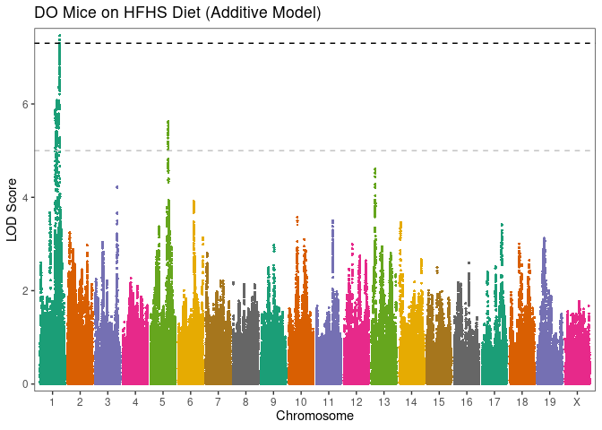
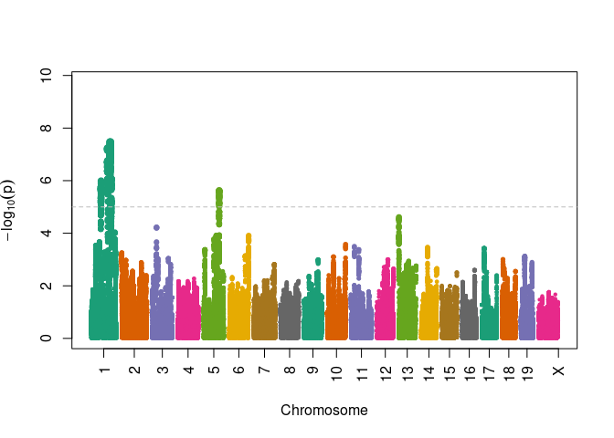
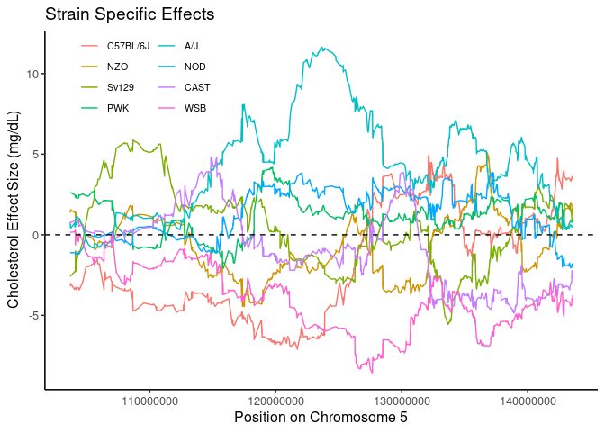
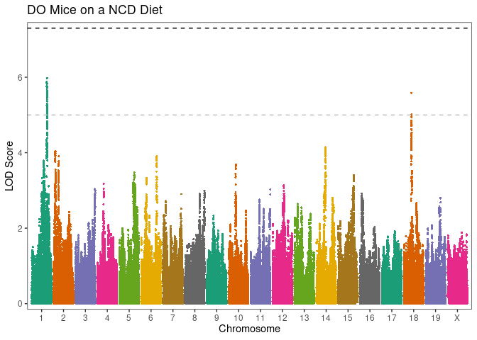

# Purpose

# Experimental Details

This analyses the data analysed via GEMMA and provided in the various output folders.

# Data Entry


``` r
# additive lmm data
lmm.additive.filename <- 'output/cholesterol_all.assoc.txt'
lmm.additive.data <- read_tsv(lmm.additive.filename) %>%
  separate(rs, sep="_", into=c("chromosome","position","allele","alt"),remove=FALSE) %>%
  mutate(chromosome=factor(chromosome, c(1:19,"X"))) %>%
  mutate(position=as.integer(position))

lmm.ncd.filename <- 'output/cholesterol_ncd.assoc.txt'
lmm.ncd.results <- read_tsv(lmm.ncd.filename) %>%
  separate(rs, sep="_", into=c("chromosome","position","allele","alt"),remove=FALSE) %>%
  mutate(chromosome=factor(chromosome, c(1:19,"X"))) %>%
  mutate(position=as.integer(position))

lmm.hfd.filename <- 'output/cholesterol_hfd.assoc.txt'
lmm.hfd.results <- read_tsv(lmm.hfd.filename) %>%
  separate(rs, sep="_", into=c("chromosome","position","allele","alt"),remove=FALSE) %>%
  mutate(chromosome=factor(chromosome, c(1:19,"X"))) %>%
  mutate(position=as.integer(position))


# additive BSLMM data
bslmm.hyp.additive.file <- 'output/cholesterol_bslmm.hyp.txt'
bslmm.additive.results.file <- 'output/cholesterol_bslmm.param.txt'
bslmm.hyp <- read_tsv(bslmm.hyp.additive.file,
         col_types=cols(
           h = col_double(),
           pve = col_double(),
           rho = col_double(),
           pge = col_double(),
           pi = col_double(),
           n_gamma = col_integer()
)) 

bslmm.additive.results <- read_tsv(bslmm.additive.results.file, 
                               col_types = cols(chr=col_factor(levels=NULL))) %>%
  separate(rs, sep="_", into=c("chromosome","position","allele","alt"),remove=FALSE) %>%
  mutate(eff.size = beta*gamma) %>%
  #filter(eff.size >0) %>%
  arrange(-abs(eff.size)) %>%
  mutate(position=as.integer(position)) %>%
  mutate(chromosome=factor(chromosome, c(1:19,"X"))) 
```


# Additive Models

Ran the additive models using GEMMA, first using intercepts and additiv ecovariates for diet and sex

$SNP = beta_1 SNP + \beta_2 Diet + \beta_3 Sex + \mu +\epsilon$

Where $$\epsilon$$ are the residuals and $$\mu$$ is the relationship matrix of the strains as defined by

## LMM Analysis for Additive Models


``` r
library(qqman)
qq(lmm.additive.data$p_wald)
suggestive.pval <- 1E-5
genome.pval <- 5E-8

lmm.additive.data %>%
  arrange(p_wald) %>% 
  filter(p_wald<genome.pval) %>%
  kable(caption="Genome-wide significant associations from mixed linear models for cholesterol in additive model") 
```


Table: Genome-wide significant associations from mixed linear models for cholesterol in additive model

| chr|rs              |chromosome |  position|allele |alt | ps| n_miss|allele1 |allele0 |    af| beta|   se| logl_H1| l_remle| p_wald|
|---:|:---------------|:----------|---------:|:------|:---|--:|------:|:-------|:-------|-----:|----:|----:|-------:|-------:|------:|
|  -9|1_171425406_H_C |1          | 171425406|H      |C   | -9|      0|C       |H       | 0.094| 14.6| 2.62|   -3815|    2.22|      0|
|  -9|1_171431917_H_C |1          | 171431917|H      |C   | -9|      0|C       |H       | 0.094| 14.6| 2.62|   -3815|    2.22|      0|
|  -9|1_171295194_H_C |1          | 171295194|H      |C   | -9|      0|C       |H       | 0.095| 14.5| 2.61|   -3815|    2.21|      0|
|  -9|1_171418895_H_C |1          | 171418895|H      |C   | -9|      0|C       |H       | 0.095| 14.5| 2.62|   -3815|    2.22|      0|

``` r
lmm.additive.data %>%
  arrange(p_wald) %>% 
  filter(p_wald<suggestive.pval) %>%
  mutate(position.start = substr(as.character(position), 1,2)) %>%
  group_by(chromosome,position.start) %>%
  summarize_all(.funs=first) %>%
  select(-position.start,-chr,-ps) %>%
  kable(caption="Suggestive genome-wide significant associations from mixed linear models for cholesterol in additive model, clumped by first two digits of the position") 
```


Table: Suggestive genome-wide significant associations from mixed linear models for cholesterol in additive model, clumped by first two digits of the position

|chromosome |rs              |  position|allele |alt | n_miss|allele1 |allele0 |    af|  beta|   se| logl_H1| l_remle| p_wald|
|:----------|:---------------|---------:|:------|:---|------:|:-------|:-------|-----:|-----:|----:|-------:|-------:|------:|
|1          |1_138064771_D_H | 138064771|D      |H   |      0|H       |D       | 0.160| 10.41| 2.14|   -3818|    1.75|      0|
|1          |1_143704476_D_H | 143704476|D      |H   |      0|H       |D       | 0.161|  9.94| 2.15|   -3820|    1.79|      0|
|1          |1_155276305_H_H | 155276305|H      |H   |      0|H       |H       | 0.199|  9.83| 1.98|   -3818|    1.64|      0|
|1          |1_169972414_F_C | 169972414|F      |C   |      0|C       |F       | 0.084| 14.85| 2.72|   -3815|    2.23|      0|
|1          |1_171425406_H_C | 171425406|H      |C   |      0|C       |H       | 0.094| 14.59| 2.62|   -3815|    2.22|      0|
|5          |5_123629774_B_E | 123629774|B      |E   |      0|E       |B       | 0.110| 11.66| 2.45|   -3819|    2.17|      0|

``` r
lmm.additive.data %>%
  arrange(p_wald) %>% 
  filter(p_wald<1E-4) %>%
  mutate(position.start = substr(as.character(position), 1,2)) %>%
  group_by(chromosome,position.start) %>%
  summarize_all(.funs=first) %>%
  select(-position.start,-chr,-ps) -> additive.snp.summary

additive.snp.summary %>%
  kable(caption="Relaxed suggestive genome-wide significant associations from mixed linear models for cholesterol in additive model, clumped by first two digits of the position") 
```


Table: Relaxed suggestive genome-wide significant associations from mixed linear models for cholesterol in additive model, clumped by first two digits of the position

|chromosome |rs              |  position|allele |alt | n_miss|allele1 |allele0 |    af|  beta|   se| logl_H1| l_remle| p_wald|
|:----------|:---------------|---------:|:------|:---|------:|:-------|:-------|-----:|-----:|----:|-------:|-------:|------:|
|1          |1_138064771_D_H | 138064771|D      |H   |      0|H       |D       | 0.160| 10.41| 2.14|   -3818|    1.75|      0|
|1          |1_143704476_D_H | 143704476|D      |H   |      0|H       |D       | 0.161|  9.94| 2.15|   -3820|    1.79|      0|
|1          |1_155276305_H_H | 155276305|H      |H   |      0|H       |H       | 0.199|  9.83| 1.98|   -3818|    1.64|      0|
|1          |1_169972414_F_C | 169972414|F      |C   |      0|C       |F       | 0.084| 14.85| 2.72|   -3815|    2.23|      0|
|1          |1_171425406_H_C | 171425406|H      |C   |      0|C       |H       | 0.094| 14.59| 2.62|   -3815|    2.22|      0|
|3          |3_148547289_A_H | 148547289|A      |H   |      0|H       |A       | 0.109| 10.00| 2.48|   -3822|    1.99|      0|
|5          |5_123629774_B_E | 123629774|B      |E   |      0|E       |B       | 0.110| 11.66| 2.45|   -3819|    2.17|      0|
|13         |13_29976363_E_C |  29976363|E      |C   |      0|C       |E       | 0.156|  9.25| 2.19|   -3821|    2.10|      0|
|13         |13_30180778_E_C |  30180778|E      |C   |      0|C       |E       | 0.156|  9.27| 2.19|   -3821|    2.10|      0|

``` r
library(ggmanh)
```

<!-- -->

``` r
manhattan_plot(x = lmm.additive.data, pval.colname = "p_wald", chr.colname = "chromosome", pos.colname = "position", plot.title = "DO Mice on HFHS Diet (Additive Model)", y.label = "LOD Score")
```

<!-- -->

``` r
library(GWASTools)
with(lmm.additive.data,manhattanPlot(p=p_wald,
                               chromosome=chromosome,
                               signif=suggestive.pval))
```

<!-- -->

### Chromosome 1 Peak


``` r
snp.pos <- 171425406
library(forcats)
peak1.b <- filter(lmm.additive.data,
                  chromosome==1,
                  position>snp.pos-20000000,
                  position<snp.pos+20000000) %>%
  mutate(alt=fct_recode(as.factor(alt),
                        "C57BL/6J"="A",
                        "NZO"="B",
                        "Sv129"="C",
                        "PWK"="D",
                        "A/J"="E",
                        "NOD"="F",
                        "CAST"="G",
                        "WSB"="H"))

ggplot(data=peak1.b,
       aes(x=position,
       y=beta,
       col=alt,
       group=alt)) +
  geom_line() +
  geom_hline(yintercept=0,lty=2) +
  labs(title="Strain Specific Effects",
       y="Cholesterol Effect Size (mg/dL)",
       x="Position on Chromosome 1") +
  scale_color_discrete(name="") +
  guides(col=guide_legend(ncol=2)) +
  theme_classic(base_size=12) +
  theme(legend.position=c(0.18,0.9),
        legend.text=element_text(size=8))
```

<!-- -->

### Chromosome 5 Peak


``` r
snp.pos <- 123629774
peak5 <- filter(lmm.additive.data,
                  chromosome==5,
                  position>snp.pos-20000000,
                  position<snp.pos+20000000) %>%
  mutate(alt=fct_recode(as.factor(alt),
                        "C57BL/6J"="A",
                        "NZO"="B",
                        "Sv129"="C",
                        "PWK"="D",
                        "A/J"="E",
                        "NOD"="F",
                        "CAST"="G",
                        "WSB"="H"))

ggplot(data=peak5,
       aes(x=position,
       y=beta,
       col=alt,
       group=alt)) +
  geom_line() +
  geom_hline(yintercept=0,lty=2) +
  labs(title="Strain Specific Effects",
       y="Cholesterol Effect Size (mg/dL)",
       x="Position on Chromosome 5") +
  scale_color_discrete(name="") +
  guides(col=guide_legend(ncol=2)) +
  theme_classic(base_size=12) +
  theme(legend.position=c(0.18,0.9),
        legend.text=element_text(size=8))
```

<!-- -->


``` r
## BSLMM Analysis

# pve -> proportion of phenotypic variance explained by the genotypes
pve<-c("PVE", mean(bslmm.hyp$pve),quantile(bslmm.hyp$pve, probs=c(0.5,0.025,0.975)))

# pge -> proportion of genetic variance explained by major effect loci
pge<-c("PGE",mean(bslmm.hyp$pge),quantile(bslmm.hyp$pge, probs=c(0.5,0.025,0.975)))

#rho -> relatiave proportion of BVSR vs LMM
rho<-c("Rho",mean(bslmm.hyp$rho),quantile(bslmm.hyp$rho, probs=c(0.5,0.025,0.975)))

# pi -> proportion of variants with non-zero effects
pi<-c("pi",mean(bslmm.hyp$pi),quantile(bslmm.hyp$pi, probs=c(0.5,0.025,0.975)))

# n.gamma -> number of variants with major effect
n.gamma<-c("n.gamma",mean(bslmm.hyp$n_gamma),quantile(bslmm.hyp$n_gamma, probs=c(0.5,0.025,0.975)))

hyp.params.table<-as.data.frame(rbind(pve,pge,pi,n.gamma,rho),row.names=F)
colnames(hyp.params.table)<-c("hyperparam", "mean","median","2.5%", "97.5%")
# show table
hyp.params.table %>% 
  tibble() %>% 
  mutate_at(vars(mean,median,`2.5%`,`97.5%`),
            .funs=as.numeric) %>%
  kable(caption="Hyperparameters summary", digits=3)
```


Table: Hyperparameters summary

|hyperparam |   mean| median|  2.5%|   97.5%|
|:----------|------:|------:|-----:|-------:|
|PVE        |  0.202|  0.200| 0.099|   0.311|
|PGE        |  0.432|  0.419| 0.000|   0.955|
|pi         |  0.000|  0.000| 0.000|   0.000|
|n.gamma    | 42.578| 38.000| 0.000| 112.000|
|Rho        |  0.493|  0.489| 0.037|   0.958|


## BSLMM SNP Nomination for Additive Models


``` r
bslmm.additive.results  %>% head(10) %>% kable(caption="Variants with the largest effect sizes")
```


Table: Variants with the largest effect sizes

|chr |rs              |chromosome |  position|allele |alt | ps| n_miss| alpha| beta| gamma| eff.size|
|:---|:---------------|:----------|---------:|:------|:---|--:|------:|-----:|----:|-----:|--------:|
|-9  |1_138062762_D_H |1          | 138062762|D      |H   | -9|      0| 0.002| 12.3| 0.019|    0.227|
|-9  |1_137589046_A_H |1          | 137589046|A      |H   | -9|      0| 0.002| 11.6| 0.018|    0.215|
|-9  |1_138013580_D_H |1          | 138013580|D      |H   | -9|      0| 0.002| 12.7| 0.016|    0.205|
|-9  |1_137999848_D_H |1          | 137999848|D      |H   | -9|      0| 0.002| 11.6| 0.017|    0.201|
|-9  |1_138020445_D_H |1          | 138020445|D      |H   | -9|      0| 0.002| 11.5| 0.017|    0.199|
|-9  |1_138058743_D_H |1          | 138058743|D      |H   | -9|      0| 0.002| 12.5| 0.016|    0.197|
|-9  |1_138006714_D_H |1          | 138006714|D      |H   | -9|      0| 0.002| 12.7| 0.013|    0.171|
|-9  |1_137512618_C_H |1          | 137512618|C      |H   | -9|      0| 0.002| 11.1| 0.015|    0.168|
|-9  |1_137634475_D_H |1          | 137634475|D      |H   | -9|      0| 0.002| 10.9| 0.015|    0.165|
|-9  |1_138208411_D_H |1          | 138208411|D      |H   | -9|      0| 0.002| 12.7| 0.012|    0.148|

``` r
# variants with the highest sparse effects
# ------------------------------------------------------------------------------
# top 1% variants (above 99% quantile)
top1<-bslmm.additive.results[bslmm.additive.results$eff.size>quantile(bslmm.additive.results$eff.size,0.99),]
# top 0.1% variants (above 99.9% quantile)
top01<-bslmm.additive.results[bslmm.additive.results$eff.size>quantile(bslmm.additive.results$eff.size,0.999),]
# top 0.01% variants (above 99.99% quantile)
top001<-bslmm.additive.results[bslmm.additive.results$eff.size>quantile(bslmm.additive.results$eff.size,0.9999),]

top001 %>% kable(caption="Top 99.99 quantile variants with the highest sparse effects")
```


Table: Top 99.99 quantile variants with the highest sparse effects

|chr |rs               |chromosome |  position|allele |alt | ps| n_miss| alpha|  beta| gamma| eff.size|
|:---|:----------------|:----------|---------:|:------|:---|--:|------:|-----:|-----:|-----:|--------:|
|-9  |1_138062762_D_H  |1          | 138062762|D      |H   | -9|      0| 0.002| 12.28| 0.019|    0.227|
|-9  |1_137589046_A_H  |1          | 137589046|A      |H   | -9|      0| 0.002| 11.64| 0.018|    0.215|
|-9  |1_138013580_D_H  |1          | 138013580|D      |H   | -9|      0| 0.002| 12.75| 0.016|    0.205|
|-9  |1_137999848_D_H  |1          | 137999848|D      |H   | -9|      0| 0.002| 11.57| 0.017|    0.201|
|-9  |1_138020445_D_H  |1          | 138020445|D      |H   | -9|      0| 0.002| 11.50| 0.017|    0.199|
|-9  |1_138058743_D_H  |1          | 138058743|D      |H   | -9|      0| 0.002| 12.51| 0.016|    0.197|
|-9  |1_138006714_D_H  |1          | 138006714|D      |H   | -9|      0| 0.002| 12.69| 0.013|    0.171|
|-9  |1_137512618_C_H  |1          | 137512618|C      |H   | -9|      0| 0.002| 11.07| 0.015|    0.168|
|-9  |1_137634475_D_H  |1          | 137634475|D      |H   | -9|      0| 0.002| 10.88| 0.015|    0.165|
|-9  |1_138208411_D_H  |1          | 138208411|D      |H   | -9|      0| 0.002| 12.71| 0.012|    0.148|
|-9  |1_138064771_D_H  |1          | 138064771|D      |H   | -9|      0| 0.002| 12.24| 0.012|    0.147|
|-9  |1_138060753_D_H  |1          | 138060753|D      |H   | -9|      0| 0.002| 13.18| 0.010|    0.137|
|-9  |1_138036660_D_H  |1          | 138036660|D      |H   | -9|      0| 0.002| 11.26| 0.012|    0.130|
|-9  |1_138383562_D_H  |1          | 138383562|D      |H   | -9|      0| 0.002| 10.67| 0.010|    0.106|
|-9  |1_138383057_D_H  |1          | 138383057|D      |H   | -9|      0| 0.002| 11.02| 0.010|    0.105|
|-9  |1_137628739_D_H  |1          | 137628739|D      |H   | -9|      0| 0.002| 11.54| 0.009|    0.104|
|-9  |1_138385079_D_H  |1          | 138385079|D      |H   | -9|      0| 0.002| 10.75| 0.010|    0.102|
|-9  |1_137852019_D_H  |1          | 137852019|D      |H   | -9|      0| 0.002| 12.92| 0.008|    0.102|
|-9  |1_138213512_D_H  |1          | 138213512|D      |H   | -9|      0| 0.002| 12.43| 0.008|    0.097|
|-9  |1_138109860_D_H  |1          | 138109860|D      |H   | -9|      0| 0.002| 12.69| 0.007|    0.090|
|-9  |1_138384573_D_H  |1          | 138384573|D      |H   | -9|      0| 0.002|  9.97| 0.009|    0.088|
|-9  |10_86227984_F_H  |10         |  86227984|F      |H   | -9|      0| 0.001|  5.08| 0.015|    0.075|
|-9  |1_138384068_D_H  |1          | 138384068|D      |H   | -9|      0| 0.002| 11.93| 0.006|    0.073|
|-9  |X_59063449_G_G   |X          |  59063449|G      |G   | -9|      0| 0.002|  9.63| 0.008|    0.073|
|-9  |1_138375160_D_H  |1          | 138375160|D      |H   | -9|      0| 0.002| 11.42| 0.006|    0.070|
|-9  |1_138218613_D_H  |1          | 138218613|D      |H   | -9|      0| 0.002| 10.64| 0.006|    0.067|
|-9  |6_103266509_D_C  |6          | 103266509|D      |C   | -9|      0| 0.002|  5.97| 0.010|    0.062|
|-9  |15_6828348_F_A   |15         |   6828348|F      |A   | -9|      0| 0.001|  2.69| 0.023|    0.061|
|-9  |1_138385584_D_H  |1          | 138385584|D      |H   | -9|      0| 0.002| 10.75| 0.006|    0.061|
|-9  |4_131449667_H_C  |4          | 131449667|H      |C   | -9|      0| 0.001|  4.82| 0.012|    0.060|
|-9  |X_59032536_G_G   |X          |  59032536|G      |G   | -9|      0| 0.002| 10.59| 0.005|    0.055|
|-9  |6_142874788_D_B  |6          | 142874788|D      |B   | -9|      0| 0.001|  5.51| 0.010|    0.054|
|-9  |12_114139385_A_B |12         | 114139385|A      |B   | -9|      0| 0.001|  5.63| 0.009|    0.053|
|-9  |X_59406980_G_G   |X          |  59406980|G      |G   | -9|      0| 0.002|  8.50| 0.006|    0.052|
|-9  |X_59261920_G_G   |X          |  59261920|G      |G   | -9|      0| 0.002|  9.58| 0.005|    0.051|
|-9  |X_59032536_C_G   |X          |  59032536|C      |G   | -9|      0| 0.002|  9.89| 0.005|    0.050|
|-9  |X_59084058_G_G   |X          |  59084058|G      |G   | -9|      0| 0.002|  9.14| 0.005|    0.050|
|-9  |X_12538370_C_C   |X          |  12538370|C      |C   | -9|      0| 0.003|  6.53| 0.007|    0.048|
|-9  |2_115129146_H_H  |2          | 115129146|H      |H   | -9|      0| 0.002|  7.02| 0.007|    0.048|
|-9  |2_113976518_H_H  |2          | 113976518|H      |H   | -9|      0| 0.002|  8.02| 0.006|    0.048|
|-9  |2_114377329_H_H  |2          | 114377329|H      |H   | -9|      0| 0.002|  6.40| 0.007|    0.047|
|-9  |12_40595277_F_H  |12         |  40595277|F      |H   | -9|      0| 0.001|  4.47| 0.010|    0.047|
|-9  |16_65104450_B_C  |16         |  65104450|B      |C   | -9|      0| 0.001|  4.55| 0.010|    0.047|
|-9  |X_58458107_C_G   |X          |  58458107|C      |G   | -9|      0| 0.002| 10.33| 0.004|    0.046|
|-9  |X_50264483_B_D   |X          |  50264483|B      |D   | -9|      0| 0.002|  4.49| 0.010|    0.046|
|-9  |2_161245590_C_D  |2          | 161245590|C      |D   | -9|      0| 0.001|  3.78| 0.012|    0.046|
|-9  |7_141114430_F_H  |7          | 141114430|F      |H   | -9|      0| 0.001|  4.29| 0.011|    0.045|
|-9  |X_59053145_A_G   |X          |  59053145|A      |G   | -9|      0| 0.002|  8.94| 0.005|    0.045|
|-9  |X_59430603_A_G   |X          |  59430603|A      |G   | -9|      0| 0.002|  9.17| 0.005|    0.043|
|-9  |1_143704476_D_H  |1          | 143704476|D      |H   | -9|      0| 0.002| 10.33| 0.004|    0.043|
|-9  |2_59395957_H_F   |2          |  59395957|H      |F   | -9|      0| 0.001|  4.97| 0.009|    0.042|
|-9  |X_59053145_G_G   |X          |  59053145|G      |G   | -9|      0| 0.002|  8.55| 0.005|    0.042|
|-9  |1_137640211_D_H  |1          | 137640211|D      |H   | -9|      0| 0.002| 11.54| 0.004|    0.042|
|-9  |6_106609017_D_C  |6          | 106609017|D      |C   | -9|      0| 0.001|  4.94| 0.008|    0.042|
|-9  |2_114074016_H_H  |2          | 114074016|H      |H   | -9|      0| 0.002|  7.55| 0.005|    0.041|
|-9  |X_58455484_G_G   |X          |  58455484|G      |G   | -9|      0| 0.002|  9.44| 0.004|    0.040|
|-9  |6_92697172_H_C   |6          |  92697172|H      |C   | -9|      0| 0.001|  3.52| 0.011|    0.040|

``` r
top001 %>%
  mutate(position.start = substr(as.character(position), 1,2)) %>%
  group_by(chromosome,position.start) %>%
  summarize_all(.funs=first) %>%
  select(-position.start,-chr,-ps) -> top001.filtered

top001.filtered %>%
kable(caption="Lead SNP for top 99.99 quartile variants")
```


Table: Lead SNP for top 99.99 quartile variants

|chromosome |rs               |  position|allele |alt | n_miss| alpha|  beta| gamma| eff.size|
|:----------|:----------------|---------:|:------|:---|------:|-----:|-----:|-----:|--------:|
|1          |1_138062762_D_H  | 138062762|D      |H   |      0| 0.002| 12.28| 0.019|    0.227|
|1          |1_143704476_D_H  | 143704476|D      |H   |      0| 0.002| 10.33| 0.004|    0.043|
|2          |2_115129146_H_H  | 115129146|H      |H   |      0| 0.002|  7.02| 0.007|    0.048|
|2          |2_161245590_C_D  | 161245590|C      |D   |      0| 0.001|  3.78| 0.012|    0.046|
|2          |2_59395957_H_F   |  59395957|H      |F   |      0| 0.001|  4.97| 0.009|    0.042|
|4          |4_131449667_H_C  | 131449667|H      |C   |      0| 0.001|  4.82| 0.012|    0.060|
|6          |6_103266509_D_C  | 103266509|D      |C   |      0| 0.002|  5.97| 0.010|    0.062|
|6          |6_142874788_D_B  | 142874788|D      |B   |      0| 0.001|  5.51| 0.010|    0.054|
|6          |6_92697172_H_C   |  92697172|H      |C   |      0| 0.001|  3.52| 0.011|    0.040|
|7          |7_141114430_F_H  | 141114430|F      |H   |      0| 0.001|  4.29| 0.011|    0.045|
|10         |10_86227984_F_H  |  86227984|F      |H   |      0| 0.001|  5.08| 0.015|    0.075|
|12         |12_114139385_A_B | 114139385|A      |B   |      0| 0.001|  5.63| 0.009|    0.053|
|12         |12_40595277_F_H  |  40595277|F      |H   |      0| 0.001|  4.47| 0.010|    0.047|
|15         |15_6828348_F_A   |   6828348|F      |A   |      0| 0.001|  2.69| 0.023|    0.061|
|16         |16_65104450_B_C  |  65104450|B      |C   |      0| 0.001|  4.55| 0.010|    0.047|
|X          |X_12538370_C_C   |  12538370|C      |C   |      0| 0.003|  6.53| 0.007|    0.048|
|X          |X_50264483_B_D   |  50264483|B      |D   |      0| 0.002|  4.49| 0.010|    0.046|
|X          |X_58458107_C_G   |  58458107|C      |G   |      0| 0.002| 10.33| 0.004|    0.046|
|X          |X_59063449_G_G   |  59063449|G      |G   |      0| 0.002|  9.63| 0.008|    0.073|

``` r
top001.filtered %>% arrange(-gamma) %>% kable(caption="Variants with the largest posterior probability as defined by gamma.  Gamma indicates the percent of times the variant was found in a MCMC simulation")
```


Table: Variants with the largest posterior probability as defined by gamma.  Gamma indicates the percent of times the variant was found in a MCMC simulation

|chromosome |rs               |  position|allele |alt | n_miss| alpha|  beta| gamma| eff.size|
|:----------|:----------------|---------:|:------|:---|------:|-----:|-----:|-----:|--------:|
|15         |15_6828348_F_A   |   6828348|F      |A   |      0| 0.001|  2.69| 0.023|    0.061|
|1          |1_138062762_D_H  | 138062762|D      |H   |      0| 0.002| 12.28| 0.019|    0.227|
|10         |10_86227984_F_H  |  86227984|F      |H   |      0| 0.001|  5.08| 0.015|    0.075|
|4          |4_131449667_H_C  | 131449667|H      |C   |      0| 0.001|  4.82| 0.012|    0.060|
|2          |2_161245590_C_D  | 161245590|C      |D   |      0| 0.001|  3.78| 0.012|    0.046|
|6          |6_92697172_H_C   |  92697172|H      |C   |      0| 0.001|  3.52| 0.011|    0.040|
|7          |7_141114430_F_H  | 141114430|F      |H   |      0| 0.001|  4.29| 0.011|    0.045|
|12         |12_40595277_F_H  |  40595277|F      |H   |      0| 0.001|  4.47| 0.010|    0.047|
|6          |6_103266509_D_C  | 103266509|D      |C   |      0| 0.002|  5.97| 0.010|    0.062|
|X          |X_50264483_B_D   |  50264483|B      |D   |      0| 0.002|  4.49| 0.010|    0.046|
|16         |16_65104450_B_C  |  65104450|B      |C   |      0| 0.001|  4.55| 0.010|    0.047|
|6          |6_142874788_D_B  | 142874788|D      |B   |      0| 0.001|  5.51| 0.010|    0.054|
|12         |12_114139385_A_B | 114139385|A      |B   |      0| 0.001|  5.63| 0.009|    0.053|
|2          |2_59395957_H_F   |  59395957|H      |F   |      0| 0.001|  4.97| 0.009|    0.042|
|X          |X_59063449_G_G   |  59063449|G      |G   |      0| 0.002|  9.63| 0.008|    0.073|
|X          |X_12538370_C_C   |  12538370|C      |C   |      0| 0.003|  6.53| 0.007|    0.048|
|2          |2_115129146_H_H  | 115129146|H      |H   |      0| 0.002|  7.02| 0.007|    0.048|
|X          |X_58458107_C_G   |  58458107|C      |G   |      0| 0.002| 10.33| 0.004|    0.046|
|1          |1_143704476_D_H  | 143704476|D      |H   |      0| 0.002| 10.33| 0.004|    0.043|

There were 33565 variants with detectable effect sizes.

## SNP Analysis

### Linear Mixed Model SNP Analysis for Chow


``` r
qq(lmm.ncd.results$p_wald)
```

<!-- -->

``` r
lmm.ncd.results %>%
  arrange(p_wald) %>% 
  filter(p_wald<genome.pval) %>%
  kable(caption="Genome-wide significant associations from mixed linear models for cholesterol on NCD") 
```


Table: Genome-wide significant associations from mixed linear models for cholesterol on NCD

| chr|rs |chromosome | position|allele |alt | ps| n_miss|allele1 |allele0 | af| beta| se| logl_H1| l_remle| p_wald|
|---:|:--|:----------|--------:|:------|:---|--:|------:|:-------|:-------|--:|----:|--:|-------:|-------:|------:|

``` r
lmm.ncd.results %>%
   arrange(p_wald) %>% 
   filter(p_wald<suggestive.pval) %>%
  mutate(position.start = substr(as.character(position), 1,2)) %>%
  group_by(chromosome,position.start) %>%
  summarize_all(.funs=first) %>%
  select(-position.start,-chr,-ps) -> ncd.snp.summary
  
lmm.ncd.results %>%
   arrange(p_wald) %>% 
   filter(p_wald<1E-3) %>%
   mutate(position.start = substr(as.character(position), 1,2)) %>%
  group_by(chromosome,position.start) %>%
  summarize_all(.funs=first) %>%
  select(-position.start,-chr,-ps)  %>% 
  kable(caption="Relaxed suggestive genome-wide significant associations from mixed linear models for cholesterol on HFD, clumped by first two digits of the position") 
```


Table: Relaxed suggestive genome-wide significant associations from mixed linear models for cholesterol on HFD, clumped by first two digits of the position

|chromosome |rs               |  position|allele |alt | n_miss|allele1 |allele0 |    af|   beta|   se| logl_H1| l_remle| p_wald|
|:----------|:----------------|---------:|:------|:---|------:|:-------|:-------|-----:|------:|----:|-------:|-------:|------:|
|1          |1_117784609_B_C  | 117784609|B      |C   |      0|C       |B       | 0.119|   9.25| 2.62|   -1966|    3.30|  0.000|
|1          |1_136644599_C_A  | 136644599|C      |A   |      0|A       |C       | 0.151|  -9.19| 2.42|   -1966|    2.51|  0.000|
|1          |1_152428168_H_A  | 152428168|H      |A   |      0|A       |H       | 0.139|  -8.99| 2.45|   -1966|    3.07|  0.000|
|1          |1_169972414_F_C  | 169972414|F      |C   |      0|C       |F       | 0.087|  14.49| 2.93|   -1960|    3.55|  0.000|
|1          |1_170324641_H_C  | 170324641|H      |C   |      0|C       |H       | 0.087|  14.52| 2.93|   -1960|    3.55|  0.000|
|1          |1_183576795_H_C  | 183576795|H      |C   |      0|C       |H       | 0.099|   9.30| 2.74|   -1966|    3.68|  0.001|
|2          |2_14535771_H_G   |  14535771|H      |G   |      0|G       |H       | 0.132|   8.58| 2.51|   -1967|    3.06|  0.001|
|2          |2_15491718_H_G   |  15491718|H      |G   |      0|G       |H       | 0.111|  10.14| 2.64|   -1965|    2.80|  0.000|
|2          |2_16663582_H_G   |  16663582|H      |G   |      0|G       |H       | 0.110|  10.47| 2.65|   -1965|    2.83|  0.000|
|2          |2_17009990_H_G   |  17009990|H      |G   |      0|G       |H       | 0.115|   9.50| 2.60|   -1966|    2.80|  0.000|
|2          |2_18921607_H_G   |  18921607|H      |G   |      0|G       |H       | 0.115|   9.31| 2.56|   -1966|    2.92|  0.000|
|2          |2_19865037_H_G   |  19865037|H      |G   |      0|G       |H       | 0.114|   9.19| 2.62|   -1966|    3.12|  0.000|
|2          |2_20154521_H_G   |  20154521|H      |G   |      0|G       |H       | 0.109|   8.70| 2.58|   -1967|    3.20|  0.001|
|2          |2_43690499_H_G   |  43690499|H      |G   |      0|G       |H       | 0.113|   9.66| 2.60|   -1965|    3.70|  0.000|
|2          |2_44240389_H_G   |  44240389|H      |G   |      0|G       |H       | 0.119|   8.89| 2.49|   -1966|    3.73|  0.000|
|2          |2_45242400_H_G   |  45242400|H      |G   |      0|G       |H       | 0.118|   9.18| 2.58|   -1966|    3.70|  0.000|
|2          |2_47871335_G_G   |  47871335|G      |G   |      0|G       |G       | 0.136|   8.04| 2.39|   -1967|    3.56|  0.001|
|2          |2_48818189_G_G   |  48818189|G      |G   |      0|G       |G       | 0.141|   8.53| 2.35|   -1966|    3.54|  0.000|
|2          |2_49650224_G_G   |  49650224|G      |G   |      0|G       |G       | 0.140|   9.14| 2.36|   -1965|    3.61|  0.000|
|3          |3_156886929_F_B  | 156886929|F      |B   |      0|B       |F       | 0.105|   9.06| 2.71|   -1967|    4.00|  0.001|
|4          |4_54753377_C_G   |  54753377|C      |G   |      0|G       |C       | 0.122|   8.77| 2.56|   -1966|    3.30|  0.001|
|5          |5_128399127_D_E  | 128399127|D      |E   |      0|E       |D       | 0.118|   9.15| 2.53|   -1966|    3.74|  0.000|
|5          |5_133357791_C_F  | 133357791|C      |F   |      0|F       |C       | 0.096|   9.99| 2.93|   -1966|    3.48|  0.001|
|6          |6_126771534_D_E  | 126771534|D      |E   |      0|E       |D       | 0.065|  12.67| 3.27|   -1965|    3.67|  0.000|
|6          |6_41772867_G_G   |  41772867|G      |G   |      0|G       |G       | 0.119|  -9.01| 2.57|   -1966|    3.60|  0.001|
|6          |6_42232037_G_G   |  42232037|G      |G   |      0|G       |G       | 0.118|  -9.02| 2.56|   -1966|    3.62|  0.000|
|10         |10_54747088_H_B  |  54747088|H      |B   |      0|B       |H       | 0.065| -10.96| 3.05|   -1966|    3.25|  0.000|
|10         |10_55538600_H_B  |  55538600|H      |B   |      0|B       |H       | 0.063| -11.75| 3.13|   -1965|    3.23|  0.000|
|11         |11_121921138_G_G | 121921138|G      |G   |      0|G       |G       | 0.076|  -9.88| 2.97|   -1967|    3.65|  0.001|
|12         |12_84203316_H_C  |  84203316|H      |C   |      0|C       |H       | 0.206|  -7.26| 2.13|   -1966|    3.75|  0.001|
|14         |14_58887010_F_F  |  58887010|F      |F   |      0|F       |F       | 0.108|   9.01| 2.65|   -1966|    3.52|  0.001|
|14         |14_59011591_F_F  |  59011591|F      |F   |      0|F       |F       | 0.107|   9.06| 2.67|   -1966|    3.48|  0.001|
|14         |14_62912822_H_F  |  62912822|H      |F   |      0|F       |H       | 0.096|  10.09| 2.79|   -1966|    3.50|  0.000|
|14         |14_63527073_H_F  |  63527073|H      |F   |      0|F       |H       | 0.101|  10.91| 2.76|   -1964|    3.53|  0.000|
|14         |14_64610241_H_F  |  64610241|H      |F   |      0|F       |H       | 0.102|  11.04| 2.75|   -1964|    3.52|  0.000|
|14         |14_65047597_H_F  |  65047597|H      |F   |      0|F       |H       | 0.103|  11.02| 2.75|   -1964|    3.52|  0.000|
|14         |14_66022446_H_F  |  66022446|H      |F   |      0|F       |H       | 0.103|   9.80| 2.73|   -1966|    3.42|  0.000|
|14         |14_67143276_H_F  |  67143276|H      |F   |      0|F       |H       | 0.090|  10.53| 2.95|   -1966|    3.42|  0.000|
|15         |15_93728085_E_G  |  93728085|E      |G   |      0|G       |E       | 0.058|  12.15| 3.62|   -1967|    3.37|  0.001|
|15         |15_94566593_F_G  |  94566593|F      |G   |      0|G       |F       | 0.062|  12.26| 3.44|   -1966|    3.49|  0.000|
|18         |18_44959139_G_A  |  44959139|G      |A   |      0|A       |G       | 0.148|   8.01| 2.27|   -1966|    3.70|  0.000|
|18         |18_45596845_G_A  |  45596845|G      |A   |      0|A       |G       | 0.145|   8.95| 2.30|   -1965|    3.58|  0.000|
|18         |18_46410922_G_A  |  46410922|G      |A   |      0|A       |G       | 0.136|  11.59| 2.43|   -1961|    3.51|  0.000|
|18         |18_47422415_G_A  |  47422415|G      |A   |      0|A       |G       | 0.135|  10.85| 2.42|   -1962|    3.53|  0.000|
|18         |18_48037460_G_A  |  48037460|G      |A   |      0|A       |G       | 0.135|  10.41| 2.40|   -1963|    3.51|  0.000|
|18         |18_49809849_C_A  |  49809849|C      |A   |      0|A       |C       | 0.146|   8.62| 2.37|   -1966|    3.32|  0.000|
|18         |18_50045754_C_A  |  50045754|C      |A   |      0|A       |C       | 0.144|   8.41| 2.37|   -1966|    3.34|  0.000|

``` r
ncd.snp.summary %>%
  kable(caption="Suggestive genome-wide significant associations from mixed linear models for cholesterol on HFD, clumped by first two digits of the position") 
```


Table: Suggestive genome-wide significant associations from mixed linear models for cholesterol on HFD, clumped by first two digits of the position

|chromosome |rs              |  position|allele |alt | n_miss|allele1 |allele0 |    af| beta|   se| logl_H1| l_remle| p_wald|
|:----------|:---------------|---------:|:------|:---|------:|:-------|:-------|-----:|----:|----:|-------:|-------:|------:|
|1          |1_169972414_F_C | 169972414|F      |C   |      0|C       |F       | 0.087| 14.5| 2.93|   -1960|    3.55|      0|
|1          |1_170324641_H_C | 170324641|H      |C   |      0|C       |H       | 0.087| 14.5| 2.93|   -1960|    3.55|      0|
|18         |18_46410922_G_A |  46410922|G      |A   |      0|A       |G       | 0.136| 11.6| 2.43|   -1961|    3.51|      0|
|18         |18_47422415_G_A |  47422415|G      |A   |      0|A       |G       | 0.135| 10.9| 2.42|   -1962|    3.53|      0|

``` r
manhattan_plot(x = lmm.ncd.results, pval.colname = "p_wald", chr.colname = "chromosome", pos.colname = "position", plot.title = "DO Mice on a NCD Diet", y.label = "LOD Score") -> ncd.manhattan

ncd.manhattan
```

<!-- -->

### Linear Mixed Model SNP Analysis for HFD


``` r
qq(lmm.hfd.results$p_wald)
```

<!-- -->

``` r
lmm.hfd.results %>%
  arrange(p_wald) %>% 
  filter(p_wald<genome.pval) %>%
  kable(caption="Genome-wide significant associations from mixed linear models for cholesterol on HFD") 
```


Table: Genome-wide significant associations from mixed linear models for cholesterol on HFD

| chr|rs |chromosome | position|allele |alt | ps| n_miss|allele1 |allele0 | af| beta| se| logl_H1| l_remle| p_wald|
|---:|:--|:----------|--------:|:------|:---|--:|------:|:-------|:-------|--:|----:|--:|-------:|-------:|------:|

``` r
lmm.hfd.results %>%
   arrange(p_wald) %>% 
   filter(p_wald<suggestive.pval) %>%
   mutate(position.start = substr(as.character(position), 1,2)) %>%
  group_by(chromosome,position.start) %>%
  summarize_all(.funs=first) %>%
  select(-position.start,-chr,-ps) %>%
  kable(caption="Suggestive genome-wide significant associations from mixed linear models for cholesterol on HFD, clumped by first two digits of the position") 
```


Table: Suggestive genome-wide significant associations from mixed linear models for cholesterol on HFD, clumped by first two digits of the position

|chromosome |rs | position|allele |alt | n_miss|allele1 |allele0 | af| beta| se| logl_H1| l_remle| p_wald|
|:----------|:--|--------:|:------|:---|------:|:-------|:-------|--:|----:|--:|-------:|-------:|------:|

``` r
lmm.hfd.results %>%
   arrange(p_wald) %>% 
   filter(p_wald<1E-3) %>%
   mutate(position.start = substr(as.character(position), 1,2)) %>%
  group_by(chromosome,position.start) %>%
  summarize_all(.funs=first) %>%
  select(-position.start,-chr,-ps) ->
  hfhs.snp.summary

hfhs.snp.summary %>%
  kable(caption="Suggestive genome-wide significant associations from mixed linear models for cholesterol on HFD, clumped by first two digits of the position") 
```


Table: Suggestive genome-wide significant associations from mixed linear models for cholesterol on HFD, clumped by first two digits of the position

|chromosome |rs               |  position|allele |alt | n_miss|allele1 |allele0 |    af|  beta|   se| logl_H1| l_remle| p_wald|
|:----------|:----------------|---------:|:------|:---|------:|:-------|:-------|-----:|-----:|----:|-------:|-------:|------:|
|1          |1_137999848_D_H  | 137999848|D      |H   |      0|H       |D       | 0.183|  13.0| 3.39|   -1813|    1.99|  0.000|
|1          |1_145155626_A_H  | 145155626|A      |H   |      0|H       |A       | 0.169|  14.0| 3.45|   -1812|    2.00|  0.000|
|1          |1_155454177_H_H  | 155454177|H      |H   |      0|H       |H       | 0.207|  14.2| 3.19|   -1810|    1.88|  0.000|
|1          |1_171425406_H_C  | 171425406|H      |C   |      0|C       |H       | 0.097|  14.9| 4.42|   -1814|    3.08|  0.001|
|1          |1_83629456_F_B   |  83629456|F      |B   |      0|B       |F       | 0.144| -12.6| 3.74|   -1814|    3.08|  0.001|
|2          |2_44937781_H_E   |  44937781|H      |E   |      0|E       |H       | 0.076| -17.0| 4.97|   -1814|    2.97|  0.001|
|2          |2_45843192_H_E   |  45843192|H      |E   |      0|E       |H       | 0.076| -17.0| 4.95|   -1814|    2.99|  0.001|
|2          |2_46253198_H_E   |  46253198|H      |E   |      0|E       |H       | 0.076| -17.0| 4.95|   -1814|    3.00|  0.001|
|2          |2_47121856_D_E   |  47121856|D      |E   |      0|E       |D       | 0.074| -16.9| 4.97|   -1814|    3.06|  0.001|
|2          |2_5564930_G_E    |   5564930|G      |E   |      0|E       |G       | 0.133| -12.4| 3.73|   -1814|    3.13|  0.001|
|2          |2_5611635_G_E    |   5611635|G      |E   |      0|E       |G       | 0.133| -12.4| 3.73|   -1814|    3.16|  0.001|
|2          |2_5772554_D_E    |   5772554|D      |E   |      0|E       |D       | 0.133| -12.4| 3.70|   -1814|    3.17|  0.001|
|2          |2_6108249_D_E    |   6108249|D      |E   |      0|E       |D       | 0.132| -12.4| 3.70|   -1814|    3.17|  0.001|
|2          |2_6288486_D_E    |   6288486|D      |E   |      0|E       |D       | 0.131| -12.6| 3.70|   -1814|    3.17|  0.001|
|2          |2_6368382_D_E    |   6368382|D      |E   |      0|E       |D       | 0.129| -14.1| 3.72|   -1812|    3.22|  0.000|
|2          |2_6468723_D_E    |   6468723|D      |E   |      0|E       |D       | 0.128| -14.2| 3.73|   -1812|    3.22|  0.000|
|2          |2_6538764_D_E    |   6538764|D      |E   |      0|E       |D       | 0.127| -14.1| 3.73|   -1812|    3.22|  0.000|
|2          |2_6694186_D_E    |   6694186|D      |E   |      0|E       |D       | 0.127| -14.1| 3.73|   -1812|    3.22|  0.000|
|2          |2_6785451_D_E    |   6785451|D      |E   |      0|E       |D       | 0.127| -14.1| 3.74|   -1812|    3.22|  0.000|
|2          |2_6802081_D_E    |   6802081|D      |E   |      0|E       |D       | 0.127| -14.1| 3.74|   -1812|    3.22|  0.000|
|2          |2_7025078_D_E    |   7025078|D      |E   |      0|E       |D       | 0.127| -14.3| 3.75|   -1812|    3.21|  0.000|
|2          |2_7250227_D_E    |   7250227|D      |E   |      0|E       |D       | 0.127| -14.4| 3.76|   -1812|    3.21|  0.000|
|2          |2_7501966_H_E    |   7501966|H      |E   |      0|E       |H       | 0.122| -14.8| 3.82|   -1812|    3.20|  0.000|
|2          |2_7611414_D_E    |   7611414|D      |E   |      0|E       |D       | 0.125| -14.1| 3.80|   -1813|    3.21|  0.000|
|2          |2_7737471_H_E    |   7737471|H      |E   |      0|E       |H       | 0.124| -14.3| 3.81|   -1813|    3.19|  0.000|
|2          |2_7857737_H_E    |   7857737|H      |E   |      0|E       |H       | 0.124| -14.2| 3.81|   -1813|    3.16|  0.000|
|2          |2_8011673_H_E    |   8011673|H      |E   |      0|E       |H       | 0.123| -14.4| 3.82|   -1812|    3.19|  0.000|
|2          |2_8182575_A_E    |   8182575|A      |E   |      0|E       |A       | 0.125| -14.0| 3.78|   -1813|    3.15|  0.000|
|2          |2_8353477_A_E    |   8353477|A      |E   |      0|E       |A       | 0.127| -14.2| 3.77|   -1812|    3.15|  0.000|
|2          |2_8524379_A_E    |   8524379|A      |E   |      0|E       |A       | 0.127| -14.2| 3.76|   -1812|    3.15|  0.000|
|2          |2_8690542_A_E    |   8690542|A      |E   |      0|E       |A       | 0.128| -13.5| 3.80|   -1813|    3.06|  0.000|
|2          |2_8861444_A_E    |   8861444|A      |E   |      0|E       |A       | 0.127| -14.1| 3.76|   -1813|    3.18|  0.000|
|2          |2_9196139_H_E    |   9196139|H      |E   |      0|E       |H       | 0.128| -12.7| 3.81|   -1814|    3.04|  0.001|
|5          |5_117508066_B_E  | 117508066|B      |E   |      0|E       |B       | 0.153|  13.2| 3.58|   -1813|    2.80|  0.000|
|5          |5_123629774_B_E  | 123629774|B      |E   |      0|E       |B       | 0.099|  16.4| 4.36|   -1812|    3.00|  0.000|
|5          |5_39679307_E_A   |  39679307|E      |A   |      0|A       |E       | 0.090| -15.7| 4.39|   -1813|    2.83|  0.000|
|5          |5_40272493_E_A   |  40272493|E      |A   |      0|A       |E       | 0.095| -15.6| 4.30|   -1813|    2.79|  0.000|
|5          |5_54858991_E_A   |  54858991|E      |A   |      0|A       |E       | 0.102| -14.6| 4.24|   -1814|    2.87|  0.001|
|5          |5_55215630_E_A   |  55215630|E      |A   |      0|A       |E       | 0.101| -14.7| 4.26|   -1814|    2.88|  0.001|
|6          |6_107008934_D_A  | 107008934|D      |A   |      0|A       |D       | 0.077| -16.9| 4.56|   -1813|    3.23|  0.000|
|8          |8_3000000_H_C    |   3000000|H      |C   |      0|C       |H       | 0.077| -15.1| 4.35|   -1814|    3.00|  0.001|
|8          |8_3410751_H_C    |   3410751|H      |C   |      0|C       |H       | 0.077| -15.2| 4.36|   -1813|    3.01|  0.001|
|10         |10_100114175_D_D | 100114175|D      |D   |      0|D       |D       | 0.171| -11.0| 3.25|   -1814|    2.30|  0.001|
|10         |10_57753923_G_C  |  57753923|G      |C   |      0|C       |G       | 0.101|  15.3| 4.38|   -1813|    2.66|  0.001|
|10         |10_58072086_G_C  |  58072086|G      |C   |      0|C       |G       | 0.101|  15.1| 4.39|   -1814|    2.66|  0.001|
|10         |10_60353971_F_C  |  60353971|F      |C   |      0|C       |F       | 0.084|  16.4| 4.78|   -1814|    2.71|  0.001|
|10         |10_95418856_F_E  |  95418856|F      |E   |      0|E       |F       | 0.120|  13.1| 3.86|   -1814|    3.28|  0.001|
|10         |10_96637576_F_E  |  96637576|F      |E   |      0|E       |F       | 0.116|  13.1| 3.92|   -1814|    3.28|  0.001|
|10         |10_99490238_H_D  |  99490238|H      |D   |      0|D       |H       | 0.163| -12.6| 3.26|   -1812|    2.17|  0.000|
|12         |12_108748974_D_C | 108748974|D      |C   |      0|C       |D       | 0.122|  14.9| 3.78|   -1812|    2.92|  0.000|
|12         |12_110011843_A_C | 110011843|A      |C   |      0|C       |A       | 0.121|  12.9| 3.86|   -1814|    2.96|  0.001|
|13         |13_26871268_G_C  |  26871268|G      |C   |      0|C       |G       | 0.147|  12.4| 3.67|   -1814|    2.57|  0.001|
|13         |13_27924769_G_C  |  27924769|G      |C   |      0|C       |G       | 0.147|  13.3| 3.64|   -1813|    2.63|  0.000|
|13         |13_28620475_G_C  |  28620475|G      |C   |      0|C       |G       | 0.153|  14.0| 3.56|   -1812|    2.56|  0.000|
|13         |13_29976363_E_C  |  29976363|E      |C   |      0|C       |E       | 0.161|  15.5| 3.49|   -1810|    2.57|  0.000|
|13         |13_30180778_E_C  |  30180778|E      |C   |      0|C       |E       | 0.161|  15.5| 3.49|   -1810|    2.57|  0.000|
|13         |13_31072103_E_C  |  31072103|E      |C   |      0|C       |E       | 0.159|  13.9| 3.52|   -1812|    2.56|  0.000|
|13         |13_32418268_A_C  |  32418268|A      |C   |      0|C       |A       | 0.155|  13.0| 3.54|   -1813|    2.49|  0.000|
|16         |16_63647011_B_B  |  63647011|B      |B   |      0|B       |B       | 0.156| -12.2| 3.60|   -1814|    3.60|  0.001|
|19         |19_25487123_G_G  |  25487123|G      |G   |      0|G       |G       | 0.129|  14.2| 3.98|   -1813|    3.05|  0.000|

``` r
manhattan_plot(x = lmm.hfd.results, pval.colname = "p_wald", chr.colname = "chromosome", pos.colname = "position", plot.title = "DO Mice on a HFHS Diet", y.label = "LOD Score") -> hfd.manhattan

hfd.manhattan
```

<!-- -->

#### Chromosome 13 QTL Associated with Cholesterol on HFHS Diets


``` r
snp.pos <- 29976363
library(forcats)
peak13 <- dplyr::filter(lmm.hfd.results,
                  chromosome==13,
                  position>snp.pos-10000000,
                  position<snp.pos+10000000) %>%
  mutate(alt=fct_recode(as.factor(alt),
                        "C57BL/6J"="A",
                        "NZO"="B",
                        "Sv129"="C",
                        "PWK"="D",
                        "A/J"="E",
                        "NOD"="F",
                        "CAST"="G",
                        "WSB"="H")) %>%
  mutate(LOD=-log10(p_wald)) %>%
  mutate(LOD.drop = LOD-max(LOD))
library(ggplot2)
ggplot(data=peak13,
       aes(x=position,
       y=beta,
       col=alt,
       group=alt)) +
  geom_line() +
  geom_hline(yintercept=0,lty=2) +
  labs(title="Strain Specific Effects",
       y="Cholesterol Effect Size (mg/dL)",
       x="Position on Chromosome 13") +
  scale_color_discrete(name="") +
  guides(col=guide_legend(ncol=2)) +
  theme_classic(base_size=16) +
  theme(legend.position=c(0.8,0.2),
        legend.text=element_text(size=8))
```

<!-- -->

``` r
#credible region 1.5 LOD less than peak 28011631-32375634
#From GenomMUSTer 3755 variants differ btween 129 and bl6
#upstream variants in Sox4 and 
#missense variant in rs29850511	chr13:29326051	T	Cdkal1	ENSMUST00000006353.13	Transcript	missense_variant	1879	1723	575	L/M	Ttg/Atg	rs29850511	EXON=16/16
#GWAS associated Cdkal1 with HDL and TC, seems to be a negative regulator of bile acid production, is atheroprotective in Apoe null mice
```

### Comparason of NCD and HFHS GWAS


``` r
library(cowplot)

# plots are drawn without alignment
plot_grid(ncd.manhattan, hfd.manhattan, align="v",ncol=1)
```

<!-- -->

## BSLMM Analysis

### For Normal Chow Diet 


``` r
bslmm.hyp.file <- 'output/ncd.cholesterol.hyp.txt'
bslmm.hyp <- read_tsv(bslmm.hyp.file,
         col_types=cols(
           h = col_double(),
           pve = col_double(),
           rho = col_double(),
           pge = col_double(),
           pi = col_double(),
           n_gamma = col_integer()
)) 


# pve -> proportion of phenotypic variance explained by the genotypes
pve<-c("PVE", mean(bslmm.hyp$pve),quantile(bslmm.hyp$pve, probs=c(0.5,0.025,0.975)))

# pge -> proportion of genetic variance explained by major effect loci
pge<-c("PGE",mean(bslmm.hyp$pge),quantile(bslmm.hyp$pge, probs=c(0.5,0.025,0.975)))

#rho -> relatiave proportion of BVSR vs LMM
rho<-c("Rho",mean(bslmm.hyp$rho),quantile(bslmm.hyp$rho, probs=c(0.5,0.025,0.975)))

# pi -> proportion of variants with non-zero effects
pi<-c("pi",mean(bslmm.hyp$pi),quantile(bslmm.hyp$pi, probs=c(0.5,0.025,0.975)))

# n.gamma -> number of variants with major effect
n.gamma<-c("n.gamma",mean(bslmm.hyp$n_gamma),quantile(bslmm.hyp$n_gamma, probs=c(0.5,0.025,0.975)))

hyp.params.table<-as.data.frame(rbind(pve,pge,pi,n.gamma,rho),row.names=F)
colnames(hyp.params.table)<-c("hyperparam", "mean","median","2.5%", "97.5%")
# show table
hyp.params.table %>% 
  tibble() %>% 
  mutate_at(vars(mean,median,`2.5%`,`97.5%`),
            .funs=as.numeric) %>%
  kable(caption="Hyperparameters summary", digits=3)
```


Table: Hyperparameters summary

|hyperparam |   mean| median|  2.5%|   97.5%|
|:----------|------:|------:|-----:|-------:|
|PVE        |  0.888|  0.937| 0.530|   1.000|
|PGE        |  0.378|  0.314| 0.000|   0.962|
|pi         |  0.001|  0.001| 0.000|   0.003|
|n.gamma    | 72.970| 48.000| 1.000| 229.000|
|Rho        |  0.421|  0.387| 0.018|   0.960|

### For High Fat Diet 


``` r
bslmm.hyp.file <- 'output/hfd.cholesterol.hyp.txt'
bslmm.hyp <- read_tsv(bslmm.hyp.file,
         col_types=cols(
           h = col_double(),
           pve = col_double(),
           rho = col_double(),
           pge = col_double(),
           pi = col_double(),
           n_gamma = col_integer()
)) 


# pve -> proportion of phenotypic variance explained by the genotypes
pve<-c("PVE", mean(bslmm.hyp$pve),quantile(bslmm.hyp$pve, probs=c(0.5,0.025,0.975)))

# pge -> proportion of genetic variance explained by major effect loci
pge<-c("PGE",mean(bslmm.hyp$pge),quantile(bslmm.hyp$pge, probs=c(0.5,0.025,0.975)))

#rho -> relatiave proportion of BVSR vs LMM
rho<-c("Rho",mean(bslmm.hyp$rho),quantile(bslmm.hyp$rho, probs=c(0.5,0.025,0.975)))

# pi -> proportion of variants with non-zero effects
pi<-c("pi",mean(bslmm.hyp$pi),quantile(bslmm.hyp$pi, probs=c(0.5,0.025,0.975)))

# n.gamma -> number of variants with major effect
n.gamma<-c("n.gamma",mean(bslmm.hyp$n_gamma),quantile(bslmm.hyp$n_gamma, probs=c(0.5,0.025,0.975)))

hyp.params.table<-as.data.frame(rbind(pve,pge,pi,n.gamma,rho),row.names=F)
colnames(hyp.params.table)<-c("hyperparam", "mean","median","2.5%", "97.5%")
# show table
hyp.params.table %>% 
  tibble() %>% 
  mutate_at(vars(mean,median,`2.5%`,`97.5%`),
            .funs=as.numeric) %>%
  kable(caption="Hyperparameters summary", digits=3)
```


Table: Hyperparameters summary

|hyperparam |   mean| median|  2.5%|  97.5%|
|:----------|------:|------:|-----:|------:|
|PVE        |  0.697|  0.754| 0.112|  0.999|
|PGE        |  0.299|  0.247| 0.000|  0.890|
|pi         |  0.000|  0.000| 0.000|  0.001|
|n.gamma    | 11.800|  6.000| 0.000| 67.000|
|Rho        |  0.384|  0.351| 0.017|  0.911|

### BSLMM SNP Nomination for NCD


``` r
bslmm.results.file <- 'output/ncd.cholesterol.param.txt'
bslmm.results <- read_tsv(bslmm.results.file, 
                               col_types = cols(chr=col_factor(levels=NULL))) %>%
  mutate(eff.size = beta*gamma) %>%
  filter(eff.size >0) %>%
  arrange(-abs(eff.size))
  
bslmm.results  %>% head(10) %>% kable(caption="Variants with the largest effect sizes")
```


Table: Variants with the largest effect sizes

|chr |rs          |        ps| n_miss| alpha|  beta| gamma| eff.size|
|:---|:-----------|---------:|------:|-----:|-----:|-----:|--------:|
|11  |UNC19008219 |   5728194|      0| 0.007| 10.89| 0.102|    1.114|
|11  |UNC19004230 |   5278906|      0| 0.006|  8.27| 0.027|    0.223|
|11  |UNC19004988 |   5428780|      0| 0.006| 10.63| 0.013|    0.140|
|8   |UNC15632129 | 120333837|      0| 0.004|  9.50| 0.013|    0.126|
|11  |JAX00302993 |   5589616|      0| 0.006|  6.65| 0.013|    0.089|
|11  |JAX00023949 |   5360959|      0| 0.006|  7.92| 0.011|    0.087|
|6   |JAX00608797 |  46726402|      0| 0.006|  7.59| 0.008|    0.064|
|2   |UNC2988444  |  47211646|      0| 0.005|  2.85| 0.022|    0.063|
|3   |UNC4910274  |  26854828|      0| 0.004|  2.34| 0.026|    0.062|
|4   |UNC7148030  |  44347922|      0| 0.003|  4.46| 0.013|    0.058|

``` r
bslmm.results  %>% 
  arrange(-gamma) %>%
  head(10) %>% kable(caption="Variants with the largest posterior probability")
```


Table: Variants with the largest posterior probability

|chr |rs          |       ps| n_miss| alpha|   beta| gamma| eff.size|
|:---|:-----------|--------:|------:|-----:|------:|-----:|--------:|
|11  |UNC19008219 |  5728194|      0| 0.007| 10.886| 0.102|    1.114|
|4   |JAX00546340 | 19329973|      0| 0.000|  0.003| 0.030|    0.000|
|16  |UNC27099503 | 72682749|      0| 0.001|  0.395| 0.030|    0.012|
|11  |UNC19719893 | 58843699|      0| 0.003|  1.379| 0.029|    0.041|
|11  |UNC19715660 | 58622197|      0| 0.001|  0.394| 0.029|    0.012|
|9   |UNC16247528 | 42559566|      0| 0.001|  1.084| 0.028|    0.031|
|11  |UNC19004230 |  5278906|      0| 0.006|  8.269| 0.027|    0.223|
|2   |UNC2488740  |  4829165|      0| 0.005|  1.744| 0.027|    0.047|
|3   |UNC4910274  | 26854828|      0| 0.004|  2.344| 0.026|    0.062|
|17  |UNC27717713 | 26861900|      0| 0.000|  0.353| 0.026|    0.009|

``` r
top.snps <- bslmm.results
```

### BSLMM SNP Nomination for HFD


``` r
bslmm.results.file <- 'output/hfd.cholesterol.param.txt'
bslmm.results <- read_tsv(bslmm.results.file, 
                               col_types = cols(chr=col_factor(levels=NULL))) %>%
  mutate(eff.size = beta*gamma) %>%
  filter(eff.size >0) %>%
  arrange(-abs(eff.size))
  
bslmm.results  %>% head(10) %>% kable(caption="Variants with the largest effect sizes for HFD")
```


Table: Variants with the largest effect sizes for HFD

|chr |rs                |        ps| n_miss| alpha| beta| gamma| eff.size|
|:---|:-----------------|---------:|------:|-----:|----:|-----:|--------:|
|4   |UNC8307968        | 137030440|      0| 0.011| 13.2| 0.063|    0.833|
|4   |UNC8305749        | 136899132|      0| 0.008| 15.9| 0.025|    0.395|
|4   |UNC8307892        | 137025568|      0| 0.008| 15.1| 0.025|    0.373|
|17  |UNC27920889       |  45579714|      0| 0.008| 15.6| 0.020|    0.305|
|4   |UNC8306998        | 136974720|      0| 0.008| 15.5| 0.016|    0.250|
|4   |UNC8319885        | 137891974|      0| 0.007| 15.3| 0.015|    0.230|
|4   |UNC8311234        | 137243059|      0| 0.007| 15.3| 0.015|    0.229|
|4   |backupJAX00125209 | 138427554|      0| 0.008| 16.6| 0.012|    0.204|
|17  |UNC27585545       |  13693352|      0| 0.008| 12.4| 0.015|    0.186|
|4   |UNC8327379        | 138408221|      0| 0.007| 14.6| 0.010|    0.141|

``` r
bslmm.results  %>% 
  arrange(-gamma) %>%
  head(10) %>% kable(caption="Variants with the largest posterior probability for HFD")
```


Table: Variants with the largest posterior probability for HFD

|chr |rs                |        ps| n_miss| alpha| beta| gamma| eff.size|
|:---|:-----------------|---------:|------:|-----:|----:|-----:|--------:|
|4   |UNC8307968        | 137030440|      0| 0.011| 13.2| 0.063|    0.833|
|4   |UNC8305749        | 136899132|      0| 0.008| 15.9| 0.025|    0.395|
|4   |UNC8307892        | 137025568|      0| 0.008| 15.1| 0.025|    0.373|
|17  |UNC27920889       |  45579714|      0| 0.008| 15.6| 0.020|    0.305|
|4   |UNC8306998        | 136974720|      0| 0.008| 15.5| 0.016|    0.250|
|4   |UNC8319885        | 137891974|      0| 0.007| 15.3| 0.015|    0.230|
|17  |UNC27585545       |  13693352|      0| 0.008| 12.4| 0.015|    0.186|
|4   |UNC8311234        | 137243059|      0| 0.007| 15.3| 0.015|    0.229|
|4   |backupJAX00125209 | 138427554|      0| 0.008| 16.6| 0.012|    0.204|
|4   |UNC8301426        | 136621550|      0| 0.008| 13.7| 0.010|    0.138|

``` r
top.snps <- bslmm.results
```


### Comparason of BSLMM and LMM Nominated SNPs


``` r
combined.analysis <-
  full_join(bslmm.additive.results, lmm.ncd.results %>% mutate(chr=as.factor(chr)), by=c('chromosome','rs','position'),
            suffix=c('_bslmm','_lmm'))

library(ggrepel)
ggplot(combined.analysis,
       aes(y=-log10(p_wald),
           x=eff.size,
           col=p_wald<suggestive.pval)) +
  geom_point() +
  labs(y="Log10 p-value from LMM",
       x="Effect size from BSLMM") +
  theme(legend.position='none')
```

<!-- -->

## Genomic Intervals


``` r
lmm.additive.data %>%
  arrange(p_wald) %>%
  head(25) -> top.snps #defines top snp as in lowest p_wald

top.snps %>% 
  group_by(chr) %>% #group by linkage region
  summarize(lead.snp = first(rs),
            chr = first(chr),
            ps = first(ps),
            sug.snps = length(rs),
            p.val.log10 = log10(min(p_wald)),
            ps.min = min(ps),
            ps.max = max(ps),
            effect = max(beta)) -> top.snps.summary

kable(top.snps.summary %>% arrange(p.val.log10), caption="Summary of genomic regions with SNPs in the top 25 by p-value")
```


Table: Summary of genomic regions with SNPs in the top 25 by p-value

| chr|lead.snp        | ps| sug.snps| p.val.log10| ps.min| ps.max| effect|
|---:|:---------------|--:|--------:|-----------:|------:|------:|------:|
|  -9|1_171425406_H_C | -9|       25|       -7.46|     -9|     -9|   14.9|

``` r
range.gap=500000
region<- paste(top.snps$chr[1],paste(top.snps$ps[1]-range.gap,top.snps$ps[1]+range.gap, sep=":"),sep=":")

library(biomaRt)
mart.mm <- useMart("ensembl", "mmusculus_gene_ensembl")
getBM(attributes = c("external_gene_name",'start_position','gene_biotype'), filters = "chromosomal_region", values = region, mart = mart.mm) %>%
  group_by(gene_biotype) %>%
  summarize(n=length(external_gene_name),
            genes=paste0(external_gene_name, collapse = ", ")) %>%
  arrange(-n) -> top.snp.genes
  
top.snp.genes %>% kable(caption=paste("Genes near top SNP interval +/-", range.gap))
```


Table: Genes near top SNP interval +/- 500000

|gene_biotype |  n|genes |
|:------------|--:|:-----|

``` r
# second snp
region<- paste(top.snps$chr[2],paste(top.snps$ps[2]-range.gap,top.snps$ps[2]+range.gap, sep=":"),sep=":")

mart.mm <- useMart("ensembl", "mmusculus_gene_ensembl")
getBM(attributes = c("external_gene_name",'start_position','gene_biotype'), filters = "chromosomal_region", values = region, mart = mart.mm) %>%
  group_by(gene_biotype) %>%
  summarize(n=length(external_gene_name),
            genes=paste0(external_gene_name, collapse = ", ")) %>%
  arrange(-n) -> top.snp.genes
  
top.snp.genes %>% kable(caption=paste("Genes near second SNP interval +/-", range.gap))
```


Table: Genes near second SNP interval +/- 500000

|gene_biotype |  n|genes |
|:------------|--:|:-----|

``` r
# third snp
region<- paste(top.snps$chr[2],paste(top.snps$ps[3]-range.gap,top.snps$ps[3]+range.gap, sep=":"),sep=":")

mart.mm <- useMart("ensembl", "mmusculus_gene_ensembl")
getBM(attributes = c("external_gene_name",'start_position','gene_biotype'), filters = "chromosomal_region", values = region, mart = mart.mm) %>%
  group_by(gene_biotype) %>%
  summarize(n=length(external_gene_name),
            genes=paste0(external_gene_name, collapse = ", ")) %>%
  arrange(-n) -> top.snp.genes
  
top.snp.genes %>% kable(caption=paste("Genes near second SNP interval +/-", range.gap))
```


Table: Genes near second SNP interval +/- 500000

|gene_biotype |  n|genes |
|:------------|--:|:-----|

# Summary of Interesting SNPs


``` r
snps.of.interest <- bind_rows(top001.filtered,additive.snp.summary,hfhs.snp.summary,ncd.snp.summary)

write_csv(snps.of.interest, file="SNPs_of_interest.csv")
snps.of.interest %>% distinct(rs) %>% pull(rs) %>% write(file="SNPs_of_interest.txt") #just the rsids
```

# Session Information


``` r
sessionInfo()
```

```
## R version 4.4.1 (2024-06-14)
## Platform: x86_64-apple-darwin20
## Running under: macOS Sonoma 14.7
## 
## Matrix products: default
## BLAS:   /Library/Frameworks/R.framework/Versions/4.4-x86_64/Resources/lib/libRblas.0.dylib 
## LAPACK: /Library/Frameworks/R.framework/Versions/4.4-x86_64/Resources/lib/libRlapack.dylib;  LAPACK version 3.12.0
## 
## locale:
## [1] en_US.UTF-8/en_US.UTF-8/en_US.UTF-8/C/en_US.UTF-8/en_US.UTF-8
## 
## time zone: America/Detroit
## tzcode source: internal
## 
## attached base packages:
## [1] stats     graphics  grDevices utils     datasets  methods   base     
## 
## other attached packages:
##  [1] biomaRt_2.60.1      ggrepel_0.9.6       cowplot_1.1.3      
##  [4] forcats_1.0.0       GWASTools_1.50.0    Biobase_2.64.0     
##  [7] BiocGenerics_0.50.0 ggmanh_1.8.0        ggplot2_3.5.1      
## [10] qqman_0.1.9         broom_1.0.6         dplyr_1.1.4        
## [13] tidyr_1.3.1         readr_2.1.5         knitr_1.48         
## 
## loaded via a namespace (and not attached):
##   [1] DBI_1.2.3               gdsfmt_1.40.2           httr2_1.0.5            
##   [4] sandwich_3.1-1          rlang_1.1.4             magrittr_2.0.3         
##   [7] multcomp_1.4-26         compiler_4.4.1          RSQLite_2.3.7          
##  [10] mgcv_1.9-1              png_0.1-8               vctrs_0.6.5            
##  [13] stringr_1.5.1           quantreg_5.98           pkgconfig_2.0.3        
##  [16] shape_1.4.6.1           crayon_1.5.3            fastmap_1.2.0          
##  [19] dbplyr_2.5.0            XVector_0.44.0          backports_1.5.0        
##  [22] labeling_0.4.3          utf8_1.2.4              rmarkdown_2.28         
##  [25] tzdb_0.4.0              UCSC.utils_1.0.0        nloptr_2.1.1           
##  [28] MatrixModels_0.5-3      purrr_1.0.2             bit_4.0.5              
##  [31] xfun_0.47               glmnet_4.1-8            jomo_2.7-6             
##  [34] zlibbioc_1.50.0         logistf_1.26.0          cachem_1.1.0           
##  [37] GenomeInfoDb_1.40.1     jsonlite_1.8.8          progress_1.2.3         
##  [40] blob_1.2.4              highr_0.11              pan_1.9                
##  [43] prettyunits_1.2.0       parallel_4.4.1          R6_2.5.1               
##  [46] stringi_1.8.4           bslib_0.8.0             RColorBrewer_1.1-3     
##  [49] boot_1.3-31             DNAcopy_1.78.0          rpart_4.1.23           
##  [52] lmtest_0.9-40           jquerylib_0.1.4         estimability_1.5.1     
##  [55] Rcpp_1.0.13             iterators_1.0.14        zoo_1.8-12             
##  [58] IRanges_2.38.1          Matrix_1.7-0            splines_4.4.1          
##  [61] nnet_7.3-19             tidyselect_1.2.1        rstudioapi_0.16.0      
##  [64] yaml_2.3.10             codetools_0.2-20        curl_5.2.2             
##  [67] lattice_0.22-6          tibble_3.2.1            KEGGREST_1.44.1        
##  [70] quantsmooth_1.70.0      withr_3.0.1             coda_0.19-4.1          
##  [73] evaluate_0.24.0         survival_3.7-0          BiocFileCache_2.12.0   
##  [76] xml2_1.3.6              Biostrings_2.72.1       filelock_1.0.3         
##  [79] pillar_1.9.0            mice_3.16.0             foreach_1.5.2          
##  [82] stats4_4.4.1            generics_0.1.3          vroom_1.6.5            
##  [85] hms_1.1.3               S4Vectors_0.42.1        munsell_0.5.1          
##  [88] scales_1.3.0            minqa_1.2.8             calibrate_1.7.7        
##  [91] GWASExactHW_1.2         glue_1.7.0              emmeans_1.10.4         
##  [94] tools_4.4.1             data.table_1.16.0       lme4_1.1-35.5          
##  [97] SparseM_1.84-2          mvtnorm_1.3-1           grid_4.4.1             
## [100] AnnotationDbi_1.66.0    colorspace_2.1-1        GenomeInfoDbData_1.2.12
## [103] nlme_3.1-166            formula.tools_1.7.1     cli_3.6.3              
## [106] rappdirs_0.3.3          fansi_1.0.6             gtable_0.3.5           
## [109] sass_0.4.9              digest_0.6.37           operator.tools_1.6.3   
## [112] TH.data_1.1-2           farver_2.1.2            memoise_2.0.1          
## [115] htmltools_0.5.8.1       lifecycle_1.0.4         httr_1.4.7             
## [118] mitml_0.4-5             bit64_4.0.5             MASS_7.3-61
```

