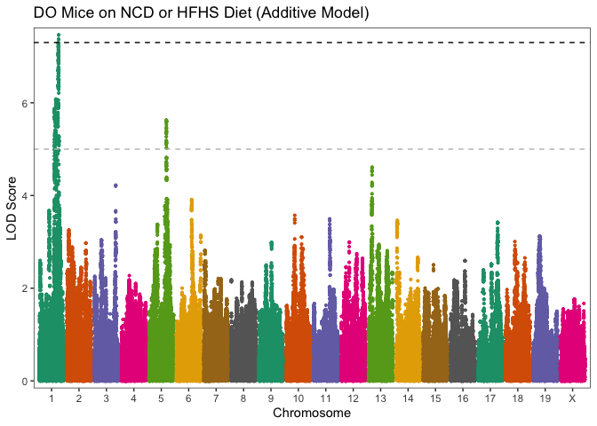
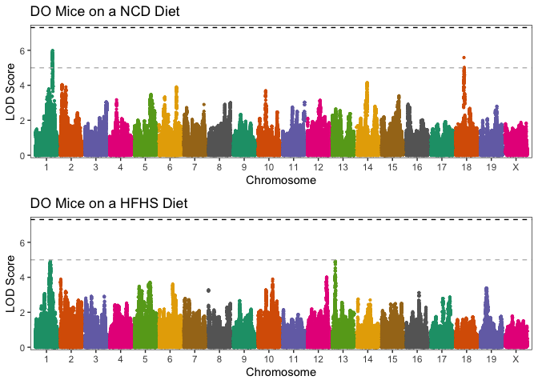
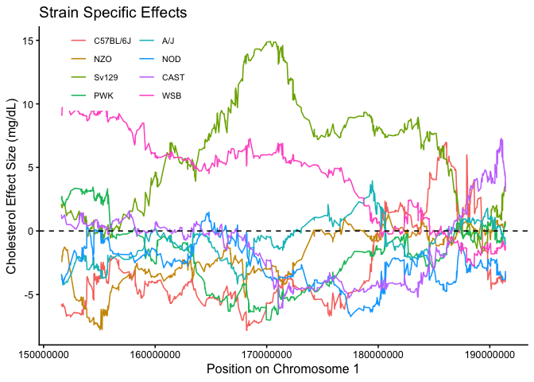
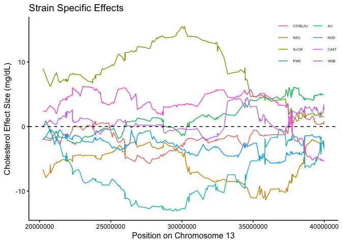
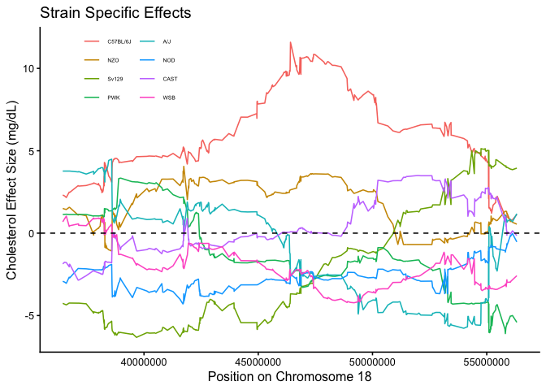

# Premise

# Results

## Diet-Stratifed GWAS Reveals Unique Loci

These data are found in `r qtl-analysis.Rmd`.

:::: {.columns}

::: {.column width="50%"}

:::

::: {.column width="50%"}

:::

::::

## Summary of Interesting QTL

After LD clumping, QTLs are assigned and analysed in `QTLs_of_interest.qmd`.

| QTL | Direction | Specificity | Notes |
|----------|----------|----------|--------| 
| 1_170324641_H_C  | Increase | Both Diets  | Several QTLs on Chr1 |
| 18_46410922_G_A  | Increase  | NCD-Specific  | |
| 13_30180778_E_C  | Increase  | HFD-Specific  | |

## 1_170324641_H_C (Not Diet Specific)

:::: {.columns}

::: {.column width="50%"}

:::

::: {.column width="50%"}

:::

::::

## 13_30180778_E_C (HFD Specific)

:::: {.columns}

::: {.column width="50%"}

:::

::: {.column width="50%"}

:::

::::

## 18_46410922_G_A (NCD Specific)

:::: {.columns}

::: {.column width="50%"}

:::

::: {.column width="50%"}

:::

::::

