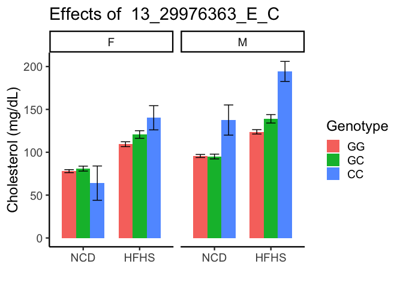
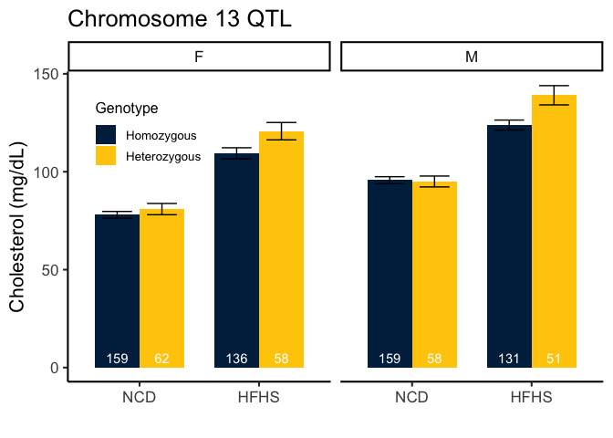
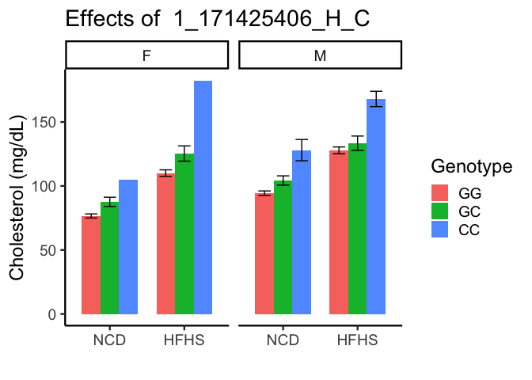
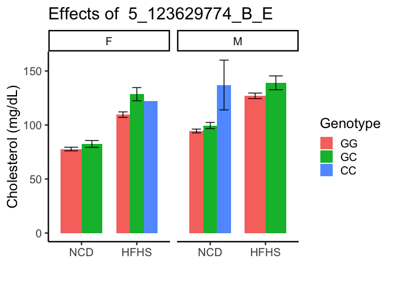
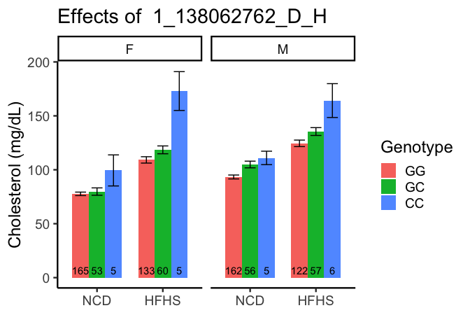

# Purpose

Used QTLs identified in **qtl_analysis.Rmd**, and create plots of their associations with cholesterol

# Experimental Details

This analyses the data from the server where the bimbam file with genotypes was filtered for SNPs of interest using this code, where **SNPs_of_interest.txt** was generated as a nonredundant list of interesting SNPs

```{snps-code}
grep -Ff SNPs_of_interest.txt Genotypes_all.bimbam > Genotypes_of_interest.bimbam
```

# Data Entry


```r
genotype.file <- 'Genotypes_of_interest.bimbam'
cholesterol.file <- 'Cholesterol_all.txt'
covariates.file <- 'Covariates.tab'

genotype.data <- read_csv(genotype.file, col_names = F) 
snps <- genotype.data %>% select(X1,X2,X3)

genotype.data.clean <-
  genotype.data %>%
  select(-X1,-X2,-X3) %>%
  mutate_all(round)

genotype.data.clean.r <-as.data.frame(t(genotype.data.clean))

cholesterol.data <- read_table(cholesterol.file, col_names = F)
covariates.data <- read_delim(covariates.file, col_names = F)

combined.data <- data.frame(Cholesterol=cholesterol.data$X1,
                            Sex=covariates.data$X2,
                            Diet=covariates.data$X3) %>%
  mutate(sex = case_when(Sex==0~"M",
                         Sex==1~"F")) %>%
  mutate(diet = case_when(Diet==1~"HFHS",
                         Diet==0~"NCD")) %>%
  select(-Sex,-Diet) %>%
  bind_cols(genotype.data.clean.r) %>%
  mutate(diet = relevel(as.factor(diet),ref="NCD"))

colnames(combined.data) <- c(colnames(combined.data)[1:3],snps$X1)
```


```r
combined.data.long <-
  combined.data %>%
  group_by(diet,sex) %>%
  pivot_longer(cols=4:89,
               names_to="SNP",
               values_to = "Count") 

summary.data <- combined.data.long %>%
  group_by(SNP,sex,diet,Count) %>%
  filter(!is.na(sex)) %>%
  summarize(Cholesterol.mean = mean(Cholesterol,na.rm=T),
            Cholesterol.se= se(Cholesterol),
            n=length(Cholesterol)) 

lm(Cholesterol ~ diet + sex, data=combined.data.long) %>% tidy %>% kable(caption="Summary statistics among all selected QTLs")
```


Table: Summary statistics among all selected QTLs

|term        | estimate| std.error| statistic| p.value|
|:-----------|--------:|---------:|---------:|-------:|
|(Intercept) |     79.1|     0.178|       444|       0|
|dietHFHS    |     33.8|     0.213|       159|       0|
|sexM        |     17.0|     0.212|        80|       0|
# Chromosome 13 QTL 

This was the QTL that was HFHS-specifically associated, we think this is *Cdkal1*.


```r
library(forcats)
qtl <- '13_29976363_E_C'
summary.data %>%
  filter(SNP==qtl) %>%  
  mutate(Genotype=fct_recode(as.factor(Count),
         "GG"='0',
         "GC"='1',
         "CC"='2')) %>%  
  ggplot(aes(y=Cholesterol.mean,
             ymin=Cholesterol.mean-Cholesterol.se,
             ymax=Cholesterol.mean+Cholesterol.se,
             fill=Genotype,
             x=diet,
             label=n)) +
  geom_bar(stat='identity',position="dodge", width=0.75) +
  geom_errorbar(position=position_dodge(width=0.75), width=0.5) +
  #geom_text(aes(y=0),position=position_dodge(width=0.75)) +
  facet_grid(.~sex) +
  labs(y="Cholesterol (mg/dL)",
       x="",
       title = paste("Effects of ",qtl),
       fill="Genotype") +
  theme_classic(base_size = 18) 
```

<!-- -->

```r
summary.data %>%
  filter(SNP==qtl) %>%  
  mutate(Genotype=fct_recode(as.factor(Count),
         "Homozygous"='0',
         "Heterozygous"='1',
         "CC"='2')) %>% 
    filter(Genotype!="CC") %>%
  ggplot(aes(y=Cholesterol.mean,
             ymin=Cholesterol.mean-Cholesterol.se,
             ymax=Cholesterol.mean+Cholesterol.se,
             fill=Genotype,
             x=diet,
             label=n)) +
  geom_bar(stat='identity',position="dodge", width=0.75) +
  geom_errorbar(position=position_dodge(width=0.75), width=0.5) +
  geom_text(aes(y=0),position=position_dodge(width=0.75), vjust = -0.5,color="white") +
  facet_grid(.~sex) +
  labs(y="Cholesterol (mg/dL)",
       x="",
       title = "Chromosome 13 QTL",
       fill="Genotype") +
  theme_classic(base_size = 16) +
  scale_fill_manual(values=color.scheme) +
  theme(legend.position=c(0.15,0.8),
        legend.text = element_text(size=10),
        legend.title = element_text(size=12))
```

<!-- -->

## Chromosome 1 QTL - Apoa2


```r
qtl <- '1_171425406_H_C'
summary.data %>%
  filter(SNP==qtl) %>%  
  mutate(Genotype=fct_recode(as.factor(Count), #not right
         "GG"='0',
         "GC"='1',
         "CC"='2')) %>%  
  ggplot(aes(y=Cholesterol.mean,
             ymin=Cholesterol.mean-Cholesterol.se,
             ymax=Cholesterol.mean+Cholesterol.se,
             fill=Genotype,
             x=diet,
             label=n)) +
  geom_bar(stat='identity',position="dodge", width=0.75) +
  geom_errorbar(position=position_dodge(width=0.75), width=0.5) +
  geom_text(aes(y=0),position=position_dodge(width=0.75), vjust = -0.5) + 
  facet_grid(.~sex) +
  labs(y="Cholesterol (mg/dL)",
       x="",
       title = paste("Effects of ",qtl),
       fill="Genotype") +
  theme_classic(base_size = 18) 
```

<!-- -->
# Chromosome 5 QTL - Scarb1


```r
qtl <- '5_123629774_B_E'
summary.data %>%
  filter(SNP==qtl) %>%  
  mutate(Genotype=fct_recode(as.factor(Count), #not right
         "GG"='0',
         "GC"='1',
         "CC"='2')) %>%  
  ggplot(aes(y=Cholesterol.mean,
             ymin=Cholesterol.mean-Cholesterol.se,
             ymax=Cholesterol.mean+Cholesterol.se,
             fill=Genotype,
             x=diet,
             label=n)) +
  geom_bar(stat='identity',position="dodge", width=0.75) +
  geom_errorbar(position=position_dodge(width=0.75), width=0.5) +
  geom_text(aes(y=0),position=position_dodge(width=0.75), vjust = -0.5) +
  facet_grid(.~sex) +
  labs(y="Cholesterol (mg/dL)",
       x="",
       title = paste("Effects of ",qtl),
       fill="Genotype") +
  theme_classic(base_size = 18) 
```

<!-- -->
# Chromosome 1a QTL - Unknown\

This was the top BSLMM hit


```r
qtl <- '1_138062762_D_H'
summary.data %>%
  filter(SNP==qtl) %>%  
  mutate(Genotype=fct_recode(as.factor(Count), #not right
         "GG"='0',
         "GC"='1',
         "CC"='2')) %>%  
  ggplot(aes(y=Cholesterol.mean,
             ymin=Cholesterol.mean-Cholesterol.se,
             ymax=Cholesterol.mean+Cholesterol.se,
             fill=Genotype,
             x=diet,
             label=n)) +
  geom_bar(stat='identity',position="dodge", width=0.75) +
  geom_errorbar(position=position_dodge(width=0.75), width=0.5) +
  geom_text(aes(y=0),position=position_dodge(width=0.75), vjust = -0.5) + 
  facet_grid(.~sex) +
  labs(y="Cholesterol (mg/dL)",
       x="",
       title = paste("Effects of ",qtl),
       fill="Genotype") +
  theme_classic(base_size = 18) 
```

<!-- -->

# Session Information


```r
sessionInfo()
```

```
## R version 4.3.3 (2024-02-29)
## Platform: x86_64-apple-darwin20 (64-bit)
## Running under: macOS Sonoma 14.3.1
## 
## Matrix products: default
## BLAS:   /Library/Frameworks/R.framework/Versions/4.3-x86_64/Resources/lib/libRblas.0.dylib 
## LAPACK: /Library/Frameworks/R.framework/Versions/4.3-x86_64/Resources/lib/libRlapack.dylib;  LAPACK version 3.11.0
## 
## locale:
## [1] en_US.UTF-8/en_US.UTF-8/en_US.UTF-8/C/en_US.UTF-8/en_US.UTF-8
## 
## time zone: America/Detroit
## tzcode source: internal
## 
## attached base packages:
## [1] stats     graphics  grDevices utils     datasets  methods   base     
## 
## other attached packages:
## [1] forcats_1.0.0 ggplot2_3.5.0 broom_1.0.5   dplyr_1.1.4   tidyr_1.3.1  
## [6] readr_2.1.5   knitr_1.45   
## 
## loaded via a namespace (and not attached):
##  [1] bit_4.0.5        gtable_0.3.4     jsonlite_1.8.8   highr_0.10      
##  [5] crayon_1.5.2     compiler_4.3.3   tidyselect_1.2.0 parallel_4.3.3  
##  [9] jquerylib_0.1.4  scales_1.3.0     yaml_2.3.8       fastmap_1.1.1   
## [13] R6_2.5.1         labeling_0.4.3   generics_0.1.3   backports_1.4.1 
## [17] tibble_3.2.1     munsell_0.5.0    bslib_0.6.1      pillar_1.9.0    
## [21] tzdb_0.4.0       rlang_1.1.3      utf8_1.2.4       cachem_1.0.8    
## [25] xfun_0.42        sass_0.4.8       bit64_4.0.5      cli_3.6.2       
## [29] withr_3.0.0      magrittr_2.0.3   digest_0.6.34    grid_4.3.3      
## [33] vroom_1.6.5      hms_1.1.3        lifecycle_1.0.4  vctrs_0.6.5     
## [37] evaluate_0.23    glue_1.7.0       farver_2.1.1     fansi_1.0.6     
## [41] colorspace_2.1-0 rmarkdown_2.26   purrr_1.0.2      tools_4.3.3     
## [45] pkgconfig_2.0.3  htmltools_0.5.7
```

