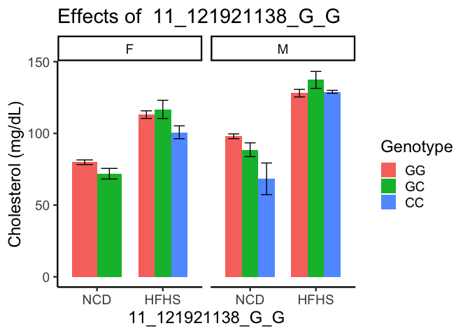

# Purpose

Used QTLs identified in **qtl_analysis.Rmd**, and create plots of their associations with cholesterol

# Experimental Details

This analyses the data from the server where the bimbam file with genotypes was filtered for SNPs of interest using this code, where **SNPs_of_interest.txt** was generated as a nonredundant list of interesting SNPs.  This file has to be generated first then this code run after.

## Identifying Interesting SNPs

Loaded in SNPs from clumped QTL data


``` r
male.clump.filename <- 'ld-calculations/Annotated Gene Clumps Male QTLs.csv'
female.clump.filename <- 'ld-calculations/Annotated Gene Clumps Female QTLs.csv'
ncd.clump.filename <- 'ld-calculations/Annotated Gene Clumps NCD QTLs.csv'
hfd.clump.filename <- 'ld-calculations/Annotated Gene Clumps HFD QTLs.csv'

library(readr)
ncd.clump.data <- read_csv(ncd.clump.filename)
hfd.clump.data <- read_csv(hfd.clump.filename)
male.clump.data <- read_csv(male.clump.filename)
female.clump.data <- read_csv(female.clump.filename)

all.clumps <- bind_rows(ncd.clump.data,
                        hfd.clump.data,
                        male.clump.data,
                        female.clump.data)
unique.snps <-
  all.clumps %>%
  distinct(SNP) %>%
  pull(SNP)

unique.snps %>% write(file="SNPs_of_interest.txt") #just the rsids
diet.snps <- bind_rows(ncd.clump.data, hfd.clump.data) %>%
  distinct(SNP) %>%
  pull(SNP)

sex.snps <- bind_rows(male.clump.data,female.clump.data) %>%
  distinct(SNP) %>%
  pull(SNP)
```

Based on tht clump data we pulled out 60 interesting lead SNPs.

```{snps-code}
grep -Ff SNPs_of_interest.txt Genotypes_all.bimbam > Genotypes_of_interest.bimbam
```

# Data Entry


``` r
genotype.file <- 'Genotypes_of_interest.bimbam'
cholesterol.file <- 'Cholesterol_all.txt'
covariates.file <- 'Covariates.tab'

genotype.data <- read_csv(genotype.file, col_names = F) 
snps <- genotype.data %>% select(X1,X2,X3)

genotype.data.clean <-
  genotype.data %>%
  select(-X1,-X2,-X3) %>%
  mutate_all(round)

genotype.data.clean.r <-as.data.frame(t(genotype.data.clean))

cholesterol.data <- read_table(cholesterol.file, col_names = F)
covariates.data <- read_delim(covariates.file, col_names = F)

combined.data <- data.frame(Cholesterol=cholesterol.data$X1,
                            Sex=covariates.data$X2,
                            Diet=covariates.data$X3) %>%
  mutate(sex = case_when(Sex==0~"M",
                         Sex==1~"F")) %>%
  mutate(diet = case_when(Diet==1~"HFHS",
                         Diet==0~"NCD")) %>%
  select(-Sex,-Diet) %>%
  bind_cols(genotype.data.clean.r) %>%
  mutate(diet = relevel(as.factor(diet),ref="NCD"))

colnames(combined.data) <- c(colnames(combined.data)[1:3],snps$X1)
```


``` r
combined.data.long <-
  combined.data %>%
  group_by(diet,sex) %>%
  pivot_longer(cols=4:ncol(combined.data), #first threre columns arer cholesterol, sex and diet
               names_to="SNP",
               values_to = "Count") 

summary.data <- combined.data.long %>%
  group_by(SNP,sex,diet,Count) %>%
  filter(!is.na(sex)) %>%
  summarize(Cholesterol.mean = mean(Cholesterol,na.rm=T),
            Cholesterol.se= se(Cholesterol),
            n=length(Cholesterol)) 
```

## QTL Barplots

This will generate a barplot for every QTL in the list


``` r
library(forcats)
for (qtl in unique.snps) {
summary.data %>%
  filter(SNP==qtl) %>%  
  mutate(Genotype=fct_recode(as.factor(Count),
         "GG"='0',
         "GC"='1',
         "CC"='2')) %>%  
  ggplot(aes(y=Cholesterol.mean,
             ymin=Cholesterol.mean-Cholesterol.se,
             ymax=Cholesterol.mean+Cholesterol.se,
             fill=Genotype,
             x=diet,
             label=n)) +
  geom_bar(stat='identity',position="dodge", width=0.75) +
  geom_errorbar(position=position_dodge(width=0.75), width=0.5) +
  #geom_text(aes(y=0),position=position_dodge(width=0.75)) +
  facet_grid(.~sex) +
  labs(y="Cholesterol (mg/dL)",
       x=qtl,
       title = paste("Effects of ",qtl),
       fill="Genotype") +
  theme_classic(base_size = 18) -> qtl.barplot
print(qtl.barplot)
ggsave(plot=qtl.barplot, filename=paste0('QTL-Barplots/',qtl,'-all.png'))
ggsave(plot=qtl.barplot, filename=paste0('QTL-Barplots/',qtl,'-all.pdf'))

summary.data %>%
  filter(SNP==qtl) %>%  
  mutate(Genotype=fct_recode(as.factor(Count),
         "Homozygous"='0',
         "Heterozygous"='1',
         "CC"='2')) %>% 
    filter(Genotype!="CC") %>%
  ggplot(aes(y=Cholesterol.mean,
             ymin=Cholesterol.mean-Cholesterol.se,
             ymax=Cholesterol.mean+Cholesterol.se,
             fill=Genotype,
             x=diet,
             label=n)) +
  geom_bar(stat='identity',position="dodge", width=0.75) +
  geom_errorbar(position=position_dodge(width=0.75), width=0.5) +
  geom_text(aes(y=0),position=position_dodge(width=0.75), vjust = -0.5,color="white") +
  facet_grid(.~sex) +
  labs(y="Cholesterol (mg/dL)",
       x="",
       title = qtl,
       fill="Genotype") +
  theme_classic(base_size = 16) +
  scale_fill_manual(values=color.scheme) +
  theme(legend.position='none',
        legend.text = element_text(size=10),
        legend.title = element_text(size=12)) ->
  qtl.barplot.2

print(qtl.barplot.2)
ggsave(plot=qtl.barplot.2, filename=paste0('QTL-Barplots/',qtl,'-hets.png'))
ggsave(plot=qtl.barplot.2, filename=paste0('QTL-Barplots/',qtl,'-hets.pdf'))
}
```

<!-- --><!-- --><!-- --><!-- --><!-- --><!-- --><!-- --><!-- --><!-- --><!-- --><!-- --><!-- --><!-- --><!-- --><!-- --><!-- --><!-- --><!-- --><!-- --><!-- --><!-- --><!-- --><!-- --><!-- --><!-- --><!-- --><!-- --><!-- --><!-- --><!-- --><!-- --><!-- --><!-- --><!-- --><!-- --><!-- --><!-- --><!-- --><!-- --><!-- --><!-- --><!-- --><!-- --><!-- --><!-- --><!-- --><!-- --><!-- --><!-- --><!-- --><!-- --><!-- --><!-- --><!-- --><!-- --><!-- --><!-- --><!-- --><!-- --><!-- --><!-- --><!-- --><!-- --><!-- --><!-- --><!-- --><!-- --><!-- --><!-- --><!-- --><!-- --><!-- --><!-- --><!-- --><!-- --><!-- --><!-- --><!-- --><!-- --><!-- --><!-- --><!-- --><!-- --><!-- --><!-- --><!-- --><!-- --><!-- --><!-- --><!-- --><!-- --><!-- --><!-- --><!-- --><!-- --><!-- --><!-- --><!-- --><!-- --><!-- --><!-- --><!-- --><!-- --><!-- --><!-- --><!-- --><!-- --><!-- --><!-- --><!-- --><!-- --><!-- --><!-- --><!-- --><!-- --><!-- --><!-- --><!-- --><!-- --><!-- -->

## Statistics

This analysis performs the statistics, using simple linear models adjusting for sex, diet and testing for interactions between them and the genotype.  This is differrent from the p-values from the GEMMA analyses, since it dos not account for genetic similarity outside the QTL

### Diet-Stratified SNPS


``` r
lm.data <- data.frame()
for (qtl in diet.snps) {
formula.no.int <- eval(bquote(Cholesterol ~ sex + diet + .(as.name(qtl))))
lm.no.int <- lm(formula.no.int,data=combined.data) %>% tidy %>%
  select(term,estimate,std.error,p.value) %>%
  slice(4)

formula.ncd <- eval(bquote(Cholesterol ~ sex + .(as.name(qtl))))
lm.ncd <- lm(formula.ncd,data=combined.data %>% filter(diet=='NCD')) %>% tidy %>%
  select(term,estimate,std.error,p.value) %>%
  slice(3)

formula.hfd <- eval(bquote(Cholesterol ~ sex + .(as.name(qtl))))
lm.hfd<- lm(formula.hfd,data=combined.data %>% filter(diet=='HFHS')) %>% tidy %>%
  select(term,estimate,std.error,p.value) %>%
  slice(3)
diet.data <- left_join(lm.hfd,lm.ncd,by="term",
                      suffix=c("_hfd","_ncd"))


qtl.data <- left_join(diet.data,lm.no.int,by="term",
                      suffix=c("","_all"))

lm.data <- bind_rows(lm.data,qtl.data)
}
```

## Summary of SNP-Level Analyses For Diet


``` r
kable(lm.data %>% 
        mutate(diet.difference=estimate_hfd-estimate_ncd) %>%
        arrange(-abs(diet.difference)) %>% 
        select(-starts_with('std.error')),
      caption="Simple linear models, both diet and sex adjusted and stratified by diet (while adjusting for sex)")
```


Table: Simple linear models, both diet and sex adjusted and stratified by diet (while adjusting for sex)

|term               | estimate_hfd| p.value_hfd| estimate_ncd| p.value_ncd| estimate| p.value| diet.difference|
|:------------------|------------:|-----------:|------------:|-----------:|--------:|-------:|---------------:|
|`2_46253198_H_E`   |      -16.383|       0.000|        1.097|       0.709|    -6.92|   0.009|          -17.48|
|`10_57753923_G_C`  |       16.085|       0.000|       -0.745|       0.786|     7.11|   0.004|           16.83|
|`6_126771534_D_E`  |       -5.142|       0.201|       11.688|       0.000|     2.09|   0.416|          -16.83|
|`12_108748974_D_C` |       14.697|       0.000|       -1.765|       0.484|     6.48|   0.003|           16.46|
|`2_7501966_H_E`    |      -13.611|       0.000|        2.659|       0.302|    -5.75|   0.009|          -16.27|
|`14_64610241_H_F`  |       -5.218|       0.183|       10.932|       0.000|     3.24|   0.157|          -16.15|
|`8_3410751_H_C`    |      -14.265|       0.001|       -0.174|       0.952|    -7.08|   0.005|          -14.09|
|`5_40272493_E_A`   |      -15.440|       0.000|       -1.685|       0.527|    -8.04|   0.001|          -13.76|
|`5_133357791_C_F`  |       -3.933|       0.340|        9.541|       0.000|     2.98|   0.219|          -13.47|
|`1_117784609_B_C`  |       -3.846|       0.329|        9.600|       0.000|     3.50|   0.119|          -13.45|
|`10_99490238_H_D`  |      -13.022|       0.000|       -0.140|       0.941|    -5.90|   0.001|          -12.88|
|`15_94566593_F_G`  |       -0.858|       0.857|       11.721|       0.000|     5.61|   0.046|          -12.58|
|`11_121921138_G_G` |        2.811|       0.500|       -9.720|       0.001|    -3.33|   0.185|           12.53|
|`2_43690499_H_G`   |       -2.884|       0.433|        9.589|       0.000|     3.73|   0.080|          -12.47|
|`14_58887010_F_F`  |       -3.503|       0.347|        8.841|       0.000|     2.94|   0.178|          -12.34|
|`1_135664277_D_C`  |       -2.859|       0.497|        9.480|       0.000|     4.03|   0.088|          -12.34|
|`13_30180778_E_C`  |       15.800|       0.000|        3.833|       0.083|     9.51|   0.000|           11.97|
|`19_25487123_G_G`  |       13.200|       0.000|        1.648|       0.501|     7.09|   0.001|           11.55|
|`6_107008934_D_A`  |      -13.747|       0.001|       -2.270|       0.414|    -7.53|   0.002|          -11.48|
|`18_46410922_G_A`  |       -0.397|       0.911|       10.569|       0.000|     5.58|   0.005|          -10.96|
|`3_156886929_F_B`  |       -3.308|       0.403|        7.485|       0.003|     2.44|   0.288|          -10.79|
|`2_49650224_G_G`   |       -1.554|       0.637|        8.847|       0.000|     3.87|   0.045|          -10.40|
|`5_117508066_B_E`  |       13.058|       0.000|        2.843|       0.179|     7.37|   0.000|           10.22|
|`5_55215630_E_A`   |      -15.028|       0.000|       -5.060|       0.074|   -10.02|   0.000|           -9.97|
|`6_42232037_G_G`   |        0.039|       0.992|       -8.976|       0.000|    -4.86|   0.027|            9.02|
|`10_95418856_F_E`  |       11.484|       0.002|        2.578|       0.339|     7.29|   0.001|            8.90|
|`12_84203316_H_C`  |        1.668|       0.592|       -7.123|       0.000|    -3.03|   0.085|            8.79|
|`16_63647011_B_B`  |       -9.860|       0.004|       -1.083|       0.612|    -5.04|   0.009|           -8.78|
|`1_145155626_A_H`  |       14.510|       0.000|        6.436|       0.003|    10.24|   0.000|            8.07|
|`1_83629456_F_B`   |      -11.615|       0.001|       -3.552|       0.075|    -6.78|   0.000|           -8.06|
|`1_155454177_H_H`  |       14.351|       0.000|        6.475|       0.001|    10.06|   0.000|            7.88|
|`5_123629774_B_E`  |       15.086|       0.000|        7.482|       0.002|    10.65|   0.000|            7.60|
|`5_126387851_E_H`  |      -12.662|       0.000|       -5.069|       0.016|    -8.57|   0.000|           -7.59|
|`1_159426890_H_H`  |       12.147|       0.000|        4.701|       0.013|     7.80|   0.000|            7.45|
|`5_122944168_B_E`  |       14.323|       0.001|        7.253|       0.003|    10.25|   0.000|            7.07|
|`1_137999848_D_H`  |       14.019|       0.000|        7.624|       0.000|    10.80|   0.000|            6.39|
|`4_54753377_C_G`   |        3.417|       0.397|        9.507|       0.000|     6.93|   0.002|           -6.09|
|`2_16663582_H_G`   |        5.635|       0.185|       11.434|       0.000|     9.06|   0.000|           -5.80|
|`5_128399127_D_E`  |        3.252|       0.395|        8.352|       0.000|     6.06|   0.005|           -5.10|
|`10_55538600_H_B`  |       -7.364|       0.077|      -12.288|       0.000|    -9.54|   0.000|            4.92|
|`1_152428168_H_A`  |       -5.416|       0.122|       -9.630|       0.000|    -7.66|   0.000|            4.21|
|`1_136644599_C_A`  |       -7.239|       0.039|      -11.176|       0.000|    -9.34|   0.000|            3.94|
|`1_183576795_H_C`  |        5.739|       0.141|        8.228|       0.001|     6.99|   0.002|           -2.49|
|`1_171425406_H_C`  |       13.177|       0.001|       11.584|       0.000|    12.33|   0.000|            1.59|
|`1_170324641_H_C`  |       12.364|       0.005|       13.652|       0.000|    13.05|   0.000|           -1.29|

``` r
library(ggrepel)
ggplot(lm.data,
       aes(y=estimate_hfd,
           ymin=estimate_hfd-std.error_hfd,
           ymax=estimate_hfd+std.error_hfd,
           x=estimate_ncd,
           xmin=estimate_ncd-std.error_ncd,
           xmax=estimate_ncd+std.error_ncd,)) +
  geom_point() +
  geom_errorbar(alpha=0.2) +
  geom_errorbarh(alpha=0.2) +
  labs(y="HFD Estimate (mg/dL)",
       x="NCD Estimate (mg/dL)",
       title="Estimates for Lead SNPs on Cholesterol") +
  theme_classic(base_size=16) +
  geom_vline(lty=2,xintercept=0) +
  geom_hline(lty=2,yintercept=0)
```

<!-- -->

### Sex-Stratified SNPS


``` r
lm.data.sex <- data.frame()

for (qtl in sex.snps) {
formula.no.int <- eval(bquote(Cholesterol ~ sex + diet + .(as.name(qtl))))
lm.no.int <- lm(formula.no.int,data=combined.data) %>% tidy %>%
  select(term,estimate,std.error,p.value) %>%
  slice(4)

formula.f <- eval(bquote(Cholesterol ~ diet + .(as.name(qtl))))
lm.f <- lm(formula.f,data=combined.data %>% filter(sex=='F')) %>% tidy %>%
  select(term,estimate,std.error,p.value) %>%
  slice(3)

formula.m <- eval(bquote(Cholesterol ~ diet + .(as.name(qtl))))
lm.m<- lm(formula.m,data=combined.data %>% filter(sex=='M')) %>% tidy %>%
  select(term,estimate,std.error,p.value) %>%
  slice(3)
sex.data <- left_join(lm.f,lm.m,by="term",
                      suffix=c("_f","_m"))


qtl.data <- left_join(sex.data,lm.no.int,by="term",
                      suffix=c("","_all"))

lm.data.sex <- bind_rows(lm.data.sex,qtl.data)
}
```

## Summary of SNP-Level Analyses For Sex


``` r
kable(lm.data.sex %>%
        mutate(sex.difference=estimate_m-estimate_f) %>% 
        arrange(-abs(sex.difference)) %>% select(-starts_with('std.error')),
      caption="Simple linear models, both diet and sex adjusted and stratified by diet (while adjusting for sex)")
```


Table: Simple linear models, both diet and sex adjusted and stratified by diet (while adjusting for sex)

|term               | estimate_f| p.value_f| estimate_m| p.value_m| estimate| p.value| sex.difference|
|:------------------|----------:|---------:|----------:|---------:|--------:|-------:|--------------:|
|`15_94566593_F_G`  |     -4.298|     0.298|     14.244|     0.000|     5.61|   0.046|         18.542|
|`2_44256608_H_G`   |      7.992|     0.007|     -0.375|     0.897|     3.79|   0.065|         -8.367|
|`1_152428168_H_A`  |     -3.950|     0.155|    -11.965|     0.000|    -7.66|   0.000|         -8.014|
|`1_136593782_C_A`  |     -5.267|     0.066|    -13.212|     0.000|    -9.18|   0.000|         -7.945|
|`10_55538600_H_B`  |     -5.778|     0.117|    -13.413|     0.000|    -9.54|   0.000|         -7.635|
|`1_136644599_C_A`  |     -5.604|     0.049|    -13.212|     0.000|    -9.34|   0.000|         -7.608|
|`1_183576795_H_C`  |     10.772|     0.001|      3.205|     0.324|     6.99|   0.002|         -7.567|
|`1_135664277_D_C`  |      7.563|     0.021|      0.179|     0.958|     4.03|   0.088|         -7.384|
|`1_170324641_H_C`  |     16.849|     0.000|      9.591|     0.006|    13.05|   0.000|         -7.258|
|`2_43690499_H_G`   |      7.197|     0.018|      0.206|     0.945|     3.73|   0.080|         -6.990|
|`14_64318374_H_F`  |      0.440|     0.888|      5.585|     0.096|     2.86|   0.209|          5.145|
|`5_133357791_C_F`  |      0.458|     0.894|      5.586|     0.102|     2.98|   0.219|          5.128|
|`14_64610241_H_F`  |      1.080|     0.727|      5.793|     0.090|     3.24|   0.157|          4.714|
|`1_117784609_B_C`  |      5.694|     0.068|      1.072|     0.741|     3.50|   0.119|         -4.622|
|`12_84203316_H_C`  |     -5.078|     0.041|     -1.107|     0.662|    -3.03|   0.085|          3.971|
|`1_117367881_B_C`  |      5.712|     0.072|      1.993|     0.533|     3.91|   0.082|         -3.719|
|`14_105825620_G_H` |      5.184|     0.109|      1.473|     0.648|     3.38|   0.139|         -3.711|
|`2_49650224_G_G`   |      5.350|     0.051|      2.306|     0.397|     3.87|   0.045|         -3.044|
|`3_158368229_C_D`  |     -4.431|     0.077|     -1.490|     0.578|    -3.08|   0.092|          2.942|
|`14_58887010_F_F`  |      1.752|     0.570|      4.087|     0.188|     2.94|   0.178|          2.336|
|`14_58928537_F_F`  |      1.752|     0.570|      4.087|     0.188|     2.94|   0.178|          2.336|
|`3_159975288_F_B`  |      1.373|     0.655|      3.615|     0.266|     2.47|   0.267|          2.242|
|`4_54753377_C_G`   |      5.862|     0.066|      7.902|     0.011|     6.93|   0.002|          2.040|
|`18_46410922_G_A`  |      6.495|     0.018|      4.519|     0.125|     5.58|   0.005|         -1.976|
|`3_156886929_F_B`  |      1.503|     0.634|      3.442|     0.304|     2.44|   0.288|          1.939|
|`5_128374074_D_E`  |      5.714|     0.063|      7.534|     0.015|     6.63|   0.002|          1.820|
|`8_110706632_H_G`  |      5.506|     0.085|      7.193|     0.016|     6.41|   0.003|          1.687|
|`2_16145267_H_G`   |      7.801|     0.020|      9.426|     0.003|     8.68|   0.000|          1.625|
|`1_107745435_E_C`  |      3.333|     0.312|      1.799|     0.586|     2.62|   0.260|         -1.533|
|`2_16663582_H_G`   |      8.348|     0.012|      9.673|     0.003|     9.06|   0.000|          1.324|
|`5_122944168_B_E`  |     10.735|     0.001|      9.775|     0.002|    10.25|   0.000|         -0.959|
|`11_121921138_G_G` |     -3.737|     0.286|     -2.907|     0.422|    -3.33|   0.185|          0.831|
|`5_143920616_B_A`  |      4.859|     0.103|      4.042|     0.196|     4.51|   0.036|         -0.817|
|`5_128399127_D_E`  |      5.702|     0.065|      6.371|     0.037|     6.06|   0.005|          0.670|
|`7_138782782_C_H`  |      3.272|     0.304|      3.890|     0.239|     3.61|   0.114|          0.617|
|`6_126771534_D_E`  |      2.328|     0.519|      1.860|     0.611|     2.09|   0.416|         -0.469|
|`6_127083191_C_E`  |      2.328|     0.519|      2.057|     0.579|     2.19|   0.397|         -0.272|
|`6_42232037_G_G`   |     -4.854|     0.119|     -4.911|     0.116|    -4.86|   0.027|         -0.057|

``` r
library(ggrepel)
ggplot(lm.data.sex,
       aes(y=estimate_f,
           ymin=estimate_f-std.error_f,
           ymax=estimate_f+std.error_f,
           x=estimate_m,
           xmin=estimate_m-std.error_m,
           xmax=estimate_m+std.error_m,)) +
  geom_point() +
  geom_errorbar(alpha=0.2) +
  geom_errorbarh(alpha=0.2) +
  labs(y="Female Estimate (mg/dL)",
       x="Male Estimate (mg/dL)",
       title="Estimates for Lead SNPs on Cholesterol") +
  theme_classic(base_size=16) +
  geom_vline(lty=2,xintercept=0) +
  geom_hline(lty=2,yintercept=0)
```

<!-- -->

# Session Information


``` r
sessionInfo()
```

```
## R version 4.4.2 (2024-10-31)
## Platform: x86_64-apple-darwin20
## Running under: macOS Monterey 12.7.6
## 
## Matrix products: default
## BLAS:   /Library/Frameworks/R.framework/Versions/4.4-x86_64/Resources/lib/libRblas.0.dylib 
## LAPACK: /Library/Frameworks/R.framework/Versions/4.4-x86_64/Resources/lib/libRlapack.dylib;  LAPACK version 3.12.0
## 
## locale:
## [1] en_US.UTF-8/en_US.UTF-8/en_US.UTF-8/C/en_US.UTF-8/en_US.UTF-8
## 
## time zone: America/Detroit
## tzcode source: internal
## 
## attached base packages:
## [1] stats     graphics  grDevices utils     datasets  methods   base     
## 
## other attached packages:
## [1] ggrepel_0.9.6 forcats_1.0.0 ggplot2_3.5.1 broom_1.0.7   dplyr_1.1.4  
## [6] tidyr_1.3.1   readr_2.1.5   knitr_1.49   
## 
## loaded via a namespace (and not attached):
##  [1] bit_4.5.0.1       gtable_0.3.6      jsonlite_1.8.9    crayon_1.5.3     
##  [5] compiler_4.4.2    Rcpp_1.0.14       tidyselect_1.2.1  parallel_4.4.2   
##  [9] jquerylib_0.1.4   textshaping_0.4.1 systemfonts_1.1.0 scales_1.3.0     
## [13] yaml_2.3.10       fastmap_1.2.0     R6_2.5.1          labeling_0.4.3   
## [17] generics_0.1.3    backports_1.5.0   tibble_3.2.1      munsell_0.5.1    
## [21] bslib_0.8.0       pillar_1.10.1     tzdb_0.4.0        rlang_1.1.4      
## [25] cachem_1.1.0      xfun_0.50         sass_0.4.9        bit64_4.5.2      
## [29] cli_3.6.3         withr_3.0.2       magrittr_2.0.3    digest_0.6.37    
## [33] grid_4.4.2        vroom_1.6.5       rstudioapi_0.17.1 hms_1.1.3        
## [37] lifecycle_1.0.4   vctrs_0.6.5       evaluate_1.0.3    glue_1.8.0       
## [41] farver_2.1.2      ragg_1.3.3        colorspace_2.1-1  rmarkdown_2.29   
## [45] purrr_1.0.2       tools_4.4.2       pkgconfig_2.0.3   htmltools_0.5.8.1
```

